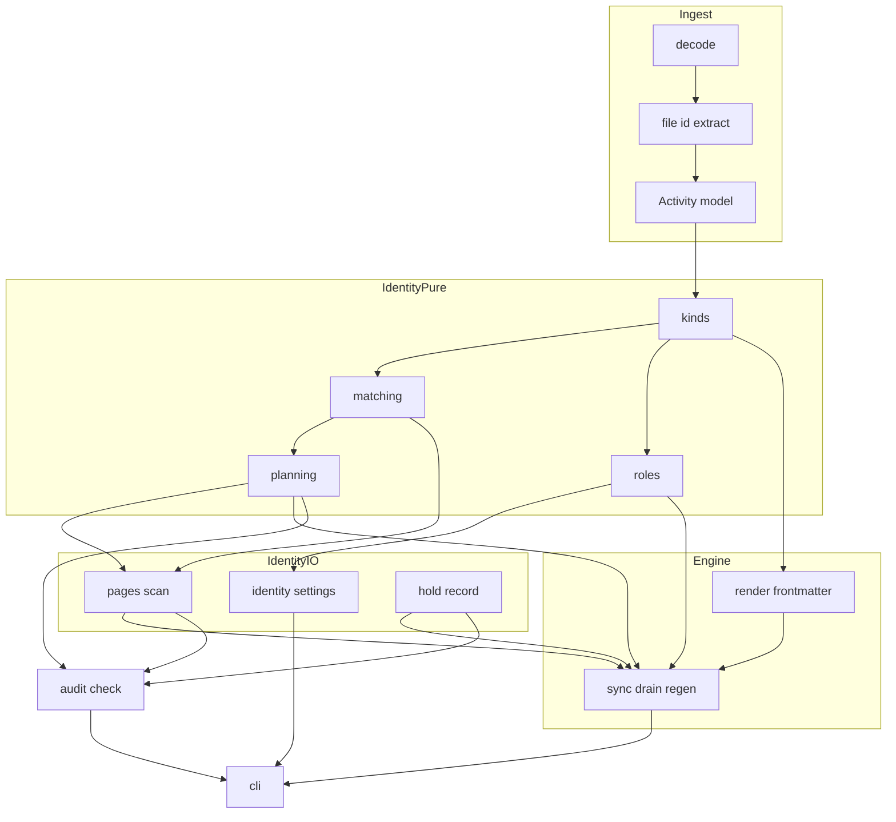
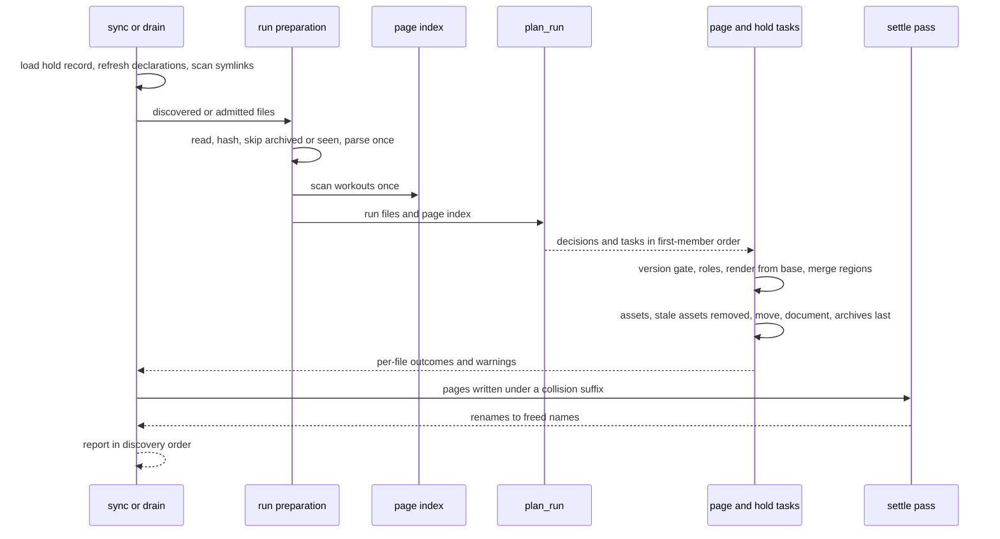
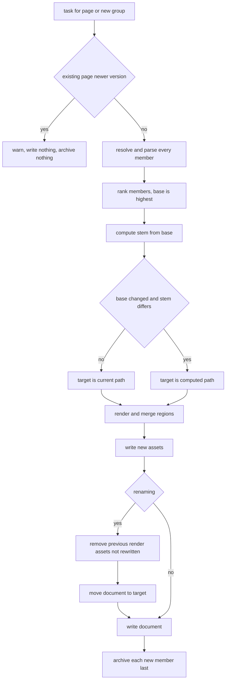
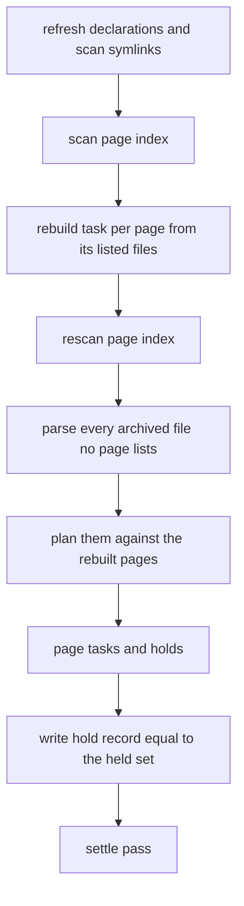

# Technical Design: activity-identity

## Overview

**Purpose**: `activity-identity` makes one training session one page, whatever
files of it arrive. It reads the identity every `.fit` file declares, derives
what produced each file, recognizes a file as the same session as an existing
page by a stated rule calibrated on measured pairs, refuses to guess when the
evidence is not unique, and records each page's files with a role -- one base
the page is rendered from, and extras -- chosen by a configurable source
precedence. When a better file arrives the page is re-rendered from it, renamed
to the name the new base computes, and cleared of its previous chart assets,
in an order an interrupted run cannot turn into two pages or orphaned files.

**Users**: the athlete (and the LLM curating their wiki) who ingests the same
session from several places -- a HealthFit export, a Garmin export, a
connector download -- and expects one page per workout; `fitdocs check` users
who need to see what fitdocs could not decide; the `channel-merge` spec, which
composes the extras this spec records.

**Impact**: today a page is found only by exact bytes or a HealthFit session
UUID (`src/fitdocs/sync.py:236-291`), a page renders from whichever file
arrived last (`sync.py:1255-1259`), a matched page keeps a stale filename while
its assets are renamed (`sync.py:1269-1273`), and `find_document` re-reads every
page for every incoming file. After this spec, the engine plans each run once
over a one-scan page index, joins files of a known session by evidence, holds
ambiguous files, renders every page from its highest-ranked file with its
sources in a canonical order, and renames a page whose base changes.

### Goals
- A file of a session already on a page joins that page; a file whose page is
  not certain is archived, held, reported and never merged (Req 3, 4).
- A page's content, filename and assets are a function of its set of files
  (Req 5.7).
- A base change re-renders, renames and cleans up without a hand edit, and a
  phone-side copy's session UUID survives it (Req 5.5, 6).
- `check` reports held, orphaned and duplicated sources without reading a
  `.fit` file (Req 8).
- Every tolerance is a stated constant with its measured source, and every rule
  owes a named mutation (brief Constraints; `change-protocol.md` § Fixture
  Discrimination).

### Non-Goals
- Composing channels from extras, or recording which file each channel came
  from (`channel-merge`).
- Fetching files, the connector ledger, credentials (`connectors`,
  `intervals-connector`).
- Resolving a Garmin product code to a model name, "Garmin <model>"
  attribution (`intervals-connector`).
- Merging two existing pages, or un-joining a file from a page.
- An interactive "which page is this?" prompt, or an explicit adopt command
  (the promoted queue item's option (b), not built).
- Rewriting the athlete's wiki links or plan-source overrides after a rename.
- Cleaning up chart assets orphaned by a timezone change on a page that is not
  renamed (today's behaviour, unchanged; see Follow-ups in the spec report).

## Boundary Commitments

### This Spec Owns
- **File identity at ingest**: the `FileIdentity` value (manufacturer, product
  code, serial number, creation time) on `Activity`, the
  undocumented-message count on `Provenance`, and their decoding.
- **Source kinds**: the closed vocabulary `original` / `phone_copy` /
  `unknown`, its derivation from a file's bytes, and the recognized phone-side
  writer marker (HealthFit: manufacturer `development` plus the `SESSION UUID`
  session developer field).
- **Source precedence**: the `[identity]` table of `fitdocs.toml`, its
  `precedence` key, the default order -- Garmin originals, then the HealthFit
  phone copy, then every other original (a Stryd file), then unknown files
  (**maintainer decision 2026-09-29**) -- validation, and the total rank order
  of Req 2.8.
- **The match rule**: the evidence tiers `DEVICE`, `STRICT`, `SHIFTED`, their
  tolerance constants and measured sources, and the absent-value rules.
- **Run planning**: the one-scan page index, grouping of a run's files,
  one-to-one claims, held (ambiguous) files, and the hold record
  `.fitdocs/held.toml`.
- **Roles on the page**: the canonical ascending-rank order of `sources` (base
  last), the base-identity managed keys (`source_kind`, `source_elapsed_s`,
  `source_distance_m`, `source_device`), and session-UUID retention.
- **Page lifecycle on a base change**: re-render from the base, rename, removal
  of the previous render's assets, the crash-healing write order, and the
  end-of-run settle pass for collision-suffixed names.
- **Regeneration of roles** from the archive, including re-evaluation of held
  and unreferenced archived files.
- **Three `check` findings**: `ambiguous_source`, `orphaned_source`,
  `duplicate_session`.
- **The published statements** for all of the above: the ownership contract,
  the configuration and compatibility pages, the upgrade note, the inbox
  note, the CHANGELOG entry, two declaration sentences, and -- if the
  connectors page is on `main` at landing -- the replacement of its
  duplicate-page cautions.
- **Amendment records**: fit-ingest (the `file_id` fields), wiki-contract
  Amendment 4's source-roles part and version advance, a workout-docs note
  on Req 3.4/3.6, and `identity` on `structure.md`'s dependency line.

### Out of Boundary
- Channel composition, lag estimation, donation rules, and any per-channel
  provenance key (`channel-merge`). This spec renders a page from its base
  alone (Req 5.8) and exposes the seam channel-merge replaces.
- Record-level developer fields, running-dynamics channels and Stryd-file
  quirk handling (`running-dynamics`).
- The connector protocol, ledger, credential store, pull command and the
  connectors' ownership-contract statements (`connectors`) -- except, when
  `connectors` is on `main` at landing, the `[identity]` wiring of
  `fitdocs pull --sync` (a required keyword-only `precedence` on
  `_run_drain_passes` and two preflight checks; controller ruling R3,
  CliIdentityWiring).
- Product-name resolution and attribution (`intervals-connector`).
- Any network access. The identity package opens no socket and imports no
  network module.
- The training-load, performance, history and plan passes: they keep reading
  "the current source" as the last `sources` entry and pages as they are; a
  renamed or re-based page is rescored by the chained load pass like any
  rewritten page.

### Allowed Dependencies
- `fitdocs.model`, `fitdocs.contract` (pure leaf) from every identity module.
- `fitdocs.docio`, `fitdocs.layout` only from the identity modules that touch
  the filesystem (`identity/pages.py`, `identity/holds.py`).
- `fitdocs.settings` (`SettingsError`) from `identity/settings.py`.
- `tomllib` (stdlib) and `tomli_w` (already a runtime dependency, used by
  `quarantine.py`) from `identity/holds.py`. No new runtime dependency.
- **Naming guards** (`tests/test_contract_consumers.py`): no module under
  `src/fitdocs` other than `contract.py` names `uuid` as an identifier (the
  single-implementation guard at `:502-529` treats any `ast.Name` `uuid` --
  a dataclass field, a local, an import -- as a second UUID formatter), so
  every field and local here is `session_uuid`, `page_uuid` or similar; and
  no registered contract consumer (`identity.kinds`, `identity.pages`, and the
  already-registered `sync`, `audit`, `render.frontmatter`, `layout`)
  defines a name in `FORBIDDEN_LOCAL_NAMES` (`:149-163`, e.g.
  `_session_uuid`, `_sources`).
- The engine (`sync.py`), audit (`audit.py`), CLI (`cli.py`) and render
  (`render/__init__.py`, `render/frontmatter.py`) import the identity package;
  the identity package imports none of them, nor `ingest`, `metrics`, `load`,
  `history`, `plans`, `tiles`, `inbox`. `layout` does not import the identity
  package (it binds `SESSION_UUID_FIELD` from `contract`, controller ruling
  R16), so `identity.pages`/`identity.holds` → `layout` has no back-edge.
  Which modules import the identity
  package is deliberately **not** fenced: `channel-merge`'s `compose.*` and
  `render/provenance.py` import `identity.kinds` and `identity.matching`, so
  the boundary guard pins only what the package itself imports.
- Dependency direction: `model` → `contract` → `identity.{kinds, matching,
  roles, planning}` → `identity.{pages, settings, holds}` → `render` →
  `sync`/`audit` → `cli`. An import against this direction is a defect.

### Revalidation Triggers
- A change to `SessionKey`, `pair_evidence`'s tiers or any tolerance constant:
  re-run the match-rule mutation suite and re-check `docs/ownership-contract.md`'s
  tolerance table. A change to the name, value or type of
  `START_TOLERANCE_S`, `SHIFT_STEP_S` or `SHIFT_MAX_HOURS`, or to
  `SourceKind`/`source_kind`: `channel-merge` (which imports them) revalidates.
- A change to the source-kind vocabulary or the rank key: `channel-merge`
  (donation order is `PageRoles.extras`) and `intervals-connector` (partner
  copies rank by Req 2.8) revalidate.
- A change to `sources` ordering or to "the base is the last entry": the load
  pass (`load/engine.py:639-642`), the performance pass
  (`performance/engine.py:284-287`) and regeneration revalidate.
- A change to the `_render_activity` seam or to `DocContext.identity`:
  `channel-merge` revalidates.
- A new chart asset kind: nothing to register -- rename cleanup follows the
  previous document's own links.
- A change to `SessionSummary.total_elapsed_time_s`, `total_distance_m` or the
  start-time anchor for any file shape (including Stryd quirk handling): the
  calibration of Req 3.3/3.4 is re-measured.

### Cross-spec seams

Each item states the exact shape this spec assumes of a sibling written in
parallel. A cross-spec reviewer reconciles all five.

**running-dynamics (wave 1)**
- Both specs append fields to `Activity` in `src/fitdocs/model.py`; this spec
  appends exactly one, `file_identity: FileIdentity` (default all-`None`), and
  one to `Provenance`, `undocumented_messages: int | None = None`. Both are
  appended after every existing field with a default, so neither spec's
  constructors or hand-built test activities change. Whichever lands second
  regenerates `tests/golden/*.json` (the serializer walks every field).
- This spec reads `Activity.start_time`, `SessionSummary.total_elapsed_time_s`
  and `SessionSummary.total_distance_m` as **recorded values**. It assumes
  running-dynamics' Stryd-quirk handling (a session timestamp that is not the
  end, a wrong lap count, no session HR summary) adds derived values beside
  these fields and never rewrites them. If running-dynamics must rewrite one,
  the Stryd↔HealthFit calibration (elapsed 8–9 s apart) is re-measured before
  it lands.
- A Stryd file (`file_id.manufacturer == "stryd"`) classifies `original` and,
  under the default precedence, ranks below a HealthFit copy of the same run
  (maintainer decision 2026-09-29): a Stryd file is a page's base only when no
  HealthFit copy or Garmin original of the session is on the page, which is
  the "Stryd file as a page's only file" case running-dynamics makes safe.
- The run-page chart running-dynamics adds needs no registration here: rename
  cleanup removes whatever chart links the previous generated content held.
- Each spec advances `DOC_VERSION` by one from the value on `main` when it
  lands; the second lander re-pins. Shared second-lander re-pin sites:
  `tests/test_cli_check.py:196, 198` and `tests/render/test_frontmatter.py:44,
  101` (this spec rewrites the check literal as
  `f"doc_version: {DOC_VERSION}"`), `tests/metrics/test_sources.py:2270`, and
  running-dynamics' recorded `_PRE_RUNNING_DYNAMICS_DOC_VERSION` constant,
  which stays at the value running-dynamics recorded.
- `tests/fixtures/builder.py`'s `_file_id` and `_device_info` are a shared
  fixture seam: running-dynamics' task 1.2 gives `_file_id` keyword-only,
  defaulted `manufacturer`, `product` and `time_created` parameters, and
  `_device_info(serial, product_name, *, manufacturer="garmin")` its
  keyword-only `manufacturer` (ruling R12). This spec needs exactly those
  shapes (plus a keyword-only `time_created` on
  `_encode_run_with_developer_fields`); whichever spec lands first adds the
  parameters, the other reuses them, and every default equals today's value
  so no existing fixture's bytes move. This spec's `stryd_file` species
  passes `manufacturer="stryd"` to both `_file_id` and `_device_info`, so its
  device list is realistic if it ever reaches a golden or an attribution
  test.
- Public surface (controller ruling R11, "documented means public"): this
  spec lists `FileIdentity` and running-dynamics lists `DeveloperChannel` in
  `docs/plugins.md`'s public import surface list, `src/fitdocs/__init__.py`'s
  lazy exports and `__all__`, and `tests/test_public_api.py`'s `_EXPECTED`;
  each appends its own name and the second lander keeps both.
- Both specs edit `src/fitdocs/ingest/__init__.py` (`parse_fit` wiring and
  its docstring): each appends its own keyword arguments to the `Activity`
  construction and its own docstring sentence, never rewriting the other's.

**connectors (wave 1)**
- No code dependency either way. Source kind is never derived from the
  ledger or from the connector that delivered a file (Req 2.1); a connector's
  delivery is an ordinary drain candidate and reaches this spec's planner.
- Both specs add a `fitdocs.toml` table (`[identity]` here) and a file under
  `.fitdocs/` (`held.toml` here; the ledger there). The ownership contract's
  `.fitdocs/` bullet names each file without an exhaustive "only"/count
  claim.
- Settings-table count (controller ruling R4, as amended in round 2): each
  spec appends its table to `SETTINGS_TABLE_LITERALS`. If this spec lands
  first, it renames `test_settings_schema_subsection_names_all_six_tables`
  (`tests/test_compatibility_policy.py:270`) to
  `test_settings_schema_subsection_names_every_table` and makes its messages
  and comments count-free; counts stay only in docs prose
  (`docs/configuration.md:51`, "carries six tables today" on `main` at
  a5792f2, and `docs/compatibility.md:24, 64`), each advanced by one from
  `main` by each lander. If connectors landed first, this spec keeps the
  new name and advances only the three docs counts. This spec also adds the
  `[identity]` row to `docs/configuration.md`'s table of tables (`:53-60`);
  its count-equals-rows pin (`tests/identity/test_settings_docs.py`) guards
  configuration.md's count.
- wiki-contract Amendment 4 is shared (roadmap Phase 8, Existing Spec Updates;
  controller ruling R6): whichever of this spec, connectors and channel-merge
  lands first creates, in `.kiro/specs/wiki-contract/requirements.md`,
  `## Amendment 4 (<first landing date>): source roles, connector state and
  channel provenance, landed by activity-identity, connectors and
  channel-merge`; each lander (the creator included) writes its own
  paragraph recording its own `CONTRACT_VERSION` `"X"` to `"Y"` (the
  precedent of Amendments 1-3), and its new criteria take the next free
  number in each requirement, tagged `_(added by Amendment 4)_`.
- `CONTRACT_VERSION` (controller ruling R1): every lander advances it by one
  from `main`'s value -- no sharing; each replaces
  `docs/ownership-contract.md`'s "What changed at this version" paragraph
  with its own changes, adds its own paragraph to the `CONTRACT_VERSION`
  docstring and regenerates the declaration goldens; the CHANGELOG is the
  cumulative record. After the final rebase each asserts the value equals
  `main`'s plus one and re-pins if the other landed first.
- `fitdocs pull --sync` × `[identity]` (controller ruling R3): `drain()` and
  `sync()` gain a keyword `precedence: Precedence = DEFAULT_PRECEDENCE`.
  connectors moves `sync_command`'s no-source branch verbatim into
  `cli._run_drain_passes(data_root, *, tz, athlete, force, retry_quarantined,
  no_prompt, command)`, which `sync` and `pull --sync` both call. Whichever
  of the two specs lands **second** carries `precedence` through
  `_run_drain_passes` to `drain` as a required keyword-only
  `precedence: Precedence` (no default, so dropping `precedence=` at any call
  site is a `TypeError`), maps a `HoldRecordError` it raises to the
  configuration error, and adds `_identity_settings` and `load_holds` to
  `pull`'s preflight (with `--sync`, beside the drain checks it already
  makes) before any request or write, with a `pull --sync` malformed-
  `[identity]` exit-2 test (task 5.2 when this spec lands second). Both specs
  list `src/fitdocs/cli.py` as a cross-spec shared file.
- "Real use waits for identity" (roadmap): the upgrade note (Req 9.8) states
  that pages written before this feature must be regenerated before a pull.
  Duplicate-page caution (controller ruling R7): if `docs/connectors.md` is on
  `main` when this spec lands, task 6.1 replaces every duplicate-page caution
  in it (the framework's and, if present, the `## intervals.icu` section's)
  with the regenerate-before-pull statement; if this spec lands first,
  connectors and intervals-connector write the regenerate-before-first-pull
  statement instead of the caution.
- Other shared files (append-only; keep the other's edit on rebase):
  `src/fitdocs/layout.py` (`held_path()` here; connectors' ledger path
  there), `docs/inbox.md` (the held-file sentence here; connectors' carve-out
  there), and `src/fitdocs/sync.py`'s module docstring, whose "Offline
  guarantee" paragraph (`:41-52`) is connectors' to edit -- this spec edits
  only the docstring paragraphs its own change makes false (the
  `sources` bullet's "append-ordered", "Match precedence", `regen`'s
  "rendering any unreferenced archive fresh") and the `SyncReport` docstring,
  never that paragraph.

**channel-merge (wave 2, after this spec)**
- The published interface is `fitdocs.identity.roles`: `SourceMember`,
  `PageRoles` (`base`, `extras` in descending rank, `unresolved` refs,
  `sources`), `rank_members(...)`. The engine's page task parses **every
  resolved member** from the archive to rank it, and hands the parsed
  activities to one seam in `sync.py`:
  `_render_activity(roles: PageRoles, parsed: Mapping[str, Activity]) ->
  Activity`, which returns `parsed[roles.base.ref]`. channel-merge replaces
  that body with its composition. `sync` makes no second archive read; the
  extras' archive reads are channel-merge's, in the load and benchmark
  passes (roadmap Boundary Strategy, corrected 2026-09-29).
- The page's identity keys and `uuid` are computed from the base's **own**
  parse (`source_identity(parsed[roles.base.ref])` plus retention) **before**
  `_render_activity` runs, and reach the render through `DocContext.identity`.
  A composed activity never becomes the page's recorded identity.
- **Default base, aligned with channel-merge's brief (maintainer decision
  2026-09-29)**: the default precedence is `original:garmin`, `phone_copy`,
  `original`, `unknown`. On a run with a HealthFit copy and a Stryd file the
  HealthFit copy is the base and the Stryd file an extra (it donates the
  running dynamics; laps stay the base's); on a ride with a Garmin original and
  a HealthFit copy the Garmin original is the base. The maintainer's reasoning,
  verbatim: "HealthFit base, by the reasoning that it's the source we got the
  fit file from. If garmin rides only come through healthfit, i would expect
  that they're marked a phone copy (HealthFit) as well." A HealthFit copy is
  `phone_copy` whatever device recorded the activity (its own `file_id` says
  `development`), so a Garmin ride known only through HealthFit is a phone
  copy.
- channel-merge adds no managed key (its Req 8.5); it advances `DOC_VERSION`
  by one from `main`'s value and appends `DocContext.channel_provenance`
  after this spec's `identity`, moving the field-order pin
  (`tests/render/test_frontmatter.py:317-324`) from the position-relative
  shape this spec leaves it in (`user_frontmatter` directly after `map_data`;
  `identity` the last field) to its own (`channel_provenance` last).
- Besides `fitdocs.identity.roles`, channel-merge imports
  `fitdocs.identity.kinds` (`SourceKind`, `source_kind`) and
  `fitdocs.identity.matching` (`START_TOLERANCE_S`, `SHIFT_STEP_S`,
  `SHIFT_MAX_HOURS`) from `compose.*` and `render/provenance.py`; its
  `hour_shift_s` returns `k * SHIFT_STEP_S` as an `int`, so `SHIFT_STEP_S` and
  `SHIFT_MAX_HOURS` are `Final[int]`. All of these names are pinned as the
  channel-merge seam by `_IDENTITY_SURFACE` (Guards), and the identity
  boundary guard does not fence importers of the package.
- wiki-contract Amendment 4 is shared with channel-merge on the terms stated
  under connectors (ruling R6), and `.kiro/steering/structure.md`'s
  dependency line gains `identity` here and `compose` there, append-only
  (ruling R9).

**intervals-connector (wave 2)**
- This spec exposes the raw numeric `FileIdentity.product` and never reads a
  product name. intervals-connector owns name resolution; if it adds a name,
  it appends a field (to `FileIdentity` or `DeviceInfo`) that this spec never
  reads.
- An intervals.icu file needs no marking: it carries the device's `file_id`
  and, by the viability finding, fewer undocumented messages than the device's
  own file, so Req 2.8 ranks the device original first. If the live check
  finds the two byte-identical, they deduplicate by content hash.

**Adjacent, already merged**
- `plan-resolution`: block and planned pages follow a rename in the chained
  plan pass (`cli.py:329, 364, 449`); an override in a plan source naming the
  old stem (`plans/source.py:1014-1052`) does not, and the rename warning
  names both paths.
- `inbox`: a held file is archived, so the MOVE disposition moves it
  (`sync.py:828-838`); it lands in `skipped`, never `failures`.
- `load`, `performance`: read `sources[-1]`, which stays the base.

## Architecture

### Existing Architecture Analysis
- **One writer**: `sync.py` owns every write under `workouts/` and
  `fit-archive/`; `sync()`, `drain()` and `regen()` share `_process_isolated`
  and `_process_file` (`sync.py:1052-1321`). Write order is assets, document,
  archive last (`sync.py:1324-1351`); archive presence is the processed
  marker.
- **Contract readers**: every frontmatter read goes through
  `fitdocs.contract`; converted modules are guarded by
  `tests/test_contract_consumers.py`.
- **Render purity**: `render_document(DocContext)` is pure; frontmatter keys are
  assigned inside `build_frontmatter` and pinned by an AST scan
  (`tests/test_contract.py:260-298`).
- **Audit**: read-only, offline, no `.fit` reads (`audit.py:1-60`).
- **Settings**: one file read per invocation, one reader per table
  (`settings.py`, e.g. `plans/settings.py`).
- **Tool state**: `.fitdocs/quarantine.toml` is the pattern for an owned,
  content-keyed, atomic, write-if-different record (`quarantine.py`).

### Architecture Pattern & Boundary Map



**Architecture Integration**:
- **Selected pattern**: a pure planning core (`identity.kinds`,
  `identity.matching`, `identity.roles`, `identity.planning`) over typed value
  objects, fed by two thin I/O adapters (`identity.pages`, `identity.holds`) and
  applied by the existing single writer. Plan once per run, then write per
  page task.
- **Boundaries**: identity decides *which page* and *which base*; the engine
  decides *how to write*; render decides *what the page says*; channel-merge
  will decide *what the base activity is composed from*.
- **Existing patterns preserved**: archive-last commit; version gate before any
  write; region merge before any write; readers degrade and never raise;
  write-if-different tool state; one settings reader per table; `DocWarning`
  as the non-fatal channel.
- **New components rationale**: the identity package isolates the rule so it is
  pure and permutation-testable; `sync.py` gains the task and rename steps
  because it is the one writer.
- **Steering compliance**: absent is `None`; no new dependency; no network; no
  personal data in fixtures; every tolerance a stated constant.

### Technology Stack

| Layer | Choice / Version | Role in Feature | Notes |
|-------|------------------|-----------------|-------|
| CLI | `typer` (existing) | `[identity]` settings preflight; exit 2 on config errors | No new command |
| Ingest | `garmin-fit-sdk` (existing, profile 21.208.0) | `file_id` decode; unknown messages under numeric keys | No SDK change |
| Core | Python 3.11 stdlib (`dataclasses`, `enum`, `hashlib`, `datetime`) | Pure identity package | `mypy --strict` |
| Data | `tomllib` / `tomli_w` (existing) | `.fitdocs/held.toml` | Same idiom as `quarantine.py` |
| Docs | Markdown under `docs/` | Contract and settings statements | Conformance-tested |

## File Structure Plan

### Directory Structure
```
src/fitdocs/
├── identity/                    # NEW package: which page, which base
│   ├── __init__.py              # package marker only: re-exports nothing (__all__ == []); consumers import the submodules
│   ├── kinds.py                 # SourceKind, DEVELOPMENT_MANUFACTURER, source_kind(), SourceIdentity, source_identity(), device_digest() (binds contract.SESSION_UUID_FIELD)
│   ├── matching.py              # tolerance constants + TOLERANCE_SOURCES, Evidence, SessionKey, session_key(), pair_evidence()
│   ├── roles.py                 # PrecedenceEntry, Precedence, DEFAULT_PRECEDENCE, resolve_precedence(), SourceMember, rank_key(), PageRoles, rank_members(), page_session_uuid()
│   ├── planning.py              # PageRecord, PageIndex.exact_match(), RunFile, Join/Fresh/Hold, PageTaskPlan, RunPlan, plan_run(), DuplicateSet, duplicate_sets()
│   ├── pages.py                 # page_record(), scan_pages() -- the one workouts/*.md identity scan (contract consumer)
│   ├── settings.py              # [identity] table reader: IdentitySettings, IdentitySettingsError
│   └── holds.py                 # .fitdocs/held.toml store: HeldSource, HoldRecord, HoldRecordError, load_holds(), save_holds()
└── ingest/
    └── file_id.py               # NEW: extract_file_identity(), count_undocumented_messages()

tests/
├── fixtures/identity.py         # NEW: parameterized identity fixtures + undocumented-message splice
├── ingest/test_file_id.py       # NEW
├── identity/                    # NEW test package
│   ├── __init__.py
│   ├── test_kinds.py
│   ├── test_matching.py
│   ├── test_roles.py
│   ├── test_planning.py
│   ├── test_pages.py
│   ├── test_settings.py
│   ├── test_holds.py
│   ├── test_contract_docs.py    # the ownership contract's tolerance table pinned to TOLERANCE_SOURCES and the constants
│   ├── test_settings_docs.py    # configuration.md's default precedence and vocabulary pinned to code; its [identity] table row and table count
│   └── test_boundary.py         # what each identity module imports (never which modules import the package)
└── test_identity_e2e.py         # NEW: sync/drain/regen/check scenarios with measured shapes
```

### Modified Files
- `src/fitdocs/model.py` -- `FileIdentity`; `Activity.file_identity`
  (appended, default all-`None`); `Provenance.undocumented_messages`
  (appended, default `None`).
- `src/fitdocs/ingest/__init__.py` -- `parse_fit` reads `file_id_mesgs` and the
  undocumented count and passes both into the model (cross-spec shared with
  running-dynamics, append-only).
- `src/fitdocs/__init__.py` -- `FileIdentity` joins the lazy public exports and
  `__all__` (running-dynamics appends `DeveloperChannel`; keep both).
- `src/fitdocs/contract.py` -- `SESSION_UUID_FIELD` beside
  `format_session_uuid` (controller ruling R16; task 2.1), four key
  constants, `SOURCE_IDENTITY_KEYS`,
  `MANAGED_KEYS`, `SourceIdentityReading`, `document_source_identity()`,
  `source_refs` docstring (base last), `DOC_VERSION` +1, `CONTRACT_VERSION` +1
  (each from `main`'s value at merge, each with its docstring paragraph).
- `src/fitdocs/render/__init__.py` -- `DocContext.identity: SourceIdentity |
  None = None`; docstring on `source_refs` (canonical order, base last).
- `src/fitdocs/render/frontmatter.py` -- `uuid` and the four identity keys from
  `ctx.identity` (or `source_identity(ctx.activity)` when absent); the private
  `_SESSION_UUID_FIELD` removed in favour of `contract.SESSION_UUID_FIELD`.
- `src/fitdocs/layout.py` -- `held_path()`; `activity_uid` binds
  `SESSION_UUID_FIELD` from `fitdocs.contract` (its private copy removed;
  `layout` imports nothing from the identity package, ruling R16).
  Cross-spec shared with connectors (its ledger path), append-only.
- `src/fitdocs/sync.py` -- run preparation, run planning, page tasks, hold
  tasks, rename and cleanup, settle pass, regeneration of roles, `precedence`
  keyword on `sync`/`drain`/`regen`, `find_document` delegating to
  `PageIndex.exact_match`, report docstrings (eight warning causes, three
  skipped causes), the `_render_activity` seam, and the module-docstring
  paragraphs this change makes false (never the `:41-52` "Offline guarantee"
  paragraph, which is connectors').
- `src/fitdocs/audit.py` -- three `FindingKind` members and their scans.
- `src/fitdocs/cli.py` -- `_identity_settings()`; `precedence=` passed to
  `sync`, `drain`, `regen`; `HoldRecordError` becomes a configuration error;
  when `connectors` is on `main` at landing, a required keyword-only
  `precedence` (no default) on `_run_drain_passes` and
  `_identity_settings`/`load_holds` in `pull`'s `--sync` preflight (ruling
  R3). Cross-spec shared with connectors.
- `src/fitdocs/declaration.py` -- one sentence in the workouts declaration
  (renames), one clause in the archive declaration (held files).
- `docs/ownership-contract.md`, `docs/configuration.md` (the `[identity]`
  section, the table-of-tables row and count), `docs/compatibility.md`,
  `docs/upgrading.md`, `docs/inbox.md`, `docs/plugins.md` (public import
  surface list), `docs/connectors.md` (only if on `main` at landing: every
  duplicate-page caution replaced, ruling R7), `CHANGELOG.md`
  (`[Unreleased]`).
- `tests/fixtures/builder.py` -- `_encode_run_with_developer_fields` gains a
  `time_created` parameter so the re-export pair carries distinct creation
  times, and `_file_id`/`_device_info` gain their keyword-only parameters if
  running-dynamics has not already added them (append-only change; existing
  callers keep their bytes; cross-spec shared with running-dynamics).
- Test re-pins and registrations: `tests/test_contract.py`,
  `tests/test_contract_consumers.py`, `tests/test_confinement.py`,
  `tests/test_public_api.py`, `tests/test_ownership_contract.py`,
  `tests/test_compatibility_policy.py` (`SETTINGS_TABLE_LITERALS`; if this
  spec lands first, the `:270` rename and count-free messages and comments),
  `tests/metrics/test_sources.py:2270`,
  `tests/test_cli_check.py:196-198`, `tests/render/test_frontmatter.py:44, 101`
  and `:317-324` (the `DocContext` field-order pin, rewritten
  position-relative),
  `tests/test_sync.py`, `tests/test_sync_e2e.py`, `tests/test_portability.py`,
  `tests/test_audit.py`, `tests/test_declaration.py`, goldens under
  `tests/golden/`, `tests/render/golden_docs/`, `tests/declaration_golden/`;
  `pyproject.toml` (`[tool.mypy].files` gains the new typed test modules).
- Spec records: `.kiro/specs/fit-ingest/{requirements.md,spec.json}`,
  `.kiro/specs/wiki-contract/{requirements.md,design.md,spec.json}`,
  `.kiro/specs/workout-docs/{requirements.md,spec.json}`,
  `.kiro/steering/roadmap.md` (annotations only),
  `.kiro/steering/structure.md` (the dependency line gains `identity`,
  append-only; ruling R9).

## System Flows

### A writing run (sync and drain)



- A file whose bytes are already archived (and `force` is off), or whose sha
  already appeared earlier in the run, is skipped before parsing, exactly as
  today; a read or decode failure in preparation is that file's
  `FileFailure`, with today's reason text.
- Planning reads no archived file (Req 3.10); tasks read the archived files of
  the page they write.

### Page task: roles and the rename write order



Crash windows (Req 6.7), each healed by the next run over the same inputs
because the new member is not yet archived and is re-planned onto the page
that now holds its fellow members:
- after new assets: the page is untouched at its old path; the next run
  rewrites the same assets and continues.
- after stale-asset removal: the page is at its old path with broken image
  links; the next run renames it and writes its content.
- after the move: the page is at the new path with its previous content; the
  next run matches it (its identity keys are unchanged), finds no rename left
  to do, and writes the content.
- after the document write: the page is complete; the next run finds the
  member's ref in `sources` (exact path), re-renders identically and writes the
  archive.
At no instant does the page exist at two paths (`os.replace` in one
directory).

### Regeneration



Regeneration reads no hold record: every held file is an archived file no page
lists, so the hold set is re-derived and a damaged record never blocks
regeneration (Req 4.10, 8.4).

## Requirements Traceability

| Requirement | Summary | Components | Interfaces | Flows |
|-------------|---------|------------|------------|-------|
| 1.1 | `file_id` values on the activity | FileIdentityModel, FileIdExtractor | `extract_file_identity` | -- |
| 1.2 | absent values are `None` | FileIdExtractor | `extract_file_identity` | -- |
| 1.3 | manufacturer name or number text; product raw | FileIdExtractor | `extract_file_identity` | -- |
| 1.4 | creation time aware UTC | FileIdExtractor | `fit_datetime` | -- |
| 1.5 | first record wins | FileIdExtractor | `extract_file_identity` | -- |
| 1.6 | undocumented-message count | FileIdExtractor, FileIdentityModel | `count_undocumented_messages` | -- |
| 1.7 | existing values unchanged | FileIdentityModel | golden JSON diff | -- |
| 2.1 | closed kind vocabulary from bytes | SourceKinds | `source_kind` | -- |
| 2.2 | `phone_copy` marker | SourceKinds | `source_kind` | -- |
| 2.3 | `original` | SourceKinds | `source_kind` | -- |
| 2.4 | `unknown` | SourceKinds | `source_kind` | -- |
| 2.5 | default precedence | PrecedenceAndRoles | `DEFAULT_PRECEDENCE` | -- |
| 2.6 | configured precedence, `original:<m>` | PrecedenceAndRoles, IdentitySettings | `resolve_precedence`, `rank_key` | -- |
| 2.7 | precedence validation, exit 2 | IdentitySettings, CliIdentityWiring | `load_identity_settings`, `_identity_settings` | -- |
| 2.8 | total rank order | PrecedenceAndRoles | `rank_key` | Page task |
| 3.1 | sport check | MatchRule | `pair_evidence` | -- |
| 3.2 | device evidence | MatchRule | `pair_evidence` | -- |
| 3.3 | strict evidence | MatchRule | `pair_evidence` | -- |
| 3.4 | shifted evidence | MatchRule | `pair_evidence` | -- |
| 3.5 | counter-example rejected | MatchRule | `pair_evidence` | -- |
| 3.6 | no timer time | MatchRule | `SessionKey` (no timer field) | -- |
| 3.7 | no start: exact only | MatchRule, RunPlanner | `pair_evidence` | -- |
| 3.8 | no elapsed: device only | MatchRule | `pair_evidence` | -- |
| 3.9 | exact paths first, unchanged | RunPlanner, PageScan | `PageIndex.exact_match`, `find_document` | Writing run |
| 3.10 | compare through page records only | RunPlanner, PageScan | `page_record`, `plan_run` | Writing run |
| 3.11 | tolerances documented with sources | MatchRule, OwnershipDocs | `TOLERANCE_SOURCES` | -- |
| 4.1 | exact-path files always join | RunPlanner | `plan_run` | Writing run |
| 4.2 | groups | RunPlanner | `plan_run` | Writing run |
| 4.3 | one claim joins | RunPlanner, SyncEngine | `Join`, page task | Writing run |
| 4.4 | no page: new page | RunPlanner, SyncEngine | `Fresh`, page task | Writing run |
| 4.5 | two pages: hold | RunPlanner | `Hold` | Writing run |
| 4.6 | page matched by two or more groups (a bridge counts): hold | RunPlanner | `Hold` | Writing run |
| 4.7 | held: archive, warn, record | SyncEngine, HoldStore | hold task, `save_holds` | Writing run |
| 4.8 | order-independent assignment | RunPlanner | `plan_run` | -- |
| 4.9 | never merge pages, never un-join | RunPlanner, SyncEngine | `plan_run` | -- |
| 4.10 | regen re-evaluates held + unreferenced | SyncEngine, HoldStore | `regen`, `save_holds` | Regeneration |
| 4.11 | re-discovery skipped | SyncEngine | run preparation | Writing run |
| 5.1 | render from the base | PrecedenceAndRoles, SyncEngine | `rank_members`, `_render_activity` | Page task |
| 5.2 | ascending-rank `sources`, base last | PrecedenceAndRoles, FrontmatterIdentity | `PageRoles.sources` | Page task |
| 5.3 | unresolved refs first, never base | PrecedenceAndRoles | `rank_members` | Page task |
| 5.4 | base-identity keys, digest | ContractIdentityKeys, FrontmatterIdentity, SourceKinds | `source_identity`, `device_digest` | -- |
| 5.5 | session UUID retention | PrecedenceAndRoles, FrontmatterIdentity | `page_session_uuid` | Page task |
| 5.6 | lower-ranked file: extra, keep name | SyncEngine | page task | Page task |
| 5.7 | byte-identical in any order | RunPlanner, SyncEngine | `plan_run`, page task | Writing run |
| 5.8 | render from base alone | SyncEngine | `_render_activity` | Page task |
| 6.1 | base change re-renders, carries user content | SyncEngine | page task | Page task |
| 6.2 | rename to computed name | SyncEngine | page task | Page task |
| 6.3 | no base change: keep filename | SyncEngine | page task | Page task |
| 6.4 | remove previous render's assets on rename | SyncEngine | `_stale_assets` | Page task |
| 6.5 | rename warning | SyncEngine | `DocWarning` | Page task |
| 6.6 | collision suffix + settle pass | SyncEngine | settle pass | Writing run |
| 6.7 | interruption heals | SyncEngine | write order | Page task |
| 6.8 | newer version untouched | SyncEngine | version gate | Page task |
| 7.1 | every file archived, last | SyncEngine | page and hold tasks | Page task |
| 7.2 | regen rebuilds roles | SyncEngine | `regen` | Regeneration |
| 7.3 | regen reproduces bytes | SyncEngine | `regen` | Regeneration |
| 7.4 | legacy pages: exact only, reported out of date | ContractIdentityKeys, RunPlanner | `DOC_VERSION`, `page_record` | -- |
| 7.5 | held counted skipped | SyncEngine | `SyncReport` | Writing run |
| 7.6 | nothing resolves: failure | SyncEngine | page task | Regeneration |
| 7.7 | partial resolution: regenerate | PrecedenceAndRoles, SyncEngine | `rank_members` | Regeneration |
| 8.1 | held finding | AuditIdentityFindings, HoldStore | `FindingKind.AMBIGUOUS_SOURCE` | -- |
| 8.2 | orphaned finding | AuditIdentityFindings | `FindingKind.ORPHANED_SOURCE` | -- |
| 8.3 | duplicate-session finding | AuditIdentityFindings, RunPlanner | `duplicate_sets` | -- |
| 8.4 | unreadable hold record finding | AuditIdentityFindings, HoldStore | `load_holds` | -- |
| 8.5 | read-only, offline, no `.fit` | AuditIdentityFindings | `audit` | -- |
| 9.1 | contract: roles | OwnershipDocs | -- | -- |
| 9.2 | contract: identity keys | OwnershipDocs, ContractIdentityKeys | `MANAGED_KEYS` | -- |
| 9.3 | contract: renames | OwnershipDocs, DeclarationText | -- | -- |
| 9.4 | contract: UUID retention | OwnershipDocs | -- | -- |
| 9.5 | contract: held files | OwnershipDocs, DeclarationText | -- | -- |
| 9.6 | version advances | ContractIdentityKeys, OwnershipDocs | `DOC_VERSION`, `CONTRACT_VERSION` | -- |
| 9.7 | settings docs + compatibility | SettingsDocs | -- | -- |
| 9.8 | regenerate-before-pull note | SettingsDocs, OwnershipDocs | -- | -- |

## Components and Interfaces

| Component | Domain/Layer | Intent | Req Coverage | Key Dependencies | Contracts |
|-----------|--------------|--------|--------------|------------------|-----------|
| FileIdentityModel | Model | Typed file identity and undocumented count | 1.1, 1.6, 1.7 | -- | State |
| FileIdExtractor | Ingest | Decode `file_id`, count undocumented messages | 1.1-1.6 | SDK decode (P0) | Service |
| SourceKinds | Identity (pure) | Kind vocabulary, page identity values, device digest | 2.1-2.4, 5.4 | model, contract (P0) | Service |
| MatchRule | Identity (pure) | Tolerances and pair evidence | 3.1-3.8, 3.11 | SourceKinds (P0) | Service |
| PrecedenceAndRoles | Identity (pure) | Rank order, base and extras, UUID retention | 2.5, 2.6, 2.8, 5.1-5.3, 5.5, 7.7 | SourceKinds (P0) | Service |
| RunPlanner | Identity (pure) | Exact matches, groups, claims, holds; duplicate sets | 3.7, 3.9, 3.10, 4.1-4.9, 5.7, 8.3 | MatchRule (P0) | Service |
| PageScan | Identity (I/O) | One-scan page index from frontmatter | 3.9, 3.10, 7.4 | contract, docio (P0) | Service |
| IdentitySettings | Identity (I/O) | `[identity]` reader | 2.5-2.7 | settings (P0) | Service |
| HoldStore | Identity (I/O) | `.fitdocs/held.toml` | 4.7, 4.10, 8.1, 8.4 | layout (P0) | State |
| ContractIdentityKeys | Contract | Keys, reader, managed set, versions | 5.2, 5.4, 7.4, 9.2, 9.6 | -- | State |
| FrontmatterIdentity | Render | Emit identity keys and retained UUID | 5.2, 5.4, 5.5 | SourceKinds, contract (P0) | Service |
| SyncEngine | Engine | Plan, page tasks, holds, renames, settle, regen | 3.9, 4.1-4.11, 5.1-5.8, 6.1-6.8, 7.1-7.7 | all identity modules (P0), render (P0) | Service, Batch |
| AuditIdentityFindings | Inspection | Held, orphaned, duplicate findings | 8.1-8.5 | PageScan, RunPlanner, HoldStore (P0) | Service |
| CliIdentityWiring | CLI | Settings preflight and error mapping | 2.7 | IdentitySettings (P0) | Service |
| OwnershipDocs | Docs | Contract statements | 3.11, 9.1-9.6, 9.8 | -- | -- |
| SettingsDocs | Docs | Configuration, compatibility, upgrade, inbox, changelog | 9.7, 9.8 | -- | -- |
| DeclarationText | Declarations | Two in-tree sentences | 9.3, 9.5 | contract (P1) | State |
| SpecRecords | Process | Amendment records and roadmap notes | 9.1-9.6 (record) | -- | -- |
| Guards | Tests | Registrations, pins, boundary | 3.11, 9.2, 9.6, 9.7 | -- | -- |
| IdentityFixtures | Tests | Synthesized measured shapes | all e2e | builder (P1) | -- |

### Model and Ingest

#### FileIdentityModel (`src/fitdocs/model.py`)

| Field | Detail |
|-------|--------|
| Intent | The identity a file declares, typed, with honest absence |
| Requirements | 1.1, 1.6, 1.7 |

**Responsibilities & Constraints**
- `FileIdentity` is a frozen dataclass placed before `Activity`. Every field is
  `X | None`; `None` means "not recorded".
- `Activity.file_identity` is appended after `developer_fields_declared_scale`
  with `field(default_factory=...)` producing an all-`None` `FileIdentity`, so
  every existing constructor, including every hand-built `Activity` in the
  suite, stays valid.
- `Provenance.undocumented_messages` is appended with default `None` ("not
  counted": only a hand-built `Provenance` omits it; `parse_fit` always sets an
  `int`, `0` included).
- `SCHEMA_VERSION` does not move: the change is additive.
- `FileIdentity` joins the package root's lazy exports and `__all__`, the
  public-API pin (`tests/test_public_api.py`) and `docs/plugins.md`'s public
  import surface list, in the same change.

**Contracts**: State [x]

##### Service Interface
```python
@dataclass(frozen=True)
class FileIdentity:
    manufacturer: str | None      # profile name ("garmin", "development", "stryd") or the recorded number as text
    product: int | None           # raw product code; never resolved to a name
    serial_number: int | None
    time_created: datetime | None # aware UTC

# appended fields
class Provenance: ...; undocumented_messages: int | None = None
class Activity: ...; file_identity: FileIdentity = field(default_factory=_absent_file_identity)
```

#### FileIdExtractor (`src/fitdocs/ingest/file_id.py`, `src/fitdocs/ingest/__init__.py`)

| Field | Detail |
|-------|--------|
| Intent | Decode the first `file_id` message and count undocumented messages |
| Requirements | 1.1-1.6 |

**Responsibilities & Constraints**
- `extract_file_identity(file_id_mesgs)`: first message only (Req 1.5); an
  empty list yields the all-`None` value (Req 1.2). `manufacturer` via
  `_fields.str_or_none` (an unknown enum's recorded number becomes its text,
  Req 1.3); `product` kept only when it is an `int` that is not a `bool`,
  else `None`; `serial_number` likewise; `time_created` through
  `model.fit_datetime` when an `int`, else `None` (Req 1.4). The
  `garmin_product` sub-field is never read.
- `count_undocumented_messages(messages)`: the number of messages under decoded
  keys that consist only of digits -- the SDK's naming for a global message
  number its profile does not define (`garmin_fit_sdk/decoder.py:260-266`).
- `parse_fit` passes `file_identity=` and `undocumented_messages=` explicitly.
  The module imports only `fitdocs.model` and `fitdocs.ingest._fields`
  (the existing ingest leaf discipline).

**Contracts**: Service [x]

##### Service Interface
```python
def extract_file_identity(file_id_mesgs: list[dict[str, object]]) -> FileIdentity: ...
def count_undocumented_messages(messages: Mapping[str, list[dict[str, object]]]) -> int: ...
```
- Postconditions: never raises for a decoded message list; no value is
  fabricated.

**Implementation Notes**
- Validation: `tests/ingest/test_file_id.py` over encoded messages
  (`development`, `stryd`, `garmin` with product 3843, a missing serial, no
  `file_id` at all, two `file_id` messages with different serials) and over a
  spliced file with a known undocumented count. Named mutations: reading the
  last `file_id` instead of the first; reading `garmin_product` into `product`;
  counting every key; defaulting a missing serial to `0`.
- Risks: `tests/golden/*.json` gain the new fields (regenerated with
  `tests/golden/generate.py`; the diff adds keys only -- Req 1.7).

### Identity core (pure)

#### SourceKinds (`src/fitdocs/identity/kinds.py`)

| Field | Detail |
|-------|--------|
| Intent | What produced a file, and the identity values a page records for its base |
| Requirements | 2.1-2.4, 5.4 |

**Responsibilities & Constraints**
- `SourceKind(StrEnum)`: `ORIGINAL = "original"`, `PHONE_COPY = "phone_copy"`,
  `UNKNOWN = "unknown"`. Closed.
- `DEVELOPMENT_MANUFACTURER = "development"` is published here once. The
  session developer-field name is not defined here: `kinds` binds
  `SESSION_UUID_FIELD` from `fitdocs.contract`, beside `format_session_uuid`
  (controller ruling R16), as `layout.py` and `render/frontmatter.py` do in
  place of their private copies, so `layout` never imports the identity
  package.
- `source_kind(activity)`: `PHONE_COPY` when `file_identity.manufacturer ==
  "development"` and `format_session_uuid(developer_fields.get(SESSION_UUID_FIELD))`
  is not `None` -- whatever device recorded the activity, because HealthFit
  writes its own `file_id` (a HealthFit copy of a Garmin ride is a phone copy); `ORIGINAL` when the manufacturer is recorded and is not
  `development`; otherwise `UNKNOWN`. Uses nothing but the file's own values.
- `device_digest(file_identity)`: `None` unless manufacturer, serial and
  creation time are all recorded; else the first 16 hex digits of
  `sha256(f"{manufacturer}/{serial}/{time_created:%Y-%m-%dT%H:%M:%SZ}")`. The
  serial never appears on a page.
- `source_identity(activity) -> SourceIdentity`: kind, recorded
  `summary.total_elapsed_time_s`, recorded `summary.total_distance_m`, device
  digest, and the activity's own formatted session UUID.

**Contracts**: Service [x]

##### Service Interface
```python
class SourceKind(StrEnum): ...
@dataclass(frozen=True)
class SourceIdentity:
    kind: SourceKind
    elapsed_s: float | None
    distance_m: float | None
    device: str | None
    session_uuid: str | None
def source_kind(activity: Activity) -> SourceKind: ...
def device_digest(identity: FileIdentity) -> str | None: ...
def source_identity(activity: Activity) -> SourceIdentity: ...
```

**Implementation Notes**
- Validation: named mutations -- classifying `development` without the marker
  as `phone_copy`; accepting the marker without `development`; dropping the
  creation time from the digest (two recordings of one device collide);
  defining a local `SESSION_UUID_FIELD = "SESSION UUID"` in `kinds` instead of
  binding the contract's (the `CONTRACT_BINDINGS` identity check reds).

#### MatchRule (`src/fitdocs/identity/matching.py`)

| Field | Detail |
|-------|--------|
| Intent | Decide whether two files are the same session, and by which evidence |
| Requirements | 3.1-3.8, 3.11 |

**Responsibilities & Constraints**
- Tolerance constants, each with its measured source in
  `TOLERANCE_SOURCES: Mapping[str, str]` (constant name → one-line source)
  and restated in `docs/ownership-contract.md` (pinned by
  `tests/identity/test_contract_docs.py`):

| Constant | Value | Measured source |
|----------|-------|-----------------|
| `START_TOLERANCE_S` | 1.0 | Every Stryd↔HealthFit and Garmin↔HealthFit pair agreed on start to the second; a writer truncating a sub-second start and one rounding it differ by at most 1 s |
| `ELAPSED_TOLERANCE_S` | 10.0 | Stryd↔HealthFit elapsed 8–9 s apart (largest measured, 9 s) plus the same 1 s; Garmin↔HealthFit within about 1 s |
| `DISTANCE_TOLERANCE_M` | 5.0 | Garmin↔HealthFit within 5 m; Stryd↔HealthFit equal to 0.01 m |
| `SHIFT_STEP_S` | 3600 | 244 older HealthFit re-exports shifted by whole hours |
| `SHIFT_MAX_HOURS` | 36 | the 2026-09-12 adoption rule's ±36 h window |
| `SHIFTED_ELAPSED_TOLERANCE_S` | 5.0 | the 2026-09-12 adoption rule (true pairs agreed to ≤ 1 s) |
| `SHIFTED_DISTANCE_TOLERANCE_M` | 10.0 | the 2026-09-12 adoption rule (true pairs agreed to ≤ 1 m) |

- Types: `SHIFT_STEP_S` and `SHIFT_MAX_HOURS` are `Final[int]` (channel-merge's
  `hour_shift_s` returns `k * SHIFT_STEP_S` as an `int` and bounds `k` by
  `SHIFT_MAX_HOURS`); every other constant is `Final[float]`.
  `START_TOLERANCE_S`, `SHIFT_STEP_S` and `SHIFT_MAX_HOURS` are channel-merge's
  seam, pinned by name and type in `_IDENTITY_SURFACE` (Guards).

- `SessionKey`: `sport` (the normalized `Sport` value string), `start` (aware
  datetime or `None`), `elapsed_s`, `distance_m`, `device` (digest), `kind`
  (`SourceKind | None`; `None` for a page written before this feature). There
  is no timer field (Req 3.6).
- `session_key(activity)` builds one from `activity.sport.value`,
  `activity.start_time`, `source_identity(activity)`.
- `pair_evidence(a, b) -> Evidence | None` is symmetric and returns the
  strongest tier that holds:
  - no tier when the sports differ or either start is `None` (Req 3.1, 3.7);
  - `DEVICE`: both devices recorded and equal, `|Δstart| ≤ START_TOLERANCE_S`
    (Req 3.2);
  - `STRICT`: both elapsed recorded, `|Δstart| ≤ 1 s`, `|Δelapsed| ≤ 10 s`,
    and `|Δdistance| ≤ 5 m` when both distances are recorded (Req 3.3, 3.8);
  - `SHIFTED`: at least one kind is `PHONE_COPY`; both elapsed and both
    distances recorded; `Δstart` is within 1 s of `k × 3600 s` for an integer
    `1 ≤ |k| ≤ 36`; `|Δelapsed| ≤ 5 s`; `|Δdistance| ≤ 10 m` (Req 3.4).
  - Comparisons are inclusive (`≤`).
- `Evidence(StrEnum)`: `SOURCE`, `UUID` (exact paths, assigned by the planner),
  `DEVICE`, `STRICT`, `SHIFTED`. Tier order is used only to report the
  strongest evidence; any rule tier is evidence.

**Contracts**: Service [x]

##### Service Interface
```python
@dataclass(frozen=True)
class SessionKey:
    sport: str
    start: datetime | None
    elapsed_s: float | None
    distance_m: float | None
    device: str | None
    kind: SourceKind | None
def session_key(activity: Activity) -> SessionKey: ...
def pair_evidence(a: SessionKey, b: SessionKey) -> Evidence | None: ...
```

**Implementation Notes**
- Validation (pure, over `SessionKey` values -- no FIT bytes needed): a
  just-inside and just-outside pair per constant; the counter-example (two
  10 k runs a day and 17 minutes apart, Δelapsed 60 s, Δdistance 200 m) never
  matches; a whole-hour shift without a `phone_copy` never matches; a pair
  with equal elapsed whose timer values differ by 400 s matches. Named
  mutations: widening each constant by one unit; deleting the sport check;
  deleting the `phone_copy` gate; using `<` for `≤`; comparing `abs(k) ≤ 37`.

#### PrecedenceAndRoles (`src/fitdocs/identity/roles.py`)

| Field | Detail |
|-------|--------|
| Intent | The total rank order, the base and extras of a page, and the page's session UUID |
| Requirements | 2.5, 2.6, 2.8, 5.1-5.3, 5.5, 7.7 |

**Responsibilities & Constraints**
- `PrecedenceEntry(kind, manufacturer=None)`; `manufacturer` only with
  `ORIGINAL`. `DEFAULT_PRECEDENCE = (original:garmin, phone_copy, original,
  unknown)` -- **maintainer decision 2026-09-29** (Req 2.5): a Garmin file
  (device original, Connect export, partner-API copy) outranks the HealthFit
  copy, which outranks every other original (a Stryd file).
- `resolve_precedence(entries)`: a configured list replaces the default; every
  kind it does not name is appended in the order `original`, `phone_copy`,
  `unknown` -- only a bare kind entry names a kind, an `original:<m>` entry
  never does, so `["original:stryd", "phone_copy"]` resolves to
  `original:stryd, phone_copy, original, unknown` and every original has an
  entry to rank at; the default's `original:garmin` entry is not appended
  (Req 2.6).
- `SourceMember`: `ref`, `sha`, `kind`, `manufacturer`, `undocumented_messages`,
  `time_created`, `session_uuid`; `source_member(ref, sha, activity)` builds
  one from the parsed file (`manufacturer` and `time_created` from
  `activity.file_identity`, never from the device list).
- `rank_key(member, precedence)`: the position of the entry
  `original:<member's manufacturer>` when the member is `original` and the
  precedence contains that entry, else the position of its kind's entry; then `-undocumented_messages` (`None` after every count); then
  `-time_created` (absent last); then `sha` ascending (Req 2.8). Lower is
  better.
- `rank_members(resolved, unresolved, precedence) -> PageRoles`: `base` the
  lowest key; `extras` the rest ascending by key (best first); `unresolved`
  kept in the given order (Req 5.3). Precondition: at least one resolved
  member.
- `PageRoles.sources` = `unresolved + reversed(extra refs) + (base ref,)` --
  ascending rank, base last (Req 5.2).
- `page_session_uuid(roles, recorded)`: the session UUID of the first member in
  `(base,) + extras` that carries one; else `recorded` (the page's existing
  `uuid`, which covers an unresolved member that carried it); else `None`
  (Req 5.5).

**Contracts**: Service [x]

##### Service Interface
```python
@dataclass(frozen=True)
class PrecedenceEntry:
    kind: SourceKind
    manufacturer: str | None = None
Precedence = tuple[PrecedenceEntry, ...]
DEFAULT_PRECEDENCE: Final[Precedence]
def resolve_precedence(entries: Sequence[PrecedenceEntry]) -> Precedence: ...
def rank_key(member: SourceMember, precedence: Precedence) -> tuple[int, int, float, str]: ...
@dataclass(frozen=True)
class PageRoles:
    base: SourceMember
    extras: tuple[SourceMember, ...]
    unresolved: tuple[str, ...]
    @property
    def sources(self) -> tuple[str, ...]: ...
def rank_members(resolved: Sequence[SourceMember], unresolved: Sequence[str], precedence: Precedence) -> PageRoles: ...
def page_session_uuid(roles: PageRoles, recorded: str | None) -> str | None: ...
```

**Implementation Notes**
- Validation: every permutation of a four-member input yields the same
  `PageRoles`; the fixture varies each key against the others (kind rank
  against undocumented count against creation time against sha) so no two
  keys are confounded. The default is pinned directly (maintainer decision
  2026-09-29): Garmin original above HealthFit copy above Stryd file above an
  unknown file. Named mutations: dropping the undocumented key; reversing the
  time key; placing `None` counts first; ignoring `original:<m>` entries;
  swapping the `original:garmin` and `phone_copy` tiers of the default;
  swapping the `phone_copy` and `original` tiers of the default; appending the
  default's `original:garmin` entry to a configured list.

#### RunPlanner (`src/fitdocs/identity/planning.py`)

| Field | Detail |
|-------|--------|
| Intent | Assign every file of a run to a page, a new page, or a hold, as a function of sets |
| Requirements | 3.7, 3.9, 3.10, 4.1-4.9, 5.7, 8.3 |

**Responsibilities & Constraints**
- `PageRecord`: data-root-relative `path`, `sources`, `session_uuid` (the
  page's recorded `uuid` key), `key: SessionKey` (built from the page's own
  keys by PageScan).
- `PageIndex(records)` sorted by path; `exact_match(session_uuid, ref)` returns
  the first record (path order) whose `session_uuid` equals the given one, else
  the first whose `sources` contains `ref` -- `find_document`'s current
  semantics, one implementation (Req 3.9).
- `RunFile`: `id` (the run-unique label), `ref`, `session_uuid` (the file's
  own formatted session UUID), `key`.
- `plan_run(files, index) -> RunPlan`:
  1. **Pinned**: a file with `exact_match` → `Join(page, SOURCE|UUID)` in every
     case (Req 4.1).
  2. **Free files**: the rest. Two run files are *linked* when
     `pair_evidence` holds or their UUIDs are equal and non-`None`.
  3. **Groups**: connected components of free files under *linked* (Req 4.2).
  4. A group's **candidate pages**: every record whose key has evidence with a
     group member (`pair_evidence(member.key, record.key)`), plus the page of
     every pinned file linked to a member.
  5. Zero candidates → `Fresh(group)` (Req 4.4); two or more → `Hold`
     (candidates, evidence) for every member (Req 4.5); exactly one → a
     **claim**.
  6. A page matched by two or more groups -- a bridging group of step 5
     counts as matching each of its candidates -- → `Hold` for every member of
     those groups (Req 4.6); a page claimed by one group and matched by no
     other → `Join(page, strongest evidence)` for its members (Req 4.3).
     _(Controller ruling 2026-09-30, activity-identity 2.4 review: Req 4.2
     defines "matches" over every candidate page, so a claiming group beside a
     bridging group on the same page is held, not joined.)_
  7. **Tasks**: one `PageTaskPlan` per target page (pinned files and joined
     groups together) and per fresh group; held files as `holds`. Task order
     is the smallest input position among members; members keep input order.
- Pure: no I/O, no clock; output is a function of the *set* of files and the
  index (Req 4.8, 5.7). Nothing in it merges two records or removes a ref
  (Req 4.9).
- `duplicate_sets(index)`: every maximal set of two or more records connected by
  a shared `sources` ref, an equal `session_uuid`, or `pair_evidence` between their
  keys, with the evidence (Req 8.3). Records are bucketed by sport and sorted
  by start so the scan is near-linear.

**Contracts**: Service [x]

##### Service Interface
```python
@dataclass(frozen=True)
class Join:
    page: str
    evidence: Evidence
@dataclass(frozen=True)
class Fresh:
    group: int
@dataclass(frozen=True)
class Hold:
    candidates: tuple[str, ...]
    evidence: tuple[Evidence, ...]
Decision = Join | Fresh | Hold
@dataclass(frozen=True)
class PageTaskPlan:
    page: str | None          # None for a fresh group
    members: tuple[str, ...]  # RunFile ids, input order
@dataclass(frozen=True)
class RunPlan:
    decisions: Mapping[str, Decision]
    tasks: tuple[PageTaskPlan, ...]
    holds: tuple[str, ...]
def plan_run(files: Sequence[RunFile], index: PageIndex) -> RunPlan: ...
def duplicate_sets(index: PageIndex) -> tuple[DuplicateSet, ...]: ...
```
- Invariants: every input id has exactly one decision; a held id appears in no
  task; every task member's decision names that task's page or group.

**Implementation Notes**
- Validation: permutation tests (every order of a 3–4 file input yields equal
  decisions); two groups claiming one page are both held; a group bridging two
  pages is held, and so is any group claiming one of the bridged pages; a
  pinned re-export and a strict-matching original in one run join the same
  page. Named mutation: resolving a two-page group to the first
  page reddens the ambiguity test; resolving a double claim to the first group
  reddens the claim test.

### Identity I/O

#### PageScan (`src/fitdocs/identity/pages.py`)

| Field | Detail |
|-------|--------|
| Intent | The one frontmatter scan that yields page records |
| Requirements | 3.9, 3.10, 7.4 |

**Responsibilities & Constraints**
- `page_record(path, frontmatter)`: sources via `contract.source_refs`,
  `session_uuid` via `contract.document_uuid`, sport via `contract.document_sport`, start via
  `contract.document_start_time`, identity via
  `contract.document_source_identity`; `kind` parsed to `SourceKind` or `None`.
  A page lacking the identity keys yields a key with `elapsed_s`, `distance_m`,
  `device`, `kind` all `None`, so no rule tier can match it (Req 7.4).
- `scan_pages(data_root)`: sorted `workouts/*.md`, `docio.read_frontmatter`
  (symlinks refused), `contract.is_workout_document`; the ownership
  declaration is never a record.
- Registered contract consumer; spells none of `FORBIDDEN_LITERALS`.
- `sync.find_document` becomes `scan_pages(data_root).exact_match(...)` wrapped
  in `DocumentMatch` -- its signature, return type and semantics are unchanged.
- Validation asserts a legacy page's record key directly: `elapsed_s`,
  `distance_m`, `device` and `kind` all `None` (so building the key from
  `distance_km` reds), besides "matches nothing by rule".

**Contracts**: Service [x]

#### IdentitySettings (`src/fitdocs/identity/settings.py`)

| Field | Detail |
|-------|--------|
| Intent | Validate the `[identity]` table |
| Requirements | 2.5-2.7 |

**Responsibilities & Constraints**
- `IDENTITY_TABLE = "identity"`, `PRECEDENCE_KEY = "precedence"`.
- `load_identity_settings(document, settings_file)`: absent table or key →
  `DEFAULT_PRECEDENCE` (maintainer decision 2026-09-29); a non-table `[identity]`, a non-list, a non-string
  element, an unknown kind, `original:` with an empty name or `development`,
  or a duplicate entry → `IdentitySettingsError(SettingsError)` naming the file
  and `[identity] precedence` (Req 2.7). Unknown keys in the table are ignored
  (the file is shared).
- Receives the document `settings.load_settings_document` parsed; never opens
  the file.

**Contracts**: Service [x]

##### Service Interface
```python
@dataclass(frozen=True)
class IdentitySettings:
    precedence: Precedence
class IdentitySettingsError(SettingsError): ...
def load_identity_settings(document: Mapping[str, object], settings_file: Path) -> IdentitySettings: ...
```

#### HoldStore (`src/fitdocs/identity/holds.py`, `src/fitdocs/layout.py`)

| Field | Detail |
|-------|--------|
| Intent | The owned record of held files, readable by `check` |
| Requirements | 4.7, 4.10, 8.1, 8.4 |

**Responsibilities & Constraints**
- Path: `layout.held_path(data_root)` = `<data_root>/.fitdocs/held.toml`
  (inside `TOOL_STATE_DIR`, already owned). The same change binds
  `layout.activity_uid`'s field name from `contract.SESSION_UUID_FIELD`
  (ruling R16) and adds it to `layout`'s `CONTRACT_BINDINGS` entry.
- Format: `held_version = 1` and one `[[held]]` table per entry with
  `sha256`, `name` (the label the file arrived under, or its archive ref),
  `candidates` (data-root-relative page paths), `evidence` (tier names);
  entries sorted by `sha256`; no clock-derived value.
- `load_holds`: absent file → empty record, creates nothing; unreadable,
  invalid TOML, wrong shape or duplicate `sha256` → `HoldRecordError` naming
  the file.
- `save_holds`: temp file in `.fitdocs/` then `os.replace`; creates the
  directory on demand; returns `False` and writes nothing when the bytes are
  unchanged. Another private copy of the atomic-write idiom: the task that
  adds it appends the `identity/holds.py` site to the queue item
  `2026-09-15-atomic-write-helper-copied-per-engine` and increments the count
  in its title and resume command from its current value (connectors adds a
  copy too, so the number depends on landing order).
- The record is re-derivable: every entry is an archived file no page lists,
  and `regen` rewrites the record from that set.

**Contracts**: State [x]

##### Service Interface
```python
@dataclass(frozen=True)
class HeldSource:
    sha256: str
    name: str
    candidates: tuple[str, ...]
    evidence: tuple[str, ...]
@dataclass(frozen=True)
class HoldRecord:
    entries: tuple[HeldSource, ...]
    def get(self, sha256: str) -> HeldSource | None: ...
    def with_entry(self, entry: HeldSource) -> HoldRecord: ...
    def without(self, sha256: str) -> HoldRecord: ...
class HoldRecordError(Exception): ...
def load_holds(data_root: Path) -> HoldRecord: ...
def save_holds(data_root: Path, record: HoldRecord) -> bool: ...
```

### Contract and Render

#### ContractIdentityKeys (`src/fitdocs/contract.py`)

| Field | Detail |
|-------|--------|
| Intent | The page vocabulary for roles and base identity, and the version advances |
| Requirements | 5.2, 5.4, 7.4, 9.2, 9.6 |

**Responsibilities & Constraints**
- Constants `SOURCE_KIND_KEY = "source_kind"`, `SOURCE_ELAPSED_KEY =
  "source_elapsed_s"`, `SOURCE_DISTANCE_KEY = "source_distance_m"`,
  `SOURCE_DEVICE_KEY = "source_device"`; `SOURCE_IDENTITY_KEYS` (that order);
  all four join `MANAGED_KEYS`; `__all__` gains them, the reader and
  `SESSION_UUID_FIELD`.
- `SESSION_UUID_FIELD: Final[str] = "SESSION UUID"` beside
  `format_session_uuid` (controller ruling R16): the one spelling of the
  HealthFit session developer-field name, bound by `identity.kinds`,
  `layout` and `render/frontmatter.py`, whose private `_SESSION_UUID_FIELD`
  copies are removed. Task 2.1 adds it, outside `__all__`, so
  `tests/test_public_api.py`'s exact-surface pin stays green; task 3.1 adds
  it to `__all__` and `_CONTRACT_SURFACE` with the other new names. Each
  module that binds it lists it in its `CONTRACT_BINDINGS` entry in the
  task that adds the binding (2.1 `identity.kinds`, 2.5 `layout`, 3.1
  `render.frontmatter`), so a same-valued local copy fails the identity
  check.
- `SourceIdentityReading(kind, elapsed_s, distance_m, device)` and
  `document_source_identity(frontmatter)`: a non-empty `str` kind; a genuine
  finite non-negative `int`/`float` (never `bool`) elapsed and distance; a
  non-empty `str` device; anything else `None`. Never raises.
- `source_refs` docstring: the last entry is the **base**; the list is in
  ascending rank.
- `DOC_VERSION` advances by one from its value on `main` at merge (a new
  paragraph states the format delta: four keys, canonical `sources` order,
  retained `uuid`); `CONTRACT_VERSION` advances by one likewise (a new
  paragraph: roles, renames, held files, new managed keys). Controller
  ruling R1: every Phase 8 lander advances each version it moves by one from
  `main`, no sharing; after the final rebase the owning task asserts each
  equals `main`'s value plus one and re-pins if a sibling landed first.
- Re-pins in the same change (each would otherwise stay red until a later
  task): `tests/test_contract.py` (`_PUBLISHED_KEYS`, the named-constant
  list); `tests/metrics/test_sources.py:2270`
  (`CONSTANT_REGISTRY_ASOF_DOC_VERSION`, asserted equal to `DOC_VERSION` while
  the registry is clean); every `tests/render/golden_docs/*.md`;
  `tests/render/test_frontmatter.py:44, 101` (the literal `doc_version: 5` and
  `== 5`); `tests/test_cli_check.py:196-198` (the literal `doc_version: 5`,
  re-pinned to `f"doc_version: {DOC_VERSION}"`); `tests/test_public_api.py`'s
  `_CONTRACT_SURFACE` (`:324-398`, the exact `fitdocs.contract.__all__`); and
  `docs/ownership-contract.md`'s "Managed Frontmatter Keys" list, which
  `tests/test_ownership_contract.py:131-134` holds equal to `MANAGED_KEYS`.

**Contracts**: State [x]

#### FrontmatterIdentity (`src/fitdocs/render/__init__.py`, `src/fitdocs/render/frontmatter.py`)

| Field | Detail |
|-------|--------|
| Intent | Emit the base identity and the retained UUID |
| Requirements | 5.2, 5.4, 5.5 |

**Responsibilities & Constraints**
- `DocContext.identity: SourceIdentity | None = None` (appended). When `None`
  -- every render-only caller and golden test -- `build_frontmatter` uses
  `source_identity(ctx.activity)`, which reproduces today's `uuid` for a
  single-file page.
- Inside `build_frontmatter`, as direct `data[...] = ...` assignments (the AST
  anti-drift scan reads them): `uuid` from `identity.session_uuid`; after
  `calories_kcal` and before `sources`: `source_kind` (always), then
  `source_elapsed_s` (`round(x, 3)`), `source_distance_m` (`round(x, 2)`),
  `source_device`, each only when present.
- `sources` is `ctx.source_refs` as given; the engine passes
  `PageRoles.sources`.
- Appending `identity` reds the field-order pin
  `tests/render/test_frontmatter.py:317-324`
  (`test_doc_context_field_order_has_user_frontmatter_after_map_data`, which
  asserts `field_names[-2:] == ["map_data", "user_frontmatter"]`). It is
  rewritten position-relative, keeping its intent: `user_frontmatter`'s index
  is `map_data`'s plus one, and `identity` is the last field (channel-merge
  later appends `channel_provenance` after `identity` and moves the
  last-field assertion). Named mutation: declare `identity` before
  `user_frontmatter` (both assertions red).

**Contracts**: Service [x]

### Engine

#### SyncEngine (`src/fitdocs/sync.py`)

| Field | Detail |
|-------|--------|
| Intent | Plan each run, write pages from their base, hold what is ambiguous, rename on a base change |
| Requirements | 3.9, 4.1-4.11, 5.1-5.8, 6.1-6.8, 7.1-7.7 |

**Responsibilities & Constraints**

*Signatures.* `sync(..., precedence: Precedence = DEFAULT_PRECEDENCE)`,
`drain(..., precedence=...)`, `regen(..., precedence=...)`. `sync` and `drain`
call `load_holds(data_root)` first, before `refresh_declarations`, so a damaged
record raises `HoldRecordError` before any write; `regen` never reads it.

*Run preparation.* Per discovered (sync) or admitted (drain) file, in discovery
order: read bytes (drain reuses the probe read); hash; skip when archived and
not forcing, or when the same sha appeared earlier in this run (workout-docs
3.3); otherwise `parse_fit` once and build a `RunFile` (`id` = the label,
`ref` = `source_ref(sha)`, `uuid` = its own formatted session UUID, `key` =
`session_key(activity)`). A read or decode failure is that file's
`FileFailure` with today's `_reason` text. Parsed activities are not retained;
a task re-reads the file and fails the member with "changed during the run"
if its sha no longer matches.

*Planning.* `plan_run(run_files, scan_pages(data_root))` -- one scan per run.

*Page task* (`_process_isolated` isolates one task; every member fails
together on an exception, each with the same reason):
1. For an existing page: read its text once; version gate (newer → one
   `DocWarning`, every member skipped, nothing written or archived -- Req 6.8);
   the unmanaged-key and effort-tag warnings; carried user-owned lines.
2. Members: the page's `sources` refs plus the task's new refs (a new ref
   already listed is not duplicated). Each existing ref resolves through
   `sha_of_ref` to an archived file and is parsed into a per-task cache;
   unresolvable refs are `unresolved`. New members parse from their bytes.
   No resolved member → `FileFailure` with today's "no archived source to
   regenerate from" reason (Req 7.6).
3. `roles = rank_members(...)`; `page_uuid = page_session_uuid(roles,
   document_uuid(existing frontmatter))`; `uid = page_uuid or
   roles.base.sha`; `identity = source_identity(parsed[base])` with
   `session_uuid=page_uuid`.
4. `base_changed` = existing page and its previous base (the last entry of
   its existing `sources`) differs from `roles.base.ref`.
5. `stem = doc_stem(base activity, uid, tz, taken)` where `taken(s)` is "a file
   exists at `doc_path(s)` other than this page"; the unsuffixed stem is
   `doc_stem(..., lambda _: False)`.
6. Target: the existing path unless `base_changed` and `doc_path(stem)`
   differs from it (Req 6.2, 6.3); a fresh group's target is `doc_path(stem)`.
7. `render_activity = _render_activity(roles, parsed)` -- the channel-merge
   seam; returns `parsed[roles.base.ref]` (Req 5.8). Metrics, map plan and
   tiles from `render_activity`.
8. Render with `DocContext(..., source_refs=roles.sources, identity=identity)`;
   merge regions against the existing text (a `RegionError` here writes
   nothing).
9. Stale assets (renaming only): every `assets/<name>.svg` image link in the
   existing text outside the preserved regions, whose name is a single path
   component, that the new render does not write and no preserved region links
   (Req 6.4).
10. Writes, in order: new assets; stale assets removed; `os.replace(existing,
    target)` when renaming; the document; each new member's archive copy last
    (Req 6.7, 7.1).
11. Outcomes: each new member → the document ref; warnings in order:
    unmanaged keys, invalid effort tag, map omission, then the rename warning
    (`doc` = new path, detail naming the previous path and that links and plan
    overrides naming the old stem need updating -- Req 6.5).
12. When `stem` differs from the unsuffixed stem, the task records
    `(target, unsuffixed stem)` for the settle pass.

*Hold task.* Upsert `HeldSource(sha, label, candidates, evidence)` and
`save_holds` **before** the archive write; archive the bytes; outcome
`skipped` with a `DocWarning` (`doc` = the archive ref, detail naming every
candidate page and the evidence, and that nothing was merged) (Req 4.7, 7.5).
At the end of the run the record's candidate paths are rewritten through the
run's rename map (one more `save_holds`, write-if-different).
The order is observable: when `save_holds` fails, the file is not archived, so
the next run re-plans it and holds it again (pinned by fault injection).

*Settle pass* (sync, drain, regen): repeat until an iteration renames nothing
-- for each recorded `(path, unsuffixed)` whose `doc_path(unsuffixed)` does not
exist, run a page task on that page with no new members and the rename target
forced to the unsuffixed stem (Req 6.6).
_(Controller ruling 2026-09-30, activity-identity 4.2 review: Req 6.7 covers
settle renames too, and an interrupted settle cannot be healed from the run's
own records because the next run over the same inputs skips every archived
file. So the settle pass also takes, from one `workouts/*.md` scan, every page
stranded at a collision-suffixed name -- filename `<U>-<uid8>.md` where `uid8`
is the first eight characters of the page's own uid (its recorded `uuid`, else
its base's hash) and `workouts/<U>.md` is free -- and runs the same settle page
task, which moves the page only when the stem it computes unsuffixed is `U`.
A user-chosen filename never has that shape with a matching uid, and a page
whose computed stem differs is left where it is.)_
_(Implementation detail of that ruling, accepted in the 4.2 review, 2026-09-30:
(a) any ordinary page task (sync, drain, regen) also renames a page at
`<U>-<own uid[:8]>.md` to `<U>.md` when `U` is the stem it computes and
`<U>.md` is free, with the reason "the unsuffixed name `<U>.md` became free"
unless its base also changed; (b) the settle pass's one `scan_pages` finds two
shapes, each settled only when the computed unsuffixed stem is `U`:
`<U>-<uid8>.md` with `<U>.md` free, and `<U>.md` whose generated content
outside its regions still links `assets/<U>-<uid8>-...` (rewritten in place);
a page whose regions cannot be parsed or whose text cannot be decoded is
skipped; (c) the uid is the page's recorded `uuid`, else the hash of its last
listed source (its base); (d) settling a scan-found page is opportunistic: if
its task raises or meets the version gate, nothing is reported and any partial
writes are healed by a later run, and when it completes its notices and the
rename warning are reported; the run's own recorded entries keep per-document
failure reporting and do not repeat the notices their page task already gave;
(e) the first run after upgrading therefore also settles older collision
leftovers at `<U>-<uid8>.md` (the first shape of (b)), each with a rename warning; (f) every sync, drain and
regen pays one workout scan plus one text read per page -- about 1.4 s at 2500
pages, dominated by the frontmatter scan.)_

*Regeneration*: a page task per `scan_pages` record with no new members
(roles rebuilt from the archive with the current precedence -- Req 7.2, 7.3);
then every archived sha no page lists (rescan) is parsed from the archive into
a `RunFile` (id = its archive ref) and planned; tasks and holds applied without
archive writes; the hold record saved equal to exactly this run's holds (Req
4.10); settle.

*Report.* Outcomes are appended to `written`/`skipped`/`failures` in discovery
order; `warnings` in task order. The `SyncReport` docstring's enumeration grows
from six warning causes to eight (a held source, a renamed page) and the
`skipped` bucket's from two causes to three (a held file, archived and
complete).

**Dependencies**
- Inbound: `cli.py` (P0), `tests/test_confinement.py` (P1).
- Outbound: every identity module (P0), `render_document` (P0), `layout` (P0),
  `docmerge` (P0), `tiles` (P1 -- unchanged map path).

**Contracts**: Service [x] / Batch [x]

##### Batch / Job Contract
- Trigger: `fitdocs sync [SOURCE]`, the inbox drain, `fitdocs regen`.
- Input / validation: the hold record is loaded before any write (sync, drain);
  the precedence arrives validated from the CLI.
- Output / destination: pages under `workouts/`, assets under
  `workouts/assets/`, archive copies under `fit-archive/`, the hold record under
  `.fitdocs/`.
- Idempotency & recovery: a second run over the same inputs writes nothing;
  every interruption heals on the next run (System Flows).

**Implementation Notes**
- Integration: `tests/test_drain.py:519-546` spies `_process_isolated`; it keeps
  its name and is still called after `refresh_declarations`.
- Validation: `tests/test_identity_e2e.py` (below); the fixture sweep of
  Testing Strategy. Each write step of a page task is one private helper, so a
  test injects a fault after any step (Req 6.7).
- Risks: the three entry points change together; the tasks land roles first,
  renames second, the planner third, each reviewer-gated.

### Inspection and CLI

#### AuditIdentityFindings (`src/fitdocs/audit.py`)

| Field | Detail |
|-------|--------|
| Intent | Report held, orphaned and duplicated sources read-only |
| Requirements | 8.1-8.5 |

**Responsibilities & Constraints**
- `FindingKind.AMBIGUOUS_SOURCE = "ambiguous_source"`: one per held entry
  (`subject` = its archive ref; detail naming every candidate page and the
  evidence; remedy: "if the candidate pages are one workout, keep one (move
  anything worth keeping out of the other's notes first), delete the other,
  and run `fitdocs regen`; fitdocs never merges pages or picks one"). A
  `HoldRecordError` is one finding with `subject` = `.fitdocs/held.toml`
  and remedy "delete it and run `fitdocs regen`, which rebuilds it" (Req 8.4).
- `FindingKind.ORPHANED_SOURCE = "orphaned_source"`: one per
  `fit-archive/<sha>.fit` (hex stem) that no readable workout page lists and no
  hold names; remedy "run `fitdocs regen` to render it, or delete it if its page
  was removed on purpose" (Req 8.2).
- `FindingKind.DUPLICATE_SESSION = "duplicate_session"`: one per page of each
  `duplicate_sets` result over the records built from the frontmatter the audit
  already parsed (`page_record`), naming the other pages and the evidence; the
  same remedy as `ambiguous_source` (Req 8.3).
- The archive is listed, never opened; nothing is written (Req 8.5).

**Contracts**: Service [x]

#### CliIdentityWiring (`src/fitdocs/cli.py`)

| Field | Detail |
|-------|--------|
| Intent | Load `[identity]` once per writing command; map errors to exit 2 |
| Requirements | 2.7 |

**Responsibilities & Constraints**
- `_identity_settings(data_root) -> IdentitySettings` mirrors `_tile_store`: a
  `SettingsError` → `_config_error` (exit 2) before any engine call.
- `sync_command` (both paths) and `regen_command` pass
  `precedence=settings.precedence`; a `HoldRecordError` raised by `sync`/`drain`
  becomes `_config_error` naming the file and "run `fitdocs regen` to rebuild
  it".
- **If `connectors` is on `main` at landing** (controller ruling R3; the
  second of the two landers does this): `sync_command`'s no-source branch
  lives in connectors' `_run_drain_passes(data_root, *, tz, athlete, force,
  retry_quarantined, no_prompt, command)`, shared by `sync` and
  `pull --sync`. The precedence and `HoldRecordError` wiring then go through
  it: `_run_drain_passes` gains a required keyword-only
  `precedence: Precedence` (no default, so dropping `precedence=` at any call
  site is a `TypeError`), passes it to `drain`, and maps a `HoldRecordError`
  to `_config_error` as above; `sync_command` passes `settings.precedence`. `pull`'s preflight gains
  `_identity_settings(data_root)` and `load_holds(data_root)` (with `--sync`,
  beside the drain checks it already makes: athlete, plugins, tiles,
  quarantine), before any connector request or write, each failure
  `_config_error` (exit 2), and passes the precedence to `_run_drain_passes`.
  If connectors has not landed, none of this exists and connectors does it
  when it lands second.
- Pins: `tests/test_cli_identity.py` -- a malformed `[identity]` table exits
  2 on `sync` (both paths) and `regen` with the data root byte-unchanged; a
  damaged hold record exits 2 on `sync`. When connectors is on `main`, also:
  `fitdocs pull --sync` over a configured folder connector with a file to
  deliver, with a malformed `[identity]` table, exits 2 with the data root and
  the inbox byte-unchanged (nothing delivered, nothing drained); and a
  damaged hold record likewise; a spy on `drain` sees the configured
  precedence under both `pull --sync` and `sync` (the connectors pin's
  shape); and `_run_drain_passes`'s `precedence` parameter is keyword-only
  with no default (`inspect.signature`). Named mutations: drop
  `_identity_settings` from `pull`'s preflight (exit 0 on the default
  precedence: the exit-2 assertion reds); move it after `run_pull` (the
  folder connector has delivered: the unchanged-inbox assertion reds); drop
  `load_holds` from `pull`'s preflight (the drain still raises, but after the
  delivery: the unchanged-inbox assertion reds); give `precedence` a default
  of `DEFAULT_PRECEDENCE` (the signature pin reds; with `precedence=` then
  dropped from `pull`'s call, the `pull --sync` drain-spy pin reds too).

### Documentation and Declarations

#### OwnershipDocs (`docs/ownership-contract.md`)

| Field | Detail |
|-------|--------|
| Intent | State every new guarantee where the existing ones are |
| Requirements | 3.11, 9.1-9.6, 9.8 |

**Responsibilities & Constraints**
- Header: the advanced contract version, and the "What changed at this
  version" paragraph **replaced** with this spec's changes (controller ruling
  R1: each lander replaces it; the CHANGELOG is the cumulative record).
- `.fitdocs/` bullet names the quarantine record and the hold record without
  an exhaustive claim.
- New section **"Source Files and Their Roles"**: `sources` holds every archived
  file of the page in ascending rank, base last; base and extra defined; source
  kinds and the precedence setting (linking the `[identity]` heading of
  `configuration.md`, which the settings documentation lands first); the four
  identity keys and the digest; UUID retention; the match rule with a tolerance
  table (value and measured source, pinned to `TOLERANCE_SOURCES` by
  `tests/identity/test_contract_docs.py`); held files and how to resolve them.
- The managed-key list already carries the four keys: they land with the
  contract constants (ContractIdentityKeys), because
  `tests/test_ownership_contract.py:131-134` holds that list equal to
  `MANAGED_KEYS`.
- Overwrite Semantics: `sync` -- a file of a known session joins its page; a
  base change re-renders, renames and removes the previous render's assets;
  links to the old filename are not updated; a page whose base does not change
  keeps its filename; ambiguous files are held. `regen` -- roles rebuilt, a
  precedence change takes effect, unreferenced archives planned.
- Commit Ordering: the rename write order.
- Document-Format Versions: pages written before this version are recognized
  only by exact content or session UUID until regenerated; regenerate before
  pulling from a connector (Req 9.8).

#### SettingsDocs (`docs/configuration.md`, `docs/compatibility.md`, `docs/upgrading.md`, `docs/inbox.md`, `docs/connectors.md` if on `main`, `CHANGELOG.md`)

| Field | Detail |
|-------|--------|
| Intent | Document the setting and the upgrade step |
| Requirements | 9.7, 9.8 |

**Responsibilities & Constraints**
- Lands before OwnershipDocs; links to `ownership-contract.md` are unanchored
  here (its new section does not exist yet); `tests/test_docs_guarantees.py`
  (`:951-997`) requires every cross-file anchor to resolve.
- `configuration.md`: `### [identity]: source precedence` -- vocabulary,
  `original:<manufacturer>` entries, default (pinned to `DEFAULT_PRECEDENCE`
  and the vocabulary to `SourceKind` by `tests/identity/test_settings_docs.py`),
  validation and exit status, and an example that lets every original outrank
  the phone copy (`["original", "phone_copy", "unknown"]`). The table of the
  settings file's tables under "The settings file" (`:53-60`) gains an
  `[identity]` row ("The source precedence that chooses each page's base
  file" / "below"), and its count ("carries six tables today" at `:51` on
  `main` at a5792f2) advances by one from `main`'s value at landing
  (controller ruling R4). Pinned in `tests/identity/test_settings_docs.py`:
  the table has an `[identity]` row, and the count word before the table
  equals the table's row count (so either Phase 8 lander that adds a row
  without the count, or the count without a row, reds). Named mutations:
  delete the `[identity]` row (both pins red); leave the count at `main`'s
  value (the count pin reds).
- `compatibility.md`: `[identity]` joins both table enumerations (`:24`,
  `:64`); each count advances by one from its value on `main`;
  `tests/test_compatibility_policy.py` in the same change --
  `SETTINGS_TABLE_LITERALS` gains `"[identity]"` (append-only), and, if this
  spec lands first, it renames the test to
  `test_settings_schema_subsection_names_every_table` and makes its messages
  and comments count-free (controller ruling R4 as amended: the
  `test_settings_schema_subsection_names_all_six_tables` test at `:270`, its
  "tile/inbox/plugin/load/plans/history tables" message and the "six tables"
  comment at `:178-179`); counts stay only in docs prose
  (`docs/configuration.md:51`, `docs/compatibility.md:24, 64`), each advanced
  by one from `main`. If connectors landed first and made the test
  count-free, this spec edits only `SETTINGS_TABLE_LITERALS` there and
  advances the three docs counts.
- `upgrading.md` "When a release moves the document format": regenerate before
  the first pull from a connector.
- `connectors.md` (controller ruling R7): if `docs/connectors.md` exists on
  `main` when this spec lands, every duplicate-page caution in it -- the
  framework's ("until cross-source identity ships, pulling into a data root
  that already holds other copies of the same activities creates duplicate
  pages") and, if present, the one in intervals-connector's
  `## intervals.icu` section -- is replaced with the regenerate-before-pull
  statement, linking `upgrading.md`; any connectors or intervals-connector
  docs test naming a caution is re-pinned in the same change. If the page
  does not exist yet, connectors (and intervals-connector for its section)
  writes the regenerate-before-pull statement itself when it lands.
- `inbox.md`: a held file is archived and disposed like any processed file.
- `CHANGELOG.md` `[Unreleased]`: the document contract (new keys, `sources`
  order, renames, held files) and the settings schema (`[identity]`), each with
  the action (run `fitdocs regen`); docs referenced only by
  `https://github.com/joshua-stauffer/fitdocs/blob/main/...` URLs. Controller
  ruling R8: the entries are appended under the existing `### Added` /
  `### Changed` heading of `[Unreleased]`, and a heading is created only if
  absent (`tests/test_changelog.py:516` rejects a repeated category within
  one section).

#### DeclarationText (`src/fitdocs/declaration.py`)

| Field | Detail |
|-------|--------|
| Intent | Two in-tree statements agents read where they work |
| Requirements | 9.3, 9.5 |

**Responsibilities & Constraints**
- Workouts declaration gains: "A document is renamed when a file that outranks
  the one it is rendered from arrives for the same workout; links to its
  previous filename are not updated." (no quantifier word;
  `tests/test_declaration.py::test_no_declaration_quantifies_over_documents`).
- Archive declaration's immutability sentence becomes "... while a document
  references them or fitdocs holds them for a decision (`fitdocs check` lists
  held files)."
- `tests/declaration_golden/*` are always regenerated by this spec (they
  carry the advanced contract version -- controller ruling R1), and again
  after the final rebase if a sibling's bump landed first.

### Process and Guards

#### SpecRecords (`.kiro/specs/{fit-ingest,wiki-contract,workout-docs}/`, `.kiro/steering/roadmap.md`, `.kiro/steering/structure.md`)

| Field | Detail |
|-------|--------|
| Intent | Land the Existing Spec Updates this spec owns |
| Requirements | 9.1-9.6 (recorded) |

**Responsibilities & Constraints**
- fit-ingest: `## Amendment N (date): file identity, landed by
  activity-identity` (N = the next free amendment number on `main`);
  Requirement 4 gains two criteria (`_(added by Amendment N)_`): the
  `file_id` values with honest absence, and the undocumented-message count;
  `spec.json` gains an `amendments` entry.
- wiki-contract: Amendment 4's source-roles part (controller ruling R6) --
  if neither connectors nor channel-merge has created it on `main`, create
  `## Amendment 4 (<this landing date>): source roles, connector state and
  channel provenance, landed by activity-identity, connectors and
  channel-merge`; either way append this spec's own paragraph, which records
  its own `CONTRACT_VERSION` `"X"` to `"Y"` (the values of its landing, in
  the form of Amendments 1-3); Requirement 2 gains a criterion for roles,
  identity keys, UUID retention, renames and held files; Requirement 6 gains
  one for the managed set including the identity keys -- each the next free
  number in its requirement, tagged `_(added by Amendment 4)_`; `design.md`
  `DocumentContract` gains an amendment note; `spec.json` an `amendments`
  entry.
- workout-docs: a note that Req 3.4's provenance is the base (the last
  `sources` entry) and that Req 3.6 is generalized by this spec's
  Requirements 3-4; no criterion renumbered or reworded; `spec.json` entry.
- roadmap Phase 8 `#### Existing Spec Updates`: annotate the fit-ingest,
  wiki-contract and workout-docs entries "(activity-identity part landed)"
  -- that wording exactly, with no commit SHA (controller ruling R18) --
  (the workout-docs line names this spec's provenance note since the
  controller's roadmap correction of 2026-09-29); tick each checkbox only if
  every other part its line names is already on `main` at merge time.
- `.kiro/steering/structure.md` (controller ruling R9): the dependency line
  (`cli → render → load/metrics → ingest → model`, `:64` on `main` at
  a5792f2) gains `identity` -- it imports only `model`, `contract`,
  `docio`, `layout` and `settings`; `render`, `sync`, `audit` and `cli`
  import it -- appended without
  rewording the existing chain or connectors' and channel-merge's
  (`compose`) additions.
- The promoted queue item is already in `.kiro/queue/closed/` (status
  `promoted`); no queue edit.

#### Guards (tests and `pyproject.toml`)

| Field | Detail |
|-------|--------|
| Intent | Keep the new surfaces registered and pinned |
| Requirements | 3.11, 9.2, 9.6, 9.7 |

**Responsibilities & Constraints**
- `tests/test_contract_consumers.py`: `fitdocs.identity.pages` and
  `fitdocs.identity.kinds` join `CONVERTED_MODULES` with exact
  `CONTRACT_BINDINGS` (`kinds`: `SESSION_UUID_FIELD`, `format_session_uuid`);
  `fitdocs.layout`'s entry gains `SESSION_UUID_FIELD` (task 2.5) and
  `fitdocs.render.frontmatter`'s gains it with the four identity keys (task
  3.1); `fitdocs.sync`'s and `fitdocs.audit`'s binding tuples
  are updated to what they bind after the change; `FORBIDDEN_LITERALS` gains
  the four identity keys.
- `tests/test_confinement.py`: `EntryPoint(id="sync-base-change",
  prepare=<sync a shifted phone copy>, run=<sync its device original>,
  non_vacuous=<a workouts/*.md was deleted and another created>)`.
- `tests/test_public_api.py`: `FileIdentity` in `_EXPECTED`; an
  `_IDENTITY_SURFACE` pin asserting `fitdocs.identity.__all__ == []` and that
  no identity name is re-exported from the root; and the channel-merge seam
  pinned by name: `fitdocs.identity.roles` (`SourceMember`, `PageRoles`,
  `rank_members`), `fitdocs.identity.kinds` (`SourceKind`, `source_kind`) and
  `fitdocs.identity.matching` (`START_TOLERANCE_S`, `SHIFT_STEP_S`,
  `SHIFT_MAX_HOURS`, the last two asserted to be `int` and not `bool`).
  Named mutations: rename `SHIFT_STEP_S` (the name pin reds); declare it
  `3600.0` (the type pin reds).
- `tests/identity/test_boundary.py`: the package's own import closure
  (allowed targets per module; forbidden `fitdocs.sync`, `render`, `audit`,
  `cli`, `ingest`, `metrics`, `load`, `history`, `plans`, `tiles`, `inbox`,
  `yaml`, `urllib`, `socket`), with a positive control that the walk scanned
  files. It pins what identity modules import, never which modules import
  `fitdocs.identity`: channel-merge's `compose.*` and `render/provenance.py`
  import it, and the engine, audit, CLI and render already do. `kinds`
  already imports `fitdocs.contract` (for `format_session_uuid`), so binding
  `SESSION_UUID_FIELD` there changes no allowed target: the guard needs no
  change for ruling R16.
- `pyproject.toml` `[tool.mypy].files`: the new test modules under
  `tests/identity/`, `tests/ingest/test_file_id.py`,
  `tests/fixtures/identity.py`, `tests/fixtures/test_identity_fixtures.py`,
  `tests/test_identity_e2e.py`, `tests/test_cli_identity.py`. Each module is
  type-checked clean (`uv run mypy <its paths>`) by the task that creates it,
  so registering them all at once breaks nothing and keeps the parallel tasks
  free of `pyproject.toml` conflicts (the file's own rule, `pyproject.toml:97-98`:
  a module joins the list with its errors already fixed).

#### IdentityFixtures (`tests/fixtures/identity.py`, `tests/fixtures/builder.py`)

| Field | Detail |
|-------|--------|
| Intent | Synthesized files with the measured shapes; no personal data |
| Requirements | supports every e2e criterion |

**Responsibilities & Constraints**
- `session_fit_bytes(*, sport, start, elapsed_s, timer_s, distance_m,
  manufacturer, product, serial, time_created, session_uuid=None,
  undocumented=0, with_position=False, device_manufacturer=None)`: a small
  record stream spanning the session, a session and activity message,
  `file_id` as given, one `device_info` (index 0) written through
  `builder._device_info(..., manufacturer=device_manufacturer or
  manufacturer)` (the HealthFit species pass `device_manufacturer="garmin"`:
  a copy of a Garmin recording, whose own `file_id` says `development`), the
  HealthFit developer-field registration when `session_uuid` is set, and
  `undocumented`
  spliced messages (`0xFF01`, header size and both CRCs recomputed with
  `garmin_fit_sdk.crc_calculator.CrcCalculator`).
- The HealthFit species' `device_info` index-0 manufacturer `garmin` is a
  **synthetic variant** pending intervals-connector's maintainer live-check
  TBC-9 (its task 1.1; controller ruling R15; either finding is handled by
  its task 5.2) on what a real HealthFit copy
  records at `device_info` index 0 (the Garmin device, or
  `development`/Apple); no value changes until then. Identity's
  classification, device digest, rank key and match rule read only the
  file's own `file_id` (`Activity.file_identity`, Req 2.2-2.4, 2.6, 3.2) and
  never `Activity.devices`, so the choice moves no identity pin. If the check finds a non-Garmin
  device (TBC-9 confirmed; this variant is then unmatched), every identity pin keeps its expected value; 1.1's own
  `device_info` pin for these species follows the new value if the species
  are re-shaped to match; and task 2.1's HealthFit-copy-of-a-Garmin-ride
  case sets its Garmin device list itself, so its device-list mutation
  still reds.
- Named species: `garmin_original` (garmin, product 3843, creation time =
  start, timer < elapsed, 3 undocumented messages), `partner_copy` (same
  `file_id`, 0 undocumented), `healthfit_copy` (development, its own serial,
  creation time hours later, timer = elapsed, a session UUID, elapsed within
  1 s and distance within 5 m of the original), `healthfit_shifted` (the same,
  start +2 h), `healthfit_reexport_pair` (one session UUID; the older export
  shifted +1 h, the newer with the corrected start and a later creation time),
  `stryd_file` (stryd in both `file_id` and `device_info`, start equal to
  the HealthFit copy's,
  distance equal to 0.01 m, elapsed +8.5 s), `ten_k_pair` (the
  counter-example). Values are synthetic constants, never from the athlete's
  archive.
- `builder._file_id` takes keyword-only, defaulted `manufacturer`, `product`
  and `time_created`, and `builder._device_info` a keyword-only
  `manufacturer="garmin"` (the running-dynamics seam; each added here only if
  absent on the branch) and `builder._encode_run_with_developer_fields` a keyword-only
  `time_created`, every default equal to today's value so existing bytes do
  not move; `reexport_b` passes a later value so the canonical rank keeps
  `[ref_a, ref_b]`.

## Data Models

### Domain Model
- **FileIdentity** (value object on `Activity`): what the file says about its
  own origin.
- **SourceKind** (closed enum) and **SourceIdentity** (the base values a page
  records).
- **SessionKey** (value object): the comparable projection of a file or a page.
- **SourceMember** / **PageRoles**: a page's resolved files, its base and its
  extras; invariant: the base has the lowest rank key; `sources` ascends.
- **RunPlan** (aggregate of one run): every run file has exactly one decision.
- **HeldSource** / **HoldRecord**: invariant: each entry's sha is archived and
  listed by no page after the run that wrote it.

### Logical Data Model

**Page frontmatter (workout document)**

| Key | Type | Presence | Meaning |
|-----|------|----------|---------|
| `uuid` | string | when any file of the page carries one | the highest-ranked member's session UUID, else the page's existing value |
| `source_kind` | `original` \| `phone_copy` \| `unknown` | always | the base's kind |
| `source_elapsed_s` | float, 3 decimals | when recorded | the base's recorded session elapsed time |
| `source_distance_m` | float, 2 decimals | when recorded | the base's recorded session distance |
| `source_device` | 16 hex digits | when manufacturer, serial and creation time are all recorded | digest of the base's device identity |
| `sources` | list of `fit-archive/<sha>.fit` | when any | unresolved refs, then extras worst to best, then the base last |

Emission order: `... calories_kcal, source_kind, source_elapsed_s,
source_distance_m, source_device, sources`, then the carried user-owned lines,
then (after the load pass) the load keys.

**Hold record (`.fitdocs/held.toml`)**
```toml
held_version = 1

[[held]]
sha256 = "<64 hex>"
name = "inbox/2024/ride.fit"
candidates = ["workouts/2024-05-01-ride-0802.md", "workouts/2024-05-01-ride-0802-1a2b3c4d.md"]
evidence = ["strict", "strict"]
```

**`fitdocs.toml`**
```toml
[identity]
precedence = ["original:garmin", "phone_copy", "original", "unknown"]   # the default (maintainer decision 2026-09-29)
```

### Data Contracts & Integration
- `PageRoles` and `_render_activity` are the channel-merge seam (Cross-spec
  seams).
- `DocContext.identity` is the render seam; render-only callers may omit it.

## Error Handling

### Error Strategy
- Configuration: a malformed `[identity]` table or an unreadable hold record is
  a configuration error (exit 2) before any write -- and, for
  `fitdocs pull --sync` once connectors is on `main`, before any connector
  request (ruling R3); `regen` never reads the record, so it is always the
  remedy.
- Per file / per task: decode failures, region conflicts, unexpected exceptions
  and a file changed during the run are `FileFailure`s; a failed task fails
  every one of its new members with one reason; the batch continues.
- Ambiguity is not an error: `skipped` plus a `DocWarning`, never a failure,
  never a changed exit code.
- Version gate: unchanged (Req 6.8).

### Monitoring
- The run report: rename and held warnings; `fitdocs check`: the three findings.

## Testing Strategy

### Unit Tests
- `tests/ingest/test_file_id.py`: first record wins; absent values `None`;
  unknown manufacturer as text; product never a name; UTC creation time;
  undocumented count on a spliced file (Req 1.1-1.6).
- `tests/identity/test_matching.py`: a boundary pair per tolerance; the sport
  check; the `phone_copy` gate; timer ignored; the counter-example; absent
  start, elapsed and distance (Req 3.1-3.8).
- `tests/identity/test_roles.py`: default and configured precedence including
  `original:<m>`; the rank key's four keys unconfounded; `sources` order with
  unresolved refs; UUID retention with an unresolved carrier (Req 2.5, 2.6,
  2.8, 5.1-5.3, 5.5, 7.7).
- `tests/identity/test_planning.py`: pinned files; groups; one claim; no claim;
  bridge hold; double-claim hold; permutation invariance; `duplicate_sets`
  (Req 4.1-4.9, 8.3).
- `tests/identity/test_settings.py`, `test_holds.py`, `test_pages.py`,
  `test_kinds.py`: validation errors and messages, record round trip and
  write-if-different, `exact_match` parity with the current `find_document`
  semantics, kind derivation.

### Integration Tests (`tests/test_identity_e2e.py`, engine-level)
- A HealthFit copy then its Garmin original: one page; base the original;
  `sources` `[copy, original]`; `uuid` kept; renamed only when the stem
  differs (Req 5.1-5.6, 6.1-6.3).
- The shifted copy then the original: the page moves to the corrected name, its
  previous assets are gone, a note region written before survives, a rename
  warning names both paths (Req 6.2, 6.4, 6.5).
- Every permutation of `{garmin_original, partner_copy, healthfit_copy}`, in one
  run and across three runs: byte-identical tree (Req 4.8, 5.7).
- The default pinned end to end (maintainer decision 2026-09-29): a Stryd
  file and a HealthFit copy of one run → the HealthFit copy is the base; a
  Garmin original and a HealthFit copy of one ride → the Garmin original is
  the base; under `["original", "phone_copy", "unknown"]` the Stryd file
  becomes the run's base (Req 2.5, 2.6).
- Two pages matching one file: held, archived, recorded, warned, `skipped`; a
  re-run skips it; after one duplicate page is deleted, `regen` joins it (Req
  4.5, 4.7, 4.10, 4.11, 7.5).
- Two corrections trading names in one run: both end unsuffixed (Req 6.6).
- A planned group claiming a page that records a newer document-format
  version: the page, its filename and its assets are untouched and no member is
  archived (Req 6.8).
- A damaged hold record makes `sync` and `drain` raise before any write; a
  failing `save_holds` leaves the held file unarchived and the next run holds
  it again (Req 4.7).
- Interruption at each write step (fault injection on the write seam): the page
  is at one path and the next run completes the rename (Req 6.7).
- `regen` after a precedence change renames; `regen` reproduces the synced tree
  (Req 7.2, 7.3).

### E2E / CLI Tests
- `fitdocs sync` with a malformed `[identity]` table exits 2 and writes nothing;
  a damaged hold record exits 2 on `sync` and is rebuilt by `regen` (Req 2.7,
  8.4). When connectors is on `main`: `fitdocs pull --sync` with a malformed
  `[identity]` table, or a damaged hold record, exits 2 with nothing delivered
  or written (CliIdentityWiring, ruling R3).
- `fitdocs check` reports `ambiguous_source`, `orphaned_source`,
  `duplicate_session` with subjects and remedies, reads no `.fit` file (a spy on
  `parse_fit` and on `Path.read_bytes` for `fit-archive/`), exits 1 (Req 8.1-8.5).
- The confinement guard's `sync-base-change` entry.

### The fixture sweep
- After the planner is wired, the full suite is run and every test whose
  corpus the rule now joins or holds is re-shaped so its premise holds -- never
  by changing a tolerance. Expected at minimum:
  `tests/test_sync.py::test_name_collision_between_activities_disambiguates`
  (`run` + `reexport_a` are one session under the rule; replace the second
  file with a genuinely different same-minute activity) and
  `tests/test_portability.py` (`run_native_power_sparse_hr` + `run_no_gps`,
  Δdistance 0.9 m; give one its own data root or a distinct start). The four
  arrival-order pins (`tests/test_sync.py:610, 899, 916`,
  `tests/test_sync_e2e.py:299`) are re-pinned by the re-export pair's distinct
  creation times in the roles task.

### Performance
- One page scan per run instead of one per incoming file; files not yet
  archived parse twice (plan, then task). The planner's page comparisons and
  `duplicate_sets` bucket records by sport and sort them by start, so neither
  compares every pair of pages.

## Migration Strategy
- Upgrading advances `DOC_VERSION`; `fitdocs check` reports every page as out of
  date, naming `fitdocs regen`. Until regenerated, a page is recognized only by
  exact content or session UUID (Req 7.4) -- no false join is possible from a
  page without identity keys.
- `fitdocs regen` rebuilds roles from the archive: a page adopted by hand on
  2026-09-12 (`sources` `[copy, original]`) keeps its base; a re-export pair is
  re-ranked by creation time; unreferenced archives are planned, joined or held.
- The first pull from a connector should follow that regeneration (Req 9.8).
