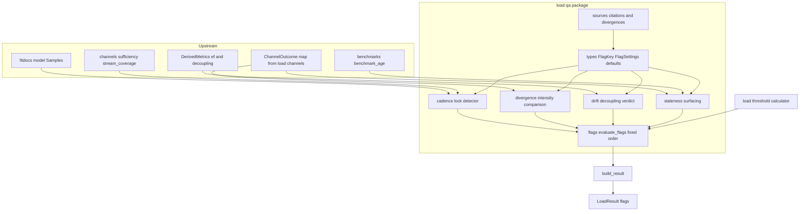
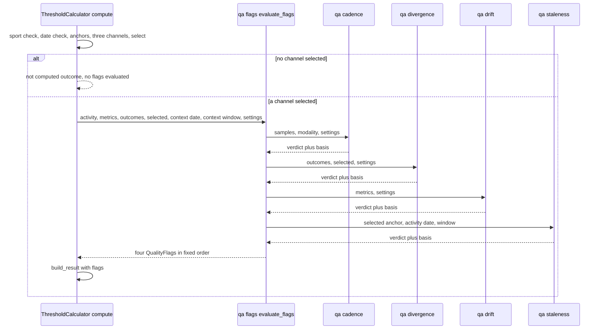
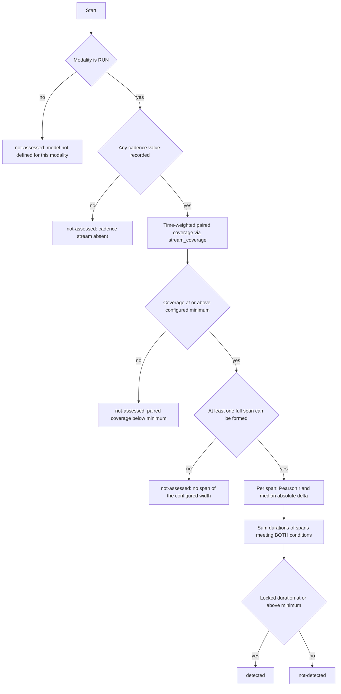

# Technical Design — activity-qa-flags

## Overview

**Purpose.** This feature delivers *verdicts about the data behind a load
number* to any reader of a workout document, and to the LLM layer that reads
those documents. Four checks — cadence lock, cross-channel divergence, aerobic
drift, benchmark staleness — each return one of three verdicts with the basis
that produced it. The verdicts ride in the `flags` field the `training-load`
contract already defines, are rendered by the section renderer that already
knows how to render them, and never touch a number.

**Users.** An athlete reading a document sees whether the load in front of them
rests on data that was checked and clean, data that failed a check, or data that
could not be checked at all. The interpretation layer above fitdocs reads the
same verdicts as facts and decides what they mean; this layer decides nothing.

**Impact.** Today `threshold-load` assembles a result with `flags=()` and there
is no producer. This design supplies the producer as a pure package under
`src/fitdocs/load/qa/`, adds one keyword-only parameter to `build_result`,
changes one call site, and adds one member to the single `LoadSettings`
dataclass. Nothing else in the tool changes: no load value, no channel, no
benchmark, no derived metric, no frontmatter key, no rendering code.

### Amendments — 2026-07-25 cross-spec review

Five adjudicated findings, all approved, all applied in place below. The
requirements document carries the same list with its reasoning; what follows is
what changed *here*:

1. **The divergence check's premise was false and has been fixed upstream.**
   `load-channels` now defines one intensity semantic for all three channels
   (`load == hours × intensity² × 100` within `1e-9` relative, exactly `1.0` at
   threshold), with heart-rate intensity as `sqrt(impulse_ratio)`. The
   DivergenceAnalysis section restates its premise against that invariant and
   records the **ruling on the `0.20` default**, which was chosen against the
   broken scale.
2. **The import-cycle invariant is withdrawn — and the real cycle behind it was
   cut upstream.** Its original cause, `ProfileView.load_settings`, is removed by
   `training-load` Amendment 3 in favour of a per-pass `LoadContext`. A second,
   different edge did survive that removal (`LoadContext.settings` keeps
   `load/types.py → load/settings.py` alive, and `load/settings.py` must reach
   into this package for `FlagSettings`); this design reported it, the
   cross-spec review **reproduced it and found it worse than reported** — it
   failed on every entry point, not only when `load.types` was imported first.
   The ruling landed the fix in `training-load`, where the edge lives: a
   `TYPE_CHECKING`-only import of `LoadSettings` in `src/fitdocs/load/types.py`.
   With that, `settings.py` sits above `types.py` again, every sub-package may
   freely import `load.types`, and `src/fitdocs/load/qa/__init__.py` is an
   **ordinary eager package initializer** exporting `evaluate_flags`. No lazy
   `__getattr__`, no import-order invariant, no import-order regression test
   here.
3. **`FITDOCS_MEASURED` is consumed, not added.** `load-channels` defines all
   three `VerificationStatus` members in its own task 1.1. No module or test
   module of that spec is edited here.
4. **Provenance defects fixed.** Uniqueness is asserted over `Citation.key` and
   `Divergence.behavior` — `Divergence` deliberately has no `key` — matching
   `load-channels`' resolution of the identical bug; and the divergence table's
   miscount ("five" against six rows) is corrected.
5. **Vocabulary landing around this feature.** `NotConfirmed` becomes
   `NotComputed` (this feature names neither, so nothing changed), and the load
   pass asks whether a calculator supports an activity before the prompt flow —
   informational, no change here. *Repinned 2026-07-26: this originally read
   "`LoadCalculator` gains `supports(activity)`". It does not — the Protocol
   declaration was deleted by `3121bb6` and the seam is the module-level
   `supports_activity(calculator, activity)`, which reads a calculator's own
   optional, off-Protocol `supports`. Still informational; still no change here.*

### Amendment — 2026-09-16: a retroactive anchor is a state, not a guard violation

`athlete-benchmarks` Amendment 1 (2026-09-10, implemented under
`training-load` Amendment 4) revised the store this feature consumes: an entry
may carry an athlete-declared `applies_from` date, selection falls back to such
an entry when no earlier measurement covers the activity (its 3.3 revised,
3.10, 3.11), and `benchmark_age` **returns a negative `age_days` and a current
verdict** instead of raising for a benchmark measured after the activity (its
4.6 revised). Its amendment record names this feature: a negative age must be
read as "measured after this activity, applied by declaration", never as
stale. The `benchmark_age` revalidation trigger below fired, and this is the
re-check — queue item
`2026-09-10-activity-qa-flags-staleness-guard-neutralises-retroactive-anchors`.

What changed here, applied in place below:

1. **The pre-call ordering guard is retired with its premise.**
   StalenessSurfacing no longer checks `measured_on <= activity_date` before
   calling `benchmark_age`, and the note that forbade removing that guard —
   justified by "`athlete-benchmarks` specifies `benchmark_age` as *raising*"
   — is gone, because the premise is false in shipped code
   (`src/fitdocs/benchmarks.py`: only `window_days < 1` raises). Implemented
   as previously designed, every anchor the amendment exists to create — a
   prompt answer measured today and declared to apply back to a 2019 activity
   — would have read *not-assessed*.
2. **A retroactive anchor is a fourth `StalenessOutcome`, `RETROACTIVE`,
   mapped to the contract's `not-detected`.** The check ran to completion and
   the condition it looks for (age exceeds the window) was not found, which is
   exactly what 1.2 defines *not-detected* to mean; the contract's three-value
   verdict vocabulary is untouched, so `training-load`'s renderer does not
   re-check. The basis states the measurement date, how many days after the
   activity it falls, the applies-from date the athlete declared (read from
   `Benchmark.applies_from` on the resolved anchor) and the window — new
   criterion 5.8. A fifth flag, and a sign check hidden in the basis builder,
   were both rejected; `research.md` records why.
3. **Consequential edits**: the error-handling category "upstream
   inconsistency — anchor measured after the activity" becomes the verdict
   state above; the traceability table gains 5.8 and the 1.10 row no longer
   names an ordering guard; the `benchmark_age` revalidation trigger is widened
   to the sign convention of `age_days` and to the selection rule that decides
   when a later-measured anchor applies; `Benchmark.applies_from` joins the
   consumed data contract; `test_staleness.py` pins the retroactive path in
   place of the "defensive future-dated anchor".

Nothing else in this feature changes: no module, no flag key, no order, no
setting, no other check.

### Goals

- Four checks, each a pure function, each returning exactly one verdict from the
  contract's fixed three-value vocabulary with a non-empty basis (1.1–1.10).
- Cadence-lock detection that fires on constructed lock and, measurably, on no
  file in the athlete's real 74-file corpus (2.1–2.11).
- Divergence expressed as a comparison of the two channels' **intensities** —
  the only quantity `load-channels` defines to be comparable across channels,
  under the single semantic its Requirement 1.11 now pins for all three
  (3.1–3.10).
- The shipped aerobic-decoupling figure turned into a verdict against a
  published reference point, with every divergence from intervals.icu recorded
  with its reason (4.1–4.7).
- Benchmark staleness *surfaced*, never recomputed — the store's own
  `benchmark_age` is the single source, and an anchor measured after the
  activity by the athlete's declaration surfaces as its own state, never as
  stale and never as not-assessed (5.1–5.8).
- Every threshold configurable in `[load.flags]`; every default cited in code as
  either a published figure, a fitdocs choice with the measurement that
  justifies it, or — for the one default that is neither — an explicitly
  provisional value naming the measurement that would settle it (6.1–6.11,
  8.1–8.4).
- Flags attached at exactly one call site, changing no other field of the result
  (7.1–7.7).

### Non-Goals

- Computing, adjusting, rounding, suppressing or re-deriving any load, channel,
  intensity or benchmark (9.1, 9.2).
- Channel selection or re-selection (9.3); benchmark storage or resolution (9.4).
- Quarantining, rejecting or excluding a flagged activity (9.5).
- Sensor-provenance detection — chest strap versus wrist optical (9.6).
- HRV or recovery analysis; aggregation of verdicts over time (9.7).
- Defining, versioning or rendering the result contract, the payload or the
  training-load section (7.5) — `training-load` owns all three and already
  renders `flags`.
- Repairing a stream. Every platform surveyed offers *correction* tooling;
  fitdocs deliberately reports and leaves the data alone (9.8).

## Boundary Commitments

### This Spec Owns

- The four checks, their preconditions, and the exact verdict each reaches.
- The flag **keys**, display labels and emission order.
- The detection thresholds, their defaults, their in-code provenance, and their
  `[load.flags]` projection and validation.
- The decision, per check, of what counts as *not-assessed* — which is the
  substantive design content of this feature.
- The naming of the basis of every coverage figure this feature reports, and the
  recorded reconciliation of the load layer's time-weighted coverage against the
  document's sample-count coverage table (8.1–8.4).
- The `flags` argument on `build_result` and the single call site that supplies
  it.

### Out of Boundary

- The `QualityFlag` type, its three-value `verdict` vocabulary, the payload
  encoding of flags and the rendering of the flags block — `training-load`.
- `ChannelLoad`, `ChannelInsufficient`, `intensity`, `StreamCoverage`,
  `stream_coverage` and all channel arithmetic — `load-channels`.
- `Benchmark`, `BenchmarkAge`, `benchmark_age`, the staleness **window** and its
  default, and every benchmark read — `athlete-benchmarks`. That includes the
  two-tier selection that decides when an anchor measured after the activity
  applies to it, and the `applies_from` declaration itself: this feature reads
  the sign of the age the store reports and the declaration on the anchor it
  was handed, and re-decides neither.
- `VerificationStatus` and all three of its members, including
  `FITDOCS_MEASURED` — `load-channels`, which defines them in its own task 1.1.
  This feature *uses* the measured status and edits neither that enum nor that
  spec's test modules.
- `LoadContext`, its `activity_date` and `settings` members, and the
  `compute(..., context)` parameter that carries it — `training-load`
  (Amendment 3). This feature reads the context the calculator was handed and
  constructs none.
- Channel evaluation, selection, anchoring, `non_selected_values` and the
  not-computed outcome — `threshold-load`.
- `efficiency_factor`, `decoupling_pct`, `normalized_power`, `trimp` and the
  document's channel-coverage table — `fit-ingest` / `workout-docs`.

### Allowed Dependencies

| Direction | Target | Criticality |
|---|---|---|
| Outbound | `fitdocs.model` — `Samples`, `Modality`, `Activity` | P0 |
| Outbound | `fitdocs.metrics.types.DerivedMetrics` — `decoupling_pct`, `efficiency_factor` (read-only) | P0 |
| Outbound | `fitdocs.load.channels.types` — `ChannelId`, `ChannelLoad`, `ChannelInsufficient`, `ChannelOutcome` | P0 |
| Outbound | `fitdocs.load.channels.sufficiency.stream_coverage` — the one coverage definition | P0 |
| Outbound | `fitdocs.load.channels.sources` — `Citation`, `VerificationStatus`, `Divergence` | P1 |
| Outbound | `fitdocs.benchmarks` — `Benchmark` (`measured_on`, `applies_from`), `BenchmarkAge`, `benchmark_age` | P0 |
| Outbound | `fitdocs.load.types.QualityFlag` | P0 |
| Outbound | `fitdocs.load.types.LoadContext` — `activity_date`, `settings` | P0 |
| Inbound | `fitdocs.load.settings` — reads `FlagSettings` from `qa/types.py` | P0 |
| Inbound | `fitdocs.load.threshold.calculator` — the single call site | P0 |

**Withdrawn: the import-cycle invariant — and the record of the cycle that was
real.** An earlier revision of this design declared a hard constraint: that
`src/fitdocs/load/qa/__init__.py` must re-export only `qa/types.py`, because
`load/types.py` imports `load/settings.py` which must import `FlagSettings` from
this package. `training-load` Amendment 3 removed the edge that revision was
reasoning about — `ProfileView.load_settings` — replacing it with a per-pass
context

```python
@dataclass(frozen=True)
class LoadContext:
    activity_date: date | None
    settings: LoadSettings
```

handed to `compute(self, activity, metrics, profile, session, context)`, with
`ProfileView` reverting to a pure store view (`load_settings`, `activity_date`
and `staleness_window_days` all removed).

That removal did **not** dispose of the problem, and this design said so.
`LoadContext.settings` keeps `load/types.py → load/settings.py` alive, and
`load/settings.py` must still reach into this package for `FlagSettings` (6.1,
6.4); importing the submodule `fitdocs.load.qa.types` executes
`fitdocs/load/qa/__init__.py` first, so an eager `from .flags import
evaluate_flags` there closes the loop:

```
fitdocs.load.types → fitdocs.load.settings → fitdocs.load.qa/__init__
                  → fitdocs.load.qa.flags → fitdocs.load.types (partial)
                  → ImportError
```

**The cross-spec review reproduced this and found it worse than reported**: it
fails on every entry point — `import fitdocs.load.types`, `import fitdocs.load`,
`import fitdocs.load.qa` — not only when `load.types` happens to be imported
first, because `src/fitdocs/load/__init__.py:17` imports `registry`, which
imports `types`.

**The fix landed upstream, in `training-load`, where the offending edge lives.**
An earlier revision of this design proposed a lazy module-level `__getattr__`
in this package's initializer; that mitigation was rejected in favour of one of
the two clean alternatives it named. The review added a single future edge — a
`load/channels/` module importing `fitdocs.load.types` — and the lazy version
failed immediately with the identical `ImportError` while the `TYPE_CHECKING`
version passed. The ruling:

```python
# src/fitdocs/load/types.py
if TYPE_CHECKING:
    from fitdocs.load.settings import LoadSettings
```

`settings.py` therefore sits *above* `types.py` again and may freely import
`channels/types`, `priority` and `qa/types`; every sub-package may freely import
`load.types`; and the shipped documented invariant at
`src/fitdocs/load/types.py:3-9` ("no imports from other `fitdocs.load.*`
modules") is restored.

Consequences for this feature: `src/fitdocs/load/qa/__init__.py` is an
**ordinary eager package initializer**. `from fitdocs.load.qa import
evaluate_flags` works from the package root; there is no module-level
`__getattr__`, no `TYPE_CHECKING` shim in the initializer, no restriction on
what the initializer may import, and no import-order regression test in this
feature. `training-load` owns the guard: it is extending the existing
subprocess-based import check at `tests/test_public_api.py:353`
(`subprocess.run([sys.executable, "-c", ...])`) to cover `import
fitdocs.load.qa` and `import fitdocs.load.types` on a fresh interpreter. This
feature adds no duplicate of that guard — an in-process re-import after a test
module's own top-level imports is a `sys.modules` cache hit and proves nothing.

### Revalidation Triggers

- **A fourth `QualityFlag.verdict` value, or a change to `QualityFlag`'s
  fields** → this feature and `training-load`'s renderer re-check together.
- **A change to `ChannelLoad`'s `intensity`, `anchor` or `coverage` fields, or
  to the shared intensity invariant `load == hours × intensity² × 100` (exactly
  1.0 at threshold, `1e-9` relative tolerance, all three channels alike)** →
  the divergence check's premise is gone; re-check here first, and re-derive the
  tolerance before shipping. This trigger has already fired once: the check was
  designed against a heart-rate intensity that was the *square* of the other two
  channels', and the defect was invisible to any test that only probed threshold
  effort.
- **A change to `LoadContext`'s members, or a return of load configuration to
  `ProfileView`** → the staleness check's window source and the calculator call
  site re-check.
- **A change to `benchmark_age`'s signature, to `BenchmarkAge`'s fields, to
  the sign convention of `age_days`, or to the selection rule that decides when
  an anchor measured after the activity applies to it (`athlete-benchmarks`
  3.10)** → the staleness check re-checks. This trigger has fired once:
  `athlete-benchmarks` Amendment 1 (2026-09-10) changed `benchmark_age` from
  raising to returning a negative age without touching its signature or its
  fields, and the narrower wording this trigger had until 2026-09-16 let the
  re-check lapse while `threshold-load`'s ran.
- **A change to `build_result`'s signature beyond this feature's additive
  `flags` parameter** → the call site re-checks.
- **Any change to `metrics.power.efficiency_factor` or `decoupling_pct`** —
  including the grade-adjusted-pace correction this design recommends — → the
  aerobic-drift default and its recorded divergences re-check.
- **Any change to the FIT cadence field's ingest semantics** (for example
  normalising running cadence to steps per minute at ingest) → the cadence
  check's ×2 conversion becomes wrong and must be removed; this is the single
  most consequential upstream change for this feature.

### Cross-Spec Coordination (must land with this feature)

1. **Consumed, not coordinated: `VerificationStatus.FITDOCS_MEASURED`.**
   `load-channels` task 1.1 defines all three members up front — the third being
   "chosen by fitdocs and justified by a recorded measurement rather than by a
   published source" — with a postcondition that no citation in *that* package
   carries it. 6.10 needs exactly that status and this feature is its only
   consumer, so nothing crosses the boundary in either direction: no enum edit,
   no edit to `tests/load/channels/test_sources.py`.
2. **`load/threshold/calculator.py`: `build_result` gains
   `flags: tuple[QualityFlag, ...] = ()`,** keyword-only, and its one call site
   supplies the evaluated flags. `threshold-load` anticipated this exact change
   and deliberately omitted the parameter rather than shipping an always-empty
   one.
3. **`load/settings.py` gains `flags: FlagSettings`** on the single
   `LoadSettings` dataclass and one projection helper for `[load.flags]`. Fourth
   co-owner of that table; no second reader. The module is owned by
   **`training-load` task 3.1**, which pins `load_load_settings(document,
   settings_file) -> LoadSettings`, `LoadSettingsError(SettingsError)` and
   `DEFAULT_LOAD_SETTINGS`, and ignores unknown keys and unknown sub-tables so
   siblings extend that one dataclass and that one reader.

## Architecture

### Existing Architecture Analysis

The pieces this feature needs already exist or are already specified, which is
why it is the last spec of the phase:

- `Samples` carries `time_s`, `heart_rate_bpm` and `cadence_rpm` as parallel
  arrays with `None` at unrecorded indices — exactly the shape a temporal
  correlation needs, and `records.py` stores the FIT `cadence` field **verbatim**
  (per-limb for running).
- `DerivedMetrics.efficiency_factor` and `.decoupling_pct` are already computed
  and already rendered; `compute` receives the whole `DerivedMetrics`.
- `channels.sufficiency.stream_coverage` already measures time-weighted coverage
  over raw ingested arrays with the degenerate cases handled.
- `benchmarks.benchmark_age` already returns `(age_days, window_days, is_stale)`
  from `(activity_date, measured_on, window_days)` and reads no clock. Since
  `athlete-benchmarks` Amendment 1 it returns a **negative** `age_days` (and
  `is_stale == False`) for a benchmark measured after the activity instead of
  raising; the store's selection yields such an anchor only through the
  athlete's own `applies_from` declaration, which the resolved `Benchmark`
  carries.
- `ChannelLoad` already carries `intensity`, `anchor: Benchmark` and
  `coverage: StreamCoverage`; `ChannelInsufficient` already carries a closed
  `reason` and a prose `detail`.
- `LoadContext` already carries `activity_date` and the resolved `settings`, and
  `compute` already receives it — so both inputs the staleness check needs are
  in scope at the call site without a second lookup and without a clock.
- The renderer already emits the flags block conditionally and omits it entirely
  when the tuple is empty.

The one genuinely new thing is the cadence-lock detector, and the research
established that no published retrospective detector exists to adopt.

### Architecture Pattern & Boundary Map

Selected pattern: **a pure leaf package invoked once from inside the
calculator**, mirroring `load/channels/` — no I/O, no configuration reading, no
registration side effect, one entry point.



**Architecture integration.**

- *Dependency direction*: `qa/sources` → `qa/types` → the four check modules →
  `qa/flags` → the calculator. Nothing in the package imports upward. Only
  `qa/flags.py` reaches `fitdocs.load.types`, now as an ordinary layering fact
  rather than as a cycle-avoidance rule.
- *Boundaries*: each check owns one verdict and one set of not-assessed
  conditions. No check reads another's inputs, and no check can influence
  another's verdict (4.7).
- *Patterns preserved*: frozen dataclasses with tuple fields; `StrEnum`
  identifiers; a closed union folded with `assert_never`; settings values passed
  in as an argument, never read; defaults expressed as module-level `Final`
  constants that name a citation.
- *New components rationale*: four check modules rather than one because their
  inputs are disjoint (samples / channel outcomes / derived metrics / benchmark)
  and each is independently testable, which is the boundary split the brief
  itself proposed.
- *Steering compliance*: `mypy --strict`; absent data is `None`; deterministic
  math only, no LLM in the numeric path; no personal data in the repository.

### Technology Stack

| Layer | Choice | Role in Feature | Notes |
|---|---|---|---|
| CLI | existing `fitdocs load` / `sync` pass | Surfaces configuration errors from `[load.flags]` before any write | No new command, no new flag |
| Services | `src/fitdocs/load/qa/` (new, stdlib only) | The four checks and their assembly | Pure; `statistics` and `math` from stdlib only |
| Data / Storage | `<data-root>/fitdocs.toml` `[load.flags]` | Detection thresholds | Read through the single shared `[load]` reader |
| Infrastructure | none | — | No new dependency of any kind |

## File Structure Plan

### Directory Structure

```
src/fitdocs/load/qa/
├── __init__.py     # Ordinary eager package initializer: re-exports FlagKey,
│                   #   FLAG_LABELS, FlagSettings, its defaults AND
│                   #   evaluate_flags, all reachable from the package root.
│                   #   Plain `from .flags import evaluate_flags`; no lazy
│                   #   __getattr__ and no restriction on what it may import
│                   #   -- load/types.py's TYPE_CHECKING-only import of
│                   #   LoadSettings cuts the cycle upstream.
├── types.py        # FlagKey, FLAG_LABELS, FLAG_ORDER, FlagSettings and every
│                   #   default constant, each naming a citation key or an
│                   #   entry in PROVISIONAL_DEFAULTS.
├── sources.py      # This feature's Citation and Divergence records plus
│                   #   PROVISIONAL_DEFAULTS, built on the vocabulary
│                   #   channels/sources.py already defines.
├── cadence.py      # Cadence-lock detection: span statistics over Samples.
├── divergence.py   # Selected-vs-heart-rate intensity comparison.
├── drift.py        # Aerobic-decoupling verdict against the reference point.
├── staleness.py    # Anchor age surfaced through benchmarks.benchmark_age.
└── flags.py        # evaluate_flags: fixed order, QualityFlag construction.
                    #   The only module here that imports fitdocs.load.types.
```

### Modified Files

- `src/fitdocs/load/settings.py` — owned by `training-load` task 3.1.
  `LoadSettings` gains `flags: FlagSettings`; the one reader,
  `load_load_settings`, gains projection and validation of `[load.flags]`,
  raising the module's existing `LoadSettingsError`. No second reader; unknown
  keys and sub-tables stay ignored.
- `src/fitdocs/load/threshold/calculator.py` — `build_result` gains a
  keyword-only `flags: tuple[QualityFlag, ...] = ()`, assigned straight to
  `LoadResult.flags`; `ThresholdCalculator.compute` calls `evaluate_flags`
  after selection, threading `context.activity_date` and
  `context.settings.benchmark_staleness_days`, and passes the result. Two edits,
  one file.
- `src/fitdocs/load/__init__.py` — `FlagKey` and `FlagSettings` join the
  exported names, alongside the sibling settings value types.
- `tests/test_public_api.py` — the surface pin gains those two names.
- Tests (new): `tests/load/qa/__init__.py`, `conftest.py` (stream builders),
  `test_types.py`, `test_sources.py`, `test_cadence.py`, `test_divergence.py`,
  `test_drift.py`, `test_staleness.py`, `test_flags.py`, `test_purity.py`.
- Tests (modified): `tests/load/test_settings.py` — the `[load.flags]`
  projection and its validation matrix, plus the four-sibling additivity case;
  `tests/load/threshold/test_calculator.py` — flags reach the result.

## System Flows

### Evaluating the four checks for one activity



Flags are evaluated **after** selection and only when a channel was selected
(7.3): a verdict about the data behind a number is meaningless without the
number. All four checks run unconditionally once that gate passes, so a check's
absence never signals inapplicability (1.6).

### The cadence-lock decision



The three not-assessed exits before any statistic is computed are the whole
point: on the athlete's real corpus, `NA2` alone accounts for 10 of 50 runs,
leaving 40 that the check can speak about at all.

## Requirements Traceability

| Requirement | Summary | Components | Interfaces | Flows |
|---|---|---|---|---|
| 1.1 | Verdict carries key, label, one of three values, basis | FlagVocabulary, FlagAssembly | `FlagKey`, `QualityFlag` | Four checks |
| 1.2 | Verdict semantics fixed | FlagAssembly, all four checks | `Verdict` mapping | Four checks |
| 1.3 | Never not-detected on an unrun check | all four checks | per-check postconditions | Cadence decision |
| 1.4 | Reached verdicts state observed, threshold, span | all four checks | basis format helpers | — |
| 1.5 | Not-assessed states the missing input only | all four checks | basis format helpers | Cadence decision |
| 1.6 | One verdict per check, always | FlagAssembly | `evaluate_flags` | Four checks |
| 1.7 | Fixed emission order | FlagVocabulary, FlagAssembly | `FLAG_ORDER` | Four checks |
| 1.8 | No fabricated zero in a basis | all four checks | basis format helpers | — |
| 1.9 | Deterministic, no I/O, no clock, no LLM | whole package | `test_purity` | — |
| 1.10 | Never raises | all four checks, StalenessSurfacing | not-assessed exits; the activity-date guard | — |
| 2.1, 2.4 | Temporal, per span, not single-point | CadenceLockDetector | `span_statistics` | Cadence decision |
| 2.2 | Conjunctive rule plus minimum duration | CadenceLockDetector | `detect` | Cadence decision |
| 2.3 | Compare against full movement cycles | CadenceLockDetector | `STEPS_PER_CADENCE_REVOLUTION` | — |
| 2.5 | Sub-threshold lock reports the sum and the minimum | CadenceLockDetector | `CadenceLockReading` | Cadence decision |
| 2.6 | No cadence anywhere means not-assessed | CadenceLockDetector | `detect` | Cadence decision |
| 2.7 | Coverage or span shortfall means not-assessed | CadenceLockDetector | `stream_coverage` reuse | Cadence decision |
| 2.8 | Running only | CadenceLockDetector | `detect` | Cadence decision |
| 2.9 | Correlated effort is not-detected | CadenceLockDetector | corpus-derived fixtures | — |
| 2.10 | Raw samples, no resampling | CadenceLockDetector | `span_statistics` | — |
| 2.11 | Constructed positives, corpus-derived negatives | CadenceLockDetector, tests | `tests/load/qa/conftest.py` | — |
| 3.1, 3.4 | Compare intensities, never loads | DivergenceAnalysis | `evaluate` | Four checks |
| 3.2, 3.3 | Verdict plus both intensities, delta, tolerance | DivergenceAnalysis | `evaluate` | — |
| 3.5 | HR selected means not-assessed | DivergenceAnalysis | `evaluate` | — |
| 3.6 | HR insufficient carries the channel's own reason | DivergenceAnalysis | `evaluate` | — |
| 3.7 | Alters nothing | DivergenceAnalysis | pure signature | — |
| 3.8 | Evaluated whatever the priority preferred | DivergenceAnalysis, FlagAssembly | `evaluate_flags` | Four checks |
| 3.9 | Agreeing channels read *agreed* sub-threshold | DivergenceAnalysis | `evaluate` | — |
| 3.10 | The unlocatable anecdote is cited nowhere | FlagProvenance | `sources.py` module docstring | — |
| 4.1, 4.6 | Consume the shipped decoupling unchanged | AerobicDriftCheck | `evaluate` | — |
| 4.2 | Verdict against the reference point | AerobicDriftCheck | `DEFAULT_AEROBIC_DRIFT_MAX_PCT` | — |
| 4.3 | Default is published and sourced; divergences recorded | FlagProvenance | `CITATIONS`, `DIVERGENCES` | — |
| 4.4 | Unavailable decoupling means not-assessed | AerobicDriftCheck | `evaluate` | — |
| 4.5 | EF is basis, never verdict; the brief's framing withdrawn | AerobicDriftCheck, FlagProvenance | `evaluate` | — |
| 4.7 | Independent of other checks | AerobicDriftCheck | pure signature | — |
| 5.1 | Report on the selected channel's anchor | StalenessSurfacing | `evaluate` | Four checks |
| 5.2, 5.3 | Age, window and verdict from the store | StalenessSurfacing | `benchmark_age` | — |
| 5.4 | Against the activity's own date | StalenessSurfacing | `evaluate` | — |
| 5.5 | Missing date or anchor means not-assessed | StalenessSurfacing | the activity-date guard | — |
| 5.6 | Alters nothing | StalenessSurfacing | pure signature | — |
| 5.7 | One window, the store's | FlagSettingsReader, StalenessSurfacing | `LoadSettings` | — |
| 5.8 | Retroactive anchor: not-detected, both dates and the day count, never stale, never not-assessed | StalenessSurfacing, FlagAssembly | `StalenessOutcome.RETROACTIVE`, `Benchmark.applies_from` | — |
| 6.1, 6.3 | `[load.flags]` with documented defaults, absence is not an error | FlagSettingsReader | `flag_settings_from_table` | — |
| 6.2 | Extends the one reader; unknown keys still ignored | FlagSettingsReader | `LoadSettings` | — |
| 6.4 | The seven configurable thresholds | FlagVocabulary | `FlagSettings` | — |
| 6.5–6.7 | Loud validation, terminate before writing | FlagSettingsReader | `LoadSettingsError` | — |
| 6.8 | Settings passed in, never read | all four checks | signatures | — |
| 6.9 | No second staleness window | FlagSettingsReader | `FlagSettings` has none | — |
| 6.10 | Every default cited, or recorded provisional in a checkable form | FlagProvenance, FlagVocabulary | `CITATIONS`, `PROVISIONAL_DEFAULTS` | — |
| 6.11 | The divergence tolerance is provisional and says what would settle it | FlagProvenance, FlagVocabulary | `PROVISIONAL_DEFAULTS` | — |
| 7.1, 7.2 | Attach without changing anything else | CalculatorIntegration | `build_result` | Four checks |
| 7.3 | No flags without a load | CalculatorIntegration | `compute` | Four checks |
| 7.4 | No frontmatter key | CalculatorIntegration | — (nothing added) | — |
| 7.5 | Contract, payload and rendering consumed as-is | CalculatorIntegration | `QualityFlag` | — |
| 7.6 | Identical flags for identical inputs | FlagAssembly | `evaluate_flags` | — |
| 7.7 | From typed outcomes, never from formatted text | FlagAssembly, DivergenceAnalysis, StalenessSurfacing | `ChannelOutcome` inputs | — |
| 8.1, 8.2 | Every coverage figure names its basis | CadenceLockDetector | basis format helpers | — |
| 8.3 | The two coverage definitions recorded | FlagProvenance | `DIVERGENCES` | — |
| 8.4 | The document's table untouched | — (no file modified) | — | — |
| 9.1–9.9 | Permanent exclusions | whole package | `test_purity`, boundary tests | — |

## Components and Interfaces

| Component | Domain/Layer | Intent | Req Coverage | Key Dependencies (P0/P1) | Contracts |
|---|---|---|---|---|---|
| FlagVocabulary | Leaf | Keys, labels, order, settings and defaults | 1.1, 1.7, 6.4, 6.10, 6.11 | none | State |
| FlagProvenance | Leaf | Citations, provisional defaults and recorded intervals.icu divergences | 3.10, 4.3, 4.5, 6.10, 6.11, 8.3 | `channels.sources` (P1) | State |
| CadenceLockDetector | Domain | Sustained HR-to-cadence lock over spans | 2.1–2.11, 8.1, 8.2 | `Samples` (P0), `stream_coverage` (P0) | Service |
| DivergenceAnalysis | Domain | Selected-versus-HR intensity comparison | 3.1–3.9 | `channels.types` (P0) | Service |
| AerobicDriftCheck | Domain | Decoupling verdict against the reference point | 4.1–4.7 | `DerivedMetrics` (P0) | Service |
| StalenessSurfacing | Domain | The selected anchor's age, surfaced | 5.1–5.8 | `benchmarks` (P0) | Service |
| FlagAssembly | Service | The one entry point; fixed order; `QualityFlag` construction | 1.1–1.10, 3.8, 5.8, 7.6, 7.7 | all four checks (P0), `load.types` (P0) | Service |
| FlagSettingsReader | Config | `[load.flags]` projection and validation | 6.1–6.9 | `load.settings` (P0) | State |
| CalculatorIntegration | Calculator | The additive parameter and the single call site | 7.1–7.5 | FlagAssembly (P0) | Service |
| PublicSurfacePin | Packaging | Exported names and the pinned surface | 6.4 | — | — |

### Leaf — `src/fitdocs/load/qa/types.py`

#### FlagVocabulary

| Field | Detail |
|---|---|
| Intent | One place that fixes what the checks are called, in what order they appear, and what can be tuned |
| Requirements | 1.1, 1.7, 6.4, 6.10, 6.11 |

**Responsibilities & Constraints**

- Holds no arithmetic and imports nothing from `fitdocs.load.*` beyond the
  provenance vocabulary. (That was once a cycle-avoidance rule; it survives as
  ordinary layering hygiene, since `load/settings.py` imports this module.)
- Every default is a module-level `Final` whose docstring either names a citation
  key from `qa/sources.py` or names its entry in `PROVISIONAL_DEFAULTS`, so
  provenance — including the absence of provenance — is greppable from the
  definition (6.10, 6.11).
- `FLAG_ORDER` is a tuple, not a set and not the enum's declaration order by
  accident — the order is user-visible in a rendered document and is pinned by a
  test (1.7).

**Dependencies**: Outbound — `qa.sources` (P1, docstring references). Inbound —
every other module in the package, and `load/settings.py` (P0).

**Contracts**: State [x]

##### State Management

```python
class FlagKey(StrEnum):
    CADENCE_LOCK = "cadence-lock"
    CHANNEL_DIVERGENCE = "channel-divergence"
    AEROBIC_DRIFT = "aerobic-drift"
    BENCHMARK_STALENESS = "benchmark-staleness"

FLAG_LABELS: Final[Mapping[FlagKey, str]]
"""Cadence lock / Channel divergence / Aerobic drift / Benchmark staleness."""

FLAG_ORDER: Final[tuple[FlagKey, ...]] = (
    FlagKey.CADENCE_LOCK,
    FlagKey.CHANNEL_DIVERGENCE,
    FlagKey.AEROBIC_DRIFT,
    FlagKey.BENCHMARK_STALENESS,
)

STEPS_PER_CADENCE_REVOLUTION: Final[int] = 2
"""FIT records running cadence per limb; steps per minute is twice it."""

DEFAULT_CADENCE_LOCK_MIN_CORRELATION: Final[float] = 0.90
DEFAULT_CADENCE_LOCK_MAX_DELTA_BPM: Final[float] = 5.0
DEFAULT_CADENCE_LOCK_WINDOW_S: Final[int] = 120
DEFAULT_CADENCE_LOCK_MIN_DURATION_S: Final[int] = 300
DEFAULT_CADENCE_LOCK_MIN_PAIRED_COVERAGE: Final[float] = 0.50
DEFAULT_DIVERGENCE_MAX_INTENSITY_DELTA: Final[float] = 0.20
"""PROVISIONAL -- see PROVISIONAL_DEFAULTS['divergence_max_intensity_delta'].
Neither published nor measured: no activity in the measured corpus computed two
channels. Reasoning and the measurement that would settle it are recorded there
(6.10, 6.11)."""
DEFAULT_AEROBIC_DRIFT_MAX_PCT: Final[float] = 5.0

@dataclass(frozen=True)
class FlagSettings:
    cadence_lock_min_correlation: float = DEFAULT_CADENCE_LOCK_MIN_CORRELATION
    cadence_lock_max_delta_bpm: float = DEFAULT_CADENCE_LOCK_MAX_DELTA_BPM
    cadence_lock_window_s: int = DEFAULT_CADENCE_LOCK_WINDOW_S
    cadence_lock_min_duration_s: int = DEFAULT_CADENCE_LOCK_MIN_DURATION_S
    cadence_lock_min_paired_coverage: float = (
        DEFAULT_CADENCE_LOCK_MIN_PAIRED_COVERAGE
    )
    divergence_max_intensity_delta: float = (
        DEFAULT_DIVERGENCE_MAX_INTENSITY_DELTA
    )
    aerobic_drift_max_pct: float = DEFAULT_AEROBIC_DRIFT_MAX_PCT
```

- Preconditions: none — construction validates nothing, consistent with the
  shipped settings value types; validation is the reader's (6.5).
- Postconditions: `FLAG_ORDER` contains every `FlagKey` exactly once;
  `FLAG_LABELS` is total over `FlagKey`. Both asserted by test. Every default
  constant names either a citation key present in `CITATIONS` or a key present
  in `PROVISIONAL_DEFAULTS`, and none names both (6.10).
- Invariants: `FlagSettings` carries **no staleness window** — the store's
  configured window is the only one (6.9).

**Implementation Notes**

- *Integration*: default justifications, each recorded in the constant's own
  docstring — correlation `0.90`: measured, whole-activity Pearson r over the
  real corpus peaks at 0.605 across 40 assessable runs (median 0.157);
  delta `5.0` bpm: measured, real per-run median |HR − steps/min| spans 9–90 bpm;
  window `120` s: fitdocs' own, long enough that a span statistic reflects
  sustained tracking; duration `300` s: measured, the worst false-positive
  accumulation on the entire real corpus under the conjunctive rule is 137 s, so
  this carries better than 2× headroom; paired coverage `0.50`: fitdocs' own, a
  check that speaks about "the activity" needs at least half of it;
  intensity delta `0.20`: **provisional** — neither published nor measured; see
  the ruling recorded under DivergenceAnalysis and its entry in
  `PROVISIONAL_DEFAULTS`; drift `5.0` %: TrainingPeaks-published.
- *Risks*: `STEPS_PER_CADENCE_REVOLUTION` encodes an ingest semantic this
  feature does not own. Its docstring names the revalidation trigger, and a test
  asserts the conversion is applied rather than assumed.

### Leaf — `src/fitdocs/load/qa/sources.py`

#### FlagProvenance

| Field | Detail |
|---|---|
| Intent | Make every default's origin — including its absence — and every intervals.icu divergence a typed, testable artifact |
| Requirements | 3.10, 4.3, 4.5, 6.10, 6.11, 8.3 |

**Responsibilities & Constraints**

- Reuses `Citation`, `VerificationStatus` (all three members) and `Divergence`
  from `channels/sources.py` rather than defining a second provenance vocabulary
  (build-vs-adopt). `load-channels` defines the enum, including
  `FITDOCS_MEASURED`; this module only uses it, and edits nothing there.
- Carries the recorded divergences from intervals.icu, each with a stated
  reason, as the roadmap's interop constraint requires.
- Carries `PROVISIONAL_DEFAULTS` for the defaults that are neither published nor
  measured, so "we chose this and cannot yet defend it" is a typed, testable
  statement rather than a silence (6.10, 6.11).
- Records what was **not** found as firmly as what was, in two module-docstring
  statements a test asserts are present:
  1. the "19 versus 241" cross-channel scoring anecdote the brief cites was not
     locatable in any published forum post, documentation page or blog; it is
     cited nowhere in this feature's design, code or tests, and no default,
     verdict or threshold depends on it (3.10);
  2. the brief's framing of Efficiency Factor as a signal in its own right is
     **withdrawn**. EF has no absolute reference point and its units differ by
     sport — W/bpm on the bike, m·s⁻¹/bpm on the run — so a single activity's
     value admits no threshold. EF enters this feature only as a constituent of
     the decoupling percentage and as a stated part of a verdict's basis, never
     as a verdict (4.5).

**Dependencies**: Outbound — `channels.sources` (P1). Inbound — `qa.types`,
`qa.drift` (P1, docstring references).

**Contracts**: State [x]

##### State Management

```python
TRAININGPEAKS_DECOUPLING: Final[Citation]
"""EF and the 'less than 5%' reference point, published by TrainingPeaks in its
own text. The widespread attribution of the 5% figure to Joe Friel is secondary
and is not claimed here."""

INTERVALS_ICU_DECOUPLING: Final[Citation]
"""(ef1 - ef2) * 100 / ef1 with the halves split at the sample-index midpoint."""

PPG_CADENCE_ARTIFACT: Final[Citation]
"""Salehizadeh et al., SpaMA -- primary confirmation that motion cadence can
become the dominant PPG spectral peak. Corroborates the phenomenon; no fitdocs
constant derives from it."""

FITDOCS_CORPUS_2026_07_25: Final[Citation]
"""The 74-file measurement that justifies every FITDOCS_MEASURED default."""

@dataclass(frozen=True)
class ProvisionalDefault:
    """A default justified by neither a published figure nor a measurement."""
    setting: str          # the FlagSettings field name
    value: str            # the shipped value, as written
    reasoning: str        # why this value and not another
    would_settle_it: str  # the measurement that would replace reasoning

CITATIONS: Final[tuple[Citation, ...]]
DIVERGENCES: Final[tuple[Divergence, ...]]
PROVISIONAL_DEFAULTS: Final[Mapping[str, ProvisionalDefault]]
```

- Postconditions: every default constant in `qa/types.py` names either a
  citation key present in `CITATIONS` or a key present in
  `PROVISIONAL_DEFAULTS`, and none names both; every `FITDOCS_MEASURED` entry
  names the measurement in its note; every `ProvisionalDefault` has a non-empty
  `reasoning` **and** a non-empty `would_settle_it`, so a provisional default
  cannot be recorded without saying what would retire it (6.10, 6.11).
- Invariants: `DIVERGENCES` contains at minimum the six recorded below.
  Uniqueness is asserted over the fields that exist — every `Citation.key` in
  `CITATIONS` is unique across this module and `channels/sources.py`, and every
  `Divergence.behavior` in `DIVERGENCES` is unique. `Divergence` deliberately
  has no `key` field; its `behavior` is the name a consumer would use. This
  matches `load-channels`' resolution of the identical defect, so the two
  provenance modules state the same invariant the same way.

The six recorded divergences from established platform behavior (4.3, 8.3):

| Behavior | intervals.icu / TrainingPeaks | fitdocs | Stated reason |
|---|---|---|---|
| Decoupling half split | Sample-index midpoint | Elapsed-time midpoint | The shipped `metrics.power.decoupling_pct` is fit-ingest's definition; identical under uniform sampling, and forking it here would create a second decoupling in the tool |
| Decoupling numerator, run | Normalized **graded** pace (TrainingPeaks EF) | Raw speed | Same reason; recorded as a known confound on hilly runs and reported to fit-ingest, which now has `load-channels`' grade-adjustment unit available to it |
| Decoupling numerator, bike | Raw average power (intervals.icu) or NP (TrainingPeaks) | Raw power for decoupling, NP for `efficiency_factor` | Pre-existing inconsistency inside a fit-ingest-owned module; reported, not forked |
| Seiler decoupling variant | 60 s moving averages over %HRR and %power reserve | Not implemented | Requires an athlete-wide reserve model this feature does not have; recorded as an open question |
| Decoupling presentation | A displayed number or chart | A verdict against a threshold | This feature exists to turn diagnostics into verdicts; no platform surveyed stores such a verdict, so there is nothing to match |
| Coverage basis | — | Load layer measures recorded **time**; the document's table counts **samples** | Both correct for different questions; unifying them would change shipped rendered output in a file this spec does not own (8.3) |

The recorded provisional defaults (6.10, 6.11) — currently exactly one:

| Setting | Value | Reasoning | What would settle it |
|---|---|---|---|
| `divergence_max_intensity_delta` | `0.20` | Under the shared intensity semantic all three channels report an intensity-factor-like ratio, so `0.20` is a disagreement about a fifth of threshold effort — roughly the width of one conventional training zone, and at the shipped value a *conservative* tolerance that favours *agreed* | For each activity on which two channels both computed, record `abs(selected.intensity − hr.intensity)`; over a sample large enough to have a shape, set the tolerance at a stated percentile of that distribution. The measurement is unavailable today: the 74-file corpus computed **no** activity with two channels |

The entry also records that `0.20` was originally chosen against a heart-rate
intensity scale that has since been corrected, and that the correction changed
the value's meaning without changing the value — see the ruling under
DivergenceAnalysis.

### Domain — `src/fitdocs/load/qa/cadence.py`

#### CadenceLockDetector

| Field | Detail |
|---|---|
| Intent | Decide whether recorded heart rate tracked cadence in lock step for a sustained period |
| Requirements | 2.1–2.11, 8.1, 8.2 |

**Responsibilities & Constraints**

- Pure over `Samples` plus a modality plus settings. Reads the raw ingested
  arrays; never resamples, forward-fills or interpolates (2.10).
- Compares heart rate against `STEPS_PER_CADENCE_REVOLUTION × cadence_rpm`, the
  full-cycle rate (2.3).
- Evaluates **successive non-overlapping spans** of `cadence_lock_window_s`,
  anchored at the first paired sample. A span is *locked* when both the Pearson
  correlation and the median absolute difference conditions hold; the activity is
  *detected* when the summed duration of locked spans reaches
  `cadence_lock_min_duration_s` (2.2, 2.4).
- Reuses `channels.sufficiency.stream_coverage` for the paired-coverage gate, so
  the load layer has exactly one coverage definition (8.1).
- Never raises: every failure is a not-assessed reading (1.10).

**Dependencies**: Outbound — `fitdocs.model.Samples`, `Modality` (P0);
`channels.sufficiency.stream_coverage`, `channels.types.StreamCoverage` (P0);
`qa.types` (P0); stdlib `math`, `statistics` (P0). Inbound — `qa.flags` (P0).

**Contracts**: Service [x]

##### Service Interface

```python
class CadenceLockOutcome(StrEnum):
    LOCKED = "locked"
    CLEAR = "clear"
    NOT_ASSESSED = "not_assessed"

@dataclass(frozen=True)
class SpanStatistic:
    start_s: float
    duration_s: float
    correlation: float | None   # None when a span is degenerate
    median_delta_bpm: float
    locked: bool

@dataclass(frozen=True)
class CadenceLockReading:
    outcome: CadenceLockOutcome
    locked_duration_s: float | None      # None when NOT_ASSESSED
    required_duration_s: int
    paired_coverage: StreamCoverage | None
    spans_assessed: int
    not_assessed_reason: str | None      # None unless NOT_ASSESSED

def paired_presence(samples: Samples) -> tuple[float | None, ...]: ...

def span_statistics(
    samples: Samples, *, window_s: int, settings: FlagSettings
) -> tuple[SpanStatistic, ...]: ...

def detect(
    samples: Samples, *, modality: Modality, settings: FlagSettings
) -> CadenceLockReading: ...
```

- **Preconditions**: none. `detect` is total over every `Samples` value the
  ingest layer can produce, including empty.
- **Postconditions**, in the order they are decided:
  1. `modality is not Modality.RUN` → `NOT_ASSESSED` naming the modality (2.8).
  2. No recorded cadence value anywhere → `NOT_ASSESSED` naming the absent
     stream (2.6).
  3. `stream_coverage` over `paired_presence` returns `None`, or its `fraction`
     is below `cadence_lock_min_paired_coverage` → `NOT_ASSESSED` naming the
     observed fraction and the minimum (2.7).
  4. No span of the configured width can be formed from the paired samples →
     `NOT_ASSESSED` naming the requirement (2.7).
  5. Summed locked duration ≥ `cadence_lock_min_duration_s` → `LOCKED` (2.2).
  6. Otherwise `CLEAR`, carrying the summed locked duration and the minimum
     (2.5).
- **Invariants**: `CLEAR` is returned only after every gate above passed, so it
  is never reachable from a check that did not run (1.3, 2.6). A span with fewer
  than two paired samples, or zero variance in either series, has
  `correlation is None` and is never `locked` — a constant series cannot
  demonstrate tracking. `locked_duration_s` is a sum of whole span durations, so
  it is `0.0`, never `None`, when spans were assessed and none locked; `None`
  appears only when nothing was assessed (1.8).

**Implementation Notes**

- *Integration*: `paired_presence` yields a float at index *i* when both
  `heart_rate_bpm[i]` and `cadence_rpm[i]` are recorded and `None` otherwise,
  which is exactly the shape `stream_coverage` consumes — so the paired gate is
  time-weighted like every other gate in the load layer, and its basis string
  says so (8.1, 8.2).
- *Validation*: the conjunction is the design. A test asserts that a stream with
  r ≥ 0.95 but a 40 bpm offset is `CLEAR`, and that a stream within 2 bpm but
  with r ≈ 0.1 is also `CLEAR`; only both together, sustained, produce `LOCKED`
  (2.9).
- *Risks*: non-overlapping spans can split a genuine lock across a boundary.
  Measured mitigation: at a 120 s width and a 300 s minimum, a lock of five
  minutes or more yields enough fully contained spans at any phase. Recorded
  rather than engineered around, because a rolling window costs determinism-free
  complexity and more false positives for no measured gain.

### Domain — `src/fitdocs/load/qa/divergence.py`

#### DivergenceAnalysis

| Field | Detail |
|---|---|
| Intent | Say whether the channel that scored the activity and the heart-rate channel agree about how hard it was |
| Requirements | 3.1–3.9 |

**Responsibilities & Constraints**

- Compares **intensities only** — the one quantity `load-channels` defines to be
  dimensionless, exactly 1.0 at threshold, and governed by one shared relation
  to load on every channel. It reads no `load`, no `coverage` and no anchor,
  which is the structural guarantee behind 9.2: there is no point in this module
  where two load values are in scope together (3.4).
- Folds the closed `ChannelOutcome` union with `assert_never`.
- Never raises; every path returns a reading (1.10).

**The premise, restated — and the defect it replaces.** This check is only
meaningful if the two numbers it subtracts are on the same scale. When this
design was first written they were not. `load-channels` defined power and pace
intensity as `value / threshold` but heart-rate intensity as the impulse
*ratio*, which for the same load is the **square** of the other two. The two
definitions coincide at exactly one point — 1.0 at threshold — so every test
that probed threshold effort passed while the check was wrong everywhere else.
Measured against the athlete's own physiology (rest 48, max 190, LTHR 165), two
channels reporting **identical** loads for the same hour:

| HR bpm | HR intensity, old | Load, 1 h | Power IF for the same load | Delta |
|---|---|---|---|---|
| 120 | 0.335 | 33.5 | 0.579 | 0.244 |
| 140 | 0.561 | 56.1 | 0.749 | 0.188 |
| 165 | 1.000 | 100.0 | 1.000 | 0.000 |

At the shipped tolerance of `0.20` the flag therefore read **divergent on easy
aerobic sessions where the channels agree perfectly**, and **agreed near
threshold** — backwards across the range where most training happens.
`load-channels` Requirements 1.11 and 5.11 fix the cause rather than the
symptom: heart-rate intensity is now `sqrt(impulse_ratio)`, so
`load == hours × intensity² × 100` holds within `1e-9` relative on all three
channels, intensity is exactly 1.0 at threshold on all three, and the heart-rate
**load** value is unchanged. Every row of the table above now reads delta
`0.000`. The premise Req 3.1 asserts is, as of that amendment, true — and Req
3.9 pins it with a sub-threshold regression case so it cannot silently become
false again.

**Ruling on `divergence_max_intensity_delta = 0.20`.** The value was chosen
against the broken scale, so it had to be re-examined rather than inherited.

- *It cannot be justified from the corpus evidence in this spec, and this design
  does not pretend otherwise.* The 74-file measurement that anchors every
  cadence-lock default says nothing about cross-channel agreement: it computed
  **no** activity on which two channels both produced a value. Power is present
  on 2 of 10 rides and on no run; the pace channel needs a threshold-speed
  benchmark the corpus has none of. There is no observed distribution of
  `abs(selected.intensity − hr.intensity)` to set a percentile against, so any
  number derived "from the data" here would be invented.
- *What the correction does change is the value's meaning, not the value.* Under
  the shared semantic every channel reports an intensity-factor-like ratio, so
  `0.20` now means "the two channels disagree by a fifth of threshold effort" on
  every channel pair, uniformly. That is roughly one conventional training zone
  wide, and it is a **conservative** tolerance: it favours *agreed*, which is
  the right direction of error for an advisory flag that must not cry wolf.
- *Therefore the shipped default stays at `0.20`* — changing it would be
  substituting one unmeasured number for another — but its **provenance is
  downgraded**, from a value recorded as measured to one recorded as provisional
  in `PROVISIONAL_DEFAULTS`, with the reasoning above and with the measurement
  that would settle it named in the record (6.10, 6.11): collect
  `abs(selected.intensity − hr.intensity)` over activities where two channels
  computed, and set the tolerance at a stated percentile of that distribution.
- *One open question is recorded with it.* An absolute delta is scale-dependent
  under a squared load relation: `0.20` between 0.55 and 0.75 is a 1.86× load
  disagreement, while `0.20` between 0.95 and 1.15 is 1.47×. A ratio test would
  be scale-free. The same measurement that would settle the tolerance would also
  settle whether the comparison should be absolute or relative, so both wait on
  it rather than being guessed now; the requirement fixes the comparison as an
  absolute difference (3.2) and a change to that is a requirements change, not
  an implementation choice.

**Dependencies**: Outbound — `channels.types` (P0), `qa.types` (P0). Inbound —
`qa.flags` (P0).

**Contracts**: Service [x]

##### Service Interface

```python
class DivergenceOutcome(StrEnum):
    DIVERGENT = "divergent"
    AGREED = "agreed"
    NOT_ASSESSED = "not_assessed"

@dataclass(frozen=True)
class DivergenceReading:
    outcome: DivergenceOutcome
    selected_channel: ChannelId
    selected_intensity: float | None
    heart_rate_intensity: float | None
    delta: float | None
    tolerance: float
    not_assessed_reason: str | None

def evaluate(
    outcomes: Mapping[ChannelId, ChannelOutcome],
    *,
    selected: ChannelId,
    settings: FlagSettings,
) -> DivergenceReading: ...
```

- **Preconditions**: `outcomes[selected]` is a `ChannelLoad` — the calculator
  only reaches this code after a successful selection. Violation is a
  programming error and raises, matching `channels.types.require_kind`'s
  precedent.
- **Postconditions**, in order:
  1. `selected is ChannelId.HEART_RATE` → `NOT_ASSESSED` stating that the
     heart-rate channel *is* the selected channel and there is no second channel
     to compare against (3.5).
  2. `outcomes[HEART_RATE]` is a `ChannelInsufficient` → `NOT_ASSESSED` carrying
     that channel's own `detail` verbatim, so the recorded reason is the one the
     channel reported (3.6).
  3. `abs(selected.intensity - hr.intensity) > divergence_max_intensity_delta` →
     `DIVERGENT`, else `AGREED`; both carry both intensities, the delta and the
     tolerance (3.2, 3.3).
- **Invariants**: no field of the returned reading is derived from either
  channel's `load` (3.4, 3.7); the function mutates nothing and returns equal
  readings for equal inputs. Two channels reporting the same load for the same
  scored duration produce `delta == 0.0` and therefore `AGREED` at **any**
  effort, not only at threshold — a direct consequence of the shared intensity
  invariant, and the property Req 3.9's regression case pins (3.9).

**Implementation Notes**

- *Integration*: the heart-rate outcome is present for **every** supported
  activity because `threshold-load` evaluates all three channels unconditionally
  — a deliberate commitment made for this check. If that ever became lazy, this
  module silently degrades to `NOT_ASSESSED` on exactly the activities where it
  matters most; recorded as a revalidation trigger.
- *Validation*: Req 3.9's regression case is the one that would have caught the
  original defect. It constructs a selected channel and a heart-rate channel
  that report the **same load for the same scored duration at a clearly
  sub-threshold effort** — intensity ≈ 0.58, load ≈ 33.5 for one hour — and
  asserts `AGREED` with `delta == 0.0`. A threshold-only fixture cannot fail,
  which is precisely why the broken scale survived the first design review.
- *Risks*: the tolerance has neither a published anchor nor a measurement.
  Mitigated by configuration, by recording it in `PROVISIONAL_DEFAULTS` rather
  than dressing it up as measured, and by the flag being advisory by
  construction — a mis-set tolerance changes no number anywhere.

### Domain — `src/fitdocs/load/qa/drift.py`

#### AerobicDriftCheck

| Field | Detail |
|---|---|
| Intent | Turn the shipped aerobic-decoupling percentage into a verdict against the published reference point |
| Requirements | 4.1–4.7 |

**Responsibilities & Constraints**

- Consumes `DerivedMetrics.decoupling_pct` and `.efficiency_factor` **verbatim**
  and recomputes neither (4.1, 9.8).
- Reports the efficiency factor as part of the basis where it is available, and
  never as a verdict of its own: EF has no absolute reference point and its units
  are sport-dependent, so a single activity's value admits no threshold (4.5).
  The feature brief implies EF is itself a signal; that framing is **withdrawn**
  and the withdrawal is recorded in `qa/sources.py` with its reason, so it
  cannot resurface as "the EF flag we forgot to build". EF is a constituent of
  the decoupling percentage and a stated basis — nothing else.
- Depends on no other check's result (4.7).

**Dependencies**: Outbound — `fitdocs.metrics.types.DerivedMetrics` (P0),
`qa.types` (P0), `qa.sources` (P1). Inbound — `qa.flags` (P0).

**Contracts**: Service [x]

##### Service Interface

```python
class DriftOutcome(StrEnum):
    DRIFTED = "drifted"
    COUPLED = "coupled"
    NOT_ASSESSED = "not_assessed"

@dataclass(frozen=True)
class DriftReading:
    outcome: DriftOutcome
    decoupling_pct: float | None
    reference_pct: float
    efficiency_factor: float | None
    not_assessed_reason: str | None

def evaluate(
    metrics: DerivedMetrics, *, settings: FlagSettings
) -> DriftReading: ...
```

- **Preconditions**: none.
- **Postconditions**: `metrics.decoupling_pct is None` → `NOT_ASSESSED` stating
  that the shipped metric was unavailable for this activity and that it is
  defined for running and cycling only (4.4). Otherwise `DRIFTED` when the
  percentage exceeds `aerobic_drift_max_pct` and `COUPLED` when it does not,
  both carrying the observed percentage and the reference (4.2).
  `efficiency_factor` is carried when present and omitted from the basis
  entirely when absent — never rendered as `0` (1.8, 4.5).
- **Invariants**: the reading is a function of `metrics` and `settings` alone
  (4.7); nothing is written back to `metrics` (4.6).

**Implementation Notes**

- *Integration*: on the real corpus this check is assessable on 49 of 50 runs
  and 2 of 10 rides, and on **no** walk, hike or strength file — because the
  shipped metric is defined for the run and bike modalities only. Not-assessed
  is therefore the majority verdict outside running, which the basis says
  plainly rather than implying a clean result.
- *Risks*: the shipped metric uses raw speed rather than grade-adjusted speed, so
  a hilly run can show large drift from terrain alone. Recorded as a divergence
  with its reason and reported to `fit-ingest`; not forked here.

### Domain — `src/fitdocs/load/qa/staleness.py`

#### StalenessSurfacing

| Field | Detail |
|---|---|
| Intent | Surface how old the benchmark behind the activity's load already was on the day of the activity — or that it was measured after that day and applied by the athlete's declaration |
| Requirements | 5.1–5.8 |

**Responsibilities & Constraints**

- **Surfaces, never computes.** The age, the window and the verdict all come from
  `benchmarks.benchmark_age`; this module contributes the routing and no
  arithmetic (5.2). It does not re-decide whether the anchor applies to the
  activity: that is the store's two-tier selection (`athlete-benchmarks` 3.10),
  already made by the time a `ChannelLoad` exists.
- Reports on the anchor of the **selected** channel only (5.1).
- **Reads the sign of the age as the store's own signal.** `athlete-benchmarks`
  4.6 (revised by its Amendment 1) promises that a benchmark measured after the
  activity yields a *negative* `age_days` and a current verdict, and that
  selection yields such an anchor only when the athlete declared it to apply
  retroactively. A negative age is therefore `RETROACTIVE` — its own outcome,
  never `STALE` (arithmetically impossible: a negative age never exceeds a
  positive window) and never `NOT_ASSESSED` (the check ran to completion) —
  and the reading carries the anchor so the basis can state the athlete's
  `applies_from` beside `measured_on` (5.8).
- **No pre-call ordering guard.** An earlier revision checked
  `measured_on <= activity_date` before calling `benchmark_age` and reported a
  violation as *not-assessed*, on the premise that the store *raised* for that
  ordering. The premise was retired by `athlete-benchmarks` Amendment 1 and is
  false in shipped code; the guard would have turned every athlete-declared
  retroactive anchor — the case the amendment exists for — into *not-assessed*.
  It is gone, together with its "must not be deleted as dead code" note.
  Never-raises (1.10) holds because `benchmark_age` no longer raises on any
  anchor the calculator can hand this module: its one remaining `ValueError`
  is `window_days < 1`, which the settings reader rejects before any document
  is read (`athlete-benchmarks` 5.3).

**Dependencies**: Outbound — `fitdocs.benchmarks` (P0), `channels.types` (P0),
`qa.types` (P0). Inbound — `qa.flags` (P0).

**Contracts**: Service [x]

##### Service Interface

```python
class StalenessOutcome(StrEnum):
    STALE = "stale"
    CURRENT = "current"
    RETROACTIVE = "retroactive"   # measured after the activity; applied by the athlete's declaration
    NOT_ASSESSED = "not_assessed"

@dataclass(frozen=True)
class StalenessReading:
    outcome: StalenessOutcome
    anchor: Benchmark          # never None: see the invariant below
    age: BenchmarkAge | None   # None exactly when NOT_ASSESSED
    not_assessed_reason: str | None

def evaluate(
    selected: ChannelLoad,
    *,
    activity_date: date | None,
    window_days: int,
) -> StalenessReading: ...
```

- **Preconditions**: `window_days >= 1`, satisfied by the settings reader.
- **Postconditions**: `activity_date is None` → `NOT_ASSESSED` naming the absent
  date (5.5). Otherwise `benchmark_age(...)` is called, unconditionally, and its
  result is read in one place: `age_days < 0` → `RETROACTIVE`; else `is_stale`
  → `STALE`; else `CURRENT` (5.3, 5.8). Every reached reading carries the
  measurement date, the age in days and the window, and the anchor's
  `applies_from` — the athlete's declaration, or `None` — is reachable through
  `reading.anchor` (5.3, 5.8).
- **Invariants**: `outcome is RETROACTIVE` exactly when `age is not None and
  age.age_days < 0`. No clock is consulted; the verdict is a function of the
  activity's own date, so regenerating an old document reproduces the original
  verdict (5.4). The `Benchmark` is carried by reference and never modified
  (5.6). No second window and no second default exists in this module (5.7).
- **Requirement 5.5, precisely.** "Computed without an anchoring benchmark
  carrying a measurement date" has exactly one *reachable* instance — an activity
  with no calendar date — because the upstream types make the other two
  impossible: `ChannelLoad.anchor` is a non-optional `Benchmark` and
  `Benchmark.measured_on` is a non-optional `date`. `StalenessReading.anchor` is
  therefore non-optional too, and the structural unreachability of an absent
  anchor is recorded at the type rather than defended by a branch that could
  never run. An anchor measured *after* the activity is not a third instance of
  5.5: it is a benchmark that does carry a measurement date and does anchor the
  load, and it is reported under 5.8.
- **A negative age without a declaration.** The store's contract makes
  `RETROACTIVE` with `anchor.applies_from is None` unreachable (the only path to
  a later-measured anchor is the athlete's declaration on that entry). This
  module does not guard it: the outcome is still `RETROACTIVE` — the age is
  what it is — and the assembly's basis states that the anchor carries no
  applies-from date, a reported absence rather than a fabricated one (1.8). A calculator or
  store that produced such an anchor would show it in the document rather than
  crash the load pass (1.10). One test pins that path.

**Implementation Notes**

- *Integration*: `window_days` is threaded from
  `context.settings.benchmark_staleness_days` — `athlete-benchmarks`' member,
  default 84 — and `activity_date` from `context.activity_date`, both through
  the calculator. `ProfileView` no longer carries either: `training-load`
  Amendment 3 removes `load_settings`, `activity_date` and
  `staleness_window_days` from it, leaving it a pure store view, and the former
  redundancy between `staleness_window_days` and
  `load_settings.benchmark_staleness_days` disappears with them. There is one
  window and one source for it (5.7, 6.9).
- *Validation*: the retroactive path is the reachable one now, and the test
  constructs it as the store's tier 2 would — a `Benchmark` whose `measured_on`
  falls after the activity date and whose `applies_from` is on or before it —
  then asserts `RETROACTIVE`, a negative `age_days`, `is_stale is False`, and
  the anchor — with its `applies_from` — carried on the reading. The basis those
  values produce is FlagAssembly's and is pinned in `test_flags.py`. The
  mutation that must red this module's test: removing the `age_days < 0`
  branch, which turns the reading `CURRENT`.
- *Risks*: until the open queue item
  `2026-09-10-load-channels-renders-a-retroactive-anchor-date-unexplained`
  lands `applies_from` beside `measured_on` in the channels' `inputs_used`, this
  basis is the only text in the rendered document that explains a measurement
  date later than the activity. This module does not reach into that table.

### Service — `src/fitdocs/load/qa/flags.py`

#### FlagAssembly

| Field | Detail |
|---|---|
| Intent | The one entry point: run all four checks, in a fixed order, and render each reading as a `QualityFlag` |
| Requirements | 1.1–1.10, 3.8, 5.8, 7.6, 7.7 |

**Responsibilities & Constraints**

- The only module in this package that imports `fitdocs.load.types` — ordinary
  layering, not a declared invariant. `evaluate_flags` is eagerly re-exported
  from `fitdocs.load.qa` — an ordinary `from .flags import evaluate_flags` in
  the initializer — as well as being importable by its full path.
- Runs every check unconditionally, so a check's absence never signals
  inapplicability (1.6), and emits in `FLAG_ORDER` regardless of which verdicts
  were reached (1.7).
- Maps each check's own outcome enum — three members for cadence, divergence
  and drift, four for staleness — onto the contract's
  `detected` / `not-detected` / `not-assessed`; the mapping is total and
  explicit per check, never a name-based coincidence.
- Owns the basis strings. Every reached verdict states the observed figure, the
  threshold and the span; every not-assessed verdict states the missing input and
  no figure that was not measured (1.4, 1.5, 1.8). The retroactive staleness
  basis states the anchor's measurement date, how many days after the activity
  it falls, the applies-from date read from `reading.anchor.applies_from` (or
  that the anchor carries none) and the window, so a reader sees their own
  declaration rather than an unexplained later date (5.8).

**Dependencies**: Outbound — the four check modules (P0), `qa.types` (P0),
`fitdocs.load.types.QualityFlag` (P0). Inbound —
`load/threshold/calculator.py` (P0).

**Contracts**: Service [x]

##### Service Interface

```python
def evaluate_flags(
    *,
    activity: Activity,
    metrics: DerivedMetrics,
    outcomes: Mapping[ChannelId, ChannelOutcome],
    selected: ChannelId,
    activity_date: date | None,
    staleness_window_days: int,
    settings: FlagSettings,
) -> tuple[QualityFlag, ...]: ...
```

`activity_date` and `staleness_window_days` are supplied by the calculator from
`context.activity_date` and `context.settings.benchmark_staleness_days`. They
stay scalar parameters rather than a `LoadContext` argument so that this package
depends on the two values it uses and not on the whole calculator contract —
which also keeps every check testable without constructing a context.

- **Preconditions**: `outcomes[selected]` is a `ChannelLoad`; `outcomes` holds
  one entry per channel, which the calculator guarantees.
- **Postconditions**: returns exactly four flags, one per `FlagKey`, in
  `FLAG_ORDER`; every `detail` is non-empty; every `verdict` is one of the
  contract's three literals. Equal inputs yield an equal tuple, string for
  string (7.6).
- **Invariants**: nothing in this module reads a formatted or rendered
  representation of a result — every input is a typed value from the channel
  layer, the sample model or the metric layer (7.7). Nothing is written back to
  any argument.

**Implementation Notes**

- *Integration*: the verdict mapping, stated once —
  `LOCKED`/`DIVERGENT`/`DRIFTED`/`STALE` → `detected`;
  `CLEAR`/`AGREED`/`COUPLED`/`CURRENT`/`RETROACTIVE` → `not-detected`;
  every `NOT_ASSESSED` → `not-assessed`. A test asserts the mapping is total by
  folding each check's outcome enum with `assert_never`.
- *Validation*: basis strings are user-visible in rendered documents and are
  pinned by tests; changing one is a regeneration, not a silent edit — the same
  discipline `threshold-load` applies to its reason strings.
- *Risks*: four flags on every computed document, most of them *not-assessed*
  outside running, makes documents wordier. Deliberate: 1.6 rejects the
  alternative, in which a reader cannot distinguish "this check found nothing" from
  "this check was never defined for your sport".

### Config — `src/fitdocs/load/settings.py`

#### FlagSettingsReader

| Field | Detail |
|---|---|
| Intent | Project and validate `[load.flags]` onto the single shared settings value |
| Requirements | 6.1–6.9 |

**Responsibilities & Constraints**

- **Extends the one `LoadSettings` dataclass and the one reader.** It creates no
  module, opens no file, and adds no second reader — the fourth and final
  co-owner of `[load]`.
- **Owner of the module: `training-load`, task 3.1.** It creates
  `src/fitdocs/load/settings.py` and pins the surface every sibling extends:

  ```python
  load_load_settings(document: Mapping[str, object], settings_file: Path) -> LoadSettings
  class LoadSettingsError(SettingsError): ...
  DEFAULT_LOAD_SETTINGS: Final[LoadSettings]   # every field defaulted
  ```

  Unknown keys **and** unknown sub-tables are ignored, which is exactly what
  makes sibling extension safe: this feature's `[load.flags]` keys are an
  extension of that one dataclass, read by that one `load_load_settings`. No
  second reader may exist.
- Keeps the additivity contract: unknown keys and sub-tables inside `[load]`
  remain ignored.
- Reads **no** staleness window; that key is `athlete-benchmarks`' (6.9).

**Dependencies**: Outbound — `qa.types.FlagSettings` (P0), `fitdocs.settings`
(P0), `fitdocs.layout.settings_path` (P1). Inbound — `load/engine.py` (P0),
`load/types.py` (P0, as `LoadContext.settings`' annotation — a
`TYPE_CHECKING`-only import, which is what keeps `settings.py` above
`types.py`).

**Contracts**: State [x]

##### State Management

```python
@dataclass(frozen=True)
class LoadSettings:
    default_calculator: str | None = None                          # training-load
    benchmark_staleness_days: int = DEFAULT_STALENESS_WINDOW_DAYS  # athlete-benchmarks
    sufficiency: SufficiencySettings = field(...)                  # load-channels
    channel_priority: ChannelPriority = field(...)                 # threshold-load
    flags: FlagSettings = field(default_factory=FlagSettings)      # THIS SPEC
```

Admissible ranges, each enforced with a message naming the file, the key, the
offending value and the range (6.5):

| Key | Type | Admissible |
|---|---|---|
| `cadence_lock_min_correlation` | float | `0 < v <= 1` |
| `cadence_lock_max_delta_bpm` | float | `v > 0` |
| `cadence_lock_window_s` | int | `v >= 30` |
| `cadence_lock_min_duration_s` | int | `v > 0` |
| `cadence_lock_min_paired_coverage` | float | `0 < v <= 1` |
| `divergence_max_intensity_delta` | float | `v > 0` |
| `aerobic_drift_max_pct` | float | `v > 0` |

- Postconditions: an absent settings file, absent `[load]`, absent
  `[load.flags]` or absent key yields the documented default and is never an
  error (6.3); a `bool` is rejected wherever a number is required, mirroring the
  shipped strictness; a non-table `[load.flags]` raises `LoadSettingsError`
  naming the path (6.6).
- Invariants: `LoadSettingsError` already routes to the CLI's exit-2
  configuration path before any document is written (6.7).

**Implementation Notes**

- *Integration*: this feature adds exactly one line to the dataclass and one
  projection helper to the reader. `cadence_lock_min_duration_s` below
  `cadence_lock_window_s` is **accepted** — it means "a single locked span is
  enough", a coherent if aggressive choice, and rejecting it would be the tool
  overriding the athlete. Documented at the key.
- *Validation*: a test asserts that a document carrying `default_calculator`,
  `[load.priority]`, `[load.sufficiency]` and `[load.flags]` together parses
  cleanly — the additivity contract's guard from the fourth and last side.

### Calculator — `src/fitdocs/load/threshold/calculator.py`

#### CalculatorIntegration

| Field | Detail |
|---|---|
| Intent | Evaluate flags at the one point where every input is in scope, and attach them without touching anything else |
| Requirements | 7.1–7.5 |

**Responsibilities & Constraints**

- Two edits: `build_result` gains a keyword-only
  `flags: tuple[QualityFlag, ...] = ()` assigned straight to `LoadResult.flags`;
  `compute` calls `evaluate_flags` after a successful selection and passes the
  tuple. No other field of the result changes (7.2).
- `compute` reads the activity date and the staleness window from the
  `LoadContext` it already receives (`training-load` Amendment 3), not from the
  `ProfileView`, which no longer carries either. It constructs no context and
  reads no configuration file (6.8).
- Flags are evaluated **only** on the selected path — not on `Unsupported`, not
  on `MissingInputs`, not on the not-computed outcome (7.3).
- Adds no frontmatter key and no rendering (7.4, 7.5).

**Dependencies**: Outbound — `qa.flags.evaluate_flags` (P0). Inbound —
`load/engine.py` via the registry (P0).

**Contracts**: Service [x]

##### Service Interface

```python
def build_result(
    *,
    selected: ChannelLoad,
    outcomes: Mapping[ChannelId, ChannelOutcome],
    order: tuple[ChannelId, ...],
    anchors: ResolvedAnchors,
    discipline: Sport,
    flags: tuple[QualityFlag, ...] = (),   # added by this feature
) -> LoadResult: ...
```

- Preconditions: unchanged from `threshold-load`'s definition.
- Postconditions: `LoadResult.flags` is the supplied tuple, verbatim and in
  order. Every other field is produced exactly as `threshold-load` specifies.
- Invariants: `flags` reaches no other field. A test constructs one result with
  flags and one without from otherwise identical inputs and asserts every field
  but `flags` is equal (7.2).

**Implementation Notes**

- *Integration*: the default of `()` keeps `threshold-load`'s own tests passing
  unchanged and makes the change genuinely additive, which is why that spec
  omitted the parameter rather than shipping an always-empty one.
- *Risks*: `compute` grows a dependency on the `qa` package, so the calculator is
  no longer buildable without it. Acceptable — they ship together, and the
  package is pure with no third-party dependency.

### Packaging — `src/fitdocs/load/__init__.py` and the surface pin

#### PublicSurfacePin

Summary-only. `FlagKey` and `FlagSettings` join `fitdocs.load.__all__` alongside
the sibling settings value types, because `FlagSettings` is reachable from
`LoadContext.settings` — the per-pass context every calculator receives — and a
plugin author who reads that member needs the type. `evaluate_flags` is exported
from `fitdocs.load.qa` but **not** from `fitdocs.load.__all__`: it is the
threshold calculator's internal collaborator, not part of the plugin-author
surface.
`tests/test_public_api.py` gains the two names. The root `fitdocs.__all__` is
unchanged.

## Data Models

### Domain Model

Four independent readings, each a frozen value object, each projected onto one
`QualityFlag`. There is no aggregate, no identity and no persistence in this
feature: readings are computed, projected and discarded within a single
`compute` call. The only persisted artifact is the `flags` array inside the load
payload, whose schema `training-load` owns:
`{key, label, verdict, detail}` with `[]` when empty.

Invariants that hold across all four readings:

- An outcome enum has exactly three members, and its `NOT_ASSESSED` member is the
  only one that may carry a `not_assessed_reason`.
- Every numeric field is `float | None` or `int`, and `None` means *not
  measured* — never *measured as zero*.
- No reading holds a reference to a mutable object, so a reading cannot be
  invalidated after construction.

### Configuration — `<data-root>/fitdocs.toml`

```toml
[load.flags]
cadence_lock_min_correlation = 0.90
cadence_lock_max_delta_bpm = 5.0
cadence_lock_window_s = 120
cadence_lock_min_duration_s = 300
cadence_lock_min_paired_coverage = 0.50
divergence_max_intensity_delta = 0.20
aerobic_drift_max_pct = 5.0
```

Every key is optional; the table itself is optional; `[load]` is optional; the
file is optional. There is deliberately no staleness key here — it lives beside
`benchmark_staleness_days` in `[load]` where `athlete-benchmarks` put it.

### Data Contracts & Integration

- **Consumed unchanged**: `QualityFlag` and its `verdict` literal;
  `ChannelLoad` (`intensity`, `anchor`, `coverage`), `ChannelInsufficient`
  (`reason`, `detail`); `Benchmark` (`measured_on`, `value`, `discipline`,
  `applies_from`); `BenchmarkAge` (`age_days` — negative for an anchor measured
  after the activity, `window_days`, `is_stale`);
  `DerivedMetrics.decoupling_pct` and `.efficiency_factor`; `Samples`;
  `LoadContext` (`activity_date`, `settings`) and
  `VerificationStatus.FITDOCS_MEASURED`.
- **Produced**: `tuple[QualityFlag, ...]`, always length four on the computed
  path and empty everywhere else.
- **Not produced**: no frontmatter key, no payload field, no document region, no
  file.

## Error Handling

### Error Strategy

Two categories only, and the split is the design's central honesty commitment.

1. **Data problems are verdicts, not errors.** Absent streams, insufficient
   coverage, undefined modalities, unavailable metrics and missing dates all
   produce a *not-assessed* verdict with a stated reason. An anchor measured
   after the activity is not a data problem but a verdict state — `RETROACTIVE`,
   rendered *not-detected* with a basis that explains the later date by the
   athlete's declaration. Nothing in the check path raises, so a diagnostic can
   never fail a load pass or a document write (1.10).
2. **Configuration problems are loud and early.** An invalid `[load.flags]`
   value raises `LoadSettingsError` — already a `SettingsError` subclass — from
   the settings reader at the start of the load pass, before any document is
   written or modified (6.5–6.7).

A third, deliberately narrow category: a violated **programming** precondition —
`outcomes[selected]` not being a `ChannelLoad` — raises, matching
`channels.types.require_kind`'s precedent. It is unreachable from user data.

### Error Categories and Responses

| Category | Trigger | Response |
|---|---|---|
| Data absence | No cadence stream; `decoupling_pct is None`; no activity date | *not-assessed* naming the absent input |
| Data insufficiency | Paired coverage below minimum; no full span | *not-assessed* naming the observed figure and the requirement |
| Model undefined | Non-running modality for the cadence check; heart rate is the selected channel | *not-assessed* naming why the check does not apply |
| Retroactive anchor | Anchor measured after the activity — a negative age from the store, reached only through the athlete's `applies_from` declaration | *not-detected* stating the measurement date, the day count after the activity, the applies-from date (or its absence) and the window; never stale, never not-assessed; a test pins the path |
| Configuration | Wrong type, wrong range, non-table `[load.flags]` | `LoadSettingsError` naming file, key, value and range; CLI exit 2 before any write |
| Programming error | Selected channel is not a `ChannelLoad` | `ValueError`; unreachable from user data |

### Monitoring

No new logging, metric or health check. The verdicts *are* the observability
artifact: they are written into the document, survive regeneration through the
payload, and are readable without fitdocs installed. The load pass's existing
per-document summary is unchanged — a flagged activity is a computed activity.

## Testing Strategy

### Unit Tests

- `test_cadence.py` — the conjunction is separable: a high-correlation
  large-offset stream is `CLEAR`; a low-correlation small-offset stream is
  `CLEAR`; both together sustained is `LOCKED` (2.2, 2.9). Sub-minimum locked
  duration reports the sum and the minimum (2.5). Zero-cadence, low-paired-
  coverage, short-activity and non-running inputs each reach their own
  not-assessed reason (2.6, 2.7, 2.8). The ×2 conversion is asserted directly:
  a stream where HR equals `cadence_rpm` (not `2 × cadence_rpm`) is `CLEAR`
  (2.3).
- `test_divergence.py` — divergent, agreed, heart-rate-selected, and
  heart-rate-insufficient paths; the insufficiency detail is carried verbatim
  (3.6); a test asserts the module never reads `ChannelLoad.load` by constructing
  two outcomes with equal intensities and wildly different loads and asserting
  the same reading (3.4). **The sub-threshold agreement regression (3.9)**: two
  channels reporting the same load for the same scored duration at a clearly
  sub-threshold effort — intensity ≈ 0.58, load ≈ 33.5 for one hour — read
  `AGREED` with `delta == 0.0`. This is the case a threshold-only fixture cannot
  fail and the one that would have caught the original mismatched-scale defect,
  so its comment names that defect.
- `test_drift.py` — above, below and exactly at the reference point; `None`
  decoupling reaches not-assessed (4.4); EF present and absent both produce a
  valid basis, and absent EF produces no numeric stand-in (1.8, 4.5).
- `test_staleness.py` — stale, current, absent date, and the retroactive anchor
  built as the store's tier 2 would build it (`measured_on` after the activity,
  `applies_from` on or before it): `RETROACTIVE`, negative `age_days`, not
  stale, the anchor and its `applies_from` carried on the reading (5.8); a
  negative age whose anchor carries no `applies_from` still reads
  `RETROACTIVE`; no input reaches *not-assessed* on the ordering of the two
  dates; the same activity date yields the same verdict on repeat (5.4).
- `test_types.py` / `test_sources.py` — `FLAG_ORDER` is total and unique;
  `FLAG_LABELS` is total; every default constant names either a citation key
  present in `CITATIONS` or a key present in `PROVISIONAL_DEFAULTS`, and none
  names both; every `FITDOCS_MEASURED` citation carries its measurement note;
  every `ProvisionalDefault` carries a non-empty `reasoning` and a non-empty
  `would_settle_it`, and `divergence_max_intensity_delta` is present among them
  (6.10, 6.11); `Citation.key` is unique and `Divergence.behavior` is unique —
  and no assertion names a `Divergence.key`, which does not exist;
  `DIVERGENCES` contains all six recorded entries (4.3, 8.3); the module
  docstring records both withdrawn brief claims — the unlocatable anecdote
  (3.10) and EF-as-a-signal (4.5).

### Integration Tests

- `test_flags.py` — `evaluate_flags` returns exactly four flags in `FLAG_ORDER`
  for every combination of reachable per-check outcomes (1.6, 1.7); every
  `detail` is non-empty; the outcome-to-verdict mapping is total over every
  member of every outcome enum, `StalenessOutcome.RETROACTIVE` → `not-detected`
  included (1.2, 5.8); the retroactive staleness basis carries `measured_on`,
  the day count after the activity, `applies_from` and the window, and states
  the absence of `applies_from` when the anchor has none (5.8, 1.8); no
  verdict is `not-detected` when its check did not run (1.3); equal inputs
  produce a string-equal tuple (7.6).
- `tests/load/threshold/test_calculator.py` — a computed activity carries four
  flags; an unsupported, missing-inputs or not-computed outcome carries none
  (7.3); a result built with flags differs from one built without in the `flags`
  field and in no other (7.2).
- `tests/load/test_settings.py` — the seven keys project; each invalid type
  and out-of-range value raises with file, key, value and range in the message
  (6.5); an absent file, table and key each yield defaults (6.3); the four-sibling
  additivity document parses cleanly. It asserts **nothing** about import order:
  `training-load` owns the only fresh-interpreter import guard, extending the
  existing `subprocess.run([sys.executable, "-c", ...])` check at
  `tests/test_public_api.py:353` to cover `import fitdocs.load.qa` and `import
  fitdocs.load.types`. An in-process re-import inside this module would be a
  `sys.modules` cache hit after its own top-level imports and would prove
  nothing.

### E2E / Verification Tests

- A full load pass over a fixture data root produces a document whose rendered
  training-load section contains the flags block with four entries, whose payload
  round-trips them, and whose frontmatter contains **no** flag key (7.4).
- Regenerating that document reproduces it byte-for-byte (7.6).
- **Corpus-derived negatives** (2.11): `tests/load/qa/conftest.py` builds streams
  reproducing the statistics measured on the athlete's real 74-file corpus —
  whole-activity correlation up to 0.605, per-run median |HR − steps/min| down to
  9 bpm, and the single 137 s worst-case locked span — and asserts every one is
  `CLEAR` at the shipped defaults. The corpus itself never enters the repository;
  only the measured statistics do.

### Regression / Boundary

- `test_purity.py` — the package imports no module that performs I/O; no
  function in it accepts or returns a `Path`; `datetime.date.today` and
  `datetime.datetime.now` appear nowhere; no random source is used (1.9).
- A boundary test asserts that no module in `load/qa/` imports
  `fitdocs.load.engine`, `fitdocs.load.render`, `fitdocs.load.docedit`,
  `fitdocs.load.registry` or `fitdocs.contract` (9.3, 9.5, 9.9), and that only
  `qa/flags.py` imports `fitdocs.load.types`. It asserts nothing about import
  *order*: the withdrawn import-cycle invariant leaves no test behind.
- A test asserts `LoadResult.value` is bit-identical with and without flags for
  the same activity, which is Requirement 1.9 of `training-load` and Requirement
  9.2 here made mechanical.

## Migration Strategy

None required. Flags are an additive field of a payload version that
`training-load` is introducing in the same phase, and no document in any data
root carries a computed result today — the maintainer's own data root holds 24
v1 payloads, all `"status":"unsupported"`, which take the refill path rather than
the superseded path. Documents regenerated after this feature lands acquire the
flags block; documents already carrying a v2 computed result would be re-rendered
only on an explicit recompute, which is `training-load`'s rule and not this
feature's to change.
