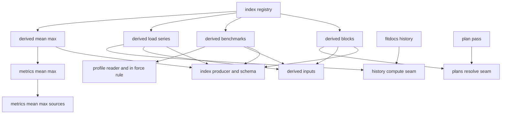
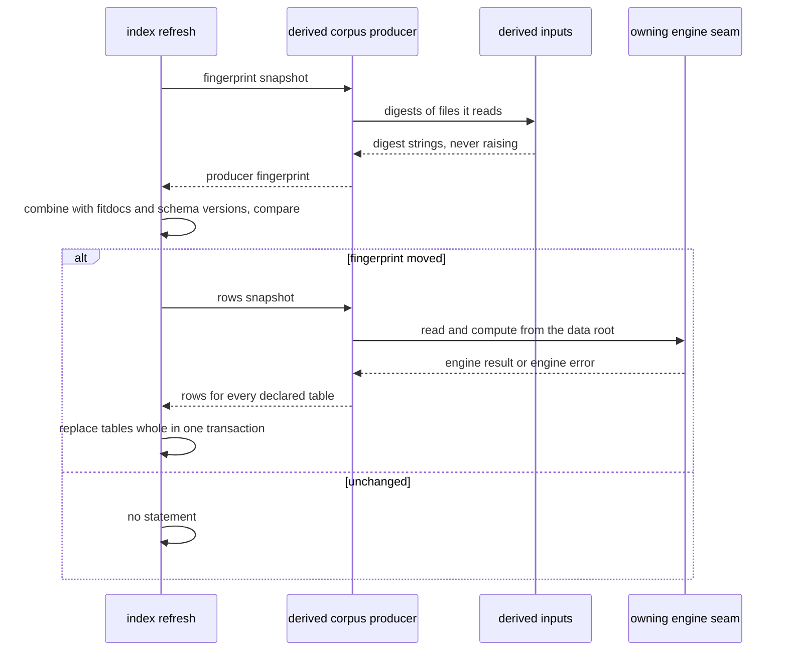
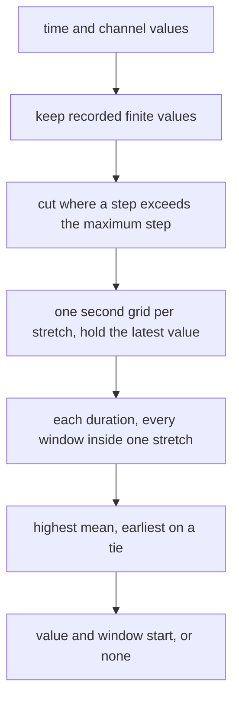

# Technical Design: analytics-derived

## Overview

**Purpose**: This feature adds four answers to the analytics index that are
expensive or easy to get wrong from its core rows: each workout page's best
efforts, the daily and weekly fitness/fatigue/form series, the benchmark
timeline, and training blocks with their resolution. An agent answers "best
20-minute power this year", "form before the race", "FTP on the day of this
ride" or "planned sessions missed this block" with one query.

**Users**:
- **Agents** query the new tables through `analytics-query` or their own
  read-only client.
- **The athlete** gets them from the same refresh and `fitdocs index` that
  already keep the index current.
- **A later document section** can reuse the best-effort function.

**Impact**:
- Four producers registered by appending to `fitdocs.index.registry`; eleven
  new tables; `SCHEMA_VERSION` advances by one.
- One new computation, `fitdocs.metrics.mean_max`, with its records module.
- Behaviour-preserving extractions in `fitdocs.history` and `fitdocs.plans`,
  so the index calls exactly what `fitdocs history` and the plan pass call.
- No document byte, frontmatter key, write location, clock read, network path
  or dependency changes.

### Goals
- Best efforts per page under one stated rule for pauses and dropouts
  (Requirements 1, 2).
- The load series, weekly rows and series terms per methodology, equal to
  `fitdocs history --methodology <m>` (Requirements 3, 4).
- Benchmarks and in-force periods equal to the profile's own rule on every
  date (Requirement 5).
- Blocks, mesocycles, planned workouts, claimed and unplanned pages equal to
  the plan pass's resolution for the same date (Requirement 6).
- Recomputation only when a table's inputs move (Requirement 8).

### Non-Goals
- The store, the refresh, the producer seam and `fitdocs index`
  (`analytics-index`); `fitdocs query` and its sandbox (`analytics-query`).
- A best-effort section in workout documents; best efforts by distance; other
  channels.
- New load or fitness methodologies; forecasting; cross-discipline threshold
  borrowing.
- Free-text columns; a plan's amendment trail and original rows.

## Boundary Commitments

### This Spec Owns
- **The best-effort rule**: `fitdocs.metrics.mean_max` (computation) and
  `fitdocs.metrics.mean_max_sources` (the duration set and maximum step as
  `FitdocsChoice` records).
- **Four producers** in `fitdocs.index.derived`: `derived.mean_max`
  (computed), `derived.load_series`, `derived.benchmarks`, `derived.blocks`
  (corpus), their eleven tables, every column, type and description, and their
  input fingerprints.
- **The input-digest helper** `fitdocs.index.derived.inputs`.
- **Engine seams**, each a behaviour-preserving extraction plus a public-surface
  append:
  - `fitdocs.history`: `HistoryInputs`, `HistoryComputation`,
    `read_history_inputs`, `observed_methodologies`, `compute_history`,
    `DayRow`, `day_rows`;
  - `fitdocs.plans`: `ParsedSource`, `PlanSources`, `read_plan_sources`,
    `PlanResolution`, `resolve_plans`.
- **Registration and versioning**: the appends to `registry.py`, the
  `SCHEMA_VERSION` advance and its digest entry, the table-set pin update.
- **Published statements and records**: the `CHANGELOG.md` entry, the
  `structure.md` sentence, the fit-ingest amendment, the confinement entry, and
  (as the second Phase 10 lander, if it is) the derived part of
  `docs/analytics.md` and the agent skill's worked examples.

### Out of Boundary
- Anything in `fitdocs.index` other than `registry.py`'s tuples, `schema.py`'s
  `SCHEMA_VERSION`, and the new `fitdocs.index.derived` package. The refresh,
  store, location, lock, build and CLI wiring are `analytics-index`'s.
- The read side: `fitdocs query`, the sandbox, the schema view and the skill's
  mechanics (`analytics-query`).
- What `fitdocs history`, the plan pass, `fitdocs derive-benchmarks` or the
  profile compute, render or write. The seams expose, never change.
- `metrics/sources.py`'s `CONSTANT_SOURCES` and fit-ingest's pinned counts.
- The ownership contract and `CONTRACT_VERSION`; `DOC_VERSION`;
  `MANAGED_KEYS`.

### Allowed Dependencies
- `fitdocs.metrics.mean_max` imports `fitdocs.model`,
  `fitdocs.metrics.mean_max_sources` and the standard library;
  `mean_max_sources` imports `fitdocs.citation` only. Neither imports
  `fitdocs.index`, ingest, or anything with I/O.
- `fitdocs.index.derived.*` may import:
  - from `fitdocs.index`: `producer`, `schema`, and `fitdocs.index.derived.*`
    (see Upstream issues, 3); never `store`, `refresh`, `build`, `corpus`,
    `derive`, `handoff`, `lock`, `location`, `registry` or `duckdb`;
  - `fitdocs.metrics.mean_max`, `fitdocs.history` (package root),
    `fitdocs.plans` (package root), `fitdocs.benchmarks`, `fitdocs.load.profile`,
    `fitdocs.layout`, `fitdocs.settings` (for `SettingsError`), `fitdocs.model`
    and the standard library.
- Only `fitdocs.index.registry` imports `fitdocs.index.derived`. Nothing
  outside `fitdocs.index` imports it.
- The engine seams import nothing new at module level (the history and plans
  boundary registries stay as they are).
- No producer writes, reads the clock, opens the network or imports `duckdb`.

### Revalidation Triggers
- **The mean-max rule** (the duration set, the maximum step, the grid or the
  tie rule): changes existing rows that the computed tier does not recompute on
  an upgrade, so it must advance `SCHEMA_VERSION`. A document section reusing
  the function re-checks.
- **Any derived table name, column, type or order**: `SCHEMA_VERSION`,
  `analytics-query`'s docs pin and skill examples re-check.
- **The history seam's fields** (`HistoryComputation`, `DayRow`) or the
  `--methodology` semantics: this spec's load-series tables and load-history's
  page re-check.
- **The plan seam** (`PlanSources`, `PlanResolution`) or plan-resolution's
  use of the date: the block tables and their fingerprint re-check.
- **The profile's in-force rule** (`BenchmarkSet.applicable`): the period
  breakpoints re-check (they assume the rule decides by comparing the date with
  the entries' own dates).
- **`analytics-index`'s `CorpusSnapshot`, `PageComputed` or registration
  shape**: every producer here re-checks.

## Architecture

### Existing Architecture Analysis
- **The index's producer seam** (`analytics-index` design § ProducerSeam): a
  computed producer gets one page's composed activity; a corpus producer gets
  the data root, the held pages, `today` and the athlete fingerprint, declares
  a fingerprint, and has its tables replaced whole when it moves.
- **History** reads settings and every workout page, computes one methodology's
  series, then renders and writes (`history/engine.py:288-462`). The middle is
  pure.
- **The plan pass** discovers and parses plan sources, scans the frontmatter
  corpus once, resolves each valid block with `reconcile_block`, then renders
  and writes (`plans/engine.py:456-577`, `plans/reconcile.py:113-228`). The date
  is used only to split not-logged from upcoming.
- **The profile** is read by `load_profile`; its in-force rule is
  `BenchmarkSet.applicable` (`benchmarks.py:189-243`).
- **The metrics layer** holds pure functions over `Samples` and records every
  methodological constant (fit-ingest Req 15, 16).

### Architecture Pattern & Boundary Map

Thin adapters over extracted engine seams: each producer projects the owning
engine's own result into rows.



**Architecture integration**:
- **Selected pattern**: one computation, two projections. The commands and the
  producers call the same public engine functions.
- **Boundaries**: producers never see a connection or a table other than their
  own; engines never import the index.
- **Existing patterns preserved**: append-only public surfaces with identity
  pins; `FitdocsChoice` records with literal guards; frozen dataclasses;
  `None` for absent; AST boundary guards with positive controls.
- **Dependency direction** (a module imports only from its left):
  `mean_max_sources` → `mean_max` → engine seams (`history`, `plans`, profile)
  → `index.producer`/`index.schema` → `index.derived.inputs` →
  `index.derived.{mean_max, load_series, benchmarks, blocks}` →
  `index.registry`.
- **Steering compliance**: absent is `None`/`NULL`; no clock, network or
  writes in producers; `mypy --strict`; the `structure.md` dependency line
  gains the derived package.

### Technology Stack

| Layer | Choice / Version | Role in Feature | Notes |
|---|---|---|---|
| Runtime | Python 3.11+, stdlib `hashlib`, `json`, `itertools`, `operator`, `math`, `dataclasses`, `enum` | Digests, the best-effort computation | No new dependency |
| Data / Storage | `duckdb` via `analytics-index`'s store only | Holds the tables | This spec issues no SQL |

## File Structure Plan

### Directory Structure
```
src/fitdocs/metrics/
├── mean_max.py              # MeanMaxChannel, MeanMaxPoint, mean_max_curve, mean_max_durations_s: the pure best-effort rule
└── mean_max_sources.py      # Records only: the two FitdocsChoice records, the 28 duration constants, the maximum step, MEAN_MAX_SOURCES

src/fitdocs/index/derived/
├── __init__.py              # Package docstring: the derived producers, their allowed imports; imports nothing
├── inputs.py                # file_digest, workouts_digest, settings_digest, digest, page_keys: what corpus producers read
├── mean_max.py              # MEAN_MAX_PRODUCER (computed): table mean_max
├── load_series.py           # LOAD_SERIES_PRODUCER (corpus): load_series, daily_load, weekly_load
├── benchmarks.py            # BENCHMARK_PRODUCER (corpus): benchmarks, benchmark_periods; UNIT_TOKENS; in_force_periods
└── blocks.py                # BLOCK_PRODUCER (corpus): blocks, mesocycles, planned_workouts, planned_workout_pages, unplanned_pages

tests/metrics/
├── test_mean_max.py                 # the rule against a naive reference; pauses, dropouts, zeros, ties, boundary step
└── test_mean_max_sources.py         # records, literal guard, behaviour reads the records

tests/history/test_compute_seam.py   # read_history_inputs/compute_history/day_rows equal run_history's own computation
tests/plans/test_resolve_seam.py     # read_plan_sources/resolve_plans equal run_plan/run_reconcile's own

tests/index/derived/
├── __init__.py
├── conftest.py              # derived_root fixture builder: loads under two methodologies, a no-sources page, tiered benchmarks, a plan source, settings
├── test_inputs.py           # digests move on exactly their inputs; never raise
├── test_mean_max_producer.py
├── test_load_series_producer.py
├── test_benchmark_producer.py
├── test_block_producer.py
├── test_boundary.py         # derived imports, no clock, no writes, no duckdb, registry is the only importer
├── test_registration.py     # registered producers, descriptions, corpus-table agreement sentences
└── test_refresh.py          # end to end through the real refresh: gating, failures, no-op bytes, determinism, rebuild on the version advance
```

### Modified Files
- `src/fitdocs/history/engine.py`: `HistoryInputs`, `HistoryComputation`,
  `read_history_inputs`, `observed_methodologies`, `compute_history`;
  `run_history` composes them, unchanged in behaviour.
- `src/fitdocs/history/page.py`: `DayRow` and `day_rows`, built on the
  existing `_suppressed_day_indices`, which stays where it is with its name,
  signature and body; `_build_chart` is unchanged.
- `src/fitdocs/history/__init__.py`: seven names appended to `__all__`.
- `src/fitdocs/plans/engine.py`: `ParsedSource`, `PlanSources`,
  `read_plan_sources`; `run_plan` composes it, unchanged in behaviour.
- `src/fitdocs/plans/reconcile.py`: `PlanResolution`, `resolve_plans`,
  `Reconciler.reconcile`; `Reconciler.__call__` uses `reconcile`.
- `src/fitdocs/plans/__init__.py`: five names appended to `__all__`.
- `src/fitdocs/index/registry.py`: `MEAN_MAX_PRODUCER` appended to
  `COMPUTED_PRODUCERS`; the three corpus producers appended to
  `CORPUS_PRODUCERS`.
- `src/fitdocs/index/schema.py`: `SCHEMA_VERSION` = `main`'s value + 1.
- `tests/test_public_api.py`: `_HISTORY_SURFACE` and the plans surface pin
  gain the appended names, with their defining submodules.
- `tests/index/test_schema.py`: the exact table-set pin gains the eleven names.
- `tests/index/test_schema_version.py`: `_DIGESTS_BY_VERSION` gains the new
  version's digest.
- `tests/test_confinement.py`: `EntryPoint(id="index-derived", …)`.
- `CHANGELOG.md`, `.kiro/steering/structure.md`,
  `.kiro/specs/fit-ingest/requirements.md` (and its `spec.json` amendments
  array), `.kiro/steering/roadmap.md` (ticks at landing).
- As second Phase 10 lander only: `docs/analytics.md` (schema reference, by
  analytics-query's own regeneration mechanism) and the analytics agent skill's
  worked examples.
- `pyproject.toml`: the new test modules in the mypy `files` list.

## System Flows

### A corpus producer inside the refresh



**Key decisions**:
- `fingerprint` reads only what is needed to digest the inputs; `rows` calls
  the engine, which reads the data root itself, exactly as its command does.
- An engine error raised from `rows` is the producer's error: the refresh
  rolls back, reports it and retries next time (analytics-index Req 9.4,
  13.3).
- `rows` never runs unless the fingerprint moved, so a no-op refresh scans
  nothing beyond the digests.

### The best-effort rule for one channel



## Requirements Traceability

| Req | Summary | Components | Interfaces / notes |
|---|---|---|---|
| 1.1 | One row per supported duration, three channels with starts | MeanMaxProducer | `mean_max` table |
| 1.2 | From the composed activity | MeanMaxProducer | `PageComputed.activity.samples` |
| 1.3 | Unsupported point is NULL | MeanMaxRule, MeanMaxProducer | `MeanMaxPoint(value=None, start_s=None)` |
| 1.4 | No row when no channel supports; none without computed values | MeanMaxProducer | Row filter; computed producers run only for composable pages |
| 1.5 | Stale-document rule | MeanMaxProducer, Registration | `COMPUTED_PRODUCERS` append; inherited |
| 1.6 | Hand-over equals re-derivation, incremental equals build | MeanMaxRule, DerivedRefreshTests | Pure function; determinism test |
| 2.1 | Fixed set, 1 s to 6 h | MeanMaxRecords | `MEAN_MAX_DURATIONS_S` |
| 2.2 | Windows inside continuous recording; maximum step | MeanMaxRule, MeanMaxRecords | Stretches; `MEAN_MAX_MAX_STEP_S` |
| 2.3 | Hold the latest recorded value; never from another stretch | MeanMaxRule | One-second grid per stretch |
| 2.4 | Recorded zero is real; unrecorded never zero | MeanMaxRule | `None` and non-finite dropped before stretching |
| 2.5 | Earliest on ties | MeanMaxRule | First maximal index |
| 2.6 | Unrounded | MeanMaxRule | Float division only |
| 2.7 | Records with justification and search basis; guard | MeanMaxRecords, MeanMaxGuards | `FitdocsChoice`; literal scan; record-patch tests |
| 2.8 | Independent of the index | MeanMaxRule | Lives in `fitdocs.metrics`; boundary test |
| 3.1 | Daily rows per methodology | LoadSeriesProducer | `daily_load` |
| 3.2 | Equal to `history --methodology m` | HistorySeam, LoadSeriesProducer | `compute_history(inputs, methodology=m)` |
| 3.3 | Suppressed days NULL and marked | HistorySeam | `day_rows` (shared with the chart) |
| 3.4 | No rows after the last contributing day or with no loads | HistorySeam | `DailySeries` span; empty archive gives no rows |
| 3.5 | The history default marked | LoadSeriesProducer | `select_methodology(requested=None, configured=…)` |
| 4.1 | Weekly rows | LoadSeriesProducer | `weekly_load` from `WeekRow` |
| 4.2 | Suppressed week NULL | HistorySeam | `WeekRow` fields |
| 4.3 | Series terms | LoadSeriesProducer | `load_series` from `ModelConstants`, threshold |
| 4.4 | Unrounded | LoadSeriesProducer | Engine floats as computed |
| 5.1 | Benchmark rows | BenchmarkProducer | `benchmarks` |
| 5.2 | In-force periods | BenchmarkProducer | `benchmark_periods`, `in_force_periods` |
| 5.3 | Equal to the profile's rule every date | BenchmarkProducer | `BenchmarkSet.applicable` at breakpoints |
| 5.4 | Unit of the kind, unconverted | BenchmarkProducer | `UNIT_TOKENS` |
| 5.5 | No cross-discipline borrowing | BenchmarkProducer | Groups by recorded discipline |
| 5.6 | Absent profile gives no rows | BenchmarkProducer | `load_profile` empty profile |
| 5.7 | No notes, inputs text or flat keys | BenchmarkProducer, Data Models | Column inventory |
| 6.1 | Block rows | BlockProducer, PlanSeam | `blocks` from `PlanSources` |
| 6.2 | Mesocycle rows with the actual-load picture | BlockProducer | `mesocycles` from `Mesocycle`, `MesocycleLoad` |
| 6.3 | Planned-workout rows | BlockProducer | `planned_workouts` from `PlannedWorkout`, `RowOutcome` |
| 6.4 | Claimed pages, missing override stems | BlockProducer | `planned_workout_pages` |
| 6.5 | Unplanned pages | BlockProducer | `unplanned_pages` |
| 6.6 | Equal to the plan pass | PlanSeam | `resolve_plans` shares `Reconciler.reconcile` |
| 6.7 | Not logged versus upcoming by the current date; recorded | PlanSeam, BlockProducer | `today=snapshot.today`; `blocks.resolved_on` |
| 6.8 | Invalid source and no-source behaviour | BlockProducer | `valid` flag; empty sources |
| 6.9 | No prescription, reason, trail or original rows | BlockProducer, Data Models | Column inventory |
| 7.1 | Engines' page sets, left-out pages included | HistorySeam, PlanSeam, DerivedInputs | Engines read the data root; `workouts_digest` |
| 7.2 | Data-root files byte-identical | All, DerivedGuards | No writes; history and plan goldens |
| 7.3 | Command output and exits unchanged | HistorySeam, PlanSeam | Seam-equality tests; existing suites |
| 7.4 | Corpus tables as inputs stood at the last refresh | Corpus producers | Fingerprints cover the profile, plans, settings, pages |
| 7.5 | Tests against the engines' own output | Test strategy | Each producer test |
| 8.1 | Load-series recompute inputs | LoadSeriesProducer, DerivedInputs | `fingerprint` |
| 8.2 | Benchmark recompute inputs | BenchmarkProducer | `fingerprint` |
| 8.3 | Block recompute inputs, the date only with sources | BlockProducer | `fingerprint` |
| 8.4 | Whole-table replacement | Registration | Inherited (analytics-index Req 13.3) |
| 8.5 | Failure keeps previous rows, others refresh | Corpus producers | Engine errors raised from `rows`; fingerprints never raise |
| 8.6 | No-op leaves the index byte-identical | DerivedInputs | Stable digests |
| 8.7 | Same rows whatever the order or path | All producers | Determinism test |
| 9.1 | NULL, except the engine's own zero | All producers | `None` passthrough |
| 9.2 | Unit suffixes and words | Data Models | `resolve_tables` validation |
| 9.3 | Descriptions; corpus agreement sentence | Data Models, Registration | Description text |
| 9.4 | Dates as dates; starts in seconds | Data Models | `DATE`; `*_start_s` |
| 9.5 | Missing description fails tests | Registration | Upstream schema tests over registered tables |
| 10.1 | Version +1; digest | Registration | `SCHEMA_VERSION`, `_DIGESTS_BY_VERSION` |
| 10.2 | Rebuild on the earlier version | DerivedRefreshTests | NEEDS_REBUILD, then `run_index_command` |
| 10.3 | Release notes | PublishedStatements | `CHANGELOG.md` |
| 10.4 | Docs schema reference and skill examples | PublishedStatements | Second Phase 10 lander |
| 10.5 | Steering dependency statement | PublishedStatements | `structure.md` |
| 10.6 | fit-ingest amendment | PublishedStatements | Next free amendment number at landing |
| 10.7 | No write location, network, clock, dependency; versions unchanged | DerivedGuards | Boundary and version pins |
| 10.8 | Confinement with non-vacuity | DerivedGuards | `EntryPoint(id="index-derived")` |

## Components and Interfaces

| Component | Layer | Intent | Req coverage | Key dependencies | Contracts |
|---|---|---|---|---|---|
| MeanMaxRule | metrics | The pure best-effort computation | 1.3, 1.6, 2.2-2.6, 2.8 | model (P0), MeanMaxRecords (P0) | Service |
| MeanMaxRecords | metrics | The duration set and maximum step as records | 2.1, 2.2, 2.7 | citation (P0) | State |
| HistorySeam | engine | Expose history's computation without its writes | 3.2-3.4, 4.1, 4.2, 7.1, 7.3 | history internals (P0) | Service |
| PlanSeam | engine | Expose the plan pass's resolution without its writes | 6.1, 6.6, 6.7, 7.1, 7.3 | plans internals (P0) | Service |
| DerivedInputs | index.derived | Digests of the files corpus producers read; path-to-key lookup | 7.1, 7.4, 8.1-8.3, 8.6 | producer (P0), layout (P0) | Service |
| MeanMaxProducer | index.derived | `mean_max` rows per page | 1.1-1.5 | MeanMaxRule (P0), producer, schema (P0) | Service |
| LoadSeriesProducer | index.derived | `load_series`, `daily_load`, `weekly_load` | 3.1-3.5, 4.1-4.4, 8.1 | HistorySeam (P0), DerivedInputs (P0) | Service |
| BenchmarkProducer | index.derived | `benchmarks`, `benchmark_periods` | 5.1-5.7, 8.2 | profile, benchmarks (P0), DerivedInputs (P0) | Service |
| BlockProducer | index.derived | The five block tables | 6.1-6.9, 8.3 | PlanSeam (P0), DerivedInputs (P0) | Service |
| Registration | index | Register, version, pin | 1.5, 8.4, 9.5, 10.1 | registry, schema (P0) | State |
| DerivedGuards | tests | Boundaries, confinement, version pins | 2.7, 7.2, 10.7, 10.8 | — | — |
| DerivedRefreshTests | tests | End-to-end refresh behaviour | 1.6, 7.4, 8.1-8.7, 10.2 | analytics-index refresh (P0) | — |
| PublishedStatements | docs, records | Release notes, steering, amendment, docs | 10.3-10.6 | — | — |

### Metrics

#### MeanMaxRule (`src/fitdocs/metrics/mean_max.py`)

| Field | Detail |
|---|---|
| Intent | Compute a channel's best average over each duration of the set, under the stated continuity rule |
| Requirements | 1.3, 1.6, 2.2, 2.3, 2.4, 2.5, 2.6, 2.8 |

**Responsibilities & constraints**
- Pure: no I/O, no clock, no index knowledge. Imports `fitdocs.model`,
  `fitdocs.metrics.mean_max_sources` and the standard library.
- Reads the duration set and the maximum step from the records **at call
  time** (attribute access on the records module), never binding them at import,
  so a test that patches a record observes the change.
- Holds no numeric literal other than the arithmetic identities `0` and `1`.

**Contracts**: Service [x]

```python
class MeanMaxChannel(StrEnum):
    POWER = "power_w"
    SPEED = "speed_mps"
    HEART_RATE = "heart_rate_bpm"

@dataclass(frozen=True)
class MeanMaxPoint:
    duration_s: int
    value: float | None     # best average, unrounded; None when no window of this duration is allowed
    start_s: float | None   # offset on the activity's time_s scale at which the best window begins

def mean_max_durations_s() -> tuple[int, ...]: ...      # the record values, ascending
def mean_max_curve(samples: Samples, channel: MeanMaxChannel) -> tuple[MeanMaxPoint, ...]: ...
```

**The rule**, applied to `getattr(samples, channel.value)` against
`samples.time_s`:
1. **Recorded values.** Keep the pairs `(time_s[i], v_i)` whose `v_i` is not
   `None` and is finite. A recorded `0` is kept.
2. **Stretches.** Walk the kept pairs in order. A step `time_s[j] - time_s[i]`
   between consecutive kept pairs that is greater than the maximum step starts
   a new stretch; a step equal to it does not.
3. **Grid.** For a stretch with first instant `t0` and last instant `tL`, the
   grid is `t0 + k` for `k = 0 .. floor(tL - t0)`. Each grid second takes the
   value of the last kept pair in the stretch whose instant is at or before it.
   Two pairs at one instant: the later one in recorded order wins.
4. **Windows.** For each duration `d` of the set, every run of `d` consecutive
   grid seconds inside one stretch is a window; its mean is the sum of its
   values divided by `d`.
5. **Best.** The highest mean over all stretches, the earliest window (first
   stretch, then lowest `k`) on a tie. `start_s = t0 + k`. With no stretch of
   at least `d` grid seconds, the point is `(d, None, None)`.

- **Postconditions**: one point per duration of the set, ascending; every
  non-`None` value lies between the stretch's minimum and maximum kept value;
  the same `Samples` always give equal points.
- **Exactness**: integer channels (power, heart rate) sum as Python integers;
  speed sums as floats in grid order. Tests compare floats with a relative
  tolerance of `1e-12`.

**Implementation notes**
- Prefix sums per stretch (`itertools.accumulate`) and one C-level pass per
  duration (`map(operator.sub, …)`, then `max` and `index`) keep a 3-hour
  activity's three curves within tens of milliseconds.
- The grid of a stretch has at most `samples × max_step` points, so a
  malformed `time_s` cannot blow up memory: a large jump is a stretch break.

#### MeanMaxRecords (`src/fitdocs/metrics/mean_max_sources.py`)

| Field | Detail |
|---|---|
| Intent | Record the duration set and the maximum step as fitdocs's own choices |
| Requirements | 2.1, 2.2, 2.7 |

**Contracts**: State [x]

```python
MEAN_MAX_DURATIONS_CHOICE: Final[FitdocsChoice]   # key "mean_max_durations_choice"
MEAN_MAX_MAX_STEP_CHOICE: Final[FitdocsChoice]    # key "mean_max_max_step_choice"
MEAN_MAX_DURATIONS_S: Final[tuple[CitedConstant[int], ...]]
    # 28 constants, ascending, each named "mean_max_duration_<n>_s", each source=MEAN_MAX_DURATIONS_CHOICE:
    # 1, 5, 10, 15, 20, 30, 45, 60, 120, 180, 240, 300, 360, 480, 600, 720, 900,
    # 1200, 1800, 2400, 2700, 3600, 5400, 7200, 10800, 14400, 18000, 21600
MEAN_MAX_MAX_STEP_S: Final[CitedConstant[float]]  # name "mean_max_max_step_s", value 5.0, source=MEAN_MAX_MAX_STEP_CHOICE
MEAN_MAX_SOURCES: Final[tuple[CitedConstant[int] | CitedConstant[float], ...]]   # all 29, durations first
```
- **Justifications** (the records carry these, in full sentences):
  - durations: a near-logarithmic ladder from a one-second peak to six hours,
    dense where threshold tests live, containing the durations fitdocs's own
    threshold derivations name (900 s, 1200 s, 3600 s); one set for every page
    and channel so curves compare;
  - maximum step: for a best effort a break loses data, unlike alignment
    (`compose/stretches.py`'s 1 s), so the step bridges brief dropouts and
    irregular recording while holding at most four seconds of value per step,
    and still breaks at a stop long enough to trigger auto-pause.
- **`search_basis`**: written by the implementing task after it performs the
  search fit-ingest Req 15.9 asks for (queries run and what each found, or a
  plain statement that no live search tool was available, as
  `NP_MIN_SPAN_CHOICE` does). Never a claim of a search not run.
- **`measurement`**: `None` until the maintainer's measurement task records one.
- Holds no arithmetic; imports `fitdocs.citation` only. `metrics/sources.py` and
  its pinned counts are untouched.

### Engine seams

#### HistorySeam (`src/fitdocs/history/engine.py`, `page.py`, `__init__.py`)

| Field | Detail |
|---|---|
| Intent | Let a caller other than `fitdocs history` obtain the same computation without rendering or writing |
| Requirements | 3.2, 3.3, 3.4, 4.1, 4.2, 7.1, 7.3 |

**Contracts**: Service [x]

```python
# fitdocs.history.engine
@dataclass(frozen=True)
class HistoryInputs:
    scan: DocumentScan                 # every workout page history reads, sorted by (day, path)
    history_settings: HistorySettings
    configured: str | None             # history.methodology or load.default_calculator

@dataclass(frozen=True)
class HistoryComputation:
    choice: MethodologyChoice
    series: DailySeries
    model: ModelSeries
    weeks: tuple[WeekRow, ...]
    coverage: tuple[Coverage, ...]
    criterion: CriterionPoints
    constants: ModelConstants
    threshold: float

def read_history_inputs(data_root: Path) -> HistoryInputs: ...                 # SettingsError subclasses propagate
def observed_methodologies(inputs: HistoryInputs) -> tuple[str, ...]: ...      # sorted, distinct, non-None
def compute_history(inputs: HistoryInputs, *, methodology: str | None) -> HistoryComputation | None: ...
    # None for the empty archive (every page's load None); MethodologyConfigurationError on a MethodologyProblem

# fitdocs.history.page
@dataclass(frozen=True)
class DayRow:
    day: date
    recorded_load: float
    pages: int
    pages_with_load: int
    fitness: float | None              # None on a suppressed day
    fatigue: float | None
    form: float | None
    suppressed: bool

def day_rows(series: DailySeries, model: ModelSeries, weeks: Sequence[WeekRow]) -> tuple[DayRow, ...]: ...
```
- **`run_history` after the change**: `read_history_inputs`, the empty-archive
  return when `compute_history` returns `None`, then markers, render and write
  exactly as before. The steps of `engine.py:312-359` move into the two new
  functions in the same order; nothing else in the module changes.
- **`day_rows`** lives in `page.py` beside the chart and decides suppression
  by calling the existing `_suppressed_day_indices` (a day is suppressed when
  its ISO `(year, week)` is a suppressed `WeekRow`'s). The chart's
  `_build_chart` keeps calling that same helper, unchanged. One rule, two
  readers: a mutation of `_suppressed_day_indices` reds the chart's existing
  tests (`tests/history/test_page.py`, `tests/test_history_e2e.py`, whose
  docstrings name it) and the seam test together. No existing history test or
  docstring is edited.
- **Surface**: `HistoryInputs`, `HistoryComputation`, `read_history_inputs`,
  `observed_methodologies`, `compute_history`, `DayRow`, `day_rows` are
  appended to `fitdocs.history.__all__` and `_HISTORY_SURFACE`. The module
  import targets pinned in `tests/history/test_boundary.py` do not change.
- **Invariant**: for every data root, `fitdocs history` writes the same bytes
  and returns an equal `HistoryReport` before and after the change.

#### PlanSeam (`src/fitdocs/plans/engine.py`, `reconcile.py`, `__init__.py`)

| Field | Detail |
|---|---|
| Intent | Let a caller obtain every block's parsed source and resolution without rendering or writing |
| Requirements | 6.1, 6.6, 6.7, 7.1, 7.3 |

**Contracts**: Service [x]

```python
# fitdocs.plans.engine
@dataclass(frozen=True)
class ParsedSource:
    entry: Path                        # the discovered *.toml
    source: str                        # the plan pass's own report path for it
    block_id: str                      # entry.stem
    block: Block | None                # None when invalid
    problems: tuple[PlanProblem, ...]  # empty when valid

@dataclass(frozen=True)
class PlanSources:
    source_dir: Path
    present: bool                      # False only for an absent, unconfigured directory
    sources: tuple[ParsedSource, ...]  # sorted by file name

def read_plan_sources(data_root: Path) -> PlanSources: ...
    # raises SettingsError / PlanSettingsError exactly where run_plan does

# fitdocs.plans.reconcile
@dataclass(frozen=True)
class PlanResolution:
    sources: PlanSources
    corpus: Corpus | None              # None when no valid block exists (never scanned)
    methodology: MethodologyChoice | MethodologyProblem | None
    blocks: tuple[BlockReconciliation, ...]   # one per valid block, in source order

def resolve_plans(data_root: Path, *, today: date) -> PlanResolution: ...

class Reconciler:
    def reconcile(self, block: Block) -> BlockReconciliation: ...   # lazy scan + selection + reconcile_block
    def __call__(self, block: Block) -> Resolution: ...             # place_resolution(block, self.reconcile(block), corpus)
```
- **`run_plan`** calls `read_plan_sources` for the settings, directory,
  discovery and parse half (`engine.py:476-532`); the unsourced scan,
  declarations and per-block rendering follow unchanged.
- **`resolve_plans`** reads `[history]` and `[load]` exactly as `run_reconcile`
  does (one shared private helper), builds a `Reconciler`, calls
  `read_plan_sources`, and calls `reconciler.reconcile` for each valid block.
  It renders nothing, writes nothing and refreshes no declaration.
- **Surface**: `ParsedSource`, `PlanSources`, `read_plan_sources`,
  `PlanResolution`, `resolve_plans` are appended to `fitdocs.plans.__all__`
  and the plans surface pin. No new plans module, so the boundary registry and
  the write-shaped-name guard are unchanged.
- **Invariant**: `fitdocs plan` and every chained plan pass write the same
  bytes and report the same outcomes; for one data root and date,
  `resolve_plans(...).blocks` equals `run_reconcile(...).blocks`.

### Index derived package

#### DerivedInputs (`src/fitdocs/index/derived/inputs.py`)

| Field | Detail |
|---|---|
| Intent | Digest exactly the files a corpus producer's engine reads, without raising |
| Requirements | 7.1, 7.4, 8.1, 8.2, 8.3, 8.6 |

```python
def file_digest(path: Path) -> str: ...
    # "sha256:<hex>" of the bytes; "absent"; "directory"; "symlink:<target>"; "unreadable:<ExceptionType>"
def workouts_digest(corpus: CorpusSnapshot) -> str: ...
def settings_digest(data_root: Path) -> str: ...    # file_digest(layout.settings_path(data_root))
def digest(parts: Mapping[str, str | None | Sequence[Sequence[str]]]) -> str: ...  # sha256 of canonical JSON
def page_keys(corpus: CorpusSnapshot) -> Mapping[str, str]: ...                    # path -> page_key
```
- **`workouts_digest`** covers every markdown file directly in
  `workouts/`: each held page by `(path, document_fingerprint)` from the
  snapshot, and every other `*.md` entry of `workouts/` (left-out pages,
  non-workout files, `AGENTS.md`) by `(relative path, file_digest)`. Both lists
  sorted by path.
- **Never raises** for a missing, unreadable, symlinked or directory entry; it
  folds a marker into the digest instead.
- Reads; never writes; no clock.

#### MeanMaxProducer (`src/fitdocs/index/derived/mean_max.py`)

| Field | Detail |
|---|---|
| Intent | Project each page's three best-effort curves into `mean_max` |
| Requirements | 1.1, 1.2, 1.3, 1.4, 1.5 |

```python
@dataclass(frozen=True)
class MeanMaxProducer:                  # satisfies ComputedProducer
    name: str = "derived.mean_max"
    tables: tuple[TableSpec, ...] = (MEAN_MAX_TABLE,)
    def rows(self, page: PageComputed) -> Rows: ...

MEAN_MAX_PRODUCER: Final[MeanMaxProducer]
```
- Computes `mean_max_curve(page.activity.samples, channel)` for the three
  channels, zips them by duration, and emits
  `(duration_s, power_w, power_start_s, speed_mps, speed_start_s,
  heart_rate_bpm, heart_rate_start_s)` for each duration where at least one
  value is not `None`.
- Uses only the composed activity, never the base alone, never the metrics.

#### LoadSeriesProducer (`src/fitdocs/index/derived/load_series.py`)

| Field | Detail |
|---|---|
| Intent | Project history's computation for every methodology |
| Requirements | 3.1, 3.2, 3.3, 3.4, 3.5, 4.1, 4.2, 4.3, 4.4, 8.1 |

```python
@dataclass(frozen=True)
class LoadSeriesProducer:               # satisfies CorpusProducer
    name: str = "derived.load_series"
    tables: tuple[TableSpec, ...] = (LOAD_SERIES_TABLE, DAILY_LOAD_TABLE, WEEKLY_LOAD_TABLE)
    def fingerprint(self, corpus: CorpusSnapshot) -> str: ...
    def rows(self, corpus: CorpusSnapshot) -> Rows: ...

LOAD_SERIES_PRODUCER: Final[LoadSeriesProducer]
```
- **`fingerprint`**: `digest({"workouts": workouts_digest(corpus),
  "settings": settings_digest(corpus.data_root)})`. No `today`: the series
  reads no clock and ends at its last contributing day.
- **`rows`**:
  1. `inputs = fitdocs.history.read_history_inputs(corpus.data_root)`;
  2. `default = fitdocs.history.select_methodology(inputs.scan.pages,
     requested=None, configured=inputs.configured)`;
  3. for each `m` of `observed_methodologies(inputs)`:
     `computation = compute_history(inputs, methodology=m)`, then one
     `load_series` row, one `daily_load` row per `day_rows(...)` entry and one
     `weekly_load` row per `WeekRow`;
  4. `history_default` is true for `m == default.methodology` when `default` is
     a `MethodologyChoice`, and `default_selection` is its `source`.
- With no loaded page, every table is empty.

#### BenchmarkProducer (`src/fitdocs/index/derived/benchmarks.py`)

| Field | Detail |
|---|---|
| Intent | Project every benchmark and its in-force periods by the profile's own rule |
| Requirements | 5.1, 5.2, 5.3, 5.4, 5.5, 5.6, 5.7, 8.2 |

```python
UNIT_TOKENS: Final[Mapping[BenchmarkKind, str]]   # ftp_watts: "w"; lthr_bpm, max_hr_bpm, resting_hr_bpm: "bpm";
                                                  # threshold_pace_s_per_km: "s_per_km" (zone_times.bound_unit's tokens)

@dataclass(frozen=True)
class InForcePeriod:
    kind: BenchmarkKind
    discipline: Sport | None
    starts_on: date
    ends_before: date | None
    entry: Benchmark
    retroactive: bool                  # starts_on < entry.measured_on

def in_force_periods(benchmarks: BenchmarkSet) -> tuple[InForcePeriod, ...]: ...

@dataclass(frozen=True)
class BenchmarkProducer:                # satisfies CorpusProducer
    name: str = "derived.benchmarks"
    tables: tuple[TableSpec, ...] = (BENCHMARKS_TABLE, BENCHMARK_PERIODS_TABLE)
    def fingerprint(self, corpus: CorpusSnapshot) -> str: ...  # digest({"profile": file_digest(data_root / PROFILE_FILENAME)})
    def rows(self, corpus: CorpusSnapshot) -> Rows: ...       # load_profile(data_root).benchmarks

BENCHMARK_PRODUCER: Final[BenchmarkProducer]
```
- **`in_force_periods`**: for each `(kind, discipline)` group, in the order the
  set first lists it, take every distinct `measured_on` and `applies_from` of
  the group, ascending; at each date `d` ask `benchmarks.applicable(kind,
  discipline=discipline, on=d)`. A period starts at a date whose answer is not
  `None` and differs from the previous date's answer (another entry, or the same
  entry with another retroactive flag). It ends before the first later date
  whose answer differs, including an answer of `None`; the last period is open
  (`ends_before` is `None`).
- **Why breakpoints are enough**: the profile's rule decides by comparing the
  date with the entries' own `measured_on` and `applies_from`, so its answer
  cannot change between two consecutive such dates. The test checks every day
  of a window against `applicable` directly, so the claim is pinned, not
  assumed.
- `UNIT_TOKENS` covers every `BenchmarkKind`; a test fails when a kind is
  added without a token.
- No `today`: periods are open-ended, not cut at the current date.

#### BlockProducer (`src/fitdocs/index/derived/blocks.py`)

| Field | Detail |
|---|---|
| Intent | Project every plan source, block, mesocycle and planned workout with its resolution |
| Requirements | 6.1-6.9, 8.3 |

```python
@dataclass(frozen=True)
class BlockProducer:                    # satisfies CorpusProducer
    name: str = "derived.blocks"
    tables: tuple[TableSpec, ...] = (BLOCKS_TABLE, MESOCYCLES_TABLE, PLANNED_WORKOUTS_TABLE,
                                     PLANNED_WORKOUT_PAGES_TABLE, UNPLANNED_PAGES_TABLE)
    def fingerprint(self, corpus: CorpusSnapshot) -> str: ...
    def rows(self, corpus: CorpusSnapshot) -> Rows: ...

BLOCK_PRODUCER: Final[BlockProducer]
```
- **`fingerprint`**: `digest({"workouts": workouts_digest(corpus), "settings":
  settings_digest(data_root), "plans": <sorted [entry name, file_digest(entry)]
  of read_plan_sources(data_root).sources, or "error:<Type>: <message>" when it
  raises SettingsError>, "today": corpus.today ISO when at least one source was
  discovered, else None})`. It never raises for a malformed settings file.
- **`rows`**: `resolution = fitdocs.plans.resolve_plans(corpus.data_root,
  today=corpus.today)`; then:
  - one `blocks` row per `ParsedSource` (valid or not), `resolved_on =
    corpus.today`, `problems` the parse problems (invalid) or the
    reconciliation's problems (valid);
  - per valid block, `mesocycles` rows from `zip(block.mesocycles,
    reconciliation.mesocycles)` (numbers asserted equal, else `ValueError`);
  - one `planned_workouts` row per workout of each `Mesocycle.workouts`, with
    its `RowOutcome` found by `row_id` (a missing outcome raises);
  - `planned_workout_pages`: per outcome, each stem of `stems`
    (`found` true, path from `resolution.corpus.by_stem`) and each stem of
    `missing` (`found` false, path `NULL`);
  - `unplanned_pages` from each `MesocycleLoad.unplanned`;
  - every page key from `page_keys(corpus)`, `NULL` for a page the index does
    not hold.
- No `blocks` row at all when no source is discovered or the directory is
  absent.

#### Registration (`src/fitdocs/index/registry.py`, `schema.py`)

| Field | Detail |
|---|---|
| Intent | Register the four producers and advance the schema version |
| Requirements | 1.5, 8.4, 9.5, 10.1 |

- `COMPUTED_PRODUCERS = (CORE_COMPUTED, MEAN_MAX_PRODUCER)`;
  `CORPUS_PRODUCERS = (LOAD_SERIES_PRODUCER, BENCHMARK_PRODUCER,
  BLOCK_PRODUCER)`. Appends only; the core producers stay first.
- `SCHEMA_VERSION` becomes `main`'s value plus one at landing, read from
  `main` then, never hard-coded in this design; `_DIGESTS_BY_VERSION` gains
  that version's digest. If a sibling advanced it first, this spec re-pins.
- `registered_tables()` now returns the 13 core and bookkeeping tables plus
  this spec's 11, all validated by `resolve_tables`.

### Tests, guards and statements

#### DerivedGuards and DerivedRefreshTests
- **Boundary** (`tests/index/derived/test_boundary.py`): an AST walk of
  `src/fitdocs/index/derived/` and `src/fitdocs/metrics/mean_max*.py`:
  - derived modules import from `fitdocs.index` only `producer`, `schema` and
    `fitdocs.index.derived.*`; never `duckdb`, `fitdocs.cli`, the network
    modules, or a history/plans submodule (package roots only);
  - `mean_max.py` imports only `fitdocs.model`, `mean_max_sources` and the
    standard library; `mean_max_sources.py` only `fitdocs.citation`;
  - no clock spelling (`today(`, `now(`, `utcnow`, `time.time`,
    `monotonic`) and no write-shaped call (`write_text`, `write_bytes`,
    `open` with a write mode, `os.replace`, `mkdir`, `unlink`) in either set;
  - outside `fitdocs.index`, nothing imports `fitdocs.index.derived`; inside,
    only `registry.py`;
  - positive controls: the walk scanned every file it names, and a synthetic
    `import duckdb`, `date.today()` and `Path.write_text` are each flagged.
- **Confinement**: `EntryPoint(id="index-derived", …)` runs `fitdocs index`
  over the derived fixture root with `FITDOCS_INDEX_DIR` sandboxed; non-vacuous
  only when every one of the eleven derived tables has at least one row (read
  through the store's read-only facade).
- **Version pins**: `DOC_VERSION`, `MANAGED_KEYS` and `CONTRACT_VERSION` equal
  `main`'s values at landing; `pyproject.toml`'s dependency list is unchanged.

#### PublishedStatements
- **`CHANGELOG.md` `[Unreleased]` `### Added`**: the four derived tables
  (best efforts, the daily and weekly load series, the benchmark timeline,
  training blocks) and "run `fitdocs index` once after upgrading: the index
  schema version changed, and writing commands report that the index needs a
  rebuild until it is rebuilt".
- **`.kiro/steering/structure.md`**: appended to the `index` sentence: "`index`'s
  derived producers (`index.derived`) also import `history`, `plans`,
  `benchmarks` and `load.profile`, and `metrics.mean_max` computes best
  efforts; only `index.registry` imports `index.derived`."
- **fit-ingest amendment** (the next free amendment number at landing, 6
  today, "landed by analytics-derived"): a new requirement numbered the next
  free requirement number at landing (19 today; 18 is "Correcting
  Already-Written Documents by Regeneration"), "Best efforts", states the library's
  best-effort function at library level (the rule of this spec's Requirement 2)
  and classifies its duration set and maximum step under Req 15.8 in their own
  record module, outside Req 15.6's enumeration and `CONSTANT_SOURCES`. Its
  `spec.json` amendments array names the pinning tests.
- **Second Phase 10 lander only**: if `analytics-query` is on `main` when this
  spec lands, regenerate `docs/analytics.md`'s schema reference by the
  mechanism its design defines and re-pin it, and append worked examples to
  the analytics skill: best 20-minute power this year (`mean_max` joined to
  `pages`), form on a date (`daily_load` where `history_default`), FTP in force
  on a ride's date (`benchmark_periods` joined on date range), planned
  sessions not logged (`planned_workouts`). If this spec lands first, the
  same obligation passes to `analytics-query`'s lander, recorded in this
  spec's tasks.

## Data Models

### Logical model
- **Per page**: `mean_max` rows belong to the page aggregate under `page_key`
  and are replaced with the page's computed tier.
- **Per corpus producer**: its tables are one aggregate, replaced whole.
- **Keys by convention, never constraints**:
  - `daily_load`, `weekly_load` join `load_series` on `methodology`;
  - `benchmark_periods` join `benchmarks` on `(kind, discipline, measured_on)`;
  - `mesocycles`, `planned_workouts`, `unplanned_pages` join `blocks` on
    `block_id`; `planned_workout_pages` joins `planned_workouts` on
    `(block_id, workout_id)`;
  - `page_key` in block tables joins `pages.page_key`; `path` joins
    `pages.path`.

### Physical model (this spec's tables)

Every column is nullable. Each description below is the column's DuckDB
comment, extended only to name a unit's word. Every corpus table's description
carries its agreement sentence (Req 9.3): it contains "as of the last refresh"
and exactly one of these command phrases, by producer: `fitdocs history
--methodology` (`derived.load_series`), "the athlete profile's own"
(`derived.benchmarks`), `fitdocs plan` (`derived.blocks`).

**`mean_max`** (`derived.mean_max`, per page; `page_key` prepended). Table:
"One row per duration of the best-effort set that at least one of power, speed
and heart rate supports on this page's composed activity. A best effort is the
highest average over a window of continuous recording; a window never spans a
step longer than the maximum step between recorded values (see the records in
fitdocs.metrics.mean_max_sources). Follows the page's rendering, like
activities."
- `duration_s` INTEGER: window length in seconds.
- `power_w` DOUBLE: best average power in watts; NULL when no window of this
  duration is allowed.
- `power_start_s` DOUBLE: seconds since the activity's start (records.elapsed_s
  scale) at which the best power window begins; NULL with `power_w`.
- `speed_mps` DOUBLE, `speed_start_s` DOUBLE: the same for speed, in metres per
  second and seconds.
- `heart_rate_bpm` DOUBLE, `heart_rate_start_s` DOUBLE: the same for heart rate,
  in beats per minute and seconds.

**`load_series`** (`derived.load_series`). Table: "One row per training-load
methodology some workout page records a load under: the terms its
fitness/fatigue/form series was computed with. Equals `fitdocs history
--methodology <methodology>`'s computation for the inputs as of the last
refresh."
- `methodology` VARCHAR: calculator id.
- `history_default` BOOLEAN: TRUE for the methodology `fitdocs history` shows
  without `--methodology`; FALSE for every row when it would refuse to choose.
- `default_selection` VARCHAR: `configured` or `inferred` for the default; NULL
  otherwise.
- `series_start` DATE, `series_end` DATE: first and last day of the series.
- `tau_fitness_days` DOUBLE, `tau_fatigue_days` DOUBLE: time constants in days.
- `k_fitness` DOUBLE, `k_fatigue` DOUBLE: weightings, dimensionless.
- `constants_provenance` VARCHAR: `seeds` (fitdocs's shipped starting values,
  never fitted) or `configured`.
- `coverage_threshold` DOUBLE: fraction from 0 to 1 below which a week is
  suppressed.

**`daily_load`**. Table: "One row per day of each methodology's series, from
its first to its last contributing day. Equals `fitdocs history --methodology
<methodology>`'s computation for the inputs as of the last refresh."
- `methodology` VARCHAR, `day` DATE.
- `recorded_load` DOUBLE: sum of the loads the day's counted pages record,
  dimensionless load points; 0 on a day with no load, as fitdocs history
  counts it; compare `pages` and `pages_with_load` to tell a rest day from a
  day whose pages carry no load.
- `pages` INTEGER: pages counted that day (pages under this methodology or with
  no load); `pages_with_load` INTEGER.
- `fitness` DOUBLE, `fatigue` DOUBLE, `form` DOUBLE: on the daily-average load
  scale; form is fitness minus fatigue on the same day; NULL on a suppressed
  day.
- `suppressed` BOOLEAN: TRUE when the day's ISO week is suppressed for low
  coverage.

**`weekly_load`**. Table: "One row per ISO week of each methodology's series.
Equals `fitdocs history --methodology <methodology>`'s weekly table, unrounded,
for the inputs as of the last refresh."
- `methodology` VARCHAR, `iso_year` INTEGER, `iso_week` INTEGER,
  `week_start` DATE (the Monday), `days_in_series` INTEGER.
- `total_load` DOUBLE (dimensionless), `sessions` INTEGER (pages with a load),
  `pages` INTEGER, `pages_with_load` INTEGER.
- `fitness`, `fatigue`, `form` DOUBLE: at the week's last day in the series;
  NULL when suppressed. `suppressed` BOOLEAN.

**`benchmarks`** (`derived.benchmarks`). Table: "One row per benchmark entry in
athlete.toml. Equals the athlete profile's own reading of athlete.toml (the
reading `fitdocs derive-benchmarks` and the training-load pass use), for the
inputs as of the last refresh."
- `kind` VARCHAR: `ftp_watts`, `lthr_bpm`, `threshold_pace_s_per_km`,
  `max_hr_bpm` or `resting_hr_bpm`.
- `discipline` VARCHAR: the sport (`Ride`, `Run`, …); NULL for an athlete-wide
  kind.
- `value` DOUBLE: in the unit `unit` names; never converted.
- `unit` VARCHAR: `w` (watts), `bpm` (beats per minute) or `s_per_km` (seconds
  per kilometre).
- `measured_on` DATE; `applies_from` DATE: NULL when not recorded.
- `source_kind` VARCHAR: `derived` or `measured`; NULL when no source is
  recorded. `source_method` VARCHAR, `source_page` VARCHAR (the page it was
  derived from, data-root-relative), `source_citation` VARCHAR: NULL unless
  recorded.

**`benchmark_periods`**. Table: "One row per period during which one benchmark
entry is in force for its kind and discipline. Equals the athlete profile's own
in-force rule (the rule the training-load pass applies before its
cross-discipline borrowing), for the inputs as of the last refresh. Per
discipline as recorded: no cross-discipline borrowing."
- `kind` VARCHAR, `discipline` VARCHAR.
- `starts_on` DATE: first day in force; `ends_before` DATE: first day no longer
  in force; NULL while still in force.
- `value` DOUBLE, `unit` VARCHAR, `measured_on` DATE: the entry in force.
- `retroactive` BOOLEAN: TRUE when the period precedes the entry's measured
  date (in force through its applies-from date).

**`blocks`** (`derived.blocks`). Table: "One row per plan source the plan pass
discovers. Equals the plan pass's resolution (`fitdocs plan`) on `resolved_on`,
for the inputs as of the last refresh."
- `block_id` VARCHAR: the source file's stem; `source_path` VARCHAR: as the
  plan pass reports it.
- `valid` BOOLEAN; `problems` INTEGER: problems the plan pass reports for the
  source.
- `title` VARCHAR, `goal` VARCHAR, `starts_on` DATE, `ends_on` DATE,
  `mesocycle_days` INTEGER: NULL for an invalid source.
- `resolved_on` DATE: the current date the resolution used.

**`mesocycles`**. Table: "One row per mesocycle of a valid block, with its
actual-load picture. Equals the plan pass's resolution (`fitdocs plan`) for the
inputs as of the last refresh."
- `block_id` VARCHAR, `mesocycle` INTEGER (from 1), `starts_on` DATE, `ends_on`
  DATE, `nominal_days` INTEGER, `days` INTEGER.
- `target_load` DOUBLE (dimensionless), `focus` VARCHAR: NULL when not stated.
- `load_methodology` VARCHAR: NULL when no methodology could be chosen.
- `actual_load` DOUBLE: NULL when no counted page carries a load;
  `actual_load_lower_bound` BOOLEAN; `actual_load_of_target_pct` INTEGER:
  percent of target, NULL when either is absent.
- `pages`, `scored_pages`, `unscored_pages`, `excluded_pages`,
  `unplanned_pages` INTEGER.

**`planned_workouts`**. Table: "One row per planned workout in a valid block's
current plan, with its resolution. Equals the plan pass's resolution
(`fitdocs plan`) for the inputs as of the last refresh."
- `block_id` VARCHAR, `workout_id` VARCHAR, `mesocycle` INTEGER, `day` DATE,
  `sport` VARCHAR, `modality` VARCHAR (NULL unless stated), `indoor` BOOLEAN
  (NULL unless stated), `title` VARCHAR, `summary` VARCHAR.
- `state` VARCHAR: `matched`, `overridden`, `skipped`, `not logged` or
  `upcoming`.
- `confidence` VARCHAR: `exact`, `absorbed` or `ambiguous`; NULL unless
  matched.
- `override_date` DATE: NULL unless an override decided it.
- `claimed_pages` INTEGER, `missing_pages` INTEGER.

**`planned_workout_pages`**. Table: "One row per workout page a planned workout
claims, and per page an override names that does not exist. Equals the plan
pass's resolution (`fitdocs plan`) for the inputs as of the last refresh."
- `block_id`, `workout_id`, `stem` VARCHAR; `path` VARCHAR: data-root-relative,
  NULL when not found; `page_key` VARCHAR: NULL when the index holds no row for
  the page; `found` BOOLEAN.

**`unplanned_pages`**. Table: "One row per workout page in a mesocycle's window
that no planned workout of the block claims. Equals the plan pass's resolution
(`fitdocs plan`) for the inputs as of the last refresh."
- `block_id` VARCHAR, `mesocycle` INTEGER, `stem` VARCHAR, `path` VARCHAR,
  `page_key` VARCHAR (NULL when not held).

Not held anywhere: benchmark notes and derived inputs text, the profile's flat
threshold and zone keys, prescriptions, override reasons, the amendment trail,
the original plan rows, problem messages.

## Error Handling

| Situation | Effect on the derived tables | Reported |
|---|---|---|
| Malformed `fitdocs.toml` or `[history]`/`[load]` table | `rows` of load series and blocks raise; their previous rows stay; benchmarks and mean-max refresh | `Index: could not refresh derived.load_series: …` (and blocks) |
| Configured plan directory absent or not a directory | Blocks `rows` raise `PlanSettingsError`; previous rows stay | `could not refresh derived.blocks` |
| Malformed `[benchmarks]` entry in a valid-TOML `athlete.toml` | Benchmarks `rows` raise `ProfileError`; previous rows stay | `could not refresh derived.benchmarks` |
| `athlete.toml` that is not valid TOML, or fails its profile-version or flat-key checks | The whole refresh fails upstream before any producer runs (analytics-index Refresh step 6: `load_athlete_inputs` raises `AthleteFileError`, outcome FAILED); every table keeps its rows | `Index: not refreshed; …` (analytics-index's line) |
| Invalid plan source | Not an error: a `blocks` row with `valid` FALSE | In the table |
| `history` would refuse to choose a methodology | Not an error: every methodology held, none marked default | In the table |
| Negative `load_value` on a page (an existing history defect) | Load-series `rows` raise `ValueError`; previous rows stay | `could not refresh derived.load_series` |
| A page's best-effort computation raises | That page's rows roll back (analytics-index Req 9.4) | `could not index <path>` |

Fingerprints never raise for these inputs; the engine's own error, raised from
`rows`, is what the refresh reports. Req 8.5's "malformed benchmark entry"
therefore covers benchmark errors in an otherwise valid profile; a profile the
upstream refresh itself cannot load stops the whole refresh (research.md,
Upstream issues, 5).

## Testing Strategy

Every assertion names the production mutation that reds it (change-protocol,
Fixture Discrimination). "Engine" below means the owning computation called
directly in the test, never the index's earlier output.

### Unit tests
- **Mean-max rule** (`tests/metrics/test_mean_max.py`), against a naive
  reference written in the test (every window, explicit hold), on hand-built
  `Samples` with pairwise-distinct values:
  - a pause longer than the step splits a stretch, and the best 20 s window is
    the one inside a stretch even though a spanning window would score higher
    (mutation: drop the stretch cut);
  - a step exactly equal to the maximum step stays continuous; one second more
    breaks (mutation: `>` to `>=`);
  - a dropout (`None`) longer than the step breaks only that channel (mutation:
    stretch on all-channel steps);
  - recorded zeros lower the mean; `None` never counts as zero (mutation: map
    `None` to 0);
  - two equal best windows report the earlier start (mutation: last maximal
    index);
  - irregular 3-second steps hold values across grid seconds (mutation: grid
    takes the next sample instead of the previous);
  - a 1 Hz recording of N samples supports a window of N seconds and not N + 1
    (mutation: `floor(span)` without `+ 1`);
  - NaN speed is treated as unrecorded (mutation: drop the finite check);
  - output has one point per duration, ascending, `None` beyond the longest
    stretch.
- **Records** (`tests/metrics/test_mean_max_sources.py`):
  - 28 durations, strictly ascending, first 1 and last 21600; every constant's
    source is its choice by identity; `MEAN_MAX_SOURCES` equals the
    module-level `CitedConstant`s; values pinned by literal;
  - both choices carry non-empty justification and search basis, and no
    `Citation`;
  - **behaviour reads the records**: patching `MEAN_MAX_MAX_STEP_S` to a
    smaller value splits a fixture's stretch, and patching the durations
    record changes the returned durations (mutation: bind the values at
    import, or inline `5.0`);
  - literal scan of `mean_max.py`: only `0` and `1` appear (mutation: inline a
    literal duration); the walk scanned the file;
  - `docs/reference` named nowhere in the two modules.
- **Inputs** (`tests/index/derived/test_inputs.py`): each digest moves on a
  one-byte change of exactly its file and not on an unrelated file
  (`athlete.toml` versus `fitdocs.toml`); `workouts_digest` moves when a
  non-held `.md` changes (mutation: digest held pages only); a symlink, a
  directory and an unreadable file give distinct markers and never raise.

### Seam tests
- **History** (`tests/history/test_compute_seam.py`): over a fixture with two
  methodologies, a suppressed week and a load-less day, the weekly table
  parsed from the page `run_history` writes equals `compute_history`'s weekly
  rows formatted as the page formats them, for the requested and the default
  methodology; `day_rows` returns `None` exactly on the days of suppressed
  weeks, with at least one suppressed and one unsuppressed day asserted
  first; the history golden and every existing history test pass unchanged
  (mutations: `day_rows` ignores `_suppressed_day_indices`, which reds the
  seam test; `_suppressed_day_indices` keys by ISO week alone, which reds the
  seam test and the existing page tests together).
- **Plans** (`tests/plans/test_resolve_seam.py`): for the reconcile fixtures,
  `resolve_plans(root, today=d).blocks` equals `run_reconcile(root,
  today=d).blocks`; `read_plan_sources` gives the same valid/invalid split as
  `run_plan`; `resolve_plans` writes nothing (the data root's bytes and mtimes
  are unchanged, including `blocks/` and `AGENTS.md`) (mutation: call
  `run_plan` inside `resolve_plans`).

### Producer tests (against the engines)
- **Mean-max producer**: rows equal `mean_max_curve` of `page.activity.samples`
  for each channel, with pairwise-distinct values per channel (mutation: swap
  the speed and heart-rate columns); a page with heart rate only has NULL power
  and speed, and no row for a duration past its longest stretch (mutation:
  emit a row when every value is `None`). Through the real sync and refresh,
  the ride pair (`merge.py`: a Garmin base without heart rate, a HealthFit
  extra donating it) gets heart-rate best efforts equal to the composed
  samples' curve, with the base file alone asserted first to record no heart
  rate.
- **Load series**: on the derived fixture, every `daily_load` and `weekly_load`
  value equals `compute_history(inputs, methodology=m)` for each `m`; the
  fixture is built so that the reciprocal-time-constant approximation, a
  per-day re-summation in another order, and dropping load-less pages from
  `pages` each give different values (mutations: re-implement the recursion
  with `1/tau`; recount `pages` as `pages_with_load`); a page with no
  `sources` (left out of the index) contributes its load (mutation: build the
  series from `CorpusSnapshot.pages`); exactly one row has `history_default`,
  and none when two methodologies exist and none is configured.
- **Benchmarks**: for every day from the earliest date minus 3 to the latest
  plus 3, the period covering it equals `BenchmarkSet.applicable` on that day,
  on a fixture with a retroactive entry whose `applies_from` precedes an
  earlier-measured entry's (where "latest `applies_from <= day`" differs)
  (mutation: replace `applicable` with that naive rule); `retroactive` flips at
  `measured_on`; no row for a day before every entry; `UNIT_TOKENS` covers every
  kind; an absent profile gives empty tables.
- **Blocks**: on a fixture whose rows reach every state and confidence, with an
  override naming a missing stem, an unplanned page, and a matched page with no
  `sources`, every row equals `run_reconcile(root, today=d)`'s reconciliation;
  that page's `page_key` is NULL and its `path` set (mutation: build the corpus
  from the snapshot); a planned row dated `d` is `upcoming` and one dated
  `d - 1` is `not logged` (mutation: pass `today + 1 day`); `resolved_on ==
  d`; an invalid source gives one `blocks` row and nothing else.

### End-to-end refresh tests (`tests/index/derived/test_refresh.py`)
Through `analytics-index`'s real `run_index_command` and refresh, with a spy
counting each producer's `rows` calls:
- **Gating** (8.1-8.3), each change made alone and each asserted against a
  starting state where the producer's last fingerprint is current:
  - editing `athlete.toml`'s benchmarks recomputes benchmarks only (mutation:
    add the profile digest to the load-series fingerprint);
  - adding a page recomputes the load series and blocks, not benchmarks
    (mutation: add the workouts digest to the benchmark fingerprint);
  - a later `today` with nothing else changed recomputes blocks when a plan
    source exists, and nothing when none exists (mutations: add `today` to the
    load-series fingerprint; drop the "only with a source" condition);
  - a `notes` edit recomputes the load series (over-inclusive by design) and
    not that page's `mean_max` rows (the computed-tier rule, inherited).
- **Failure** (8.5), one case per input class, each refresh also carrying a
  change that moves an unaffected producer, so "the others refresh" is
  observable:
  - a malformed `[history]` table plus a benchmark edit: the load-series and
    block rows stay, the benchmark rows change, both failures are reported;
  - a malformed `[benchmarks]` entry in a valid-TOML profile plus a new page:
    the benchmark rows stay and the load series changes;
  - a configured plan directory that does not exist plus a benchmark edit: the
    block rows stay and the benchmark rows change;
  - in each case the next good refresh repairs the failed tables.
- **No-op** (8.6): a second refresh leaves every file in the index directory
  byte-identical.
- **Agreement over time** (7.4): an `athlete.toml` edit reaches
  `benchmark_periods` at the next refresh without `regen`.
- **Determinism** (1.6, 8.7): the derived fixture indexed incrementally in path
  order, after reverse creation, from hand-over, by re-derivation and by
  `--rebuild` gives equal `SELECT * … ORDER BY ALL` for all eleven tables, each
  asserted non-empty first.
- **Version advance** (10.2), by analytics-index's recorded-version recipe:
  an index built with the derived producers monkeypatched out of the registry
  tuples, whose `index_meta.schema_version` is then set to `SCHEMA_VERSION - 1`
  through the store facade, makes a refresh report NEEDS_REBUILD naming both
  versions; `run_index_command` then rebuilds it with every derived table
  non-empty. This leg is a regression check of analytics-index's rebuild
  contract over this spec's tables; its production mutation is removing one
  derived producer from the registry append.

### Guards
- The boundary walk, confinement entry and version pins of DerivedGuards; the
  upstream schema and description tests cover the new tables automatically;
  `tests/index/test_schema.py`'s table set equals the 24 names.

### Performance
Not timing-asserted in CI. A maintainer-only task measures on the real data
root and records in `research.md` (numbers only): the rebuild time with and
without the derived producers; one corpus-producer recompute each; the share
of `mean_max` time; the distribution of steps between recorded samples by
source; and the fraction of pages losing their 20- and 60-minute points to
steps between 5 and 10 seconds. If that fraction exceeds 5 % of pages with the
channel, a follow-up to revisit the maximum step is queued (a `SCHEMA_VERSION`
advance).

## Security Considerations
- The new tables hold plan titles, goals and benchmark values: athlete data of
  the same class the index already holds, in the same `0o700` directory outside
  the data root.
- No producer opens the network, writes a file or reads the clock; the
  boundary guard pins all three.

## Migration Strategy
- Landing advances `SCHEMA_VERSION`. Every existing index then reports
  "schema version N; this fitdocs uses N+1; run 'fitdocs index' to rebuild it"
  on writing commands until the athlete runs `fitdocs index`, which rebuilds it
  with the derived tables. No document changes; no `regen` needed.
- A later change to the best-effort rule advances `SCHEMA_VERSION` again.

## Upstream issues
Recorded with evidence in `research.md` § Upstream issues; none blocks this
design, which assumes no change to `analytics-index`:
1. `CorpusSnapshot` holds only the indexed pages; worked around in
   `inputs.workouts_digest`.
2. A raising `fingerprint()` is unspecified; worked around by fingerprints that
   never raise.
3. The allowed-imports sentence does not mention a producer package's own
   helper modules; this spec's boundary guard states the rule it follows.
4. The computed tier does not follow fitdocs upgrades; mitigated here by
   advancing `SCHEMA_VERSION` on any best-effort rule change.
5. An `athlete.toml` that analytics-index's refresh cannot load (invalid TOML,
   unsupported profile version, malformed flat keys) fails the whole refresh
   before any producer runs, so Req 8.5's per-table isolation covers benchmark
   errors in an otherwise valid profile only; recorded for the controller.
