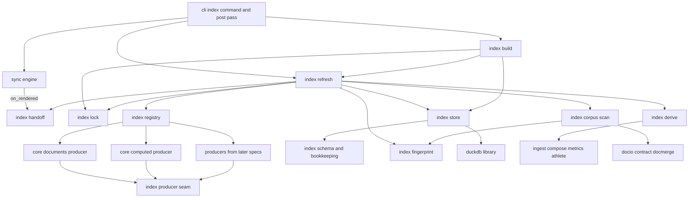
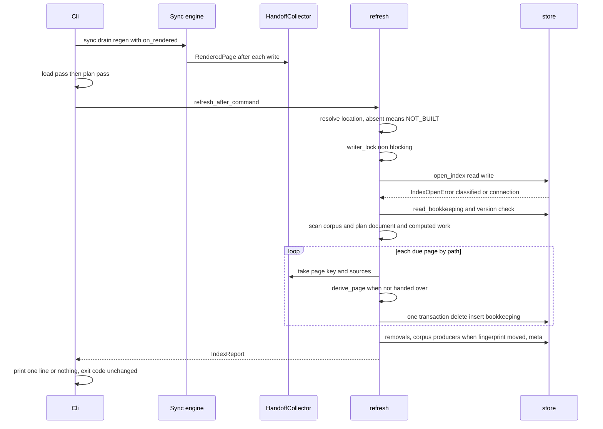
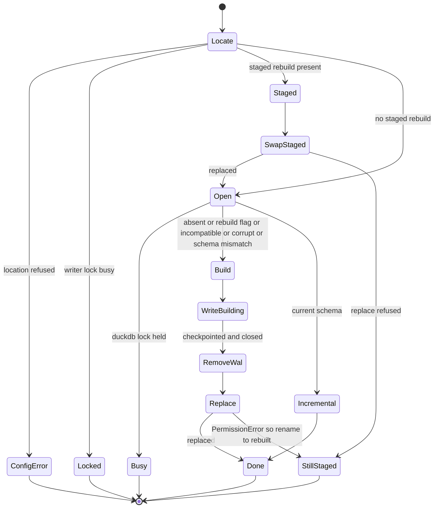

# Technical Design: analytics-index

## Overview

**Purpose**: This feature gives agents in the athlete's PKM a DuckDB database
of every workout page, written as activities are ingested and readable with
standard SQL. They can answer statistical questions about training without
reading hundreds of documents or re-implementing fitdocs's parsing,
composition and metric rules.

**Users**:
- **Agents** query the index, through `analytics-query`'s sandboxed
  `fitdocs query` or their own read-only DuckDB client.
- **The athlete** runs the writing commands that keep it current, and
  `fitdocs index` to build it.
- **The maintainer of `analytics-derived`** adds four tables through the
  producer seam this design settles.

**Impact**:
- Adds a package, `fitdocs.index`, and a twelfth CLI command, `index`.
- Adds a post-pass at the end of `sync`, the inbox drain, `pull --sync`,
  `regen` and `load`.
- Adds `duckdb>=1.1,<2` as a required runtime dependency.
- Adds an append-only hand-over callback to the sync engine.
- Adds one new write location outside the data root, so the ownership contract
  advances one version.

No document byte changes. `DOC_VERSION` is untouched.

### Goals
- One index file per data root, in a per-user cache directory outside the data
  root, refused inside it (Requirement 1).
- Core tables covering everything fitdocs knows about a page. The document
  tier (frontmatter, sources, loads, quality flags) follows every change to the
  page file. The computed tier (per-second records of every channel, laps,
  sets, derived metrics, zone times, channel provenance) follows the page's
  rendering (Requirements 2, 3, 5).
- A reconciling refresh after every writing command that writes nothing when
  nothing moved and never costs the pipeline anything (Requirements 7, 8, 9).
- `fitdocs index [--rebuild]`: the same pass, an atomic swap, progress, and
  recovery from any state (Requirement 10).
- A producer seam and a schema version that `analytics-derived` builds on
  without touching the pass (Requirement 13).

### Non-Goals
- Reading the index: `fitdocs query`, the sandbox's extra settings, timeouts,
  formats, freshness, read-side retry, the skill and `docs/analytics.md`
  (`analytics-query`).
- The four derived tables (`analytics-derived`).
- Any existing pass reading the index; any change to a document.
- Migrating an index across schema versions: a different version means rebuild.
- Building an absent index automatically, even when it would be cheap
  (research.md Decision 6).
- Windows support claims (research.md, Windows note); free-text columns;
  cross-machine sync.

## Boundary Commitments

### This Spec Owns
- **Location**: `fitdocs.index.location`. The `FITDOCS_INDEX_DIR`, then
  `XDG_CACHE_HOME`, then `~/.cache` resolution; the per-data-root key; the
  refusal; directory creation with mode `0o700`.
- **The connection policy and every SQL statement fitdocs issues**:
  `fitdocs.index.store`, the only module that imports `duckdb`. It owns:
  - the mandatory and writer settings;
  - the connection facade;
  - error classification;
  - DDL, comments and transactions;
  - the JSON-columnar insert;
  - bookkeeping reads and writes.
- **The schema contract**: `fitdocs.index.schema` and
  `fitdocs.index.bookkeeping`. They hold `SCHEMA_VERSION`, the column types,
  `TableSpec`/`ColumnSpec`, the page-key column, the reserved `index_` prefix,
  the unit-suffix vocabulary, the manifest and digest, and the three
  bookkeeping tables.
- **The producer seam**: `fitdocs.index.producer` (protocols and input types)
  and `fitdocs.index.registry` (append-only tuples).
- **The core producers**: `fitdocs.index.core.documents` (pages,
  page_sources, loads, quality_flags) and `fitdocs.index.core.computed`
  (activities, records, laps, strength_sets, zone_times, channel_sources).
- **Fingerprints, the corpus scan, re-derivation, the hand-over consumer, the
  writer lock, the refresh and the build/swap**: `fitdocs.index.fingerprint`,
  `.corpus`, `.derive`, `.handoff`, `.lock`, `.refresh`, `.build`.
- **CLI wiring**: the `index` command, `_run_index_pass` at the four call
  sites, the reporters and progress output.
- **Sync engine additions** (workout-docs Amendment 4): the `RenderedPage`
  type and the `on_rendered` keyword parameter. **docio addition**:
  `read_document`.
- **Published statements**:
  - the ownership-contract section and the `CONTRACT_VERSION` advance;
  - the CHANGELOG entry and the install-footprint note;
  - the `tech.md` and `structure.md` edits;
  - the amendment records in `plugin-api`, `distribution`, `docs-site`,
  `workout-docs` and
    `connectors`.
- **Guards**:
  - the duckdb-importer and index-importer boundaries;
  - the no-import subprocess check;
  - the reworded dependency pins;
  - the confinement entry;
  - the offline-command entry;
  - the suite-wide index-directory isolation;
  - the schema digest.

### Out of Boundary
- **The read side** (`analytics-query`): the sandbox settings beyond the
  mandatory ones, the statement timer and `interrupt` policy, lock retry and
  backoff, output formats, row cap, freshness assessment, `--schema`, the
  packaged skill and `docs/analytics.md`. This spec supplies the primitives
  query consumes (Cross-spec seams, seam 5) and makes no read-side decision.
- **Mean-max, the daily load series, the benchmark timeline and training
  blocks** (`analytics-derived`): their tables, columns, fingerprints, the
  mean-max function, and the schema-version advance they need.
- **What any document shows or when it is written.** The hand-over is
  observational only.
- **The load payload's vocabulary, the effort-tag rules, the quality-flag keys
  and the composition rules.** They are read through their owners' public
  functions and never restated.

### Allowed Dependencies
- **Pass, seam, store, schema and the core producers** may import:
  - `fitdocs.model`, `fitdocs.metrics` (`compute_metrics` and the types);
  - `fitdocs.compose` (`compose_listed`, types);
  - `fitdocs.ingest` (`parse_fit`, `FitDecodeError`);
  - `fitdocs.contract`, `fitdocs.docio`, `fitdocs.docmerge` (region
    extraction), `fitdocs.layout`;
  - `fitdocs.athlete` (`load_athlete_inputs`, `AthleteFileError`);
  - `fitdocs.load.docedit` (`classify_load_region`), `fitdocs.load.render`
    (`LoadPayload`), `fitdocs.load.types`;
  - `fitdocs.settings` (`SettingsError`), `fitdocs.version`;
  - `fitdocs.sync`, for the `RenderedPage` type only, under `TYPE_CHECKING`.
- **They never import**:
  - `fitdocs.cli`, `fitdocs.render`, `fitdocs.connectors`, `fitdocs.tiles`,
    `fitdocs.plugins`;
  - `fitdocs.history`, `fitdocs.plans`, `fitdocs.performance`;
  - the network.
- **Producer modules registered by later specs** may import the engine they
  project, such as history, plans or the profile reader. They never import
  `duckdb`, `fitdocs.cli`, or any `fitdocs.index` module other than
  `producer`, `schema` and `fingerprint`.
- **`duckdb` is imported only by `fitdocs.index.store`**, lazily, inside
  `_connect`, and under `TYPE_CHECKING` for annotations.
- **Who imports `fitdocs.index`**: only `fitdocs.cli`. The importer set is an
  append-only list: `analytics-query` adds its command module.
- **Who must not import index modules**: `fitdocs.sync` and every other
  engine. Plugin discovery never loads `duckdb`.

### Revalidation Triggers
- **The schema**: any change to a table name, column name, column type or
  order, or the page-key column. `SCHEMA_VERSION` advances, and query's docs
  pin and derived's tables re-check.
- **The producer protocols, the input types** (`PageDocument`,
  `PageComputed`, `CorpusSnapshot`) **or the table-spec types.** Derived's
  producers re-check.
- **The connection facade or the mandatory settings.** Query's sandbox
  re-checks.
- **The location function, the file names or the bookkeeping tables.** Query's
  freshness re-checks.
- **The stale-document rule or the tier definitions** (what moves a
  fingerprint). Derived's mean-max and the contract text re-check.
- **The `RenderedPage` fields or the `on_rendered` call point.** workout-docs
  and the sync tests re-check.
- **The duckdb version range.** The packaging pins, the storage-version
  guarantee and the classifier messages re-check.

### Cross-spec seams

The contracts wave-2 specs build on. Each is restated in full in its component
section.

**Seam 1: the producer seam** (`fitdocs.index.producer`, `fitdocs.index.registry`).
- **Three protocols, each with a `name: str` and `tables: tuple[TableSpec, ...]`:**
  - `DocumentProducer.rows(page: PageDocument) -> Rows`
  - `ComputedProducer.rows(page: PageComputed) -> Rows`
  - `CorpusProducer.fingerprint(corpus: CorpusSnapshot) -> str` and
    `CorpusProducer.rows(corpus: CorpusSnapshot) -> Rows`
- **Rows.** `Rows = Mapping[str, Sequence[Row]]`, keyed by every declared table
  name; an empty sequence is allowed. `Row = tuple[SqlValue, ...]` in declared
  column order. For per-page tables the row excludes `page_key`, which the pass
  prepends.
- **Registration.** A producer registers by appending to
  `registry.DOCUMENT_PRODUCERS`, `COMPUTED_PRODUCERS` or `CORPUS_PRODUCERS`.
  Nothing else changes.
- **Transactions.**
  - A page's document-tier and computed-tier updates, and its bookkeeping row,
    commit in one transaction per page.
  - Each corpus producer's tables are replaced whole in one transaction, when
    and only when its stored fingerprint differs from
    `corpus_fingerprint(producer.fingerprint(snapshot), fitdocs_version,
    SCHEMA_VERSION)`.
- **Inputs.**
  - `CorpusSnapshot` carries `data_root`, every indexed page as `CorpusPage`
    (key, path, frontmatter, document fingerprint), `today` (supplied by the
    CLI) and the current athlete-input fingerprint.
  - Corpus producers may read data-root files, read-only, and must fingerprint
    everything they read, including `today` if their rows depend on it (plan
    resolution does: `plans/matching.py:222-225`).
- **Obligations on every producer:**
  - no writes, network or clock;
  - no `duckdb`;
  - deterministic;
  - naive datetimes only;
  - a raised exception rolls back that page or producer, is reported, and is
    retried next refresh.

**Seam 2: the schema version.**
- **Home.** `fitdocs.index.schema.SCHEMA_VERSION: Final[int] = 1`.
- **The digest map.** `tests/index/test_schema_version.py` holds the
  append-only `_DIGESTS_BY_VERSION = {1: "<sha256>"}` of the canonical
  manifest (tables, columns, types, order; comments excluded).
- **The binding rule.** Every Phase 10 lander that changes the schema advances
  `SCHEMA_VERSION` by exactly one from `main`'s value when it lands and appends
  its digest. After its final rebase it asserts `SCHEMA_VERSION == main's + 1`,
  and if a sibling landed first it re-pins (the version and its digest entry).
- **analytics-query** changes no schema and never edits `SCHEMA_VERSION`.
- **Not a schema change.** A comment-only change is reapplied by the refresh
  whenever the recorded fitdocs version differs.

**Seam 3: table names and the comment contract.**
- **Names.** Table names are `snake_case` and unique across producers. The
  `index_` prefix is reserved for bookkeeping. The core names are `pages`,
  `page_sources`, `loads`, `quality_flags`, `activities`, `records`, `laps`,
  `strength_sets`, `zone_times`, `channel_sources`, plus `index_meta`,
  `index_pages` and `index_producers`.
- **Comments.** Every table and every column carries a non-empty description,
  applied as a DuckDB comment. A column whose name ends in a unit suffix names
  that unit in words (`schema.UNIT_SUFFIXES`). A table or column without one
  fails `resolve_tables` and the test suite. Comments are the single source of
  column meaning that query's `--schema` and docs project.

**Seam 4: the stale-document rule** (Requirement 5).
- **Document values** follow `document_fingerprint`: the SHA-256 of the
  data-root-relative path and the page bytes.
- **Computed values** follow `render_fingerprint`: the SHA-256 of the managed
  frontmatter minus `LOAD_KEYS`, plus the body with the `notes`, `workout` and
  `load` region contents excised.
- **Under which athlete inputs.** A page rendered by this command uses the
  inputs it was rendered under (handed over). Any other page uses the inputs
  current at the refresh.
- **Athlete-input changes** alone move no row.
  - `activities.athlete_fingerprint` and `index_meta.athlete_fingerprint` make
    every superseded row findable.
- Derived's mean-max is a `ComputedProducer` and follows this rule with no
  extra code.

**Seam 5: the connection policy.** `fitdocs.index.store` is the only `duckdb`
importer.
- **Mandatory settings on every connection.** A caller override is refused
  with `ValueError`.
  - `autoinstall_known_extensions=False`, `autoload_known_extensions=False`;
  - `allow_community_extensions=False`, `allow_persistent_secrets=False`;
  - `enable_external_access=False`, `python_enable_replacements=False`;
  - `lock_configuration=True`.
- **Writer-only:** `storage_compatibility_version="v1.0.0"`.
- **Query reuses:**
  - `location.resolve_index_location` and `IndexLocation`;
  - `store.open_index(path, read_only=True, settings=…)`, adding its own keys,
    such as `memory_limit` and `threads`;
  - the `IndexConnection` facade: `execute`, `IndexResult.columns`,
    `fetchmany`, `fetchall`, `interrupt`, `close`;
  - `IndexOpenError` with `IndexFault(kind, message, holder_pid)` from
    `classify_error`;
  - `IndexStatementError` and `IndexInterrupted`;
  - `store.read_bookkeeping`;
  - `schema.SCHEMA_VERSION`;
  - `fingerprint.document_fingerprint` and `corpus.scan_workout_pages`, for
    freshness.
- **Query owns** its additional settings, the timer, retry and backoff,
  formatting and freshness logic. A facade method query needs and this spec
  lacks is an append to `store.py` made by query.

**Seam 6: the shared registries.** These are append-only, and each sibling keeps
both entries on rebase. The full list is in tasks.md, "Cross-spec shared
files":
- the `cli.py` command count, which is "Twelve" after this spec;
- the no-network command list (`tests/connectors/test_e2e.py:203-207` and
  `tech.md`);
- the confinement entry list;
- the index-importer allow-list;
- `registry.py`, the digest map and `PACKAGED_SKILLS`.

## Architecture

### Existing Architecture Analysis
- **The pipeline is one-way:** ingest, model, metrics, load, render, data root.
  Sync renders pages serially, one at a time (`sync.py:1438-1466`), and holds
  the composed `Activity`, `DerivedMetrics` and `ChannelProvenance` only as
  `_page_task` locals (`sync.py:1979-2016`).
- **Each corpus pass rescans `workouts/*.md`** through `docio.read_frontmatter`.
  No shared corpus scan exists.
- **The load pass re-derives a page** from its archive: `load/engine.py:458-477`
  takes the last ref, runs `parse_fit` and `compose_listed`, then
  `compute_metrics`.
- **The CLI chains passes**: `sync`/`drain`/`regen` run the load pass and then
  the plan pass; `load` runs the load pass alone. Each pass has its own rich
  reporter on stdout. A chained configuration error exits 2.
- **The precedent for a write location outside the data root** is the
  connector credentials store (`connectors/credentials.py:62-128`). The
  precedent for single-importer guards is `tests/connectors/test_boundary.py`.
- **No CLI test isolates HOME**, except under `tests/connectors`.

### Architecture Pattern & Boundary Map

The internal structure is ports and adapters around a pure core:
- the pure core: row extraction, fingerprints, planning;
- one adapter: `store`, which owns all SQL and the only `duckdb` import;
- one orchestrator: `refresh` and `build`.



**Architecture integration**:
- **Selected pattern.** A reconciling projection (decided at discovery),
  structured as a pure core with a single store adapter.
- **Boundaries.** `store` is the only module that speaks SQL or imports
  `duckdb`. Producers never see a connection. The refresh never names a table.
- **Existing patterns preserved:**
  - the credentials-style location;
  - per-type CLI reporters;
  - the exit-code constants;
  - the load pass's re-derivation rule;
  - the AST import guards with positive controls;
  - the subprocess `sys.modules` checks.
- **Dependency direction**, from left to right:
  - `schema`, `bookkeeping`, `producer`;
  - `fingerprint`, `core.*`, `registry`;
  - `corpus`, `derive`, `handoff`, `lock`, `location`;
  - `store`;
  - `refresh`;
  - `build`;
  - `cli`.

  A module imports only modules to its left, plus the allowed engine modules.
  `store` imports only `schema`, `bookkeeping` and the `producer` types,
  never `refresh`.
- **Steering compliance:**
  - absent data is `None`, then `NULL`;
  - no network;
  - `mypy --strict`;
  - the one-way dependency rule extended for `index` (a `structure.md` edit).

### Technology Stack

| Layer | Choice / Version | Role in Feature | Notes |
|---|---|---|---|
| Data / Storage | `duckdb>=1.1,<2` (locked 1.5.6) | The index file, DDL, comments, the JSON-columnar insert | New core runtime dependency. About 44 MB installed. No musllinux or free-threaded wheels. |
| Runtime | Python 3.11+, stdlib `hashlib`, `json`, `fcntl`/`msvcrt`, `os.replace` | Fingerprints, payload serialization, the writer lock, the atomic swap | No other new dependency |
| CLI | `typer` + `rich` (existing) | The `index` command, reporters, progress on stderr | One `Console(stderr=True)` for progress |

## File Structure Plan

### Directory Structure
```
src/fitdocs/index/
├── __init__.py        # Package docstring: the index is a disposable projection; imports nothing heavy (never duckdb)
├── location.py        # FITDOCS_INDEX_DIR > XDG_CACHE_HOME > ~/.cache resolution, per-data-root key, refusal, 0o700 mkdir
├── schema.py          # SCHEMA_VERSION, ColumnType, ColumnSpec, TableSpec, PAGE_KEY column, UNIT_SUFFIXES, resolve_tables, manifest/digest
├── bookkeeping.py     # index_meta / index_pages / index_producers TableSpecs; IndexMeta, PageState, ComputedState, Bookkeeping types
├── producer.py        # The seam: SqlValue, Row, Rows, LoadRegionReading, PageDocument, PageComputed, CorpusPage, CorpusSnapshot, the three Protocols
├── registry.py        # DOCUMENT_PRODUCERS, COMPUTED_PRODUCERS, CORPUS_PRODUCERS (append-only); registered_tables()
├── fingerprint.py     # document_fingerprint, render_fingerprint, athlete_fingerprint, corpus_fingerprint (pure)
├── core/
│   ├── __init__.py
│   ├── documents.py   # CORE_DOCUMENTS producer: pages, page_sources, loads, quality_flags (pure row extraction)
│   └── computed.py    # CORE_COMPUTED producer: activities, records, laps, strength_sets, zone_times, channel_sources (pure)
├── corpus.py          # scan_workout_pages: read every workouts/*.md once, keys, document fingerprints, collisions, left-out pages
├── derive.py          # derive_page: the load pass's re-derivation rule; ComputedState on missing/unreadable/undecodable
├── handoff.py         # HandoffCollector (on_rendered consumer), HANDOFF_SAMPLE_BUDGET
├── lock.py            # writer_lock: non-blocking OS advisory lock on index.lock; WriterBusy
├── store.py           # THE ONLY duckdb IMPORTER: settings, facade, classify_error, DDL+comments, transactions, JSON insert, bookkeeping I/O
├── refresh.py         # reconcile (plan + dispatch + transactions), refresh_after_command (post-pass, never raises)
└── build.py           # run_index_command: staged-swap completion, build into index.duckdb.building, WAL removal, os.replace, fallback

tests/index/
├── conftest.py                 # index fixtures: synthetic pages via the real sync, a built index, a held-lock subprocess helper
├── test_location.py            # resolution order, refusal, key stability, permissions
├── test_schema.py              # naming, descriptions, unit words, model-field pins
├── test_schema_version.py      # _DIGESTS_BY_VERSION (append-only) and the version pin
├── test_fingerprint.py         # which edits move which fingerprint
├── test_core_documents.py      # document-tier rows
├── test_core_computed.py       # computed-tier rows
├── test_corpus.py              # scan, keys, collisions, left-out pages
├── test_derive.py              # re-derivation states
├── test_handoff.py             # budget, replacement, sources check
├── test_lock.py                # busy, released at process end
├── test_store.py               # settings, facade, classifier (real messages), insert round-trip, no constraints, storage version
├── test_refresh.py             # reconcile behaviour, tiers, removal, rename, retries, rollback, corpus gating, no-op byte identity
├── test_build.py               # build, rebuild, recovery, WAL removal, staged fallback, reader during swap
├── test_determinism.py         # identical rows across order / hand-over / rebuild
├── test_cli_index.py           # the command: output, progress, exit codes
├── test_cli_post_pass.py       # the four call sites, isolation of failures, silence, untouched commands
└── test_boundary.py            # duckdb importer, index importers, no network SQL, subprocess no-import
```

### Modified Files
- `src/fitdocs/sync.py`: appends the frozen dataclass `RenderedPage` (`doc_ref`,
  `sources`, `composition`, `metrics`, `athlete`) and a keyword-only
  `on_rendered: Callable[[RenderedPage], None] | None = None` on `sync`,
  `drain` and `regen`.
  - The parameter is threaded through `_run_planned`, `_group_task`,
    `_process_isolated` and `_settle_pass` to `_page_task`.
  - `_page_task` calls it once, immediately after `_write_outputs` returns,
    never on a path that writes nothing.
  - Nothing else in the module changes.
- `src/fitdocs/docio.py`: appends `read_document(path) -> DocumentRead | None`,
  which returns bytes, text and the parsed frontmatter, with the same symlink
  refusal and never raising. `read_frontmatter` delegates to it, keeping one
  read primitive (the module docstring's rule).
- `src/fitdocs/cli.py`:
  - the module docstring's command count goes from "Eleven" to "Twelve", with
    an `index` entry;
  - `index_command`;
  - `_run_index_pass`, called after the plan pass in `sync SOURCE`,
    `_run_drain_passes` and `regen`, and after the load pass in `load`, always
    before `_report_plugin_errors`;
  - a `HandoffCollector` is created before `sync`/`drain`/`regen` and passed
    as `on_rendered`;
  - `_report_index_pass`, `_report_index_command` and `_index_progress`.
- `src/fitdocs/contract.py`: `CONTRACT_VERSION` goes from `main`'s value to
  that value plus one (currently `"8"` to `"9"`), with a history paragraph.
- `pyproject.toml`: `duckdb>=1.1,<2` appended to `[project].dependencies`, and
  the new test modules added to the mypy `files` list. `uv.lock` is
  regenerated.
- `docs/ownership-contract.md`:
  - the contract version, and "what changed at this version";
  - the write-set sentence (lines 182-191);
  - the outside-the-data-root count (642-646);
  - a new index-directory bullet beside the credentials bullet (672-685);
  - an overwrite-semantics bullet for the refresh and for `fitdocs index`;
  - the agreement rule (Requirement 5.7).
- `docs/install.md`: a footprint and platform-gap note under "Install the tool".
- `CHANGELOG.md`: `[Unreleased]` gains an `### Added` entry and a
  `### Changed` contract-version entry.
- `.kiro/steering/tech.md`:
  - the "No server, no database" paragraph rewritten, replacing the Phase 10
    forward note;
  - Key Libraries gains `duckdb`;
  - Network and Credentials gains the index sentence and drops "the frozen
    runtime dependency list is unchanged".
- `.kiro/steering/structure.md`: the dependency-direction sentence for
  `index`.
- Test suites amended:
  - `tests/conftest.py`: an autouse `FITDOCS_INDEX_DIR` isolation fixture;
  - `tests/test_determinism.py:666-715`, `tests/test_packaging.py:503-519`
    and `:1036-1090`, `tests/test_preserved_guarantees.py:93-108`, and
    `tests/sitebuild/test_repo_wiring.py:18-24, 64-72` (docs-site's
    `PRE_SPEC_DEPENDENCIES` pin);
  - `tests/test_confinement.py`: the `index` entry, and the index directory as
    a permitted location;
  - `tests/connectors/test_e2e.py:203-244`: `index` joins the offline list,
    with location substitution;
  - `tests/test_inbox_e2e.py:100-175`: a second drain leaves the index
    byte-identical;
  - `tests/test_cli_skill.py:262-270`: the count goes from 11 to 12;
  - the contract-version pins: `tests/test_ownership_contract.py`, the
    phrase pins in `tests/identity/test_contract_docs.py:155-165` moved into
    the history docstring, and `tests/declaration_golden/*.AGENTS.md`;
  - any test pinning full `sync`/`regen`/`load` stdout. The isolated run
    prints the "not built" line, and those tests are named in task 7.2.
- Spec records:
  - `.kiro/specs/plugin-api/requirements.md` (Amendment 1);
  - `.kiro/specs/distribution/requirements.md` (Amendment 4);
  - `.kiro/specs/docs-site/requirements.md` (Amendment 1);
  - `.kiro/specs/workout-docs/requirements.md` (Amendment 4);
  - `.kiro/specs/connectors/requirements.md` (Amendment 1);
  - `.kiro/steering/roadmap.md`: the Existing Spec Updates ticks, and the
    connectors line as "(analytics-index part landed)".

## System Flows

### The refresh after a writing command



**Key decisions**:
- **Planning reads nothing but the pages.** `render_fingerprint` is computed
  only for pages whose document fingerprint moved.
- **A page needs computed work** when:
  - it is new;
  - its render fingerprint moved;
  - its computed state is not `computed` (a retry). A `source_missing` retry is
    a stat of the base archive, so it costs nothing until the file appears.
- **No write when nothing changes.** A page whose retry reaches the same state,
  with no document change, issues no statement. A refresh with no due work, no
  removal, no moved corpus fingerprint and unchanged meta issues no write.
  Probe P5 shows an RW open and close then leaves the file byte-identical.

### `fitdocs index` and the swap



**Key decisions**:
- **The build file.** Every build writes `index.duckdb.building` from empty
  through the same `reconcile`, with all pages new.
- **The swap**, all under the writer lock:
  1. `CHECKPOINT` and close the build file, so it leaves no WAL.
  2. Remove a leftover `index.duckdb.building` and its `.wal` before
     starting.
  3. Remove `index.duckdb.wal` before the swap (probe P4).
  4. `os.replace` the build onto `index.duckdb`.
- **Exit codes.** Done exits 0. Locked, Busy and StillStaged exit 1. A refused
  location exits 2.

## Requirements Traceability

| Req | Summary | Components | Interfaces / notes |
|---|---|---|---|
| 1.1 | Resolution order | Location | `resolve_index_base`, `resolve_index_location` |
| 1.2 | Keyed by resolved data root | Location | `data_root_key` uses `Path.resolve()` |
| 1.3 | Relative env var refused | Location | `IndexLocationError` (exit 2 / reported) |
| 1.4 | Refused inside data root | Location | `is_relative_to` on resolved paths |
| 1.5 | Writes only in index dir | Location, Build, Refresh, Store, Lock | Confinement guard entry |
| 1.6 | 0o700 directories | Location | `ensure_directory` |
| 1.7 | Fully rebuildable | Refresh, Build | Build = reconcile from empty; no clock or external state in rows |
| 2.1 | Page row | CoreDocuments | `pages` table |
| 2.2 | Effort tag, invalid recorded | CoreDocuments | `contract.effort_tag`; `effort_invalid` |
| 2.3 | Source rows | CoreDocuments | `page_sources` |
| 2.4 | Per-channel loads | CoreDocuments | `loads` from `LoadPayload.result` |
| 2.5 | Quality flags | CoreDocuments | `quality_flags` |
| 2.6 | Load status | CoreDocuments | `pages.load_status` from `classify_load_region` |
| 2.7 | No free text | CoreDocuments, Schema | Column inventory; regions never read |
| 3.1 | Activity row | CoreComputed | `activities` (DerivedMetrics scalars) |
| 3.2 | Record rows | CoreComputed | `records` (every `Samples` channel) |
| 3.3 | Lap rows | CoreComputed | `laps` |
| 3.4 | Strength-set rows | CoreComputed | `strength_sets` |
| 3.5 | Zone-time rows | CoreComputed | `zone_times` with bounds from `AthleteInputs` |
| 3.6 | Channel provenance | CoreComputed | `channel_sources` from `ChannelProvenance` |
| 3.7 | Uncomposable page | Derive, Refresh, Bookkeeping | `ComputedState`, `index_pages.computed_state` |
| 3.8 | New channel fails tests | Schema tests | `records` columns ⇔ `fields(Samples)` pin |
| 4.1 | NULL never 0/NaN | Store, core producers | Non-finite becomes `None`; `json.dumps(allow_nan=False)` |
| 4.2 | Unit suffixes | Schema | `UNIT_SUFFIXES` |
| 4.3 | Descriptions as comments, reapplied | Schema, Store | `create_schema`, `apply_descriptions` |
| 4.4 | Zone-free instants | Schema | `TIMESTAMP` only; `_utc` and `_local` suffixes |
| 4.5 | Same rows for same inputs | Refresh, Handoff, Derive | Determinism tests |
| 4.6 | Missing description fails | Schema tests | `resolve_tables` validation |
| 5.1 | Document values follow file | Fingerprint, Refresh | `document_fingerprint` includes path |
| 5.2 | Computed values follow rendering | Fingerprint, Refresh | `render_fingerprint`; retry on non-computed state |
| 5.3 | Handed-over values | Handoff, Refresh | `HandoffCollector.take` |
| 5.4 | Re-derivation rule | Derive | `derive_page` |
| 5.5 | Athlete change moves nothing | Refresh, Fingerprint, Bookkeeping | `activities.athlete_fingerprint`, `index_meta.athlete_fingerprint` |
| 5.6 | Index never read into output | Boundary guard | Importer allow-list (cli only) |
| 5.7 | Contract states the rule | ContractDocs | Ownership-contract section |
| 6.1 | Key = base content hash | Corpus | `page_key = sha_of_ref(sources[-1])` |
| 6.2 | Duplicate base | Corpus, CLI reporter | `LeftOutPage(reason="duplicate_base")` |
| 6.3 | Page replaced as a unit | Refresh, Store | One transaction per page |
| 6.4 | Base change re-keys | Refresh | Old key removed, new key added |
| 6.5 | Exactly one set, no constraints | Store, Refresh | Delete-then-insert; no `PRIMARY KEY`/`UNIQUE`/index |
| 7.1 | Refresh after passes | CliWiring | `_run_index_pass` call sites |
| 7.2 | Add, update, remove | Refresh | `reconcile` plan |
| 7.3 | Tag and load rewrites reach index | Refresh, Fingerprint | Document tier |
| 7.4 | No-op writes nothing | Refresh, Store | Due-work gating; probe P5 |
| 7.5 | No re-read of written pages, bounded | Handoff, SyncHandoff | `HANDOFF_SAMPLE_BUDGET = 250_000` |
| 7.6 | One line or nothing | CliWiring | `_report_index_pass` |
| 7.7 | Progress over 100 | Refresh, CliWiring | `progress(done, total)` every 100 to stderr |
| 7.8 | Other commands untouched | CliWiring, Boundary | Subprocess no-import; directory untouched |
| 8.1 | Absent: report, do not create | Refresh | `Outcome.NOT_BUILT` |
| 8.2 | Unopenable or other version: report | Refresh, Store | `Outcome.NEEDS_REBUILD` |
| 8.3 | Build only on command | Refresh, Build | `refresh_after_command` never calls `build` |
| 9.1 | Writes before refresh | CliWiring | Call-site placement |
| 9.2 | Failure never changes exit | CliWiring, Refresh | Catch-all to `Outcome.FAILED`; `_finish` unchanged |
| 9.3 | Held lock reported with PID | Store, Refresh | `IndexFault.holder_pid` |
| 9.4 | Page error keeps previous rows | Refresh, Store | Per-page transaction rollback |
| 9.5 | No state between refreshes | Refresh | Reconciles against disk |
| 9.6 | Interrupted: old or new per page | Store, Refresh | Per-page transaction; WAL replay |
| 9.7 | Data-root bytes unchanged | Boundary, Confinement | Byte comparison with and without an index |
| 10.1 | `fitdocs index`, `--out` | CliWiring, Build | `index_command` |
| 10.2 | Builds when absent | Build | `run_index_command` |
| 10.3 | `--rebuild` | Build | `rebuild=True` |
| 10.4 | Rebuild on incompatible or corrupt | Build, Store | `classify_error`, `read_bookkeeping` |
| 10.5 | Separate file, whole swap | Build | `index.duckdb.building` and `os.replace` |
| 10.6 | No foreign recovery data | Build | Remove `index.duckdb.wal` under the lock |
| 10.7 | Replace refused: staged | Build | `index.duckdb.rebuilt`, completed next run |
| 10.8 | Final report | CliWiring | `_report_index_command` |
| 10.9 | Exit codes 0/1/2 | CliWiring | `_EXIT_*` constants |
| 10.10 | No network, no data-root write | Store, Boundary, Confinement | Offline list entry |
| 11.1 | One writer | Lock | `writer_lock` |
| 11.2 | Busy reported at once | Lock, Store | `WriterBusy`, `FaultKind.LOCKED` |
| 11.3 | No stale marker | Lock | OS advisory lock released at exit |
| 11.4 | 1.x-readable format | Store | `storage_compatibility_version="v1.0.0"`; header version 64 |
| 12.1 | Connection settings | Store | `MANDATORY_SETTINGS`, `lock_configuration` |
| 12.2 | No network | Store, Boundary | Settings test; no `INSTALL`/`LOAD`/URL in store SQL |
| 12.3 | Dependency declared | Packaging | `pyproject.toml`, reworded pins |
| 12.4 | No load when unused | Store, Boundary | Lazy import; subprocess check |
| 12.5 | No-network list, statement | ContractDocs, Steering | `tech.md`, offline e2e list |
| 12.6 | Footprint documented | ContractDocs | `docs/install.md` |
| 13.1 | Tables only from producers | Registry, Schema | `registered_tables` |
| 13.2 | Per-page producer tiers | Producer seam, Refresh | `DocumentProducer`, `ComputedProducer` |
| 13.3 | Corpus fingerprint gating | Producer seam, Refresh | `corpus_fingerprint` |
| 13.4 | Register without code change | Registry | Append-only tuples |
| 13.5 | Bookkeeping recorded | Bookkeeping, Store | `index_meta`, `index_pages`, `index_producers` |
| 13.6 | Version 1, +1 per lander | Schema | `SCHEMA_VERSION = 1`; the binding rule |
| 13.7 | Schema drift fails | Schema tests | `_DIGESTS_BY_VERSION` |
| 13.8 | Comments reapplied on version change | Refresh, Store | `apply_descriptions` |
| 14.1 | Contract statements | ContractDocs | `docs/ownership-contract.md` |
| 14.2 | Contract version +1 | FormatVersion | `CONTRACT_VERSION` |
| 14.3 | Documents unchanged | Boundary tests | Golden docs untouched; `DOC_VERSION` unchanged |
| 14.4 | Release notes | ContractDocs | `CHANGELOG.md` |
| 14.5 | Steering | Steering | `tech.md`, `structure.md` |
| 14.6 | Tests never touch real home | TestIsolation | Autouse fixture |
| 14.7 | Confinement and importer guards | Guards | `test_confinement.py`, `tests/index/test_boundary.py` |
| 14.8 | Amendment records | SpecRecords | Five amendments |

## Components and Interfaces

| Component | Layer | Intent | Req coverage | Key dependencies | Contracts |
|---|---|---|---|---|---|
| Location | config | Resolve and refuse the index directory | 1.1–1.6 | settings (P0) | Service |
| Schema | contract | Version, types, table specs, validation, digest | 4.2–4.4, 4.6, 13.1, 13.6, 13.7, 3.8 | — | State |
| Bookkeeping | contract | Bookkeeping tables and types | 3.7, 5.5, 13.5 | Schema (P0) | State |
| ProducerSeam | contract | Protocols and input types | 13.1–13.4 | model, metrics, compose, load types (P0) | Service |
| Registry | contract | The registered producers | 13.1, 13.4 | core producers (P0) | State |
| Fingerprint | pure | Document, render, athlete and corpus fingerprints | 5.1, 5.2, 5.5, 7.3, 13.3 | contract, docmerge (P0) | Service |
| CoreDocuments | pure | Document-tier rows | 2.1–2.7 | contract, load (P0) | Service |
| CoreComputed | pure | Computed-tier rows | 3.1–3.6 | model, metrics, compose (P0) | Service |
| Corpus | io | Scan pages once; keys, collisions | 6.1, 6.2, 7.2 | docio (P0) | Service |
| Derive | io | Re-derive a page by the load pass rule | 3.7, 5.4 | ingest, compose, metrics (P0) | Service |
| Handoff | pure | Bounded consumer of `RenderedPage` | 5.3, 7.5 | sync type (P1) | Service, State |
| SyncHandoff | engine | `on_rendered` in the sync engine | 7.5, 14.8 | sync (P0) | Event |
| Lock | io | One fitdocs writer | 11.1–11.3 | stdlib (P0) | Service |
| Store | adapter | Only duckdb importer; SQL, settings, facade, classification | 4.1, 4.3, 6.3, 6.5, 9.3, 9.6, 11.4, 12.1, 12.2, 12.4 | duckdb (P0) | Service, State |
| Refresh | orchestration | Reconcile; post-pass entry | 5.x, 6.3, 6.4, 7.2–7.4, 7.7, 8.x, 9.x, 13.2, 13.3, 13.8 | all above (P0) | Batch |
| Build | orchestration | `fitdocs index`: build, swap, recover | 10.2–10.7, 10.9 | Refresh, Store, Lock (P0) | Batch |
| CliWiring | cli | Command, call sites, reporters, progress | 7.1, 7.6, 7.8, 9.1, 9.2, 10.1, 10.8–10.10 | Refresh, Build (P0) | Service |
| FormatVersion and ContractDocs | docs | Contract version and published statements | 5.7, 12.5, 12.6, 14.1–14.4 | — | — |
| Steering and SpecRecords | records | `tech.md`, `structure.md`, the five amendments | 14.5, 14.8 | — | — |
| Guards and TestIsolation | tests | Boundaries, pins, isolation | 3.8, 4.6, 7.8, 9.7, 12.3, 12.4, 13.7, 14.6, 14.7 | — | — |

### Configuration and contract layer

#### Location (`src/fitdocs/index/location.py`)

| Field | Detail |
|---|---|
| Intent | Resolve the per-data-root index directory and file names, and refuse unsafe locations |
| Requirements | 1.1, 1.2, 1.3, 1.4, 1.5, 1.6 |

**Responsibilities & constraints**
- **Resolution order.** It mirrors `connectors/credentials.py:87-128`. `FITDOCS_INDEX_DIR` comes first, when non-empty; it must be absolute, and is refused otherwise. Then `$XDG_CACHE_HOME/fitdocs/index`, when `XDG_CACHE_HOME` is absolute; a relative value is skipped, not refused. Then `<home>/.cache/fitdocs/index`.
- **The per-data-root key.** It is `f"{slug}-{digest}"`:
  - `slug` is the resolved data root's basename, lowercased, with runs of characters outside `[a-z0-9]` replaced by `-`, trimmed, cut to 24 characters, and `root` when empty;
  - `digest` is the first 16 hex characters of the SHA-256 of `str(data_root.resolve())`.
- **The refusal.** If the per-data-root directory, resolved, equals the resolved data root or `is_relative_to` it, it raises `IndexLocationError(SettingsError)`. The message names both paths.
- **`ensure_directory`.** It creates any missing directory on the path from the base to the per-data-root directory with mode `0o700`, and never changes an existing directory's mode. It is called only by `build`.

```python
INDEX_DIR_ENV: Final[str] = "FITDOCS_INDEX_DIR"
XDG_CACHE_HOME_ENV: Final[str] = "XDG_CACHE_HOME"
INDEX_FILENAME: Final[str] = "index.duckdb"

class IndexLocationError(SettingsError): ...

@dataclass(frozen=True)
class IndexLocation:
    data_root: Path      # resolved
    base_dir: Path       # resolved index base
    directory: Path      # base_dir / data_root_key(data_root)
    database: Path       # directory / "index.duckdb"
    wal: Path            # directory / "index.duckdb.wal"
    lock: Path           # directory / "index.lock"
    building: Path       # directory / "index.duckdb.building"
    staged: Path         # directory / "index.duckdb.rebuilt"

def resolve_index_base(environ: Mapping[str, str], home: Path) -> Path: ...
def data_root_key(data_root: Path) -> str: ...
def resolve_index_location(data_root: Path, environ: Mapping[str, str], home: Path) -> IndexLocation: ...
def ensure_directory(location: IndexLocation) -> None: ...
```
- **Postcondition**: every path in an `IndexLocation` is inside `directory`, and `directory` is not inside `data_root`.

#### Schema (`src/fitdocs/index/schema.py`)

| Field | Detail |
|---|---|
| Intent | The schema contract: version, column types, table and column specs, validation, digest |
| Requirements | 3.8, 4.2, 4.3, 4.4, 4.6, 13.1, 13.6, 13.7 |

```python
SCHEMA_VERSION: Final[int] = 1

class ColumnType(StrEnum):
    VARCHAR = "VARCHAR"; BOOLEAN = "BOOLEAN"; INTEGER = "INTEGER"; BIGINT = "BIGINT"
    DOUBLE = "DOUBLE"; DATE = "DATE"; TIMESTAMP = "TIMESTAMP"; VARCHAR_LIST = "VARCHAR[]"

@dataclass(frozen=True)
class ColumnSpec:
    name: str
    type: ColumnType
    description: str

@dataclass(frozen=True)
class TableSpec:
    name: str
    description: str
    columns: tuple[ColumnSpec, ...]

class TableScope(StrEnum):
    DOCUMENT = "document"; COMPUTED = "computed"; CORPUS = "corpus"; BOOKKEEPING = "bookkeeping"

@dataclass(frozen=True)
class ResolvedTable:
    producer: str
    scope: TableScope
    name: str
    description: str
    columns: tuple[ColumnSpec, ...]   # PAGE_KEY_COLUMN prepended for DOCUMENT and COMPUTED scopes

PAGE_KEY_COLUMN: Final[ColumnSpec]   # page_key VARCHAR: "Key of the workout page: the SHA-256 (64 hex) of the page's base file, the last file its sources list."
RESERVED_PREFIX: Final[str] = "index_"
UNIT_SUFFIXES: Final[tuple[tuple[str, str], ...]]   # longest first; see Data Models

class SchemaError(ValueError): ...

def resolve_tables(document: Sequence[DocumentProducerLike], computed: Sequence[ComputedProducerLike],
                   corpus: Sequence[CorpusProducerLike], bookkeeping: Sequence[TableSpec]) -> tuple[ResolvedTable, ...]: ...
def schema_manifest(tables: Sequence[ResolvedTable]) -> tuple[tuple[str, tuple[tuple[str, str], ...]], ...]: ...
def schema_digest(tables: Sequence[ResolvedTable]) -> str: ...
```
- **`resolve_tables` raises `SchemaError`** on any of:
  - a duplicate producer or table name;
  - a non-`snake_case` name;
  - a producer table using the reserved prefix;
  - a declared `page_key` column in a per-page table;
  - an empty description;
  - a column whose name ends in a known unit suffix whose description lacks
    that unit's word;
  - a `TIMESTAMP` column whose name does not end in `_utc` or `_local`.

  The table order is bookkeeping first, then document, computed and corpus,
  in registry order.
- **`schema_manifest`** is `(table, ((column, type), ...))`, sorted by table
  name, with columns in declared order and descriptions excluded.
  `schema_digest` is the SHA-256 of its canonical JSON.

#### Bookkeeping (`src/fitdocs/index/bookkeeping.py`)

| Field | Detail |
|---|---|
| Intent | The pass's own tables and their typed rows |
| Requirements | 3.7, 5.5, 13.5 |

```python
class ComputedState(StrEnum):
    COMPUTED = "computed"; SOURCE_MISSING = "source_missing"
    SOURCE_UNREADABLE = "source_unreadable"; SOURCE_UNDECODABLE = "source_undecodable"

@dataclass(frozen=True)
class IndexMeta:
    schema_version: int; fitdocs_version: str | None; duckdb_version: str
    data_root: str; athlete_fingerprint: str

@dataclass(frozen=True)
class PageState:
    page_key: str; path: str; document_fingerprint: str
    render_fingerprint: str | None; computed_state: ComputedState

@dataclass(frozen=True)
class Bookkeeping:
    meta: IndexMeta
    pages: Mapping[str, PageState]           # by page_key
    producers: Mapping[str, str | None]      # producer name -> stored corpus fingerprint (None for per-page)

BOOKKEEPING_TABLES: Final[tuple[TableSpec, ...]]   # index_meta, index_pages, index_producers (Data Models)
```

#### ProducerSeam (`src/fitdocs/index/producer.py`)

| Field | Detail |
|---|---|
| Intent | The contract every producer implements, and the inputs the pass hands it |
| Requirements | 13.1, 13.2, 13.3, 13.4 |

**Contracts**: Service [x]

```python
SqlValue = str | int | float | bool | date | datetime | tuple[str, ...] | None
Row = tuple[SqlValue, ...]
Rows = Mapping[str, Sequence[Row]]

LoadStatus = Literal["computed", "unsupported", "not_computed", "unreadable"]

@dataclass(frozen=True)
class LoadRegionReading:
    status: LoadStatus          # COMPUTED->computed, UNSUPPORTED->unsupported, PLACEHOLDER->not_computed, SUPERSEDED/FOREIGN->unreadable
    payload: LoadPayload | None # parsed only for computed and unsupported

@dataclass(frozen=True)
class PageDocument:
    page_key: str
    path: str                     # data-root-relative POSIX path
    text: str                     # the page file decoded as UTF-8
    frontmatter: Mapping[str, object]
    sources: tuple[str, ...]      # contract.source_refs(frontmatter)
    load: LoadRegionReading

@dataclass(frozen=True)
class PageComputed:
    document: PageDocument
    activity: Activity            # composed (base + extras)
    metrics: DerivedMetrics
    provenance: ChannelProvenance
    athlete: AthleteInputs | None # the inputs the metrics were computed under
    athlete_fingerprint: str

@dataclass(frozen=True)
class CorpusPage:
    page_key: str
    path: str
    frontmatter: Mapping[str, object]
    document_fingerprint: str

@dataclass(frozen=True)
class CorpusSnapshot:
    data_root: Path
    pages: tuple[CorpusPage, ...]   # every page the index holds after this refresh, sorted by path
    today: date                     # from the CLI's _today(); producers that use it must fingerprint it
    athlete_fingerprint: str        # of the athlete inputs current at this refresh

class DocumentProducer(Protocol):
    @property
    def name(self) -> str: ...
    @property
    def tables(self) -> tuple[TableSpec, ...]: ...
    def rows(self, page: PageDocument) -> Rows: ...

class ComputedProducer(Protocol):
    @property
    def name(self) -> str: ...
    @property
    def tables(self) -> tuple[TableSpec, ...]: ...
    def rows(self, page: PageComputed) -> Rows: ...

class CorpusProducer(Protocol):
    @property
    def name(self) -> str: ...
    @property
    def tables(self) -> tuple[TableSpec, ...]: ...
    def fingerprint(self, corpus: CorpusSnapshot) -> str: ...
    def rows(self, corpus: CorpusSnapshot) -> Rows: ...
```
- **Preconditions.** A document producer is called only for a page whose
  document fingerprint moved, or which is new. A computed producer is called
  only when the page's computed values are due and composable. A corpus
  producer's `rows` is called only when its combined fingerprint moved.
- **Postconditions**, checked by the store at insert:
  - `rows` returns a key for every declared table and no other;
  - each row's length equals the declared column count, excluding `page_key`;
  - each value matches its column type: `bool` only for `BOOLEAN`, `int` or
    `bool`-free `int` for `INTEGER`/`BIGINT`, `int` or `float` for `DOUBLE`,
    `date` (not `datetime`) for `DATE`, naive `datetime` for `TIMESTAMP`,
    `tuple[str, ...]` for `VARCHAR[]`.

  A violation raises `RowShapeError`, which the refresh treats as that page's
  or producer's error.
- **Invariants.** Producers are pure with respect to the index. They never
  import `duckdb`, write a file, open the network or read the clock. The same
  input yields the same rows as a multiset.
- **Per-page tables carry no `page_key` of their own**: the store prepends it.
  Corpus tables that refer to pages declare their own `page_key` column, taking
  values from `CorpusPage.page_key`.

#### Registry (`src/fitdocs/index/registry.py`)

| Field | Detail |
|---|---|
| Intent | The one place producers are registered |
| Requirements | 13.1, 13.4 |

```python
DOCUMENT_PRODUCERS: Final[tuple[DocumentProducer, ...]] = (CORE_DOCUMENTS,)
COMPUTED_PRODUCERS: Final[tuple[ComputedProducer, ...]] = (CORE_COMPUTED,)
CORPUS_PRODUCERS: Final[tuple[CorpusProducer, ...]] = ()

def registered_tables() -> tuple[ResolvedTable, ...]: ...   # resolve_tables(..., BOOKKEEPING_TABLES)
```
- The tuples are append-only. A later spec appends. The core producers stay
  first.

### Pure core

#### Fingerprint (`src/fitdocs/index/fingerprint.py`)

| Field | Detail |
|---|---|
| Intent | What counts as "moved", stated once |
| Requirements | 5.1, 5.2, 5.5, 7.3, 13.3 |

```python
def document_fingerprint(path: str, data: bytes) -> str: ...
def render_fingerprint(text: str, frontmatter: Mapping[str, object]) -> str: ...
def athlete_fingerprint(inputs: AthleteInputs | None) -> str: ...
def corpus_fingerprint(producer_fingerprint: str, *, fitdocs_version: str | None, schema_version: int) -> str: ...
```
- **`document_fingerprint`** is the SHA-256 of `path.encode() + b"\0" + data`.
  A rename moves it.
- **`render_fingerprint`** is the SHA-256 of the canonical JSON
  `{"managed": {k: frontmatter[k] for k in sorted(frontmatter) if k in
  MANAGED_KEYS and k not in LOAD_KEYS}, "body": body}`.
  - `body` is the text after the frontmatter block, with each of
    `PRESERVED_REGIONS`' contents replaced by the empty string (the markers
    stay). It uses the region grammar of `fitdocs.docmerge`.
  - Values are serialized with `default=str`, and keys sorted.
  - The user-owned effort keys, the load keys, unmanaged keys and the three
    regions therefore never move it. Every other byte fitdocs's rendering
    writes does.
- **`athlete_fingerprint`** is the SHA-256 of a fixed-order rendering of every
  `AthleteInputs` field: floats by `repr`, so NaN is representable; zones as
  divider lists; `None` as `null`. When there are no inputs at all, the
  rendering is the literal `"absent"`.
- **`corpus_fingerprint`** is the SHA-256 of the canonical JSON of the three
  arguments.

#### CoreDocuments (`src/fitdocs/index/core/documents.py`)

| Field | Detail |
|---|---|
| Intent | Document-tier rows from the page file alone |
| Requirements | 2.1, 2.2, 2.3, 2.4, 2.5, 2.6, 2.7 |

- **One `DocumentProducer`, `CORE_DOCUMENTS`** (name `core.documents`), owning
  `pages`, `page_sources`, `loads` and `quality_flags` (Data Models).
- **Reading.** Values come through the contract readers:
  - `document_date`, `document_start_time` (made naive local),
    `document_sport`, `document_modality`, `document_indoor`, `document_uuid`
    and `document_source_identity`;
  - `effort_tag` and `source_refs`;
  - the load keys through the frontmatter reader `document_load`.

  A reader's `None` stays `None`.
- **Loads and flags.** These come from `PageDocument.load`. A computed payload
  yields one `loads` row for `result.basis` (`selected=True`) and one per
  `non_selected` entry (`selected=False`, `load_value` `None` when the entry
  is `None`), and one `quality_flags` row per `result.flags` entry. Any other
  status yields no `loads` or `quality_flags` rows.

#### CoreComputed (`src/fitdocs/index/core/computed.py`)

| Field | Detail |
|---|---|
| Intent | Computed-tier rows from the composed activity |
| Requirements | 3.1, 3.2, 3.3, 3.4, 3.5, 3.6 |

- **One `ComputedProducer`, `CORE_COMPUTED`** (name `core.computed`), owning
  `activities`, `records`, `laps`, `strength_sets`, `zone_times` and
  `channel_sources`.
- **Instants.**
  - `start_utc` is `activity.start_time` converted to UTC with its tzinfo
    dropped.
  - `records.time_utc` is `start_utc + timedelta(seconds=time_s)`, or `None`
    when `start_time` is `None`.
  - Lap and set starts are converted the same way.
- **Activity columns.** The `activities` metric columns are exactly the scalar
  fields of `DerivedMetrics`, in declared order: the three zone tuples are
  excluded, and `trimp_weighting` is stored as its string value.
- **Record columns.** The `records` channel columns are exactly
  `fields(Samples)` minus `time_s`, which is stored as `elapsed_s`, in
  declared order.
- **Zone rows** are emitted per channel whose `*_time_in_zone_s` is not
  `None`.
  - Zone `n` (1-based) gets `lower_bound = dividers[n-2]` for `n > 1`, else
    `None`, and `upper_bound = dividers[n-1]` for `n <= len(dividers)`, else
    `None`.
  - The dividers come from `PageComputed.athlete`'s matching `ZoneSpec`.
  - `bound_unit` is `bpm`, `w` or `s_per_km`.
- **`channel_sources`** has one row per channel listed in each
  `SourceContribution.channels`, with `role` `base` for `provenance.base` and
  `extra` for `provenance.extras`.

### I/O core

#### Corpus (`src/fitdocs/index/corpus.py`) and `docio.read_document`

| Field | Detail |
|---|---|
| Intent | Read every workout page exactly once per refresh; key it and fingerprint it |
| Requirements | 6.1, 6.2, 7.2 |

```python
@dataclass(frozen=True)
class DocumentRead:            # in fitdocs.docio
    data: bytes; text: str; frontmatter: dict[str, object] | None

@dataclass(frozen=True)
class ScannedPage:
    page_key: str; path: str; text: str; frontmatter: Mapping[str, object]
    sources: tuple[str, ...]; document_fingerprint: str

LeftOutReason = Literal["no_base_reference", "duplicate_base"]

@dataclass(frozen=True)
class LeftOutPage:
    path: str; reason: LeftOutReason; collides_with: str | None

@dataclass(frozen=True)
class CorpusScan:
    pages: tuple[ScannedPage, ...]      # sorted by path; unique page_key
    left_out: tuple[LeftOutPage, ...]

def scan_workout_pages(data_root: Path) -> CorpusScan: ...
```
- **What is scanned.** `sorted((data_root / WORKOUTS_DIR).glob("*.md"))`,
  through `docio.read_document`, keeping pages where
  `is_workout_document(frontmatter)` holds. This is the same set
  `history/documents.py:178` and `audit` consider.
- **The key.** `page_key = sha_of_ref(sources[-1])`.
  - A page with no sources, or whose last ref is not an archive ref, becomes
    `LeftOutPage("no_base_reference")`.
  - A second page with an already-seen key, in path order, becomes
    `LeftOutPage("duplicate_base", collides_with=<first path>)`.

#### Derive (`src/fitdocs/index/derive.py`)

| Field | Detail |
|---|---|
| Intent | Compose and compute a page not handed over, by the load pass's rule |
| Requirements | 3.7, 5.4 |

```python
@dataclass(frozen=True)
class Derived:
    composition: Composition
    metrics: DerivedMetrics

def base_archive(data_root: Path, sources: Sequence[str]) -> Path | None: ...   # last ref -> fit-archive/<sha>.fit if it is a file
def derive_page(data_root: Path, sources: Sequence[str], athlete: AthleteInputs | None) -> Derived | ComputedState: ...
```
- **The rule.** It mirrors `load/engine.py:458-477, 628-660`:
  - a missing base gives `SOURCE_MISSING`;
  - `OSError` reading the base or an extra gives `SOURCE_UNREADABLE`;
  - `FitDecodeError` gives `SOURCE_UNDECODABLE`;
  - otherwise it runs `parse_fit`, then `compose_listed(data_root, sources,
    base)`, then `compute_metrics(activity, athlete)`.
- Any other exception propagates as a page error (Requirement 9.4).

#### Handoff (`src/fitdocs/index/handoff.py`) and SyncHandoff (`src/fitdocs/sync.py`)

| Field | Detail |
|---|---|
| Intent | Use what the command rendered instead of re-reading archives, within a memory bound |
| Requirements | 5.3, 7.5, 14.8 |

**Contracts**: Service [x] / Event [x]

```python
# fitdocs.sync (workout-docs Amendment 4)
@dataclass(frozen=True)
class RenderedPage:
    doc_ref: str                     # data-root-relative path at write time
    sources: tuple[str, ...]         # roles.sources, exactly as written to frontmatter
    composition: Composition         # activity + provenance the page was rendered from
    metrics: DerivedMetrics
    athlete: AthleteInputs | None    # the inputs the render used

def sync(..., on_rendered: Callable[[RenderedPage], None] | None = None) -> SyncReport: ...
def drain(..., on_rendered: Callable[[RenderedPage], None] | None = None) -> DrainReport: ...
def regen(..., on_rendered: Callable[[RenderedPage], None] | None = None) -> SyncReport: ...

# fitdocs.index.handoff
HANDOFF_SAMPLE_BUDGET: Final[int] = 250_000

class HandoffCollector:
    def __init__(self, budget: int = HANDOFF_SAMPLE_BUDGET) -> None: ...
    def add(self, page: RenderedPage) -> None: ...      # the on_rendered callback
    def take(self, page_key: str, sources: Sequence[str]) -> RenderedPage | None: ...
    @property
    def retained_samples(self) -> int: ...
```
- **Event contract.** `on_rendered` fires once per successful `_write_outputs`,
  synchronously, before the next page task. It never fires on the version-gate
  or settle-mismatch early returns. A second render of the same page in one
  run (the settle pass) fires again. An exception raised by the callback
  propagates.

  The CLI's collector never raises, and the sync engine adds no handling of
  its own, so that the engine's behaviour without a callback is byte-for-byte
  unchanged.
- **Keying.** The collector keys entries by
  `sha_of_ref(page.sources[-1])`, so a page moved by the settle pass is still
  found.
- **Budget and replacement.**
  - A new key is retained only if `retained_samples + len(samples) <= budget`;
    otherwise it is dropped and re-derived later.
  - A repeated key replaces its entry, adjusting the count.
- **`take`** returns the entry only when its `sources` equal the given
  `sources` exactly. Otherwise it returns `None`, and the page is re-derived.

#### Lock (`src/fitdocs/index/lock.py`)

| Field | Detail |
|---|---|
| Intent | At most one fitdocs writer per index, with no stale marker |
| Requirements | 11.1, 11.2, 11.3 |

```python
class WriterBusy(Exception): ...

@contextmanager
def writer_lock(path: Path) -> Iterator[None]: ...
```
- **Acquiring.** It opens `path` with `O_RDWR | O_CREAT` (mode `0o600`), then
  takes `fcntl.flock(fd, LOCK_EX | LOCK_NB)`, or `msvcrt.locking(fd,
  LK_NBLCK, 1)` where `fcntl` is absent. On contention it raises
  `WriterBusy`.
- **Releasing.** It releases and closes on exit. The OS releases the lock if
  the process dies. The file's content is never written, and an existing file
  is not modified by acquisition (its mtime is unchanged).

### Store adapter

#### Store (`src/fitdocs/index/store.py`): the only `duckdb` importer

| Field | Detail |
|---|---|
| Intent | Every connection, setting, SQL statement and error classification fitdocs makes against DuckDB |
| Requirements | 4.1, 4.3, 6.3, 6.5, 9.3, 9.6, 11.4, 12.1, 12.2, 12.4 |

**Contracts**: Service [x] / State [x]

```python
SettingValue = str | int | bool
MANDATORY_SETTINGS: Final[Mapping[str, SettingValue]] = {
    "autoinstall_known_extensions": False, "autoload_known_extensions": False,
    "allow_community_extensions": False, "allow_persistent_secrets": False,
    "enable_external_access": False, "python_enable_replacements": False,
    "lock_configuration": True,
}
WRITER_SETTINGS: Final[Mapping[str, SettingValue]] = {"storage_compatibility_version": "v1.0.0"}

class FaultKind(StrEnum):
    LOCKED = "locked"; MISSING = "missing"; INCOMPATIBLE = "incompatible"; CORRUPT = "corrupt"; OTHER = "other"

@dataclass(frozen=True)
class IndexFault:
    kind: FaultKind; message: str; holder_pid: int | None

class IndexOpenError(Exception):
    fault: IndexFault
class IndexStatementError(Exception): ...     # a statement failed; message is DuckDB's
class IndexInterrupted(Exception): ...        # interrupt() stopped a statement
class RowShapeError(ValueError): ...

def classify_error(exc: BaseException) -> IndexFault: ...
def duckdb_version() -> str: ...

@dataclass(frozen=True)
class ResultColumn:
    name: str; type_name: str

class IndexResult:
    @property
    def columns(self) -> tuple[ResultColumn, ...]: ...
    def fetchmany(self, size: int) -> list[tuple[object, ...]]: ...
    def fetchall(self) -> list[tuple[object, ...]]: ...

class IndexConnection:
    def execute(self, sql: str, params: Sequence[object] = ()) -> IndexResult: ...   # IndexStatementError / IndexInterrupted
    def interrupt(self) -> None: ...
    def close(self) -> None: ...
    def __enter__(self) -> IndexConnection: ...
    def __exit__(self, *exc: object) -> None: ...

def open_index(path: Path, *, read_only: bool,
               settings: Mapping[str, SettingValue] = ...) -> IndexConnection: ...   # IndexOpenError; ValueError on a mandatory override
def create_index(path: Path) -> IndexConnection: ...                                 # refuses an existing path

# Write side, used by refresh and build only
def create_schema(conn: IndexConnection, tables: Sequence[ResolvedTable]) -> None: ...
def apply_descriptions(conn: IndexConnection, tables: Sequence[ResolvedTable]) -> None: ...
def read_bookkeeping(conn: IndexConnection) -> Bookkeeping | None: ...
@contextmanager
def transaction(conn: IndexConnection) -> Iterator[None]: ...
def delete_page_rows(conn: IndexConnection, page_key: str, tables: Sequence[ResolvedTable]) -> None: ...
def insert_rows(conn: IndexConnection, table: ResolvedTable, rows: Sequence[Row], *, page_key: str | None) -> int: ...
def replace_table_rows(conn: IndexConnection, table: ResolvedTable, rows: Sequence[Row]) -> int: ...
def write_page_state(conn: IndexConnection, state: PageState) -> None: ...
def delete_page_state(conn: IndexConnection, page_key: str) -> None: ...
def write_producer_state(conn: IndexConnection, name: str, kind: TableScope,
                         tables: Sequence[str], fingerprint: str | None) -> None: ...
def write_meta(conn: IndexConnection, meta: IndexMeta) -> None: ...
def checkpoint(conn: IndexConnection) -> None: ...
```
- **Connecting.** `_connect` is the only function containing `import duckdb`.
  It calls `duckdb.connect(str(path), read_only=…, config=dict(MANDATORY_SETTINGS
  | WRITER_SETTINGS(if writer) | settings))`.
  - A caller key present in `MANDATORY_SETTINGS` with a different value raises
    `ValueError` before any connect.
  - `duckdb.Error` raised by connect becomes
    `IndexOpenError(classify_error(exc))`.
- **`classify_error`** checks that the exception is a `duckdb.Error`
  subclass, then matches the message by stems pinned per kind. Module paths
  are never matched (probe P7).

  | Kind | Stem |
  |---|---|
  | LOCKED | `Could not set lock on file`; `holder_pid` from `\(PID (\d+)\)` |
  | MISSING | `database does not exist`, `No such file or directory` |
  | INCOMPATIBLE | `Trying to read a database file with version number` |
  | CORRUPT | `Corrupt database file`, `is not a valid DuckDB database file`, `Could not read enough bytes` |
  | OTHER | everything else |

- **DDL.**
  - `CREATE TABLE <name> (<col> <type>, ...)` with no `PRIMARY KEY`, `UNIQUE`,
    `NOT NULL`, `CHECK` or `CREATE INDEX`, ever.
  - Then `COMMENT ON TABLE` and `COMMENT ON COLUMN` for every table and
    column. Text is escaped by doubling single quotes.
  - `CREATE OR REPLACE` is never used, because it drops comments.
- **Insert.** One statement per table per page:
  - the payload is `INSERT INTO t SELECT unnest(j.c0), … FROM (SELECT
    from_json($1, '<types>') AS j)`;
  - `$1` is one JSON object of column arrays;
  - `VARCHAR[]` columns use `unnest(j.cN, max_depth := 1)`;
  - before serialization a non-finite float becomes `None`, a `date` becomes
    ISO, and a naive `datetime` becomes ISO with microseconds;
  - an aware `datetime` raises `RowShapeError`;
  - `json.dumps(..., allow_nan=False)` is the final guard.
- **Delete.** `DELETE FROM t WHERE page_key = $1` for each per-page table.
- **Transactions.** `transaction` issues `BEGIN`, then `COMMIT`, or `ROLLBACK`
  on any exception, and re-raises.
- **Statements.** All SQL text is static apart from validated identifiers
  (table and column names from `ResolvedTable`, all `snake_case`). No
  statement contains `INSTALL`, `LOAD`, `ATTACH`, `COPY`, `EXPORT`, `SET`,
  `PRAGMA`, `CALL` or a URL; a guard pins this.

### Orchestration

#### Refresh (`src/fitdocs/index/refresh.py`)

| Field | Detail |
|---|---|
| Intent | Bring an open index level with the data root; the post-pass entry point |
| Requirements | 5.1, 5.2, 5.3, 5.4, 5.5, 6.3, 6.4, 7.2, 7.3, 7.4, 7.7, 8.1, 8.2, 8.3, 9.2, 9.3, 9.4, 9.5, 9.6, 13.2, 13.3, 13.8 |

**Contracts**: Batch [x]

```python
class Outcome(StrEnum):
    REFRESHED = "refreshed"; UNCHANGED = "unchanged"; BUILT = "built"
    NOT_BUILT = "not_built"; NEEDS_REBUILD = "needs_rebuild"
    BUSY = "busy"; STAGED = "staged"; FAILED = "failed"

ProgressCallback = Callable[[int, int], None]     # (done, total) over pages with computed work
PROGRESS_EVERY: Final[int] = 100

@dataclass(frozen=True)
class RefreshInputs:
    data_root: Path
    athlete: AthleteInputs | None
    handoff: HandoffCollector | None
    today: date
    progress: ProgressCallback | None

@dataclass(frozen=True)
class RefreshResult:
    added: tuple[str, ...]                 # page paths
    updated: tuple[str, ...]
    removed: tuple[str, ...]               # paths as last recorded
    without_computed: tuple[tuple[str, ComputedState], ...]   # all pages so held, after this refresh
    page_errors: tuple[tuple[str, str], ...]                  # (path, "<ExceptionType>: <message>")
    producer_errors: tuple[tuple[str, str], ...]
    left_out: tuple[LeftOutPage, ...]
    corpus_refreshed: tuple[str, ...]
    pages_held: int
    @property
    def changed(self) -> bool: ...

@dataclass(frozen=True)
class IndexReport:
    outcome: Outcome
    location: IndexLocation | None
    detail: str | None            # reason / error text
    holder_pid: int | None
    result: RefreshResult | None

def reconcile(conn: IndexConnection, bookkeeping: Bookkeeping, inputs: RefreshInputs) -> RefreshResult: ...
def refresh_after_command(data_root: Path, *, environ: Mapping[str, str], home: Path,
                          handoff: HandoffCollector | None, today: date,
                          progress: ProgressCallback | None) -> IndexReport: ...   # never raises Exception
```
- **`refresh_after_command`**, in order:
  1. It resolves the location; `IndexLocationError` gives FAILED.
  2. If `location.database` does not exist, it returns NOT_BUILT. Nothing is
     created, the directory included.
  3. It takes `writer_lock`; `WriterBusy` gives BUSY.
  4. It opens the index with `open_index(read_only=False)`:
     - `LOCKED` gives BUSY, with the holder PID;
     - `MISSING` gives NOT_BUILT;
     - `INCOMPATIBLE`, `CORRUPT` and `OTHER` give NEEDS_REBUILD, with the
       reason.
  5. It runs `read_bookkeeping`; `None` gives NEEDS_REBUILD ("not a complete
     fitdocs index"). A schema version different from `SCHEMA_VERSION` gives
     NEEDS_REBUILD ("schema version N; this fitdocs uses M").
  6. It loads the athlete inputs with `load_athlete_inputs`;
     `AthleteFileError` gives FAILED.
  7. It runs `reconcile` and returns REFRESHED or UNCHANGED.

  The whole body sits in `except Exception` and returns FAILED with
  `"<Type>: <message>"`. `KeyboardInterrupt` propagates.
- **`reconcile`**, in this order:
  1. **Scan**: `scan_workout_pages`.
  2. **Plan**, per scanned page with state `s = bookkeeping.pages.get(key)`:
     - `document_due = s is None or s.document_fingerprint != page.document_fingerprint`;
     - `computed_due` is true when any of these holds:
       - `s is None`;
       - `s.computed_state != COMPUTED`, with a missing base whose archive
         still does not resolve as the one exception;
       - `document_due` holds and `render_fingerprint(page) !=
         s.render_fingerprint`.
     - Removals are the keys in `bookkeeping.pages` that are not in the scan.
  3. **Pages**, in path order, each in `transaction`:
     - A due computed page gets `handoff.take(key, sources)`, else
       `derive_page`.
     - If the outcome equals the stored state and nothing is
       document-due, nothing is written.
     - Otherwise:
       - if `document_due`, delete and insert the document-tier tables;
       - if `computed_due`, delete the computed-tier tables and, when
         composed, insert them;
       - in either case, `write_page_state`.
     - An exception rolls the page back, is appended to `page_errors`, and
       leaves the stored state untouched, so the next refresh retries.
     - `progress(done, total)` fires when `total > PROGRESS_EVERY`, every
       `PROGRESS_EVERY` pages and at the end.
  4. **Removals**: one transaction per removed key, deleting from every
     per-page table and `index_pages`.
  5. **Corpus**: build the `CorpusSnapshot` from the pages now held. For each
     `CORPUS_PRODUCERS` entry, `fp = corpus_fingerprint(...)`. If it differs
     from the stored value, one transaction replaces every table and writes
     the producer state; an error rolls back and is reported.
  6. **Meta**: if the athlete fingerprint, fitdocs version or DuckDB version
     differs from `index_meta`, write it. If the fitdocs version differs,
     `apply_descriptions` first.
- **Athlete inputs.** For a handed-over page, `PageComputed.athlete` and
  `athlete_fingerprint` come from the hand-over. For any other page, they come
  from the refresh's `inputs.athlete`. A test pins a hand-over whose
  inputs differ from the refresh's: the recorded fingerprint is the
  hand-over's.

#### Build (`src/fitdocs/index/build.py`)

| Field | Detail |
|---|---|
| Intent | `fitdocs index`: complete a staged swap, build or rebuild when needed, else refresh |
| Requirements | 10.2, 10.3, 10.4, 10.5, 10.6, 10.7, 10.9 |

```python
def run_index_command(data_root: Path, *, environ: Mapping[str, str], home: Path,
                      athlete: AthleteInputs | None, today: date, rebuild: bool,
                      progress: ProgressCallback | None) -> IndexReport: ...   # raises IndexLocationError (exit 2)
```
- **The flow** (see the state diagram):
  1. `ensure_directory`.
  2. `writer_lock`; `WriterBusy` gives BUSY.
  3. If `location.staged` exists, `_swap(location.staged)`; `PermissionError`
     gives STAGED.
  4. Decide:
     - when `rebuild`, the database is absent, open fails with anything but
       `LOCKED`, `read_bookkeeping` is `None` or the schema version differs:
       `_build`, then `_swap(location.building)`, and BUILT carries the reason;
     - when open fails with `LOCKED`: BUSY;
     - otherwise `reconcile`, giving REFRESHED or UNCHANGED.
- **`_build`** works only under the lock:
  1. Delete `building` and `building + ".wal"` if present.
  2. `create_index(building)`, then `create_schema(registered_tables())`, then
     `write_meta`, then `write_producer_state` for every registered producer
     (corpus fingerprints `NULL` until computed).
  3. `reconcile` against an empty `Bookkeeping`, then `checkpoint` and
     `close`.
- **`_swap(source)`**:
  1. `location.wal.unlink(missing_ok=True)`.
  2. `os.replace(source, location.database)`.
  3. On `PermissionError` with `source == building`:
     `os.replace(building, staged)` and STAGED.
- **Errors.** `run_index_command` lets `IndexLocationError` propagate, for the
  CLI's exit 2. It converts every other `Exception` into FAILED with
  `"<Type>: <message>"` (exit 1), after `transaction` has rolled back the open
  unit. A build that fails leaves `index.duckdb` untouched; the partial
  `.building` file is removed at the next build.

### CLI

#### CliWiring (`src/fitdocs/cli.py`)

| Field | Detail |
|---|---|
| Intent | The `index` command, the post-pass at four call sites, the reporters and progress |
| Requirements | 7.1, 7.6, 7.8, 9.1, 9.2, 10.1, 10.8, 10.9, 10.10 |

- **`index_command(out: Path | None = _OUT_OPTION, rebuild: bool = typer.Option(False, "--rebuild"))`**:
  1. `_resolved_data_root(out)`, then `_loaded_athlete(data_root)`; an invalid
     profile exits 2.
  2. `run_index_command(..., environ=os.environ, home=Path.home(),
     today=_today(), progress=_index_progress())`; `IndexLocationError` goes
     to `_config_error`, exiting 2.
  3. `_report_index_command(report)`.
  4. The exit is 0 for BUILT, REFRESHED or UNCHANGED with no `page_errors` or
     `producer_errors`, and 1 otherwise.
- **`_run_index_pass(data_root, *, handoff)`** calls `refresh_after_command`
  with `environ=os.environ`, `home=Path.home()`, `today=_today()` and
  `progress=_index_progress()`, then `_report_index_pass`. It returns
  nothing, never raises (apart from `KeyboardInterrupt`), and never touches
  `_finish`'s `failed` flag. Its call sites:
  - `sync SOURCE`: after `_run_plan_pass`, before `_report_plugin_errors`;
  - `_run_drain_passes`: after `_run_plan_pass`, before
    `_report_plugin_errors`; this covers the drain and `pull --sync`;
  - `regen`: after `_run_plan_pass`;
  - `load`: after `_run_load_pass`, before `_report_plugin_errors`.

  A `HandoffCollector()` is created immediately before `sync()`, `drain()` or
  `regen()` and passed as `on_rendered=collector.add`. `load` passes no
  hand-over.
- **`_report_index_pass`** prints to stdout through
  `Console(markup=False, highlight=False, soft_wrap=True)`:
  - REFRESHED: `Index: {a} added, {u} updated, {r} removed.` when any page
    was added, updated or removed, then `Index: could not index {path}:
    {error}` per page error, and `Index: could not refresh {producer}:
    {error}` per producer error. A refresh whose only change was a corpus
    table or the metadata prints nothing but its error lines;
  - UNCHANGED: nothing. Left-out pages are listed only by `fitdocs index`,
    which reports them on every run (Requirement 6.2);
  - NOT_BUILT: `Index: not built; run 'fitdocs index' to build it.`;
  - NEEDS_REBUILD: `Index: {reason}; run 'fitdocs index' to rebuild it.`;
  - BUSY, from the writer lock: `Index: not refreshed; another fitdocs
    command is writing it. The next writing command or 'fitdocs index' will
    catch up.`;
  - BUSY, from the DuckDB lock: `Index: not refreshed; it is open in another
    program (process {pid}). Close it; the next writing command or 'fitdocs
    index' will catch up.` The process clause is omitted when the PID is
    unknown;
  - FAILED: `Index: not refreshed; {detail}.`
- **`_report_index_command`**:
  - a `Table(title="fitdocs index")` with Result and Count rows: Pages held,
    Added, Updated, Removed, Without computed values, Left out, Errors;
  - then `Index file: {location.database}` and `Schema version:
    {SCHEMA_VERSION}`;
  - when BUILT, `Rebuilt: {reason}`;
  - then detail lines per page without computed values (`{path}: base file
    missing from the archive`, `… could not be read`, `… could not be
    decoded`), per left-out page (`{path}: no archived base reference` or
    `{path}: lists the same base file as {other}; not indexed`) and per
    error;
  - for BUSY, STAGED or NEEDS_REBUILD, the matching line.
- **`_index_progress()`** prints `Indexing: {done}/{total} pages` through
  `Console(stderr=True, ...)`.
- **The docstring** counts twelve commands and states the index's exit
  behaviour: the post-pass never changes a command's exit code, and `index`
  exits 0, 1 or 2.

### Contract, documents and records

#### FormatVersion and ContractDocs

| Field | Detail |
|---|---|
| Intent | Publish the new write location, the agreement rule, the dependency and the version advance |
| Requirements | 5.7, 12.5, 12.6, 14.1, 14.2, 14.3, 14.4 |

- **`CONTRACT_VERSION`** advances by one from `main`'s value at landing,
  currently `"8"` to `"9"`.
  - The history paragraph reads: "Raised from ``8`` to ``9`` by
    analytics-index: the analytics index directory outside the data root …".
  - `docs/ownership-contract.md:3` changes, with its "What changed at this
    version" paragraph rewritten.
  - The declaration goldens regenerate.
  - Phrase pins of the replaced paragraph move to pins on the history
    docstring, as channel-merge did.
  - If a sibling advanced the version first, the second lander re-pins.
- **`docs/ownership-contract.md` gains a section, "The analytics index (outside
  the data root)":**
  - the resolution order and the per-data-root key;
  - the refusal inside the data root;
  - the `0o700` directories;
  - the disposable-cache statement;
  - never read back into a document;
  - the agreement rule of Requirement 5.7;
  - the file names (`index.duckdb`, `.wal`, `.tmp/`, `index.lock`,
    `.building`, `.rebuilt`).
- **Overwrite-semantics bullets.** The refresh rewrites only the rows of pages
  that moved, after every other write of the command, and never changes the
  exit code. `fitdocs index` builds into a separate file and swaps it in
  whole.
- **The write-set sentence and the outside-the-data-root count** gain the
  index directory.
- **`DOC_VERSION` and `MANAGED_KEYS`** are untouched. The rendering goldens
  stay byte-identical.
- **`CHANGELOG.md` `[Unreleased]`:**
  - `### Added`: the `fitdocs index [--rebuild]` command and the refresh after
    every writing command; the location and `FITDOCS_INDEX_DIR`; "run `fitdocs
    index` once to build it"; the `duckdb>=1.1,<2` dependency (about 44 MB, no
    musl or free-threaded wheels).
  - `### Changed`: the ownership contract version, naming the contract and the
    action. Nothing is needed for documents.
- **`docs/install.md`**: a short footprint and platform note under "Install
  the tool".

#### Steering and SpecRecords

| Field | Detail |
|---|---|
| Intent | Keep steering and the upstream specs true |
| Requirements | 14.5, 14.8 |

- **`tech.md`:**
  - **Architecture.** "No server, no database" becomes "No server, no
    background jobs. One database: a derived, disposable analytics index
    outside the data root, rebuilt from the documents and archived files,
    never read back into a document." The Phase 10 forward note is removed.
  - **Key Libraries** gains `duckdb`: the analytics index, imported by one
    module, with no extensions and no external access.
  - **Network and Credentials:**
    - `index` joins the list of commands making no connector request;
    - a sentence: every DuckDB connection fitdocs opens has extension
      auto-install and auto-load and external file access off, the allow-list
      binds fitdocs's own connections, and an outside client that opens the
      index file is not bound by it;
    - "the frozen runtime dependency list is unchanged" becomes "connectors add
      no runtime dependency".
  - The statements must keep the network-statement pins true
    (`tests/connectors/test_network_statements.py`).
- **`structure.md`**: "`index` (the analytics index) imports `model`,
  `metrics`, `compose`, `ingest`, `contract`, `docio`, `docmerge`, `layout`,
  `athlete`, `settings`, `version` and the load payload readers; only `cli`
  imports it; only `index.store` imports `duckdb`."
- **Amendment records** (appended sections, numbered from each spec's last):
  - **plugin-api Amendment 1.** Req 7.2 is amended: plugin discovery adds no
    runtime dependency and never loads DuckDB; the runtime baseline gains
    `duckdb` for analytics-index.
  - **distribution Amendment 4.** The exact dependency list gains
    `duckdb>=1.1,<2`. The pre-feature snapshot guard asserts the named delta.
    The install documentation states the footprint and the platform gap.
  - **docs-site Amendment 1.** Req 8.1 is amended: the runtime dependency
    list is the pre-docs-site list plus `duckdb>=1.1,<2`, added by
    analytics-index; the site tooling still adds none. The optional
    dependencies stay empty.
  - **workout-docs Amendment 4.** A criterion is appended: after each document
    write the sync engine hands the rendered page's composition, metrics,
    sources and athlete inputs to an optional consumer; nothing rendered
    changes.
  - **connectors Amendment 1.** Req 14.1's command list gains `index`. Req 14.5
    is reworded: connectors add no runtime dependency; the list is no longer
    frozen.
- **Roadmap ticks** at landing:
  - Existing Spec Updates: plugin-api, distribution, workout-docs, and
    connectors "(analytics-index part landed)";
  - Specs: analytics-index.

### Tests

#### Guards and TestIsolation

| Field | Detail |
|---|---|
| Intent | Make every boundary and promise fail loudly when broken |
| Requirements | 3.8, 4.6, 7.8, 9.7, 12.3, 12.4, 13.7, 14.6, 14.7 |

- **`tests/conftest.py`** gains an autouse fixture that sets
  `FITDOCS_INDEX_DIR` to a fresh `tmp_path_factory` directory per test, and
  pins it. A test reading `os.environ[FITDOCS_INDEX_DIR]` sees a path outside
  HOME.
- **`tests/index/test_boundary.py`:**
  - **The duckdb importer.** An AST walk of `src/fitdocs` covers `import X`,
    `from X import`, aliased forms, and string arguments to
    `importlib.import_module` and `__import__`. Only `fitdocs/index/store.py`
    may import `duckdb`. Positive controls: `scanned > 100`, the store is
    found, and a synthetic violation is caught.
  - **The index importers.** Modules outside `fitdocs.index` that import
    `fitdocs.index` must be in `_INDEX_IMPORTERS = {"fitdocs.cli"}`
    (append-only).
  - **Store SQL.** Non-docstring string constants in `store.py` contain,
    case-sensitively, none of `INSTALL `, `LOAD `, `ATTACH`, `COPY `,
    `EXPORT `, `http://`, `https://`, `PRAGMA`, and none matches the
    statement-leading pattern `^\s*SET\b`.
    - The anchor matters: the guard catches configuration statements, while
      the bookkeeping writes' ordinary `UPDATE … SET` (`write_meta`,
      `write_page_state`, `write_producer_state`) is allowed.
    - The setting names (`autoinstall_known_extensions`) and the classifier
      stems do not match these tokens.
    - Positive controls: synthetic constants `"INSTALL httpfs"` and `"SET
      autoinstall_known_extensions = true"` are flagged.
    - Negative control: `"UPDATE index_meta SET athlete_fingerprint = $1"` is
      not flagged.
  - **The untouched-commands check** runs in a subprocess.
    - **Setup.** The parent builds an index for a fixture data root, then
      hand-edits one page's `effort` tag, so the index is behind the corpus.
      It snapshots every file in the index directory: size, `mtime_ns` and
      sha256.
    - **The run.** The subprocess imports `fitdocs.cli`, runs
      `plugins.discover(...)`, and runs these through `CliRunner`: `check`,
      `history`, `plan`, `derive-benchmarks`, `plugins`, `skill`,
      `--version`, and `connect` and `pull` without `--sync`, both against a
      folder-connector instance, which makes no network request.
    - **The assertions.**
      - The subprocess asserts that `"duckdb"` is not in `sys.modules` and
        that no output line starts with `Index:`.
      - The parent asserts that the index directory's snapshot is unchanged.
      - A wrongly run refresh would write the edit and print a line, so all
        three can fail.
- **Reworded dependency pins.**
  - `test_determinism.py` keeps the five, adds `"duckdb>=1.1,<2"`, and keeps
    `optional-dependencies == {}`. Its docstring says which spec added it and
    that plugin discovery adds none.
  - `test_packaging.py:503-519` holds the ordered list plus `duckdb`.
  - `test_preserved_guarantees.py` asserts `head == list(DEPENDENCIES) +
    ["duckdb>=1.1,<2"]`, with the vendored snapshot untouched.
  - `tests/sitebuild/test_repo_wiring.py`'s
    `test_runtime_dependencies_are_the_pre_spec_literals` asserts
    `PRE_SPEC_DEPENDENCIES + ["duckdb>=1.1,<2"]`, and its docstring names
    analytics-index as the deliberate delta.
- **Confinement.** `test_confinement.py` gains:
  - `EntryPoint(id="index", ...)`, running `fitdocs index` with
    `FITDOCS_INDEX_DIR=<sandbox>/index-cache`;
  - `permitted_locations` extended with the resolved index directory;
  - a non-vacuity check that requires `index.duckdb` to have been written.
  - The existing writing entries call the engine functions directly
    (`tests/test_confinement.py:310-328, 447`), not the CLI, so they never
    reach the post-pass. A new entry, `sync-with-index`, runs `fitdocs sync
    SOURCE --out` through `CliRunner` against a prebuilt sandboxed index. Its
    non-vacuity check requires a file in the index directory to have changed.
- **Others.**
  - `test_inbox_e2e.py`: the second drain leaves every file in the index
    directory byte-identical.
  - `tests/connectors/test_e2e.py`: `index` is appended to the offline list,
    and its comparison also substitutes the index location.

## Data Models

### Logical model
- **The page is the aggregate.** Every per-page table carries `page_key` (the
  base sha). Rows are replaced as a unit per tier.
- **Corpus tables are aggregates of their producer.** They are replaced whole.
- **Referential integrity is by convention**, never by constraint:
  `page_sources`, `loads`, `quality_flags`, `activities`, `records`, `laps`,
  `strength_sets`, `zone_times` and `channel_sources` all join on
  `pages.page_key`. A page without computed values has a `pages` row and no
  `activities` row.

### Physical model (schema version 1)

Types follow `ColumnType`. Every column is nullable. Every table and column
carries the description given; the implementation writes these as the DuckDB
comments, word for word, extended only to name a unit's word.

**Unit suffixes** (`UNIT_SUFFIXES`, longest match first):

| Suffix | Unit |
|---|---|
| `_s_per_km` | seconds per kilometre |
| `_kn_m` | kilonewtons per metre |
| `_mps` | metres per second |
| `_bpm` | beats per minute |
| `_rpm` | revolutions per minute |
| `_kcal` | kilocalories |
| `_deg` | degrees |
| `_pct` | percent |
| `_mm` | millimetres |
| `_ms` | milliseconds |
| `_bw` | body weights |
| `_kg` | kilograms |
| `_km` | kilometres |
| `_m` | metres |
| `_s` | seconds |
| `_w` | watts |
| `_c` | degrees Celsius |
| `_utc` | UTC |
| `_local` | local |

Columns without a unit name the quantity as dimensionless, or as a key or
label.

**Document tier** (producer `core.documents`)

`pages`: one row per workout page; the page's frontmatter as recorded.
- `page_key` VARCHAR
- `path` VARCHAR: data-root-relative POSIX path
- `title` VARCHAR
- `doc_version` INTEGER: document-format version
- `uuid` VARCHAR: session UUID; NULL when no file recorded one
- `date` DATE: document date, local
- `start_time_local` TIMESTAMP: local wall-clock start
- `sport` VARCHAR
- `modality` VARCHAR
- `indoor` BOOLEAN: TRUE when the page records an indoor flag; NULL otherwise, because the key is written only when true
- `source_kind` VARCHAR
- `source_elapsed_s` DOUBLE
- `source_distance_m` DOUBLE
- `source_device` VARCHAR: device digest
- `load_status` VARCHAR: `computed`, `unsupported`, `not_computed` or `unreadable`
- `load_value` DOUBLE: the selected load as frontmatter records it; dimensionless load points
- `load_methodology` VARCHAR: calculator id
- `load_basis` VARCHAR: the selected channel
- `effort` VARCHAR: `race`, `test` or `hard`; NULL when there is no valid tag
- `effort_distance_m` DOUBLE
- `effort_time_s` DOUBLE
- `effort_event` VARCHAR: the event label as recorded
- `effort_invalid` BOOLEAN: TRUE when an effort key is present but the tag is invalid by `fitdocs check`'s rule

`page_sources`: one row per listed file.
- `page_key`
- `position` INTEGER: 1-based in listed order, ascending rank, base last
- `ref` VARCHAR: archive reference as listed
- `sha256` VARCHAR: content hash the reference names; NULL when the reference is not an archive reference
- `role` VARCHAR: `base` or `extra`

`loads`: one row per channel a computed load result reports.
- `page_key`
- `calculator_id` VARCHAR
- `channel` VARCHAR: `power`, `heart_rate` or `pace` for the built-in calculator
- `selected` BOOLEAN
- `load_value` DOUBLE: dimensionless; NULL when the result records the channel as not computable

`quality_flags`: one row per flag a computed load result records.
- `page_key`
- `flag` VARCHAR: flag key
- `verdict` VARCHAR: `detected`, `not-detected` or `not-assessed`

**Computed tier** (producer `core.computed`)

`activities`: one row per page whose files compose.
- `page_key`
- `start_utc` TIMESTAMP
- `sport` VARCHAR: as fitdocs determines it
- `sub_sport` VARCHAR: raw FIT value
- `modality` VARCHAR
- `indoor` BOOLEAN
- `sample_count` INTEGER
- every scalar `DerivedMetrics` field, in declared order:
  - DOUBLE: `moving_time_s`, `elapsed_time_s`, `distance_m`, `avg_speed_mps`, `max_speed_mps`, `avg_pace_s_per_km`, `avg_heart_rate_bpm`, `max_heart_rate_bpm`, `avg_power_w`, `max_power_w`, `avg_cadence_rpm`, `max_cadence_rpm`, `normalized_power_w`, `intensity_factor`, `variability_index`, `efficiency_factor`, `decoupling_pct`, `elevation_gain_m`, `elevation_loss_m`, `min_altitude_m`, `max_altitude_m`, `min_temperature_c`, `max_temperature_c`, `avg_temperature_c`, `trimp`;
  - VARCHAR: `trimp_weighting`;
  - DOUBLE: `power_tss`;
  - INTEGER: `calories_kcal`.
- `athlete_fingerprint` VARCHAR: SHA-256 of the athlete inputs the metrics were computed under

`records`: one row per sample of the composed activity.
- `page_key`
- `sample_index` INTEGER: 0-based recorded order
- `time_utc` TIMESTAMP
- `elapsed_s` DOUBLE: seconds since the activity's start; may be negative
- then every `Samples` field except `time_s`, in model order:
  - INTEGER: `heart_rate_bpm`, `power_w`;
  - DOUBLE: `cadence_rpm`, `speed_mps`, `distance_m`, `altitude_m`, `latitude_deg`, `longitude_deg`, `temperature_c`, `stance_time_ms`, `stance_time_balance_pct`, `vertical_oscillation_mm`, `vertical_oscillation_balance_pct`, `vertical_ratio_pct`, `step_length_mm`, `leg_spring_stiffness_kn_m`, `leg_spring_stiffness_balance_pct`, `form_power_w`, `air_power_w`, `impact_bw`, `impact_loading_rate_balance_pct`.

  Donated channels are included, placed as composed. Cadence is per limb, as
  recorded.

`laps`: one row per base lap, in recorded order.
- `page_key`
- `lap_index` INTEGER
- `start_utc` TIMESTAMP
- DOUBLE: `total_elapsed_time_s`, `total_timer_time_s`, `total_distance_m`
- INTEGER: `avg_heart_rate_bpm`, `max_heart_rate_bpm`, `avg_power_w`, `max_power_w`
- DOUBLE: `avg_cadence_rpm`, `avg_speed_mps`, `max_speed_mps`, `total_ascent_m`, `total_descent_m`
- `start_sample` INTEGER, `end_sample` INTEGER: inclusive record indices; NULL when unmatched

`strength_sets`: one row per base set, in recorded order.
- `page_key`
- `set_index` INTEGER
- `set_type` VARCHAR
- `start_utc` TIMESTAMP
- `duration_s` DOUBLE
- `repetitions` INTEGER
- `weight_kg` DOUBLE: 0 means bodyweight, a real zero
- `category` VARCHAR
- `exercise_name` VARCHAR

`StrengthSet.message_index` is deliberately not held: it is a FIT-internal
cross-reference.

`zone_times`: one row per channel and zone with computed times.
- `page_key`
- `channel` VARCHAR: `heart_rate`, `power` or `pace`
- `zone` INTEGER: 1-based; zone 1 is below the first divider
- `lower_bound` DOUBLE, `upper_bound` DOUBLE: in `bound_unit`; NULL for an open end
- `bound_unit` VARCHAR: `bpm`, `w` or `s_per_km`
- `time_s` DOUBLE

`channel_sources`: one row per channel per supplying file.
- `page_key`
- `channel` VARCHAR: activity-model channel name
- `source_sha256` VARCHAR
- `role` VARCHAR: `base` or `extra`

**Bookkeeping** (written by the pass only)

- `index_meta`: exactly one row.
  - `schema_version` INTEGER
  - `fitdocs_version` VARCHAR: NULL when not installed as a distribution
  - `duckdb_version` VARCHAR
  - `data_root` VARCHAR: resolved absolute path
  - `athlete_fingerprint` VARCHAR: current at the last refresh
- `index_pages`: one row per page the index holds.
  - `page_key`
  - `path` VARCHAR
  - `document_fingerprint` VARCHAR
  - `render_fingerprint` VARCHAR: at the last computed attempt
  - `computed_state` VARCHAR: a `ComputedState` value
- `index_producers`: one row per registered producer.
  - `producer` VARCHAR
  - `kind` VARCHAR: `document`, `computed` or `corpus`
  - `tables` VARCHAR[]
  - `fingerprint` VARCHAR: the combined corpus fingerprint; NULL for per-page producers

### Data contracts and integration
- **Insert payload** (internal to `store`). One JSON object
  `{"c0": [...], "c1": [...], ...}` per table per page, with the type string
  `{"c0":"VARCHAR[]","c1":"DOUBLE[]",...}` derived from the `ResolvedTable`.
- **External readers** get the file at `IndexLocation.database`. DuckDB 1.0 or
  later can read it, given storage version 64. They should open it read-only;
  query's documentation owns that advice.

## Error Handling

### Error strategy
- **Post-pass.** Index errors are a reported outcome, never an exception
  reaching the command. The command's exit code is computed exactly as before.
- **`fitdocs index`.**
  - Configuration errors exit 2: the data root, the location, the athlete
    profile.
  - Inability to bring the index current exits 1: a held lock, a write error,
    a page or producer error, a staged swap.
  - Missing sources are states, not errors.
- **Per page.** A page or producer error rolls back that unit only and is
  retried at the next refresh.

### Error categories and responses

| Situation | Post-pass | `fitdocs index` |
|---|---|---|
| Location refused or relative env var | FAILED line; exit unchanged | exit 2, message names the paths or the variable |
| Index absent | NOT_BUILT line | build |
| Another fitdocs writer | BUSY line | exit 1 |
| DuckDB lock held by another program | BUSY line with PID | exit 1, the same line (a rebuild still proceeds when one is due, and is swapped in on POSIX) |
| Incompatible storage, corrupt, not a fitdocs index, schema version differs | NEEDS_REBUILD line | rebuild, `Rebuilt: {reason}` |
| Disk full or I/O error mid-refresh | FAILED line; committed pages stay | exit 1 |
| Page base missing, unreadable or undecodable | recorded; counted | listed per page; exit 0 |
| Producer or row-shape error on a page | `could not index` line; previous rows kept | listed; exit 1 |
| Corpus producer error | `could not refresh` line; previous rows kept | listed; exit 1 |
| Replace refused (Windows) | not applicable | STAGED, exit 1; next run swaps first |
| `KeyboardInterrupt` | propagates; committed pages stay | propagates |

### Monitoring
None beyond command output. `index_pages.computed_state` and the two
athlete fingerprints are queryable health signals that query's freshness
report projects.

## Testing Strategy

Every new assertion names its mutation (change-protocol, Fixture
Discrimination). The items below name the behaviour and the mutation that must
red it.

### Unit tests
- **Location.** The resolution order across all six env combinations. A
  relative `FITDOCS_INDEX_DIR` raises. A relative XDG value is skipped.
  Refusal for equal, inside, inside-through-a-symlink, and sibling-prefix
  (accepted) paths. A relative and a symlinked spelling of one root give one
  key. Directories are created `0o700`.
  - Mutations: swap the order; drop `.resolve()`; `is_relative_to` changed to
    an equality test; `mode` dropped.
- **Schema.**
  - Every table and column has a description, and every unit-suffixed column
    names its unit word.
  - `records` columns equal `fields(Samples)` minus `time_s`, in order (3.8);
    `activities` metric columns equal the `DerivedMetrics` scalar fields;
    `laps` equals `fields(Lap)`, renamed as stated; `strength_sets` equals
    `fields(StrengthSet)` minus `message_index`.
  - The reserved prefix is refused, as are a duplicate table and a declared
    `page_key`.
  - Mutations: drop a description, rename a column, remove the prefix check.
- **Schema version.** `schema_digest(registered_tables()) ==
  _DIGESTS_BY_VERSION[SCHEMA_VERSION]`, and `SCHEMA_VERSION ==
  max(_DIGESTS_BY_VERSION)`.
  - Mutations: add a column without a bump, or bump without a digest.
- **Fingerprints.**
  - The document fingerprint moves on a one-byte change and on a rename.
  - The render fingerprint does not move on effort-key, load-key, load-region,
    notes or workout region edits, or on a rename. It does move on a managed
    key edit (`title`), a body edit outside regions, a `sources` change or a
    `doc_version` change.
  - The athlete fingerprint is equal for equal inputs, differs on one changed
    divider, and is stable for NaN.
  - Mutations: include `LOAD_KEYS` in managed, keep region content, drop the
    path from the document fingerprint.
- **Core documents.**
  - A computed payload gives selected plus non-selected rows, and a
    non-selected `None` stays NULL. An unsupported payload gives
    `load_status = 'unsupported'` with no load rows.
  - An invalid effort tag gives `effort_invalid` TRUE with NULL effort
    columns. A valid tag gives exact values. `indoor` is NULL when the key is
    absent.
  - Fixtures use pairwise-distinct values.
- **Core computed.**
  - Record values equal the composed activity's per column, including a
    donated channel (merge fixtures).
  - `time_utc = start + time_s`, with distinct `time_s` values.
  - A zero `weight_kg` stays 0.
  - Zone bounds use the right divider indices (distinct dividers), and no
    zone rows are emitted without a `ZoneSpec`.
  - `channel_sources` roles match the provenance.
- **Corpus.** Key = base sha. No base reference gives a left-out page. A
  duplicate base keeps the first page by path. Symlinked pages are refused.
- **Derive.** A missing base, an unreadable file (permissions), an undecodable
  extra, and a success that equals the load pass's composition for the same
  page.
- **Handoff.** The budget is exact at the boundary (equal admitted, plus one
  dropped). A repeated key replaces its entry. A `sources` mismatch returns
  `None`.
- **Lock.** A subprocess holding the lock makes `writer_lock` raise
  `WriterBusy`. After that subprocess is killed, the lock is acquirable while
  the file still exists.
- **Store.**
  - `current_setting(k)` equals the mandatory value for every key, on writer,
    read-only and created connections. A mandatory override raises
    `ValueError`.
  - `SET enable_external_access=true`, `SET
    autoinstall_known_extensions=true`, `read_csv('/etc/hosts')` and a
    `read_csv` of an `https://` address are all refused on a store
    connection, with HOME pointed at a nonexistent temporary path.
    - No test executes `INSTALL` or `LOAD`. A test that did so could reach
      the network under the very mutation meant to prove a setting matters.
    - "fitdocs never issues `INSTALL`/`LOAD`" is pinned statically, by the
      store-SQL guard.
    - Under a mutation that drops a setting, the `https://` case fails on the
      nonexistent HOME before any download, so the assertion on the
      configuration-refusal message goes red with no network attempt.
  - The classifier against real messages produced in-test:
    - LOCKED: a subprocess holder, with the PID parsed;
    - MISSING: read-only on an absent file, and a missing directory;
    - CORRUPT: junk, empty, truncated, and a flipped data block;
    - INCOMPATIBLE: a forged header version 69 with the checksum recomputed
      by the probe P3 recipe.
  - JSON insert round-trips every `ColumnType`, NULLs, an empty list, and
    timestamps with microseconds. NaN and inf become NULL. An aware datetime
    raises.
  - Comments are readable on a read-only connection.
  - A value containing an `https://` address (an `effort_event`) is inserted
    and read back as plain text, with nothing created under the temporary
    HOME (12.2).
  - `duckdb_constraints()` and `duckdb_indexes()` are empty.
  - The file header storage version is 64.
  - A transaction rollback leaves no rows.

### Integration tests
- **Refresh tiers.** All pages are synthetic, made through the real `sync`
  with the existing fixture builders.
  - A hand edit of `effort` gives a document-only update, with `derive_page`
    not called (a spy).
  - A `load` pass rewrite gives a document-only update.
  - A `regen` with a changed `athlete.toml` that changes the rendering gives a
    computed recompute from the hand-over.
  - A rename keeps the key and updates only the path.
  - A deleted page has every row removed.
  - A base change (a higher-ranked file joins) removes the old key and adds
    the new.
  - Each of these is asserted against a starting state where the
    postcondition is false.
- **No-op.** A second refresh with nothing changed leaves the size, mtime and
  sha256 of every file in the index directory identical.
- **Retries and errors.**
  - A page with a missing base is recorded `source_missing`, retried when the
    archive appears, and its computed rows then appear.
  - A producer that raises on one page leaves that page's previous rows,
    commits the other pages, and retries next time.
- **Interruption.** A subprocess refresh is killed with `SIGKILL` after N page
  commits (via a test hook producer that sleeps). Reopening shows each page
  either fully old or fully new, and the next refresh completes it.
- **Corpus gating.** A fake corpus producer registered in a test registry:
  - its rows are replaced only when its fingerprint moves;
  - a fitdocs-version change recomputes it and reapplies comments;
  - an exception keeps the previous rows.
- **Build.**
  - Build when absent. `--rebuild` over a current index.
  - Rebuild over a junk file, over a forged-version file, and over a
    schema-version-mismatch index.
  - The P4 scenario (a stale WAL beside the old file) leaves no foreign rows
    after the swap.
  - `os.replace` patched to raise `PermissionError` gives STAGED, and the
    next run completes the swap.
  - A read-only reader holding the old file during a rebuild reads the old
    data whole, and a new reader reads the new data whole.

### End-to-end CLI tests
- **The four call sites.** `sync SOURCE`, the drain, `pull --sync` with the
  folder connector, `regen` and `load` each refresh after their passes. The
  index line comes after the "fitdocs load" table and the reconcile lines,
  and before plugin errors.
- **Exit codes are unchanged** under each failure:
  - a subprocess holding a DuckDB read-write lock;
  - a junk index file;
  - a refused location;
  - a raising producer.

  Each is compared with the same run with no index directory.
- **Silence.** No output line about the index when nothing changed.
- **`fitdocs index`.**
  - Output fields, and exit codes 0, 1 and 2.
  - Progress on stderr at 100 and at the end for 101 pages with missing
    sources. These are cheap, and still pages with computed work.
  - No progress at 100 pages exactly.
- **Data-root bytes.** The same command with and without an index leaves the
  data root byte-identical (9.7).
- **Untouched commands.** The subprocess no-import test (7.8, 12.4).

### Determinism
The same corpus is indexed:
1. incrementally, in path order;
2. after shuffling page mtimes and creation order;
3. from hand-over;
4. from re-derivation;
5. by `--rebuild`.

Each table's `SELECT * … ORDER BY ALL` is equal across all five (4.5).

### Performance
Not timing-asserted in CI. A maintainer-only task measures, on the real data
root, and records the results in `research.md`:
- `fitdocs index --rebuild` time and file size;
- the no-op post-pass time;
- a 5-page sync's post-pass time.

Targets:
- a no-op refresh within the frontmatter scan's cost (about 1.5 s at 2,500
  pages);
- per new handed-over page, under 0.1 s;
- a full build bounded by parse plus compose plus metrics, plus about 48 s
  of inserts.

## Security Considerations
- **Privacy.** The index holds GPS tracks and health data. Directories fitdocs
  creates are `0o700`. Nothing is written inside the data root, so nothing
  reaches the PKM's git repository or iCloud.
- **Network.** Every fitdocs connection has extension auto-install and
  auto-load off, external access off, and its configuration locked. The store
  issues no `INSTALL`, `LOAD`, `ATTACH` or URL. The floor-version caveat for
  arbitrary SQL is `analytics-query`'s (research.md, Risks).
- **Outside clients** are outside fitdocs's guarantees, and the contract says
  so.

## Migration Strategy
- **On upgrade**, existing users see `Index: not built; run 'fitdocs index' to
  build it.` on each writing command until they run `fitdocs index`, a
  one-time build of a few minutes per thousand pages. No document changes and
  no regen are needed.
- **On a later schema version advance** (`analytics-derived`), writing commands
  print the needs-rebuild line until `fitdocs index` rebuilds.
- **On a `duckdb` 2.x install**, which `<2` prevents, a file written by 2.x
  would be unreadable by 1.x clients. Moving to 2.x is a deliberate change: a
  roadmap follow-on.
