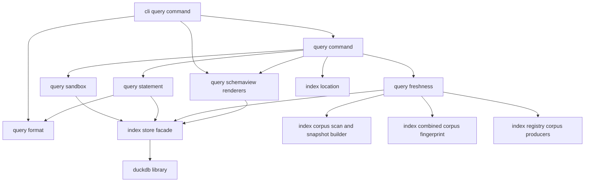
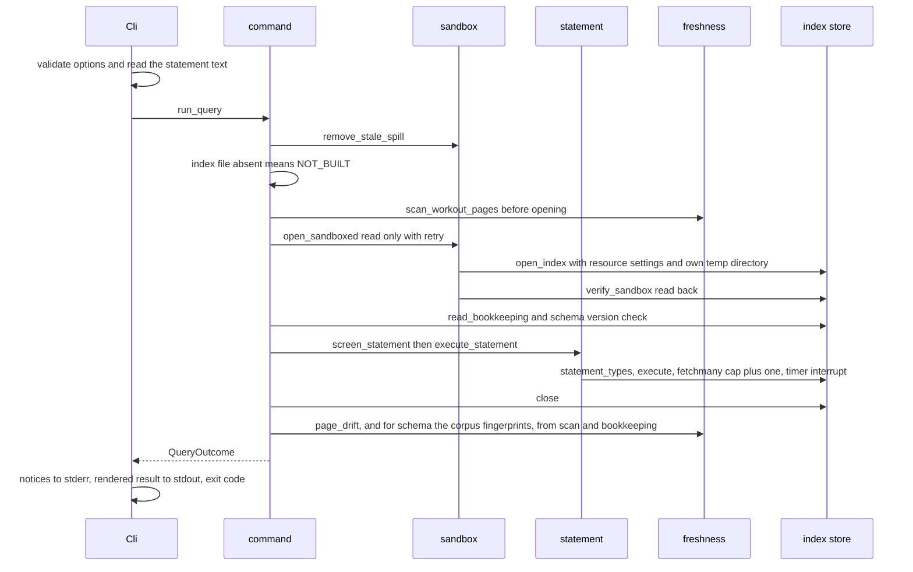
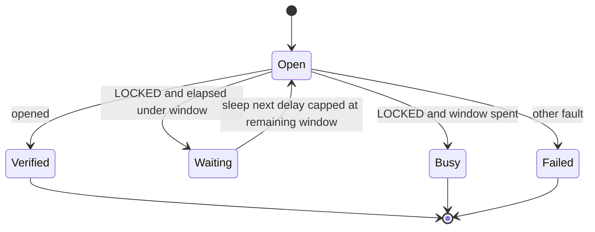

# Technical Design: analytics-query

## Overview

**Purpose**: `fitdocs query` lets an agent in the athlete's PKM ask the
`analytics-index` file statistical questions in SQL, and get honest,
parseable answers. A sandbox keeps those statements from reaching anything but
the index.

**Users**:
- **Agents** run `fitdocs query` and `fitdocs query --schema`, taught by the
  packaged `fitdocs-analytics` skill.
- **The athlete** reads `docs/analytics.md` to query the index, or to open it
  from their own DuckDB client.

**Impact**:
- Adds a package, `fitdocs.query`, and a CLI command, `query` (the thirteenth
  once `analytics-index`'s `index` has landed).
- Adds a third packaged skill.
- Adds one facade method appended to `fitdocs.index.store`.
- Adds `docs/analytics.md`.
- Adds `query` to the no-network command list.
- Changes no schema, no document, no write path and no `CONTRACT_VERSION`.

### Goals
- One statement, read-only, under a sandbox the statement cannot loosen. Every
  refusal names its restriction, and every refused class is pinned by a test
  that dies on a named mutation (Requirement 5).
- Results as `table`, `csv` or `json`, with NULL distinct from zero, a row
  limit that never cuts silently, and a time limit (Requirements 2, 3, 6).
- Honest state:
  - absent, incompatible or busy indexes say what fixes them (Requirement 8);
  - an index behind the data root says so (Requirement 9);
  - `--schema` projects the stored descriptions and the full index state
    (Requirement 10).
- An agent-facing contract that cannot drift:
  - the skill's examples execute against the live schema (Requirement 11);
  - the docs page's schema reference equals the stored descriptions
    (Requirement 12).

### Non-Goals
- Building or refreshing the index; the schema and its comments
  (`analytics-index`); the derived tables (`analytics-derived`).
- An OS-level sandbox. The sandbox guards against accidental or injected SQL,
  not against a local user (research.md, Architecture Pattern Evaluation).
- Multi-statement scripts, temporary objects that persist across invocations,
  saved queries, user tables.
- An MCP or HTTP server, a natural-language wrapper, charting.
- Any existing command reading the index. `fitdocs check` is unchanged.
- Windows support claims. The stale-spill clean-up is skipped there
  (Decision 4).

## Boundary Commitments

### This Spec Owns
- **The `fitdocs.query` package**:
  - the sandbox settings that `query` adds, and the read-back of every sandbox
    setting;
  - read-side lock retry;
  - the per-process spill directory and the stale-spill clean-up;
  - the statement gate and the time limit;
  - classifying DuckDB errors into named restrictions;
  - the output formats and the row limit;
  - freshness assessment;
  - the catalog read and the schema renderers;
  - the command orchestration.
- **CLI wiring**: the `query` command, its option singletons, its reporters,
  and the module docstring's command count and entry.
- **One store facade method**, `IndexConnection.statement_types`. It is
  appended to `src/fitdocs/index/store.py`, as `analytics-index`'s Seam 5
  allows.
- **The `fitdocs-analytics` skill**:
  - `src/fitdocs/skills/fitdocs-analytics/SKILL.md`;
  - its `PACKAGED_SKILLS` entry and constant;
  - its profile, locator and release-list entries;
  - the one-line pointer in `fitdocs-workouts`.
- **`docs/analytics.md`**: its generated schema-reference block, its row in
  `docs/index.md`, and its `[project.urls]` entry.
- **Published statements**:
  - the CHANGELOG `[Unreleased]` entry;
  - `tech.md`'s no-network list entry, and the `structure.md` line for `query`;
  - the connectors amendment for `query`;
  - the roadmap ticks for `analytics-query` and the connectors line.
- **Guards**:
  - the query-importer boundary and the in-package dependency direction;
  - the sandbox pins and the read-back pin;
  - the live-comments pin, the docs-reference pin and the skill-examples pin;
  - the confinement test for `query`;
  - the offline e2e entry;
  - the subprocess crash-vector pins.

### Out of Boundary
- **The index's location, file names, mandatory settings, schema, comments,
  bookkeeping, scan and fingerprints** (`analytics-index`). This spec reads
  them through the seams in `analytics-index` design.md § Cross-spec seams,
  and never edits `MANDATORY_SETTINGS`, `SCHEMA_VERSION`, a table or a comment.
- **The duckdb version pin literal** (`analytics-index` task 1.1, which sets
  `duckdb>=1.2,<2`: upstream fact U1). This spec requires that floor and
  verifies it on 1.2.0.
- **The ownership contract's statements about the index directory**
  (`analytics-index`'s section, its task 8.1). That section names
  `query-spill-<pid>/` and the writer's `writer-spill/` (upstream fact U3).
  This spec does not edit `docs/ownership-contract.md` or `CONTRACT_VERSION`.
- **Derived tables and their meaning** (`analytics-derived`).
  - This spec projects them like any table: the docs schema block and
    `--schema` cover every table.
  - It requires one skill example per non-core producer (Requirement 11.5),
    through a generic test keyed on the producer.
  - **Bounded exception for the second lander.** Whichever of this spec and
    `analytics-derived` lands second may touch exactly three read-side files:
    - the worked examples in `src/fitdocs/skills/fitdocs-analytics/SKILL.md`;
    - the generated schema block in `docs/analytics.md`;
    - the input section of the indexed fixture: the `derived_inputs()` hook in
      `tests/query/conftest.py`, which returns `DerivedInputs(files,
      athlete_toml)` from `tests/query/_helpers.py` (plan sources as `files`,
      a `[benchmarks]` table as `athlete_toml`). `indexed_root` writes both
      through `write_fixture_inputs` before `fitdocs sync`, with
      `fitdocs.cli._today` pinned to `FIXTURE_TODAY` (2021-10-01).

    Nothing else on the read side; `DerivedInputs`, `write_fixture_inputs`
    and `FIXTURE_TODAY` themselves stay this spec's.
- **Making any other command read the index**, `fitdocs check` included.

### Allowed Dependencies
- **`fitdocs.query` may import**:
  - from `fitdocs.index`, exactly the names `analytics-index`'s Seam 5 lists
    ("What query imports from `fitdocs.index`"); anything else is a seam
    change:
    - `location`: `resolve_index_location`, `IndexLocation`,
      `IndexLocationError`;
    - `store`: `open_index`, `IndexConnection` (`execute`, `interrupt`,
      `close`), `IndexResult` (`columns`, `fetchmany`, `fetchall`),
      `ResultColumn`, `IndexOpenError`, `IndexFault`, `FaultKind`,
      `classify_error`, `IndexStatementError`, `IndexInterrupted`,
      `read_bookkeeping`, `SettingValue`, and `MANDATORY_SETTINGS` (tests
      only);
    - `registry`: `CORPUS_PRODUCERS`, `registered_tables`;
    - `producer`: `CorpusProducer`, `CorpusSnapshot`, `CorpusPage`,
      `CorpusLeftOut`;
    - `schema`: `SCHEMA_VERSION`, `UNIT_SUFFIXES`;
    - `bookkeeping`: `Bookkeeping`, `IndexMeta`, `PageState`, `ComputedState`;
    - `fingerprint`: `document_fingerprint`, `athlete_fingerprint`,
      `corpus_fingerprint`, `combined_corpus_fingerprint`;
    - `corpus`: `scan_workout_pages`, `CorpusScan`, `LeftOutPage`,
      `corpus_snapshot`;
    - test-only: `store.create_index`, `store.create_schema`,
      `build.run_index_command` and `store.duckdb_version` (the crash-vector
      positive control, task 5.4); `core.documents.CORE_DOCUMENTS`,
      `core.computed.CORE_COMPUTED` and `schema.TableScope`, which group
      tables by producer and scope (the generic 11.5 pin, task 7.3); and
      monkeypatching `registry.DOCUMENT_PRODUCERS` and
      `registry.CORPUS_PRODUCERS`, read at call time (the freshness page-error
      pin, task 4.1, appends a test-only document producer).

    The facade method `statement_types` is this spec's own append to
    `store.py` (StoreFacadeAddition). Source code calls `corpus_snapshot` and
    `combined_corpus_fingerprint` and never assembles a `CorpusSnapshot` or
    composes a corpus fingerprint itself (§ Freshness); the producer types,
    `document_fingerprint` and `corpus_fingerprint` are for annotations and
    tests.
  - `fitdocs.athlete` (`load_athlete_inputs`, `AthleteFileError`);
  - the standard library.

  `fitdocs.version` is not among them: the one composition that reads
  `tool_version()` is `analytics-index`'s `combined_corpus_fingerprint`.
- **`fitdocs.query.format` imports the standard library only.**
- **The module order inside `fitdocs.query`**, each importing only modules to
  its left: `format` → `sandbox` → `statement` → `freshness` → `schemaview` →
  `command`.
- **Only `fitdocs.cli` imports `fitdocs.query`.**
- **`fitdocs.query` never imports**:
  - `duckdb`, which only `fitdocs.index.store` imports;
  - `fitdocs.cli`, `fitdocs.sync`, `fitdocs.render`, `fitdocs.connectors`,
    `fitdocs.tiles`, `fitdocs.plugins`;
  - any index writer: `refresh`, `build`, `lock`, `handoff`, `derive`.
- **`_INDEX_IMPORTERS`** (`tests/index/test_boundary.py`) gains the five
  modules `analytics-index` names for it: `fitdocs.query.sandbox`,
  `fitdocs.query.statement`, `fitdocs.query.freshness`,
  `fitdocs.query.schemaview` and `fitdocs.query.command`. The guard is
  one-way (`analytics-index` task 7.3, with its own fixed-input test): a
  listed name with no module is never flagged, so the names can land ahead of
  their modules. The duckdb-importer set stays `{store}`.

### Upstream Prerequisites
These three were raised to the controller as upstream issues against
`analytics-index`. All three were resolved by `analytics-index`'s cross-spec
round 1 (ruling C1 for U1; C2 for U2; C3 for U3), so each is now a landed
upstream fact. Task 1.1 confirms each on the branch, citing the
`analytics-index` task that provides it, and stops and reports if one is
missing.
- **U1. The duckdb floor is `>=1.2,<2`** (`analytics-index` task 1.1). On
  every 1.1.x release, `INSTALL` writes into HOME before the configuration
  refuses it (research.md, Decision 1).
- **U2. Fetch errors are wrapped** (`analytics-index` task 4.1).
  `IndexResult.fetchmany` and `fetchall` raise
  `IndexStatementError`/`IndexInterrupted` chained, as `execute` does.
  Errors and interruptions may surface during execute or fetch; cancellation
  must be armed before either operation.
- **U3. The contract names the spill directories** (`analytics-index` task
  8.1). The ownership contract's analytics-index section names
  "`query-spill-<pid>/` (transient; created by `fitdocs query`, removed on
  close or by the next query)" and the writer's `writer-spill/` among the
  index directory's files, so this spec changes no contract text and no
  `CONTRACT_VERSION`.

### Revalidation Triggers
- **`analytics-index`**:
  - **`MANDATORY_SETTINGS` or the `open_index` signature.** `REQUIRED_SANDBOX`
    and the read-back re-check.
  - **The facade's exception mapping.** `IndexStatementError`,
    `IndexInterrupted` and fetch-time errors (U2) re-check against the
    classifier.
  - **The bookkeeping types, `scan_workout_pages`, `LeftOutPage`, the
    workout-page definition or the fingerprint functions.** Freshness
    re-checks.
  - **Snapshot construction or corpus-fingerprint composition**
    (`corpus.corpus_snapshot`, the meaning of its `held` argument,
    `fingerprint.combined_corpus_fingerprint`, `CorpusLeftOut`). Freshness's
    corpus drift re-checks: it reproduces the refresh's step 5 through
    exactly these two functions.
  - **A column the state view reads.** That is `activities.athlete_fingerprint`;
    the athlete-drift count re-checks.
  - **`SCHEMA_VERSION` or any table, column or comment.** The docs reference
    regenerates, and the skill examples re-run. This is the cross-spec rule in
    tasks.md.
- **`analytics-derived`**: a new registered non-core producer needs a skill
  example that selects rows from one of its tables, and the indexed fixture
  may need inputs for it. The generic test turns red until both exist.
- **The duckdb floor.** The floor verification re-runs, and the probe matrix in
  research.md is extended.
- **This spec's output shapes**: the JSON keys, the CSV NULL rule, the exit
  codes, the default format. The skill and the docs re-check. These are agent
  contracts.

## Architecture

### Existing Architecture Analysis
- **Commands.** Commands are thin typer functions over engine modules, with
  option singletons (flake8 B008) and exit constants 0/1/2. `_config_error`
  prints to stderr and exits 2. No command yet reads stdin as data or writes
  JSON. `connect` has the TTY-detection precedent (`cli.py:764-766`).
- **`analytics-index`** supplies everything this spec reads (its Seam 5). The
  store is the only DuckDB importer, and its facade is append-only for this
  spec.
- **Packaged skills** are a name registry with heavy, mostly parametrized pins
  (research.md, Codebase).
- **Docs pages** are held to code by parsed-section set equality. No page yet
  carries a generated block.

### Architecture Pattern & Boundary Map

A thin orchestrator runs over three layers: a sandboxed connection, a
screened statement, and pure renderers.



**Architecture integration**:
- **Selected pattern**: configuration as the boundary, with defence in depth
  around it (research.md, Decisions 2 and 3):
  - the statement gate before execution;
  - a read-back of the settings after opening;
  - one statement per fresh connection.
- **Boundaries**:
  - `sandbox` is the only place `query` opens the index.
  - `statement` is the only place user SQL is executed.
  - `format` and the `schemaview` renderers are pure.
  - `command` holds no SQL beyond calling these.
- **Existing patterns preserved**:
  - option singletons, the exit constants and `_config_error`;
  - injected clock and sleep for retries (the connectors rule);
  - AST import guards with positive controls;
  - subprocess checks for crash vectors;
  - goldens regenerated through `uv run python -m <test module>`.
- **Steering compliance**:
  - absent data is NULL, printed as NULL;
  - no network, and writes only to transient spill;
  - `mypy --strict`;
  - the one-way dependency rule extended for `query` (a `structure.md` line).

### Technology Stack

| Layer | Choice / Version | Role in Feature | Notes |
|---|---|---|---|
| Data / Storage | `duckdb>=1.2,<2` (locked 1.5.6), through `fitdocs.index.store` only | Read-only sandboxed connection, statement parsing, interrupt | Floor set by `analytics-index` task 1.1 (U1, resolved in its cross-spec round 1; research.md Decision 1) |
| CLI | `typer` + `rich` (existing) | `query` command; notices on a stderr `Console` | Results go to stdout raw (`typer.echo`), never through rich |
| Runtime | Python 3.11 stdlib: `threading.Timer`, `time.monotonic`, `os.kill`, `shutil.rmtree`, `json`, `decimal`, `uuid`, `datetime` | Time limit, lock retry, stale-spill clean-up, renderers | No new dependency |

## File Structure Plan

### Directory Structure
```
src/fitdocs/query/
├── __init__.py      # Package docstring: the read side; never imports duckdb; only fitdocs.cli imports it
├── format.py        # Pure: OutputFormat, ResultSet, default_format, render_result, cell/CSV/JSON value rules, the JSON writer
├── sandbox.py       # RESOURCE_SETTINGS, REQUIRED_SANDBOX, open_sandboxed (retry), verify_sandbox, spill_directory, remove_stale_spill
├── statement.py     # ALLOWED_STATEMENT_TYPES, Restriction, screen_statement, execute_statement (timer, row cap), classify_statement_error
├── freshness.py     # PageDrift/page_drift, corpus_fingerprints/corpus_drift, AthleteDrift/athlete_drift
├── schemaview.py    # CatalogTable/CatalogColumn, read_catalog, row_counts, unit_of, undescribed, render_reference, IndexState, render_schema_text/json
└── command.py       # DEFAULT_MAX_ROWS, DEFAULT_TIMEOUT_S, QueryRequest, QueryEnvironment, OutcomeKind, QueryOutcome, run_query

src/fitdocs/skills/fitdocs-analytics/
└── SKILL.md         # The packaged skill (Requirement 11)

docs/analytics.md    # The analytics page, with the generated schema-reference block (Requirement 12)

tests/query/
├── __init__.py
├── conftest.py               # home_dir; derived_inputs() (the second lander's append point); module-scoped indexed data root (real sync + `fitdocs index`, own HOME and FITDOCS_INDEX_DIR, today pinned to FIXTURE_TODAY); copies
├── _helpers.py               # plain_database, schema_only_index (create_index + create_schema, no refresh), FIXTURE_TODAY (2021-10-01), DerivedInputs(files, athlete_toml), write_fixture_inputs, copy_indexed_root
├── test_fixtures.py          # self-tests of the fixtures and helpers
├── test_changelog_entry.py   # the [Unreleased] entry names the command, the skill and the page
├── test_store_facade.py      # statement_types facade addition
├── test_format.py            # every value rule, all three formats, defaults
├── test_sandbox.py           # settings, read-back, lock retry, spill naming and stale clean-up
├── test_statement.py         # gate, per-class configuration refusals, classifier, time limit, row cap
├── test_spill.py             # per-process spill directory, removal on close, concurrent spills
├── test_freshness.py         # page drift, corpus drift, athlete drift
├── test_schemaview.py        # catalog read, units, missing descriptions, live comments, renderers
├── test_command.py           # orchestration outcomes and ordering
├── test_cli_query.py         # input forms, options, exit codes, streams, formats on the CLI
├── test_crash_vectors.py     # subprocess pins for the multi-statement abort
├── test_interrupt.py         # real-process SIGINT: exit 130, clean stderr, spill removed
├── test_boundary.py          # query importers, format purity, in-package direction
├── test_skill_examples.py    # every SQL example runs and returns rows; one example per non-core table
└── test_docs_analytics.py    # reference block equality (+ `python -m` regeneration), doc pins
```

### Modified Files
- `src/fitdocs/index/store.py`: append `IndexConnection.statement_types(sql: str) -> tuple[str, ...]`.
  It returns DuckDB's statement-type names (`"SELECT"`, `"EXPLAIN"`, `"LOAD"`, …)
  and raises `IndexStatementError`, chained, on a parse error. Nothing else in
  the file changes.
- `src/fitdocs/cli.py`:
  - the module docstring count ("Twelve" becomes "Thirteen") and a `query`
    entry;
  - the option singletons;
  - `query_command`, `_stdout_is_terminal` and `_read_statement`;
  - the reporters `_report_query_outcome` and `_query_notice`.
- `src/fitdocs/agentskill.py`: `ANALYTICS_SKILL_NAME`, `PACKAGED_SKILLS`
  appended, and the docstring's "Two skills" becomes "Three".
- `src/fitdocs/skills/fitdocs-workouts/SKILL.md`: one "Further reading" bullet.
- `pyproject.toml`:
  - `[project.urls]` gains `Analytics`;
  - the mypy `files` list gains the new test modules.
- `docs/index.md` (a row), `docs/wiki-integration.md` (the listing line and a
  bullet), `README.md` (the Agent skills paragraph).
- `docs/releasing.md` ("four tracked places") and
  `release/artifact-policy.toml` (`[wheel] required`).
- `CHANGELOG.md` (`[Unreleased]` / `### Added`).
- `.kiro/steering/tech.md` and `.kiro/steering/structure.md`.
- `.kiro/specs/connectors/requirements.md`: the amendment adding `query`.
- `.kiro/steering/roadmap.md`: the ticks.
- Tests amended:
  - `tests/test_cli_skill.py:262-270` (12 becomes 13, "Thirteen");
  - `tests/index/test_cli_index.py` (only its existing module-docstring
    command-count expectation, "Twelve" becomes "Thirteen");
  - `tests/test_agent_skill.py` (import, `_ANALYTICS_HEADINGS`, profile);
  - `tests/test_skill_locator.py:29-58` (`_PUBLIC_NAMES`, registry order);
  - `tests/connectors/test_e2e.py:203-246` (an argument column; a `query`
    entry);
  - `tests/test_confinement.py` (a standalone `query` test, appended);
  - `tests/index/test_boundary.py` (`_INDEX_IMPORTERS`, appended);
  - `tests/test_docs_guarantees.py:1111-1123` (`"analytics.md"` appended);
  - `tests/test_release_artifacts.py:978-983` (the clean-wheel fixture);
  - `tests/test_releasing_docs.py:569-573` (the third skill path).

## System Flows

### `fitdocs query SQL`



**Key decisions**:
- **The scan runs before the index is opened**, so the read lock covers only
  the bookkeeping read and the statement (research.md Decision 5). The drift is
  computed after close from the scan and the bookkeeping already read.
- **The connection closes before anything is printed** (1.6). Rows are fetched
  (`fetchmany(max_rows + 1)`) inside the timer window.
- **Open failures map to outcomes**:
  - `LOCKED` past the 10 s window gives BUSY;
  - `MISSING` (a race after the existence check) gives NOT_BUILT;
  - `INCOMPATIBLE`, `CORRUPT` and `OTHER` give NEEDS_REBUILD.
- **Bookkeeping**: a `read_bookkeeping` of `None` gives NEEDS_REBUILD ("not a
  complete fitdocs index"), and so does a schema version other than
  `SCHEMA_VERSION`.
- **`--schema`** follows the same path. It replaces the statement step with
  `read_catalog`, `row_counts` and athlete drift. The athlete inputs are
  loaded before opening. The corpus fingerprints need the bookkeeping's page
  keys (`corpus_snapshot`'s `held`), so they are computed after close, from
  the scan and the bookkeeping already read, like the page drift, and the
  corpus drift with them. No producer's `fingerprint()` runs while the read
  lock is held.

### Lock retry


- **The delays** are `0.05, 0.1, 0.2, 0.4, 0.8, 1.6` s, then `2.0` s
  repeatedly. Each sleep is capped at the time left of the 10.0 s window, and
  one final attempt follows the last sleep.
- **The clock is injected**: `monotonic` and `sleep`.
- **`on_wait(holder_pid)`** fires once, at the first retry.

## Requirements Traceability

| Req | Summary | Components | Notes |
|---|---|---|---|
| 1.1 | `fitdocs query`, `--out` | CliWiring, Command | `_resolved_data_root` |
| 1.2 | One source: arg, `--file`, `-` | CliWiring | `_read_statement` |
| 1.3 | Wrong source combination → 2 | CliWiring | `_config_error` before `run_query` |
| 1.4 | Undecodable/empty → 2 | CliWiring | UTF-8 strict decode; `str.strip()` |
| 1.5 | 0 or ≥2 statements refused → 1 | Statement | `statement_types` length; ONE_STATEMENT |
| 1.6 | Index held only while needed | Command, Sandbox | Scan before open; close before printing |
| 2.1 | Three formats | Format, CliWiring | `OutputFormat` |
| 2.2 | TTY → table | Format, CliWiring | `default_format(True)` |
| 2.3 | Piped → csv | Format, CliWiring | `default_format(False)` |
| 2.4 | NULL distinct | Format | `NULL` / empty unquoted / `null` |
| 2.5 | All columns, repeated names | Format | Columns as a tuple; JSON rows as arrays |
| 2.6 | NaN/±inf spelled | Format | `NaN`, `Infinity`, `-Infinity` |
| 2.7 | Decimals, ISO times, durations, nested | Format | Value rules table |
| 2.8 | CSV quoting | Format | `csv_field` |
| 2.9 | JSON shape | Format | `render_result` JSON keys |
| 2.10 | Control characters escaped in table | Format | `table_cell` |
| 3.1 | Row limit 1000 / `--max-rows` | Statement, CliWiring | `fetchmany(max_rows + 1)` |
| 3.2 | Cut notice on stderr | CliWiring | `_query_notice` |
| 3.3 | In-band cut marker | Format | Table footer; `truncated` |
| 3.4 | Never silent; exit 0 | Statement, CliWiring | `ResultSet.truncated` |
| 3.5 | Bad `--max-rows` → 2 | CliWiring | typer `min=1` (Click usage error exits 2) |
| 4.1 | Success → 0 | CliWiring | `_EXIT_SUCCESS` |
| 4.2 | SQL error → message, 1 | Statement, CliWiring | FAILED with DuckDB's message |
| 4.3 | Refused/timed out/unreadable → 1 | Command, CliWiring | Outcome to exit table |
| 4.4 | Config errors → 2 | CliWiring | `_config_error`; `IndexLocationError` |
| 4.5 | stdout results only | CliWiring | `typer.echo` vs stderr `Console` |
| 5.1 | Read-only | Sandbox | `open_index(read_only=True)` |
| 5.2 | Read kinds only, gated before run | Statement | `ALLOWED_STATEMENT_TYPES` |
| 5.3 | No file or address beyond the index | Sandbox (store settings) | `enable_external_access=false` |
| 5.4 | Sandbox settings and lock | Sandbox | Store mandatory + `RESOURCE_SETTINGS` |
| 5.5 | Refusal names the restriction | Statement, CliWiring | `Restriction`, `RESTRICTION_TEXT` |
| 5.6 | Read-back, fail closed | Sandbox | `verify_sandbox`, `REQUIRED_SANDBOX` |
| 5.7 | Floor admits no failing release | Records, floor verification | `duckdb>=1.2,<2` (U1, `analytics-index` task 1.1); verified on 1.2.0 |
| 5.8 | Tests die on dropped settings/kinds | Guards | Mutation list (Testing Strategy) |
| 6.1 | Time limit 30 s / `--timeout` | Statement | `threading.Timer` → `interrupt` |
| 6.2 | 1 GB, 2 threads | Sandbox | `RESOURCE_SETTINGS` |
| 6.3 | Spill dir per process, removed | Sandbox | `temp_directory=query-spill-<pid>` |
| 6.4 | Stale spill removed | Sandbox | `remove_stale_spill` |
| 6.5 | Bad `--timeout` → 2 | CliWiring | Positive, finite |
| 6.6 | Interrupt closes | Statement, Command, CliWiring | `conn.interrupt()` on any exception escaping a running statement or a read, then `try/finally: conn.close()`; timer cancelled; `Query interrupted.`, exit 130 |
| 7.1 | No network | Sandbox, Statement | Settings; gate refuses LOAD; read-back |
| 7.2 | No data-root write | Command | Confinement test |
| 7.3 | Nothing outside the index dir but spill | Sandbox, Command | Confinement test with HOME in the sandbox |
| 7.4 | Never builds or refreshes | Command | No import of index writers (boundary) |
| 7.5 | Listed as no-network | Records | `tech.md`; e2e; connectors amendment |
| 8.1 | Absent → names `fitdocs index` | Command, CliWiring | NOT_BUILT |
| 8.2 | Unusable → rebuild message | Command, CliWiring | NEEDS_REBUILD |
| 8.3 | Retry ≤10 s, one waiting line | Sandbox, CliWiring | `on_wait` |
| 8.4 | Still locked → BUSY with PID | Sandbox, CliWiring | `IndexBusy.holder_pid` |
| 8.5 | Readers do not wait | Sandbox | Read-only open; test with a read-only holder |
| 9.1 | Three counts | Freshness | `page_drift` |
| 9.2 | Notice; still runs | CliWiring | `_query_notice` |
| 9.3 | Refresh's own page set | Freshness | `scan_workout_pages`; left-out excluded |
| 9.4 | No notice when level | CliWiring | `PageDrift.behind` |
| 9.5 | Reads only | Freshness | Confinement test |
| 10.1 | Tables, columns, types, units, descriptions, counts | SchemaView | `read_catalog`, `row_counts`, `unit_of` |
| 10.2 | Index state | SchemaView, Command | `IndexState` |
| 10.3 | Athlete drift | Freshness | `athlete_drift` |
| 10.4 | Corpus tables behind | Freshness, Command | `corpus_snapshot` with the bookkeeping's keys, `combined_corpus_fingerprint`, `corpus_drift`; after close |
| 10.5 | Missing description shown and warned | SchemaView, CliWiring | `undescribed` |
| 10.6 | Text default; json; csv refused | CliWiring, SchemaView | `_config_error` on csv |
| 10.7 | Exit 0 when readable | CliWiring | SCHEMA outcome |
| 10.8 | Otherwise state and 1 | CliWiring | NOT_BUILT/NEEDS_REBUILD/BUSY |
| 10.9 | Live comments test | Guards | `test_schemaview.py` live section |
| 11.1 | Skill registered | Skill | `PACKAGED_SKILLS` |
| 11.2 | Teaching order | Skill | Heading profile; ordered sections |
| 11.3 | Four example topics | Skill | H3 per topic under "Worked examples" |
| 11.4 | Examples run, return rows | Guards | `test_skill_examples.py` |
| 11.5 | Example per derived producer | Skill, Guards | Generic non-core-producer test |
| 11.6 | Formats, limits, refusals taught | Skill | Sections |
| 11.7 | Existing skill pins | Skill | Profile entry; parametrized pins |
| 11.8 | Inbox skill pointer | Skill | One "Further reading" bullet |
| 12.1 | Page covers the command | Docs | `docs/analytics.md` sections |
| 12.2 | Page covers the sandbox | Docs | "The sandbox" |
| 12.3 | Location and how to print it | Docs | "Where the index lives" |
| 12.4 | Outside clients | Docs | "Opening the index from another DuckDB client" |
| 12.5 | Reference pinned to live schema | Docs, Guards | `render_reference` equality |
| 12.6 | Docs index, release notes | Docs, Records | `docs/index.md`, CHANGELOG |
| 12.7 | Steering, connectors amendment | Records | `tech.md`, `structure.md`, amendment |

## Components and Interfaces

| Component | Layer | Intent | Req coverage | Key dependencies | Contracts |
|---|---|---|---|---|---|
| StoreFacadeAddition | index adapter (append) | Parse statement types | 1.5, 5.2 | duckdb (P0) | Service |
| Format | pure | Results to text | 2.x, 3.3 | stdlib (P0) | Service |
| Sandbox | io | Open, verify, retry, spill | 1.6, 5.1, 5.3, 5.4, 5.6, 6.2–6.4, 7.1, 7.3, 8.3–8.5 | store, location (P0) | Service, State |
| Statement | io | Gate, execute, time limit, classify | 1.5, 3.1, 3.4, 4.2, 5.2, 5.5, 6.1 | store, format (P0) | Service |
| Freshness | io | Page, corpus and athlete drift | 9.x, 10.3, 10.4 | corpus, bookkeeping, fingerprint, registry, athlete (P0) | Service |
| SchemaView | io + pure renderers | Catalog read and projections | 10.1, 10.2, 10.5, 10.6, 12.5 | store, schema, format (P0) | Service |
| Command | orchestration | One invocation, outcome | 1.6, 4.3, 6.6, 7.2–7.4, 8.1, 8.2, 10.4, 10.7, 10.8 | all above, location (P0) | Batch |
| CliWiring | cli | Options, input, reporters, exit | 1.1–1.4, 2.1–2.3, 3.2, 3.5, 4.x, 6.5, 9.2, 9.4, 10.6–10.8 | command, format, schemaview (P0) | Service |
| Skill | packaged text | The agent contract | 11.x | agentskill (P0) | — |
| Docs and Records | docs, steering | The published contract | 5.7, 7.5, 12.x | — | — |
| Guards | tests | Every promise can fail | 5.8, 7.x, 9.5, 10.9, 11.4, 11.5, 12.5 | — | — |

### Index adapter

#### StoreFacadeAddition (`src/fitdocs/index/store.py`, appended)

| Field | Detail |
|---|---|
| Intent | Let `query` parse a statement without importing DuckDB |
| Requirements | 1.5, 5.2 |

```python
class IndexConnection:
    ...
    def statement_types(self, sql: str) -> tuple[str, ...]: ...
```
- Uses DuckDB's `extract_statements(sql)` and returns each statement's
  `type.name` (for example `"SELECT"`, `"EXPLAIN"`, `"LOAD"`, `"SET"`,
  `"CALL"`, `"CREATE"`, `"COPY"`, `"ATTACH"`, `"EXPORT"`).
  - Empty or comment-only text returns `()`.
  - A parse error raises `IndexStatementError(message)` from the DuckDB
    exception.
- Parsing executes nothing.
- **Upstream fact U2** (`analytics-index` task 4.1, resolved in its cross-spec
  round 1). `IndexResult.fetchmany` and `fetchall` raise
  `IndexStatementError`/`IndexInterrupted` (chained), exactly as `execute`
  does. Errors and interruptions may surface during execute or fetch,
  depending on the statement and DuckDB version.

### Pure core

#### Format (`src/fitdocs/query/format.py`)

| Field | Detail |
|---|---|
| Intent | Turn a result into exactly one of three texts, with every value rule stated once |
| Requirements | 2.1–2.10, 3.3 |

```python
class OutputFormat(StrEnum):
    TABLE = "table"; CSV = "csv"; JSON = "json"

@dataclass(frozen=True)
class ResultSet:
    columns: tuple[str, ...]
    rows: tuple[tuple[object, ...], ...]     # at most max_rows
    truncated: bool                           # more rows existed than max_rows
    max_rows: int

FreshnessFields = Mapping[str, int | bool]   # PageDrift.as_mapping()

def default_format(stdout_is_terminal: bool) -> OutputFormat: ...
def render_result(result: ResultSet, fmt: OutputFormat, *, freshness: FreshnessFields) -> str: ...
def text_value(value: object) -> str: ...     # a non-NULL value as cell text (table and csv)
def table_cell(value: object) -> str: ...     # NULL → "NULL"; escapes control characters
def csv_field(value: object) -> str: ...      # NULL → ""; quoting rule
def json_value(value: object) -> str: ...     # one JSON token
```

**Value rules** (`text_value` and `json_value`):

| Python value (from DuckDB) | table / csv text | json token |
|---|---|---|
| `None` | `NULL` / empty unquoted field | `null` |
| `bool` | `true` / `false` | `true` / `false` |
| `int` | decimal digits | number |
| `float`, finite | `repr` (shortest round-trip) | number (`repr`) |
| `float`, NaN / +inf / −inf | `NaN` / `Infinity` / `-Infinity` | `"NaN"` / `"Infinity"` / `"-Infinity"` |
| `Decimal` | `format(v, "f")`, every digit | the same digits as a raw number token |
| `str` | as is (table: control characters escaped as `\n`, `\t`, `\r`, `\xNN`) | JSON string, `ensure_ascii=False` |
| `date`, `time`, `datetime` (naive or aware) | `isoformat()` (`T` separator) | the same, as a string |
| `timedelta` | ISO 8601 duration, `[-]P[nD][T[nH][nM][n[.ffffff]S]]`, zero as `PT0S` | the same, as a string |
| `uuid.UUID` | canonical lowercase | string |
| `bytes` | lowercase hex | string |
| `list`/`tuple` / `dict` | `json_value` text of the whole value | array / object; dict keys as `text_value` strings |

- **`table`**:
  - a header row, then a rule of `-`, then rows, with columns separated by two
    spaces;
  - numbers (`int`, `float`, `Decimal`) are right-aligned, and everything else
    left-aligned;
  - a footer: `(N rows)`, or `(first N rows; the result has more)` when
    truncated (`row` when N is 1);
  - zero rows give the header, the rule and `(0 rows)`.
- **`csv`**:
  - the header (column names quoted by the same rule), then one line per row;
  - LF line endings;
  - a field is quoted when it contains `,`, `"`, CR or LF, or is the empty
    string, and `"` is doubled inside it.
- **`json`**:
  - one object:
    `{"columns": [...], "rows": [[...], ...], "row_count": N, "truncated": B,
    "max_rows": M, "freshness": {...}}`;
  - each row on its own line, keys in that order.
- **Invariant**: every function is total over the value domain above. An
  unknown type renders through `str()` in text, and as a JSON string.

### I/O layer

#### Sandbox (`src/fitdocs/query/sandbox.py`)

| Field | Detail |
|---|---|
| Intent | The only place `query` opens the index: read-only, bounded, verified, its own spill |
| Requirements | 1.6, 5.1, 5.3, 5.4, 5.6, 6.2, 6.3, 6.4, 7.1, 7.3, 8.3, 8.4, 8.5 |

```python
RESOURCE_SETTINGS: Final[Mapping[str, SettingValue]] = {
    "memory_limit": "1GB", "threads": 2, "max_temp_directory_size": "4GB",
}
REQUIRED_SANDBOX: Final[Mapping[str, str]] = {      # duckdb_settings() values, a literal, not derived
    "enable_external_access": "false", "autoinstall_known_extensions": "false",
    "autoload_known_extensions": "false", "allow_community_extensions": "false",
    "allow_persistent_secrets": "false", "python_enable_replacements": "false",
    "lock_configuration": "true", "threads": "2",
}
SPILL_PREFIX: Final[str] = "query-spill-"
LOCK_RETRY_WINDOW_S: Final[float] = 10.0
LOCK_RETRY_DELAYS_S: Final[tuple[float, ...]] = (0.05, 0.1, 0.2, 0.4, 0.8, 1.6, 2.0)   # the last repeats

class SandboxUnverified(Exception):
    setting: str; expected: str; actual: str | None
class IndexBusy(Exception):
    holder_pid: int | None

def spill_directory(location: IndexLocation, pid: int) -> Path: ...          # location.directory / f"query-spill-{pid}"
def process_is_running(pid: int) -> bool: ...                                 # os.kill(pid, 0): ProcessLookupError → False; PermissionError → True
def remove_stale_spill(location: IndexLocation, *, own_pid: int,
                       is_running: Callable[[int], bool]) -> tuple[Path, ...]: ...
def open_sandboxed(location: IndexLocation, *, pid: int,
                   monotonic: Callable[[], float], sleep: Callable[[float], None],
                   on_wait: Callable[[int | None], None]) -> IndexConnection: ...
def verify_sandbox(conn: IndexConnection) -> None: ...
```
- **`open_sandboxed`**:
  - It calls `store.open_index(location.database, read_only=True,
    settings=RESOURCE_SETTINGS | {"temp_directory": str(spill_directory(...))})`.
    The store adds and locks its mandatory settings.
  - On `IndexOpenError` of kind `LOCKED` it retries by the lock-retry diagram,
    and raises `IndexBusy(holder_pid)` once the window is spent.
  - Any other `IndexOpenError` propagates.
  - After opening it calls `verify_sandbox`. On a mismatch it closes the
    connection and re-raises.
- **`verify_sandbox`**:
  - It runs one statement: `SELECT name, value FROM duckdb_settings() WHERE
    name IN (…)`.
  - Every `REQUIRED_SANDBOX` key must be present with exactly its value, or it
    raises `SandboxUnverified`, the first mismatch in key order.
  - `memory_limit` and `max_temp_directory_size` are not read back (they come
    back human-formatted, e.g. `953.6 MiB`). Tests pin them (research.md
    Decision 3).
- **`remove_stale_spill`**:
  - It lists `location.directory`, if it exists. An entry is removed with
    `shutil.rmtree` only when all of these hold:
    - its name matches `^query-spill-(\d+)$`;
    - it is a directory and not a symlink;
    - its number is not `own_pid`;
    - `is_running` returns `False` for that number.
  - Nothing else is touched: `index.duckdb`, its `.wal`, `index.lock` and the
    writer's `writer-spill/` (`analytics-index`'s, set by its store) included.
    It returns the removed paths.
  - When the module-level hook `_SKIPS_SPILL_CLEANUP` (initialised to
    `os.name == "nt"`) is true, it returns `()` without listing. Tests patch
    the hook, never `os.name`.
  - An `OSError` while removing is swallowed, and the directory is left for a
    later run.
- **Postconditions**:
  - every connection returned is read-only, verified, and spills only into
    `query-spill-<pid>`;
  - DuckDB removes that directory on `close()` (research.md, Spill).

#### Statement (`src/fitdocs/query/statement.py`)

| Field | Detail |
|---|---|
| Intent | The only place user SQL runs: screened, timed, capped, its failures named |
| Requirements | 1.5, 3.1, 3.4, 4.2, 5.2, 5.5, 6.1 |

```python
ALLOWED_STATEMENT_TYPES: Final[frozenset[str]] = frozenset({"SELECT", "EXPLAIN"})

class Restriction(StrEnum):
    ONE_STATEMENT = "one_statement"; STATEMENT_KIND = "statement_kind"
    OUTSIDE_INDEX = "outside_index"; LOCKED_SETTING = "locked_setting"
    READ_ONLY = "read_only"; EXTENSION = "extension"

RESTRICTION_TEXT: Final[Mapping[Restriction, str]]

class StatementRefused(Exception):
    restriction: Restriction; detail: str           # DuckDB's message, or the statement type(s)
class StatementFailed(Exception):
    message: str; hint: str | None
class StatementTimedOut(Exception):
    timeout_s: float

TimerFactory = Callable[[float, Callable[[], None]], threading.Timer]

def screen_statement(conn: IndexConnection, sql: str) -> None: ...
def execute_statement(conn: IndexConnection, sql: str, *, max_rows: int, timeout_s: float,
                      timer: TimerFactory = threading.Timer) -> ResultSet: ...
def run_statement(conn: IndexConnection, sql: str, *, max_rows: int, timeout_s: float,
                  timer: TimerFactory = threading.Timer) -> ResultSet: ...   # screen, then execute
def classify_statement_error(exc: IndexStatementError) -> Restriction | None: ...
def failure_hint(exc: IndexStatementError) -> str | None: ...
```

**`RESTRICTION_TEXT`**, the message's first clause:

| Restriction | Text |
|---|---|
| ONE_STATEMENT | `fitdocs query runs exactly one statement` |
| STATEMENT_KIND | `the query sandbox runs only queries and EXPLAIN; this is {ARTICLE} {TYPE} statement` (`{ARTICLE}` is `an` before a vowel letter, else `a`; LOAD is shown as `INSTALL or LOAD`, SET as `SET, RESET or USE`; CALL adds `use SELECT * FROM <function>(…) instead`) |
| OUTSIDE_INDEX | `the query sandbox cannot read or write files or addresses outside the index` |
| LOCKED_SETTING | `the query sandbox's settings are locked` |
| READ_ONLY | `the index is open read-only` |
| EXTENSION | `extensions are not available in the query sandbox` |

- **`screen_statement`**:
  - `types = conn.statement_types(sql)`; a parse error propagates as
    `IndexStatementError`.
  - `len(types) != 1` raises ONE_STATEMENT. A type not in
    `ALLOWED_STATEMENT_TYPES` raises STATEMENT_KIND.
  - Nothing runs.
- **`execute_statement`**:
  - It starts `timer(timeout_s, fire)`, where `fire` records that the timer
    fired and then calls `conn.interrupt()`.
  - Then `result = conn.execute(sql)` and `rows = result.fetchmany(max_rows + 1)`,
    in a `try/finally` that cancels the timer.
  - `IndexInterrupted` while fired raises `StatementTimedOut`. An
    `IndexInterrupted` without the timer re-raises. A user's Ctrl-C does not arrive as `IndexInterrupted`: both tested runtimes deliver `RuntimeError('Query interrupted')` with a `KeyboardInterrupt` `__cause__`, handled below.
  - `IndexStatementError` goes to `classify_statement_error`: a restriction
    raises `StatementRefused`, `None` raises `StatementFailed(message,
    failure_hint(exc))`.
  - Any other `BaseException` calls `conn.interrupt()` (failure suppressed),
    and the `RuntimeError`-with-`KeyboardInterrupt`-cause shape is re-raised as
    `KeyboardInterrupt`.
  - It returns `ResultSet(columns=tuple(c.name for c in result.columns),
    rows=tuple(rows[:max_rows]), truncated=len(rows) > max_rows, max_rows)`.
- **`classify_statement_error`** looks at `type(exc.__cause__).__name__` and the
  message. Class names are stable across 1.x; module paths are not (index P7).
  - `PermissionException` gives OUTSIDE_INDEX.
  - `InvalidInputException` whose message contains `the configuration has been
    locked` gives LOCKED_SETTING.
  - A message containing `read-only mode` gives READ_ONLY.
  - A message containing `requires the extension`, `requires extension` or
    `exists in the httpfs extension` gives EXTENSION.
  - Anything else gives `None`.
- **`failure_hint`**:
  - `Required module 'pytz'` gives "cast TIMESTAMP WITH TIME ZONE values to
    TIMESTAMP";
  - `OutOfMemoryException` gives "the statement needed more than the query
    sandbox's 1 GB of memory; aggregate, or filter earlier";
  - otherwise `None`.
- **Invariants**:
  - no statement runs unscreened through `run_statement`;
  - the timer is always cancelled;
  - the timer never outlives the call.

#### Freshness (`src/fitdocs/query/freshness.py`)

| Field | Detail |
|---|---|
| Intent | Say how far the index is from the data root, by the refresh's own definitions |
| Requirements | 9.1–9.5, 10.3, 10.4 |

```python
@dataclass(frozen=True)
class PageDrift:
    workout_pages: int      # scan.pages (left-out pages excluded)
    pages_held: int         # bookkeeping pages
    added: int; changed: int; removed: int
    @property
    def behind(self) -> bool: ...
    def as_mapping(self) -> Mapping[str, int | bool]: ...

def page_drift(scan: CorpusScan, held: Mapping[str, PageState]) -> PageDrift: ...

@dataclass(frozen=True)
class CorpusDrift:
    behind: tuple[str, ...]                     # table names of producers whose fingerprint moved, sorted
    unassessed: tuple[tuple[str, str], ...]     # (producer name, reason)

def corpus_fingerprints(scan: CorpusScan, held: Mapping[str, PageState], *, data_root: Path,
                        today: date, athlete_fingerprint: str) -> Mapping[str, str | Exception]: ...
def corpus_drift(fingerprints: Mapping[str, str | Exception], stored: Mapping[str, str | None],
                 tables: Mapping[str, tuple[str, ...]]) -> CorpusDrift: ...

@dataclass(frozen=True)
class AthleteDrift:
    activities_other_inputs: int | None
    skipped_reason: str | None

def current_athlete_fingerprint(data_root: Path) -> str | AthleteFileError: ...
def athlete_drift(conn: IndexConnection, current: str | AthleteFileError) -> AthleteDrift: ...
```
- **`page_drift`**:
  - added = scanned keys the bookkeeping lacks;
  - removed = held keys not scanned;
  - changed = keys in both whose `document_fingerprint` differs, renames
    included.
  - `scan.left_out` never counts.
- **`corpus_fingerprints`** reproduces the refresh's corpus step
  (`analytics-index` design § Refresh, step 5, and Seam 5, "Freshness
  reproduces the refresh's corpus fingerprints"). It assembles nothing
  itself:
  - **The snapshot**, built once: `corpus_snapshot(data_root, scan,
    today=today, athlete_fingerprint=athlete_fingerprint,
    held=frozenset(held))`, where `held` is `read_bookkeeping(...).pages`.
    Those are the keys `index_pages` holds, which are the keys the last
    refresh held after its page and removal steps. With the data root
    unchanged since that refresh, this is the snapshot the refresh recorded,
    including a new page whose transaction failed, which sits in `left_out`.
    A page added, edited or deleted since then moves `pages` or `left_out`,
    so a producer that covers them reads as behind.
  - **Never `held=None`.** `None` counts every scanned page as held. It would
    put a page whose refresh transaction failed into `pages`, and so report a
    producer behind immediately after a refresh.
  - **Per producer**, for each `registry.CORPUS_PRODUCERS` entry, read as a
    module attribute at call time: `combined_corpus_fingerprint(producer,
    snapshot)`. This is the refresh's one composition, with
    `fitdocs_version=tool_version()` and `schema_version=SCHEMA_VERSION`.
    `query` passes no version and composes no fingerprint by hand.
  - **A raising producer.** `combined_corpus_fingerprint` lets
    `producer.fingerprint` raise. The exception is kept as the value, and
    reported as unassessed.
  - **When it runs.** `run_query` calls it after the connection closes,
    because `held` comes from the bookkeeping (§ Command).
- **An unreadable athlete profile.** When `current_athlete_fingerprint` returns
  an `AthleteFileError`, `corpus_fingerprints` is not called, and every
  registered corpus producer is listed as unassessed with that error's message.
- **`athlete_drift`**:
  - `SELECT count(*) FROM activities WHERE athlete_fingerprint IS DISTINCT FROM
    $1`, through the facade.
  - An `AthleteFileError` gives `skipped_reason` (its message) and no query.
- **Purity**: the module reads the data root and the index and writes nothing.
  The CLI passes `today`, from its `_today()`.

#### SchemaView (`src/fitdocs/query/schemaview.py`)

| Field | Detail |
|---|---|
| Intent | Project the stored descriptions: one catalog read, one reference renderer |
| Requirements | 10.1, 10.2, 10.5, 10.6, 12.5 |

```python
@dataclass(frozen=True)
class CatalogColumn:
    name: str; type_name: str; unit: str | None; description: str | None
@dataclass(frozen=True)
class CatalogTable:
    name: str; description: str | None; columns: tuple[CatalogColumn, ...]

def read_catalog(conn: IndexConnection) -> tuple[CatalogTable, ...]: ...
def row_counts(conn: IndexConnection, tables: Sequence[CatalogTable]) -> Mapping[str, int]: ...
def unit_of(column_name: str) -> str | None: ...           # first UNIT_SUFFIXES entry (longest first) the name ends with
def undescribed(tables: Sequence[CatalogTable]) -> tuple[str, ...]: ...   # "table" and "table.column"
def render_reference(tables: Sequence[CatalogTable]) -> str: ...         # markdown; the docs block

@dataclass(frozen=True)
class IndexState:
    database: Path
    recorded_schema_version: int | None; reads_schema_version: int
    fitdocs_version: str | None
    drift: PageDrift | None
    left_out: tuple[LeftOutPage, ...]
    without_computed: Mapping[str, int]       # ComputedState value -> pages
    athlete: AthleteDrift | None
    corpus: CorpusDrift | None
    rebuild_reason: str | None

def render_state_text(state: IndexState) -> str: ...
def render_schema_text(state: IndexState, tables: Sequence[CatalogTable], counts: Mapping[str, int]) -> str: ...
def render_schema_json(state: IndexState, tables: Sequence[CatalogTable], counts: Mapping[str, int]) -> str: ...
```
- **`read_catalog`** uses two statements:
  - `duckdb_tables()` filtered on `database_name = current_database() AND
    schema_name = 'main' AND NOT temporary`;
  - `duckdb_columns()` filtered on `database_name = current_database() AND
    schema_name = 'main'`, ordered by `table_name, column_index`.

  Tables are ordered by name, with `index_`-prefixed bookkeeping tables last.
  A NULL or blank comment becomes `None`.
- **`row_counts`**: `SELECT count(*) FROM "<name>"` per table, with the
  identifier quoted (double quotes doubled).
- **`render_reference`**: for each table, `### \`name\``, then its
  description paragraph, then `| Column | Type | Unit | Description |` with a
  row per column.
  - A `None` description prints as `(no description)`.
  - `|` inside text is escaped as `\|`.
  - The output is deterministic (no counts, no paths), so the docs block can
    equal it.
- **`render_schema_text`** prints `render_state_text`, then
  `render_reference`, with each table heading extended by `(N rows)` (`(1 row)` when N is 1). When
  `undescribed` is non-empty, a closing line names them as a fitdocs defect.
- **`render_schema_json`** prints `{"index": {state fields}, "tables": [{"name",
  "description", "rows", "columns": [{"name", "type", "unit", "description"}]}]}`
  through `format.json_value`.
- **Left-out pages** print their `path`, `reason` and `collides_with`, in text
  and JSON. `LeftOutPage.document_fingerprint` is an input to the corpus
  fingerprints, not state an agent reads, so it is not printed.

### Orchestration

#### Command (`src/fitdocs/query/command.py`)

| Field | Detail |
|---|---|
| Intent | One invocation from location to outcome; prints nothing |
| Requirements | 1.6, 4.3, 6.6, 7.2, 7.3, 7.4, 8.1, 8.2, 10.4, 10.7, 10.8 |

```python
DEFAULT_MAX_ROWS: Final[int] = 1000
DEFAULT_TIMEOUT_S: Final[float] = 30.0

@dataclass(frozen=True)
class QueryRequest:
    data_root: Path
    sql: str | None           # None when schema is True
    schema: bool
    max_rows: int
    timeout_s: float
    today: date

@dataclass(frozen=True)
class QueryEnvironment:
    environ: Mapping[str, str]; home: Path; pid: int
    monotonic: Callable[[], float]; sleep: Callable[[float], None]
    on_wait: Callable[[int | None], None]
    is_running: Callable[[int], bool]
    timer: TimerFactory

class OutcomeKind(StrEnum):
    RESULT = "result"; SCHEMA = "schema"; NOT_BUILT = "not_built"; NEEDS_REBUILD = "needs_rebuild"
    BUSY = "busy"; REFUSED = "refused"; FAILED = "failed"; TIMED_OUT = "timed_out"; UNVERIFIED = "unverified"

@dataclass(frozen=True)
class SchemaReport:
    state: IndexState; tables: tuple[CatalogTable, ...]; counts: Mapping[str, int]

@dataclass(frozen=True)
class QueryOutcome:
    kind: OutcomeKind
    location: IndexLocation
    result: ResultSet | None = None
    drift: PageDrift | None = None
    schema: SchemaReport | None = None
    state: IndexState | None = None          # for --schema failures
    restriction: Restriction | None = None
    message: str | None = None               # DuckDB's message, the reason, or the setting mismatch
    hint: str | None = None
    holder_pid: int | None = None

def run_query(request: QueryRequest, env: QueryEnvironment) -> QueryOutcome: ...   # raises IndexLocationError
```
- **Order**, as in the System Flows diagram:
  1. `resolve_index_location`; `IndexLocationError` propagates, and the CLI
     exits 2.
  2. `remove_stale_spill`.
  3. A missing `location.database` gives NOT_BUILT.
  4. `scan_workout_pages`. For `--schema` also the current athlete
     fingerprint.
  5. `open_sandboxed`:
     - `IndexBusy` gives BUSY;
     - `IndexOpenError` gives NOT_BUILT (MISSING) or NEEDS_REBUILD (with the
       fault message);
     - `SandboxUnverified` gives UNVERIFIED.
  6. `read_bookkeeping`. `None` or a schema-version mismatch gives
     NEEDS_REBUILD.
  7. The statement path (`run_statement`, giving RESULT, REFUSED, FAILED or
     TIMED_OUT; a parse error from the gate, an `IndexStatementError`, gives
     FAILED with DuckDB's message) or the schema path (`read_catalog`, `row_counts`,
     `athlete_drift`, giving SCHEMA).
  8. `finally: conn.close()`.
  9. `page_drift` from the scan and the bookkeeping already read. For
     `--schema`, also `corpus_fingerprints(scan, bookkeeping.pages, …)` and
     `corpus_drift` against `bookkeeping.producers`, unless the athlete
     fingerprint is an `AthleteFileError` (every corpus producer is then
     unassessed), and then the `IndexState`.
- **A user interrupt (Ctrl-C)** ends the command with `Query interrupted.` on
  stderr, no traceback, and exit 130 (128 + SIGINT; no other fitdocs command
  defines an interrupt exit, so this is the shell convention).
  - **How DuckDB delivers it.** On both tested runtimes a SIGINT during a
    running statement surfaces as `RuntimeError('Query interrupted')` with a
    `KeyboardInterrupt` `__cause__`, not as the facade's `IndexInterrupted`. On
    1.5.6 it is raised from `fetchmany`; on 1.2.0 from `IndexConnection.execute`,
    because `sql(..., params=())` runs the statement eagerly there.
  - **Statement path.** `execute_statement`, on any `BaseException` escaping a
    running statement, calls `conn.interrupt()` (the call the deadline timer
    uses; its own failure is suppressed) before the timer is cancelled, and
    re-raises a bare `KeyboardInterrupt` for the
    `RuntimeError`-with-`KeyboardInterrupt`-cause shape.
  - **Other reads.** `run_query`'s `BaseException` branch interrupts the
    connection and applies the same conversion, so the bookkeeping, catalog,
    row-count and athlete-drift reads behave alike. That conversion is what
    makes `--schema` exit 130 instead of printing a traceback.
  - **Why the interrupt call.** Without it, `connection.close()` blocks in
    DuckDB's `ClientContext` destructor until the statement finishes
    (intermittent: 8 of 14 manual CLI runs without the interrupt call hung).
    The `finally` then closes the connection, which removes the spill
    directory (6.6), and `query_command` turns the `KeyboardInterrupt` into the
    message and exit code.
- **No `fitdocs.index` writer is imported**, so no build or refresh is
  reachable (7.4, boundary test).

### CLI

#### CliWiring (`src/fitdocs/cli.py`)

| Field | Detail |
|---|---|
| Intent | Options, the statement text, the exit code, and which stream gets what |
| Requirements | 1.1–1.4, 2.1–2.3, 3.2, 3.5, 4.1–4.5, 6.5, 8.3, 9.2, 9.4, 10.5–10.8 |

```python
@app.command("query")
def query_command(
    sql: str | None = _QUERY_SQL_ARGUMENT,                  # "One SQL statement, or '-' to read it from standard input."
    file: Path | None = _QUERY_FILE_OPTION,                 # --file
    schema: bool = _QUERY_SCHEMA_OPTION,                    # --schema
    output_format: OutputFormat | None = _QUERY_FORMAT_OPTION,   # --format, case-insensitive choice
    max_rows: int = _QUERY_MAX_ROWS_OPTION,                 # --max-rows, default DEFAULT_MAX_ROWS, min=1
    timeout: float = _QUERY_TIMEOUT_OPTION,                 # --timeout, default DEFAULT_TIMEOUT_S
    out: Path | None = _OUT_OPTION,
) -> None: ...
```
- **The docstring's first paragraph**: "Run one read-only SQL statement against
  the analytics index, or describe its schema." It carries no requirement
  references (pinned by `tests/connectors/test_cli_connectors.py:787-800`).
- **Validation**, in order and all before any index access (exit 2 through
  `_config_error`, or through Click's usage error for `--format` and
  `--max-rows`):
  1. `timeout` must be finite and above 0.
  2. `--schema` with `--format csv` is refused.
  3. The sources are counted: a SQL argument other than `-`, `-` (stdin), and
     `--file`. With `--schema` there must be none; without it, exactly one.
  4. `_read_statement` decodes `--file` bytes or `sys.stdin.buffer` as strict
     UTF-8, refusing an `OSError` or a `UnicodeDecodeError`, and refuses
     empty or whitespace-only text.
  5. `_resolved_data_root(out)`.
- **The run**:
  - `run_query(QueryRequest(..., today=_today()), QueryEnvironment(environ=os.environ,
    home=Path.home(), pid=os.getpid(), monotonic=time.monotonic,
    sleep=time.sleep, on_wait=<prints the waiting line>,
    is_running=process_is_running, timer=threading.Timer))`.
  - `IndexLocationError` goes to `_config_error`.
- **Streams.**
  - Results go to stdout with `typer.echo(text)`: every rendered result and
    `--schema` document ends with exactly one newline (the renderers return
    text without one).
  - Every other line goes to `Console(stderr=True)`, printed with
    `markup=False, highlight=False, soft_wrap=True`.
  - The format is `output_format or default_format(_stdout_is_terminal())`,
    where `_stdout_is_terminal()` returns `sys.stdout.isatty()`; tests
    monkeypatch it.
- **Lines (stderr)**:

| Outcome | Line(s) |
|---|---|
| waiting (once) | `Index: waiting for another process{ (process N)} to finish writing the index…` |
| NOT_BUILT | `Index: not built; run 'fitdocs index' to build it.` |
| NEEDS_REBUILD | `Index: {reason}; run 'fitdocs index' to rebuild it.` |
| BUSY | `Index: still locked after 10 s{ by process N}: a fitdocs command is refreshing it, or another program has it open for writing. Run the query again once that finishes.` |
| UNVERIFIED | `Query not run: the sandbox setting {name} is {actual}, not {expected}. This is a fitdocs defect; please report it.` |
| REFUSED | `Query refused: {RESTRICTION_TEXT}.` then `DuckDB: {detail}` when the detail is DuckDB's |
| FAILED | `Query failed: {message}`, then `Hint: {hint}` when present |
| TIMED_OUT | `Query stopped: it ran longer than {T:g} s. Narrow it, or raise --timeout.` |
| user interrupt | `Query interrupted.` (no outcome; a `KeyboardInterrupt` caught in `query_command`) |
| behind (RESULT or SCHEMA) | `Index: behind the data root ({a} added, {c} changed, {r} removed pages since the last refresh); run 'fitdocs index' to bring it level.` |
| truncated | `Query: showing the first {N} rows; the result has more. Narrow or aggregate the query, or raise --max-rows.` |
| undescribed (SCHEMA) | `Schema: {name} has no description. This is a fitdocs defect; please report it.` (one per name) |

- **Exit codes**: RESULT and SCHEMA exit 0, cut results included. Every other
  outcome exits 1. Validation, data-root and location errors exit 2. A user
  interrupt prints `Query interrupted.` and exits 130 (`_EXIT_INTERRUPTED`). For
  `--schema` failures, `render_state_text(outcome.state)` is printed to stderr
  when a state was read.
- **The module docstring**:
  - "Twelve" becomes "Thirteen";
  - the entry is ``fitdocs query [SQL | -] [--file PATH] [--schema] [--format
    table|csv|json] [--max-rows N] [--timeout SECONDS] [--out PATH]`` -- read-only:
    run one SQL statement against the analytics index in a sandbox, or describe
    its schema;
  - the exit-code section gains `query`'s 0/1/2.

### Packaged text

#### Skill (`src/fitdocs/skills/fitdocs-analytics/SKILL.md`)

| Field | Detail |
|---|---|
| Intent | Teach agents to ask the index well |
| Requirements | 11.1–11.8 |

- **Frontmatter** (exactly the five keys):
  - `name: fitdocs-analytics`;
  - `description`, containing "when", for example "Use when an athlete asks a
    count, total, average, distribution or trend about their training…";
  - `license: MIT`;
  - `compatibility`, naming the `fitdocs` command and a built index;
  - `metadata: {version: <project version>}`.
- **Headings** (`_ANALYTICS_HEADINGS`), in order:
  1. `When this applies`;
  2. `Check the index first`: `fitdocs query --schema`, then `fitdocs index`
     when the index is behind or not built;
  3. `Ask with fitdocs query`: the forms, formats and defaults, `--max-rows`,
     `--timeout`, the exit codes, and a `bash` fence;
  4. `Worked examples`, with H3s `Weekly running volume`, `Time in zones`,
     `Training load`, and `Races, tests and hard efforts`, each followed by one
     `sql` fence;
  5. `Reporting an answer`: prefer the index for aggregates, show the SQL, and
     NULL means absent, never zero;
  6. `What the sandbox refuses`;
  7. `Ownership`: one section, with no backticked managed key or region;
  8. `Further reading`: the analytics page and the ownership contract, by
     published URL only.
- **Spelling rules** (the existing pins):
  - no `OWNED_PATHS` substring anywhere, fences included: no `.cache/` index
    path, and no `'workouts/…'` literal in SQL;
  - no `--word` token on a `bash` line other than registered options, so no
    SQL `--` comments in `bash` fences;
  - SQL lives in `sql` fences.
- **Derived examples.**
  - When `analytics-derived`'s producers are registered at landing, each
    producer gets an H3 and a `sql` fence that selects rows from one of its
    tables. That is four examples: mean-max, the load series, benchmarks and
    blocks.
  - The generic pin (Testing Strategy) enforces this whichever spec lands
    second.
  - The second lander also extends the indexed fixture's inputs, through the
    `derived_inputs()` hook, so that each producer yields rows.
  - **Data-relative windows.** Every worked example, core or derived, takes
    its date window relative to the data: `max(date)`, or the table's own
    dates (the derived examples word it "in the latest year of data"). None
    uses `current_date`,
    `now()`, today or "this year": the fixture's activities are from
    September 2021 and its today is pinned to `FIXTURE_TODAY`.
- **`fitdocs-workouts`** gains one "Further reading" bullet linking the
  analytics page and naming `fitdocs-analytics`. Its heading profile is
  unchanged.

#### Docs and Records

| Field | Detail |
|---|---|
| Intent | The published statements |
| Requirements | 5.7, 7.5, 12.1–12.7 |

- **`docs/analytics.md`**, H2 sections:
  1. `Before you start`: `fitdocs index` builds the index.
  2. `Where the index lives`:
     - `FITDOCS_INDEX_DIR`, then `$XDG_CACHE_HOME/fitdocs/index`, then
       `~/.cache/fitdocs/index`, each with a per-data-root directory;
     - `fitdocs query --schema` and `fitdocs index` print the file path.
  3. `Running a query`: the forms; the formats and their defaults (`table` on a
     terminal, `csv` when piped); NULL in each format; the row limit (1,000,
     `--max-rows`); the time limit (30 seconds, `--timeout`); the exit codes;
     the freshness notice.
  4. `The schema view`.
  5. `The sandbox`:
     - what runs and what is refused;
     - the resource bounds;
     - the per-process spill directory;
     - read-only alone is not the sandbox, which is a guard against accidental
       or injected SQL, not against a local user;
     - DuckDB's own "not a substitute for sandboxing" caveat.
  6. `Opening the index from another DuckDB client`:
     - read-only, with auto-install and auto-load off, and its own
       `temp_directory`;
     - a DuckDB CLI line and a Python `duckdb.connect(..., read_only=True,
       config={...})` snippet;
     - it bypasses the sandbox and is not bound by fitdocs's network statement;
     - while it is open, every refresh reports the index busy until it closes.
  7. `Schema reference`: the block between `<!-- schema-reference:start -->`
     and `<!-- schema-reference:end -->`, equal to `render_reference` of a
     freshly built index's catalog.
- **`docs/index.md`**: a row `| [Analytics](analytics.md) | … |` before the
  Contributing row. `_REQUIRED_ENTRY_POINT_LINKS` gains `"analytics.md"`.
- **`pyproject.toml` `[project.urls]`**: `Analytics =
  "https://github.com/joshua-stauffer/fitdocs/blob/main/docs/analytics.md"`.
  Any SKILL.md or CHANGELOG link to the page requires it.
- **`CHANGELOG.md` `[Unreleased]` `### Added`**: `fitdocs query` (forms,
  formats, sandbox, `--schema`), the `fitdocs-analytics` skill, and the
  analytics page by its https URL.
- **`tech.md` (Network and Credentials)**:
  - `query` joins the list of commands that make no connector request;
  - one clause: `fitdocs query` runs agent SQL read-only under a locked DuckDB
    configuration with external access and extension loading off.
  - `tests/connectors/test_network_statements.py` stays green.
- **`structure.md`**: "`query` (the read side) imports `index` (location, store,
  schema, bookkeeping, corpus, fingerprint, producer types, registry) and
  `athlete`; only `cli` imports it; it never imports `duckdb` or an index
  writer."
- **The connectors amendment**: `query` joins Req 14.1's no-network command
  list in its own amendment, connectors Amendment 2 (the next free number at
  landing). `analytics-index`'s Amendment 1 adds `index`; this spec starts
  after `analytics-index` merges, so it never edits Amendment 1.
- **Wiki integration, README and release lists**:
  - `docs/wiki-integration.md`: a `fitdocs-analytics` listing line and a
    bullet;
  - `README.md` Agent skills: "Three packaged skills ship today…";
  - `release/artifact-policy.toml` and the clean-wheel fixture gain
    `fitdocs/skills/fitdocs-analytics/SKILL.md`;
  - `docs/releasing.md` says "four tracked places", naming the third skill.

## Data Models

There are no database changes: `query` reads the schema `analytics-index` and
`analytics-derived` create. Its own data contracts are its outputs.

- **Result JSON**:
  - `columns`: an array of strings;
  - `rows`: an array of arrays, by the value rules;
  - `row_count`: an integer, equal to `len(rows)`;
  - `truncated`: a boolean;
  - `max_rows`: an integer;
  - `freshness`: `{"behind", "added", "changed", "removed", "pages_held",
    "workout_pages"}`.
- **Schema JSON**:
  - `index`:
    - `{"database", "schema_version", "reads_schema_version",
      "fitdocs_version", "pages_held", "workout_pages", "behind", "added",
      "changed", "removed"}`;
    - `"left_out": [{"path", "reason", "collides_with"}]`;
    - `"without_computed": {state: n}`;
    - `"athlete": {"activities_other_inputs", "skipped_reason"}`;
    - `"corpus_behind": [...]` and `"corpus_unassessed": [[producer, reason]]`;
    - `"rebuild_reason"`;
    - `"advice"`: the two recovery lines of the text view (`regen` brings
      documents and the index forward together; `index` brings behind corpus
      tables level or rebuilds an incompatible index) as a list of strings.
  - `tables`: as stated under SchemaView.
- **CSV**: a header row, then data rows. NULL is an empty unquoted field, and
  the empty string is `""`.
- **Spill directory**: `<index directory>/query-spill-<pid>/`. DuckDB creates
  it only when spilling, and removes it on close, or the next `query` removes
  it after a crash. It sits beside the writer's `writer-spill/`
  (`analytics-index`'s), which `query` never touches. The contract text for
  both is `analytics-index`'s (U3).

## Error Handling

### Error Strategy
- **Fail before touching anything** when the input is wrong: exit 2.
- **Fail closed** when the sandbox cannot be confirmed: exit 1, nothing run.
- **Every DuckDB error becomes a named outcome.** No raw traceback reaches the
  agent: `typer`'s `pretty_exceptions_show_locals=False` stays, and every
  facade exception is caught in `run_query`.
- **The connection is always closed and the timer always cancelled**
  (`finally`).

### Error Categories and Responses

| Situation | Outcome | Exit | Message names |
|---|---|---|---|
| Bad option, wrong source combination, unreadable `--file`/stdin, empty text | — | 2 | the accepted forms or the reason |
| Data root unresolvable; index location refused | — | 2 | the reason (as other commands) |
| Index file absent | NOT_BUILT | 1 | `fitdocs index` builds it |
| Corrupt, unreadable, incompatible storage, incomplete, other schema version | NEEDS_REBUILD | 1 | the reason, `fitdocs index` rebuilds it |
| Held for writing past 10 s | BUSY | 1 | the PID if known; refresh or another program |
| Sandbox setting not in force | UNVERIFIED | 1 | the setting, expected and actual |
| 0 or ≥2 statements; a non-read kind | REFUSED | 1 | the restriction |
| File/address, locked setting, read-only, extension | REFUSED | 1 | the restriction + DuckDB's message |
| Syntax, binder, type, runtime error; TIMESTAMPTZ fetch; out of memory | FAILED | 1 | DuckDB's message (+ hint) |
| Time limit | TIMED_OUT | 1 | the limit, `--timeout` |
| User interrupt (Ctrl-C) | — (`KeyboardInterrupt`) | 130 | `Query interrupted.` |
| Result over the row limit | RESULT (truncated) | 0 | the limit, `--max-rows` |
| Behind the data root | RESULT/SCHEMA + notice | 0 | the counts, `fitdocs index` |
| Process abort inside DuckDB (a library defect) | — | signal | none possible; the next `query` removes its spill |

### Monitoring
None beyond command output. `--schema` is the health view.

## Testing Strategy

Every assertion names its mutation (change-protocol, Fixture Discrimination).
Hard rules that apply to every test:
- **INSTALL and LOAD never reach DuckDB in any test.** The gate is pinned with
  a non-forwarding spy, and the configuration-level classes executed are file,
  address, `COPY`, `EXPORT`, `ATTACH` and `SET` only.
- **Every DuckDB-executing test runs with HOME pointed at a fresh temporary
  directory**, and asserts that directory is still empty afterwards.
- **Fixtures are synthetic**, built through the real `sync` over
  `tests/fixtures/builder.py` and `merge.py`, then `fitdocs index`.

### Unit Tests
- **Format.**
  - One parametrized row per value rule. Pairwise-distinct NULL, `0`, `0.0`,
    `""`, `false` and `"NULL"` render pairwise-distinct in `csv` and `json`.
    In `table`, NULL renders as `NULL`, distinct from `0`, `""` and `false`.
  - The CSV quoting cases: a comma, a quote, CR, LF, empty, leading space.
  - Repeated column names survive in JSON.
  - A `Decimal('1E+2')` renders `100`.
  - NaN, inf and −inf render as words in all three formats, never `null`.
  - A `timedelta(days=1, seconds=3661.5)` renders `P1DT1H1M1.5S`.
  - Nested values render as JSON.
  - The truncated footer and flag.
  - `default_format(True/False)`.
  - Mutations:
    - render NULL as `""` in CSV (the NULL versus empty-string pin reds);
    - drop the empty-string quoting;
    - render NaN as `null`;
    - `str(Decimal)` (the `1E+2` pin reds);
    - swap the defaults.
- **Sandbox.**
  - **Settings.**
    - `REQUIRED_SANDBOX ⊇ MANDATORY_SETTINGS` keys.
    - On a real opened connection, `current_setting('memory_limit')` and
      `max_temp_directory_size` equal the strings the locked release reports
      (`953.6 MiB` was probed for `1GB`; the `4GB` string is recorded at
      implementation).
    - `temp_directory` equals `spill_directory(location, pid)`.
  - **Read-back.** With `store.MANDATORY_SETTINGS` monkeypatched minus one key,
    `open_sandboxed` raises `SandboxUnverified` naming that key and closes the
    connection.
  - **Retry.**
    - A fake clock gives the exact sleep sequence; `on_wait` fires once.
    - `IndexBusy` carries the holder PID from a real `hold_index(read_only=False)`
      subprocess.
    - A `hold_index(read_only=True)` holder does not delay the open (8.5).
  - **`remove_stale_spill`.**
    - It removes the directory of a dead PID: a reaped subprocess's PID.
    - It keeps a live PID's directory.
    - It keeps its own PID's directory, with `is_running` injected as
      always-false so that the own-PID check is what keeps it.
    - It keeps `index.duckdb` and a populated `writer-spill/` directory.
    - A symlink with a dead-PID name, pointing at a populated directory, is
      not followed: the target and its contents survive, and the link is not
      in the returned tuple.
    - With `_SKIPS_SPILL_CLEANUP` patched true and a removable dead-PID
      directory present, it returns `()` and the directory survives.
  - **Mutations:**
    - derive `REQUIRED_SANDBOX` from the store's map (the read-back pin reds);
    - drop the `LOCKED` retry;
    - use `<` for the window (the exact-sequence pin reds);
    - drop the liveness check (the live-PID pin reds);
    - follow symlinks.
- **Statement.**
  - **The gate**, through `run_statement` on a real sandboxed connection with
    `statement.execute_statement` monkeypatched to a non-forwarding recorder,
    for each refused type: `INSTALL httpfs`, `LOAD httpfs`, `ATTACH ':memory:'`, `COPY … TO`,
    `EXPORT DATABASE`, `SET threads = 1`, `RESET threads`, `USE system`,
    `CREATE TEMP TABLE`, `CALL pragma_version()`, `SET VARIABLE`, and
    `SELECT 1; SELECT 2`. Each is refused with its restriction and the spy is
    never called. Mutation: add each type to `ALLOWED_STATEMENT_TYPES` in turn
    (its pin reds).
  - **Configuration level**, through `execute_statement` (unscreened) on a
    sandboxed connection:
    - `SELECT * FROM read_csv('<tmp>/x.csv')`, `read_text('/etc/hosts')`,
      `glob('/etc/*')` and `read_csv('https://example.invalid/x.csv')` refuse
      as OUTSIDE_INDEX;
    - `EXPLAIN ANALYZE COPY (SELECT 1) TO '<tmp>/out.csv'` refuses as
      OUTSIDE_INDEX, and the file does not exist afterwards;
    - `SELECT * FROM enable_logging(storage='file', storage_path='<tmp>/logs')`
      leaves no `<tmp>/logs`, on releases that have the function.

    The direct `COPY`, `EXPORT` and `ATTACH '<tmp>/other.duckdb'` run through
    `execute_statement` too, and refuse as OUTSIDE_INDEX with no file written.
    `SET threads = 8` and `SET autoinstall_known_extensions = true` refuse as
    LOCKED_SETTING.
  - **Configuration-level mutations:**
    - drop `enable_external_access` from `store.MANDATORY_SETTINGS` (the read-back
      refuses, and every OUTSIDE_INDEX pin reds);
    - drop it from both `store.MANDATORY_SETTINGS` and `REQUIRED_SANDBOX` (DuckDB
      runs them: the `COPY` writes its tmp file, and the pins red);
    - drop `lock_configuration` from both (the `SET` pins red).
  - **Classifier**: fixed-input tests over real exceptions captured from the
    facade, for each restriction and for `None` (a binder error), plus the
    `pytz` and out-of-memory hints.
    - EXTENSION uses `CREATE SECRET s (TYPE S3, KEY_ID 'x', SECRET 'y')`,
      whose message is stable across 1.x and names no URL.
    - The configuration-mutation runs that drop `enable_external_access`
      deselect the cases naming an `https://` address (`-k 'not url'`),
      because those cases are not sandboxed under that mutation. Mutation: classify by message only (a
    stem-less PermissionException reds).
  - **Time limit**: `SELECT count(*) FROM range(1000000000000)` with
    `timeout_s=0.5` raises `StatementTimedOut` within 3 s. A 10 s safety
    interrupt is armed by the test, so a timer-removed mutation reds rather
    than hangs. Mutation: never start the timer.
  - **Row cap**: `range(1001)` with `max_rows=1000` gives 1000 rows,
    `truncated=True`; `range(1000)` gives `truncated=False`. Mutation:
    `fetchmany(max_rows)`.
- **Freshness.**
  - Against a built fixture index, each one alone: add a page, hand-edit a
    page's `effort`, delete a page, rename a page (counted as changed), add a
    duplicate-base page (left out, never added).
  - After `fitdocs index`, all counts are 0 and there is no notice.
  - Corpus drift, against fingerprints the refresh itself recorded:
    - **The registry.** `registry.CORPUS_PRODUCERS` is monkeypatched to
      exactly one fake corpus producer: `analytics-index`'s core-only corpus
      tier, `()`, plus the fake. So a producer `analytics-derived` registers
      never enters these exact assertions. (`analytics-index`'s
      `core_registry` fixture lives in `tests/index/conftest.py`, which
      `tests/query/` cannot reach; the corpus tier is the only one these
      assertions read.)
    - **The fake** declares one table. It fingerprints `today`, the path and
      document fingerprint of each `snapshot.pages` entry and, as a separate
      list, of each `snapshot.left_out` entry, and one test-controlled input
      file.
    - **The version.** `fitdocs.version.tool_version` is monkeypatched to a
      fixed string for both the build and the assessment, so the version is
      known whatever the install.
    - After `build.run_index_command(rebuild=True)` on a copy holding a
      duplicate-base page, the fake is not behind. The refresh's snapshot
      carries that page in `left_out`.
    - **The page-error case.** A new page is added. A test-only document
      producer with no tables, appended to `registry.DOCUMENT_PRODUCERS`,
      raises on it during an incremental `build.run_index_command(rebuild=False)`.
      The page is scanned but not held, so it sits in the refresh's
      `left_out`. Assert that precondition first. With the data root
      unchanged since, the fake is not behind.
    - A moved input lists its table. A raising fingerprint becomes
      unassessed.
  - Athlete drift: changing `athlete.toml` after the build counts every
    activity, and a malformed `athlete.toml` gives `skipped_reason`.
  - Mutations:
    - count left-out pages as added;
    - compare by path instead of key (the rename pin reds);
    - use `index_meta.athlete_fingerprint` instead of `athlete.toml`;
    - build the snapshot with `held=None` (the page-error pin reds: the failed
      page lands in `pages`);
    - assemble the `CorpusSnapshot` by hand from `scan.pages` with
      `left_out=()`, as before cross-spec round 1 (the post-build pin reds:
      the refresh's `left_out` holds the duplicate-base page);
    - compose the fingerprint by hand, `corpus_fingerprint(producer.fingerprint(snapshot),
      fitdocs_version=None, schema_version=SCHEMA_VERSION)`, instead of
      calling `combined_corpus_fingerprint` (the post-build pin reds against
      the pinned version);
    - bind `CORPUS_PRODUCERS` with a `from … import` at import time (the
      monkeypatched fake is never assessed; the moved-input pin reds).
- **SchemaView.**
  - `read_catalog` excludes system views and temporary tables (positive
    control: a temp table created in the test is absent).
  - For every registered column, `unit_of` agrees with the suffix vocabulary,
    and its word appears in the stored description.
  - A table created without comments is listed with `(no description)` and
    named by `undescribed`.
  - **10.9 (live comments)**: an index created directly with `create_index`
    and `create_schema(registered_tables())` has
    `undescribed(read_catalog(...)) == ()`, with `len(tables) >= 13` as a
    positive control. It is not built through the refresh, whose
    `apply_descriptions` could restore a dropped comment. Mutation: make `store.create_schema` skip `COMMENT ON
    COLUMN`.
  - `render_reference` escapes `|`.
- **StoreFacadeAddition.**
  - Types for each statement shape in research.md.
  - `()` for empty and comment-only text.
  - A parse error raises `IndexStatementError` with a `__cause__`.
  - Mutation: return `str(type)` with the `StatementType.` prefix (the gate
    pins red).

### Integration Tests
- **Command outcomes**: each `OutcomeKind` is produced from a real state.
  - NOT_BUILT: no file, and nothing created.
  - NEEDS_REBUILD:
    - a junk file;
    - a forged storage version (analytics-index's `forge_storage_version`);
    - a file without `index_meta`;
    - `schema_version` 99.
  - NOT_BUILT by race: the index file disappears after the existence check,
    and the read-only open's MISSING fault still maps to NOT_BUILT.
  - BUSY: `hold_index` with a fake clock.
  - UNVERIFIED, REFUSED, FAILED and TIMED_OUT.
  - RESULT and SCHEMA.
  - The ordering pin: a `scan_workout_pages` spy records that it ran before
    `open_index`.
  - The corpus-inputs pin (`--schema`): a forwarding `corpus_fingerprints` spy
    records that it ran after `close` and received the bookkeeping's page
    mapping. The copy holds a page added after its build, so the scan's keys
    differ from the bookkeeping's.
  - The stale-spill pin: a planted `query-spill-<dead pid>/` is removed by
    `run_query`, and a live-PID sibling is kept.
  - State assembly: `--schema` on a copy rebuilt with one missing-source page
    and one duplicate-base page reports `without_computed ==
    {"source_missing": 1}` and the left-out entry.
  - The close pin: a connection spy shows `close` called on every outcome,
    and on a `KeyboardInterrupt` raised from `execute`.
  - The schema-read interrupt pin: `read_bookkeeping`, `read_catalog`,
    `row_counts` and `athlete_drift` each raise `RuntimeError("Query
    interrupted")` with a `KeyboardInterrupt` cause. The events read the
    failing read, then `interrupt`, then `close`, and `KeyboardInterrupt` is
    raised with the `RuntimeError` as its cause.
  - Mutations:
    - scan after opening;
    - drop only `run_query`'s `interrupt_quietly` (mutation M1b; the
      schema-read pin reds 4/4), or its conversion (also 4/4);
    - drop the `finally` (the `KeyboardInterrupt` close pin reds);
    - hand `corpus_fingerprints` the scan's keys instead of the bookkeeping's
      (the corpus-inputs pin reds).
- **Interrupt** (`test_interrupt.py`, real process).
  - The child runs the real CLI with a marker file written when
    `IndexConnection.execute` is entered for the statement's SQL (valid on 1.2.0
    and 1.5.6), then the test waits 0.5 s and sends SIGINT.
  - Two statements: a minutes-long parallel join aggregate (14 trials, because
    the hang is intermittent) and a spilling window sort at the spill test's
    memory limit (2 trials, with a nonempty spill file required before the
    signal).
  - Each trial asserts exit within 20 s (`pytest.fail` otherwise, the child
    killed by process group), exit code 130, empty stdout, stderr exactly
    `Query interrupted.`, no traceback, no surviving process, and no
    `query-spill-*` directory left.
  - Mutation: remove both `interrupt_quietly` calls; the join case fails by the
    20 s bound, not by hanging the suite.
- **Spill.**
  - **Approved reliability amendment (2026-10-08):** the historical 48MB/3M-row sorted group-by witness needed owning task 2.3 reliability work before floor acceptance. The allowance was at most two fresh-process baseline captures per admitted tested runtime (1.2.0/current1.5.6), then one evidence-supported controlled contrast per failing runtime, preserving raw failures/settings/plan/resource observations and HOME/inventory/process evidence. That bounded allowance was exhausted without establishing a causal repair, and on 2026-10-08 the maintainer approved a measured test-contract revision instead (see the Implementation Notes of tasks.md). A fixture-contract revision needs evidence for its exact budget/cardinality and independent review, preserving actual nonempty process-specific spill, correct results, cleanup/purity, four-process overlap and temp-directory discrimination. Production settings and the dependency declaration remain unchanged.
  - With `RESOURCE_SETTINGS` monkeypatched to `memory_limit='64MB'` (a measured
    test-contract value shared with the subprocess settings), a pure sorted
    `ORDER BY` query over a 3M-row plain database. It replaced a sorted
    group-by because on duckdb 1.2.0 the group-by gave no spill witness without
    an out-of-memory failure: at 48MB it ran out of memory on 12 of 12 runs and at 64MB on 7 of 12, and at 96-256MB
    it completes in memory without spilling, so no measured limit (48-256MB,
    plus the rows/buckets grid) gave a nonempty spill witness on both runtimes:
    - creates `query-spill-<pid>/` (observed by a watcher thread);
    - leaves it absent after close;
    - never creates `index.duckdb.tmp`.
  - Four concurrent subprocess spills all return the reference result.
  - Afterwards no `query-spill-*` directory survives. The plain database is
    built through `store.create_index`, a writer connection spilling into
    `writer-spill/` (`analytics-index`'s `WRITER_SPILL_DIRNAME`), whose
    removal on close is unprobed, so a leftover `writer-spill/` is not a
    failure.
  - Mutation: drop the `temp_directory` setting (the concurrency pin reds, as in
    research.md; the observed red rate is recorded).
- **Crash vectors** (subprocess, invoked as `[sys.executable, "-c", "from
  fitdocs.cli import app; app()", "query", ...]`, so the floor venv's DuckDB
  is the one exercised; positive control: a subprocess print of
  `fitdocs.index.store.duckdb_version()` equals the in-process value):
  - `fitdocs query "SELECT * FROM enable_logging(storage='file',
    storage_path='<tmp>/logs'); SELECT 42"` exits 1 with ONE_STATEMENT and
    leaves no `<tmp>/logs`.
  - Mutation: drop the count check. The pin reds on the exit code either
    way, by a signal abort or by exit 0. The −6 abort was probed for
    `CALL enable_logging(…); SELECT 42`; this exact text is unprobed.

### End-to-End CLI Tests
- **Forms**:
  - the argument;
  - `--file`, including undecodable bytes (exit 2);
  - `-` with stdin;
  - none, two, and `--schema` with SQL (exit 2);
  - whitespace (exit 2);
  - a comment-only statement (exit 1, ONE_STATEMENT).
- **Options**: `--format` defaults (piped gives csv; `_stdout_is_terminal`
  patched gives table), `--max-rows 0` (exit 2), `--timeout 0`/`nan` (exit 2),
  and `--schema --format csv` (exit 2).
- **Streams**: stdout holds only the result. Every notice is on stderr: the
  truncated, behind and waiting lines.
- **Exit codes**: one per Error Categories row.
- **Confinement** (`tests/test_confinement.py`, appended).
  - A sandbox with the data root, the index directory and HOME inside it.
  - The test runs a SELECT, `--schema`, each refused class (with targets
    inside the sandbox), a parse error and a timeout.
  - Every file's size, `mtime_ns` and sha256 are unchanged, and no path is
    added.
  - Non-vacuity: the SELECT printed rows and the refusals printed their
    lines.
  - Mutation: write a marker file inside the data root from `run_query`.
- **Read-only (5.1, 8.5)**: a SELECT succeeds while `hold_index(read_only=True)`
  holds the file. Mutation: `open_index(read_only=False)` (the open fails on
  the reader's lock and the pin reds).
- **Offline e2e** (`tests/connectors/test_e2e.py`): `query` with `SELECT count(*)
  AS n FROM pages`, after `fitdocs index` in both roots, completes identically
  with and without connectors, and the bare run makes zero socket attempts.
  Mutation: a swallowed socket attempt in `run_query`. The existing
  equal-attempts check tolerates that mutation; the zero check reds.
- **Skill examples**:
  - every `sql` fence runs through `fitdocs query --format json` against the
    fixture index, exits 0, and has `row_count >= 1`;
  - the four H3 topics exist;
  - the four teachings of 11.2 appear in order: the positions of their pinned
    phrases ascend (`fitdocs query --schema`, the prefer-the-index sentence,
    the show-the-SQL sentence, the NULL sentence). Mutation: move the NULL
    paragraph before the schema step;
  - **generic 11.5 pin, keyed on the producer.**
    - Group `registered_tables()` by `ResolvedTable.producer`, excluding
      `TableScope.BOOKKEEPING` and the core producers. The core producers are
      named by the imported `CORE_DOCUMENTS.name` and `CORE_COMPUTED.name`,
      never spelled out.
    - Each remaining producer has at least one `sql` fence that names one of
      its tables (whole word, case-sensitive) and *selects rows from it*:
      - it returns at least one row on a copy of the fixture index;
      - it returns zero rows on a second copy where every table of that
        producer has been emptied.

      A bare aggregate such as `SELECT count(*) FROM t` fails the second
      condition.
    - The helper has fixed-input tests. Positive controls: a monkeypatched
      extra producer is reported missing, and a bare-aggregate example is
      reported as not selecting rows.
- **Docs**:
  - the reference block equals `render_reference` of an index created
    directly with `create_index` + `create_schema(registered_tables())` in a
    temporary directory;
  - `python -m tests.query.test_docs_analytics` rewrites only the block. It
    builds that index inside a `TemporaryDirectory`, with HOME at another
    temporary directory, and never resolves an index location;
  - `tests/query/test_changelog_entry.py`: `[Unreleased]` names `fitdocs
    query`, `fitdocs-analytics` and the analytics URL, and `[0.1.0]` does
    not. Mutation: move the entry under `[0.1.0]`;
  - `fitdocs` lines in `bash` fences are registered commands and options;
  - the defaults stated equal `DEFAULT_MAX_ROWS` and `DEFAULT_TIMEOUT_S`;
  - `FITDOCS_INDEX_DIR`, `XDG_CACHE_HOME`, `read_only`, `-readonly`,
    `autoinstall_known_extensions`, `autoload_known_extensions` and
    `temp_directory` are named.
  - Mutations:
    - change one column's description in a test-local registry (block
      inequality);
    - state `500` as the default.

### Floor Verification and Performance
- **Approved C1 clarification (2026-10-08):** stop on any floor failure or HOME write and retain receipts. A reduced-memory workload OOM is distinct from an established refusal-safety/HOME-artifact defect and does not alone justify changing the upstream floor. Task 2.3 reliability was resolved by the maintainer-approved test-contract revision of 2026-10-08 (the bounded diagnostic allowance was exhausted without a causal repair), before task 8.2 resumed. All six prescribed floor modules must pass after independent correction review; no skips, shims, expected failures or retry-until-green. Floor safety remains incomplete until that gate passes.
- **Floor (`duckdb==1.2.0`)**, the floor of `duckdb>=1.2,<2` (U1), as task
  8.2 runs it:
  - `tests/query/test_store_facade.py`, `test_sandbox.py`, `test_spill.py`,
    `test_statement.py`, `test_crash_vectors.py` and `test_command.py` run
    in a scratch venv under the session scratchpad, with `duckdb==1.2.0`
    installed and the worktree's `src` on `PYTHONPATH`;
  - the network is blocked (`sandbox-exec` deny network), verified first
    with a `urlopen` probe;
  - the crash-vector positive control reports `1.2.0`, so the floor is the
    release exercised;
  - HOME is an existing, empty directory at the run level, asserted still
    empty afterwards. It is never a nonexistent path, which hid the 1.1.x
    write from the index's probe P6 (research.md, Key Findings).
  - The results are recorded per test. The `enable_logging` cases are
    expected to report the function absent.
- **Performance (maintainer-only)**: on the real data root, record the
  wall time of `fitdocs query "SELECT 1"` (the freshness scan dominates) and of
  `fitdocs query --schema`. If the plain query exceeds 3 s, a follow-up is
  queued.

## Security Considerations
- **The threat model** is accidental or prompt-injected SQL from an agent. A
  local user with file access is out of scope, and the docs say so.
- **The layers**:
  - the gate (statement kinds);
  - the DuckDB configuration (external access, extensions, secrets, lock);
  - the read-back (fails closed);
  - one statement per fresh connection (no cross-statement state);
  - the time, memory, thread and spill bounds.
- **Privacy**:
  - spill files stay inside the `0o700` index directory;
  - nothing is written to the data root, HOME or the OS temp directory;
  - output goes only to the invoking agent's stdout.
- **Known DuckDB behaviours accepted, each with a recorded mitigation**
  (research.md Risks):
  - `enable_logging` bypassing the lock on 1.4 and later;
  - the multi-statement abort;
  - the Python socket guard's blindness to native sockets.

## Performance & Scalability
- **Per query**: about the frontmatter scan (about 1.5 s at 2,500 pages), plus
  the statement. A group-by over 9M records takes 11–14 ms (roadmap
  viability).
- **The read lock** is held only for the bookkeeping read and the statement,
  so a concurrent refresh is blocked for at most the statement's duration,
  bounded by the time limit.
- **Memory** is DuckDB's 1 GB, plus at most `max_rows + 1` fetched rows in
  Python.

## Migration Strategy
- **No migration.** `query` reads whatever schema version this fitdocs writes,
  and asks for a rebuild otherwise.
- **The cross-spec landing rules** (tasks.md, Cross-spec shared files):
  - the second lander of `analytics-query`/`analytics-derived` regenerates the
    docs reference, adds or keeps one skill example per derived producer, and
    extends the indexed fixture's inputs. These are the three bounded
    read-side files of Out of Boundary;
  - the command count and the shared lists are re-pinned from `main`.
