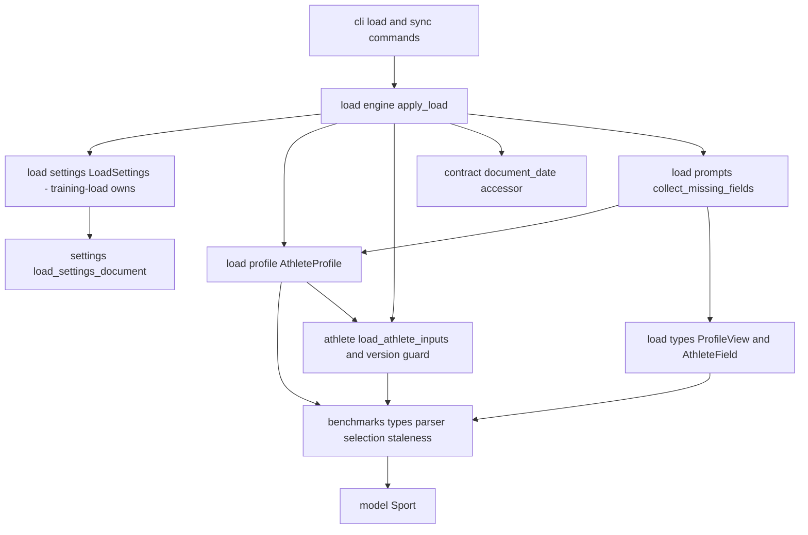
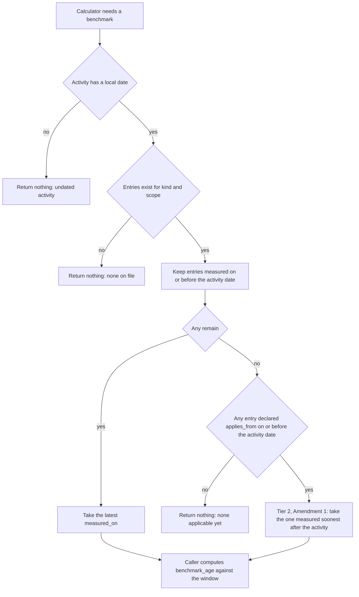
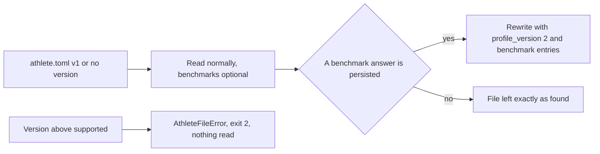

# Technical Design — athlete-benchmarks

## Overview

**Purpose**: This feature delivers the **benchmark store** that every
threshold-anchored load number in Phase 4 will be scaled against: per-discipline
thresholds, each carrying the calendar date it was measured, held in one
versioned, hand-editable `athlete.toml` under the data root. It answers three
questions the shipped profile cannot express — *which discipline*, *measured
when*, and *absent or merely not applicable* — and it answers a fourth, *how old
was this threshold when that activity happened*, as a pure computation against a
configured window.

**Users**: athletes hand-editing or being prompted for their thresholds;
load-calculator authors (`load-channels`, `threshold-load`) who resolve a
benchmark for an activity; the QA layer (`activity-qa-flags`) that surfaces
staleness. All three reach the store through the profile view the load engine
already threads into `LoadCalculator.compute`.

**Impact**: `athlete.toml` gains a versioned `[benchmarks]` namespace and one
canonical parser. The two code paths that read that file today are reconciled
rather than multiplied: `athlete.py` keeps its read-only athlete-inputs contract
and gains the schema-version guard; `load/profile.py` keeps sole ownership of the
write path and gains benchmark reads and a dated-measurement writer.
`ProfileView` gains benchmark queries that express discipline and date as
explicit arguments, and the `[load]` settings reader owned by `training-load`
gains one key for the staleness window. The activity date and the resolved
settings reach a calculator on the per-pass context `training-load` owns — not
on the profile view, which stays the minimal read-only store view its docstring
describes.

### Goals

- One store, one file, one parser, one writer for athlete benchmarks.
- Date-scoped selection: an activity is scored against the benchmark that was
  current on that activity's own local calendar date.
- Staleness as a pure, deterministic function of `(activity date, measured_on,
  window)` — evaluated against the activity, never against today.
- Absence is a first-class, distinguishable outcome: *none on file* and *none
  applicable* are different answers, and neither is ever a default value.
- Loud, specific failure on malformed input, always before anything is written.

### Non-Goals

- Any load math (TSS, HRSS, pace anchoring, channel selection) — `load-channels`
  and `threshold-load`.
- Rendering benchmarks or staleness into a document — `activity-qa-flags`.
- Auto-FTP / eFTP estimation, or any inference of a benchmark from activity data.
- Changing what the prompt flow asks or how it asks it (the
  retroactive-application question Amendment 1 introduces is `training-load`'s
  3.7–3.9; this design specifies only what the store does with the answer);
  changing `ZoneSpec` or the flat athlete-input keys' meaning.
- Mapping an activity's modality to a benchmark discipline (Walk/Hike → which
  LTHR): that policy belongs to `threshold-load`.
- **Creating or owning the `[load]` settings reader.** `src/fitdocs/load/settings.py`
  — the module, the `LoadSettings` dataclass, the reader function, the error type
  and the defaults constant — belongs to `training-load`. This feature adds one
  field and one key to it (see Cross-Spec Amendments below).
- **Owning the calculator's per-pass context or `LoadCalculator.compute`'s
  parameter list.** `training-load` defines both; this feature only supplies the
  activity date the context carries.
- **Owning or adding `src/fitdocs/contract.py`'s `document_date` reader.**
  `wiki-contract` owns the frontmatter key set and its pure-reader set, and
  `training-load` task 4.1 lands the one reader this feature needs. This spec is
  the consumer: it neither owns the module nor adds the accessor, except as the
  documented fallback in task 5.1.

## Boundary Commitments

### This Spec Owns

- The benchmark vocabulary: quantities (`BenchmarkKind`), scopes (a `Sport`
  discipline or the reserved athlete-wide scope), and the `Benchmark` value type.
- The `[benchmarks]` region of `athlete.toml`: its shape, its validation rules,
  and its serialization.
- `athlete.toml`'s **schema version** constant, the version guard, and the
  version stamped on write.
- Date-aware selection (`benchmark(...)`) and undated presence (`has_benchmark(...)`).
- Staleness computation (`benchmark_age(...)`) and the `BenchmarkAge` verdict type.
- The `benchmark_staleness_days` **key and its default**, contributed as one
  field on `training-load`'s `LoadSettings` — not the reader that projects it.
- The benchmark queries added to `ProfileView` and the benchmark-carrying
  extension of `AthleteField`, plus the corresponding public-surface pin.
- The benchmark branch of the prompt flow's presence check and persistence.

### Out of Boundary

- `AthleteInputs`, `ZoneSpec`, `compute_metrics` and every already-rendered
  metric that depends on the flat keys — unchanged in shape and meaning.
- `LoadResult`, `LoadOutcome`, the registry, arbitration, document surgery and
  payload versioning — `training-load` (and its amendments).
- **`src/fitdocs/load/settings.py` as a module** — created and owned by
  `training-load` (task 3.1). Its `LoadSettings` dataclass, reader name
  (`load_load_settings`), error type (`LoadSettingsError`) and defaults constant
  (`DEFAULT_LOAD_SETTINGS`) are that spec's to define. Every other `[load]` key
  (channel priority, sufficiency thresholds, default calculator, flag
  thresholds) is a sibling's field on the same dataclass.
- **`LoadCalculator.compute`'s parameter list and the per-pass `LoadContext`** —
  `training-load` (Amendment 3). This spec supplies `context.activity_date`'s
  value from the document contract; it does not define or version the type.
- **`src/fitdocs/contract.py`'s reader set and `tests/test_contract.py`** —
  `wiki-contract`. See Cross-Spec Amendments.
- Deciding what a stale or absent benchmark *means* for a load value or a
  document.

### Cross-Spec Amendments (2026-07-25 cross-spec review)

A cross-spec review adjudicated three ownership questions against this spec. The
rulings below are binding and the design text has been amended to match.

1. **`src/fitdocs/load/settings.py` belongs to `training-load`.** Both specs had
   independently designed the module. `training-load`'s reader name matches the
   dominant shipped convention (`plugins.load_plugin_settings`,
   `inbox.load_inbox_settings`), while this spec's earlier
   `load_settings_from_document` followed the older `tiles` variant and collided
   confusingly with the shipped `fitdocs.settings.load_settings_document`, which
   reads the *file*. The pinned surface this spec extends is:

   ```python
   load_load_settings(document: Mapping[str, object], settings_file: Path) -> LoadSettings
   class LoadSettingsError(SettingsError): ...
   DEFAULT_LOAD_SETTINGS: Final[LoadSettings]   # every field defaulted
   ```

   Unknown keys *and unknown sub-tables* are ignored, so siblings extend the
   single `LoadSettings` dataclass independently. This spec adds exactly
   `benchmark_staleness_days: int = 84`. If the module has not yet landed when
   this spec's task 2.2 runs, that task creates it **to exactly the signature
   above** and to no other. A second reader is never created.

2. **`ProfileView` reverts to a pure store view.** An earlier draft carried
   `activity_date` and `staleness_window_days` on the view because
   `LoadCalculator.compute`'s parameter list was another spec's contract.
   `training-load` Amendment 3 supersedes that by adding a per-pass context:

   ```python
   @dataclass(frozen=True)
   class LoadContext:
       activity_date: date | None
       settings: LoadSettings

   def compute(self, activity, metrics, profile, session, context) -> LoadOutcome: ...
   ```

   So the window is read from `context.settings.benchmark_staleness_days` and the
   activity date from `context.activity_date`. `ProfileView` keeps only total
   queries over the store, matching its shipped docstring ("minimal read-only
   view of the athlete profile"). This also retires the redundancy of a
   `ProfileView.staleness_window_days` duplicating
   `LoadSettings.benchmark_staleness_days`. `benchmark_age(...)` and the
   staleness computation are unchanged — only the plumbing moved.

3. **The `contract.document_date` accessor is added by `training-load`, not
   here.** `wiki-contract` claims `contract.py`'s pure-reader set and owns
   `tests/test_contract.py`. The accessor is nonetheless the right home —
   `engine.py`'s standing invariant is that every frontmatter read goes through
   `fitdocs.contract`, and the renderer emits the date as a quoted string, so a
   real reader rather than a bare lookup is genuinely needed.

   **Superseded 2026-07-25 (second round).** The first round assigned the
   incursion to this spec's task 5.1. `training-load`'s own design re-validation
   then reassigned it, and that ruling is binding: its task 4.1 cannot build a
   `LoadContext` without the accessor, `document_date` resolves nowhere in `src/`
   or `tests/`, and this spec had committed no task — so **`training-load` task
   4.1 adds it**, with its boundary extended to `DocumentContract` exactly as
   task 2.4 was treated for the same module. This spec becomes a pure consumer
   and no longer claims the addition anywhere.

   Task 5.1 therefore takes the same conditional shape amendment 1 gave task 2.2:
   consume the accessor, and create it **only if task 4.1 has not landed**, and
   then to exactly the pinned surface and to no other:

   ```python
   def document_date(frontmatter: Mapping[str, object] | None) -> date | None: ...
   ```

   An unconditional block was considered and rejected. Task 4.1 sits behind
   `training-load` tasks 3.2 and 3.3, both unstarted, so a 5.1 with no fallback
   would stall this spec's entire date path — and with it tasks 5.2, 5.3, 6.1 and
   6.2 — on a peer's mid-plan task. The fallback never reshapes the accessor, so
   whichever spec lands second finds it already correct and adds nothing.

### Allowed Dependencies

- Stdlib only for new behavior: `tomllib` (decode), `tomli_w` (already a
  dependency, used by `save_profile`), `datetime.date`, `dataclasses`, `enum`.
- `fitdocs.Sport` (the shipped sport vocabulary) and `fitdocs.settings`
  (`load_settings_document`, `SettingsError`) and `fitdocs.layout.settings_path`.
- Dependency direction is unchanged and must not be inverted:
  `cli → engine/prompts → profile → benchmarks/athlete → model`.
  `benchmarks.py` imports no `fitdocs.load.*` module; `athlete.py` imports no
  `fitdocs.load.*` module.

### Revalidation Triggers

- Any change to the `[benchmarks]` TOML shape, the `BenchmarkKind` set, or the
  scope rules → `athlete.toml` schema version bump; `load-channels` and
  `threshold-load` re-check their benchmark reads. *Amendment 1 exception*:
  adding an **optional** entry key that an older reader ignores under 1.10
  and whose absence changes nothing (`applies_from`) is not a bump; the
  re-check still applies — `load-channels` renders `measured_on` into
  diagnostics and must decide whether to show `applies_from` beside it (queue
  item `2026-09-10-load-channels-renders-a-retroactive-anchor-date-unexplained`).
- Any change to `ProfileView` members or to `AthleteField` → `threshold-load`,
  `plugin-api`'s published surface, and `tests/test_public_api.py`.
- Any change to selection semantics (which entry applies to a date) → every
  computed load value changes; `threshold-load` and `activity-qa-flags` re-check.
- Adding a `[load]` key or changing `LoadSettings`' shape → **`training-load`
  first** (it owns the module), then the sibling specs sharing that table.
- Any change to `load_load_settings`' name or signature, or to `LoadContext`'s
  shape → this spec's task 2.2 and its engine wiring; `training-load` is the
  owner and this spec follows.
- Changing `collect_missing_fields`' signature (this spec adds `on: date`) →
  `training-load`'s engine, which owns the call site this spec edits.
  `load_profile`'s signature is deliberately left unchanged.
- **`wiki-contract`** — `document_date` lives in `src/fitdocs/contract.py` with
  its case in `tests/test_contract.py`, both of which `wiki-contract` owns and
  `training-load` task 4.1 lands. Any change to that module's reader set, its
  `MANAGED_KEYS`, or the frontmatter `date` key's on-disk form → re-check
  `document_date` and the engine's date resolution. Sequencing: task 2.4 already
  landed the `LOAD_KEYS` rename in those two files (`a782034`), so the live
  coordination is with task 4.1 alone — see task 5.1.
- `training-load` Amendment 3's per-pass `LoadContext` → this spec's engine
  wiring supplies `activity_date`; `threshold-load` and `activity-qa-flags`
  re-check how they obtain the date and the staleness window.

## Architecture

### Existing Architecture Analysis

The tree already contains everything except dates and discipline scoping, and
two facts drive the whole design:

1. **`athlete.py` and `load/profile.py` read the same file.**
   `athlete.ATHLETE_FILE` and `profile.PROFILE_FILENAME` are both
   `"athlete.toml"`. The split is not read-vs-write by file; it is
   *athlete-inputs projection* (`athlete.py` → `AthleteInputs` for metrics and
   rendering) versus *profile lifecycle* (`load/profile.py` → the writable
   document, and the `ProfileView` calculators actually receive). Benchmarks are
   consumed through `ProfileView`, so the benchmark read path lands in
   `load/profile.py`, and `athlete.py` gains only the file-level version guard —
   a deliberate divergence from the brief's phrasing, which assumed the read path
   as a whole lived in `athlete.py`.
2. **The engine already threads exactly what is needed.** `apply_load` loads the
   athlete inputs and the profile once (`engine.py:210-211`), threads the profile
   document-by-document, and persists each accepted answer via `save_profile`
   (`engine.py:381-386`). `AthleteFileError` and `ProfileError` are already in
   `_CONFIG_ERRORS`, and the CLI already maps them to exit code 2 before any
   write. New configuration failures ride those paths unchanged.

Patterns preserved: the `bool`-is-an-`int` rejection at every numeric boundary;
absent-file-is-not-an-error; loud-on-malformed with the file and offending key
named; frozen dataclasses with tuple fields for determinism; per-table settings
readers that take the already-parsed document (`tile_settings_from_document`
is the shape to match); atomic temp-file-plus-`os.replace` writes.

### Architecture Pattern & Boundary Map



**Architecture Integration**

- **Selected pattern**: a pure value-and-rules leaf (`benchmarks.py`) with thin
  I/O-owning adapters above it (`athlete.py` for the version guard,
  `load/profile.py` for read/write of the document, and `training-load`'s
  `load/settings.py` for the `[load]` table). Selection and staleness are pure
  functions over decoded values, so they are verifiable without touching a
  filesystem.
- **Domain boundaries**: value vocabulary and rules (`benchmarks.py`) ≠ file
  lifecycle (`load/profile.py`) ≠ configuration (`load/settings.py`) ≠ contract
  (`load/types.py`). No two of them own the same decision.
- **New components rationale**: `benchmarks.py` is the only module this feature
  creates. It exists because two modules must agree on one set of rules.
  `load/settings.py` is *not* a new component of this spec: `training-load`
  creates it, and this spec adds one field to the dataclass it defines — the
  single-reader discipline settings-foundation exists to enforce.
- **Steering compliance**: absent data yields `None`/absence, never a fabricated
  `0`; all math deterministic and LLM-free; personal data stays in the data root;
  `mypy --strict` typing throughout; dependency direction unchanged.

### Technology Stack

| Layer | Choice / Version | Role in Feature | Notes |
|-------|------------------|-----------------|-------|
| CLI | `typer` + `rich` (shipped) | Surfaces configuration errors at exit code 2; hosts the unchanged prompt flow | Only the error tuple in `_run_load_pass` changes |
| Store / Parsing | `tomllib` (stdlib 3.11+) | Decodes `athlete.toml`; a bare TOML date decodes to `datetime.date` | First date-typed config value in the codebase |
| Store / Writing | `tomli_w` (shipped) | Serializes the profile document; round-trips `datetime.date` natively | Already used by `save_profile` |
| Domain types | stdlib `dataclasses`, `enum.StrEnum`, `datetime.date` | Benchmark vocabulary, values, staleness verdict | No new third-party dependency |
| Config | `fitdocs.settings.load_settings_document` (shipped) | Single read of `fitdocs.toml`; `[load]` projected by `training-load`'s reader, which this feature only extends with `benchmark_staleness_days` | Absent file yields an empty mapping, never an error |

## File Structure Plan

### Directory Structure

```
src/fitdocs/
├── benchmarks.py            # NEW leaf: BenchmarkKind, Benchmark, BenchmarkSet,
│                            #   BenchmarkAge, parser, selection, staleness
├── athlete.py               # MOD: schema-version constant + guard
├── contract.py              # (wiki-contract owns; training-load task 4.1 adds
│                            #   document_date). Touched here ONLY as task 5.1's
│                            #   fallback if 4.1 has not landed.
├── load/
│   ├── settings.py          # MOD (training-load owns): + benchmark_staleness_days
│   │                        #   on LoadSettings. Created here ONLY if training-load
│   │                        #   task 3.1 has not landed, and then to its signature.
│   ├── profile.py           # MOD: benchmark reads/writes, version stamp
│   ├── types.py             # MOD: ProfileView benchmark queries, AthleteField.benchmark
│   ├── prompts.py           # MOD: benchmark-aware presence + persistence
│   ├── engine.py            # MOD: [load] read, activity-date resolution + threading
│   └── __init__.py          # MOD: re-export benchmark types on the plugin surface
└── cli.py                   # MOD: catch SettingsError in the load pass
```

> `benchmarks.py` is deliberately **not** under `load/`: `load/types.py` documents
> that it imports no other `fitdocs.load.*` module, and the extended
> `ProfileView` must name benchmark types. A top-level value module is the
> category `load/types.py` already imports from (`model.py`, `metrics/types.py`).

### Modified Files

- `src/fitdocs/athlete.py` — adds `ATHLETE_SCHEMA_VERSION` and
  `check_schema_version(data, path)`; `load_athlete_inputs` calls the guard
  before projecting. No other behavior changes; the module stays read-only.
- `src/fitdocs/load/profile.py` — `ProfileError` subclasses `AthleteFileError`;
  `AthleteProfile` parses benchmarks eagerly and gains `benchmark`,
  `has_benchmark` and `with_benchmark`; `save_profile` stamps
  `ATHLETE_SCHEMA_VERSION` into the existing `profile_version` key and keeps
  benchmark entries date-sorted. `load_profile`'s signature is unchanged — the
  staleness window never reaches the store; it rides the per-pass context.
- `src/fitdocs/load/settings.py` — **owned by `training-load`.** `LoadSettings`
  gains one field, `benchmark_staleness_days: int = 84`, and the reader validates
  it. Nothing else in the module is touched: not the reader name, not the error
  type, not `DEFAULT_LOAD_SETTINGS`.
- `src/fitdocs/contract.py` — **owned by `wiki-contract`; added by
  `training-load` task 4.1; consumed here.**
  `document_date(frontmatter) -> date | None` is the accessor for the document's
  own local calendar date. The document contract already *owns* the `date` key
  (it is in `MANAGED_KEYS`) but exposes no reader for it, and `engine.py`'s
  invariant is that every frontmatter read goes through this module — so the
  accessor belongs here, not inline in the engine. It tolerates both on-disk
  forms: the quoted string the renderer emits and the bare date a hand-edit
  produces, returning `None` for absent, wrong-typed or unparseable values. This
  spec edits the module only under task 5.1's fallback, if task 4.1 has not
  landed by then. Coordination and sequencing: see Cross-Spec Amendments item 3.
- `src/fitdocs/load/types.py` — `ProfileView` gains `benchmark` and
  `has_benchmark`; `BenchmarkRef` added; `AthleteField` gains an optional
  `benchmark` reference. No non-query member is added to the view.
- `src/fitdocs/load/prompts.py` — `collect_missing_fields` takes `on: date` and,
  since Amendment 1, keyword-only `activity_date: date | None`; the presence
  check and the persistence branch route on `field.benchmark`, and the
  retroactive-application question is asked between them (`training-load`
  3.7–3.9).
- `src/fitdocs/load/engine.py` — `apply_load` projects `[load]` once through
  `load_load_settings`, resolves `today` once and passes it to
  `collect_missing_fields`, and resolves each document's own calendar date through
  `contract.document_date` for the per-pass context handed to `compute`.
- `src/fitdocs/load/__init__.py` — re-exports `Benchmark`, `BenchmarkKind`,
  `BenchmarkAge`, `BenchmarkRef`, `benchmark_age` on the plugin surface.
- `src/fitdocs/cli.py` — `_run_load_pass` catches `SettingsError` alongside the
  existing configuration errors.
- Tests: new `tests/test_benchmarks.py`; modified `tests/load/test_settings.py`
  (the `[load]` reader's test module, created and named by `training-load`;
  every sibling spec was corrected to this name in the 2026-07-25 cross-spec
  round), `tests/test_athlete.py`, `tests/load/test_profile.py`,
  `tests/load/test_prompts.py`, `tests/load/test_types.py`,
  `tests/load/conftest.py`, `tests/load/test_engine.py`,
  `tests/load/test_stub_calculators.py`, `tests/load/test_registry.py`,
  `tests/test_plugin_regression.py`, `tests/load/test_feature_e2e.py`,
  `tests/test_public_api.py`. `tests/test_contract.py` (owned by `wiki-contract`)
  gains its `document_date` case from `training-load` task 4.1 and is touched
  here only under task 5.1's fallback. Every one of the rest
  either annotates a `ProfileView` double, constructs an `AthleteProfile`
  directly, or imports the retired `PROFILE_VERSION` name. There is no
  `tests/load/withdrawn/` — the withdrawn calculator and its tests were
  deleted in `6386361` (`training-load` task 1.3).

## System Flows

### Benchmark resolution for one activity



`NotOnFile` and `NotApplicable` are both "no benchmark" to the caller's value
question, and the caller separates them with `has_benchmark` — that separation is
what stops the prompt loop and what lets the skip reason be honest.

### Prompt and persistence within a load pass

```mermaid
sequenceDiagram
    participant CLI
    participant Engine
    participant Prompts
    participant Profile
    participant Disk
    CLI->>Engine: apply_load(data_root, session, today)
    Engine->>Disk: read fitdocs.toml once
    Engine->>Engine: load_load_settings(document, settings_file) -> LoadSettings
    Engine->>Profile: load_profile(data_root)
    Profile->>Disk: read athlete.toml
    Profile->>Profile: guard version, parse benchmarks (loud on malformed)
    Engine->>Prompts: collect_missing_fields(fields, profile, session, persist, on=today, activity_date=<document date>)
    Prompts->>Profile: has_benchmark(kind, scope) for benchmark fields
    Prompts->>Prompts: prompt only when none on file
    Prompts->>Prompts: confirm "apply back to <activity date>?" (Amendment 1; only when activity date < today)
    Prompts->>Profile: with_benchmark(kind, scope, value, measured_on=today, applies_from=<activity date> | None)
    Prompts->>Disk: persist immediately via save_profile
```

Configuration failures — an unreadable settings file, a bad `[load]` value, a
future schema version, a malformed benchmark — all occur in the first four steps,
before any document is written.

## Requirements Traceability

| Requirement | Summary | Components | Interfaces | Flows |
|-------------|---------|------------|------------|-------|
| 1.1, 1.2, 1.3, 1.4, 1.5 | One file; five quantities; scope rules; dated entries with optional note; history | BenchmarkVocabulary, BenchmarkStore | `BenchmarkKind`, `Benchmark`, `[benchmarks]` schema | — |
| 1.6, 1.7, 1.8 | Explicit schema version; refuse unknown; absent version means earliest | AthleteFileGuard | `ATHLETE_SCHEMA_VERSION`, `check_schema_version` | Prompt/persistence flow, step 5 |
| 1.9, 1.10, 1.11 | Absent file is not an error; unknown keys ignored; flat keys untouched | AthleteFileGuard, BenchmarkStore | `load_profile`, `load_athlete_inputs` | — |
| 1.12 | Optional athlete-declared applies-from date, no later than `measured_on`; absent means unchanged behaviour (Amendment 1) | BenchmarkVocabulary | `Benchmark.applies_from`, `parse_benchmarks` | — |
| 2.1, 2.2, 2.3 | Value type, positivity/finiteness, integral bpm | BenchmarkVocabulary | `parse_benchmarks`, `BenchmarkError` | — |
| 2.4 | Date type and no time/zone component | BenchmarkVocabulary | `parse_benchmarks` | — |
| 2.5, 2.6 | Unknown discipline; wrong scope for a quantity | BenchmarkVocabulary | `BenchmarkKind.scope`, `parse_benchmarks` | — |
| 2.7, 2.8 | Duplicate measurement date; structural shape errors | BenchmarkVocabulary | `parse_benchmarks` | Resolution flow |
| 2.9, 2.10 | Configuration error before any write; never silently dropped | BenchmarkStore, CLIErrorSurface | `ProfileError`, `_config_error` | Prompt/persistence flow |
| 2.11 | `applies_from` not a bare date, with a time component, or after `measured_on` → loud, naming the entry (Amendment 1) | BenchmarkVocabulary | `parse_benchmarks` | — |
| 3.1, 3.2, 3.3, 3.4 | Filter by date, latest wins, no future entry unless athlete-declared (Amendment 1), no cross-scope fallback | BenchmarkSelection | `BenchmarkSet.applicable` | Resolution flow |
| 3.10, 3.11 | Tier 2 (Amendment 1): the athlete-declared entry measured soonest after the activity; `applies_from` returned with the value | BenchmarkSelection | `BenchmarkSet.applicable`, `Benchmark.applies_from` | Resolution flow |
| 3.5 | None-on-file vs none-applicable are distinguishable | BenchmarkSelection | `BenchmarkSet.has` | Resolution flow |
| 3.6, 3.7 | Local calendar date read from the document and carried on the per-pass context; undated activity yields nothing | DocumentDateAccessor, LoadEngineWiring, BenchmarkStore | `document_date`, `LoadContext.activity_date` (training-load), `AthleteProfile.benchmark(on=None) -> None` | Resolution flow |
| 3.8, 3.9 | Deterministic repeat; returns date and note with the value | BenchmarkSelection | `Benchmark` | Resolution flow |
| 4.1, 4.2, 4.4 | Age in days; verdict against the window; report age and window | StalenessCalculation | `benchmark_age`, `BenchmarkAge` | — |
| 4.3, 4.5 | Evaluated against the activity date; pure, no clock, no I/O | StalenessCalculation | `benchmark_age` | — |
| 4.6, 4.7 | Negative age, never stale, for a measurement after the activity (Amendment 1; was loud); never alters a value | StalenessCalculation | `benchmark_age` | — |
| 5.1, 5.2, 5.6 | `[load]` key; documented default on absence; single shared file read | LoadSettingsExtension | `load_load_settings`, `LoadSettings.benchmark_staleness_days`, `DEFAULT_STALENESS_WINDOW_DAYS` | Prompt/persistence flow |
| 5.3, 5.4, 5.5 | Value validation; unknown `[load]` keys ignored; fail before writing | LoadSettingsExtension, LoadEngineWiring, CLIErrorSurface | `LoadSettingsError` | Prompt/persistence flow |
| 6.1, 6.2, 6.3 | Same file; measurement date is the answer date; upsert on same date | BenchmarkStore | `AthleteProfile.with_benchmark` | Prompt/persistence flow |
| 6.4, 6.5, 6.6, 6.7 | Preserve unmanaged data; stamp version; date-sorted output; atomic write | BenchmarkStore | `save_profile` | Prompt/persistence flow |
| 6.8, 6.9 | Never writes a flat threshold key; reject-and-persist-nothing | BenchmarkStore | `with_benchmark` | — |
| 6.10 | `applies_from` recorded on the entry, refused if later than `measured_on`, preserved and overlaid on rewrite exactly like `note` (Amendment 1) | BenchmarkStore | `with_benchmark(applies_from=)`, `_merge_benchmarks_document` | Prompt/persistence flow |
| 7.1, 7.2 | Request by kind/scope/date; undated presence | ProfileContract | `ProfileView.benchmark`, `ProfileView.has_benchmark` | Resolution flow |
| 7.3 | Window exposed to calculators via the per-pass context's settings, not the view | LoadSettingsExtension | `LoadSettings.benchmark_staleness_days` on `LoadContext.settings` | Prompt/persistence flow |
| 7.4, 7.5, 7.7 | Keyed numeric access retained; explicit arguments; absence returns nothing | ProfileContract | `ProfileView` | Resolution flow |
| 7.6 | Plugin surface carries the benchmark types and the pin is updated | ProfileContract, PublicSurfacePin | `fitdocs.load.__all__` | — |
| 8.1, 8.2, 8.3 | Declarable benchmark fields; prompt when none on file; never re-ask | ProfileContract, PromptFlowIntegration | `AthleteField.benchmark`, `collect_missing_fields` | Prompt/persistence flow |
| 8.4 | None-applicable is reported, not prompted | PromptFlowIntegration, BenchmarkSelection | `has_benchmark` vs `benchmark` | Resolution flow |
| 8.5, 8.6, 8.7 | Decline persists nothing; non-interactive completes cleanly; immediate persist | PromptFlowIntegration | `collect_missing_fields` | Prompt/persistence flow |
| 8.8 | The retroactive question is `training-load`'s (3.7–3.9); this store persists the applies-from date it is handed and asks nothing (Amendment 1) | PromptFlowIntegration, BenchmarkStore | `with_benchmark(applies_from=)` | Prompt/persistence flow |
| 9.1, 9.2 | Read path stays read-only; writes only from a user answer | AthleteFileGuard, BenchmarkStore | `load_athlete_inputs` | — |
| 9.3, 9.4 | Plain hand-editable text; data-root confinement | BenchmarkStore | `[benchmarks]` schema, `layout` paths | — |
| 9.5 | Absence yields nothing at every read point | BenchmarkSelection, BenchmarkStore | `benchmark`, `get_number` | Resolution flow |

## Components and Interfaces

| Component | Domain/Layer | Intent | Req Coverage | Key Dependencies (P0/P1) | Contracts |
|-----------|--------------|--------|--------------|--------------------------|-----------|
| BenchmarkVocabulary | Domain leaf (`benchmarks.py`) | Quantities, scopes, the `Benchmark` value, and the one parser/validator | 1.2, 1.3, 1.4, 1.5, 2.1–2.8 | `fitdocs.Sport` (P0) | State |
| BenchmarkSelection | Domain leaf (`benchmarks.py`) | Date-scoped applicability and undated presence over a parsed set | 3.1–3.9, 8.4, 9.5 | BenchmarkVocabulary (P0) | Service |
| StalenessCalculation | Domain leaf (`benchmarks.py`) | Pure age and staleness verdict | 4.1–4.7 | BenchmarkVocabulary (P1) | Service |
| AthleteFileGuard | Reader (`athlete.py`) | Owns `athlete.toml`'s schema version and refuses unknown versions | 1.6, 1.7, 1.8, 1.9, 1.11, 9.1 | none | Service |
| LoadSettingsExtension | Config (`load/settings.py`, **training-load owns the module**) | Adds the staleness-window key, its default and its validation to the one `[load]` reader | 5.1–5.6, 7.3 | `training-load`'s `load_load_settings` (P0), `fitdocs.settings` (P0) | State |
| BenchmarkStore | Store (`load/profile.py`) | The one lifecycle of `athlete.toml`: parse on load, dated upsert on write | 1.1, 1.10, 2.9, 2.10, 3.7, 6.1–6.9, 9.2–9.5 | BenchmarkVocabulary (P0), AthleteFileGuard (P0) | Service, State |
| ProfileContract | Contract (`load/types.py`) | The benchmark queries on `ProfileView` and the benchmark-carrying `AthleteField` | 7.1, 7.2, 7.4–7.7, 8.1 | BenchmarkVocabulary (P0) | Service |
| PromptFlowIntegration | Flow (`load/prompts.py`) | Presence check and persistence branch for benchmark fields | 8.1–8.3, 8.5–8.7 | ProfileContract (P0), BenchmarkStore (P0) | Service |
| DocumentDateAccessor | Document contract (`contract.py`, **wiki-contract owns the module**) | Reads the document's own local calendar date from its frontmatter | 3.6, 3.7 | none | Service |
| LoadEngineWiring | Runtime (`load/engine.py`) | Resolves settings and today once, and each document's own date, and threads them | 3.6, 3.7, 5.5, 8.2 | LoadSettingsExtension (P0), BenchmarkStore (P0), DocumentDateAccessor (P0) | Service |
| CLIErrorSurface | CLI (`cli.py`) | Maps settings failures to the existing configuration-error exit | 2.9, 5.5 | LoadSettingsExtension (P1) | Service |
| PublicSurfacePin | Test contract (`tests/test_public_api.py`) | Re-pins the plugin surface to the extended shape | 7.6 | ProfileContract (P0) | State |

### Domain leaf — `src/fitdocs/benchmarks.py`

#### BenchmarkVocabulary

| Field | Detail |
|-------|--------|
| Intent | Define what a benchmark is and validate one decoded `[benchmarks]` mapping |
| Requirements | 1.2, 1.3, 1.4, 1.5, 2.1, 2.2, 2.3, 2.4, 2.5, 2.6, 2.7, 2.8 |

**Responsibilities & Constraints**

- Owns the quantity set, each quantity's scope and numeric kind, and the value
  type. Performs **no I/O** and holds no path knowledge beyond a caller-supplied
  label used in messages.
- Rejects a `bool` wherever a number is required (Python's `bool` subclasses
  `int`), mirroring `athlete.py`'s shipped strictness.
- Raises `BenchmarkError` — a plain domain error the callers re-raise in their
  own file-level voice, exactly as `athlete.py` re-raises `ZoneSpec`'s
  `ValueError` today.

**Dependencies**

- Outbound: `fitdocs.Sport` — the discipline vocabulary (P0).
- External: `datetime.date` from the decoded TOML (P0).

**Contracts**: State [x] / Service [x]

##### Service Interface

```python
class BenchmarkKind(StrEnum):
    """A benchmark quantity. The value is the TOML key and carries its unit."""
    FTP_WATTS = "ftp_watts"
    LTHR_BPM = "lthr_bpm"
    THRESHOLD_PACE_S_PER_KM = "threshold_pace_s_per_km"
    MAX_HR_BPM = "max_hr_bpm"
    RESTING_HR_BPM = "resting_hr_bpm"

ATHLETE_SCOPE: Final[str] = "athlete"
"""Reserved discipline-table name for whole-athlete quantities. No Sport value
lowercases to this token, so the two vocabularies cannot collide."""

DISCIPLINE_SCOPED: Final[frozenset[BenchmarkKind]]  # FTP, LTHR, threshold pace
ATHLETE_SCOPED: Final[frozenset[BenchmarkKind]]     # max HR, resting HR
INTEGRAL_KINDS: Final[frozenset[BenchmarkKind]]     # the bpm quantities

@dataclass(frozen=True)
class Benchmark:
    kind: BenchmarkKind
    discipline: Sport | None   # None == the athlete-wide scope
    value: float
    measured_on: date
    note: str | None = None
    applies_from: date | None = None   # Amendment 1: athlete-declared, <= measured_on

def parse_benchmarks(document: Mapping[str, object]) -> BenchmarkSet: ...
def benchmarks_to_document(entries: Sequence[Benchmark]) -> dict[str, object]: ...
```

- *Amendment 1*: `applies_from` is trailing and defaulted, so every existing
  keyword construction is unchanged. The parser accepts an optional
  `applies_from` key with exactly `measured_on`'s bare-date strictness and
  rejects, naming the entry, a value that is not a bare date or that falls
  after `measured_on` (1.12, 2.11); `applies_from == measured_on` is accepted
  and behaves as if absent. The serializer emits it after `measured_on` when
  present and omits it otherwise; the round trip holds either way.

- Preconditions: `document` is the already-decoded top-level `athlete.toml`
  mapping; `parse_benchmarks` reads only its `benchmarks` key.
- Postconditions: returns a `BenchmarkSet` whose entries are all validated, or
  raises `BenchmarkError` naming the discipline, quantity and offending value.
  An absent `benchmarks` key yields an empty set (1.9, 1.10).
  `benchmarks_to_document` emits entries grouped by scope and quantity, sorted
  ascending by `measured_on` (6.6).
- Invariants: `(discipline, kind, measured_on)` is unique within a set; every
  `value` is finite and strictly positive; every integral-kind value is a whole
  number stored as `int`; unknown keys inside a benchmark entry are ignored (1.10)
  while unknown *discipline tables* are rejected (2.5).

**Implementation Notes**

- Integration: entry shape is a TOML array of tables —
  `[[benchmarks.<scope>.<kind>]]` with `value`, `measured_on`, optional `note`.
  A non-list at that path, or a non-table element, raises with the offending
  path (2.8).
- Validation: `measured_on` must decode to `datetime.date` and **not** to
  `datetime.datetime` (a TOML date-time carries a time and possibly an offset) —
  because `datetime` subclasses `date`, the check is `type(value) is date` (2.4).
- Risks: a user writing `2026-03-14T00:00:00Z` gets a loud error; the message
  states the expected bare-date form.

#### BenchmarkSelection

| Field | Detail |
|-------|--------|
| Intent | Answer "which benchmark applied on this date" and "is one on file at all" |
| Requirements | 3.1, 3.2, 3.3, 3.4, 3.5, 3.6, 3.7, 3.8, 3.9, 3.10, 3.11, 8.4, 9.5 |

**Responsibilities & Constraints**

- Pure lookups over an immutable parsed set. Never falls back across scope or
  discipline, never returns an entry measured after the activity unless the
  athlete declared it to apply from an earlier date (Amendment 1), never
  fabricates a value.
- Deterministic: entries are held in a canonical order and ties are impossible
  because duplicate `(scope, kind, measured_on)` keys are rejected at parse time.

**Contracts**: Service [x]

##### Service Interface

```python
@dataclass(frozen=True)
class BenchmarkSet:
    entries: tuple[Benchmark, ...]

    def applicable(
        self, kind: BenchmarkKind, *, discipline: Sport | None, on: date
    ) -> Benchmark | None: ...

    def has(self, kind: BenchmarkKind, *, discipline: Sport | None) -> bool: ...
```

- Preconditions: `discipline` is `None` exactly when `kind` is athlete-scoped;
  passing a mismatched scope is a programming error and raises `ValueError`.
- Postconditions: `applicable` returns the entry with the greatest
  `measured_on <= on` for that `(kind, discipline)` (3.1–3.4); *failing that*
  (Amendment 1, 3.10), among the same `(kind, discipline)` entries whose
  `applies_from` is not `None` and `<= on`, the one with the **smallest**
  `measured_on` — the measurement closest after the activity — else `None`.
  An entry with neither is never returned, and a tier-1 entry always beats a
  tier-2 one regardless of value. `has` ignores dates entirely (3.5). The
  returned `Benchmark` carries its `measured_on`, `note` and `applies_from`
  (3.9, 3.11). Repeated calls with equal inputs return an equal result (3.8);
  the tier-2 minimum is unambiguous because `(discipline, kind, measured_on)`
  is unique.
- Invariants: no cross-scope, cross-discipline or default fallback exists in any
  code path (9.5). The only path to an entry measured after `on` is the
  athlete's own `applies_from` declaration on that entry.

#### StalenessCalculation

| Field | Detail |
|-------|--------|
| Intent | Turn `(activity date, measured_on, window)` into an age and a verdict |
| Requirements | 4.1, 4.2, 4.3, 4.4, 4.5, 4.6, 4.7 |

**Contracts**: Service [x]

##### Service Interface

```python
@dataclass(frozen=True)
class BenchmarkAge:
    age_days: int
    window_days: int
    is_stale: bool

def benchmark_age(
    *, activity_date: date, measured_on: date, window_days: int
) -> BenchmarkAge: ...
```

- Preconditions: `window_days >= 1`; a violation raises `ValueError`.
  *Amendment 1 (4.6 revised)*: `measured_on > activity_date` is no longer a
  precondition — selection now yields such an entry when the athlete declared
  it to apply retroactively — and no longer raises.
- Postconditions: `age_days == (activity_date - measured_on).days`, which is
  **negative** for an entry measured after the activity; `is_stale == age_days
  > window_days` (so a negative age is never stale); the window is reported
  alongside the verdict (4.1, 4.2, 4.4). A negative age is the arithmetic
  fact a caller reads as "measured after this activity" — not a sentinel, and
  `BenchmarkAge`'s shape is unchanged. The function reads no file and no clock
  (4.5) and returns a verdict only — it never touches a `Benchmark` value
  (4.7).
- Invariants: called with the activity's own date, so regenerating an old
  document yields the same verdict it did originally (4.3).

### Reader — `src/fitdocs/athlete.py`

#### AthleteFileGuard

| Field | Detail |
|-------|--------|
| Intent | Own `athlete.toml`'s schema version and refuse a file this tool cannot read |
| Requirements | 1.6, 1.7, 1.8, 1.9, 1.11, 9.1 |

**Responsibilities & Constraints**

- Adds a version guard to the reader that runs on **every** sync, so a file
  written by a newer fitdocs is refused before any document is generated.
- The module stays read-only by construction: no creation, no prompting, no
  writes on any path (9.1). `AthleteInputs` projection is untouched, so no
  already-rendered metric changes (1.11).

**Contracts**: Service [x]

##### Service Interface

```python
ATHLETE_SCHEMA_VERSION: Final[int] = 2
"""Schema version stamped into and required of ``athlete.toml``.
1 = flat athlete-input keys only (the shipped shape); 2 adds ``[benchmarks]``."""

VERSION_KEY: Final[str] = "profile_version"
"""The existing on-disk key name, kept unchanged for file compatibility."""

def check_schema_version(document: Mapping[str, object], path: Path) -> int: ...
```

- Preconditions: `document` is the decoded file mapping.
- Postconditions: returns the declared version; an absent key yields `1` and the
  file is read normally (1.8); a value that is not an `int`, is a `bool`, is
  below 1, or is greater than `ATHLETE_SCHEMA_VERSION` raises `AthleteFileError`
  naming the file, the declared version and the supported version (1.7).
- Invariants: benchmarks are read whenever present regardless of a declared
  version ≤ current — the version gates *forward* only, so a hand-edited file
  that adds benchmarks without bumping the number still works and is corrected
  on the next save (1.6, 6.5).

**Implementation Notes**

- Integration: `load_athlete_inputs` calls the guard immediately after decoding
  and before projecting fields; `AthleteProfile` calls the same function, so both
  readers of the file agree on one rule.
- Risks: `PROFILE_VERSION` in `load/profile.py` is superseded by this constant.
  The Python name is removed and its one write site re-pointed; the **TOML key
  name is unchanged**, so existing files stay valid.

### Config — `src/fitdocs/load/settings.py` (module owned by `training-load`)

#### LoadSettingsExtension

| Field | Detail |
|-------|--------|
| Intent | Add the staleness window to the one `[load]` reader; own the key, not the reader |
| Requirements | 5.1, 5.2, 5.3, 5.4, 5.5, 5.6, 7.3 |

**Responsibilities & Constraints**

- **Ownership**: `training-load` task 3.1 creates this module and fixes its
  surface. This spec adds exactly one field and its validation. It never renames
  the reader, never adds a second reader, and never redefines `LoadSettings`,
  `LoadSettingsError` or `DEFAULT_LOAD_SETTINGS`.
- If, at implementation time, the module has not yet landed, this spec's task 2.2
  creates it **to the pinned signature below and to no other** — so that whichever
  spec lands second finds a compatible surface and adds only a field.
- The reader takes the already-parsed document and never opens, locates or
  re-reads the settings file itself (5.6). Callers obtain that document from the
  shared `load_settings_document` helper; the CLI's plugin report already performs
  such a read before a load pass, so `apply_load` performs its own read rather
  than assuming exactly one exists process-wide.
- **Ignores unrecognized `[load]` keys and sub-tables** so `load-channels`,
  `threshold-load` and `activity-qa-flags` can add theirs to the same table
  without this reader rejecting them (5.4). That additivity contract is
  `training-load`'s; this spec is one of its consumers.

**Dependencies**

- Inbound: `load/engine.py` — resolves settings at the start of a load pass (P0).
- Outbound: `fitdocs.settings.load_settings_document`, `SettingsError` (P0);
  `fitdocs.layout.settings_path` for the message path (P1).

**Contracts**: State [x] / Service [x]

##### Service Interface

The pinned surface (owned by `training-load`), with this spec's addition marked:

```python
DEFAULT_STALENESS_WINDOW_DAYS: Final[int] = 84
"""12 weeks: the outer end of the researched 8-12 week range, chosen so the
default under-flags rather than over-flags. Configurable per athlete."""

class LoadSettingsError(SettingsError):          # training-load
    """The [load] table exists but a value in it is invalid."""

@dataclass(frozen=True)
class LoadSettings:                              # training-load
    default_calculator: str | None = None        # training-load (shown for context)
    benchmark_staleness_days: int = DEFAULT_STALENESS_WINDOW_DAYS   # THIS SPEC

DEFAULT_LOAD_SETTINGS: Final[LoadSettings] = LoadSettings()   # training-load

def load_load_settings(                          # training-load
    document: Mapping[str, object], settings_file: Path
) -> LoadSettings: ...
```

- Preconditions: `document` is the mapping returned by `load_settings_document`
  (empty when the settings file is absent); `settings_file` is used only to name
  the file in messages.
- Postconditions: an absent file, absent `[load]` table or absent key yields
  `DEFAULT_LOAD_SETTINGS`, whose `benchmark_staleness_days` is the documented
  default, and is never an error (5.2); a non-`int`, `bool`, or non-positive
  `benchmark_staleness_days` raises `LoadSettingsError` naming the file, key and
  value (5.3); a `[load]` value that is not a table raises the same error.
- Invariants: every field of `LoadSettings` is defaulted, so a sibling adding a
  field never breaks another sibling's construction. The returned value is
  immutable and carries no I/O handle.

**Implementation Notes**

- Integration: `LoadSettingsError` subclasses `SettingsError`, so a CLI `except
  SettingsError` catches file-level and table-level problems alike and exits 2
  before any write (5.5).
- The staleness window is reached by a calculator as
  `context.settings.benchmark_staleness_days` on the per-pass `LoadContext`
  (`training-load` Amendment 3) — never through `ProfileView` (7.3).
- Risks: a rename or signature change on the owner's side invalidates this spec's
  task 2.2; that is a recorded revalidation trigger.

### Store — `src/fitdocs/load/profile.py`

#### BenchmarkStore

| Field | Detail |
|-------|--------|
| Intent | The single lifecycle of `athlete.toml`, now including dated benchmarks |
| Requirements | 1.1, 1.10, 2.9, 2.10, 3.7, 6.1–6.9, 9.2, 9.3, 9.4, 9.5 |

**Responsibilities & Constraints**

- Parses benchmarks **eagerly** on construction so a malformed store fails at the
  top of the load pass, before any document is touched (2.9). The raw document
  and the parsed set can never drift because every mutation rebuilds both.
- Preserves every unmanaged key and table verbatim on write, including the flat
  athlete-input keys and any benchmark history already on file (6.4), and never
  creates or updates a flat threshold key (6.8).
- Writes only as the result of a user-provided, validated answer (9.2), atomically
  (6.7), into the data root and nowhere else (9.4).

**Dependencies**

- Inbound: `load/engine.py` (load + persist), `load/prompts.py` (mutations) (P0).
- Outbound: `benchmarks.parse_benchmarks` / `benchmarks_to_document` (P0),
  `athlete.check_schema_version` and `ATHLETE_SCHEMA_VERSION` (P0), `tomli_w` (P0).

**Contracts**: Service [x] / State [x]

##### Service Interface

```python
class ProfileError(AthleteFileError):
    """athlete.toml is unparseable or a value in it is invalid.

    Subclasses AthleteFileError so one file has one catchable voice.
    """

@dataclass(frozen=True)
class AthleteProfile:
    data: Mapping[str, object]
    benchmarks: BenchmarkSet = field(init=False)   # parsed in __post_init__

    def get_number(self, key: str) -> float | None: ...
    def benchmark(
        self, kind: BenchmarkKind, *, discipline: Sport | None, on: date | None
    ) -> Benchmark | None: ...
    def has_benchmark(
        self, kind: BenchmarkKind, *, discipline: Sport | None
    ) -> bool: ...
    def with_value(self, field: AthleteField, value: float) -> AthleteProfile: ...
    def with_benchmark(
        self,
        kind: BenchmarkKind,
        *,
        discipline: Sport | None,
        value: float,
        measured_on: date,
        note: str | None = None,
        applies_from: date | None = None,   # Amendment 1
    ) -> AthleteProfile: ...

def load_profile(data_root: Path) -> AthleteProfile: ...

def save_profile(data_root: Path, profile: AthleteProfile) -> None: ...
```

- Preconditions: `with_benchmark` receives a value already accepted by the prompt
  flow's range validation; scope and kind must agree (a mismatch raises
  `ValueError` and stores nothing, 6.9).
- Postconditions: `benchmark(..., on=None)` returns `None` — an activity with no
  parseable date has no applicable benchmark and the store never substitutes
  today's date or any other (3.7). The store carries no per-activity state and no
  configuration: the date arrives as an argument and the staleness window rides
  the per-pass context, so one profile instance is threaded across every document
  unchanged. `__post_init__` runs `check_schema_version` then
  `parse_benchmarks`, re-raising `BenchmarkError` as `ProfileError` naming the
  file (2.10). `with_benchmark` returns a **new** profile whose document contains
  the entry keyed `(discipline, kind, measured_on)` — replacing an entry with the
  same key rather than appending a duplicate (6.3) — with all other data deep-copied
  verbatim (6.4). `save_profile` stamps `ATHLETE_SCHEMA_VERSION` into
  `profile_version` (6.5), emits benchmark entries date-sorted (6.6), and replaces
  the target atomically (6.7). *Amendment 1 (6.10)*: `with_benchmark` carries
  `applies_from` onto the entry it builds and refuses one later than
  `measured_on` with `ValueError`, nothing stored; the rewrite merge treats
  `applies_from` exactly as it treats `note` — a fresh entry carrying one
  overlays it, a fresh entry without one (`None`, "not supplied") leaves an
  existing value on that `measured_on` untouched — so the field survives a
  later same-date rewrite that did not mention it.
- Invariants: `load_profile` of an absent file yields an empty profile and creates
  nothing (1.9, 9.2); the file remains ordinary readable TOML (9.3); every read of
  an absent benchmark yields `None` (9.5).

**Implementation Notes**

- Integration: `benchmarks` is a derived field set through
  `object.__setattr__` in `__post_init__` — the same technique `ZoneSpec` already
  uses to normalize a frozen dataclass.
- Validation: benchmark serialization goes through `benchmarks_to_document`, so
  the writer cannot emit a shape the reader would reject.
- Risks: constructing `AthleteProfile(data=...)` directly with a malformed
  mapping now raises; existing test fixtures that hand-build profiles are updated
  in the corresponding task.

### Contract — `src/fitdocs/load/types.py`

#### ProfileContract

| Field | Detail |
|-------|--------|
| Intent | Let a calculator ask for a benchmark by quantity, scope and date directly |
| Requirements | 7.1, 7.2, 7.4, 7.5, 7.6, 7.7, 8.1 |

**Responsibilities & Constraints**

- Extends `ProfileView` with two total queries rather than encoding structure in
  key strings — the roadmap ratifies redefinition of the plugin surface pre-1.0
  (7.5).
- **`ProfileView` stays a pure store view.** It gains no per-pass state: not the
  activity date, not the staleness window. Both ride the per-pass `LoadContext`
  that `training-load` Amendment 3 adds to `LoadCalculator.compute`
  (`context.activity_date`, `context.settings.benchmark_staleness_days`). This
  keeps the view matching its shipped docstring — "minimal read-only view of the
  athlete profile" — and removes the duplication a `staleness_window_days` member
  would have had with `LoadSettings.benchmark_staleness_days`.
- Keeps `get_number` so methodology-scoped fields remain supported (7.4, and
  training-load Req 2.7).
- Adds no I/O and no `fitdocs.load.*` import; `benchmarks.py` is a top-level
  value module, the category this contract module already imports from.

**Contracts**: Service [x]

##### Service Interface

```python
@dataclass(frozen=True)
class BenchmarkRef:
    """Identifies the benchmark an AthleteField collects."""
    kind: BenchmarkKind
    discipline: Sport | None

@dataclass(frozen=True)
class AthleteField:
    key: str
    label: str
    kind: Literal["int", "float"]
    minimum: float | None
    maximum: float | None
    help_text: str | None = None
    benchmark: BenchmarkRef | None = None
    """When set, this field is collected as a dated benchmark rather than a flat
    profile value; ``key`` is then the identity of the table it lives in
    (``benchmarks.<scope>.<kind>``), not a value path."""

class ProfileView(Protocol):
    """Minimal read-only view of the athlete profile. No per-pass state lives
    here: the activity date and the staleness window arrive on the calculator's
    per-pass context (``training-load`` Amendment 3)."""

    def get_number(self, key: str) -> float | None: ...
    def benchmark(
        self, kind: BenchmarkKind, *, discipline: Sport | None, on: date | None
    ) -> Benchmark | None: ...
    def has_benchmark(
        self, kind: BenchmarkKind, *, discipline: Sport | None
    ) -> bool: ...
```

- Preconditions: none; every member is a total query.
- Postconditions: absence returns `None` / `False` and never raises (7.7). A
  calculator passes `on=context.activity_date`; `on=None` — an undated document —
  yields `None`, because no benchmark can apply to an activity with no date
  (3.7). A calculator evaluates staleness with
  `benchmark_age(activity_date=..., measured_on=..., window_days=context.settings.benchmark_staleness_days)`,
  reading no configuration itself (7.3).
- Invariants: discipline and date are explicit arguments; no member accepts a
  structured string key (7.5). The view carries no configuration and no
  per-activity binding, so one instance serves every document in a pass.

**Implementation Notes**

- Integration: `fitdocs.load.__all__` re-exports `Benchmark`, `BenchmarkKind`,
  `BenchmarkAge`, `BenchmarkRef` and `benchmark_age` so a plugin author can
  consume the contract (7.6). The root `fitdocs.__all__` is unchanged, keeping the
  strict root pin untouched.
- Rationale for keeping per-pass state off the view: `LoadCalculator.compute`'s
  parameter list is `training-load`'s contract, and its Amendment 3 adds the
  `LoadContext(activity_date, settings)` parameter that carries exactly what a
  benchmark consumer needs. Binding the date onto the view would duplicate that
  channel and would make one profile instance carry per-document state. This spec
  therefore depends on Amendment 3 landing; the dependency is recorded as a
  revalidation trigger and as `_Depends:_` on the wiring task.
- Risks: no shipped calculator implements `ProfileView` beyond `get_number` (the
  withdrawn calculator and its tests were removed in `6386361`), so the surviving
  work is the test doubles that *implement* `ProfileView` — they must gain the new
  members.

### Flow — `src/fitdocs/load/prompts.py`

#### PromptFlowIntegration

| Field | Detail |
|-------|--------|
| Intent | Route a declared benchmark field's presence check and persistence |
| Requirements | 8.1, 8.2, 8.3, 8.5, 8.6, 8.7 |

**Responsibilities & Constraints**

- The questions asked, the range presentation, the re-ask loop, the skip keyword
  and the confirm-hint mechanism are **unchanged**; only the "do we already have
  it" predicate and the "where does the answer go" branch change.
- Presence for a benchmark field is `has_benchmark` — undated — so a benchmark on
  file is never re-asked, even while processing an activity no entry applies to
  (8.3).

**Contracts**: Service [x]

##### Service Interface

```python
def collect_missing_fields(
    fields: Sequence[AthleteField],
    profile: AthleteProfile,
    session: InteractionSession,
    persist: Callable[[AthleteProfile], None],
    hints: Mapping[str, Callable[[float], str]] = _NO_HINTS,
    *,
    on: date,
    activity_date: date | None,   # Amendment 1
) -> tuple[AthleteProfile, tuple[AthleteField, ...]]: ...
```

- Preconditions: `on` is the date the pass is running — the date an accepted
  answer is recorded as measured (6.2). *Amendment 1*: the signature also
  takes keyword-only, required `activity_date: date | None` — the processed
  document's own recorded local calendar date, or `None`; the full signature
  and the question it drives are specified in `training-load` design.md's
  PromptFlow component (its 3.7–3.9), not here.
- Postconditions: a benchmark field with no entry on file is prompted and, on
  acceptance, persisted through `with_benchmark(measured_on=on)` — with
  `applies_from=activity_date` when the athlete answered the
  retroactive-application question affirmatively (8.8, 6.10) — and saved
  immediately (8.7); a declined or non-interactive answer persists nothing and is
  returned as still-missing (8.5, 8.6); a non-benchmark field behaves exactly as
  today.
- Invariants: nothing in this module reads a clock or the filesystem — both
  dates are the caller's arguments.

### Runtime — `src/fitdocs/load/engine.py`

#### LoadEngineWiring

| Field | Detail |
|-------|--------|
| Intent | Resolve `[load]` settings and today's date once, and thread them |
| Requirements | 3.6, 3.7, 5.5, 8.2 |

**Responsibilities & Constraints**

- Reads the settings document once per pass at the start of `apply_load` through
  the shared helper and projects `[load]` through `load_load_settings` — the
  single place configuration enters the pass. The resolved `LoadSettings` is
  carried on the per-pass context handed to `compute`, not into `load_profile`;
  the store holds no configuration.
- Resolves `today` once at the entry point (injectable for tests) and passes it
  to `collect_missing_fields`. No module below the engine reads a clock.
  *Amendment 1*: it also passes the document's own `activity_date` — the same
  value it resolves for `LoadContext` below — so the flow can ask the
  retroactive-application question without a clock or a document read of its
  own.
- Resolves each document's **local calendar date** and supplies it as the
  context's `activity_date` before calling `compute`. `_process_document` already
  parses the frontmatter; that mapping is threaded into `_compute_document`, which
  resolves the date through `contract.document_date` — never with an inline
  `frontmatter.get("date")`, which would break the module's "all frontmatter reads
  go through `fitdocs.contract`" invariant (3.6). A document with no parseable
  `date` yields `activity_date=None`, and no benchmark can apply to it (3.7). The
  load pass therefore needs no time zone of its own and cannot disagree with the
  document's file name.
- **Boundary note**: the context type itself (`LoadContext`) and `compute`'s
  parameter list are `training-load`'s (Amendment 3). This spec fills two of its
  fields and adds no other per-pass channel.

**Contracts**: Service [x]

##### Service Interface

```python
def apply_load(
    data_root: Path,
    *,
    session: InteractionSession,
    calculator_id: str | None = None,
    recompute: bool = False,
    today: date | None = None,
) -> LoadReport: ...
```

- Preconditions: none beyond today's; `today=None` resolves the current date in
  the local time zone once.
- Postconditions: a malformed settings file or `[load]` value raises
  `SettingsError`/`LoadSettingsError` out of `apply_load` before any document is
  read or written (5.5); the context handed to a calculator carries the resolved
  settings and that document's own activity date, and the profile handed alongside
  it is the same instance for every document.
- Invariants: `_CONFIG_ERRORS` grows to include `SettingsError`, keeping "config
  problems abort the pass, per-document problems are recorded and the pass
  continues" intact.

### Document contract — `src/fitdocs/contract.py` (owned by `wiki-contract`; added by `training-load` task 4.1)

#### DocumentDateAccessor

| Field | Detail |
|-------|--------|
| Intent | The one reader for a document's own local calendar date |
| Requirements | 3.6, 3.7 |

**Contracts**: Service [x]

```python
def document_date(frontmatter: Mapping[str, object] | None) -> date | None: ...
```

- Postconditions: returns the document's local calendar date when the `date` key
  holds either the quoted `YYYY-MM-DD` string the renderer emits or a bare YAML
  date a hand-edit produces; returns `None` for an absent key, a wrong-typed
  value, or a string that does not parse — never raises and never guesses (3.7).
- Rationale: `date` is already in the contract's `MANAGED_KEYS`, but the module
  exposes accessors only for `doc_version`, `document_uuid` and `sources`. Adding
  the accessor here keeps the ownership of every frontmatter key and its reader in
  one module, which is the invariant `engine.py` states about itself. The renderer
  writes the date as a *quoted string*, so a real accessor — not a bare `get` — is
  genuinely required.
- **Cross-spec coordination (consumed, not owned).** `wiki-contract` claims
  `contract.py`'s pure-reader set and owns `tests/test_contract.py`, and
  `training-load` task 4.1 lands the reader and its test case there — additively,
  changing no existing reader, no key constant and no `MANAGED_KEYS` membership.
  Three consequences are binding:
  1. Any `wiki-contract` change to that reader set, to `MANAGED_KEYS`, or to the
     `date` key's on-disk form revalidates this accessor (recorded above).
  2. This spec never redefines, renames or reshapes the accessor. Task 5.1
     creates it only as a fallback, if task 4.1 has not landed, and then to the
     signature above verbatim — so a second `document_date` is never written.
  3. `training-load` task 2.4 edited the same module and the same test module for
     the `LOAD_KEYS` rename and the document-format-version bump, and landed as
     the single commit `a782034`. That hazard is retired; the live coordination is
     with task 4.1, which touches the same two files for this accessor.

### CLI — `src/fitdocs/cli.py`

#### CLIErrorSurface

Summary-only. `_run_load_pass` adds `SettingsError` to the tuple it already
catches (`ProfileError`, `AthleteFileError`, `UnknownCalculatorError`) and routes
it to `_config_error`, which prints to stderr and exits `2` before anything is
written (2.9, 5.5). No new command, flag or output format.

### Test contract — `tests/test_public_api.py`

#### PublicSurfacePin

Summary-only. `_LOAD_EXPECTED` gains the benchmark names re-exported from
`fitdocs.load`, and the `ProfileView` assertions are updated to the extended
member set — `get_number`, `benchmark`, `has_benchmark`, and no per-pass state
(7.6). The root `_EXPECTED` pin is unchanged.

## Data Models

### Domain Model

- **Benchmark** (value object): `(kind, discipline, value, measured_on, note)`.
  Immutable. Natural key: `(discipline, kind, measured_on)`.
- **BenchmarkSet** (aggregate): all benchmarks parsed from one `athlete.toml`.
  Invariants — unique natural keys, every value valid, scope agrees with kind.
- **AthleteProfile** (aggregate root for the file): the decoded document plus the
  derived `BenchmarkSet`. It holds no configuration and no per-activity state.
  Every mutation returns a new instance; the file is written whole and atomically.
- **BenchmarkAge** (value object): the verdict `(age_days, window_days,
  is_stale)`. Derived, never stored.

### Physical Data Model — `<data-root>/athlete.toml`

```toml
profile_version = 2                     # schema version (1.6); key name unchanged

# --- flat athlete inputs (shipped, frozen by this feature: 1.11, 6.8) ---
ftp_watts = 250
max_hr_bpm = 190
resting_hr_bpm = 48
hr_zones = [120, 140, 160, 175]

# --- dated benchmarks (1.1-1.5) ---
[[benchmarks.run.ftp_watts]]
value = 285
measured_on = 2026-03-14                # bare TOML local date -> datetime.date
note = "Stryd 9-minute test"

[[benchmarks.run.ftp_watts]]
value = 262
measured_on = 2024-05-02
note = "Apple Watch native power"

[[benchmarks.ride.ftp_watts]]
value = 248
measured_on = 2026-02-01

[[benchmarks.run.threshold_pace_s_per_km]]
value = 255.0
measured_on = 2026-03-14

[[benchmarks.athlete.max_hr_bpm]]        # reserved athlete-wide scope (1.3)
value = 190
measured_on = 2025-11-09
```

**Structure & integrity**

| Path | Type | Rule |
|------|------|------|
| `profile_version` | integer | 1 ≤ v ≤ `ATHLETE_SCHEMA_VERSION`; absent means 1 (1.7, 1.8) |
| `benchmarks.<scope>` | table | `<scope>` is a lowercase `Sport` value or `athlete` (2.5) |
| `benchmarks.<scope>.<kind>` | array of tables | `<kind>` is a `BenchmarkKind`; scope must match the kind (2.6); a scalar or non-list here is an error (2.8) |
| `…[].value` | integer or float | finite, > 0, not a bool; whole number for bpm kinds (2.1, 2.2, 2.3) |
| `…[].measured_on` | local date | bare date only, no time or offset; unique within its array (2.4, 2.7) |
| `…[].applies_from` | local date | optional (Amendment 1); bare date only; `<= measured_on` (1.12, 2.11) |
| `…[].note` | string | optional, free text, never interpreted |

**Temporal semantics**: `measured_on` is the date the benchmark was measured (or,
for a prompted answer, the date it was provided — 6.2). Selection compares it to
the activity's **local calendar date** with `<=`, so a benchmark measured on the
morning of an activity applies to that activity. *Amendment 1*: `applies_from`
is the athlete's declaration that the measurement also stands in for earlier
activities dated on or after it. It is consulted only when no entry of that
scope and quantity is measured on or before the activity, and then the entry
measured soonest after the activity wins (3.10). A prompt answer the athlete
chose to apply retroactively is written as, for example:

```toml
[[benchmarks.run.ftp_watts]]
value = 250
measured_on = 2026-09-10                # the day the prompt was answered
applies_from = 2019-03-04               # the athlete's choice at the prompt; hand-editable
```

### Data Contracts & Integration

- **Consumed by** `load-channels` / `threshold-load` through `ProfileView`;
  **units are part of the key name** (`ftp_watts`, `lthr_bpm`,
  `threshold_pace_s_per_km`, `*_bpm`) and are not converted by this feature.
- **`[load]` table** in `<data-root>/fitdocs.toml`: this spec contributes exactly
  `benchmark_staleness_days` (integer ≥ 1, default 84) to the reader
  `training-load` owns. Sibling specs add their own keys and sub-tables to the
  same table and the same reader; unrecognized keys and sub-tables are ignored
  (5.4).
- **Per-pass context** (`training-load` Amendment 3): a calculator reads the
  activity date as `context.activity_date` and the window as
  `context.settings.benchmark_staleness_days` (3.6, 3.7, 7.3).

## Error Handling

### Error Strategy

Two tiers, matching the shipped engine's split: **configuration errors** abort
the pass before anything is written; **per-document failures** are recorded and
the pass continues. Every benchmark problem is a configuration error, because a
malformed threshold would otherwise change computed load invisibly. Absence is
never an error — it is a return value.

### Error Categories and Responses

| Condition | Type | Surface |
|-----------|------|---------|
| `athlete.toml` absent | — | Empty profile, no benchmarks, no error (1.9) |
| Invalid TOML in `athlete.toml` | `ProfileError` | exit 2, names the file (shipped behavior) |
| Unknown/future schema version | `AthleteFileError` | exit 2, names file, declared and supported versions (1.7) |
| Malformed benchmark entry | `BenchmarkError` → `ProfileError` | exit 2, names file, scope, quantity, offending value (2.1–2.8, 2.10) |
| Settings file unreadable or invalid TOML | `SettingsError` | exit 2 (shipped behavior, newly caught in the load pass) |
| Invalid `[load]` value | `LoadSettingsError` | exit 2, names file, key, value (5.3) |
| Benchmark absent for an activity | none | `None` from `benchmark(...)`; the calculator declines (9.5) |
| Benchmarks on file but none applicable | none | `None` from `benchmark(...)` with `has_benchmark() == True`; reported as skipped with a distinct reason, never prompted (3.5, 8.4) |
| Document carries no parseable date | none | `context.activity_date` is `None`; `benchmark(on=None)` returns `None`, so no benchmark can apply (3.7) |
| Scope/kind mismatch passed programmatically | `ValueError` | Programming error, fails loudly in tests (6.9) |
| `applies_from` later than `measured_on` | `BenchmarkError` from the parser (2.11); `ValueError` from `with_benchmark` (6.10) | Loud, nothing stored (Amendment 1) |
| A `measured_on` after the activity date reaches `benchmark_age` | none | No longer an error (4.6 revised, Amendment 1): a negative `age_days` and a current verdict — the signal of an athlete-declared retroactive entry |

### Monitoring

No new observability surface. Configuration errors print to stderr through the
existing `_config_error`; per-document skip reasons flow through the existing
`LoadReport` buckets.

## Testing Strategy

### Unit Tests

- **`parse_benchmarks` validation matrix** — one case per rule in 2.1–2.8:
  string value, boolean value, zero/negative/NaN, fractional bpm, missing date,
  `datetime` instead of `date`, unknown discipline table, athlete-scoped quantity
  under a discipline (and the reverse), duplicate `measured_on`, scalar where an
  array of tables belongs. Each asserts the message names the offending path.
  *Amendment 1 (2.11)*: `applies_from` as a string, an integer or a `datetime`,
  and `applies_from` after `measured_on`, in both scopes, naming the entry index
  and the offending value; a duplicate `measured_on` is still a duplicate when
  the two entries carry different `applies_from` dates.
- **`BenchmarkSet.applicable`** — latest-on-or-before wins; a same-day
  measurement applies; every entry in the future yields `None` while `has()`
  stays `True` **for entries without `applies_from`**; nothing on file yields
  `None` and `has() == False`; no cross-discipline or cross-scope leakage;
  repeated calls are equal. *Amendment 1 (3.10, 3.11)*: tier 2 takes the
  athlete-declared entry measured soonest after the activity, with fixtures
  whose `measured_on` order agrees with and, separately, reverses the
  `applies_from` order; a tier-1 entry (with or without `applies_from`) beats
  a closer retroactive one; the inclusive `applies_from == on` boundary; tier 2
  re-filters kind and scope; order independence; the returned entry carries
  `applies_from` on both tiers; the athlete-wide scope and every kind carry a
  fixture through parser, serializer, round trip and selection.
- **`benchmark_age`** — exact boundary at `age_days == window_days` (current) and
  `window_days + 1` (stale); age and window are both reported; a `measured_on`
  after the activity date yields a negative age and is never stale (*Amendment
  1*, was: raises); window ≤ 0 raises.
- **`with_benchmark` / merge (6.10)** — `applies_from` carried onto the entry,
  refused when later than `measured_on` over a seeded non-empty profile with
  the file byte-identical afterwards, overlaid by a same-date rewrite that
  supplies one and preserved by one that omits it, surviving beside an
  unrecognized key, in a mixed group, and round-tripping through
  `save_profile`/`load_profile`.
- **`document_date`** — the quoted string form and the bare-date form both yield
  the same date; an absent key, a non-string non-date value and an unparseable
  string each yield `None` without raising.
- **`check_schema_version`** — absent key yields 1; version 2 accepted; version 3
  raises naming both versions; a boolean or string version raises.
- **`load_load_settings` (training-load's reader, this spec's key)** — absent
  file, absent `[load]`, absent key all yield `benchmark_staleness_days == 84`; a
  boolean, float, string, zero or negative value raises `LoadSettingsError` naming
  the file, key and value; an unknown `[load]` key *and an unknown sub-table* are
  ignored; `[load]` as a scalar raises. The owner's existing cases stay green.

### Integration Tests

- **Round-trip through the store** — write two benchmarks for one discipline via
  `with_benchmark` + `save_profile`, re-read with `load_profile`, and assert the
  values, dates, ascending order, `profile_version = 2`, and that flat keys and an
  unmanaged table survived byte-for-byte in value terms (6.4–6.6).
- **Same-day upsert** — persisting twice on one date leaves exactly one entry, and
  the re-read file parses (proving the writer cannot create the duplicate the
  reader rejects) (6.3, 2.7).
- **Prompt flow, benchmark field** — a benchmark field with nothing on file
  prompts once, persists with `measured_on == on`, and is not prompted again for a
  second activity; a field already on file is never prompted even when the
  activity predates every entry (8.2, 8.3); a declined answer persists nothing
  (8.5); a non-interactive session prompts nothing and completes (8.6).
- **Engine configuration gate** — a data root whose `fitdocs.toml` carries
  `[load] benchmark_staleness_days = 0`, and one whose `athlete.toml` carries a
  malformed benchmark, each abort the load pass with exit code 2 and leave every
  document unmodified (2.9, 5.5).
- **Window threading** — a configured window of 30 reaches the calculator as
  `context.settings.benchmark_staleness_days` (5.1, 7.3).
- **Activity-date threading** — a stub calculator records `context.activity_date`
  for a dated document and for a document whose frontmatter carries no date,
  asserting it equals the document's own `date` key and `None` respectively, and
  that the profile instance threaded to the next document is unchanged (3.6, 3.7).

### E2E Tests

- **Date-scoped scoring across a hardware boundary** — a data root with a 2024 and
  a 2026 running FTP; a stub calculator records which benchmark it resolved for a
  2024-dated document and a 2026-dated document; assert each got the entry current
  at its own date and that regenerating produces the same resolution (3.1–3.3,
  3.8, 4.3).
- **Absent-store honesty** — a data root with no `athlete.toml` completes a
  non-interactive load pass cleanly with every document reported not computed and
  no file created (1.9, 9.1, 9.2, 9.5).
- **Public surface** — `tests/test_public_api.py` passes against the extended
  `ProfileView` and the re-exported benchmark types (7.6).

### Regression / Determinism

- The full suite must stay green with `ruff` and `mypy --strict` clean; existing
  golden-file document tests must be **unchanged**, proving the flat athlete-input
  keys and every rendered metric were untouched (1.11).

## Migration Strategy



No data migration is required: version 1 files are read as-is, and the version is
corrected the first time the store is written. Nothing rewrites a file the user
did not cause to be written (9.2). No workout document changes as a result of this
feature — the flat athlete-input keys keep their exact meaning — so
`doc_version` and migration-by-regen are untouched.
