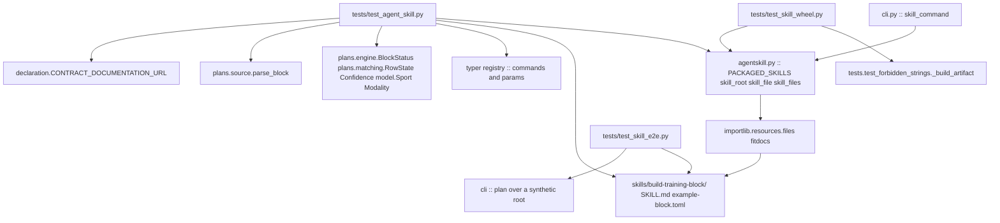
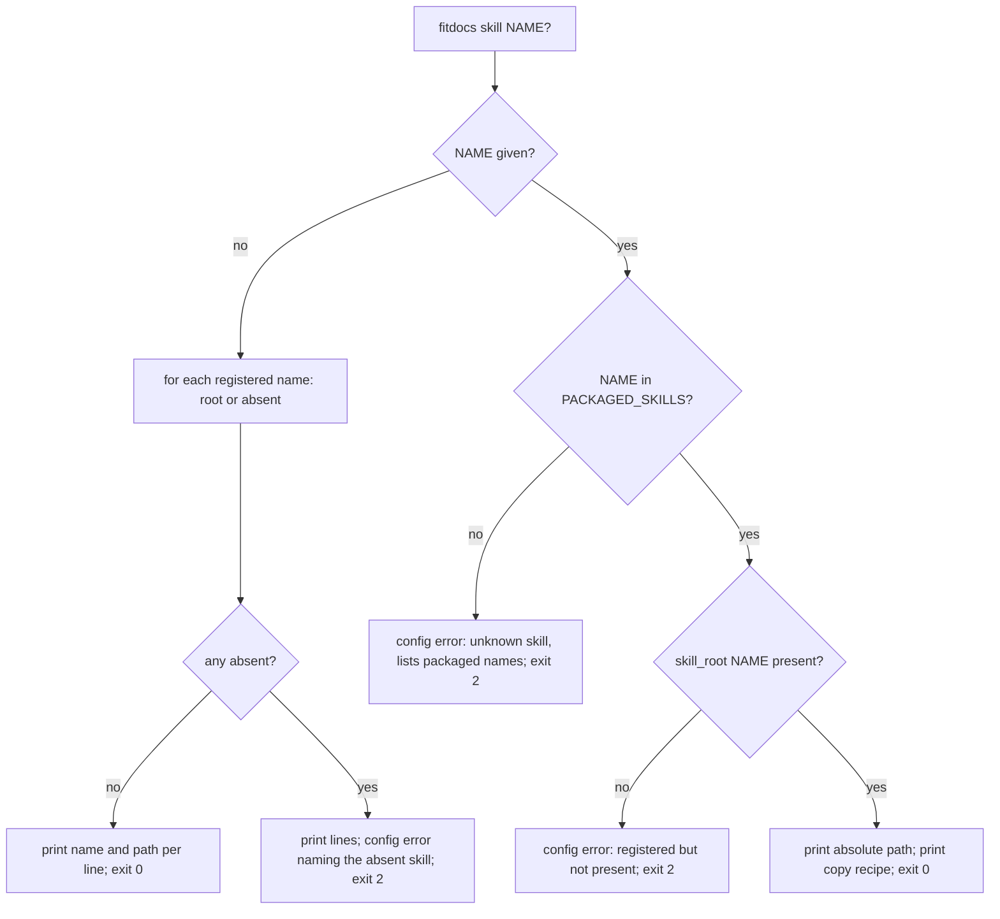

# Technical Design: build-training-block

## Overview

`build-training-block` ships the first product-facing skill in the fitdocs
wheel: a `SKILL.md` that teaches a curating LLM to build a training block the
one canonical way -- ask the athlete the right questions, write a plan source
the shipped parser accepts, render it with `fitdocs plan`, amend it midstream
by appending, and settle an ambiguous match with an override entry -- together
with the by-name skill locator and `fitdocs skill` command that make a second
packaged skill findable beside distribution's inbox skill, a conformance test
that binds every name the skill teaches to the tool's own registries, a
wheel-member test that proves the skill ships, and one end-to-end exercise of
the skill against a synthetic data root.

**Users**: the LLM curating the maintainer's wiki, which runs the skill; the
athlete whose plan it writes down; anyone installing fitdocs from the index who
wants the skill without cloning the repository; and, as consumers of what this
spec lands, distribution's tasks 4.1 and 4.2.

**Impact**: adds one pure leaf (`agentskill.py`), one read-only command
(`skill`), one package-data directory (`skills/build-training-block/` holding
`SKILL.md` and `example-block.toml`), four test modules, a README section, and
Amendment 1 to the `distribution` spec. Changes no renderer, engine, contract,
grammar or report; every generated document is byte-identical; no runtime
dependency is added.

### Goals
- A skill whose every command, option, outcome, state, label and vocabulary
  word is the tool's own, checked by a test that reds on a stale name.
- One registry of packaged skills, one listing, one by-name lookup, one
  copy recipe; an absent skill is an instructive exit 2, never a traceback.
- Proof the skill is a wheel member, in the suite, until distribution's
  artifact policy subsumes it.
- The skill followed once end to end against a synthetic data root, half of
  it automated so it stays followed.

### Non-Goals
- The inbox skill's content and its eight-channel binding (distribution 4.2).
- pkm's wrapper skill, its schema section, its log line and data-root commit.
- Any change to the plan-source grammar, the pages, the match rules, the
  override semantics or the report wording; any coaching content.
- The release artifact policy file and checker (distribution 1.4, 2.2): this
  spec states the members they must hold and owes its own test meanwhile.
- A client-specific skill format, `allowed-tools`, or marketplace packaging.

## Boundary Commitments

### This Spec Owns
- `src/fitdocs/agentskill.py`: the registry of packaged skill names and the
  by-name resolution of a skill's directory and files through the
  package-resource mechanism.
- The `fitdocs skill` command: its listing and by-name forms, its copy
  recipe, its two exit-2 cases, and its no-data-root posture.
- `src/fitdocs/skills/build-training-block/{SKILL.md,example-block.toml}`:
  the skill's frontmatter, body order, headings, tables and the example.
- The conformance test, the locator and command tests, the wheel-member test
  and the end-to-end walk.
- The README's packaged-skills section.
- Amendment 1 to the `distribution` spec (requirements, design, tasks,
  metadata).

### Out of Boundary
- **`src/fitdocs/plans/**`** -- consumed as waves 1 and 2 define them:
  `BlockStatus`, `PlanReport`, `parse_block`, `Block`, `RowState`,
  `Confidence`, the placement grammar. Not edited; a shape this spec needs
  that is absent there is a stop-and-report, never an edit.
- **`src/fitdocs/contract.py`, `layout.py`, `declaration.py`** -- read only
  (`CONTRACT_DOCUMENTATION_URL`, `OWNED_PATHS`, `PRESERVED_REGIONS`,
  `MANAGED_KEYS`, `FRONTMATTER_FENCE` are imported by tests, never re-spelled).
- **`src/fitdocs/cli.py`** -- one command added; no existing command, helper
  or exit constant changes.
- **`.gitignore`, `pyproject.toml`'s build tables** -- not edited; the skill
  directory is named to live within the existing rules.
- **The inbox skill directory** -- created by distribution 4.2, which appends
  its name to the registry this spec creates.
- **The release scripts and `release/*.toml`** -- do not exist at this base;
  this spec amends distribution's *design* of them and touches no file.

### Allowed Dependencies
- `agentskill.py`: `importlib.resources`, `pathlib`, `typing`, `__future__`
  -- and nothing from `fitdocs` (distribution's rule, pinned).
- `cli.py`'s `skill_command`: `fitdocs.agentskill` and the existing
  `_config_error`; no `resolve_data_root`, no `_resolved_data_root`, no
  settings reader, no engine.
- Tests: `typer.main.get_command`, `yaml.safe_load` (test-side only; the
  consumer guard reaches registered modules, not tests), `zipfile`,
  `tests.test_forbidden_strings._build_artifact` (the one wheel builder),
  `fitdocs.plans.engine.BlockStatus`, `fitdocs.plans.source.parse_block`,
  `fitdocs.plans.matching.RowState` / `Confidence`, `fitdocs.model.Sport` /
  `Modality`, `fitdocs.cli` exit constants, `fitdocs.declaration.CONTRACT_DOCUMENTATION_URL`,
  `fitdocs.layout.OWNED_PATHS`, `fitdocs.contract.PRESERVED_REGIONS` /
  `MANAGED_KEYS`.
- **Forbidden**: a new runtime dependency; any write from the `skill`
  command; any repository-relative documentation reference inside the skill;
  a skill directory or subdirectory named `data`.

### Revalidation Triggers
- **The plan-source grammar changes** (a key, a vocabulary, an entry form) →
  the example fails to parse or the vocabulary pin reds; the skill's example
  and prose are re-checked (training-blocks' stated trigger, now enforced).
- **`BlockStatus`, `RowState` or `Confidence` gain, lose or rename a value**
  → the table pins red; the skill's tables move.
- **`fitdocs plan` gains or loses an option, or a command is added or
  removed** → the command/option pin reds if the body names it.
- **The report's line prefixes change** (`rendered`, `reconciled`,
  `ambiguous:`, `methodology:`) → the e2e's report-token pin reds.
- **`CONTRACT_DOCUMENTATION_URL` moves** → the skill's ownership link moves
  (the test compares by identity, so the mismatch is caught).
- **Distribution's major 4 lands** → task 1.1's precondition selects the
  widen path; the amendment records consumption (see DistributionSpecUpdate).
- **The registry gains a name** → the conformance test runs over it; that
  skill owes its own heading tuple and per-skill binding.

#### Cross-spec obligations (build-training-block ↔ training-blocks, plan-resolution) -- what this spec needs and where it gets it
1. **`BlockStatus`** (`src/fitdocs/plans/engine.py`, a `StrEnum` with values
   `rendered`, `unchanged`, `invalid`, `blocked`, `failed`) is the registry
   the skill's outcome table is compared against. It is imported from the
   defining module by the path training-blocks' design states; whether it is
   re-exported from `fitdocs.plans` is not relied on.
2. **`parse_block(text, *, block_id)`** (`src/fitdocs/plans/source.py`) and
   the `Block` it returns (`amendments[*].changes`, `overrides`, `current.rows`)
   are what the example is validated through, as plan-resolution's tests use
   it. The change-kind classes `RowChanged`, `RowAdded`, `RowRemoved`,
   `TargetChanged` (`plans/model.py`) are compared by type.
3. **`RowState`** and **`Confidence`** (`src/fitdocs/plans/matching.py`,
   `StrEnum`s) are the registries for the state and label tables.
4. **The rendered label text** the skill tells the agent to read is
   plan-resolution's placement grammar: the block table's cell `matched
   (ambiguous): <link>`, the planned page's `Matched (ambiguous): ...
   Settle it with an override entry naming this row and the logged workout
   stems.`, the `Logged on this day:` bullets whose link text is the stem,
   and the block page's `Ambiguous: \`id\`, \`id\` -- settle them with
   override entries.` line. The skill quotes the *shape* (cell prefix, the
   `Settle it` sentence, the stem-as-link-text rule) and the e2e test asserts
   the cells after each step; the grammar itself is not re-pinned here.
5. **The report lines** `reconciled ...`, `mesocycle n: ...`, `ambiguous:
   ...`, `methodology: ...` are prose in `cli._report_reconcile`, not
   constants. **Stated limitation**: the skill names them and the e2e test
   asserts each appears in a real run's output; there is no identity binding.
   If plan-resolution later publishes them as constants, the e2e pin becomes
   an identity pin -- not requested of that spec.
6. **`--out`** is the only option `plan` has (training-blocks PlanCommand);
   the skill names no other, so nothing further is asked of upstream.
7. **A missing override stem exits 1 and renders** (plan-resolution 4.3,
   `ReconcileReport.failed`); the skill teaches exactly that and the e2e
   asserts it.
8. **`plans/` is never created by fitdocs** (training-blocks 1.10, 3.9); the
   skill therefore instructs the agent to create the directory itself.
Nothing above requires either upstream spec to add, rename or publish
anything; every import is from a module and name its design states.

#### Cross-spec obligations (build-training-block ↔ distribution)
Stated in full under DistributionSpecUpdate. In one line: this spec lands
what distribution's tasks 4.1 (locator, command) and the packaging half of 4.2
(wheel membership, artifact-policy members, the conformance test's frame)
describe, widened to by-name; distribution keeps the inbox skill's content,
its channel binding and its artifact-policy row; and if distribution's major
4 ships first, this spec widens in place and records consumption.

## Architecture

### Existing Architecture Analysis
- **The CLI already anticipates the command**: the module docstring names
  "distribution's `skill`" beside plugin-api's `plugins` as a command that
  describes the installed tool and needs no data root (`cli.py:58-62`);
  `plugins_command` is the shape of a no-data-root command (`cli.py:481-514`);
  `_config_error` is the exit-2 path (`cli.py:770-778`).
- **No package-resource use exists yet** (`importlib.resources` appears
  nowhere under `src/` or `tests/`); the withdrawn methodology's tables that
  distribution's design cites as the precedent were purged. This spec is the
  first `importlib.resources.files` site.
- **The typer registry is introspectable**: `typer.main.get_command(app)`
  yields a click group whose `.commands` maps every registered name to a
  command whose `.params[*].opts` list its option spellings (verified on the
  installed typer 0.27.0; today's names: `check`, `derive-benchmarks`,
  `history`, `load`, `plugins`, `regen`, `sync`; `plan` arrives with wave 1).
- **Wheel packaging is silent** (roadmap constraint): hatchling ships
  non-`.py` files under `src/fitdocs/` with no include rule and honours
  `.gitignore`. **Verified by building a wheel from a tree carrying probe
  files**: `fitdocs/skills/build-training-block/SKILL.md` and
  `fitdocs/skills/build-training-block/example-block.toml` were members; a
  `data/trap.md` under that directory and a `src/fitdocs/data/trap2.md` were
  silently absent (`.gitignore`'s `data/` rule). `skills/` needs no
  `__init__.py`.
- **`files("fitdocs")` returns a `pathlib.Path`** for the installed
  (unzipped) package and traversal into a plain subdirectory works
  (verified: `files('fitdocs') / 'skills' / 'build-training-block'`).
- **One wheel builder exists in the suite**,
  `tests/test_forbidden_strings._build_artifact(repo_root, out_dir, flag)`,
  used by the purge spec's two artifact scans (`:1120`, `:1194`); `tests` is
  a package, so it is importable the way plan-resolution imports the
  fake-date contextmanager from `tests/test_history_e2e.py`.
- **The published URL already exists**: `declaration.CONTRACT_DOCUMENTATION_URL`
  (`declaration.py:90-92`) is the one URL the emitted `AGENTS.md` carries;
  the skill uses the same object's value.
- **`tests/test_docs_guarantees.py`** searches the README-plus-`docs/`
  corpus for guarantee sentences, the right home for the install/verify/update
  pin.
- **Nineteen `.claude/skills/kiro-*/SKILL.md` files** are developer-facing
  and carry `allowed-tools`; the shipped skill must not (distribution 8.5;
  the standard flags the field experimental).

### Architecture Pattern & Boundary Map

Selected pattern: **static package data behind one pure locator, bound to
the tool by tests rather than by code.** The skill carries no runtime; the
locator reads and never writes; the command prints; every claim the skill
makes about the tool is checked in the suite against the object that makes it
true.



**Architecture Integration**
- Dependency direction: `cli → agentskill → importlib.resources`; nothing
  imports `cli`; `agentskill` imports nothing from `fitdocs`. Tests depend
  on everything; production depends on nothing new.
- Domain boundaries: the *skill text* (what the agent reads), the *locator*
  (where it is), the *command* (how the user finds it), the *conformance*
  (that it tells the truth), the *packaging proof* (that it ships), the
  *walk* (that it works) -- six concerns, six files.
- Existing patterns preserved: the no-data-root command posture (`plugins`);
  `_config_error` for the two exit-2 cases; the artifact scan's wheel
  builder; the documentation-corpus guarantee pin; published URLs for
  anything that leaves the repository.
- Steering compliance: stdlib only; `mypy --strict`; no personal data (the
  example is synthetic and dated in a future year); the skill writes only the
  plan source; every assertion names its mutation.

### Technology Stack

| Layer | Choice / Version | Role in Feature | Notes |
|-------|------------------|-----------------|-------|
| Package data | Markdown + TOML under `src/fitdocs/skills/` | the skill and its example | hatchling default inclusion; `.gitignore`-safe name |
| Locator | `importlib.resources.files` (stdlib, 3.11+) | resolve the skill directory | first use in the package |
| CLI | `typer` (existing) | `fitdocs skill [NAME]` | one optional positional argument, no options |
| Tests | `pytest`, `typer.main.get_command`, `yaml.safe_load`, `zipfile` | conformance, wheel members, e2e | `yaml` test-side only |

## File Structure Plan

### Directory Structure
```
src/fitdocs/
├── agentskill.py                         # pure leaf: registry + by-name resolution (no fitdocs import)
├── cli.py                                # + skill_command, _report_skill_listing; docstring amended
└── skills/                               # package data; NOT a Python package; never named data/
    └── build-training-block/
        ├── SKILL.md                      # frontmatter + the nine sections in fixed order
        └── example-block.toml            # the grammar exhibit; byte-identical to the body's toml fence

tests/
├── test_skill_locator.py                 # registry, resolution, absence, import set (typed)
├── test_cli_skill.py                     # listing, by-name, unknown, absent, posture, no writes (typed)
├── test_agent_skill.py                   # the conformance test over PACKAGED_SKILLS (typed)
├── test_skill_wheel.py                   # wheel members for every packaged skill (typed)
├── test_skill_e2e.py                     # the skill's own procedure walked over a synthetic root (typed)
└── test_docs_guarantees.py               # + the install/verify/update statement pin (append)
```

### Modified Files
- `src/fitdocs/cli.py` -- `skill_command` (`@app.command("skill")`), a
  private `_report_skill_listing`; the module docstring's command list gains
  `skill`, the exit-code paragraph gains its two exit-2 cases, and the
  data-root posture paragraph is amended to name `skill` as the second
  instance of "describes the installed tool" (distribution 4.1's docstring
  duty, landed here).
- `README.md` -- a `## Agent skills` section after `## Plugins`: what a
  packaged skill is, `fitdocs skill` to list and `fitdocs skill <name>` to
  locate, where to install (copy into the agent's skills directory), how to
  verify it is active (the agent lists a skill by its frontmatter `name`),
  how to update on upgrade (re-copy after `uv tool upgrade fitdocs`;
  `metadata.version` says which release a copy came from). Names
  `build-training-block`; names no unshipped skill.
- `pyproject.toml` -- mypy `files` gains the five typed test modules.
- `tests/test_docs_guarantees.py` -- one appended test.
- `.kiro/specs/distribution/{requirements.md,design.md,tasks.md,spec.json}`
  -- Amendment 1 (component DistributionSpecUpdate).

## System Flows

### The skill's procedure, as the e2e test walks it

```mermaid
sequenceDiagram
  participant A as agent following SKILL.md
  participant P as plans/<id>.toml
  participant F as fitdocs plan --out ROOT
  participant B as blocks/<id>.md
  A->>P: write header, mesocycles, workouts (stage A)
  A->>F: run
  F-->>A: rendered <source> -> <block page> ; exit 0
  A->>P: append [[amendment]] with date and reason (stage B)
  A->>F: run
  F-->>A: rendered ; block page shows Amendment 1
  Note over B: two same-type rows on one day, two logged pages that day
  A->>F: run (stage C)
  F-->>A: rendered ; ambiguous: w2-tue, w2-tue-b
  A->>B: read the cell: matched (ambiguous): [stem](...)
  A->>P: append [[override]] naming row + stems; one skipped (stage D)
  A->>F: run
  F-->>A: rendered ; exit 0 ; cells overridden: / skipped
  A->>P: (negative) override naming a stem that does not exist
  A->>F: run
  F-->>A: rendered ; problem line "stem ... not found" ; exit 1
```

Gating: every stage runs the same command; the agent reads the first word of
each block line (`BlockStatus`) and the exit code; a `blocked`, `failed` or
`invalid` block is fixed at the source or at the foreign file the report
names, never by editing a page.

### `fitdocs skill` resolution



## Requirements Traceability

| Requirement | Summary | Components | Interfaces | Flows |
|-------------|---------|------------|------------|-------|
| 1.1 | skill ships in the wheel | AgentSkillPackage, SkillWheelTest | `skill_files` | -- |
| 1.2 | one registry of names | AgentSkillLocator | `PACKAGED_SKILLS` | resolution |
| 1.3 | listing | SkillCommand | `skill_command` | resolution |
| 1.4 | by-name path + recipe | SkillCommand | `skill_command` | resolution |
| 1.5 | unknown name → exit 2 | SkillCommand | `_config_error` | resolution |
| 1.6 | absent skill → exit 2 | SkillCommand, AgentSkillLocator | `skill_root` → `None` | resolution |
| 1.7 | no data root, no writes | SkillCommand | AST pin, write snapshot | -- |
| 1.8 | plain markdown | AgentSkillPackage, SkillConformance | frontmatter key pin | -- |
| 1.9 | wheel-member proof | SkillWheelTest | `_build_artifact` | -- |
| 2.1 | name == dir == registry | SkillConformance | frontmatter | -- |
| 2.2 | description | SkillConformance | frontmatter | -- |
| 2.3 | license, compatibility, metadata.version | SkillConformance | frontmatter | -- |
| 2.4 | version == manifest | SkillConformance | `pyproject.toml` | -- |
| 2.5 | closed key set, no allowed-tools | SkillConformance | frontmatter | -- |
| 2.6 | one test over the registry | SkillConformance | `PACKAGED_SKILLS` parametrization | -- |
| 3.1 | section order | AgentSkillPackage, SkillConformance | `SECTION_HEADINGS` | -- |
| 3.2 | three situations | AgentSkillPackage | body | -- |
| 3.3 | questions; never invent | AgentSkillPackage | body | -- |
| 3.4 | no coaching content | AgentSkillPackage | body | -- |
| 3.5 | grammar by a parsing example | AgentSkillPackage, SkillConformance | `parse_block` | -- |
| 3.6 | vocabularies, modality rule, id form, bounds rule | AgentSkillPackage, SkillConformance | `Sport`, `Modality` | -- |
| 3.7 | where the source lives; never created | AgentSkillPackage | body | -- |
| 3.8 | command, chaining, outcomes, exit tiers | AgentSkillPackage, SkillConformance | `BlockStatus`, exit constants | -- |
| 3.9 | what to do per fault | AgentSkillPackage | outcome table `Do` column | -- |
| 3.10 | amending rules | AgentSkillPackage, SkillE2E | stage B | procedure |
| 3.11 | settling rules; supersession; missing stem fails | AgentSkillPackage, SkillE2E | stages C, D, negative | procedure |
| 3.12 | ownership defers, enumerates nothing | AgentSkillPackage, SkillConformance | `OWNED_PATHS`, `PRESERVED_REGIONS`, `MANAGED_KEYS` | -- |
| 3.13 | never does | AgentSkillPackage, SkillConformance | `regen` scoping | -- |
| 4.1 | commands/options bound | SkillConformance | typer registry | -- |
| 4.2 | fenced blocks invoke only `plan`; `regen` scoped | SkillConformance | fence scan | -- |
| 4.3 | outcomes/states/labels sets equal | SkillConformance | three enums | -- |
| 4.4 | exit tiers | SkillConformance | `_EXIT_*` | -- |
| 4.5 | vocabularies; example identity; example parses | SkillConformance | `parse_block`, companion bytes | -- |
| 4.6 | published URLs only | SkillConformance | `CONTRACT_DOCUMENTATION_URL` | -- |
| 4.7 | synthetic and small | SkillConformance | row bound, year bound | -- |
| 4.8 | suite fails on drift | SkillConformance | assertion messages | -- |
| 5.1 | land + amend | AgentSkillLocator, SkillCommand, DistributionSpecUpdate | -- | -- |
| 5.2 | ships-first: widen + record | AgentSkillLocator, DistributionSpecUpdate | precondition | -- |
| 5.3 | documentation obligation for every skill | DistributionSpecUpdate | Req 8.9 | -- |
| 5.4 | README states install/verify/update | SkillDocs | docs pin | -- |
| 6.1 | the exercise, recorded | SkillE2E (manual half) | transcript | procedure |
| 6.2 | the automated walk | SkillE2E | `tests/test_skill_e2e.py` | procedure |
| 6.3 | cannot-run statement | SkillE2E (manual half) | Implementation Notes | -- |
| 7.1 | no runtime dependency | PackagingPins | `test_determinism` baseline | -- |
| 7.2 | existing commands unchanged | SkillCommand | existing CLI tests green | -- |
| 7.3 | locator internal; imports nothing from fitdocs | AgentSkillLocator, PackagingPins | import-set pin, `__all__` pin | -- |
| 7.4 | documents byte-identical | PackagingPins | goldens green | -- |
| 7.5 | skill writes nothing | SkillCommand | write snapshot | -- |

## Components and Interfaces

| Component | Domain/Layer | Intent | Req Coverage | Key Dependencies (P0/P1) | Contracts |
|-----------|--------------|--------|--------------|--------------------------|-----------|
| AgentSkillLocator | package leaf | registry of packaged names; by-name resolution | 1.2, 1.6, 5.1, 5.2, 7.3 | `importlib.resources` (P0) | Service, State |
| SkillCommand | CLI | `fitdocs skill [NAME]` | 1.3-1.7, 7.2, 7.5 | AgentSkillLocator (P0), `_config_error` (P0) | Service |
| AgentSkillPackage | package data | the skill and its example | 1.1, 1.8, 3.1-3.13 | AgentSkillLocator (P1) | State |
| SkillConformance | test | every name bound to the tool | 1.8, 2.1-2.6, 3.1, 3.5, 3.6, 3.8, 3.12, 3.13, 4.1-4.8 | typer registry, three enums, `parse_block`, `CONTRACT_DOCUMENTATION_URL` (P0) | -- |
| SkillWheelTest | test | every packaged skill file is a wheel member | 1.1, 1.9 | `_build_artifact` (P0), AgentSkillLocator (P0) | -- |
| SkillE2E | test + exercise | the skill's procedure walked | 3.10, 3.11, 6.1-6.3 | `fitdocs plan` with the resolver (P0) | -- |
| SkillDocs | docs | README section + docs pin | 5.4 | -- | State |
| DistributionSpecUpdate | spec | Amendment 1 to distribution | 5.1, 5.2, 5.3 | -- | State |
| PackagingPins | guard | mypy list, `__all__`, dependency baseline, goldens | 7.1, 7.3, 7.4 | -- | -- |

### Package

#### AgentSkillLocator (`src/fitdocs/agentskill.py`)

| Field | Detail |
|-------|--------|
| Intent | One registry of packaged skill names and one resolution path shared by the command and every test |
| Requirements | 1.2, 1.6, 5.1, 5.2, 7.3 |

**Responsibilities & Constraints**
- Widens distribution's single-skill design (`SKILL_NAME`, no-argument
  `skill_root()` / `skill_file()`, `design.md:494-513`) to a **registry**:
  `PACKAGED_SKILLS` is the declared tuple of packaged names, and resolution
  takes a name. A declared registry, not a directory scan: a scan would let
  a skill silently fall out of the wheel with the listing still "correct",
  and distribution's invariant ("the constant is what the conformance test
  asserts both against") needs a constant per skill. The both-ways pin (the
  `skills/` directory holds exactly the registered names) keeps the registry
  honest.
- Resolution is `files("fitdocs") / SKILLS_DIR / name`, with `files` bound
  at module level (`from importlib.resources import files`) so the absence
  fixtures in the locator and command tests have one attribute to
  monkeypatch (`fitdocs.agentskill.files`); a root is *present*
  iff that traversable is a directory holding `SKILL_FILENAME`. Absent →
  `None`, never an exception (a packaging defect surfaces as the command's
  exit 2). `str()` of the traversable is the filesystem path for an unzipped
  install, which every supported install is; a zipped import would resolve
  as absent -- an honest degradation, stated in the docstring.
- `skill_files(name)` lists every regular file under the root, sorted by
  relative POSIX path -- the wheel-member test's and the copy recipe's one
  source of truth for "the skill's files"; `()` when absent.
- Imports nothing from `fitdocs`; performs no write; holds no import-time
  I/O (resolution happens at call time).
- **Precondition for the landing task (5.1 vs 5.2)**: the task asserts
  `src/fitdocs/agentskill.py` is absent before creating it. If it exists
  (distribution major 4 shipped first), the task instead widens it in place:
  `SKILL_NAME` becomes `INBOX_SKILL_NAME = "fitdocs-workouts"`, the registry
  is `(INBOX_SKILL_NAME, BLOCK_SKILL_NAME)`, the no-argument functions become
  by-name, and every caller (the `skill` command, `tests/test_agent_skill.py`)
  is adapted in the same change; the amendment (DistributionSpecUpdate) then
  records consumption.

**Contracts**: Service [x] / State [x]
```python
SKILLS_DIR: Final[str] = "skills"
SKILL_FILENAME: Final[str] = "SKILL.md"
BLOCK_SKILL_NAME: Final[str] = "build-training-block"
PACKAGED_SKILLS: Final[tuple[str, ...]] = (BLOCK_SKILL_NAME,)   # distribution 4.2 appends INBOX_SKILL_NAME

def skill_root(name: str) -> Path | None: ...    # the packaged directory, or None when absent
def skill_file(name: str) -> Path | None: ...    # <root>/SKILL.md, or None
def skill_files(name: str) -> tuple[Path, ...]: ...   # every regular file under the root, sorted; () when absent
```
- Postconditions: a returned root exists, is a directory, and its final path
  component equals `name`; `skill_file(name) == skill_root(name) /
  SKILL_FILENAME` when present; `skill_file(name) in skill_files(name)`
  when present; nothing is created.
- Invariants: `skill_root(n) is None` for every `n` not under `skills/`;
  the functions are pure over the installed tree.

**Implementation Notes**
- Validation (`tests/test_skill_locator.py`, typed): `PACKAGED_SKILLS`
  contains `BLOCK_SKILL_NAME`; `skill_root(BLOCK_SKILL_NAME)` is an existing
  directory whose name equals the constant; `skill_file` is a file inside it;
  `skill_files` contains `SKILL.md` and `example-block.toml` and nothing
  outside the root; an unregistered name → `None` and `()`; the module's
  import set is exactly `{__future__, importlib.resources, pathlib, typing}`
  (AST, both `import` and `from` forms); `fitdocs.__all__` contains none of
  the module's names; the `skills/` directory's subdirectory set equals
  `set(PACKAGED_SKILLS)` (both ways -- an unregistered directory or a
  registered name without a directory reds).
- Named mutations: return the parent (`files("fitdocs") / SKILLS_DIR`) from
  `skill_root` (the final-component pin reds); drop the `SKILL.md` presence
  check (a `tmp_path`-based fixture that monkeypatches `files` to a tree with
  an empty skill directory reds); append `"phantom"` to `PACKAGED_SKILLS`
  (the both-ways pin reds); `from fitdocs.layout import ...` in the module
  (the import-set pin reds).

### CLI

#### SkillCommand (`src/fitdocs/cli.py`)

| Field | Detail |
|-------|--------|
| Intent | `fitdocs skill [NAME]` -- list the packaged skills or print one's directory and copy recipe |
| Requirements | 1.3, 1.4, 1.5, 1.6, 1.7, 7.2, 7.5 |

**Responsibilities & Constraints**
- One optional positional argument `name`; **no options** (no `--out`: the
  command describes the installed tool). Parameter set exactly `{"name"}`.
- Listing: one line per registered name, `f"{name}  {root}"` for a present
  skill and `f"{name}  (not present in this installation)"` for an absent
  one, in registry order; then, if any was absent, `_config_error` naming
  the absent skill(s) and saying the installation is incomplete (exit 2);
  otherwise exit 0.
- By name: `name not in PACKAGED_SKILLS` → `_config_error` ("unknown skill
  `<name>`; packaged skills: a, b") (exit 2); registered but `skill_root` is
  `None` → `_config_error` naming it as registered but not present (exit 2);
  present → print the absolute path on the first line and on the second
  `f"Copy it into your agent's skills directory: cp -R {root}
  <skills-dir>/{name}"` (the standard names no install location, so the
  target stays a placeholder), exit 0.
- Resolves no data root, reads no settings, loads no profile, builds no tile
  store, runs no engine, writes nothing (`markup=False, highlight=False,
  soft_wrap=True` on the path lines, as every path-printing line in this
  module).
- Docstring duties (distribution 4.1, landed here): the module docstring's
  command list gains `fitdocs skill [NAME]`; the exit-code paragraph gains
  "an unknown or absent packaged skill"; the data-root posture paragraph's
  sentence "This rule is not restated for the sibling specs' commands
  (plugin-api's `plugins`, distribution's `skill`)" is replaced by one that
  names `skill` as the second instance of the first half (describes the
  installed tool; resolves nothing; cannot fail for want of a data root).
  The docstring's stale opening count ("Four feature commands sit on top
  of the baseline", `cli.py:5`, against seven registered today and nine
  after waves 1-2 and this spec) is corrected in the same edit rather than
  queued -- the sentence is being touched anyway.

**Contracts**: Service [x]
```python
@app.command("skill")
def skill_command(name: str | None = typer.Argument(None, help=...)) -> None: ...
def _report_skill_listing() -> tuple[str, ...]: ...   # returns the absent names after printing the lines
```

**Implementation Notes**
- Validation (`tests/test_cli_skill.py`, `CliRunner`, typed): `skill` →
  exit 0 and one line per registered name whose second field is an existing
  directory; `skill build-training-block` → exit 0, first line an absolute
  existing directory whose final component is the name, second line contains
  `cp -R` and the name; `skill no-such-skill` → exit 2, stderr names it and
  lists `build-training-block`; absence (monkeypatch `fitdocs.agentskill.files`
  to a `tmp_path` tree missing the directory) → listing exit 2 naming the
  skill, by-name exit 2 naming the skill, and no traceback in the output; no
  data root: invoked with `FITDOCS_DATA` unset, cwd an empty `tmp_path`, no
  `.fitdocs/data-root` → exit 0 (the same setup makes `check` exit 2 --
  asserted as the reachability control); no writes: a snapshot of `tmp_path`
  and of the skill directory before and after every invocation is identical;
  the parameter set is exactly `{"name"}`; `skill` in `--help`; an AST pin
  that `skill_command`'s body names none of `resolve_data_root`,
  `_resolved_data_root`, `load_settings_document`, `load_athlete_inputs`,
  `apply_load`, `run_history`, `run_reconcile`, `_run_plan_pass` (the names
  that exist in `cli.py` at the prerequisite base -- plan-resolution removes
  `run_plan` from the module entirely).
- Named mutations: exit 0 on an unknown name (its pin reds); map absence to
  exit 1 (its pin reds); add `out: Path | None = _OUT_OPTION` (the parameter
  pin reds); call `_resolved_data_root(None)` first (the no-data-root pin
  and the AST pin red); print the recipe without the name (its pin reds);
  have the command `mkdir` `<cwd>/<name>` before printing (the no-writes
  snapshot pin reds -- so that pin is not a pre-satisfied fixture).

### Package data

#### AgentSkillPackage (`src/fitdocs/skills/build-training-block/SKILL.md`, `example-block.toml`)

| Field | Detail |
|-------|--------|
| Intent | The skill an LLM follows to build, amend and settle a block; the example that is its only grammar exhibit |
| Requirements | 1.1, 1.8, 3.1-3.13 |

**Responsibilities & Constraints**
- **Frontmatter** (the contract distribution fixes for the inbox skill, so
  one test covers both): exactly the keys `name` (`build-training-block`),
  `description` (what and when; ≤ 1024 chars; contains the word "when"),
  `license` (`MIT`, equal to `pyproject.toml`'s `[project].license.text`),
  `compatibility` (≤ 500 chars; states that the `fitdocs` command must be
  installed and on the agent's path and that a data root is configured),
  `metadata` with `version` equal to `[project].version`. No `allowed-tools`,
  no `argument-hint`, no other key.
- **Body**: plain markdown, no client syntax. **Nine H2 sections in this
  exact order and wording** (the conformance test pins the tuple):
  1. `## When this applies` -- three bullets: a new block; an amendment to a
     running block; settling a resolution the report called ambiguous or
     could not honor (a missing stem).
  2. `## Before you write: what to ask` -- the seven questions (goal; start
     and end dates; mesocycle length in days; key sessions and their days;
     weekly structure; cross-training and strength; whether the athlete
     wants a load target per mesocycle and, if so, the numbers); the rule
     "a missing answer is asked for, never invented"; the statement that the
     skill proposes no sessions, paces or progressions -- the plan is the
     athlete's.
  3. `## The plan source, by example` -- a ```toml fence carrying
     `example-block.toml` **byte for byte**, then a compact key table that
     restates training-blocks' grammar table (key, type, required, rule) and
     three vocabulary lines the test parses: a line beginning `Sports:`
     listing every `Sport` value in backticks; a line beginning
     `Modalities:` listing every `Modality` value in backticks; a line
     stating that `modality` is allowed only with `sport = "Workout"`. Also
     stated: ids match `[a-z0-9][a-z0-9-]*` and are unique for the life of
     the block; dates are bare TOML dates; **a row's date must fall inside
     `starts..ends`**; the file's name is the block id; the example's three
     marked parts (the plan as first written, the amendments, the overrides)
     correspond to the three situations in section 1.
  4. `## Where the source lives` -- `<data root>/plans/` by default, or the
     directory `[plans] path` in `fitdocs.toml` names; **fitdocs never
     creates, writes, renames or deletes it -- create the directory yourself
     if it does not exist**; one file per block; the stem is the id.
  5. `## Render it and read the report` -- one ```bash fence: `fitdocs plan
     --out <data root>`; **one sentence** stating that the same pass runs at
     the end of `fitdocs sync` and `fitdocs regen`, so pages may already be
     current (the only place outside section 9 where `regen` is named, and
     the line carries `sync` too -- the scoping pin below reads exactly
     that); an **outcome
     table** `| Outcome | Meaning | Do |` with exactly one row per
     `BlockStatus` value (`rendered`, `unchanged`, `invalid`, `blocked`,
     `failed`) whose `Do` column says what the agent does (fix the source
     line the problem names; move or inspect the foreign file the path
     names; report a `failed` reason to the user; nothing for `unchanged`);
     the other lines (`No source:`, `Declaration not placed (foreign):`, the
     note) in prose; the reconcile lines on **one anchored line beginning
     `Report lines:`** that lists exactly the four prefixes in backticks
     (`reconciled`, `mesocycle`, `ambiguous:`, `methodology:`) -- the line
     the e2e test's token pin reads, the way the conformance test reads the
     `Sports:` line -- followed by prose on the indented problem lines; an
     **exit table** `| Exit | Meaning |` with rows `0`, `1`, `2`.
  6. `## Amend midstream` -- append one `[[amendment]]` with `date` and
     `reason`; **never edit an earlier entry**; `[[amendment.update]]` to
     move or change a row (**move a row, never remove and re-add it** -- the
     id keeps the page and the record says "moved"); `[[amendment.add]]`,
     `[[amendment.remove]]`, `[[amendment.mesocycle]]` for the other change
     kinds; the mutable fields named (`date`, `sport`, `modality`, `indoor`,
     `title`, `summary`, `prescription`); amendment dates non-decreasing;
     rerun and read the report.
  7. `## Settle an ambiguous match` -- open the block page the `rendered`
     line names; a **state table** `| State | Meaning | Do |` with exactly
     one row per `RowState` value (`matched`, `overridden`, `skipped`, `not
     logged`, `upcoming`); a **label table** `| Label | Rule | Do |` with
     exactly one row per `Confidence` value (`exact`, `absorbed`,
     `ambiguous`) restating plan-resolution's rule for each; the cell shape
     `matched (ambiguous): [stem](...)` and the planned page's `Settle it
     with an override entry` sentence; **where the stems are**: the link
     text of every competing row's cell in the block table (each ambiguous
     row's cell links the stem it was assigned), the bullets under a
     competing row's `Matched (ambiguous)` sentence on its planned page, and
     the `Unplanned:` list under that mesocycle's table for a logged workout
     no row claimed; `Logged on this day:` appears only on a row that got no
     stem (`not logged` / `upcoming`) and lists the day's workouts with the
     row that took each; write `[[override]]` with `date`, `id` and
     `stems = [...]`, or `skipped = true`, optionally `reason`; the latest
     override for a row (by date, then file position) wins -- so correct a
     mistake by appending another, not by editing; a stem the tool cannot
     find is rendered as `not found`, listed under `Problems:`, and fails the
     run with exit 1 -- fix the stem and rerun; rerun.
  8. `## Ownership` -- fitdocs owns the rendered pages and rewrites them in
     full on every run; the plan source is the athlete's and fitdocs only
     reads it; **the in-tree `AGENTS.md` declaration in each fitdocs-owned
     directory is the authority and the published ownership contract at
     `CONTRACT_DOCUMENTATION_URL` is the detail**; no owned path, region id
     or frontmatter key is listed here.
  9. `## What this skill never does` -- edit a workout page; edit a rendered
     block or planned page; run `fitdocs regen`; write anything other than
     the plan source and files the agent environment itself owns; propose a
     plan of its own.
- **The example** (`example-block.toml`; block id `example-block`): title
  `Example block`; `starts = 2030-01-07` (a Monday), `ends = 2030-02-17`
  (42 days), `mesocycle_days = 14` (three mesocycles); a two-line goal;
  `[[mesocycle]] number = 1, target_load = 600, focus = "aerobic base"` and
  `number = 3, focus = "sharpen"` (no target: absent is None on the page);
  at most twelve `[[workout]]` rows, among them `w1-mon` Run, `w1-wed`
  `Workout` with `modality = "strength"` and `indoor = true`, `w1-sat` Run
  long run, **`w2-tue` and `w2-tue-b`, both Run on `2030-01-22`, with
  `w2-tue`'s `[[workout]]` table written before `w2-tue-b`'s in the file**
  (the same-day, same-type pair the settling section and the e2e need;
  plan-resolution pairs an ambiguous group by `block.current.rows` order,
  which for original rows is file order, so the e2e's stage-C assertion
  that `w2-tue` takes the 07:00 stem depends on this order -- swap the two
  tables and that pin reds), `w3-thu`
  Ride; one `[[amendment]]` dated `2030-01-15`, reason `Travel week`, with
  one `update` (moves `w1-sat` two days, across no boundary), one `add`
  (`w2-sun` Walk), one `remove` (`w1-wed`), one `mesocycle` (`number = 2,
  target_load = 650`); two `[[override]]` entries: `date = 2030-01-23, id =
  "w2-tue", stems = ["2030-01-22-run-0700"], reason = "the morning session
  was the intervals"` and `date = 2030-01-23, id = "w2-tue-b", skipped =
  true, reason = "shakeout dropped"`. Three comment markers split it: `#
  --- the plan as first written ---`, `# --- amendments: appended, never
  edited ---`, `# --- overrides: appended when settling ---` -- the e2e
  test cuts at them to stage the walk; the skill explains them. Every name
  is illustrative; the year 2030 is deliberately in the future so no row
  reads as a real past workout.
- Length: the body stays inside the standard's recommended budget (under
  ~500 lines); detail belongs in the linked contract, not here.

**Contracts**: State [x]
- A static file pair shipped as package data; never written by the tool.
- Invariants (each pinned by SkillConformance): frontmatter as above; the
  nine headings in order; the fence equals the companion; the example
  parses; every named command/option/outcome/state/label/sport/modality is
  the tool's; every URL is published; `regen` appears in section 9 and,
  outside it, only on section 5's chaining line that also names `sync`;
  no owned path anywhere, no region id or managed key in section 8.

**Implementation Notes**
- Integration: the settling section's page shapes are plan-resolution's
  placement grammar; if that grammar's cell prefix changes, the e2e test's
  cell assertions red and the skill's sentence is re-quoted (revalidation
  trigger, stated above).
- Validation: SkillConformance and SkillE2E in full; the manual exercise
  (SkillE2E's other half).
- Risks: the skill teaching an old vocabulary after an upstream change --
  mitigated by the set-equality pins; an agent copying the example
  verbatim as a real plan -- mitigated by the future year, the illustrative
  names and the section-2 instruction to ask.

### Tests and guards

#### SkillConformance (`tests/test_agent_skill.py`)

| Field | Detail |
|-------|--------|
| Intent | Every claim the skill makes about the tool is checked against the object that makes it true |
| Requirements | 1.8, 2.1-2.6, 3.1, 3.5, 3.6, 3.8, 3.12, 3.13, 4.1-4.8 |

**Responsibilities & Constraints**
- Parametrized over `PACKAGED_SKILLS` for the shared contract (frontmatter,
  URLs, command/option binding, fenced-command set, no `allowed-tools`); a
  per-skill map supplies what differs (the heading tuple; for the inbox
  skill, later, its channel binding). Distribution 4.2 appends its entry to
  that map and adds nothing to the frame.
- **Frontmatter**: the file starts with the fence line, the frontmatter is
  `yaml.safe_load`ed (test-side), a mapping; `name` == `name` parameter ==
  `skill_root(name).name`, matches `^[a-z0-9]+(-[a-z0-9]+)*$`, ≤ 64;
  `description` 1..1024 and contains `when` (case-insensitive); `license`
  == `[project].license.text`; `compatibility` ≤ 500 and contains `fitdocs`;
  `metadata.version` == `[project].version`; key set == `{name, description,
  license, compatibility, metadata}`.
- **Order**: the H2 headings, in file order, equal the design's tuple
  exactly.
- **Commands and options -- scan scope is code, not prose**: the scan reads
  (a) every inline code span and (b) every line inside a ```bash / ```sh
  fence; running prose is not scanned, so "fitdocs never creates" and
  "fitdocs only reads" are never mistaken for commands, and the skill (2.1)
  is required to backtick every command mention. In a scanned span or line
  whose first word is `fitdocs`, the second word (regex
  `^fitdocs ([a-z][a-z-]*)`) is a key of `typer.main.get_command(app).commands`
  and every `--x` token after it is in that command's `params[*].opts`; a
  span consisting solely of `fitdocs` is the tool's name and is skipped; the
  set of commands invoked in fences == `{"plan"}`.
- **Scoping of `regen`**: no fence line contains `regen`; every occurrence of
  `regen` outside the last section (`## What this skill never does`) is on
  a line that also contains `sync` (the one chaining sentence of section 5).
- **Tables**: the first column of the table under `## Render it and read
  the report` whose header is `Outcome` == `{s.value for s in BlockStatus}`;
  the first column of the `State` table under `## Settle an ambiguous match`
  == `{s.value for s in RowState}`; the `Label` table == `{c.value for c in
  Confidence}`; the `Exit` table's first column == `{"0", "1", "2"}` ==
  `{str(cli._EXIT_SUCCESS), str(cli._EXIT_FILE_FAILURES),
  str(cli._EXIT_CONFIG_ERROR)}`. Each table's `Do` (or `Rule`) cell is
  non-empty per row.
- **Vocabularies**: backticked tokens on the `Sports:` line == `{s.value for
  s in Sport}`; on the `Modalities:` line == `{m.value for m in Modality}`;
  the body contains `sport = "Workout"` beside `modality`.
- **The example**: the first ```toml fence's content == `example-block.toml`
  read as text (byte identity after the fence lines are stripped);
  `parse_block(text, block_id="example-block")` returns a `Block`; the set
  of change types across `block.amendments[*].changes` == `{RowChanged,
  RowAdded, RowRemoved, TargetChanged}`; overrides include one with
  non-empty `stems` and one with `skipped`; `len(block.current.rows) <= 12`;
  some date carries two rows of equal `sport` (the ambiguity the walk
  needs); `block.starts.year >= 2030` (synthetic future).
- **References**: every markdown link target and every bare `http(s)://`
  token starts with `https://github.com/joshua-stauffer/fitdocs/`; the body
  contains `CONTRACT_DOCUMENTATION_URL` (imported, not re-spelled); none of
  `](docs/`, `](./`, `](../`, `.kiro/`, `src/fitdocs` occurs.
- **Ownership enumerates nothing**: no member of `layout.OWNED_PATHS` occurs
  anywhere in the body; inside `## Ownership`, no member of
  `contract.PRESERVED_REGIONS` and no member of `contract.MANAGED_KEYS`
  occurs as a backticked token.
- Positive controls: the section splitter finds nine sections; each table
  parser finds at least one row; the fence scanner finds at least one
  `bash` and one `toml` fence -- so no walk passes over nothing.

**Implementation Notes**
- Named mutations (each reds the pin or pins named): set `metadata.version` to
  `0.0.0`; swap sections 6 and 7; write `fitdocs plans --out` in the fence;
  add a `--dry-run` to the fence; add a second fence line `fitdocs regen
  --out <data root>` (the fence-set pin reds; the fence-line clause of the
  scoping pin reds too -- one rule, two clauses); write the prose sentence
  "then run `fitdocs regen` to rebuild" into section 6 (a line without
  `sync`: the scoping pin's second clause reds, the fence-set pin stays
  green); add the sentence "fitdocs never creates the directory" unbackticked
  to section 4 (nothing reds -- the reachability control that prose is not
  scanned) and then backtick it as `` `fitdocs never` `` (the command pin
  reds); delete the `blocked` row from the
  outcome table; rename `Confidence.ABSORBED`'s value to `"merged"` in
  `plans/matching.py` (the label pin reds -- an upstream-side mutation the
  test exists to catch); drop `Swim` from the `Sports:` line; change one
  byte of the companion file; remove the `[[amendment.remove]]` from the
  example (the change-kind pin reds); replace the ownership URL with
  `docs/ownership-contract.md`; write `blocks/` into section 4; write
  `` `notes` `` into section 8.
- Risks: table parsing is fragile to formatting -- the parser is one small
  function with its own positive control over a synthetic table string.

#### SkillWheelTest (`tests/test_skill_wheel.py`)

| Field | Detail |
|-------|--------|
| Intent | Every file of every packaged skill is a member of the built wheel |
| Requirements | 1.1, 1.9 |

**Responsibilities & Constraints**
- Imports `_build_artifact` from `tests.test_forbidden_strings` and builds a
  wheel into `tmp_path` (`uv build --wheel`); one build per module run
  (module-scoped fixture).
- For every `name in PACKAGED_SKILLS`, for every `path in skill_files(name)`:
  `f"fitdocs/{SKILLS_DIR}/{name}/{path.relative_to(root).as_posix()}"` is a
  wheel member. Positive controls: `fitdocs/py.typed` and `fitdocs/__init__.py`
  are members; the asserted member set is non-empty and contains
  `fitdocs/skills/build-training-block/SKILL.md` by literal.
- Negative pins: no member under `fitdocs/skills/` names a directory outside
  `PACKAGED_SKILLS`; no member path under `fitdocs/skills/` has a `data`
  component (documents the `.gitignore` trap as a pin, so a later
  `references/data/` cannot half-ship).
- **A sibling, not an extension, of `tests/test_forbidden_strings.py`**: that
  module's two artifact tests are the purge spec's Req 11.7 guards and
  assert only forbidden-string absence (`:1219-1224` check reach, not
  content); adding member-presence assertions there would widen a guard
  another spec owns. The builder is shared so there is one `uv build`
  recipe in the suite.

**Implementation Notes**
- Named mutations: append `skills/` to `.gitignore` (the member pin reds --
  the build drops the directory; this is a mutation of a build input, which
  is the production surface here); rename `example-block.toml` to
  `example-block.fit` and update the fence (the `*.fit` rule drops it; the
  member pin reds through `skill_files`); add an unregistered
  `skills/phantom/SKILL.md` (the negative pin reds).
- Runtime: one extra wheel build (seconds on a warm cache), the same cost
  the two existing artifact scans already pay.

#### SkillE2E (`tests/test_skill_e2e.py` and the recorded exercise)

| Field | Detail |
|-------|--------|
| Intent | The skill's own procedure, walked -- once by an agent and on every run by the suite |
| Requirements | 3.10, 3.11, 6.1, 6.2, 6.3 |

**Responsibilities & Constraints**
- **Automated half** (`CliRunner`, a synthetic root under `tmp_path`, no
  `fitdocs.toml`, so `plans/` is the default; **every run inside the
  fake-date contextmanager `_fake_system_date(fixed_timestamp, *, tz)` from
  `tests/test_history_e2e.py:211-245` (a private name; plan-resolution
  imports it the same way) pinned to `2029-12-01`**, which `cli._today()`'s
  `date.today()` honours -- so the walk means the same thing after 2030 and
  never depends on the wall clock):
  the test creates `plans/example-block.toml` from the companion file **cut
  at the markers** and runs `fitdocs plan --out ROOT` after each stage:
  - Stage A (header, mesocycles, workouts): exit 0; a line starting
    `rendered` naming `plans/example-block.toml`; `blocks/example-block.md`
    exists; with the resolver passed (plan-resolution) and every row dated
    after the pinned today, every cell reads `upcoming` -- assert the
    `Planned workouts:` count line says so and that no cell reads `matched`.
  - Stage B (+ amendment): exit 0, `rendered`; the block page contains
    `### Amendment 1 -- 2030-01-15` and `Reason: Travel week`; the moved
    row's planned page path is unchanged (the id keeps the page).
  - Stage C (+ two synthetic generated workout pages under `workouts/`
    dated `2030-01-22`, sport `Run`, stems `2030-01-22-run-0700` (07:00)
    and `2030-01-22-run-1800` (18:00), each with a load under one
    methodology, written with the test's own `_page(...)` helper in the
    shape of `tests/history/test_engine.py:43-64` extended with `sport`,
    `modality`, `indoor`, `start_time`): exit 0, `rendered`; both rows'
    cells start `matched (ambiguous):`; stdout contains `ambiguous:` and
    both ids; `w2-tue`'s cell links `2030-01-22-run-0700` (the first row in
    `block.current.rows` order takes the earlier page; the example writes
    `w2-tue` before `w2-tue-b`, which this assertion depends on).
  - Stage D (+ overrides): exit 0, `rendered`; `w2-tue`'s cell starts
    `overridden:` and links `2030-01-22-run-0700`; `w2-tue-b`'s cell is
    `skipped`; the block page's `Planned workouts:` line counts `1
    overridden, 1 skipped`; stdout has no `ambiguous:` line.
  - Negative stage (also the supersession exercise, 3.11): append a third
    override `date = 2030-01-24, id = "w2-tue", stems =
    ["2030-01-22-run-0930"]` (no such page; a later date for a row that
    already has an override): exit 1; stdout contains `not found`; the block
    page is still rendered and its `Problems:` section names `override[2]`;
    **`w2-tue`'s cell no longer links `2030-01-22-run-0700`** and starts
    `overridden:` carrying `` `2030-01-22-run-0930` (not found) `` -- the
    latest override won, exactly as the skill teaches ("correct by
    appending"), and the missing stem was reported rather than dropped.
  - Report tokens: the union of the five runs' stdout contains every
    backticked token on the skill's `Report lines:` line (the anchored line
    in section 5 -- read the way the conformance test reads `Sports:`, never
    by slurping section 5's other spans, which legitimately name `No
    source:` and `Declaration not placed (foreign):` that a clean walk never
    prints) and `rendered`.
  - Source bytes: the test hashes the source before and after each run;
    fitdocs changed nothing (the skill's claim in section 4).
- **Manual half** (the change-protocol row for `.claude/skills/**`, applied
  to a shipped skill): an agent session -- or the maintainer by hand -- is
  given the skill file (copied by the printed recipe into a scratch agent
  tree) and a synthetic data root, and follows it through stages A-D for a
  *different* small plan it writes from answers the operator supplies, then
  the negative stage. The transcript, or an explicit statement of what was
  inspected instead, is recorded in the task's Implementation Notes: the
  outcome line of each run and the final cells of the settled rows. This
  is a deliverable of the validation task, not a test.
- Depends on plan-resolution being implemented (the labels); stated as the
  plan's upstream prerequisite.

**Implementation Notes**
- Named mutations: cut the example one marker too early for stage B (the
  `Amendment 1` pin reds); write the stage-C pages with a `Ride` sport (the
  `matched (ambiguous)` pin reds -- reachability control for the type rule);
  misspell the stem in the stage-D override (stage D's exit-0 pin reds and
  reads as the negative stage); date the negative stage's override
  `2030-01-22` instead of `2030-01-24` (earlier than the stage-D override
  for the same row, so it loses -- the cell-flip pin reds: `w2-tue` still
  links the 07:00 stem; and because only an *effective* override's stems
  are looked up, the exit-1 and `not found` pins red with it -- expected,
  not a discrepancy); pin today to `2030-03-01` instead (the stage-A
  `upcoming` pin reds: every unmatched row becomes `not logged`); remove
  the `reconciled` token from the `Report lines:` line (the token pin still
  passes -- so that pin is guarded from the other side: a token *added* to
  the line that no run prints, e.g. `foo:`, reds it).

#### SkillDocs (`README.md`, `tests/test_docs_guarantees.py`)

| Field | Detail |
|-------|--------|
| Intent | Where to install a packaged skill, how to verify it is active, how to update it on upgrade |
| Requirements | 5.4 |

**Responsibilities & Constraints**
- A `## Agent skills` README section: fitdocs packages agent skills inside
  the wheel; `fitdocs skill` lists them and `fitdocs skill <name>` prints
  one's directory and a copy recipe; **install** by copying that directory
  into the agent's skills directory (the open standard defines no fixed
  location; the agent's documentation does); **verify** by asking the agent
  to list its skills -- the packaged skill appears under its frontmatter
  `name`; **update** after upgrading fitdocs by running `fitdocs skill
  <name>` again and re-copying; the copied `SKILL.md`'s `metadata.version`
  says which fitdocs release it came from. Names `build-training-block`
  with one sentence on what it does; says "the packaged skills" for the set
  and names no unshipped skill.
- One appended test in `tests/test_docs_guarantees.py` (the documentation
  corpus, so distribution's later relocation into `docs/wiki-integration.md`
  keeps it green): the corpus contains `fitdocs skill`, and one sentence
  each on installing (`copy`), verifying (`verify`) and updating on upgrade
  (`upgrade`), and the name `build-training-block`; and does **not** contain
  `fitdocs-workouts` (the unshipped inbox skill's name) until distribution
  ships it -- distribution 4.2 removes that negative clause.

**Implementation Notes**
- Named mutations: delete the update sentence (its pin reds); write
  `fitdocs-workouts` into the README (the negative pin reds).

#### DistributionSpecUpdate (`.kiro/specs/distribution/{requirements.md,design.md,tasks.md,spec.json}`)

| Field | Detail |
|-------|--------|
| Intent | Land the roadmap's Phase 7 Existing Spec Update for distribution as its Amendment 1 |
| Requirements | 5.1, 5.2, 5.3 |

**Responsibilities & Constraints**
- Executed at implementation time as one task of this spec (the way wave 1's
  task 4.5 landed wiki-contract Amendment 3 and wave 2's task 3.4 landed
  training-blocks Amendment 1); **no distribution file is edited in this
  wave**.
- `requirements.md`: `## Amendment 1 (2026-09-16): a second packaged skill,
  located by name, landed by build-training-block`, in the shape of
  wiki-contract's amendments; Requirement 8 gains criterion 8.9 *(added by
  Amendment 1)*: the distribution packages more than one agent skill under
  one skills location, lists the packaged skills on request and reports one
  skill's location by name, and 8.6's obligations (where to install, how to
  verify, how to update) apply to every packaged skill. Nothing renumbered.
- `design.md`: the AgentSkillLocator block (`:480-513`) gains an amendment
  note -- `SKILL_NAME` retired in favour of a registry `PACKAGED_SKILLS`;
  `skill_root(name)`, `skill_file(name)`, `skill_files(name)`; the inbox
  skill's name appended by task 4.2 as `INBOX_SKILL_NAME`; the AgentSkillPackage
  block (`:514-539`) notes the second skill and that the conformance test
  is `tests/test_agent_skill.py`, generalized over the registry, to which
  4.2 adds its heading tuple and channel binding; CliApp additions
  (`:542-562`) notes `skill [NAME]` with the listing form and the
  unknown-name case; the ArtifactPolicy data shape's `[wheel] required`
  (`:625-627`) gains `fitdocs/skills/build-training-block/SKILL.md` and
  `fitdocs/skills/build-training-block/example-block.toml`; the File
  Structure Plan's `skills/` tree shows both directories and
  `tests/test_agent_skill.py` as "exists; extended"; **the version-identity
  statements** -- the VersionSource risk note (`:478`, "the agent skill's
  recorded version"), the Version identity data model (`:839`, "the agent
  skill's recorded version") and the Regression section (`:883`) -- each
  gain a note that the permitted copies are one `metadata.version` per
  `PACKAGED_SKILLS` entry, because two packaged skills mean two recorded
  versions and the "nowhere else" scan must allow exactly those. Each note
  is appended, never a rewrite of the block.
- `tasks.md`: task 1.1's observable ("the released version literal only in
  the manifest and in the two places ... the agent skill's recorded version
  -- and nowhere else", `:34`) is amended to "the manifest, the changelog's
  newest entry, and every packaged skill's recorded version (one `SKILL.md`
  per `PACKAGED_SKILLS` entry) -- and nowhere else", the "two places" count
  going with it; task 1.4's policy bullet gains this spec's two files as
  unconditionally required wheel members (the file that names them is
  created by 1.4, after those files exist) **and its "The packaged agent
  skill is deliberately not listed as a required member here -- it does not
  exist yet, and task 4.2 adds its entry" bullet (`:60`) is rewritten to
  name `fitdocs-workouts` as the one skill whose entry 4.2 adds**, dropping
  the singular "the packaged agent skill" subject, so the task does not
  contradict itself; **task 4.1 is ticked as "landed by
  build-training-block"** (its locator and command exist by name) and its
  one residual -- appending `INBOX_SKILL_NAME` to `PACKAGED_SKILLS` -- is
  folded into task 4.2, which creates the directory in the same change:
  this spec's both-ways pin (the `skills/` subdirectories equal the
  registered names) and the registry-parametrized conformance test red on a
  name registered before its directory exists and on a directory before its
  name, so the append and the directory cannot be two tasks in either order;
  task 4.2's conformance bullet becomes "extend `tests/test_agent_skill.py`'s
  per-skill map with the inbox skill's heading tuple and its eight-channel
  binding; the frame is not re-written", its packaging bullet becomes "add
  the inbox skill's file to the policy's required set; the wheel-member test
  already covers a registered skill", and its `_Depends: 4.1_` is dropped;
  the plan's header gains a sequencing note that build-training-block is
  landed before major 4 and that the alternative (4.1 shipped first) is
  recorded in this spec's design.
- `spec.json`: an `amendments` entry (`date`, `requirement: "8.9 (new)"`,
  `reason`, `also`) naming this spec, the widened contract, the policy
  members and the documentation obligation.
- **If distribution major 4 shipped first** (the precondition in task 1.1
  selected the widen path): the same four files are amended, but 4.1 and
  4.2 are ticked as shipped and the amendment note reads "consumed and
  widened by build-training-block: the single-skill locator became a
  registry in place; the conformance test was generalized; the inbox skill
  stayed registered and covered" -- and the roadmap's `distribution`
  checkbox is ticked with "consumed" rather than "landed".
- Also ticks the roadmap's `#### Existing Spec Updates` `distribution`
  checkbox (`.kiro/steering/roadmap.md`).

**Contracts**: State [x]

**Implementation Notes**
- Validation: `/kiro-spec-status distribution` clean with the amendments
  entry; a grep that the four files name `PACKAGED_SKILLS`, `skill_root(name)`
  and both policy members; `grep -n "the agent skill's recorded version\|The packaged agent skill is deliberately" tasks.md`
  finds nothing (the two singular subjects are gone from `:34` and `:60`);
  task 4.2 carries no `_Depends: 4.1_`; no criterion renumbered (the 8.x
  list is unchanged above 8.9).
- Risks: distribution's tasks are `tasks-generated` and unstarted; a session
  starting major 4 between this spec's approval and its implementation would
  see the amendment only after it lands -- the plan's header names the
  hazard and the precondition handles the race.

#### PackagingPins (`pyproject.toml`, `tests/test_public_api.py` behaviour, `tests/test_determinism.py` behaviour)

| Field | Detail |
|-------|--------|
| Intent | The typed test modules, the internal status of the locator, the dependency baseline and the goldens |
| Requirements | 7.1, 7.3, 7.4 |

**Responsibilities & Constraints**
- mypy `files` gains `tests/test_skill_locator.py`, `tests/test_cli_skill.py`,
  `tests/test_agent_skill.py`, `tests/test_skill_wheel.py`,
  `tests/test_skill_e2e.py` (`src` already covers `agentskill.py`) -- **one
  entry per task, appended by the task that creates the module, with `uv run
  mypy` green in that task** (`pyproject.toml:58-59`'s own rule: "Add a
  module here and fix its errors in the same change"). No task fixes another
  task's type errors. Among the parallel tasks only 3.1 touches
  `pyproject.toml`, so the append is `(P)`-safe.
- `fitdocs.__all__` is not extended (`test_all_lists_exactly_the_public_names`
  stays green unedited); `tests/test_skill_locator.py` carries the explicit
  negative pin.
- `tests/test_determinism.py::test_no_new_third_party_runtime_dependency_was_added`
  stays green unedited (7.1); every golden test stays green unedited (7.4);
  `tests/test_cli.py` stays green unedited (7.2).
- `tests/test_contract_consumers.py`: `agentskill.py` imports no contract
  name and is not registered; `cli.py` is already registered and the new
  command binds no contract name.

## Data Models

### Domain Model
- **Packaged skill** -- a name in `PACKAGED_SKILLS`, a directory of the same
  name under `skills/`, a `SKILL.md` with frontmatter and body, zero or more
  companion files. Identity is the name; the wheel is its only store.
- **Skill frontmatter** -- the five-key contract in the table below.
- **The example block** -- a `Block` in training-blocks' model, with the
  properties SkillConformance pins.

### Skill frontmatter

| Field | Presence | Constraint |
|-------|----------|-----------|
| `name` | required | equals the directory and the registry entry; `^[a-z0-9]+(-[a-z0-9]+)*$`; 1-64 chars |
| `description` | required | 1-1024 chars; states what and when |
| `license` | present | `MIT`, equal to the manifest's license text |
| `compatibility` | present | ≤ 500 chars; the `fitdocs` command installed and reachable; a data root configured |
| `metadata.version` | present | equals `[project].version` |

### Data Contracts & Integration
- **Inbound**: none at runtime. Tests read `pyproject.toml`, the skill
  files, and the registries named under Allowed Dependencies.
- **Outbound**: `fitdocs skill` stdout lines; the README section; the
  distribution amendment.
- **Published**: nothing -- `agentskill` is internal by distribution's
  compatibility policy (its design: "the two new package modules are absent
  from the documented surface").

## Error Handling

### Error Strategy
The command has two failure classes and one exit code for both:
configuration (exit 2, through `_config_error`, nothing written) -- an
unknown skill name, or a registered skill whose files are missing from the
installation. Neither is a traceback; both messages say what to do (the
packaged names; reinstall). The skill itself teaches the tool's three exit
tiers verbatim and what the agent does at each.

### Error Categories and Responses
- **Unknown skill name (exit 2)**: `unknown skill 'x'; packaged skills:
  build-training-block`.
- **Registered skill absent (exit 2)**: `skill 'build-training-block' is
  packaged with fitdocs but not present in this installation -- the install
  is incomplete; reinstall fitdocs` (listing form prints the lines first).
- **Test-time**: a stale name in the skill is an assertion failure that
  names the token and the registry it was checked against (4.8).

### Monitoring
The command's stdout and the suite are the whole observability surface.

## Testing Strategy

### Unit Tests
- The locator: presence, absence, final component, file listing, import set,
  `__all__` exclusion, registry ↔ directory both ways (1.2, 1.6, 7.3).
- The command: listing, by-name, unknown, absent, parameter set, posture,
  no writes, AST pin (1.3-1.7, 7.5).
- The frontmatter contract over the registry (2.1-2.6).

### Integration Tests
- The conformance test's bindings: registry commands/options, the three
  enums, the vocabularies, the example's parse and identity, the URLs, the
  ownership enumeration, the section order (3.1, 3.5, 3.6, 3.8, 3.12, 3.13,
  4.1-4.8).
- The wheel-member test over a real build (1.1, 1.9).
- The documentation-corpus pin (5.4).

### E2E Tests
- The skill's procedure walked in five stages over a synthetic root, with
  outcome lines, cells, exit codes, report tokens and source bytes asserted
  (3.10, 3.11, 6.2).
- The recorded manual exercise (6.1, 6.3).

### Performance
- One extra `uv build --wheel` in the suite; no runtime cost anywhere.

## Migration Strategy
Nothing to migrate. A data root is untouched by everything here; an installed
tool gains one command; an agent that copied nothing sees nothing. When
distribution ships the inbox skill it appends one name and one directory.

## Decisions recorded for the roadmap
- **`distribution` Existing Spec Update: landed, not consumed** (at this
  base; the precondition in task 1.1 flips it if major 4 arrives first).
- **The wheel-member test is this spec's** until distribution's artifact
  policy exists; when it does, both hold -- the test in the suite, the
  policy at release.
- **The reconcile report's line prefixes are unbound** (prose in the CLI);
  the e2e pin covers them behaviourally. Not asked of plan-resolution.
