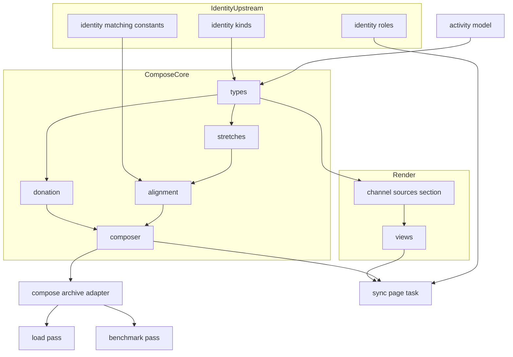
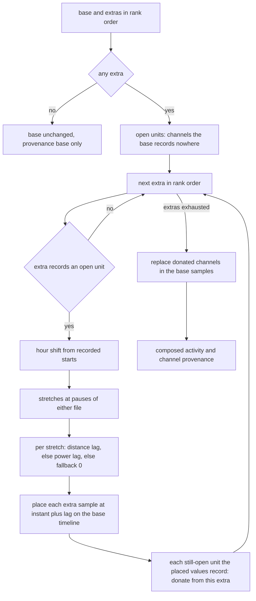
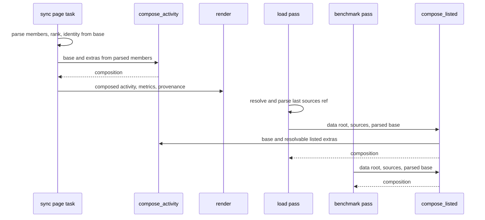

# Technical Design: channel-merge

## Overview

**Purpose**: channel-merge builds each workout page from all of its files. Given
a page's base and its extras (`activity-identity`'s roles), it composes one
activity: the base's timeline, identity, laps and session values, plus every
channel the base does not record, taken from the highest-ranked extra that
does, with that extra's samples placed on the base's timeline by a lag
established per stretch between pauses. The page gains a Channel Sources
section naming the file each channel came from and how each extra was aligned,
and every summary, chart, training-load and benchmark computation reads the
composed activity.

**Users**: the athlete whose run is a HealthFit copy plus a Stryd file (the Stryd
file's running dynamics reach the page), or whose ride is a Garmin original plus
a HealthFit copy (the watch's heart rate reaches a ride recorded without a
strap); the agent curating the wiki, which reads the Channel Sources section;
the training-load and benchmark-derivation passes, which score and derive from
the composed channels.

**Impact**: today, after `activity-identity`, a page renders from its base alone
and its extras are archived and unread. After this spec, `sync`, `drain` and
`regen` render a page from `compose_activity(base, extras)`; the load pass and
the benchmark-derivation pass compose the page's listed files by the same rule;
a page with no extra renders exactly as before apart from its document-format
version.

### Goals
- A channel only an extra carries reaches the page, aligned to the second
  (Req 1, 2, 3).
- The base is never overridden, and a partly recorded base channel is never
  filled (Req 2.1, 2.2).
- Every channel's file is visible on the page, and an alignment fallback is
  never silent (Req 4).
- The page, its load and its derived benchmarks read one and the same
  activity (Req 5, 6).
- Every rule owes a named mutation that reds a test on a synthesized pair with
  the measured shapes (Req 9; `change-protocol.md` § Fixture Discrimination).

### Non-Goals
- Choosing a page's files or its base (`activity-identity`).
- Decoding, the placeholder-zero and gate rules (`running-dynamics`,
  `fit-ingest`).
- Averaging, blending, gap-filling or correcting any value; merging laps.
- Showing an extra's devices, decode errors, session values or generic
  record-level developer fields. (Each contribution carries its file's own
  devices so that `intervals-connector`'s attribution line can word the
  donating files; that line and its wording are `intervals-connector`'s.)
- A frontmatter key for provenance.
- Rescoring a page whose load was already computed (the athlete's
  `fitdocs load --recompute`).

## Boundary Commitments

### This Spec Owns
- **The composition core** (`fitdocs.compose`, pure): whole-second instants,
  pauses and stretches; the hour shift; per-stretch lag estimation over the
  ordered alignment keys (distance, power) with its constants and their stated
  sources; placement on the base's timeline; the donation units derived from
  the model's channel set; the donation and partial-coverage rules; the
  composed activity and its channel provenance.
- **The archive composition adapter** (`fitdocs.compose.archive`): composing a
  page's listed archived files for a pass that holds only the page's `sources`.
- **The Channel Sources section** (`render/provenance.py`): its placement, its
  table, its channel labels, its alignment text; the `DocContext` field that
  carries provenance into render.
- **The engine wiring**: the body and return type of `sync._render_activity`
  and the page task's use of its result.
- **The pass wiring**: the load pass (`load/engine.py`) and the
  benchmark-derivation pass (`performance/engine.py`) composing a page's
  listed files after resolving its base exactly as today.
- **One advance each** of `DOC_VERSION` and `CONTRACT_VERSION`, and their
  literal re-pins.
- **The published statements**: the ownership contract's composition
  statements with the alignment-constant table, the release note.
- **Amendment records**: wiki-contract Amendment 4's channel part;
  `workout-docs`, `training-load` and `performance-benchmarks` amendments;
  the roadmap's Phase 8 Existing Spec Updates annotations and ticks; the
  `compose` entry on `.kiro/steering/structure.md`'s dependency line.
- **The synthesized pair fixtures** (`tests/fixtures/merge.py`).

### Out of Boundary
- Which files form a page, the base, `PageRoles`, source kinds and precedence,
  the page's filename, `uuid` and base-identity keys, renames
  (`activity-identity`). This spec never chooses a base and never reads the
  `[identity]` table.
- Channel definitions, decoding, the placeholder-zero and gate rules, the
  Running Dynamics section (`running-dynamics`). Donated values are used as
  decoded.
- Load arithmetic, channel selection, sufficiency thresholds, data-quality
  flags, benchmark derivation rules (`training-load`, `threshold-load`,
  `load-channels`, `activity-qa-flags`, `performance-benchmarks`): unchanged;
  they receive a composed activity.
- The Garmin attribution line and its wording (`intervals-connector`); this
  spec publishes each contributing file's devices for it and, if it lands
  second, wires the one call site (see Cross-spec seams).
- Any network access, clock read or new runtime dependency.

### Allowed Dependencies
- `fitdocs.compose.{types, stretches, alignment, donation, composer}` import
  only the standard library, `fitdocs.model`, `fitdocs.identity.kinds`
  (`SourceKind`, `source_kind`) and `fitdocs.identity.matching`
  (`START_TOLERANCE_S`, `SHIFT_STEP_S`, `SHIFT_MAX_HOURS`), and each other
  as follows: `stretches` and `donation` import only `types` (so they can be
  built in parallel); `alignment` imports `types` and `stretches`; `composer`
  imports `types`, `alignment` and `donation`.
- `fitdocs.compose.archive` additionally imports `fitdocs.contract`
  (`sha_of_ref`), `fitdocs.layout` (`archive_path`) and `fitdocs.ingest`
  (`parse_fit`), and `pathlib`.
- No `fitdocs.compose` module imports `fitdocs.sync`, `render`, `load`,
  `metrics`, `performance`, `history`, `plans`, `audit`, `cli`, `tiles`,
  `inbox`, `connectors`, `yaml`, `urllib`, `socket` or `time`, or names a clock
  function.
- `fitdocs.render.provenance` imports `fitdocs.render` (contract types),
  `fitdocs.render.format` (`ABSENT`), `fitdocs.layout` (`source_ref`),
  `fitdocs.compose.types`, `fitdocs.compose.alignment` (`ALIGNMENT_KEYS`) and
  `fitdocs.identity.kinds` (`SourceKind`); never `fitdocs.contract`, never
  `render.sections` or `render.dynamics`.
- `sync.py` imports `fitdocs.compose.composer`; `load/engine.py` and
  `performance/engine.py` import `fitdocs.compose.archive`.
- **Naming guards** (`tests/test_contract_consumers.py`): no module under
  `src/fitdocs` other than `contract.py` names `uuid` as an identifier
  (`:502-529`); `fitdocs.compose.archive` joins `CONVERTED_MODULES` with
  `CONTRACT_BINDINGS` `("sha_of_ref",)` and defines no name in
  `FORBIDDEN_LOCAL_NAMES` (`:149-163`) and spells no `FORBIDDEN_LITERALS`
  value (`:298`).
- Dependency direction (an arrow reads "is imported by"): `model` →
  `identity.{kinds, matching}` → `compose.types` → `compose.stretches` and
  `compose.donation`; `compose.stretches` → `compose.alignment`;
  `compose.alignment` and `compose.donation` → `compose.composer` →
  `compose.archive`; `compose.types` and `compose.alignment` →
  `render.provenance` → `render.views`; `compose.composer` → `sync`;
  `compose.archive` → `load.engine` and `performance.engine`. An import
  against an arrow is a defect; in particular nothing in `compose` imports
  `render`, and `render` never imports `compose.archive`.

### Revalidation Triggers
- A change to `DONATION_UNITS`, the donation rule, the partial-coverage rule,
  `ALIGNMENT_KEYS`, `MAX_LAG_S`, `MIN_MATCHED_SAMPLES` or `PAUSE_GAP_S`:
  re-run the named-mutation suite and re-check the ownership contract's
  alignment table (pinned by `tests/compose/test_contract_docs.py`).
- A new `Samples` channel (any spec): it is donated automatically; its label
  must be added to `render.provenance.CHANNEL_LABELS`
  (`tests/render/test_provenance.py` reds until it is).
- A change to `activity-identity`'s `PageRoles.extras` order, the
  `_render_activity` parameters, `SHIFT_STEP_S`, `SHIFT_MAX_HOURS` or
  `START_TOLERANCE_S`: this spec revalidates.
- A change to "the last `sources` entry is the base" or to the canonical
  `sources` order: `compose_listed` and both passes revalidate.
- A change to running-dynamics' placeholder or gate rules: donated values
  change with them (they are final at ingest); nothing here moves.
- A `SessionSummary` field added that a donated channel should feed: the
  metric's own "session, else channel" rule decides; nothing here moves.
- A change to `SourceContribution`'s fields (`devices` and `channels` are read
  by `render/views.py::_head`) or to `intervals-connector`'s
  `attribution_line(base, donor_devices)` signature: both specs revalidate the
  `_head` wiring and the ride-pair attribution pin.

### Cross-spec seams

**activity-identity (upstream, merged before this spec is implemented)**
- Consumed exactly as its design publishes: `fitdocs.identity.roles.PageRoles`
  (`base`, `extras` best first), the page task's `parsed: Mapping[str,
  Activity]` of every resolved member, and the seam
  `sync._render_activity(roles, parsed)`.
- This spec keeps `_render_activity`'s name and parameters and changes its
  return type from `Activity` to `compose.types.Composition`; the page task
  passes `composition.activity` wherever it passed the returned activity
  (metrics, map plan, `DocContext.activity`) and `composition.provenance` as
  the new `DocContext.channel_provenance`. The identity keys, `uuid`, uid and
  stem stay computed from `parsed[roles.base.ref]` **before** the call
  (Req 1.6). A test of identity's that spies on `_render_activity`'s return
  value is updated to read `.activity`.
- **No second archive read in `sync`**: the page task already has every member
  parsed; the archive reads of the extras happen in the two passes that hold
  only a page's `sources` (`compose_listed`), as the roadmap's Phase 8
  `sync.py` seam states.
- Identity's Req 5.8 ("until channel composition exists, render from the base
  alone") is conditional and is fulfilled by this spec, not amended. Any
  identity test pinning "an extra contributes nothing to the body" is updated
  to the composed expectation by task 4.1, which lists each one.
- `DocContext` gains `channel_provenance` appended after identity's `identity`;
  identity's position-relative field-order pin (`user_frontmatter` directly
  after `map_data`, `identity` last) becomes `channel_provenance` last with
  `identity` directly before it.
- The whole-hour shift reuses `identity.matching`'s `SHIFT_STEP_S`,
  `SHIFT_MAX_HOURS` and `START_TOLERANCE_S` by import, so a file identity joins
  by SHIFTED evidence is aligned by the same arithmetic.
- `DEFAULT_PRECEDENCE` (maintainer decision 2026-09-29: `original:garmin`,
  `phone_copy`, `original`, `unknown`) is identity's: on a run the HealthFit
  copy is the base and the Stryd file donates; on a ride the Garmin original is
  the base and the HealthFit copy may donate heart rate. This spec's fixtures
  and e2e tests use that default and never set a precedence.

**running-dynamics (upstream, merged before this spec is implemented)**
- Donation enumerates `dataclasses.fields(Samples)` minus `time_s` (all 22
  channels), not `DYNAMICS_CHANNELS`; a positive-control test asserts every
  `DYNAMICS_CHANNELS` name is a donation unit.
- A composed `Samples` is `dataclasses.replace(base.samples, **donated)`; every
  donated tuple has `len(base.samples.time_s)` entries, so `__post_init__`'s
  length rule holds.
- Gate pairs are donated independently and never re-gated (research.md,
  Decision: Gate pairs are donated independently).
- `Activity.record_developer_fields` of the composed activity is the base's; an
  extra's generic developer channels are not carried (no page renders them).
- The Running Dynamics section reads `ctx.activity.samples`, which is the
  composed activity, so donated dynamics reach it with no change there.
- Fixtures reuse running-dynamics' developer-field encoding helper
  `developer_field_run_fit_bytes` in `tests/fixtures/builder.py` (its task
  1.2) and `_file_id`'s keyword-only `manufacturer`/`product`/`time_created`
  parameters; no second Encoder sequence for developer fields is written. A
  file that carries no developer field (the Garmin ride original) may instead
  be built from the existing `builder.encode(mesgs)` primitives. The fixtures
  need the helper to control, per file: the laps (count and per-lap values,
  heart rate included), the session's start, elapsed time and distance, the
  session developer fields (HealthFit's `SESSION UUID`), the sport (a
  cycling session) and the `file_id` and recording-device manufacturers
  (the helper defaults both to `garmin`; no file this spec builds through it
  is Garmin: each Stryd file passes `manufacturer="stryd"` and
  `device_manufacturer="stryd"`, each HealthFit copy `"development"` for
  both). The `SESSION UUID` goes through the helper's existing keyword-only
  `session_fields` option, the manufacturers through its existing
  `manufacturer` and `device_manufacturer`. For each of the others the
  published helper does not already take, this spec appends to it one
  keyword-only parameter whose default is the helper's current behaviour --
  `laps`, `session_start`, `session_elapsed_s`, `session_distance_m`, `sport`
  (the pre-authorized list; each only if absent) -- and pins in
  `tests/fixtures/test_builder.py` that the helper's default output bytes are
  unchanged. Any other missing capability is a stop-and-report.
- Shared files: `render/views.py` (running-dynamics appends its Running
  Dynamics section call; this spec appends the Channel Sources call after
  Device & Data Quality) and `render/__init__.py`, append-only; a rebase keeps
  both.

**intervals-connector (wave 2 peer)**
- Garmin attribution on composed pages (ratified at the Phase 8 cross-spec
  review, 2026-09-29). Its "Garmin <model>" line is decided in render by
  `attribution_line(base: Activity, donor_devices:
  Sequence[Sequence[DeviceInfo]] = ())`, whose `recording_device` operates on
  a device tuple. Render holds no donor `Activity`, so this spec publishes, on
  `DocContext.channel_provenance`, each contribution's `manufacturer`,
  `channels` and `devices` -- the contributing file's own `Activity.devices`
  (ComposeTypes). The composed activity's own `devices` stay the base's
  (Composer step 3), so `ctx.activity` is `attribution_line`'s base.
- **Whichever of channel-merge / intervals-connector lands second** wires
  `render/views.py::_head` to pass, when `ctx.channel_provenance` is not
  `None`, `tuple(c.devices for c in ctx.channel_provenance.extras if
  c.channels)` as `donor_devices` to `attribution_line(ctx.activity,
  donor_devices)`, and adds the ride-pair pin: the ride pair (a Garmin-original
  base plus a HealthFit copy donating heart rate, `tests/fixtures/merge.py`)
  renders `Data sources: Garmin <model> and other devices`. In this plan that
  is task 3.3's conditional step (or, if intervals-connector lands while this
  branch is open, the same step after the final rebase). `attribution_line`
  words every case; this spec adds no wording.
- The run pair's files record no Garmin device (the HealthFit copy's
  recording device is `development`, each Stryd file's `stryd`; Supporting
  References), so the composed run page and the `composed_run` golden carry
  no `Data source` line in either landing order, while the ride pair carries
  `Data sources: Garmin <model> and other devices` once `_head` is wired.
- Shared files: `render/views.py` and `render/__init__.py`, append-only (this
  spec appends one field, one section call per view and, as second lander,
  the `donor_devices` argument at `_head`'s one call).

**connectors (wave 1)**: no code seam. Shared: wiki-contract Amendment 4
(created by whichever of activity-identity, connectors and channel-merge
lands first; SpecRecords), the `.kiro/steering/structure.md` dependency line
(each appends its own package), and the `CONTRACT_VERSION` rule (one advance
per lander, ratified at the Phase 8 cross-spec review; see research.md,
Decision: Contract version rule).

**docs-site (Phase 9 peer)**: this spec adds no `docs/` page and does not edit
`docs/index.md`.

**Shared version and golden rules**: `DOC_VERSION` and `CONTRACT_VERSION` each
advance by one from `main`'s value when this spec lands (never a hard-coded
result; every Phase 8 lander advances each once, none shares another's
advance); after the final rebase each is asserted equal to `main`'s value plus
one and re-pinned if a sibling landed first. Literal pins of the old
`DOC_VERSION` are found by grep at landing (at design time
`tests/render/test_frontmatter.py:44, 101`,
`tests/metrics/test_sources.py:2270`, and every
`tests/render/golden_docs/*.md` `doc_version` line; `tests/test_cli_check.py:196,
198` is rewritten by activity-identity to `f"doc_version: {DOC_VERSION}"`).
running-dynamics' `_PRE_RUNNING_DYNAMICS_DOC_VERSION` keeps the value it
recorded. `tests/golden/*.json` (the model goldens) do not move: this spec
changes no model type.

## Architecture

### Existing Architecture Analysis
- `sync.py` is the one writer; after `activity-identity` its page task parses
  every resolved member, ranks them, computes identity from the base and calls
  `_render_activity(roles, parsed)` before metrics, map and render.
- Render is a pure function of `DocContext`; each view appends `##` sections in
  a fixed order and `## Device & Data Quality` is last
  (`render/views.py:179, 210, 244`).
- Metrics prefer a recorded session value and fall back to the channel
  (`metrics/aggregates.py:47`); lap rows show recorded lap values only
  (`render/splits.py:101-123`); the 1 km re-slice reads the samples.
- The load pass and the benchmark-derivation pass each resolve the last
  `sources` ref and parse it (`load/engine.py:454-469, 618-645`;
  `performance/engine.py:266-293, 350-366`), with a shared behavioural test
  proving the two resolvers agree (`tests/performance/test_engine.py:1186-1235`).

### Architecture Pattern & Boundary Map



**Architecture Integration**:
- **Selected pattern**: a pure composition core over the frozen activity model,
  one thin I/O adapter for the passes that hold only `sources`, and render
  consuming a provenance value. The same pattern `activity-identity` uses.
- **Boundaries**: identity decides *which files and which base*; compose
  decides *which file supplies each channel and where its values land*; render
  decides *how provenance reads*; the passes decide nothing new.
- **Existing patterns preserved**: absent is `None`; render purity; one writer;
  archive-last; readers resolve the base by the last `sources` entry; one
  contract reader per concept.
- **New components rationale**: `compose` is a package because the load and
  benchmark passes cannot import `sync` (dependency direction) and the rule
  must have one implementation; `render/provenance.py` is a module because
  `render.sections` cannot import `render.dynamics` (cycle) and the section
  needs both label sets.
- **Steering compliance**: no new dependency; no network; typed frozen
  dataclasses; deterministic; every constant stated with its source.

### Technology Stack

| Layer | Choice / Version | Role in Feature | Notes |
|-------|------------------|-----------------|-------|
| Core | Python 3.11 stdlib (`dataclasses`, `datetime`, `collections.abc`, `typing`) | Pure composition | `mypy --strict` |
| Ingest | `garmin-fit-sdk` via `fitdocs.ingest.parse_fit` (existing) | Parsing listed extras in the two passes | No SDK import in `compose` |
| Render | Markdown tables (existing idiom) | Channel Sources section | No new asset |

## File Structure Plan

### Directory Structure
```
src/fitdocs/
├── compose/                     # NEW package: one page's activity from its files
│   ├── __init__.py              # package marker only: __all__ == []; consumers import submodules
│   ├── types.py                 # StretchLag, ExtraAlignment, Placement, SourceContribution, ChannelProvenance, Composition
│   ├── stretches.py             # PAUSE_GAP_S, instants(), resume_instants(), split_stretches()
│   ├── alignment.py             # AlignmentKey, ALIGNMENT_KEYS, MAX_LAG_S, MIN_MATCHED_SAMPLES, ALIGNMENT_SOURCES,
│   │                            #   hour_shift_s(), establish_lag(), align_extra()
│   ├── donation.py              # POSITION_UNIT, DONATION_UNITS, records(), base_keeps(), placed_values()
│   ├── composer.py              # compose_activity()
│   └── archive.py               # compose_listed() -- the one module here touching the filesystem (contract consumer)
└── render/
    └── provenance.py            # NEW: CHANNEL_LABELS, channel_sources_section()

tests/
├── fixtures/merge.py            # NEW: synthesized run and ride pairs with the measured shapes
├── fixtures/test_merge_fixtures.py  # NEW: raw-shape self-tests (the preconditions every assertion relies on)
├── compose/                     # NEW test package
│   ├── __init__.py
│   ├── builders.py              # hand-built Activity values for the pure unit tests
│   ├── test_types.py            # SourceContribution's field names and order (the render/attribution seam)
│   ├── test_stretches.py
│   ├── test_alignment.py
│   ├── test_donation.py
│   ├── test_composer.py
│   ├── test_archive.py
│   ├── test_boundary.py         # import closure of the package, both directions, with a positive control
│   └── test_contract_docs.py    # the ownership contract's alignment table pinned to the constants
├── render/test_provenance.py    # NEW
├── test_compose_e2e.py          # NEW: sync, drain, regen, order and check over data roots
└── test_compose_passes_e2e.py   # NEW: the load and derive-benchmarks passes over composed pages
```

### Modified Files
- `src/fitdocs/render/__init__.py` — `DocContext.channel_provenance:
  ChannelProvenance | None = None` (appended); docstring.
- `src/fitdocs/render/views.py` — each of the three views appends
  `## Channel Sources` after `## Device & Data Quality` when
  `channel_sources_section(ctx)` is not `None`; module and view docstrings
  name the section; when `intervals-connector` is already on `main`, `_head`
  passes the donating extras' devices to `attribution_line` (Cross-spec
  seams).
- `src/fitdocs/sync.py` — `_render_activity` body and return type; the page
  task's metrics, map plan and `DocContext` read the composition.
- `src/fitdocs/load/engine.py` — `_compute_document` composes the parsed base
  with the page's other listed files; docstrings.
- `src/fitdocs/performance/engine.py` — the tagged-document arm composes the
  same way inside its existing `OSError`/`FitDecodeError` handling; module
  docstring's resolver paragraph gains one sentence.
- `src/fitdocs/contract.py` — `DOC_VERSION` +1 and `CONTRACT_VERSION` +1, each
  with a docstring paragraph.
- `docs/ownership-contract.md` — composition statements, the alignment
  constants table, "What changed at this version" (replaced with this spec's
  changes), Overwrite Semantics for `regen`/`load`/`derive-benchmarks`.
- `CHANGELOG.md` — `[Unreleased]` `### Changed` entry, appended under the
  existing heading (created only if absent).
- `tests/test_contract_consumers.py` — `fitdocs.compose.archive` registered.
- `tests/render/test_golden_docs.py` — a `composed_run` golden case;
  `tests/render/golden_docs/composed_run*` (new) and every existing golden's
  `doc_version` line.
- DOC_VERSION literal pins (grep decides at landing):
  `tests/render/test_frontmatter.py:44, 101`,
  `tests/metrics/test_sources.py:2270`.
- `tests/render/test_frontmatter.py:317-324`
  (`test_doc_context_field_order_has_user_frontmatter_after_map_data`), which
  pins `DocContext`'s field order: `activity-identity` rewrites it
  position-relative (`user_frontmatter` directly after `map_data`, `identity`
  last); this spec moves it with the appended field to `user_frontmatter`
  directly after `map_data`, `channel_provenance` last, and `identity`
  directly before it.
- `tests/declaration_golden/*` — regenerated for the contract version.
- Tests whose page now legitimately carries composed channels or a Channel
  Sources section (identity's e2e tests with multi-file pages,
  `tests/test_sync.py` re-export cases): updated by task 4.1, each listed.
  Tests whose load or benchmark outcome for a multi-file page moves because
  the passes compose (CLI-level runs chain the load pass after every `sync`
  and drain, `src/fitdocs/cli.py:321-324, 358-360`): updated by task 4.3, each
  listed, including one task 4.1 already updated (the two tasks are
  sequential).
- `pyproject.toml` `[tool.mypy].files` — the new typed test modules.
- `tests/fixtures/builder.py` — only the keyword-only, defaulted parameters on
  `developer_field_run_fit_bytes` that Cross-spec seams pre-authorizes, each
  only if absent, each pinned in `tests/fixtures/test_builder.py` as leaving
  the helper's default output bytes unchanged.
- Spec records: `.kiro/specs/wiki-contract/{requirements.md,design.md,spec.json}`,
  `.kiro/specs/workout-docs/{requirements.md,spec.json}`,
  `.kiro/specs/training-load/{requirements.md,spec.json}`,
  `.kiro/specs/performance-benchmarks/{requirements.md,spec.json}`,
  `.kiro/steering/roadmap.md` (Phase 8 Existing Spec Updates annotations and
  ticks only).
- Steering: `.kiro/steering/structure.md` — the dependency line gains
  `compose`, append-only (SpecRecords).

## System Flows

### Composing one page



- An extra that records no still-open unit is never aligned; it is listed with
  no channels.
- Every extra is aligned against the base alone (Req 3.10); an extra that does
  donate reports its whole alignment (every stretch), not just the stretches
  its donated values came from.

### Where the composition is read



## Requirements Traceability

| Requirement | Summary | Components | Interfaces | Flows |
|-------------|---------|------------|------------|-------|
| 1.1 | Render from the composed activity | Composer, EngineWiring | `compose_activity`, `_render_activity` | Composing |
| 1.2 | No extra: base alone, byte-identical | Composer | `compose_activity` (returns base) | Composing |
| 1.3 | Function of base and ranked extras; order-free | Composer, EngineWiring | `compose_activity` | Composing |
| 1.4 | Exactly the base's samples | Composer | `Samples` via `replace` | Composing |
| 1.5 | Laps, sets, devices, session values, dev fields, errors from base | Composer | `replace(base, samples=...)` | Composing |
| 1.6 | Filename, identity from base | EngineWiring | page task order | Read sites |
| 2.1 | Base wins a recorded channel | Donation, Composer | `base_keeps` | Composing |
| 2.2 | Partial coverage left alone | Donation | `base_keeps` | Composing |
| 2.3 | Highest-ranked extra recording it after alignment | Donation, Composer | `placed_values`, `records` | Composing |
| 2.4 | Position as one unit | Donation | `POSITION_UNIT`, `DONATION_UNITS` | Composing |
| 2.5 | Dynamics donated independently, never re-gated | Donation, Composer | `DONATION_UNITS` | Composing |
| 2.6 | Unplaced samples absent | Alignment, Donation | `Placement`, `placed_values` | Composing |
| 2.7 | Never combine two files' values | Donation, Composer | one donor per unit | Composing |
| 2.8 | Generic over the channel set | Donation | `DONATION_UNITS` from `fields(Samples)` | -- |
| 3.1 | Whole-second instants | Stretches | `instants` | Composing |
| 3.2 | Stretches at pauses of either file | Stretches | `split_stretches`, `PAUSE_GAP_S` | Composing |
| 3.3 | Distance lag rule | Alignment | `establish_lag`, `MAX_LAG_S`, `MIN_MATCHED_SAMPLES` | Composing |
| 3.4 | Power when distance fails | Alignment | `ALIGNMENT_KEYS` order | Composing |
| 3.5 | Place at instant plus lag | Alignment | `align_extra` | Composing |
| 3.6 | Only distance and power are keys | Alignment | `ALIGNMENT_KEYS` | -- |
| 3.7 | Fallback to exact timestamps, recorded | Alignment, ComposeTypes | `StretchLag.key is None` | Composing |
| 3.8 | Whole-hour shift | Alignment | `hour_shift_s` | Composing |
| 3.9 | One-to-one placement, discard off-timeline | Alignment | `Placement` | Composing |
| 3.10 | Each extra against the base alone | Composer, Alignment | `align_extra(base, extra)` | Composing |
| 4.1 | Section lists files, role, kind | ChannelSourcesSection | `channel_sources_section` | -- |
| 4.2 | Channels per file, each once | ChannelSourcesSection, Composer | `SourceContribution.channels` | -- |
| 4.3 | Labels, model order, GPS once | ChannelSourcesSection | `CHANNEL_LABELS` | -- |
| 4.4 | Alignment statement per donating extra | ChannelSourcesSection, ComposeTypes | `ExtraAlignment` | -- |
| 4.5 | Non-donating extra shows the absence marker | ChannelSourcesSection | `ABSENT` | -- |
| 4.6 | No extra: no section | ChannelSourcesSection, ViewWiring | returns `None` | -- |
| 4.7 | After Device & Data Quality | ViewWiring | `render_run_ride`, `render_strength`, `render_generic` | -- |
| 4.8 | Body only, no frontmatter key | ChannelSourcesSection, FormatVersion | `MANAGED_KEYS` unchanged | -- |
| 5.1 | Donated channel feeds summaries | EngineWiring | metrics over `composition.activity` | Read sites |
| 5.2 | Base session values kept | Composer | `summary` is the base's | -- |
| 5.3 | Unfed values unchanged | Composer | untouched channels identical | -- |
| 5.4 | Lap table is the base's | Composer | `laps` is the base's | -- |
| 6.1 | Load pass composes listed files | ArchiveComposition, PassWiring | `compose_listed` | Read sites |
| 6.2 | Benchmark pass composes the same way | ArchiveComposition, PassWiring | `compose_listed` | Read sites |
| 6.3 | Unresolvable extras skipped | ArchiveComposition | `compose_listed` | Read sites |
| 6.4 | Base unresolvable or any undecodable: reported as today | PassWiring | existing failure branches | Read sites |
| 6.5 | Sufficiency unchanged over composed samples | PassWiring | (no change in `load/channels`) | -- |
| 6.6 | Computed load kept; recompute documented | PassWiring, ContractDocs | restore branch unchanged | -- |
| 7.1 | Regen reproduces bytes | Composer, EngineWiring | pure composition | -- |
| 7.2 | No network, clock, other files | Composer, ArchiveComposition, Guards | boundary test | -- |
| 7.3 | No runtime dependency | Guards | frozen dependency tests | -- |
| 8.1 | `DOC_VERSION` +1 | FormatVersion | `contract.DOC_VERSION` | -- |
| 8.2 | No-extra pages byte-identical but version | FormatVersion, Composer | goldens | -- |
| 8.3 | Ownership contract statements | ContractDocs | `docs/ownership-contract.md` | -- |
| 8.4 | `CONTRACT_VERSION` +1, what changed | FormatVersion, ContractDocs | `contract.CONTRACT_VERSION` | -- |
| 8.5 | Managed keys unchanged | FormatVersion | `MANAGED_KEYS` | -- |
| 8.6 | Release note | ContractDocs | `CHANGELOG.md` | -- |
| 9.1 | Synthesized measured pairs | MergeFixtures | `tests/fixtures/merge.py` | -- |
| 9.2 | Five named mutations red | Testing Strategy | mutation table | -- |
| 9.3 | No Stryd web address | all | review grep | -- |

## Components and Interfaces

| Component | Domain/Layer | Intent | Req Coverage | Key Dependencies | Contracts |
|-----------|--------------|--------|--------------|------------------|-----------|
| ComposeTypes | compose (pure) | The composition result and provenance values (each contribution's devices for attribution) | 3.7, 4.2, 4.4 | model, identity.kinds (P0) | State |
| Stretches | compose (pure) | Instants, pauses, stretches | 3.1, 3.2 | model (P0) | Service |
| Alignment | compose (pure) | Hour shift, per-stretch lag, placement | 2.6, 3.3-3.10 | Stretches, identity.matching (P0) | Service |
| Donation | compose (pure) | Units, base-wins, placed values | 2.1-2.8 | ComposeTypes (P0) | Service |
| Composer | compose (pure) | One composed activity plus provenance | 1.1-1.5, 2.x, 5.2-5.4, 7.1 | Donation, Alignment (P0) | Service |
| ArchiveComposition | compose (I/O) | Compose a page's listed files | 6.1-6.3, 7.2 | Composer, contract, layout, ingest (P0) | Service |
| ChannelSourcesSection | render | The `## Channel Sources` body | 4.1-4.6, 4.8 | ComposeTypes (P0), layout (P1) | Service |
| ViewWiring | render | Placement in all three views; `DocContext` field; `_head`'s donor devices when second lander | 4.6, 4.7 | ChannelSourcesSection (P0), intervals-connector `attribution_line` (P1) | State |
| EngineWiring | engine | `_render_activity` composes; page task reads it | 1.1, 1.3, 1.6, 5.1, 7.1 | Composer (P0), identity roles (P0) | Service |
| PassWiring | load, performance | Both passes read the composed activity | 6.1-6.6 | ArchiveComposition (P0) | Service |
| FormatVersion | contract | Version advances and pins | 8.1, 8.2, 8.4, 8.5 | -- | State |
| ContractDocs | docs | Contract statements, table, release note | 6.6, 8.3, 8.4, 8.6 | Alignment constants (P1) | -- |
| SpecRecords | process | Amendment records, roadmap annotations and ticks, steering dependency line | 8.3 (recorded) | -- | -- |
| Guards | tests | Boundary, consumer registration, mypy list | 7.2, 7.3 | -- | -- |
| MergeFixtures | tests | Synthesized pairs with measured shapes | 9.1, 9.3 | builder helpers (P0) | -- |

### Composition core (pure)

#### ComposeTypes (`src/fitdocs/compose/types.py`)

| Field | Detail |
|-------|--------|
| Intent | The values a composition returns and render reads |
| Requirements | 3.7, 4.2, 4.4 |

**Contracts**: State [x]

```python
@dataclass(frozen=True)
class StretchLag:
    start: int              # first extra sample index of the stretch (inclusive)
    stop: int               # one past its last extra sample index
    lag_s: int              # the lag applied: established, or 0 on fallback
    key: str | None         # the Samples channel that established it; None = exact-timestamp fallback

@dataclass(frozen=True)
class ExtraAlignment:
    hour_shift_s: int                  # 0, or k * SHIFT_STEP_S subtracted from every extra instant
    stretches: tuple[StretchLag, ...]  # in file order

@dataclass(frozen=True)
class Placement:
    alignment: ExtraAlignment
    extra_index: tuple[int | None, ...]   # per base sample: the extra sample placed there, or None

@dataclass(frozen=True)
class SourceContribution:
    sha256: str                        # the file's Provenance.sha256
    kind: SourceKind                   # identity.kinds.source_kind of the file
    manufacturer: str | None           # the file's FileIdentity.manufacturer
    devices: tuple[DeviceInfo, ...]    # the file's own Activity.devices (read by intervals-connector's attribution)
    channels: tuple[str, ...]          # Samples field names this file supplies with data, in field order
    alignment: ExtraAlignment | None   # None for the base, and for an extra that supplies nothing

@dataclass(frozen=True)
class ChannelProvenance:
    base: SourceContribution
    extras: tuple[SourceContribution, ...]    # every extra passed in, rank order, best first

@dataclass(frozen=True)
class Composition:
    activity: Activity
    provenance: ChannelProvenance
```
- Invariants: every channel name appears in at most one contribution's
  `channels`; an extra's `alignment` is non-`None` exactly when its `channels`
  is non-empty; the base's `channels` are exactly the channels the base
  records; every contribution's `devices` is its own file's `Activity.devices`
  (the base's included, an extra that supplies nothing included), never
  another file's.
- `SourceContribution`'s field names and order are a cross-spec seam
  (`render/views.py::_head` reads `.devices` and `.channels`), pinned by
  `tests/compose/test_types.py`.

#### Stretches (`src/fitdocs/compose/stretches.py`)

| Field | Detail |
|-------|--------|
| Intent | Put every sample on a whole-second clock and cut stretches at pauses |
| Requirements | 3.1, 3.2 |

**Contracts**: Service [x]

```python
PAUSE_GAP_S: Final[int] = 1
def instants(activity: Activity) -> tuple[int | None, ...]: ...
def resume_instants(instants: Sequence[int | None]) -> frozenset[int]: ...
def split_stretches(extra: Sequence[int | None], base: Sequence[int | None]) -> tuple[range, ...]: ...
```
- `instants`: one entry per sample: the POSIX second of `activity.start_time +
  time_s[i]` when `start_time` is recorded and that instant is a whole second,
  else `None` (never joined). FIT record timestamps are whole seconds, so every
  parsed sample of a file with a start has an instant.
- `resume_instants`: for each non-`None` instant whose nearest earlier
  non-`None` instant is more than `PAUSE_GAP_S` earlier, that instant (the
  first instant after a pause).
- `split_stretches(extra, base)`: cut points `C = resume_instants(extra) |
  resume_instants(base)`; an extra sample with instant `t` belongs to stretch
  number `|{c in C : c <= t}|`; each stretch is the index range from its first
  to its last member; samples with a `None` instant belong to no stretch and
  are skipped wherever a stretch is walked. Stretches are returned in file
  order and do not overlap (instants are non-decreasing).
- The caller passes the extra's instants already moved by the hour shift.

**Implementation Notes**
- Validation: a base pause inside an otherwise continuous extra run splits it;
  an extra pause the base lacks splits it; a 1 s step never splits; a 2 s step
  does. Named mutations: cut on the extra's pauses only; use `>=` for the gap
  test; count cut points with `<` instead of `<=`.

#### Alignment (`src/fitdocs/compose/alignment.py`)

| Field | Detail |
|-------|--------|
| Intent | Establish each stretch's lag and place an extra's samples on the base's timeline |
| Requirements | 2.6, 3.3-3.10 |

**Contracts**: Service [x]

```python
@dataclass(frozen=True)
class AlignmentKey:
    channel: str        # a Samples field name
    resolution: float   # the channel's recorded resolution
    label: str          # the word the page uses

ALIGNMENT_KEYS: Final[tuple[AlignmentKey, ...]] = (
    AlignmentKey("distance_m", 0.01, "distance"),
    AlignmentKey("power_w", 1.0, "power"),
)
MAX_LAG_S: Final[int] = 2
MIN_MATCHED_SAMPLES: Final[int] = 5
ALIGNMENT_SOURCES: Final[Mapping[str, str]]   # constant name -> one-line source

def hour_shift_s(base_start: datetime | None, extra_start: datetime | None) -> int: ...
def establish_lag(
    stretch: range,
    extra_instants: Sequence[int | None],
    extra_values: Sequence[float | int | None],
    base_index: Mapping[int, int],
    base_values: Sequence[float | int | None],
    resolution: float,
) -> int | None: ...
def align_extra(base: Activity, extra: Activity) -> Placement: ...   # Placement from compose.types
```

| Constant | Value | Source (restated in the ownership contract) |
|----------|-------|---------------------------------------------|
| `PAUSE_GAP_S` | 1 | Recording is 1 Hz; the measured lag changed only at pauses (brief, viability check 2026-09-24) |
| `MAX_LAG_S` | 2 | Measured lags of exactly reproduced channels were 0 and +1 s on three Stryd↔HealthFit pairs; one second of margin each side |
| `MIN_MATCHED_SAMPLES` | 5 | Design choice, not measured: fewer exact matches cannot rule out coincidence on a repeating power value; a shorter stretch falls back and says so |
| `ALIGNMENT_KEYS` | distance (0.01 m), then power (1 W) | The channels HealthFit reproduced exactly; distance first because a moving cumulative distance matches at one lag only; heart rate (−1/0 s), step length (+0.8%) and cadence (±1) are not reproduced exactly |

- `hour_shift_s`: `None` when either start is absent is `0`. With `d` the
  extra's start minus the base's in seconds and `k = round(d / SHIFT_STEP_S)`:
  `k * SHIFT_STEP_S` when `1 <= |k| <= SHIFT_MAX_HOURS` and
  `|d - k * SHIFT_STEP_S| <= START_TOLERANCE_S`, else `0` (Req 3.8). The three
  constants are imported from `fitdocs.identity.matching`, never restated.
- `establish_lag` for one key (Req 3.3): for each `L` in `-MAX_LAG_S..MAX_LAG_S`,
  `compared(L)` counts the stretch's samples `j` whose extra value is not
  `None`, whose instant `t` is not `None`, and for which `base_index` has
  `t + L` with a base value that is not `None`; `matched(L)` counts those whose
  two values differ by less than `resolution / 2`. With `best` the largest
  `matched`: return the unique `L` with `matched(L) == best` when `best >=
  MIN_MATCHED_SAMPLES` and `2 * best > compared(L)`; otherwise `None`.
- `align_extra(base, extra)`:
  1. `shift = hour_shift_s(base.start_time, extra.start_time)`; extra instants
     are `instants(extra)` minus `shift`.
  2. `base_index`: each base instant to the **first** base sample index holding
     it.
  3. Per stretch of `split_stretches(extra_instants, instants(base))`: the
     first key in `ALIGNMENT_KEYS` whose `establish_lag` returns a lag decides
     it (`StretchLag(key=key.channel)`); none → `StretchLag(lag_s=0, key=None)`
     (Req 3.4, 3.7).
  4. Placement, stretches in file order, samples in file order: sample `j` with
     instant `t` goes to base sample `i = base_index.get(t + lag)` when `i`
     exists and no earlier sample was placed there; otherwise it is discarded
     (Req 3.5, 3.9).
- Heart rate, cadence, step length and every other channel are never read by
  this module (Req 3.6).

**Implementation Notes**
- Validation: pure tests over hand-built activities (`tests/compose/builders.py`)
  with pairwise-distinct values, plus the fixture pair. Named mutations: one
  lag for every stretch (the first stretch's); `ALIGNMENT_KEYS` led by
  `heart_rate_bpm`; power before distance; drop the uniqueness condition;
  drop the majority condition; `MIN_MATCHED_SAMPLES = 0`; place at `t - lag`;
  place into the last base index of a duplicated instant; drop the hour shift;
  `k` up to `SHIFT_MAX_HOURS + 1`.

#### Donation (`src/fitdocs/compose/donation.py`)

| Field | Detail |
|-------|--------|
| Intent | Decide, unit by unit, whether the base keeps a channel and what an extra's placed values are |
| Requirements | 2.1-2.8 |

**Contracts**: Service [x]

```python
POSITION_UNIT: Final[tuple[str, ...]] = ("latitude_deg", "longitude_deg")
DONATION_UNITS: Final[tuple[tuple[str, ...], ...]]   # every Samples field but time_s, in field order;
                                                     # POSITION_UNIT as one unit at latitude_deg's place
def records(values: Sequence[object | None]) -> bool: ...        # any value is not None
def base_keeps(unit: tuple[str, ...], base: Samples) -> bool: ...  # the base records any channel of the unit
def placed_values(values: Sequence[object | None], placement: Placement) -> tuple[object | None, ...]: ...
```
- `DONATION_UNITS` is computed once from `dataclasses.fields(Samples)` at import
  (Req 2.8); every channel belongs to exactly one unit.
- `base_keeps` is the whole of the base-wins and partial-coverage rule
  (Req 2.1, 2.2): a unit the base records at one sample is the base's in full.
- `placed_values` returns one value per base sample: the extra's value at
  `placement.extra_index[i]`, or `None` where nothing was placed (Req 2.6);
  values pass through as decoded (Req 2.5).

#### Composer (`src/fitdocs/compose/composer.py`)

| Field | Detail |
|-------|--------|
| Intent | One composed activity and its provenance from a base and ranked extras |
| Requirements | 1.1-1.5, 2.1-2.7, 3.10, 5.2-5.4, 7.1 |

**Contracts**: Service [x]

```python
def compose_activity(base: Activity, extras: Sequence[Activity]) -> Composition: ...
```
- Preconditions: `extras` in rank order, best first (identity's
  `PageRoles.extras`, or `compose_listed`'s order).
- No extra: returns `Composition(activity=base, ...)` with the **same** `base`
  object, so a page with no extra cannot change (Req 1.2).
- Otherwise:
  1. `open` = the units `base_keeps` rejects.
  2. For each extra in order: when the extra's raw samples record no channel
     of any still-open unit, it supplies nothing and is not aligned. Else
     `placement = align_extra(base, extra)`; every still-open unit whose
     `placed_values` record **every** channel of the unit is donated from this
     extra and closed (Req 2.3, 2.4).
  3. `samples = replace(base.samples, **donated)`;
     `activity = replace(base, samples=samples)`: laps, sets, devices,
     summary, developer fields, record developer fields, provenance, sport and
     start are the base's (Req 1.4, 1.5, 5.2, 5.4).
  4. Provenance: the base's contribution lists the channels it records; each
     extra's lists the channels donated from it, with its `placement.alignment`
     when it donated and `None` otherwise. Every contribution carries its own
     file's `sha256`, source kind, `FileIdentity.manufacturer` and
     `Activity.devices`, whether or not it donated.
- Pure, total over parsed activities, never raises for data; deterministic.

**Implementation Notes**
- Validation: see Testing Strategy (composer rows). Named mutations: donate a
  unit the base records (skip `base_keeps`); fill base gaps; extras worst
  first; position per channel instead of per unit; take the extra's laps; take
  a session summary value from a donated channel; carry the extra's
  `record_developer_fields`; return a rebuilt activity instead of `base` when
  there is no extra; give every contribution the base's `devices`.

### Composition adapter (I/O)

#### ArchiveComposition (`src/fitdocs/compose/archive.py`)

| Field | Detail |
|-------|--------|
| Intent | Compose a page's listed archived files for a pass that holds only `sources` |
| Requirements | 6.1-6.3, 7.2 |

**Contracts**: Service [x]

```python
def compose_listed(data_root: Path, refs: Sequence[str], base: Activity) -> Composition: ...
```
- `base` is the activity the caller parsed from `refs[-1]` by its own,
  unchanged resolver. Extras are `refs[:-1]` in reverse order (the ref just
  before the base ranks highest, matching `PageRoles.sources`); a ref whose
  `sha_of_ref` is `None`, whose sha equals `base.provenance.sha256` or an
  earlier extra's, or whose `archive_path` is not a file is skipped (Req 6.3).
- Each remaining ref is parsed with `parse_fit(path.read_bytes())`; `OSError`
  and `FitDecodeError` propagate to the caller, which reports them exactly as
  it reports its base's (Req 6.4).
- Returns `compose_activity(base, extras)`.
- Registered contract consumer (`CONTRACT_BINDINGS` `("sha_of_ref",)`).

### Render

#### ChannelSourcesSection (`src/fitdocs/render/provenance.py`)

| Field | Detail |
|-------|--------|
| Intent | State which file each channel came from, and how each extra was aligned |
| Requirements | 4.1-4.6, 4.8 |

**Contracts**: Service [x]

```python
CHANNEL_LABELS: Final[Mapping[str, str]]   # every Samples field but time_s -> page label
def channel_sources_section(ctx: DocContext) -> str | None: ...
```
- `None` when `ctx.channel_provenance` is `None` or has no extras (Req 4.6).
- Body: the fixed sentence `Each channel below comes from one file: the base
  when it records the channel, otherwise the highest-ranked extra that records
  it.`, a blank line, then

  ```
  | File | Role | Kind | Channels | Alignment |
  | --- | --- | --- | --- | --- |
  | `<ref>` | base | <kind> | <channels> | – |
  | `<ref>` | extra | <kind> | <channels> | <alignment> |
  ```
  one row for the base, then one per extra in rank order. `<ref>` is
  `layout.source_ref(sha256)`.
- `<kind>`: `phone copy`; `original (<manufacturer>)`, or `original` with no
  recorded manufacturer; `unknown` (Req 4.1).
- `<channels>`: `CHANNEL_LABELS` of the contribution's channels in their order,
  a label already written skipped (so position reads `GPS` once), joined by
  `, `; `ABSENT` when empty (Req 4.2, 4.3, 4.5).
- `<alignment>` (Req 4.4): `ABSENT` when `alignment is None`; else
  `[moved <m:+d> h to the base's clock; ]<n> stretch|stretches: <parts>` where
  `m = -hour_shift_s // 3600` (the prefix only when non-zero) and `<parts>`
  joins, in this order and omitting zero counts, `<a> by distance`,
  `<b> by power` (the `AlignmentKey.label`s, in `ALIGNMENT_KEYS` order) and
  `<c> at exact timestamps (no lag established)`, with `, `.
- `CHANNEL_LABELS`: `Heart rate`, `Power`, `Cadence`, `Speed`, `Distance`,
  `Altitude`, `GPS` (latitude and longitude), `Temperature`, and each dynamics
  channel's `DYNAMICS_DISPLAY` label. The module restates them; a test holds
  them equal to `render.sections._COVERAGE_CHANNELS` and
  `render.dynamics.DYNAMICS_DISPLAY` for every channel those name, and holds
  the key set equal to every `Samples` field but `time_s`.
- Never reads `fitdocs.contract`; writes no frontmatter (Req 4.8).

#### ViewWiring (`src/fitdocs/render/__init__.py`, `src/fitdocs/render/views.py`)

| Field | Detail |
|-------|--------|
| Intent | Carry provenance into render and place the section |
| Requirements | 4.6, 4.7 |

- `DocContext.channel_provenance: ChannelProvenance | None = None`, appended
  after `identity`; every existing constructor call stays valid.
- `render_run_ride`, `render_strength` and `render_generic` each append
  `_section("Channel Sources", body)` immediately after their
  `## Device & Data Quality` block when `channel_sources_section(ctx)` returns
  a body (Req 4.7). No asset.
- Attribution wiring, only when `intervals-connector` (its `_head` and
  `attribution_line(base, donor_devices)`) is on `main` before this spec lands
  (Cross-spec seams): `_head` passes `tuple(c.devices for c in
  ctx.channel_provenance.extras if c.channels)` as `donor_devices` when
  `ctx.channel_provenance` is not `None`, and `()` otherwise. Pins in
  `tests/render/test_provenance.py`'s views section: the ride pair composed
  and rendered reads `Data sources: Garmin <model> and other devices` (`<model>`
  the Garmin original's recording-device label as `intervals-connector`
  derives it); a hand-built composition whose only extra is non-Garmin and
  donates nothing reads `Data source: Garmin <model>`. Named mutations: pass
  `()` as `donor_devices` (the ride-pair pin reds, M25); drop the
  `if c.channels` filter (the non-donating pin reds, M26). If
  `intervals-connector` lands second, it does this wiring and adds the
  ride-pair pin instead.

### Engine and passes

#### EngineWiring (`src/fitdocs/sync.py`)

| Field | Detail |
|-------|--------|
| Intent | Render each page from its composition |
| Requirements | 1.1, 1.3, 1.6, 5.1, 7.1 |

**Contracts**: Service [x]

```python
def _render_activity(roles: PageRoles, parsed: Mapping[str, Activity]) -> Composition:
    """compose_activity(parsed[roles.base.ref], tuple(parsed[m.ref] for m in roles.extras))"""
```
- The page task: identity, uid and stem from `parsed[roles.base.ref]` first
  (unchanged, Req 1.6); then `composition = _render_activity(roles, parsed)`;
  `compute_metrics(composition.activity, athlete)`; `plan_map` over
  `composition.activity.samples`; `DocContext(activity=composition.activity,
  ..., identity=identity, channel_provenance=composition.provenance)`.
- `sync`, `drain`, `regen` and the settle pass all run the page task, so all
  four compose (Req 1.1, 7.1).

#### PassWiring (`src/fitdocs/load/engine.py`, `src/fitdocs/performance/engine.py`)

| Field | Detail |
|-------|--------|
| Intent | The load and benchmark passes read the page's composed activity |
| Requirements | 6.1-6.6 |

**Contracts**: Service [x]

- Load (`_compute_document`, `load/engine.py:427`): the base is resolved and
  parsed exactly as today (`_resolve_archive`, `parse_fit`); then
  `activity = compose_listed(data_root, source_refs(frontmatter),
  activity).activity`, before `compute_metrics` and arbitration (Req 6.1). The
  no-archive failure and the per-document exception isolation are unchanged
  (Req 6.4).
- Benchmarks (the tagged arm, `performance/engine.py:350-366`): inside the
  existing `try`, `activity = compose_listed(data_root,
  source_refs(frontmatter), parse_fit(archive)).activity`, so an extra's
  `OSError` or `FitDecodeError` is reported through the same two failure
  reasons (Req 6.2, 6.4).
- `_resolve_archive` and `_resolve_pass_archive` are not changed, so
  `tests/performance/test_engine.py:1186-1235` keeps proving the two passes
  resolve the same base.
- Nothing in `load/channels`, `load/threshold`, `load/qa` or
  `performance/derive.py` changes (Req 6.5); the restore branch
  (`load/engine.py:370-379`) is unchanged (Req 6.6).

### Contract, documents and records

#### FormatVersion (`src/fitdocs/contract.py`)
- `DOC_VERSION` advances by one from `main`'s value at landing, with a
  paragraph: a page holding extras takes the channels its base lacks from them
  and gains a Channel Sources section; a page without extras renders
  identically apart from this line (Req 8.1, 8.2).
- `CONTRACT_VERSION` advances by one from `main`'s value at landing -- every
  Phase 8 lander advances it once, none shares another's advance (research.md,
  Decision: Contract version rule) -- with a docstring paragraph added: what
  an extra contributes; the Channel Sources section; the load and benchmark
  passes read the composed activity (Req 8.4). The declaration goldens are
  always regenerated. After the final rebase the value is asserted equal to
  `main`'s plus one and re-pinned if a sibling landed first.
- `MANAGED_KEYS` unchanged (Req 8.5); `tests/test_ownership_contract.py`'s
  equality with the published list stays green unedited.
- The e2e module records `_PRE_CHANNEL_MERGE_DOC_VERSION: int` = the value read
  from `main` at landing, with a provenance docstring, following
  `_PRE_RUNNING_DYNAMICS_DOC_VERSION`.

#### ContractDocs (`docs/ownership-contract.md`, `CHANGELOG.md`)
- In the section `activity-identity` adds that defines base and extra
  ("Source Files and Their Roles"), a subsection **"Channels a Page Takes from
  Its Extras"**: the donation rule and the partial-coverage rule; position as
  one unit; laps, identity and session values are the base's; alignment by
  stretches with a table of `PAUSE_GAP_S`, `MAX_LAG_S`, `MIN_MATCHED_SAMPLES`
  and `ALIGNMENT_KEYS` (value and source, pinned to `ALIGNMENT_SOURCES` and the
  constants by `tests/compose/test_contract_docs.py`); the whole-hour shift;
  the Channel Sources section; no frontmatter key; the load and benchmark
  passes compose the listed files the same way; a computed load is kept until
  `fitdocs load --recompute` (Req 6.6, 8.3).
- Header version, and the "What changed at this version" paragraph
  **replaced** with this spec's changes (a sibling's earlier paragraph is not
  kept; `CHANGELOG.md` is the cumulative record) (Req 8.4).
- Overwrite Semantics: `regen` composes; `load` and `derive-benchmarks` read
  the composed activity.
- `CHANGELOG.md` `[Unreleased]` `### Changed`: the generated document contract
  (pages with several files take the channels their base lacks from the
  others and name each channel's file) with the actions `fitdocs regen` and
  `fitdocs load --recompute`; docs referenced only by
  `https://github.com/joshua-stauffer/fitdocs/blob/main/...` URLs; no version
  number named (Req 8.6). The entry is appended under the existing
  `### Changed` heading in `[Unreleased]`; the heading is created only if
  absent (`tests/test_changelog.py:516` rejects a repeated category in one
  section).

#### SpecRecords
- wiki-contract: Amendment 4 is created by whichever of `activity-identity`,
  `connectors` and `channel-merge` lands first, titled `## Amendment 4 (<first
  landing date>): source roles, connector state and channel provenance, landed
  by activity-identity, connectors and channel-merge`; this spec creates it
  with that title if no sibling has, else appends its own paragraph to it.
  The paragraph records this spec's own `CONTRACT_VERSION` `"X"` to `"Y"`
  (the values read at landing; precedent: wiki-contract `requirements.md`
  Amendments 1-3). One criterion to Requirement 2 (the published contract
  states the composition), next free number, tagged
  `_(added by Amendment 4)_`; `design.md` DocumentContract note; `spec.json`
  `amendments` entry. No Requirement 6 criterion (no new key).
- workout-docs: a new `## Amendment N (<date>): channel provenance, landed by
  channel-merge` appending to Requirement 3 (a composed document names each
  channel's file), Requirement 6 (a composed document's laps, devices and
  decode errors are the base's) and Requirement 13 (a donated channel's gaps
  stay absent); `spec.json` entry.
- training-load: `## Amendment N` appending to Requirement 9 (a document
  listing several archived files is scored from their composition); `spec.json`
  entry. performance-benchmarks: `## Amendment N` appending to Requirement 1
  (the same, for derivation); `spec.json` entry.
- roadmap Phase 8 Existing Spec Updates: annotate the wiki-contract and
  workout-docs lines with the parts landed here, and tick either only if
  every part it names is on `main`; tick the training-load and
  performance-benchmarks lines (landed by channel-merge alone) once every part
  of each is on `main`. The Boundary Strategy's `sync.py` seam already states
  where the archive reads of the extras happen; this spec does not edit it.
  Amendment and criterion numbers are the next free ones on `main` at
  landing, never taken from this document.
- `.kiro/steering/structure.md`: the dependency line ("Dependencies point one
  way") gains `compose` append-only, without rewording the existing chain:
  `compose` imports `model` and `identity`, and in `compose.archive` alone
  `contract`, `layout` and `ingest`; it is imported by `sync`, the load and
  benchmark passes, and `render.provenance` (types and alignment constants
  only). `activity-identity` and `connectors` append their own packages.

### Tests

#### Guards
- `tests/compose/test_boundary.py`: each `fitdocs.compose` module's imports
  against the Allowed Dependencies above (per-module allowlist; `archive` the
  only one allowed `contract`, `layout`, `ingest`, `pathlib`); no clock name;
  a positive control: every scanned module has an allowlist entry and the walk
  found `types.py`; once the package is complete (task 3.1) the scanned set
  equals the allowlist's seven modules exactly.
- The reverse direction, in `tests/render/test_provenance.py`: no module under
  `fitdocs/render` imports `fitdocs.compose.archive`, and `render/provenance.py`
  imports from `fitdocs.compose` only `types` and `alignment`.
- `tests/test_contract_consumers.py`: `fitdocs.compose.archive` in
  `CONVERTED_MODULES` and `CONTRACT_BINDINGS`.
- `pyproject.toml` `[tool.mypy].files`: every new typed test module, each
  type-checked clean by the task that creates it.

#### MergeFixtures (`tests/fixtures/merge.py`)
Synthesized, deterministic, no personal value; encoded through the shared
builder helpers (Cross-spec seams). Shapes in Supporting References.

## Data Models

- **Composition** (value): `activity` (the base with some channels replaced)
  and `provenance`.
- **ChannelProvenance**: one `SourceContribution` for the base and one per
  extra, rank order. Invariant: channels are partitioned among contributions;
  the base's channels are exactly those it records.
- **ExtraAlignment / StretchLag**: per donating extra, its hour shift and every
  stretch's applied lag and the key that established it (or the fallback).
- Nothing is persisted beyond the page body; no frontmatter key, no tool state.

## Error Handling

- Composition never raises for data: an extra with no instants, no key, no
  overlap or no open unit supplies nothing, and the page says so.
- The adapter propagates `OSError`/`FitDecodeError`; each pass reports them
  through its existing per-document failure (Req 6.4). An unresolvable extra
  is skipped, like an unresolved member in regeneration (Req 6.3).
- In `sync`, an extra that fails to decode fails the page task as
  `activity-identity` specifies for any member; nothing here changes that.

## Testing Strategy

Every assertion names the production mutation it dies on
(`change-protocol.md` § Fixture Discrimination), run through `uv run pytest`.
M1-M5 are Req 9.2's five.

| Id | Mutation (production code) | Test that must turn red |
|----|---------------------------|-------------------------|
| M1 | One lag for every stretch (the first stretch's, or the file's majority) | Run pair: form power at each stretch's first placed base sample equals the Stryd value at that instant minus the stretch's own lag (+1, +1, 0, +1, 0) |
| M2 | Skip `base_keeps` (donate a unit the base records) | Run pair: composed `step_length_mm` and `cadence_rpm` equal the HealthFit values (the Stryd ones differ by 0.8% and ±1) |
| M3 | `ALIGNMENT_KEYS` led by heart rate | Run pair (heart rate at −1 s against distance/power at +1/0): donated values sit at the distance lag, not the heart-rate lag |
| M4 | Take the extra's laps | Run pair: composed laps equal the HealthFit laps; the page's lap table has the HealthFit copy's row count, not the Stryd file's |
| M5 | Fill base gaps (gap-fill partial coverage) | Base heart rate on 51% of samples, extra on 100%: composed heart rate equals the base's, gaps `None` |
| M6 | Drop the hour shift | Ride pair with the copy shifted +1 h: heart rate donated at the right samples; the page says `moved -1 h` |
| M7 | Extras worst first | Two extras recording one open channel with pairwise-distinct values: the higher-ranked extra's values |
| M8 | Position per channel | Extra A records latitude only, extra B both: both from B |
| M9 | Drop lag uniqueness | A stationary stretch (distance constant): fallback, not a lag |
| M10 | Drop the majority condition | Power matching at 5 of 20 compared samples: fallback |
| M11 | `MIN_MATCHED_SAMPLES = 0` | A stretch with 4 matches: fallback |
| M12 | Power before distance | A stretch where distance establishes +1 and power 0: +1 |
| M13 | Cut stretches on the extra's pauses only | A base pause inside a continuous extra run with different lags either side: both lags applied |
| M14 | Place at `t - lag` | Any +1 stretch: values one sample late |
| M15 | Compose from the base alone in `_render_activity` | Sync of the run pair: the page's Running Dynamics section has form power |
| M15b | `_render_activity` takes extras in `parsed` (arrival) order instead of `roles.extras` | Run trio in each arrival order: form power is `stryd_b`'s, and `regen` reproduces the synced bytes |
| M16 | Load pass uses the parsed base without `compose_listed` | Ride pair synced, then `apply_load`: the activity the pass hands to `compute_metrics` (a spy on `fitdocs.load.engine.compute_metrics`) records heart rate equal to the donated values |
| M17 | Benchmark pass uses the parsed base without `compose_listed` | Tagged ride pair, then `derive_benchmarks`: the activity the pass hands to `derive` (a spy on `fitdocs.performance.engine.derive`) records the donated heart rate |
| M18 | Render the section when there are no extras | Every pre-existing golden byte-identical but its `doc_version` line |
| M19 | Metrics from the base instead of the composition | Ride pair: the page's Avg HR row is the mean of the donated heart rate |
| M20 | Claim a unit for an extra whose placed values are all `None` | Extra with no overlapping instant then a second extra: the second donates |
| M21 | Re-gate a donated balance on the base's stance time | A donated stance-time balance keeps its value where the base's stance time is `None` |
| M22 | Carry the extra's `record_developer_fields` | Composed `record_developer_fields` equals the base's |
| M23 | Give every contribution the base's `devices` (or the composed activity's) | Hand-built base and two extras with pairwise-distinct device tuples, one extra donating nothing: each contribution's `devices` equals its own file's `Activity.devices` |
| M24 | Drop `devices` from `SourceContribution`, or move it | `tests/compose/test_types.py`: the field names, in order, are `sha256, kind, manufacturer, devices, channels, alignment` |
| M25 | (only when this spec wires `_head`) pass `()` as `donor_devices` | Ride pair composed and rendered: `Data sources: Garmin <model> and other devices` |
| M26 | (same condition) drop the `if c.channels` filter | Garmin base with one non-Garmin extra that donates nothing: `Data source: Garmin <model>` |

- **Unit (`tests/compose/test_stretches.py`, `test_alignment.py`,
  `test_donation.py`, `test_composer.py`)**: hand-built activities with
  pairwise-distinct values; every rule above; `hour_shift_s` at `k = 1`, `36`,
  `37`, `d` off a whole hour by 1 s and by 2 s; `DONATION_UNITS` equals every
  `Samples` field but `time_s` with position paired, and contains every
  `DYNAMICS_CHANNELS` name (positive control); `compose_activity(base, ())
  .activity is base`; composed `time_s` equals the base's; every unfed
  `compute_metrics` field equals the base-only value; each contribution's
  `devices` is its own file's (M23); `SourceContribution`'s field order
  (`tests/compose/test_types.py`, M24).
- **Unit (`tests/compose/test_archive.py`)**: reverse order; unresolvable,
  duplicate, traversal-shaped and missing refs skipped; a decode error
  propagates.
- **Unit (`tests/render/test_provenance.py`)**: the section's exact text for a
  run composition, a shifted ride, a fallback stretch, a non-donating extra;
  `None` without extras; label table equality and completeness; `GPS` once.
- **Golden (`tests/render/test_golden_docs.py`)**: `composed_run` (the run pair
  composed; no `Data source` line in either landing order, since no run
  file's recording device is Garmin); every existing golden unchanged but its
  `doc_version` line.
- **Attribution (only when this spec lands second to `intervals-connector`,
  `tests/render/test_provenance.py` views section)**: the ride-pair pin and
  the non-donating-extra pin (M25, M26); otherwise `intervals-connector` adds
  the ride-pair pin when it lands.
- **E2E (`tests/test_compose_e2e.py`, `tests/test_compose_passes_e2e.py`)**:
  sync the run trio in every arrival order, in one run and across runs,
  byte-identical page and assets with form power from `stryd_b` (Req 1.3); the page's
  filename and `uuid` equal the HealthFit copy's own (Req 1.6); `regen`
  reproduces it (Req 7.1); the ride pair's Avg HR and Channel Sources; `drain`
  of the pair; a page aged to `_PRE_CHANNEL_MERGE_DOC_VERSION` is stale in
  `fitdocs check` and current after `regen` (Req 8.1); the load and
  benchmark passes receive the composed activity (spies, M16, M17) and the
  ride page's load is scored with heart rate available (Req 6.1, 6.2, 6.5); an
  extra whose archive file is removed after the sync is skipped by both passes
  while the base still resolves (Req 6.3); an undecodable listed extra is a
  per-document failure in both passes, the page byte-unchanged (Req 6.4).
- **Docs (`tests/compose/test_contract_docs.py`)**: the ownership contract's
  alignment table equals the constants and `ALIGNMENT_SOURCES`.

## Migration Strategy

- `DOC_VERSION` advances: `fitdocs check` reports every page out of date and
  names `fitdocs regen`; pages without extras regenerate identically but for
  the version line; pages with extras gain donated channels and the Channel
  Sources section.
- A page whose load region already holds a computed result keeps it (the
  chained load pass restores it); `fitdocs load --recompute` rescores it with
  any donated channel. A placeholder or unsupported region is computed from the
  composed activity on the next load pass.
- Pages written before `activity-identity` list their files in arrival order;
  until regenerated, the two passes compose them in that order. Regeneration
  rewrites `sources` in rank order first (identity), then composes.

## Supporting References

### Run pair (`tests/fixtures/merge.py`, `run_pair_fit_bytes`)
Returns `(healthfit, stryd)` bytes of one synthetic run.
- **Stryd file**: `file_id` manufacturer `stryd` and recording device
  (`device_info` index 0) manufacturer `stryd`, through the helper's
  `manufacturer="stryd"` and `device_manufacturer="stryd"` (both default to
  `garmin`); five stretches of at least 12 samples at 1 Hz separated by gaps
  of at least 3 s; native heart rate, power, distance, enhanced speed,
  cadence, step length, vertical oscillation, stance time and stance time
  balance; the seven Stryd developer channels through the shared
  developer-field helper; no position; four laps with values distinct from
  the HealthFit laps; session start `S`, elapsed `E + 8.5` s, distance `D`.
- **HealthFit copy**: `file_id` manufacturer `development` and recording
  device (`device_info` index 0) manufacturer `development`, through
  `manufacturer="development"` and `device_manufacturer="development"`
  (matching the ride copy); a session `SESSION UUID`; every Stryd instant
  plus 3 trailing instants; distance and power at instant `t + L_k` equal the
  Stryd values at `t` in stretch `k`, with
  `(L_1..L_5) = (+1, +1, 0, +1, 0)`; heart rate at `t - 1` equals the Stryd
  heart rate at `t`; step length = Stryd's / 1.008 (rounded to the field's
  resolution); cadence = Stryd's ± 1 alternating; enhanced speed; vertical
  oscillation, stance time, vertical ratio, position and altitude; no stance
  time balance and no developer channels; five laps with heart rate; session
  start `S`, elapsed `E`, distance `D`. It records every non-dynamics channel
  the Stryd file records (heart rate, power, distance, speed, cadence), so the
  channels the Stryd file records and the copy does not are all
  running-dynamics channels, and no metric of the run is fed by a donated
  channel.
- Values within each channel are pairwise distinct across a stretch, so a
  one-sample misplacement changes every compared value; the HealthFit distance
  and power at the first instant of a +1 stretch equal no Stryd value of that
  stretch. Identity's STRICT evidence holds (same start, elapsed 8.5 s apart,
  equal distance).
- Neither file's recording device is Garmin, so the composed run page (and
  the `composed_run` golden) carries no `Data source` line once
  `intervals-connector`'s attribution is wired; a Stryd file left at the
  helper's `garmin` default would wrongly attribute the page to Garmin.

### Ride pair (`ride_pair_fit_bytes(*, copy_power=True, copy_shift_h=0)`)
Returns `(garmin, healthfit)` bytes of one synthetic ride.
- **Garmin original**: manufacturer `garmin`, its recording device
  (`device_info` index 0) a Garmin device; three stretches of 34 samples at
  1 Hz; power on every sample, distance, speed, altitude, temperature,
  position, cadence; no heart rate and no session heart rate.
- **HealthFit copy**: `development` plus `SESSION UUID`; its recording device
  (`device_info` index 0) names manufacturer `development` through the
  helper's `manufacturer="development"` and `device_manufacturer="development"`
  (as the run copy), so it is not Garmin and the attribution line counts it
  among "other devices"; the same instants
  (start identical to the second) moved by `copy_shift_h` hours; heart rate on
  every sample; power equal to the Garmin power at the same instant on every
  sample but one (about 99% coverage) when `copy_power`; a per-sample distance
  that differs from the Garmin distance at the same instant by at least 0.1 m
  at every sample, with session totals within 5 m (so distance establishes no
  lag and power does); no position.
- `copy_power=False` gives the exact-timestamp fallback; `copy_shift_h=1` the
  whole-hour shift (identity joins it by SHIFTED evidence).

### Run trio (`run_trio_fit_bytes`)
Returns `(healthfit, stryd_a, stryd_b)`: the run pair plus a second Stryd file
of the same run (`stryd_b`), identical to `stryd_a` except for a later
`file_id` creation time (so `activity-identity`'s rank key places it above
`stryd_a`) and form power one watt higher at every sample. Both Stryd files are
extras that record form power; the page must take it from `stryd_b` whatever
order the three files arrive in, so composing in arrival order is
falsifiable.
