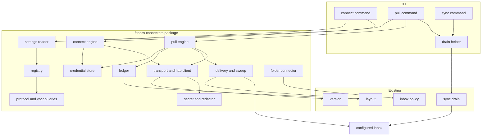
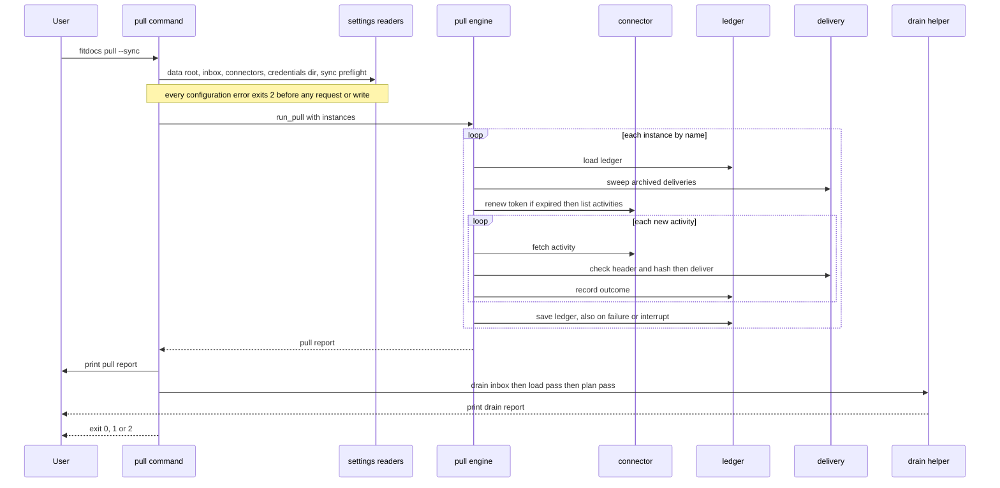
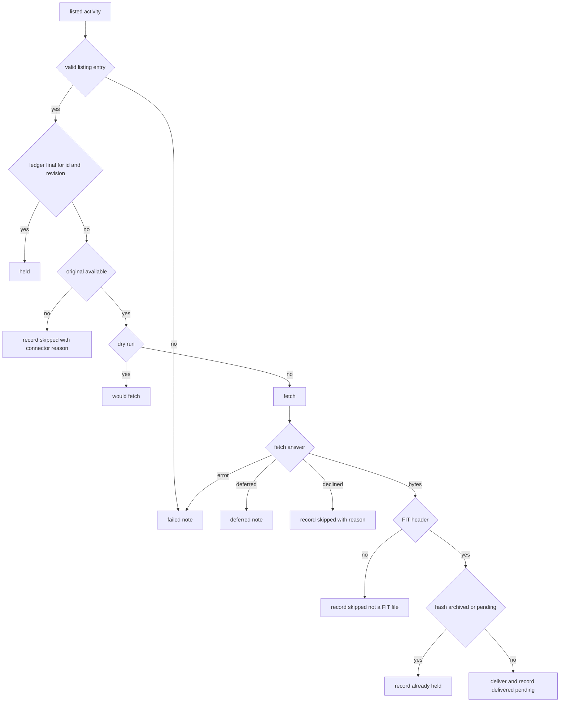
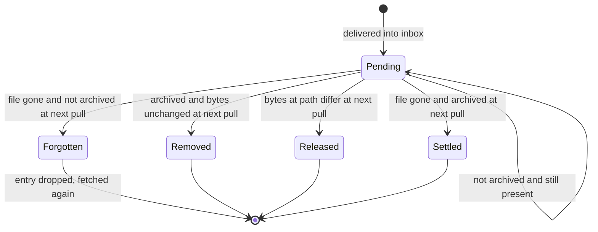
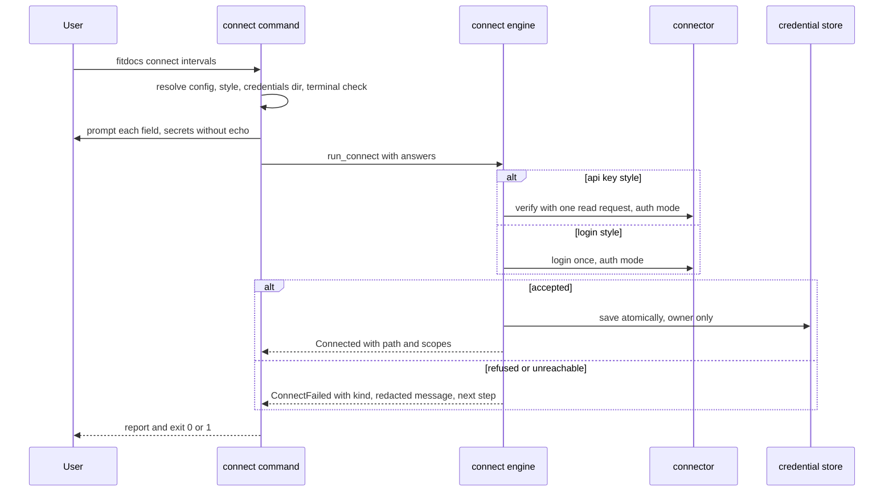

# Design Document: connectors

## Overview

**Purpose**: `connectors` gives fitdocs its first automated acquisition path. A
configured *connector instance* lists what a source holds, fetches the `.fit`
originals the athlete does not yet have, and delivers them atomically into the
configured inbox, recording what it fetched in a per-instance ledger under
`.fitdocs/`. Everything after delivery is the existing drain, unchanged. The
spec ships the framework (protocol, vocabularies, registry, credential store,
ledger, transport, delivery, `fitdocs connect`, `fitdocs pull`), one
network-free reference connector (the folder connector), and the contract,
guard, documentation and skill updates the new commands owe.

**Users**: the athlete, who configures `[connectors.<name>]` tables, runs
`fitdocs connect` once per authenticated source and `fitdocs pull --sync` by
hand or from cron/launchd; the wiki's agent, whose packaged routine becomes
`fitdocs pull --sync --no-prompt` then `fitdocs check`; connector authors — the
`intervals-connector` spec next, user plugins after the plugin-api update.

**Impact**: two new commands (eleven registered in all); a new
`fitdocs.connectors` package; the second network-capable module in the tree;
the inbox gains one producer and one narrowly scoped removal (the pull removes
its own archived deliveries); the settings schema gains one table
(`[connectors]`); the ownership contract gains credential and ledger
statements and advances its version by one from `main`'s value at landing.

### Goals
- A protocol `intervals-connector` implements without amendment, and whose
  registration surface the plugin-api connector kind validates against without
  redesign.
- No secret under the data root, in the settings file, or in any output.
- Authentication attempted exactly once per command; data calls retried within
  fixed bounds.
- A second pull fetches nothing new; the ledger, not the listing, decides.
- Pulled files never accumulate in the inbox.
- Every statement about network access true, and a guard that makes it stay
  true.

### Non-Goals
- Any online-service connector (next spec) or any push capability (reserved).
- Plugin discovery of connectors, their listing in `fitdocs plugins`
  (plugin-api update).
- Identity, base selection or composition of multiple files of one activity
  (`activity-identity`, `channel-merge`).
- A browser-consent (OAuth) flow; a scheduler, daemon or watcher; a lock
  against concurrent pulls.
- Documenting the connector protocol as a governed, public plugin API (that
  status arrives with the plugin kind; until then `fitdocs.connectors` is
  internal under the compatibility policy's "everything else is internal").

## Boundary Commitments

### This Spec Owns
- The `fitdocs.connectors` package: the protocol and value types, the
  capability vocabulary (with its remote-state and irreversible flags) and the
  authentication-style vocabulary; the registry and its validation gate; the
  secret type and redactor; the transport and HTTP client; the
  `[connectors]` settings reader; the credential store and its location
  rules; the ledger and its file format; delivery and the sweep that removes
  archived deliveries; the pull and connect engines and their report types;
  the folder connector.
- The `fitdocs connect` and `fitdocs pull` commands, their options, output and
  exit codes, and the extraction of the no-source `sync` drain into a helper
  both `sync` and `pull --sync` call.
- `fitdocs.version.user_agent()` (the one User-Agent definition) and the
  delegation of `tiles._user_agent` to it.
- `layout.CONNECTOR_STATE_DIR` and `layout.connector_ledger_path`.
- The revised network statements (code docstrings, README, configuration docs)
  and the network allow-list guard; the connectors package boundary guard.
- The `pull` write-confinement registration and the `connect` confinement test.
- `docs/connectors.md`; the connectors edits to `docs/configuration.md`,
  `docs/inbox.md`, `docs/compatibility.md`, `docs/ownership-contract.md`,
  `docs/index.md`, `docs/wiki-integration.md`, `README.md`, `CHANGELOG.md`.
- This spec's part of wiki-contract Amendment 4 (credential and ledger
  ownership statements, the two commands' overwrite semantics) and this
  spec's contract-version advance (rule below).
- The packaged `fitdocs-workouts` skill's routine, report table and pins.
- Spec bookkeeping: amendment records on `inbox`, `distribution`,
  `route-maps` and `wiki-contract`; the technology steering's network and
  credential rules.

### Out of Boundary
- What a delivered file means for the corpus: page matching, base selection,
  source roles, composition, stems and renames (`activity-identity`,
  `channel-merge`). Connectors never read, write, match or render a page.
- Any service-specific endpoint, auth detail, gzip handling, stub filtering,
  device-name resolution or attribution (`intervals-connector`).
- Discovering connectors from entry points or local plugin files, listing
  them, and the per-plugin failure isolation of that discovery (plugin-api).
  `src/fitdocs/plugins.py` is not edited.
- The inbox's selection, stability check, quarantine, and leave/move
  dispositions (`inbox`). The drain is not edited beyond the docstring
  statement at `sync.py:41-52`.
- Consolidating the private atomic-write copies (queue
  `2026-09-15-atomic-write-helper-copied-per-engine`). `connectors/_atomic.py`
  is one more copy (as is activity-identity's `identity/holds.py`); task 1.2
  appends its site to that queue item, noting that the item's consolidation
  into `fitdocs.docio` (its resume command) must widen this package's
  boundary guard — which forbids `fitdocs.docio` below — to admit the shared
  helper's module.

### Allowed Dependencies
- `fitdocs.connectors.*` may import only: the standard library;
  `fitdocs.layout`, `fitdocs.settings`, `fitdocs.inbox`, `fitdocs.version`;
  `tomli_w` (an existing runtime dependency, `pyproject.toml:30`, the
  writer `quarantine.py` already uses) in `connectors/ledger.py` and
  `connectors/credentials.py` only; and each other, in the direction
  `_atomic, secrets → errors → http → protocol → {registry, credentials,
  ledger} → delivery → settings → folder → {pull, connect} → __init__`.
- `fitdocs.connectors.http` is the only connectors module that may import
  `urllib.request`/`urllib.error` (or any network-capable module), and
  together with `fitdocs.tiles` the only such module in `src/`.
- Forbidden to the package (guarded): `fitdocs.render*`, `fitdocs.load*`,
  `fitdocs.metrics*`, `fitdocs.ingest*`, `fitdocs.sync`, `fitdocs.audit`,
  `fitdocs.plans*`, `fitdocs.history*`, `fitdocs.performance*`,
  `fitdocs.contract`, `fitdocs.docio`, `fitdocs.docmerge`, `fitdocs.tiles`,
  `fitdocs.plugins`, `fitdocs.cli`, and every third-party package other
  than `tomli_w` in the two modules named above.
- `fitdocs.cli` imports the package; nothing else in `src/` does.

### Revalidation Triggers
- Any change to the `Connector` protocol or its optional-operation protocols,
  the `Capability`/`AuthStyle` members or flags, `validate_connector`'s rules,
  or the registry operations → `intervals-connector` and the plugin-api update
  re-check.
- Any change to the ledger file format or its keys → the follow-on push
  connectors and anything reading `.fitdocs/connectors/` re-check.
- Any change to the credential store's location order, file format or
  environment-variable naming → `intervals-connector`'s docs and every user's
  unattended configuration re-check (a governed settings-adjacent change).
- Any change to where or how deliveries land (`<inbox>/<instance>/`, name
  rules) or to the sweep's removal rule → `inbox`'s contract and
  `activity-identity` re-check.
- Once the plugin kind exists: `fitdocs pull`/`connect` must run connector
  discovery before reading `[connectors]` (a connector id is resolved through
  the registry at settings-read time).

## Architecture

### Existing Architecture Analysis
- **The inbox is the ingestion interface.** `inbox.select_candidates`
  (`src/fitdocs/inbox.py:563-597`) admits `.fit` files and ignores any path with
  a dot-prefixed component; `settle` (`:667-721`) defers anything that changes
  across the settle interval; the drain (`sync.drain`, `sync.py:616`) reads
  each stable candidate once (`:752`), hashes it (`:765`) and dedupes against
  `fit-archive/<sha>.fit`. Deliveries rely on all three unchanged.
- **Tool state lives in `.fitdocs/`** (`layout.TOOL_STATE_DIR`, `layout.py:87`),
  owned and undeclared; `quarantine.py` is the pattern for a versioned, sorted,
  atomic, write-if-different state file.
- **`tiles.py` is the only network module** (`import urllib.request` at
  `tiles.py:50`), built around an injectable fetch seam and a lazy
  User-Agent (`_user_agent`, `:252-271`).
- **Table readers** project an already-parsed settings document and raise a
  `SettingsError` subclass for a malformed table (`settings.py`,
  `inbox.load_inbox_settings` at `inbox.py:228-277`); the CLI maps every
  `SettingsError` to `_config_error` (`cli.py:1000-1010`, exit 2).
- **The load registry** (`load/registry.py`) is the shape `plugins.py` drives
  (`register`, `unregister`, `available`, `validate_calculator`, typed
  duplicate/invalid/unknown errors).
- **Write confinement** (`tests/test_confinement.py`) registers each writing
  entry point in `WRITING_ENTRY_POINTS` (`:815`) with a `non_vacuous`
  predicate (`EntryPoint`, `:792-812`) and permits owned paths plus the
  configured `[inbox]` locations (`SETTINGS_LOCATION_KEYS`, `:110-113`).

### Architecture Pattern & Boundary Map



**Architecture Integration**:
- Selected pattern: *producer beside the pipeline* — connectors are inbox
  producers with their own state; the drain stays the only consumer.
- Domain boundaries: connectors know remote activities, bytes, the ledger and
  the inbox's location; the drain knows candidates, archives and pages. The
  only shared facts are the inbox path and the archive's content-hash naming.
- Existing patterns preserved: per-table settings readers with a
  `SettingsError` subclass; injectable network seam; versioned, sorted,
  atomic, write-if-different state files; `subject`/`detail` notes;
  registry-with-validation-gate; confinement registration with a
  `non_vacuous` proof.
- New components rationale: each file in the File Structure Plan owns one
  concern; the transport is isolated in one module so the network allow-list
  names exactly one connectors file.
- Steering compliance: stdlib only (no new runtime dependency); no background
  jobs; absent is `None`; typed with `mypy --strict`; personal data never in
  the repository (all fixtures synthesized; no network in tests).

### Dependency Direction
`fitdocs.connectors` modules import only leftward in this chain, never
upward; the boundary guard (task 6.1) pins each module's direct imports by
equality:

```
_atomic, secrets  →  errors  →  http  →  protocol  →  registry, credentials, ledger
    →  delivery  →  settings  →  folder  →  pull, connect  →  __init__
```

`fitdocs.cli` sits above `__init__` and above `fitdocs.sync`; connectors never
import the sync engine, and the sync engine never imports connectors.

### Technology Stack

| Layer | Choice / Version | Role in Feature | Notes |
|-------|------------------|-----------------|-------|
| CLI | typer ≥0.12 (existing), `getpass` (stdlib) | `connect`, `pull`; secret prompts without echo | `pretty_exceptions_show_locals=False` set explicitly on the app |
| Transport | `urllib.request` (stdlib) | the one HTTP implementation | explicit User-Agent, timeout, unredirected credential headers |
| State | `tomllib` (stdlib) + `tomli-w` (existing dependency) | ledger and credentials files | same pair `quarantine.py` uses |
| Filesystem | `os`, `tempfile`, `hashlib` (stdlib) | atomic writes, owner-only modes, content hashes | POSIX modes; CI is Linux |
| Runtime deps | unchanged | — | `tests/test_determinism.py:672-712`, `tests/test_packaging.py:503-519` stay green |

## File Structure Plan

### Directory Structure
```
src/fitdocs/connectors/
├── __init__.py      # Published surface (__all__); registers the built-in folder connector at import
├── _atomic.py       # write_atomic(): dot-prefixed temp in target dir, fsync, os.replace, owner-only mode
├── secrets.py       # Secret (redacting str/repr), Redactor (per-invocation value scrubber), REDACTED
├── errors.py        # AuthFailure + AuthFailureKind, ConnectorError, ConnectorSettingsError, NotConnectedError,
│                    #   NEXT_STEPS + next_step() (shared by connect and pull)
├── http.py          # HttpRequest/HttpResponse, TransportError, Transport, urllib_transport, CallMode, HttpClient, auth_failure_from
├── protocol.py      # Capability/CapabilityInfo/CAPABILITIES, AuthStyle, CredentialField, RemoteActivity, Listing,
│                    #   ListingDeferral, Fetched/Declined/Deferred, Granted, TokenSet, SettingsContext,
│                    #   CredentialAccess, ConnectorSession, Connector + KeyVerifier/TokenIssuer/ActivityPuller
├── registry.py      # register/unregister/get/available/validate_connector + the three error types
├── credentials.py   # credentials-dir resolution, env-var naming, CredentialStore, StoredCredentials, ResolvedCredentials
├── ledger.py        # Outcome, LedgerEntry, Ledger, LedgerError, load_ledger, save_ledger, LEDGER_VERSION
├── delivery.py      # is_fit, delivery_name, deliver(), sweep()
├── settings.py      # [connectors] reader: ConnectorInstance, ConnectorsSettingsError, load_connectors_settings
├── folder.py        # FolderConnector, FolderSettings (built-in, network-free)
├── pull.py          # PullOptions, run_pull, PullReport, InstancePullReport, PullNote, Delivered
└── connect.py       # run_connect, Connected, ConnectFailed
docs/connectors.md   # User documentation for connectors (new page)
tests/connectors/
├── __init__.py
├── conftest.py      # autouse socket guard and environment isolation (a plain helper, also imported by
│                    #   tests/test_confinement.py); FakeTransport; registry snapshot/restore; synthetic connectors
├── test_isolation.py
├── test_secrets.py
├── test_atomic.py
├── test_errors.py
├── test_http.py
├── test_protocol.py # vocabulary, flags, value-type invariants
├── test_registry.py
├── test_surface.py  # __all__ pin and identity with defining modules
├── test_settings.py
├── test_credentials.py
├── test_ledger.py
├── test_delivery.py
├── test_folder.py
├── test_pull.py
├── test_connect.py
├── test_boundary.py # package import closure + forbidden names + clock scan + tree-wide network allow-list
├── test_network_statements.py  # stale "only network" phrases absent from code, README and docs; new statements present
├── test_docs.py     # connectors page, service-neutral scan (+ its exemption table, empty here), inbox carve-out and settings-table pins
└── test_cli_connectors.py  # CLI: connect, pull, --sync chaining, exit codes, output, socket guard
```

### Modified Files
- `src/fitdocs/cli.py` — `connect` and `pull` commands; `_run_drain_passes`
  extracted from `sync_command`'s no-source branch (`cli.py:340-374`) and
  called by both; `_report_pull`, `_report_connect`; module-level seams
  `_connector_transport`, `_stdin_is_interactive`, `_ask_secret`,
  `_ask_value` (monkeypatched in tests); `pretty_exceptions_show_locals=False`
  on `app`; docstring: "Eleven commands", the two command bullets, the network
  paragraph (`:98-102`) rewritten, exit-code paragraph extended. Shared with
  `activity-identity` (its `_identity_settings()` and `precedence=`
  wiring): whichever of the two lands second carries `precedence` through
  `_run_drain_passes` and adds the `[identity]` and hold-record checks to
  `pull --sync`'s preflight (see CliCommands).
- `src/fitdocs/version.py` — `PROJECT_URL` and `user_agent()`; module docstring
  names the fourth consumer.
- `src/fitdocs/tiles.py` — `_user_agent()` returns `version.user_agent()`;
  statements at `:7`, `:246`, `:407` name the connector transport as the other
  network module.
- `src/fitdocs/sync.py` — the "Offline guarantee" paragraph (`:41-52`) states
  the engine makes no connector request; nothing else.
- `src/fitdocs/layout.py` — `CONNECTOR_STATE_DIR`, `connector_ledger_path()`;
  `TOOL_STATE_DIR`'s docstring names the ledger as its second tenant.
- `src/fitdocs/contract.py` — `CONTRACT_VERSION` advanced by one from
  `main`'s value per "Contract version" below, with a docstring paragraph
  for this spec's changes.
- `src/fitdocs/skills/fitdocs-workouts/SKILL.md` — description, routine,
  pull-report table, connect/never-retry instructions, further-reading link.
- `pyproject.toml` — `[project.urls]` gains `Connectors`; `[tool.mypy].files`
  gains `tests/connectors`. No dependency change.
- `tests/test_confinement.py` — `pull` entry point + `connect` confinement test.
- `tests/test_agent_skill.py` — routine fence pin → `{"pull", "check"}`; pull
  channel literal and binding; stale "fences sync, check, and regen" prose.
- `tests/test_cli_skill.py` — `len(commands) == 11`, `"Eleven"` (`:262-269`).
- `tests/test_compatibility_policy.py` — `SETTINGS_TABLE_LITERALS` gains
  `"[connectors]"`; if `main` still carries
  `test_settings_schema_subsection_names_all_six_tables` (`:270`), this spec
  is the first of `activity-identity`/`connectors` to land and renames it to
  the count-free `test_settings_schema_subsection_names_every_table`, with
  count-free messages and comments; if `activity-identity` renamed it
  first (making them count-free too), the name stays and this spec re-pins
  only the literal list (settings-table count rule under CompatibilityDocs).
- `tests/test_docs_guarantees.py` — `_REQUIRED_ENTRY_POINT_LINKS` gains
  `"connectors.md"` (the delivery-removal carve-out and the settings-table
  pins live in the new `tests/connectors/test_docs.py`, so parallel doc tasks
  never share a test file).
- `tests/declaration_golden/*.AGENTS.md` — always regenerated (this merge
  advances `CONTRACT_VERSION`; regenerated again if a re-pin follows a
  sibling's landing).
- Docs: `docs/configuration.md`, `docs/inbox.md`, `docs/compatibility.md`,
  `docs/ownership-contract.md`, `docs/index.md`, `docs/wiki-integration.md`;
  `README.md`; `CHANGELOG.md`.
- Steering: `.kiro/steering/tech.md` (network and credential rules),
  `.kiro/steering/structure.md` (dependency line).
- Spec records: `.kiro/specs/inbox`, `.kiro/specs/distribution`,
  `.kiro/specs/route-maps`, `.kiro/specs/wiki-contract` (amendment blocks and
  `spec.json` amendments entries); `.kiro/steering/roadmap.md` Phase 8
  Existing Spec Updates bookkeeping only.

## System Flows

### `fitdocs pull [NAMES...] [--since DATE] [--dry-run] [--sync] [--no-prompt]`



Key decisions: configuration is validated for every selected instance before
the first request; the sweep precedes listing so a delivery that vanished
before archiving is re-listed and re-fetched in the same run; the ledger is
saved in a `finally` so an interruption keeps what was delivered; the drain
runs after all instances, even when some failed (12.2).

### Per-activity decision



An authentication failure raised by `fetch_activity` (or any `ConnectorError`)
ends the instance's pull instead of producing a failed note (6.11).

### Delivery lifecycle



`Removed`, `Released` and `Settled` clear the entry's `pending` location and
keep the `delivered` outcome and hash; `Forgotten` drops the entry. `Settled`
is the move-disposition case (the drain moved the file) and a user deletion
after archiving. A failed removal leaves the entry `Pending` and is reported as
a deferral.

### `fitdocs connect NAME`



## Requirements Traceability

| Requirement | Summary | Components | Interfaces | Flows |
|-------------|---------|------------|------------|-------|
| 1.1, 1.5, 1.6, 1.8 | Connector declaration, listing and fetch shapes, absent values | ConnectorProtocol | `Connector`, `ActivityPuller`, `RemoteActivity`, `Listing`, `Fetched`/`Declined`/`Deferred` | per-activity decision |
| 1.2, 1.3, 1.4 | Nine capabilities, flags, only pull driven | ConnectorProtocol, Registry | `Capability`, `CapabilityInfo`, `CAPABILITIES`, `DRIVEN_CAPABILITIES` | — |
| 1.7 | Four auth styles, browser consent reserved | ConnectorProtocol, ConnectEngine, CliCommands | `AuthStyle`, `SUPPORTED_AUTH_STYLES` | connect |
| 1.9 | Connector inputs/outputs only; no document access | ConnectorProtocol, PullEngine, BoundaryGuard | `ConnectorSession` | pull |
| 2.1, 2.2, 2.3, 2.4, 2.5, 2.6 | Registry, validation gate, duplicate/unknown ids, unregister | Registry, PackageInit | `register`, `unregister`, `get`, `available`, `validate_connector` | — |
| 2.7 | Enumerated, pinned surface | PackageInit, SurfacePin | `fitdocs.connectors.__all__` | — |
| 2.8 | plugins unchanged | Registry (by omission), BoundaryGuard | — | — |
| 3.1, 3.2, 3.3, 3.4, 3.5, 3.6, 3.7, 3.8 | `[connectors]` table reader | ConnectorsSettings | `load_connectors_settings`, `ConnectorInstance` | pull, connect preflight |
| 3.9 | Data root for both commands | CliCommands | `_resolved_data_root` | preflight |
| 4.1, 4.2 | Credentials directory resolution, never in data root | CredentialStore, CliCommands | `resolve_credentials_dir`, `check_outside_data_root` | preflight |
| 4.3, 4.4 | Owner-only modes, atomic writes, permission refusal | CredentialStore, AtomicWriter | `CredentialStore.save/load`, `write_atomic` | — |
| 4.5 | Env override for personal keys | CredentialStore | `env_var_name`, `ResolvedCredentials` | pull |
| 4.6, 4.7 | Tokens only; rotation persisted before use | CredentialStore, PullEngine, ConnectEngine | `TokenSet`, `CredentialAccess.replace` | pull, connect |
| 4.8, 4.9 | Connector id and scopes recorded; mismatch = not connected | CredentialStore | `StoredCredentials` | — |
| 5.1, 5.2, 5.3, 5.4 | Prompting, nothing-to-connect, unknown/reserved, non-terminal | CliCommands | `connect_command`, `_ask_secret`, `_stdin_is_interactive` | connect |
| 5.5, 5.6, 5.7, 5.8, 5.9 | Verify-then-store, failure kinds and next steps, one attempt, replace, no data-root write | ConnectEngine, ConnectorErrors, HttpClient, CredentialStore, ConfinementRegistration | `run_connect`, `AuthFailure`, `NEXT_STEPS` | connect |
| 6.1, 6.2, 6.3 | Instance selection, unknown names, none configured | CliCommands | `pull_command` | pull |
| 6.4 | Listing window | PullEngine | `PullOptions`, `_window_start` | pull |
| 6.5, 6.6, 6.7, 6.8 | New-by-ledger, unavailable, FIT header, already held | PullEngine, Delivery, Ledger | `run_pull`, `is_fit`, `Ledger.is_final` | per-activity decision |
| 6.9 | Dry run | PullEngine, CliCommands | `PullOptions.dry_run` | pull |
| 6.10, 6.11, 6.12 | Instance and item failure isolation, deferrals | PullEngine | `InstancePullReport` | per-activity decision |
| 6.13 | One bounded run | PullEngine, CliCommands | — | pull |
| 7.1, 7.2, 7.3, 7.4, 7.5, 7.6, 7.7, 7.8 | Ledger content, watermark, atomic sorted writes, save on failure, absent/unusable ledgers, ledger decides, archive-form hashes | Ledger, PullEngine | `Ledger`, `LedgerEntry`, `load_ledger`, `save_ledger` | pull |
| 8.1, 8.2, 8.3, 8.4 | Atomic unmodified delivery, collision names, inbox rules | Delivery, CliCommands | `deliver`, `delivery_name` | pull |
| 8.5, 8.6, 8.7, 8.8 | Sweep: remove archived, never others, forget vanished, move disposition | Delivery, PullEngine | `sweep` | delivery lifecycle |
| 8.9 | Drain unchanged, never deletes | DrainHelper (unchanged drain), InboxDocs | — | — |
| 9.1, 9.2, 9.3, 9.4, 9.5, 9.6, 9.7, 9.8 | UA, timeout, bounded data retries, single auth attempt, no 401/403 retry, unredirected credentials, size cap, substitutable transport | HttpClient, Transport, VersionUA | `HttpClient.send`, `urllib_transport`, `user_agent` | — |
| 10.1, 10.2, 10.3, 10.4, 10.5 | Secret handling and redaction | Secrets, HttpClient, PullEngine, ConnectEngine, Ledger | `Secret`, `Redactor`, `TransportError` | — |
| 10.6 | No local variables on crash | CliCommands | `typer.Typer(pretty_exceptions_show_locals=False)` | — |
| 11.1, 11.2, 11.3, 11.4, 11.5 | Report, detail, dry-run wording, exit codes, ordering | PullEngine, CliCommands | `PullReport`, `_report_pull`, `_finish` | pull |
| 12.1, 12.2, 12.3, 12.4, 12.5 | `--sync` chaining | CliCommands, DrainHelper | `_run_drain_passes` | pull |
| 13.1, 13.2, 13.3, 13.4, 13.5, 13.6, 13.7, 13.8, 13.9 | Folder connector | FolderConnector | `FolderConnector`, `FolderSettings` | pull |
| 14.1, 14.2, 14.3 | Network confinement and boundary | BoundaryGuard, CliCommands | — | — |
| 14.4, 14.7 | Honest statements, steering | NetworkStatements, SteeringUpdate | — | — |
| 14.5 | No runtime dependency | (whole design) | frozen dependency tests | — |
| 14.6 | Service-neutral framework; a shipped service connector's own files exempt | (whole design), ConnectorsDoc, NeutralScan | `NEUTRAL_SCAN_EXEMPTIONS` | — |
| 15.1, 15.2 | Ownership contract, version | OwnershipContractDocs, ContractVersion | `CONTRACT_VERSION` | — |
| 15.3 | Confinement registration | ConfinementRegistration | `EntryPoint(id="pull")` | — |
| 15.4 | Inbox carve-out wording | InboxDocs, CompatibilityDocs | — | — |
| 15.5, 15.6 | Connectors docs, table lists | ConnectorsDoc, ConfigurationDocs, CompatibilityDocs, OwnershipContractDocs | — | — |
| 15.7 | Packaged skill | PackagedSkill, SkillPins | `InstancePullReport` fields | — |
| 15.8 | Changelog | ChangelogEntry | — | — |

## Components and Interfaces

| Component | Domain/Layer | Intent | Req Coverage | Key Dependencies | Contracts |
|-----------|--------------|--------|--------------|------------------|-----------|
| ConnectorProtocol | connectors/protocol.py | Vocabulary, value types, protocols | 1.1-1.9 | errors, secrets, http (P0) | Service, State |
| ConnectorErrors | connectors/errors.py | Typed failures | 1.7, 5.6, 6.10, 6.11 | — | Service |
| Secrets | connectors/secrets.py | Secret value, redaction | 10.1-10.5 | — | Service |
| HttpClient + Transport | connectors/http.py | The only connector network code | 9.1-9.8, 10.4 | version (P0), urllib (External P0) | Service |
| Registry | connectors/registry.py | Validation gate, id registry | 2.1-2.6, 2.8 | protocol (P0) | Service, State |
| PackageInit | connectors/__init__.py | Published surface, built-in registration | 2.1, 2.7 | all modules | Service |
| ConnectorsSettings | connectors/settings.py | `[connectors]` reader | 3.1-3.8 | settings, registry, credentials (P0) | Service |
| CredentialStore | connectors/credentials.py | Per-user secrets outside the root | 4.1-4.9 | _atomic, secrets (P0) | Service, State |
| Ledger | connectors/ledger.py | Per-instance record of fetched ids | 7.1-7.8 | layout, _atomic (P0) | State |
| Delivery | connectors/delivery.py | Header check, atomic delivery, sweep | 6.7, 6.8, 8.1-8.8 | layout, ledger, _atomic (P0) | Service |
| PullEngine | connectors/pull.py | Orchestrates one pull | 6.x, 7.x, 11.x | all above (P0) | Service, Batch |
| ConnectEngine | connectors/connect.py | One authentication attempt, store | 5.5-5.8 | credentials, http (P0) | Service |
| FolderConnector | connectors/folder.py | Built-in, network-free source | 13.1-13.9 | inbox (P0) | Service |
| AtomicWriter | connectors/_atomic.py | Temp-then-replace, owner-only | 4.3, 7.3, 8.1 | — | Service |
| VersionUA | version.py, tiles.py | One User-Agent definition | 9.1 | — | Service |
| LayoutPaths | layout.py | Ledger path | 7.1 | — | Service |
| CliCommands | cli.py | `connect`, `pull`, drain helper | 3.9, 5.x, 6.x, 10.6, 11.x, 12.x | connectors, sync (P0) | Service |
| NetworkStatements | cli.py, sync.py, tiles.py, README, docs | True statements | 14.4 | — | — |
| BoundaryGuard | tests/connectors/test_boundary.py | Network allow-list, package closure | 1.9, 2.8, 14.1-14.3 | — | — |
| SurfacePin | tests/connectors/test_surface.py | `__all__` pin | 2.7 | — | — |
| NeutralScan | tests/connectors/test_docs.py | No online-service endpoint outside an exempted connector's own files | 14.6 | — | — |
| ConfinementRegistration | tests/test_confinement.py | `pull` entry point, `connect` test | 5.9, 15.3 | — | — |
| ContractVersion + OwnershipContractDocs | contract.py, docs/ownership-contract.md, goldens | Ownership statements, version | 15.1, 15.2 | — | — |
| InboxDocs, CompatibilityDocs, ConfigurationDocs, ConnectorsDoc, ReadmeAndIndex, ChangelogEntry | docs, README, CHANGELOG | User-facing statements | 8.9, 14.4, 15.4-15.6, 15.8 | — | — |
| PackagedSkill + SkillPins | SKILL.md, tests/test_agent_skill.py | Routine and report table | 15.7 | InstancePullReport (P0) | — |
| SteeringUpdate, SpecRecords | .kiro/steering, .kiro/specs | Rules and amendment records | 14.7 | — | — |

### Protocol layer

#### ConnectorProtocol (`connectors/protocol.py`)

| Field | Detail |
|-------|--------|
| Intent | The published vocabulary and the shapes every connector implements |
| Requirements | 1.1, 1.2, 1.3, 1.4, 1.5, 1.6, 1.7, 1.8, 1.9 |

**Responsibilities & Constraints**
- Pure declarations: no I/O, no clock, no registry mutation.
- Every value type is a frozen dataclass; absent values are `None`.
- `CAPABILITIES` holds exactly nine entries (a test pins membership and flags).

**Contracts**: Service [x] / State [x]

```python
class Capability(StrEnum):
    PULL_ACTIVITIES = "pull-activities"
    PUSH_ACTIVITY = "push-activity"
    ANNOTATE_REMOTE_ACTIVITY = "annotate-remote-activity"
    RESOLVE_REMOTE_ACTIVITY = "resolve-remote-activity"
    PUSH_PLANNED_WORKOUT = "push-planned-workout"
    PULL_PLANNED_WORKOUTS = "pull-planned-workouts"
    PULL_PLANS = "pull-plans"
    PULL_THRESHOLDS = "pull-thresholds"
    PULL_WELLNESS = "pull-wellness"

@dataclass(frozen=True)
class CapabilityInfo:
    capability: Capability
    summary: str            # one line, user-facing
    changes_remote: bool    # True only for the three push/annotate members
    irreversible: bool      # equal to changes_remote in this version; kept separate so a
                            # later capability with an undo can be a reversible remote change
    driven: bool            # True only for PULL_ACTIVITIES in this version

CAPABILITIES: Final[Mapping[Capability, CapabilityInfo]]   # all nine, in declaration order
DRIVEN_CAPABILITIES: Final[frozenset[Capability]]            # {PULL_ACTIVITIES}

class AuthStyle(StrEnum):
    NONE = "none"
    API_KEY = "api-key"
    LOGIN = "login"
    OAUTH_BROWSER = "oauth-browser"   # reserved

SUPPORTED_AUTH_STYLES: Final[frozenset[AuthStyle]]   # {NONE, API_KEY, LOGIN}

@dataclass(frozen=True)
class CredentialField:
    name: str      # ^[a-z][a-z0-9_]{0,63}$ ; also the environment-variable suffix
    label: str     # the prompt text, non-empty
    secret: bool   # True -> prompted without echo, redacted everywhere

@dataclass(frozen=True)
class RemoteActivity:
    remote_id: str                 # stable per source; non-empty, no control characters, <= 512 chars
    original_available: bool
    unavailable_reason: str | None = None   # required (non-empty) when original_available is False
    start: datetime | None = None           # timezone-aware
    sport: str | None = None
    duration_s: float | None = None         # >= 0
    revision: str | None = None             # changes when the remote file changes
    suggested_name: str | None = None       # a file-name hint; sanitized by delivery

@dataclass(frozen=True)
class ListingDeferral:
    subject: str   # what could not be listed yet (a remote id or path)
    reason: str

@dataclass(frozen=True)
class Listing:
    activities: tuple[RemoteActivity, ...]
    deferred: tuple[ListingDeferral, ...] = ()

@dataclass(frozen=True)
class Fetched:
    data: bytes
@dataclass(frozen=True)
class Declined:
    reason: str
@dataclass(frozen=True)
class Deferred:
    reason: str
FetchResult = Fetched | Declined | Deferred

@dataclass(frozen=True)
class Granted:
    scopes: tuple[str, ...] | None   # None = the service did not report scopes

@dataclass(frozen=True)
class TokenSet:
    values: Mapping[str, Secret]      # e.g. access and refresh tokens; persisted verbatim
    expires_at: datetime | None       # timezone-aware; None = unknown
    scopes: tuple[str, ...] | None

@dataclass(frozen=True)
class SettingsContext:
    data_root: Path
    inbox: Path          # the resolved inbox (it may not exist yet)

class CredentialAccess(Protocol):
    def value(self, field: str) -> Secret: ...          # raises NotConnectedError if absent
    @property
    def scopes(self) -> tuple[str, ...] | None: ...
    @property
    def expires_at(self) -> datetime | None: ...
    def replace(self, tokens: TokenSet) -> None: ...    # persists atomically before returning

@dataclass(frozen=True)
class ConnectorSession:
    instance: str                     # the configured instance name
    settings: object                  # exactly what parse_settings returned
    http: HttpClient                  # AUTH mode inside verify/login/refresh, DATA mode otherwise
    credentials: CredentialAccess
    data_root: Path
    now: Callable[[], datetime]       # timezone-aware UTC
    sleep: Callable[[float], None]
    redactor: Redactor
    def secret(self, value: str) -> Secret: ...   # wraps and registers with the redactor

class Connector(Protocol):
    @property
    def connector_id(self) -> str: ...
    @property
    def display_name(self) -> str: ...
    @property
    def auth_style(self) -> AuthStyle: ...
    @property
    def capabilities(self) -> frozenset[Capability]: ...
    @property
    def credential_fields(self) -> tuple[CredentialField, ...]: ...
    def parse_settings(self, table: Mapping[str, object], context: SettingsContext) -> object: ...

class KeyVerifier(Protocol):      # required when auth_style is API_KEY
    def verify(self, session: ConnectorSession, values: Mapping[str, Secret]) -> Granted: ...

class TokenIssuer(Protocol):      # required when auth_style is LOGIN
    def login(self, session: ConnectorSession, values: Mapping[str, Secret]) -> TokenSet: ...
    def refresh(self, session: ConnectorSession) -> TokenSet: ...

class ActivityPuller(Protocol):   # required when PULL_ACTIVITIES is declared
    def list_activities(self, session: ConnectorSession, since: datetime | None) -> Listing: ...
    def fetch_activity(self, session: ConnectorSession, activity: RemoteActivity) -> FetchResult: ...
```

- **Preconditions**: `parse_settings` receives the instance table minus the two
  framework keys (`connector`, `lookback_days`) and raises
  `ConnectorSettingsError(key, message)` for its own keys; it may raise nothing
  else intentionally (anything else is wrapped as a configuration error).
- **Postconditions**: `list_activities` answers with every activity starting
  at or after `since` it can see (or everything, when `since` is `None` or the
  source cannot filter by time); `fetch_activity` answers for exactly the
  activity given. `verify`, `login`, `refresh` raise `AuthFailure` on refusal.
- **Invariants**: a connector keeps no state between sessions; its only
  persistence is through `CredentialAccess.replace` and the framework's ledger.

**Implementation Notes**
- Integration: `SettingsContext.inbox` exists so a connector can refuse a
  configuration that would loop into the inbox (the folder connector does).
- Validation: `tests/connectors/test_protocol.py` pins the nine members, the
  three remote-changing irreversible members, the one driven member, the four
  styles and the one reserved style.
- Risks: `settings: object` requires connectors to narrow (`isinstance`) their
  own settings; accepted so the registry stays heterogeneous without `Any`.

#### ConnectorErrors (`connectors/errors.py`)

```python
class AuthFailureKind(StrEnum):
    REJECTED = "rejected"          # bad or revoked credentials (typically 401)
    RATE_LIMITED = "rate-limited"  # 429 or a service throttle
    CHALLENGE = "challenge"        # an extra verification step fitdocs cannot answer
    LOCKED = "locked"              # account lockout
    BLOCKED = "blocked"            # the client was refused (typically 403)
    UNAVAILABLE = "unavailable"    # 5xx or unreachable

class AuthFailure(Exception):
    kind: AuthFailureKind
    service_message: str           # verbatim from the service; redacted before display
    retry_after_s: float | None

class ConnectorError(Exception):       # ends this instance's pull; message is user-facing
class NotConnectedError(ConnectorError)
class ConnectorSettingsError(Exception):
    key: str
    message: str

NEXT_STEPS: Final[Mapping[AuthFailureKind, str]]   # "{name}" and "{retry}" placeholders
def next_step(kind: AuthFailureKind, *, name: str, retry_after_s: float | None) -> str: ...
```
- `NEXT_STEPS` lives here, not in `connect.py`, so `pull.py` and `connect.py`
  share it without importing each other; its text is the table under
  ConnectEngine.

### Transport layer

#### Secrets (`connectors/secrets.py`)

| Field | Detail |
|-------|--------|
| Intent | Keep secret text out of every string fitdocs shows |
| Requirements | 10.1, 10.2, 10.3, 10.5 |

```python
REDACTED: Final[str] = "<redacted>"

class Secret:
    """Holds one secret string. str(), repr() and format() show REDACTED."""
    def __init__(self, value: str) -> None: ...     # TypeError for a non-str
    def reveal(self) -> str: ...                     # the only way to read the value
    # __eq__/__hash__ by value; __str__/__repr__/__format__ never reveal

class Redactor:
    def add(self, value: str | Secret) -> None: ...  # ignores ""; also registers the
                                                     # percent-encoded form when it differs
    def redact(self, text: str) -> str: ...          # replaces every registered value,
                                                     # longest first, with REDACTED
```
- One `Redactor` per command invocation. It receives every stored or
  environment credential value loaded, every `TokenSet` value, every secret
  header and every `url_is_secret` URL the HTTP client sends.
- `PullEngine` and `ConnectEngine` pass every string that reaches a report
  (connector reasons, exception text, service messages) through `redact`.

#### HttpClient and Transport (`connectors/http.py`)

| Field | Detail |
|-------|--------|
| Intent | The one connector network module: UA, timeout, retry policy, redirect safety |
| Requirements | 9.1, 9.2, 9.3, 9.4, 9.5, 9.6, 9.7, 9.8, 10.4 |

```python
DEFAULT_TIMEOUT_SECONDS: Final[float] = 30.0
MAX_DATA_ATTEMPTS: Final[int] = 3
BACKOFF_SECONDS: Final[tuple[float, ...]] = (2.0, 4.0)     # waits before attempts 2 and 3
MAX_RETRY_AFTER_SECONDS: Final[float] = 60.0
MAX_RESPONSE_BYTES: Final[int] = 64 * 1024 * 1024
RETRYABLE_STATUSES: Final[frozenset[int]] = frozenset({429, 500, 502, 503, 504})

@dataclass(frozen=True)
class HttpRequest:
    method: Literal["GET", "POST"]
    url: str
    headers: Mapping[str, str] = field(default_factory=dict)
    secret_headers: Mapping[str, Secret] = field(default_factory=dict)  # sent unredirected
    body: bytes | None = None
    url_is_secret: bool = False    # a signed download location

@dataclass(frozen=True)
class HttpResponse:
    status: int
    headers: Mapping[str, str]     # names lowercased
    body: bytes                    # undecoded (no Content-Encoding handling)

class TransportError(Exception):   # network failure, timeout, oversize body
    # message: "<reason>: <scheme>://<host><path>" -- never the query; "<signed location>" when url_is_secret

Transport = Callable[[HttpRequest, float], HttpResponse]   # (request, timeout); raises TransportError

def urllib_transport(request: HttpRequest, timeout: float) -> HttpResponse: ...

class CallMode(StrEnum):
    AUTH = "auth"   # exactly one attempt, whatever happens
    DATA = "data"   # bounded retries

class HttpClient:
    def __init__(self, transport: Transport, *, mode: CallMode, redactor: Redactor,
                 sleep: Callable[[float], None], timeout: float = DEFAULT_TIMEOUT_SECONDS) -> None: ...
    @property
    def mode(self) -> CallMode: ...
    def send(self, request: HttpRequest) -> HttpResponse: ...
    def get(self, url: str, *, headers: Mapping[str, str] | None = None,
            secret_headers: Mapping[str, Secret] | None = None, url_is_secret: bool = False) -> HttpResponse: ...
    def post(self, url: str, *, body: bytes, headers: Mapping[str, str] | None = None,
             secret_headers: Mapping[str, Secret] | None = None) -> HttpResponse: ...

def auth_failure_from(response: HttpResponse, *, service_message: str | None = None) -> AuthFailure | None:
    """401 -> REJECTED, 403 -> BLOCKED, 429 -> RATE_LIMITED (Retry-After parsed),
    5xx -> UNAVAILABLE; None for anything else. A connector adds its own
    service-specific kinds (CHALLENGE, LOCKED)."""
```

- `send` always sets `User-Agent: fitdocs.version.user_agent()`, replacing any
  caller-supplied value; registers `secret_headers` values and a
  `url_is_secret` URL with the redactor before the first attempt.
- **AUTH mode**: one `transport` call; the response is returned whatever its
  status; a `TransportError` propagates.
- **DATA mode**: up to `MAX_DATA_ATTEMPTS` calls. After a `TransportError` or a
  status in `RETRYABLE_STATUSES`, when attempts remain it waits — the
  response's `Retry-After` (delta-seconds or HTTP-date) when present and
  `≤ MAX_RETRY_AFTER_SECONDS`, else `BACKOFF_SECONDS[attempt-1]` — and tries
  again; a `Retry-After` above the maximum stops retrying and returns that
  response. The final response is returned; the final `TransportError`
  propagates. 401 and 403 are not in the retryable set.
- *Retry-After as an HTTP-date* (controller ruling, 2026-09-30, connectors
  task 2.1): the package reads no clock, so an HTTP-date is measured against
  the response's own `Date` header (the server's clock). Without a parseable
  `Date` the value is unparseable — DATA mode backs off, and
  `auth_failure_from` sets `retry_after_s = None`. Published signatures are
  unchanged.
- *Transport failure messages* (controller ruling, 2026-09-30, connectors
  task 2.1): `urllib_transport` builds the `Request` inside its `try` and
  also converts `ValueError` (a malformed URL) and
  `http.client.HTTPException` into `TransportError`; `connectors/http.py`
  may therefore import `http.client` beside `urllib.*`. No `TransportError`
  message interpolates an exception's text (urllib's messages carry the full
  URL): the reason is fixed text naming only the exception type. A
  non-finite `Retry-After` (`nan`, `inf`) is unparseable.
- `urllib_transport` builds `urllib.request.Request(url, data=body,
  method=...)` with ordinary headers, adds each secret header with
  `add_unredirected_header(name, secret.reveal())`, calls
  `urllib.request.urlopen(request, timeout=timeout)` (referenced through the
  module so tests can substitute it), reads at most `MAX_RESPONSE_BYTES + 1`
  bytes (more → `TransportError("response too large")`), converts
  `HTTPError` into an `HttpResponse` with its code, headers and (capped) body,
  and converts `URLError`/`OSError`/timeouts into `TransportError` whose
  message names only scheme, host and path.

**Implementation Notes**
- Validation: tests use a `FakeTransport` (scripted responses, records
  requests) and, for `urllib_transport` itself, a patched
  `urllib.request.urlopen` capturing the `Request` (UA header value, the
  unredirected header set, the timeout), mirroring
  `tests/test_tiles.py:536-570`.
- Risks: the redirect target is not visible to callers (never needed; a
  signed redirect location stays secret by construction).

#### VersionUA (`version.py`, `tiles.py`)
- `PROJECT_URL: Final[str] = "https://github.com/joshua-stauffer/fitdocs"`;
  `def user_agent() -> str: return f"fitdocs/{version_display()} (+{PROJECT_URL})"`,
  computed at call time (no module-level cache, matching the module's rule).
- `tiles._user_agent()` becomes `return user_agent()`; its tests
  (`tests/test_tiles.py:536-602`) patch `fitdocs.version.version` and stay
  green unchanged.

### Registry layer

#### Registry (`connectors/registry.py`)

| Field | Detail |
|-------|--------|
| Intent | The one gate every connector passes; the surface plugin-api parameterizes over |
| Requirements | 2.1, 2.2, 2.3, 2.4, 2.5, 2.6, 2.8 |

```python
class InvalidConnectorError(ValueError): ...
class DuplicateConnectorIdError(ValueError):
    connector_id: str
class UnknownConnectorError(Exception): ...   # message names the id and every registered id

def validate_connector(obj: object) -> str | None: ...   # None = valid; never calls operations; never raises
def register(connector: Connector) -> None: ...          # InvalidConnectorError / DuplicateConnectorIdError
def unregister(connector_id: str) -> None: ...           # no-op for an unknown id
def get(connector_id: str) -> Connector: ...             # UnknownConnectorError
def available() -> tuple[Connector, ...]: ...            # registration order
```

`validate_connector` checks, in order, reading attributes with `getattr`
inside one broad failure boundary (a raising property is a reason, not an
exception): `connector_id` matches `^[a-z0-9][a-z0-9-]{0,63}$`;
`display_name` is a non-empty `str`; `auth_style` is an `AuthStyle`;
`capabilities` is a non-empty `frozenset` of `Capability`;
`credential_fields` is a `tuple` of `CredentialField` with valid, unique
names and non-empty labels, empty exactly when `auth_style` is `NONE`;
`parse_settings` is callable; `verify` is callable when `API_KEY`; `login` and
`refresh` are callable when `LOGIN`; `list_activities` and `fetch_activity`
are callable when `PULL_ACTIVITIES` is declared. Reserved capabilities and the
reserved style impose no operation.

**Plugin-api seam (stated for the later update)**: the connector kind will
(1) own its entry-point group name (recommended `fitdocs.connectors`) and the
local-file fallback; (2) validate with `validate_connector`; (3) register with
`register`, catching `DuplicateConnectorIdError` (reads `.connector_id`) and
`InvalidConnectorError`; (4) attribute a local file by diffing
`{c.connector_id for c in available()}` before and after executing it;
(5) list `connector_id`, `display_name`, `auth_style` and `capabilities`
(with `CAPABILITIES[c].driven`) without calling any operation; (6) reset with
`unregister`. It must run discovery before `load_connectors_settings`.

#### PackageInit (`connectors/__init__.py`)
- `__all__` (pinned by `tests/connectors/test_surface.py`, equality and
  identity with the defining module): `Capability`, `CapabilityInfo`,
  `CAPABILITIES`, `DRIVEN_CAPABILITIES`, `AuthStyle`, `SUPPORTED_AUTH_STYLES`,
  `CredentialField`, `RemoteActivity`, `Listing`, `ListingDeferral`,
  `Fetched`, `Declined`, `Deferred`, `FetchResult`, `Granted`, `TokenSet`,
  `SettingsContext`, `CredentialAccess`, `ConnectorSession`, `Connector`,
  `KeyVerifier`, `TokenIssuer`, `ActivityPuller`, `AuthFailure`,
  `AuthFailureKind`, `ConnectorError`, `NotConnectedError`,
  `ConnectorSettingsError`, `Secret`, `REDACTED`, `Redactor`, `HttpClient`,
  `CallMode`, `Transport`, `HttpRequest`, `HttpResponse`, `TransportError`,
  `auth_failure_from`, `register`, `unregister`, `get`, `available`,
  `validate_connector`, `DuplicateConnectorIdError`, `InvalidConnectorError`,
  `UnknownConnectorError` — 46 names. `Redactor`, `CallMode` and `Transport`
  are included because `ConnectorSession`'s fields name them: a connector's
  own tests construct a session from exactly these.
- At import: `registry.register(FolderConnector())`. `FolderConnector` is not
  in `__all__` (internal, like `ThresholdCalculator`).
- `intervals-connector` appends its own built-in registration here.

### State layer

#### ConnectorsSettings (`connectors/settings.py`)

| Field | Detail |
|-------|--------|
| Intent | Project `[connectors]` into validated instances |
| Requirements | 3.1, 3.2, 3.3, 3.4, 3.5, 3.6, 3.7, 3.8 |

```python
CONNECTORS_TABLE: Final[str] = "connectors"
DEFAULT_LOOKBACK_DAYS: Final[int] = 30
MAX_LOOKBACK_DAYS: Final[int] = 3650
INSTANCE_NAME_PATTERN: Final[str] = r"^[a-z0-9][a-z0-9-]{0,63}$"

@dataclass(frozen=True)
class ConnectorInstance:
    name: str
    connector: Connector
    lookback_days: int
    settings: object

class ConnectorsSettingsError(SettingsError): ...

def load_connectors_settings(
    document: Mapping[str, object], *, settings_file: Path, context: SettingsContext,
) -> tuple[ConnectorInstance, ...]: ...    # sorted by name; () when absent
```
- Reads no file; never writes (3.8). Every message names the settings file,
  `[connectors.<name>]` and the key.
- Order of checks per instance: table shape; name pattern; `connector`
  (non-empty string → `registry.get`, unknown → message lists registered
  ids); `lookback_days` (an `int`, not `bool`, `0..MAX_LOOKBACK_DAYS`); any
  remaining key equal to a declared credential field name → the 3.5 error;
  `connector.parse_settings(rest, context)` — `ConnectorSettingsError` is
  wrapped naming the key, any other exception is wrapped naming the connector.
  After all instances: environment-variable collision check over every
  `(instance, field)` pair (3.6).

#### CredentialStore (`connectors/credentials.py`)

| Field | Detail |
|-------|--------|
| Intent | Secrets per user, outside the data root, owner-only, env-overridable |
| Requirements | 4.1, 4.2, 4.3, 4.4, 4.5, 4.6, 4.7, 4.8, 4.9 |

```python
CREDENTIALS_DIR_ENV: Final[str] = "FITDOCS_CREDENTIALS_DIR"
ENV_PREFIX: Final[str] = "FITDOCS_CONNECTOR_"
CREDENTIALS_VERSION: Final[int] = 1

class CredentialsLocationError(SettingsError): ...   # exit 2 at the CLI
class CredentialStoreError(Exception): ...           # unreadable, malformed, newer, permissive

def resolve_credentials_dir(environ: Mapping[str, str], home: Path) -> Path: ...
def check_outside_data_root(directory: Path, data_root: Path) -> None: ...
def env_var_name(instance: str, field: str) -> str: ...
    # FITDOCS_CONNECTOR_ + instance.upper().replace("-", "_") + "_" + field.upper()

@dataclass(frozen=True)
class StoredCredentials:
    connector_id: str
    auth_style: AuthStyle
    values: Mapping[str, Secret]
    expires_at: datetime | None
    scopes: tuple[str, ...] | None

class CredentialStore:
    def __init__(self, directory: Path) -> None: ...
    @property
    def directory(self) -> Path: ...
    def path_for(self, instance: str) -> Path: ...                 # <directory>/<instance>.toml
    def load(self, instance: str) -> StoredCredentials | None: ... # None when absent
    def save(self, instance: str, credentials: StoredCredentials) -> Path: ...

class ResolvedCredentials:   # implements CredentialAccess for one instance
    ...
def resolve_credentials(instance_name: str, connector: Connector, store: CredentialStore | None,
                        environ: Mapping[str, str], redactor: Redactor) -> CredentialAccess: ...
    # primitives, not ConnectorInstance: settings.py imports this module, never the reverse
```
- **Location order** (4.1): `FITDOCS_CREDENTIALS_DIR` when set and non-empty
  (must be absolute, else `CredentialsLocationError`); else
  `$XDG_CONFIG_HOME/fitdocs/credentials` when that variable is set to an
  absolute path; else `<home>/.config/fitdocs/credentials`.
- `check_outside_data_root` raises when the directory, after `resolve()`, is
  the data root or inside it (4.2).
- `save`: serializes with `tomli_w`; creates the directory with mode
  `0o700` when missing; writes via `write_atomic` (file mode `0o600`) (4.3).
- `load`: on POSIX, a file whose mode has any group/other bit is refused with
  "…is accessible by other users; run: chmod 600 <path>" (4.4); a newer
  `credentials_version` is refused (4.9).
- `resolve_credentials`: `NONE` → an access whose `value()` raises
  `ConnectorError`. `API_KEY` → per declared field, a non-empty environment
  variable wins, else the stored value; a missing field raises
  `NotConnectedError` naming `fitdocs connect <name>` and the variable names
  (4.5). `LOGIN` → stored values only (no environment override: a rotating
  token cannot be written back to the environment); `replace()` saves a new
  `StoredCredentials` immediately (4.6, 4.7). Stored credentials whose
  `connector_id` differs from the instance's connector → `NotConnectedError`
  saying so (4.9). Every value loaded is registered with the redactor.

#### Ledger (`connectors/ledger.py`)

| Field | Detail |
|-------|--------|
| Intent | The per-instance record of fetched remote activities |
| Requirements | 7.1, 7.2, 7.3, 7.4, 7.5, 7.6, 7.7, 7.8 |

```python
LEDGER_VERSION: Final[int] = 1

class Outcome(StrEnum):
    DELIVERED = "delivered"
    ALREADY_HELD = "already-held"
    SKIPPED = "skipped"

@dataclass(frozen=True)
class LedgerEntry:
    remote_id: str
    outcome: Outcome
    revision: str | None = None
    sha256: str | None = None     # required for DELIVERED/ALREADY_HELD; present for SKIPPED iff bytes were fetched
    detail: str | None = None     # required for SKIPPED
    pending: str | None = None    # inbox-relative POSIX path; only with DELIVERED

@dataclass(frozen=True)
class Ledger:
    connector_id: str
    watermark: datetime | None
    entries: tuple[LedgerEntry, ...]         # sorted, unique by remote_id
    def get(self, remote_id: str) -> LedgerEntry | None: ...
    def is_final(self, remote_id: str, revision: str | None) -> bool: ...
    def with_entry(self, entry: LedgerEntry) -> Ledger: ...
    def without(self, remote_id: str) -> Ledger: ...
    def with_watermark(self, watermark: datetime) -> Ledger: ...   # never moves backward
    def pending_entries(self) -> tuple[LedgerEntry, ...]: ...

class LedgerError(Exception): ...

def load_ledger(data_root: Path, instance: str, *, connector_id: str) -> Ledger: ...
def save_ledger(data_root: Path, instance: str, ledger: Ledger) -> bool: ...
```
- `load_ledger`: absent file → empty ledger for `connector_id`, nothing created
  (7.5); unreadable, invalid TOML, wrong shapes, duplicate ids, broken
  invariants, `ledger_version > LEDGER_VERSION`, or a different `connector` →
  `LedgerError` naming the file (7.6).
- `save_ledger`: serializes with `tomli_w`, entries sorted by `remote_id`,
  `None` fields omitted, no clock-derived value; returns `False` without
  writing when the bytes on disk already match (7.3); creates
  `.fitdocs/connectors/` on demand; writes with `write_atomic`.
- `is_final(id, rev)`: an entry exists with that id and an equal `revision`
  (both `None` counts as equal) (6.5, 13.4).
- The `sha256` hex digest is the archive's naming (`fit-archive/<sha256>.fit`)
  (7.8).

#### LayoutPaths (`layout.py`)
- `CONNECTOR_STATE_DIR: Final[str] = f"{TOOL_STATE_DIR}/connectors"`;
  `def connector_ledger_path(data_root: Path, instance: str) -> Path` →
  `<data_root>/.fitdocs/connectors/<instance>.toml`. `OWNED_PATHS` is unchanged
  (`.fitdocs/` already covers it).

#### AtomicWriter (`connectors/_atomic.py`)
- `def write_atomic(path: Path, data: bytes, *, prefix: str) -> None`:
  `tempfile.mkstemp(dir=path.parent, prefix=f".{prefix}-", suffix=".tmp")`
  (dot-prefixed, mode `0o600`), write, `flush` + `os.fsync`, `os.replace`;
  the temp file is removed on any failure.
- A private copy of the idiom, deliberately: the package may not import
  `fitdocs.docio` or any engine. Task 1.2 appends this site to queue item
  `2026-09-15-atomic-write-helper-copied-per-engine` (beside
  activity-identity's `identity/holds.py` copy), recording that its
  consolidation must widen the connectors boundary guard (task 6.1) to
  admit the shared helper's module.

### Delivery layer

#### Delivery (`connectors/delivery.py`)

| Field | Detail |
|-------|--------|
| Intent | Put bytes into the inbox whole; remove them once archived |
| Requirements | 6.7, 6.8, 8.1, 8.2, 8.3, 8.4, 8.5, 8.6, 8.7, 8.8 |

```python
def is_fit(data: bytes) -> bool: ...   # len >= 12, data[0] in (12, 14), data[8:12] == b".FIT"

def delivery_name(activity: RemoteActivity) -> str: ...
    # base = suggested_name or remote_id, its last "/"-separated component;
    # characters outside [A-Za-z0-9._-] -> "-"; leading "." and "-" stripped;
    # stem truncated to 100 chars; empty -> "activity"; ".fit" appended unless
    # the name already ends in ".fit" (any case)

@dataclass(frozen=True)
class DeliveryResult:
    rel: str            # inbox-relative POSIX path, e.g. "healthfit/2026-09-20-run.fit"
    written: bool       # False when an identical file already sat at the chosen path

def deliver(inbox: Path, instance: str, name: str, data: bytes, sha256: str) -> DeliveryResult: ...

@dataclass(frozen=True)
class SweepResult:
    ledger: Ledger
    removed: tuple[str, ...]            # inbox-relative paths removed
    failures: tuple[tuple[str, str], ...]   # (path, reason) removals that failed; stay pending

def sweep(inbox: Path, data_root: Path, ledger: Ledger) -> SweepResult: ...
```
- `deliver`: directory `<inbox>/<instance>/` created on demand. Target
  `primary = <dir>/<name>`; if it exists: identical hash → reuse, `written=False`;
  otherwise escalate `<stem>-<sha256[:8]>.fit`, `<stem>-<sha256[:8]>-2.fit`, …
  (the scheme `inbox._first_free_destination` uses, reimplemented because that
  function is private). Write with `write_atomic(target, data, prefix=name)` —
  the temporary name starts with `.`, so `select_candidates` never admits it
  (8.1); bytes are written exactly as received (8.2).
- `sweep` over `ledger.pending_entries()`:
  archive present (`layout.archive_path(data_root, sha).is_file()`):
  file present and its hash equal → `unlink`, clear `pending`, add to
  `removed` (8.5); file present, hash different → clear `pending` only
  (released; never touched) (8.6); file absent → clear `pending` (settled:
  moved by the drain's move disposition or deleted after archiving) (8.8).
  Archive absent: file present → unchanged (8.6: failed, quarantined,
  version-gated or not yet drained); file absent → drop the entry (forgotten,
  re-fetched) (8.7). An `OSError` on removal → entry stays pending, reported
  as a deferral.
- The hash of a pending file is computed only when its archive copy exists,
  so a sweep over not-yet-drained deliveries is a `stat` per entry.

### Orchestration layer

#### PullEngine (`connectors/pull.py`)

| Field | Detail |
|-------|--------|
| Intent | One bounded pull over the selected instances |
| Requirements | 1.9, 4.7, 6.4, 6.5, 6.6, 6.7, 6.8, 6.9, 6.10, 6.11, 6.12, 6.13, 7.2, 7.4, 7.7, 8.5, 10.2, 11.1, 11.2, 11.3, 11.5 |

**Contracts**: Service [x] / Batch [x]

```python
@dataclass(frozen=True)
class PullOptions:
    since: datetime | None     # the --since override (UTC-aware), or None
    dry_run: bool

@dataclass(frozen=True)
class PullNote:
    subject: str               # a remote id, an inbox-relative path, or the instance name
    detail: str                # redacted

@dataclass(frozen=True)
class Delivered:
    remote_id: str
    path: str                  # inbox-relative

@dataclass(frozen=True)
class InstancePullReport:
    name: str
    connector_id: str
    listed: int
    delivered: tuple[Delivered, ...]
    would_fetch: tuple[str, ...]        # remote ids; non-empty only under --dry-run
    held: tuple[str, ...]               # remote ids already final in the ledger, or bytes already held
    skipped: tuple[PullNote, ...]
    deferred: tuple[PullNote, ...]
    failed: tuple[PullNote, ...]
    removed: tuple[str, ...]            # inbox-relative paths removed by the sweep
    error: PullNote | None              # the instance could not pull; detail carries the next step

@dataclass(frozen=True)
class PullReport:
    inbox: str
    dry_run: bool
    instances: tuple[InstancePullReport, ...]    # by name
    @property
    def failed(self) -> bool: ...   # any error, or any failed note

def run_pull(
    data_root: Path, instances: Sequence[ConnectorInstance], *, inbox: Path,
    store: CredentialStore | None, transport: Transport, options: PullOptions,
    environ: Mapping[str, str], now: Callable[[], datetime],
    sleep: Callable[[float], None], redactor: Redactor,
) -> PullReport: ...
```

Per instance, in order:
1. `load_ledger` (`LedgerError` → `error`, next instance).
2. Unless dry run: `sweep`.
3. `resolve_credentials(instance.name, instance.connector, …)`; for `LOGIN`
   with `expires_at <= now() + 60 s`:
   `refresh` in an AUTH-mode session, then `replace` (persisted before any data
   call, also under `--dry-run`) (4.7).
4. A connector without `PULL_ACTIVITIES` → `error` ("does not pull activities").
5. Window start: `options.since` if given; else `watermark − lookback_days`
   when a watermark exists; else `None` (6.4).
6. `list_activities` in a DATA-mode session. Each entry is validated
   (`remote_id` shape, aware `start`, non-negative duration, a reason when
   unavailable); an invalid or repeated entry becomes a `failed` note.
   `ListingDeferral`s become `deferred` notes.
7. Entries in order `(start is None, start, remote_id)`: final → `held`;
   unavailable → record `SKIPPED(detail=unavailable_reason)`; dry run →
   `would_fetch`; otherwise `fetch_activity`:
   `Deferred` → note; `Declined` → record `SKIPPED`; `Fetched`:
   `is_fit` false → record `SKIPPED("not a FIT file", sha)`; hash archived or
   equal to a pending delivery's hash (including one made earlier this run) →
   record `ALREADY_HELD`; else `deliver` → record `DELIVERED(pending=rel)`.
   `AuthFailure` or `ConnectorError` from `fetch_activity` → `error`, stop
   the instance; any other exception or `TransportError` → `failed` note,
   continue (6.11). A `deliver` `OSError` → `failed` note.
8. Unless dry run: watermark = the newest `start` of a contiguous prefix of
   this run's start-bearing entries (ascending) that are final in the updated
   ledger; applied with `with_watermark` (never backward) (7.2).
9. In a `finally`: unless dry run, `save_ledger` — so an `error`, an
   exception or a `KeyboardInterrupt` still saves what was recorded (7.4);
   `KeyboardInterrupt` is re-raised after saving.

Every `detail` string passes `redactor.redact` — the note details in the
report and the `detail` recorded in a `SKIPPED` ledger entry alike (a
`Declined` reason or an `unavailable_reason` can quote a key as easily as an
error can) (10.1, 10.5). Exceptions are reported as
`<ExceptionType>: <redacted message>`, never with a traceback (10.2). Entries
in each channel are sorted (by remote id, or by path for `delivered` and
`removed`) (11.5). No page, archive content, render, load or metrics code is
reached (1.9).

#### ConnectEngine (`connectors/connect.py`)

| Field | Detail |
|-------|--------|
| Intent | One authentication attempt; store only on success |
| Requirements | 5.5, 5.6, 5.7, 5.8, 4.6, 4.8 |

```python
@dataclass(frozen=True)
class Connected:
    instance: str
    path: Path
    scopes: tuple[str, ...] | None
    env_override: tuple[str, ...]    # variables that will override the stored values during pulls

@dataclass(frozen=True)
class ConnectFailed:
    instance: str
    kind: AuthFailureKind
    message: str        # the service's message, redacted
    next_step: str


def run_connect(
    instance: ConnectorInstance, answers: Mapping[str, str], *, store: CredentialStore,
    transport: Transport, environ: Mapping[str, str], now: Callable[[], datetime],
    sleep: Callable[[float], None], redactor: Redactor,
) -> Connected | ConnectFailed: ...
```
- Wraps every answer in `Secret` and registers it with the redactor. Builds an
  AUTH-mode session. `API_KEY`: `verify(session, values)` → store
  `StoredCredentials(values=answers, scopes=granted.scopes)`. `LOGIN`:
  `login(session, values)` → store only the `TokenSet` (values, expiry,
  scopes); the answers are discarded (4.6).
- `AuthFailure` → `ConnectFailed(kind, redacted message, NEXT_STEPS[kind])`;
  `TransportError` → `ConnectFailed(UNAVAILABLE, …)`; nothing stored (5.6).
  The session's client is AUTH mode, so there is exactly one request per
  attempt and no retry (5.7).
- `store.save` replaces any existing file atomically (5.8).

| Kind | Next step (as printed) |
|------|------------------------|
| rejected | Check the credentials and run `fitdocs connect {name}` again. |
| rate-limited | Wait{retry} before trying again. fitdocs never retries a sign-in: some services extend the limit on every attempt. |
| challenge | The service asked for a verification step fitdocs cannot complete. Complete it on the service's own site, then run `fitdocs connect {name}` again. |
| locked | The service reports the account locked. Unlock it on the service's own site; do not try again until it is unlocked. |
| blocked | The service refused this client. Please report it at https://github.com/joshua-stauffer/fitdocs/issues with the message above. |
| unavailable | The service could not be reached. Try again later. |

`{retry}` renders " at least N seconds" when `retry_after_s` is known, else "".
The pull reuses the table for an instance whose credentials fail, with
`rejected` reading "run `fitdocs connect {name}` again".

### Connector layer

#### FolderConnector (`connectors/folder.py`)

| Field | Detail |
|-------|--------|
| Intent | A local directory as a source; the network-free reference connector |
| Requirements | 13.1, 13.2, 13.3, 13.4, 13.5, 13.6, 13.7, 13.8, 13.9 |

```python
FOLDER_CONNECTOR_ID: Final[str] = "folder"

@dataclass(frozen=True)
class FolderSettings:
    source: Path             # resolved, lexically normalized
    settle_seconds: float

class FolderConnector:       # Connector + ActivityPuller
    connector_id = "folder"; display_name = "Local folder"
    auth_style = AuthStyle.NONE; capabilities = frozenset({Capability.PULL_ACTIVITIES})
    credential_fields = ()
    def parse_settings(self, table, context) -> FolderSettings: ...
    def list_activities(self, session, since) -> Listing: ...
    def fetch_activity(self, session, activity) -> FetchResult: ...
```
- `parse_settings`: `path` required, non-empty `str`; absolute used as given,
  relative joined to `context.data_root`; `os.path.normpath` (no filesystem
  access). Equal to, inside, or containing `context.inbox` →
  `ConnectorSettingsError("path", …)` naming both paths (13.7).
  `settle_seconds` optional, a non-negative number and not `bool`, default
  `DEFAULT_INBOX_SETTINGS.settle_seconds` (13.1). Unknown keys ignored.
- `list_activities`: source not an existing directory → `ConnectorError`
  naming it (13.6). Candidates are `inbox.select_candidates(source,
  DEFAULT_INBOX_SETTINGS)` — the same `.fit`, dot-component and default-junk
  rules (13.2) — settled by `inbox.settle(…, settle_seconds=…,
  sleep=session.sleep)`; unstable → `ListingDeferral` (13.3). Each stable
  file: `remote_id` = source-relative POSIX path, `revision` =
  `f"{st_size}:{st_mtime_ns}"` (a failing `stat` → deferral),
  `original_available=True`, `suggested_name` = its basename; `start`,
  `sport`, `duration_s` are `None` (13.8). `since` is ignored.
- `fetch_activity`: reads `source / remote_id`; `OSError` → `Deferred("could
  not be read … (a cloud file that has not been downloaded yet is deferred
  until it is)")` (13.3); a `stat` after the read that disagrees with
  `revision` → `Deferred("changed while being read")`; else `Fetched`.
- Reads only; no write, rename or delete under `source` (13.5); no network
  (13.9) — the confinement guard's folder source is the sandbox's source
  directory, and the socket guard is active in its tests.

### CLI layer

#### CliCommands (`cli.py`)

| Field | Detail |
|-------|--------|
| Intent | `connect` and `pull`, and the shared drain helper |
| Requirements | 1.7, 3.9, 4.2, 5.1, 5.2, 5.3, 5.4, 5.9, 6.1, 6.2, 6.3, 6.9, 6.13, 10.6, 11.1, 11.2, 11.3, 11.4, 12.1, 12.2, 12.3, 12.4, 12.5, 14.1 |

```python
app = typer.Typer(..., pretty_exceptions_show_locals=False)

@app.command("connect")
def connect_command(name: str = typer.Argument(...), out: Path | None = _OUT_OPTION) -> None: ...

@app.command("pull")
def pull_command(
    names: list[str] | None = typer.Argument(None),
    out: Path | None = _OUT_OPTION,
    since: str | None = typer.Option(None, "--since", help="YYYY-MM-DD; list from the start of that local day."),
    dry_run: bool = typer.Option(False, "--dry-run", help="List and report what would be fetched; fetch and write nothing."),
    sync_after: bool = typer.Option(False, "--sync", help="Then drain the inbox exactly as `fitdocs sync` does."),
    no_prompt: bool = _NO_PROMPT_OPTION,
) -> None: ...

def _run_drain_passes(data_root: Path, *, tz: tzinfo, athlete: AthleteInputs | None,
                      force: bool, retry_quarantined: bool, no_prompt: bool, command: str) -> bool: ...
    # once activity-identity is on `main`: also a required keyword
    # `precedence: Precedence`, passed to `drain(...)` (see "Identity wiring" below)

def _connector_transport() -> Transport: ...     # returns urllib_transport; tests monkeypatch
def _stdin_is_interactive() -> bool: ...         # sys.stdin.isatty()
def _ask_secret(prompt: str) -> str: ...         # getpass.getpass
def _ask_value(prompt: str) -> str: ...          # typer.prompt
```

**`pull` preflight (all before any request or write; each failure →
`_config_error`, exit 2)**: data root (3.9); `--sync` with `--dry-run` (12.4);
`--since` parses as `YYYY-MM-DD` (local midnight → UTC); settings document;
`[inbox]` via `load_inbox_settings` + `validate_inbox_paths` (8.4);
`load_connectors_settings` with `SettingsContext(data_root, inbox)`; names
selected (unknown → 6.2); when a selected instance's style is not `NONE`,
`resolve_credentials_dir` + `check_outside_data_root` (4.2); with `--sync`,
also `_loaded_athlete`, `_plugin_report`, `tile_settings_from_document` and
`load_quarantine` (the checks `sync`'s drain path makes before its first
write), and — once activity-identity is on `main` — `_identity_settings`
and `load_holds` (see "Identity wiring" below). Then, unless `--dry-run`,
`create_inbox_paths`. With no instance configured: print "No connectors are
configured …" (6.3) and do not return early — with `--sync` the drain still
runs, so `pull --sync --no-prompt`
with no `[connectors]` table produces exactly what `sync --no-prompt` does
and exits by the drain's outcome (the packaged skill's claim rests on
this). Then `run_pull`, `_report_pull`, and with `--sync`
`_run_drain_passes(…, command="pull")` (12.1-12.3); exit `1` when
`report.failed` or the drain helper reports a failure (11.4, 12.5).

**`connect` flow**: data root; settings, inbox validation (no creation),
`load_connectors_settings`; unknown name (5.3); `NONE` → "nothing to connect",
exit 0 (5.2); `OAUTH_BROWSER` → exit 2 (1.7, 5.3); credentials directory
checks (4.2); `_stdin_is_interactive()` false → exit 2 naming
`env_var_name` for each field of an `API_KEY` connector (5.4); each field
prompted — `_ask_secret` when `secret` (5.1); an empty answer → exit 2 before
any request; `run_connect`; `Connected` → print instance, path, scopes or
"the service reported no scopes", and any overriding variables, exit 0;
`ConnectFailed` → print kind, redacted message, next step, exit 1. Nothing is
written under the data root (5.9).

**`_run_drain_passes`**: the body of `sync_command`'s no-source branch
(`cli.py:340-374`) moved verbatim — plugin discovery, `_inbox_preflight`,
`drain`, `_report_drain(command=…)`, the load pass, the plan pass, plugin
errors — returning the combined failure flag. `sync_command` calls it with
`command="sync"` and then `_finish`, so `sync`'s output and exit codes are
byte-identical (pinned by the existing inbox CLI tests).

**Identity wiring (shared with `activity-identity`; cross-spec ruling
2026-09-29)**: activity-identity adds `precedence=` to `drain()`/`sync()`,
`cli._identity_settings(data_root)` (a malformed `[identity]` table →
`_config_error`, exit 2) and the mapping of `HoldRecordError` (a damaged
`.fitdocs/held.toml`) to `_config_error` naming the file and
`fitdocs regen`; its Req 2.7 requires that configuration error before
anything is written. Whichever of the two specs lands second carries the
join. When this spec's task runs — and again after its final rebase —
with activity-identity on `main` (`src/fitdocs/identity/` and
`cli._identity_settings` exist): `_run_drain_passes` takes a required
keyword `precedence` and passes it to `drain`, the `[identity]` load
staying ahead of the helper in `sync_command`; `pull --sync`'s preflight
calls `_identity_settings(data_root)` and
`fitdocs.identity.holds.load_holds(data_root)` (its `HoldRecordError`
mapped exactly as `sync` maps it) before any request or write, and passes
the loaded precedence to the helper. Without `--sync` the pull reads
neither: it never drains. When activity-identity is not yet on `main`, its
own CLI task carries the same join when it lands.

**`_report_pull`**: prints `Inbox: <path>` (or "Dry run — nothing fetched or
written." first under `--dry-run`), then per instance a table titled
`fitdocs pull: <name> (<connector id>)` with rows, always all present:
Listed, Delivered, Would fetch, Already held, Skipped, Deferred, Failed,
Removed, Error (0 or 1); then detail blocks for Delivered (path), Would fetch
(remote id), Skipped / Deferred / Failed (subject, then indented detail),
Removed (path), Error (detail). Console calls use `markup=False,
highlight=False, soft_wrap=True`, as `_report_drain` does.

### Guards and pins

#### BoundaryGuard (`tests/connectors/test_boundary.py`)
Four layers, each with a positive control:
1. **Direct imports per module**: every module under
   `src/fitdocs/connectors/` parsed; its *direct* (not transitive)
   non-stdlib imports — `fitdocs.*` targets and third-party top-level names
   (stdlib decided by `sys.stdlib_module_names`) — equal a hand-pinned
   allowed set per module; `tomli_w` appears only in `ledger.py`'s and
   `credentials.py`'s sets; the pinned module list equals the directory
   listing both ways. Transitive reach is deliberately not pinned:
   `fitdocs.layout` itself imports `fitdocs` and `fitdocs.contract`
   (`layout.py:47-48`).
2. **Forbidden names**: no connectors module directly imports any name
   listed under Allowed Dependencies as forbidden (equality or dotted
   descent, including `from X import y` forms), nor any third-party
   top-level name other than `tomli_w` in its two permitted modules.
   Because layer 1 pins by equality, a mutation that adds a forbidden import
   reds both layers; layer 2 is the one that names the rule.
3. **Tree-wide network allow-list** (14.2): every module under `src/fitdocs/`
   is scanned for imports of `socket`, `ssl`, `http` (any submodule),
   `urllib.request`, `urllib.error`, `ftplib`, `smtplib`, `xmlrpc`; offenders
   outside `{"fitdocs/tiles.py", "fitdocs/connectors/http.py"}` fail. Positive
   control: the scan finds both allowed modules and more than 100 files.
4. **Clock scan**: no `datetime.now`, `date.today`, `time.time`,
   `datetime.utcnow` spelling in the package (the clock is injected).

#### NetworkStatementsPin (`tests/connectors/test_network_statements.py`)
The retired phrases, each forbidden (after collapsing whitespace) in
`src/fitdocs/**/*.py`, `README.md` and `docs/*.md`, with its location on this
branch's base:
- "Network access is confined to :mod:`fitdocs.tiles`" (`cli.py:98`)
- "That is the *only* network access" (`sync.py:44`)
- "**only** network-touching code" (`tiles.py:7`)
- "The only network-touching code in the package" (`tiles.py:246`)
- "The package's only network call" (`tiles.py:407`)
- "the only time fitdocs touches the network" (`README.md:66`)
- "the *only* time fitdocs touches the network" (`docs/configuration.md:73-74`,
  across a line break)

The list is exact phrases, not words: true statements elsewhere that the plan
must not edit ("Fully offline" at `load/engine.py:32`, `audit.py:10-14`,
`docs/contributing-calculators.md:466`, `docs/plugins.md:26`) stay green. The
positive half: each rewritten place names both the map tiles and
`fitdocs pull`. No rewritten statement links `docs/connectors.md` until task 7
declares it in `[project.urls]` (`tests/test_packaging.py:263-285`).

#### NeutralScan (`tests/connectors/test_docs.py`, 14.6)
- Scope: every file under `src/fitdocs/connectors/` and `tests/connectors/`,
  and `docs/connectors.md` split into its `##` sections. Every URL found
  must be the project's own (under a declared `[project.urls]` value) or on
  a reserved example host (`example.com`/`.org`/`.net`, `.example`,
  `.test`, `.invalid`, `localhost`), unless the exemption table admits its
  host in that file.
- The exemption table is an explicit module-level constant,
  `NEUTRAL_SCAN_EXEMPTIONS: dict[str, frozenset[str]]`, mapping a host to
  the files that may name it — a shipped service connector's own module and
  tests, and, for the documentation page, its own section, written
  `docs/connectors.md#<section heading>` (a framework section never gains
  an exemption). This spec ships it **empty** (no online-service
  connector); `intervals-connector` appends its entry (cross-spec ruling
  2026-09-29), with no amendment to 14.6.
- The scan is one function over (files, exemptions), pinned on synthetic
  inputs independent of the real table: an unreserved host with no entry is
  a violation; the same host admitted for that file is not; a host admitted
  for one `##` section of a page and named in another section is.
- Positive controls: always, the real-tree scan's file set equals the
  package's and its tests' directory listings and includes at least one
  section of the page; **only when the table is non-empty** — a loop over its
  entries, zero iterations here — for each host the scan finds it in at
  least one of its admitted files (so an exemption is exercised, never
  vacuous). No pin asserts the table empty, so the later entry is a pure
  append.
- Named mutations: add a non-reserved URL to a connectors test (the
  real-tree scan reds); add an entry for a host none of its admitted files
  names (the conditional control reds); treat a section-scoped entry as
  admitting the whole page (the synthetic other-section pin reds).

#### ConfinementRegistration (`tests/test_confinement.py`)
- `_stage_pull_folder(data_root, source_dir)`: writes `fitdocs.toml` with
  `[inbox] path = "inbox"`, `settle_seconds = 0`, and
  `[connectors.src] connector = "folder"`, `path = "<source_dir>"`,
  `settle_seconds = 0`. `_run_pull`: settings → inbox preflight → instances →
  `create_inbox_paths` → `run_pull` with a transport that raises if called.
  `_wrote_a_ledger_and_a_delivery(touched)`: touched contains
  `data/.fitdocs/connectors/src.toml` and at least one `data/inbox/src/*.fit`.
  Registered as `EntryPoint(id="pull", …, non_vacuous=…)`; the sibling source
  directory staying untouched proves 13.5 as a side effect.
- `test_pull_is_a_registered_writing_entry_point` (the named mutation: drop
  the registration).
- The connector test doubles are imported as plain classes from
  `tests.connectors.conftest` (`tests/__init__.py` makes it importable);
  that conftest's autouse fixtures do not reach this module, so its connector
  cases apply the environment isolation (see Testing Strategy) locally.
- `test_connect_writes_only_the_credentials_file`: a synthetic `API_KEY`
  connector, a `FakeTransport` answering 200, the credentials directory at
  `<sandbox>/user-config`; snapshot the whole sandbox; after `run_connect`
  the touched set is exactly the credentials directory and file, with nothing
  under `data/` or `src/` (5.9, 15.3).
- No `SETTINGS_LOCATION_KEYS` change: the pull writes only into the configured
  inbox (already registered) and `.fitdocs/` (owned).
- `tests/test_effort_tags_e2e.py:503-513`'s subset pin keeps holding.

#### SurfacePin (`tests/connectors/test_surface.py`)
`set(fitdocs.connectors.__all__)` equals the 46 names above, no duplicates,
each name identical to its defining module's object.

#### SkillPins (`tests/test_agent_skill.py`)
- `test_inbox_skill_routine_fence_is_exactly_sync_and_check` (`:681`) becomes
  `…_is_exactly_pull_and_check`, asserting `frozenset({"pull", "check"})`.
- `_SkillProfile` gains `pull_channels: frozenset[str] | None`;
  `_PULL_CHANNELS_LITERAL = {"delivered", "would_fetch", "held", "skipped",
  "deferred", "failed", "removed", "error"}`, pinned against
  `dataclasses.fields(InstancePullReport)` minus `{"name", "connector_id",
  "listed"}` (with a non-vacuity check that the three exclusions are real
  fields); a binding test reads the `## Reading the report` section's table
  whose header's first cell is `Pull channel` and compares its backticked
  field names to the literal.
- A row-level pin: the `error` row's Do cell contains "never run `fitdocs
  connect`" and "never retry".
- `test_block_skill_fenced_commands_are_exactly_plan`'s docstring "(the inbox
  skill fences `sync`, `check`, and `regen` instead)" → "`pull`, `check`, and
  `regen`".

### Documentation, contracts and records

#### ContractVersion and OwnershipContractDocs
- **Contract version (15.2)**: `CONTRACT_VERSION` is `"4"` on this branch's
  base. Every lander advances it by one from the value on `main` when it
  lands; no advance is shared (cross-spec ruling 2026-09-29; precedent
  1b940b1 effort-tags 1→2, a6a0cfc load-history 2→3, 022db69
  training-blocks 3→4; roadmap "Each bump lands once, in merge order, and
  the second lander re-pins"). This spec: read `main`'s value, advance it
  by one, **replace** the "What changed at this version" paragraph of
  `docs/ownership-contract.md` (and its version line) with this spec's
  changes, add a paragraph to `CONTRACT_VERSION`'s docstring, and always
  regenerate the declaration goldens; `CHANGELOG.md` is the cumulative
  record. After the final rebase the value must equal `main`'s + 1; if a
  sibling landed first, re-pin (value, paragraph, docstring, goldens).
  Never hard-code the resulting number in a test or in prose outside those
  places.
- `docs/ownership-contract.md`: the `.fitdocs/` bullet names the connector
  ledgers (`.fitdocs/connectors/<name>.toml`) beside the quarantine record,
  keeping `.fitdocs/` the bullet's first backticked token (the Owned Paths
  equality pin); "Shared and User-Owned Files" gains a bullet for the
  connector credentials store — outside the data root by rule, per user,
  never read from or written to the data root, with a pointer to
  `docs/connectors.md`; the `fitdocs.toml` bullet lists `[connectors]`;
  "Overwrite Semantics of Every Writing Operation" gains `pull` (writes its
  deliveries under `<inbox>/<name>/` and its ledgers; removes only its own
  archived, hash-identical deliveries; never touches documents, the archive,
  the settings file or any source folder) and `connect` (writes nothing under
  the data root).

#### InboxDocs, CompatibilityDocs, ConfigurationDocs, ConnectorsDoc, ReadmeAndIndex, ChangelogEntry
- `docs/inbox.md`: the opening bold sentence keeps "fitdocs performs no
  watching and no scheduling of any kind" and replaces "entirely your
  concern" with "your concern, unless you configure a connector"; the
  Disposition policy keeps both pinned sentences verbatim and adds a
  paragraph: the drain never deletes; a file `fitdocs pull` delivered under
  `<inbox>/<name>/` is fitdocs's own copy and the next pull removes it once
  identical bytes are archived; nothing the athlete or the athlete's tools
  put in the inbox is ever removed (15.4).
- **Settings-table count (15.6; cross-spec ruling 2026-09-29)**: both
  `activity-identity` (`[identity]`) and this spec add a table. The count
  in prose at `docs/configuration.md:51` and `docs/compatibility.md:24, 64`
  advances by one from the count `main` states when this spec lands, never
  to a number fixed now; the first of the two to land renames
  `test_settings_schema_subsection_names_all_six_tables`
  (`tests/test_compatibility_policy.py:270`) to the count-free
  `test_settings_schema_subsection_names_every_table` and makes its
  messages and comments count-free, so a count survives only in the docs
  prose; after its rebase the second lander keeps the name, re-pins the
  test's literal list and advances the prose count from `main`'s value.
- `docs/compatibility.md`: the inbox governed-contract item and its
  subsection name the delivery-removal carve-out (additive); the table
  count at `:24` and `:64` advances per the rule above, adding
  `[connectors]` (15.6).
- `docs/configuration.md`: the table count at `:51` advances per the rule
  above, a `[connectors]` table row, a short `[connectors]` section pointing
  at `docs/connectors.md`; the
  network paragraph at `:72-74` and `:92-93` names the connector commands; the
  data-root paragraph's command list gains `connect` and `pull`.
- `docs/connectors.md` (new): what a connector is; `[connectors.<name>]`
  keys (`connector`, `lookback_days` and default); the folder connector;
  `fitdocs connect`; the credentials directory order, file modes, the
  environment variables and their naming, and the login-style limitation;
  `fitdocs pull` options and report channels; delivery and removal; the
  ledger; what leaves the machine (only the requests a connector makes, with
  the fitdocs User-Agent) and how to switch it off (remove the instance's
  table; no other command makes a connector request); the terms-first policy
  (fitdocs ships connectors only for services whose terms permit the access;
  no endpoint of any other service is documented); the caution that until
  cross-source identity ships, pulling into a data root that already holds
  other copies of the same activities creates duplicate pages — or, if
  `activity-identity` is on `main` when this page is written (and again
  after the final rebase), in its place the statement that a data root
  whose pages predate cross-source identity is regenerated
  (`fitdocs regen`) before its first pull (cross-spec ruling 2026-09-29;
  activity-identity replaces the caution the same way if it lands second);
  a cron/launchd example of `fitdocs pull --sync --no-prompt`. Every section
  written here is a framework section: it names no online service's
  endpoint (NeutralScan). No protocol names are documented here (see
  Non-Goals).
- `docs/index.md`: one row for `docs/connectors.md` (append-only; the
  `docs-site` spec adds its own row to the same table — rebase, keep both).
- `docs/wiki-integration.md`: the `fitdocs-workouts` summary line reflects
  the pull.
- `README.md`: `:31` and `:66` statements, `:113` skill summary, a short
  `## Connectors` section linking `docs/connectors.md` by project URL, a
  "Learn more" bullet.
- `CHANGELOG.md` `[Unreleased]`: Added (the two commands, the folder
  connector, the `[connectors]` table — settings schema, additive); Changed
  (inbox interface: connector deliveries are removed once archived — no
  action; the ownership contract's statements on credentials, the ledger
  and the two commands — no action); each naming the contract and the user
  action, and none naming a contract-version number, so a re-pin after a
  sibling lands first never touches the entry (15.8). Each entry is
  appended under the existing `### Added` / `### Changed` heading of
  `[Unreleased]`, creating the heading only when absent: a sibling may have
  created it, and `check_changelog` rejects a repeated category within one
  section (`tests/test_changelog.py:516`).

#### PackagedSkill (`src/fitdocs/skills/fitdocs-workouts/SKILL.md`)
- `description`: pulls new `.fit` files from the athlete's configured
  connectors and drains the inbox; keeps "when".
- `## Commands to run`: the routine fence is exactly
  `fitdocs pull --sync --no-prompt` then `fitdocs check`; prose: with no
  connectors configured this is exactly `fitdocs sync --no-prompt`; the
  `--retry-quarantined` instruction keeps `fitdocs sync --no-prompt
  --retry-quarantined`; never run `fitdocs connect` (it asks the athlete for
  secrets at a terminal); `regen` stays in its own fence.
- `## Reading the report`: the pull tables come first; a `Pull channel`
  table with one row per channel (`delivered`, `would_fetch`, `held`,
  `skipped`, `deferred`, `failed`, `removed`, `error`) and its Do cell; the
  existing eight-row drain table unchanged.
- `## Further reading`: the connectors page by project URL (declared in
  `[project.urls]` as `Connectors`).
- No owned path is spelled (`tests/test_agent_skill.py:965`).

#### SteeringUpdate and SpecRecords
- `.kiro/steering/tech.md`: a "Network and credentials" subsection — network
  code lives only in `fitdocs.tiles` and `fitdocs.connectors.http`; connector
  requests happen only in `fitdocs connect`/`pull`; stdlib `urllib` with the
  fitdocs User-Agent; credentials per user outside the data root; no new
  runtime dependency. `.kiro/steering/structure.md`: the dependency line gains
  `connectors` (depends on layout/settings/inbox/version only).
- `.kiro/specs/inbox`: Amendment 1 — Req 6.1/6.6 read as the drain's
  guarantees; a connector's own archived delivery is removed by the pull.
- `.kiro/specs/distribution`: Amendment 3 — Req 8.1/8.2 (the skill also
  pulls; the pull channels) and 10.4 (network beyond tiles is the explicit
  connector commands).
- `.kiro/specs/route-maps`: an amendment note on Req 4.2 ("only to fetch
  missing basemap tiles") naming the connector commands.
- `.kiro/specs/wiki-contract`: this spec's part of Amendment 4 (criteria on
  the published ownership contract: credentials never under the data root; the
  ledger is owned tool state; the two commands' overwrite semantics). The
  section is titled `## Amendment 4 (<first landing date>): source roles,
  connector state and channel provenance, landed by activity-identity,
  connectors and channel-merge` and is created by whichever of the three
  lands first; if a sibling created it, this spec appends its paragraph.
  The paragraph records this spec's own `CONTRACT_VERSION` `"X"` to `"Y"`
  (precedent: wiki-contract requirements.md Amendments 1-3); each new
  criterion takes the next free number in its requirement, tagged
  `_(added by Amendment 4)_`.
- `.kiro/steering/roadmap.md` Phase 8 Existing Spec Updates: the
  `distribution`, `inbox` and `route-maps` lines already exist (the
  controller added `inbox` and `route-maps` and widened `distribution` at
  the spec batch); at landing, tick each line whose every named part is on
  `main` — all three name only this spec; the `wiki-contract` line is
  ticked only when all three Amendment 4 parts are on `main`, otherwise
  annotated "(connectors part landed)". The merged commit writes no SHA,
  since it cannot know its own merge SHA (cross-spec ruling 2026-09-29);
  a SHA, if recorded at all, goes in a roadmap-only follow-up commit on
  `main` after the merge (precedent `e16acc3`).

## Data Models

### `[connectors]` in `fitdocs.toml`
```toml
[connectors.healthfit]            # instance name: ^[a-z0-9][a-z0-9-]{0,63}$
connector = "folder"              # optional; defaults to the instance name
lookback_days = 30                # optional; 0..3650; used by windowed connectors
path = "/Users/me/Library/Mobile Documents/.../HealthFit"   # folder: required
settle_seconds = 2                # folder: optional
```

### Ledger file `<data-root>/.fitdocs/connectors/<name>.toml`
```toml
ledger_version = 1
connector = "folder"
watermark = 2026-09-20T07:12:00Z          # omitted when absent

[[entries]]
remote_id = "2026/2026-09-20-run.fit"
revision = "481233:1758352320000000000"   # omitted when absent
outcome = "delivered"
sha256 = "3f…"                            # 64 hex
pending = "healthfit/2026-09-20-run.fit"  # omitted once swept

[[entries]]
remote_id = "i123"
outcome = "skipped"
detail = "no original file: the activity came from a service that does not share originals"
```
Invariants: entries unique and sorted by `remote_id`; `sha256` required for
`delivered`/`already-held`; `detail` required for `skipped`; `pending` only
on `delivered`; no clock-derived field.

### Credentials file `<credentials-dir>/<name>.toml` (mode 0600, directory 0700)
```toml
credentials_version = 1
connector = "intervals"
auth_style = "api-key"
scopes = ["ACTIVITY:READ"]        # omitted when the service reported none
expires_at = 2026-10-01T00:00:00Z # omitted when unknown

[values]
api_key = "…"
```

### Report types
`PullReport`, `InstancePullReport`, `PullNote`, `Delivered`, `Connected`,
`ConnectFailed` as defined above. The skill's pull-channel table binds to
`InstancePullReport`'s fields minus `name`, `connector_id`, `listed`.

## Error Handling

### Error Strategy
- **Configuration errors (exit 2, nothing written, no request)**: data root;
  malformed `[connectors]`, `[inbox]`, and (with `--sync`) `[plugins]`,
  `[tiles]`, quarantine record, athlete profile, and — once
  activity-identity is on `main` — `[identity]` and the hold record;
  unknown instance names;
  `--since` unparseable; `--sync` with `--dry-run`; credentials directory
  relative-override or inside the data root; `connect` on a reserved style or
  without a terminal or with an empty answer.
- **Instance failures (reported, exit 1, other instances continue)**:
  `LedgerError`, `NotConnectedError`, `CredentialStoreError`, `AuthFailure`
  at renewal, listing or fetch, `ConnectorError`, a listing exception, a
  connector without the pull capability.
- **Item failures (reported, exit 1, instance continues)**: fetch exceptions
  and `TransportError`, invalid or duplicate listing entries, delivery
  `OSError`.
- **Not failures (exit 0)**: deferrals (listing, fetch, removal), skips,
  already held.

### Error Categories and Responses
| Condition | Channel | Next step printed |
|-----------|---------|-------------------|
| No credentials | error | run `fitdocs connect <name>`, or set `FITDOCS_CONNECTOR_…` (personal-key) |
| Credentials rejected during pull | error | run `fitdocs connect <name>` again |
| Rate-limited sign-in or renewal | error | wait; never retried |
| Unreadable/newer/foreign ledger | error | fix or move the named file; fitdocs never rewrites it |
| Permissive credentials file | error | `chmod 600 <path>` |
| Source folder missing | error | check the path or mount |

### Monitoring
Reports only; fitdocs has no logging subsystem. Nothing is written to any log
file.

## Testing Strategy

**Environment isolation.** `tests/connectors/conftest.py` carries an autouse
fixture that points `FITDOCS_CREDENTIALS_DIR` at a per-test temporary
directory outside any sandbox data root, points `HOME` at a temporary
directory, and deletes `XDG_CONFIG_HOME` and every `FITDOCS_CONNECTOR_*`
variable, so a developer's real credentials or overrides can neither be
written nor change an outcome. The isolation is a plain helper the fixture
calls; `tests/test_confinement.py`'s connector cases import and call it
themselves (they are outside that conftest).

Every new assertion owes a named mutation (`change-protocol.md` § Fixture
Discrimination); the items below name the behavior and the mutation it dies on.

### Unit
- `Secret`/`Redactor`: `str`, `repr`, f-string and exception text never
  contain the value; percent-encoded form redacted (mutation: `__repr__`
  returns the value).
- `HttpClient`: AUTH mode makes exactly one call on 429/500/transport error
  (mutation: route AUTH through the retry loop); DATA mode makes exactly 3
  calls on persistent 503 and sleeps `(2.0, 4.0)` (mutation: `range(2)`);
  `Retry-After: 7` sleeps 7; `Retry-After: 120` returns immediately; 401/403
  never retried; UA always the composed string even when a caller passes one
  (mutation: drop the override); `TransportError` text has no query string.
- `urllib_transport`: patched `urlopen` sees the fitdocs UA, the timeout, the
  secret header in `unredirected_hdrs` and not in `headers` (mutation:
  `add_header`); `HTTPError` becomes a response; a body over the cap raises.
- `validate_connector`: one fixture per violated member, each rejected with
  its own reason; a reserved capability or style needs no operation; nothing
  is called (a connector whose operations raise still validates).
- Settings reader: each 3.4-3.6 violation names file/instance/key; absent
  table → `()`; `connector` defaulting; parse errors wrapped.
- Credentials: location order with each variable set/unset/relative; inside
  data root refused; modes `0o700`/`0o600` after save; a `0o644` file refused;
  env override beats stored (mutation: swap precedence); login style ignores
  environment and never stores answers; foreign `connector_id` → not connected.
- Ledger: round trip; sorted output from an unsorted record (pre-unsorted
  fixture, mutation: drop the sort); write-if-different returns `False`;
  each malformed shape and newer version and foreign connector raise; absent
  file creates nothing; watermark never moves backward.
- Delivery: `is_fit` on valid/12-byte/non-FIT/short inputs; name
  sanitization table; collision escalation; identical-file reuse; the temp
  file is dot-prefixed (spy on `mkstemp` prefix); sweep's six branches, each
  with a fixture where the asserted state is false beforehand.

### Integration (engine level, `FakeTransport` or folder connector, socket guard on)
- Second pull over an unchanged folder fetches nothing and leaves the ledger
  byte-identical (7.3, 6.5).
- A folder file added between pulls is delivered by the second pull only; a
  file unreadable on the first pull is deferred and delivered on the second
  (7.7, 13.3).
- A changed file (new size) is fetched again (13.4).
- Bytes already archived → `held`, no delivery (6.8); non-FIT bytes →
  skipped, not delivered (6.7).
- Synthetic windowed connector: window start = watermark − look-back; a failed
  item blocks the watermark at its start; `--since` overrides (6.4, 7.2).
- Synthetic login connector: expired token → `refresh` then `replace`
  persisted before the first data request (assert on-disk file content at the
  moment the fake transport sees the data request) (4.7).
- Instance isolation: one instance's `AuthFailure` does not stop the next
  (6.10); an item exception does not stop the instance (6.11).
- Interrupt: a fetch raising `KeyboardInterrupt` after one delivery leaves a
  saved ledger recording it (7.4).
- Redaction: a connector error containing the key prints `<redacted>` in the
  report (10.2).

### CLI / E2E (`CliRunner`, transport seam patched, socket guard on)
- `fitdocs pull --sync --no-prompt` over a folder source: files delivered,
  drained into workout documents, exit 0; a second run removes the archived
  deliveries and reports them under Removed (8.5, 12.1).
- `fitdocs sync` output byte-identical before/after the helper extraction (the
  existing `tests/test_cli_sync_inbox.py` suite green unchanged).
- Exit codes: config errors 2 (each preflight check), instance failure 1,
  deferral-only 0 (11.4); `--sync --dry-run` → 2 (12.4).
- `connect`: non-terminal → 2 naming the variable (5.4); secret prompt uses
  `_ask_secret` (5.1); `NONE` → 0 and no file (5.2); each failure kind prints
  its next step and stores nothing (5.6); success stores a `0o600` file and
  prints scopes (5.5).
- `sync`, `regen`, `load`, `check`, `history`, `plan` with `[connectors]`
  configured and `socket.socket` patched to raise: all succeed (14.1).
- Once activity-identity is on `main` (CliCommands "Identity wiring"):
  `pull --sync` with a malformed `[identity]` table, and with a damaged
  `.fitdocs/held.toml`, each exits 2 naming the file, with no request made
  and the sandbox unchanged (no delivery, no ledger) (mutations: load
  `[identity]` inside `_run_drain_passes` instead of the preflight; drop
  `load_holds` from the preflight — each lets the pull deliver before the
  exit); a spy on `drain` sees the configured precedence under
  `pull --sync` and under `sync` (mutation: drop `precedence=` from the
  helper's `drain` call).

### Guards
- BoundaryGuard, SurfacePin, NeutralScan, ConfinementRegistration, SkillPins
  as above; `tests/test_cli_skill.py` count 11; compatibility literal list
  includes `[connectors]` (under the count-free test name, per the
  settings-table count rule); docs index link.

## Security Considerations
- Threats addressed: a key committed with the wiki (store outside the data
  root, refused inside); a key shown in a shared log (redaction, no locals on
  crash, no tracebacks from connectors); a key forwarded to a redirect host
  (unredirected headers); account lockout from automation (no auth retry);
  other local users reading credentials (0600/0700, permission refusal);
  signed URLs leaking (secret-URL registration, path-only error text).
- Not addressed (documented): an attacker with the user's own account can read
  the credentials file; no OS keychain is used (stdlib only).

## Performance & Scalability
- The sweep hashes only deliveries whose archive copy exists; everything else
  is a `stat`.
- The folder connector settles once per listing (one sleep) and reads each
  new file once; a first pull over a large folder reads every file once, later
  pulls read only new or changed ones.
- Response bodies are capped at 64 MiB.

## Cross-spec seams

Assumptions this design makes of the sibling specs being written in parallel,
stated for the cross-spec reviewer.

- **`intervals-connector` (wave 2, consumes this protocol)** — assumed shape:
  a module `src/fitdocs/connectors/intervals.py` defining a connector with
  `connector_id = "intervals"`, `auth_style = AuthStyle.API_KEY`,
  `credential_fields = (CredentialField("api_key", <label>, secret=True),)`
  (so an instance named `intervals` reads
  `FITDOCS_CONNECTOR_INTERVALS_API_KEY`), `capabilities =
  frozenset({Capability.PULL_ACTIVITIES})`; `parse_settings` owns its source
  filter key; `verify` makes one GET with the key as a `secret_headers`
  Basic authorization through `session.http` (AUTH mode) and maps statuses
  with `auth_failure_from`; `list_activities(session, since)` pages its date
  windows itself (it chooses its own earliest date when `since` is `None`)
  and returns `original_available=False` with a reason for stubs;
  `fetch_activity` decompresses with `gzip` (any bounded read through the
  stdlib `gzip` module conforms, e.g. a size-capped `GzipFile` read) and
  may `Declined("original is GPX")`, the framework's `is_fit` check
  remaining a backstop. 429s on its data calls are retried by `HttpClient`
  (3 attempts, `Retry-After` ≤ 60 s); a data-call status that survives
  retries is the connector's to map; `AuthFailure` is for 401/403 and
  sign-in, `ConnectorError` ends the instance.
  It registers itself by appending one line to
  `src/fitdocs/connectors/__init__.py`, adds its own entry to the boundary
  guard's per-module allowed set, and appends its `intervals.icu` entry to
  the NeutralScan exemption table (its module, its tests, its own section
  of `docs/connectors.md`) — all append-only, with no amendment to 14.6.
  Its Garmin product-name and attribution work touches ingest/render, never
  this package.
- **`activity-identity` (wave 1)** — assumed: it derives a file's source kind
  from the file's own bytes and never from delivery. This design delivers
  bytes unmodified (8.2) under `<inbox>/<instance>/`; the drain's report
  labels are those inbox-relative paths; the ledger records `(connector id,
  instance, remote id, revision, sha256)` and is readable with
  `fitdocs.connectors.ledger.load_ledger`, but identity is not expected to
  read it and this design exposes no classification for it. Shared touches:
  `CONTRACT_VERSION` (each lander advances it by one from `main`'s value and
  the second re-pins, rule above), `docs/ownership-contract.md` (different
  sections; the "What changed at this version" paragraph is replaced by
  each lander with its own changes), the declaration goldens (regenerated by
  each), the wiki-contract Amendment 4 section (created by the first of the
  three landers under the joint title; each appends its own paragraph and
  next-free-number criteria), and the settings-table count (each advances
  it by one from `main`'s; the first makes the test count-free in name,
  messages and comments, rule under CompatibilityDocs). Shared files,
  append-only and rebased keeping both sides: `src/fitdocs/cli.py`
  (identity adds `_identity_settings()`, `precedence=` and the
  `HoldRecordError` mapping; this spec extracts
  `_run_drain_passes` and adds two commands — whichever lands second
  carries `precedence` through the helper and adds the `[identity]` and
  hold-record checks to `pull --sync`'s preflight, see CliCommands
  "Identity wiring"); `src/fitdocs/layout.py` (identity adds
  `held_path()` and binds `SESSION_UUID_FIELD` from `contract`, this spec `CONNECTOR_STATE_DIR` and
  `connector_ledger_path()`); `docs/inbox.md` (each adds its own
  paragraph); `src/fitdocs/sync.py`'s module docstring, whose "Offline
  guarantee" paragraph (`:41-52`) this spec rewrites and identity must keep
  when it edits the docstring (identity's other `sync.py` changes are
  its own).
- **`channel-merge` (wave 2)** — assumed: no overlap beyond the shared
  Amendment 4 section (joint title, own paragraph) and each lander's own
  contract-version advance.
- **`running-dynamics` (wave 1)** — assumed: no overlap.
- **`docs-site` (Phase 9, live peer)** — `docs/index.md` gains one row from
  each spec (append-only; rebase and keep both); `pyproject.toml`
  `[project.urls]` gains `Connectors` here (append-only; `Documentation` stays
  `docs/index.md`).
- **plugin-api (later update)** — the seam is stated under Registry above.

### Shared-file touches (for peers and rebases)
Append-only: `src/fitdocs/layout.py`, `src/fitdocs/version.py`,
`pyproject.toml` (`[project.urls]`, `[tool.mypy].files`), `CHANGELOG.md`
(`[Unreleased]`), `docs/index.md`, `tests/test_confinement.py`
(`WRITING_ENTRY_POINTS` + one test), `tests/test_docs_guarantees.py`
(`_REQUIRED_ENTRY_POINT_LINKS`), `tests/test_compatibility_policy.py`
(`SETTINGS_TABLE_LITERALS`; the count-free rename if this spec lands first).
Edited in place: `src/fitdocs/cli.py`
(docstring, `app`, `sync_command`'s no-source branch, new commands),
`src/fitdocs/sync.py` (`:41-52` only), `src/fitdocs/tiles.py` (`_user_agent`
body and three statements), `src/fitdocs/contract.py` (`CONTRACT_VERSION`),
the docs pages listed above, the packaged skill, `tests/test_agent_skill.py`,
`tests/test_cli_skill.py`.

Shared with `activity-identity` (append-only; rebase keeping both sides):
`src/fitdocs/cli.py`, `src/fitdocs/layout.py`, `docs/inbox.md`, and
`src/fitdocs/sync.py`'s module docstring (this spec's edit is the
`:41-52` paragraph; identity must keep it) — details in the
activity-identity bullet above. Also shared with it: `contract.py`'s
`CONTRACT_VERSION`, `docs/ownership-contract.md`, the declaration goldens,
`docs/configuration.md`/`docs/compatibility.md`'s table count and
`tests/test_compatibility_policy.py`, each by the landing rules above.

## Open Questions / Risks
- Real use waits for `activity-identity` (documented; operator rule).
- Concurrent pulls are not locked (documented; hash dedupe bounds the harm).
- The inbox, distribution and route-maps amendments this spec lands as
  records each have a Phase 8 Existing Spec Updates line (the controller
  added `inbox` and `route-maps` and widened `distribution` at the spec
  batch); task 9.1 ticks them at landing (no SHA in the merged commit;
  cross-spec ruling 2026-09-29).
