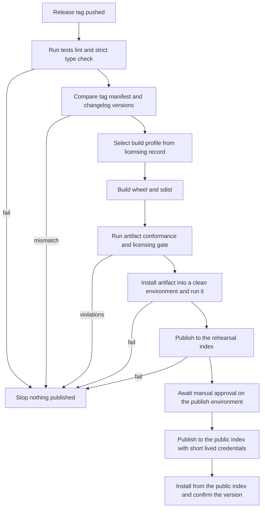
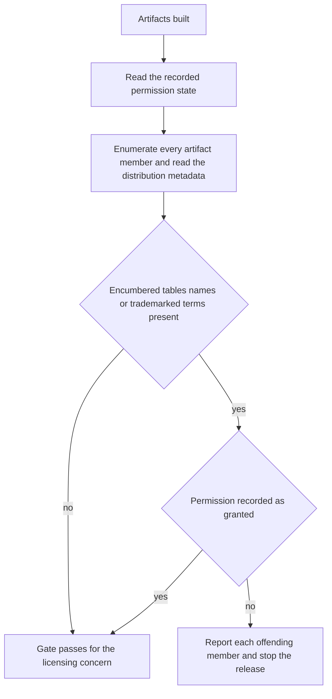
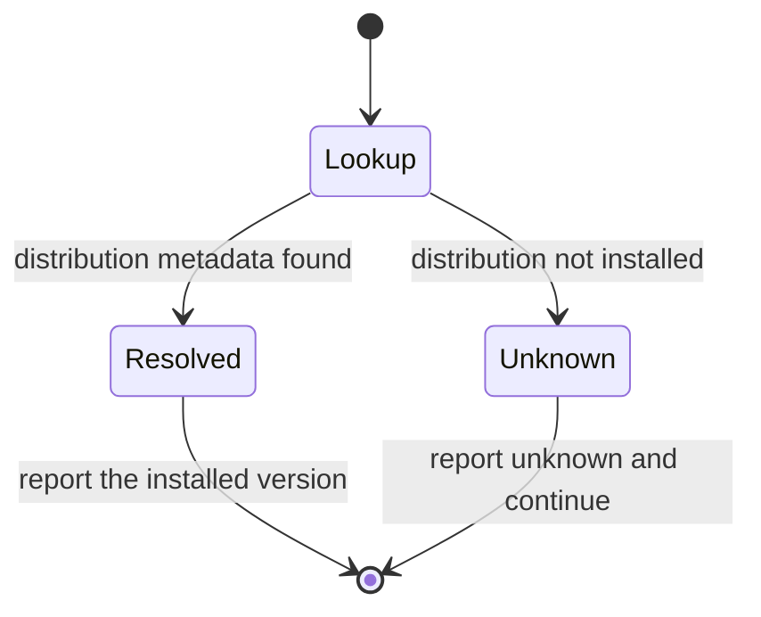
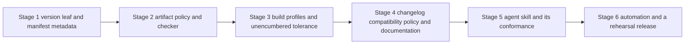

# Technical Design: distribution

## Overview

**Purpose**: distribution turns a working local tool into a released product. It adds no product behavior: it adds the package metadata that makes `fitdocs` installable from the public index, one place the released version is declared and consistently reported, a written compatibility policy over the three contracts the Phase 3 siblings just published, a changelog, a gated release procedure that is code rather than memory, user documentation covering install/upgrade/uninstall for standalone and wiki-hosted data roots, and an agent skill that gives an LLM-managed wiki a turnkey inbox workflow.

**Users**: anyone who wants to run fitdocs without cloning it; existing users deciding whether an upgrade is safe; plugin authors who need a version range to depend on; LLM wiki maintainers adopting fitdocs as an input path; and the maintainer, who needs a release procedure whose gates cannot be skipped by inattention.

**Impact**: `pyproject.toml` gains complete metadata and, for the first time, explicit artifact-content control. Three unguarded `importlib.metadata.version("fitdocs")` call sites converge on one leaf that degrades to *unknown* instead of raising. The built-in calculator registration becomes tolerant of a package built without a bundled methodology — including its export list, so a star-import of `fitdocs.load` keeps working in an unencumbered wheel — which makes "released with no methodology" a supported, tested configuration rather than a crash. Two project scripts — a build driver and an artifact-conformance checker — become the executable form of the release gates, invoked identically by a maintainer and by the tag-triggered workflow. Nothing in `sync`, `regen`, `load`, `check`, or `plugins` changes behavior, and generated documents are byte-identical.

### Goals

- One command installs a working `fitdocs` from the public index, with artifacts whose contents are declared rather than inherited from build-backend defaults.
- One version declaration, reported identically by the CLI, the tile user-agent, and the built-in calculator listing, and provably equal to the changelog entry and the release tag.
- A compatibility policy that names the three public contracts as the thing version numbers govern, and a changelog that reports against it.
- A release procedure whose every gate is executable, testable, and identical by hand and in automation — including a licensing gate that inspects built artifacts and refuses to publish encumbered material.
- Documentation that carries a reader from install to a generated document, states exactly what upgrade and uninstall touch, and packages the wiki-integration path as an agent skill locked to the release.

### Non-Goals

- Resolving the methodology's licensing question, negotiating permission, or replacing the methodology. This design consumes a recorded answer; it does not produce one.
- Changing the content or semantics of the three public contracts, or of any command the siblings define.
- Plugin-marketplace packaging of the agent skill for a specific agent client — the standard defines no install location and the plugin-root-to-skills mapping could not be verified; distribution is by documented copy from a path the tool prints.
- Any self-update or auto-update mechanism; a hosted service; an MCP server; an editor plugin; a documentation site generator.
- Publishing third-party calculator distributions, or hosting an index of them.
- Multi-Python-version or multi-platform test matrices beyond the single supported floor the project already declares.

## Boundary Commitments

### This Spec Owns

- **Package identity and artifact contents**: all `[project]` metadata, the license file, the build targets, the sdist allowlist and the wheel contents, and the declared required/forbidden member sets that make "what is in the artifact" a reviewable decision rather than a build-backend default.
- **Version identity**: the single version declaration, the one leaf that resolves it at runtime, its *unknown* degradation, and the equality of the reported version with the changelog entry and the release tag.
- **The compatibility policy**: which contracts version numbering governs, what breaking / additive / internal mean for each, the pre-1.0 and post-1.0 rules, the deprecation window, and the statement that everything undocumented is internal.
- **The changelog**: its format, its obligations, and the release-time gate that its newest entry matches the version being released.
- **The release procedure**: its ordered steps, its quality gates, its artifact verification in a clean environment, its tagging, its rehearsal target, its credential posture, its post-publication check, and the project automation that runs the same gates.
- **The licensing release gate**: the recorded permission state, the artifact inspection that enforces it, the unencumbered build profile, and the tolerance of a package with no bundled methodology.
- **User-facing documentation structure**: the entry point, install, configuration, inbox, upgrade, uninstall, wiki-integration, compatibility, releasing, and contribution documents, plus the README rewrite — including preserving every behavior statement the project and its siblings publish at the time of the rewrite. The rewrite **relocates or keeps** the sections wiki-contract, inbox, and plugin-api publish in the README; it never drops them (10.7).
- **The project-wide statements that need one home**: what is public versus internal (by reference to plugin-api's enumeration, which is the authority), the governance of the user-facing settings schema including `[tiles]`, and the rule deciding which commands require a resolved data root. All three live in `docs/compatibility.md` (3.8, 3.9, 3.10).
- **The agent skill**: its packaged location, its frontmatter contract, its body's scope, its version locking, the read-only command that reports its installed path, and the conformance test binding it to the CLI's real command surface.

### Out of Boundary

- The **document/ownership contract**, the emitted in-tree declaration, the document-format version and its migration-by-regeneration story, and the `check` command — wiki-contract owns them. This design cites them and changes none.
- The **inbox interface**: the `[inbox]` settings table, the drain, the stability and quarantine safeguards, the disposition policy — inbox owns them. This design documents them (relocating inbox's README section into `docs/inbox.md`, wording intact) and drives the agent skill from them.
- The **settings file's plumbing**: the settings-file constant, the data-root-relative path resolver, the shared parse-once loader, and its single file-level error — the pre-wave settings foundation owns them, and each `[table]` reader stays with its owning feature. This design governs the resulting *schema* in the compatibility policy (3.8) and classifies the loader and the layout module as internal (3.9); it changes neither.
- **Plugin discovery mechanics**: the entry-point group, the local-plugin channel, the `[plugins]` table, the `plugins` command, the `py.typed` marker, the documented public import surface, and the plugin-author guide — plugin-api owns them. This design verifies the marker reaches the artifact and carries plugin-api's compatibility statement into one project-wide policy; it does not restate the authoring instructions.
- The **calculator-authoring guide** (`docs/contributing-calculators.md`) — training-load owns it.
- The **methodology itself**: its formulas, tables, zone model, and correctness. This design may prune it from a build and must not modify its computation.
- Any **new product capability**: no new pipeline stage, renderer, metric, or engine behavior. The one command this design adds prints a path and writes nothing.
- The **route-maps tile behavior** and its network carve-out — documented, not changed.

### Allowed Dependencies

- `version.py` is a pure leaf: `importlib.metadata` and typing only. It imports nothing from `fitdocs`.
- `agentskill.py` depends on `importlib.resources` only.
- `cli → {version, agentskill}` plus its existing dependencies; `tiles → version`; `plugins → version`. Nothing imports `cli`.
- `load/__init__.py` may import its bundled methodology package only through a guarded import; no other module may import `fitdocs.load.withdrawn` directly.
- The release scripts live outside the package, import nothing from `fitdocs`, and use only the standard library (`zipfile`, `tarfile`, `tomllib`, `subprocess`, `shutil`, `pathlib`, `email`). They are invoked as scripts, never imported by the package.
- The workflows depend on `uv`, the project's own scripts, and the standard publishing action. No project code runs at build time beyond the build backend.
- Direction, violations are errors: `{version, agentskill} → {cli, tiles, plugins}`; `scripts → artifacts` (never `scripts → src`); `workflows → scripts`.
- **No new runtime dependency at any layer** (10.1). No new development dependency beyond what `uv` and the build backend already provide.

### Revalidation Triggers

- Changing the artifact required/forbidden sets, the sdist allowlist, or the wheel contents → the conformance checker, its policy file, and the packaging tests all change together; plugin authors relying on shipped type information must be re-checked.
- Changing the version declaration's location or the runtime resolution rule → the CLI, the tile user-agent, and the plugin listing's built-in version all change; the equality tests must be re-derived.
- Changing the compatibility policy's contract list, its breaking-change definition, or its deprecation window → the changelog's obligations, the contribution documentation, and plugin-api's published plugin-surface statement must be reconciled.
- Changing the recorded methodology permission state, or the prune list for the unencumbered profile → both build profiles must be rebuilt and re-verified, and the changelog must record the resulting contract change.
- Changing the CLI's registered command surface (any sibling adding or removing a command), or the drain report's channel set (any sibling adding, renaming, or removing a reported channel) → the agent skill's body and its conformance test must be re-checked.
- Adding a settings table, or a key to one → the compatibility policy's settings-schema section and the documentation that publishes the key must be updated in the same change (3.8).
- Changing plugin-api's enumerated public import surface → the compatibility policy's public-versus-internal statement points at it and must be re-read; `tests/test_public_api.py` stays plugin-api's to change.
- Changing the release workflow's trigger, environments, or publishing action → the credential posture and the rehearsal path must be re-validated against the index's current requirements.

## Architecture

### Existing Architecture Analysis

- **`pyproject.toml` is minimal but sound**: hatchling, src-layout, `version = "0.1.0"` static, five runtime dependencies, one console script, `packages = ["src/fitdocs"]`. It declares no `authors`, `keywords`, `classifiers`, `[project.urls]`, `license-files`, or sdist target — so the sdist today would inherit hatchling's defaults and carry `tests/`, `.kiro/`, `uv.lock`, and `docs/reference/`.
- **Version reporting already half-exists.** `cli.py` registers an eager `--version` callback on `@app.callback()`; `importlib.metadata.version("fitdocs")` is called at `cli.py:57,94` and at `tiles.py:54,242` for the tile user-agent. None of the three call sites guards `PackageNotFoundError`, so `--version` raises from an uninstalled source tree. plugin-api adds a fourth consumer (the built-in calculator's reported version).
- **Packaging tests already exist and are the right shape.** `tests/test_packaging.py` performs an offline `uv tool install` into a temporary `UV_TOOL_DIR`/`UV_TOOL_BIN_DIR`, runs the installed console script, and compares `--version` against the `pyproject.toml` value. `tests/load/test_packaging.py` builds a wheel and asserts both methodology CSVs are present with their licensing header; `tests/load/test_install_smoke.py` installs a wheel into a venv and asserts the tables load from the installed location. This design extends that established pattern rather than inventing one.
- **The encumbered material is committed and packaged by design.** `.gitignore` carries a deliberate re-include for `src/fitdocs/load/withdrawn/data/*.csv`; the same two tables plus the extracted methodology also sit under `docs/reference/`. The branded terms reach user-visible strings (`_DISPLAY_NAME = "Withdrawn Methodology"`, the `Unsupported` reason text, a prompt label) and the rendered document body, and the CLI's `--calculator` help text names `'withdrawn'` as its example.
- **The CLI is a thin typer shell** with three commands today and two more arriving from siblings (`check`, `plugins`), a fixed 0/1/2 exit-code contract, and an established `_config_error` path for anything the user can fix. A read-only command that prints a path fits that shell without disturbing it.
- **`src/fitdocs/__init__.py`** re-exports 19 names lazily under PEP 562 and is guarded by `tests/test_public_api.py`; `tests/test_determinism.py` already asserts no writes and no network with patched `open`/`socket`. Both are the natural homes for this feature's preserved-guarantee assertions.
- **Nothing exists for release**: no `.github/`, no `LICENSE` file despite the declared MIT terms, no `CHANGELOG.md`, no `CONTRIBUTING.md`, no git tags, no CI.

### Architecture Pattern & Boundary Map

Selected pattern: **declared artifact, executable gates**. Package contents are declared (an allowlist in the manifest plus a policy file the checker reads) instead of inherited; every release gate is a script the test suite exercises, so the maintainer path and the automation path run the same code. The package itself gains only two pure leaves and one read-only command.

```mermaid
graph TB
    subgraph Automation
        CiWorkflow[CiWorkflow ci yml]
        ReleaseWorkflow[ReleaseWorkflow release yml]
    end
    subgraph ReleaseTooling
        ReleaseBuilder[ReleaseBuilder build_release py]
        ArtifactChecker[ArtifactChecker check_artifacts py]
    end
    subgraph PolicyData
        LicensingRecord[LicensingRecord licensing toml]
        ArtifactPolicy[ArtifactPolicy artifact-policy toml]
        Changelog[Changelog CHANGELOG md]
        PackageManifest[PackageManifest pyproject toml]
    end
    subgraph Package
        VersionSource[VersionSource version py]
        AgentSkillLocator[AgentSkillLocator agentskill py]
        AgentSkillPackage[AgentSkillPackage SKILL md]
        CliApp[CliApp cli py]
        TileStore[TileStore tiles py]
        PluginDiscovery[PluginDiscovery plugins py]
        BuiltInRegistration[BuiltInRegistration load init py]
    end
    subgraph Documentation
        DocsEntry[DocsEntry index md]
        CompatibilityPolicy[CompatibilityPolicy compatibility md]
        InstallDocs[InstallDocs install upgrading configuration]
        WikiIntegrationDocs[WikiIntegrationDocs wiki-integration md]
        ReleaseProcedure[ReleaseProcedure releasing md]
        ContributionDocs[ContributionDocs CONTRIBUTING md]
    end

    CiWorkflow --> ArtifactChecker
    ReleaseWorkflow --> ReleaseBuilder
    ReleaseWorkflow --> ArtifactChecker
    ReleaseBuilder --> LicensingRecord
    ReleaseBuilder --> PackageManifest
    ArtifactChecker --> ArtifactPolicy
    ArtifactChecker --> LicensingRecord
    ArtifactChecker --> Changelog
    ArtifactChecker --> PackageManifest
    CliApp --> VersionSource
    CliApp --> AgentSkillLocator
    TileStore --> VersionSource
    PluginDiscovery --> VersionSource
    AgentSkillLocator --> AgentSkillPackage
    BuiltInRegistration --> PackageManifest
    DocsEntry --> CompatibilityPolicy
    DocsEntry --> InstallDocs
    DocsEntry --> WikiIntegrationDocs
    DocsEntry --> ReleaseProcedure
    DocsEntry --> ContributionDocs
    ReleaseProcedure --> ReleaseBuilder
    ReleaseProcedure --> ArtifactChecker
```



**Architecture Integration**:

- **Domain boundaries**: policy is *data* (`licensing.toml`, `artifact-policy.toml`, the manifest, the changelog); enforcement is *scripts* that read that data and inspect artifacts; the package gains only version resolution, skill location, and a print-a-path command. No component co-owns a decision: the checker never decides whether permission was granted, it reads the record; the builder never decides what is forbidden, it prunes what the record names.
- **Existing patterns preserved**: absent data is `None` and never fabricated (an unresolvable version is *unknown*); frozen dataclasses with tuple fields; loud configuration failure before any effect; read-only diagnostic commands that write nothing; the offline-by-default posture with the tile carve-out untouched; the `uv tool install` into an isolated tool directory that `tests/test_packaging.py` already established.
- **New components rationale**: `version.py` exists because four modules need one answer and the current three copies each raise on an uninstalled tree. `agentskill.py` exists so the packaged skill has one resolution path shared by the command and its tests. The two scripts exist because the licensing gate must reason over *built artifacts*, which neither a manifest nor a workflow step can do in a testable way.
- **Steering compliance**: no new runtime dependency; `mypy --strict` over the two new package modules; nothing written outside the data root by any new code path (the skill command prints, it does not install); personal data cannot reach an artifact because the sdist is an allowlist and the checker fails on any undeclared member.

### Technology Stack

| Layer | Choice / Version | Role in Feature | Notes |
|-------|------------------|-----------------|-------|
| Build backend | `hatchling` (existing) | Builds wheel and sdist from declared targets | Explicit sdist allowlist replaces default inclusion; no build hooks, no code generation |
| Packaging front end | `uv` (existing dev tool) | `uv build`, `uv tool install` for clean-environment verification | Already the project's tool and already used by the packaging tests |
| Version resolution | stdlib `importlib.metadata` | Runtime version of the installed distribution | Guarded for `PackageNotFoundError`; called lazily, never at import time |
| Skill location | stdlib `importlib.resources` | Resolves the packaged skill directory in an installed tool | Same mechanism the methodology tables already use |
| Release scripts | stdlib `zipfile`, `tarfile`, `tomllib`, `email`, `subprocess`, `shutil` | Build profile selection; artifact member and metadata inspection | No new dependency; scripts import nothing from `fitdocs` |
| Automation | GitHub Actions | CI on push/PR; tag-triggered release | Publish job inline (Trusted Publishing is unavailable from reusable workflows) |
| Publication | `pypa/gh-action-pypi-publish` (pinned tag) | Uploads to TestPyPI then PyPI via OIDC | `permissions: id-token: write` scoped to the publish job; PEP 740 attestations are default-on since v1.11.0; no API token anywhere |
| Skill format | Agent Skills open standard | `SKILL.md` frontmatter + body | `name` must equal the directory name; `description` 1–1024 chars; version carried under `metadata` (the standard has no top-level `version` field) |
| Changelog format | Keep a Changelog 1.1.2 | Human-written release history | Six canonical sections; `## [X.Y.Z] - YYYY-MM-DD`; standing `## [Unreleased]` |

## File Structure Plan

### New Files

```
LICENSE                            # MIT text matching the declared metadata (1.8)
CHANGELOG.md                       # Keep a Changelog 1.1.2; Unreleased + releases (4.1-4.6)
CONTRIBUTING.md                    # Contributor path, changelog duty, public/internal,
                                   #   calculator-publisher guidance, encumbered-material rule (9.1-9.5)

release/
├── licensing.toml                 # The single recorded methodology-permission state,
│                                  #   the bundled methodology's identity, and the prune
│                                  #   list the unencumbered profile applies (6.3)
└── artifact-policy.toml           # Required members, forbidden member patterns,
                                   #   forbidden content markers, required metadata
                                   #   fields — the checker's declarative input (1.5, 1.6, 5.4)

scripts/
├── build_release.py               # Profile selection from the licensing record; builds
│                                  #   wheel + sdist (pruned copy for the unencumbered
│                                  #   profile); deterministic timestamps (1.4, 6.2, 10.2, 10.5)
└── check_artifacts.py             # Artifact conformance + licensing gate + version/changelog
                                   #   consistency; exit 0 clean / 1 violations (1.5-1.7, 2.6,
                                   #   4.7, 5.4, 6.1, 6.2, 6.7, 10.3)

.github/workflows/
├── ci.yml                         # Push/PR: tests, lint, strict types, artifact build +
│                                  #   conformance check (5.2)
└── release.yml                    # Tag-triggered: gates, build, check, clean-environment
                                   #   install, TestPyPI rehearsal, approval-gated PyPI
                                   #   publish, post-publish verification (5.5-5.10)

src/fitdocs/
├── version.py                     # Pure leaf: tool_version() -> str | None,
│                                  #   version_display() -> str, DIST_NAME (2.1-2.4)
├── agentskill.py                  # SKILL_NAME, skill_root() -> Path | None,
│                                  #   skill_file() -> Path | None (8.1, 8.6)
└── skills/
    └── fitdocs-workouts/
        └── SKILL.md               # The published agent skill: inbox workflow, outcome
                                   #   interpretation, ownership boundary (8.1-8.5, 8.8)

docs/
├── index.md                       # The single documentation entry point (7.9)
├── install.md                     # Install, data root, first run, standalone vs wiki (7.1, 7.2)
├── configuration.md               # Settings file, data-root contract, offline/network
│                                  #   behavior, tile opt-out, attribution (7.7, 7.8, 10.6)
├── inbox.md                       # The inbox interface as a user-facing document:
│                                  #   relocated from inbox's README section — keys and
│                                  #   defaults, drain semantics, safeguards, the
│                                  #   never-delete guarantee, and the no-watching /
│                                  #   no-scheduling statement (7.9, 10.6, 10.7)
├── upgrading.md                   # Upgrade and uninstall commands, what is untouched,
│                                  #   the regeneration step, what persists (7.3-7.6)
├── wiki-integration.md            # Agent-skill install/verify/update + the end-to-end
│                                  #   adoption recipe for an agent-managed wiki (8.6, 8.7)
├── compatibility.md               # The compatibility policy over the governed contracts,
│                                  #   the settings schema including [tiles], the one
│                                  #   public-versus-internal statement, and the data-root
│                                  #   posture rule (3.1-3.10)
└── releasing.md                   # The ordered release procedure and its gates (5.1, 5.3, 5.6, 5.9, 6.5)

tests/
├── test_version_identity.py       # One declaration; unknown fallback; equality across
│                                  #   manifest, changelog, tag, installed tool (2.1-2.6)
├── test_release_artifacts.py      # Both build profiles built and checked; required and
│                                  #   forbidden members; encumbered-marker scan; metadata
│                                  #   completeness; reproducibility (1.3-1.6, 5.4, 6.1,
│                                  #   6.2, 6.7, 10.3, 10.5)
├── test_unencumbered_install.py   # Install the unencumbered wheel into a clean
│                                  #   environment; commands run; no calculator available;
│                                  #   exit codes unchanged (6.4)
├── test_agent_skill.py            # Frontmatter conformance; name equals directory;
│                                  #   version matches release; every named command and
│                                  #   option exists in the CLI surface (8.1, 8.5, 8.8)
└── test_docs_guarantees.py        # New, or extended if inbox already created it.
                                   #   Entry point links resolve (install, configuration,
                                   #   inbox, upgrading, wiki integration, ownership
                                   #   contract, plugin platform, compatibility,
                                   #   releasing, contributing); preserved behavior
                                   #   statements still published, including the sibling
                                   #   features' (7.9, 10.6, 10.7)
```

**Amendment 1 (2026-09-16, landed by build-training-block)**: `skills/`
gains a sibling directory, `build-training-block/`, holding that spec's own
`SKILL.md` and `example-block.toml`; `tests/test_agent_skill.py` above is not
a new file for that spec — it exists, generalized over `PACKAGED_SKILLS`,
and that spec's task 4.2 extends its per-skill map.

### Modified Files

- `pyproject.toml` — complete `[project]` metadata (`authors`, `keywords`, `classifiers`, `license-files`, `[project.urls]` for source, documentation, changelog, issues); explicit `[tool.hatch.build.targets.sdist]` allowlist; wheel target unchanged in intent but stated explicitly. Version stays static and stays the single declaration. `[project.urls]` must additionally resolve every documentation page a *shipped or emitted* artifact points at — the ownership contract, the plugin platform, the inbox, and the configuration document — because the sdist excludes `docs/` and wiki-contract's emitted `AGENTS.md` lands in a tree that has no repository (1.9).
- `src/fitdocs/cli.py` — `--version` and any other version output read `version.version_display()`; a new read-only `skill` command printing the packaged skill's path and the copy recipe; the `--calculator` help example replaced with a methodology-neutral one so an unencumbered artifact carries no branding; docstring amended for the new command.
- `src/fitdocs/tiles.py` — the tile user-agent composes from `version.version_display()` instead of calling `importlib.metadata` directly, so an uninstalled tree still produces a valid identification string.
- `src/fitdocs/plugins.py` — the built-in calculator's reported version comes from `version.tool_version()`; an unknown version stays `None` rather than becoming a fabricated string (plugin-api Req 4.3 already forbids fabrication).
- `src/fitdocs/load/__init__.py` — the bundled methodology is registered through a guarded import; its absence leaves the registry empty and is not an error. The methodology's calculator name is *conditionally exported* and is removed from `__all__` when the methodology package is absent, so a star-import and every documented public name keep working in an unencumbered build (6.8).
- `README.md` — rewritten: what fitdocs is, install, a minimal first run, and links into `docs/index.md`. The rewrite is a **reorganization, not a replacement** (10.7): the route-maps privacy, opt-out, and attribution statements move to `docs/configuration.md` intact; wiki-contract's ownership section, inbox's inbox section, and plugin-api's plugins section are each either kept in place or relocated verbatim into `docs/ownership-contract.md`, `docs/inbox.md`, and `docs/plugins.md` with the README linking to them. Dropping any of those statements is a defect the preserved-guarantee test catches (10.6).
- `tests/test_packaging.py` — extended with the metadata completeness assertions and the no-side-effect assertion (installing creates no data root).
- `tests/test_cli.py` — the `skill` command's output and exit code; `--version` reporting *unknown* rather than raising when the distribution is not installed.
- `tests/test_determinism.py` — the existing offline guard extended to assert this feature introduced no new runtime network access (10.4).
- `tests/test_public_api.py` — **not** extended with new names. plugin-api's enumeration is the authoritative public surface; this feature only asserts, in `tests/test_unencumbered_install.py`, that the enumerated `fitdocs.load` names and `from fitdocs.load import *` both still work when the methodology package is absent (6.8), and that the two new package modules are absent from the documented surface (they are internal by the policy's own rule).
- `docs/plugins.md` — plugin-api writes this page and owns its content; this feature replaces its
  self-contained version-policy paragraph with a pointer to `docs/compatibility.md`, so the project
  has exactly one compatibility statement rather than two that can drift (3.7). No other content changes.
- `.gitignore` — ignore `dist/` build output (already covered) and the release scripts' temporary build trees.

## System Flows

### Release pipeline



Flow decisions worth stating: (a) every gate that can fail runs **before** the rehearsal publish, so a failure never spends a version number (5.8); (b) the version equality check happens before the build, because a mismatched tag is the cheapest failure to detect (2.6, 4.7); (c) the clean-environment install exercises the *artifact*, never the working tree, so a file missing from the wheel fails here rather than for the first user (5.3); (d) the public publish is guarded by an environment approval, which is also what makes a hand-run publish cross a recorded gate (5.7); (e) the post-publication install is the only step that runs after the version is spent, and its failure is a defect report, not a rollback — a released version is never altered (2.5).

### Licensing gate decision



The gate is deliberately artifact-side (6.7): the encumbered material reaches a distribution by two different mechanisms — package data inside the wheel and the build backend's default inclusion in the sdist — and only the built archive shows what actually happened. The check covers archive members *and* the distribution metadata, because the long description is the README rendered into `METADATA` and would otherwise carry branded text past a member-name-only scan.

### Version resolution



The lookup is performed lazily at the point of use, never at import time, because reading distribution metadata is measurably slow for a CLI's startup. *Unknown* is a first-class outcome, not an error: a developer running from a source checkout gets a working tool that declines to invent a version (2.4).

## Requirements Traceability

| Requirement | Summary | Components | Interfaces | Flows |
|-------------|---------|------------|------------|-------|
| 1.1 | Published under a stable name, standard installers | PackageManifest, ReleaseWorkflow | `[project] name`, publish job | Release pipeline |
| 1.2 | Console entry point; documented commands run | PackageManifest, InstalledToolVerification | `[project.scripts]`, clean-environment install | Release pipeline |
| 1.3 | Complete declared metadata | PackageManifest, ArtifactChecker | `[project]`, `required_metadata` | — |
| 1.4 | Both sdist and wheel each release | ReleaseBuilder | `build()` | Release pipeline |
| 1.5 | Artifacts contain every runtime file | ArtifactPolicy, ArtifactChecker | `required_members` | Licensing gate |
| 1.6 | Artifacts contain no development-only material | PackageManifest, ArtifactPolicy, ArtifactChecker | sdist allowlist, `forbidden_members` | Licensing gate |
| 1.7 | Install creates nothing on the user's machine | InstalledToolVerification | packaging test assertion | — |
| 1.8 | License file matches declared license | LicenseFile, PackageManifest, ArtifactChecker | `license-files`, `required_members` | — |
| 1.9 | Shipped and emitted doc references use project URLs | PackageManifest, DocsGuaranteeTest | `[project.urls]`, URL-form assertion | — |
| 2.1 | One version declaration | PackageManifest, VersionSource | `[project] version`, `DIST_NAME` | Version resolution |
| 2.2 | Installed tool reports the installed version | VersionSource, CliApp | `tool_version`, `--version` | Version resolution |
| 2.3 | Same version everywhere it appears | VersionSource, CliApp, TileStore, PluginDiscovery | `version_display`, `tool_version` | Version resolution |
| 2.4 | Unknown rather than fabricated; keeps working | VersionSource | `tool_version` returns `None` | Version resolution |
| 2.5 | Publish a version exactly once | ReleaseProcedure, ReleaseWorkflow | no skip-existing on the public index | Release pipeline |
| 2.6 | Version matches changelog and tag | ArtifactChecker, ReleaseWorkflow | `check_version_consistency` | Release pipeline |
| 3.1 | Policy names the three public contracts | CompatibilityPolicy | `docs/compatibility.md` | — |
| 3.2 | Breaking / additive / internal per contract | CompatibilityPolicy | `docs/compatibility.md` | — |
| 3.3 | Pre-1.0 and post-1.0 numbering rules | CompatibilityPolicy | `docs/compatibility.md` | — |
| 3.4 | Format, contract, and settings versions map to releases | CompatibilityPolicy | `docs/compatibility.md` | — |
| 3.5 | Compatible upgrade needs no user edit | CompatibilityPolicy, UpgradeDocs | `docs/compatibility.md`, `docs/upgrading.md` | — |
| 3.6 | Deprecation announcement and notice window | CompatibilityPolicy | `docs/compatibility.md` | — |
| 3.7 | One policy, referenced from readme and elsewhere | CompatibilityPolicy, DocsEntry, ContributionDocs | link structure | — |
| 3.8 | Settings schema, including `[tiles]`, is governed | CompatibilityPolicy | `docs/compatibility.md` | — |
| 3.9 | One public-versus-internal statement | CompatibilityPolicy, ContributionDocs | `docs/compatibility.md` | — |
| 3.10 | Data-root posture rule stated once | CompatibilityPolicy, CliApp | `docs/compatibility.md`, `cli.py` docstring | — |
| 4.1 | Every release recorded with date, newest first | Changelog | `CHANGELOG.md` | — |
| 4.2 | Grouped by change kind | Changelog | Keep a Changelog sections | — |
| 4.3 | Contract changes named with required action | Changelog, CompatibilityPolicy | `CHANGELOG.md` | — |
| 4.4 | Standing unreleased section | Changelog, ContributionDocs | `## [Unreleased]` | — |
| 4.5 | Written for users, not commit-derived | Changelog, ContributionDocs | `CONTRIBUTING.md` | — |
| 4.6 | Shipped or reachable from the artifact | PackageManifest, ArtifactPolicy | `[project.urls]`, `required_members` | — |
| 4.7 | Missing or stale entry blocks the release | ArtifactChecker | `check_version_consistency` | Release pipeline |
| 5.1 | Documented end-to-end procedure | ReleaseProcedure | `docs/releasing.md` | Release pipeline |
| 5.2 | Tests, lint, strict types before publication | CiWorkflow, ReleaseWorkflow | gate jobs | Release pipeline |
| 5.3 | Verify by installing the artifact in a clean environment | ReleaseWorkflow, InstalledToolVerification | install-and-run job | Release pipeline |
| 5.4 | Artifacts contain exactly what is required | ArtifactChecker, ArtifactPolicy | `check()` | Licensing gate |
| 5.5 | Version tag records the released revision | ReleaseWorkflow, ReleaseProcedure | tag trigger | Release pipeline |
| 5.6 | Rehearsal path not touching the public index | ReleaseWorkflow | rehearsal publish job | Release pipeline |
| 5.7 | Short-lived per-release credentials | ReleaseWorkflow | OIDC publish, `id-token: write` | Release pipeline |
| 5.8 | Any gate failure stops before publication | ReleaseWorkflow | job dependency chain | Release pipeline |
| 5.9 | Post-publication install and version check | ReleaseWorkflow, ReleaseProcedure | verification job | Release pipeline |
| 5.10 | Automation runs the same gates as a maintainer | ReleaseWorkflow, ReleaseBuilder, ArtifactChecker | shared scripts | Release pipeline |
| 6.1 | No encumbered artifact without recorded permission | LicensingRecord, ArtifactChecker | `permission`, marker scan | Licensing gate |
| 6.2 | Gate inspects artifacts and stops the release | ArtifactChecker, ReleaseWorkflow | `check()` exit status | Licensing gate |
| 6.3 | Permission recorded in one place | LicensingRecord | `release/licensing.toml` | Licensing gate |
| 6.4 | Unbundled build stays functional and honest | BuiltInRegistration, UnencumberedInstallTest | guarded import | — |
| 6.5 | Documented route to obtain a methodology | InstallDocs, WikiIntegrationDocs | `docs/install.md` | — |
| 6.6 | Bundling change is a contract change in the changelog | Changelog, CompatibilityPolicy | `CHANGELOG.md` | — |
| 6.7 | Gate reads artifacts, not the source tree | ArtifactChecker | archive member and metadata scan | Licensing gate |
| 6.8 | Calculator name conditionally exported; star-import intact | BuiltInRegistration, UnencumberedInstallTest | guarded `__all__` | — |
| 7.1 | First-run path from install to a document | InstallDocs | `docs/install.md` | — |
| 7.2 | Standalone and wiki-hosted data roots | InstallDocs | `docs/install.md` | — |
| 7.3 | Exact upgrade and uninstall commands | UpgradeDocs | `docs/upgrading.md` | — |
| 7.4 | What an upgrade does not touch | UpgradeDocs | `docs/upgrading.md` | — |
| 7.5 | The one command that brings documents current | UpgradeDocs | `docs/upgrading.md` | — |
| 7.6 | What persists after uninstall | UpgradeDocs | `docs/upgrading.md` | — |
| 7.7 | Data-root contract kept prominent | ConfigurationDocs, DocsGuaranteeTest | `docs/configuration.md` | — |
| 7.8 | Offline behavior and network switch-off | ConfigurationDocs, DocsGuaranteeTest | `docs/configuration.md` | — |
| 7.9 | One documentation entry point, inbox included | DocsEntry, InboxDocs, DocsGuaranteeTest | `docs/index.md`, `docs/inbox.md` | — |
| 8.1 | Published agent skill for the inbox workflow | AgentSkillPackage | `SKILL.md` | — |
| 8.2 | When it applies, commands, every channel, exceptions | AgentSkillPackage | `SKILL.md` body | — |
| 8.3 | Ownership boundary pointing at the declaration | AgentSkillPackage | `SKILL.md` body | — |
| 8.4 | Refers rather than restates | AgentSkillPackage | `SKILL.md` body | — |
| 8.5 | Usable as plain markdown | AgentSkillPackage, AgentSkillTest | frontmatter + body | — |
| 8.6 | Where to install, verify, and update the skill | WikiIntegrationDocs, AgentSkillLocator, CliApp | `skill` command | — |
| 8.7 | End-to-end wiki adoption recipe | WikiIntegrationDocs | `docs/wiki-integration.md` | — |
| 8.8 | Released with the tool; named commands and channels exist | AgentSkillPackage, AgentSkillTest | `metadata.version`, CLI surface check, channel-name check | — |
| 9.1 | Contributor path and quality gates | ContributionDocs | `CONTRIBUTING.md` | — |
| 9.2 | Changelog duty and policy application | ContributionDocs | `CONTRIBUTING.md` | — |
| 9.3 | Public versus internal, by reference | ContributionDocs, CompatibilityPolicy | `CONTRIBUTING.md` | — |
| 9.4 | Guidance for calculator publishers | ContributionDocs | `CONTRIBUTING.md` | — |
| 9.5 | Encumbered material must not be added | ContributionDocs, LicensingRecord | `CONTRIBUTING.md` | — |
| 10.1 | No new runtime dependency | Technology Stack, PackageManifest | dependency list unchanged | — |
| 10.2 | Artifact behaves as the tested revision | ReleaseBuilder | no build hooks, no codegen | Release pipeline |
| 10.3 | No personal data in any artifact | ArtifactPolicy, ArtifactChecker | sdist allowlist, undeclared-member rule | Licensing gate |
| 10.4 | No new runtime network access | DeterminismGuard | existing offline test extended | — |
| 10.5 | Same revision builds to identical contents | ReleaseBuilder, ReleaseArtifactTest | deterministic timestamps | Release pipeline |
| 10.6 | Documentation reorganization loses nothing, siblings included | DocsGuaranteeTest, ConfigurationDocs, InboxDocs | statement assertions | — |
| 10.7 | README rewrite preserves sibling-published sections | DocsGuaranteeTest, InboxDocs | relocation + link assertions | — |

## Components and Interfaces

| Component | Domain/Layer | Intent | Req Coverage | Key Dependencies (P0/P1) | Contracts |
|-----------|--------------|--------|--------------|--------------------------|-----------|
| PackageManifest | packaging | Declare identity, dependencies, and artifact contents | 1.1–1.4, 1.6, 1.8, 1.9, 2.1, 4.6, 10.1 | hatchling (P0) | State |
| VersionSource | package (leaf) | One resolved version, or *unknown* | 2.1–2.4 | `importlib.metadata` (P0) | Service |
| AgentSkillLocator | package (leaf) | Resolve the packaged skill directory | 8.1, 8.6 | `importlib.resources` (P0) | Service |
| AgentSkillPackage | package data | The published agent skill | 8.1–8.5, 8.8 | AgentSkillLocator (P1) | State |
| CliApp additions | cli | Version display and the read-only `skill` command | 2.2, 2.3, 8.6 | VersionSource (P0), AgentSkillLocator (P0) | Service |
| BuiltInRegistration | load | Tolerate a package built without a methodology | 6.4, 6.8 | — | Service |
| LicensingRecord | policy data | The single recorded permission state and prune list | 6.1, 6.3, 6.4, 9.5 | — | State |
| ArtifactPolicy | policy data | Required, forbidden, and marker declarations | 1.5, 1.6, 5.4, 10.3 | — | State |
| ReleaseBuilder | release tooling | Profile selection and deterministic builds | 1.4, 6.2, 10.2, 10.5 | LicensingRecord (P0), hatchling (P0) | Batch |
| ArtifactChecker | release tooling | Conformance, licensing, and version consistency gates | 1.3, 1.5–1.8, 2.6, 4.7, 5.4, 6.1, 6.2, 6.7, 10.3 | ArtifactPolicy (P0), LicensingRecord (P0), Changelog (P0) | Batch |
| CiWorkflow | automation | Quality gates on every change | 5.2 | ReleaseBuilder (P1), ArtifactChecker (P1) | Batch |
| ReleaseWorkflow | automation | Tag-triggered gated publication | 2.5, 5.2, 5.3, 5.5–5.10 | ReleaseBuilder (P0), ArtifactChecker (P0), publishing action (P0) | Batch |
| Changelog | documentation | Per-release account against the policy | 4.1–4.6, 6.6 | CompatibilityPolicy (P1) | State |
| CompatibilityPolicy | documentation | What version numbering promises; what is public; who needs a data root | 3.1–3.10, 6.6 | — | — |
| InstallDocs / ConfigurationDocs / UpgradeDocs | documentation | Install, configure, upgrade, uninstall | 6.5, 7.1–7.8, 10.6 | — | — |
| InboxDocs | documentation | The inbox interface as a linked, user-facing document | 7.9, 10.6, 10.7 | inbox spec's published section (P1) | — |
| WikiIntegrationDocs | documentation | Skill installation and the adoption recipe | 8.6, 8.7 | AgentSkillPackage (P1) | — |
| ReleaseProcedure | documentation | The ordered, gated procedure | 5.1, 5.3, 5.5, 5.6, 5.9, 5.10 | ReleaseBuilder (P0), ArtifactChecker (P0) | — |
| ContributionDocs | documentation | Contributor and calculator-publisher expectations | 9.1–9.5 | CompatibilityPolicy (P1) | — |
| DocsEntry | documentation | The single entry point | 7.9, 3.7 | — | — |

### Package (leaves)

#### VersionSource (`src/fitdocs/version.py`)

| Field | Detail |
|-------|--------|
| Intent | The one place the running tool learns which release it is |
| Requirements | 2.1, 2.2, 2.3, 2.4 |

**Responsibilities & Constraints**

- Resolves the installed distribution's version through the standard metadata mechanism and returns it, or `None` when the distribution is not installed. It never raises and never fabricates (2.4), matching the project's absent-data rule.
- Provides one display form for surfaces that must render *something* — the version, or a fixed `unknown` token. The token is a constant, so it cannot vary between runs.
- Performs the lookup lazily at the point of use. The module holds no import-time work and no cached module-level state beyond the distribution name, because metadata reads are slow enough to matter for CLI startup.
- Imports nothing from `fitdocs`. It is the leaf every version consumer depends on, so it may not acquire a package dependency without inverting the direction.

**Dependencies**

- Inbound: CliApp, TileStore, PluginDiscovery (P0).
- External: `importlib.metadata` (P0).

**Contracts**: Service [x]

##### Service Interface

```python
DIST_NAME: Final[str] = "fitdocs"
UNKNOWN_VERSION: Final[str] = "unknown"

def tool_version() -> str | None:
    """The installed distribution's version, or None when not installed."""

def version_display() -> str:
    """tool_version(), or UNKNOWN_VERSION — never raises, never empty."""
```

- Preconditions: none.
- Postconditions: `tool_version` returns a non-empty string or `None`; `version_display` returns a non-empty string; neither writes, prompts, or performs network access.
- Invariants: for one installed distribution both functions agree; `version_display()` equals `tool_version()` whenever the latter is not `None`.

**Implementation Notes**

- Integration: `cli.py`'s eager `--version` callback, `tiles.py`'s user-agent composition, and `plugins.py`'s built-in origin version all read from here. `plugins.py` uses `tool_version()` directly so an unknown version stays `None` in the listing rather than becoming a fabricated string, which plugin-api Req 4.3 forbids.
- Validation: unit tests for the resolved and unresolved paths with the metadata lookup patched; an installed-tool test asserting the reported version equals the manifest's; a source-tree test asserting `--version` prints the unknown token and exits 0 instead of raising.
- Risks: a second version declaration creeping in (a `__version__` attribute, a hardcoded string in a docstring) — mitigated by a repository scan that fails on any occurrence of the released version literal outside the manifest and the two places checked against it for equality: the changelog's newest released entry and the agent skill's recorded version.

**Amendment 1 (2026-09-16, landed by build-training-block)**: the permitted
copies of the released version are one `metadata.version` per
`PACKAGED_SKILLS` entry, not one fixed "the agent skill's recorded version" —
two packaged skills mean two recorded versions, and the repository scan
above allows exactly those alongside the changelog's newest entry.

#### AgentSkillLocator (`src/fitdocs/agentskill.py`)

| Field | Detail |
|-------|--------|
| Intent | Give the packaged skill one resolution path shared by the command and its tests |
| Requirements | 8.1, 8.6 |

**Responsibilities & Constraints**

- Resolves the packaged skill directory inside an installed distribution using the same resource mechanism the methodology tables already use, so it works from a wheel install, a source checkout, and a `uv tool` environment alike.
- Returns `None` when the skill data is absent rather than raising, so a packaging defect surfaces as an instructive command message instead of a traceback.
- Holds the skill's canonical name as a constant, because the Agent Skills standard requires the directory name and the frontmatter `name` to be equal — the constant is what the conformance test asserts both against.
- Reads nothing else and writes nothing.

**Dependencies**

- Inbound: CliApp (P0), AgentSkillTest (P1).
- External: `importlib.resources` (P0).

**Contracts**: Service [x]

```python
SKILL_NAME: Final[str] = "fitdocs-workouts"

def skill_root() -> Path | None:
    """The packaged skill directory, or None when it is not present."""

def skill_file() -> Path | None:
    """The packaged SKILL.md, or None when it is not present."""
```

- Postconditions: any returned path exists and is readable; nothing is created.
- Invariants: `skill_root()`'s final path component equals `SKILL_NAME`.

**Amendment 1 (2026-09-16, landed by build-training-block)**: `SKILL_NAME` is
retired in favour of a registry `PACKAGED_SKILLS: tuple[str, ...]` holding
this skill's name — renamed `INBOX_SKILL_NAME` (value `"fitdocs-workouts"`)
and appended by task 4.2 — alongside `build-training-block`'s own; the two
no-argument resolvers become
`skill_root(name)` and `skill_file(name)`, and a third resolver,
`skill_files(name)`, lists every regular file under a packaged skill's
directory. Resolution is otherwise unchanged: absent-by-default, nothing at
import time, nothing from `fitdocs` imported, nothing written.

#### AgentSkillPackage (`src/fitdocs/skills/fitdocs-workouts/SKILL.md`)

| Field | Detail |
|-------|--------|
| Intent | The turnkey inbox workflow an LLM wiki maintainer installs |
| Requirements | 8.1, 8.2, 8.3, 8.4, 8.5, 8.8 |

**Responsibilities & Constraints**

- Frontmatter conforms to the open standard's field contract: `name` equal to the directory name and to `SKILL_NAME`; a `description` within the published length limit that states both what the skill does and when to use it; `license`; a `compatibility` note naming the requirement that the `fitdocs` command be installed and on the agent's path; and the release version carried under `metadata`, because the standard defines no top-level version field (8.8).
- The body covers, in order: when this applies (new `.fit` files have arrived, or the wiki's workouts look stale); the commands to run and in what order; how to read **every** reported channel — written, skipped, failed, deferred, quarantined, moved, **move failures**, and warnings; what to do about each exceptional channel, including that a deferred file needs no action, a quarantined file needs the user rather than the agent, and a move failure means the file was processed successfully and will be retried on the next drain, so it is not a reason to reprocess anything; and the ownership boundary (8.2). The channel list is the drain report's own set — inbox reports `move_failures` as a row of its own, and an enumeration that omits it teaches an agent to misread a clean run as a partial one.
- The ownership section states the boundary and then **defers**: it names the in-tree ownership declaration as the authority and the published contract as the detail, and does not enumerate owned paths, region ids, or managed frontmatter keys (8.3, 8.4). This is what keeps the skill from drifting when wiki-contract's enumerations change.
- The body is ordinary markdown with no client-specific syntax, so a human or a non-supporting agent environment can follow it directly (8.5). No `allowed-tools` field, which the standard still flags experimental and which would not port.
- Body length stays inside the standard's recommended budget; anything longer belongs in the documentation the skill links to.

**Contracts**: State [x]

- State: a static file shipped as package data; it carries no runtime state and is never written by the tool.
- Invariants: every `fitdocs` command and option named in the body exists in the release's registered command surface, and every reported channel the body names is one the drain report actually carries (8.8); the `metadata` version equals the released version; the frontmatter parses as a mapping with the two required keys present and within their length limits.

**Implementation Notes**

- Integration: shipping the skill *inside the package* is what locks it to the release and makes it reachable from an index-only install; the `skill` command prints where it landed, and the documentation gives the copy and symlink recipes for the common agent clients.
- Validation: `tests/test_agent_skill.py` parses the frontmatter against the field constraints, asserts `name` equals both the directory name and `SKILL_NAME`, asserts the recorded version matches the manifest, and extracts every `fitdocs <command>` and `--option` occurrence from the body, asserting each exists in the typer application's registered surface. A second binding covers the **channels**: the set of channel names the body documents is compared against the drain report's own field set, so a channel added, renamed, or dropped by inbox fails this test rather than silently leaving the skill incomplete. Command binding alone would not catch it (8.8).
- Risks: the standard is versionless and evolving, so a future field could become required — mitigated by keeping the frontmatter to the documented required-plus-stable set and by the conformance test failing loudly rather than silently accepting an unknown shape.

**Amendment 1 (2026-09-16, landed by build-training-block)**: a second
packaged skill, `build-training-block`, ships alongside this one under the
same `skills/` location. The conformance test is `tests/test_agent_skill.py`,
generalized over `PACKAGED_SKILLS` with a per-skill map (heading tuple,
channel binding) rather than a single fixed body; task 4.2 adds this skill's
entry to that map when it lands — the frame is not re-written.

### CLI

#### CliApp additions (`src/fitdocs/cli.py`)

| Field | Detail |
|-------|--------|
| Intent | Report one version everywhere and tell the user where the skill is |
| Requirements | 2.2, 2.3, 8.6 |

**Responsibilities & Constraints**

- The existing eager `--version` callback prints `version_display()` and exits 0. From an uninstalled source tree it prints the unknown token rather than raising (2.4) — today it raises.
- A new `skill` command prints the packaged skill directory's absolute path plus a one-line recipe for copying it into an agent's skills directory, and exits 0. It resolves no data root, loads no profile, constructs no tile store, runs no engine, and **writes nothing** — the tool never installs into a location it does not own.
- If the skill data is absent from the installed package, the command reports that through the existing configuration-error path (an instructive message, exit 2), because it means the install is incomplete rather than that the user did something wrong.
- The `--calculator` help text's example is replaced with a methodology-neutral one, so an artifact built without a bundled methodology carries no branded string (6.1, 6.7).
- The module docstring's command list and exit-code contract are amended for the new command; the 0/1/2 contract itself is unchanged. The docstring also records the project-wide data-root posture rule in code — *commands that describe the installed tool need no data root; commands that describe or change a tree require one* (3.10) — with `skill` as an instance of the first half: it resolves nothing, so it cannot fail for want of a data root, which is exactly the posture `plugins` takes and the opposite of `check`'s.

**Contracts**: Service [x]

**Implementation Notes**

- Validation: CLI tests for `skill` printing an existing path and exiting 0, for the absent-skill path exiting 2 with an instructive message, and for `--version` on an uninstalled tree.
- Risks: command-surface churn across three concurrent Phase 3 specs — mitigated by the skill conformance test, which fails the moment the skill names a command that no longer exists.

**Amendment 1 (2026-09-16, landed by build-training-block)**: `skill` gains
one optional positional argument, `NAME`. No argument lists every registered
name and its directory (or absence); a registered name prints its directory
and a copy recipe; an unregistered name is the configuration-error path
(exit 2) listing the packaged names. The no-argument and absent-skill forms
above are the `NAME`-omitted case of this widened command, not a second one.

### Load

#### BuiltInRegistration (`src/fitdocs/load/__init__.py`)

| Field | Detail |
|-------|--------|
| Intent | Make "no bundled methodology" a supported configuration rather than an import error |
| Requirements | 6.4, 6.8 |

**Responsibilities & Constraints**

- Registers the bundled methodology through a guarded import: when the methodology package is absent from the installed distribution, the registry simply starts empty and the import succeeds. Absence is never an error and is never reported as a failure.
- The methodology's calculator name is **conditionally exported** (6.8). Today `load/__init__.py` imports `WithdrawnCalculator`, lists it in `__all__`, and registers it at import time; in an unencumbered wheel all three would fail. Under the guard the name is bound only when the import succeeded, and `__all__` is assembled so the name is present exactly when the object is. The consequences that must hold in the unencumbered profile: `from fitdocs.load import *` succeeds, every name in plugin-api's enumerated `fitdocs.load` surface imports, and `from fitdocs.load import WithdrawnCalculator` fails with an ordinary `ImportError` rather than a partially-initialized package. The bundled calculator is not part of the public surface (plugin-api Req 5.2 excludes it), so its absence from `__all__` is not a contract change — but *whether a methodology is bundled at all* is, and the changelog records it (6.6).
- Every other consequence is already handled by the existing design: the load engine's calculator selection finds no candidate, the document's load region carries the established not-computed placeholder, the run reports no load results, and the exit-code contract is unchanged.
- No other module may import the methodology package directly, so the guard is the single point of tolerance.
- When the methodology *is* present, registration order, selection, and computed results are bit-for-bit what they are today (plugin-api Req 7.4).

**Contracts**: Service [x]

**Implementation Notes**

- Integration: this is what makes the unencumbered build profile viable, and therefore what makes the licensing gate a release decision rather than a project blocker.
- Validation: `tests/test_unencumbered_install.py` builds the unencumbered wheel, installs it into a clean environment, and asserts the tool runs a full sync, reports that no calculator is available, writes documents whose load region carries the not-computed placeholder, and exits 0. The same test asserts the import surface in that profile: `from fitdocs.load import *` succeeds, every enumerated public `fitdocs.load` name is importable, and `WithdrawnCalculator` is absent from `__all__` rather than present-and-broken (6.8).
- Risks: a silent guard hiding a genuine packaging defect in a bundled build — mitigated by the artifact checker's required-member set, which fails a bundled-profile build whose methodology package is missing.

### Policy Data

#### LicensingRecord (`release/licensing.toml`) and ArtifactPolicy (`release/artifact-policy.toml`)

| Field | Detail |
|-------|--------|
| Intent | Make the release's two judgement calls — what may be published, and what must be in it — reviewable data rather than script internals |
| Requirements | 1.5, 1.6, 5.4, 6.1, 6.3, 6.4, 10.3 |

**Responsibilities & Constraints**

- `licensing.toml` records exactly one decision: whether redistribution permission for the bundled methodology has been granted, together with the evidence reference, the methodology's identity, and the paths the unencumbered profile prunes (6.3). It is human-edited, reviewed like code, and read by both scripts.
- `artifact-policy.toml` declares what an artifact must contain, what it must never contain, the content markers that indicate encumbered material, and the metadata fields a release must declare. Required members are matched per artifact kind, because a wheel and an sdist legitimately differ.
- Both files are pure data: no expressions, no code, no environment lookups. A gate decision must be readable by a person who does not read Python.
- Neither file is shipped in any artifact.

**Contracts**: State [x]

##### Data Shape

```toml
# release/licensing.toml
[methodology]
id = "withdrawn"                               # the bundled calculator's registered id
display_name = "Withdrawn Methodology"         # the branded name the gate protects
permission = "not-granted"                     # "not-granted" | "granted"
evidence = ""                                  # required and non-empty when granted
reference = ""                                 # the reference writeup was removed; the record lives in the purge's provenance record
prune = ["src/fitdocs/load/withdrawn"]         # removed for the unencumbered profile
```

```toml
# release/artifact-policy.toml
[wheel]
required = ["fitdocs/__init__.py", "fitdocs/py.typed",
            "fitdocs/skills/fitdocs-workouts/SKILL.md"]
required_when_bundled = ["fitdocs/load/withdrawn/data/paces_by_zones.csv",
                         "fitdocs/load/withdrawn/data/withdrawn_performance_levels.csv"]

[sdist]
required = ["pyproject.toml", "README.md", "LICENSE", "CHANGELOG.md",
            "src/fitdocs/__init__.py"]

[forbidden]
members = ["tests/*", ".kiro/*", "docs/reference/*", "*.xlsx", "*.fit", "*.gpx",
           "uv.lock", "data/*", "*/.fitdocs/*"]
markers = ["the withdrawn methodology", "the third party's Performance Level", "HPL"]

[metadata]
required_fields = ["Name", "Version", "Summary", "License-Expression",
                   "Requires-Python", "Project-URL"]
```

- Invariants: `permission = "granted"` requires a non-empty `evidence`, and the checker treats a granted record with no evidence as a violation; the marker list contains the redacted marker set and never a bare identifier, because the calculator id is not a trademark and must remain usable.
- The split between `required` and `required_when_bundled` is what makes an unencumbered artifact legal under 1.5 rather than a missing-member violation. The shape above is the **end state**: each required member is declared by whichever task creates the file it names, so the packaged skill's entry arrives with the skill and not before.

**Amendment 1 (2026-09-16, landed by build-training-block)**: `[wheel]
required` gains `fitdocs/skills/build-training-block/SKILL.md` and
`fitdocs/skills/build-training-block/example-block.toml`, landed alongside
that skill rather than by this spec's own tasks.

### Release Tooling

#### ReleaseBuilder (`scripts/build_release.py`)

| Field | Detail |
|-------|--------|
| Intent | Produce the release's artifacts from a profile the recorded licensing state selects |
| Requirements | 1.4, 6.2, 10.2, 10.5 |

**Responsibilities & Constraints**

- Selects a profile from `licensing.toml`: **bundled** when permission is granted, **unencumbered** otherwise. The profile is reported before anything is built, so the operator always knows which artifact they are producing (6.2).
- The bundled profile builds from the working tree. The unencumbered profile copies the tree to a temporary location, removes every path the record's prune list names, and builds from the copy — the working tree is never modified, which keeps a release build side-effect-free and the profile trivially testable.
- Produces both a wheel and a source distribution in one invocation (1.4), through the project's existing build front end with no build hooks and no code generation, so the installed artifact is the tested revision (10.2).
- Sets a deterministic timestamp source for the build so that two builds of the same revision under the same profile produce archives with identical member sets and identical member contents (10.5).
- Writes only into the output directory and its own temporary tree. It performs no network access and never publishes.

**Dependencies**

- Inbound: ReleaseWorkflow (P0), ReleaseProcedure (P0), ReleaseArtifactTest (P1).
- Outbound: LicensingRecord (P0).
- External: the build front end and backend (P0); stdlib `shutil`, `subprocess`, `tempfile`, `tomllib` (P0).

**Contracts**: Batch [x]

##### Batch / Job Contract

```python
class Profile(StrEnum):
    BUNDLED = "bundled"
    UNENCUMBERED = "unencumbered"

def select_profile(record: LicensingRecord) -> Profile: ...
def build(profile: Profile, *, out_dir: Path, source_date_epoch: int | None) -> tuple[Path, ...]: ...
def main(argv: Sequence[str]) -> int: ...   # 0 built, 1 build failed
```

- Trigger: a maintainer running the documented step, or the release workflow's build job.
- Input / validation: a readable licensing record; a granted record missing its evidence is a hard error before any build.
- Output: exactly one wheel and one sdist in the output directory, plus the selected profile on standard output.
- Idempotency & recovery: the output directory is cleared before building, so a re-run replaces rather than accumulates; a failed build leaves no partial artifact behind.

**Implementation Notes**

- Validation: tests build both profiles into temporary directories and assert the wheel's member set differs by exactly the pruned paths; a reproducibility test builds the same profile twice and compares member names and content digests.
- Risks: the prune list drifting behind a new encumbered file — mitigated because the artifact checker's marker scan, not the prune list, is what actually decides whether the release may proceed.

#### ArtifactChecker (`scripts/check_artifacts.py`)

| Field | Detail |
|-------|--------|
| Intent | Decide, from the artifacts alone, whether this release may be published |
| Requirements | 1.3, 1.5, 1.6, 1.7, 1.8, 2.6, 4.7, 5.4, 6.1, 6.2, 6.7, 10.3 |

**Responsibilities & Constraints**

- Opens each artifact in the output directory, enumerates its members, and reads its distribution metadata. Everything the gate decides is decided from that evidence; the source tree is never consulted for content (6.7).
- Applies four independent checks and reports **all** violations rather than stopping at the first, so one run fixes the whole release: required members present per artifact kind; no forbidden member present; no encumbered marker present in any member's text or in the distribution metadata unless permission is recorded as granted; every required metadata field declared and non-empty.
- Runs one consistency check that needs no artifact opened: the manifest version, the changelog's newest released entry, and — when supplied — the release tag must all agree (2.6, 4.7).
- The metadata scan matters because the long description is the readme rendered into the distribution metadata; a member-name-only scan would let branded prose past the gate.
- Text scanning is confined to text-like members (source, markdown, data, metadata); binary members are matched by name only, so the check stays fast and cannot produce spurious matches.
- Reports each violation with the subject it concerns, what was observed, and the action that resolves it — the same finding shape the project's other read-only inspection uses. Exit 0 when clean, 1 when any violation was found. It never modifies, deletes, or publishes anything.
- **Report vocabulary (project-wide convention for Phase 3 report types)**: fields are named `(subject, detail[, remedy])` — `subject` is what the finding is about (here, the artifact filename), `detail` is what was observed, `remedy` is the action that resolves it. Classification enums are `StrEnum`, so a finding renders without a conversion step and sorts by its member value. `ViolationKind` and `Profile` already follow this; `Violation`'s leading field is `subject`, not `artifact`, so the shape reads the same as the siblings' report types.

**Dependencies**

- Inbound: ReleaseWorkflow (P0), CiWorkflow (P0), ReleaseProcedure (P0), ReleaseArtifactTest (P1).
- Outbound: ArtifactPolicy (P0), LicensingRecord (P0), Changelog (P0), PackageManifest (P0).
- External: stdlib `zipfile`, `tarfile`, `tomllib`, `email` (P0).

**Contracts**: Batch [x]

##### Batch / Job Contract

```python
class ViolationKind(StrEnum):
    MISSING_REQUIRED     # a required member is absent from the artifact
    FORBIDDEN_MEMBER     # a member matches a forbidden pattern
    ENCUMBERED_CONTENT   # a marker appears and permission is not granted
    METADATA_INCOMPLETE  # a required metadata field is missing or empty
    VERSION_MISMATCH     # manifest, changelog, and tag do not agree

@dataclass(frozen=True)
class Violation:
    subject: str    # the artifact filename, or "" for the version consistency check
    kind: ViolationKind
    detail: str     # what was observed, naming the member where applicable
    remedy: str     # the action that resolves it

def check_artifacts(dist_dir: Path, *, policy: ArtifactPolicy,
                    licensing: LicensingRecord) -> tuple[Violation, ...]: ...
def check_version_consistency(manifest: Path, changelog: Path,
                              tag: str | None) -> tuple[Violation, ...]: ...
def main(argv: Sequence[str]) -> int: ...   # 0 clean, 1 violations found
```

- Trigger: the documented manual step, the release workflow's gate job, and the CI workflow on every change.
- Input / validation: an output directory containing exactly one wheel and one sdist; a missing or malformed policy or licensing file is a hard error, never a silently-skipped check.
- Output: a violation listing on standard error and a process exit status. Nothing is written.
- Idempotency & recovery: read-only and repeatable; running it twice on the same artifacts yields the same violations in the same order (sorted by subject, then kind, then detail).

**Implementation Notes**

- Integration: CI runs the builder and the checker on every change, so a manifest edit that would break a release fails on the pull request rather than at release time.
- Validation: fixture-driven tests construct artifacts that trip each violation kind exactly once, plus a clean artifact that trips none; a test asserts a granted record with empty evidence is itself a violation; a test asserts the marker scan catches branded text that appears only in the distribution metadata.
- Risks: a false positive blocking a legitimate release (a marker term appearing in unrelated prose) — accepted deliberately: the gate fails closed, and the remedy is to reword rather than to weaken the marker list.

### Automation

#### CiWorkflow and ReleaseWorkflow (`.github/workflows/`)

| Field | Detail |
|-------|--------|
| Intent | Run the same gates a maintainer runs, and make publication the last thing that happens |
| Requirements | 2.5, 5.2, 5.3, 5.5, 5.6, 5.7, 5.8, 5.9, 5.10 |

**Responsibilities & Constraints**

- **CI** runs on push and pull request: the full test suite, the linter, and the strict type check on the project's supported Python floor, followed by a build and an artifact conformance check. It publishes nothing (5.2).
- **Release** is triggered by a version tag (5.5) and is a chain of dependent jobs in the order the release-pipeline flow shows. Each job's failure prevents every later job, so publication is unreachable unless every gate passed (5.8).
- The clean-environment verification job installs the *built artifact* into an isolated tool environment and runs the installed console script — never the working tree (5.3).
- The rehearsal job publishes to the rehearsal index before the public one (5.6). The public publish job targets an environment that requires manual approval, which is what makes even a deliberate hand-triggered release cross a recorded gate.
- Both publish jobs authenticate by short-lived, per-release OIDC credentials with the identity-token permission scoped to that job alone; no long-lived secret exists in or alongside the project (5.7). Signed attestations accompany the upload by default with the current publishing action.
- The public publish job does not tolerate an already-present version: a re-run of a spent version fails rather than silently skipping, which is how "publish exactly once" is enforced mechanically (2.5).
- A final job installs the published version from the public index in a fresh environment and asserts the reported version matches the tag (5.9).
- Every gate is the project's own script or the project's own test command, so the maintainer path in `docs/releasing.md` and the automation path execute identical logic (5.10).
- The publish job is inline rather than factored into a reusable workflow, because trusted publishing does not work from one.

**Contracts**: Batch [x]

**Implementation Notes**

- Validation: workflow correctness is verified by a rehearsal release to the rehearsal index; the gates themselves are covered by the test suite, so the workflow contributes ordering and credentials, not logic.
- Risks: an index-side policy change silently altering publication requirements — noted as a revalidation trigger, with the rehearsal path as the standing early warning.

### Documentation

#### CompatibilityPolicy (`docs/compatibility.md`)

| Field | Detail |
|-------|--------|
| Intent | State what the version number promises, contract by contract — and carry the three project-wide statements that need exactly one home |
| Requirements | 3.1–3.10, 6.6 |

**Responsibilities & Constraints**

- Names the three governed contracts explicitly — the generated-document and ownership contract, the inbox interface, and the load-calculator plugin API and its documented import surface — and states the Datasette-style rule that documented means public and everything else, including anything undocumented or underscore-prefixed, is internal and may change in any release (3.1).
- Defines, per contract, what breaking / additive / internal mean (3.2): for the document contract, a change to the frontmatter's managed keys, the region ownership policy, or the document-format version; for the inbox interface, a change to the settings schema's meaning, the disposition guarantees, or the reported channels; for the plugin API, a change to the calculator contract's required members, the entry-point group, or a documented public name.
- States the numbering rules before and after the first stable release (3.3), following the widespread pre-1.0 convention that the minor position carries breaking changes while major zero holds, and full semantic versioning from the first stable release.
- Maps the three internal version identifiers onto releases and user action (3.4): a document-format version bump is a compatible change requiring one regeneration command; an ownership-contract version bump is a compatible change requiring nothing; a settings-schema change that invalidates an existing configuration is breaking.
- States the deprecation model (3.6): announced in the changelog and in the tool's output where it can be, kept for at least two minor releases before removal, and never removed in a patch release.
- Guarantees that a compatible upgrade requires no edit to the settings file, the athlete profile, or a local plugin (3.5), and is the single statement the readme, the plugin documentation, and the contribution documentation all point at (3.7).
- **Governs the user-facing settings schema as a named contract (3.8).** `<data-root>/fitdocs.toml` is one schema with three tables today — `[tiles]`, `[inbox]`, `[plugins]` — each read by its owning feature but all of them user-written and all documented. `[tiles]` is governed like the others rather than left ungoverned: breaking is removing a key, narrowing an accepted value, or changing a default in a way that changes behavior for an unchanged file; additive is a new optional key with a behavior-preserving default; internal is anything about how the file is parsed, including the shared loader and its error type.
- **Carries the project's single public-versus-internal statement (3.9).** The authority for the public *import* surface is plugin-api's enumeration (`fitdocs` and `fitdocs.load`, name by name); this document points at it rather than restating it, and states plainly that everything else is internal — naming `fitdocs.contract`, `fitdocs.inbox`, `fitdocs.plugins`, `fitdocs.version`, `fitdocs.agentskill`, `fitdocs.layout`, and `fitdocs.settings` as internal modules that a release may change freely, and that the bundled calculator class is not public either. Three specs edit `tests/test_public_api.py`; this statement is what they are all consistent with, and the contribution documentation refers to it instead of forming its own notion of "public" (9.3).
- **States the data-root posture rule once (3.10).** A command that describes the *installed tool* needs no data root; a command that describes or changes a *tree* requires one. That is why `skill` resolves no data root at all and exits 0 (it describes the installed tool), why `plugins` degrades and exits 0 without one (it describes the installed tool), and why `check` exits 2 without one (it describes a tree). `cli.py`'s module docstring carries the same rule in code so a new command's author meets it where the command is written.

#### Changelog (`CHANGELOG.md`)

- Keep a Changelog 1.1.2: a standing `## [Unreleased]` section, releases newest first as `## [X.Y.Z] - YYYY-MM-DD`, and the six canonical sections (4.1, 4.2, 4.4).
- A release entry that touches a governed contract names the contract and the user's required action inline in the entry, not in a footnote (4.3) — including a change to whether a methodology is bundled, which is a contract change by definition (6.6).
- Entries describe user-observable behavior; the contribution documentation states that commit subjects are not changelog entries (4.5).
- The changelog ships inside the source distribution and is linked from the package metadata, so it is reachable from the artifact either way (4.6).
- The newest released entry's version is a release gate, checked by the artifact checker (4.7).

#### InstallDocs, ConfigurationDocs, InboxDocs, UpgradeDocs, WikiIntegrationDocs, ReleaseProcedure, ContributionDocs, DocsEntry — summary-only

- `docs/index.md` is the single entry point (7.9): install, configuration, **the inbox interface**, upgrading, wiki integration, the ownership contract (wiki-contract's document), the plugin platform (plugin-api's document), compatibility, releasing, and contributing. The readme links here rather than growing. The inbox was the one contract missing from an earlier draft of this list; since the agent skill's whole job is draining the inbox, an entry point that does not reach it is a hole rather than an omission.
- `docs/inbox.md` receives inbox's published interface material — the default location and how it resolves, every `[inbox]` key with its default and meaning, drain semantics, the safeguards, the disposition policy with its **never-delete guarantee**, and the plain statement that **fitdocs performs no watching and no scheduling** (10.6). The content is inbox's, moved verbatim, not restated: this feature owns *where it lives and that it stays reachable*, not what it says. A clearly named inbox section inside `docs/configuration.md` would satisfy 7.9 only if `docs/index.md` links that section separately; a dedicated document is preferred because the agent skill and the wiki-integration recipe both point at it.
- `docs/install.md` carries the first-run path — install command, choosing a data root and pointing at it, getting `.fit` files where fitdocs will find them, the first run, and the resulting document (7.1) — with a standalone section and a wiki-hosted section stating exactly what differs (7.2), plus the route to obtaining a methodology when the release bundles none (6.5).
- `docs/configuration.md` receives the data-root contract with its resolution order and loud failure (7.7) and the offline/network material currently in the readme — what leaves the machine and when, the persistent opt-out, provider choice, attribution, and the cache (7.8, 10.6).
- `docs/upgrading.md` gives the upgrade and uninstall commands for both supported installers (7.3), states what an upgrade does not touch — user-owned regions, the settings file, the athlete profile, local plugin files, the archive (7.4) — names the single regeneration command when the document format moved and states that nothing else is required (7.5), and states what remains on disk after uninstalling and why (7.6).
- `docs/wiki-integration.md` covers the skill: where it lands, how to copy or symlink it into an agent's skills directory, how to confirm it is active, and that upgrading fitdocs means re-copying it (8.6); then the adoption recipe end to end — install, point the data root at the wiki, configure the inbox, run the first drain, confirm the documents and the emitted ownership declaration (8.7).
- `docs/releasing.md` is the ordered procedure with the command for each step (5.1) and the same gates the workflow runs (5.10), including the clean-environment verification (5.3), the rehearsal (5.6), and the post-publication check (5.9).
- `CONTRIBUTING.md` covers the development environment and the three quality gates (9.1), the changelog duty and the obligation to apply the compatibility policy to the version number (9.2), the public/internal boundary **by reference to `docs/compatibility.md`'s single statement**, which in turn defers to plugin-api's enumeration — the contribution guide forms no notion of "public" of its own (9.3, 3.9), guidance for someone publishing their own calculator distribution — the fitdocs version range to declare, verifying against a released version, and what the policy guarantees them, deferring authoring detail to the plugin documentation (9.4) — and the rule that third-party encumbered material must never be added to the repository or an artifact without recorded permission (9.5).

## Data Models

### Release policy data

Two TOML documents, both human-edited and both read by the release scripts, shown under Policy Data above. Neither is shipped. Their shapes are fixed by the checker's schema validation: an unknown key is tolerated, a missing required key or a wrongly-typed value is a hard error, and `permission = "granted"` with empty `evidence` is itself a violation.

### Artifact contents

| Artifact | Contains | Never contains |
|----------|----------|----------------|
| Wheel | the package tree, the type-information marker, the packaged skill, the bundled methodology and its tables *when the profile is bundled*, and the distribution metadata | tests, specifications, steering documents, reference material, lockfiles, spreadsheets, any `.fit`/`.gpx` file, any data-root content |
| Source distribution | the manifest, the readme, the license, the changelog, and the package tree | everything in the wheel's *never* column, plus documentation (linked from metadata instead) |

The sdist is an explicit allowlist rather than an exclusion list, so a file added later is absent by default. That is what makes 10.3 a structural property rather than a vigilance exercise.

**Doc references leave the repository, so they must not be repo-relative (1.9).** Because `docs/` ships in neither artifact, and because wiki-contract emits `AGENTS.md` into a user's tree that has no repository at all, a path like `docs/ownership-contract.md` resolves to nothing for the reader who most needs it. The rule: **anything shipped inside a distribution artifact — the README rendered into the distribution metadata, the changelog, the packaged `SKILL.md` — or emitted into a user's tree must reference documentation by its published project URL.** Repo-relative links stay legal only in files that never leave the repository (`.kiro/`, `CONTRIBUTING.md`'s internal pointers, `docs/` cross-links among themselves). `[project.urls]` therefore declares a documentation base URL plus the specific pages those artifacts point at — the ownership contract, the plugin platform, the inbox, and configuration — so every such reference has a URL to use. `tests/test_docs_guarantees.py` asserts the URL form for the shipped and emitted surfaces it can read.

### Version identity

One declaration in the manifest. Four derived appearances, all equal: the distribution metadata's version, the CLI's version output, the tile user-agent's version component, and the built-in calculator's reported version. Three further appearances are checked for equality without deriving from it — the changelog's newest released entry, the release tag, and the agent skill's recorded version — because their independence is exactly what makes the check meaningful. No other literal copy of the released version may exist anywhere in the repository.

**Amendment 1 (2026-09-16, landed by build-training-block)**: "the agent
skill's recorded version" above is, from this amendment forward, one
`metadata.version` per `PACKAGED_SKILLS` entry — a second packaged skill is
a second permitted, independently-checked copy, not a second literal copy
that violates "no other literal copy".

### Skill frontmatter

| Field | Presence | Constraint |
|-------|----------|-----------|
| `name` | required | equals the containing directory and `SKILL_NAME`; lowercase alphanumeric and hyphens |
| `description` | required | non-empty, within the standard's length limit, states both what and when |
| `license` | present | the project's license identifier |
| `compatibility` | present | states that the `fitdocs` command must be installed and reachable |
| `metadata.version` | present | equals the released version (8.8) |

## Error Handling

### Error Strategy

Two postures, matching the codebase. **Release-time failures are loud and total**: any gate violation stops the procedure before publication, reports every violation it found, and leaves the index untouched. **Runtime degradations are quiet and honest**: an unresolvable version reports *unknown*, and a package built without a methodology reports that no calculator is available. Neither runtime case is an error, and neither changes an exit code.

### Error Categories and Responses

| Condition | Classification | Response |
|-----------|----------------|----------|
| Tag, manifest, and changelog versions disagree (2.6, 4.7) | release gate | Report all three values, stop before the build |
| Required member missing from an artifact (1.5) | release gate | Name the artifact and the member, stop before publication |
| Forbidden member present in an artifact (1.6, 10.3) | release gate | Name the artifact and the member, stop before publication |
| Encumbered marker present without recorded permission (6.1, 6.2) | release gate | Name every offending member, state the recorded permission, stop before publication |
| Licensing record says granted but carries no evidence (6.3) | release gate | Refuse the record itself; treat as not granted |
| Required metadata field missing (1.3) | release gate | Name the field, stop before publication |
| Clean-environment install or smoke run fails (5.3) | release gate | Stop before publication; the artifact, not the tree, is at fault |
| Rehearsal publication fails (5.6) | release gate | Stop before the public publish |
| Public publication rejected because the version exists (2.5) | release gate | Fail; never skip, never overwrite |
| Post-publication verification fails (5.9) | defect report | The version is spent; fix forward in the next release, never re-publish |
| Distribution not installed, version unresolvable (2.4) | runtime degradation | Report *unknown*, continue normally, exit code unchanged |
| Package built without a bundled methodology (6.4) | runtime degradation | Report no calculator available, write the not-computed placeholder, exit 0 |
| Packaged skill absent from the installed distribution | configuration error | Instructive message naming the incomplete install, exit 2 |

### Monitoring

No telemetry and no logging framework, consistent with the project. Observability is the checker's violation listing, the workflow's job status, and the post-publication verification job.

## Testing Strategy

### Unit Tests

- **Version resolution**: resolved and unresolved lookups; `version_display()` returning the token rather than raising; both functions agreeing for an installed distribution; a repository scan asserting the released version literal appears only in the manifest and in the two equality-checked places — the changelog's newest released entry and the agent skill's recorded version (2.1–2.4).
  - **Amendment 1 (2026-09-16, landed by build-training-block)**: the scan's
    permitted set is the manifest, the changelog's newest entry, and every
    `PACKAGED_SKILLS` entry's recorded version — one `SKILL.md` per entry —
    and nowhere else.
- **Skill location**: the resolved directory's final component equals the canonical name; an absent skill resolves to `None` rather than raising (8.1, 8.6).
- **Licensing and policy readers**: each required key missing raises; a wrongly-typed value raises; an unknown key is tolerated; `granted` with empty evidence is a violation (6.3).
- **Artifact checker rules**: fixture archives trip `MISSING_REQUIRED`, `FORBIDDEN_MEMBER`, `ENCUMBERED_CONTENT`, and `METADATA_INCOMPLETE` exactly once each; a clean archive trips none; violations sort deterministically; a marker present only in the distribution metadata is caught (1.3, 1.5, 1.6, 5.4, 6.1, 6.7).
- **Version consistency**: agreement passes; each of the three pairwise disagreements produces one violation naming both values (2.6, 4.7).
- **Skill frontmatter**: required fields present, within length limits, `name` equal to the directory and the constant, recorded version equal to the manifest's (8.5, 8.8).

### Integration Tests

- **Both build profiles**: each builds one wheel and one sdist; the unencumbered wheel's member set differs from the bundled one by exactly the pruned paths; the unencumbered artifacts pass the licensing gate with permission not granted, and the bundled ones fail it (1.4, 6.1, 6.2).
- **Artifact conformance end to end**: build, then check, then assert zero violations for the profile the recorded state selects — the exact sequence the release workflow runs (5.4, 5.10).
- **Reproducibility**: the same revision built twice under the same profile yields archives with identical member names and identical member digests (10.5).
- **Skill/CLI conformance**: every `fitdocs` command and option named in the skill body exists in the registered command surface, and every reported channel the body names — including move failures — matches the drain report's own field set; removing a command from the application, or renaming a channel, makes the test fail (8.8).
- **Documentation guarantees**: the entry point's links all resolve to existing files and cover install, configuration, **the inbox**, upgrading, wiki integration, the ownership contract, the plugin platform, compatibility, releasing, and contributing (7.9); the preserved statements are still published somewhere in the documentation set — data-root resolution order, the persistent tile opt-out, provider attribution, **the inbox never-delete guarantee**, **the "no watching and no scheduling" statement**, and **a pointer to the published ownership contract** (10.6); and the README still reaches every section its siblings publish, whether in place or by link (10.7). Shipped and emitted documentation references use the project-URL form rather than a repo-relative path (1.9).

### E2E Tests

- **Installed tool from the built artifact** (extends the existing packaging test): install into an isolated tool directory, assert the console script exists, `--version` matches the manifest, `--help` lists every released command, and **no data root, configuration file, or profile was created anywhere** during install (1.2, 1.7, 2.2).
- **Unencumbered install**: install the unencumbered wheel into a clean environment, run a full sync over a fixture source, and assert documents are written, the load region carries the not-computed placeholder, the output states that no calculator is available, and the run exits 0 (6.4). In the same environment, assert the import surface holds: `from fitdocs.load import *` succeeds, every name in plugin-api's enumerated `fitdocs.load` surface imports, and the bundled calculator's name is absent from `__all__` rather than present and unresolvable (6.8).
- **Source-tree version**: running the CLI from an uninstalled checkout prints the unknown token and exits 0 (2.4).
- **Skill command**: the installed tool prints an existing skill path; copying that directory into a skills location yields a valid skill directory whose name matches its frontmatter (8.6).

### Regression / Preserved-Guarantee Tests

- The dependency list is unchanged from the pre-feature revision (10.1).
- The existing determinism and offline guards still pass, extended to assert that no new runtime network access was introduced (10.4).
- Golden documents remain byte-identical: nothing in this feature touches rendering (10.2).
- The public import surface test still passes unchanged, and the two new package modules are not added to it — they are internal (10.1, and the policy's documented-is-public rule).

## Security Considerations

- **No long-lived publishing credential exists.** Publication authenticates by short-lived OIDC exchange scoped to a single job; there is no API token in the repository, in a secret store, or on a maintainer's machine to leak (5.7). The public publish environment additionally requires manual approval.
- **The gate fails closed.** Every unknown is a violation: an undeclared metadata field, a member matching no allowlist, a granted permission record with no evidence. A weakened marker list is a reviewable diff to a data file, not a subtle code change.
- **Third-party licensed material is treated as a security-grade boundary**, not a documentation footnote: it is enforced against the artifact, and the contribution documentation states the rule for future contributors (6.1, 9.5).
- **No new execution surface.** The release scripts run only in a maintainer's or the automation's context, import nothing from the package, and execute no artifact content. The package gains one command that prints a path and one function that reads metadata.
- **Personal data cannot reach an artifact structurally**, because the source distribution is an allowlist and the checker rejects any member matching the forbidden patterns — including `.fit`, `.gpx`, and data-root paths (10.3).
- **The skill instructs an agent but grants it nothing.** It declares no pre-approved tools, so an agent environment applies its own permission model unchanged.

## Migration Strategy

There is no user-facing data migration: no released version exists, so no installed base can be broken. The migration that matters is the project's own, and it is ordered so that each stage is independently verifiable.



- **Rollback trigger**: any stage that changes generated-document bytes is a defect, not expected churn — this feature must not alter rendering at any point.
- **Validation checkpoint**: stage 3 is the gate that matters. Before it, the project can build artifacts it must not publish; after it, an unpublishable artifact is a failing check rather than a judgement call. No publication of any kind may be attempted before stage 3 passes.
- **First release**: the first published version is produced by a full rehearsal on the rehearsal index followed by the real procedure, with the recorded permission state deciding which profile ships. If permission is still not granted at that point, the first release is unencumbered — a supported outcome, recorded in the changelog as such, with the documentation directing users to supply a calculator through the plugin route.
