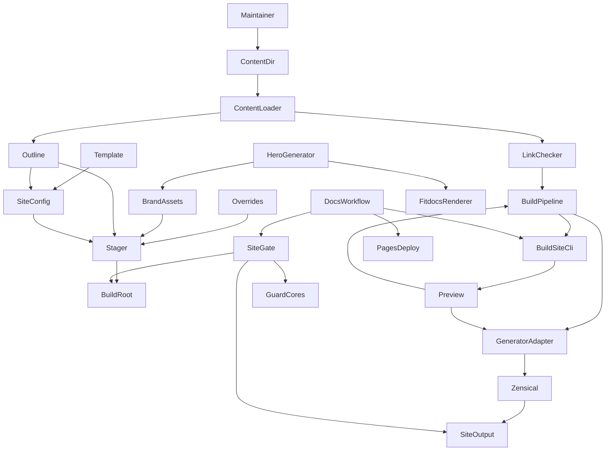
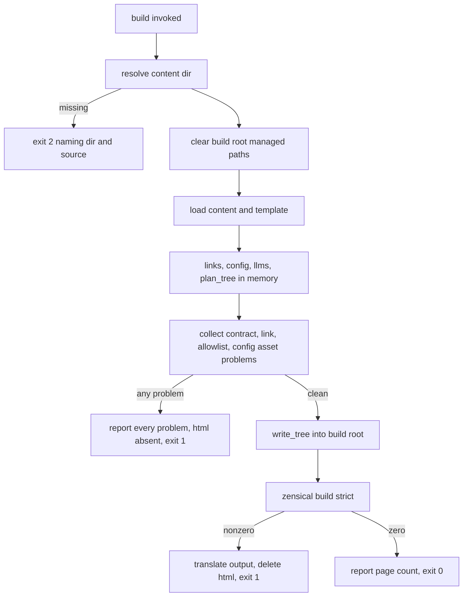
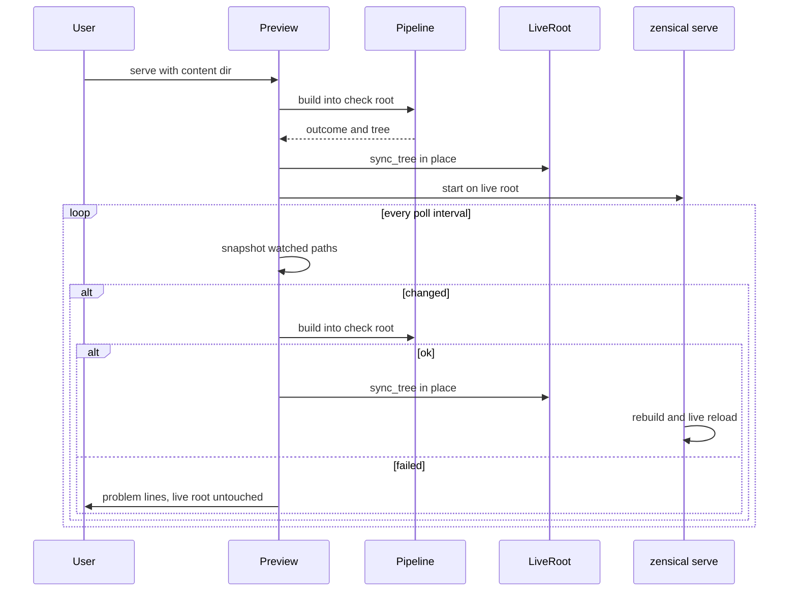
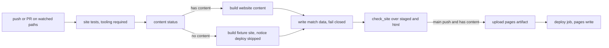

# Design Document — docs-site

## Overview

**Purpose**: This feature builds the machinery that turns hand-written pages
into the fitdocs.ai website:
- a generator-agnostic build that checks a written content contract, generates
  navigation and the llms indexes, and renders through an exactly pinned
  Zensical in strict mode;
- a local preview that rebuilds on save;
- a GitHub Pages workflow that publishes from `main` only, behind the
  project's existing forbidden-strings gate.

**Users**:
- The maintainer authors copy outside the repository, previews it with one
  command, and commits it into `website/content/` when it is ready.
- Site visitors read, search and copy from the published site.
- Contributors change the build and trust its tests.

**Impact**:
- Adds a `website/` source tree, a `scripts/sitebuild/` package with three
  script entry points, a `docs` dependency group, a docs workflow, one new
  `docs/` page and fixture-only tests.
- Changes nothing the installed package ships, and no existing `docs/` page
  other than one row in `docs/index.md`.

### Goals
- A content directory that obeys the contract (Requirement 2) builds into a
  complete site with one command. A directory that does not obey it fails with
  every violation named at once.
- Nothing reaches `https://fitdocs.ai` unless the content contract, link
  checks, config allowlist, strict generator build and forbidden-strings gate
  have all passed on `main`.
- Every guarantee is proven against fixture pages, so the spec is complete
  whether or not the maintainer's copy has landed.

### Non-Goals
- The site's copy, and importing it.
- An API reference, versioned docs, translations, a blog, analytics or
  comments.
- DNS records, domain verification and the repository's Pages settings. These
  are documented in the runbook, not automated.
- A design pass beyond the brand values stated here.
- Any change to `ci.yml`, `release.yml`, `scripts/check_artifacts.py`, the
  purge guard cores or any existing `docs/` guard.

## Boundary Commitments

### This Spec Owns
- **The content contract**: which files in a content directory become pages
  or assets, the frontmatter schema, the canonical section list, the hero
  keys, `draft`, the name-exclusion rules, the link form, the annotation-block
  rule and the reserved names. The contract is defined once, in
  `scripts/sitebuild/model.py`, and restated for the maintainer in
  `docs/website.md`.
- **The site build**: content resolution, staging, validation, navigation, the
  llms indexes, config rendering against an allowlist, generator invocation and
  failure translation, and the build-root layout under `website/build/`.
- **The local preview**: polling, rebuilding into a check root, and in-place
  sync into the served root.
- **The site gate**: `scripts/check_site.py`, the forbidden-strings check over
  directory trees.
- **The theme**: `website/mkdocs.template.yml`, `website/overrides/`, and
  `website/assets/` (brand stylesheet, logo placeholder, and the hero chart
  with its generator `scripts/make_hero_chart.py`).
- **Automation**: `.github/workflows/docs.yml` and its test.
- **Additions to files owned elsewhere**:
  - to distribution's files: `Homepage` in `[project.urls]`, a `docs`
    dependency group, a `CONTRIBUTING.md` section, and a `CHANGELOG.md`
    `[Unreleased]` entry;
  - to the docs set: `docs/website.md` and its row in `docs/index.md`;
  - one `.gitignore` line; and mypy `files` entries for the new tests.

### Out of Boundary
- **The page copy under `website/content/`.** This spec commits only a
  `.gitkeep` there. The maintainer's content commit is not part of any task.
- **Distribution-owned files and guards.** `scripts/check_artifacts.py`,
  `tests/_forbidden_strings.py`, `tests/_content_oracle.py`,
  `tests/_content_fingerprints.py`, `.github/workflows/ci.yml` and
  `.github/workflows/release.yml` are consumed, never edited.
- **Existing `docs/` pages and their guards.** Every existing `docs/` page
  other than `docs/index.md` is untouched, as is every docs guard test.
- **Existing project URLs.** `Documentation` and every other existing
  `[project.urls]` value keep their values.
- **Installed-package surfaces.** The runtime dependency list, the optional
  dependencies, and the wheel and sdist member sets are unchanged.
- **Reference-app wording.** Rewording "fitdocs.ai" where it names the
  reference app is a Phase 9 direct-implementation candidate, as are the
  other Phase 9 candidates (the stale PyPI sentences, the `plan` hint and the
  0.1.0 CHANGELOG amendment).
- **Deferred features.** mkdocstrings, a GitHub Release object, and serving
  `docs/` on the site.

### Allowed Dependencies
- **Build logic** (`scripts/build_site.py`, `scripts/sitebuild/**`) may import
  only the Python standard library, `yaml` (PyYAML, a runtime dependency
  already) and `scripts.sitebuild`. It invokes the pinned `zensical`
  executable as a subprocess and never imports it (8.4). It imports nothing
  from `fitdocs` and nothing from `tests`.
- **Site gate** (`scripts/check_site.py`) may import the standard library and
  the purge guard cores `tests._forbidden_strings`, `tests._content_oracle` and
  `tests._content_fingerprints`, the same set `scripts/check_artifacts.py`
  uses. It defines no marker list or fingerprint of its own. It needs the
  `dev` group at run time, because `tests._forbidden_strings` imports
  `pytest`.
- **Hero generator** (`scripts/make_hero_chart.py`) may import the standard
  library and `fitdocs.render.charts.hero` / `fitdocs.render.charts.palette`
  (public-internal, read-only use).
- **Workflow** may use `actions/checkout`, `astral-sh/setup-uv`,
  `actions/upload-pages-artifact` and `actions/deploy-pages`, each pinned to an
  exact `vX.Y.Z` tag or a 40-hex SHA. It may also use the existing repository
  secret `FITDOCS_FORBIDDEN_STRINGS_CONTENT`.
- **Tooling**: `zensical==0.0.65` in `[dependency-groups] docs` only.

### Revalidation Triggers
- **A Zensical pin bump.** Re-derive the theme-feature allowlist, re-run the
  smoke and preview tests with the docs group installed, and re-verify the
  failure translator against the new output format. The pin-bump procedure in
  `docs/website.md` is the checklist.
- **Any change to the content contract constants**
  (`scripts/sitebuild/model.py`). The maintainer's copy, `docs/website.md` and
  the fixture site must all be re-checked.
- **A `docs/` page rename or heading change.** Every site link into `docs/` by
  GitHub URL is re-checked by the build (6.3). The fixture site links one real
  `docs/` heading, so a rename of that heading reds the fixture build.
- **A change to the purge guard cores' API** (`load`, `matches`, `scan`, or
  the fingerprint constants). The site gate consumes them.
- **`connectors` landing.** It appends its own `docs/index.md` row and
  `Connectors` project URL. The second lander rebases and keeps both.
- **A change to `site_url`, `edit_uri` or the repository name.** This moves
  every published URL, every edit link and the llms indexes.

## Architecture

### Existing Architecture Analysis
- `scripts/` is a stdlib-first, top-level package that never ships. It is
  invoked as `python -m scripts.<name>` from the repository root, so that
  `tests.*` resolves. Its entry points follow a fixed shape:
  - `REPO_ROOT = Path(__file__).resolve().parents[1]`;
  - an argparse `_build_parser()` with `prog="python -m scripts.<name>"`;
  - `main(argv: Sequence[str]) -> int`;
  - exit codes 0 clean / 1 findings / 2 could-not-run.

  mypy strict (`[tool.mypy].files` lists `scripts`) and ruff already cover
  it. This design follows that convention exactly.
- The forbidden-strings gate is fail-closed by construction:
  - `load(repo_root)` returns `None` only when `FITDOCS_FORBIDDEN_STRINGS` is
    unset, and raises `ForbiddenStringsSourceError` when it is set but
    unusable.
  - `ci.yml` writes the secret to `$RUNNER_TEMP/forbidden-strings.txt` and
    fails on an empty secret with `::error::gate_not_run`.

  The docs workflow mirrors that step verbatim.
- The docs guard surface constrains the new page and the fixtures:
  - The corpus is README plus top-level `docs/*.md`. The positive pin
    "performs no watching and no scheduling" must stay true. The negative pins
    forbid "fitdocs ships no" and similar phrases.
  - "two minor releases" may appear only in `docs/compatibility.md`.
  - The literal of the current package version is forbidden under `docs/` and
    `tests/` outside its permitted files.
  - Every tracked file must be UTF-8 or `.png`/`.fit`/`.gz`, so no `.woff2`,
    `.ico` or `.jpg`.
- Zensical 0.0.65 (probed 2026-09-29; `research.md`):
  - It silently ignores unknown keys, plugins and theme features.
  - It renders `_`-prefixed files.
  - It never checks asset links.
  - It wipes `site_dir` even when a build fails.
  - It requires `docs_dir` and `site_dir` inside the config directory.
  - `serve` misses a rename-swapped docs dir.

  Each of these forces a decision below.

### Architecture Pattern & Boundary Map

**Selected pattern**: a script-first pipeline with a pinned renderer. Pure
planning modules turn the content directory into a byte map of the build
root. A stager writes that map, and the generator renders it under strict
mode. Every check the generator does not reliably perform is the script's.



**Dependency direction** (build logic; an import in the other direction is a
defect):
`model` → `content`, `links`, `outline`, `config` → `stage` → `generator` →
`pipeline` → `preview` → `scripts/build_site.py`.
- `content`, `outline` and `config` import only `model`. `links` imports
  `model` and `outline`, for page URL paths when checking hero hrefs.
  `stage` imports only `model`. `generator` imports only `model`. `pipeline`
  imports every module to its left, `preview` imports `pipeline`, `stage` and
  `generator`, and `scripts/build_site.py` imports `pipeline`, `preview`,
  `content` (for resolution) and `generator` (for its exceptions).
- `scripts/check_site.py` and `scripts/make_hero_chart.py` are leaves outside
  this chain. Neither is imported by build logic, and neither imports it.

**Architecture integration**:
- **Boundaries.**
  - The content contract is the only interface to the maintainer's copy.
  - The config template and `website/overrides/` are the only interface to
    theming.
  - The build root is the only interface to the generator.
  - The site gate knows only directory trees.
- **Existing patterns preserved.** The `scripts/` entry-point shape and exit
  codes, the fail-closed secret step, the workflow-test style, the purge
  cores as the single matcher, and `[dependency-groups]` rather than extras.
- **Steering compliance.**
  - No personal data: the hero chart comes from closed-form demo series.
  - The runtime dependency list is untouched.
  - Absent data stays absent: an omitted hero key renders nothing, never
    default text (3.4).

### Technology Stack

| Layer | Choice / Version | Role in Feature | Notes |
|-------|------------------|-----------------|-------|
| Build logic | Python ≥3.11 stdlib + PyYAML (existing runtime dep) | Content contract, staging, nav, llms, config, orchestration, preview polling | mypy strict via `[tool.mypy].files`; no new runtime dependency |
| Site generator | `zensical==0.0.65` (`[dependency-groups] docs`) | Markdown rendering, Material `classic` theme, search, strict page/anchor validation, `serve` live reload | Invoked as `<venv>/bin/zensical`; wheel `cp310-abi3`, needs Python ≥3.10 |
| Gate | Purge guard cores (`tests._forbidden_strings`, `tests._content_oracle`, `tests._content_fingerprints`) | Token and fingerprint matching over staged and built trees | Needs the `dev` group (imports `pytest`) |
| Hero chart | `fitdocs.render.charts.hero.render_hero_chart` | Renders the demo SVG once, checked in | Generator is not build logic |
| CI / hosting | GitHub Actions: `actions/checkout@v7.0.1`, `astral-sh/setup-uv@v10.2.0`, `actions/upload-pages-artifact@v5.0.0`, `actions/deploy-pages@v5.0.1`; GitHub Pages | Build, gate, deploy from `main` | Exact tags (2026-09-29); no CNAME file needed for Actions publishing |

## File Structure Plan

### Directory Structure
```
website/
├── mkdocs.template.yml        # Checked-in site config; every key allowlisted; build-owned keys absent
├── content/
│   └── .gitkeep               # Keeps the default content dir present; excluded as a dotfile
├── overrides/
│   └── home.html              # Hero layout (hero_title/tagline/actions, hero chart); keeps the edit action
└── assets/                    # Build-owned brand assets, staged to staged/_brand/
    ├── brand.css              # THE brand: palette (light + slate), font stacks, hero layout styles
    ├── logo.svg               # Placeholder logo, also the favicon
    └── hero-chart.svg         # Demo-data power-vs-HR chart; written by scripts/make_hero_chart.py

scripts/
├── build_site.py              # CLI: build | serve | status; argument parsing and exit codes only
├── check_site.py              # CLI + gate: forbidden strings over directory trees (tests.* cores)
├── make_hero_chart.py         # CLI: writes or --checks website/assets/hero-chart.svg from demo series
└── sitebuild/
    ├── __init__.py            # Package marker; states the stdlib+PyYAML-only rule
    ├── model.py               # Contract constants, Problem, Page, HeroAction, Asset, SiteContent, ResolvedContent
    ├── content.py             # Resolve content dir; discover; strip annotations; parse + validate frontmatter
    ├── links.py               # Fence-aware link extraction; asset/hero/docs-URL checks; GitHub slugger
    ├── outline.py             # Page ordering, page URLs, nav structure, llms.txt / llms-full.txt text
    ├── config.py              # Template load; allowlist; build-owned keys; render final config; referenced assets
    ├── stage.py               # plan_tree (byte map of a build root); write_tree; sync_tree (in place)
    ├── generator.py           # Locate zensical; run build/serve; translate output into Problems
    ├── pipeline.py            # build() orchestration; build-root guard and cleanup
    └── preview.py             # Poll, rebuild into check root, sync into live root, supervise serve

.github/workflows/
└── docs.yml                   # Build + gate on relevant changes; Pages deploy from main only

docs/
└── website.md                 # Content contract, build and preview, maintainer runbook

tests/
├── test_docs_workflow.py      # Workflow test for docs.yml (Req 10), in the style of test_ci_workflow.py
└── sitebuild/
    ├── __init__.py
    ├── conftest.py            # requires_zensical fixture (skip, or fail under FITDOCS_REQUIRE_SITE_TOOLING=1); fixture-copy helper
    ├── fixtures/site/         # The valid fixture content tree (see Testing Strategy)
    ├── test_model.py          # Contract constants and Problem line format
    ├── test_fixture_site.py   # Fixture self-test: every species present, UTF-8, no version literal
    ├── test_content.py        # Req 1, 2 (no generator)
    ├── test_links.py          # 6.1 assets/hero, 6.3 docs URLs, GitHub slugger
    ├── test_outline.py        # 3.1, 3.2, 5.1–5.4, 4.6 URL form
    ├── test_config.py         # 6.4 allowlist; template pins (4.2, 4.4, 4.6)
    ├── test_stage.py          # 1.3, 1.5–1.8 byte-exactness, home injection, sync_tree semantics
    ├── test_generator.py      # 6.5 translation over canned Zensical output (no generator)
    ├── test_pipeline.py       # 6.6, 6.7, 2.9 end-to-end short of the generator
    ├── test_cli.py            # 1.1, 1.2, 6.5 exit codes and messages; status (10.6)
    ├── test_build_smoke.py    # 9.2 real build (requires_zensical)
    ├── test_preview.py        # Req 7: unit part with stubs; real serve part (requires_zensical)
    ├── test_check_site.py     # 10.3–10.5 gate behavior
    ├── test_hero_chart.py     # 3.5, 3.6 hero chart drift and demo-data-only
    ├── test_theme.py          # 3.3–3.4, 4.5: overrides, brand.css
    ├── test_website_doc.py    # 11.2–11.7, 11.9 checks specific to the new page
    └── test_repo_wiring.py    # 8.1–8.4, 9.3, 11.1, 11.8: pyproject, .gitignore, CONTRIBUTING, CHANGELOG, import guard, Dies-on convention
```

### Modified Files
- **`pyproject.toml`.**
  - `[project.urls]`: `Homepage = "https://fitdocs.ai"`, inserted as the
    **first** key, so it is not adjacent to `connectors`' appended
    `Connectors` key.
  - `[dependency-groups]`: `docs = ["zensical==0.0.65"]`.
  - `[tool.mypy].files`: adds `tests/sitebuild` (with the package) and
    `tests/test_docs_workflow.py` (in the change that creates it, because
    mypy refuses a listed path that does not exist), following the
    listed-test convention.
- **`uv.lock`**: re-locked for the `docs` group only. The resolution of the
  runtime and `dev` groups is unchanged.
- **`.gitignore`**: an explicit `/website/build/` entry with a comment. The
  existing `build/` rule already matches it; the explicit line documents 6.7
  and survives an edit to the generic rule.
- **`docs/index.md`**: one table row, `| [The website](website.md) | … |`,
  placed before the `Contributing` row. No other line changes.
- **`CONTRIBUTING.md`**: a new final H2, `## Building the website`, that
  points at `docs/website.md`. It has no fenced blocks; commands are inline.
  The existing eight H2s and their pinned fences are untouched.
- **`CHANGELOG.md`**: one `### Added` bullet under `## [Unreleased]`
  declaring the `Homepage` project URL. This is owed by CONTRIBUTING's
  "Changelog duty" because the URL is user-visible on the package index, and
  it is distinct from the out-of-scope 0.1.0 amendment.

## System Flows

### Build pipeline

- The generator runs only when every script-level check has passed, so a
  contract violation never produces a half-built site.
- For every run that reaches `build()`, `html/` exists if and only if that
  build succeeded (6.6). A run that exits 2 before `build()` (missing content
  dir, missing generator, refused root) touches nothing, so an earlier
  complete site may remain in that root. CI always starts from a fresh
  checkout.

### Preview loop

- If the first build fails, the preview reports it and keeps polling. It
  starts `zensical serve` after the first success.
- Watched paths are the content directory, `website/overrides/`,
  `website/assets/` and `website/mkdocs.template.yml`.

### Docs workflow

- The deploy job runs only when all three hold: the event is a push, the ref
  is `refs/heads/main`, and the build job's `has_content` output is `true`.
- Every earlier step failing prevents upload and deploy.

## Requirements Traceability

| Requirement | Summary | Components | Interfaces | Flows |
|-------------|---------|------------|------------|-------|
| 1.1 | Content dir order: option, env, default | ContentLoader, BuildSiteCli | `resolve_content_dir` | Build |
| 1.2 | Missing dir names dir + source | ContentLoader, BuildSiteCli | `ContentDirMissing` → exit 2 | Build |
| 1.3 | Never modify content dir | ContentLoader, Stager, Preview | read-only discovery; writes only under build root | Build, Preview |
| 1.4 | `_` and `.` names excluded with subtree | ContentLoader | `discover` | Build |
| 1.5 | Non-md files carried at same path | ContentLoader, Stager | `Asset`, `plan_tree` | Build |
| 1.6 | Annotation block removed, rest byte-exact except the home `template` line (3.3) | ContentLoader, Stager | `strip_annotation`, `plan_tree` | Build |
| 1.7 | Plain `---` rule kept | ContentLoader | `strip_annotation` | Build |
| 1.8 | No annotation in pages, search or indexes | ContentLoader, Outline, Stager | stripped text is the only staged/indexed text | Build |
| 2.1 | Required keys and types | ContentLoader, SiteModel | `validate_meta` | Build |
| 2.2 | Canonical section list | SiteModel | `SECTIONS` | — |
| 2.3 | `draft`; hero keys home-only | SiteModel, ContentLoader | `OPTIONAL_KEYS`, `HERO_KEYS` | Build |
| 2.4 | Draft excluded everywhere | ContentLoader, Outline | `SiteContent.pages` excludes drafts | Build |
| 2.5 | Missing/unknown/wrong-type/hero-misplaced fail | ContentLoader | `Problem` per violation | Build |
| 2.6 | Duplicate order in a section fails naming both | ContentLoader | site-level check | Build |
| 2.7 | Pages but no `index.md` fails | ContentLoader | site-level check | Build |
| 2.8 | No included page fails | ContentLoader | site-level check | Build |
| 2.9 | All violations in one run | ContentLoader, LinkChecker, SiteConfig, BuildPipeline | collected `tuple[Problem, ...]` | Build |
| 2.10 | Markdown-syntax relative `.md` links with anchor accepted | LinkChecker, GeneratorAdapter | link form; generator resolves | Build |
| 2.11 | Symlink or root `llms.txt` / `llms-full.txt` in content fails | ContentLoader | `discover` | Build |
| 2.12 | Raw-HTML link to a `.md` page fails | LinkChecker | `check_links` | Build |
| 3.1 | Nav grouped by canonical section, empty omitted | Outline | `nav_structure` | Build |
| 3.2 | Ascending `order` within a section | Outline | `ordered_pages` | Build |
| 3.3 | Hero layout with hero keys | Theme, Stager | `home.html`, injected `template` | Build |
| 3.4 | Omitted hero key → element omitted | Theme | `home.html` conditionals | Build |
| 3.5 | Hero chart from checked-in demo-data image | Theme, HeroGenerator | `_brand/hero-chart.svg` | Build |
| 3.6 | Recorded, regenerable chart production | HeroGenerator | `make_hero_chart --check` | — |
| 4.1 | Full-text search | SiteConfig | `plugins: [search]` | Build |
| 4.2 | Light/dark, system default, toggle | SiteConfig, Theme | three-entry palette | Build |
| 4.3 | Copy button on every code block | SiteConfig | `content.code.copy` | Build |
| 4.4 | Edit link to `website/content/` source | SiteConfig, Theme, Stager | `edit_uri`, 1:1 staging, `home.html` keeps action | Build |
| 4.5 | One palette, typeface, logo, both modes | Theme | `brand.css`, `logo.svg` | Build |
| 4.6 | Trailing-slash URLs under fitdocs.ai | SiteConfig, Outline | `site_url`, `use_directory_urls`, `page_path` | Build |
| 5.1 | `llms.txt` per llmstxt.org | Outline, Stager | `render_llms` | Build |
| 5.2 | `llms-full.txt` bodies in nav order | Outline, Stager | `render_llms_full` | Build |
| 5.3 | Drafts and `_` files absent from indexes | Outline | built from `SiteContent.pages` | Build |
| 5.4 | Byte-identical indexes for unchanged content | Outline | pure, sorted, LF | — |
| 6.1 | Missing page/asset target fails | LinkChecker, GeneratorAdapter | asset/hero checks; strict page check | Build |
| 6.2 | Missing anchor fails | GeneratorAdapter | strict anchor check | Build |
| 6.3 | `docs/` GitHub URL file/anchor checked | LinkChecker | `check_docs_urls`, `github_slugs` | Build |
| 6.4 | Config key/feature/plugin allowlist | SiteConfig | `check_config` | Build |
| 6.5 | One-line generator failure, full output on request | GeneratorAdapter, BuildSiteCli | `translate`, `--verbose` | Build |
| 6.6 | Non-zero exit, no partial site | BuildPipeline | clean-then-build, delete `html/` on failure | Build |
| 6.7 | Output git-ignored, never tracked | BuildPipeline, repo wiring | `website/build/`, build-dir guard, `.gitignore` | Build |
| 7.1 | Preview serves any content dir | Preview, BuildSiteCli | `serve` subcommand | Preview |
| 7.2 | Rebuild on create/change/delete without restart | Preview, Stager | `snapshot`, `sync_tree` | Preview |
| 7.3 | Failure reported in build form, keeps running | Preview, BuildPipeline | shared `Problem` lines; live root untouched | Preview |
| 7.4 | No writes to content dir or tracked files | Preview, BuildPipeline | build-dir guard | Preview |
| 8.1 | Runtime and optional deps unchanged | repo wiring | preserved pins | — |
| 8.2 | Own group, exact pin | repo wiring | `docs = ["zensical==0.0.65"]` | — |
| 8.3 | Wheel and sdist members unchanged | repo wiring | preserved artifact tests | — |
| 8.4 | Build logic stdlib + PyYAML only | all build modules | import guard test | — |
| 9.1 | Fixture-based coverage of 1–3, 5, 6 | test suite | `tests/sitebuild/` | — |
| 9.2 | Real-build smoke test | test suite | `test_build_smoke.py` | Build |
| 9.3 | Each assertion names its mutation | test suite | `Dies on:` docstring convention + meta-test | — |
| 9.4 | Skip with reason without tooling | test suite | `requires_zensical` | — |
| 9.5 | Skip fails in the docs workflow | test suite, DocsWorkflow | `FITDOCS_REQUIRE_SITE_TOOLING=1` | Workflow |
| 10.1 | Build on relevant paths, PR and push | DocsWorkflow | `on.push.paths`, `on.pull_request.paths` | Workflow |
| 10.2 | Deploy only from push to `main` | DocsWorkflow | deploy job `if` | Workflow |
| 10.3 | Gate over staged + built before deploy | DocsWorkflow, SiteGate | `check_site staged html` | Workflow |
| 10.4 | Missing match data fails, no deploy | DocsWorkflow, SiteGate | fail-closed secret step; `GATE_NOT_RUN` | Workflow |
| 10.5 | Match found fails, no deploy | SiteGate, DocsWorkflow | exit 1 | Workflow |
| 10.6 | Empty content → fixture build, deploy skipped + notice | BuildSiteCli, DocsWorkflow | `status`, fixture step | Workflow |
| 10.7 | Publish permissions only on deploy job | DocsWorkflow | job-level `permissions` | Workflow |
| 10.8 | Exact tag or SHA pins | DocsWorkflow | pin regex | Workflow |
| 10.9 | Workflow test | DocsWorkflowTest | `tests/test_docs_workflow.py` | — |
| 11.1 | `Homepage`; other URLs unchanged | ProjectMetadata | `[project.urls]` | — |
| 11.2 | One new docs page, linked from index | WebsiteDoc | `docs/website.md`, index row | — |
| 11.3 | Contract stated in full | WebsiteDoc | derived-from-constants test | — |
| 11.4 | Build and preview incl. out-of-repo | WebsiteDoc | page sections | — |
| 11.5 | Runbook: DNS, Pages, import, pin bump | WebsiteDoc | page sections | — |
| 11.6 | Not a compatibility-policy contract | WebsiteDoc | stated sentence | — |
| 11.7 | Rebuild-on-save is repo tooling; no-watching guarantee intact | WebsiteDoc | stated sentence | — |
| 11.8 | CONTRIBUTING section; existing pins hold | ContributingSection | new final H2 | — |
| 11.9 | New page and index change pass every docs guard | WebsiteDoc | existing guard suite | — |

## Components and Interfaces

| Component | Domain/Layer | Intent | Req Coverage | Key Dependencies (P0/P1) | Contracts |
|-----------|--------------|--------|--------------|--------------------------|-----------|
| SiteModel | Build · model | Contract constants and shared value types | 2.1–2.3, 2.9 | — | Service |
| ContentLoader | Build · content | Turn a content dir into validated `SiteContent` | 1.1–1.8, 2.1, 2.3–2.9, 2.11 | SiteModel (P0), PyYAML (P0) | Service |
| LinkChecker | Build · links | Check what the generator does not: assets, hero hrefs, `docs/` URLs, raw-HTML page links | 2.10, 2.12, 6.1, 6.3 | ContentLoader (P0) | Service |
| Outline | Build · outline | One ordering for nav and indexes; page URLs; llms text | 3.1, 3.2, 4.6, 5.1–5.4 | SiteModel (P0) | Service |
| SiteConfig | Build · config | Render the final config from template + nav; enforce the allowlist | 4.1–4.4, 4.6, 6.4 | Outline (P0), PyYAML (P0) | Service |
| Stager | Build · stage | Byte map of a build root; write fresh; sync in place | 1.3, 1.5, 1.6, 1.8, 3.3, 7.2 | all planning modules (P0) | Service |
| GeneratorAdapter | Build · generator | Run Zensical; translate its output | 6.1, 6.2, 6.5 | Zensical 0.0.65 (P0) | Service |
| BuildPipeline | Build · pipeline | Orchestrate a build into one root | 2.9, 6.6, 6.7 | all above (P0) | Batch |
| Preview | Build · preview | Rebuild on change; serve the last good tree | 7.1–7.4 | BuildPipeline (P0), GeneratorAdapter (P0) | State |
| BuildSiteCli | Build · entry | `build` / `serve` / `status` commands and exit codes | 1.1, 1.2, 6.5, 7.1, 10.6 | BuildPipeline (P0), Preview (P0) | Batch |
| SiteGate | Gate | Forbidden strings over directory trees, fail closed | 10.3–10.5 | purge guard cores (P0) | Batch |
| Theme | Assets | Template, overrides, brand, hero chart asset | 3.3–3.5, 4.1–4.6 | Zensical (P0) | — |
| HeroGenerator | Assets | Regenerable demo-data hero chart | 3.5, 3.6 | fitdocs hero renderer (P0) | Batch |
| DocsWorkflow | Automation | Build, gate, deploy | 9.5, 10.1–10.8 | BuildSiteCli (P0), SiteGate (P0), Pages actions (P0) | Batch |
| DocsWorkflowTest | Tests | Structural and executable checks of `docs.yml` | 10.9 | DocsWorkflow (P0) | — |
| WebsiteDoc | Documentation | Contract, build/preview, runbook | 11.2–11.7, 11.9 | SiteModel (P1) | — |
| ContributingSection / ProjectMetadata | Repo wiring | CONTRIBUTING pointer; Homepage; docs group; ignore rule; changelog | 6.7, 8.1–8.3, 11.1, 11.8 | distribution pins (P0) | — |

### Build Logic

#### SiteModel (`scripts/sitebuild/model.py`)

| Field | Detail |
|-------|--------|
| Intent | The single definition of the content contract and the value types every build module shares |
| Requirements | 2.1, 2.2, 2.3, 2.9 |

**Responsibilities & Constraints**
- Owns the contract constants. Every other module, `docs/website.md`'s test
  and the fixtures derive from them. No other file restates a key or section
  name as a literal.
- Pure data: no I/O, no imports beyond the standard library.

**Contracts**: Service [x]

##### Service Interface
```python
SECTIONS: Final[tuple[str, ...]] = (
    "Home", "Why", "Get started", "Guides", "Working with LLMs",
    "Reference", "Extend", "Project",
)
REQUIRED_KEYS: Final[tuple[str, ...]] = ("title", "description", "section", "order")
OPTIONAL_KEYS: Final[tuple[str, ...]] = ("draft",)
HERO_KEYS: Final[tuple[str, ...]] = ("hero_title", "hero_tagline", "hero_actions")
HERO_ACTION_KEYS: Final[tuple[str, ...]] = ("label", "href", "primary")  # label, href required
HOME_PAGE: Final = "index.md"
HOME_TEMPLATE: Final = "home.html"
RESERVED_ROOT_NAMES: Final[tuple[str, ...]] = ("llms.txt", "llms-full.txt")
BRAND_DIR: Final = "_brand"                 # build-owned staged dir; unreachable by content (1.4)
CONTENT_ENV_VAR: Final = "FITDOCS_SITE_CONTENT"
ANNOTATION_MARKER: Final = "\n\n---\nAnnotations:"

class ContentSource(StrEnum):
    OPTION = "--content"
    ENVIRONMENT = "FITDOCS_SITE_CONTENT"
    DEFAULT = "default website/content/"

@dataclass(frozen=True)
class ResolvedContent:
    path: Path
    source: ContentSource

@dataclass(frozen=True)
class Problem:
    path: str       # content-relative POSIX path; "" when none applies; "site generator" for path-less generator errors
    where: str      # frontmatter key, "line:col", or ""
    message: str
    def render(self) -> str: ...   # ": ".join of the non-empty fields -- the one line format (2.9, 6.5, 7.3)

@dataclass(frozen=True)
class HeroAction:
    label: str
    href: str                       # absolute https:// URL, or a non-empty site path in trailing-slash form
    primary: bool

@dataclass(frozen=True)
class Page:
    path: str                       # content-relative POSIX path ending ".md"
    title: str
    description: str
    section: str                    # a member of SECTIONS
    order: int
    staged_text: str                # file text with the annotation block removed (frontmatter included)
    body: str                       # staged_text without its frontmatter
    hero_title: str | None
    hero_tagline: str | None
    hero_actions: tuple[HeroAction, ...] | None

@dataclass(frozen=True)
class Asset:
    path: str                       # content-relative POSIX path
    source: Path

@dataclass(frozen=True)
class SiteContent:
    root: Path
    pages: tuple[Page, ...]         # included, non-draft pages; sorted by path
    assets: tuple[Asset, ...]       # included non-markdown files; sorted by path
```
- Invariants:
  - `Page.section in SECTIONS`, and `type(order) is int` (never `bool`).
  - Hero fields are non-`None` only on `HOME_PAGE`.
  - `Problem.render()` never embeds a newline.

#### ContentLoader (`scripts/sitebuild/content.py`)

| Field | Detail |
|-------|--------|
| Intent | Resolve, discover, strip and validate a content directory into `SiteContent`, collecting every violation |
| Requirements | 1.1–1.8, 2.1, 2.3–2.9, 2.11 |

**Responsibilities & Constraints**
- **Resolution order** (1.1): the explicit option, then `CONTENT_ENV_VAR`,
  then `<repo_root>/website/content`. A missing or non-directory path raises
  `ContentDirMissing(path, source)`, and its message names both (1.2).
- **Discovery.** It walks the tree with `os.scandir` and never follows
  directory symlinks.
  - Excluded, along with everything beneath them: any path component that
    begins with `_` (1.4), and any component that begins with `.`.
  - A symbolic link anywhere is a violation naming it.
  - `.md` files are pages. Every other included file is an `Asset` (1.5).
  - A root-level name in `RESERVED_ROOT_NAMES` is a violation.
- **Read-only** (1.3): it only opens files for reading.
- **Annotation strip** (1.6, 1.7, 1.8). `i = text.rfind(ANNOTATION_MARKER)`;
  when `i >= 0` the kept text is `text[: i + 1]`. That keeps the newline
  ending the last content line and removes the blank line, the `---`, and
  everything after. With no marker, the text is unchanged. A `---` not
  followed by a line beginning `Annotations:` never matches.
- **Frontmatter.**
  - The file must be UTF-8 and begin with a line `---`. The block ends at the
    next line `---`.
  - It must parse (PyYAML `SafeLoader` subclass rejecting duplicate keys) to a
    mapping.
  - Violations: no frontmatter, unterminated frontmatter, a YAML error, a
    non-mapping, or a duplicate key.
- **Per-page validation** (2.1, 2.3, 2.5). One `Problem` for each of:
  - a missing required key;
  - a key outside `REQUIRED_KEYS ∪ OPTIONAL_KEYS ∪ HERO_KEYS`;
  - a hero key on a page other than `HOME_PAGE`;
  - a wrong type:
    - `title`, `description`, `hero_title` and `hero_tagline` must be
      non-empty `str` after strip;
    - `order` must be `int` and not `bool`;
    - `draft` and `primary` must be `bool`;
    - `hero_actions` must be a non-empty list of mappings whose keys are
      within `HERO_ACTION_KEYS`, with `label` and `href` non-empty `str`;
  - a `section` outside `SECTIONS`.

  `template` is not a content key: a page that sets it hits the unknown-key
  rule.
- **Draft** (2.4). A page whose valid frontmatter has `draft: true` is
  omitted from `SiteContent.pages`. Its assets are unaffected.
- **Site-level validation** (2.6–2.8).
  - Duplicate `(section, order)` among included pages: one `Problem` naming
    both paths.
  - Included pages but no `HOME_PAGE` among them, including a drafted
    `index.md`: a violation.
  - Zero included pages: a violation stating the directory holds no included
    page.
- **Collect, don't stop** (2.9). Every file is examined and every violation
  returned. `SiteContent` is returned only when no `Problem` was found.

**Contracts**: Service [x]

##### Service Interface
```python
class ContentDirMissing(Exception):
    resolved: ResolvedContent

def resolve_content_dir(option: Path | None, environ: Mapping[str, str],
                        repo_root: Path) -> ResolvedContent: ...        # raises ContentDirMissing
def strip_annotation(text: str) -> str: ...
def load_content(content_dir: Path) -> tuple[SiteContent | None, tuple[Problem, ...]]: ...
def count_included_pages(content_dir: Path) -> int: ...
    # pages not name-excluded and not drafted; a page whose frontmatter cannot be read counts as included
```
- Preconditions: `content_dir` exists.
- Postconditions:
  - `load_content` returns `(content, ())` or `(None, problems)` with
    `problems` non-empty, sorted by `(path, where, message)`.
  - The content directory is byte-identical before and after.

#### LinkChecker (`scripts/sitebuild/links.py`)

| Field | Detail |
|-------|--------|
| Intent | Validate every link the generator does not validate |
| Requirements | 2.10, 2.12, 6.1, 6.3 |

**Responsibilities & Constraints**
- **Extraction.** A fence-aware scanner reads a page `body` and yields
  targets from:
  - inline links and images `[..](target "title")`;
  - reference definitions `[id]: target`;
  - raw HTML `href="…"` / `src="…"`.

  Fenced code blocks (``` and ~~~) and inline code spans are skipped. Line
  numbers are reported relative to the source file.
- **Classification.**
  - `http(s)://github.com/joshua-stauffer/fitdocs/blob/main/docs/…`: a docs
    URL, checked below.
  - Other absolute URLs, `mailto:` and pure `#anchor` links: not checked here.
    The generator checks same-page anchors.
  - A relative target ending `.md` (with an optional `#anchor`) in markdown
    link syntax: a page link, left to the generator's strict check (2.10,
    6.1, 6.2).
  - The same kind of target in a raw-HTML `href` / `src`: a `Problem` naming
    the page and line, telling the author to use markdown link syntax (2.12).
    Whether the pinned generator validates raw-HTML links was never
    verified. Refusing them keeps every page link inside the one strict check
    that is verified.
  - Every other relative target is an asset link. After resolving `..` and
    stripping any query or fragment, its path must be an included asset or a
    page's directory URL. Otherwise it is a `Problem` naming the page, the
    line and the target (6.1).
- **Hero hrefs** (6.1). A relative `HeroAction.href` must equal the URL path
  (`Outline.page_path`) of an included page. An absolute href must be
  `https://`. A `docs/` URL is checked as below.
- **Docs URLs** (6.3). The path after `blob/main/` must be an existing file
  in `<repo_root>/docs/`. When the file is `.md` and a fragment is present,
  the fragment must be in `github_slugs(<file text>)`. A violation names the
  page, the line, the URL and which half failed.
- **`github_slugs`** implements github-slugger v2 semantics:
  - lowercase;
  - remove every non-alphabetic character in the Unicode categories
    Pe, Pf, Pi, Ps, Po, Pd (except `-`), S*, Cc, Cf, Co, Cn, No, and Z*
    (except U+0020). This is github-slugger's `generate-regex.js` list.
    Connector punctuation, including `_`, is **kept**, as GitHub keeps it;
  - each space becomes `-`, with no collapsing;
  - duplicates get `-1`, `-2`, …;
  - ATX headings only, outside fenced code;
  - inline-code backticks removed, text kept.

**Contracts**: Service [x]

##### Service Interface
```python
@dataclass(frozen=True)
class Link:
    target: str
    line: int

def extract_links(body: str, *, first_line: int) -> tuple[Link, ...]: ...
def github_slugs(markdown: str) -> frozenset[str]: ...
def check_links(content: SiteContent, *, repo_root: Path) -> tuple[Problem, ...]: ...
```
- Postconditions: it reads only `content` and `<repo_root>/docs/`, and never
  writes.

#### Outline (`scripts/sitebuild/outline.py`)

| Field | Detail |
|-------|--------|
| Intent | The one page ordering, the URL scheme, the nav structure and the llms texts |
| Requirements | 3.1, 3.2, 4.6, 5.1–5.4 |

**Responsibilities & Constraints**
- **`ordered_pages`**: sections in `SECTIONS` order, omitting empty ones
  (3.1); pages by ascending `order` (3.2). Nav, `llms.txt` and
  `llms-full.txt` all consume this one function.
- **URL scheme** (4.6):
  - `index.md` → `""`;
  - `a/index.md` → `a/`;
  - `a/b.md` → `a/b/`.

  An absolute URL is `site_url + path`, where `site_url` ends in `/`.
- **Nav**: `[{section: [{title: path}, …]}, …]`, using staged `.md` paths.
  Every included page appears exactly once.
- **`llms.txt`** (5.1):
  - `# {site_name}`, a blank line, `> {site_description}`;
  - then per section `## {section}`, and per page
    `- [{title}]({absolute url}): {description}`.

  No section is named `Optional`.
- **`llms-full.txt`** (5.2), per page in the same order:
  - `# {title}`;
  - `Source: {absolute url}`;
  - a blank line and the page `body`, with frontmatter and annotation already
    removed.

  Blocks are separated by one blank line.
- **Determinism** (5.4): no timestamps and no dict-order dependence, LF only,
  exactly one trailing newline. Drafts and name-excluded files never enter
  `SiteContent.pages` (5.3).

**Contracts**: Service [x]

##### Service Interface
```python
def ordered_pages(content: SiteContent) -> tuple[tuple[str, tuple[Page, ...]], ...]: ...
def page_path(page_path_md: str) -> str: ...                       # "" | "a/" | "a/b/"
def nav_structure(content: SiteContent) -> list[dict[str, list[dict[str, str]]]]: ...
def render_llms(content: SiteContent, *, site_name: str, summary: str, site_url: str) -> str: ...
def render_llms_full(content: SiteContent, *, site_url: str) -> str: ...
```

#### SiteConfig (`scripts/sitebuild/config.py`)

| Field | Detail |
|-------|--------|
| Intent | Produce the generator config from the checked-in template and the nav, and refuse anything the pinned generator would silently ignore |
| Requirements | 4.1–4.4, 4.6, 6.4 |

**Responsibilities & Constraints**
- Loads `website/mkdocs.template.yml` with `yaml.safe_load`. A parse error or
  a non-mapping is a `Problem` naming the template.
- **Build-owned keys**: `docs_dir`, `site_dir`, `nav` and `theme.custom_dir`.
  Their presence in the template is a violation. The renderer sets them to
  `staged`, `html`, the nav, and `overrides`, all relative to the config file.
- **Allowlist** (6.4), checked on the *rendered* config. Every violation names
  the dotted key, feature or plugin. The constants below were verified against
  `zensical==0.0.65`, and re-deriving them is a pin-bump step.
  - Top level: `site_name`, `site_url`, `site_description`, `repo_url`,
    `repo_name`, `edit_uri`, `use_directory_urls`, `strict`, `theme`,
    `extra_css`, `plugins`, `docs_dir`, `site_dir`, `nav`.
  - `theme`: `name`, `variant`, `custom_dir`, `font`, `logo`, `favicon`,
    `features`, `palette`.
  - Palette entries: `media`, `scheme`, `primary`, `accent`, `toggle`
    (`icon`, `name`).
  - `theme.features`: the 29 names referenced by the 0.0.65 bundle
    (`research.md`). `search.suggest` is excluded because it is inert.
  - `plugins`: `search`, as a bare name or with only `enabled` / `separator`.
  - `markdown_extensions` is deliberately **not** allowed, because it would
    replace the generator's default extension set.
- **Referenced assets.** `extra_css[*]`, `theme.logo` and `theme.favicon`
  must be paths present in the planned `staged/` tree. The generator never
  checks them.
- **Required values** (test-pinned on the template, not enforced at run
  time):
  - `site_url: https://fitdocs.ai/` and `use_directory_urls: true` (4.6);
  - `edit_uri: edit/main/website/content/` and the `content.action.edit`
    feature (4.4);
  - `plugins: [search]` (4.1);
  - the `content.code.copy` feature (4.3);
  - three palette entries — automatic via `(prefers-color-scheme)`, then
    light, then dark — each with a toggle (4.2);
  - `theme.variant: classic`, `theme.font: false`;
  - `strict: true`.

**Contracts**: Service [x]

##### Service Interface
```python
TEMPLATE_PATH: Final = Path("website/mkdocs.template.yml")   # relative to repo root
ALLOWED_TOP_LEVEL: Final[frozenset[str]]
ALLOWED_THEME_KEYS: Final[frozenset[str]]
ALLOWED_FEATURES: Final[frozenset[str]]
ALLOWED_PLUGINS: Final[frozenset[str]]
BUILD_OWNED_KEYS: Final[tuple[str, ...]] = ("docs_dir", "site_dir", "nav", "theme.custom_dir")

def load_template(path: Path) -> tuple[dict[str, object] | None, tuple[Problem, ...]]: ...
def render_config(template: Mapping[str, object], nav: list[dict[str, list[dict[str, str]]]]) -> dict[str, object]: ...
def check_config(config: Mapping[str, object], template: Mapping[str, object]) -> tuple[Problem, ...]: ...
def referenced_assets(config: Mapping[str, object]) -> tuple[str, ...]: ...
def dump_config(config: Mapping[str, object]) -> str: ...    # yaml.safe_dump(sort_keys=False), deterministic
```

#### Stager (`scripts/sitebuild/stage.py`)

| Field | Detail |
|-------|--------|
| Intent | Describe a build root as bytes, write it fresh, or sync it in place |
| Requirements | 1.3, 1.5, 1.6, 1.8, 3.3, 3.5, 7.2 |

**Responsibilities & Constraints**
- **`plan_tree`** returns a mapping from build-root-relative POSIX paths to
  bytes:
  - `mkdocs.yml`: the rendered config;
  - `staged/<page.path>`: `page.staged_text` encoded UTF-8. For `HOME_PAGE`
    only, the line `template: home.html` is inserted immediately after the
    opening `---` line. That insertion is the only difference from the
    stripped text, and it applies to that page only (1.6, 3.3);
  - `staged/<asset.path>`: the asset's bytes, unchanged (1.5);
  - `staged/_brand/<name>`: each file of `website/assets/` (3.5);
  - `staged/llms.txt` and `staged/llms-full.txt`;
  - `overrides/<path>`: each file of `website/overrides/`.
- **`write_tree`** removes the managed paths of a root (`mkdocs.yml`,
  `staged/`, `overrides/`, `html/`), then writes the map. It writes nothing
  outside the root.
- **`sync_tree`** makes a live root equal to a map *in place*, for preview. It
  writes each file whose bytes differ, deletes each managed file absent from
  the map, removes emptied directories, and **never renames or replaces a
  directory**. That is the only strategy `zensical serve` detects reliably.
  `html/` and `.cache/` are left alone.

**Contracts**: Service [x]

##### Service Interface
```python
MANAGED: Final[tuple[str, ...]] = ("mkdocs.yml", "staged", "overrides", "html")
STAGED: Final = "staged"
HTML: Final = "html"

def plan_tree(content: SiteContent, *, config_text: str, llms: str, llms_full: str,
              assets_dir: Path, overrides_dir: Path) -> dict[str, bytes]: ...
def write_tree(tree: Mapping[str, bytes], root: Path) -> None: ...
def sync_tree(tree: Mapping[str, bytes], root: Path) -> None: ...
```
- Invariant: for every page other than `HOME_PAGE`,
  `tree["staged/" + p.path] == strip_annotation(source).encode()`.

#### GeneratorAdapter (`scripts/sitebuild/generator.py`)

| Field | Detail |
|-------|--------|
| Intent | The only code that knows Zensical's CLI and output format |
| Requirements | 6.1, 6.2, 6.5 |

**Responsibilities & Constraints**
- **Executable.** `Path(sys.executable).parent / "zensical"`. It never uses
  `shutil.which`, which can resolve a global tool shim. A missing executable
  raises `GeneratorMissing`, whose message says to run
  `uv sync --group docs`.
- **Build.** Runs `zensical build -f mkdocs.yml --clean` with `cwd=root` and
  both streams captured. It relies on the config's `strict: true`.
- **Translation** (6.5):
  - Strip ANSI (`\x1b\[[0-9;]*m`), since the generator always colours its
    output.
  - Each `Warning: <msg>` line, paired with the following
    `╭─[ <path>:<line>:<col> ]` frame, becomes
    `Problem(path, f"{line}:{col}", msg)`.
    - The path is relative to `staged/`. Staging mirrors content paths 1:1, so
      it is already the content-relative path.
    - Paths under `_brand/`, and the two llms files, are build-owned and
      reported as-is.
  - A line `Error: <msg>` becomes `Problem("site generator", "", msg)`.
  - A `RuntimeError: <msg>` other than the strict-abort line becomes the same
    shape.
  - A non-zero exit with nothing parsed becomes one `Problem` carrying the
    last non-empty output line.
  - The traceback is never reported.
- The full output is returned for `--verbose`.
- **Serve.** Starts `zensical serve -f mkdocs.yml -a <addr>` in a live root
  and returns the process handle. The caller owns its lifetime.

**Contracts**: Service [x]

##### Service Interface
```python
class GeneratorMissing(Exception): ...

@dataclass(frozen=True)
class GeneratorResult:
    ok: bool
    problems: tuple[Problem, ...]
    output: str                      # ANSI-stripped combined output, for --verbose

def generator_executable() -> Path: ...                        # raises GeneratorMissing
def run_build(root: Path) -> GeneratorResult: ...
def translate(output: str, returncode: int) -> tuple[Problem, ...]: ...
def start_serve(root: Path, addr: str) -> subprocess.Popen[bytes]: ...
```

#### BuildPipeline (`scripts/sitebuild/pipeline.py`)

| Field | Detail |
|-------|--------|
| Intent | Orchestrate one build into one root, with the failure and location guarantees |
| Requirements | 2.9, 6.6, 6.7 |

**Responsibilities & Constraints**
- **Build-root guard** (6.7, 7.4). The root is resolved. If it lies inside
  the repository it must lie under `<repo_root>/website/build/`; otherwise
  `BuildRootRefused` is raised (exit 2). Roots outside the repository are
  allowed, which is how tests build into `tmp_path`.
- **Order.**
  1. The root's managed paths are removed first, so no earlier site survives
     into a failed run.
  2. `load_content` and `load_template` run next. If the content loaded,
     `check_links`, `render_config` and `check_config` follow. The llms texts
     are rendered from the template's `site_name`, `site_description` and
     `site_url`, and `plan_tree` builds the tree in memory. It is pure and
     writes nothing.
  3. The config's referenced assets are checked against that planned tree.
  4. All script-level problems are collected (2.9). If any exist, the build
     fails without writing anything or running the generator.
  5. Otherwise `write_tree`, then `run_build`. On generator failure `html/`
     is deleted, since the generator repopulates it even when it fails.
- **Atomic outcome** (6.6). `html/` exists after `build` returns if and only
  if the outcome is success.

**Contracts**: Batch [x]

##### Batch / Job Contract
```python
DEFAULT_BUILD_ROOT: Final = Path("website/build/site")
DEFAULT_PREVIEW_ROOT: Final = Path("website/build/preview")

class BuildRootRefused(Exception): ...

@dataclass(frozen=True)
class BuildOutcome:
    ok: bool
    problems: tuple[Problem, ...]
    generator_output: str           # "" when the generator did not run
    tree: Mapping[str, bytes] | None  # the planned tree; None when script-level checks failed
    page_count: int

def build(content_dir: Path, root: Path, *, repo_root: Path) -> BuildOutcome: ...
def guard_root(root: Path, *, repo_root: Path) -> Path: ...     # raises BuildRootRefused
```
- **Trigger**: `build_site build`, `Preview` on every change, and tests.
- **Output**: `<root>/{mkdocs.yml,staged/,overrides/,html/}`. `html/` is the
  publishable site.
- **Idempotency**: every build clears and rewrites the managed paths, so
  re-runs never accumulate.

#### Preview (`scripts/sitebuild/preview.py`)

| Field | Detail |
|-------|--------|
| Intent | Keep a served site equal to the last content that built cleanly |
| Requirements | 7.1–7.4 |

**Responsibilities & Constraints**
- Uses two roots under the preview root, `check/` and `live/`. Each change
  runs `pipeline.build` into `check/`. On success it runs
  `sync_tree(outcome.tree, live/)`.
- **Watching.** It polls `(mtime_ns, size)` snapshots of the content
  directory, `website/overrides/`, `website/assets/` and the template every
  0.5 s. Standard library only; no watcher dependency (8.4). Any difference
  (create, change, delete) triggers a rebuild (7.2).
- **Failures** (7.3). Problem lines are printed exactly as `build` prints
  them, the loop continues, and `live/` is not touched until a build
  succeeds.
- **Serving.** `zensical serve` starts on `live/` after the first success,
  and runs until interrupted. The subprocess is terminated when the preview
  exits.
- **Writes** (7.4) go only under the guarded preview root.

**Contracts**: State [x]

##### State Management
- **State model**: `last_snapshot`, `serving: bool`, and the handle of the
  `serve` process.
- **Persistence & consistency**: `live/` changes only by `sync_tree` from a
  successful `check/` build, so what is served is always a tree that passed
  every check.
- **Concurrency**: single-threaded poll loop. The generator in `serve` is the
  only other writer, and it writes only `live/html/` and `live/.cache/`.

```python
def serve(content_dir: Path, root: Path, *, repo_root: Path, addr: str,
          poll_interval: float = 0.5, stop: threading.Event | None = None,
          out: TextIO = sys.stderr) -> int: ...
def snapshot(paths: Sequence[Path]) -> dict[str, tuple[int, int]]: ...
```

#### BuildSiteCli (`scripts/build_site.py`)

| Field | Detail |
|-------|--------|
| Intent | The maintainer's and the workflow's one entry point |
| Requirements | 1.1, 1.2, 6.5, 7.1, 10.6 |

**Contracts**: Batch [x]

##### Batch / Job Contract
```
python -m scripts.build_site build  [--content PATH] [--build-dir PATH] [--verbose]
python -m scripts.build_site serve  [--content PATH] [--build-dir PATH] [--addr HOST:PORT]
python -m scripts.build_site status [--content PATH]
```
```python
def main(argv: Sequence[str]) -> int: ...
# build:  0 built ("built N pages into <root>/html"); 1 problems (one rendered line each, stderr;
#         with --verbose the generator output follows); 2 could not run
#         (ContentDirMissing, GeneratorMissing, BuildRootRefused)
# serve:  runs until interrupted; 0 on interrupt; 2 could not run
# status: prints exactly "has_content=true" or "has_content=false" (count_included_pages > 0); 0; 2 if dir missing
```
- The default `--addr` is `127.0.0.1:8000`. The default build dirs are
  `website/build/site` and `website/build/preview`. Relative paths resolve
  against the repository root, not the working directory.

### Gate

#### SiteGate (`scripts/check_site.py`)

| Field | Detail |
|-------|--------|
| Intent | Decide from directory trees alone whether a site may be published |
| Requirements | 10.3, 10.4, 10.5 |

**Responsibilities & Constraints**
- Walks each given root and reports **all** findings.
  - Any symbolic link is a finding.
  - Every regular file is read as bytes and decoded as UTF-8 with
    `errors="replace"`. Its content goes through
    `tests._forbidden_strings.matches` and
    `tests._content_oracle.scan(text, FINGERPRINTS, WINDOW_LENGTHS, SALT)`,
    and its root-relative path through `matches`.
  - A file that cannot be read is a finding, never a skip.
- **No matcher of its own.** The cores are imported exactly as
  `scripts/check_artifacts.py` imports them. The fingerprint constants are
  bound with `from tests._content_fingerprints import …` and read at call
  time, so tests can monkeypatch a fingerprinted control value the way
  `tests/test_release_artifacts.py:2279-2302` does.
- **Fail closed** (10.4). If `load(repo_root) is None`, one `GATE_NOT_RUN`
  finding is raised and the exit is 1; its message contains `gate_not_run` and
  names `FITDOCS_FORBIDDEN_STRINGS`. `ForbiddenStringsSourceError` exits 2.
- **No echo.** A finding names the file and the kind of match (token or
  fingerprint), and **never echoes the matched text**, because workflow logs
  are public.

**Contracts**: Batch [x]

##### Batch / Job Contract
```python
class FindingKind(StrEnum):
    ENCUMBERED_CONTENT = "encumbered_content"
    ENCUMBERED_PATH = "encumbered_path"
    LINK = "link"
    UNREADABLE = "unreadable"
    GATE_NOT_RUN = "gate_not_run"

@dataclass(frozen=True)
class Finding:
    subject: str       # <root>/<relative path> as given (two roots share relative paths), "<root>/<redacted path #N>" when the path itself matched, or "" for GATE_NOT_RUN
    kind: FindingKind
    detail: str        # never contains matched text
    remedy: str

def check_trees(roots: Sequence[Path], *, repo_root: Path) -> tuple[Finding, ...]: ...
def main(argv: Sequence[str]) -> int: ...   # python -m scripts.check_site ROOT [ROOT ...]
                                            # 0 clean, 1 findings, 2 unusable match data or a missing root
```

### Assets

#### Theme (`website/mkdocs.template.yml`, `website/overrides/home.html`, `website/assets/`)

**Summary-only**: presentational, with no new boundary.

- **`home.html`** extends `main.html`.
  - It renders `hero_title`, `hero_tagline` and each `hero_actions` entry
    (`primary` adds the primary-button class) only when present. It never
    substitutes text (3.3, 3.4).
  - It shows `_brand/hero-chart.svg` with alt text naming it as a demo chart
    (3.5).
  - It **keeps the edit action**: the probe showed a content-block override
    drops it (4.4).
  - Links are emitted through the `url` filter so they resolve at any depth.
- **`brand.css`** is the one place brand values live (4.5).
  - Custom properties for the `default` and `slate` schemes:

    | Scheme | Primary (header) | Header text | Accent / links |
    |---|---|---|---|
    | `default` | `#1f2933` | `#ffffff` | `#b8324b` |
    | `slate` | `#1f2933` | `#ffffff` | `#f07d8e` |

  - Text and code font stacks: system UI and system monospace. With
    `theme.font: false`, no font is fetched from a third-party host.
  - The hero layout rules, and a light card behind the hero chart in both
    schemes.
  - *Confirmed by the maintainer 2026-09-30, together with the
    `hero_actions` shape, the dotfile and symlink rules and the 2026-09-30
    requirement amendments. Visual design stays open to later iteration.*
- **`logo.svg`**: a placeholder monochrome mark (a page outline with a pulse
  line), used as logo and favicon.
- The template carries the required values listed under SiteConfig.

#### HeroGenerator (`scripts/make_hero_chart.py`)

| Field | Detail |
|-------|--------|
| Intent | Record and reproduce how the hero chart was made, from demo data only |
| Requirements | 3.5, 3.6 |

**Responsibilities & Constraints**
- `demo_spec()` builds a `HeroChartSpec` from closed-form series only (no
  randomness, no file input). Its docstring says so:
  - x: 0–60 min in 0.5 min steps;
  - power: a warm-up ramp, three work/recovery intervals and a cool-down;
  - heart rate: a first-order lag response to power;
  - backdrop: a smooth synthetic elevation profile.
- Every series value is rounded to fixed decimals inside `demo_spec`, so
  the SVG is byte-identical across platforms whose libm may differ in the
  last bit of `exp` / `sin`.
- `render()` returns `render_hero_chart(demo_spec())`. `main` writes to
  `--output PATH`, default `website/assets/hero-chart.svg`. With `--check`
  it compares against that path instead, and exits 1 on drift.

**Contracts**: Batch [x]

```python
OUTPUT: Final = Path("website/assets/hero-chart.svg")
def demo_spec() -> HeroChartSpec: ...
def render() -> str: ...
def main(argv: Sequence[str]) -> int: ...   # [--output PATH] [--check]; 0 written or matching; 1 drift under --check
```

### Automation

#### DocsWorkflow (`.github/workflows/docs.yml`)

| Field | Detail |
|-------|--------|
| Intent | Build and gate every relevant change; publish `main` only |
| Requirements | 9.5, 10.1–10.8 |

**Responsibilities & Constraints**
- **Triggers** (10.1). `push` and `pull_request`, each with the same `paths`
  list:
  - `website/**`, `scripts/build_site.py`, `scripts/check_site.py`,
    `scripts/make_hero_chart.py`, `scripts/sitebuild/**`;
  - `tests/sitebuild/**`, `tests/test_docs_workflow.py`,
    `tests/_forbidden_strings.py`, `tests/_content_oracle.py`,
    `tests/_content_fingerprints.py`;
  - `docs/**`, `pyproject.toml`, `uv.lock`, `.github/workflows/docs.yml`.
- **Workflow level.** `permissions: {contents: read}` and
  `env: {TERM: dumb, NO_COLOR: "1"}`.
- **Job `build`** (ubuntu-latest). Its output is
  `has_content: ${{ steps.content.outputs.has_content }}`. Steps, in order:
  1. Check out: `actions/checkout@v7.0.1`.
  2. Install uv: `astral-sh/setup-uv@v10.2.0`.
  3. `uv python install 3.11`.
  4. `uv sync --group docs`, which keeps `dev` for the gate cores.
  5. Site tests:
     `uv run --group docs pytest tests/sitebuild tests/test_docs_workflow.py`
     with step env `FITDOCS_REQUIRE_SITE_TOOLING: "1"` (9.5).
  6. Content status (`id: content`):
     `uv run python -m scripts.build_site status >> "$GITHUB_OUTPUT"`.
  7. Build the site, `if: steps.content.outputs.has_content == 'true'`:
     `uv run --group docs python -m scripts.build_site build`.
  8. Build the fixture site, `if: steps.content.outputs.has_content != 'true'`:
     `uv run --group docs python -m scripts.build_site build --content tests/sitebuild/fixtures/site`,
     then
     `echo "::notice::website/content holds no included page; built the fixture site; deploy skipped"`
     (10.6).
  9. Write the forbidden-strings match data. This is byte-for-byte the
     `ci.yml` fail-closed step: an empty secret prints
     `::error::gate_not_run` and exits 1 (10.4).
  10. Gate: `FITDOCS_FORBIDDEN_STRINGS="$RUNNER_TEMP/forbidden-strings.txt" uv run python -m scripts.check_site website/build/site/staged website/build/site/html`
      (10.3, 10.5).
  11. Upload the Pages artifact,
      `if: github.event_name == 'push' && github.ref == 'refs/heads/main' && steps.content.outputs.has_content == 'true'`:
      `actions/upload-pages-artifact@v5.0.0` with `path: website/build/site/html`.
- **Job `deploy`** (10.2, 10.7).
  - `needs: build`.
  - `if: github.event_name == 'push' && github.ref == 'refs/heads/main' && needs.build.outputs.has_content == 'true'`.
  - `permissions: {pages: write, id-token: write}`.
  - `environment: {name: github-pages, url: ${{ steps.deployment.outputs.page_url }}}`.
  - `concurrency: {group: pages, cancel-in-progress: false}`.
  - One step: `actions/deploy-pages@v5.0.1` with `id: deployment`.
- **Pins** (10.8). Every `uses:` matches
  `@(v\d+\.\d+\.\d+|[0-9a-f]{40})$`.

**Implementation Notes**
- **Generator steps.** Every `uv run` that needs the generator passes
  `--group docs`, so an implicit re-sync can never drop it.
- **Integration.** A fork PR has no secrets, so step 9 fails it. That is the
  requirement (10.4), not a defect. Maintainers see the failure on the PR.
- **Validation.** `tests/test_docs_workflow.py`, below.
- **Risk.** If the Pages source is not set to "GitHub Actions", the first
  deploy fails. The runbook covers it.

#### DocsWorkflowTest (`tests/test_docs_workflow.py`)

Summary-only. It loads `docs.yml` with `yaml.safe_load` (`doc[True]` is `on`)
and asserts the following:
- **Triggers** (10.1): both triggers carry exactly the `paths` list above.
- **Deploy scope** (10.2): the deploy job and the upload step carry the
  push-and-main-and-has-content condition.
- **Ordering** (10.3): the gate step precedes the upload step, and its command
  names both the `staged` and the `html` directories.
- **Fail-closed secret step** (10.4): its body is run through
  `bash -eo pipefail` with an empty secret. It must exit 1 and print
  `gate_not_run`. With a value it must write the file.
- **Gate failure stops the job** (10.5): the gate step sets no
  `continue-on-error`.
- **Empty content** (10.6): the fixture step's `if` is the negation of the
  real step's, and it emits the notice.
- **Permissions** (10.7): workflow permissions are exactly
  `{contents: read}`, and only `deploy` has job permissions,
  `{pages: write, id-token: write}`.
- **Pins** (10.8): every `uses:` matches the pin regex, with a negative
  control against `@main` / `@v5`.
- **Tooling required** (9.5): the site-test step sets
  `FITDOCS_REQUIRE_SITE_TOOLING: "1"`.
- **Flags**: every `scripts.<name>` command uses flags that the module's
  `_build_parser()` accepts.

### Documentation and Repository Wiring

#### WebsiteDoc (`docs/website.md`)

Summary-only. It is one page with these H2 sections:
- **Intro.**
  - What the page covers.
  - That it documents the repository's website and is **not one of the
    contracts governed by the compatibility policy** (links
    `compatibility.md`) (11.6).
- **The content contract** (11.3). This section covers:
  - resolution order;
  - pages versus assets;
  - the `_` and `.` exclusions;
  - symlinks refused;
  - reserved names;
  - the frontmatter table;
  - the eight sections in order;
  - the hero keys and `hero_actions` shape;
  - `draft`;
  - the link form: markdown-syntax relative `.md` links with `#anchor`
    (raw-HTML page links refused, 2.12), and `docs/` by GitHub URL;
  - symlinks refused, and the reserved root names `llms.txt` /
    `llms-full.txt` (2.11);
  - the annotation-block rule, verbatim.
- **Building the site** (11.4): `uv sync --group docs`,
  `uv run --group docs python -m scripts.build_site build`, the output
  location, the failure line format and `--verbose`.
- **Previewing** (11.4, 11.7).
  - `serve`, with `--content` and `FITDOCS_SITE_CONTENT` for a directory
    outside the repository.
  - The statement that rebuild-on-save belongs to the repository's site
    tooling. fitdocs itself performs no watching and no scheduling, so the
    corpus pin still holds.
- **Maintainer runbook** (11.5):
  - **DNS**: apex A records `185.199.108.153`–`185.199.111.153`, AAAA
    `2606:50c0:8000::153`–`2606:50c0:8003::153`, and `www` CNAME
    `joshua-stauffer.github.io`.
  - **Domain verification**: TXT record
    `_github-pages-challenge-joshua-stauffer.fitdocs.ai`, kept in place.
  - **Pages settings**:
    - Source "GitHub Actions";
    - custom domain `fitdocs.ai`;
    - Enforce HTTPS, which may take up to 24 h to become available;
    - the `github-pages` environment limited to `main`.
  - **Content import**: copy the draft into `website/content/`, build
    locally, and land it per the change protocol. A push to `main` deploys it.
  - **Zensical pin bump**:
    1. Edit the pin here and in `pyproject.toml`, then `uv lock`.
    2. Re-derive `ALLOWED_FEATURES` from the new bundle.
    3. Re-verify the failure format.
    4. Run `FITDOCS_REQUIRE_SITE_TOOLING=1 uv run --group docs pytest tests/sitebuild`.
    5. Read the release notes for config changes.
- **Wording constraints.**
  - No occurrence of the package's current version literal.
  - None of the phrases the docs corpus forbids, including
    "fitdocs ships no".
  - Never "two minor releases".
  - Relative links only to existing `docs/` pages.

#### ContributingSection and ProjectMetadata

Summary-only.
- **CONTRIBUTING** gains the final H2 `## Building the website`. It gives one
  paragraph with inline commands (`uv sync --group docs`, `build`, `serve`)
  and a relative link to `docs/website.md` (11.8).
- **`[project.urls]`** gains `Homepage` first. Every other key and value is
  unchanged (11.1).
- **`[dependency-groups]`** gains `docs` (8.2).
- **`.gitignore`** gains `/website/build/` (6.7).
- **`CHANGELOG.md`** `[Unreleased]` gains one `### Added` bullet naming the
  Homepage URL.

## Data Models

### Content contract (authoritative values in `SiteModel`)

| Key | Allowed on | Type | Rule |
|-----|-----------|------|------|
| `title` | every page | string | required, non-empty |
| `description` | every page | string | required, non-empty |
| `section` | every page | string | required, one of `SECTIONS`, exact case |
| `order` | every page | integer (not boolean) | required; unique within its section among included pages |
| `draft` | every page | boolean | optional; `true` excludes the page everywhere |
| `hero_title` | `index.md` only | string | optional, non-empty |
| `hero_tagline` | `index.md` only | string | optional, non-empty |
| `hero_actions` | `index.md` only | list of `{label: string, href: string, primary?: boolean}` | optional, non-empty list; `href` is `https://…` or a site path like `get-started/install/` |

**Name rules**:
- A path component beginning with `_` or `.` excludes that file or
  directory and everything beneath it.
- A symbolic link anywhere is refused.
- Root `llms.txt` and `llms-full.txt` are reserved.
- `.md` files are pages; everything else is an asset copied at the same path.

**Links**: links between pages use markdown link syntax with a relative
path to the target's `.md` source, optionally with `#anchor`. A raw-HTML
link to a `.md` page is refused (2.12). Assets are linked by relative path,
and `docs/` pages by their `https://github.com/joshua-stauffer/fitdocs/blob/main/docs/…`
URL.

**Frontmatter**: the file is UTF-8 and begins with a line `---`. A YAML
mapping follows, with no duplicate keys, closed by a line `---`.

**Annotation block**: the text from the last occurrence of a blank line,
`---`, and a line beginning `Annotations:`, through end of file.

### Build root layout
```
<root>/                     # website/build/site (build) or website/build/preview/{check,live} (serve)
├── mkdocs.yml              # rendered config: docs_dir staged, site_dir html, custom_dir overrides
├── staged/                 # content mirror + _brand/ + llms.txt + llms-full.txt
├── overrides/              # copy of website/overrides/
├── html/                   # the site; present iff the last build here succeeded
└── .cache/                 # generator-owned
```

### URL scheme
- A page path maps to a URL path as follows:
  - `index.md` → `/`;
  - `x/index.md` → `/x/`;
  - `x/y.md` → `/x/y/`.
- Absolute URLs are prefixed with `site_url` (`https://fitdocs.ai/`).
- Edit links are `https://github.com/joshua-stauffer/fitdocs/edit/main/website/content/<page path>`.

## Error Handling

### Error Strategy
- **Collect, then fail once.** Every script-level check runs to completion,
  and all problems are printed, one `Problem.render()` line each, before exit
  1 (2.9).
- **The generator runs only on a clean plan.** Its issues are translated to
  the same line form (6.5).
- **Three exit classes, uniform across the three scripts.**
  - 0 success.
  - 1 the input is wrong: problems or findings.
  - 2 the run could not happen: missing content dir, missing generator,
    refused build root, unusable match data, or a missing gate root.

### Error Categories and Responses
- **Content errors** name the file and the key: contract violations, name
  rules, reserved names.
- **Link errors** name the file, the line and the target, and for `docs/`
  URLs which half failed (file or anchor).
- **Config errors** name the dotted key, feature or plugin.
- **Generator errors** name the content-relative `path:line:col` and the
  generator's message, or `site generator: <message>` when no file is known.
  The full output is available with `--verbose`.
- **Environment errors** name the missing thing and the command that fixes it.
- **Gate findings** name the file and the kind of match, never the matched
  text. `GATE_NOT_RUN` names the variable to set.
- **Preview** prints the same lines and keeps serving the last good tree.

### Monitoring
- The workflow run is the record. Content status, the fixture-build notice,
  gate findings and the deployment URL all appear in the job log.

## Testing Strategy

Every test function carries a docstring whose `Dies on:` line names the
single change to production code that turns it red (9.3). A meta-test
enforces the presence of that line by AST over `tests/sitebuild/*.py` and
`tests/test_docs_workflow.py`, and each claimed mutation is run at review
(`change-protocol.md` § Fixture Discrimination). Fixtures contain no athlete
data and never contain the package's current version literal.

**Fixture site** (`tests/sitebuild/fixtures/site/`): one valid tree that
exercises every positive rule at once.
- **Home.** `index.md` in `Home`, with an annotation block and a link to a
  Why page with an anchor. It carries `hero_title` and a `hero_actions` list
  of two actions, one `primary` and one linking a site path. It deliberately
  omits `hero_tagline`, so the smoke test can prove an omitted key renders no
  element (3.4).
- **Why.** A page containing a plain `---` rule, an annotation block, and a
  `docs/` GitHub URL to a real `docs/configuration.md` heading.
- **Get started.** Two pages whose `order` disagrees with their alphabetical
  order, one with a code block and one with an image link to an asset.
- **Guides.** A nested page, `guides/nested/deep.md`.
- **Working with LLMs.** One page.
- **Draft.** A page in `Reference`, drafted, so `Reference` is omitted from
  the nav.
- **Exclusions.** `_notes.md`, `_private/secret.md` and a dotfile.
- **Asset.** `images/diagram.svg`.

Broken variants are derived per test in `tmp_path` by copying the tree and
applying one edit. Symbolic-link cases are created in `tmp_path` only, never
tracked, because the tracked-file guard refuses any non-regular file.

### Unit tests (no generator)
- **`test_content.py`** covers:
  - the resolution precedence, all three sources, with a missing-dir message
    naming dir and source (1.1, 1.2);
  - `_` and `.` exclusion including subtrees (1.4); a refused symlink and
    reserved names (2.11);
  - annotation strip: the marker at the end, no marker, a plain rule, two
    markers (last wins), byte-exact remainder (1.6, 1.7);
  - each 2.5 violation class singly;
  - duplicate `order` naming both files (2.6);
  - a missing home, and a drafted home (2.7);
  - an empty tree, and an all-`_` tree (2.8);
  - five simultaneous violations all reported (2.9);
  - a byte hash of the content dir unchanged across a load (1.3).
- **`test_links.py`** covers:
  - missing asset, existing asset, `..` resolution, and targets inside fences
    or code spans ignored (6.1);
  - a hero href to a non-page (6.1);
  - a `docs/` URL with a missing file, with a missing anchor, and valid
    (6.3);
  - a github-slugger conformance table: duplicates `-1`, `&`, `—`, emoji,
    accents, code spans, fenced headings ignored;
  - a raw-HTML `.md` link refused, with file and line (2.12).
- **`test_outline.py`** covers:
  - canonical order with empty sections omitted (3.1);
  - ascending `order` against alphabetical order (3.2);
  - the URL scheme for `index.md`, nested index and leaf pages (4.6);
  - exact expected `llms.txt` / `llms-full.txt` for a hand-built
    `SiteContent` (5.1, 5.2);
  - two runs byte-identical (5.4).

  Draft and `_` absence from both indexes (5.3) is pinned end to end over
  the real fixture in `test_build_smoke.py`.
- **`test_config.py`** covers:
  - an unknown top-level key, an unknown feature, an unknown plugin and
    `markdown_extensions`, each named (6.4);
  - a build-owned key in the template refused;
  - a missing referenced asset;
  - the template's required values: 4.1, 4.2, 4.3, 4.4, 4.6.
- **`test_stage.py`** covers:
  - byte equality of every non-home staged page with stripped source (1.6);
  - the home page differs by exactly the injected line (3.3);
  - assets byte-identical at the same path (1.5);
  - `_brand/` present;
  - `sync_tree`: modify, add and delete happen in place, with directory
    inodes preserved (7.2).
- **`test_generator.py`** covers:
  - translation of canned 0.0.65 output (ANSI-coloured strict warnings with
    frames, a config `Error:`, a template `RuntimeError:`, an unparseable
    tail) into the exact `Problem`s, with the traceback absent (6.5);
  - the executable resolved next to `sys.executable`.
- **`test_pipeline.py`** covers:
  - script-level failure: `html/` absent and the generator not invoked
    (monkeypatched sentinel) (6.6);
  - a build-root inside the repository outside `website/build/` refused
    (6.7).
- **`test_cli.py`** covers:
  - CLI exit codes 0/1/2, and the 1.2 message;
  - `status` output for empty, drafts-only and populated trees (10.6);
  - `--verbose` (6.5).
- **`test_check_site.py`** covers:
  - a synthetic needle via a test-written match file, in content and in a
    path (10.5);
  - a fingerprinted control value;
  - a symlink finding;
  - unset variable → `GATE_NOT_RUN`, exit 1, `gate_not_run` in output (10.4);
  - an unusable source → exit 2;
  - the matched text absent from all output.

### Integration tests (`requires_zensical`; skip with reason, or fail under `FITDOCS_REQUIRE_SITE_TOOLING=1`)
- **`test_build_smoke.py`** (9.2) builds the fixture into `tmp_path` and
  asserts:
  - the nav order in the rendered HTML;
  - every included page written as `<page path>/index.html` (4.6), and listed
    in `search.json` (4.1);
  - `llms.txt` and `llms-full.txt` at the site root;
  - `content.code.copy` and `content.action.edit` in `__config`;
  - an edit href on every page, the home page included (4.4);
  - the annotation sentinel absent from every HTML file and from
    `search.json` (1.8);
  - draft and `_` pages absent from the site and from `search.json` (2.4);
  - the hero title, both actions (one with the primary class) and the chart
    on the home page, and no tagline element (3.3, 3.4, 3.5).

  Then, as separate builds:
  - a broken page link fails, naming the file and line (6.1);
  - a broken cross-page anchor fails (6.2);
  - a broken same-page anchor fails (6.2);
  - a link to the draft page fails (6.1);
  - after each failure, `html/` is absent (6.6).
- **`test_preview.py`** (Req 7) runs `serve` on a free port over a copy of
  the fixture, in a thread with a stop event, and checks:
  - the first page is served;
  - editing a page is served within a timeout; adding and deleting a page
    are reflected (7.2);
  - breaking frontmatter prints the problem line while the old text is still
    served; fixing it then serves the fix (7.3);
  - the content dir is byte-identical throughout (7.4).

### Repository and document tests
- **`test_theme.py`**:
  - `home.html` references each hero key only inside a conditional (3.4);
  - `brand.css` defines the palette and font properties for both schemes and
    is the only file defining them (4.5).
- **`test_hero_chart.py`**: `make_hero_chart.render()` equals the checked-in
  SVG byte-for-byte, `--check` detects drift, and `demo_spec` reads no file
  (3.5, 3.6).
- **`test_website_doc.py`**:
  - every `SECTIONS`, `REQUIRED_KEYS`, `OPTIONAL_KEYS`, `HERO_KEYS` and
    `HERO_ACTION_KEYS` value, the env var and the default content dir appear
    (11.3);
  - the build, serve and `--content` commands appear (11.4);
  - the runbook subsections, the DNS values and the pin appear, with the pin
    equal to the `pyproject.toml` pin (11.5);
  - the 11.6 and 11.7 sentences;
  - `docs/index.md` links the page (11.2).
- **`test_repo_wiring.py`**:
  - the runtime and optional dependencies equal their pre-spec values (8.1);
  - `docs == ["zensical==0.0.65"]` with an exact `==` (8.2);
  - `Homepage` present and the other ten URLs unchanged (11.1);
  - `git check-ignore website/build/x` succeeds and no tracked path lies under
    `website/build/` (6.7);
  - the build-logic import guard (8.4);
  - the Dies-on meta-test (9.3);
  - the CONTRIBUTING section links `docs/website.md` (11.8).
- **Preserved guarantees** (8.3, 11.8, 11.9) are carried by the existing
  suite, unchanged:
  - `tests/test_release_artifacts.py` (sdist and wheel member sets);
  - `tests/test_determinism.py` and `tests/test_packaging.py` (dependency
    pins);
  - `tests/test_docs_guarantees.py`, `tests/test_install_docs.py`,
    `tests/test_compatibility_policy.py` and `tests/test_version_identity.py`
    (the new page and the index row);
  - `tests/test_contributing_doc.py`;
  - `tests/test_forbidden_strings.py` (the new tracked files are UTF-8
    regular files).

## Security Considerations
- **Publication gate.** The published site is a distribution surface. The
  gate runs over both what is staged and what is built, and fails closed
  without the secret, fork PRs included. Its output never prints matched text.
- **Least-privilege workflow.** `contents: read` everywhere. `pages: write`
  and `id-token: write` exist only on the `deploy` job, which runs only on a
  push to `main`. PR runs cannot deploy.
- **Privacy.**
  - The site makes no third-party font request (`theme.font: false` and
    system stacks) and carries no analytics.
  - The hero chart is generated from closed-form demo series.
  - Fixtures contain no athlete data.
- **Local safety.** The build never writes outside its guarded root and never
  modifies the content directory. That matters because the preview is
  pointed at the maintainer's live draft folder.

## Performance & Scalability
- **Target.** A full build of the 21-page draft completes in a few seconds on
  a laptop. The generator measured ~0.3 s at discovery, and the script's work
  is linear in content size.
- **Preview latency.** Detection within the 0.5 s poll, plus two generator
  builds (check, then serve's own), is about 1–2 s per save at the draft's
  size.
- **Pages limits.** The site is limited to 1 GB and deploys to 10 min. The
  draft site is about 1.5 MB.
