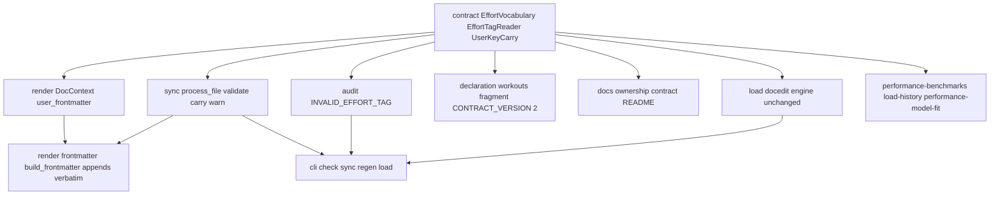
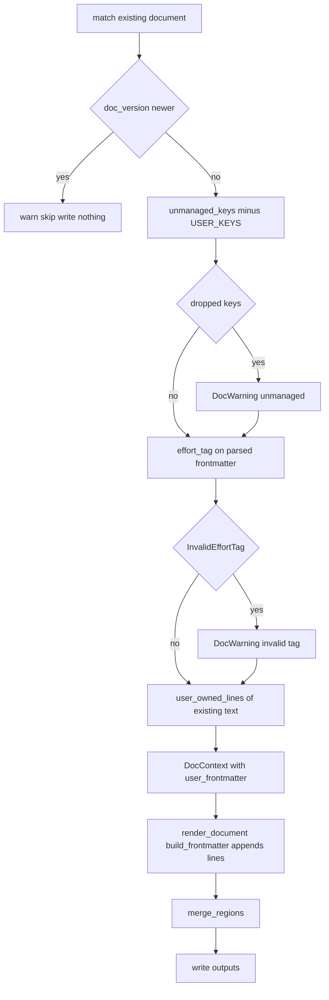
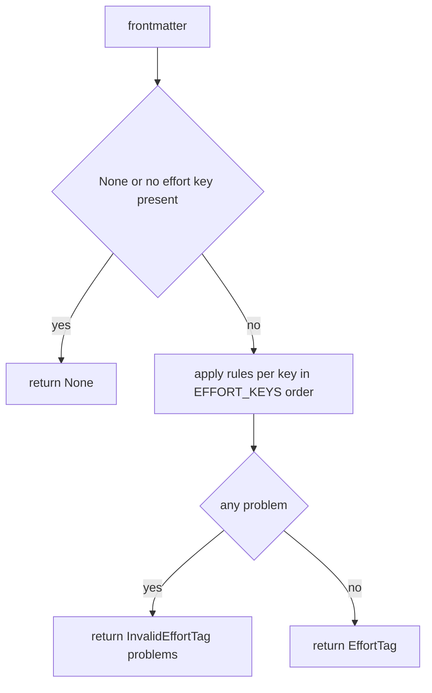

# Technical Design: effort-tags

## Overview

**Purpose**: effort-tags lets an athlete mark a workout page as a **race**, a
**test** or a **hard** effort -- optionally with the official course distance,
the official time and the event -- by editing the page's own frontmatter, and
makes that mark survive every fitdocs operation byte-for-byte. It does so by
adding a third class of frontmatter key to the document contract: **user-owned
keys**, which fitdocs never writes, carries verbatim through `sync`, `sync
--force`, `regen` and the training-load pass, validates loudly on read, and
never confuses with an unmanaged key. The effort tag is the first member.

**Users**: The athlete tags pages by hand (or through their wiki tooling).
`performance-benchmarks`, `load-history` and `performance-model-fit` read the
tag through the one reader this design publishes. Wiki maintainers and LLM
agents learn from the published ownership contract and the in-tree
`AGENTS.md` which frontmatter keys are the athlete's.

**Impact**: No new module, command, dependency or owned path. One pure leaf
gains vocabulary, types, a reader and a line-carry function
(`src/fitdocs/contract.py`); the rewrite path threads the carried lines into
the frontmatter builder through a new defaulted `DocContext` field; the sync
engine warns on a malformed tag; the audit gains one finding kind; the
declaration for `workouts/` gains one sentence; the published contract gains a
section and advances to version `2`. `MANAGED_KEYS` is unchanged, and the
anti-drift pin between it and `build_frontmatter` keeps holding. `DOC_VERSION`
is unchanged: a document that carries no user-owned key is byte-identical
before and after this feature.

### Goals
- A published, disjoint user-owned key set (`USER_KEYS`) in the contract,
  pinned like `MANAGED_KEYS`.
- The effort tag as four flat keys with a closed kind vocabulary, validated on
  read by exactly one reader that never raises and never reads malformed as
  absent.
- Byte-for-byte carry of the athlete's own lines through every rewrite, in a
  stated position, deterministic across repeated regeneration.
- The malformed tag surfaced by `fitdocs check` (its own finding kind) and by
  `sync`/`regen` (a `DocWarning`), both rendering the same problem text.
- The published contract, the README and the `workouts/AGENTS.md` declaration
  stating the class; `CONTRACT_VERSION` `"1"` -> `"2"`.

### Non-Goals
- Deriving anything from a tag, drawing it, listing it, or fitting to it
  (`performance-benchmarks`, `load-history`, `performance-model-fit`).
- Rendering the tag into the document body; changing any metric, load or
  chart because of it.
- Auto-detecting or suggesting efforts (a listed follow-on).
- Reserving the `effort_` prefix: only the four published keys are user-owned.
- Preserving any other hand-added key; a `DOC_VERSION` bump; rewording the
  provenance banner (deferred, see Open Questions).
- Creating, resolving or verifying the page an `effort_event` wikilink names.

## Boundary Commitments

### This Spec Owns
- The **user-owned frontmatter key class** in `src/fitdocs/contract.py`:
  `USER_KEYS`, its disjointness with `MANAGED_KEYS`, and the redefinition of
  `unmanaged_keys` as "keys outside `MANAGED_KEYS | USER_KEYS`".
- The **effort-tag vocabulary and validation**: `EFFORT_KEY`,
  `EFFORT_DISTANCE_KEY`, `EFFORT_TIME_KEY`, `EFFORT_EVENT_KEY`, `EFFORT_KEYS`,
  `EffortKind`, `EffortTag`, `EffortTagProblem`, `InvalidEffortTag`, the
  reader `effort_tag`, and the canonical problem texts.
- The **line carry**: `user_owned_lines(lines)` in the contract; the
  `DocContext.user_frontmatter` field; `build_frontmatter`'s verbatim append;
  `sync._process_file`'s use of both.
- The **malformed-tag reports**: `FindingKind.INVALID_EFFORT_TAG` and its
  remedy in `audit.py`; the `DocWarning` and its detail helper in `sync.py`.
- The **statement of the class** in `docs/ownership-contract.md` (new
  sections, amended sentences, version `2`), `README.md`'s ownership summary,
  the `workouts/` declaration fragment in `declaration.py`, and
  `CONTRACT_VERSION = "2"`.
- The **wiki-contract Existing Spec Update**: the amendment block in
  `.kiro/specs/wiki-contract/requirements.md` (new criteria under Requirement
  6), the note in its `design.md`, and the `spec.json` amendments entry.
- The **tests and pins** for all of the above, including the extensions to
  `tests/test_public_api.py`, `tests/test_contract_consumers.py`,
  `tests/test_ownership_contract.py` and the declaration goldens.

### Out of Boundary
- `MANAGED_KEYS` membership, the frontmatter builder's key order and value
  formats, `DOC_VERSION`, the banner text, the region grammar and merge
  (`wiki-contract`, `workout-docs`).
- The load pass's editor algorithm and `LOAD_KEYS` (`training-load`); this
  spec adds tests to `tests/load/test_docedit.py` and `tests/load/test_engine.py`
  and changes no line of `src/fitdocs/load/`.
- The `check` command's presentation and exit-code mapping (`wiki-contract`);
  the new finding rides the existing generic printer.
- The reference wiki's `wiki-schema.md` (outside this repository).
- Anything a downstream spec does with the tag, including which sports it
  accepts.

### Allowed Dependencies
- `contract` adds only stdlib imports (`dataclasses`, `enum.StrEnum`,
  `math`); it still imports nothing from `render`, `sync`, `load`, `cli`,
  `layout` or `model` (the purity test stands).
- `render/__init__.py` (`DocContext`) and `render/frontmatter.py` depend on
  `contract` as today; the builder names `yaml` only for `safe_dump`.
- `sync` -> `contract` (`effort_tag`, `InvalidEffortTag`, `user_owned_lines`,
  `unmanaged_keys`), plus its existing dependencies.
- `audit` -> `contract` (`effort_tag`, `InvalidEffortTag`), plus its existing
  dependencies.
- `declaration` -> `contract` (`USER_KEYS`, `EFFORT_KEYS`, `CONTRACT_VERSION`).
- Direction unchanged and still enforced: `docmerge -> contract -> {render,
  declaration, audit, sync, load} -> cli`. Nothing new imports `cli`;
  `load/` imports nothing new.

### Revalidation Triggers
- Changing `USER_KEYS` or `EFFORT_KEYS` (adding a key, renaming one) ->
  `docs/ownership-contract.md`'s list, the `workouts/` declaration golden,
  `tests/test_public_api.py`, the three downstream specs' readers, and
  `CONTRACT_VERSION` all move together.
- Changing the kind vocabulary (`EffortKind`) -> every downstream `match`
  over it; the published contract's table.
- Changing the carry position (after managed keys) or the continuation-line
  rule -> the determinism and position tests; the contract document's
  placement sentence.
- Changing `unmanaged_keys`' definition -> wiki-contract Req 6.3/8.4 wording,
  the audit's `UNMANAGED_KEYS` finding, the sync warning.
- Changing `build_frontmatter`'s emission idiom away from `data[k] = v` -> the
  AST anti-drift pin (both the managed-set equality and the new
  "emits no user key" assertion) must be retightened.
- A later `DOC_VERSION` bump -> reword `DOC_BANNER` (deferred item below).

#### Cross-spec obligations (effort-tags <-> performance-benchmarks, load-history, performance-model-fit)
1. **One reader.** Each consumer reads a page as
   `docio.read_frontmatter(path)` -> `contract.effort_tag(frontmatter)` and
   branches on `None` / `EffortTag` / `InvalidEffortTag`. None defines a
   second reader, spells an effort key, or parses YAML; the consumer guard in
   `tests/test_contract_consumers.py` is the enforcement point and each
   consumer's module registers there when it lands.
2. **Malformed is reportable, never untagged.** A consumer meeting
   `InvalidEffortTag` reports the page with `InvalidEffortTag.describe()` and
   skips it; it never treats it as `None`.
3. **Optional fields are `None`, never a default.** `EffortTag.distance_m`,
   `time_s` and `event` are `None` when the page does not carry them;
   `performance-benchmarks` falls back to recorded values by its own rule and
   names the fallback in provenance.
4. **The date is the document's.** The page's local calendar date comes from
   `contract.document_date(frontmatter)`, never from a tag field; this spec
   adds no date key.
5. **Kind is a `StrEnum`.** `EffortKind.RACE == "race"`; a consumer switching
   on it gets exhaustiveness from the type checker.

#### Cross-spec obligations (effort-tags <-> wiki-contract)
1. This spec lands the roadmap's Phase 6 Existing Spec Update for
   `wiki-contract`: Requirement 6 gains criteria 6.5-6.8 (the user-owned key
   class, its verbatim carry, its exclusion from 6.3's warning and 8.4's
   finding, and the declaration naming it) as an Amendment block; no existing
   criterion is renumbered. `design.md`'s DocumentContract block gains an
   amendment note listing the new surface; `spec.json` gains an amendments
   entry.
2. `MANAGED_KEYS` is not edited; `tests/test_contract.py::test_managed_keys_
   equals_the_builders_emittable_keys_plus_load_keys` must pass unchanged, and
   a sibling assertion adds `emittable.isdisjoint(USER_KEYS)`.
3. `CONTRACT_VERSION` advances to `"2"`; the ownership document's preamble
   states what changed.

## Architecture

### Existing Architecture Analysis
- `contract.py` is a pure policy leaf: vocabulary constants, `MANAGED_KEYS`,
  region ownership (`USER_REGIONS`, `TOOL_REGIONS`, `PRESERVED_REGIONS`),
  pure readers that degrade to `None`/`()`, and `frontmatter_close_index` for
  line-level editors. The region analogue of this feature already exists; the
  frontmatter analogue does not.
- The rewrite path (`sync._process_file`) reads the existing document once,
  runs the version gate, computes `unmanaged_keys`, renders from `DocContext`,
  merges regions, writes. The frontmatter block comes wholly from
  `build_frontmatter(ctx)` (one `yaml.safe_dump`).
- The load pass (`load/docedit.py`) edits frontmatter line-by-line, touching
  only column-zero `LOAD_KEYS` lines.
- The audit (`audit.py`) reports independent findings per document through
  `FindingKind`; the CLI prints them generically.
- The declaration (`declaration.py`) is composed from claim-anchored
  fragments and pinned as byte-goldens.

### Architecture Pattern & Boundary Map



**Architecture Integration**:
- Selected pattern: *extend the policy leaf, thread one value through the
  existing rewrite path*. No new layer, no new module.
- Domain/feature boundaries: vocabulary, validation and the line-carry rule
  live only in `contract`; `sync` decides *when* to carry and warn; `render`
  decides *where* the lines land in the block; `audit` decides how a malformed
  tag is reported read-only. No two of these own the same rule.
- Existing patterns preserved: readers degrade and never raise; the builder
  is the block's single emission site and names `yaml` only for `safe_dump`;
  warnings are additive and never change exit codes; findings are independent
  per document; declaration prose is fragment-composed and golden-pinned.
- New components rationale: `UserKeyCarry` exists because verbatim carry
  needs a line-level notion of "the entry for this key", which nothing had
  (`docedit` knows managed key *lines*, not entries with continuations).
- Steering compliance: stdlib only; absent is `None`; no personal data in
  fixtures; every new assertion names its mutation.

### Technology Stack

| Layer | Choice / Version | Role in Feature | Notes |
|-------|------------------|-----------------|-------|
| Contract / model | Python 3.11 stdlib: `dataclasses`, `enum.StrEnum`, `math.isfinite` | Tag types, kind enumeration, validation | No new dependency; `StrEnum` matches `FindingKind`'s convention |
| Frontmatter I/O | PyYAML 6 (`safe_load` in `contract` only; `safe_dump` in the builder only) | Parsing hand-typed values; emitting the managed block | Unchanged usage; carried lines are appended as text, never re-serialized |
| CLI presentation | `typer`/`rich` (existing) | `check` prints the new finding; `sync`/`regen` print the new warning | No CLI code change |

## File Structure Plan

### New Files
```
tests/
├── test_effort_tag_reader.py     # effort_tag: the three outcomes, every rule,
│                                 #   canonical details, describe(), never raises
├── test_user_owned_lines.py      # user_owned_lines: entries, continuations,
│                                 #   quoted keys, position, round trip
└── test_effort_tags_e2e.py       # CLI-level: tag + notes survive sync --force,
                                  #   regen, load; check finding; determinism;
                                  #   body unchanged; deleted-doc regen untagged
```

### Modified Files
- `src/fitdocs/contract.py` -- `EFFORT_KEY`, `EFFORT_DISTANCE_KEY`,
  `EFFORT_TIME_KEY`, `EFFORT_EVENT_KEY`, `EFFORT_KEYS`, `USER_KEYS`;
  `EffortKind`, `EffortTag`, `EffortTagProblem`, `InvalidEffortTag`;
  `effort_tag`, `user_owned_lines`; `unmanaged_keys` subtracts `USER_KEYS`;
  `CONTRACT_VERSION = "2"`; `__all__` extended; module docstring gains a
  "Frontmatter key ownership" section naming the three classes.
- `src/fitdocs/render/__init__.py` -- `DocContext.user_frontmatter:
  tuple[str, ...] = ()`.
- `src/fitdocs/render/frontmatter.py` -- `build_frontmatter` appends
  `ctx.user_frontmatter` verbatim after the dumped block, before the closing
  fence; docstring states the two-part block (serialized managed keys, then
  copied user-owned lines).
- `src/fitdocs/sync.py` -- `_process_file`: after the version gate, compute
  `effort_tag` on the already-parsed frontmatter and append a `DocWarning` for
  `InvalidEffortTag`; compute `user_owned_lines(existing_text.split("\n"))`
  and pass it as `user_frontmatter`; new `_invalid_effort_tag_detail`; module
  docstring's warning section amended (fourth cause, fixed intra-file order:
  unmanaged-key, invalid-tag, map).
- `src/fitdocs/audit.py` -- `FindingKind.INVALID_EFFORT_TAG`,
  `_REMEDY_FIX_EFFORT_TAG`, one branch in `_document_findings`.
- `src/fitdocs/declaration.py` -- `_USER_KEYS` fragment (workouts only) with
  its CLAIM ANCHOR; `declaration_text` selects it after `_REGIONS`.
- `docs/ownership-contract.md` -- version `2`; "Frontmatter Ownership" and
  "Managed Frontmatter Keys" sentences amended; new `## User-Owned Frontmatter
  Keys` (the four-key list only) and `## The Effort Tag` (kinds, fields,
  units, rules, placement, malformed handling); regeneration/overwrite bullets
  amended.
- `README.md` -- the Ownership paragraph names the effort-tag keys as
  user-owned.
- `.kiro/specs/wiki-contract/requirements.md`, `design.md`, `spec.json` --
  the amendment (see cross-spec obligations).
- `tests/test_contract.py` -- `USER_KEYS` pins (disjoint with `MANAGED_KEYS`,
  equals `frozenset(EFFORT_KEYS)`, immutable), `unmanaged_keys` exempts user
  keys, `emittable.isdisjoint(USER_KEYS)` beside the existing anti-drift
  assertion, `CONTRACT_VERSION == "2"` is *not* pinned by value (the existing
  identifier test stands).
- `tests/test_public_api.py` -- `_CONTRACT_SURFACE` gains the twelve names (ten with the vocabulary, then `effort_tag` and `user_owned_lines` one each with the task that creates it).
- `tests/test_contract_consumers.py` -- `CONTRACT_BINDINGS["fitdocs.sync"]`
  gains `effort_tag`, `user_owned_lines`, `unmanaged_keys`;
  `["fitdocs.audit"]` gains `effort_tag`; `["fitdocs.declaration"]` gains
  `USER_KEYS`.
- `tests/render/test_frontmatter.py` -- appended-lines, byte-neutral-when-empty,
  and valid-YAML-after-append cases.
- `tests/test_sync.py` -- carry through `sync --force` and `regen`, malformed
  warning and its order, no unmanaged warning for a tagged page, determinism,
  position.
- `tests/load/test_docedit.py`, `tests/load/test_engine.py` -- user-owned
  lines byte-identical through upsert, strip, restore, compute and recompute.
- `tests/test_audit.py`, `tests/test_cli_check.py` -- the new finding kind;
  the every-kind CLI test extended.
- `tests/test_declaration.py`, `tests/declaration_golden/*.AGENTS.md` -- the
  fragment and the version line.
- `tests/test_ownership_contract.py` -- `test_user_owned_keys_equal_contract_
  exactly`, version-`2` conformance via the existing version test.

## System Flows

### The rewrite path with user-owned keys (sync and regen)



- The carry happens whether or not the tag is valid (4.4): validation only
  decides whether a warning is recorded.
- A first-time render has no existing document, so `user_frontmatter` is `()`
  and the block is byte-identical to today's output (1.2, 4.6).
- The load pass that the CLI runs after `sync`/`regen` re-appends the load
  keys after the carried lines; the order managed -> user-owned -> load is
  therefore the steady state and is documented as such (4.5).

### The reader's decision



- "No effort key present" means none of the four keys is a key of the
  mapping. A key present with a null value counts as present and is validated
  (an `effort:` line with no value is a malformed kind, not an untagged page).

## Requirements Traceability

| Requirement | Summary | Components | Interfaces | Flows |
|-------------|---------|------------|------------|-------|
| 1.1 | Published, disjoint user-owned set | EffortVocabulary, SurfacePins, ContractDocs | `USER_KEYS`, `EFFORT_KEYS` | -- |
| 1.2 | fitdocs never writes a user-owned key | FrontmatterBuilder, SurfacePins | `build_frontmatter` emits no user key (AST pin) | rewrite |
| 1.3 | Absent means untagged, no placeholder | EffortTagReader, FrontmatterBuilder | `effort_tag -> None`; `user_frontmatter=()` | reader |
| 1.4 | Other keys stay unmanaged | UserKeyCarry (`unmanaged_keys`), SyncEngine, ContractAudit | `unmanaged_keys` | rewrite |
| 1.5 | Managed set unchanged, pin holds | SurfacePins | existing AST equality | -- |
| 2.1 | Four flat keys, names and units | EffortVocabulary, ContractDocs | `EFFORT_*_KEY` | -- |
| 2.2 | Closed kinds, exact match | EffortTagReader | `EffortKind`, rule K2 | reader |
| 2.3 | Value shapes | EffortTagReader | rules D1, T1, E1 | reader |
| 2.4 | Distance requires time; time may stand alone | EffortTagReader | rule D2 | reader |
| 2.5 | Field without `effort` is malformed | EffortTagReader | rule K1 | reader |
| 2.6 | Wikilink kept as written | EffortTagReader, UserKeyCarry | `EffortTag.event`; verbatim carry | -- |
| 2.7 | No consequence in this feature | FrontmatterBuilder, E2E | body identical with/without tag | -- |
| 2.8 | Any sport or modality | EffortTagReader, E2E | reader is sport-blind | -- |
| 3.1 | Malformed is a third outcome | EffortTagReader | `InvalidEffortTag` | reader |
| 3.2 | Never coerced or repaired | EffortTagReader, UserKeyCarry | type checks; verbatim carry | -- |
| 3.3 | Names document, key, expectation | EffortTagReader, SyncEngine, ContractAudit | `EffortTagProblem`, `describe()` | -- |
| 3.4 | sync/regen warning, run succeeds, lines kept | SyncEngine | `DocWarning`, `_invalid_effort_tag_detail` | rewrite |
| 3.5 | Distinct check finding | ContractAudit, CliApp | `FindingKind.INVALID_EFFORT_TAG` | -- |
| 3.6 | Valid tag: no warning, no finding | SyncEngine, ContractAudit | -- | rewrite |
| 3.7 | Unquoted wikilink named as such | EffortTagReader | rule E1 detail | reader |
| 4.1 | Carry through sync incl. --force | SyncEngine, FrontmatterBuilder, UserKeyCarry | `user_owned_lines`, `user_frontmatter` | rewrite |
| 4.2 | Carry through regen | SyncEngine (regen shares `_process_file`) | same | rewrite |
| 4.3 | Load pass leaves lines byte-identical | LoadPassPreservation | `apply_frontmatter_load`, `strip_frontmatter_load`, `apply_load` | -- |
| 4.4 | Carried regardless of validity | SyncEngine, UserKeyCarry | carry precedes no validity check | rewrite |
| 4.5 | Placement after managed keys, document order | FrontmatterBuilder, UserKeyCarry, ContractDocs | append rule; placement sentence | rewrite |
| 4.6 | Determinism; byte-neutral when untagged | FrontmatterBuilder, E2E | `()` default; regen twice | rewrite |
| 4.7 | Unmanaged warning/finding exclude user keys | UserKeyCarry (`unmanaged_keys`), SyncEngine, ContractAudit | `unmanaged_keys` | rewrite |
| 4.8 | Deleted doc regenerates untagged | E2E | `regen` fresh render path | rewrite |
| 5.1 | One reader, three outcomes | EffortTagReader | `effort_tag` | reader |
| 5.2 | Never raises; accepts `None` | EffortTagReader | signature accepts a mapping or `None` | reader |
| 5.3 | Closed enum; typed optional fields | EffortVocabulary, EffortTagReader | `EffortKind`, `EffortTag` | -- |
| 5.4 | One definition, no second reader | SurfacePins (consumer guard) | `CONTRACT_BINDINGS` | -- |
| 5.5 | Published surface pinned | SurfacePins | `_CONTRACT_SURFACE` | -- |
| 5.6 | One rendering of problems | EffortTagReader, SyncEngine, ContractAudit | `InvalidEffortTag.describe()` | -- |
| 6.1 | Contract doc lists keys, rules, placement | ContractDocs | `## User-Owned Frontmatter Keys`, `## The Effort Tag` | -- |
| 6.2 | Ownership sentences amended | ContractDocs | -- | -- |
| 6.3 | Contract version advances | DeclarationWriter (`CONTRACT_VERSION`), ContractDocs | `"2"` | -- |
| 6.4 | Declaration names the keys | DeclarationWriter | `_USER_KEYS` fragment | -- |
| 6.5 | Conformance test holds the list equal | ContractDocs, SurfacePins | `test_user_owned_keys_equal_contract_exactly` | -- |
| 6.6 | README mentions the keys | ContractDocs | -- | -- |

## Components and Interfaces

| Component | Domain/Layer | Intent | Req Coverage | Key Dependencies (P0/P1) | Contracts |
|-----------|--------------|--------|--------------|--------------------------|-----------|
| EffortVocabulary | contract (leaf) | Key names, the user-owned set, the kind enumeration, the tag types | 1.1, 2.1, 2.2, 5.3, 5.5 | stdlib (P0) | State |
| EffortTagReader | contract (leaf) | `effort_tag`: three outcomes, canonical problems, `describe()` | 1.3, 2.2-2.8, 3.1-3.3, 3.6, 3.7, 5.1-5.3, 5.6 | EffortVocabulary (P0) | Service |
| UserKeyCarry | contract (leaf) | `user_owned_lines`; `unmanaged_keys` redefinition | 1.4, 2.6, 3.2, 4.4, 4.5, 4.7 | `frontmatter_close_index` (P0) | Service |
| FrontmatterBuilder | render | `DocContext.user_frontmatter`; verbatim append | 1.2, 1.3, 2.7, 4.5, 4.6 | contract (P0), pyyaml `safe_dump` (P0) | Service |
| SyncEngine | engine | Validate, warn, carry on every rewrite | 1.4, 3.4, 3.6, 4.1, 4.2, 4.4, 4.7 | contract (P0), FrontmatterBuilder (P0) | Batch |
| LoadPassPreservation | load (tests only) | Prove the load pass leaves the lines alone | 4.3 | docedit, engine (P0) | -- |
| ContractAudit | audit | `INVALID_EFFORT_TAG` finding; unmanaged finding exempts user keys | 1.4, 3.3, 3.5, 3.6, 4.7 | contract (P0) | Service |
| DeclarationWriter | declaration | `CONTRACT_VERSION = "2"`; the workouts fragment | 6.3, 6.4 | contract (P0) | State |
| ContractDocs | docs + upstream spec | Published contract, README, wiki-contract amendment | 1.1, 2.1, 4.5, 6.1-6.3, 6.5, 6.6 | conformance test (P0) | -- |
| SurfacePins | tests | `__all__`, consumer bindings, anti-drift, e2e | 1.1, 1.2, 1.5, 5.4, 5.5, 6.5 | all of the above | -- |

### Contract (leaf)

#### EffortVocabulary (`src/fitdocs/contract.py`)

| Field | Detail |
|-------|--------|
| Intent | The published names and types every consumer switches on |
| Requirements | 1.1, 2.1, 2.2, 5.3, 5.5 |

**Responsibilities & Constraints**
- Owns the four key spellings, their documentation order, the user-owned set,
  the closed kind enumeration, and the tag value types.
- `USER_KEYS` is a `frozenset` (a class, like `MANAGED_KEYS`); `EFFORT_KEYS`
  is the ordered tuple used wherever the keys are listed in prose or
  problems are ordered.
- Invariant: `USER_KEYS.isdisjoint(MANAGED_KEYS)`; `USER_KEYS ==
  frozenset(EFFORT_KEYS)`; neither is emitted by `build_frontmatter`.

**Contracts**: State [x]

##### State / Service Interface
```python
# --- user-owned frontmatter keys (Req 1.1, 2.1) -----------------------------
EFFORT_KEY: Final[str] = "effort"
EFFORT_DISTANCE_KEY: Final[str] = "effort_distance_m"
EFFORT_TIME_KEY: Final[str] = "effort_time_s"
EFFORT_EVENT_KEY: Final[str] = "effort_event"

EFFORT_KEYS: Final[tuple[str, ...]] = (
    EFFORT_KEY, EFFORT_DISTANCE_KEY, EFFORT_TIME_KEY, EFFORT_EVENT_KEY,
)
"""The effort tag's keys in documentation order; also problem-report order."""

USER_KEYS: Final[frozenset[str]] = frozenset(EFFORT_KEYS)
"""Every frontmatter key fitdocs preserves verbatim but never writes (the
user-owned class, parallel to USER_REGIONS). Disjoint with MANAGED_KEYS."""

class EffortKind(StrEnum):
    RACE = "race"
    TEST = "test"
    HARD = "hard"

@dataclass(frozen=True)
class EffortTag:
    kind: EffortKind
    distance_m: float | None   # official course distance, metres
    time_s: float | None       # official / chip time, seconds
    event: str | None          # as written, e.g. "[[Boston Marathon 2024]]"

@dataclass(frozen=True)
class EffortTagProblem:
    key: str      # one of EFFORT_KEYS
    detail: str   # the expectation it failed, and what was found

@dataclass(frozen=True)
class InvalidEffortTag:
    problems: tuple[EffortTagProblem, ...]   # non-empty; EFFORT_KEYS order
    def describe(self) -> str: ...           # "effort: ...; effort_time_s: ..."
```

**Implementation Notes**
- Integration: the ten vocabulary and type names join `contract.__all__` and
  `tests/test_public_api.py::_CONTRACT_SURFACE` with this component; the two
  functions (`effort_tag`, `user_owned_lines`) are appended to both by the
  tasks that create them, so the surface pin is green at every step.
- Validation: value pins in `tests/test_contract.py` (spellings, order,
  disjointness, frozenset), mutation: adding `"effort"` to `MANAGED_KEYS`
  reddens the disjointness test and the existing anti-drift test together.
- Risks: a future key added to `EFFORT_KEYS` but not to the ownership document
  -- caught by the conformance test (6.5).

#### EffortTagReader (`src/fitdocs/contract.py`)

| Field | Detail |
|-------|--------|
| Intent | The one reader: absent, valid, or malformed with named problems |
| Requirements | 1.3, 2.2-2.8, 3.1-3.3, 3.6, 3.7, 5.1-5.3, 5.6 |

**Responsibilities & Constraints**
- Pure; never raises; accepts the `None` the parser returns for an
  unreadable document (answers `None`).
- Absent: `frontmatter is None` or none of `EFFORT_KEYS` is a key of the
  mapping. Otherwise every rule below is applied; at most one problem per
  key (the first failing rule), problems in `EFFORT_KEYS` order; any problem
  yields `InvalidEffortTag`, else `EffortTag`.
- Numeric values are accepted as `int` or `float` (never `bool`), finite,
  strictly positive; stored as `float`. Strings are never parsed into numbers
  (3.2). Text is accepted as `str` with non-empty `strip()`; stored as
  written, unstripped (2.6).
- Sport-blind (2.8); attaches no meaning (2.7).

**Contracts**: Service [x]

##### Service Interface
```python
def effort_tag(
    frontmatter: Mapping[str, object] | None,
) -> EffortTag | InvalidEffortTag | None: ...
```

Validation rules and their canonical details (the exact `detail` strings;
`{value!r}` is the parsed value's `repr`):

| Id | Key | Rule | Canonical detail |
|----|-----|------|------------------|
| K1 | `effort` | present (a key of the mapping) whenever any other effort key is present | `required whenever any other effort key is present; expected one of race, test, hard` |
| K2 | `effort` | value is a `str` equal to one of `race`, `test`, `hard` (exact, case-sensitive) | `must be one of race, test, hard (exact, lowercase); got {value!r}` |
| D1 | `effort_distance_m` | `int`/`float`, not `bool`, finite, `> 0` | `must be a positive number of metres; got {value!r}` |
| D2 | `effort_distance_m` | `effort_time_s` is also present | `requires effort_time_s: a course distance is an official result only together with its time` |
| T1 | `effort_time_s` | `int`/`float`, not `bool`, finite, `> 0` | `must be a positive number of seconds; got {value!r}` |
| E1 | `effort_event` | `str` with non-empty `strip()` | `must be non-empty text; quote a wikilink, e.g. effort_event: "[[Boston Marathon 2024]]"; got {value!r}` |

- Preconditions: none.
- Postconditions: exactly one of the three types is returned; an
  `InvalidEffortTag` has at least one problem and no two problems share a
  key; `describe()` returns `"; ".join(f"{p.key}: {p.detail}")` in
  `EFFORT_KEYS` order; a valid tag's numeric fields equal the parsed numbers
  as `float`.
- Invariants: the same mapping always yields an equal result (pure); a
  mapping with no effort key never yields anything but `None`.

**Implementation Notes**
- Integration: `sync`, `audit` and every downstream pass call this and
  nothing else; `describe()` is the only renderer of the problems (5.6).
- Validation: one fixture per rule that *violates* it and one that satisfies
  it (never a pre-satisfied fixture); named mutations -- drop the `bool`
  guard (`True` passes D1), drop `isfinite` (`inf` passes), flip `> 0` to
  `>= 0` (`0` passes), lower-case the kind before comparing (`Race` passes),
  make K1 return `None` instead of a problem (an orphan field reads as
  untagged), reorder problems (a two-problem fixture asserts order).
- Risks: `repr` of a very long value in a detail -- acceptable; the athlete
  typed it.

#### UserKeyCarry (`src/fitdocs/contract.py`)

| Field | Detail |
|-------|--------|
| Intent | The verbatim line carry and the unmanaged-key redefinition |
| Requirements | 1.4, 2.6, 3.2, 4.4, 4.5, 4.7 |

**Responsibilities & Constraints**
- `user_owned_lines(lines)` takes the *lossless* `markdown.split("\n")` list
  (the same precondition as `frontmatter_close_index`) and returns, verbatim
  and in document order, every line belonging to a top-level entry whose key
  is in `USER_KEYS`.
- A **top-level entry** starts at a line inside the fences that is non-empty,
  whose first character is not whitespace, `#` or `-`, and that contains
  `:`; its key is the text before the first `:`, stripped of whitespace and
  of one pair of matching surrounding quotes (`'` or `"`). Every following
  line up to the next entry start or the closing fence -- indented lines,
  column-zero `- ` list items, blank lines, comment lines -- belongs to that
  entry. Lines before the first entry belong to none.
- Returns `()` when there is no leading fence, the block is unterminated, or
  no user-owned entry exists. Never raises. Does not parse YAML and does not
  validate: a malformed tag's lines are carried exactly like a valid one's
  (4.4).
- `unmanaged_keys(frontmatter)` now returns the sorted, deduplicated string
  keys outside `MANAGED_KEYS | USER_KEYS` -- the keys a rewrite drops.

**Contracts**: Service [x]

##### Service Interface
```python
def user_owned_lines(lines: list[str]) -> tuple[str, ...]: ...
def unmanaged_keys(frontmatter: Mapping[str, object]) -> tuple[str, ...]: ...
```
- Postconditions: every returned line is an element of `lines`, unmodified;
  `user_owned_lines(build_frontmatter(ctx_with(lines)).split("\n")) ==
  lines` (round trip -- pinned in the builder's test module, since it needs
  the builder's carried-lines field); `unmanaged_keys({"effort": "race",
  "tags": "x"}) == ("tags",)`.

**Implementation Notes**
- Integration: `sync._process_file` is the only production caller of
  `user_owned_lines`; `unmanaged_keys` keeps its two callers (`sync`, `audit`).
- Validation: fixtures -- a user key between managed keys, at the end after
  load keys, a block scalar (`effort_event: >-` with two indented lines), a
  quoted key, a user key followed by a comment line, a document whose
  managed `sources:` list precedes the user key (its `- ` items must not
  start entries), two user keys in reverse documentation order (carried in
  document order). Mutations -- carry only the key line (block-scalar fixture
  reds), skip quote stripping (quoted-key fixture reds), treat `- ` lines as
  entry starts (the `sources`-then-user-key fixture reds because the user
  line's entry boundary moves), revert `unmanaged_keys` to `MANAGED_KEYS`
  only (`("effort", "tags")` returned).
- Risks: a duplicated user-owned key is carried twice and validated on its
  last value only -- stated as a known limitation in the ownership document.

### Render

#### FrontmatterBuilder (`src/fitdocs/render/frontmatter.py`, `src/fitdocs/render/__init__.py`)

| Field | Detail |
|-------|--------|
| Intent | Land the carried lines in the block at the stated position |
| Requirements | 1.2, 1.3, 2.7, 4.5, 4.6 |

**Responsibilities & Constraints**
- `DocContext` gains `user_frontmatter: tuple[str, ...] = ()` after
  `map_data`; every existing constructor call stays valid.
- `build_frontmatter` returns `f"{FENCE}\n{dumped}{carried}{FENCE}\n"` where
  `carried = "".join(f"{line}\n" for line in ctx.user_frontmatter)`. The
  managed block is still the single `yaml.safe_dump`; the carried text is
  copied, never serialized -- the builder still names `yaml` only for
  `safe_dump`, so the consumer guard's emitter rule holds.
- The builder never derives a user-owned key from the activity: no
  `data[<user key>] = ...` exists, pinned by extending the AST anti-drift
  test with `emittable.isdisjoint(USER_KEYS)`.
- Precondition (documented, not checked): no element of `user_frontmatter`
  contains `"\n"` -- guaranteed by its only producer, `user_owned_lines` over
  a `split("\n")` list.

**Contracts**: Service [x]

##### Service Interface
```python
@dataclass(frozen=True)
class DocContext:
    ...
    map_data: MapData | None = None
    user_frontmatter: tuple[str, ...] = ()   # verbatim user-owned lines, or ()

def build_frontmatter(ctx: DocContext) -> str: ...
```

**Implementation Notes**
- Integration: `views._assemble` is unchanged; goldens are unchanged because
  no fixture carries a tag.
- Validation: `tests/render/test_frontmatter.py` -- lines appear verbatim
  between the last managed key and the closing fence; `()` yields the exact
  block the existing test pins; the appended block still parses as a mapping
  containing the user keys; the `user_owned_lines` round trip over the
  builder's output, including a block-scalar value. Mutation: drop `carried`
  from the f-string (append and round-trip tests red); prepend instead of
  append (position test reds).
- Risks: none beyond the precondition above.

### Engines

#### SyncEngine (`src/fitdocs/sync.py`)

| Field | Detail |
|-------|--------|
| Intent | On every rewrite: warn on a malformed tag, carry the lines |
| Requirements | 1.4, 3.4, 3.6, 4.1, 4.2, 4.4, 4.7 |

**Responsibilities & Constraints**
- In `_process_file`, inside the `match is not None` branch after the version
  gate (which still returns first and rewrites nothing): reuse
  `existing_frontmatter`; `unmanaged_keys` (now exempting user keys) as
  today; then `effort_tag(existing_frontmatter)` and, for
  `InvalidEffortTag`, `DocWarning(doc=match_ref, detail=
  _invalid_effort_tag_detail(tag))`; then `carried =
  user_owned_lines(existing_text.split("\n"))`.
- `DocContext(..., user_frontmatter=carried)`. `regen` shares this function,
  so 4.2 follows from 4.1.
- Intra-file warning order is fixed by statement order and documented on
  `SyncReport.warnings`: unmanaged-key, invalid-effort-tag, map omission.
- `_invalid_effort_tag_detail(tag)` returns `"carries an effort tag fitdocs
  cannot read -- preserved unchanged, not in effect until corrected: " +
  tag.describe()`.
- A raising file still carries no warning (the pending list is discarded
  together, as today).

**Contracts**: Batch [x]

##### Batch / Job Contract
- Trigger: the rewrite of a matched document in `sync`/`regen`.
- Input / validation: the already-parsed existing frontmatter and the
  already-read existing text; no second read, no second parse.
- Output / destination: the rewritten document with the user-owned lines in
  place; zero or one `DocWarning` for a malformed tag.
- Idempotency & recovery: a second run over an unchanged document is
  byte-identical (4.6); a version-gated document is untouched and never
  warned for its tag.

**Implementation Notes**
- Integration: the module docstring's "Unmanaged-frontmatter-key warning"
  section gains a sibling paragraph; `_unmanaged_keys_detail` is unchanged.
- Validation: `tests/test_sync.py` -- a tag whose event is a two-line block
  scalar, and one with a quoted wikilink, survive `sync --force` and `regen`
  on a page that also carries an edited `notes` region; malformed tag warns
  once with `describe()`'s text and the lines are still present; a tagged
  page with no other extra key produces **no** warning; a page with `tags:`
  *and* a valid tag warns once, naming `tags` only; regen twice is
  byte-identical; the carried lines sit after the last managed key. Mutations:
  pass `()` instead of `carried` (survival reds), drop the `isinstance`
  branch (malformed warning reds), revert `unmanaged_keys` (no-warning test
  reds), swap the two warning statements (order test reds).
- Risks: adding a fourth warning cause falsifies any docstring that
  enumerated the causes -- grep `sync.py` and `cli.py` for such lists in the
  same task (the wiki-contract 5.1 note).

#### LoadPassPreservation (`src/fitdocs/load/docedit.py`, `src/fitdocs/load/engine.py` -- tests only)

| Field | Detail |
|-------|--------|
| Intent | Prove, not change: the load pass leaves user-owned lines byte-identical |
| Requirements | 4.3 |

**Responsibilities & Constraints**
- No production change. `_is_managed_line` matches only column-zero lines
  whose key is in `LOAD_KEYS`; `apply_frontmatter_load` and
  `strip_frontmatter_load` keep every other line in order;
  `replace_load_region` touches only the region interior.
- Observed consequence, stated in the contract: after a load pass the load
  keys follow the carried user-owned lines.

**Implementation Notes**
- Validation: `tests/load/test_docedit.py` -- a block holding the four user
  lines (one block scalar among them) plus stale load keys: after
  `apply_frontmatter_load`, `strip_frontmatter_load` and
  `replace_load_region` the user lines are byte-identical and in the same
  relative order. `tests/load/test_engine.py` -- a synced page tagged by hand,
  run through `apply_load` on the restore path, the compute path (stub
  calculator) and `recompute=True`: the user lines are byte-identical each
  time. Mutation: extend `_is_managed_line`'s membership test with
  `or key.startswith("effort")` (both modules' new tests red).

### Audit

#### ContractAudit (`src/fitdocs/audit.py`)

| Field | Detail |
|-------|--------|
| Intent | Report a malformed tag read-only, distinct from the unmanaged finding |
| Requirements | 1.4, 3.3, 3.5, 3.6, 4.7 |

**Responsibilities & Constraints**
- `FindingKind.INVALID_EFFORT_TAG = "invalid_effort_tag"`.
- `_document_findings`: `tag = effort_tag(frontmatter)`; for
  `InvalidEffortTag`, `Finding(kind=INVALID_EFFORT_TAG, subject=subject,
  detail=f"malformed effort tag: {tag.describe()}", remedy=
  _REMEDY_FIX_EFFORT_TAG)`.
- `_REMEDY_FIX_EFFORT_TAG = "correct the named effort key(s) by hand; the tag
  is preserved as written but is not in effect until it is valid"`.
- The `UNMANAGED_KEYS` finding exempts user keys through the redefined
  `unmanaged_keys`; a valid tag yields no finding. Findings stay independent:
  a document can carry both an unmanaged key and a malformed tag.
- Read-only, offline, opens no `.fit` (unchanged).

**Contracts**: Service [x]

##### Service Interface
```python
class FindingKind(StrEnum):
    ...
    INVALID_EFFORT_TAG = "invalid_effort_tag"
```

**Implementation Notes**
- Integration: `cli._report_audit` prints subject/detail/remedy generically;
  `tests/test_cli_check.py::test_check_reports_every_finding_kind_and_exits_
  one` gains a malformed-tag fixture with a distinctive detail fragment (the
  offending key name) and remedy fragment (`"not in effect"`).
- Validation: `tests/test_audit.py` -- malformed -> one finding of the new
  kind with `describe()` text in `detail`; valid -> no finding; `effort` +
  `tags` -> `UNMANAGED_KEYS` names `tags` only; both defects on one document
  -> two findings. Mutations: drop the new branch; revert `unmanaged_keys`.
- Risks: exit code -- a malformed tag makes `check` exit 1 like every finding
  (wiki-contract 8.7); intended and documented.

### Declaration and Documentation

#### DeclarationWriter (`src/fitdocs/declaration.py`, `contract.CONTRACT_VERSION`)

| Field | Detail |
|-------|--------|
| Intent | Advance the contract version; tell LLM agents which keys are the athlete's |
| Requirements | 6.3, 6.4 |

**Responsibilities & Constraints**
- `CONTRACT_VERSION: Final[str] = "2"`, its docstring recording why: a stated
  guarantee (what regeneration preserves in the frontmatter block) changed.
- New fragment, workouts only, selected after `_REGIONS` and before
  `_REDERIVABILITY_DOCS`:
  `_USER_KEYS = "The frontmatter keys {user_keys_list} are user-owned:
  fitdocs never writes them and carries them unchanged through regeneration.
  The rest of the frontmatter block is tool-owned and rebuilt on
  regeneration."` with `user_keys_list = _english_list(f"`{k}`" for k in
  EFFORT_KEYS)`. CLAIM ANCHOR: `contract.USER_KEYS`; `sync._process_file`'s
  carry; `render.frontmatter.build_frontmatter`'s append; the unmanaged drop
  for everything else.
- The sentence quantifies over *keys*, never over documents, and its line
  contains no "region" word, so the existing quantifier guard is not
  triggered and no per-document claim is made (Req 3.2a of wiki-contract).
- The archive declaration changes only in its restated version.

**Implementation Notes**
- Integration: both goldens regenerated with `uv run python -m
  tests.test_declaration_goldens`; `docs/ownership-contract.md` line 3 moves
  to `2` in the ContractDocs task (its conformance test compares to
  `CONTRACT_VERSION`).
- Validation: `tests/test_declaration.py::test_workouts_declaration_names_
  every_user_owned_key` (every key in `USER_KEYS` appears backticked in the
  workouts text and none in the archive text); goldens byte-equal. Mutation:
  drop the fragment (golden and the new test red).

#### ContractDocs (`docs/ownership-contract.md`, `README.md`, `.kiro/specs/wiki-contract/*`)

| Field | Detail |
|-------|--------|
| Intent | The published statement of the class, and the upstream spec's record of it |
| Requirements | 1.1, 2.1, 4.5, 6.1, 6.2, 6.3, 6.5, 6.6 |

**Responsibilities & Constraints**
- `docs/ownership-contract.md`:
  - `**Contract version:** \`2\``; the preamble's "what changes the version"
    sentence gains "a new class of preserved frontmatter key".
  - `## Frontmatter Ownership`: the block is tool-owned and rebuilt on every
    regeneration **except** the user-owned keys, which are carried over
    verbatim and placed after the managed keys, in the order they appeared.
  - `## Managed Frontmatter Keys`: list unchanged; "Any other key present in a
    document is unmanaged" becomes "Any key that is neither managed nor
    listed under User-Owned Frontmatter Keys below is unmanaged".
  - New `## User-Owned Frontmatter Keys`: exactly four backticked list items
    (`effort`, `effort_distance_m`, `effort_time_s`, `effort_event`) and
    prose: never written by fitdocs, no placeholder, carried byte-for-byte
    through `sync`, `sync --force`, `regen` and `load`, position, the
    known limitation (a duplicated key is carried twice and read by its last
    value), and the deleted-document exception shared with regions.
  - New `## The Effort Tag`: a table of the kinds; a table of the fields with
    units and rules (distance requires time; time may stand alone; `effort`
    required; quote a wikilink); what a malformed tag does (`check` finding,
    `sync`/`regen` warning, preserved but not in effect); what fitdocs does
    with a valid tag in this version (nothing -- downstream features read it).
  - "What Regeneration Replaces and Preserves" and the `sync` / `regen` /
    `load` bullets under Overwrite Semantics amended by one clause each.
- `README.md` Ownership paragraph: "You own every document's `notes` and
  `workout` regions and its effort-tag frontmatter keys (`effort`,
  `effort_distance_m`, `effort_time_s`, `effort_event`)".
- `.kiro/specs/wiki-contract/requirements.md`: `## Amendment 1 (2026-09-10):
  user-owned frontmatter keys (landed by effort-tags)` and, under Requirement
  6, criteria 6.5 (publish the user-owned set, disjoint from the managed set,
  never written), 6.6 (carried verbatim through every rewrite, placement
  stated), 6.7 (excluded from 6.3's warning and 8.4's finding; a malformed
  member is its own finding), 6.8 (the documents directory's declaration
  names them). `design.md`: DocumentContract amendment note (new surface,
  `unmanaged_keys` postcondition) and a "This Spec Owns" bullet. `spec.json`:
  an `amendments` entry.

**Implementation Notes**
- Validation: `tests/test_ownership_contract.py::test_user_owned_keys_equal_
  contract_exactly` parses the new section with the existing helpers and
  asserts set equality with `contract.USER_KEYS`; the existing version test
  holds `2`. Mutations: add a bogus key to the list (red); remove one (red);
  move the kinds into that section as a backticked list (red -- which is why
  they live in `## The Effort Tag`).
- Risks: prose absolutes -- grep the finished sections for
  every/all/never/always and check each against code, listing the hits in the
  task's report (the wiki-contract 7.1 lesson).

### Pins

#### SurfacePins (`tests/test_public_api.py`, `tests/test_contract_consumers.py`, `tests/test_contract.py`, `tests/test_effort_tags_e2e.py`)

| Field | Detail |
|-------|--------|
| Intent | Make every new published name, binding and guarantee fail loudly when drifted |
| Requirements | 1.1, 1.2, 1.5, 2.7, 2.8, 4.6, 4.8, 5.4, 5.5, 6.5 |

**Responsibilities & Constraints**
- `_CONTRACT_SURFACE` gains: `EFFORT_KEY`, `EFFORT_DISTANCE_KEY`,
  `EFFORT_TIME_KEY`, `EFFORT_EVENT_KEY`, `EFFORT_KEYS`, `USER_KEYS`,
  `EffortKind`, `EffortTag`, `EffortTagProblem`, `InvalidEffortTag`,
  `effort_tag`, `user_owned_lines`.
- `CONTRACT_BINDINGS`: `fitdocs.sync` += (`effort_tag`, `user_owned_lines`,
  `unmanaged_keys`); `fitdocs.audit` += (`effort_tag`,);
  `fitdocs.declaration` += (`USER_KEYS`,). The identity check then covers the
  new bindings; the YAML-emitter rule and the literal scans are unchanged.
- `tests/test_contract.py`: `USER_KEYS` pins; `emittable.isdisjoint(USER_KEYS)`
  in the anti-drift test; `unmanaged_keys` exempts user keys.
- `tests/test_effort_tags_e2e.py` (CLI-level, through `typer`'s runner as
  `tests/test_cli_check.py` does, not through the engine functions): sync a
  fixture; hand-add a valid tag (with a quoted wikilink event) and edit
  `notes`; `fitdocs sync --force`, `fitdocs regen`, `fitdocs load` -- the tag
  lines and the note survive each, byte-for-byte, and `fitdocs check` exits 0;
  the document body (everything after the closing fence) equals the untagged
  render's body (2.7); a strength fixture tagged the same way behaves the
  same (2.8); `regen` twice is byte-identical; a malformed tag makes `check`
  exit 1 with the new kind and `regen` warn while preserving the lines;
  deleting the document and running `regen` yields an untagged document
  (4.8); the committed goldens are untouched (4.6, by the existing golden
  suite staying green).

## Data Models

### Domain Model
- **Frontmatter key ownership** now partitions the block three ways:
  `MANAGED_KEYS` (fitdocs writes and restores), `USER_KEYS` (the athlete
  writes; fitdocs carries verbatim, never writes), and everything else
  (unmanaged; dropped with a warning). The three are pairwise disjoint by
  construction.
- **An effort tag** is a value object read from the four keys: a required
  closed kind and three optional fields, with two cross-field invariants
  (`effort` required when any other key is present; distance requires time).
- **Tag state** for a page is one of *untagged*, *valid*, *malformed*; only
  the reader decides it, and the same page always reads the same way.

### Logical Data Model

The four user-owned keys, as the athlete writes them:

| Key | Type as parsed | Presence | Meaning | Rule |
|-----|----------------|----------|---------|------|
| `effort` | `str` in {`race`, `test`, `hard`} | required for a tag | the kind | K1, K2 |
| `effort_distance_m` | `int`/`float` > 0, finite | optional | official / certified course distance, metres | D1, D2 |
| `effort_time_s` | `int`/`float` > 0, finite | optional | official / chip time, seconds | T1 |
| `effort_event` | non-empty `str` | optional | event name or `"[[wikilink]]"` (quoted) | E1 |

Example, as it sits in a page after a regeneration and a load pass (managed
keys, then the carried user-owned lines, then the load keys the pass
re-appended):

```yaml
---
title: Run 2024-04-15 10:02
type: workout
generator: fitdocs
doc_version: 5
date: '2024-04-15'
sport: Run
modality: run
distance_km: 42.4
moving_time: 2:58:12
sources:
- fit-archive/....fit
effort: race
effort_distance_m: 42195
effort_time_s: 10692
effort_event: "[[Boston Marathon 2024]]"
load_value: 312
load_methodology: threshold
load_basis: pace
---
```

### Data Contracts & Integration
- **Reader result** (Python, pure): `EffortTag | InvalidEffortTag | None` as
  specified above -- the only inter-spec data contract this feature defines.
- **Warning**: `DocWarning(doc, detail)` with the detail prefix stated under
  SyncEngine; no change to the channel.
- **Finding**: `Finding(kind=INVALID_EFFORT_TAG, subject, detail, remedy)`;
  `detail` embeds `describe()`.
- **Documentation**: the four-key list in `docs/ownership-contract.md` is a
  machine-checked enumeration (set-equal to `USER_KEYS`).

## Error Handling

### Error Strategy
No new exception type. A malformed tag is a value (`InvalidEffortTag`), a
warning on rewrite, and a finding on inspection -- never a failure, never a
coercion, never a drop.

### Error Categories and Responses

| Condition | Classification | Response |
|-----------|----------------|----------|
| Page carries a valid tag | none | carried verbatim; no warning, no finding |
| Page carries a malformed tag; `sync`/`regen` rewrite it | warning | `DocWarning` naming page and keys; lines carried unchanged; exit unchanged |
| Page carries a malformed tag; `fitdocs check` | finding (`INVALID_EFFORT_TAG`) | path, `describe()` detail, remedy; exit 1 like every finding |
| Page carries a malformed tag; a downstream pass reads it | consumer's report | reported by page with `describe()`, skipped; never read as untagged |
| Page carries `tags:` and a valid tag | warning / finding (`UNMANAGED_KEYS`) | names `tags` only; `tags` dropped as today; the tag carried |
| `effort_*` key outside the four | unmanaged | dropped with the existing warning/finding |
| Document written by a newer fitdocs | version gate (unchanged) | untouched; no tag warning, no carry needed |
| Document deleted, then `regen` | none (documented exception) | fresh untagged render; tag not re-derivable, like regions |
| `user_owned_lines` on a block with no fence / unterminated | absent | `()`; the caller never reaches it for a matched document anyway |

### Monitoring
Nothing new: the sync/regen warnings row and the `check` findings table carry
every new signal.

## Testing Strategy

Every new assertion names the single production mutation it dies on
(change-protocol § Fixture Discrimination); fixtures are synthetic pages built
from `tests/fixtures` `.fit` files and hand-inserted frontmatter lines, never
the athlete's archive.

### Unit Tests
- `tests/test_effort_tag_reader.py`: `None` for `None` and for a mapping with
  no effort key; a full valid tag; a kind-only tag; time-only (valid);
  distance-only (D2); orphan `effort_time_s` (K1); `Race` (K2); `effort:`
  null (K2); `True`, `0`, `-5`, `inf`, `"10000"` for distance (D1) and time
  (T1); `[["X"]]` and `""` for event (E1, detail mentions quoting); two
  problems in `EFFORT_KEYS` order; `describe()` text; numeric fields are
  `float`; event unstripped.
- `tests/test_user_owned_lines.py`: the seven fixtures listed under
  UserKeyCarry; `()` without a fence; the builder round trip.
- `tests/test_contract.py`: spellings, order, `USER_KEYS ==
  frozenset(EFFORT_KEYS)`, disjointness, frozenset, `unmanaged_keys` exempts
  user keys, `emittable.isdisjoint(USER_KEYS)`.
- `tests/render/test_frontmatter.py`: append position, byte-neutral `()`,
  still-valid YAML.
- `tests/load/test_docedit.py`: user lines byte-identical through upsert,
  strip, region replace.
- `tests/test_audit.py`, `tests/test_declaration.py`,
  `tests/test_ownership_contract.py`: as stated per component.

### Integration Tests
- `tests/test_sync.py`: carry through `sync --force` and `regen` with an
  edited `notes` region; malformed warning text and order; no warning for a
  tagged page; `tags` + tag warns for `tags` only; regen twice byte-identical;
  position after the last managed key.
- `tests/load/test_engine.py`: `apply_load` restore, compute and recompute
  over a tagged page leave the user lines byte-identical.
- `tests/test_contract_consumers.py`: the new bindings are the contract's
  objects by identity.

### E2E / CLI Tests
- `tests/test_effort_tags_e2e.py`: the CLI-level round trip and checks listed
  under SurfacePins -- because the wiki-contract 7.2 lesson is that testing
  the engine function is not testing the command.
- `tests/test_cli_check.py`: the every-finding-kind test includes the new
  kind with distinctive detail and remedy fragments.
- The existing golden, determinism and confinement suites stay green
  unchanged: no golden carries a tag, no new writing entry point exists.

## Migration Strategy

- **Existing documents**: nothing to migrate. A page without a user-owned key
  renders byte-identically; `DOC_VERSION` stays `5`; `fitdocs check` reports
  nothing new for it.
- **Hand-added tags that predate this feature**: the first `sync`/`regen`
  after upgrading preserves them (before, it would have dropped them); their
  lines move to the stated position after the managed keys.
- **Declarations**: `CONTRACT_VERSION` `"2"` makes every data root's two
  `AGENTS.md` files stale; the next `sync`/`regen` rewrites them (the
  write-when-different rule), and `fitdocs check` reports them as
  `declaration_stale` until then -- the intended signal of a contract change.
- **Rollback**: reverting the feature returns tagged pages to the pre-feature
  behavior (dropped with a warning on the next rewrite) -- the warning names
  the keys, so nothing is lost silently even then.

## Open Questions / Risks

- **`DOC_BANNER` is now a simplification.** "everything outside the
  notes/workout/load regions is replaced on regeneration" no longer accounts
  for user-owned keys. Rewording it changes every document's bytes and forces
  a `DOC_VERSION` bump, which the brief forbids unless forced. Deferred to the
  next format bump taken for another reason; the precise statement lives in
  `AGENTS.md` and the published contract. To be queued by the controller.
- **The reference wiki's `wiki-schema.md`** (`~/code/pkm`, outside this
  repository) says "Everything outside a document's region markers is
  replaced on regeneration" and "fitdocs only reads" `athlete.toml`; the first
  needs the same one-clause amendment once this ships. Maintainer note, not a
  task here.
- **Duplicate user-owned keys** in one block: carried twice, validated on the
  last value (PyYAML's behavior). Stated as a limitation; detection would need
  a line-level validator, which is deliberately not built.
- **A comment line above a user-owned key** belongs to the preceding managed
  entry and is dropped on rewrite; one below it travels with it. Stated in
  the contract document under placement.
