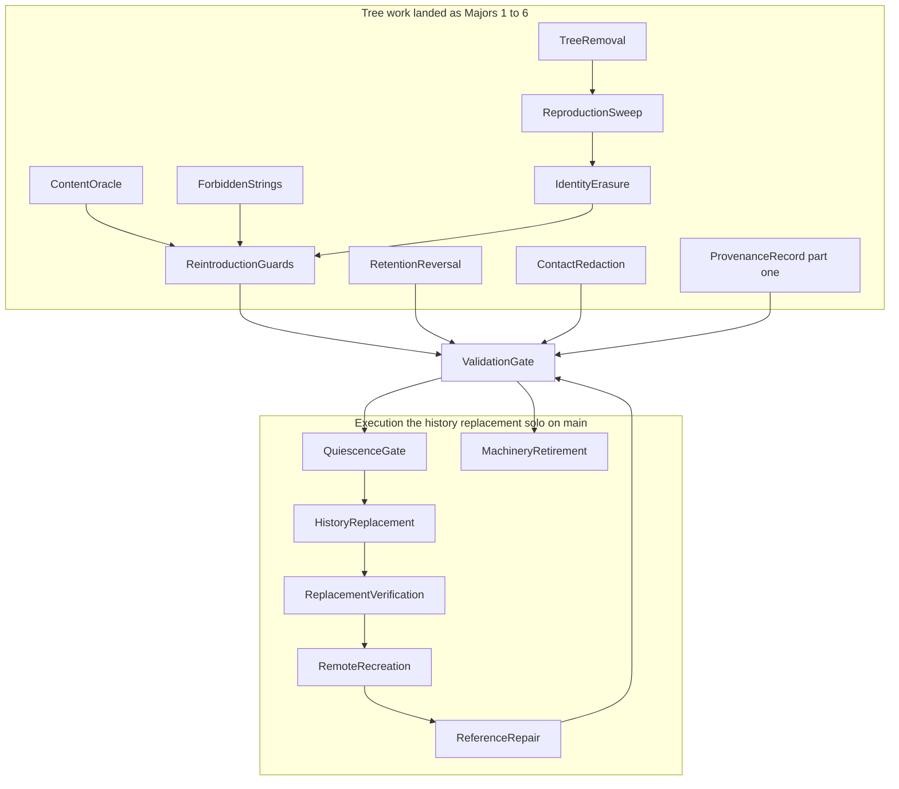
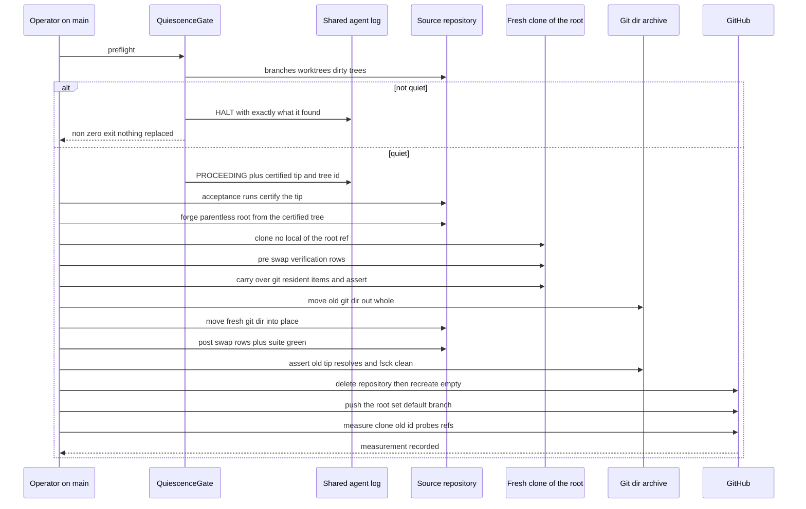
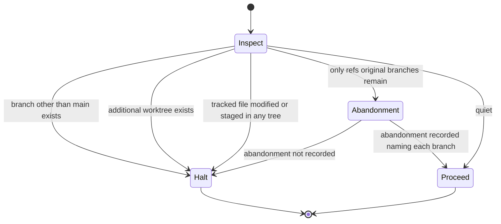
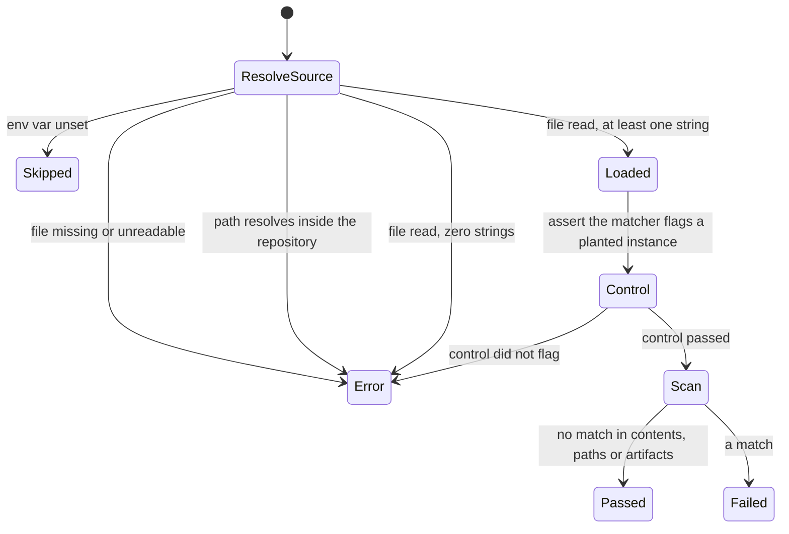
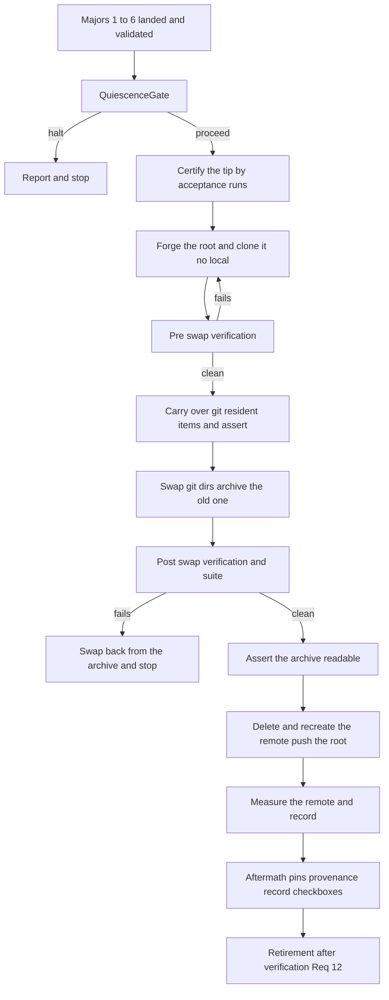

# Technical Design — encumbered-content-purge

## Naming convention used by this document

This document is in scope for the purge it specifies — Req 1.3 puts every
tracked file in scope and Req 11.1 forbids an identifying token in any of them —
so it does not write the material or the identity it requires removed. It
inherits `requirements.md`'s vocabulary and extends it for the artifacts design
has to name:

- **the withdrawn methodology** — the third-party running-load methodology
  evaluated during `training-load` and withdrawn from the shipped tool on
  2026-07-25 (training-load Amendment 2, commit `63863612b`).
- **the third party** — the individual who authored it and holds its copyright
  and trademarks.
- **the identifying tokens** — the third party's personal name, the
  methodology's former proper name, and its trademarked abbreviation.
- **the writeup** — the extracted methodology writeup under `docs/reference/`.
- **the extracted tables** — the two extracted lookup tables under a
  `docs/reference/` subdirectory named for the methodology.
- **the withdrawn calculator package** — `src/fitdocs/load/<token>/`, deleted
  from the working tree on 2026-07-25 and fully present in history at 7 paths,
  including its **own** copies of both lookup tables at paths distinct from the
  `docs/reference/` copies. **The test mirror** is `tests/load/<token>/`, 6
  further historical paths.
- **the token-bearing queue items** — three historical `.kiro/queue/` paths whose
  filename stem, which the queue contract makes the item `id`, carries a token.
- **the source workbooks** — two gitignored `.xlsx` files at the repository root.
- **the value constants** — the four value tuples and the fingerprint tuple in
  the sdist guard, whose names carry a token and whose contents are the
  extracted tables.
- **the v1 payload fixture** — the retained prior-format payload constants in
  `tests/load/test_render.py`, imported by three sibling test modules.
- **the history replacement** — the one-shot destructive operation of the
  execution phase: a fresh root commit whose tree is the certified tip,
  followed by deletion and recreation of the remote (Decision 6, Amendment 1,
  2026-08-17). It supersedes the in-place history rewrite this document
  originally specified, which never ran.
- **the certified tip** — the commit on `main` frozen by the quiescence gate
  immediately before the replacement, after the operator acceptance runs have
  passed against exactly that commit.
- **the `.git` archive** — the old repository's git directory, moved whole to
  a path outside the working tree by the swap (Decision 7) and retained.

Concrete strings live only in scratch artifacts outside the repository and in
the working tree until the purge lands. Every file path below that is *not*
written literally is one of the named things above.

**Line citations are pinned at `bc5c040`** and drift on rebase; re-measure
before acting on one. This has already falsified eight citations into the sdist
guard once.

## Amendment 1 (2026-08-17) — the mechanism is replaced, and this document is regenerated in place

**Decision 6** (maintainer, 2026-08-17, before the history operation ever ran)
retires the in-place `git filter-repo` rewrite this document originally
specified. The execution phase is now **the history replacement**: after the
tip is certified clean by the guards and oracles Majors 1–6 built, the purge
creates a fresh root commit whose tree is that certified tip, deletes and
recreates the remote repository, and pushes the new root. Every
unreachability property is unchanged; the replacement satisfies it by
carrying no pre-existing commit at all rather than by rewriting each one. The
grounds are recorded in the brief's amendment decision; the requirements-level
consequences (no commit map can exist, pins repair to a convention,
commit-level history is lost, the machinery retires as Requirement 12) are in
`requirements.md`.

**Decision 7** (maintainer, 2026-08-17) binds the mechanism Amendment 1 left
open, and its commitments are **fixed constraints** of this design, stated in
full in `HistoryReplacement`: the working directory and its untracked material
are never moved and never deleted; the fresh object database arrives by
swapping `.git`, never by an in-place prune; the old `.git` is archived, not
deleted; and the carry-over checklist is re-scoped to the `.git`-resident
items with the shared agent log first among them.

**What this regeneration changed and what it deliberately did not.** Majors
1–6 are complete, merged and unaffected; every section describing them —
the Guards and Tree components, `QuiescenceGate`, the modified-files tables,
the vocabulary tables — stands as the record of landed work. Regenerated
against the amended requirements: the Overview and boundary statements, the
architecture map, the file structure plan, the execution components
(`HistoryReplacement` replaces `HistoryRewrite`, `RedactionPlan` and
`CloneAdoption`; `ReplacementVerification` replaces `LocalVerification`;
`RemoteRecreation` replaces `RemoteReconciliation`), the Record components
(`ReferenceRepair`, `ProvenanceRecord`, `ValidationGate`), the new
`MachineryRetirement` component for Requirement 12, the traceability table,
the flows, error handling, testing strategy and migration strategy. Where a
retired section's hard-won findings still apply (the remote-probe
false-negative machinery, the run-against discipline, the config-drift
assertion), the regenerated sections carry them forward explicitly rather
than by reference to deleted text.

## Amendment 2 (encumbered-content-purge, 2026-08-22) — the remote is renamed, not recreated

Decision 6's "deletes and recreates the remote repository" is **superseded in
its mechanism only**. The maintainer supplied
`git@github.com:joshua-stauffer/fitdocs.git`, measured that day as existing and
empty, standing beside the still-live `fitdocs_oss` — so the reconciliation is
a **rename**, `fitdocs_oss` → `fitdocs`. *(Amendment 3 makes that word
inexact and it is kept for continuity: nothing is renamed. A new empty
repository stands beside a retained old one, permanently. "Rename" describes
which URL the project publishes under, not what happened to any repository —
the same caution applies to task 8.4's title.)* There is nothing to recreate:
the
destination exists. The deletion of the old repository is a **maintainer act
outside this spec**, performed out of band, which closes the `gh` token's
missing `delete_repo` scope as a blocker and removes `gh repo delete` from
`RemoteRecreation`'s work.

Every sentence elsewhere in this document, in `requirements.md` and in
`brief.md` that says the remote is deleted and recreated is left standing as
the record of what Decision 6 decided on 2026-08-17; read them through this
amendment. **`tasks.md` is deliberately NOT in that carve-out** — it is
executed rather than read, so its stale wording was corrected in place rather
than reinterpreted: the two *open* tasks that an executor will act on, **8.4
and 9.2**, now say what will actually happen. A task list that has to be read
through an amendment is a task list that will be executed without one.

Two limits on that correction, both deliberate. **Completed tasks were not
given new obligations.** Task 7.4 is `[x]`; its acceptance bullet had
"recreated remote" corrected to "the remote", and nothing more — the duty to
name a subject URL lives in open task 8.4, not retroactively in a task that
has already landed, because acceptance text describing work nobody did
records coverage that does not exist. And **this document's own
`RemoteRecreation` component, its verification-row table and its flow diagrams
still describe delete-and-recreate** (`:1675` and `:1693` at `236fc18`, and the
component and Mermaid sections below): they are inside the carve-out and are read as the
record of Decision 6's design. Where one of them is *implemented* rather than
read — `scripts/purge/verify.py`'s `Rm` row, whose `subject` is a `Path` and
so cannot carry a URL at all — the gap is queued rather than papered over
here.

**Requirement 8 needs no amendment** *(true of Amendment 2 only; Amendment 3
amends it textually — see below)*: no criterion names a repository or requires
deletion, so every property it demands binds the rename unchanged. Note
precisely where the ambiguity sits, though. 8.1, 8.4 and 8.6 qualify their
subject with "the chosen reconciliation action" — but **every one of 8.1–8.6
also says a bare "the remote"**, 8.4 twice, and **8.7 says "the repository"**,
which is a different phrase again. Two simultaneously-live repositories make
all of them ambiguous. That is not a defect in Requirement 8, which was written when
only one remote existed; it is why every task row under this amendment must
name its subject URL rather than say "the remote". `tasks.md` task 8.4
carries the operative wording.

**Three obligations this amendment adds rather than removes**, stated here
because the temptation with a mechanism that got simpler is to assume the
duties shrank with it.

First, and most easily lost: **`fitdocs_oss` must be measured fork-free before
it is deleted.** *(Amendment 3 retains the repository, so "before it is
deleted" becomes a standing position rather than a deadline — the measurement
itself survives unchanged, and its motive sharpens: see below.)* Moving the delete step out of band moves the *action* outside
this spec, not the *evidence*. A fork keeps pre-replacement objects reachable
after the parent is deleted — the residual-object vector `research.md:264` and
`:693` record — and no criterion in Requirement 8 covers forks, so task 8.4's
bullet is the only place it is operationalised. It reads as redundant with the
destination's fork check and is not: they are different repositories, and only
one of them has history.

Second *(wholly superseded by Amendment 3 — there is no deletion)*, the old
remote's deletion must be **measured, not taken as reported**, before it is
treated as gone. A still-live `fitdocs_oss` does not halt the
push — the push touches only the empty destination and reconciles nothing
about the old repository — but it does bar declaring the task complete, and
Req 8.3's identifier probes run against **both** URLs for as long as both
resolve.

Third, because Req 10.3 makes the replacement root's tree identical to the
certified tip with no later redaction step, the nine tracked references naming
the old repository — the OSM `User-Agent` and the ownership-contract URL among
them — were moved on `chore/repo-rename` **before** task 8.1 certified
anything.

## Amendment 3 (2026-08-22) — the old repository is retained, and Requirement 8 is amended to admit it

The maintainer's ruling, taken after Amendment 2 and before task 8.1 certified
anything: **`fitdocs_oss` is retained** — not deleted, not rewritten — and
`fitdocs` becomes the canonical source. Decision 6's delete-and-recreate is now
superseded in both halves: Amendment 2 removed the recreation, and this removes
the deletion.

**What this changes, and it is not small.** `fitdocs_oss` keeps serving the
encumbered material on GitHub, indefinitely. Requirement 8 was titled *"The
remote no longer serves the material"*, and under this ruling one remote still
does — permanently, in full, every pre-replacement commit reachable.

So the requirement is **narrowed textually, in `requirements.md`**, and its
subject is now the canonical repository. The argument for the narrowing is
structural rather than borrowed: task 8.4 re-points `origin` at `fitdocs`,
after which **`fitdocs_oss` is no repository's remote at all** — the criteria
do not reach it, and no criterion has to be reinterpreted to keep them true.
What that leaves outside the requirement is stated with it rather than
implied, in the amended preamble and in criterion 8.4's exemption.

**This is an exemption, and calling it a scoping would be the lie.** Req 8.4
says the purge *shall* reconcile the remote and *shall not* declare
reconciliation complete while the measurement disagrees; a retained repository
that keeps serving the material is a measurement that permanently disagrees.
An earlier draft of this amendment reached the right outcome by the wrong
route — it left Requirement 8's text untouched and claimed the retained
repository was the third instance of the *"recorded acceptance"* pattern that
Req 11.13 uses for untracked state and Decision 7 for the `.git` archive. That
was borrowed authority: **both of those are authorised inside the criterion's
own text** (*"whether that position is redaction or a recorded acceptance that
the state is never published"*), and Requirement 8's criteria offered no such
option. A requirement that has to be read charitably to stay satisfied is a
requirement that needs amending, which is what Amendment 1 did to 9.3, 9.4,
9.8 and 10.3 and what this amendment now does to Requirement 8.

The honest form of the completion claim is **"Requirement 8 is satisfied with
respect to the canonical repository"** — never a bare *"the remote no longer
serves it"*. The objective's other half, *"on GitHub and not only on my
machine"*, is **not** met for GitHub as a whole and is not claimed to be.

**One property becomes load-bearing.** `fitdocs_oss`'s privacy was previously
incidental — a nil-cost argument for deleting it. It is now the *only* thing
keeping the retained material unpublished, and it is a standing property rather
than a one-time check. A `fitdocs_oss` that becomes public publishes the
material outright. Task 8.4 measures it before pushing and stops on anything
else.

**The fork obligation survives, and retention inverts its motive.** Two
successive drafts of this spec justified it wrongly, and both were caught only
by checking the platform's documentation rather than reasoning about it.
Amendment 2 justified it by a fork outliving its deleted parent; a first draft
of this amendment replaced that with a fork being public while its parent is
private. Measured against GitHub's *About forks* → *Visibility of forks*
(<https://docs.github.com/en/pull-requests/collaborating-with-pull-requests/working-with-forks/about-forks>, fetched 2026-08-22), **both are false**: *"private repository forks
are private"* and *"You cannot change the visibility of a fork by itself"*;
and the page's deletion table pairs *"A private repository is deleted"* with
*"Its private forks are also deleted"* (a two-cell table row, quoted here as a
pair rather than as a sentence).

The true position runs the other way, which is why this obligation is now more
important and not less: **deleting `fitdocs_oss` would have reaped any private
fork of it automatically; retaining it is exactly what allows one to persist**
— indefinitely, as a full second copy of the encumbered history inside another
account, reachable by SHA through cross-fork object access (`research.md:693`
at `1618b33`). GitHub places the residual duty on the maintainer: *"You are
responsible for ensuring that people who have lost access to a repository
delete any confidential information or intellectual property."* Requirement 8
still covers no fork case, so task 8.4's bullet remains the only place the duty
exists.

Two lessons worth keeping, both paid for. **When a mechanism gets simpler its
obligations do not shrink with it** — the duty attached to the retired step is
the one the natural rewrite drops, which is how the fork check and then `still
private` were each lost and restored. And **a motive is a factual claim**: this
one was rewritten twice by reasoning from what sounded plausible about forks,
and both times the reasoning was confident and wrong. The obligation happened
to survive because the *action* it demanded was the same under every motive;
that is luck, not method.

**What this amendment covers, named rather than left open.** Amendment 2 was
explicit about which documents keep standing stale text and which are
corrected in place; this one inherits that discipline and extends it, because
retention falsifies a *different* class of sentence — anything asserting the
old history is gone, unrecoverable, or that some copy is the only one.

Corrected in place, because they are executed rather than read: `tasks.md`
(tasks 8.3, 8.4 and 9.2 — 8.3 was carrying the false *"the archive is the only
copy of the old history anywhere"*, inside an **open** task, which Amendment
2's scope sentence had undercounted by naming only 8.4 and 9.2);
`requirements.md` (Requirement 8, textually); `scripts/purge/replace.py` and
`docs/reference/history-rewrites.md`, both of which ship in the certified tree;
and `.kiro/steering/roadmap.md`, which is loaded as project memory.

**Left standing, and read through this amendment**: this document's own
`RemoteRecreation` component, its verification-row table, its Mermaid
migration diagram, its rollback analysis, and the archive-exposure argument —
all of which still describe a deletion — together with `research.md`, which no
amendment has ever carved out. They are the record of what Decision 6 and
Amendment 2 planned. Where one of them makes a *safety* claim that retention
falsifies rather than merely describing the old plan, it is queued rather than
silently left: the archive is no longer "the only copy anywhere" in any of
them, and the exposure argument for holding one offline copy was never
re-derived for a world with two.

**What it fixes.** An earlier draft of task 8.4 barred declaring completion
*"pending the deletion"*. Under this ruling that deletion never comes, so the
task was permanently incompletable as written. Probes against `fitdocs_oss` are
now an **accepted standing position** — expected to keep finding the material,
recorded as measured fact — rather than a not-yet-complete. They are still run:
omitting a probe because its answer is known is what turns a recorded
exemption into an unauditable assertion.

**Requirement 8 is amended textually, not scoped from here.** An earlier draft
of this amendment narrowed it in design prose while asserting the criteria
needed no change; that was wrong twice over. It carried forward Amendment 2's
"no textual amendment needed", which held only because the rename genuinely
satisfied every criterion — retention does not: **8.4 says the purge *shall*
reconcile and *shall not* declare complete while the measurement disagrees**,
and a retained `fitdocs_oss` that keeps serving the material makes that an
override, not a reading. And it rested on an enumeration that omitted 8.4
itself, the very criterion governing completability, while miscounting the
rest: **8.1–8.6 all say a bare "the remote"** (8.4 twice) and **8.7 says "the
repository"**.

So the narrowing lives in `requirements.md`, marked `*(Amendment 3)*`, exactly
as Amendment 1 amended 9.3, 9.4, 9.8 and 10.3 in place. Requirement 8's
subject is now the **canonical** repository throughout, 8.4 carries an
explicit exemption for the retained repository, and a new criterion 8.8
records the standing privacy duty. The argument for the narrowing needs no
borrowed precedent: task 8.4 re-points `origin` at `fitdocs`, after which
`fitdocs_oss` is no repository's remote at all, so the criteria never reach
it. Every task row still names its subject URL.


## Overview

**Purpose**: This feature removes a third party's copyrighted material, that
third party's identity, and two personal email addresses from the fitdocs
repository — from the working tree and from every commit in its history, local
and remote — before the repository is made public and 0.1.0 is published.

**Users**: the maintainer, who runs the purge as a solo session; every future
session reading a steering document, a spec ruling or a queue item's evidence;
and every future clone of the published repository.

**Impact**: every commit identifier in the repository changes. The two
re-introduction guards stop reading the material in order to recognise it and
start recognising it from data that is not a copy. Six further guards that today
detect re-introduction by matching an identifying token literally are replaced
by one guard whose match data is supplied from outside the repository. Four
approved documents move from instructing retention to recording its reversal, and
token redaction reaches nine specs, thirteen queue items, both steering documents
and the test tree. The repository's history is **replaced** — a fresh root
commit of the certified tip, arriving by a `.git` swap with the old `.git`
archived — and the remote is deleted, recreated and then measured rather than
assumed *(Amendment 1; formerly a rewritten clone adopted in place of the
working repository)*.

The work has **two halves with different notions of "verified"**. The first —
Majors 1 through 6, now **landed** — was ordinary reversible branch work:
delete, sweep, erase the identity from the tree, re-base the guards, reverse
the rulings, retire the rewrite map, build and harden the machinery; validated
by the standard suite plus mutation evidence. The second is one-shot and
destructive — the history replacement, verified by inspecting what the
replaced repository contains rather than by a green suite, then a recreated
remote whose behaviour is measured. The replacement cannot start until every
branch has landed and every extra worktree is gone, because the quiescence
precondition (Req 6) forbids it otherwise.

**On this document's length, because the template flags it.** The design template
warns that approaching 1000 lines suggests a spec that should be simplified or
split. This document is longer, and the split was considered and rejected twice
on the same ground: the execution step is **one-shot**, and it must be fully
specified before it runs — that is the right trade for a destructive operation.
Amendment 1's regeneration kept the landed Majors' sections in place as the
record of that work rather than deleting them, which is the other reason for
the length; the execution sections themselves got materially *shorter*, because
a replacement has fewer moving parts than a rewrite.

### Goals

- No object reachable from any ref, locally or on the remote, is a copy of the
  removed files or reproduces their content.
- No identifying token survives in any file's content, in any path, or in any
  commit message, at any commit reachable from any ref.
- The re-introduction guards still red if the material comes back, hold nothing
  from which the material or an identifying token can be read back, and report a
  distinguishable result rather than a silent pass when their match data is not
  supplied.
- The approved documents record retention-then-reversal honestly, and record that
  *a* third-party methodology was evaluated and withdrawn without identifying
  whose, without reopening `training-load` or moving its completion state.
- Neither personal address survives in the tree or in history.
- A durable provenance record explains both history operations, states every
  position taken, names the replacement root, and states once that every
  pre-replacement commit reference is permanently unresolvable — carrying
  neither the material, nor an address, nor an identifying token.
- The machinery that existed only for the history operation is gone once the
  replacement is verified, and every guard Requirements 3 and 11 need survives
  it, still demonstrably able to fail (Req 12).
- Nothing the tool computes, renders or ships changes.

### Non-Goals

- Making the repository public. That is a separate later act (Req 8.7).
- `distribution`'s work: `LICENSE`, classifiers, project URLs, the `.kiro/` and
  `tests/` sdist exclusions, the README rewrite, CI, the changelog, tag and
  publish.
- Re-litigating the withdrawal decision itself (`training-load` Amendment 2).
- Widening the guards against *renamed* or *reshaped* re-introduction. That is
  the subject of two open queue items and needs an AST or shape scan, which
  neither a content fingerprint nor a token match can reach. Erasure makes this
  gap **wider**, not narrower — see *ForbiddenStrings* › declared losses.
- Substituting any replacement proper name for an erased token (Req 11.12). The
  repository records the fact, not a stand-in identity.
- The gitignored source workbooks and the scanned pages of the copyrighted
  reference texts, which were never committed and stay on disk under their
  existing names (Req 1.7). Those texts are published scientific sources cited
  legitimately elsewhere in `docs/reference/`; their authors are **not** "the
  third party" as this document uses the term, and nothing about them is erased.

## Boundary Commitments

### This Spec Owns

- Deletion of the writeup, both extracted tables and the 2026-07-26 rewrite map
  from the working tree, and of every packaging entry whose only effect was to
  exclude them from a built artifact.
- The tree-wide sweep for reproduced material and the redaction of what it finds,
  in every tracked file.
- The tree-wide erasure of the identifying tokens — file contents, tracked paths,
  Python identifiers, test function names, and the recorded calculator identity
  in the v1 payload fixture — and the neutral vocabulary that replaces them.
- The detection oracle shared by the re-introduction guards, the re-basing of
  both guards onto it, and the externally-supplied forbidden-string source that
  replaces every guard which today matches an identifying token literally.
- The reversal of the four approved retention rulings, and the declared
  cross-boundary correction recorded in `training-load`.
- Removal of both personal addresses from tree and history.
- The quiescence precondition; the history replacement — a fresh root commit of
  the certified tip arriving by a `.git` swap, the old `.git` archived, the
  carry-over of `.git`-resident state asserted first *(Amendment 1 and
  Decision 7; formerly a single multi-transform history rewrite)*; verification
  of the replaced repository by inspection; deletion and recreation of the
  remote, measured rather than assumed.
- The provenance record; the epoch-convention repair of every open
  `pinned_at:` field *(Amendment 1; formerly a complete commit map and
  map-driven repair — no map can exist)*.
- The retirement of the machinery once the replacement is verified, keeping
  every required re-introduction guard alive and demonstrably able to fail
  (Req 12).

### Out of Boundary

- Everything listed under Non-Goals.
- **The *substance* of any spec this purge edits.** Nine specs carry an
  identifying token; edits to all of them are confined to removing reproduced
  material, removing a contact address, erasing an identifying token, and
  recording the reversal. No requirement, criterion, task or component of any
  spec is added, revised, withdrawn or renumbered, and no approval flag moves.
  This is the same rule Req 4.3 applies to `training-load`, generalised to every
  spec the sweep reaches, because Req 11.1 reaches all of them and a redaction
  is not a re-specification.

  **One carve-out, stated so a reviewer does not have to decide it alone.** At
  least one approved component *name* in `training-load`'s design is built from
  an identifying token, and at least one traceability row is phrased around it.
  Renaming that component is required by Req 11.1 and is a **redaction, not a
  revision**: its responsibilities, its requirement coverage and its boundary are
  untouched, and every reference to it moves in the same change so the document
  stays internally consistent. The same treatment applies to any identifier,
  heading or table cell elsewhere whose only defect is that it spells a token.
  What remains forbidden is changing what a component *does*, what it covers, or
  whether it is approved.
- Repair of commit references that are not `pinned_at:` fields. See
  *ReferenceRepair*.
- Any change to what the tool computes, to any rendered document, or to any
  shipped output value (Req 10.2).
- Renaming the gitignored source workbooks, whose names carry tokens. Req 1.7
  requires they stay on disk untracked; Req 11.13 requires only that a position
  be *stated*, and the stated position is recorded acceptance. Under Decision 7
  they are additionally never at risk: the working directory is never moved and
  never deleted.
- Deleting the `.git` archive. Decision 7 requires it archived; its eventual
  deletion is a maintainer act outside this spec.

### Declared additions to scope

Three items sit outside the letter of `requirements.md` and are taken
deliberately rather than silently. Approving this design approves them.

1. **`roadmap.md` Phase 5's three superseded constraints** are corrected here.
   Steering is what every session loads as project memory; `requirements.md` is
   not. Phase 5 still says unlanded work is *orphaned* by the rewrite while
   Requirement 6 says the purge *halts*. Closes
   `.kiro/queue/2026-07-30-phase5-constraints-outrank-settled-requirements.md`.
2. **A correction, not an addition: this spec's own `brief.md`** carries the
   third party's address and eleven identifying tokens. Req 5.1 and Req 11.1 are
   unconditional over every file at every commit, so the brief was always in
   scope. Listed for visibility only; it is requirement-mandated and not the
   approver's to decline.
3. **Two token-bearing queue items are renamed, which changes their `id`.** The
   queue contract makes the filename stem the item id, so Req 11.2 cannot be
   satisfied for them without a rename, and a rename is an id change. Five
   tracked files cite those ids and move with them. Items are renamed, never
   deleted — the contract's "kept, not deleted" rule is preserved.

### Allowed Dependencies

- `git` ≥ 2.22 and `python3` ≥ 3.11, both present (git 2.54.0, python 3.11.15).
- The `gh` CLI, authenticated, for the one-shot remote deletion and recreation;
  `curl` for the retention probes. Operator tools for the execution step, not
  project dependencies. *(Amendment 1 retires the `git-filter-repo`
  dependency; the replacement uses plumbing git alone.)*
- `hashlib`, `re` and `os` from the standard library for the oracle and the
  forbidden-string source. No new runtime dependency, and nothing under
  `src/fitdocs/` changes except two docstrings.
- The shared agent log at `$(git rev-parse --git-common-dir)/agent-log`.
- One environment variable naming a file **outside** the repository working tree.
- **Forbidden**: importing purge tooling from `src/fitdocs/`; adding any
  dependency to the installed package; writing any removed value, any personal
  address or any identifying token into any tracked file, including this spec's
  own documents; naming any configuration key, environment variable or
  documented example after an identifying token (Req 11.10).

### Revalidation Triggers

- **Every commit SHA in the repository changes.** Any consumer that resolves a
  commit identifier must re-check.
- **Two queue item ids change.** Any consumer resolving a queue item by stem must
  re-check.
- `[tool.hatch.build.targets.sdist]` is removed entirely, restoring hatchling's
  default sdist contents. `distribution` owns the `.kiro/` and `tests/`
  exclusions and must re-check against the new default, which now also includes
  `scripts/`.
- **Also surfaced by that build, and `distribution`'s to fix:** the root
  `agent-log` symlink already ships as an sdist member and extracts as a
  *dangling* link. Its content does not ship and the content guard skips it, so
  it is not a leak and not this spec's boundary — but the shared agent log it
  points at carries identifying tokens, so any future change that makes the build
  **follow** symlinks turns a non-leak into a leak of exactly what this spec
  erases. Recorded as a standing hazard, not a task here.
- The guards' detection data changes shape twice: value literals become digests,
  and token literals leave the repository entirely in favour of an
  externally-supplied file. Six guards are retired; one is created.
- Both shared test helpers move to the `tests/` package root and join
  `[tool.mypy].files`.
- The prior rewrite map ceases to exist; anything citing it must move to the
  provenance record.
- `distribution`'s Requirement 6 and its unbuilt artifact-licensing gate are
  amended **after** this spec lands, so they amend once against the final state.

## Architecture

### Existing Architecture Analysis

This spec touches almost no product code. Its subject is the repository as an
artifact: its object database, its planning record, and the test-time guards that
police what may be re-added.

Four properties of the current state drive every decision below.

- **The material is in the initial tree.** Exactly one commit touches the
  writeup and both extracted tables — the root commit. That cuts the opposite way
  from a larger number: the material cannot be excised from a span of history in
  isolation, so every commit is rewritten.
- **The guards are the largest in-repo copy of what they guard, in two different
  currencies.** The sdist guard's fingerprint tuple is nine plaintext values
  matched by raw substring, with the module exempting itself from its own scan by
  path. Separately, **six guards across four modules detect re-introduction by
  matching an identifying token literally** — a withdrawn-symbol tuple scanned
  against every shipped module, a path-existence assertion, two built-artifact
  member scans, a banned-word loop over the contributor documentation, two
  CLI-output assertions, and a documentation-corpus absence assertion. Under
  Req 11.7 each of those literals becomes the last copy of the token it matches.
  Re-basing is not a repair in either currency; it is a replacement of the
  detection mechanism.
- **Three of the current positive controls require the token to still exist.**
  The documentation guard asserts that a steering file mentions the methodology,
  that the writeup mentions it, and that the un-excluded corpus mentions it.
  They were built to fail precisely on the scenario Req 11 now mandates. A
  complete scrub cannot be done without rewriting them, and marking them
  `xfail` or deleting them silently would convert a designed tripwire into an
  unremarked gap.
- **The prior rewrite is incomplete, and its residue is now unreachable rather
  than absent.** The 2026-07-26 `filter-branch` moved `main` but left
  `refs/original/*` behind. Those refs were deleted **during this spec's design
  phase** — but deleting a ref does not delete an object. Measured 2026-07-31:
  every commit reachable from a ref carries only the non-personal address, while
  `git fsck --unreachable` reports hundreds of unreachable commits and **496
  commit objects in the object database still carry the maintainer's personal
  address**. A reflog-only dangling commit carries a third identifier, in a
  username-and-machine-name form. This is both the precedent and the warning: a
  rewrite that stops at "rewrite and force-push" reproduces exactly this outcome,
  and a `--local` clone or a salvaged `.git/` carries the residue forward.

  These figures moved once already inside a single session. Re-measure before
  running rather than quoting them:
  `git fsck --unreachable --no-progress | awk '{print $2}' | sort | uniq -c`.

**Measured at `bc5c040`, and every one of these is a shape, not a budget** —
`requirements.md` forbids resting a criterion on a count, so each is stated to
size the work and must be re-measured before it is acted on: 63 tracked files
carry an identifying token, across 9 specs, 13 queue items, both steering
documents, the test tree, `pyproject.toml`, `.gitignore`, `CLAUDE.md` and one
docstring in `src/`. 5 tracked paths carry one. **19** historical paths carry one
— requirements recorded 18 a day earlier, which is the drift those documents warn
about, not a disagreement — 13 of them belonging to the withdrawn calculator
package and its test mirror, which is present in the tree of 83 of the 433
commits. 26 of 433 commit messages carry one. The enumerations:

```
git grep -licE '<tokens>'                                    # tracked contents
git ls-files | grep -iE '<tokens>'                           # tracked paths
git rev-list --all | xargs -n1 git ls-tree -r --name-only \
  | sort -u | grep -iE '<tokens>'                            # historical paths
git log --all --format=%H -i --grep=<token> ...              # messages
```

### Architecture Pattern & Boundary Map

Selected pattern: **a gated in-place replacement with an archive boundary**
*(Amendment 1; formerly a gated pipeline with an adoption boundary)*. Majors
1–6 were ordinary branch work and have landed. The execution phase runs as a
sequence of stages, each of which must produce evidence before the next may
start; the new history is built beside the old one, verified, and swapped into
place — the old `.git` crosses into an archive rather than being destroyed,
and old objects cannot reach the new object database because it was populated
by a reachable-only copy of a single new root.




**Architecture Integration**

- **Domain boundaries**: five groups with disjoint file ownership — *Tree*
  (deletions, redactions, identity erasure, rulings — landed), *Guards* (the
  two shared helpers and the guard modules), *History* (the gated replacement
  pipeline under `scripts/purge/`), *Record* (the provenance document and the
  pin convention), and *Retirement* (the re-homings and the deletion list).
  Tasks can be assigned per group without co-editing, with one stated exception:
  *IdentityErasure* and *ReintroductionGuards* both edit the sdist guard module,
  so those two are sequenced rather than parallel.
- **Dependency direction**: `ContentOracle` ← `ReintroductionGuards`,
  `ForbiddenStrings` ← `ReintroductionGuards`, and both shared helpers ← the
  purge scripts. The two helpers are the only shared modules and depend on
  nothing but the standard library. Nothing in `scripts/purge/` is imported by
  `src/` or by any test other than the guards. The direction never reverses.
- **Existing patterns preserved**: every walking guard keeps an explicit
  non-vacuity control; allowlists stay module-local and compared by equality;
  amendments follow the house three-layer convention (`requirements.md` heading,
  in-place `design.md`/`tasks.md` annotation, `spec.json` entry); environment
  variables follow the established `FITDOCS_<THING>` shape.
- **Steering compliance**: personal data never lives in the repository
  (`tech.md`), extended here from fitness data to contact details and to a third
  party's identity; absent data is `None`, never a fabricated default — applied
  to unresolvable pins, which are recorded as unresolvable rather than given a
  plausible commit (Req 9.8), and to the forbidden-string source, whose absence
  is reported as absence rather than as a passed check (Req 11.8).

### Technology Stack

| Layer | Choice / Version | Role in Feature | Notes |
|-------|------------------|-----------------|-------|
| Replacement engine | `git` plumbing alone — `commit-tree`, `clone --no-local`, two directory moves | Forge the parentless root from the certified tree; populate the fresh `.git` by reachable-only copy; the swap | *(Amendment 1: `git-filter-repo` is retired unused — the replacement needs no rewrite engine. Its evaluated alternatives and the measured directive-order hazards remain in `research.md` as the record of that path.)* |
| Version control | `git` 2.54.0 | Object-graph enumeration, `--no-local` clones, ref and reflog inspection | `--no-local` copies reachable objects only — measured, and the property the swap's "true by construction" claim rests on |
| Oracle | `hashlib` + `re`, stdlib, Python 3.11 | Tokenise, canonicalise, window, digest | No new dependency; measured at 2.5 s for a whole-tree scan |
| Forbidden-string source | `os` + `pathlib`, stdlib, Python 3.11 | Read match data from outside the repository; report absence distinguishably | One environment variable, neutrally named; no token in the key |
| Purge tooling | Python 3.11, `scripts/purge/` | Quiescence gate, replacement driver, verification, pin repair | Type-annotated and in `[tool.mypy].files`; retires under Req 12 once the replacement is verified |
| Remote lifecycle | `gh` CLI, authenticated | Delete and recreate the remote repository | Operator tool for the one-shot step, not a dependency |
| Remote measurement | `curl` against the authenticated GitHub web URL | The probe that can falsify retention | `git fetch <sha>` cannot: GitHub does not enable `allowAnySHA1InWant`, so fetch is a false-negative machine |

## File Structure Plan

**As landed by Majors 1–6** — these files exist and are the current tree; the
tables further down record what each change was:

```
scripts/purge/            # the machinery; every module here retires under
│                         # Requirement 12 once the replacement is verified
├── __main__.py           # CLI: manifest | preflight | fingerprints | plan |
│                         # rewrite | verify-local | adopt | verify-remote |
│                         # pins | (Amendment 1 adds) replace
├── preflight.py          # quiescence gate + agent-log writes (Req 6) — the
│                         # one module the replacement uses unchanged
├── adopt.py              # carry-over checklist, transfer-asserted; re-scoped
│                         # by Decision 7 to .git-resident items
├── verify.py             # row functions; re-scoped to the replacement rows
├── pins.py               # re-scoped to the epoch convention (Req 9.4)
├── manifest.py, plan.py, sweep.py, fingerprints.py, replacements.py,
│   rewrite.py, rewrite_map.py, build_sweep_inventory.py
│                         # built for the retired mechanism; no role in the
│                         # replacement; deleted at retirement
tests/
├── _content_oracle.py    # SURVIVES retirement — the shared value matcher
├── _content_fingerprints.py  # SURVIVES — generated digest data
├── _forbidden_strings.py # SURVIVES — the shared string source; R0 moves the
│                         # wrap-tolerant pattern helper and the notice/mark
│                         # constants INTO it
├── test_forbidden_strings.py # SURVIVES — the standing token guard; R0 adds
│                         # the re-homed notice/mark tip guard
└── purge/                # tests of the machinery; deleted at retirement
    ├── test_content_oracle.py            # relocated to tests/ (subject survives)
    ├── test_content_fingerprints_shape.py # relocated to tests/ (subject survives)
    └── (the rest)                        # deleted with their subjects

docs/reference/
└── history-rewrites.md   # provenance record; part two re-specified by
                          # Amendment 1. commit-map.tsv is WITHDRAWN from the
                          # plan — no mapping can exist (Req 9.3)
```

**Execution-phase changes** (the regenerated tasks phase draws its boundaries
from this list):

| Path | Change |
|---|---|
| `scripts/purge/__main__.py` | Add the `replace` subcommand, gated like `rewrite` was |
| `scripts/purge/replace.py` *(new)* | The replacement driver: certify-tip recording, root forge, reachable-only clone, carry-over, swap, archive verification — `HistoryReplacement`'s ordering, refusing to run when the gate fails |
| `scripts/purge/adopt.py` | Re-scope `build_checklist` to enumerate the old `.git`; `doomed_root` becomes the old `.git` path; symlink-preserving copy retained |
| `scripts/purge/verify.py` | Re-scope to the `ReplacementVerification` rows: add tree-identity and single-commit rows; drop commit-map, mailmap and whole-history enumeration rows |
| `scripts/purge/pins.py` | Replace map-driven repair with the epoch convention; keep line-level post-repair verification and the unrepaired-token report |
| `tests/purge/test_rewrite_gate.py` | Re-target the injected-runner gating tests at the `replace` driver |
| `tests/_forbidden_strings.py`, `tests/test_forbidden_strings.py` | R0 re-homing: the wrap-tolerant pattern helper, the notice/mark constants and separator, the independent survivor counter, and the notice/mark tip guard move in (see `MachineryRetirement`) |
| `.kiro/queue/README.md` | Document the pin epoch convention in the schema section; update the example pin (Req 9.4, 9.5) |
| `docs/reference/history-rewrites.md` | Part two: sections 3, 6-remainder, 7, 8 (see `ProvenanceRecord`) |
| `tests/test_cli_drain_report.py` | Aftermath note: the fixture's abbreviated commit id is a pre-replacement identifier, permanently unresolvable (Req 9.6; the planned commit-map pointer is cancelled) |
| `pyproject.toml` | At retirement: `[tool.mypy].files` drops `scripts`, keeps the surviving helpers |

**Retirement deletions** (Req 12.1; the tasks phase enumerates the exact
list): all of `scripts/purge/`, and `tests/purge/` less the two relocations.

### Component → file map

Editorial components own diffs rather than modules, so the mapping is stated
rather than left to inference:

| Component | Files |
|---|---|
| ContentOracle | `tests/_content_oracle.py`, `tests/_content_fingerprints.py`, `scripts/purge/fingerprints.py` (generator; retired) |
| ForbiddenStrings | `tests/_forbidden_strings.py`, `tests/test_forbidden_strings.py` |
| ReintroductionGuards | `tests/load/test_packaging.py`, `tests/test_docs_guarantees.py` (modified) |
| QuiescenceGate | `scripts/purge/preflight.py`, `tests/purge/test_preflight.py` |
| HistoryReplacement | `scripts/purge/replace.py` (new), `scripts/purge/adopt.py` (re-scoped), `tests/purge/test_rewrite_gate.py` (re-targeted), `tests/purge/test_adopt.py` |
| ReplacementVerification | `scripts/purge/verify.py` (re-scoped), `tests/purge/test_verify.py` |
| RemoteRecreation | `scripts/purge/verify.py` (`verify-remote`, probes unchanged) |
| ReferenceRepair | `scripts/purge/pins.py` (re-scoped), `tests/purge/test_pins.py`, `.kiro/queue/README.md` |
| ProvenanceRecord | `docs/reference/history-rewrites.md` |
| ValidationGate | the class validation commands plus `ReplacementVerification`'s identity rows; M0 and the baselines remain scratch evidence |
| MachineryRetirement | the R0 re-homing diffs in `tests/_forbidden_strings.py` / `tests/test_forbidden_strings.py`; the R1 deletion list; `pyproject.toml` |
| TreeRemoval, ReproductionSweep, IdentityErasure, RetentionReversal, ContactRedaction | landed; the Deleted-files list and the Modified-files table below record their diffs |

**Why both shared helpers sit at the `tests/` package root** rather than under
`tests/load/`, which is where the prior draft put the oracle: three of the four
consumers live outside `tests/load/`. `tests/` is already a package
(`tests/__init__.py` exists), so `tests._content_oracle` and
`tests._forbidden_strings` import cleanly from any test module and from
`scripts/purge/`. Both are annotated and added to `[tool.mypy].files` **in the
same change that creates them** — the sequencing rule stated in the
`[tool.mypy]` comment block: add a module and fix its errors together, or every
other change in flight goes red.

### Modified files

*(Landed by Majors 1–6; retained as the record of that work. One row is
annotated where Amendment 1 superseded it before it was written.)*

| Path | What changes and why |
|---|---|
| `tests/load/test_packaging.py` | Delete the four value constants and the three comments quoting further values. Re-base both scans onto `tests/_content_oracle`. Remove the self-exemption. Add the synthetic positive control. Delete the withdrawn-symbol tuple, the package path-existence assertion, and the two built-artifact member scans — all four match a token literally and are subsumed by the standing token guard (Req 11.7). Rename the five token-bearing module constants and four token-bearing test function names. Docstring states the lost verifiability (Req 3.6) and the retired detections (Req 11.9) |
| `tests/test_docs_guarantees.py` | Collapse the writeup-excluding corpus builder into one builder with a `root` parameter; re-base the positive control onto a synthetic corpus; delete the writeup read. Delete the literal token-absence assertion and the two token-present controls (Req 11.7). **Re-base the steering tripwire onto the neutral fact**: assert that every steering document recording the evaluation also records the withdrawal, matched on withdrawal vocabulary rather than on an identity — the record Req 11.5 requires retained is exactly what remains assertable |
| `tests/test_contributing_calculators_doc.py` | Delete the banned-token loop over the contributor documentation; the standing token guard covers the same corpus from outside-supplied data (Req 11.7) |
| `tests/test_cli.py` | Delete the two CLI-output token assertions. Their subject no longer exists — the registry is provably empty on fresh import, asserted elsewhere in the suite — and retaining them retains the token (Req 11.7). The loss is declared, not silent |
| `tests/load/test_render.py` | Re-value the v1 payload fixture body with invented numbers. **Change the recorded calculator identity and display name to token-free values and rename both fixture constants** (Req 11.11). Add the note that the fixture is thereafter synthetic rather than an authentic recovered artifact |
| `tests/load/test_docedit.py`, `tests/load/test_engine.py`, `tests/load/test_migration_e2e.py` | Follow the fixture rename; update the two assertions that match the recorded calculator identity inside a skip message. Verified during requirements that no module under `src/` compares against that value — it is read out of the document and echoed into a message — so no behaviour moves and Req 10.2 holds |
| `tests/load/test_feature_e2e.py`, `tests/load/conftest.py`, `tests/load/test_stub_calculators.py` | Token in fixture detail strings and comments; redact |
| `tests/test_cli_drain_report.py` | *(Superseded by Amendment 1 before it was written)*: the planned pointer to the commit map is cancelled — no map can exist. The aftermath commit instead records the fixture id as a pre-replacement identifier, permanently unresolvable (Req 9.6) |
| `src/fitdocs/load/docedit.py` | Docstring: replace the zone-table row with a neutral example |
| `src/fitdocs/plugins.py` | Docstring: the sentence naming the withdrawn calculator becomes the token-free fact. The **only** other `src/` token in the repository; prose only, no test asserts on it |
| `.kiro/specs/training-load/research.md` | Redact the three reproduction sites; remove the contact address; restate the surrounding conclusions so no claim is left without a basis (Req 1.6); erase tokens; fix the reference list |
| `.kiro/specs/training-load/design.md` | **Two** retention instructions, not one: the `**Retained**` ruling and the "are not shipped data and are not removed" clause in the Out-of-Boundary list. Both justify themselves by citing steering, which no longer says that, so both justification clauses are replaced, not negated. Erase tokens including the component name built from one. Add the cross-boundary correction block |
| `.kiro/specs/training-load/tasks.md` | The task-5.2 bullet instructing that the writeup and its extracted tables be left in place — a live instruction Req 4.1 forbids. Rewrite the bullet **body** to record retained-then-reversed-on-2026-07-30 and why (Req 4.2), tagged `_(encumbered-content-purge, 2026-07-31)_`. Bullet not deleted, checkbox not touched, `- [x]` tally unmoved |
| `.kiro/specs/training-load/spec.json` | Append an `amendments[]` entry and a `phase_note` paragraph. **No approval flag, `phase` or `ready_for_implementation` moves** |
| `.kiro/specs/distribution/design.md` | Remove the contact address from the example config, leaving the illustration intact (Req 5.5); correct the path reference; erase tokens |
| `.kiro/specs/plugin-api/**`, `threshold-load/**`, `athlete-benchmarks/**`, `wiki-contract/**`, `load-channels/**`, `fit-ingest/**`, `distribution/{brief,requirements,research}.md` | Token redaction only. Each names the withdrawn calculator class or the methodology in prose, a traceability row, or a boundary note. **No criterion, task or approval moves** — see Out of Boundary |
| `.kiro/steering/roadmap.md` | Tense on the retention bullet; the vocabulary example; the `.tsv` citation; the fixture mention; Phase 5's three superseded constraints; and token erasure at 17 sites |
| `.kiro/steering/structure.md` | Tense: "were kept … are to be deleted" becomes a completed record; token erasure |
| `CLAUDE.md` | Remove the writeup from Key references (Req 2.2); erase tokens |
| `.gitignore` | Keep the `*.xlsx` rule — the pattern itself carries no token. Replace the three-line comment above it: it names the methodology, reproduces the third party's copyright notice (Req 11.4) and points at a removed path (Req 2.4) |
| `pyproject.toml` | Delete `[tool.hatch.build.targets.sdist]` entirely — both exclude entries and the comment above them, which reproduces the copyright notice (Req 2.1, 11.4). Add `scripts` and the two new shared helpers to `[tool.mypy].files` |
| `docs/reference/banister-trimp-primary-sources.md` | Two token mentions; one is a citation of a token-bearing queue item id that moves with the rename |
| `.kiro/queue/` — 13 items | Redact tokens in all. Additionally: redact the verbatim table rows in the evasions item and restate its evidence; redact and close the docstring-vestige item, which the purge resolves; **rename** the two token-bearing filenames and move all five citing files onto the new ids |
| `.kiro/queue/2026-07-26-<token>-reference-doc-stale-open-question.md` | Drop it **per the queue contract's three acts** — `status: dropped`, a `## Resolution` giving the reason, `git mv` into `closed/` — *and* rename the stem, since `closed/` preserves it. A status flip alone is not enough: its `resume_command` body instructs a session to update the writeup's framing and **not** to delete the file or its extracted tables — a live pointer to a removed path (Req 2.3) **and** a retention instruction (Req 4.1). Rewrite that body too |
| `.kiro/specs/encumbered-content-purge/brief.md` | Redact the address and eleven tokens |

### Deleted files

The writeup, both extracted tables, and the prior rewrite map *(landed)*. At
retirement (Req 12): all of `scripts/purge/` and `tests/purge/` less the two
relocations — see `MachineryRetirement`.

## System Flows

### The execution phase — the gated replacement



The gating conditions that matter: the `PROCEEDING` line — now carrying the
certified tip and tree id — is written **before** anything else happens, so a
run that dies mid-way is still legible to a peer (Req 6.5); a pre-swap
verification failure loops back to the forge with nothing touched (Req 7.7);
a post-swap failure swaps back from the archive; and no remote action of any
kind happens before the archive's readability and every local row are
recorded facts, because after the remote deletion the archive is the only
copy of the old history anywhere.

### Quiescence decision



### Forbidden-string guard outcomes



`Skipped` is the default outcome of an ordinary run and is **never** reported as
`Passed` — that distinction is Req 11.8 and is itself pinned by a test. `Error`
is deliberately not a silent skip: a supplied-but-broken source is an operator
mistake, and the vacuous-walk anti-pattern in `change-protocol.md` is what
happens when it degrades quietly.

## Requirements Traceability

| Requirement | Summary | Components |
|---|---|---|
| 1.1, 1.7 | Removed files absent; workbooks stay untracked and untouched in place | TreeRemoval, HistoryReplacement |
| 1.2, 1.3, 1.4, 1.6 | Tree-wide sweep, redact-and-retain, restated bases | ReproductionSweep |
| 1.5 | The fact retained, no identifying token retained in doing so | IdentityErasure |
| 2.1 | Dead packaging entries removed | TreeRemoval |
| 2.2, 2.3, 2.4, 2.5 | Stale pointers, ignore rule kept, historical mentions retained token-free | ReproductionSweep, IdentityErasure |
| 3.1, 3.2 | Guards run and detect without holding the material | ContentOracle, ReintroductionGuards |
| 3.3, 3.4 | Positive control on a present instance, independent of removed files | ReintroductionGuards, ForbiddenStrings |
| 3.5 | Recorded mutation evidence per re-based guard | ReintroductionGuards, ValidationGate |
| 3.6 | Lost verifiability stated, not implicit | ReintroductionGuards, ProvenanceRecord |
| 3.7 | Detection data not readable back | ContentOracle, ForbiddenStrings |
| 4.1, 4.2, 4.5 | Rulings reversed honestly | RetentionReversal |
| 4.3, 4.4 | Cross-boundary correction; `training-load` status unmoved | RetentionReversal |
| 5.1, 5.2 | No address at any commit — tree by Major 3, history by construction | ContactRedaction, HistoryReplacement, ReplacementVerification |
| 5.3 | Non-personal address in every author and committer header | HistoryReplacement, ReplacementVerification |
| 5.4 | The rewrite map replaced without restating the address | ProvenanceRecord |
| 5.5, 5.6 | Example-data address removed; none introduced | ContactRedaction |
| 6.1–6.6 | Quiescence, halt, untouched state, log lines, abandonment | QuiescenceGate |
| 7.1, 7.2, 7.3 | Nothing pre-existing reachable; no `refs/original`; reflog and unreachables clean — by construction, and asserted | HistoryReplacement, ReplacementVerification |
| 7.4, 7.5, 7.6, 7.7 | Verified by inspection, fresh clone, old id refused, corrected before any push | ReplacementVerification |
| 8.1–8.7 | Delete and recreate; measure what the remote serves; refs match; recorded; not made public | RemoteRecreation, ReplacementVerification |
| 9.1, 9.2, 9.3 | Provenance record, both operations, root named, unresolvability stated once — no map by construction | ProvenanceRecord |
| 9.4, 9.5, 9.6, 9.8 | Open pins to the epoch convention; positions stated; nothing substituted | ReferenceRepair, ProvenanceRecord |
| 9.7 | The `.tsv` no longer exists | TreeRemoval |
| 10.1, 10.2, 10.4, 10.5 | No validation or behaviour regression | ValidationGate, ReplacementVerification |
| 10.3 | Replacement root tree identical to the certified tip tree | ValidationGate, ReplacementVerification |
| 11.1 | No token in any file's content at any commit — tree by Majors 3–6, history by construction | IdentityErasure, HistoryReplacement, ReplacementVerification |
| 11.2 | No token in any path at any commit | IdentityErasure, HistoryReplacement, ReplacementVerification |
| 11.3 | No token in any commit message | HistoryReplacement, ReplacementVerification |
| 11.4 | No copyright or trademark notice at any commit | TreeRemoval, IdentityErasure, HistoryReplacement |
| 11.5, 11.6 | The fact retained without the identity; records redacted, not falsified | IdentityErasure, RetentionReversal |
| 11.7 | Token-matching guards re-based or retired | ForbiddenStrings, ReintroductionGuards |
| 11.8 | Distinguishable result when the external data is absent | ForbiddenStrings |
| 11.9 | Given-up detection stated | ForbiddenStrings, ProvenanceRecord |
| 11.10 | No token in a key, an env var name, or a documented example | ForbiddenStrings, IdentityErasure |
| 11.11 | Fixture calculator identity token-free and recorded synthetic | IdentityErasure |
| 11.12 | No replacement proper name substituted | IdentityErasure |
| 11.13 | Position stated on untracked state carrying a token — the workbooks, the agent log, and now the `.git` archive | HistoryReplacement, ProvenanceRecord |
| 12.1, 12.5 | Machinery with no remaining purpose deleted, after verification and before publication | MachineryRetirement |
| 12.2 | Every required guard survives and still demonstrably fails | MachineryRetirement, ReintroductionGuards, ForbiddenStrings |
| 12.3 | Provenance and recorded evidence retained | MachineryRetirement, ProvenanceRecord |
| 12.4 | Given-up verification capability stated | MachineryRetirement, ProvenanceRecord |

## Components and Interfaces

| Component | Domain | Intent | Req Coverage | Key Dependencies | Contracts |
|---|---|---|---|---|---|
| TreeRemoval | Tree | Delete the material and everything that existed only to exclude it *(landed)* | 1.1, 1.7, 2.1, 9.7, 11.4 | — | — |
| ReproductionSweep | Tree | Find and redact every reproduction in every tracked file *(landed)* | 1.2–1.4, 1.6, 2.2–2.5 | ContentOracle (P1) | — |
| IdentityErasure | Tree | Erase every identifying token from the tree and fix what erasure breaks *(landed)* | 1.5, 2.5, 11.1, 11.2, 11.4–11.6, 11.10–11.12 | ForbiddenStrings (P1) | — |
| ContentOracle | Guards | Recognise the material from data that is not a copy | 3.2, 3.7 | stdlib only | Service |
| ForbiddenStrings | Guards | Detect token re-introduction from data held outside the repository | 3.3, 3.4, 3.7, 11.7–11.10 | stdlib only | Service |
| ReintroductionGuards | Guards | Keep the guards discriminating after their source is gone | 3.1–3.6, 11.7 | ContentOracle (P0), ForbiddenStrings (P0) | Service |
| RetentionReversal | Tree | Move four rulings without reopening a spec *(landed)* | 4.1–4.5, 2.2, 11.6 | — | — |
| ContactRedaction | Tree | Remove both addresses from the tree *(landed)* | 5.5, 5.6 | — | — |
| QuiescenceGate | History | Refuse to replace over unlanded work | 6.1–6.6 | Shared agent log (P0) | Service, Batch |
| HistoryReplacement | History | Fresh root of the certified tip by a `.git` swap; old `.git` archived; carry-over first | 7.1–7.3, 5.3, 11.1–11.4, 1.7, 11.13 | QuiescenceGate (P0), adopt carry-over (P0) | Batch |
| ReplacementVerification | History | Prove the replacement by inspection, pre-swap and post-swap | 7.4–7.7, 5.3, 10.3, 10.4, 11.3 | ContentOracle (P0), ForbiddenStrings (P0) | Service |
| RemoteRecreation | History | Delete, recreate, push the root, measure what the remote serves | 8.1–8.7 | ReplacementVerification (P0) | Batch |
| ReferenceRepair | Record | Repair every open pin to the epoch convention; report the rest | 9.4, 9.5, 9.8 | the replacement root id (P0) | Service |
| ProvenanceRecord | Record | Durable record of both operations; unresolvability stated once | 9.1–9.3, 9.5–9.8, 3.6, 8.6, 11.9, 11.13, 12.3, 12.4 | ReferenceRepair (P1) | — |
| ValidationGate | — | No validation or behaviour regression; the identity comparison | 10.1–10.5 | all (P0) | Batch |
| MachineryRetirement | Retirement | The machinery goes; every required guard survives and still fails | 12.1–12.5 | ReplacementVerification (P0) | Batch |

### Guards

#### ContentOracle

| Field | Detail |
|---|---|
| Intent | Recognise the removed tables in arbitrary text from data that cannot be read back |
| Requirements | 3.2, 3.7 |

**Responsibilities & Constraints**

- Owns tokenisation, canonicalisation, entropy estimation, windowing, digesting
  and scanning of **numeric values**. It is the single definition; neither guard
  nor any script may write a second.
- Holds **no** value from the removed material — only a salt, an entropy floor,
  and a tuple of truncated digests generated before deletion.
- Depends on nothing outside the standard library, so it runs on a fresh clone
  with no environment (Req 3.1).

**Contracts**: Service [x]

##### Service Interface

```python
def tokens(text: str) -> list[str]:
    """Numeric and clock-time tokens, in document order."""

def canonical(token: str) -> str:
    """Format-independent form. Clock times to total seconds; decimals to a
    canonical float repr. Two spellings of one value canonicalise equal."""

def entropy_bits(token: str) -> float:
    """Guessing entropy an attacker faces, from the token's FORMAT CLASS only."""

def windows(toks: list[str], floor: float) -> list[tuple[int, int]]:
    """Minimal-length (offset, length) windows clearing `floor` bits, advancing
    the cursor past each emitted window. A tail that cannot reach the floor is
    dropped."""

def digest(toks: list[str], salt: bytes) -> str:
    """Truncated hex digest over the salt and the canonical token join."""

def scan(text: str, fps: frozenset[str], lengths: frozenset[int],
         salt: bytes) -> bool:
    """True if any window of any stored length, at ANY offset, digests into
    `fps`. Scanning at every offset is what makes a match phase independent."""
```

- **Preconditions**: `fps` non-empty and `lengths` non-empty — both asserted by
  the guards, because an emptied set makes every absence assertion vacuous.
- **Postconditions**: `scan` is pure and total; it never opens a file and never
  raises on malformed input.
- **Invariants**: every stored window clears the entropy floor. The floor is the
  security property and is stated in the module, not implied.

**Implementation Notes**

- *Integration*: `tests/_content_oracle.py`, imported by both guards and by
  `scripts/purge/`. Generated data lives beside it in
  `tests/_content_fingerprints.py` so the matcher and its data can be reviewed
  apart.
- *Validation*: measured on the real files before deletion — 400 digests at a
  96-bit floor, 6.4 KB, window lengths 3 to 20; a 538-file tree scan in 2.50 s
  with **zero** false positives and matches on exactly the three files being
  removed; detection survives renaming, reindenting and re-embedding as Python
  dict literals.
- *Risks*: the floor buys margin against an attacker who knows only the format
  class. Someone who also knows a table's *structure* faces less. 96 bits is
  chosen with that in mind and is a stated parameter, not a magic number.
- *One-shot acceptance step, and it must not be skipped.* The synthetic control
  proves the **matcher** works; it cannot prove that a realistic re-introduction
  of the **actual** tables is caught, and after deletion that can never be tested
  again. The fingerprint generator therefore runs, in the same invocation that
  generates the digests and against the real files, the catalogued evasions from
  the withdrawal-evasions queue item — a verbatim re-add, a renamed and
  reformatted re-add, a table pasted as Python literals into an allowlisted
  module, and a copy under a different extension — plus the single-constant paste
  the sdist guard records as the only positive-detection evidence it has ever
  had. Each result is recorded pass/fail in the provenance record. **This is the
  last moment at which the oracle can be tested against its real subject.**
- *Declared limit, and it is now load-bearing twice.* A **single isolated value**
  is not detected, by construction. An identifying token is exactly one isolated
  low-entropy token, so **this oracle cannot guard the identity** — that is why
  `ForbiddenStrings` exists as a separate mechanism rather than as more digests.
  Any later session tempted to "just fingerprint the name" should stop here.
- *Salt*: durable, committed, and published. It defeats precomputed tables only;
  the window entropy carries the security.

#### ForbiddenStrings

| Field | Detail |
|---|---|
| Intent | Detect re-introduction of a string the repository is forbidden to contain, from data the repository does not hold |
| Requirements | 3.3, 3.4, 3.7, 11.7, 11.8, 11.9, 11.10 |

**Responsibilities & Constraints**

- Owns the **only** remaining mechanism by which the repository can detect that
  an identifying token has come back. Six existing guards that match a token
  literally are retired into it (see *ReintroductionGuards*).
- Holds no forbidden string. The strings are read at run time from a file whose
  path comes from a single environment variable, `FITDOCS_FORBIDDEN_STRINGS` —
  neutrally named, carrying no token, satisfying Req 11.10 for the key as well as
  for the values.
- **Refuses a source inside the repository.** The resolved path is compared
  against the repository working tree and rejected if it lies within it.
  Otherwise the obvious convenience — dropping the file in the repo root — would
  reintroduce exactly what Req 11.7 removes, and `.gitignore` would be the only
  thing standing between the tokens and a commit.
- **Generalisation, taken deliberately**: the same file also supplies the removed
  *path fragments* that Req 2.3's stale-pointer enumeration needs. That
  enumeration has the same recursion problem as the tokens — a grep for a removed
  path must name the removed path — and one out-of-repo source solves both. The
  file is a flat list of strings with a category prefix per line; the guard
  scans for all categories, and the design does not enumerate its contents.

**Contracts**: Service [x]

##### Service Interface

```python
@dataclass(frozen=True)
class ForbiddenStrings:
    values: tuple[str, ...]          # never empty; construction rejects empty
    source: Path                     # resolved, asserted outside the repo tree

def load(repo_root: Path) -> ForbiddenStrings | None:
    """Read the file named by FITDOCS_FORBIDDEN_STRINGS.

    Returns None when the variable is unset -- the ONLY silent outcome, and it
    is never a pass. Raises when the variable is set but the file is missing,
    unreadable, empty, or resolves inside `repo_root`.
    """

def require(repo_root: Path) -> ForbiddenStrings:
    """`load`, or `pytest.skip` with a reason naming the variable.

    Skipping is the distinguishable result Req 11.8 demands. It is asserted by
    a meta-test, not merely intended.
    """

def matches(text: str, fs: ForbiddenStrings) -> tuple[str, ...]:
    """Case-insensitive; returns every forbidden string present, so a failure
    message can name what it found without the test module holding it."""

def scan_tree(root: Path, fs: ForbiddenStrings) -> tuple[Hit, ...]:
    """Every tracked file's CONTENT and every tracked PATH NAME under `root`.

    `root` is a parameter, not the repository constant, for the same reason the
    documentation guard's corpus builder takes one: the positive control has to
    run against a synthetic tree containing a planted instance, and a scanner
    that can only look at the real repository cannot be shown to work once the
    real repository is clean.
    """
```

- **Preconditions**: `repo_root` is a real directory. No precondition on the
  environment — an unset variable is a supported state, not an error.
- **Postconditions**: `load` never returns an empty `values`. `matches` is pure
  and opens no file.
- **Invariants**: no forbidden string is ever written to a file inside
  `repo_root`, including a failure message that a CI system might archive — the
  guard reports **counts and locations** to stdout and the matched strings only
  in the assertion message, which is not persisted by this repository's tooling.

**Implementation Notes**

- *The standing guard* (`tests/test_forbidden_strings.py`) scans four surfaces
  for every supplied string: every tracked file's **content**, every tracked
  **path name**, every sdist member, and every wheel member. Path scanning is
  what carries Req 11.2 forward as a standing property rather than a one-time
  act, and it subsumes the retired package path-existence assertion.
- *Req 3.3, the positive control — two of them, because the guard has two
  matchers*: with the source loaded, `scan_tree` runs against a synthetic tree
  under `tmp_path` containing (a) a file whose **content** holds a supplied
  string and (b) a second file whose **name** holds one, and asserts both are
  flagged; a third file with neither is asserted not flagged, so the control
  cannot pass by matching everything. Both instances are genuinely present at
  test time, depend on no removed file, and leave no token in the repository
  because the strings came from outside it. The controls run **before** the
  absence scan and their failure is an error, not a skip. Without the second
  control the path-name scan is unpinned, and the path scan is the only thing
  carrying Req 11.2 forward.
- *Req 11.8, and this is the criterion most likely to be satisfied in name only*:
  the meta-test runs `require` with the variable unset and asserts that it raises
  pytest's skip exception — not that it returns, not that it passes. A second
  meta-test asserts `load` **raises** for each of the four broken-source cases
  (missing file, unreadable file, empty file, in-repo path) rather than returning
  `None`, because collapsing "broken" into "absent" is how a guard comes to
  report success having checked nothing. This is the vacuous-walk anti-pattern in
  `change-protocol.md`, and pinning it is the whole point of the component.
- *Req 11.9 — what detection is given up, stated here and repeated in the
  provenance record.* Three losses, each real:
  1. **Detection is opt-in.** An ordinary `uv run pytest`, on this machine or a
     fresh clone, no longer detects an identifying token anywhere. It skips. The
     repository's default posture goes from "always checked" to "checked when the
     maintainer supplies the data", and the maintainer is the only person who can
     supply it.
  2. **The contributor-documentation banned-word loop and the two CLI-output
     assertions are gone entirely**, not re-based. Their subject was a named
     calculator that no longer exists in any form, and the registry is provably
     empty on fresh import.
  3. **The withdrawn-symbol scan is subsumed only for token-bearing names.** It
     caught a class, a module path and a package name; re-adding the same code
     under a *neutral* name now passes. That is the renamed-re-introduction gap
     already tracked in the Non-Goals, and erasure widens it.
- *Typing*: the helper **and** the guard module are annotated and added to
  `[tool.mypy].files` in the same change that creates them. Three of the four
  guards being retired are already in that list, so the perimeter must not shrink
  as a side effect of the retirement.

#### ReintroductionGuards

| Field | Detail |
|---|---|
| Intent | The guards keep working, keep discriminating, and hold no copy of anything |
| Requirements | 3.1, 3.2, 3.3, 3.4, 3.5, 3.6, 11.7 |

**Responsibilities & Constraints**

- The sdist guard scans `src/fitdocs/**/*.py` and every sdist member through
  `ContentOracle`. It keeps its existing controls — a non-zero scanned count, a
  byte-count equality, the wheel's module-prefix check and the equality-compared
  load-module allowlist — and gains a synthetic positive control.
- The self-exemption is **removed**. It existed because the module carried the
  material; it no longer does.
- The documentation guard keeps its content-absence assertion. Its corpus builder
  takes a `root` parameter so the positive control can run against a synthetic
  tree.
- **Six token-literal detections are withdrawn from four modules** and their
  coverage moves to `ForbiddenStrings` or is declared lost. The withdrawal is
  itself a change that owes evidence: each retired assertion is named in the
  commit message with the reason, so a later reader finds a decision rather than
  an absence.
- **The open queue item recording that the sdist guard has no positive control
  is closed here rather than separately.** Re-oracling removes the last control
  that guard has, so the item's subject and this component's work are the same
  work; leaving it open would invite a later session to add a control against a
  mechanism that no longer exists.

**Contracts**: Service [x]

**Positive controls (Req 3.3, 3.4)**

- *Value oracle, synthetic*: build a table of **invented** values, generate its
  windows with the same `windows`/`digest` functions, write it into `tmp_path`,
  and assert `scan` flags it. Also assert a control file **without** the invented
  table is not flagged, so the control cannot pass by matching everything.
- *Token guard, externally seeded*: as described under *ForbiddenStrings*.
- **The previous corroborating control is gone and its replacement is different
  in kind.** The documentation guard used to assert that a steering file
  mentions the methodology by name — a real present instance, and a tripwire
  against exactly the scrub this spec performs. Erasure removes its subject. The
  replacement asserts the **fact** rather than the identity: every steering
  document that records the evaluation also records the withdrawal, matched on
  withdrawal vocabulary. That is weaker — withdrawal vocabulary is more common
  than a proper name, so the *ever-present token* anti-pattern is a live risk —
  and it is therefore pinned by asserting the **pairing** across documents, not
  the mere presence of a word.

**Implementation Notes**

- *Req 3.6, stated in the module docstring and the provenance record*: the guard
  can no longer verify its detection data against the files it was derived from,
  because those files no longer exist in the tree or in history. The digests are
  **unverifiable by construction** from this commit forward. Regenerating them is
  impossible without the source workbook, which is gitignored and not in the
  repository. This is a loss, it is deliberate, and it is the price of Req 3.7.
- *Req 3.5*: each re-based guard records the single-line mutation it dies on,
  with the observation. Candidates — replace `scan`'s body with `return False`;
  empty the digest tuple; drop the offset loop so only offset 0 is scanned; skip
  the byte-count accumulation; make `require` return `None` instead of skipping;
  make `matches` return an empty tuple. Per `change-protocol.md` › Fixture
  Discrimination, mutations are run through `uv run pytest`, never a bare
  `python -c`, and each must red the assertion being pinned and ideally nothing
  else.
- *Cost*: the sdist scan already reads every member in full. Tokenising and
  hashing adds ~2.5 s tree-wide, measured; the string scan is a substring pass
  over the same bytes.
- *Typing*: the sdist guard is **not** in `[tool.mypy].files` while the
  documentation guard, the contributor-doc guard and the CLI guard are. Both new
  shared helpers are annotated and added, so the shared definitions are checked
  regardless of which guard imports them.

### Tree

#### ReproductionSweep

| Field | Detail |
|---|---|
| Intent | Every tracked file, not just `docs/reference/` |
| Requirements | 1.2, 1.3, 1.4, 1.6, 2.2, 2.3, 2.4, 2.5 |

**Responsibilities & Constraints**

- The universe is `git ls-files`. The sweep is a **one-time act, not a standing
  guard** — `ContentOracle` detects value tables and cannot detect a formula
  written symbolically, which is precisely the densest site found. Stating that
  plainly is part of the deliverable.
- **Req 2.3 gets its own enumeration, because no oracle covers it.** The oracle
  fingerprints value windows, not path strings, so a stale pointer to a removed
  file is invisible to it. The enumeration is a literal `git grep -lF` over the
  removed-path fragments, run before and after — supplied from the same
  out-of-repo source as the tokens (see *ForbiddenStrings*), so the sweep's own
  input does not become the last copy of what it looks for. **27 tracked files
  hit at design time.** Every hit is classified (a) stale pointer → corrected,
  (b) dead packaging entry → removed, (c) guard → re-based, (d) historical
  subject of its own removal → **retained under Req 2.5, in a form carrying no
  identifying token**, or (e) ignore rule whose pointer is stale → pointer
  corrected. The Modified-files table above names the sites that need work; **it
  is not the enumeration** — roughly ten of the 27 are class (d). The sweep
  produces the authoritative classified list and it goes in the provenance
  record, so "not mentioned in the table" never silently means "not considered".
- **Req 1.6 needs a procedure, not an intention.** "Restate the basis" is the
  most editorially demanding work in Major 1 and the criterion most likely to be
  marked done by deleting a block and leaving what follows unsupported. The
  procedure: for each redacted span, find every later claim whose support falls
  inside it — in `training-load`'s research log the dense findings block is
  immediately followed by an implications section and is drawn on further down
  the document. Each dependent claim is then either restated on a surviving basis
  (the withdrawal decision, the licensing constraint, the shipped code) or
  withdrawn explicitly. **Acceptance condition**: no sentence in a redacted
  document asserts a conclusion whose only cited support is a redacted span,
  checked by re-reading each edited document end to end.
- `git grep -E` in this git build does not honour `\b`; probes use `-P` or `-F`.
  Recorded because a silently-empty grep reads as a clean sweep.
- **Redact and retain** (Req 1.4): where a reproduction sits inside a record of
  evaluation, sourcing or withdrawal, the reproduction goes and the record stays.

**Judged not reproductions, recorded so the judgement is reviewable**: the two
worked-example point totals as bare scalars at ~15 sites; the *names* of the
inputs the weather and terrain tables require; withdrawn requirement stubs and
marker-name lists. A scalar with no inputs, no zone and no attribution transmits
nothing of the methodology — and the repository reached this conclusion
independently when it dropped one such total as a fingerprint for colliding with
unrelated float-formatting examples.

#### IdentityErasure

| Field | Detail |
|---|---|
| Intent | Remove the identity from the tree, and repair everything erasure breaks |
| Requirements | 1.5, 2.5, 11.1, 11.2, 11.4, 11.5, 11.6, 11.10, 11.11, 11.12 |

**Responsibilities & Constraints**

- **The vocabulary is fixed once and used everywhere** (Req 11.12: no
  replacement proper name). The neutral forms are the ones this spec's own
  documents already use — *a third-party methodology*, *the withdrawn
  methodology*, *the third party*, *the withdrawn calculator*. Where an erased
  token was a Python identifier or a test function name, the replacement is
  descriptive (`_WITHDRAWN_*`, `_V1_WITHDRAWN_*`), never a coined proper noun.
  Whoever implements this must not invent a project name to fill the hole; a
  substitute proper name is the one outcome the maintainer explicitly declined,
  on the grounds that it risks colliding with a real person.
- **Redact, do not falsify** (Req 11.6). Every site is one of four kinds and the
  treatment differs:
  1. *A record of a decision, amendment, licensing constraint or finding* —
     redact the identity, keep the sentence's claim intact. A traceability row
     reading "Requirement 7.4 — the named calculator unchanged" becomes "the
     withdrawn calculator unchanged"; the row still traces.
  2. *A live pointer to a removed path* — corrected under Req 2.3, not merely
     de-tokenised.
  3. *A copyright or trademark notice* (Req 11.4) — removed, not reworded. A
     notice with the name struck out is still a reproduction of a notice.
  4. *An identifier or a filename* — renamed, with every importer moved in the
     same change.
- **Req 11.5 is a retention obligation, not a deletion one.** Wherever a document
  or commit message records that a methodology was evaluated, found to carry a
  redistribution restriction, and withdrawn, that record **stays** and only the
  identity leaves. The failure mode to avoid is a sweep that deletes whole
  sentences because they contain a token, leaving a repository that appears never
  to have evaluated anything — which would also break Req 4.5's honesty rule.
- **Req 11.11, the v1 payload fixture.** The recorded calculator identity and
  display name become token-free values, both fixture constants are renamed, and
  the module records that the fixture is **synthetic** from this commit forward
  rather than an authentic recovered artifact. Two sibling assertions match the
  recorded identity inside a skip message and move with it. Verified during
  requirements and re-verified in design discovery: no module under `src/`
  compares against the value — it is read via `inspect_payload`, stored on the
  payload stamp, and f-stringed into a skip reason by the engine — so nothing
  computed, rendered or shipped moves, and Req 10.2 holds.
- **Req 11.10** — no configuration key, environment-variable name or documented
  example introduced by this purge carries a token. The one new variable is
  `FITDOCS_FORBIDDEN_STRINGS`.
- **The self-referential constraint applies to this spec's own documents.**
  `requirements.md` is already token-free and defines its own naming convention;
  this document does the same; `brief.md` and `research.md` are redacted in the
  sweep like any other tracked file. The convention is the deliverable that makes
  the recursion survivable, so it is written down rather than improvised per
  file.

**Vocabulary table** (task 3.3's deliverable; consumed by 3.5–3.12 and by the
guard work in Major 4)

*Where this lives, and why here.* The table maps every erased form to its
replacement **by role**, never by literal quotation of the erased form — a
table that quoted the personal name, the former proper name or the
abbreviation directly would reintroduce, in a tracked file, the exact tokens
Req 11.1 forbids. Recovering which *specific* old site a row corresponds to is
what the out-of-repository sweep inventory and forbidden-string source are
for; this table only fixes what every later task writes **instead**. It lives
here, inside `IdentityErasure`'s own component section, rather than as a new
file: the Component → file map above gives `IdentityErasure`, along with
`TreeRemoval`, `ReproductionSweep`, `RetentionReversal` and `ContactRedaction`,
**no module or file of their own** — they own diffs to the Deleted-files list
and the Modified-files table, not a file. A new tracked artifact for this
table would mean amending that map to give the component a file it is
declared not to have; `history-rewrites.md` is `ProvenanceRecord`'s (as was
the commit map, until Amendment 1 withdrew it) and is not evidence about this
component one way or the other. Adding the table as prose inside the section that already states the
vocabulary rule keeps one file the source of both the rule and its content,
and every task in this major already reads this document for its component's
constraints.

*Prose* — already fixed by `requirements.md`'s naming convention; used
unchanged wherever a sentence names the withdrawn methodology, its author, or
its abbreviation. No separate short form is coined for the abbreviation: it
collapses to the same replacement as the full former name.

| Erased form (by role) | Replacement |
|---|---|
| the methodology's personal-name attribution, any form (full name or surname alone) | *the third party* / *the methodology's author* |
| the methodology's former proper name, in full | *the withdrawn methodology* |
| the methodology's trademarked abbreviation, standing alone in prose | *the withdrawn methodology* |
| a sentence naming the withdrawn implementation package or its calculator class | *the withdrawn calculator* |
| the approved `training-load` component name built from the former proper name — a section heading and traceability-cell identifier in that spec's `design.md`, also cited in its `tasks.md` and in this spec's own `brief.md` | `WithdrawnCalculatorRemoval` |

`WithdrawnCalculatorRemoval` is consumed by two parallel tasks that must
independently write the identical replacement: 3.7 (`training-load`'s
`design.md` and `tasks.md`) and 3.8 (this spec's own `brief.md`).

*The calculator's CamelCase class symbol* — distinct from the prose row above.
"The withdrawn calculator" is a sentence-shaped substitution and cannot
replace a bare symbol inside an inline code span (`` `register(<symbol>())` ``),
a code snippet, or a traceability-cell identifier such as
`fitdocs.load.<module>.<Symbol>`. Those sites take the symbol-shaped
replacement instead, substituted token-for-token wherever the class name
itself appears bare:

| Erased symbol (by role) | Replacement |
|---|---|
| the withdrawn calculator's CamelCase class name, wherever it appears bare in a code span, snippet or traceability cell | `WithdrawnCalculator` |
| the lower-case module segment of that dotted module path, wherever the path appears in a code span | `withdrawn` — giving `fitdocs.load.withdrawn`, and `fitdocs.load.withdrawn.WithdrawnCalculator` when the path carries the class segment too |

Consumed by 3.6 and 3.7 (`training-load`'s `research.md`, `design.md`,
`tasks.md`), 3.8 (`plugin-api`, `distribution`, `athlete-benchmarks`, and any
other spec the 3.2 enumeration flags), and 3.9 (the queue items citing it).
All must write the identical symbol.

*A citation of a deleted test's name* — two erased test function names
survive as citations in tracked prose that itself survives (this spec's own
`brief.md` and two closed queue items), even though neither test exists after
task 3.1 deleted or task 4.1/4.2 rename their surviving siblings. The general
rule, for 3.8 and 3.9 alike since both touch such citations in parallel:
rewrite the citation to name the deleted test **by its role**, in the form
"the deleted `<role>` test" — e.g. the citation of the test that read the
writeup to source its constant becomes "the deleted writeup-sourced-constant
test"; the citation of the test proving the documentation guard's positive
control becomes "the deleted writeup-mentions-the-methodology positive
control". Neither erased name is quoted.

*Python identifiers* — stem substitution, applied to every constant,
function, fixture name **and local variable** built from the abbreviation or
the former proper name. Every replacement stem is descriptive, matches the
pattern already stated above (`_WITHDRAWN_*`, `_V1_WITHDRAWN_*`), and is
never a coined proper noun:

| Erased stem (by role) | Replacement |
|---|---|
| the zone/points table values constant (`tests/load/test_packaging.py`) | `_WITHDRAWN_TABLE_VALUES` |
| the race-time lookup values constant (`tests/load/test_packaging.py`) | `_WITHDRAWN_RACE_TIME_VALUES` |
| the pace-range lookup values constant (`tests/load/test_packaging.py`) | `_WITHDRAWN_PACE_RANGE_VALUES` |
| the composite content-fingerprints constant (`tests/load/test_packaging.py`) | `_WITHDRAWN_CONTENT_FINGERPRINTS` |
| the sdist allowlist constant built from the abbreviation (`tests/load/test_packaging.py`) | `_SDIST_WITHDRAWN_ALLOWLIST` |
| the retained v1 fixture computed-body constant (`tests/load/test_render.py`) | `_V1_WITHDRAWN_COMPUTED_BODY` |
| the retained v1 fixture computed-line constant (`tests/load/test_render.py`) | `_V1_WITHDRAWN_COMPUTED_LINE` |

Local variables follow the same stem, lower-cased (`withdrawn_`,
`src_withdrawn_`), never `_WITHDRAWN_` — the leading underscore and the
all-caps form are reserved for the module-level constants above. Of the three
token-bearing locals in `tests/load/test_packaging.py`, task 4.1's own
instruction is to **delete the token-matching assertion** two of them belong
to (the wheel-scan list and the sdist `src/fitdocs/` token-scan list), not
rename it — only the third, the sdist content-fingerprint match list that
4.1 re-bases onto the value matcher rather than deleting, survives to be
renamed:

| Erased local (by role) | Replacement | Disposition |
|---|---|---|
| the wheel member list matched by the token substring check | — | deleted whole by 4.1, not renamed (token-matching assertion) |
| the sdist content-fingerprint match list, re-based onto the value matcher | `withdrawn_members` | renamed — survives 4.1's re-basing |
| the sdist `src/fitdocs/` member list matched by the token substring check | — | deleted whole by 4.1, not renamed (token-matching assertion) |

If a future task's re-basing keeps a token-matching local alive under a
different mechanism, the general rule still applies: lower-case `withdrawn_`
stem, `src_` prefix preserved where the erased name carried one (e.g. a
`src_withdrawn_members` shape), never `_WITHDRAWN_` and never a coined name.

*Test function names* — the same stem substitution applied inside a `test_...`
name; nothing else about the name changes:

| Owning module | Erased name (by role) | Replacement |
|---|---|---|
| `tests/load/test_packaging.py` | the no-shipped-module-imports-the-symbol test | `test_no_shipped_module_names_or_imports_a_withdrawn_symbol` |
| `tests/load/test_packaging.py` | the wheel-member-path-absence test | `test_wheel_contains_no_withdrawn_methodology_path_or_stray_data_or_module_under_load` |
| `tests/load/test_packaging.py` | the sdist-research-record-and-path-absence test | `test_sdist_contains_no_withdrawn_research_record_or_withdrawn_methodology_path` |
| `tests/test_docs_guarantees.py` | the no-shipped-documentation-presents-it-as-available test | `test_no_shipped_documentation_presents_the_withdrawn_methodology_as_available` |
| `tests/test_docs_guarantees.py` | the steering co-location test | `test_every_steering_file_mentioning_the_withdrawn_methodology_also_records_its_withdrawal` |
| `tests/load/test_render.py` | the retained-v1-payload-refused test | `test_retained_v1_withdrawn_payload_is_refused_by_parse_payload` |

**Re-measured, not assumed: `test_packaging.py` needs three test-function
renames, not the "four token-bearing test function names" this document
stated earlier** (Component → file map, "Modified files"). The fourth was the
test asserting a shipped module carried a value derived from the withdrawn
methodology; it read the writeup directly from disk and was already deleted at
task 3.1, before this count was re-taken — one more figure this plan's own
execution rules warn is a shape, not a budget.

*Fixture values for the prior-format calculator identity* (Req 11.11 is
3.11's task, not this one; recorded here only so 3.11 does not have to invent
a value under time pressure, and so the no-proper-noun rule extends to it
explicitly): a token-free, hyphenated slug in the style the load package's
stub calculators already use (`stub-computing`, `stub-declining`,
`stub-scoped`, `stub-hinted`) — `withdrawn-v1` for `calculator_id`,
`Withdrawn V1 Calculator` for `display_name`. Neither is a proper noun.

*Queue path stems* (Req 11.2's path surface; 3.12 renamed the tip to these
stems — landed. *Amendment 1 note: the retired rewrite would have applied the
same stems to the historical paths; under the replacement no historical path
exists to rename, so the tip renames are the whole obligation and history
satisfies Req 11.2 by carrying no pre-replacement commit at all*):

| Item (identified by role and open date, never by its current filename) | Replacement stem |
|---|---|
| the open item about refreshing the (now-deleted) reference writeup's stale open-question framing, opened 2026-07-26 | `2026-07-26-withdrawn-methodology-reference-doc-stale-open-question` |
| the closed item recording that the sdist redistributed the withdrawn methodology's extracted tables, opened 2026-07-27 | `2026-07-27-sdist-redistributes-withdrawn-methodology-tables` |

Every replacement cell above was checked against the forbidden-string match
data with the fixed-string, tie-to-a-path-hit probe this plan's own
Implementation Notes mandate (the WARN dated from task 3.2); none of the
replacements matches a token entry, and none is a proper noun.

**Implementation Notes**

- *Sequencing*: `IdentityErasure` and `ReintroductionGuards` both edit the sdist
  guard module. Erasure renames its constants and deletes its token-literal
  detections; the guard work re-bases its value scanning. Doing them as one task
  over that module, or strictly in sequence, avoids a merge conflict in the
  single densest file in the change.
- *Cross-spec breadth*: nine specs, thirteen queue items and both steering
  documents are edited. Every one of those edits is redaction-only per Out of
  Boundary. A reviewer checking this should diff for **added** requirement text,
  changed checkbox tallies and moved approval flags; there should be none.
- *Validation*: the sweep is complete when the standing token guard, run with the
  source supplied, reports zero matches across contents, paths and both built
  artifacts — which is the same mechanism that will keep reporting zero
  afterwards.

#### RetentionReversal

| Field | Detail |
|---|---|
| Intent | Say retention was decided and reversed, without reopening `training-load` |
| Requirements | 4.1, 4.2, 4.3, 4.4, 4.5, 2.2, 11.6 |

**Responsibilities & Constraints**

- **Three sites still instruct retention, all three in `training-load`**, and
  each needs its *instruction* removed, not merely annotated. Req 4.1 forbids a
  document that instructs a session to "retain, restore, or **leave in place**":
  the `**Retained**` ruling inside the withdrawal component of `design.md`; a
  second, independent retention statement in that document's Out-of-Boundary list
  ("they are not shipped data and **are not removed**"); and the task-5.2 bullet
  in `tasks.md` ("**Leave** the reference writeup and its extracted tables **in
  place**").
- The two steering documents were already rewritten into retained-then-reversed
  form on 2026-07-30 and need only their tense corrected and their tokens erased.
  Their existing wording is the model for Req 4.5 — retention as a decision taken
  under different circumstances, not an error of judgement.
- **All three `training-load` sites justify themselves by citing steering.**
  Steering no longer says that, so in each case the **whole justification clause
  is replaced**, not negated. Restating the sentence as "not retained" while
  leaving the false premise standing is not a fix.
- Req 4.3 follows the house three-layer convention: the `tasks.md` bullet body is
  rewritten to record what Req 4.2 requires, tagged
  `_(encumbered-content-purge, 2026-07-31)_` matching the existing amendment
  idiom; `design.md` gains a cross-spec correction block; `spec.json` gains an
  `amendments[]` entry and a `phase_note` paragraph using the established
  formula. **A tag beside an unchanged "leave in place" sentence satisfies
  neither 4.1 nor 4.2** — the instruction has to go. The bullet is not deleted,
  the checkbox is not touched, and the tally does not move.
- **Req 4.5 and Req 11.5 are the same obligation seen from two sides** and are
  satisfied by one sentence per document: the material was retained as a research
  record, the retention was reversed on 2026-07-30 because publishing the
  repository would publish it, and the methodology's author is not named. Neither
  criterion is served by a document that says less than that.

**Req 4.4 — what must not move.** `/kiro-spec-status` computes its report from
`spec.json` approvals plus a literal `- [x]` / `- [ ]` tally in `tasks.md`.
Frozen: all six approval booleans, `phase: implementation`,
`ready_for_implementation: true`, and the **24 / 0** checkbox tally. Permitted:
bullet body text, `updated_at`, `phase_note`, a new `amendments[]` entry.
Evidence is a `/kiro-spec-status training-load` run before and after.

#### ContactRedaction

| Field | Detail |
|---|---|
| Intent | Both addresses out of the tree; history handled by `HistoryReplacement` |
| Requirements | 5.5, 5.6 |

- Third-party address: **four** tracked sites, not the three the requirements
  assumed. The fourth is this spec's own `brief.md`. The `distribution` design
  site is example config data inside a proposed licensing block — the address
  goes, the illustration stays intact (Req 5.5).
- Maintainer's address: one tracked site, inside the 2026-07-26 rewrite map's
  prose header, removed with the file.
- **A third identifier, found during design review and in scope under Req 5.2.**
  A reflog-only dangling commit carries a git-constructed
  `<username>@<machine-name>.local` address in both headers. That is
  syntactically and functionally the maintainer's address as git recorded it, so
  Req 5.2's "no file at any commit reachable from any ref" reaches it — and this
  spec's own `research.md` quoted it literally, which made a **tracked,
  reachable** file the only copy of it in the repository. It is now described
  rather than quoted there, and it joined the sweep's probe set so the tree
  redaction did not rest on that having been the only site. The dangling commit
  itself is handled by Req 7.3 and the `.git` swap — it does not exist in the
  fresh object database — not by content replacement.
- Req 5.6: the provenance record documents the same substitution **by
  description**, never by restating any of the three identifiers.

### History

#### QuiescenceGate

| Field | Detail |
|---|---|
| Intent | A one-shot destructive operation cannot orphan a peer's work |
| Requirements | 6.1, 6.2, 6.3, 6.4, 6.5, 6.6 |

**Contracts**: Service [x] / Batch [x]

##### Service Interface

```python
@dataclass(frozen=True)
class Quiescence:
    extra_branches: tuple[str, ...]      # every ref under refs/heads except main
    extra_worktrees: tuple[str, ...]     # every linked worktree path
    dirty_trees: tuple[tuple[str, str], ...]   # (worktree, porcelain line)
    surviving_original_refs: tuple[str, ...]   # refs/original/* still present
    @property
    def quiet(self) -> bool: ...

def inspect(repo: Path) -> Quiescence:
    """Read-only. Opens no ref for write, expires nothing."""

def gate(q: Quiescence, abandoned_branches: tuple[str, ...],
         abandonment_recorded: bool, log: Path) -> int:
    """0 to proceed, non-zero to halt. Writes exactly one line to the shared
    agent log either way, BEFORE returning.

    `abandoned_branches` is an EXPLICIT CALLER INPUT, never derived from live
    refs -- see the note on Req 6.6 below.
    """
```

- **Preconditions**: none. It must be safe to run at any moment.
- **Postconditions**: on halt, **no ref is rewritten and no history is expired**
  (Req 6.3) — `inspect` touches nothing, and the only write `gate` makes is one
  append to the shared agent log. On proceed, a `PROCEEDING` line is already in
  the log before any caller touches a ref (Req 6.5).
- **Invariants**: `inspect` never writes. Only `gate` writes, and only to the log.

**Implementation Notes**

- *Req 6.2* — the halt message names **exactly what it found**: every extra
  branch, every extra worktree path, and every dirty path with its porcelain
  status. "Not quiet" alone is useless to the peer who has to act on it.
- *Req 6.6 — the abandoned branch names are an input, not a derivation, and this
  is the design's response to a near-miss.* An earlier draft derived them from
  live `refs/original/*`. Those refs were deleted during this spec's own design
  phase, which would have made that tuple empty and discharged Req 6.6's "record
  the abandonment, naming each branch" obligation **by accident rather than by
  decision** — the gate would have passed silently. So the two names,
  `impl/athlete-benchmarks` and `impl/training-load`, are passed in explicitly
  and the gate refuses without a recorded abandonment naming them, whether or not
  any ref still exists. `surviving_original_refs` is reported for information
  only; it never relaxes the check.
- *Worktrees, plural.* Every worktree other than the primary one blocks,
  including this spec's own. Every implementation, spec or peer worktree must
  be merged and removed before the replacement starts. The replacement runs
  from `main` in the primary worktree and edits no tracked file — the swap
  exchanges git directories and leaves the working tree byte-identical — so it
  does not meet `change-guard.py`'s trigger; the aftermath commits (pins,
  provenance part two, checkboxes) are made on a short-lived branch created on
  the new history, which restores the ordinary protocol.

#### HistoryReplacement

| Field | Detail |
|---|---|
| Intent | One fresh root commit of the certified tip, arriving by a `.git` swap, with the old `.git` archived — never an in-place rewrite, never a prune, never a move or deletion of the working directory |
| Requirements | 7.1, 7.2, 7.3, 5.3, 11.1, 11.2, 11.3, 11.4, 1.7, 11.13 |

**Contracts**: Batch [x]

**Decision 7's commitments are fixed constraints of this component, not options
among alternatives** (maintainer, 2026-08-17; recorded in the agent log and in
queue item `2026-08-17-decision-7-binds-the-fresh-root-mechanism`). A
regeneration or implementation that picks a different mechanism is discarding a
maintainer decision taken specifically to remove a data-loss path:

1. **The working directory and its untracked material are never moved and never
   deleted.** The fresh root is made in place. `data/`, the Req 1.7 source
   workbooks and the reference scans never leave their paths, which retires the
   entire "the only copy on disk is about to be deleted" risk class the retired
   clone-adoption design carried three WARN entries about.
2. **The fresh object database arrives by swapping `.git`, never by pruning in
   place.** A prune leaves the outcome dependent on what the prune reached; a
   swap makes the new object database's contents true by construction.
3. **The old `.git` is archived, not deleted.** The irreversible step becomes
   reversible for as long as the archive is kept — the single largest risk
   reduction available on this operation.
4. **The carry-over checklist is re-scoped, not retired: to the
   `.git`-resident items, the shared agent log first among them.** The log
   lives at `$(git rev-parse --git-common-dir)/agent-log`, so a `.git` swap
   moves it out from under every session that depends on it. It is untracked,
   exists in one place, and is the record of how this purge was coordinated.
   The root `agent-log` symlink in the working tree survives the swap
   unchanged and resolves again the moment the log is present in the new
   `.git` at the same relative path — that is an observable, not an
   assumption.

**Trigger**: `python -m scripts.purge replace`, which calls the gate first and
refuses on a non-zero result — the same never-skippable shape as the retired
rewrite driver, and `tests/purge/test_rewrite_gate.py`'s injected-runner
pattern applies to it unchanged.

**Ordering, and the order is the design:**

1. `gate` returns 0 and has logged `PROCEEDING` (Req 6.5), with the
   abandonment record naming both abandoned branches (Req 6.6) exactly as the
   gate already enforces. The **certified tip** is recorded in the agent log
   as both a commit id and a tree id — the tree id is what Req 10.3's identity
   check is measured against, and it must be captured before anything else
   happens.
2. **Operator acceptance runs certify that exact tip**: the full suite plus
   `ruff` and `mypy` green; the standing token guard run with the
   forbidden-string source supplied, zero matches across contents, paths and
   both built artifacts; the value oracle likewise. Certification is a
   property of one commit; if `main` moves, certify again. The replacement
   carries whatever the certified tree contains — there is no later redaction
   step to catch what certification missed.
3. **Forge the root commit in the source repository**:
   `git commit-tree <certified-tip-tree>` with **no parent**, under a
   temporary ref. `git config user.email` is asserted non-personal in both
   local and global scope **before** forging (`adopt.assert_commit_identity`,
   Req 5.3) — a fresh clone inherits global config, so this is the one setting
   whose drift would silently violate Req 5.3. The new objects land in the old
   object database, which is harmless: that database is about to be archived
   whole.
4. **Reachable-only copy**: `git clone --no-local` of that single ref into a
   scratch path. The fresh `.git`'s reachable set is exactly the root commit,
   the certified tree and its blobs, **true by construction** — this is
   Decision 7's "swap, never prune" commitment made mechanical, reusing the
   one copy semantics this spec has already measured (a `--no-local` clone
   carries zero unreachable objects; `.git/objects/info/alternates` is
   asserted absent). The clone's sole branch is renamed to `main` and its
   `HEAD` set accordingly.
5. **Pre-swap verification** of the fresh repository — the
   `ReplacementVerification` rows marked *pre-swap*. A failure here discards
   the scratch clone and returns to step 3 with nothing touched; this is
   Req 7.7's correct-and-re-verify obligation applied at the swap boundary,
   before any push exists to be tempted by.
6. **Carry-over into the fresh `.git`**: the checklist is built against the
   **destination** and asserted with `doomed_root=` the old `.git` path —
   `adopt.assert_carry_over` already refuses destinations inside the doomed
   root, same-file aliasing and content-digest mismatches, and the copy
   preserves symlinks (`cp -a` semantics). Items: the shared agent log
   **first**; then every non-standard entry a run-time enumeration of the old
   `.git` finds — the enumeration is the deliverable, so a foreign entry
   nobody anticipated halts for a decision rather than being silently left
   behind. Standard git furniture (refs, objects, logs, index, hooks samples)
   is deliberately not carried: the archive keeps all of it, and the fresh
   `.git` must not inherit state from the history being replaced.
   `.git/lost-found/` — real `.fit` activity files a past `fsck` extracted —
   is likewise not carried; it goes to the archive with everything else, which
   is exactly where personal data that never belonged in the repository
   directory should end up.
7. **The swap**: the old `.git` is moved **whole** to the archive path; the
   fresh `.git` is moved into its place. Two moves of two directories, no
   copy, no partial state. The first post-swap observable is
   `git status --porcelain` restricted to tracked files returning **empty**
   *(declared correction, task 7.4: the root `agent-log` symlink is untracked
   and matched by no ignore rule, so an untracked-files-included porcelain can
   never be empty after the swap; the identity claim was always about tracked
   state, so the row is scoped to it)* — the untouched working tree
   coinciding exactly with the root commit's tree is Req 10.3's identity
   witnessed from the working directory's side.
8. **The archive is verified readable before any remote action**: the old
   `main` tip resolves in it and a `git fsck --connectivity-only` pass runs
   clean. Once the remote repository is deleted, the archive is the only copy
   of the old history anywhere; nothing remote-destructive happens until its
   readability is a recorded fact.

**The archive** lives **outside the repository working tree**, under a name of
the form `fitdocs_oss-git-archive-<UTC date>`. It must never sit inside the
working tree — it would join every scan surface and carry everything this
purge removes straight back into them. Its absolute path is recorded in the
agent log (accepted under Req 11.13) and described **by role only** in the
provenance record. Req 11.13's stated position on it: **recorded acceptance**
— it contains the entire pre-replacement history including everything removed,
it is never tracked, never published, never inside any built artifact, and its
eventual deletion is a maintainer act outside this spec.

**The root commit message is fixed by this design**, because it is the one
commit message no later process reviews: it states that this is the initial
commit of the published history, that the prior history was replaced rather
than rewritten, and that `docs/reference/history-rewrites.md` is the record of
what was removed and why. It carries no identifying token, no personal
address, no removed value and no pre-replacement commit identifier — asserted
by running `ForbiddenStrings.matches` over it before the forge, not assumed.

**Reqs 7.1–7.3 and 11.1–11.4 are satisfied by construction and still
asserted.** The fresh `.git` contains no pre-existing commit, so nothing is
reachable that certification did not admit (7.1, 11.1, 11.2, 11.4 for
history); there is no `refs/original/` and the two branches once held there
do not exist in the repository (7.2 — they persist only inside the archive,
covered by the 11.13 position above); the reflog references only the root
*(declared correction, task 7.7 remediation: not single-entry — the shipped clone-then-rename path
measurably leaves multiple reflog lines per ref (`logs/HEAD`: 3; `logs/refs/heads/main`: 2), `clone: from <source>` and
`Branch: renamed ...`, but every id any of them names is the root or the
all-zeros placeholder)* and
`git fsck` finds no unreachable objects (7.3). Every one of these
is also a `ReplacementVerification` row, because "true by construction" claims
in this spec have been falsified before — the construction is stated over the
object built, and the consequence is measured.

#### ReplacementVerification

| Field | Detail |
|---|---|
| Intent | Prove the replacement by inspecting what the repository contains, pre-swap and post-swap |
| Requirements | 7.4, 7.5, 7.6, 7.7, 5.3, 10.3, 10.4, 11.3 |

**Contracts**: Service [x]

Req 7.4 forbids treating a passing suite as evidence, so every row reads the
object database directly. **Every row names the repository it runs against**:
`F` (the fresh scratch clone, pre-swap), `W` (the working repository,
post-swap), `C` (a `--no-local` verification clone of `W`), `Rm` (a fresh
clone from the recreated remote). Rows run against `F` first because
correction is free there (Req 7.7); the same rows re-run against `W` because
the swap itself is a step that can be done wrong.

| Check | Run against | Command shape | Passing result |
|---|---|---|---|
| Exactly one commit reachable | F, W | `git rev-list --all --count` | `1` |
| **Root tree identical to the certified tip tree** (Req 10.3) | F, W | `git rev-parse HEAD^{tree}` against the tree id recorded at gate time | equal |
| Working tree coincides with the root, tracked files only *(declared correction, task 7.4: an untracked-files-included porcelain can never be empty here — the untracked root `agent-log` symlink survives the swap by Decision 7 — so the row is scoped to tracked state, which is what the identity claim was always about)* | W | `git status --porcelain` restricted to tracked files | empty |
| Refs are `refs/heads/main` only, no `refs/original` (Req 7.2) | F, W | `git for-each-ref` | the single head |
| Headers carry the non-personal address only (Req 5.3) | F, W | `git log --format='%ae%n%ce%n%an%n%cn' \| sort -u` | the non-personal identity only |
| Root message clean (Req 11.3) | F, W | `git log --format=%B` through `ForbiddenStrings.matches` | zero matches |
| No token in any path or blob of the single commit | W | the standing token guard's surfaces, source supplied | zero matches |
| Reflog references no pre-replacement commit (Req 7.3) *(declared correction, task 7.7 remediation: `git reflog show --all` reporting literal emptiness was the original mechanism; measured against a real `run_replace` swap it reds on a correct replacement — the shipped path leaves `clone: from <source>`/`Branch: renamed ...` entries behind — and separately, `reflog show --all` silently omits any line whose named object is absent from the object database, so it cannot see the one failure mode this row exists to catch. The mechanism now reads every file under `.git/logs/**` directly and asserts no hex object id other than the replacement root appears in any of them, discarding only the exact all-zeros placeholder)* | W | every file under `.git/logs/**`, scanned for hex object ids | only the root (and the all-zeros placeholder) |
| No unreachable objects (Req 7.3) | W | `git fsck --unreachable --dangling` | empty |
| Old identifiers refused (Req 7.6) *(declared correction, task 7.4: the sample's commit ids may be drawn freely — no pre-replacement commit survives the replacement — but its blob ids must be drawn only from content absent from the certified tree, matching task 8.1's survivorship constraint, since a blob whose content survives into the certified tree is content-addressed and re-created identically in the fresh repository, and a sample drawn from it would red by construction)* | W, C | `git cat-file -e <pre-replacement id>` for a recorded sample including the old root and the old tip | non-zero for every one |
| Fresh clone clean (Req 7.5) | C | `git clone --no-local W C`, re-run the rows above; `.git/objects/info/alternates` absent | clean |
| Artifacts clean (Req 10.4) | C | build sdist and wheel, scan every member through both oracles | zero matches on either |
| Remote serves the replacement and only it (Req 8.2) | Rm | fresh clone from the recreated remote | one commit, the root id, the certified tree id |

**Reuse, not rebuild.** The rows are implemented by re-scoping
`scripts/purge/verify.py`'s existing, tested row functions —
`check_refs_clean`, `check_metadata_clean`, `check_old_identifiers_refused`,
`check_reflog_and_unreachable_gone`, `check_no_token_in_any_commit_message`,
`check_fresh_clone`, `check_built_artifacts`, `clone_without_local` and the
alternates assertion — plus one new row (tree identity) and one new count row.
The rows that existed only for the retired mechanism are removed with it:
commit-map completeness, `.mailmap` absence, and the whole-history path/blob
enumerations, whose subject (a multi-commit history to sweep) no longer
exists. The removed-path row is not re-scoped: the certified tip carries no
removed path by Majors 1–6 validation, and the tree-identity row makes the
root exactly that tree.

**Two traps this table keeps from the retired design, because they did not
retire.** Every token row is vacuous without the forbidden-string source, so
the verification runner takes it as a required argument and **fails** — never
skips — when it is unset (the opposite of the test-suite guard's posture, and
deliberate: this is a one-shot acceptance procedure with an operator present).
And a row run against the wrong repository is not evidence — post-swap, `W`
*is* a fresh clone, which is exactly why the fsck and reflog rows are
meaningful there and why `F` rows alone prove nothing about the swap.

Req 7.7: a pre-swap failure discards the scratch clone and repeats the forge;
a post-swap failure swaps back from the archive — that is what the archive
buys — and stops. **No remote action happens before every local row is
green.**

#### RemoteRecreation

| Field | Detail |
|---|---|
| Intent | Delete the remote repository, recreate it empty, push the root, then measure what it actually serves |
| Requirements | 8.1, 8.2, 8.3, 8.4, 8.5, 8.6, 8.7 |

**Contracts**: Batch [x]

- **Recreation is the decided mechanism, not the recommended fallback**
  (Decision 6). The retired design already carried the argument and it is now
  load-bearing: no retention expiry is documented anywhere, so a measurement
  against a force-pushed repository can only ever be a point-in-time
  observation, while **a repository that never stored the objects has nothing
  to retain** — recreation converts the measurement into a structural
  guarantee. The cost remains nil: the repository is private, fork-free,
  PR-free, star-free and issue-free (re-verify immediately before deletion
  rather than trusting this sentence).
- **Ordering**: archive verified readable (HistoryReplacement step 8) → every
  local verification row green → delete the remote repository → recreate it
  **empty, private, under the same name** so the remote URL, `origin/HEAD` and
  the default branch resolve as before → re-add `origin` → push the root
  commit → set the default branch → measure. The brief window in which the
  name is unclaimed is accepted, as before (private, no other contributors).
  Aftermath commits (pins, provenance part two, checkboxes, retirement) land
  as ordinary pushes afterwards; Decision 6's "push the single new commit" is
  the recreation push, not a standing single-commit constraint.
- **Req 8.1 — measure, do not assume, even here.** GitHub's deletion of a
  private repository may be owner-recoverable for a support-mediated period,
  so deletion alone is not treated as proof. What is trusted is the
  measurement of the recreated repository: a fresh clone contains exactly the
  root commit (Req 8.2, the `Rm` row); an authenticated
  `GET https://github.com/<owner>/<repo>/commit/<old-sha>` for the recorded
  pre-replacement sample — the old root and old tip among them — returns 404
  (Req 8.3), using `verify.py`'s existing probe functions unchanged, since the
  earlier finding stands: `git fetch <sha>` is a false-negative machine and is
  still disqualified as proof.
- **Req 8.4**: if any probe shows pre-replacement material still served, stop,
  reconcile by whatever further means the measurement shows sufficient, and do
  not declare completion while the measurement disagrees. A 200 on an old
  identifier after recreation is a stop-and-report outcome, not a retry loop.
- **Req 8.5**: `git ls-remote origin` against `git for-each-ref refs/heads` —
  every local head on the remote at the same id, and no ref on the remote
  that is not local. `verify.py`'s ref-comparison functions apply unchanged.
- **Req 8.6**: the record states which action was required versus assumed: the
  deletion, the recreation, the probe outputs and dates.
- **Req 8.7**: the repository is not made public. A separate, later act.
- **Tooling**: `gh` CLI (authenticated) for repository deletion and creation;
  `curl` for the probes, as already specified. `gh` is an operator tool for
  the one-shot step, not a project dependency.

### Record

#### ReferenceRepair

| Field | Detail |
|---|---|
| Intent | Repair every open pin to one documented convention; report what is not repaired; substitute nothing |
| Requirements | 9.4, 9.5, 9.8 |

**Contracts**: Service [x]

**The convention (Req 9.4), and why it is this one.** Every open queue item's
`pinned_at:` field is set to **the replacement root's short commit id** — one
value, applied uniformly, by tooling. The line that decides it is unchanged
from the retired design: `pinned_at` is *machine-consumed* — `/kiro-queue`
runs `git log --oneline <pinned_at>..HEAD -- <context paths>` against it — so
the repaired value must **resolve**, forever, in every clone of the
replacement. The root is the epoch of the new history: the range
`<root>..HEAD` means "everything that has landed since the replacement",
which is exactly the question the skill asks of a pin that predates it.

**This is not a substitution, and Req 9.8 is the reason the distinction is
written down.** The root is not presented as the counterpart of any
pre-replacement commit — no such counterpart exists, by construction. It is a
documented epoch marker, and the queue README's schema section is amended in
the same change to define it: a pin equal to the replacement root means the
item's evidence predates the replacement and its original pin is permanently
unresolvable. The README's own example pin is updated to the convention value,
which is Req 9.5's stated position on it.

- **Closed items** (Req 9.5): declared stale, untouched. Their pins recorded
  what was true when the evidence was gathered; rewriting a closed record
  would falsify it for no consumer — `/kiro-queue` ranks open items only.
- **The tracked fixture** whose filename names a pre-replacement commit
  (Req 9.6): keeps its name, recorded as historical and **permanently
  unresolvable**. The retired design's "resolvable through the map" half of
  that position is gone with the map; what remains is the same reasoning that
  chose the name in the first place — the baseline is vendored precisely so no
  test resolves it against git.
- **Prose commit references** — spec bodies, `roadmap.md`, queue evidence
  sections, the frozen "merged at `<sha>`" snapshots: left exactly as written,
  now permanently unresolvable, stated **once** in the provenance record
  rather than annotated per site. Rewriting them would falsify the record; a
  peer session has already ruled so for the roadmap snapshots.
- **`pins.py` is re-scoped, then retired**: `resolve_pin` loses its
  `commit_map` parameter and applies the uniform epoch value; the
  post-rewrite verification of every `status:`/`pinned_at:` line it already
  performs is retained (a prior session's `sed -i` doing two of three acts
  silently is the defect it pins); the count of SHA-shaped tokens it did
  **not** rewrite still goes to the provenance record, so silent non-repair
  cannot read as completeness. After its one run it retires with the rest of
  the machinery (Req 12.1).

#### ProvenanceRecord

| Field | Detail |
|---|---|
| Intent | A durable record that carries neither the material, nor an address, nor an identity — and now states unresolvability once, instead of promising a mapping |
| Requirements | 9.1, 9.2, 9.3, 9.5, 9.6, 9.7, 9.8, 3.6, 8.6, 11.9, 11.13, 12.3, 12.4 |

`docs/reference/history-rewrites.md` exists and its part-one sections (1, 2,
4, 5, 6 plus the recorded evidence appendices) stand as written — they are
Majors 1–6's deliverable and Req 12.3 forbids the retirement from removing
them. **Part two is re-specified by this amendment**:

1. **Section 3 — the history replacement** (Req 9.2, 9.3): the mechanism (a
   fresh root commit of the certified tip, arriving by a `.git` swap with the
   old `.git` archived; the remote deleted and recreated), the grounds by
   pointer to the brief's amendment decision, and the two facts Req 9.3 now
   demands: it **names the root commit the replacement produced**, and it
   states **once** that every pre-replacement commit identifier is thereafter
   permanently unresolvable, there being no mapping by construction. The
   retired design's `commit-map.tsv` is withdrawn from the file plan — it
   cannot exist, and the prior map's extracted rows remain scratch evidence
   only, never a tracked file.
2. **Section 6 gains the remainder of the stated positions** (Req 9.5, 9.6,
   9.8, 11.13): the pin convention and its README documentation; the closed
   items' declared staleness; the fixture filename retained as historical and
   unresolvable; the count of SHA-shaped prose tokens left unrepaired; the
   `.git` archive — described **by role, never by absolute path** (a home
   directory path is adjacent to the identity this record must not carry) —
   retained, never published, its deletion a maintainer act outside this
   spec; and the two carried-across untracked states already accepted, whose
   positions are unchanged.
3. **Section 7 — the remote measurement** (Req 8.6): deletion, recreation,
   probe outputs, dates; which action was required versus assumed.
4. **Section 8 — the retirement** (Req 12.3, 12.4): what machinery was
   removed, what every surviving guard still detects, and **what verification
   capability was given up** — stated in the durable record and not only in a
   commit message.

The drain-report fixture's planned one-line pointer to the commit map is
**cancelled** — there is no map for it to point at. The fixture's note instead
records that its abbreviated commit id is a pre-replacement identifier and
permanently unresolvable, written in the aftermath commit alongside the other
Req 9 positions.

#### ValidationGate

| Field | Detail |
|---|---|
| Intent | The replaced repository is the repository we had — the identical tree — with nothing computed, rendered or shipped changed |
| Requirements | 10.1, 10.2, 10.3, 10.4, 10.5 |

**Contracts**: Batch [x]

- **Req 10.3 is now an identity, and one command settles it.** Amendment 1
  strengthened the comparison from differ-only-in-enumerated-files to **tree
  identity**: every change this spec makes lands on `main` before the tip is
  certified, so the replacement root carries the certified tree unchanged —
  `git rev-parse HEAD^{tree}` equal to the tree id recorded at gate time, plus
  `git status --porcelain` restricted to tracked files, empty from the working
  directory's side *(declared correction, task 7.4: the bare, untracked-files-
  included form can never be empty here because the untracked root `agent-log`
  symlink survives the swap by Decision 7, so the row is scoped to tracked
  state, which is what the identity claim was always about)*. Both are
  `ReplacementVerification` rows. The retired M0→post and M1→post manifest
  comparisons are superseded: M0, M1 and the spec-status baseline remain
  scratch **evidence of Major-1-era claims** and carry no cross-replacement
  role. (This also supersedes the tasks-phase declared correction about M1's
  rename carve-out — the entire comparison it corrected no longer exists.)
- **Req 10.2 holds transitively and is not re-proven**: the certified tip
  passed the full validation battery on `main`, and the root carries the
  identical tree, so no value, rendered document or shipped output can differ.
  What is re-proven is the identity itself, which is the only new claim.
- **Req 10.1**: `uv run pytest && uv run ruff check . && uv run ruff format
  --check . && uv run mypy`, green on the post-swap repository. Green includes
  the standing token guard **skipping** without the source; the operator
  acceptance run with the source supplied is separate evidence, and both are
  recorded. The acceptance tests that scanned the whole object database now
  scan a single commit, so the suite gets faster at the swap, not slower.
- **Req 10.4**: the sdist and wheel rows in `ReplacementVerification`, built
  from the verification clone.
- **Req 10.5**: any red means the replacement is incomplete — swap back from
  the archive, stop, and no remote action of any kind.

### Retirement

#### MachineryRetirement

| Field | Detail |
|---|---|
| Intent | The machinery whose only purpose was the history operation is gone; every guard Requirements 3 and 11 need survives it and still demonstrably fails |
| Requirements | 12.1, 12.2, 12.3, 12.4, 12.5 |

**Contracts**: Batch [x]

**Two phases, and the first is what makes the second safe.**

**Phase R0 — re-homing, landed before or with the replacement.** Two measured
entanglements currently make deletion unsafe, and both are resolved by moving
the surviving piece into the surviving module, never by keeping the retiring
module alive as a host:

1. `tests/_forbidden_strings.py` — a surviving guard helper — lazily imports
   `_whitespace_tolerant_pattern` from `scripts/purge/replacements.py`. The
   helper **moves into `tests/_forbidden_strings.py`**; `replacements.py`
   imports it from there for the remainder of its life. The dependency
   direction (shared `tests/` helpers ← `scripts/purge/`) is the one this
   design already mandates; the current arrow is backwards and predates
   Amendment 1.
2. **The notice/mark tip guard is a tip re-introduction guard, not rewrite
   machinery, and it lives in the wrong place.** The guard asserting that the
   third party's copyright-notice phrase and trademark mark are absent from
   every tracked file — plus the constants it is built from (the word-tuple
   assembly of the reserved-rights phrase, the escape-spelled sign and mark,
   the notice's own wrap- and continuation-tolerant separator pattern) and
   its **independent** word-chunk survivor counter — moves from
   `scripts/purge/replacements.py` / `tests/purge/test_replacements.py` into
   `tests/_forbidden_strings.py` and `tests/test_forbidden_strings.py`. Three
   properties must survive the move intact, each already hard-won: the
   needle is never spelled contiguously in tracked source; the guard is
   ungated and scans the **working-tree** content of tracked files, keeping
   the uncommitted-edit window covered; and its Req 3.3 positive controls run
   in every wrap shape it claims to cover. The rules-facing invariant-6
   tip-no-op guards retire **with** the rules — their subject is the rule
   set, and the rule set's purpose ended with Decision 6.

**Phase R1 — deletion, after the replacement is verified and before the
repository is made public (Req 12.5), as its own ritual change on the new
history — never riding the replacement itself.**

- **Deleted** (Req 12.1): `scripts/purge/` entire — all fourteen modules and
  the CLI — and `tests/purge/` except the two relocations below. Every module
  deleted has planning, executing or verifying the history operation as its
  only purpose; the enumerated deletion list in the tasks phase **is** the
  12.1 position, and anything retained is either a survivor named below or
  carries a stated retained purpose.
- **Relocated, because their subjects survive**:
  `tests/purge/test_content_oracle.py` and
  `tests/purge/test_content_fingerprints_shape.py` move to `tests/` — they
  test surviving guard data and the surviving matcher, not machinery.
- **Survivors** (Req 12.2): `tests/_content_oracle.py`,
  `tests/_content_fingerprints.py`, `tests/_forbidden_strings.py`,
  `tests/test_forbidden_strings.py` (now carrying the re-homed notice/mark
  guard), and the re-based guards in `tests/load/test_packaging.py` and
  `tests/test_docs_guarantees.py`. **After the deletion commit, each
  surviving guard re-runs its recorded single-line mutation** — red, then
  green on revert — so "still demonstrably able to fail" is fresh evidence on
  the post-retirement tree, not a memory of Major 4.
- `[tool.mypy].files` is updated in the same change: `scripts` leaves, the
  surviving helpers stay, and the checked perimeter of surviving modules does
  not shrink.
- **Scratch disposition**: everything in the out-of-repository scratch
  directory **except the forbidden-string source** is destroyed once the
  provenance record's part two lands — the plans, rule sets, masked tables,
  extracted prior-map rows and manifests carry tokens, values or both, and
  their outcomes are already recorded. The forbidden-string source is **not
  machinery** — it is the standing guards' match data, the only means the
  repository retains of detecting a returning token (Req 11.7), and it
  survives indefinitely. The `.git` archive is not scratch either; Decision 7
  governs it.
- **Req 12.4 — what is given up, stated in provenance section 8**:
  whole-history scanning of blobs, paths and messages; the quiescence gate;
  the manifest and spec-status baseline tooling; the remote retention probes;
  pin-repair tooling; and the replacement-rule generator with its six
  invariants and adjacency oracles. Each was built for an operation that can
  no longer recur, and keeping dead verification machinery alive is exactly
  the false confidence Requirement 12 exists to prevent.

## Data Models

**Fingerprint record** (`tests/_content_fingerprints.py`, generated once, before
deletion): `SALT: bytes`, `ENTROPY_FLOOR_BITS: float`, `DIGEST_CHARS: int`,
`FINGERPRINTS: frozenset[str]`, `WINDOW_LENGTHS: frozenset[int]`. Measured at 400
digests, 6.4 KB. Invariants asserted by the guards: `FINGERPRINTS` and
`WINDOW_LENGTHS` non-empty — an emptied set makes every absence assertion
vacuous, which is the failure the existing non-empty assertion already guards
against and which must survive re-basing.

**Forbidden-string file** (scratch, outside the repository; never tracked; the
one scratch artifact that **survives retirement** as the standing guards'
match data): UTF-8, one entry per line, `<category><TAB><string>`, blank lines
and `#` comments ignored. Categories: `token` (an identifying token) and
`path` (a removed-path fragment, for Req 2.3). The guard scans for every
category; the categories exist so a failure can say which kind of thing came
back. Never empty — an empty file is an error, not an absent source.

**Carry-over checklist** (`scripts/purge/adopt.py::CarryOverItem`, existing):
keyword-only `path` (destination) and `source`, digest-compared, refused when
the destination lies inside `doomed_root` — under Decision 7 the doomed root
is the old `.git`, and the checklist enumerates its non-standard entries with
the shared agent log first.

**Pin epoch convention** (Req 9.4; documented in `.kiro/queue/README.md` by
the aftermath change): an open item whose `pinned_at:` equals the replacement
root's short id records that its evidence predates the replacement and its
original pin is permanently unresolvable. The value resolves in every clone of
the replacement, which is what the machine consumer requires.

**The `.git` archive** (untracked, outside the working tree):
`fitdocs_oss-git-archive-<UTC date>`, the old git directory moved whole.
Recorded in the agent log by path and in the provenance record by role.

*(Amendment 1 withdraws two models the retired mechanism needed: the commit
map — no mapping can exist by construction (Req 9.3) — and the redaction
plan's blob and path classification, whose subject, a multi-commit history to
rewrite, no longer exists.)*

## Error Handling

### Error Strategy

Every failure mode in the execution phase resolves to one of three responses,
decided before the run, not during it — and the archive moves the line: the
last recoverable moment is no longer "the instant before the old repository is
destroyed" but persists for as long as the archive is kept.

- **Halt before touching anything.** Quiescence failure (Req 6.2), missing
  abandonment record (Req 6.6), forbidden-string source absent or broken at
  certification, `gh` missing or unauthenticated, a carry-over item missing,
  digest-mismatched or resolving inside the doomed `.git`. State is unchanged
  (Req 6.3), the cause is logged (Req 6.4), exit non-zero.
- **Discard and repeat.** A pre-swap verification failure (Req 7.7): the
  scratch clone is thrown away and the run repeats from the forge against the
  untouched source.
- **Swap back and stop.** A post-swap verification or validation failure
  (Req 10.5): the fresh `.git` is set aside, the archived `.git` is moved
  back, and the run stops with the evidence — possible precisely because the
  archive exists and nothing remote has happened yet.
- **Stop and report.** A remote probe that still serves pre-replacement
  material after recreation (Req 8.4), or any post-push failure. The
  repository is not made public.

### Error Categories and Responses

| Category | Example | Response |
|---|---|---|
| Precondition | a peer's branch or worktree exists | Halt, name every offender in the log |
| Tool | `gh` missing or unauthenticated; git too old | Halt before any destructive step |
| Match data | the forbidden-string source is unset, empty, or inside the repo | Test suite: **skip** with a reason. Certification and verification runs: **halt**. Never a pass in either |
| Carry-over | an item absent at the destination, digest mismatch, or a link back into the doomed `.git` | Halt before the swap; the checklist question is transfer, not existence |
| Verification, pre-swap | a row fails against the fresh clone | Discard the clone, correct, re-forge; nothing has been touched |
| Verification, post-swap | a row or the suite fails against the working repository | Swap back from the archive, stop, report |
| Remote | an old-identifier probe returns 200 after recreation, or refs mismatch | Stop and report; do not make the repository public |
| Data | a SHA-shaped prose token is not repaired | Reported and counted (Req 9.8); never substituted — and open pins cannot fail to repair, the convention is one value |

### Monitoring

The shared agent log is the operational record: `PROCEEDING` with the
certified tip before anything happens, `HALT` with its cause, the archive path
when the swap lands, and a `MERGED` line for each aftermath change. The
provenance record is the durable record. Neither carries a removed value, an
address, or an identifying token — the agent log's *pre-existing* token lines
are accepted under Req 11.13 rather than rewritten, and the log itself is the
carry-over checklist's first item.

## Testing Strategy

### Unit Tests

- `ContentOracle.canonical` — two spellings of one value (trailing zeros, a
  differing precision, a comma decimal separator, `MM:SS` versus `H:MM:SS`)
  canonicalise equal, and two genuinely different values do not.
- `ContentOracle.windows` — every emitted window clears the entropy floor; a run
  of trivially small integers emits nothing; a tail that cannot reach the floor is
  dropped rather than emitted short.
- `ContentOracle.scan` — a match is found at a non-zero offset (the property that
  makes detection phase-independent), and dropping the offset loop reds it.
- `ForbiddenStrings.load` — returns `None` only when the variable is unset, and
  **raises** for each of missing file, unreadable file, empty file, and a path
  resolving inside the repository. Each of the four is asserted separately;
  collapsing any of them into `None` is the defect being pinned.
- `ForbiddenStrings.matches` — case-insensitive, returns every match rather than
  the first, wrap-tolerant for a multi-word value and flat for a single-word one,
  and returns empty for a near-miss that shares a prefix.
- `QuiescenceGate.inspect` — each of the three halt conditions independently, and
  a quiet repository. `inspect` writes nothing: assert the ref and reflog state is
  byte-identical afterwards (Req 6.3).
- `ReferenceRepair` — every open pin repairs to the one epoch value, repair is
  idempotent, a rewritten `status:` or `pinned_at:` line is verified rather than
  assumed, and the unrepaired SHA-shaped token count is reported rather than
  swallowed.
- `HistoryReplacement` helpers — the carry-over refusals already pinned in
  `tests/purge/test_adopt.py` (destination inside the doomed root, same-file
  aliasing, digest mismatch, a link back into the doomed root) apply unchanged
  with the doomed root now the old `.git`.

### Integration Tests

- **Value-guard positive control** (Req 3.3, 3.4): a synthetic table of invented
  values, fingerprinted at test time and written into `tmp_path`, is flagged; a
  sibling file without it is not.
- **Token-guard positive control** (Req 3.3, 3.4, 11.8): with a source supplied
  from `tmp_path` **outside** the repository, a planted instance is flagged and a
  sibling without it is not; with the variable unset, the guard **skips** and the
  meta-test asserts the skip rather than a pass.
- **Guard end-to-end**: the source scan and the sdist scan both run to completion
  with the removed files absent and report a result rather than erroring
  (Req 3.1).
- **Steering-pairing guard** (Req 11.5): a synthetic steering tree in which one
  document records an evaluation without recording the withdrawal must red. The
  fixture must violate the property, or the assertion pins nothing — the
  pre-satisfied-fixture anti-pattern.
- **Replacement gating** (Req 6.2, 6.5): with an injected command runner, a
  failing preflight emits **no** commands and logs the halt; a passing one logs
  `PROCEEDING` before the first emitted command. Never executed for real.
  `tests/purge/test_rewrite_gate.py`'s pattern, re-targeted at the `replace`
  driver.
- **Swap rehearsal on a throwaway repository** — the deepest lesson this spec
  has paid for is that a one-shot artifact is validated by **running the real
  consumer**, so the forge–clone–swap sequence is rehearsed end to end against
  a scratch repository before the real run: forge from a known tree, clone
  `--no-local`, swap, and assert tree identity, empty `status --porcelain`,
  single-commit count, clean reflog and empty fsck on the result. This is the
  replacement's analogue of the real-filter-repo runs that caught four
  permanent-defect classes in the retired mechanism.
- **Spec status invariance** (Req 4.4): `/kiro-spec-status training-load`
  reports the same requirement, criterion and 24/0 task counts before and after
  the reversal *(landed; retained here as the record of what was proven)*.

### Verification (not a test suite — Req 7.4 forbids treating one as evidence)

The `ReplacementVerification` table is the acceptance procedure for the
execution phase, run pre-swap against the fresh clone and post-swap against
the working repository, a `--no-local` verification clone and the recreated
remote, plus the built sdist and wheel (Req 10.4). It requires the
forbidden-string source and **fails** without it, unlike the test-suite guard,
which skips.

### Retirement evidence (Req 12.2)

After the R1 deletion commit, every surviving guard re-runs its recorded
single-line mutation through `uv run pytest` — observed red, reverted,
observed green — on the post-retirement tree. A survivor that cannot be made
to fail after the deletion is a finding, not a formality: it means the
retirement removed something the guard depended on.

### Mutation evidence (Req 3.5, `change-protocol.md` › Fixture Discrimination)

Every new assertion owes a named single-line mutation, run through
`uv run pytest`, observed red, reverted, observed green.

**Req 3.5 says the purge shall *record* the evidence, so name the artifact: the
commit message of the change that lands each guard** — the repository's existing
practice — **with a one-line summary in the provenance record**, since that is
the durable artifact a later reader reaches for. The three re-based guards'
mutations are recorded (Majors 4 and 6); the replacement's new assertions (the
tree-identity row, the carry-over re-scope, the epoch repair) owe the same
evidence in the regenerated tasks phase.

Because this spec now lists 81 criteria *(82 since Amendment 3 added 8.8 on
2026-08-22; the conclusion is unchanged)*, **the completeness half applies**: the
76-criterion classification recorded at task 6.1 stands for the criteria it
covered; the criteria Amendment 1 added or rewrote (Reqs 6–10 as amended,
9.3/9.4/9.8, 10.3, 12.1–12.5) are classified **PINNED / PRESERVED-ONLY /
UNPINNED** by the regenerated tasks phase, declared rather than discovered by a
reviewer. Criteria about the swap, the remote and the stated positions are
expected to land UNPINNED-with-procedure, as their predecessors did.

## Security Considerations

- **Two adversaries, two mechanisms, and conflating them is the trap.** For the
  tables the adversary is a future reader trying to recover values from what the
  guard retains, and the answer is entropy-gated window digests: per-value digests
  fail at any KDF cost because the values are low-entropy *by format*. For the
  identity the adversary is a search engine, and no digest scheme helps at all — a
  name is a single low-entropy token, which the oracle declines to detect by
  construction. The identity is therefore protected by **not being in the
  repository**, and detection is moved outside it.
- **The salt is not the control.** It is committed and published so the guard runs
  on a fresh clone (Req 3.1); it defeats precomputed tables only. The entropy
  floor is the security property, and it is a stated parameter.
- **The out-of-repo source is a usability/security trade the design takes
  knowingly.** Moving the match data out of the repository is the only way to
  satisfy Req 11.7, and it costs the automatic, always-on detection the repository
  had. Req 11.8's distinguishable-absence rule is what keeps the cost visible
  rather than silent, and the in-repo-path refusal is what stops the cost being
  paid back by putting the file where it must not go.
- **The `.git` archive is the largest artifact on the threat surface, and its
  handling is a fixed constraint.** It contains the entire pre-replacement
  history — the material, the addresses, the identity, everything this purge
  removes. It lives outside the working tree so no scan surface, no sdist and
  no future tracked file can reach it; its path is written only into the agent
  log (accepted under Req 11.13) and the provenance record names it by role
  only. Once the remote is deleted it is the sole copy of the old history —
  which is by design: one copy, held offline by the maintainer, is the
  smallest exposure that still keeps the operation reversible. Its deletion is
  a maintainer act outside this spec.
- **Remaining scratch artifacts are destroyed at retirement.** The plans, rule
  sets, masked tables and manifests contain tokens or values by construction;
  their outcomes are in the provenance record, and the artifacts themselves do
  not outlive the machinery. The forbidden-string source alone survives, as
  standing guard data.
- **Erasure is not anonymity, and the design should not be read as claiming it.**
  The repository will still describe a points-based running-load methodology
  supplied as a workbook by its author, trademarked, evaluated and withdrawn on a
  stated date for licensing reasons. A motivated reader can identify it. What
  erasure closes is the search-indexed association between a named individual and
  a public record of unlicensed redistribution.
- **Publication is irreversible.** GitHub's own guidance is that anything once
  pushed should be considered compromised. That is why the decided mechanism is
  a repository that never stored the objects (Decision 6), and why Req 8.7
  keeps making the repository public a separate, later act.

## Migration Strategy



**Rollback triggers.** Up to the swap, every failure discards a scratch clone
and touches nothing. From the swap until the remote deletion, rollback is a
swap-back from the archive. After the remote deletion, the old remote is gone
but the archive still holds the complete old history — **the only truly
irreversible act in this design is deleting the archive, and this design never
does it.** That is Decision 7's risk reduction, stated as the rollback
property it buys.

**Validation checkpoints.** The gate (quiescence plus the certified tip and
tree id recorded); certification (suite, linters, both oracles with the source
supplied, against the exact tip); pre-swap verification (the `F` rows);
post-swap verification (the `W` and `C` rows, suite green, archive readable);
the remote measurement (the `Rm` row, old-identifier probes, ref comparison,
all recorded); retirement evidence (every surviving guard red on its mutation,
on the post-retirement tree).
