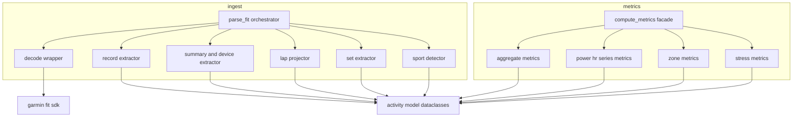
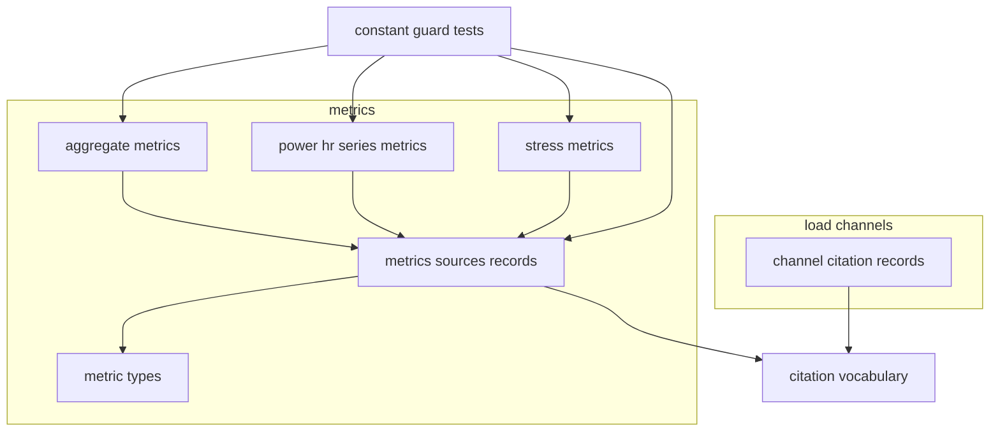
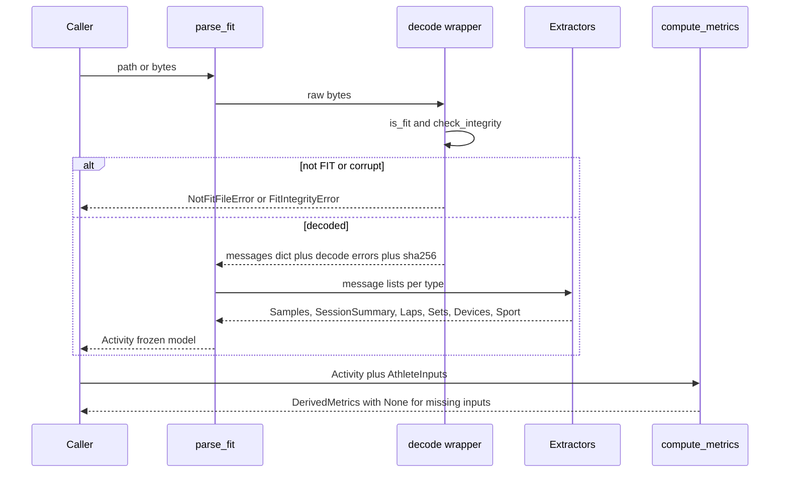
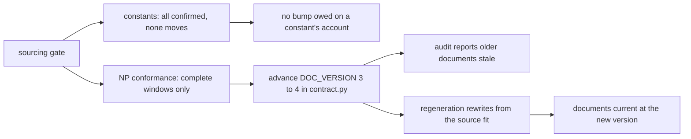

# Technical Design — fit-ingest

## Overview

**Purpose**: fit-ingest delivers the foundation layer of fitdocs: a pure
Python library that decodes a `.fit` file into a normalized, typed activity
model and computes derived metrics locally at fitdocs.ai parity. It gives
every downstream feature — workout-docs rendering and training-load
calculation — one reliable contract over binary FIT data.

**Users**: fitdocs developers and the downstream specs (workout-docs,
training-load) consume it as an in-process library; the athlete never
interacts with it directly.

**Impact**: Greenfield — establishes the package skeleton (`src/fitdocs/`),
the versioned activity-model contract, and the metric formula
implementations that replace fitdocs.ai's Intervals.icu imports.

**Impact (Amendment 1, 2026-07-26; design revised 2026-07-27)**: the shipped
metric *arithmetic* is unchanged in all but one respect — the normalized-power
rolling mean stops averaging partial windows, bringing it into conformance with
the step-1 definition it cites, which moves NP and everything derived from it
(see PowerSeriesMetrics and §Amendment 1: Sourcing Gate and Migration).
Otherwise what changes is where the numbers come from and how that is
recorded. The constants currently cited to
`docs/reference/fitdocs-ai-reference.md` §2 are re-sourced — each either read
from the publishing work's own text (15.1) or declared as fitdocs' own choice
with its justification and its search basis (15.8, 15.9) — and the citation
moves out of docstring prose into a typed, guard-enforced record (Req 16). The
training-impulse weighting becomes a caller-selected pair (Req 17), and any
value the re-sourcing changes reaches already-written documents by
regeneration, never by in-place transform (Req 18). Every execution unit of the
first pass stands: this amendment adds a provenance layer beneath them and
revises the four formula-pinning notes that named the reference document.

### Goals
- Decode `.fit` files safely: loud, typed errors for non-FIT/corrupt input;
  message-level decode errors surfaced, never swallowed (Req 1).
- Produce a versioned, immutable activity model — session summary, laps
  projected onto sample indices, parallel channel arrays, strength sets,
  devices, sport/modality — with `None` for every absent value (Req 2–6, 12).
- Compute the full derived-metric set locally from documented formulas,
  returning `None` whenever inputs are missing (Req 7–11).
- Be deterministic and side-effect-free so golden-file tests are reliable
  (Req 13).
- Make every constant a reported metric is computed from carry its own
  machine-readable source, so an uncited constant fails a check instead of
  shipping unnoticed (Req 15, 16).
- Let an athlete's training-impulse numbers use the weighting the source
  defines for them, without changing anyone's number by default (Req 17).

### Non-Goals
- No CLI, file discovery, configuration, or output writing (workout-docs).
- No markdown/SVG rendering (workout-docs).
- No `LoadCalculator` interface, load methodologies, athlete profile
  storage, or prompting (training-load). TRIMP/power TSS here are generic
  derived metrics, not methodology load.
- No `.gpx`/`.tcx` support; no grade-adjusted pace (deferred with the
  athlete-profile work); no CTL/ATL/TSB (plan-level, deferred).
- **(Amendment 1)** No re-derivation of any formula's *shape* — the amendment
  audits the numbers a published work fixes, not the decision to implement
  that work. It does, however, bring an implementation into **conformance** with
  the text it cites where the sourcing pass finds the two disagree and fitdocs
  has no reason to defend the difference: the NP rolling-window start condition
  is the one such case (see PowerSeriesMetrics), and it is a change to a start
  condition, not to a method. No re-sourcing of another layer's constants
  (`load-channels` carries its own record). No chart palette or layout figure
  (§3 of the reference document; presentation choices owned by workout-docs). No
  storage of the athlete's weighting selection anywhere.

## Boundary Commitments

### This Spec Owns
- The `.fit` decode wrapper and its error taxonomy.
- The activity model schema (`SCHEMA_VERSION`) — the contract both
  downstream specs consume; this spec is authoritative for its shape.
- Sport/modality detection (the isolated home for device-quirk churn).
- Strength set extraction from `set_mesgs` (+ exercise-name resolution).
- Derived-metric formulas and zone *math* (occupancy given boundaries).
- The initial package skeleton: `pyproject.toml`, `src/fitdocs/`, `tests/`.
- **(Amendment 1)** The provenance of every numeric constant this library
  computes a reported metric from, and the record that carries it.
- **(Amendment 1)** The *shared citation vocabulary* — `VerificationStatus`,
  `Citation`, `FitdocsChoice`, `Agreement`, `Corroboration`, `Departure`,
  `CitedConstant` — defined at the
  bottom of the dependency graph in `src/fitdocs/citation.py`. fit-ingest is
  upstream of `load-channels`, which cannot be imported from here, so the one
  vocabulary both layers use is owned here (see Decision D2 in `research.md`).
- **(Amendment 1)** The selection vocabulary and resolution for the
  training-impulse weighting (Req 17); the *values* of each selection's pair
  come from the cited text.

### Out of Boundary
- Zone/threshold *definitions* and persistence — athlete inputs (FTP,
  resting/max HR, zone boundaries) arrive as caller-supplied parameters.
- Anything user-facing: prompts, output paths, document formatting.
- Packaging polish (console entry point, `uv tool install` flow) — the
  `fitdocs` CLI entry is workout-docs's; this spec only makes the package
  importable and testable.
- Methodology-based load calculation of any kind.
- **(Amendment 1)** `load-channels`' six citation records, their verification
  statuses, their notes, and its `Divergence` type and `DIVERGENCES` table.
  This spec re-points where two *type definitions* live and adds two new ones
  (`Agreement`, `Corroboration`) that `load-channels` inherits without using —
  additive and optional, since `CitedConstant.corroborators` defaults to empty
  and `load-channels` holds `Citation`s, not `CitedConstant`s. It changes no
  record, no status and no `load-channels` obligation. Whether `load-channels` adopts
  Req 15.4's stricter bar — no `SECONDARY_ATTESTATION` — stays its own
  decision, and it has since been **ratified as a named-exception variant** of
  that bar rather than the identical bar (maintainer, 2026-07-27;
  `.kiro/queue/closed/2026-07-26-citation-vocabulary-diverges-across-layers.md`,
  `status: done`). Its one remaining `SECONDARY_ATTESTATION` — `BANISTER_TRIMP`,
  in `BLOCKED_CITATIONS` — rests on a premise that has now expired, since the
  texts were obtained; re-sourcing it is
  `.kiro/queue/2026-07-27-banister-morton-primary-texts-obtained.md` and belongs
  to `load-channels`, not here. This spec's own Req 15.4 was never relaxed and
  this amendment's records satisfy it directly.
- **(Amendment 1)** The document-format version's *meaning*, the regeneration
  pass and the staleness report (Req 18.1–18.3) — `fitdocs.contract`,
  `fitdocs.sync` and `fitdocs.audit` already implement all three and are owned
  by wiki-contract/workout-docs. This spec advances the marker when, and only
  when, a re-sourced value differs (18.4); it writes, reads and migrates no
  document (18.5).
- **(Amendment 1)** Storing or prompting for the weighting selection.
  `athlete.py` is owned elsewhere; fit-ingest accepts the selection as a
  caller-supplied argument only (17.3) and works unchanged if no spec ever
  stores it (17.2).
- **(Amendment 1)** How a document *presents* `DerivedMetrics.trimp_weighting`.
  fit-ingest reports the applied selection because 17.6 requires it; whether
  workout-docs renders `banister_male` verbatim, renders nothing when the caller
  stated no selection, or renders a gloss is that spec's decision. This design
  states the fact it hands over — absent a caller selection the field reads
  `banister_male` for every athlete, and 17.3 guarantees nothing remembers
  otherwise between runs — so the downstream spec decides with the consequence in
  front of it rather than discovering it in a rendered document.

### Allowed Dependencies
- `garmin-fit-sdk>=21.208.0` (runtime; also used by tests for fixture
  encoding). The only runtime dependency.
- Python 3.11+ stdlib (`dataclasses`, `datetime`, `hashlib`, `math`,
  `bisect`, `enum`).
- Dev-only: `pytest`, `ruff`, `mypy`.
- Internal direction (violations are review errors):
  `metrics → model`, `ingest → model`; `metrics` never imports `ingest`;
  `model` imports nothing internal and never imports the SDK.
- **(Amendment 1)** `citation` joins `model` at the bottom: it imports nothing
  internal and never imports the SDK. Permitted edges are `metrics → citation`
  and `load → citation`; `citation` imports neither. `metrics` never imports
  `load`, `contract`, `sync` or `audit` — the Req 18 coupling is asserted in a
  *test*, never in production code.
- **(Amendment 1)** No new runtime dependency. Nothing in this amendment
  reaches the network, the filesystem or a configuration file; obtaining the
  primary texts is a human act performed during implementation, and its result
  is committed as literal record data.

### Revalidation Triggers
Downstream specs (workout-docs, training-load) must re-check integration if:
- Any activity-model field is renamed, retyped, or removed, or
  `SCHEMA_VERSION` is bumped.
- `parse_fit` / `compute_metrics` signatures or error taxonomy change.
- The `None`-for-absent convention or units (m, m/s, s, kg, °C, bpm, W)
  change.
- `ZoneSpec` band semantics (ascending dividers → n+1 bands, earlier-sample
  attribution) change.

Amendment 1 adds four, each of which fires in this change:
- **`DerivedMetrics` gains a field** (`trimp_weighting`, 17.6) and
  `AthleteInputs` gains one (`trimp_weighting`, 17.3). Additive and defaulted,
  but every golden snapshot serializing `DerivedMetrics` moves.
- **`stress.trimp` changes shape** — it takes a weighting and returns the
  applied selection alongside the value. `load-channels` Req 8.6 requires it to
  consume the training-impulse coefficients "from the single place they are
  already defined"; that place is now a selection-keyed record, and a channel
  built against the old two-constant shape must be re-checked. No consumer
  exists today (`src/fitdocs/load/channels/__init__.py` is a docstring), so
  this amendment lands *before* the consumer is written — deliberately.
- **`VerificationStatus` and `Citation` move** to `fitdocs.citation`.
  `fitdocs.load.channels.sources` re-exports both, so every existing import
  path keeps working; anything importing them by a new path must not
  re-declare them.
- **`DOC_VERSION` advances** (18.1), which makes every document written before
  this change stale (18.3) until the regeneration pass rewrites it (18.2). No
  longer conditional: the 0.64 ruling means no *constant* moves, but the NP
  rolling-window conformance fix moves NP, IF, VI, TSS and bike EF for any
  activity carrying ≥ 30 s of power, in whichever direction the dropped
  leading windows' mean fourth power differs from the retained series' (a
  constant-power stream is one instance of no movement, not the general
  characterization of it — see PowerSeriesMetrics). **Downstream consumers
  reading NP or anything derived from it will typically see different
  numbers for the same `.fit` file after this
  amendment** — the values are closer to the cited definition, not merely
  different.

## Architecture

### Architecture Pattern & Boundary Map

Layered pipeline per steering (`tech.md`, `structure.md`): a dependency-free
`model` package at the bottom; `ingest` maps FIT messages onto it; `metrics`
computes pure functions over it. Rejected alternatives (flat module, parser
port) are recorded in `research.md`.



**Key decisions**
- Public API is two functions at the package root: `parse_fit` and
  `compute_metrics`. Everything else is importable but secondary.
- Extractors take the decoded message dict (plain `dict[str, list[dict]]`),
  not the SDK stream — unit-testable without binary fixtures.
- Absolute record timestamps are used internally (lap projection) but the
  public model stores float offsets plus one `start_time` anchor.
- Sport detection is a lookup-table module so device-quirk churn lands in
  one file (brief's explicit boundary candidate).

### Constant Provenance (Amendment 1)

The provenance layer sits *beneath* the metric modules and is a pure data
layer: a vocabulary module with no arithmetic, and a records module holding
every constant a reported metric is computed from. A metric module no longer
declares a number; it reads one from a record that carries the number's source.



**Key decisions**
- **One vocabulary, owned at the bottom.** `VerificationStatus` and `Citation`
  exist today in `fitdocs.load.channels.sources`, one layer *above* metrics, so
  fit-ingest cannot import them. They move to a dependency-free
  `fitdocs.citation`; `load.channels.sources` imports and re-exports them,
  keeping its own records byte-identical. The alternative — a second,
  identical vocabulary in `metrics` — was rejected: two definitions of
  "verification status" in one codebase is precisely the ambiguity the record
  exists to remove (Decision D2, `research.md`).
- **A constant is a record, not a number.** `CitedConstant` binds a value to
  its source at the point of definition, so "a constant with no citation" is
  unrepresentable for the covered set rather than merely discouraged
  (16.2). Metric modules read `.value`.
- **The classification is a sealed union, not a widened `Citation`.**
  `SourceRecord = Citation | FitdocsChoice` makes 15.1 and 15.8 the only two
  possibilities and makes 16.7 structural: a fitdocs-chosen record has no
  authors/year/work/locator to leave blank, and carries `justification` and
  `search_basis` that a published-source record has no place for.
- **One governing source, any number of corroborators.** 16.2's "exactly one
  record" and 15.2's "Banister *and* Morton, with the locator within each work"
  are both honored by separating the work that *fixes* the value from further
  works that *speak to* it. The weighting terms are the only constants 15.2
  names, and they are the only ones that carry corroborators — the two texts
  agree on the exponent and disagree on the coefficient, and the record now says
  which, in a field a guard can read.
- **`SECONDARY_ATTESTATION` stays in the enum and out of this layer.** The
  vocabulary is shared with a layer that uses it; a guard asserts no record in
  `metrics/sources.py` carries it, which is what turns Req 15.4's "blocks the
  feature" from prose into a failing test.
- **The guard must be able to fail for a constant that is not in the
  registry.** A test that only checks registered constants is circular, so the
  guard scans the three metric modules for numeric literals and fails on any
  outside an explicit 15.7 exemption list (unit conversions, arithmetic
  identities, percentage scalings). Adding a bare number to a metric module
  reddens until it is registered or exempted with its reason.
- **Req 18 is a coupling assertion, not new machinery.** `sync.py` already
  rewrites a below-version document from its `.fit` and `audit.py` already
  reports one as stale; the only new act is advancing `DOC_VERSION` when a
  value actually changed, and `CitedConstant.previous_value` is the
  machine-readable record of whether one did (18.4).

### Technology Stack

| Layer | Choice / Version | Role in Feature | Notes |
|-------|------------------|-----------------|-------|
| Language / Runtime | Python 3.11+ (managed by `uv`) | Library implementation | steering-pinned |
| FIT parsing | `garmin-fit-sdk>=21.208.0` | Decode (and test-fixture encode) | version floor gives `Encoder`; see `research.md` |
| Model | stdlib `dataclasses` (frozen) | Typed activity model | zero-dependency contract, steering-pinned |
| Tooling | `uv`, `ruff`, `mypy --strict`, `pytest` | Build/lint/type/test | per `tech.md` |

## File Structure Plan

### Directory Structure
```
pyproject.toml                      # NEW: uv project; dep garmin-fit-sdk>=21.208.0; dev group pytest/ruff/mypy; src layout; no console script (workout-docs owns CLI)
src/fitdocs/
├── __init__.py                     # public API re-exports: parse_fit, compute_metrics, model types, error types
├── model.py                        # activity model dataclasses + enums + SCHEMA_VERSION (imports nothing internal)
├── citation.py                     # AMENDMENT 1 (NEW): shared citation vocabulary — VerificationStatus, Citation, FitdocsChoice, SourceRecord, Agreement, Corroboration, Departure, CitedConstant (imports nothing internal)
├── ingest/
│   ├── __init__.py                 # parse_fit() orchestrator: decode → extract → Activity
│   ├── errors.py                   # FitDecodeError, NotFitFileError, FitIntegrityError (SDK-import-free)
│   ├── decode.py                   # SDK wrapper: path/bytes → (messages, errors); integrity/is_fit checks; sha256
│   ├── records.py                  # record_mesgs → Samples (+ internal absolute timestamps)
│   ├── summary.py                  # session_mesgs/activity_mesgs → SessionSummary; device_info_mesgs → DeviceInfo; field_description_mesgs + session → developer-field mapping
│   ├── laps.py                     # lap_mesgs → Lap tuple with sample index projection
│   ├── sets.py                     # set_mesgs (+ Profile exercise-name lookup, exercise_title) → StrengthSet
│   └── sport.py                    # sport/sub_sport maps → Sport, Modality, is_indoor
└── metrics/
    ├── __init__.py                 # compute_metrics() facade → DerivedMetrics
    ├── types.py                    # AthleteInputs, ZoneSpec, DerivedMetrics, TrimpWeighting (stdlib-only)
    ├── sources.py                  # AMENDMENT 1 (NEW): this layer's citation records, its CitedConstants, the weighting pairs, DEPARTURES, CONSTANT_SOURCES
    ├── aggregates.py               # times, distance, pace/speed, HR/power/cadence avg-max, elevation, temperature, calories
    ├── power.py                    # normalized power, IF, VI, EF, decoupling
    ├── zones.py                    # time_in_zone(values, time_s, spec)
    └── stress.py                   # TRIMP, power TSS

tests/
├── conftest.py                     # shared fixtures: synthetic message dicts + encoded .fit files
├── fixtures/builder.py             # synthetic .fit construction via garmin_fit_sdk.Encoder (run, ride, strength, degenerate, corrupt)
├── golden/                         # committed JSON snapshots of model+metrics for synthetic fixtures
├── ingest/test_decode.py           # error taxonomy, integrity, decode-error passthrough, sha256
├── ingest/test_records.py          # channel alignment, None preservation, enhanced preference, semicircles, units
├── ingest/test_summary.py          # session fields, activity fallback, device extraction
├── ingest/test_laps.py             # index projection incl. unmatched laps
├── ingest/test_sets.py             # set fields, name resolution, empty collection, no fabrication
├── ingest/test_sport.py            # sport map, modality, indoor flag, unknown fallback
├── metrics/test_aggregates.py      # moving/elapsed/distance/pace/speed/HR/power/cadence/elevation/temperature
├── metrics/test_power.py           # NP/IF/VI/EF/decoupling vs hand-computed values
├── metrics/test_zones.py           # occupancy, earlier-sample attribution, None exclusion, no defaults
├── metrics/test_stress.py          # TRIMP/TSS vs hand-computed values, calories passthrough
├── metrics/test_sources.py         # AMENDMENT 1 (NEW): record shape, registry completeness, forbidden statuses, weighting bijection, DOC_VERSION coupling
├── metrics/test_constant_guard.py  # AMENDMENT 1 (NEW): numeric-literal scan of the three metric modules against the 15.7 exemption list
└── test_golden.py                  # end-to-end .fit → snapshot equality + determinism (parse twice)
```

### Modified Files

Nothing in the first pass is rewritten; every entry below is an addition or a
re-pointing. "Cited" means the module reads `CitedConstant.value` from
`metrics/sources.py` instead of declaring a literal, and its docstring names
the record instead of `docs/reference/fitdocs-ai-reference.md`.

Two rows touch files this spec declares **out of boundary**, and both are
deliberate and bounded — a reviewer should check them against the Out of
Boundary section rather than infer ownership from their presence here:
`load/channels/sources.py` is an import-only re-point that changes no record
(Decision D2, `research.md`), and `contract.py` is a single conditional
version bump that Req 18.1 makes a completion condition of this amendment.
Neither confers ownership of the surrounding module.

| File | Change | Requirements |
|---|---|---|
| `src/fitdocs/metrics/stress.py` | Weighting coefficient/exponent and the TSS scale become cited; `trimp` takes a resolved weighting and returns `TrimpResult(value, weighting)`; docstring re-cited | 11.1, 11.2, 15.1–15.3, 17.1, 17.5, 17.6 |
| `src/fitdocs/metrics/power.py` | NP rolling window, averaging exponent (today the inline `**4` / `**0.25`) and minimum span become cited; docstring re-cited. **Also `_trailing_rolling_mean` stops emitting partial windows** — the one value-moving edit in this amendment | 8.4, 15.1, 15.6, 15.8, 18.1 |
| `src/fitdocs/metrics/aggregates.py` | The bare `0.5` movement threshold becomes a *named* cited constant; altitude-smoothing window becomes cited; docstring re-cited | 7.1, 9.1, 9.2, 15.6, 15.8, 15.9 |
| `src/fitdocs/metrics/types.py` | `TrimpWeighting` StrEnum added; `AthleteInputs.trimp_weighting` and `DerivedMetrics.trimp_weighting` added, both defaulting to `None` | 17.2, 17.3, 17.6 |
| `src/fitdocs/metrics/__init__.py` | Facade resolves the selection once, passes the pair to `stress.trimp`, populates `trimp_weighting` from the result | 17.1, 17.2, 17.4, 17.6 |
| `src/fitdocs/__init__.py` | `TrimpWeighting` added to the lazy re-exports and `__all__` — callers need it to state a selection | 17.1 |
| `src/fitdocs/load/channels/sources.py` | Import-only: deletes its `VerificationStatus` and `Citation` *definitions*, imports and re-exports them from `fitdocs.citation`. `Divergence`, all six records, every status and note, `CITATIONS` and `DIVERGENCES` unchanged | 16.1 (vocabulary ownership) |
| `src/fitdocs/contract.py` | `DOC_VERSION` 3 → 4, with the docstring's bump rationale extended in the same change. **Now unconditional**: no constant moves, but the NP conformance fix does move NP/IF/VI/TSS/EF | 18.1, 18.4 |
| `tests/metrics/test_stress.py`, `test_power.py`, `test_aggregates.py` | Constants asserted through their records; weighting-selection cases added; worked-example tests added where the cited text publishes one | 15.1, 17.1–17.6 |
| `tests/test_public_api.py` | Surface pin extended by `TrimpWeighting` | 17.1 |
| `tests/golden/*.json` | Regenerated: `DerivedMetrics` gains `trimp_weighting`. **Not the window-start migration surface** — every committed fixture reports `normalized_power_w: null` (each spans far short of `NP_ROLLING_WINDOW_S`), so no golden's NP/IF/VI/TSS/EF value moves from that fix; the migration surface is the exact-value assertion in `tests/metrics/test_power.py` (see PowerSeriesMetrics, Testing Strategy §13, and `tasks.md`'s task 13.1 note on why "regenerate what moved" is vacuous here). No constant-driven movement either | 18.2 (rehearsal), 18.4 |
| `tests/load/channels/test_sources.py` | **Unchanged, deliberately** — it imports `VerificationStatus` from `fitdocs.load.channels.sources` and passing unmodified is the evidence the re-export is behavior-preserving | — |

## System Flows



Flow decisions: validation fails fast before extraction (Req 1.2, 1.3);
message-level decode errors do not abort — they ride on provenance
(Req 1.4); metric computation never raises for missing data (Req 12.1),
only for invalid caller inputs (e.g. non-ascending zone dividers).

## Requirements Traceability

| Requirement | Summary | Components | Interfaces |
|-------------|---------|------------|------------|
| 1.1–1.5 | Decode, validate, error taxonomy, error passthrough, source immutability | FitDecoder, IngestOrchestrator | `parse_fit`, `NotFitFileError`, `FitIntegrityError` |
| 2.1–2.6 | Versioned typed model, provenance, UTC datetimes, None convention | ActivityModel, IngestOrchestrator | `Activity`, `Provenance`, `SCHEMA_VERSION` |
| 3.1–3.6 | Parallel channel arrays, units, enhanced preference, semicircles, raw values | RecordExtractor | `Samples`, `extract_samples` |
| 4.1–4.5 | Session summary, activity fallback, lap projection, devices | SummaryExtractor, LapProjector | `SessionSummary`, `Lap`, `DeviceInfo` |
| 5.1–5.6 | Sport map, fallback, modality, strength, indoor flag | SportDetector | `detect_sport`, `Sport`, `Modality` |
| 6.1–6.5 | Strength sets, faithful fields, name resolution, empty ok, no fabrication | SetExtractor | `StrengthSet`, `extract_sets` |
| 7.1 _(rev. A1)_ | Moving time: session timer, else threshold + distance-increase fallback, both cited | AggregateMetrics, MetricsSources | `moving_time_s`, `MOVING_SPEED_THRESHOLD_MPS` |
| 7.2–7.6 | Elapsed time, distance, speed, pace | AggregateMetrics | `avg_pace_s_per_km`, … |
| 8.1–8.3, 8.5–8.8 | HR/power/cadence aggregates; IF, VI, EF, decoupling | AggregateMetrics, PowerSeriesMetrics | `decoupling_pct`, … |
| 8.4 _(rev. A1)_ | NP: window width, averaging exponent, minimum span all cited; rolling mean brought into conformance with the cited step 1 (complete windows only) | PowerSeriesMetrics, MetricsSources, MigrationGate | `normalized_power`, `NP_ROLLING_WINDOW_S`, `_trailing_rolling_mean` |
| 8.9 _(added by A1, revision 2026-07-30)_ | The rolling mean's start condition itself: contributes only windows spanning the full cited width, reporting `None` when the power-stream span is insufficient to complete one such window — the acceptance criterion for the behavior 8.4's traceability row already implements | PowerSeriesMetrics, MigrationGate | `normalized_power`, `_trailing_rolling_mean` |
| 9.1 _(rev. A1)_, 9.2 | Elevation gain/loss with a cited smoothing window | AggregateMetrics, MetricsSources | `elevation_gain_m`, `ALTITUDE_SMOOTHING_WINDOW` |
| 9.3–9.5 | Min/max altitude, temperature aggregates | AggregateMetrics | `min_altitude_m`, … |
| 10.1–10.5 | Time-in-zone from caller boundaries, attribution, no defaults | ZoneMetrics, MetricTypes | `time_in_zone`, `ZoneSpec` |
| 11.1 _(rev. A1)_ | TRIMP with cited, selectable weighting terms | StressMetrics, MetricsSources, MetricTypes | `trimp`, `TrimpResult`, `weighting_for` |
| 11.2 _(rev. A1)_ | Power TSS with a cited scale | StressMetrics, MetricsSources | `power_tss`, `TSS_SCALE` |
| 11.3, 11.4 | Calories passthrough; no methodology load | AggregateMetrics, StressMetrics | `calories_kcal` |
| 12.1–12.3 | None-never-fabricated, absent channels, true zeros preserved | all metric components, ActivityModel | cross-cutting convention |
| 13.1–13.3 | No side effects, determinism, pure functions | IngestOrchestrator, MetricsFacade, FixtureBuilder | frozen dataclasses, golden tests |
| 14.1–14.4 _(14.2 rev. A2, corrected post-review)_ | Session-scoped developer fields by described name, decoded per that field's OWN declared scale/offset (identity when undeclared, OMITTED when declared `scale=0`, unscaled passthrough when non-numeric), empty when absent; declaredness surfaced for downstream (workout-docs) | SummaryExtractor, ActivityModel | `extract_developer_fields_with_declared_scale`, `Activity.developer_fields`, `Activity.developer_fields_declared_scale` |
| 15.1 | Published-work constants read from that work's own text | MetricsSources, CitationVocabulary | `Citation`, `VerificationStatus.PRIMARY_TEXT` |
| 15.2 | Weighting terms cite Banister (1991) *and* Morton (1990) with locators | CitationVocabulary, MetricsSources, ConstantGuard | `Corroboration`, `Agreement`, `CitedConstant.corroborators`; guard asserts both works with per-work locators |
| 15.3 | A changed value adopts the primary text and records what it replaced | MetricsSources, CitationVocabulary | `CitedConstant.previous_value` |
| 15.4 | No secondary attestation; an unobtainable primary text blocks | MetricsSources, ConstantGuard | guard: no `SECONDARY_ATTESTATION` in this layer |
| 15.5 | `docs/reference/` never named as a constant's source | ConstantGuard | guard: string absent from `fitdocs/metrics/**` |
| 15.6 | Every named constant classified, none left unclassified | MetricsSources, ConstantGuard | `CONSTANT_SOURCES` completeness assertion |
| 15.7 | Only choice-free values exempt (unit conversions, identities, scalings) | ConstantGuard | the exemption list, each entry with its reason |
| 15.8 | A value no published work defines is recorded as fitdocs' own choice | CitationVocabulary, MetricsSources | `FitdocsChoice.justification`, `.measurement` |
| 15.9 | The "no defining work" conclusion records what was searched | CitationVocabulary, MetricsSources | `FitdocsChoice.search_basis` |
| 16.1 | Machine-readable record: authors, year, work, locator, status | CitationVocabulary | `Citation` |
| 16.2 | Exactly one record per covered constant | CitationVocabulary, ConstantGuard | `CitedConstant.source` (single-valued) |
| 16.3 | An uncited covered constant fails the library's own checks | ConstantGuard | numeric-literal scan + registry completeness |
| 16.4 | Status distinguishes primary text from fitdocs-chosen; never conflated | CitationVocabulary | `SourceRecord` sealed union |
| 16.5 | A deliberate departure from the cited work is recorded with its reason | CitationVocabulary, MetricsSources | `Departure`, `DEPARTURES` |
| 16.6 | Records readable without computing a metric | MetricsSources | `fitdocs.metrics.sources` importable standalone |
| 16.7 | A fitdocs-chosen record carries justification + basis in place of authorship | CitationVocabulary | `FitdocsChoice` |
| 17.1 | Caller's selection picks the pair the cited text specifies | MetricTypes, MetricsSources, MetricsFacade | `TrimpWeighting`, `weighting_for` |
| 17.2 | No selection ⇒ the pre-amendment pair, not `None` | MetricsSources, MetricsFacade | `DEFAULT_TRIMP_WEIGHTING` |
| 17.3 | Selection is caller-supplied only, never read from a file | MetricTypes | `AthleteInputs.trimp_weighting` |
| 17.4 | Unknown selection ⇒ error naming it and the defined selections | MetricsSources | `weighting_for` raises `ValueError` |
| 17.5 | Absent resting/max HR ⇒ TRIMP `None` regardless of selection | StressMetrics | `trimp` precondition order |
| 17.6 | The applied pair is reported alongside TRIMP | StressMetrics, MetricTypes | `TrimpResult`, `DerivedMetrics.trimp_weighting` |
| 18.1 | A changed value advances the document-format version | MigrationGate | `contract.DOC_VERSION` |
| 18.2 | Below-version documents are rewritten from source, never transformed | MigrationGate | existing `sync.py` regeneration pass |
| 18.3 | Unregenerated documents report as stale | MigrationGate | existing `audit.py` staleness check |
| 18.4 | Unchanged value ⇒ identical metrics, nothing made stale | MetricsSources, MigrationGate | `previous_value is None` ⇒ no bump |
| 18.5 | fit-ingest reads, writes and migrates no document | MigrationGate | test-only coupling; no production import |

## Components and Interfaces

| Component | Domain/Layer | Intent | Req Coverage | Key Dependencies | Contracts |
|-----------|--------------|--------|--------------|------------------|-----------|
| ActivityModel | model | Typed, versioned activity contract | 2, 12, 14 | — (stdlib only) | State |
| CitationVocabulary | citation | The shared source-record types both layers use | 15.8, 15.9, 16.1, 16.4–16.7 | — (stdlib only) | State |
| MetricsSources | metrics | This layer's records, its cited constants, the weighting pairs | 15.1–15.6, 16.2, 16.5, 17.1, 17.2, 17.4 | CitationVocabulary (P0), MetricTypes (P0) | State, Service |
| ConstantGuard | tests | Makes an uncited or unclassified constant fail | 15.4–15.7, 16.2, 16.3 | MetricsSources (P0) | Batch |
| MigrationGate | tests | Ties a changed value to the format-version advance | 18.1–18.5 | MetricsSources (P0), `fitdocs.contract` (P0, test-only) | Batch |
| FitDecoder | ingest | Safe FIT byte decode + error taxonomy | 1 | garmin-fit-sdk (P0) | Service |
| IngestOrchestrator | ingest | `parse_fit`: decode → extract → Activity | 1.1, 1.4, 2, 13.1 | all extractors (P0) | Service |
| RecordExtractor | ingest | record_mesgs → parallel channel arrays | 3 | ActivityModel (P0) | Service |
| SummaryExtractor | ingest | session/activity → summary; devices; developer fields | 4.1, 4.2, 4.5, 14 | ActivityModel (P0) | Service |
| LapProjector | ingest | laps + sample index projection | 4.3, 4.4 | ActivityModel (P0) | Service |
| SetExtractor | ingest | set_mesgs → StrengthSet, name resolution | 6 | ActivityModel (P0), SDK Profile (P1) | Service |
| SportDetector | ingest | sport map, modality, indoor flag | 5 | ActivityModel (P0) | Service |
| MetricTypes | metrics | AthleteInputs, ZoneSpec, DerivedMetrics | 10.4, 11.1, 11.2 | ActivityModel (P0) | State |
| AggregateMetrics | metrics | Session-preferred scalar metrics | 7, 8.1–8.3, 9, 11.3 | ActivityModel (P0) | Service |
| PowerSeriesMetrics | metrics | NP, IF, VI, EF, decoupling | 8.4–8.9 | ActivityModel (P0) | Service |
| ZoneMetrics | metrics | time-in-zone occupancy | 10 | MetricTypes (P0) | Service |
| StressMetrics | metrics | TRIMP, power TSS | 11.1, 11.2 | ActivityModel (P0) | Service |
| MetricsFacade | metrics | `compute_metrics` → DerivedMetrics | 7–13 | all metric modules (P0) | Service |
| FixtureBuilder | tests | Synthetic `.fit` construction | 13.2 (golden basis) | garmin-fit-sdk Encoder (P0) | Batch |

### model layer

#### ActivityModel (`src/fitdocs/model.py`)

| Field | Detail |
|-------|--------|
| Intent | The versioned, immutable contract every downstream layer consumes |
| Requirements | 2.1–2.6, 12.3, 14.3 |

**Responsibilities & Constraints**
- Owns the schema: `SCHEMA_VERSION: Final[str] = "1.0"`, stamped on every
  `Activity`; any breaking shape change bumps it (revalidation trigger).
- Imports nothing internal and never imports the SDK — consumable with zero
  FIT knowledge (Req 2.6).
- All types `@dataclass(frozen=True)`; sequences are tuples (hashable,
  immutable, deterministic).
- Every field that a device may omit is `X | None`; recorded zeros are kept
  as zeros (Req 12.3).
- `developer_fields` is a read-only name → raw-value mapping of
  session-scoped developer-defined fields (described field names verbatim;
  array values stored as tuples); it is empty — never `None` — when the file
  describes no such fields (Req 14.1–14.3). A value is DECODED per its own
  `field_description`'s declared scale/offset when one exists (Req 14.2, as
  amended); undeclared stays a pass-through.
- `developer_fields_declared_scale` (Amendment 2 revision) is a read-only
  `frozenset[str]` of the `developer_fields` keys whose description declared
  a scale and/or offset — i.e. ingest already decoded them. Additive,
  defaults to the empty frozenset. This is the fact `workout-docs`'
  `render/sections.py` needs to avoid re-applying its own hardcoded
  hundredths-guess factor on top of an already-correct decoded value (the
  critical defect this revision closes); it is a narrower surface than the
  full field description (`units`, `components`, `bits`, `accumulate` are
  deliberately NOT surfaced and remain the open question in
  `2026-07-25-devfield-declared-scale-ignored.md`) — the maintainer's ruling.
  Downstream consumer: `render/sections.py` (see this amendment's
  `cross_spec` note in `spec.json`).

##### Service Interface (types)
```python
SCHEMA_VERSION: Final[str] = "1.0"
FIT_EPOCH: Final[datetime]  # 1989-12-31T00:00:00+00:00

def fit_datetime(raw: int) -> datetime:
    """FIT epoch seconds -> tz-aware UTC datetime (2.4). Stdlib-only; the
    shared conversion helper every extractor uses."""

class Sport(StrEnum):
    RIDE = "Ride"; RUN = "Run"; SWIM = "Swim"; WALK = "Walk"
    HIKE = "Hike"; ROWING = "Rowing"; WORKOUT = "Workout"

class Modality(StrEnum):
    RUN = "run"; BIKE = "bike"; SWIM = "swim"
    STRENGTH = "strength"; OTHER = "other"

@dataclass(frozen=True)
class Provenance:
    sha256: str                      # content hash of source bytes (2.3)
    source_path: str | None          # None when parsed from bytes
    decode_errors: tuple[str, ...]   # message-level decoder errors (1.4)

@dataclass(frozen=True)
class Samples:                       # parallel arrays, equal length (3.1)
    time_s: tuple[float, ...]        # offset since activity start
    heart_rate_bpm: tuple[int | None, ...]
    power_w: tuple[int | None, ...]
    cadence_rpm: tuple[float | None, ...]
    speed_mps: tuple[float | None, ...]
    distance_m: tuple[float | None, ...]
    altitude_m: tuple[float | None, ...]
    latitude_deg: tuple[float | None, ...]
    longitude_deg: tuple[float | None, ...]
    temperature_c: tuple[float | None, ...]

@dataclass(frozen=True)
class SessionSummary:                # recorded values only, no derivation (4.1)
    sport: str | None                # raw FIT string; normalized label lives on Activity
    sub_sport: str | None
    start_time: datetime | None      # tz-aware UTC (2.4)
    total_elapsed_time_s: float | None
    total_timer_time_s: float | None
    total_distance_m: float | None
    total_calories_kcal: int | None
    total_ascent_m: float | None
    total_descent_m: float | None
    avg_heart_rate_bpm: int | None
    max_heart_rate_bpm: int | None
    avg_power_w: int | None
    max_power_w: int | None
    avg_cadence_rpm: float | None
    max_cadence_rpm: float | None
    avg_speed_mps: float | None
    max_speed_mps: float | None

@dataclass(frozen=True)
class Lap:
    start_time: datetime | None
    total_elapsed_time_s: float | None
    total_timer_time_s: float | None
    total_distance_m: float | None
    avg_heart_rate_bpm: int | None
    max_heart_rate_bpm: int | None
    avg_power_w: int | None
    max_power_w: int | None
    avg_cadence_rpm: float | None
    avg_speed_mps: float | None
    max_speed_mps: float | None
    total_ascent_m: float | None
    total_descent_m: float | None
    start_index: int | None          # inclusive, into Samples (4.3)
    end_index: int | None            # inclusive; both None if unmatched (4.4)

@dataclass(frozen=True)
class StrengthSet:
    set_type: str | None             # 'active' | 'rest'
    start_time: datetime | None
    duration_s: float | None
    repetitions: int | None
    weight_kg: float | None
    category: str | None             # e.g. 'bench_press'
    exercise_name: str | None        # resolved; None when unresolvable (6.3)
    message_index: int | None

@dataclass(frozen=True)
class DeviceInfo:
    device_index: int | None
    manufacturer: str | None
    product_name: str | None
    serial_number: int | None
    software_version: float | None
    battery_status: str | None       # 'new'|'good'|'ok'|'low'|'critical'|...

@dataclass(frozen=True)
class Activity:
    schema_version: str              # == SCHEMA_VERSION (2.2)
    provenance: Provenance
    sport: Sport
    modality: Modality
    is_indoor: bool
    start_time: datetime | None      # session start, else first record ts
    summary: SessionSummary          # always present; fields None when absent
    laps: tuple[Lap, ...]
    samples: Samples                 # always present; arrays may be empty
    sets: tuple[StrengthSet, ...]
    devices: tuple[DeviceInfo, ...]
    developer_fields: Mapping[str, object]  # session-scoped, by described field name; empty when none (14.1, 14.3)
    developer_fields_declared_scale: frozenset[str]  # keys ingest decoded via a declared scale/offset (14.2, A2 revision)
```
- Invariants: all `Samples` arrays share one length; `time_s` is
  non-decreasing; `laps` preserve message order; `sets` preserve recorded
  order (6.1).

### citation layer (Amendment 1)

#### CitationVocabulary (`src/fitdocs/citation.py`)

| Field | Detail |
|-------|--------|
| Intent | The one set of types in which any fitdocs layer states where a number came from |
| Requirements | 15.2, 15.8, 15.9, 16.1, 16.4, 16.5, 16.6, 16.7 |

**Responsibilities & Constraints**
- Imports nothing internal and holds no arithmetic and no records — it defines
  shapes only. Sits beside `model.py` at the bottom of the graph so both
  `metrics` (below `load`) and `load.channels` (above it) can import it.
- `VerificationStatus` keeps the three existing members verbatim, including
  `SECONDARY_ATTESTATION`, which `load-channels` uses and Req 15.4 forbids for
  a fit-ingest constant. The vocabulary is shared; the *policy* over it is
  per-layer and each layer's guard states its own.
- `SourceRecord` is a sealed two-member union. A record is either a published
  work or a fitdocs choice, and 16.4's "never record the former where only the
  latter holds" is enforced by the type rather than by review: `FitdocsChoice`
  has no `verification` field to set to `PRIMARY_TEXT`.
- `CitedConstant` is the binding required by 16.2. It carries exactly one
  *governing* `source` — the work whose text fixes the value — so a constant
  with two governing sources or none cannot be constructed.
  `previous_value` records the value a primary text replaced (15.3) and is
  `None` when the re-sourcing confirmed the shipped value (18.4).
- **`corroborators` is how 15.2 is satisfied without breaking 16.2.** Req 15.2
  requires a training-impulse weighting term to record Banister (1991) *and*
  Morton (1990) "together with the locator within each work at which the value
  appears," while 16.2 requires exactly one record per constant. Those read as a
  contradiction only if "record" and "governing source" are the same thing. They
  are not: `CitedConstant` keeps one governing `source` (16.2) and carries a
  tuple of `Corroboration`s, each naming a further work, the locator within it,
  and — the part prose cannot be guarded on — whether that work `AGREES` with
  the value, `OMITS` it, or `DIFFERS` from it. 15.2 becomes a guard assertion
  rather than a sentence someone has to remember to write.
  The alternative — one `Citation` plus a prose `note` naming the second work —
  was considered and rejected: `note` is unstructured, so the second work's
  locator would not meet 16.1's machine-readable bar, and Amendment 1 exists
  precisely so citation stops living in prose (see the Overview's Amendment 1
  paragraph). Recorded as Decision D6 in `research.md`.
- **What `corroborators` does *not* solve.** It expresses "another work speaks
  to this value." It does not express "one *field* of this citation is attested
  differently from the rest," which is the live case for `Citation.year`:
  Banister (1991)'s copyright page carries no year — the verso was reset for a
  later printing — so `1991` comes from the OCLC / Internet Archive catalogue
  record while the chapter content is primary text. That is a
  `VerificationStatus` vocabulary question owned by
  `.kiro/queue/2026-07-27-banister-morton-primary-texts-obtained.md`, together
  with the primary-source-conflict question, and this design deliberately does
  not pre-empt it. `year: int` stays a plain field; if that ruling introduces a
  per-field attestation it edits this module and nothing else.

**Dependencies**
- Inbound: MetricsSources (P0); `fitdocs.load.channels.sources` (P1, re-export).
- External: none.

**Contracts**: State

##### Service Interface (types)
```python
class VerificationStatus(StrEnum):
    PRIMARY_TEXT = "primary_text"
    SECONDARY_ATTESTATION = "secondary_attestation"   # not permitted in metrics/sources.py (15.4)
    FITDOCS_MEASURED = "fitdocs_measured"

@dataclass(frozen=True)
class Citation:                       # a published work (15.1, 16.1)
    key: str
    authors: str
    year: int
    work: str
    locator: str | None
    verification: VerificationStatus
    note: str | None = None

@dataclass(frozen=True)
class FitdocsChoice:                  # no published work defines this value (15.8, 15.9, 16.7)
    key: str
    justification: str                # why this value, non-empty
    search_basis: str                 # what was searched and what was found, non-empty
    measurement: str | None = None    # the measurement supporting it, where the choice rests on one
    verification: Literal[VerificationStatus.FITDOCS_MEASURED] = VerificationStatus.FITDOCS_MEASURED

SourceRecord = Citation | FitdocsChoice

class Agreement(StrEnum):             # 15.2 — how a corroborating work relates to the value
    AGREES = "agrees"                 # states the same value
    OMITS = "omits"                   # states the surrounding formula without this term
    DIFFERS = "differs"               # states a different value

@dataclass(frozen=True)
class Corroboration:                  # 15.2 — a further work that speaks to the value
    citation: Citation                # the corroborating work, with its own verification status
    locator: str                      # where in THAT work, non-empty
    agreement: Agreement
    note: str | None = None           # required by the guard when agreement is not AGREES

@dataclass(frozen=True)
class Departure:                      # 16.5
    subject: str                      # the constant or behavior departing, unique within DEPARTURES
    source_specifies: str
    fitdocs_does: str
    reason: str

_N = TypeVar("_N", int, float)

@dataclass(frozen=True)
class CitedConstant(Generic[_N]):     # 16.2
    name: str                         # unique within CONSTANT_SOURCES
    value: _N
    source: SourceRecord              # the ONE governing record (16.2)
    corroborators: tuple[Corroboration, ...] = ()   # further works speaking to it (15.2)
    departure: Departure | None = None
    previous_value: _N | None = None  # the pre-Amendment-1 value this replaced (15.3)
```
- Invariants: `previous_value`, when present, differs from `value`;
  a `Citation` carrying `PRIMARY_TEXT` has a non-`None` `locator`;
  `FitdocsChoice.justification` and `.search_basis` are non-empty;
  every `Corroboration` has a non-empty `locator`, and a non-`None` `note`
  whenever its `agreement` is not `AGREES` — a work that omits or contradicts
  the value must say so in words as well as in the enum, since that is what a
  reader of the record needs;
  no `Corroboration` names the same work as its constant's governing `source`.
  All are asserted by ConstantGuard, not by `__post_init__`, so the failure
  names the offending constant rather than a construction site.
- A `FitdocsChoice` constant takes no corroborators: 15.8 is reachable only
  where *no* published work defines the value, so a work speaking to it would
  contradict the classification rather than corroborate it. Asserted.
- `Departure` is generic over "the cited work", where `load-channels`'
  `Divergence` is specific to intervals.icu interop. Both stay; they answer
  different questions and `Divergence` remains defined in `load.channels`.

### ingest layer

#### FitDecoder (`src/fitdocs/ingest/decode.py`, `errors.py`)

| Field | Detail |
|-------|--------|
| Intent | The only module touching the SDK decoder; validation + raw message dict |
| Requirements | 1.1–1.5 |

**Responsibilities & Constraints**
- Reads bytes (from path or passed buffer) exactly once; never writes or
  mutates the source (1.5); computes sha256 of the raw bytes.
- Mirrors the reference decode flags: `apply_scale_and_offset=True`,
  `expand_components=True`, `convert_datetimes_to_dates=False` (manual
  FIT-epoch conversion downstream); SDK defaults retained for
  `convert_types_to_strings`, `expand_sub_fields`, `merge_heart_rates`.
- Calls `is_fit()` then `check_integrity()`, resetting the stream before
  `read()` (both advance it — reference-documented pitfall).

**Dependencies**
- External: `garmin-fit-sdk` — decode (P0).

##### Service Interface
```python
class FitDecodeError(Exception): ...          # base, in errors.py
class NotFitFileError(FitDecodeError): ...    # 1.2
class FitIntegrityError(FitDecodeError): ...  # 1.3

@dataclass(frozen=True)
class DecodeResult:
    messages: dict[str, list[dict[str, object]]]  # 'record_mesgs', ...
    errors: tuple[str, ...]                        # stringified decoder errors
    sha256: str
    source_path: str | None

def decode_fit(source: str | Path | bytes) -> DecodeResult
```
- Preconditions: none. Postconditions: raises `NotFitFileError` /
  `FitIntegrityError` on invalid input; otherwise returns every message
  list untouched. Errors from `Decoder.read()` are stringified, never
  raised (1.4).

#### IngestOrchestrator (`src/fitdocs/ingest/__init__.py`)

| Field | Detail |
|-------|--------|
| Intent | Public `parse_fit`: compose decoder + extractors into an `Activity` |
| Requirements | 1.1, 1.4, 2.1–2.5, 13.1 |

**Responsibilities & Constraints**
- Pure composition — no extraction logic of its own; determines
  `start_time` (session start, else first record timestamp, else None) and
  passes it to extractors needing offsets.
- Timestamp conversion policy: every extractor applies the shared
  `fit_datetime` helper owned by the model module (2.4) — the orchestrator
  creates no conversion logic of its own.

##### Service Interface
```python
def parse_fit(source: str | Path | bytes) -> Activity
```
- Postconditions: returned `Activity.schema_version == SCHEMA_VERSION`;
  `provenance.decode_errors` carries decoder errors; no file/network writes
  occurred (13.1).

#### RecordExtractor (`src/fitdocs/ingest/records.py`)

| Field | Detail |
|-------|--------|
| Intent | `record_mesgs` → `Samples` + internal absolute timestamps |
| Requirements | 3.1–3.6 |

##### Service Interface
```python
def extract_samples(
    record_mesgs: list[dict[str, object]],
    start_time: datetime | None,
) -> tuple[Samples, tuple[datetime, ...]]   # timestamps for lap projection
```
- Channel policy: prefer `enhanced_speed`/`enhanced_altitude`, fall back to
  `speed`/`altitude` (3.3); semicircles × (180 / 2³¹) → degrees (3.4);
  units per model (3.5); missing keys → `None` at that index (3.2); values
  stored raw — no smoothing (3.6).
- Records without a timestamp are dropped (cannot be placed on the
  timeline); this is the only record-level exclusion.

#### SummaryExtractor (`src/fitdocs/ingest/summary.py`)

| Field | Detail |
|-------|--------|
| Intent | First session message → `SessionSummary`; `activity_mesgs` fallback totals; `device_info_mesgs` → `DeviceInfo` tuple; `field_description_mesgs` + session → developer-field mapping |
| Requirements | 4.1, 4.2, 4.5, 14.1–14.4 |

##### Service Interface
```python
def extract_summary(
    session_mesgs: list[dict[str, object]],
    activity_mesgs: list[dict[str, object]],
) -> SessionSummary
def extract_devices(device_info_mesgs: list[dict[str, object]]) -> tuple[DeviceInfo, ...]
def extract_developer_fields(
    field_description_mesgs: list[dict[str, object]],
    session_mesgs: list[dict[str, object]],
) -> Mapping[str, object]
    # thin wrapper over extract_developer_fields_with_declared_scale, values only
def extract_developer_fields_with_declared_scale(
    field_description_mesgs: list[dict[str, object]],
    session_mesgs: list[dict[str, object]],
) -> tuple[Mapping[str, object], frozenset[str]]
```
- Fallback policy (4.2): when no session exists, populate
  `total_timer_time_s` (and `start_time` when derivable) from the first
  activity message; every other field stays `None`.
- Devices are deduplicated by `(device_index, serial_number)` keeping the
  last report (device_info repeats over an activity); absent fields `None`.
- Developer-field policy (14.1–14.4, 14.2 revised by Amendment 2 and its
  post-review revision): keys are the described field names verbatim from
  `field_description_mesgs`; values are read from the decoded session message
  and DECODED per that field's own description — a declared `scale`/`offset`
  is applied (`value / scale - offset`, the same formula `garmin-fit-sdk`
  applies to a native field but never to a developer field), element-wise for
  an array, defaulting an UNdeclared term to its identity (scale 1, offset 0)
  so a description declaring neither — every field in the current corpus — is
  unchanged and arrays still become tuples. No undeclared convention is
  inferred; that remains interpretation and stays out of this function.
  Described fields the session does not record are omitted (never
  fabricated); no descriptions, or none recorded on the session, yields an
  empty mapping without error.
  - A DECLARED `scale` of `0` is unrepresentable (division by zero): the
    field is OMITTED entirely — the maintainer's ruling (2026-07-27),
    reached against the raw-value-fallback alternative because that would
    reinstate the wrong-by-a-constant-factor, no-signal shape the originating
    queue item condemned, and conflicts with CLAUDE.md's absent-data-is-`None`
    rule and Req 14.4's never-fabricate posture.
  - A non-numeric raw value under a declared scale (e.g. a string-typed
    field) passes through UNSCALED — the declaration is what's malformed, not
    the value, and the value is real data worth keeping.
  - `extract_developer_fields_with_declared_scale` additionally returns a
    `frozenset[str]` of the resolved keys whose description declared a scale
    and/or offset — surfacing DECLAREDNESS ONLY (not the full field
    description: `units`, `components`, `bits`, `accumulate` stay out of
    scope per the maintainer's ruling and remain the open question in
    `2026-07-25-devfield-declared-scale-ignored.md`). This is what lets
    `render/sections.py` (workout-docs) tell an already-decoded value apart
    from a raw one instead of guessing — see SharedSections below and this
    amendment's `cross_spec` note in `spec.json`.

#### LapProjector (`src/fitdocs/ingest/laps.py`)

| Field | Detail |
|-------|--------|
| Intent | `lap_mesgs` → `Lap` tuple with inclusive sample index ranges |
| Requirements | 4.3, 4.4 |

##### Service Interface
```python
def extract_laps(
    lap_mesgs: list[dict[str, object]],
    record_timestamps: tuple[datetime, ...],
) -> tuple[Lap, ...]
```
- Projection algorithm: laps sorted by `start_time`; `start_index` = first
  record with `timestamp >= lap.start_time`; `end_index` = index before the
  next lap's `start_index` (last lap ends at the final record), inclusive.
- A lap whose window contains no records — or any lap when there are no
  records or it lacks `start_time` — gets `start_index = end_index = None`
  with summary fields preserved (4.4).

#### SetExtractor (`src/fitdocs/ingest/sets.py`)

| Field | Detail |
|-------|--------|
| Intent | `set_mesgs` (+ optional `exercise_title_mesgs`) → `StrengthSet` tuple |
| Requirements | 6.1–6.5 |

**Responsibilities & Constraints**
- Standard-watch reality (research-verified): free recordings carry
  `category` (string array — first entry used) and `category_subtype` (raw
  int array); the exercise name resolves via the SDK Profile table
  `types[f"{category}_exercise_name"][subtype]`. `exercise_title` messages
  exist only for structured workouts and are an optional refinement: when a
  set's `wkt_step_index` matches a title's `message_index` chain, its
  `wkt_step_name` wins.
- Resolution failure at any step → `exercise_name = None`; no guessing
  (6.3, 6.5). The user fills in exercises manually in the generated doc
  (a workout-docs concern); this extractor only exposes what was recorded.
- `weight_kg` keeps recorded zeros (bodyweight sets record 0 — a true zero
  per 12.3).

##### Service Interface
```python
def extract_sets(
    set_mesgs: list[dict[str, object]],
    exercise_title_mesgs: list[dict[str, object]],
) -> tuple[StrengthSet, ...]
```
- Postconditions: one `StrengthSet` per set message in recorded order
  (6.1); empty tuple when no set messages (6.4).

#### SportDetector (`src/fitdocs/ingest/sport.py`)

| Field | Detail |
|-------|--------|
| Intent | Normalized sport label, modality, indoor flag from sport/sub_sport strings |
| Requirements | 5.1–5.6 |

##### Service Interface
```python
def detect_sport(
    sport: str | None, sub_sport: str | None
) -> tuple[Sport, Modality, bool]   # (label, modality, is_indoor)
```
- `SPORT_MAP`: cycling→Ride, running→Run, swimming→Swim, walking→Walk,
  hiking→Hike, rowing→Rowing, training/fitness_equipment/generic→Workout;
  anything else/None → Workout (5.3, no raise).
- Modality: `sub_sport == "strength_training"` → strength (5.5, wins over
  sport); else running→run, cycling→bike, swimming→swim; else other.
- `INDOOR_SUB_SPORTS` frozenset (verified strings, machine-bound only):
  treadmill, spin, indoor_cycling, indoor_rowing, indoor_walking,
  indoor_running, virtual_activity, elliptical, stair_climbing →
  `is_indoor=True` (5.6). Ambiguous sub-sports (lap_swimming,
  strength_training, cardio_training) are not flagged — the device does not
  assert indoorness for them, and fabricating it would violate the
  no-fabrication rule.
- Source precedence: session sport/sub_sport, falling back to
  `sport_mesgs` when the session lacks them.

### metrics layer

#### MetricsSources (`src/fitdocs/metrics/sources.py`) — Amendment 1

| Field | Detail |
|-------|--------|
| Intent | Every constant this layer computes a reported metric from, with its source |
| Requirements | 15.1–15.6, 16.2, 16.5, 16.6, 17.1, 17.2, 17.4 |

**Responsibilities & Constraints**
- Holds no arithmetic. A metric module imports a `CitedConstant` and reads
  `.value`; it declares no number of its own outside the 15.7 exemptions.
- Classifies **every** value Req 15.6 names under exactly one of 15.1 or 15.8,
  leaving none unclassified. The criterion's own enumeration is the authority,
  and this design reads it as the eight values below. Amendment 1's narrative
  counts "seven" because the enumeration lists the training-impulse weighting
  as one item though it names two constants, the coefficient and the
  exponent — reconciled and **closed with the maintainer's confirmation
  2026-07-27** at
  `.kiro/queue/closed/2026-07-26-amendment-1-constant-count-ambiguous.md`
  (`status: done`; the "seven items / eight constants" reading stands, and the
  alternative reading of "seven *measured* constants" is deliberately
  foreclosed); the
  narrative sentence immediately above the revision table (`requirements.md`)
  and the spec.json amendment record now both read seven items / eight
  constants explicitly — the revision table itself carries no count. The
  count is prose and the enumeration is the requirement, so nothing here
  turned on it either way.
- The classification below is **resolved, not expected**. When this design was
  first drafted (2026-07-26) both training-impulse texts were believed
  unobtainable and the Coggan source unlocated, so this table stated
  expectations for a sourcing task to confirm. Both have since been settled on
  `main` — see §Amendment 1: Sourcing Gate and Migration for the evidence and
  what remains. The sourcing task now *transcribes* this table into records and
  verifies each locator against the text; it no longer discovers it.

  | Constant | Site today | Class | Governing source | Locator | Corroborator |
  |---|---|---|---|---|---|
  | training-impulse coefficient | `stress.py:55` | 15.1 | `BANISTER_1991` | p. 408 | `MORTON_1990` p. 1172, `OMITS` |
  | training-impulse exponent | `stress.py:58` | 15.1 | `BANISTER_1991` | p. 408 | `MORTON_1990` p. 1172, `AGREES` |
  | training-stress-score scale | `stress.py:61` | 15.1 | `COGGAN_2003` | §3 pp. 8–11, steps 6–8 | — |
  | NP rolling-window width | `power.py:58` | 15.1 | `COGGAN_2003` | §3 pp. 8–11, step 1 | — |
  | NP averaging exponent | `power.py` (inline `**4` / `**0.25`) | 15.1 | `COGGAN_2003` | §3 pp. 8–11, steps 2–4 | — |
  | NP minimum span | `power.py:55` | 15.8 | `NP_MIN_SPAN_CHOICE` | — | — |
  | moving-time movement threshold | `aggregates.py:103` (bare literal) | 15.8 | `MOVING_THRESHOLD_CHOICE` | — | — |
  | altitude-smoothing window | `aggregates.py:238` | 15.8 | `ALTITUDE_WINDOW_CHOICE` | — | — |

  Three notes a reader should not have to reconstruct:
  - **The governing source for both weighting terms is Banister, not Morton.**
    B91 p. 408 gives `y = 0.64·e^(1.92x)` (male) / `0.86·e^(1.67x)` (female);
    M90 Eq. 2 p. 1172 gives `Y = e^(bx)` with `b` = 1.92 / 1.67 and **no
    multiplicative coefficient at all**. The exponents agree exactly; the
    coefficient does not. The maintainer ruled 2026-07-27 to keep `0.64`, which
    is what `stress.py` already ships — so `previous_value` is `None` for both
    terms and neither moves. Extraction, including M90's own worked example
    implying the coefficient its equation omits:
    `docs/reference/banister-trimp-primary-sources.md` §D1, §D1a.
  - **`COGGAN_2003` is Coggan's own manuscript, not the Allen & Coggan book.**
    An earlier draft of this table named "Allen & Coggan"; the book's own text
    was never obtained. What was obtained, fetched and verified constant by
    constant is Coggan's 2003 USA Cycling coaching-education chapter, already
    shipping as `COGGAN_TSS` with `PRIMARY_TEXT` at
    `src/fitdocs/load/channels/sources.py:137`. This layer's record reuses that
    identification rather than re-deriving it; naming the book would name a work
    nobody read.
  - **`BANISTER_1991.year` is the one non-primary element.** The book's copyright
    page carries no year, so `1991` rests on the OCLC / Internet Archive
    catalogue record while the chapter content is primary text. Flagged here
    because the sourcing task will notice it; the vocabulary question it raises
    is owned by
    `.kiro/queue/2026-07-27-banister-morton-primary-texts-obtained.md`.

- **The classification is not a fallback ladder.** `FitdocsChoice` is
  reachable only for a constant *no published work defines*; 15.9's
  `search_basis` is what distinguishes "nobody wrote this down" from "I could
  not get the paper", and the second case blocks. See §Amendment 1: Sourcing
  Gate and Migration for the gate this feeds and the risk it carries.
- **Weighting selections (Req 17) — the text distinguishes by sex.** Req 17's
  objective says so explicitly ("As an athlete whose sex the training-impulse
  model distinguishes"), and both primary texts define the weighting per sex.
  `WEIGHTING_PAIRS` therefore has exactly two members, fixed here rather than
  deferred to the sourcing task:

  | `TrimpWeighting` member | Coefficient | Exponent | Source |
  |---|---|---|---|
  | `BANISTER_MALE` | 0.64 | 1.92 | B91 p. 408; M90 p. 1172 corroborates the exponent, omits the coefficient |
  | `BANISTER_FEMALE` | 0.86 | 1.67 | B91 p. 408; same corroboration |

  The `BANISTER_` prefix is deliberate: a member names *which fitted curve*, not
  the athlete. Banister fitted two curves to two subject groups, so selecting one
  is a statement about which published curve to apply; a bare `MALE`/`FEMALE`
  enum would read as an assertion about the person. **This naming is the one
  presentation-adjacent choice Amendment 1 makes, and it is flagged for the
  maintainer rather than buried in an enum.**
- **`DEFAULT_TRIMP_WEIGHTING` is `BANISTER_MALE`, and that is a consequence, not
  a preference.** Req 17.2 pins the no-selection default to the pair applied
  before Amendment 1, which `stress.py:55-58` shows is `(0.64, 1.92)` — B91's
  male curve. So the default resolves to `BANISTER_MALE`, and by 17.6 that is
  what `DerivedMetrics.trimp_weighting` reports for every athlete who supplies no
  selection. Two consequences to weigh rather than skim:
  - Applying a sex-specific curve sex-neutrally is a real departure from **both**
    primary texts, not a sourcing artifact
    (`docs/reference/banister-trimp-primary-sources.md` §6 item 2). It is
    recorded in `DEPARTURES` as `trimp-weighting-sex-neutral-default` (16.5),
    which is what keeps it visible instead of implicit.
  - Req 17.3 forbids reading the selection from stored profile data or a
    configuration file, so nothing downstream can remember an athlete's answer
    between runs. The default is therefore what fires in practice, for everyone,
    on every document. What `workout-docs` *renders* for an unstated selection is
    that spec's call (see Out of Boundary), but this design states the fact
    rather than leaving it to be discovered: the field reads `banister_male`
    unless the caller said otherwise.

  Neither consequence moves a number. 17.2 exists so that no athlete's TRIMP
  changes by default, and the Testing Strategy pins the pre-amendment value by
  *value*, not by member name, so a later rename cannot weaken that guarantee.
- Independently importable, so a document or report can name the source of a
  number without computing a metric (16.6). Reached at
  `fitdocs.metrics.sources`; the root package surface is not widened for it.

**Dependencies**
- Outbound: CitationVocabulary (P0) — record types; MetricTypes (P0) —
  `TrimpWeighting`.
- Inbound: AggregateMetrics, PowerSeriesMetrics, StressMetrics (all P0).

**Contracts**: State, Service

##### Service Interface
```python
# Records (15.1) — one per publishing work
BANISTER_1991: Final[Citation]   # locator p. 408; year is catalogue-sourced, see above
MORTON_1990: Final[Citation]     # locator Eq. 2, p. 1172 — corroborator only, governs nothing
COGGAN_2003: Final[Citation]     # §3 pp. 8-11; same work as load.channels.sources.COGGAN_TSS

# Records (15.8) — one per fitdocs-chosen value
NP_MIN_SPAN_CHOICE: Final[FitdocsChoice]
MOVING_THRESHOLD_CHOICE: Final[FitdocsChoice]
ALTITUDE_WINDOW_CHOICE: Final[FitdocsChoice]

# The constants the metric modules read
TSS_SCALE: Final[CitedConstant[float]]
NP_ROLLING_WINDOW_S: Final[CitedConstant[int]]
NP_AVERAGING_EXPONENT: Final[CitedConstant[int]]
NP_MIN_SPAN_S: Final[CitedConstant[float]]
MOVING_SPEED_THRESHOLD_MPS: Final[CitedConstant[float]]
ALTITUDE_SMOOTHING_WINDOW: Final[CitedConstant[int]]

@dataclass(frozen=True)
class WeightingPair:
    selection: TrimpWeighting
    coefficient: CitedConstant[float]   # carries MORTON_1990 as an OMITS corroborator
    exponent: CitedConstant[float]      # carries MORTON_1990 as an AGREES corroborator

WEIGHTING_PAIRS: Final[Mapping[TrimpWeighting, WeightingPair]]
DEFAULT_TRIMP_WEIGHTING: Final[TrimpWeighting]   # == TrimpWeighting.BANISTER_MALE (17.2)

CONSTANT_SOURCES: Final[tuple[CitedConstant[int] | CitedConstant[float], ...]]
DEPARTURES: Final[tuple[Departure, ...]]

def weighting_for(selection: TrimpWeighting | None) -> WeightingPair:
    """Resolve a caller's selection (17.1); ``None`` -> DEFAULT_TRIMP_WEIGHTING
    (17.2). Raises ValueError naming the selection and every selection the
    source defines when it resolves to no pair (17.4)."""
```
- Preconditions: none. Postconditions: `weighting_for` is total over
  `TrimpWeighting | None` or raises; no function here touches a file, a clock
  or the network.
- Invariants: `CONSTANT_SOURCES` names are unique and cover every constant the
  metric modules read; `WEIGHTING_PAIRS` keys are exactly the `TrimpWeighting`
  members; every coefficient and exponent in it also appears in
  `CONSTANT_SOURCES`; every weighting-term constant carries a `MORTON_1990`
  corroborator with a non-empty locator (15.2). Asserted by ConstantGuard.
- **`DEPARTURES` content** (16.5). Three entries, all now attested against the
  primary texts rather than suspected:

  | `subject` | `source_specifies` | `fitdocs_does` |
  |---|---|---|
  | `trimp-weighting-sex-neutral-default` | B91 p. 408 and M90 p. 1172 define the weighting per sex | applies `BANISTER_MALE` to every athlete who states no selection (17.2) |
  | `trimp-per-sample-integration` | both texts sum over segments of near-constant HR, using each segment's average HR | integrates every consecutive sample pair — the continuous limit of the same sum |
  | `trimp-coefficient-over-morton` | M90 Eq. 2 p. 1172 prints the weighting with no multiplicative coefficient | ships B91's `0.64`, per the maintainer's 2026-07-27 ruling and M90's own worked example |

  The third entry and the `OMITS` corroborator on the coefficient are two views
  of one fact and both are kept deliberately: the corroborator is the machine-
  readable *citation* record 15.2 asks for, the `Departure` is the *behavioral*
  record 16.5 asks for, and a reader arriving from either direction finds it.
  `DEPARTURES` is **not** where the NP rolling-window start condition lands —
  that divergence is being removed rather than recorded; see PowerSeriesMetrics.

#### MetricTypes (`src/fitdocs/metrics/types.py`)

| Field | Detail |
|-------|--------|
| Intent | Caller-input and result contracts for all metric functions |
| Requirements | 10.4, 11.1, 11.2, 17.2, 17.3, 17.6 |

**Responsibilities & Constraints (Amendment 1)**
- Stays stdlib-only. `TrimpWeighting` lives here because `AthleteInputs`
  declares it and this module imports nothing internal; the *values* each
  selection maps to live in MetricsSources, which imports this module. That
  split is what keeps the caller-facing vocabulary free of the citation layer.
- The selection reaches the library only through `AthleteInputs` — the same
  caller-supplied channel as FTP and zone boundaries. Nothing in `metrics`
  reads a profile or a configuration file, which is how 17.3 is honored.

##### Service Interface (types)
```python
class TrimpWeighting(StrEnum):
    """The weighting curves Banister (1991) p. 408 fits, one per subject group
    (17.1). A member names the CURVE, not the athlete. The guard asserts a
    one-to-one correspondence with WEIGHTING_PAIRS so the two cannot drift."""

    BANISTER_MALE = "banister_male"      # (0.64, 1.92) — DEFAULT_TRIMP_WEIGHTING (17.2)
    BANISTER_FEMALE = "banister_female"  # (0.86, 1.67)

@dataclass(frozen=True)
class ZoneSpec:
    dividers: tuple[float, ...]      # ascending; n dividers → n+1 bands
    # __post_init__ raises ValueError if not strictly ascending or empty

@dataclass(frozen=True)
class AthleteInputs:                 # all optional — absent means "not provided"
    ftp_watts: float | None = None
    resting_hr_bpm: int | None = None
    max_hr_bpm: int | None = None
    hr_zones: ZoneSpec | None = None      # bpm dividers
    power_zones: ZoneSpec | None = None   # watt dividers
    pace_zones: ZoneSpec | None = None    # s/km dividers
    trimp_weighting: TrimpWeighting | None = None   # 17.2, 17.3: absent -> the pre-amendment pair

@dataclass(frozen=True)
class DerivedMetrics:                # every field may be None (12.1)
    moving_time_s: float | None
    elapsed_time_s: float | None
    distance_m: float | None
    avg_speed_mps: float | None
    max_speed_mps: float | None
    avg_pace_s_per_km: float | None
    avg_heart_rate_bpm: float | None
    max_heart_rate_bpm: float | None
    avg_power_w: float | None
    max_power_w: float | None
    avg_cadence_rpm: float | None
    max_cadence_rpm: float | None
    normalized_power_w: float | None
    intensity_factor: float | None
    variability_index: float | None
    efficiency_factor: float | None
    decoupling_pct: float | None
    elevation_gain_m: float | None
    elevation_loss_m: float | None
    min_altitude_m: float | None
    max_altitude_m: float | None
    min_temperature_c: float | None
    max_temperature_c: float | None
    avg_temperature_c: float | None
    hr_time_in_zone_s: tuple[float, ...] | None
    power_time_in_zone_s: tuple[float, ...] | None
    pace_time_in_zone_s: tuple[float, ...] | None
    trimp: float | None
    trimp_weighting: TrimpWeighting | None   # 17.6: non-None exactly when trimp is
    power_tss: float | None
    calories_kcal: int | None
```
- Band semantics: value `v` belongs to band `i = bisect_right(dividers, v)`;
  callers own the mapping from band index to athletic zone labels (pace
  bands ascend in s/km, i.e. descend in speed) — a deliberate boundary:
  zone *definitions* live in training-load.

#### AggregateMetrics (`src/fitdocs/metrics/aggregates.py`)

| Field | Detail |
|-------|--------|
| Intent | Session-preferred scalar metrics with channel fallbacks |
| Requirements | 7.1–7.6, 8.1–8.3, 9.1–9.5, 11.3 |

**Responsibilities & Constraints**
- Shared pattern (generalization, `research.md`): recorded session value
  wins; else compute from the channel; else `None`. One private helper
  applies it uniformly.
- Formulas (constants cited per Req 15 — _revised by Amendment 1; the
  reference document is no longer named as the source of any of them_):
  - moving time: `total_timer_time`, else Σ dt over consecutive pairs where
    the earlier sample's speed exceeds `MOVING_SPEED_THRESHOLD_MPS` or
    distance increases (7.1). The threshold is today the bare literal `0.5`
    at `aggregates.py:103`; it becomes a named `CitedConstant` because a
    movement threshold carries a methodological choice and is therefore not
    exempt under 15.7;
  - elapsed: `total_elapsed_time`, else last-minus-first `time_s` (7.2);
  - distance: session total, else final cumulative distance value (7.3);
  - pace: `moving_time_s / (distance_m / 1000)` (7.5); the `1000` is a unit
    conversion, exempt under 15.7;
  - elevation gain/loss: session ascent/descent, else ±deltas of altitude
    smoothed by a `None`-skipping boxcar of width
    `ALTITUDE_SMOOTHING_WINDOW` (9.1, 9.2);
  - temperature/altitude min-max-avg from raw channels (9.3, 9.4);
  - calories: session passthrough only, never estimated (11.3).

##### Service Interface
```python
def compute_aggregates(activity: Activity) -> _Aggregates  # internal struct
# plus individually exported pure functions, e.g.:
def moving_time_s(activity: Activity) -> float | None
def elevation_gain_m(activity: Activity) -> float | None
```

#### PowerSeriesMetrics (`src/fitdocs/metrics/power.py`)

| Field | Detail |
|-------|--------|
| Intent | Advanced series metrics fitdocs.ai imported from Intervals.icu |
| Requirements | 8.4–8.9 |

##### Service Interface
```python
def normalized_power(samples: Samples) -> float | None          # 8.4, 8.9
def intensity_factor(np_w: float | None, ftp: float | None) -> float | None  # 8.5
def variability_index(np_w: float | None, avg_power: float | None) -> float | None  # 8.6
def efficiency_factor(activity: Activity, np_w: float | None) -> float | None  # 8.7
def decoupling_pct(activity: Activity) -> float | None          # 8.8
```
- NP _(revised by Amendment 1)_: resample power to 1 Hz over `time_s` (None →
  0 for coasting), trailing rolling mean over `NP_ROLLING_WINDOW_S`,
  `NP = mean(ra**NP_AVERAGING_EXPONENT) ** (1/NP_AVERAGING_EXPONENT)`;
  requires at least `NP_MIN_SPAN_S` of power-stream span, else `None`. The
  window width and the exponent are cited to the publishing work (15.1); the
  minimum span is fitdocs' own choice of when to refuse to report and is
  recorded as such (15.8). The exponent is today two inline literals (`**4`
  and `**0.25`) and becomes one constant, with the root taken as its
  reciprocal so the pair cannot drift apart.
- **The rolling mean emits only complete windows** _(Amendment 1, maintainer
  ruling 2026-07-27)_. `_trailing_rolling_mean` today emits a value at every
  index, averaging a *partial* window over the first `window - 1` points
  (`power.py:87-101`: `count = min(i + 1, window)`). Coggan's step 1 specifies a
  30-second rolling average, and a mean of the first 3 seconds is not one. That
  partial-window behavior was never sourced from any text — it is an
  implementation convenience the first pass introduced — so rather than record it
  as a `Departure` fitdocs has no reason to defend, this amendment removes it:
  the series starts at the first index where a full `NP_ROLLING_WINDOW_S` window
  exists, and NP is the power mean over that series alone.
  - **This changes reported values**, and is the only value-moving change in
    Amendment 1 (a constant-power stream is unaffected: the fourth-power mean
    of one value equals itself under either algorithm). Dropping the leading
    partial-window averages moves NP — and with it IF, VI, TSS and (for bike)
    EF — in whichever direction those dropped windows' mean fourth power
    differs from the retained series': rising when the dropped windows sit
    below it (the common warm-up shape), falling when the activity opens at or
    above its own overall intensity. `tests/metrics/test_power.py` asserts the
    rise directly
    (`test_normalized_power_complete_window_raises_np_over_partial_window`);
    the fall is documented and its complete-window value exactly pinned by
    `test_normalized_power_exact_value_pins_fourth_power_exponent`, whose
    comment records the partial-window value it replaces
    (261.09384206589294 W, higher than the pinned 244.03877169307256 W)
    without asserting that comparison directly. Task 13.4's real-data pass
    confirmed both directions occur on real files (53 rose, 1 fell — the
    faller a hard opener whose dropped partial windows averaged *above* the
    retained series). The effect is small on a long ride and material on a
    short one, which is exactly why it is not left to chance. See §Amendment
    1: Sourcing Gate and Migration for what that obliges under Req 18.
  - **No new `None` case is introduced.** `NP_MIN_SPAN_S` (30 s) is not less than
    `NP_ROLLING_WINDOW_S` (30 s), so a stream that passes the span check yields
    at least one complete window. The existing empty-series guard stays as a
    total-function backstop, not as dead code: keep it, because the two constants
    are independent records and a future narrowing of the span would otherwise
    turn a guarded `None` into an `IndexError`.
  - **Scope note.** The Non-Goals below exclude re-deriving a formula's *shape*.
    This is not that: the shape (1 Hz resample → trailing rolling mean → power
    mean) is unchanged and is what Req 8.4 mandates. What changes is a start
    condition Req 8.4 leaves unstated and the cited text states, found by the
    sourcing pass itself. Amendment 1 brings the implementation into conformance
    with the text it cites; it does not choose a different method. Tracked
    separately at `.kiro/queue/2026-07-27-np-rolling-window-starts-at-zero.md`,
    which this design closes.
- EF: output ÷ avg HR where output = NP (modality bike) or avg speed in
  m/min (modality run); other modalities → `None`.
- Decoupling: split samples at the elapsed-time midpoint; per half compute
  output/HR from samples where both are present (output = power for bike,
  speed for run); `(EF₁ − EF₂) / EF₁ × 100`; `None` unless both halves have
  data. Positive values indicate aerobic drift.
- Formula-pinning rationale recorded in `research.md` (Decision: pin the
  formulas the reference leaves undocumented).

#### ZoneMetrics (`src/fitdocs/metrics/zones.py`)

| Field | Detail |
|-------|--------|
| Intent | Generic time-in-band occupancy for HR, power, pace |
| Requirements | 10.1–10.5 |

##### Service Interface
```python
def time_in_zone(
    values: Sequence[float | None],
    time_s: Sequence[float],
    spec: ZoneSpec,
) -> tuple[float, ...]               # seconds per band, len = dividers + 1
```
- dt between consecutive samples attributed to the earlier sample's band
  (10.2); `None` values contribute to no band (10.3); no embedded defaults
  (10.4). Facade maps channels: HR values directly; power directly; pace as
  `1000 / speed_mps` s/km per sample (speed ≤ 0 or None → excluded).
- Returns `None` at facade level when the spec or the channel is absent
  (10.5) — the function itself is total for valid inputs.

#### StressMetrics (`src/fitdocs/metrics/stress.py`)

| Field | Detail |
|-------|--------|
| Intent | Generic training-stress numbers from cited formulas |
| Requirements | 11.1, 11.2, 11.4, 17.1, 17.5, 17.6 |

##### Service Interface
```python
@dataclass(frozen=True)
class TrimpResult:                    # 17.6 — the value never travels without its pair
    value: float
    weighting: TrimpWeighting

def trimp(
    samples: Samples,
    resting_hr: int | None,
    max_hr: int | None,
    weighting: WeightingPair,
) -> TrimpResult | None
def power_tss(np_w: float | None, moving_time_s: float | None, ftp: float | None) -> float | None
```
- TRIMP _(revised by Amendment 1)_: per consecutive pair with dt > 0 and
  earlier-sample HR present: `HRr = clamp((hr − rest)/(max − rest), 0, 1)`;
  `Σ dt_min · HRr · c · e^(k·HRr)`, where `c` and `k` are the coefficient and
  exponent of the caller-resolved `weighting` (17.1). `None` without resting
  and max HR, whatever weighting was supplied (17.5) — the threshold check
  precedes any use of the pair. The `60` in `dt_min` is a unit conversion,
  exempt under 15.7.
- Returning `TrimpResult` rather than a bare float is what makes 17.6
  structural: there is no code path that produces a TRIMP value without the
  selection that produced it, and `DerivedMetrics.trimp_weighting` is
  non-`None` exactly when `trimp` is. The facade unpacks; it does not decide.
- TSS _(revised by Amendment 1)_: `T · NP · IF / (FTP · 3600) · TSS_SCALE`
  with `T` = moving time in seconds; `None` without FTP/NP/moving time. The
  scale is cited (15.1); the `3600` is a unit conversion, exempt under 15.7.
- Boundary (11.4): no `LoadCalculator`, no methodology — these are plain
  functions any consumer may use.

#### MetricsFacade (`src/fitdocs/metrics/__init__.py`)

| Field | Detail |
|-------|--------|
| Intent | One-call derivation of the full metric set |
| Requirements | 7–11, 12.1, 12.2, 13.2, 13.3, 17.1, 17.2, 17.4, 17.6 |

##### Service Interface
```python
def compute_metrics(
    activity: Activity,
    athlete: AthleteInputs | None = None,
) -> DerivedMetrics
```
- Preconditions: none — every input is optional. Postconditions: never
  raises for missing data; each field independently `None`-able (12.1,
  12.2); pure and deterministic (13.2, 13.3). Raises `ValueError` only for
  invalid caller inputs: a malformed `ZoneSpec`, surfaced at the caller's
  construction site, and _(Amendment 1)_ an unresolvable
  `athlete.trimp_weighting`, surfaced here by `weighting_for` (17.4).
- _(Amendment 1)_ Resolves the weighting **once**, before any metric is
  computed, so an unknown selection fails loudly rather than silently
  producing a TRIMP under some other pair. Resolution is unconditional: it
  happens even when the heart-rate thresholds are absent and TRIMP will be
  `None`, because "you named a selection that does not exist" is a caller
  error whether or not the metric was computable. Both `trimp` and
  `trimp_weighting` come from the single `TrimpResult`.

### test support

#### FixtureBuilder (`tests/fixtures/builder.py`)

| Field | Detail |
|-------|--------|
| Intent | Deterministic synthetic `.fit` fixtures — no personal data ever enters the repo |
| Requirements | supports golden verification of 1–13 (esp. 13.2) |

- Builds byte-level fixtures with `garmin_fit_sdk.Encoder` (research
  decision): outdoor run (GPS/HR/cadence/laps), ride (power/HR/cadence),
  strength (training + strength_training, `set_mesgs` with partial fields),
  minimal file (records only, no session), and corrupt variants (non-FIT
  bytes; truncated valid file) for the error taxonomy.
- Deterministic inputs (fixed timestamps/series) so golden JSON snapshots
  in `tests/golden/` are stable; snapshots — not binaries — are committed.
- First implementation task verifies encoded fixtures pass
  `check_integrity()` (research follow-up); fallback: commit the generated
  synthetic binaries.

#### ConstantGuard (`tests/metrics/test_sources.py`, `tests/metrics/test_constant_guard.py`) — Amendment 1

| Field | Detail |
|-------|--------|
| Intent | Make an uncited, unclassified or dishonestly classified constant fail |
| Requirements | 15.2, 15.4, 15.5, 15.6, 15.7, 16.2, 16.3 |

**Responsibilities & Constraints**
- Req 16.3 asks for a check that fails when a covered constant has no record.
  A test that iterates the registry cannot do that — it can only confirm what
  is already registered. The guard therefore has two halves, and the second is
  the one that carries 16.3:
  1. **Registry assertions** (`test_sources.py`): every value Req 15.6 names is
     present exactly once and classified; names are unique; no record
     carries `SECONDARY_ATTESTATION` (15.4); every `PRIMARY_TEXT` `Citation`
     has a non-empty locator; every `FitdocsChoice` has a non-empty
     `justification` and `search_basis` (15.8, 15.9); `WEIGHTING_PAIRS` and
     `TrimpWeighting` correspond one-to-one; `DEPARTURES` subjects are unique
     and each field non-empty (16.5). **Plus the 15.2 assertions**, which an
     earlier draft left to prose: every constant that is a term of the
     training-impulse weighting carries a `MORTON_1990` corroborator; every
     `Corroboration` anywhere has a non-empty `locator` and, when its
     `agreement` is not `AGREES`, a non-empty `note`; no `Corroboration` names
     the same work as its constant's governing `source`; no `FitdocsChoice`
     constant carries corroborators at all.
  2. **Literal scan** (`test_constant_guard.py`): parse
     `metrics/aggregates.py`, `power.py` and `stress.py` and collect every
     numeric literal. Each must be either read from a `CitedConstant` or
     present in an explicit exemption list, where each entry carries the 15.7
     reason it is exempt (unit conversion, arithmetic identity, percentage
     scaling that follows from a cited definition). Adding a bare number to a
     metric module reddens until it is registered or exempted.
- A third, one-line assertion carries 15.5: the string `docs/reference` does
  not appear anywhere under `src/fitdocs/metrics/`. The three metric modules'
  docstrings name it today and are rewritten in this amendment.
- The exemption list is the guard's own weak point — an over-broad entry
  silently re-opens the hole. Each entry names the literal, the site and the
  reason, and the list is asserted to have no unused entries so it cannot
  accumulate.

**Contracts**: Batch (test-suite gate)

#### MigrationGate (`tests/metrics/test_sources.py`) — Amendment 1

| Field | Detail |
|-------|--------|
| Intent | Tie a changed constant to the document-format version advance |
| Requirements | 18.1, 18.4, 18.5 |

**Responsibilities & Constraints**
- **Two independent triggers, not one.** An earlier draft coupled the bump
  solely to `previous_value`: if any `CitedConstant` carried one,
  `contract.DOC_VERSION` must exceed 3; if none did, no bump was required.
  That is now wrong in a way worth stating, because it would have passed while
  shipping stale documents. Req 18.1 fires on *a changed reported value*, and
  under this amendment a value changes with every `previous_value` still `None`
  (the NP window-start conformance fix). The gate therefore asserts:
  1. **Constant trigger** — any `CitedConstant` carrying a `previous_value`
     implies a bump. Currently vacuous by design: all five 15.1 values were
     confirmed, so nothing carries one. Asserted in both directions anyway, so a
     future re-sourcing that *does* move a constant cannot land without a bump.
  2. **Behavior trigger** — the NP rolling mean's complete-window conformance
     changes NP for any activity carrying ≥ 30 s of power whose dropped
     leading windows' mean fourth power differs from the retained series'
     (a constant-power stream is one instance where it does not — see
     PowerSeriesMetrics), so a bump is owed unconditionally in this amendment
     — `DOC_VERSION` is one version for the whole registry, not per file, and
     at least one real activity in the maintainer's corpus does differ there.
     Pinned by a test that computes NP over a fixture where the
     partial-window and complete-window results provably differ, so the
     trigger cannot become vacuous through a fixture change and silently
     release the bump obligation.
  Neither trigger alone is sufficient to conclude "no bump is required"; that
  conclusion needs both to be quiet, and the test says so explicitly rather than
  by omission.
- Lives in the test layer precisely so 18.5 holds in production: `metrics`
  imports `fitdocs.contract` nowhere, and this coupling exists only where a
  reviewer can see it. The pre-amendment version is a named constant in the
  test with its rationale, not a bare `3`.
- 18.2 and 18.3 need no new code: `sync.py` already rewrites a below-version
  document from its source `.fit` and `audit.py` already reports one as stale.
  The Testing Strategy adds one end-to-end rehearsal of that path rather than
  new machinery. Because a value does move, that rehearsal **runs
  unconditionally** in this amendment rather than only in a branch that might
  never be taken.

**Contracts**: Batch (test-suite gate)

## Data Models

The activity model **is** the data model of this feature (see ActivityModel
component): an aggregate rooted at `Activity` with value-object children —
no persistence, no identity beyond `provenance.sha256`. Invariants:
parallel-array equality in `Samples`; non-decreasing `time_s`; recorded
order preserved for laps and sets; `None` ≠ 0 everywhere.

**Serialization**: none is shipped in this spec. `DerivedMetrics` and all
model types are plain frozen dataclasses; golden tests serialize via
`dataclasses.asdict` + JSON with ISO-8601 datetimes — a test concern, not a
public contract. Downstream rendering owns its own presentation formats.

## Error Handling

### Error Strategy
Two regimes, by audience:
- **Invalid source file** (caller handed us garbage): raise typed
  exceptions — `NotFitFileError`, `FitIntegrityError` (both
  `FitDecodeError`) — before any extraction (1.2, 1.3). Messages include
  the source path when known.
- **Missing data inside a valid file**: never an exception. Absent values
  are `None` in the model (2.5); metrics missing inputs return `None`
  (12.1); message-level decoder errors are collected on
  `provenance.decode_errors` for callers to surface (1.4).
- **Programmer error** (invalid `ZoneSpec`): `ValueError` at construction —
  fail fast, since silent misbinning would fabricate zone data.
- **Caller-named selection that does not exist** _(Amendment 1, 17.4)_:
  `ValueError` from `weighting_for`, naming both the selection supplied and
  every selection the source defines. Deliberately *not* the missing-data
  regime: an absent selection is legitimate and defaults (17.2), while a
  present-but-unknown one is a caller error, and substituting a pair would be
  exactly the fabrication this project forbids. The message lists the valid
  selections because a caller who guessed wrong cannot discover them from a
  `KeyError`.

No logging, retries, or monitoring: a pure library raises or returns; the
CLI (workout-docs) owns user-facing reporting.

## Testing Strategy

### Unit Tests (formula- and extractor-level)
1. **Decode taxonomy**: random bytes → `NotFitFileError`; truncated fixture
   → `FitIntegrityError`; valid fixture with an injected bad message still
   returns an Activity with non-empty `decode_errors` (1.2–1.4).
2. **Channel extraction**: fixture records with gaps → arrays stay aligned
   with `None` holes; enhanced speed/altitude preferred; semicircle →
   degree conversion exact; no smoothing applied (3.1–3.6).
3. **Lap projection**: 3-lap run fixture → inclusive index ranges cover all
   records without overlap; lap with start_time outside record range →
   `None` indices with summary intact (4.3, 4.4).
4. **Sport detection**: table-driven cases for every mapped sport, unknown
   sport → Workout/other, strength_training → strength + indoor,
   treadmill run → run + indoor (5.1–5.6).
5. **Set extraction**: sets with full fields, sets missing weight/reps
   (stay `None`), bodyweight zero preserved, category+subtype → resolved
   name, unresolvable subtype → `None` name, no set messages → empty tuple
   (6.1–6.5, 12.3).
6. **Metric formulas vs hand-computed values**: constant 200 W for 40 min
   with FTP 200 → NP 200, IF 1.0, VI 1.0, TSS ≈ 66.7; alternating 0/300 W
   series → NP > avg power; TRIMP formula against a small worked example;
   zone occupancy with earlier-sample attribution and `None` exclusion;
   decoupling on a constructed drifting series (7–11).
7. **None-propagation**: activity without power/HR/altitude channels →
   dependent metrics `None`, independent metrics still computed; no athlete
   inputs → IF/TSS/TRIMP/time-in-zone `None` (12.1, 12.2, 10.5).
8. **Developer fields**: field descriptions plus session developer fields →
   mapping keyed by the described names with raw values (a 16-entry array
   value stays a 16-entry tuple); no descriptions, or none recorded on the
   session → empty mapping, no error (14.1–14.4).
9. **Citation records** _(Amendment 1)_: every value Req 15.6 names appears
   exactly once in `CONSTANT_SOURCES` and is classified; no record
   carries `SECONDARY_ATTESTATION` (15.4); a `PRIMARY_TEXT` `Citation` has a
   non-empty locator (15.3); a `FitdocsChoice` has a non-empty
   `justification` and `search_basis` (15.8, 15.9); `DEPARTURES` subjects are
   unique with every field populated (16.5); `fitdocs.metrics.sources` imports
   and its records read without computing a metric (16.6). Each metric module
   reads its constant from the record rather than a literal (16.2).
   **Corroboration (15.2)**: both weighting terms carry a `MORTON_1990`
   corroborator with a non-empty locator; the coefficient's `agreement` is
   `OMITS` and the exponent's is `AGREES`, which is the assertion that would
   redden if someone "tidied" the record by dropping the disagreement; every
   non-`AGREES` corroborator has a non-empty `note`; no corroborator repeats its
   constant's governing source; no `FitdocsChoice` constant has corroborators.
10. **Constant guard** _(Amendment 1)_: the literal scan over the three metric
    modules passes on the tree as shipped, and its discriminating power is
    demonstrated — a bare numeric literal inserted into a metric module
    reddens it, and an exemption-list entry removed reddens it. A guard that
    has never been shown to fail is not a guard (`tech.md` §Testing).
11. **Weighting selection** _(Amendment 1)_: a stated selection produces the
    pair the record holds — `BANISTER_MALE` → `(0.64, 1.92)`, `BANISTER_FEMALE`
    → `(0.86, 1.67)` (17.1); no selection reproduces the pre-amendment TRIMP
    value exactly (17.2 — the regression that proves no athlete's number moved
    by default), and it pins the **value**, not the member name, so renaming a
    selection cannot weaken the guarantee; an unknown selection raises
    `ValueError` naming it and the defined selections (17.4); absent resting or
    max HR yields `None` under *every* selection (17.5); `trimp_weighting` is
    non-`None` exactly when `trimp` is (17.6). One further case: the two
    selections produce *different* TRIMP for the same samples, which is what
    makes the selection observable at all — a bug that ignored the resolved pair
    and always used the default would otherwise pass every test above.
12. **Worked examples** _(Amendment 1, `tech.md` §Testing)_: for each constant
    classified under 15.1, a test reproduces a worked example published by the
    citing work where one exists, with the source, inputs and expected result
    recorded in the test — the Coggan IF example (210 W NP ÷ 280 W FTP = 0.75)
    is the pattern. Where the work publishes no worked example, the test
    records that explicitly rather than inventing one.
    **Banister is the exception, and it is a trap, not an omission.** All three
    worked examples printed in B91's Fig. 9.5/9.6 captions (pp. 409–410)
    contradict the equation on p. 408 by 8–370%, and the third is not internally
    consistent (`18 × 0.2 × 0.2 = 0.72`, caption says 0.9). The TRIMP worked
    example is therefore **computed from the formula under test** and labelled as
    computed, citing B91 for the formula and explicitly not for the numbers, with
    a comment saying why the captions were not used. Pinning them would produce
    an impeccably-cited test that disagrees with `stress.py`, which
    review-by-reading would pass.
    `.kiro/queue/2026-07-27-banister-figure-captions-unusable-as-vectors.md`.
13. **NP window-start conformance** _(Amendment 1)_: a fixture whose
    partial-window and complete-window NP provably differ pins the new behavior
    and doubles as the MigrationGate's behavior trigger; for that fixture's
    rising series (a warm-up shape), complete-window NP is the higher of the
    two, since the dropped values are partial-window averages below it —
    asserted directly by
    `test_normalized_power_complete_window_raises_np_over_partial_window`. A
    second fixture, `test_normalized_power_exact_value_pins_fourth_power_exponent`,
    is a hard-opener shape whose dropped partial windows average *above* the
    retained series, so complete-window NP is the *lower* of the two — its
    complete-window value is exactly pinned by assertion
    (244.03877169307256 W) and its comment records the partial-window value it
    replaces (261.09384206589294 W, the higher one), but that comparison is
    documented rather than itself asserted. Task 13.4's real-data pass
    confirmed both directions occur on real files, 53 rose and 1 fell. A third
    case at exactly `NP_MIN_SPAN_S` of span confirms one complete window
    still yields a value rather than `None` — the boundary the two
    independent constants make reachable.

### Integration Tests
1. `parse_fit` on each synthetic fixture (run/ride/strength/minimal) →
   fully populated Activity with correct sport, modality, laps, sets.
2. `compute_metrics` over parsed fixtures with and without `AthleteInputs`
   → threshold-dependent fields flip between values and `None` only.
3. Session-absent fixture → activity-fallback totals populate summary
   (4.2) and metrics degrade to channel-derived values.

### Golden / E2E Tests
1. For each fixture: `parse_fit` + `compute_metrics` serialized and
   compared to committed JSON snapshots in `tests/golden/` (full-model
   parity guard for downstream consumers).
2. Determinism: parse + compute twice on identical bytes → identical
   serialized output (13.2); source file bytes unchanged after parsing
   (1.5).
3. **Version coupling** _(Amendment 1)_: both triggers asserted. Any
   `CitedConstant` carrying a `previous_value` implies `contract.DOC_VERSION` has
   advanced past its pre-amendment value (currently vacuous — none carries one —
   and asserted in both directions so it cannot silently stay that way); and the
   NP conformance change implies the bump independently, so "no bump required"
   is concluded only when *both* triggers are quiet (18.1, 18.4). See
   MigrationGate for why one trigger is not enough.
4. **Regeneration rehearsal** _(Amendment 1)_: a document written at the
   pre-amendment version is reported stale by the audit (18.3) and rewritten
   from its source `.fit` by the regeneration pass (18.2), with no in-place
   edit of its metric values. Exercises the existing `sync.py`/`audit.py`
   path. **Runs unconditionally** — an earlier draft gated it on "the branch
   where a value actually changed", which is now that branch.
5. **Cross-layer vocabulary** _(Amendment 1)_: `tests/load/channels/test_sources.py`
   passes **unmodified** after `VerificationStatus` and `Citation` move to
   `fitdocs.citation` — the evidence that the re-export changed no behavior in
   a layer this spec does not own.

### Quality gates
`uv run pytest`, `ruff check`, `mypy --strict src/` all pass — per
steering `tech.md`; no additional performance targets (single-file, O(n)
passes over ≤ a few hundred thousand samples).

## Amendment 1: Sourcing Gate and Migration

When this design was first drafted (2026-07-26), what the primary texts say was
the one thing that could not be settled at design time, and this section
described how that uncertainty was bounded. **It has since been settled.** This
revision records the resolved state, because a design that still called it open
would send the first task to redo searches that already succeeded.

### What is now sourced, and by whom

| Constant group | Status | Where the evidence lives |
|---|---|---|
| Training-impulse coefficient and exponent | **Read in full.** Maintainer supplied both texts 2026-07-27; Banister (1991) ch. 9 pp. 403–424 as page scans, Morton et al. (1990) as the publisher PDF | `docs/reference/banister-trimp-primary-sources.md` — extraction with page and equation numbers, plus seven recorded discrepancies between the two texts |
| TSS scale, NP window width, NP averaging exponent | **Located, fetched and verified constant by constant** during `chore/citation-vocabulary-unify` | `src/fitdocs/load/channels/sources.py:137` (`COGGAN_TSS`, `PRIMARY_TEXT`, §3 pp. 8–11); PDF metadata authenticates authorship independently of the host |
| NP minimum span, moving-time threshold, altitude window | Unchanged: no published work defines these; they are 15.8 records | this design's classification table |

So the gate no longer *discovers* the classification — the table in
MetricsSources is the answer, and the sourcing task's job is to transcribe it
into records and re-verify each locator against the text it names. That is
ordinary work with no schedule risk attached.

### What the gate still does

The three-outcome structure stays, because it is what makes an unsourced
constant unshippable rather than merely noticed. Its rows are now known to
resolve as follows:

| Outcome | Record written | Which constants take it |
|---|---|---|
| Primary text obtained, value matches | `Citation`, `PRIMARY_TEXT`, `previous_value=None` | **all five** 15.1 constants — every value is confirmed, none moves (18.4) |
| Primary text obtained, value differs | `Citation`, `PRIMARY_TEXT`, `previous_value` set | **none.** Kept as a live branch because the guard asserts the coupling in both directions, and because a future re-sourcing may use it |
| No published work defines the value | `FitdocsChoice` with justification + search basis | the three 15.8 constants; 15.9 records what was searched |

There is deliberately **no fourth row**. A constant a published work defines
whose text cannot be obtained produces no record at all: it blocks (15.4).
`SECONDARY_ATTESTATION` remains available in the shared vocabulary and forbidden
here, and the guard is what enforces that rather than a reviewer's memory. That
this row is now empty is the point of the mechanism, not a reason to drop it —
`load-channels`' `BLOCKED_CITATIONS` frozenset is kept in place and empty for the
same reason.

### Two traps the sourcing task must not walk into

Both were found by reading the texts and both would survive review-by-reading,
because in each case the citation would be impeccable:

- **Banister's own worked examples do not satisfy Banister's own equation.** All
  three printed in the Fig. 9.5/9.6 captions (pp. 409–410) disagree with the
  equation one page earlier by 8–370%, and one is not even internally consistent.
  A worked-example test must be computed from the formula and labelled as
  computed, citing the text for the *formula* and not for the *numbers*.
  `.kiro/queue/2026-07-27-banister-figure-captions-unusable-as-vectors.md`.
- **B91 misstates `e` as 2.712** (p. 408). Read the exponential as `e`, not as
  the printed constant; the difference is 0.22% at the top of the HR range.
  `docs/reference/banister-trimp-primary-sources.md` §D3.

### What actually moves a value

The 0.64 ruling means no *constant* changes, so on the constants alone this
amendment would owe no migration. One change in it does move values: the NP
rolling mean now emits only complete windows (see PowerSeriesMetrics), which
moves NP and therefore IF, VI, TSS and bike EF for any activity with power
whose dropped leading windows' mean fourth power differs from the retained
series' (a constant-power stream is one instance where it does not) — the
direction depends on the activity's own shape (see PowerSeriesMetrics for
both directions and the real-data figures), not a uniform rise.

That makes Req 18 **live rather than conditional**, and it changes how the
coupling must be asserted. `previous_value` is a sufficient signal that a value
moved, but it is no longer a necessary one — here a value moves with every
`previous_value` still `None`. The MigrationGate therefore couples the bump to
*any* reported-value change, with two independent triggers, and its test states
both (see MigrationGate).

### Migration

fit-ingest migrates nothing (18.5). It reports a different number from the same
input bytes; the document layer's existing machinery does the rest.



The `DOC_VERSION` bump is a one-line change in a module this spec does not own,
and it lands here rather than being handed off, for one reason: 18.1 makes it a
completion condition of this amendment, and splitting it across specs would ship
a library reporting new numbers while every document on disk still claimed to be
current. `contract.py`'s own docstring already requires a bump to land in the
same change that regenerates every committed golden document, and that rule is
honored here. wiki-contract/workout-docs keep ownership of what the version
*means*; this spec only advances it, and only because a value actually moved.

### Decision D4, superseded

The first draft recorded a decision *not* to use design-phase web search to
pre-check obtainability, on the grounds that establishing a value from search
results is the secondary-summary path Req 15.4 forbids. **That reasoning stands
and the conclusion is now moot**: the texts were not found by search but supplied
by the maintainer and read directly, and the Coggan manuscript was fetched and
verified end to end rather than summarized. Nothing in this amendment rests on a
search result. `research.md`'s D4 is updated to say so rather than deleted, so a
later reader can see the distinction that was being protected.
