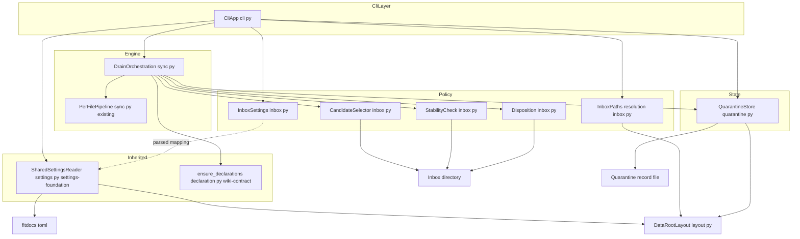
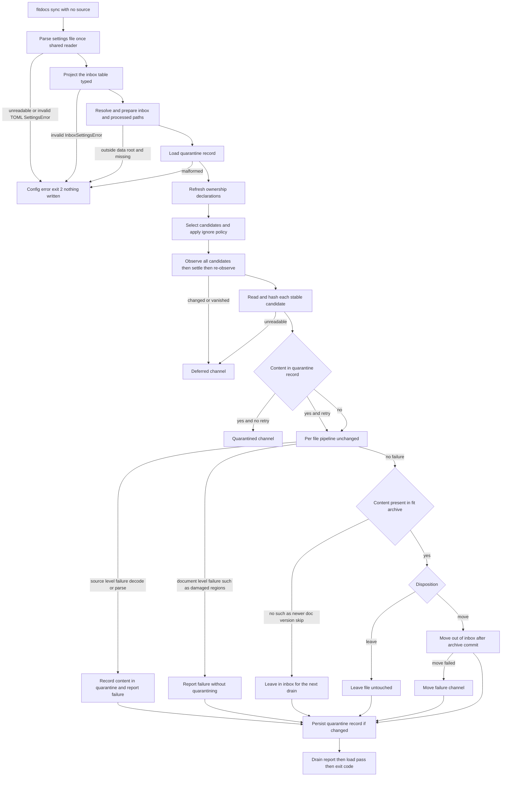
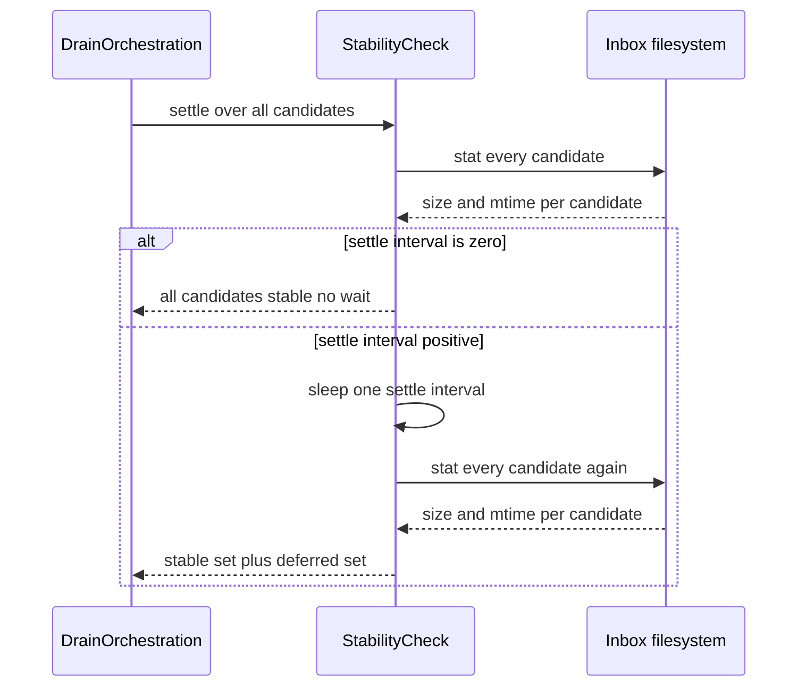

# Technical Design: inbox

## Overview

**Purpose**: inbox promotes ingestion from a per-invocation CLI argument to a standing, configured interface. The data root's settings file declares where `.fit` files land; bare `fitdocs sync` drains that location in one shot, applying the safeguards watch-folder tools have converged on — junk exclusion, a stability check for files still arriving, a quarantine record for files fitdocs cannot process, and an explicit disposition policy that never deletes.

**Users**: PKM users whose export tooling (HealthFit → iCloud, watch sync, manual drops) delivers files without knowing anything about fitdocs; schedulers and LLM-wiki agents that invoke one command with no arguments; integrators who want a documented contract — "get files here, however you like; fitdocs does the rest."

**Impact**: Purely additive to the sync engine. The existing `sync(source_dir, …)` path — recursive discovery, strictly read-only source, content-hash dedupe against `fit-archive/`, per-file failure isolation, `SyncReport`, exit codes 0/1/2 — is untouched and remains the behavior of `fitdocs sync SOURCE`. A third engine entry point, `drain()`, reuses the identical per-file pipeline behind a new selection/stability/quarantine/disposition policy layer and returns a `DrainReport` that *composes* the unchanged `SyncReport` with inbox-specific channels. `fitdocs.toml` gains an `[inbox]` table alongside the existing `[tiles]` table; a new tool-state file records quarantined content.

**Sequencing and inherited surfaces**: this spec lands after the pre-wave `settings-foundation` item and after `wiki-contract`, and consumes rather than builds two surfaces.

| Surface | Provided by | This spec's use |
|---------|-------------|-----------------|
| `layout.SETTINGS_FILE`, `layout.settings_path(data_root)` | settings-foundation | Consumed; this spec does **not** add or move the settings filename. |
| `settings.py` — reads and parses `<data-root>/fitdocs.toml` **once**, raising a single `SettingsError` for file-level problems (unreadable, invalid TOML) | settings-foundation | `load_inbox_settings` becomes a typed per-table reader over the already-parsed mapping; file-level problems surface as `SettingsError`, `[inbox]`-table problems as `InboxSettingsError`. |
| `ensure_declarations(data_root)` — refresh the ownership `AGENTS.md` declarations | wiki-contract | Wired into `drain()` (7.6); wiki-contract wires only `sync()`/`regen()`. |
| Newer-`doc_version` skip: the document is left alone and **deliberately not archived** so the next run retries it | wiki-contract | The move disposition gates on archive presence, never on the `skipped` label (6.2, 6.4). |
| The published ownership contract, `layout.OWNED_PATHS`, and its conformance test | wiki-contract | The inbox and processed directories are declared as user-configured locations; `<data-root>/.fitdocs/` is tool-owned state (8.5). |

### Goals

- One standing, configured location: `[inbox] path` in `<data-root>/fitdocs.toml`, defaulting to `inbox/` under the data root; bare `fitdocs sync` drains it.
- Safeguards, all one-shot and event-API-free: dot-component and junk-pattern exclusion, a batched stat-twice stability check, a content-keyed quarantine record that reports known-bad files without looping them as fresh failures, and an opt-in retry.
- An explicit disposition policy: leave-in-place by default (the archive copy is already the processed marker), opt-in move to a configured destination, never delete under any configuration.
- Additive reporting: deferred / quarantined / moved channels and per-file detail beside the existing written / skipped / failed / warnings partition, with the 0/1/2 exit-code contract unchanged.
- Byte-identical re-runs: a second drain over an unchanged inbox and data root writes nothing at all, including the quarantine record.

### Non-Goals

- Filesystem watchers, daemons, inotify/FSEvents, or scheduling of any kind — a drain happens only when `fitdocs sync` is invoked.
- Automated `.fit` acquisition from devices or platforms; non-`.fit` formats.
- Any change to the per-file pipeline (hash → dedupe → parse → identity → render → merge → write → archive), to explicit-source `sync`, to `regen`, or to `load`.
- A delete disposition, a "processed" marker file inside the inbox, or any write into the inbox under the default policy.
- Locating, reading, or parsing `fitdocs.toml` itself, and the shared file-level `SettingsError` — settings-foundation owns them and lands first; this spec only reads the `[inbox]` table of the mapping it is handed.
- Frontmatter/document ownership and provenance (wiki-contract), plugin discovery (plugin-api), packaging and release (distribution).
- Quarantine expiry, retention limits, or automatic re-attempts on a schedule (retry is explicit and user-invoked).

## Boundary Commitments

### This Spec Owns

- The `[inbox]` table of `<data-root>/fitdocs.toml`: its schema, defaults, and validation, read as a typed per-table reader over the mapping settings-foundation parsed — plus the resolution of the inbox and processed-files paths.
- Inbox candidate selection: what counts as a candidate, the ignore policy (dot components, default junk patterns, user-added patterns), and discovery order.
- The stability check: the settle interval, the batched two-observation protocol, and the deferral outcome.
- The quarantine record: its location under the data root, its serialized form, content-keyed membership, retry semantics, and its loud-on-malformed posture.
- The disposition policy: leave-in-place (default), opt-in move with collision-safe naming, the never-delete guarantee, and move-failure reporting.
- The `drain()` engine entry point, the `DrainReport` contract and its inbox channels, and their CLI presentation.
- The no-argument form of `fitdocs sync`, the `--retry-quarantined` option, and the inbox section of user documentation.
- The inbox-specific `layout` additions — `DEFAULT_INBOX_DIR` and `quarantine_path(data_root)` — and nothing else in `layout`. The tool-state directory constant already exists as `TOOL_STATE_DIR` (wiki-contract, commit `49752ef`) and is consumed, not redefined.

### Out of Boundary

- The per-file pipeline and everything it owns: decode, metrics, identity, render, region merge, asset/document/archive writes, and commit ordering (workout-docs and route-maps own these; drain reuses them verbatim).
- `SyncReport`'s existing `written` / `skipped` / `failures` / `warnings` semantics — extended by composition, never redefined.
- Explicit-source `fitdocs sync SOURCE`, `fitdocs regen`, and `fitdocs load` behavior, including the training-load pass itself.
- The settings file's location, reading, and parsing, and the shared `SettingsError` (settings-foundation); `layout.SETTINGS_FILE` / `layout.settings_path` are consumed as given, and `tiles.py` is **not** touched by this spec.
- The `[tiles]` table and tile acquisition (route-maps) and the `[plugins]` table (plugin-api); this spec only reads its own table of the shared parsed document.
- The document/frontmatter contract, region policy, `doc_version` gate, ownership declaration, and the published contract's text including its `OWNED_PATHS` enumeration (wiki-contract) — this spec conforms to them and calls `ensure_declarations`, but defines none of them.
- Where `.fit` files come from and how they get into the inbox — that is, by design, the integrator's concern.
- The fit-ingest error taxonomy; quarantine stores the reasons it is handed and never classifies them.

### Allowed Dependencies

- `cli → sync` (drain entry point), `cli → settings` (shared parse, settings-foundation), `cli → inbox` (typed `[inbox]` read, path preparation), `cli → quarantine` (record load).
- `sync → {inbox, quarantine, declaration}` for the drain path only (`declaration` for `ensure_declarations`, already imported by `sync` after wiki-contract); `sync`'s existing imports are otherwise unchanged.
- `inbox → layout` (path constants) and stdlib (`fnmatch`, `os`, `shutil`, `time`) only — `inbox` no longer opens or parses the settings file, so it does not import `tomllib`.
- `quarantine → layout` and stdlib (`tomllib`, `tomli_w`, `os`, `tempfile`) only.
- `layout` stays a pure, I/O-free leaf. `inbox` and `quarantine` must never import `sync`, `render`, or `tiles` (no cycles, no rendering knowledge in policy).
- No new runtime dependencies. No network access anywhere in this feature (the `fitdocs.tiles` carve-out is unchanged and unrelated).

### Revalidation Triggers

- Changing the `DrainReport` shape or channel semantics → re-check CLI reporting, distribution's `SKILL.md` channel enumeration, and any automation parsing drain output.
- Changing the `[inbox]` schema → coordinate with settings-foundation's shared reader and with distribution's documentation of the settings surface; the sibling table readers (`[tiles]`, `[plugins]`) are unaffected by design.
- Changing the disposition gate away from archive presence → re-check wiki-contract's newer-`doc_version` skip, which depends on the file staying in the inbox to be retried.
- Adding a path this feature creates → re-check wiki-contract's `OWNED_PATHS` conformance test and the published contract's user-configured-locations clause.
- Changing the quarantine record's location or serialized form → a user migration note is required; an existing record would otherwise become a loud exit-2 error.
- Changing the default disposition away from leave-in-place, or introducing any operation that removes files from the inbox → a breaking trust change; requires an explicit product decision, not a spec revision.
- Changing `sync()`'s or `_process_isolated`'s contract → drain reuses them; re-check drain's classification and disposition gating.

## Architecture

### Existing Architecture Analysis

- `sync.py` is the engine and the only writer of documents/assets/archive. `sync()` and `regen()` differ only in discovery and skip policy; both funnel every item through `_process_isolated` → `_process_file`, which isolates per-file failures as `FileFailure` and never aborts the batch. **Drain is a third discovery policy over the same pipeline.**
- The archive copy is written **last** and is the processed marker: `archive.exists() and not force` ⇒ skip. Content-hash dedupe therefore already gives leave-in-place drains their idempotency for free — no "processed" state needs inventing (6.1).
- `SyncReport` was extended once before (route-maps' `warnings`) by adding a defaulted tuple. This spec instead **composes**: the drain's channels live on a `DrainReport` that carries a `SyncReport`, so explicit-source runs keep a byte-for-byte identical report type and shape (7.3).
- `cli.py` is a thin typer shell. Its established configuration posture — resolve everything that can fail *before* any engine call, map typed config errors through `_config_error` to exit 2, print a rich counts table plus per-file detail — is the exact posture the inbox's four new pre-flight steps need.
- `tiles.py` is the precedent for a `fitdocs.toml` table reader: absent file or table ⇒ typed defaults; each key defaults independently; unknown keys ignored; malformed values raise a typed error mapped to exit 2. `[inbox]` mirrors this contract exactly, so users see one consistent settings-file behavior. After settings-foundation the *file* half of that precedent has moved: the document is located and parsed once by `settings.py` (one `SettingsError` for the file), and each table reader — `[tiles]`, `[inbox]`, `[plugins]` — is a typed projection over the parsed mapping. `load_inbox_settings` is written that way from the start.
- `profile.py` is the precedent for a data-root state file: absent is empty (never an error), malformed is loud, saves are atomic (`tempfile.mkstemp` in the target directory + `os.replace`). The quarantine record follows it, adding a write-if-different guard the profile does not need.
- `layout.py` is the pure, I/O-free home of every data-root path constant. settings-foundation has already moved the settings filename into it (`SETTINGS_FILE`, `settings_path`); this spec adds only its own inbox leaves (`DEFAULT_INBOX_DIR`, `quarantine_path`) and leaves `tiles.py` alone. After wiki-contract, `layout` also carries `DECLARED_DIRS`, `OWNED_PATHS`, and `TOOL_STATE_DIR`; the tool-state directory is named there as tool-owned state and is consumed here rather than redefined.
- Nothing in the codebase watches the filesystem, sleeps, or reads the clock during a run. The stability check introduces the first deliberate wait, so it is injected (`sleep`) rather than called directly, keeping tests fast and deterministic.

### Architecture Pattern & Boundary Map

Policy/mechanism split: a thin, side-effect-light **policy** module decides *which* files the engine sees and *what happens to them afterwards*; the unchanged engine **mechanism** decides what a file becomes. A separate **state** module owns the quarantine record. The engine's drain entry point is the only place the three meet.



**Architecture Integration**:

- Selected pattern: **policy over unchanged mechanism**. Drain composes four policy decisions (select, settle, quarantine-filter, dispose) around the existing per-file pipeline. No pipeline stage is modified, so every guarantee it already carries — read-only source, archive-last commit ordering, failure isolation, map warnings — holds identically for drains.
- Domain boundaries: `inbox.py` never writes into the data root and never knows what a document is; `quarantine.py` never touches the inbox; `sync.py` never parses settings. The single crossing point is `drain()`.
- Dependency direction (violations are errors): `cli → {settings, sync} → {inbox, quarantine}`; `{inbox, quarantine} → layout`; `layout →` nothing. `inbox` and `quarantine` do not import each other, and neither imports `settings` — the parsed mapping is passed in, so the table reader stays a pure function.
- Existing patterns preserved: the table-reader contract over the shared parsed document (defaults, independent keys, unknown keys ignored, loud on malformed), data-root state-file contract (absent is empty, atomic save), loud config failure before any write (exit 2), rich counts table plus per-file detail, frozen dataclass contracts, `StrEnum` for new enums, `mypy --strict`.
- New components rationale: `inbox.py` is the one place ingestion *policy* lives, so the engine stays free of watch-folder concerns; `quarantine.py` isolates the only new persistent state; `DrainReport` composes rather than mutates the shared report so explicit-source behavior is provably unchanged.
- Steering compliance: stdlib-only (zero new dependencies); every path under the data root goes through `layout`; absent configuration yields documented defaults, never fabricated values; the source directory stays read-only unless the user explicitly configures otherwise.

### Technology Stack

| Layer | Choice / Version | Role in Feature | Notes |
|-------|------------------|-----------------|-------|
| CLI | existing `typer` shell | Optional `SOURCE` argument, `--retry-quarantined` flag, drain reporting | `SOURCE` becomes `Path \| None`; explicit-source path untouched |
| Settings | shared `settings.py` reader (settings-foundation, stdlib `tomllib`) | Parses `<data-root>/fitdocs.toml` once; this spec projects the `[inbox]` table from the result | Read-only; fitdocs never writes this file. File-level faults are `SettingsError`, table-level faults `InboxSettingsError` |
| State | stdlib `tomllib` + `tomli-w` (existing dep) | Quarantine record read/write | Same round-trip pattern as `athlete.toml` |
| Selection | stdlib `pathlib` + `fnmatch` | Recursive `.fit` discovery, ignore patterns | `fnmatchcase` on lowercased inputs for cross-platform determinism |
| Stability | stdlib `os.stat` + injected `sleep` | Batched two-observation size/mtime comparison | `time.sleep` is the default; tests inject a stub |
| Disposition | stdlib `shutil.move` | Opt-in move out of the inbox | Cross-device safe (inbox often on a different volume than the data root) |

No new runtime dependencies.

## File Structure Plan

### New Files

```
src/fitdocs/
├── inbox.py                       # Ingestion policy. InboxSettings +
│                                  #   load_inbox_settings ([inbox] table of the
│                                  #   already-parsed settings mapping),
│                                  #   InboxSettingsError, Disposition, InboxPaths +
│                                  #   prepare_inbox (resolution, create-or-fail),
│                                  #   select_candidates (ignore policy),
│                                  #   settle (batched stability check),
│                                  #   move_processed (collision-safe disposition),
│                                  #   InboxNote. Never writes into the data root.
└── quarantine.py                  # Quarantine state. QuarantineEntry,
                                   #   QuarantineRecord, QuarantineError,
                                   #   load_quarantine / save_quarantine
                                   #   (absent = empty, atomic + write-if-different).

tests/
├── test_inbox.py                  # Settings defaults/overrides/validation, path
│                                  #   resolution and creation rules, candidate
│                                  #   selection and ignore policy, settle behavior
│                                  #   with an injected clock, move collisions.
├── test_quarantine.py             # Round-trip, content-keyed membership, malformed
│                                  #   record raises, write-if-different no-op.
└── test_inbox_e2e.py              # Full drains through the CLI: no-arg drain,
                                   #   quarantine lifecycle, deferral, disposition,
                                   #   exit codes, byte-identical re-run.
```

### Modified Files

- `src/fitdocs/layout.py` — add `DEFAULT_INBOX_DIR = "inbox"` and `quarantine_path(data_root)` → `<data-root>/.fitdocs/quarantine.toml`. Stays a pure leaf. `SETTINGS_FILE` and `settings_path` are **already present** (settings-foundation) and are consumed, not added; `TOOL_STATE_DIR = ".fitdocs"` and `OWNED_PATHS` (which already composes its entry as `f"{TOOL_STATE_DIR}/"`) are **already present** (wiki-contract) and are consumed, not added — introducing a second constant for the tool-state directory would duplicate the literal.
- `src/fitdocs/tiles.py` — **not modified by this spec.** settings-foundation already re-pointed it at the shared reader.
- `src/fitdocs/sync.py` — add `InboxOutcome`/`DrainReport` contracts and the `drain()` entry point reusing `_process_isolated` and calling `ensure_declarations` once per drain (7.6); module docstring gains the drain paragraph. `sync()`, `regen()`, `_process_file`, and `_write_outputs` are untouched.
- `src/fitdocs/cli.py` — `SOURCE` becomes optional; `--retry-quarantined` option; inbox pre-flight (shared settings parse → `[inbox]` projection → paths → quarantine record, each mapped to exit 2 before any write); `_report_drain` presentation; `sync` help text describing the no-argument drain and inbox resolution; module docstring update. **Landing-order assumption**: plugin-api also edits `sync_command` in this region (inserting its plugin report after data-root resolution and before the engine call); the agreed order is that plugin-api's smaller wiring lands first and this spec's optional-`SOURCE` plus pre-flight is written against the post-plugin-api shape.
- `README.md` — an "Inbox" section: default location, every `[inbox]` key with its default, drain semantics, the safeguards, the disposition policy and never-delete guarantee, and the explicit statement that fitdocs neither watches nor schedules. distribution later lifts this into `docs/inbox.md` and indexes it; the two guarantees are pinned by the preserved-guarantee test (8.4) so that rewrite cannot drop them.
- `tests/test_layout.py` — coverage for the new constants and `quarantine_path`.
- `tests/test_cli.py` — explicit-source invocations unchanged (regression guard for 7.3); new drain wiring, flag, and exit-code cases.
- `tests/test_docs_guarantees.py` (or the suite that owns preserved-guarantee assertions at implementation time) — the never-delete and no-watching guarantees asserted against the shipped documentation (8.4).

## System Flows

### Drain pipeline



Flow decisions worth stating: (a) every step that can fail on configuration runs **before** the first candidate is touched, so a configuration error writes nothing (1.4, 1.7, 5.6, 6.7, 7.2), and the settings document is parsed once by the shared reader, with the `[inbox]` projection layered on top; (b) the settle wait happens once for the whole batch, not once per file (4.5); (c) the quarantine check is keyed on **content**, computed after settling, so a renamed known-bad file is still recognized and a same-named new export is not (5.4); (d) disposition runs only when the file's content is **present in `fit-archive/`** at the end of its processing — never on the strength of a `skipped` label (6.2, 6.4; see "Archive presence is the disposition gate" below); (e) the quarantine record is persisted once, at the end, and only if it changed (7.4); (f) the hash read doubles as a **readability probe** — a candidate that stats as stable but cannot actually be read is deferred, never failed and never quarantined (see "Readiness in two stages" below); (g) only **source-level** faults quarantine (5.1); a failure that is a property of the existing document is reported and never recorded (5.7); (h) the drain refreshes the ownership declarations exactly as `sync()` does (7.6).

**Archive presence is the disposition gate.** wiki-contract's `doc_version` gate skips a document written by a *newer* fitdocs: it writes nothing for that source, emits a `DocWarning`, counts the source as **skipped**, and — critically — does **not** archive it, precisely so the next run retries the source once the tool is upgraded. A move disposition that keyed on the `skipped` label would relocate exactly that file out of the inbox with nothing archived: the source would sit in `processed/` un-ingested, the retry would never happen because the file is no longer a candidate, and nothing in the report would say so. The gate is therefore stated positively and checked against the filesystem: **move iff the candidate's content hash is present in `fit-archive/` after its processing completes**. Written files pass because the archive copy is the last write of the pipeline; already-archived dedupe-skips pass because that is exactly what made them skips; newer-`doc_version` skips fail the gate and stay in the inbox, where the next drain re-selects them. This also makes the guarantee independent of any future skip reason wiki-contract or another spec adds — a new skip that does not archive is automatically safe.

**Readiness in two stages.** Stat-based stability is the standard technique and the portable floor, but it has one failure mode that matters directly here: a cloud placeholder that has not been materialized locally — most importantly a macOS Sonoma+ iCloud *dataless* file — reports its full logical size and a stable mtime indefinitely while holding no data, and reading it blocks on a network fetch that fails when offline. Stat alone cannot distinguish it from a complete file. The drain therefore treats readiness as two stages: **stat stability** (4.1) followed by the **read** it must perform anyway to compute the content hash. A read that fails is treated as a deferral with its reason, exactly like a candidate that vanished between observations (4.2) — the file is left untouched and retried on a later drain. This is deliberate: a not-yet-downloaded export is a *timing* problem, and permanently quarantining it as unprocessable would be the wrong and hard-to-undo answer. Only files that were fully read and then failed the pipeline are ever quarantined (5.1).

### Stability check (batched)



A candidate is stable when both observations succeed and report the same size and modification time; it is deferred when it changed, vanished, or became unreadable between them. Deferral carries no state — the next drain re-observes from scratch (4.3).

## Requirements Traceability

| Requirement | Summary | Components | Interfaces | Flows |
|-------------|---------|------------|------------|-------|
| 1.1 | Configured inbox path, relative resolves against data root | InboxSettings, InboxPaths | `[inbox] path`, `prepare_inbox` | drain pipeline |
| 1.2 | Absent file or table ⇒ `inbox/` default, all defaults | InboxSettings, DataRootLayout | `DEFAULT_INBOX_SETTINGS`, `DEFAULT_INBOX_DIR` | — |
| 1.3 | Keys default independently, unknown keys ignored | InboxSettings | `load_inbox_settings` | — |
| 1.4 | Invalid `[inbox]` ⇒ instructive config error, exit 2, nothing written | InboxSettings, CliInboxWiring | `InboxSettingsError` → `_config_error` | drain pipeline |
| 1.5 | Inside the data root and missing ⇒ create and proceed | InboxPaths | `prepare_inbox` | drain pipeline |
| 1.6 | Outside the data root and missing ⇒ config error naming the path | InboxPaths, CliInboxWiring | `InboxSettingsError` | drain pipeline |
| 1.7 | Unreadable/invalid settings file ⇒ one shared file-level error, exit 2 | CliInboxWiring, SharedSettingsReader (settings-foundation) | `SettingsError` → `_config_error` | drain pipeline |
| 2.1 | No-argument sync drains, then runs the load pass | CliInboxWiring, DrainOrchestration | `drain`, `_run_load_pass` | drain pipeline |
| 2.2 | Explicit `SOURCE` keeps today's behavior exactly | CliInboxWiring | `sync` unchanged, no policy applied | — |
| 2.3 | Output names the inbox path drained | DrainReport, DrainReportPresentation | `DrainReport.inbox` | — |
| 2.4 | Empty inbox ⇒ success, nothing written | DrainOrchestration | empty `DrainReport` | drain pipeline |
| 2.5 | `--out` / `--force` / `--no-prompt` honored identically | CliInboxWiring | shared option handling | — |
| 3.1 | Candidates: regular `.fit` files, recursive, deterministic order | CandidateSelector | `select_candidates` | drain pipeline |
| 3.2 | Ignore any dot-prefixed path component | CandidateSelector | dot-component rule | — |
| 3.3 | Ignore default junk patterns | CandidateSelector | `DEFAULT_IGNORE_PATTERNS` | — |
| 3.4 | Configured ignore patterns apply in addition | InboxSettings, CandidateSelector | `[inbox] ignore` | — |
| 3.5 | Ignored files never processed, classified, or failed | CandidateSelector, DrainOrchestration | selection precedes classification | drain pipeline |
| 4.1 | Process only after two matching observations | StabilityCheck | `settle` | stability check |
| 4.2 | Changed or vanished ⇒ deferred, untouched, named | StabilityCheck, DrainReport | `DrainReport.deferred` | stability check |
| 4.3 | Stable later ⇒ processed; no deferral state persists | StabilityCheck | stateless re-observation | stability check |
| 4.4 | Settle interval default 2 s, configurable, zero disables | InboxSettings, StabilityCheck | `[inbox] settle_seconds` | stability check |
| 4.5 | At most one settle interval per drain, batched | StabilityCheck | batch observe/sleep/observe | stability check |
| 4.6 | Deferrals never cause the failure exit code | DrainOrchestration, CliInboxWiring | `_finish` reads failures only | — |
| 5.1 | Source-level failure ⇒ reported failure, exit 1, and recorded | DrainOrchestration, QuarantineStore | `QuarantineEntry`, `is_source_level` | drain pipeline |
| 5.2 | Known content ⇒ not re-processed, distinct channel with reason | DrainOrchestration, QuarantineStore | `DrainReport.quarantined` | drain pipeline |
| 5.3 | Quarantined entries alone ⇒ success exit code | DrainOrchestration, CliInboxWiring | channel excluded from failures | — |
| 5.4 | Content identity, not names | QuarantineStore | sha256-keyed membership | drain pipeline |
| 5.5 | Retry option re-attempts; success clears, failure updates | CliInboxWiring, DrainOrchestration, QuarantineStore | `--retry-quarantined` | drain pipeline |
| 5.6 | Unreadable/malformed record ⇒ config error, never rebuilt | QuarantineStore, CliInboxWiring | `QuarantineError` → exit 2 | drain pipeline |
| 5.7 | Document-level failure ⇒ reported, never quarantined | DrainOrchestration | `is_source_level` returns false | drain pipeline |
| 6.1 | Leave-in-place default; archive + dedupe make re-drains skip | Disposition, PerFilePipeline | `Disposition.LEAVE` | drain pipeline |
| 6.2 | Move iff the content is present in the archive after processing | Disposition, DrainOrchestration | `move_processed`, archive-presence gate | drain pipeline |
| 6.3 | Name collision ⇒ distinct name, never overwrite | Disposition | collision-safe naming | — |
| 6.4 | Never move failed, deferred, quarantined, or skipped-without-archive files | DrainOrchestration | archive-presence gate | drain pipeline |
| 6.5 | Move failure reported distinctly, not a failure exit, retried later | Disposition, DrainReport | `DrainReport.move_failures` | drain pipeline |
| 6.6 | No disposition ever deletes | Disposition | `Disposition` has two members | — |
| 6.7 | Processed destination created inside root, error outside | InboxPaths | `prepare_inbox` | drain pipeline |
| 7.1 | Extended summary and per-file detail | DrainReport, DrainReportPresentation | `_report_drain` | — |
| 7.2 | Exit-code contract unchanged | CliInboxWiring | `_finish` | — |
| 7.3 | Explicit-source sync / regen / load unchanged | CliInboxWiring, DrainReport composition | `SyncReport` untouched | — |
| 7.4 | Leave-in-place re-run writes nothing, record untouched | DrainOrchestration, QuarantineStore | write-if-different save | drain pipeline |
| 7.5 | Move re-run finds no candidates, writes nothing | Disposition, CandidateSelector | — | drain pipeline |
| 7.6 | Drain refreshes the ownership declarations | DrainOrchestration | `ensure_declarations` (wiki-contract) | drain pipeline |
| 8.1 | Documented inbox contract | UserDocs | shipped inbox documentation section | — |
| 8.2 | Documented: delivery is the integrator's concern, no watching | UserDocs | shipped inbox documentation section | — |
| 8.3 | `sync` help text describes the drain and resolution | CliInboxWiring | typer help strings | — |
| 8.4 | Never-delete and no-watching guarantees pinned by a test | UserDocs, PreservedGuaranteeTest | documentation assertions | — |
| 8.5 | Created paths reconciled with the ownership contract | DataRootLayout additions, InboxPaths, UserDocs | `OWNED_PATHS` conformance (wiki-contract) | — |

## Components and Interfaces

| Component | Domain/Layer | Intent | Req Coverage | Key Dependencies | Contracts |
|-----------|--------------|--------|--------------|------------------|-----------|
| InboxSettings + loader | inbox (config) | `[inbox]` schema, defaults, loud validation over the shared parsed mapping | 1.1–1.4, 3.4, 4.4, 6.1, 6.2, 6.6 | layout (P0), shared settings mapping (P0) | Service, State |
| InboxPaths + `prepare_inbox` | inbox (config) | Resolve, create, or refuse inbox and processed paths | 1.1, 1.5, 1.6, 6.7, 8.5 | layout (P0) | Service |
| CandidateSelector | inbox (policy) | Deterministic `.fit` discovery with ignore policy | 3.1–3.5 | fnmatch (P0) | Service |
| StabilityCheck | inbox (policy) | Batched two-observation settle; stable vs deferred | 4.1–4.5 | os.stat (P0), injected sleep (P0) | Service |
| Disposition | inbox (policy) | Leave-in-place or collision-safe move; never delete | 6.1–6.6 | shutil (P0) | Service |
| QuarantineStore | quarantine (state) | Content-keyed record: load, membership, save | 5.1, 5.2, 5.4, 5.6, 7.4 | tomllib/tomli-w (P0), layout (P0) | Service, State |
| DrainOrchestration + DrainReport | sync (engine) | Compose policy around the unchanged pipeline; refresh declarations; report | 2.1, 2.4, 3.5, 4.2, 4.6, 5.1–5.5, 5.7, 6.2, 6.4, 6.5, 7.1, 7.4, 7.5, 7.6 | inbox (P0), quarantine (P0), pipeline (P0), declaration.`ensure_declarations` (P0) | Service, Batch, State |
| CliInboxWiring + DrainReportPresentation | cli | Optional source, pre-flight, flags, presentation, exit codes | 1.4, 1.6, 1.7, 2.1–2.5, 4.6, 5.3, 5.5, 5.6, 7.1–7.3, 8.3 | settings (P0), inbox (P0), quarantine (P0), sync (P0) | Service |
| DataRootLayout additions | layout (leaf) | Default inbox dir, tool-state dir, record path | 1.2, 5.1, 8.5 | — | State |
| UserDocs | docs | The inbox as a documented public interface | 8.1, 8.2, 8.4, 8.5 | — | — |

### Ingestion Policy (`src/fitdocs/inbox.py`)

#### InboxSettings + `load_inbox_settings`

| Field | Detail |
|-------|--------|
| Intent | Typed, validated `[inbox]` configuration with documented defaults, projected from the shared parsed settings document |
| Requirements | 1.1, 1.2, 1.3, 1.4, 1.7, 3.4, 4.4, 6.1, 6.2, 6.6 |

**Responsibilities & Constraints**

- **Reads no file.** settings-foundation's `settings.py` locates `<data-root>/fitdocs.toml` (via `layout.settings_path`) and parses it once per command, raising the shared `SettingsError` when the file is unreadable or is not valid TOML (1.7). `load_inbox_settings` is a pure, typed projection over the mapping that reader returns — one parse per run, one file-level error voice, and per-table error voices owned by the tables' specs.
- Absent file or absent `[inbox]` table ⇒ `DEFAULT_INBOX_SETTINGS` (1.2); each key defaults independently; unknown keys inside `[inbox]` and unknown top-level tables are ignored (1.3). This is the same contract `[tiles]` already publishes, deliberately, so the settings file behaves one way.
- Loud validation (1.4), each message naming the file and offending key: non-string or empty `path`; non-string or empty `processed_dir`; `settle_seconds` that is not a non-negative real number (a `bool` is rejected explicitly, since `bool` subclasses `int`); `ignore` that is not a list of non-empty strings; a `disposition` outside `{"leave", "move"}`; `disposition = "move"` without `processed_dir`; a `processed_dir` equal to or nested inside the resolved inbox (which would re-ingest moved files forever).
- The inbox/processed containment check is performed on lexically normalized absolute paths (`os.path.normpath` over the data-root join), matching `config.py`'s pointer-resolution precedent — no filesystem access, so a validation error is reachable before any I/O.

**Dependencies**

- Outbound: `fitdocs.layout` — `DEFAULT_INBOX_DIR` (P0). Inbound: the CLI, which supplies the parsed mapping obtained from `fitdocs.settings` (P0). `inbox.py` does not import `fitdocs.settings`, keeping the reader a pure function of its argument.

**Contracts**: Service [x] / State [x]

##### Service Interface

```python
class Disposition(StrEnum):
    LEAVE = "leave"   # default: inbox files are never written, moved, or deleted
    MOVE = "move"     # opt-in: move processed files to processed_dir
    # No third member exists: deletion is unrepresentable (6.6)

@dataclass(frozen=True)
class InboxSettings:
    path: str                        # data-root-relative or absolute; default "inbox"
    settle_seconds: float            # >= 0; 0 disables the stability wait; default 2.0
    ignore: tuple[str, ...]          # additional patterns, applied with the defaults
    disposition: Disposition         # default Disposition.LEAVE
    processed_dir: str | None        # required iff disposition is MOVE

DEFAULT_INBOX_SETTINGS: Final[InboxSettings]

class InboxSettingsError(Exception): ...   # malformed [inbox] → CLI exit 2

def load_inbox_settings(
    document: Mapping[str, object],   # the parsed fitdocs.toml, from fitdocs.settings
    *,
    data_root: Path,                  # for the containment check only; nothing is read
) -> InboxSettings: ...
```

- Preconditions: `document` is the mapping the shared reader returned (an empty mapping when the file is absent); `data_root` is an existing directory (already resolved by `resolve_data_root`).
- Postconditions: returns a fully-populated, validated value, or raises `InboxSettingsError`; never reads, writes, creates, or prompts.
- Invariants: absent configuration is never an error; no value is coerced or guessed; file-level faults never surface as `InboxSettingsError` — they were already raised as `SettingsError` by the shared reader.

**Implementation Notes**

- Integration: the CLI calls the shared reader once, then hands the mapping to `load_inbox_settings` (and, after plugin-api and route-maps, to their table readers). Should settings-foundation's reader signature differ in detail from the shape sketched above, this component adapts to it — the fixed commitments are (a) one parse, (b) `SettingsError` for the file, (c) `InboxSettingsError` for the `[inbox]` table.
- Validation: unit tests for defaults, each key overridden independently, every validation failure, unknown-key tolerance, the `bool`-is-not-a-number rejection, and that a file-level fault raises `SettingsError` rather than `InboxSettingsError`.
- Risks: none of note; the previous risk (three readers parsing the same file with three error voices) is what settings-foundation removed.

#### InboxPaths + `prepare_inbox`

| Field | Detail |
|-------|--------|
| Intent | Turn validated settings into usable directories, or refuse loudly before anything is processed |
| Requirements | 1.1, 1.5, 1.6, 6.7, 8.5 |

**Responsibilities & Constraints**

- Resolve `path`: absolute is used as given; relative resolves against the data root, lexically normalized (1.1). Same rule for `processed_dir` when the move disposition is active.
- Existence policy, applied per path: **inside** the data root and absent ⇒ create it (including parents) and proceed (1.5, 6.7); **outside** the data root and absent-or-not-a-directory ⇒ raise `InboxSettingsError` naming the path (1.6, 6.7). The asymmetry is deliberate: inside the data root fitdocs already owns directory creation, while outside it a missing path is far more likely a typo or an unmounted cloud volume than an intent to create.
- All validation for both paths completes before either is created, so a refusal leaves the filesystem untouched (7.2).
- An inbox that exists but is not a directory is an error regardless of location.
- **Ownership-contract registration (8.5)**: the two directories this component may create are *user-configured locations*, not fixed tool paths, so they are declared to wiki-contract's published contract under its clause for locations fitdocs may create at the user's direction — they are not added to `OWNED_PATHS` as literal paths, and fitdocs claims no ownership of their contents beyond the moves this feature performs. The one fixed path this feature introduces, `<data-root>/.fitdocs/`, is declared there as **tool-owned state** (created on demand by the quarantine store, see below). Nothing here contradicts wiki-contract's `OWNED_PATHS` conformance test: this feature writes documents, assets, and archive entries only through the unchanged pipeline, plus its own tool-state file and the user's configured destinations.

**Contracts**: Service [x]

```python
@dataclass(frozen=True)
class InboxPaths:
    inbox: Path                # absolute, existing directory
    processed: Path | None     # absolute existing directory iff disposition is MOVE

def validate_inbox_paths(data_root: Path, settings: InboxSettings) -> _ValidatedInboxPaths: ...  # no writes
def create_inbox_paths(validated: _ValidatedInboxPaths) -> InboxPaths: ...                       # the only writes
def prepare_inbox(data_root: Path, settings: InboxSettings) -> InboxPaths: ...                   # validate then create
```

- Postconditions: every returned path exists and is a directory; nothing else is written.

#### CandidateSelector

| Field | Detail |
|-------|--------|
| Intent | Decide what the engine is allowed to see, and in what order |
| Requirements | 3.1, 3.2, 3.3, 3.4, 3.5 |

**Responsibilities & Constraints**

- Walk the inbox recursively; a candidate is a **regular file** whose extension is `.fit` case-insensitively (3.1) — the same predicate `sync`'s discovery uses, so the two agree. Results are sorted by inbox-relative POSIX path for a deterministic drain order (3.1).
- Exclusion 1 — **dot components** (3.2): any candidate whose inbox-relative path has a component beginning with `.` is ignored. This covers AppleDouble `._*.fit` companions, files inside `.stversions/`, `.dropbox.cache/`, and any other hidden staging area a sync tool creates, without enumerating tools.
- Exclusion 2 — **junk patterns** (3.3): `*.tmp`, `*.part`, `.syncthing.*`, `.DS_Store` ship as defaults. The first two are the ones that can actually collide with a `.fit` candidate name; the latter two are carried because the requirement names them and because they document the intent for readers of the config.
- Exclusion 3 — **configured patterns** (3.4): `[inbox] ignore` entries apply *in addition to*, never instead of, the defaults.
- Pattern matching: a pattern matches when `fnmatch.fnmatchcase` matches either the basename or the inbox-relative POSIX path, with both pattern and subject lowercased first. Lowercasing gives identical behavior on case-sensitive and case-insensitive filesystems; matching the relative path lets a user write `staging/*` to exclude a subtree.
- Ignored files are simply not candidates: they never reach the pipeline and never appear in any report channel — not as failures, not as skips (3.5).

**Contracts**: Service [x]

```python
@dataclass(frozen=True)
class Candidate:
    path: Path      # absolute path in the inbox
    rel: str        # inbox-relative POSIX path; the label used in reports

DEFAULT_IGNORE_PATTERNS: Final[tuple[str, ...]]   # ("*.tmp", "*.part",
                                                  #  ".syncthing.*", ".DS_Store")

def select_candidates(inbox: Path, settings: InboxSettings) -> tuple[Candidate, ...]: ...
```

- Postconditions: sorted by `rel`; the inbox is only read — selection never writes, moves, or deletes.

#### StabilityCheck

| Field | Detail |
|-------|--------|
| Intent | Never hand a still-arriving file to the parser |
| Requirements | 4.1, 4.2, 4.3, 4.4, 4.5 |

**Responsibilities & Constraints**

- Batched protocol (4.5): stat every candidate, sleep **once** for `settle_seconds`, stat every candidate again. Cost is one settle interval per drain regardless of candidate count.
- A candidate is stable iff both observations succeed and report identical `st_size` and `st_mtime_ns` (4.1). Anything else — changed size, changed mtime, `FileNotFoundError`, or any `OSError` — is a deferral carrying a human-readable reason (4.2).
- `settle_seconds == 0` disables the wait entirely: a single observation is taken and every candidate that can be stat'd is treated as stable (4.4). This is the escape hatch for a purely local inbox and for fast tests.
- Stateless (4.3): nothing about a deferral is persisted; the next drain re-observes from scratch and processes the file if it has settled.
- The wait is performed through an injected `sleep` callable so tests never spend real time and the module stays free of hidden clock dependencies.
- Known limits of the stat-based check, accepted and documented rather than engineered around: a writer that pauses longer than the settle interval can plateau through it, and filesystems with coarse modification-time granularity (FAT's 2-second resolution being the classic case) weaken the mtime signal at the default interval. `st_mtime_ns` plus size is the portable floor; the drain's subsequent read probe catches the cloud-placeholder case that stat cannot see, and a torn file that slips through still fails cleanly as an undecodable file rather than corrupting anything.

**Contracts**: Service [x]

```python
@dataclass(frozen=True)
class InboxNote:
    """One inbox-scoped, non-fatal observation about a file."""
    subject: str    # inbox-relative POSIX path (names the file, 4.2, 5.2, 6.5)
    detail: str     # human-readable reason

@dataclass(frozen=True)
class SettleResult:
    stable: tuple[Candidate, ...]
    deferred: tuple[InboxNote, ...]

def settle(
    candidates: Sequence[Candidate],
    *,
    settle_seconds: float,
    sleep: Callable[[float], None] = time.sleep,
) -> SettleResult: ...
```

- Postconditions: `stable` and `deferred` partition the input, both ordered as the input; deferred files are left completely untouched.
- Invariants: at most one sleep call per invocation; no candidate is opened or read.

`InboxNote` is one value type serving all three inbox detail channels (deferred, quarantined, failed moves) — they share a shape (a file and a reason), and a single type keeps the report and its presentation uniform. It is deliberately distinct from `FileFailure`, whose presence in a report means "this run failed".

Its field names follow the project-wide convention agreed for the new Phase 3 report types — `subject`, `detail`, and optionally `remedy` — hence `subject` rather than `source` (the word `source` is already overloaded in this codebase by the sync source directory and by `source_label`). This spec adds no `remedy` field: every note it produces is already actionable from its detail, and an unused optional field would be dead weight. Likewise, `Disposition` is a `StrEnum`, matching the convention for new enums. The already-shipped `DocWarning` and `SyncReport` (route-maps) are **not** renamed by this spec.

#### Disposition

| Field | Detail |
|-------|--------|
| Intent | Decide what happens to an inbox file after it has been successfully processed — and guarantee that deletion is never one of the options |
| Requirements | 6.1, 6.2, 6.3, 6.4, 6.5, 6.6 |

**Responsibilities & Constraints**

- `Disposition.LEAVE` (default) is a no-op by construction: nothing in the drain touches the inbox file. Re-drains skip it because its content is already archived, so the archive doubles as the processed marker — no state is invented (6.1).
- `Disposition.MOVE` relocates a file **whose content the drain has confirmed present in `fit-archive/`** out of the inbox, preserving its inbox-relative subpath beneath the processed directory and creating parents on demand (6.2). Preserving the subpath keeps any structure the user's export tooling created. The archive-presence check is the caller's (see the drain's gate); this component is handed only files that passed it.
- Collision-safe naming (6.3): if the destination path exists, the file is stored as `<stem>-<sha256[:8]><suffix>`, then `<stem>-<sha256[:8]>-2<suffix>`, `-3`, … until a free name is found. Both files survive; nothing is ever overwritten. The suffix is derived from content, so the same file always lands on the same name.
- The move itself is `shutil.move` onto a path confirmed absent, so an inbox on a different volume from the data root (the common iCloud case) works via copy-then-unlink.
- Deletion is not implemented anywhere and is unrepresentable in the `Disposition` type (6.6). The only removal that ever occurs is the source side of an explicitly configured move.
- Gating (6.4) is the drain's, not this component's: failed, deferred, quarantined, and skipped-without-archive files never reach it.
- A failed move returns an `InboxNote` rather than raising (6.5): the processing that already succeeded stands, the file remains in the inbox, and a later drain retries the move when it re-encounters the file (its content is archived, so it passes the gate again and is disposed again).

**Contracts**: Service [x]

```python
def move_processed(
    candidate: Candidate,
    processed_dir: Path,
    sha256: str,
) -> str | InboxNote: ...
```

- Returns the destination path (absolute) on success, or an `InboxNote` describing the failure. The signature above carries no `data_root`, so this function cannot compute a data-root-relative form; the absolute path is lossless and the caller — `drain(data_root, ...)` — relativizes it for presentation if it ever needs to. In practice nothing downstream does: Req 7.1 requires per-file detail only for the deferred, quarantined, and failed-move channels, while `moved` is a count row.
- Invariants: never overwrites an existing file; never deletes anything other than the source side of a completed move; never touches a file it was not handed.

### Quarantine State (`src/fitdocs/quarantine.py`)

#### QuarantineStore

| Field | Detail |
|-------|--------|
| Intent | Remember which file *contents* fitdocs could not process, so a scheduled drain surfaces them once and then stops re-failing on them |
| Requirements | 5.1, 5.2, 5.4, 5.6, 7.4 |

**Responsibilities & Constraints**

- Location: `<data-root>/.fitdocs/quarantine.toml` (via `layout.quarantine_path`). Tool-owned state — named as such by wiki-contract's published ownership contract and its path set (8.5) — dot-prefixed so it stays out of the visible wiki tree; distinct from the `.fitdocs/data-root` pointer file, which lives in the *source* tree and is unaffected. This store remains the component that creates the directory, on demand, at save time; the contract names it, the store makes it.
- Absent record ⇒ empty record, never an error, and reading never creates the file (mirrors `athlete.toml`). A record that exists but is not parseable TOML, or whose entries are not in the documented shape, raises `QuarantineError` naming the file — never silently discarded or rebuilt (5.6).
- Membership is keyed on the sha256 of file **content** — the same identity the archive uses — so a rename does not resurrect a known-bad file and a same-named new export is treated as new (5.4).
- Each entry stores the content hash, the file's inbox-relative name as last seen (for a human-readable report), and the recorded failure reason (5.1). **No timestamps**: the record carries no clock-derived value, so an unchanged drain produces an unchanged record.
- Saving is atomic (`tempfile.mkstemp` in the target directory + `os.replace`, the `profile.py` pattern) and **write-if-different**: the serialized bytes are compared with the file's current bytes and the write is skipped when identical. Entries are serialized sorted by hash. Together these make a re-run byte-identical, including this file (7.4).
- The tool-state directory `<data-root>/.fitdocs/` is created **by this store, on demand, at save time** — unlike `athlete.toml`, which sits directly in the always-existing data root. `layout` stays an I/O-free leaf, so directory creation cannot live there; a load against a data root with no tool-state directory simply yields an empty record and creates nothing.

**Dependencies**

- Outbound: `fitdocs.layout.quarantine_path` (P0); stdlib `tomllib` / `tomli_w` (P0).
- Inbound: `sync.drain` (P0), CLI pre-flight load (P0).

**Contracts**: Service [x] / State [x]

##### Service Interface

```python
QUARANTINE_VERSION: Final[int] = 1

@dataclass(frozen=True)
class QuarantineEntry:
    sha256: str     # content identity — the same hash the archive is keyed by
    name: str       # inbox-relative name as last seen (report label only)
    reason: str     # the failure reason recorded at quarantine time

@dataclass(frozen=True)
class QuarantineRecord:
    entries: tuple[QuarantineEntry, ...]          # sorted by sha256

    def get(self, sha256: str) -> QuarantineEntry | None: ...
    def with_entry(self, entry: QuarantineEntry) -> QuarantineRecord: ...   # add or replace
    def without(self, sha256: str) -> QuarantineRecord: ...

class QuarantineError(Exception): ...             # malformed record → CLI exit 2

def load_quarantine(data_root: Path) -> QuarantineRecord: ...
def save_quarantine(data_root: Path, record: QuarantineRecord) -> bool: ...
```

- Preconditions: `data_root` exists; `sha256` values are lowercase hex digests.
- Postconditions: `save_quarantine` returns whether it wrote; an unchanged record writes nothing and creates no file. Mutators return copies; `QuarantineRecord` is never mutated in place.
- Invariants: entries are unique by `sha256` and always sorted by it; the serialized form contains no clock-derived or environment-derived value.

**Implementation Notes**

- Integration: the CLI loads the record during pre-flight (so a malformed record exits 2 before anything is written); `drain` receives it, evolves it in memory, and persists once at the end.
- Validation: unit tests for absent ⇒ empty, round-trip, malformed TOML and malformed entry shapes raising, membership by content not name, and save-is-a-no-op when unchanged.
- Risks: a user deleting the record makes previously quarantined files fail loudly again on the next drain. That is the correct, self-healing behavior and is documented rather than guarded.

### Engine Orchestration (`src/fitdocs/sync.py`)

#### DrainOrchestration + DrainReport

| Field | Detail |
|-------|--------|
| Intent | Compose inbox policy around the unchanged per-file pipeline, and report the result without redefining anything the existing report means |
| Requirements | 2.1, 2.4, 3.5, 4.2, 4.6, 5.1, 5.2, 5.3, 5.4, 5.5, 5.7, 6.2, 6.4, 6.5, 7.1, 7.4, 7.5, 7.6 |

**Responsibilities & Constraints**

- Sequence per drain: refresh ownership declarations → select candidates → settle → hash each stable candidate → partition against the quarantine record → run `_process_isolated` per admitted file → dispose the files whose content is archived → persist the record if changed.
- **Ownership declarations (7.6)**: `drain()` calls `ensure_declarations(data_root)` once per run, in the same position and with the same handling `sync()` uses — after the data root is resolved and before per-file processing, with `FOREIGN` outcomes becoming `DocWarning`s on the composed report. wiki-contract wires only `sync()` and `regen()`; because the drain becomes the *primary* ingestion path, omitting it would mean the declaration silently stops being emitted and refreshed for most users. This is an explicit wiki-contract integration obligation of this spec, not an optional extra, and it is available precisely because wiki-contract lands first.
- Reuse, not reimplementation: admitted files go through the same `_process_isolated` call `sync()` uses, with the same `source_label` convention (the inbox-relative path, so report entries are readable) and the same `force` semantics. Decode failures, region conflicts, map warnings, dedupe-skips, and archive-last commit ordering therefore behave identically to an explicit-source sync.
- Quarantine partition (5.2, 5.5): a stable candidate whose content hash is in the record is *not* processed and is reported in `quarantined` with its recorded reason — unless `retry_quarantined` is set, in which case it is processed normally; a success removes its entry and a renewed failure replaces it and is reported as a failure. `--force` does **not** imply retry: force governs archive-skip policy only, and the two options are documented as independent.
- New failures (5.1, 5.7): a `FileFailure` from the pipeline always lands in `failures` and always sets exit 1. Whether it *also* enters the quarantine record depends on the fault's level, because the record is keyed by the `.fit` file's content hash and therefore only meaningful for faults that are a property of those bytes:
  - **Source-level** — the `.fit` cannot be decoded or parsed (fit-ingest's decode/integrity errors) — is quarantined (5.1). The same bytes will fail the same way forever, so remembering them is exactly right.
  - **Document-level** — the fault is a property of the *existing document*, `RegionError` from damaged preserved markers being the representative case — is reported as a failure and **not** quarantined (5.7). Quarantining it would key a document problem to source bytes: the user repairs the document, the source is unchanged, and the file would stay silently skipped until someone found `--retry-quarantined`. Reporting without recording means repairing the document is enough, and the next drain simply succeeds.
  - The classification is a single predicate over the failure's exception type (`is_source_level`), defaulting to **not** quarantining for anything it does not recognize. Unrecognized/unexpected failures therefore behave like document-level ones: loud every run, never silently remembered. That is the safe default — a file that keeps failing keeps being visible, and the only cost is repetition.
- Disposition gating (6.2, 6.4): a candidate is disposed **iff its content hash is present in `fit-archive/` once its processing has finished** — the positive, filesystem-checked gate described in the drain-pipeline flow. Written files pass (archive-last commit ordering), dedupe-skips pass (that is why they were skipped), and a skip that deliberately archived nothing — wiki-contract's newer-`doc_version` gate above all — does not pass, so the file stays in the inbox and the next drain retries it. Failed, deferred, and quarantined files never reach the gate at all.
- Channel discipline (7.1): the drain's channels are **additive and disjoint from** the classification. Every *admitted* file still lands in exactly one of `written` / `skipped` / `failures` inside the composed `SyncReport`; ignored files appear nowhere; deferred and quarantined files are reported only in their own channels and are never classified. Only `failures` (plus the load pass) drives the exit code (4.6, 5.3, 6.5). The full published channel set a drain can report is therefore: `written`, `skipped`, `failures`, `warnings` (unchanged, from the composed `SyncReport`) plus `deferred`, `quarantined`, `moved`, and `move_failures` — **eight** channels, each with its own named row in the summary. `move_failures` in particular is not folded into `failures` or into `moved`: downstream consumers enumerate the channels by name (distribution's `SKILL.md` teaches an agent what to do with each), so a channel that has no row of its own cannot be named or acted on.
- Idempotency (7.4, 7.5): under `LEAVE`, a second drain re-selects the same candidates, finds their content archived, classifies them skipped, writes no documents/assets/archive, and skips the record write. Under `MOVE`, a second drain finds an empty inbox and does nothing at all.
- Hashing and the readability probe: each stable candidate is read once to compute its content hash for the quarantine check; a read that raises `OSError` makes the candidate a **deferral**, not a failure and not a quarantine entry (the cloud-placeholder case above). Admitted files are read again by the pipeline. The double read is accepted rather than threading bytes through the pipeline — `.fit` files are small, the probe earns its cost as a safeguard, and the pipeline's signature stays untouched, which is what keeps explicit-source behavior provably unchanged.

**Dependencies**

- Outbound: `fitdocs.inbox` (selection, settle, disposition) (P0); `fitdocs.quarantine` (record) (P0); the existing `_process_isolated` pipeline (P0); `ensure_declarations` from wiki-contract's declaration module (P0).
- Inbound: CLI (P0).

**Contracts**: Service [x] / Batch [x] / State [x]

##### Service Interface

```python
@dataclass(frozen=True)
class DrainReport:
    """An inbox drain outcome: the standard sync report plus inbox channels."""
    inbox: str                              # the path drained (2.3)
    sync: SyncReport                        # unchanged contract and semantics
    deferred: tuple[InboxNote, ...]         # still arriving (4.2)
    quarantined: tuple[InboxNote, ...]      # known-bad, not re-processed (5.2)
    moved: tuple[str, ...]                  # disposition destinations (6.2)
    move_failures: tuple[InboxNote, ...]    # processed, but the move failed (6.5)

def drain(
    inbox: Path,
    data_root: Path,
    *,
    settings: InboxSettings,
    processed_dir: Path | None,
    quarantine: QuarantineRecord,
    athlete: AthleteInputs | None,
    tz: tzinfo,
    tiles: TileSource,
    force: bool = False,
    retry_quarantined: bool = False,
    sleep: Callable[[float], None] = time.sleep,
) -> DrainReport: ...
```

##### Batch / Job Contract

- Trigger: `fitdocs sync` invoked without a source argument. One shot, no watching, no scheduling.
- Input / validation: an existing inbox directory plus validated settings and a loaded quarantine record — every configuration failure has already been raised by the caller (1.4, 1.6, 5.6, 6.7).
- Output / destination: documents, assets, and archive entries under the data root exactly as `sync()` writes them; an updated quarantine record when it changed; moved files under the processed directory when that disposition is active.
- Idempotency & recovery: a re-run over an unchanged inbox writes nothing (7.4, 7.5). Interruption is safe for the same reason `sync()` is: the archive copy is the last write per file, so an interrupted file is simply reprocessed next drain. A crash between processing and the record write means a genuinely-bad file fails loudly once more, which is the safe direction. A file the `doc_version` gate skipped is left in the inbox with nothing archived, so the retry after an upgrade is automatic (6.4).

**Implementation Notes**

- Integration: `sync()` and `regen()` are not modified. `drain` accumulates into the same `written` / `skipped` / `failures` / `warnings` lists `_process_isolated` expects and builds a `SyncReport` from them, so the composed report is indistinguishable from a normal sync report. `ensure_declarations` is called by `drain` itself rather than by the CLI, so every drain — including one invoked from a test harness — refreshes declarations exactly as `sync()` does.
- Validation: integration tests covering empty inbox, ignored-only inbox, mixed success/failure, quarantine lifecycle across runs, retry both ways, deferral, both dispositions, move collision, move failure, two consecutive byte-identical drains, a document-level failure leaving no quarantine entry, a newer-`doc_version` skip staying in the inbox under the move disposition, and declarations refreshed by a drain.
- Risks: the drain lengthens `sync.py`. Accepted — it is a third discovery policy over the same pipeline, and extracting it would mean exporting engine internals across a module boundary for no behavioral gain.

### CLI (`src/fitdocs/cli.py`)

#### CliInboxWiring + DrainReportPresentation

| Field | Detail |
|-------|--------|
| Intent | Make the source argument optional, run the inbox pre-flight loudly, and present the drain without disturbing the existing contract |
| Requirements | 1.4, 1.6, 1.7, 2.1, 2.2, 2.3, 2.4, 2.5, 4.6, 5.3, 5.5, 5.6, 7.1, 7.2, 7.3, 8.3 |

**Responsibilities & Constraints**

- `SOURCE` becomes an optional argument. Present ⇒ **today's exact code path**: directory check, `sync(...)`, `_report(...)`, load pass, `_finish(...)`, with no inbox settings read and no inbox policy applied (2.2, 7.3). Absent ⇒ the drain path.
- Drain pre-flight, in order and all before any engine call: parse the settings document once with the shared reader → project `[inbox]` → `validate_inbox_paths` (resolve and validate both paths, **no filesystem writes**) → `load_quarantine` → build the tile store → `create_inbox_paths` (create the missing inside-the-root directories). **Creation is last on purpose**: every step that can refuse runs first, so a configuration error — including a malformed quarantine record — leaves the data root byte-identical (7.2). The original five-step order placed `prepare_inbox` before `load_quarantine`, which created the inbox (and, under the move disposition, the processed directory) before refusing; that violated 7.2 and was corrected during task 5.2's integration validation. Each typed error — `SettingsError` for the file (1.7), `InboxSettingsError` for the table (1.4, 1.6, 6.7), `QuarantineError` for the record (5.6) — routes through the existing `_config_error` (instructive stderr message, exit 2, nothing written) exactly like a malformed `athlete.toml` (7.2).
- **Landing-order assumption (cross-spec)**: plugin-api edits the same `sync_command` region, inserting its plugin report after data-root resolution and before the engine call. The agreed order is **plugin-api first**; this spec's optional-`SOURCE` split and inbox pre-flight are written against the post-plugin-api shape, so the plugin report sits ahead of the inbox pre-flight on both branches and neither change has to be re-derived. If the order is reversed at implementation time, the conflict is mechanical (one insertion point, no semantic overlap) but must be resolved deliberately rather than by merge.
- `--retry-quarantined` is inbox-only. Passing it together with an explicit `SOURCE` is a configuration error with an instructive message rather than a silent no-op (5.5).
- `--out`, `--force`, and `--no-prompt` keep their exact meanings on the drain path, and the training-load pass runs after the drain exactly as it runs after an explicit-source sync (2.1, 2.5).
- Presentation (7.1, 2.3): print the inbox path being drained, then the existing counts table extended with **four** distinctly named rows — Deferred, Quarantined, Moved, and Move failures — then the existing Written/Failed/Warnings detail listings, then per-file detail with reasons for deferred entries, quarantined entries, and failed moves. Detail lines use `soft_wrap` with markup disabled, matching `_report`. Move failures keep their own row rather than being folded into Failed (they do not fail the run) or into Moved (they did not move): downstream documentation and the packaged agent skill enumerate the channels by name, so an unnamed channel is an unactionable one.
- Exit codes (7.2, 4.6, 5.3, 6.5): `_finish` continues to read only per-file failures and load failures. Deferrals, known-quarantined files, and failed moves never reach it. An empty-inbox drain reports nothing written and exits 0 (2.4).
- Help text (8.3): the `sync` command help states that omitting `SOURCE` drains the configured inbox and how that location is determined (`[inbox] path` in `<data-root>/fitdocs.toml`, defaulting to `inbox/` under the data root).

**Implementation Notes**

- Integration: `_report_drain` is a new function; `_report` is unchanged so explicit-source output is untouched.
- Validation: CLI tests asserting explicit-source output is byte-identical to today's, each pre-flight error exiting 2 before any write, the drain summary content, and exit 0 for drains whose only exceptional entries are deferrals, quarantined files, or failed moves.

### UserDocs (`README.md`) — summary-only

An "Inbox" section (8.1, 8.2): the default location and how it resolves; every `[inbox]` key with its default and meaning; drain semantics (`fitdocs sync` with no argument, one shot); the safeguards (ignore rules including the dot-component policy, the stability check and its settle interval, the quarantine record with its location, what does and does not get quarantined, and the retry option); the disposition policy with the explicit never-delete guarantee, including that a file whose document could not be updated stays in the inbox to be retried; the ownership statement that the inbox and any processed directory are user-configured locations fitdocs may create and that `<data-root>/.fitdocs/` is tool-owned state; and a plain statement that fitdocs performs no watching and no scheduling — delivering files into the inbox is the integrator's concern, and a drain happens only when the command is invoked.

**Guarantee protection (8.4).** Two of these statements are guarantees, not descriptions: *no configuration ever deletes an inbox file* (6.6) and *fitdocs performs no watching or scheduling* (8.2). distribution rewrites `README.md` wholesale and builds a fresh documentation set whose index does not currently mention the inbox at all, so both could disappear from the shipped docs without any test noticing. This spec therefore adds them to the **preserved-guarantee** assertions — the style of preserved-guarantee assertion this task introduces, covering the data-root contract, the tile opt-out, and the attribution statements — asserting each guarantee is present somewhere in the shipped documentation set rather than in one named file. That phrasing survives distribution moving the text into `docs/inbox.md` and indexing it, which is the agreed destination; see the cross-spec obligations below.

## Cross-Spec Obligations

These are commitments this spec makes to, or requires from, siblings that land around it. Each is carried by a task, not left to memory.

| # | Obligation | Direction | Where it lands |
|---|------------|-----------|----------------|
| 1 | Consume `layout.SETTINGS_FILE` / `layout.settings_path` and the shared `settings.py` reader; add neither, and do not touch `tiles.py` | settings-foundation → this spec | Tasks 1.1, 1.2 |
| 2 | Call `ensure_declarations` from `drain()`, so the primary ingestion path refreshes the ownership declaration (7.6) | wiki-contract → this spec | Task 3.1 |
| 3 | Gate the move disposition on archive presence so the newer-`doc_version` skip stays in the inbox and retries (6.2, 6.4) | wiki-contract → this spec | Task 3.3 |
| 4 | Declare the inbox and processed directories as user-configured locations and `<data-root>/.fitdocs/` as tool-owned state; conform to `OWNED_PATHS` (8.5) | this spec ↔ wiki-contract | Tasks 1.1, 5.1, 5.2 |
| 5 | Keep `move_failures` a separately named channel and row, so the packaged agent skill can enumerate and teach all eight channels (7.1) | this spec → distribution | Tasks 3.3, 4.1 |
| 6 | Keep the never-delete and no-watching guarantees in the shipped docs, pinned by the preserved-guarantee test, across distribution's README rewrite and `docs/inbox.md` (8.4) | this spec ↔ distribution | Task 5.1 |
| 7 | Land plugin-api's `sync_command` wiring before this spec's optional-`SOURCE` and pre-flight edit | plugin-api → this spec | Task 4.2 |

## Data Models

### Settings file (`<data-root>/fitdocs.toml`)

```toml
[inbox]
path = "inbox"                    # data-root-relative or absolute; default "inbox"
settle_seconds = 2                # >= 0; 0 disables the stability wait; default 2
ignore = ["staging/*"]            # additional patterns, applied with the defaults
disposition = "leave"             # "leave" (default) | "move"; never "delete"
processed_dir = "inbox/processed" # required iff disposition = "move"; must not be
                                  #   the inbox or nested inside it
```

User-owned and read-only to fitdocs. Every key optional; unknown keys and unknown top-level tables ignored — `[tiles]` and `[plugins]` share this file unchanged, and the whole document is located and parsed once by settings-foundation's shared reader before any table is projected.

### Quarantine record (`<data-root>/.fitdocs/quarantine.toml`)

```toml
quarantine_version = 1

[[entries]]
sha256 = "9f2c…"                              # content identity (5.4)
name = "2026-07-12-run.fit"                   # inbox-relative name, last seen
reason = "FitIntegrityError: CRC mismatch"    # recorded source-level failure reason
```

Tool-owned state, in the tool-owned `<data-root>/.fitdocs/` directory the ownership contract names (8.5). Only source-level faults are recorded (5.1); document-level faults such as `RegionError` are reported and never stored here (5.7). Entries sorted by `sha256`; no timestamps or other clock-derived values, so an unchanged drain leaves the file byte-identical (7.4). Written atomically and only when the content changes.

### Value objects (all frozen)

- `InboxSettings` — validated configuration; `DEFAULT_INBOX_SETTINGS` is the all-defaults constant.
- `InboxPaths` — resolved, existing inbox and (optional) processed directories.
- `Candidate` — an admitted inbox file: absolute path plus the inbox-relative label used in every report entry.
- `SettleResult` — the stable/deferred partition of one settle pass.
- `InboxNote` — a subject (the file) and a detail (the reason); the shape of the deferred, quarantined, and move-failure channels, following the `(subject, detail[, remedy])` naming convention for new report types.
- `QuarantineEntry` / `QuarantineRecord` — content-keyed quarantine state; mutators return copies.
- `DrainReport` — the drained inbox path, the unchanged `SyncReport`, and the four inbox channels.

Invariants: the classification partition (`written` / `skipped` / `failures`) covers exactly the *admitted* files; ignored files appear in no channel; deferred and quarantined files appear only in their own channels; `moved` and `move_failures` are disjoint and are subsets of the files whose content is present in the archive after processing.

## Error Handling

### Error Strategy

Two postures, matching the codebase's existing split. **Configuration is loud**: anything the user can fix by editing a file or a flag fails before a single byte is written, with an instructive message and exit 2. **Operation is warn-and-continue**: a file that is not ready, is known bad, or could not be moved is reported by name and left alone, and the run still succeeds. Only genuine new per-file processing failures — the same ones `sync()` already reports — set exit 1.

### Error Categories and Responses

| Condition | Behavior | Channel | Exit code |
|-----------|----------|---------|-----------|
| Missing/absent `fitdocs.toml` or `[inbox]` table | All documented defaults | — | 0 |
| `fitdocs.toml` unreadable or not valid TOML | One shared file-level message from the settings reader, not one per table; nothing written | `SettingsError` → `_config_error` | 2 |
| Malformed `[inbox]` (bad type, empty value, unknown disposition, move without destination, destination inside the inbox) | Instructive message naming file and key; nothing written | `InboxSettingsError` → `_config_error` | 2 |
| Inbox inside the data root, absent | Created; drain proceeds | — | 0 |
| Inbox (or processed dir) outside the data root, absent or not a directory | Instructive message naming the path; nothing written | `_config_error` | 2 |
| Quarantine record unreadable or malformed | Instructive message naming the record; never rebuilt or discarded | `_config_error` | 2 |
| `--retry-quarantined` with an explicit `SOURCE` | Instructive message; nothing written | `_config_error` | 2 |
| Ignored file (dot component, junk pattern, configured pattern) | Never a candidate; invisible to the run | — | 0 |
| Candidate still arriving (size/mtime changed between observations, or vanished) | Left untouched, named in the deferred channel | `deferred` | 0 |
| Candidate stats as stable but cannot be read (cloud placeholder not materialized, permissions) | Left untouched, named in the deferred channel; never quarantined | `deferred` | 0 |
| New source-level failure (the `.fit` cannot be decoded or parsed) | Reported with its reason, recorded in quarantine | `sync.failures` | 1 |
| New document-level failure (damaged preserved regions, or any unrecognized fault) | Reported with its reason; **not** quarantined, so repairing the document is enough | `sync.failures` | 1 |
| Existing document at a newer `doc_version` | wiki-contract's unchanged skip-with-warning; nothing archived, so the file is **not** moved and stays in the inbox for the next drain | `sync.skipped` + `sync.warnings` | 0 |
| Previously quarantined content, no retry | Not re-processed; reported with its recorded reason | `quarantined` | 0 |
| Previously quarantined content, `--retry-quarantined`, succeeds | Processed normally; entry removed | `sync.written` | 0 |
| Previously quarantined content, `--retry-quarantined`, fails again | Entry updated with the new reason; reported as a failure | `sync.failures` | 1 |
| Move fails after successful processing | Processing stands; file stays in the inbox; retried next drain | `move_failures` | 0 |
| Move-name collision | Stored under a distinct content-derived name; both files survive | `moved` | 0 |
| Map/tile unavailability during a drain | Unchanged route-maps behavior | `sync.warnings` | 0 |

### Monitoring

CLI reporting only, matching the codebase (no logging framework): the drain prints the inbox path, the extended counts table, and per-file detail with reasons for every exceptional channel.

## Testing Strategy

### Unit Tests

- `load_inbox_settings`: absent file (empty mapping) and absent table yield the documented defaults; each key overrides independently; unknown keys tolerated; every validation failure raises `InboxSettingsError` — non-string/empty `path`, negative or boolean `settle_seconds`, non-list `ignore`, unknown `disposition`, `move` without `processed_dir`, `processed_dir` equal to or nested inside the inbox (1.1–1.4, 3.4, 4.4, 6.2). A file-level fault (unreadable file, invalid TOML) raises the shared `SettingsError` from the shared reader and never `InboxSettingsError` (1.7).
- `prepare_inbox`: relative resolves against the data root and absolute is used as given; missing-inside-root is created; missing-outside-root and not-a-directory raise naming the path; both paths validated before either is created, and — via the `validate_inbox_paths` / `create_inbox_paths` split the CLI pre-flight uses — before the quarantine record is read, so any configuration refusal leaves the data root untouched (1.1, 1.5, 1.6, 6.7, 7.2).
- `select_candidates`: non-`.fit` and non-regular entries excluded; `.FIT` included; nested discovery sorted by relative path; a dot component anywhere in the relative path excludes (including `._x.fit` and `.stversions/x.fit`); each default junk pattern excludes; configured patterns add to rather than replace the defaults; ignored files appear in no output (3.1–3.5).
- `settle`: identical size and mtime across observations ⇒ stable; changed size, changed mtime, and vanished ⇒ deferred with a reason; `settle_seconds = 0` performs no sleep and admits everything stat-able; exactly one sleep call for a batch of many candidates (4.1, 4.2, 4.4, 4.5).
- `move_processed`: subpath preserved under the destination with parents created; existing destination name yields a distinct content-derived name with both files intact; a repeated collision escalates deterministically; an unwritable destination returns a note instead of raising (6.2, 6.3, 6.5).
- Quarantine store: absent ⇒ empty and no file created; round-trip preserves entries sorted by hash; malformed TOML and malformed entry shapes raise `QuarantineError`; membership matches on content while a same-named different file misses; saving an unchanged record writes nothing and leaves the file byte-identical (5.1, 5.4, 5.6, 7.4).

### Integration Tests

- Empty inbox and ignored-only inbox: success, nothing written, nothing in any channel, exit 0 (2.4, 3.5).
- Mixed drain: good and undecodable files together ⇒ good ones written, bad one in `failures` with exit 1, and a quarantine entry created; the immediately following drain reports the same file in `quarantined` with its recorded reason and exits 0 (5.1, 5.2, 5.3).
- Document-level failure: a source whose *existing document* has damaged preserved regions fails with exit 1 and leaves **no** quarantine entry; after the document is repaired the next drain succeeds with no retry flag (5.7).
- Declaration refresh: a drain into a data root with no ownership declaration emits it, and a drain against a stale declaration refreshes it — the same outcomes an explicit-source sync produces (7.6).
- Retry: `--retry-quarantined` over a repaired (replaced-content) file processes it and clears nothing it should not; over a still-bad file updates the entry and exits 1; a same-named but different-content file is treated as new without the flag (5.4, 5.5).
- Deferral: a candidate mutated between the two observations is deferred, left untouched, named in the report, and the run exits 0; the next drain processes it with no carried state (4.2, 4.3, 4.6). A candidate that stats as stable but raises on read is deferred the same way and leaves **no** quarantine entry behind — the regression guard for the cloud-placeholder case.
- Disposition: `leave` leaves the inbox byte-identical after a successful drain; `move` relocates only files whose content is in the archive, leaves failed/deferred/quarantined files in place, handles a destination-name collision without overwriting, and reports a failed move in its own `move_failures` channel without changing the exit code (6.1–6.5).
- **Skip-without-archive retry (6.2, 6.4)** — the guard for wiki-contract's `doc_version` gate: with the `move` disposition active and an existing document at a *newer* `doc_version`, one drain skips the source with a warning, archives nothing, and **leaves the file in the inbox**; the processed directory receives nothing for it; a second drain still finds it as a candidate; and once the document is no longer newer, a drain processes and only then moves it. Asserted directly on filesystem state, not on report labels.
- Load pass parity: a drain runs the training-load pass exactly as an explicit-source sync does, honoring `--no-prompt` (2.1, 2.5).

### E2E / Regression Tests

- Byte-identical re-run: two consecutive `leave` drains over an unchanged inbox produce identical documents, assets, archive, *and* quarantine record — the second writes nothing (7.4).
- Move re-run: after a fully successful `move` drain the inbox has no candidates and a second drain writes nothing (7.5).
- Explicit-source regression: `fitdocs sync SOURCE` produces the same report, outputs, and exit codes as before the feature, with no `[inbox]` configuration present and none consulted (2.2, 7.3).
- Configuration refusals: each of an unreadable/invalid settings file, malformed `[inbox]`, a missing outside-root inbox, a missing outside-root processed dir, a malformed quarantine record, and `--retry-quarantined` with an explicit source exits 2 with an instructive message and leaves the data root untouched (1.4, 1.6, 1.7, 5.6, 6.7, 7.2).
- Ownership conformance: a full drain — including creating the inbox, the processed directory, and `<data-root>/.fitdocs/` — leaves the data root conformant with wiki-contract's `OWNED_PATHS` guard test, which covers the drain path (8.5).
- Documentation guarantees: the shipped documentation set states the never-delete guarantee and the no-watching/no-scheduling guarantee (8.4), asserted by content rather than by file name so the assertion survives distribution's documentation restructure.
- Suite hygiene: the drain path stays offline (the tile store is disabled or its fetch seam patched, as the existing suites already do) and injects a stub `sleep`, so the settle interval costs no wall-clock time.

## Security Considerations

- **The inbox is user data, not fitdocs data.** The default disposition writes nothing into it; the only mutation any configuration permits is the source side of an explicitly configured move. No code path deletes an inbox file, and `Disposition` makes deletion unrepresentable rather than merely unimplemented (6.6).
- **Config-driven path safety**: `path` and `processed_dir` are lexically normalized before any use, and a `processed_dir` equal to or nested inside the inbox is rejected — the case that would otherwise re-ingest and re-move files indefinitely. Containment is what selects the create-vs-refuse behavior, so a typo outside the data root fails loudly instead of silently creating a stray directory.
- **No new network or execution surface**: this feature reads and moves local files only; it adds no network access, no subprocess, and no deserialization of untrusted code (TOML values are validated against a closed schema).
- **Failure reasons are stored verbatim** in the quarantine record. They originate from fitdocs' own exception types and may include a file name; the record lives under the data root beside data of the same sensitivity.

## Performance & Scalability

- Per drain: one directory walk, two `stat` passes, one settle interval (default 2 s, configurable to 0), and one extra full read per stable candidate for hashing. For realistic inboxes (tens of files of a few hundred KB) this is negligible next to FIT decode and rendering.
- The settle wait is bounded at one interval per drain regardless of candidate count (4.5) — a drain of 500 files still waits 2 s once.
- The quarantine record is a flat list read once and written at most once per drain; at real-world scale (a handful of known-bad exports) linear membership over a hash-keyed lookup is more than sufficient.
