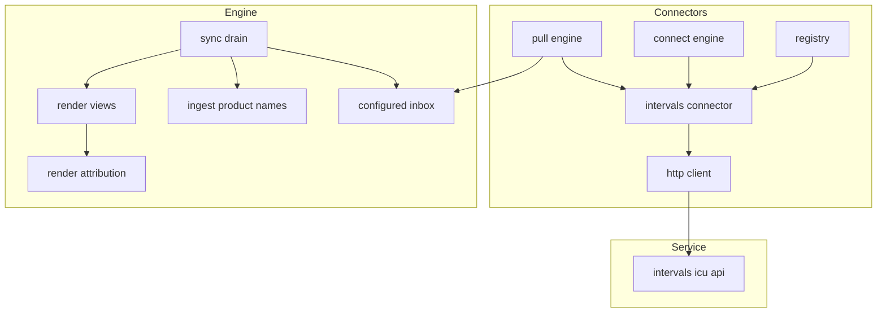
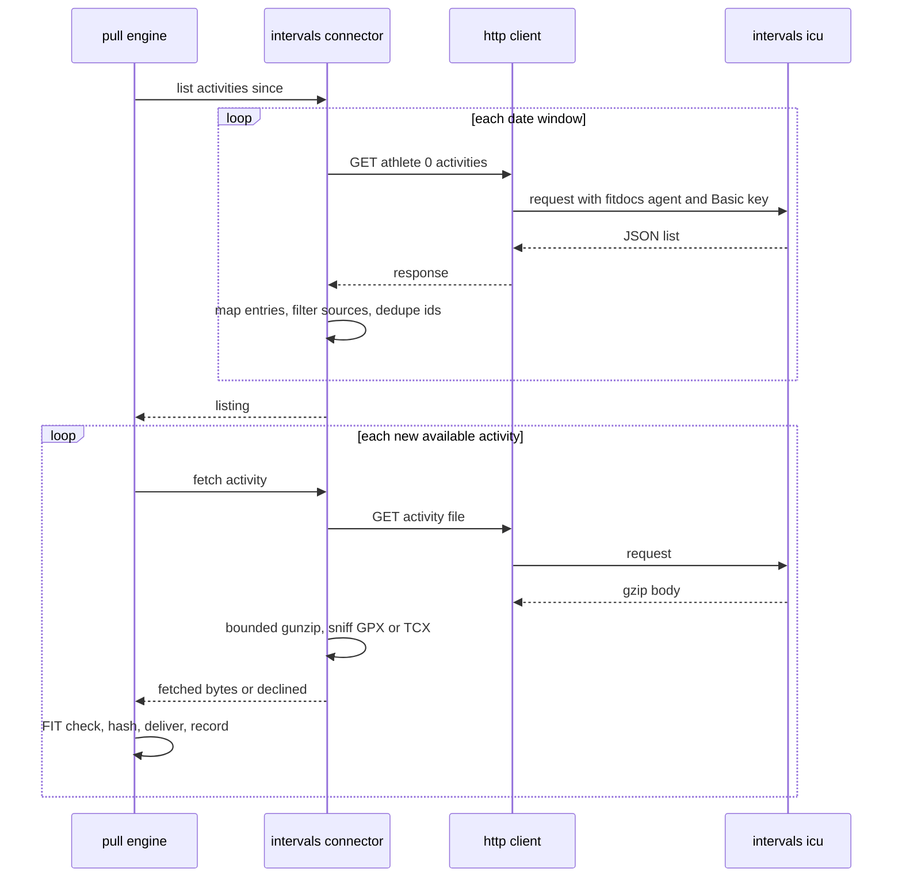
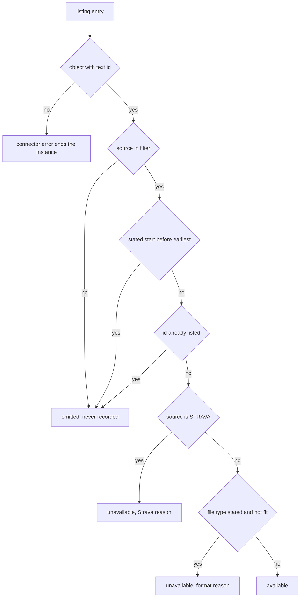
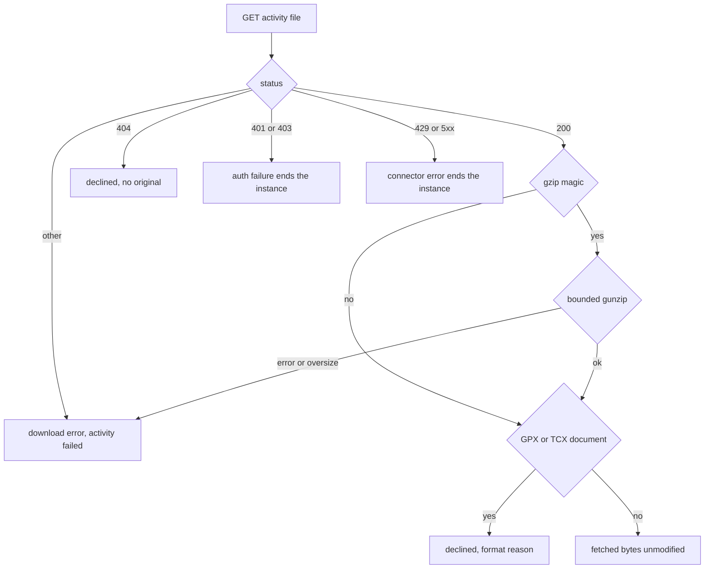

# Design Document: intervals-connector

## Overview

**Purpose**: `intervals-connector` gives fitdocs its first online source. A
`[connectors.<name>]` instance naming the `intervals` connector lists the
athlete's intervals.icu activities by date range, keeps only those from the
configured sources (Garmin Connect by default), skips Strava stubs and non-FIT
originals by name, downloads each remaining activity's original file, undoes
its gzip compression and hands the bytes to the `connectors` framework, which
checks the FIT header, records the ledger and delivers into the inbox. It
lands two existing-spec updates with it: ingest resolves Garmin product codes
to the FIT SDK profile's names, and every workout page recorded by a Garmin
device says "Garmin <model>" directly beneath its title.

**Users**: the athlete, who runs `fitdocs connect intervals` once and
`fitdocs pull` (or the packaged routine's `fitdocs pull --sync --no-prompt`)
thereafter; the maintainer, who runs the live viability check before the
connector touches a real data root; the authors of the later intervals.icu
follow-ons (push, planned workouts, thresholds), who extend this module rather
than start another.

**Impact**: one new connector module registered beside the folder connector;
one branch in `ingest/summary.py`'s `_product_name`; one new pure render
module and one line added under the H1 of every view; one `DOC_VERSION`
advance (every render golden on `main` at landing regenerates); a section in
`docs/connectors.md` and one entry in its service-neutral scan's exemption
table; amendment records on `fit-ingest` and `workout-docs`. No new runtime
dependency, no new command, no settings table, no managed key, no
`CONTRACT_VERSION` change.

### Goals
- A connector that implements `connectors`' published protocol exactly as that
  spec states it (`.kiro/specs/connectors/design.md` "Cross-spec seams"), with
  no amendment to any framework behaviour.
- Only real FIT originals are delivered; every other entry is skipped with its
  reason, and a filtered activity is never recorded (so widening the filter
  takes effect).
- The key never leaves the credential store except inside the unredirected
  `Authorization` header of a request to intervals.icu.
- Garmin product names resolved for every file, whatever its route; the
  attribution a pure function of the files' own content.
- Every assumption about the service taken from its published description and
  marked for the live check to confirm.

### Non-Goals
- Every other intervals.icu capability (the roadmap's Phase 8 follow-ons) and
  OAuth.
- Deciding which page a download belongs to, or its rank against a device
  original (`activity-identity`); composing channels (`channel-merge`).
- Attribution on aggregate pages (history, blocks) or inside chart images;
  prettified model names (Open Questions).
- Client-side pacing below the service's rate limits.

## Boundary Commitments

### This Spec Owns
- `src/fitdocs/connectors/intervals.py`: the `IntervalsConnector` declaration,
  its settings parser and `IntervalsSettings`, the key check, the windowed
  listing and its entry mapping, the download, decompression and format
  sniffing, and the mapping of every intervals.icu response status onto the
  framework's outcomes.
- The one registration line in `src/fitdocs/connectors/__init__.py` and this
  module's entries in the connectors boundary guard.
- The `intervals.icu` entry in the exemption table (host → allowed files) of
  the connectors service-neutral scan, admitting the host in exactly this
  connector's module, its test modules and the intervals.icu section of
  `docs/connectors.md` (`connectors` Req 14.6 exempts a shipped service
  connector's own module, tests and documentation section; `connectors`
  ships the table empty).
- Garmin product-name resolution: the `garmin_product` branch of
  `_product_name` (`src/fitdocs/ingest/summary.py:372-385`).
- Garmin attribution: `src/fitdocs/render/attribution.py`, its call beneath the
  H1 in `render/views.py`, the wording rules, and this spec's `DOC_VERSION`
  advance with its re-pins and regenerated goldens.
- The live viability check procedure and its findings in `research.md`.
- The `intervals.icu` section of `docs/connectors.md`, the `[Unreleased]`
  changelog entries, the amendment records on `fit-ingest` and
  `workout-docs`, and this spec's roadmap bookkeeping.

### Out of Boundary
- The protocol, registry, credential store, ledger, transport, delivery, the
  sweep and the `connect`/`pull` commands (`connectors`). Nothing here edits
  them; a needed change there stops the task and is reported.
- `FileIdentity`, source kinds, precedence and the match rule
  (`activity-identity`); this spec adds no field and no marker for them.
- Channel composition and the choice of donors (`channel-merge`).
- The developer-field functions of `ingest/summary.py` (`:129-301`,
  `running-dynamics`).
- Everything written to intervals.icu; every capability but pull-activities.
- The devices table's existing verbatim rendering of device-recorded text
  (`render/sections.py:533-537`); see Follow-ups in the spec report.

### Allowed Dependencies
- `connectors/intervals.py` imports only the standard library (`base64`,
  `gzip`, `io`, `json`, `re`, `datetime`, `urllib.parse`, `dataclasses`,
  `typing`, `collections.abc`) and, by absolute import,
  `fitdocs.connectors.errors`, `fitdocs.connectors.http`,
  `fitdocs.connectors.protocol` and `fitdocs.connectors.secrets`. It never
  imports the standard library's `http` package, `urllib.request`,
  `urllib.error`, `socket` or `ssl` (the network allow-list names only
  `fitdocs/tiles.py` and `fitdocs/connectors/http.py`), never reads a clock
  (it uses `session.now`), and imports no other `fitdocs` module.
- `connectors/__init__.py` gains exactly one import of this module and one
  `register` call; nothing else in the connectors package imports it.
- `render/attribution.py` imports only the standard library and
  `fitdocs.model`; `render/views.py` imports it. `_head` reads
  `DocContext.channel_provenance` (`channel-merge`) only as data; this spec
  imports nothing from the compose package. No render module imports the
  connectors package, and the connectors package imports no render, ingest,
  load or metrics module (`connectors` Req 14.3).
- `ingest/summary.py` keeps its imports; resolution reads the decoded message
  dict only. Only `ingest/decode.py` imports the SDK in `src/`, unchanged.
- No new runtime dependency (`tests/test_determinism.py:672-712`,
  `tests/test_packaging.py:503-519`).

### Revalidation Triggers
- A change to `connectors`' `Connector`/`KeyVerifier`/`ActivityPuller`
  protocols, `RemoteActivity`, the fetch answers, `HttpClient` modes or
  `auth_failure_from` → this module re-checks.
- The live check contradicting a **TBC** item → the listing mapping, the
  download mapping and their tests are amended before completion.
- A change to how `activity-identity` ranks files within a kind → the premise
  that a device original outranks this connector's download (TBC-8) re-checks.
- `channel-merge` composing pages → whichever of the two specs lands second
  wires `_head` (the one call site of `attribution_line`, in
  `render/views.py`) to pass the donating files' device tuples from
  `SourceContribution.devices`, and the design relies on the composed
  activity's `devices` staying the base's own (so the base's recording device
  is the `device_index == 0` device of the base's devices). A change to
  `SourceContribution.devices` or to which extras count as donating re-checks
  the wiring and the ride-pair pin (Cross-spec seams).
- A `garmin-fit-sdk` upgrade → the resolved names and the "unknown code"
  fixture's precondition re-check.
- Adding a render module that shows data per workout → it considers the
  attribution.

## Architecture

### Existing Architecture Analysis
- **The connector seam** (`connectors`, unimplemented on this branch): a
  connector is a declaration plus `parse_settings`; `API_KEY` style requires
  `verify(session, values) -> Granted`; `PULL_ACTIVITIES` requires
  `list_activities(session, since) -> Listing` and
  `fetch_activity(session, activity) -> Fetched | Declined | Deferred`. The
  session carries the parsed settings, an `HttpClient` (AUTH mode in
  `verify`, one attempt; DATA mode otherwise, up to 3 attempts on 429/5xx or
  a network failure, waits 2 s then 4 s, `Retry-After` honoured up to 60 s),
  the credentials, `now`, `sleep`, the redactor and `secret()`. The framework
  validates listing entries (a repeated id is a failed note), records
  unavailable entries and declinations as skipped, checks the FIT header,
  dedupes by content hash, delivers bytes unmodified and ends an instance on
  `AuthFailure`/`ConnectorError`.
- **Ingest**: `parse_fit` decodes with the SDK's default sub-field expansion
  and type-to-string conversion (`ingest/decode.py:91-95` sets only three
  flags), so a Garmin `device_info` already carries `garmin_product`;
  `_build_device` (`ingest/summary.py:360-369`) maps it through
  `_product_name`, which ignores it.
- **Render**: each view starts `[f"# {_title(ctx)}", notes_region(...)]`
  (`render/views.py:156-157, 191-192, 225-226`); region markers are whole
  lines (`docmerge.py:63-66`); the devices table names a device by
  `product_name or manufacturer` (`render/sections.py:533-537`).

### Architecture Pattern & Boundary Map



**Architecture Integration**:
- Selected pattern: a service adapter behind the framework's protocol; the
  attribution a pure function of the model inside render.
- Domain boundaries: the connector knows intervals.icu's JSON and bytes, never
  a page; ingest knows FIT messages; render knows the model. The only fact
  that crosses from the service to the page is the file's own bytes.
- Existing patterns preserved: `FolderConnector`'s shape (class attributes,
  `parse_settings` raising `ConnectorSettingsError(key, message)`); the
  injectable transport; `_product_name`'s "recorded text first, no
  fabrication"; generated content outside regions; one `DOC_VERSION` advance
  with regenerated goldens.
- New components rationale: one connector module (the network-free half of a
  service adapter); one render module so the wording rule has one home and one
  test file, and so `views.py` — edited by three sibling specs — gains only a
  helper call.
- Steering compliance: stdlib only; absent is `None`; typed under `mypy
  --strict`; no personal data in fixtures; no network in tests.

### Dependency Direction
- Connectors: `_atomic, secrets → errors → http → protocol → … → folder,
  intervals → pull, connect → __init__`. `intervals` sits beside `folder`:
  it imports leftward only (`errors`, `http`, `protocol`, `secrets`), and only
  `__init__` imports it.
- Render: `fitdocs.model → render.attribution → render.views`.
- Ingest: unchanged (`fitdocs.model`, `ingest._fields` → `ingest.summary`).

### Technology Stack

| Layer | Choice / Version | Role in Feature | Notes |
|-------|------------------|-----------------|-------|
| Service API | intervals.icu REST, OpenAPI v1.0.0 | listing and original-file download | HTTP Basic, username `API_KEY`; athlete `0` |
| Transport | `connectors` `HttpClient` over stdlib `urllib` | every request | fitdocs User-Agent, timeouts, bounded data retries |
| Codecs | stdlib `gzip`, `io`, `json`, `base64`, `urllib.parse` | decompression, JSON, Basic credential, query strings | bounded `GzipFile.read` |
| FIT decode | `garmin-fit-sdk` 21.208.0 (locked) | the `garmin_product` sub-field name | read only through `ingest/decode.py` |
| Runtime deps | unchanged | — | frozen-dependency tests stay green |

## File Structure Plan

### Directory Structure
```
src/fitdocs/connectors/
└── intervals.py          # IntervalsConnector, IntervalsSettings, IntervalsDownloadError, constants
src/fitdocs/render/
└── attribution.py        # recording_device, garmin_label, attribution_line (pure)
tests/connectors/
├── test_intervals.py       # declaration, settings, verify, listing, download, redaction (FakeTransport)
├── test_intervals_pull.py  # engine-level pull with the real connector; CLI pull --sync to a page
└── test_intervals_docs.py  # the docs section bound to the code's constants
tests/render/
└── test_attribution.py     # the wording rules over hand-built activities
```

### Modified Files
- `src/fitdocs/connectors/__init__.py` — one import and `register(IntervalsConnector())`, after the folder connector's line.
- `src/fitdocs/ingest/summary.py` — `_product_name` (`:372-385`) gains the `garmin_product` branch and its docstring the rule; nothing else in the module.
- `src/fitdocs/render/views.py` — a `_head(ctx)` helper returning the H1 and, when present, the attribution line; the three views start their blocks from it; module docstring notes the line. If `channel-merge` is on `main` first, `_head` also passes the donating files' devices (ViewHead). Shared with `running-dynamics` and `channel-merge` (append-only).
- `src/fitdocs/render/__init__.py` — read, not edited, by this spec (`_head` reads `DocContext.channel_provenance`, which `channel-merge` appends); shared with `channel-merge` and `activity-identity` (append-only), so any rebase keeps every appended field.
- `src/fitdocs/contract.py` — `DOC_VERSION` advanced by one from `main`'s value at landing, with a docstring paragraph.
- `tests/fixtures/builder.py` — appended `garmin_devices_ride_mesgs()` / `garmin_devices_ride_fit_bytes()` (no existing default changes).
- `tests/ingest/test_summary.py`, `tests/ingest/test_parse.py` — product-name pins.
- `tests/render/test_views.py` — placement pins; `tests/render/golden_docs/*.md` — regenerated.
- `tests/test_cli_check.py:196,198`, `tests/render/test_frontmatter.py:44,101`, `tests/metrics/test_sources.py:2270` — `DOC_VERSION` re-pins (whichever literal form is on `main` at landing).
- `tests/connectors/test_boundary.py` — this module's allowed-import set and the `__init__` set's new entry (append-only).
- `tests/connectors/test_docs.py` — the heading pin gains this section's headings; the service-neutral scan's exemption table, `NEUTRAL_SCAN_EXEMPTIONS`, gains the `intervals.icu` entry, its page key `docs/connectors.md#intervals.icu` (append-only; `connectors` ships the table empty).
- Any `tests/connectors/*` assertion that pins the built-in registry as exactly the folder connector — moves to the two built-ins.
- `docs/connectors.md` — the `## intervals.icu` section; `CHANGELOG.md` `[Unreleased]`.
- Spec records: `.kiro/specs/fit-ingest/`, `.kiro/specs/workout-docs/` (amendment blocks and `spec.json` entries); `.kiro/steering/roadmap.md` Phase 8 bookkeeping; this spec's `research.md` (live-check findings).

## System Flows

### A pull of one intervals.icu instance



Key decisions: windows are computed by the connector (the API has no cursor);
a 401/403 anywhere ends the instance with the framework's next step; a 429 or
5xx that survives the client's retries ends the instance with a connector
error, so the run stops pressing a limited service and the next pull resumes
from its ledger.

### Listing-entry mapping



### Download mapping



## Requirements Traceability

| Requirement | Summary | Components | Interfaces | Flows |
|-------------|---------|------------|------------|-------|
| 1.1 | One secret field, pull only | IntervalsConnector | class attributes | — |
| 1.2, 1.3, 1.4 | One verification request; no scopes; status mapping | IntervalsConnector | `verify`, `_verify_url`, `auth_failure_from` | — |
| 1.5 | Athlete `0`; nothing from settings but the filter | IntervalsConnector | `API_BASE`, `SELF_ATHLETE`, `parse_settings` | — |
| 2.1, 2.2, 2.3, 2.4 | Source filter, default, validation, open vocabulary, unknown keys | IntervalsConnector | `parse_settings`, `IntervalsSettings`, `DEFAULT_SOURCES`, `SOURCE_NAME_PATTERN` | — |
| 3.1, 3.2, 3.3 | Windows, first pull, dedupe | IntervalsConnector | `list_activities`, `_windows`, `FIRST_PULL_DAYS`, `WINDOW_DAYS` | pull |
| 3.4, 3.5, 3.6, 3.7 | Filter, Strava stub, non-FIT type, absent values, no revision | IntervalsConnector | `_remote_activity` | listing-entry mapping |
| 3.8 | Malformed listing ends the instance | IntervalsConnector | `_listing_entries` | listing-entry mapping |
| 4.1, 4.2, 4.3, 4.4, 4.5, 4.7 | Original only, gunzip, bounds, GPX/TCX, 404, unmodified | IntervalsConnector | `fetch_activity`, `_decompress`, `_document_format` | download mapping |
| 4.6 | Other non-FIT bytes skipped | (framework `is_fit`), IntervalsPullTests | — | download mapping |
| 5.1, 5.2, 5.3, 5.4, 5.5 | Status handling on data calls | IntervalsConnector | `_raise_for_status` | download mapping |
| 5.6 | fitdocs User-Agent on every request | IntervalsConnector (uses `session.http` only), BoundaryGuardEntry | — | pull |
| 5.7 | Key never exposed | IntervalsConnector | `_auth_headers`, `session.secret` | — |
| 5.8 | Offline, synthesized tests | IntervalsTests, IntervalsPullTests | `FakeTransport` | — |
| 6.1, 6.2, 6.3 | Remote id, second pull, already held | IntervalsConnector, IntervalsPullTests | `RemoteActivity.remote_id` | pull |
| 7.1, 7.2, 7.3, 7.4, 7.5 | Product names from the SDK profile | ProductNameResolution | `_product_name` | — |
| 8.1, 8.2, 8.3, 8.4, 8.6 | The attribution line and its wording | GarminAttribution, ViewHead | `attribution_line`, `garmin_label`, `recording_device`, `_head` | — |
| 8.5 | Devices table shows resolved names | ProductNameResolution (existing `_devices_table`) | — | — |
| 8.7, 8.8 | Generated content; `DOC_VERSION` advance | ViewHead, DocVersionAdvance | `DOC_VERSION` | — |
| 9.1, 9.2, 9.3, 9.4, 9.5 | Maintainer live check | LiveCheckProcedure | research.md "Live check findings" | — |
| 10.1, 10.2 | Docs section | ConnectorsDocSection | `docs/connectors.md` | — |
| 10.3 | Changelog | ChangelogEntry | `CHANGELOG.md` | — |
| 10.4 | Amendment records | SpecRecords, NeutralScanExemption | — | — |

## Components and Interfaces

| Component | Domain/Layer | Intent | Req Coverage | Key Dependencies | Contracts |
|-----------|--------------|--------|--------------|------------------|-----------|
| IntervalsConnector | connectors/intervals.py | The intervals.icu pull adapter | 1.x, 2.x, 3.x, 4.1-4.5, 4.7, 5.1-5.7, 6.1 | protocol, http, errors, secrets (P0); intervals.icu (External P0) | Service |
| ConnectorRegistration | connectors/__init__.py | Register the built-in | 1.1 | registry (P0) | Service |
| BoundaryGuardEntry | tests/connectors/test_boundary.py | Pin this module's imports | 5.6 | connectors task 6.1's guard (P0) | — |
| NeutralScanExemption | tests/connectors/test_docs.py | The `intervals.icu` entry in the scan's exemption table | 10.2, 10.4 | connectors task 7's scan and its exemption table (P0) | — |
| ProductNameResolution | ingest/summary.py | SDK profile names for Garmin codes | 7.1-7.5, 8.5 | decoded `device_info` (P0) | Service |
| GarminAttribution | render/attribution.py | The wording rule | 8.1-8.4, 8.6 | model (P0) | Service |
| ViewHead | render/views.py | The line beneath the H1 in all views | 8.1, 8.4, 8.7 | GarminAttribution (P0); `channel-merge`'s `SourceContribution.devices` (P1, when on `main`) | — |
| DocVersionAdvance | contract.py, pins, goldens | Migration by regeneration | 8.8 | — | State |
| LiveCheckProcedure | maintainer, research.md | Confirm the TBC items | 9.1-9.5 | the athlete's account (External) | — |
| ConnectorsDocSection | docs/connectors.md | Setting the connector up | 10.1, 10.2 | connectors' page (P0) | — |
| ChangelogEntry | CHANGELOG.md | User-visible record | 10.3 | — | — |
| SpecRecords | .kiro/specs, roadmap | Amendments and bookkeeping | 10.4 | — | — |
| IntervalsTests / IntervalsPullTests / AttributionTests | tests | Offline, synthesized verification | 5.8, 4.6, 6.2, 6.3 | `FakeTransport`, builder (P0) | — |

### Connector layer

#### IntervalsConnector (`src/fitdocs/connectors/intervals.py`)

| Field | Detail |
|-------|--------|
| Intent | List, filter and fetch intervals.icu originals for the key's athlete |
| Requirements | 1.1-1.5, 2.1-2.4, 3.1-3.8, 4.1-4.5, 4.7, 5.1-5.7, 6.1 |

**Responsibilities & Constraints**
- Stateless between sessions; its only inputs are the session and the listed
  activity; it never reads a page, the ledger, the archive or the inbox.
- Every request goes through `session.http`, so the framework sets the
  User-Agent, the timeout and the retry policy; the connector never builds its
  own client.
- Every service-derived string it raises or returns is plain text the
  framework redacts; the connector itself never formats the key into any
  string other than the credential it registers.

**Contracts**: Service [x]

```python
INTERVALS_CONNECTOR_ID: Final[str] = "intervals"
API_BASE: Final[str] = "https://intervals.icu/api/v1"
SELF_ATHLETE: Final[str] = "0"                      # the key's own athlete
API_KEY_USERNAME: Final[str] = "API_KEY"
DEFAULT_SOURCES: Final[frozenset[str]] = frozenset({"GARMIN_CONNECT"})
STRAVA_SOURCE: Final[str] = "STRAVA"
SOURCE_NAME_PATTERN: Final[str] = r"^[A-Z][A-Z0-9_]{0,63}$"
FIRST_PULL_DAYS: Final[int] = 30
WINDOW_DAYS: Final[int] = 90
LISTING_FIELDS: Final[tuple[str, ...]] = ("id", "source", "start_date", "type", "elapsed_time", "file_type")
MAX_FILE_BYTES: Final[int] = MAX_RESPONSE_BYTES     # from fitdocs.connectors.http
GZIP_MAGIC: Final[bytes] = b"\x1f\x8b"

@dataclass(frozen=True)
class IntervalsSettings:
    sources: frozenset[str]

class IntervalsDownloadError(Exception):
    """One activity's download failed; the framework reports it and retries it next pull."""

class IntervalsConnector:                           # Connector + KeyVerifier + ActivityPuller
    connector_id = "intervals"
    display_name = "intervals.icu"
    auth_style = AuthStyle.API_KEY
    capabilities = frozenset({Capability.PULL_ACTIVITIES})
    credential_fields = (CredentialField("api_key", "intervals.icu API key (Settings, Developer Settings)", secret=True),)
    def parse_settings(self, table: Mapping[str, object], context: SettingsContext) -> IntervalsSettings: ...
    def verify(self, session: ConnectorSession, values: Mapping[str, Secret]) -> Granted: ...
    def list_activities(self, session: ConnectorSession, since: datetime | None) -> Listing: ...
    def fetch_activity(self, session: ConnectorSession, activity: RemoteActivity) -> FetchResult: ...
```

- **Credential** (5.7): `_auth_headers(session, key)` computes
  `token = base64(f"{API_KEY_USERNAME}:{key.reveal()}")`, registers `token`
  through `session.secret(token)` (so the bare encoded form is redacted too),
  and returns `{"Authorization": session.secret(f"Basic {token}")}`, passed
  as `secret_headers` (unredirected). No URL carries a credential.
- **`parse_settings`** (2.1-2.4): `sources` absent → `DEFAULT_SOURCES`;
  present → must be a non-empty `list` whose every item is a `str` matching
  `SOURCE_NAME_PATTERN`, else `ConnectorSettingsError("sources", …)` whose
  message names the offending value and gives `"GARMIN_CONNECT"` as an
  example; the result is the `frozenset` of the items (a name the published
  vocabulary lacks is accepted). Every other key is ignored. The framework
  has already removed `connector` and `lookback_days` and refused
  credential-named keys.
- **`verify`** (1.2-1.4): exactly one `session.http.get` (AUTH mode) of
  `{API_BASE}/athlete/0/activities?oldest=<UTC date of now − 1 day>&limit=1&fields=id`
  with the credential. `200` → `Granted(scopes=None)`. Otherwise
  `auth_failure_from(response, service_message=_service_message(session, response))`
  is raised when it returns a failure (401 rejected, 403 blocked, 429
  rate-limited with `Retry-After`, 5xx unavailable); any other status raises
  `AuthFailure(UNAVAILABLE)` whose message is `"HTTP <status>: <service
  message>"`. The body of a 200 is not read. (TBC-7)
- **`list_activities`** (3.1-3.8, 1.5):
  - `earliest = since` when given, else `session.now() − FIRST_PULL_DAYS days`.
  - `_windows(earliest, now)`: `first` is the UTC calendar date of `earliest`
    less one day (the API's bounds are athlete-local with no zone, and no
    offset exceeds a day); `last` is the UTC date of `now`; with
    `D = (last − first).days`, windows start at `first + 90·k` for every
    `k ≥ 0` with `90·k < D` (always at least `k = 0`), so there are
    `max(1, ⌈D / 90⌉)` requests. Each window's `newest` is one day past the
    next window's start (the overlap makes coverage independent of whether the
    service's bounds are inclusive); the last window omits `newest` (the
    service's "now"). Bounds are sent as `YYYY-MM-DDT00:00:00`. The first pull
    (`D = 31`) is one request; a `since` 200 days back (`D = 201`) is three;
    `D = 180` is two. (TBC-2)
  - Each request: `GET {API_BASE}/athlete/0/activities?oldest=…[&newest=…]&fields=id,source,start_date,type,elapsed_time,file_type`
    (query built with `urllib.parse.urlencode`). `_listing_entries(response)`:
    non-200 → `_raise_for_status(response, listing=True)`; body not UTF-8
    JSON, or not a JSON array → `ConnectorError` naming the problem. (TBC-4)
  - `_remote_activity(entry, index, settings)` per entry, in response order:
    not an object, or `id` missing or not a non-empty `str` →
    `ConnectorError("intervals.icu's activity listing is not in its documented form: entry <n> …")`
    (3.8); `source` not a `str` in `settings.sources` → omitted (3.4);
    `start` = `start_date` parsed with `datetime.fromisoformat` when it is a
    `str` carrying a UTC offset, converted to UTC, else `None`; `sport` =
    `type` when a non-empty `str`, else `None`; `duration_s` =
    `float(elapsed_time)` when an `int` that is not a `bool` and `≥ 0`, else
    `None`; `revision = None`; `suggested_name = None` (3.7). Then:
    `source == STRAVA_SOURCE` → `original_available=False`,
    `unavailable_reason = STRAVA_REASON` (3.5); else `file_type` a non-blank
    `str` whose stripped lower-case form is not `"fit"` →
    `original_available=False`, reason `NOT_FIT_REASON` with the stripped
    upper-case format (3.6) (TBC-3); else available.
  - An entry whose `start` is not `None` and is earlier than `earliest` is
    omitted (3.1); an `id` already taken from an earlier window is omitted
    (3.3). Returns `Listing(activities=…)` with no deferrals; the framework
    orders entries.
- **`fetch_activity`** (4.1-4.5, 4.7, 5.x): `GET
  {API_BASE}/activity/<quote(remote_id, safe="")>/file` with the credential
  (never `/fit-file`). `200` → `_decompress(body)`: a body starting with
  `GZIP_MAGIC` is read through `gzip.GzipFile(fileobj=io.BytesIO(body)).read(MAX_FILE_BYTES + 1)`
  — more than `MAX_FILE_BYTES` bytes, or `OSError`/`EOFError`/`zlib.error`
  (bad or truncated data), raises `IntervalsDownloadError` (4.3); any other
  body is used as received (4.2) (TBC-5). Then
  `_document_format(data)`: the first 1024 bytes, less a UTF-8 BOM and
  leading whitespace, lower-cased, begin with `<` and contain `<gpx` → `"GPX"`,
  or `<trainingcenterdatabase` → `"TCX"`; a format → `Declined(NOT_FIT_REASON…)`
  (4.4); else `Fetched(data)` — the decompressed bytes, unmodified (4.7). `404`
  → `Declined(NO_FILE_REASON)` (4.5) (TBC-6). Anything else →
  `_raise_for_status(response, listing=False)`.
- **`_raise_for_status(response, *, listing)`** (5.1-5.5): 401 or 403 → raise
  `auth_failure_from(...)`'s failure (with the service message); 429 →
  `ConnectorError(RATE_LIMITED_MESSAGE)`; 500-599 →
  `ConnectorError(UNAVAILABLE_MESSAGE)`; any other status →
  `ConnectorError(LISTING_STATUS_MESSAGE)` when `listing`, else
  `IntervalsDownloadError(DOWNLOAD_STATUS_MESSAGE)`. Status codes are plain
  `int`s (the stdlib `http` package is never imported).
- **`_service_message(session, response)`**: the first 4096 body bytes
  decoded as UTF-8 with replacement, whitespace collapsed, passed through
  `session.redactor.redact` (so a service that echoes the credential or its
  encoded form never puts it into an exception this module raises), then cut
  to 300 characters; `"HTTP <status>"` when empty (5.7).

**User-facing texts** (constants; the tests bind to them, the docs quote their substance):

| Constant | Text |
|----------|------|
| `STRAVA_REASON` | `Strava-sourced: intervals.icu returns only a stub for Strava activities and shares no file for them` |
| `NOT_FIT_REASON` | `the original is a {format} file, not FIT; fitdocs ingests FIT files only` |
| `NO_FILE_REASON` | `intervals.icu holds no original file for this activity (HTTP 404)` |
| `RATE_LIMITED_MESSAGE` | `intervals.icu is limiting requests (HTTP 429) and still was after fitdocs's retries; this pull stopped, and the next pull resumes where it stopped` |
| `UNAVAILABLE_MESSAGE` | `intervals.icu is unavailable (HTTP {status}) after fitdocs's retries; this pull stopped, and the next pull resumes where it stopped` |
| `LISTING_STATUS_MESSAGE` | `intervals.icu answered the activity listing with HTTP {status}: {message}` |
| `DOWNLOAD_STATUS_MESSAGE` | `intervals.icu answered HTTP {status} for the original file: {message}` |

**Implementation Notes**
- Integration: `SettingsContext` is unused (no path settings). The session's
  `settings` is narrowed with `isinstance(…, IntervalsSettings)`; anything else
  is a `ConnectorError` (a framework invariant broken, never user input).
- Validation: `tests/connectors/test_intervals.py` drives every method through
  `FakeTransport` with the connectors conftest's socket guard and environment
  isolation active; see Testing Strategy for the named mutations.
- Risks: the service's shapes (TBC-1..8). A wrong assumption about a field's
  absence cannot poison the ledger: absence never produces a final skip.

#### ConnectorRegistration (`src/fitdocs/connectors/__init__.py`)
- Appends `from fitdocs.connectors.intervals import IntervalsConnector` and
  `registry.register(IntervalsConnector())` after the folder connector's
  registration. `IntervalsConnector` is not added to `__all__`
  (`FolderConnector` is not in it either); the 46-name surface pin is
  unchanged.
- An instance `[connectors.intervals]` resolves to this connector by default
  (the instance name is the connector id) and reads
  `FITDOCS_CONNECTOR_INTERVALS_API_KEY` (`connectors`' `env_var_name`).

#### BoundaryGuardEntry and NeutralScanExemption (tests, append-only)
- The per-module allowed-import pin gains `intervals.py` with exactly
  `{fitdocs.connectors.errors, fitdocs.connectors.http, fitdocs.connectors.protocol, fitdocs.connectors.secrets}`
  and `__init__.py`'s set gains `fitdocs.connectors.intervals`; the
  directory-both-ways check sees the new file. Layers 2-4 need no change and
  must stay green (no third-party import, no network module, no clock).
- The service-neutral scan is `connectors`' (its Req 14.6: the framework
  modules, their tests and the framework sections of the connectors
  documentation name no online service's endpoint; a shipped service
  connector's own module, tests and documentation section are exempt). It
  reads an explicit exemption table, `NEUTRAL_SCAN_EXEMPTIONS` (host →
  admitted files, a page entry naming its own `##` section as
  `docs/connectors.md#<section heading>`), that `connectors` ships empty.
  This spec appends one entry: host `intervals.icu` →
  `src/fitdocs/connectors/intervals.py`, `tests/connectors/test_intervals.py`,
  `tests/connectors/test_intervals_pull.py`,
  `tests/connectors/test_intervals_docs.py` and
  `docs/connectors.md#intervals.icu`. The scan keeps failing on the host
  anywhere else: another connectors module, another test, or another section
  of the page. Nothing else in the scan changes.
- The exemption is exercised, not vacuous: with the table non-empty,
  `connectors`' conditional positive control runs (each host found in at
  least one of its admitted files), and this spec adds one assertion beside
  it that the scan finds `intervals.icu` in `intervals.py` itself (the
  generic control is satisfied by any admitted file, so it cannot tell
  whether the module still names the host).

### Ingest layer

#### ProductNameResolution (`src/fitdocs/ingest/summary.py`)

| Field | Detail |
|-------|--------|
| Intent | Name a Garmin device from the SDK profile's own name for its code |
| Requirements | 7.1, 7.2, 7.3, 7.4, 7.5, 8.5 |

**Contracts**: Service [x]

```python
def _product_name(device: dict[str, object]) -> str | None:
    # 1. device["product_name"] when a str  (recorded text wins; unchanged)
    # 2. device["product"] when a str        (unchanged)
    # 3. device["garmin_product"] when a str (new: the SDK profile's name)
    # else None
```
- The SDK adds `garmin_product` only when the message's `manufacturer` is
  one the profile maps (`garmin`, `dynastream`, `dynastream_oem`, `tacx`) and
  converts it to the profile's name when the code is known; an unknown code
  stays an `int` and is ignored (7.2). fitdocs holds no table (7.5); the
  resolution depends only on the decoded messages, so every route to the
  archive resolves alike (7.4). `favero_product` is not read (not a Garmin
  product).
- The devices table already names a device by `product_name` first
  (`render/sections.py:533-537`), so resolved names appear there with no
  render change (8.5).
- No model golden moves: every synthesized fixture's device records a
  `product_name` (`tests/fixtures/builder.py:157-168`), which keeps winning.

### Render layer

#### GarminAttribution (`src/fitdocs/render/attribution.py`)

| Field | Detail |
|-------|--------|
| Intent | Decide and word the Garmin attribution for a page's contributing files |
| Requirements | 8.1, 8.2, 8.3, 8.4, 8.6 |

**Contracts**: Service [x]

```python
GARMIN_MANUFACTURER: Final[str] = "garmin"
RECORDING_DEVICE_INDEX: Final[int] = 0
SOLE_SOURCE_PREFIX: Final[str] = "Data source: "
SOURCES_PREFIX: Final[str] = "Data sources: "
OTHER_DEVICES: Final[str] = "other devices"

def recording_device(devices: Sequence[DeviceInfo]) -> DeviceInfo | None: ...
def garmin_label(devices: Sequence[DeviceInfo]) -> str | None: ...
def attribution_line(
    base: Activity, donor_devices: Sequence[Sequence[DeviceInfo]] = ()
) -> str | None: ...
```
- `recording_device(devices)`: the first `DeviceInfo` in the device tuple
  whose `device_index == 0` (the FIT creator, which ingest normalizes to
  `0`), else `None`. It takes a device tuple, not an activity, so the same
  rule applies to the base (`base.devices`) and to each donating file (its
  `SourceContribution.devices`, which `channel-merge` publishes as that
  file's own `Activity.devices`).
- `garmin_label(devices)`: `None` unless the recording device of the tuple
  has `manufacturer` exactly `"garmin"` (8.3). The model is the device's
  `product_name` with every whitespace run collapsed to one space and
  stripped (so device-recorded text can never span lines, form a heading or
  a region marker); a blank or absent model gives `"Garmin"` (8.2); a model
  that already reads `Garmin` or begins `Garmin ` (any case) is used as is;
  otherwise `f"Garmin {model}"` (8.1).
- `attribution_line(base, donor_devices)`: contributors are
  `(base.devices, *donor_devices)`, one device tuple per contributing file;
  labels are their non-`None` `garmin_label`s, first occurrence kept, base
  first. No label → `None` (8.3). Every contributor Garmin-labelled: one
  label → `"Data source: <label>"`, several → `"Data sources: <A>, <B> and
  <C>"`. Any contributor without a Garmin label (including a donating file
  whose device tuple is empty) → `"Data sources: <labels…> and other
  devices"` (8.4). The base's recording device is the `device_index == 0`
  device of `base.devices`; a composed activity keeps the base's devices
  (`channel-merge`), so `ctx.activity` is a correct `base`. Pure; the same
  inputs give the same string (8.6).
- The caller is `render/views.py::_head`; it passes donor device tuples only
  once `channel-merge` is on `main` (ViewHead; Cross-spec seams).

#### ViewHead (`src/fitdocs/render/views.py`)
- `_head(ctx) -> list[str]`: `[f"# {_title(ctx)}"]` plus
  `attribution_line(ctx.activity, donor_devices)` when not `None`.
  `render_run_ride`, `render_strength` and `render_generic` start their
  `blocks` from it, so the line sits directly beneath the H1, before the
  `notes` region and every `##` section (8.1), outside every region and
  rebuilt on every render (8.7). No frontmatter key changes.
- `donor_devices` (8.4; cross-spec ruling R2): whichever of `channel-merge`
  and this spec lands second wires it as
  `tuple(c.devices for c in ctx.channel_provenance.extras if c.channels)` —
  the devices of every extra that donated at least one channel, rank order —
  and `()` when `ctx.channel_provenance` is `None` (an uncomposed page).
  `channel-merge` adds `SourceContribution.devices` (the contributing file's
  own `Activity.devices`) and `DocContext.channel_provenance`. If both are on
  `main` when this spec's view task runs, or after its final rebase, this
  spec wires it and adds the two pins below; otherwise `_head` passes no
  donor devices and `channel-merge`, landing second, wires it and adds them.
  The ride-pair pin: `channel-merge`'s ride pair (`tests/fixtures/merge.py`:
  a Garmin-original base and a HealthFit copy donating heart rate) rendered
  as a composed page reads `Data sources: Garmin <model> and other devices`
  beneath its H1, `Garmin <model>` being the base's own Garmin label (the
  precondition asserted first: the donor's recording device is not made by
  Garmin). Beside it, the non-donating pin: a Garmin base whose only extra is
  non-Garmin and donates no channel reads `Data source: Garmin <model>`
  (the `if c.channels` filter). Whichever spec lands second adds both.
- The helper defines no name listed in `tests/test_contract_consumers.py`'s
  `FORBIDDEN_LOCAL_NAMES` (the module is a registered contract consumer).

#### DocVersionAdvance (`src/fitdocs/contract.py`, pins, goldens)
- `DOC_VERSION` = the value on `main` at landing, plus one; the docstring
  gains a paragraph recording that this advance adds the Garmin attribution
  line and the resolved device names (8.8). `CONTRACT_VERSION` and
  `MANAGED_KEYS` do not move.
- The rule (cross-spec ruling R1, `DOC_VERSION` half): every lander advances
  `DOC_VERSION` by one from the value on `main` when it lands — no sharing of
  a bump with a sibling; after the final rebase the value is asserted equal
  to `main`'s plus one and re-pinned (re-pin sites and regenerated goldens)
  if a sibling landed first.
- Re-pins in the same change, in whatever form `main` holds them at landing:
  `tests/test_cli_check.py:196,198` (a sibling may already have rewritten it
  as `f"doc_version: {DOC_VERSION}"`), `tests/render/test_frontmatter.py:44,
  101`, `tests/metrics/test_sources.py:2270`
  (`CONSTANT_REGISTRY_ASOF_DOC_VERSION`, which tracks the current version while
  the registry is clean), and every `tests/render/golden_docs/*.md`
  (regenerated with `uv run python -m tests.render.test_golden_docs`).
  Every golden on `main` at landing gains the version; each whose recording
  device is Garmin gains the line (the builder's default index-0 device is a
  Garmin one with a recorded `Synthetic…` name, so those read `Data source:
  Garmin Synthetic…`). `minimal.md` and `map_generic.md`, rendered from the
  device-less minimal file (`tests/fixtures/builder.py:579-590`), are the
  device-less cases: they change only in the version and are the golden case
  of 8.3's "the file names no recording device". A golden whose recording
  device is not Garmin gains no line — `running-dynamics`' `stryd_run`, whose
  fixture writes its index-0 `device_info` with manufacturer `stryd`, is
  that case once it is on `main`. A composed golden (`channel-merge`'s
  `composed_run`) carries whatever line its base's and donors' devices give.
  No golden count is written anywhere in this spec's tasks or tests. A
  sibling's recorded "pre-this-spec" constant (e.g. running-dynamics'
  `_PRE_RUNNING_DYNAMICS_DOC_VERSION`) keeps its value. No number is written in
  any doc page or test prose.

### Process layer

#### LiveCheckProcedure (maintainer; findings in `research.md`)

| Field | Detail |
|-------|--------|
| Intent | Confirm TBC-1..8 and the brief's three questions on a real account |
| Requirements | 9.1, 9.2, 9.3, 9.4, 9.5 |

Run by the maintainer only, with their own key, in a temporary directory
outside the repository and the data root, deleted afterwards:
1. Read the key without echo (`read -rs IV_KEY`); it is never written to a
   file, a spec, a commit or a log. Every request uses the fitdocs agent
   (`-A "fitdocs/<version> (+https://github.com/joshua-stauffer/fitdocs)"`)
   and `-u "API_KEY:$IV_KEY"`.
2. One-entry listing (the `verify` call) with the real key and with a wrong
   key: record both statuses (TBC-7).
3. A recent window's listing with `fields=id,source,start_date,type,elapsed_time,file_type`:
   record the field names present, `source` for an Edge ride (TBC-1), the
   `start_date` form (TBC-2), the `file_type` values seen (TBC-3), and a
   Strava stub's keys if the account has one (TBC-4).
4. `/file` for one Edge ride, without following redirects, then with: record
   the status, whether it redirected, the first two bytes (gzip magic)
   (TBC-5); gunzip, confirm the FIT header, and record whether record
   messages carry power and pedal dynamics (`left_right_balance`, torque
   effectiveness, pedal smoothness) and the record count.
5. The same ride's original from a Garmin Connect "Export Original": record
   whether the bytes are identical; if not, the size difference and each
   file's count of undocumented messages — decoded keys that consist only of
   digits, `activity-identity`'s definition (TBC-8).
6. `/file` for an activity without a file, if one exists (TBC-6).
7. Append the findings to `research.md` "Live check findings": dates of the
   check and of the viewed vocabulary, statuses, field names, vocabulary
   values, booleans and counts only — never an id, athlete id, activity date,
   name, location, file or key (9.3). A contradicted TBC item amends
   design.md and the affected tasks before completion (9.4).

### Documentation and records

#### ConnectorsDocSection (`docs/connectors.md`)
One `## intervals.icu` section, after the folder connector's section, with
`### Connecting`, `### Configuring`, `### What a pull fetches` and
`### Garmin attribution` subsections, stating (10.1, 10.2):
- the key comes from intervals.icu's Settings, Developer Settings; `fitdocs
  connect intervals` checks it with one read request; the instance
  `[connectors.intervals]`; the override variable
  `FITDOCS_CONNECTOR_INTERVALS_API_KEY`;
- `sources` and its default `["GARMIN_CONNECT"]` (why: the athlete's other
  copies are not fetched twice), the published names, and that unknown
  well-formed names are accepted;
- the first pull lists 30 days; `fitdocs pull intervals --since YYYY-MM-DD`
  backfills, best in slices under the service's rate limits;
- what is skipped and why (Strava stubs, non-FIT originals, activities without
  a file), what fails and when the next pull retries, a refused key (`fitdocs
  connect intervals` again), a blocked client (report it), a rate limit (the
  pull stops and resumes next time);
- what leaves the machine: the key, in the `Authorization` header of requests
  to intervals.icu only, never to a redirect target; the fitdocs User-Agent;
- the page line "Data source: Garmin <model>" and why: intervals.icu's API
  terms §1.1 (effective 2025-10-23) and Garmin's API Brand Guidelines
  (V 6.30.2025), cited by title and version without a Garmin URL; it applies
  to every Garmin-recorded file, however it arrived;
- cross-source identity (cross-spec ruling R7): if `activity-identity` is not
  on `main` when the section is written, the duplicate-page caution (pulling
  into a data root that holds other copies of the same rides creates
  duplicate pages until cross-source identity ships); if it is on `main`,
  the regenerate-before-first-pull statement instead (regenerate the data
  root's existing documents with `fitdocs regen` before the first pull, so
  pages written before identity are recognized). Either way, that the
  download is Garmin's partner-API copy, which identity ranks below the
  device's own original.
Every web address in the section is the project's own or on `intervals.icu`.

#### ChangelogEntry (`CHANGELOG.md` `[Unreleased]`)
- Placement (cross-spec ruling R8): each entry is appended under the
  existing `### Added` / `### Changed` heading in `[Unreleased]`; a heading
  is created only if absent, because a category repeated within one section
  fails `test_real_changelog_has_no_violations` (the "repeats category"
  check, `tests/test_changelog.py:516`). A sibling that landed first may
  already have created either heading.
- Added: the `intervals` connector (pull only), configured as
  `[connectors.<name>]` with `connector = "intervals"` or the name
  `intervals` — settings schema, additive; no action.
- Changed: Garmin devices are named by model in the devices table; pages from
  Garmin-recorded files carry "Data source: Garmin <model>" beneath the title;
  the generated-document format version advanced — run `fitdocs regen`. No
  version number is written.

#### SpecRecords
- `fit-ingest`: an Amendment block (next free number at landing) appending to
  Requirement 4 criteria equivalent to Req 7.1-7.5 here, and a `spec.json`
  `amendments` entry.
- `workout-docs`: an Amendment block appending to Requirement 5 (the
  document-wide requirement) criteria equivalent to Req 8.1-8.4, 8.6, 8.7,
  and to Requirement 6 one for 8.5, with a `spec.json` `amendments` key or
  entry.
- `connectors`: no amendment record. Its Req 14.6 already exempts a shipped
  service connector's own module, tests and documentation section; this
  spec's only touch is the exemption-table entry (NeutralScanExemption).
- `.kiro/steering/roadmap.md` Phase 8, updated at the merge (after the final
  rebase, when `main`'s state is known): the `fit-ingest` and `workout-docs`
  Existing Spec Updates lines tick if every other part they name is already
  on `main`, otherwise gain "(intervals-connector part landed)". The
  `intervals-connector` Specs line ticks, with the implementation's merge SHA,
  only when the completion gate that follows the maintainer's live check
  closes, on its own later branch.

## Data Models

### `[connectors.<name>]` for this connector
```toml
[connectors.intervals]            # connector defaults to the instance name
lookback_days = 30                # framework key (connectors)
sources = ["GARMIN_CONNECT"]      # optional; this is the default
```

### Listing entries read (published description, TBC-marked)
| Field | Type read | Use | Absent or malformed |
|-------|-----------|-----|---------------------|
| `id` | non-empty `str` | `remote_id` | ends the instance (3.8) |
| `source` | `str` | filter, Strava rule | omitted by the filter |
| `start_date` | `str`, ISO-8601 with offset | `start`, earliest filter | `start = None`, kept |
| `type` | non-empty `str` | `sport` | `None` |
| `elapsed_time` | `int`, not `bool`, `≥ 0` | `duration_s` | `None` |
| `file_type` | `str` | non-FIT skip | treated as possibly FIT; fetched |

### Ledger records
The framework's: `remote_id` = intervals.icu's `id`, no `revision`, outcome,
`sha256` (the archive's name), `detail` for skips (the reasons above),
`pending` while a delivery waits. A later push maps a page's
`fit-archive/<sha256>.fit` source to the `remote_id` through this record
(6.1).

## Error Handling

### Error Strategy

| Condition | verify (connect) | listing | download |
|-----------|------------------|---------|----------|
| 200 | accepted, no scopes | parsed | gunzip, sniff, fetched or declined |
| 401 | rejected (one attempt) | instance ends: rejected key, reconnect | instance ends: rejected key |
| 403 | blocked, service message quoted | instance ends: client refused | instance ends: client refused |
| 404 | unavailable, "HTTP 404" | instance ends: status named | declined: no original file |
| 429 after retries | rate-limited, wait stated | instance ends: rate-limit message | instance ends: rate-limit message |
| 5xx after retries | unavailable | instance ends: unavailable message | instance ends: unavailable message |
| other status | unavailable, status named | instance ends: status named | activity failed, retried next pull |
| network failure | unavailable (framework) | instance ends (framework) | activity failed (framework) |
| malformed body | — | instance ends: not in documented form | bad gzip or oversize: activity failed |

Retries for 429/5xx and network failures on the listing and download are the
client's (DATA mode); `verify` is AUTH mode and never retried.

### Monitoring
Reports only (the framework's pull report and connect output); nothing is
logged.

## Testing Strategy

Every new assertion owes a named production mutation it dies on
(`change-protocol.md` § Fixture Discrimination). Fixtures: a synthetic key
(`"ik-synthetic-7Q2x9"`), synthetic activity ids (`"i9000001"`…), dates derived from
`tests/fixtures/builder.py`'s fixed epoch, JSON listings built in the test,
FIT bytes from the builder, GPX/TCX text written in the test. No value from
any real account.

### Unit (`tests/connectors/test_intervals.py`, `FakeTransport`, socket guard on)
- Declaration and registration: `get("intervals")` after import is an
  `IntervalsConnector`; `validate_connector` returns `None`; one secret field
  named `api_key`; capabilities exactly `{PULL_ACTIVITIES}` (mutation: drop
  the register line; add `PULL_THRESHOLDS`).
- Settings: absent → `DEFAULT_SOURCES`; `["GARMIN_CONNECT", "UPLOAD"]`; an
  unpublished `"FUTURE_SOURCE"` accepted; `[]`, `"GARMIN_CONNECT"` (a string),
  `["garmin_connect"]`, `[1]` each refused naming `sources` and the value; an
  unknown key ignored (mutations: accept lower case; accept an empty list).
- `verify`: exactly one recorded request, path `/api/v1/athlete/0/activities`
  with `limit=1`; the `Authorization` header equals the Basic form of the
  synthetic key and sits in `secret_headers`; 200 → scopes `None`; 401, 403,
  429 (`Retry-After: 7`), 503, 404 → rejected, blocked, rate-limited (7 s),
  unavailable, unavailable naming 404 — each with one request (mutations:
  retry once; map 404 to rejected).
- Listing windows: a `since` 200 days back gives three requests, the first
  `oldest` one UTC day before `since`'s date, each `newest` one day past the
  next `oldest`, the last without `newest`; a `since` 179 days back (`D = 180`)
  gives exactly two; no `since` gives one request whose `oldest` is 31 days
  before the injected `now` (mutations: drop the one-day overlap; drop the
  one-day widening; `≤` for `<` in the window condition — the `D = 180` case
  reds; `FIRST_PULL_DAYS = 31`). A settings table carrying `athlete = "i5"`
  and `api_base = "https://example.org"` changes no request: every one still
  goes to `API_BASE` for athlete `0` (1.5; mutation: honour an `athlete`
  key).
- Entry mapping, one fixture listing whose entries vary one property each
  against the others: an id present in two windows listed once; a source
  outside the filter and a missing source omitted; an entry starting before
  `earliest` omitted while one without `start_date` is kept; a STRAVA stub
  (filter includes STRAVA) unavailable with `STRAVA_REASON`; `file_type`
  `"gpx"` unavailable naming `GPX`; `file_type` `"FIT"` and absent both
  available; `start_date` without an offset → `start None`; `elapsed_time`
  `true`, `-1` and `"3600"` → `None`; `revision` `None` throughout
  (mutations: filter after the Strava rule; treat absent `file_type` as
  non-FIT; default duration to `0.0`; keep duplicates).
- Malformed listing: a non-JSON body, a JSON object, an entry without `id`,
  an entry whose `id` is an `int` → `ConnectorError` naming the problem
  (mutation: skip bad entries instead).
- Download: gzip of `builder.ride_fit_bytes()` → `Fetched` equal to the input
  bytes; the same bytes uncompressed → `Fetched`; gzip of GPX and TCX text →
  `Declined` naming the format; 404 → `Declined(NO_FILE_REASON)`; a truncated
  gzip and a gzip expanding past a patched `MAX_FILE_BYTES` →
  `IntervalsDownloadError`; the request path is `/file`, never `/fit-file`,
  with the id percent-quoted (mutations: return the compressed body; drop the
  size bound; request `/fit-file`; drop GPX recognition; drop TCX
  recognition).
- Status mapping on data calls: 401/403 raise `AuthFailure`
  (rejected/blocked); persistent 429 and 503 raise `ConnectorError` with the
  two messages after exactly three requests (the client's retries); 418 on the
  listing → `ConnectorError` naming 418, on a download →
  `IntervalsDownloadError` naming 418 (mutations: raise `AuthFailure` for
  429; treat a download 418 as instance-ending).
- Secrets: no recorded request URL contains the key or its encoded form
  (mutation: add the key as a query parameter); a 403 at `verify` and a 418 on
  a download whose bodies echo the bare encoded token raise failures whose
  messages carry `<redacted>` and not the token (mutations: skip
  `session.secret(token)`; drop the `redact` call in `_service_message`).

### Integration (`tests/connectors/test_intervals_pull.py`)
- Engine level (`run_pull` with the registered connector, `FakeTransport`,
  a synthetic data root): one GARMIN_CONNECT FIT delivered under
  `<inbox>/intervals/`; a GPX-typed entry recorded skipped with no download
  request; a download whose bytes are neither FIT nor GPX/TCX recorded skipped
  as not a FIT file (4.6); a second pull makes listing requests only and
  delivers nothing (6.2); an original byte-identical to a file seeded under
  `fit-archive/` (a second builder ride, asserted to match no pending ledger
  entry's hash, so the engine's pending-delivery branch cannot answer first)
  recorded as already held (6.3); every recorded request carries
  `version.user_agent()` and none contains `Python-urllib` (5.6). No
  file-level secret scan is added here: every reason this connector returns is
  a constant (at most with a format name inserted) and the framework redacts
  before recording, so no connector
  mutation could red one; 5.7 is pinned at unit level (request URLs, the
  encoded token, service messages).
- CLI (`fitdocs pull intervals --sync --no-prompt`, transport seam patched,
  `FITDOCS_CONNECTOR_INTERVALS_API_KEY` set): the delivered ride becomes a
  workout page whose line beneath the H1 reads `Data source: Garmin edge_1040`
  and whose devices table names `edge_1040` and `hrm_pro`; exit `0`.

### Ingest (`tests/ingest/test_summary.py`, `tests/ingest/test_parse.py`)
- `garmin_devices_ride_fit_bytes()` through `parse_fit`: creator `edge_1040`
  (garmin 3843), `hrm_pro` (dynastream 3300), `None` for garmin 65000 with the
  precondition that 65000 is absent from the SDK profile, `None` for
  `wahoo_fitness` 3843 (mutations: drop the new branch; accept an `int`
  `garmin_product` as text).
- A decoded device with `product_name` `"SyntheticRideComputer"` and a
  string `garmin_product` (`hrm1`, asserted present first) keeps the recorded
  text (mutation: move the new branch first).
- Each resolved name equals the SDK profile's own entry for its code
  (7.5).

### Render (`tests/render/test_attribution.py`, `tests/render/test_views.py`)
- Wording over hand-built device tuples (`recording_device`, `garmin_label`)
  and a hand-built base activity with donor device tuples
  (`attribution_line`): Garmin creator `edge_1040` → `Data source: Garmin
  edge_1040`; blank model → `Data source: Garmin`; a `stryd` creator →
  `None`, and so does a Garmin device at index 1 listed before a `stryd`
  recording device; an empty device tuple and a lone index-1 Garmin device →
  `None` (mutation: fall back to the first device when none has index 0);
  model text with a newline → one line; `Garmin Edge 1040` → not doubled;
  base Garmin plus a `stryd` donor tuple → `Data sources: Garmin edge_1040
  and other devices`; base `stryd` plus a Garmin donor tuple → same form;
  base Garmin plus a donor tuple whose index-1 Garmin device precedes its
  index-0 `stryd` device → `and other devices` (the donor goes through
  `recording_device` too); base Garmin plus an empty donor tuple → `and
  other devices`; two Garmin models → `Data sources: Garmin edge_1040 and
  Garmin fr965`; three → comma then "and"; a repeated model → one label
  (mutations: read the last creator; attribute any Garmin device; label a
  donor from its first device instead of its recording device; skip empty
  donor tuples; drop the others clause; drop the whitespace collapse).
- Placement in all three views: the line is the first non-blank line after the
  H1, precedes the `notes` begin marker, and is absent for a non-Garmin
  recording device (mutation: append the line after the notes region).
- Composed page (only in the spec that lands second of `channel-merge` and
  this one; ViewHead): `channel-merge`'s ride pair rendered as a composed
  page reads `Data sources: Garmin <model> and other devices` beneath its H1,
  after asserting the donor's recording device is not Garmin-made; a Garmin
  base whose only extra is non-Garmin and donates nothing reads `Data
  source: Garmin <model>` (mutations: `_head` passes no donor devices — the
  ride-pair line reads `Data source: Garmin <model>`; drop the `if
  c.channels` filter — the non-donating pin reds).
- Goldens: every golden on `main` at landing carries the new version; each
  whose recording device is Garmin carries the line; `minimal.md` and
  `map_generic.md` (no device list) carry no line (8.3), and neither does a
  golden whose recording device is not Garmin (`running-dynamics`'
  `stryd_run`, once on `main`); `test_render_twice_is_byte_identical` stays
  green. No golden count is pinned. The generic view's Garmin placement pin
  uses the parsed minimal activity with its devices replaced by a Garmin
  index-0 device.

### Docs (`tests/connectors/test_intervals_docs.py`)
- The section's variable name equals `env_var_name("intervals", "api_key")`;
  its `sources` example equals `DEFAULT_SOURCES`; its first-pull days equal
  `FIRST_PULL_DAYS`; it cites `§1.1` and `V 6.30.2025`; every URL in it is on
  `intervals.icu` or the project's own (mutations: change either constant).

## Security Considerations
- The key: stored and overridden by `connectors`; sent only as an
  unredirected Basic header to `https://intervals.icu`; its encoded form is
  registered for redaction; never in a URL, report, ledger, exception or file
  under the data root.
- The service's text: status messages are redacted by the connector itself
  (the run's redactor already holds the key, the encoded token and the header
  value) and truncated, so no exception it raises carries a secret.
- Hostile bodies: decompression is bounded to the transport's response bound;
  the remote id is percent-quoted into the download path, so a listing cannot
  steer a request to another endpoint; device-recorded text on the page is
  confined to one line.
- The User-Agent is fitdocs's own; fitdocs never impersonates a browser.

## Performance & Scalability
- Steady state (daily pull): one listing request (a 31-day range) plus one
  download per new activity.
- A backfill whose `since` is N days back costs `max(1, ⌈(N + 1) / 90⌉)`
  listing requests plus one download per activity; the service's published limits (research.md) bound a run, and
  a persistent 429 stops it cleanly.
- `fields=` keeps each listing entry to six fields; a 64 MiB bound caps any
  decompressed file.

## Cross-spec seams

- **`connectors` (upstream, complete spec)** — consumed exactly as its design
  states (`.kiro/specs/connectors/design.md` "Cross-spec seams", the
  `intervals-connector` bullet): module `connectors/intervals.py`, id
  `intervals`, `AuthStyle.API_KEY`, one secret field `api_key`,
  `PULL_ACTIVITIES`; `verify` one GET through `session.http` with a
  `secret_headers` Basic credential and `auth_failure_from`;
  `list_activities` pages its own windows and chooses its own earliest date
  when `since` is `None`; stubs `original_available=False` with a reason;
  `fetch_activity` decompresses and may decline ("original is GPX"), the
  framework's `is_fit` the backstop. Two points checked for conformance
  (cross-spec ruling R5): decompression is a bounded `GzipFile` read, which
  conforms — the seam says the connector "decompresses with `gzip`", and
  `gzip.GzipFile` is that codec with an output bound; a data-call 429/5xx
  that survives the client's retries ends the instance as a
  `ConnectorError`, which conforms — `connectors` states that a data-call
  status surviving retries is the connector's to map, `AuthFailure` being
  for 401/403 and sign-in and `ConnectorError` ending the instance.
  Append-only touches of connectors-owned files: `connectors/__init__.py`
  (one import, one registration), `tests/connectors/test_boundary.py` (two
  set entries), `tests/connectors/test_docs.py` (headings; the
  `intervals.icu` entry in the service-neutral scan's exemption table, which
  `connectors` ships empty with a positive control that runs once it is
  non-empty), `docs/connectors.md` (one section). No amendment record on
  `connectors`: its Req 14.6 exempts a shipped service connector's own
  module, tests and documentation section.
- **`activity-identity` (wave 1)** — no code seam. This connector adds no
  marker; the download carries the recording device's `file_id`, so identity
  classifies it `original` and, under the default precedence
  (`original:garmin > phone_copy > original > unknown`, maintainer decision
  2026-09-29), it outranks a HealthFit copy of the same ride and ranks below
  the device's own original by the within-kind undocumented-message key
  (TBC-8), or deduplicates with it by hash when byte-identical. This spec
  reads neither `FileIdentity` nor `garmin_product` from `file_id`, and
  identity reads no product name. Documentation (ruling R7): if identity is
  on `main` when 4.2 writes the section, the section states
  regenerate-before-first-pull instead of the duplicate-page caution; if
  identity lands later, its own task 6.1 replaces the caution. Both specs
  advance `DOC_VERSION` by one from `main`'s value when each lands (ruling
  R1); the second lander re-pins (sites above).
- **`running-dynamics` (wave 1)** — edits only the developer-field functions
  of `ingest/summary.py` (`:129-301`); `_product_name` (`:372-385`) is this
  spec's. Both append builder helpers (`tests/fixtures/builder.py`) without
  changing a default. Both edit `render/views.py` (its section, this spec's
  `_head`); a rebase keeps both. Its `stryd_run` fixture writes its index-0
  `device_info` with manufacturer `stryd` (ruling R12), so the `stryd_run`
  golden gains the version and no attribution line; its
  `run_native_dynamics` golden, recorded by the builder's default Garmin
  device, gains the line. `DOC_VERSION` rule as above.
- **`channel-merge` (wave 2, sibling)** — cross-spec ruling R2.
  `channel-merge` adds `devices: tuple[DeviceInfo, ...]` to
  `SourceContribution` (the contributing file's own `Activity.devices`) and
  keeps the composed activity's `devices` as the base's, so the base's
  recording device is the `device_index == 0` device of the base's devices.
  `attribution_line(base: Activity, donor_devices: Sequence[Sequence[DeviceInfo]] = ())`
  already words the combined case (8.4); `channel-merge` adds no wording.
  Whichever of the two lands second wires `render/views.py::_head` to pass
  `tuple(c.devices for c in ctx.channel_provenance.extras if c.channels)`
  (`()` when `ctx.channel_provenance` is `None`) and adds the ride-pair pin
  (a Garmin-original base plus a HealthFit copy donating heart rate reads
  `Data sources: Garmin <model> and other devices`) with the non-donating
  pin beside it (ViewHead). This spec's side is task
  2.3 (or 5.1, if `channel-merge` lands while this branch is open). Its
  `composed_run` golden carries whatever line its base's and donors' devices
  give. Both advance `DOC_VERSION` by one when each lands.
- **`docs-site` (Phase 9 peer)** — this spec adds no docs page and does not
  edit `docs/index.md`; it edits only its section of `docs/connectors.md`.

### Shared-file touches (for peers and rebases)
Append-only: `src/fitdocs/connectors/__init__.py`, `tests/connectors/test_boundary.py`,
`tests/connectors/test_docs.py` (the exemption-table entry, the heading pin),
`tests/fixtures/builder.py`, `docs/connectors.md`, `CHANGELOG.md` (`[Unreleased]`,
under the existing category headings), the two amendment blocks. Shared render
modules, append-only toward peers (a rebase keeps every peer's section, field and
call): `src/fitdocs/render/views.py`, shared with `running-dynamics` and
`channel-merge` (this spec appends `_head`, edits in place only the first line of
each view's block list, and adds the donor wiring when it lands second of
`channel-merge` and this spec) and `src/fitdocs/render/__init__.py`, shared with
`channel-merge` and `activity-identity` (read, not edited, here). Edited in place:
`src/fitdocs/ingest/summary.py` (`_product_name` only), `src/fitdocs/contract.py`
(`DOC_VERSION` and its docstring), the `DOC_VERSION` re-pin sites,
`tests/render/golden_docs/*.md`.

## Open Questions / Risks
- **Chart images** (maintainer decision): Garmin's "Visual and social media"
  section asks for the attribution "in every image" of exported visual assets.
  This design reads the page as the data view — the line sits beneath its
  title, above every embedded chart — and does not stamp the SVGs. Stamping
  them would touch every chart renderer and golden.
- **Aggregate pages** (maintainer decision): the training-history page and
  block pages are derived from many workouts, some Garmin-recorded; Garmin's
  "Combined or derived data" section would ask for a contributing-source line
  there. Not in this spec's scope (the brief names workout pages).
- **Model display names**: the profile identifier (`edge_1040`) is shown
  verbatim; a maintained display-name table would read better and is not in
  the SDK.
- **Live-check contradictions** (TBC-1..8): each has a bounded blast radius
  (one mapping function and its tests) and must be resolved before
  completion.
- **Real use waits for `activity-identity`** (roadmap constraint; documented).
