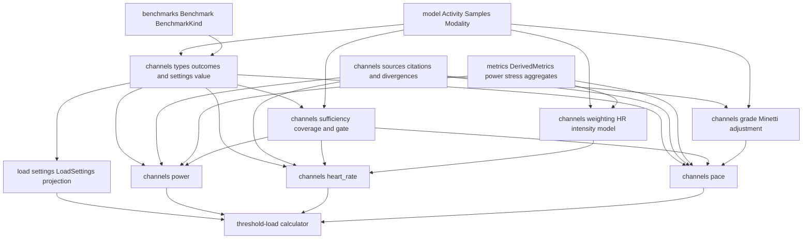
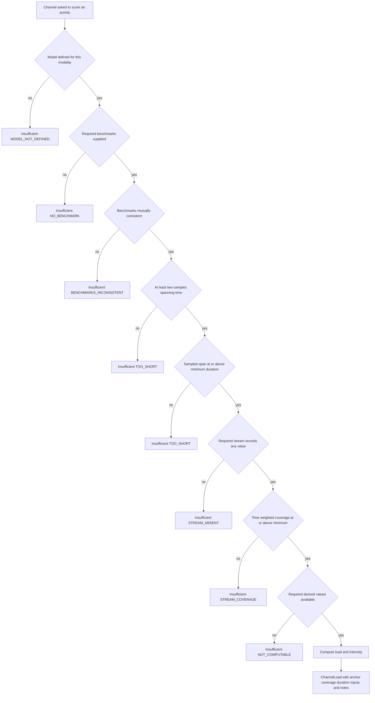
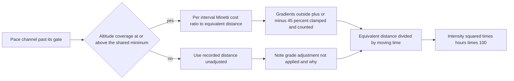

# Technical Design — load-channels

## Overview

**Purpose**: This feature delivers the **arithmetic of a single training-load
channel**, three times over. Given one activity, its already-derived metrics,
one already-resolved threshold benchmark and one resolved sufficiency
configuration, each channel returns either a load value on the shared "one hour
at threshold = 100" scale — Power via Coggan NP → IF → TSS, Heart Rate via
Banister TRIMP normalized to LTHR, Pace via grade-adjusted speed against a
threshold pace — or a typed statement of why no honest value exists. Nothing in
this layer reads a file, consults a clock, prompts, or decides which number
wins.

**Users**: the `threshold-load` calculator, which computes every channel and
selects one; `activity-qa-flags`, which compares channel outputs against each
other; and the reviewer, for whom every constant in the layer names its source
and states how well that source was verified.

**Impact**: adds a new pure leaf package `fitdocs/load/channels/` and one
member on the existing `LoadSettings`. It changes **no** shipped behavior: no
document, no rendered metric, and no `metrics/` definition moves. The shipped
`normalized_power`, `power_tss`, `moving_time_s` and `trimp` are consumed
exactly as they are, which is what makes a later re-sourcing of the TRIMP
coefficients move the shipped metric and this layer's heart-rate load together.

### Goals

- Three independent, verifiable channel computations sharing one result
  vocabulary and one scale invariant: one hour at threshold scores exactly 100.
- One **intensity semantic** across all three channels, stated once and tested at
  more than one point: `load == (scored_duration_s / 3600) × intensity² × 100`
  holds identically for power, heart rate and pace, so a downstream comparison of
  two channels' intensities compares like with like at every effort, not only at
  threshold.
- An explicit data-sufficiency gate measured on the same time domain the load
  itself accumulates over, so a partially-recorded activity yields a named
  reason rather than a confident wrong number.
- Zero fabrication: absence is a typed outcome at every boundary, never a zero
  and never a substituted default.
- Provenance as a first-class artifact: every constant carries a citation and a
  verification status, and every divergence from intervals.icu carries a reason.

### Non-Goals

- Channel selection, priority, fallback, arbitration, or any calculator.
- QA flags, cadence-lock detection, divergence verdicts, staleness verdicts.
- Benchmark resolution, the modality→discipline mapping, document rendering,
  frontmatter or payload.
- Re-sourcing the shipped TRIMP coefficients; a modelled running power
  (Stryd RSS / GOVSS / Skiba); a build-time power-calibrated HR regression; a
  strength-training load; any aggregation over time.

## Boundary Commitments

### This Spec Owns

- The channel result vocabulary: `ChannelId`, `ChannelLoad`,
  `ChannelInsufficient`, the closed `InsufficiencyReason` set, and
  `StreamCoverage`.
- **The intensity semantic** shared by all three channels —
  `load == hours × intensity² × 100` — and therefore the definition of each
  channel's reported `intensity`, including the heart-rate channel's square root.
  Downstream specs consume this guarantee; none of them may redefine it.
- The definition of stream coverage and the sufficiency gate that consumes it,
  including the minimum-duration floor.
- `SufficiencySettings` (the pure value type), its documented defaults, and the
  projection of the `[load.sufficiency]` sub-table onto the existing
  `LoadSettings`.
- The three channel computations and their anchoring arithmetic, including the
  seconds-per-kilometre → metres-per-second conversion of a threshold pace.
- Grade adjustment: the energy-cost model, its clamping rule, its altitude
  smoothing, and the "not applied" degradation path.
- The `HeartRateIntensityModel` seam and its single shipped implementation.
- The provenance record: `Citation`, `VerificationStatus`, the named citations
  for every constant this layer introduces, and the recorded divergences from
  intervals.icu.

### Out of Boundary

- `metrics/power.py`, `metrics/stress.py`, `metrics/aggregates.py` and every
  value they produce — consumed unchanged, never edited. In particular the
  Banister coefficients and the 30 s normalized-power window are not touched.
- `fitdocs/benchmarks.py`, `load/profile.py`, `ProfileView` and everything about
  where a benchmark comes from or which one applies to a date.
- `LoadResult`, `LoadOutcome`, the registry, arbitration, `render.py`,
  `docedit.py`, `contract.py`, `engine.py` — `training-load`'s update.
- Any `[load]` key other than the `sufficiency` sub-table, and any second
  reader of the settings file.
- The QA flag layer's inputs, thresholds and outputs.

### Allowed Dependencies

- Standard library only for new behavior: `dataclasses`, `enum`, `math`,
  `typing`.
- `fitdocs.model` (`Activity`, `Modality`, `Samples`), `fitdocs.metrics`
  (`DerivedMetrics`, `power.normalized_power`, `stress.power_tss`,
  `stress.trimp`), `fitdocs.benchmarks` (`Benchmark`, `BenchmarkKind`).
- `fitdocs.metrics.sources.weighting_for` (task 2.1, `weighting.py`): forced
  by `stress.trimp`'s caller-resolved `weighting: WeightingPair` parameter --
  the seam must obtain a `WeightingPair` to pass in, and `weighting_for` is
  how the metrics layer's own default (Req 17.2) is resolved. `weighting.py`
  calls it with `None` unconditionally (no athlete input reaches the seam),
  so this dependency is read-only lookup, not a second source of arithmetic;
  it is declared here because it was previously assumed rather than named.
- Dependency direction, strictly one way and enforced by review:

  ```
  model / benchmarks / metrics  →  channels.sources
                                →  channels.types
                                →  channels.sufficiency | channels.weighting | channels.grade
                                →  channels.power | channels.heart_rate | channels.pace
  channels.types  →  load.settings          (settings imports channels; never the reverse)
  ```

- No module under `fitdocs/load/channels/` imports `fitdocs.load.settings`,
  `fitdocs.load.types`, `fitdocs.load.engine`, `fitdocs.load.registry`,
  `fitdocs.load.profile`, `fitdocs.cli`, or `fitdocs.render`.

### Revalidation Triggers

- Any change to `ChannelLoad`, `ChannelInsufficient` or the
  `InsufficiencyReason` set → `threshold-load` (selection and skip reporting)
  and `activity-qa-flags` (divergence comparison) re-check.
- Any change to the **intensity semantic** (1.11) — a channel reporting an
  intensity that no longer satisfies `load == hours × intensity² × 100` →
  `activity-qa-flags`' divergence check loses its premise outright and
  `threshold-load`'s single `"Intensity"` label in `inputs_used` starts meaning
  two things at once. Both re-check before any such change lands.
- Any change to the coverage definition or the gate's semantics → every computed
  load can change; both downstream specs re-check, and the workout document's
  displayed coverage table becomes worth re-reconciling.
- Any change to `SufficiencySettings`' shape or to the `[load.sufficiency]`
  keys → the sibling specs sharing the `[load]` table.
- The fit-ingest update to `metrics/stress.py` → the heart-rate channel's
  numeric output changes with it by design; if that update makes the weighting
  sex-dependent, this feature's weighting seam needs an athlete-sex input it
  does not currently have.
- `training-load`'s redefinition of `LoadCalculator.compute`'s parameter list →
  `threshold-load`'s call sites into this layer, not this layer's signatures.

## Architecture

### Existing Architecture Analysis

Four shipped facts determine the design.

1. **`fitdocs.metrics` already holds the primitives and deliberately holds no
   methodology.** `power.normalized_power` pins the 30 s trailing rolling mean,
   the partial first window and the `None`→0 resample; `stress.power_tss`
   implements `duration × NP × IF / (FTP × 3600) × 100`; `stress.trimp`
   implements the clamped HR-reserve Banister sum; `aggregates.moving_time_s`
   implements session-timer-preferred moving time. `stress.py`'s own docstring
   states that methodology lives downstream. Anchoring and sufficiency are
   methodology, so they land here and the primitives are reused verbatim.
2. **`DerivedMetrics` is already computed once per activity and threaded to
   calculators.** Consuming `normalized_power_w` and `moving_time_s` from it
   rather than recomputing guarantees the number a document displays and the
   number a load was built from are the same number.
3. **`DerivedMetrics.trimp` is *not* usable as the HR channel's input**: the
   facade computes it from the **flat** athlete-input keys, while this layer
   must anchor on the **dated** benchmarks. The channel therefore calls
   `stress.trimp` directly with the benchmark values.
4. **Absence is already modelled consistently**: every metric is `X | None`,
   presence is tested with `is not None`, and a recorded `0` is real data. This
   layer inherits all three rules unchanged.

Patterns preserved: frozen dataclasses with tuple fields; `StrEnum` vocabularies;
closed unions folded exhaustively; pure functions with documented pre/post
conditions; `mypy --strict`.

### Architecture Pattern & Boundary Map



**Architecture Integration**

- **Selected pattern**: a pure computation leaf with a shared result vocabulary
  and no polymorphic dispatch. The three channels share their *result* type, not
  a base class — their inputs genuinely differ (one benchmark for power and
  pace, three for heart rate), and an abstract base would force a bag-of-values
  parameter that erases the type safety the seam exists for.
- **Domain boundaries**: vocabulary (`types.py`) ≠ gating (`sufficiency.py`) ≠
  physiological weighting (`weighting.py`) ≠ terrain model (`grade.py`) ≠
  anchoring arithmetic (the three channel modules) ≠ configuration
  (`load/settings.py`). No two own the same decision. Grade adjustment is split
  from the pace channel's anchoring math on purpose: the fuzzy part and the
  exact part are separately reviewable and separately replaceable (Req 7.8).
- **New components rationale**: `sources.py` exists because Req 8 makes
  provenance a testable artifact rather than a comment convention;
  `weighting.py` exists because roadmap decision 7 requires a substitutable
  seam; `sufficiency.py` exists because one gating rule is shared by three
  channels and must not be re-implemented three times.
- **Steering compliance**: absent data is `None`/insufficiency, never `0`; all
  arithmetic deterministic and LLM-free; no I/O anywhere in the package;
  `mypy --strict`; dependencies point one way, `cli → render → load/metrics →
  ingest → model`, unchanged.

### Technology Stack

| Layer | Choice / Version | Role in Feature | Notes |
|-------|------------------|-----------------|-------|
| Domain / computation | Python 3.11+ stdlib (`dataclasses`, `enum.StrEnum`, `math`) | The whole layer | No new third-party dependency |
| Derived inputs | `fitdocs.metrics` (shipped) | NP, moving time, TRIMP | Consumed unchanged; the single definition of each |
| Benchmark values | `fitdocs.benchmarks` (shipped by `athlete-benchmarks`) | The anchors, with `measured_on` | Units fixed by key name; pace converted here |
| Config | `fitdocs.load.settings` (shipped by `training-load`) — `LoadSettings`, `DEFAULT_LOAD_SETTINGS`, `LoadSettingsError(SettingsError)` and the single reader `load_load_settings(document: Mapping[str, object], settings_file: Path) -> LoadSettings`, every `LoadSettings` field defaulted | Projects `[load.sufficiency]` | Extended, not duplicated; the module and that signature are `training-load`'s and are pinned, not re-declared here |
| CLI | `typer` (shipped) | Surfaces a bad sufficiency value at exit code 2 | Inherited: `LoadSettingsError` subclasses `SettingsError` |

## File Structure Plan

### Directory Structure

```
src/fitdocs/load/channels/
├── __init__.py       # Public surface of the layer: re-exports the vocabulary,
│                     #   the three compute entry points, and the HR model seam.
│                     #   No logic, no registration side effect.
├── sources.py        # Citation, VerificationStatus, Divergence; the named
│                     #   provenance records every constant in the layer points at.
├── types.py          # ChannelId, InsufficiencyReason, StreamCoverage,
│                     #   ChannelLoad, ChannelInsufficient, ChannelOutcome,
│                     #   SufficiencySettings and its defaults.
├── sufficiency.py    # Time-weighted coverage measurement and the one gate rule.
├── weighting.py      # HeartRateIntensityModel protocol + BanisterTrimpModel,
│                     #   both delegating to the shipped metrics.stress.trimp.
├── grade.py          # Minetti running cost ratio, index-aligned altitude
│                     #   smoothing, and grade-equivalent distance.
├── power.py          # Coggan NP -> IF -> TSS anchored to a dated FTP.
├── heart_rate.py     # Banister TRIMP -> HRSS anchored to a dated LTHR.
└── pace.py           # Grade-adjusted speed -> intensity -> load anchored to a
                      #   dated threshold pace.
```

### Modified Files

- `src/fitdocs/load/settings.py` (**owned by `training-load`**) — `LoadSettings`
  gains a `sufficiency: SufficiencySettings` member, defaulted like every other
  field; the single reader `load_load_settings(document, settings_file)` gains
  projection and validation of the `[load.sufficiency]` sub-table, raising the
  module's existing `LoadSettingsError`. The reader's signature does not change,
  no second reader is introduced, and the existing ignore-unknown-keys behavior
  is preserved.
- `tests/test_public_api.py` — gains a pin for `fitdocs.load.channels.__all__`
  and the members of the channel result types. This is the one test module a
  task modifies rather than owns outright.
- Tests (new): `tests/load/channels/__init__.py`, `test_types.py`,
  `test_sufficiency.py`, `test_weighting.py`, `test_grade.py`, `test_power.py`,
  `test_heart_rate.py`, `test_pace.py`, `test_worked_examples.py`,
  `test_intensity_semantic.py`, `test_insufficiency.py`, `test_sources.py`,
  `test_purity.py`.
- Tests (modified): `tests/load/test_settings.py` — the
  `[load.sufficiency]` projection and its validation matrix.

## System Flows

### One channel, start to finish



The order is fixed and identical across the three channels: **model
applicability → benchmarks → duration → stream presence → coverage → derived
values → compute**. Fixing it makes the reported reason deterministic when more
than one condition fails, which is what lets a downstream skip message be
stable across runs.

### Pace channel, grade branch



Missing altitude **degrades** the pace channel rather than failing it: an
unadjusted pace is a real measurement, and refusing to score a treadmill or
barometer-less run would be a fabricated absence rather than an honest one.
The result records which of the two paths produced it.

## Requirements Traceability

| Requirement | Summary | Components | Interfaces | Flows |
|-------------|---------|------------|------------|-------|
| 1.1, 1.2 | Three identified channels; exactly one of load or insufficiency | ChannelVocabulary, PowerChannel, HeartRateChannel, PaceChannel | `ChannelId`, `ChannelOutcome` | One channel |
| 1.3 | Computed result carries anchor, duration, coverage, inputs | ChannelVocabulary | `ChannelLoad` | One channel |
| 1.4, 1.5 | Typed reason with observed and required values; closed reason set | ChannelVocabulary | `ChannelInsufficient`, `InsufficiencyReason` | One channel |
| 1.6 | One hour at threshold scores exactly 100, all three channels | PowerChannel, HeartRateChannel, PaceChannel | `compute` | — |
| 1.7 | Channels independent | PowerChannel, HeartRateChannel, PaceChannel | `compute` | — |
| 1.8 | Never raises for absent or unusable data | SufficiencyGate, all three channels | `evaluate`, `compute` | One channel |
| 1.9 | Wrong benchmark kind is a programming error | ChannelVocabulary, all three channels | `require_kind` | — |
| 1.10 | Pure and deterministic; no I/O, clock, config, prompt, LLM | All channel components | package import graph | — |
| 1.11 | One intensity semantic: `load == hours × intensity² × 100` on every channel | ChannelVocabulary, PowerChannel, HeartRateChannel, PaceChannel | `ChannelLoad.intensity`, `compute` | One channel |
| 2.1, 2.8 | One gate rule, applied per channel before computing | SufficiencyGate | `evaluate` | One channel |
| 2.2, 2.3, 2.10 | Time-weighted coverage on raw recorded samples; recorded zero counts | SufficiencyGate | `stream_coverage` | — |
| 2.4 | Wholly absent stream is a distinct reason | SufficiencyGate | `evaluate` | One channel |
| 2.5, 2.6 | Coverage and duration failures name observed and required | SufficiencyGate | `ChannelInsufficient` | One channel |
| 2.7 | Coverage and duration reported on the passing result too | SufficiencyGate, ChannelVocabulary | `StreamCoverage`, `ChannelLoad` | One channel |
| 2.9 | Fewer than two samples, or zero span, is insufficiency | SufficiencyGate | `evaluate` | One channel |
| 3.1, 3.2, 3.3 | Keys read from the load table; per-channel override; documented defaults | LoadSettingsExtension, ChannelVocabulary | `SufficiencySettings`, `minimum_for` | — |
| 3.4, 3.5, 3.6, 3.8 | Value and shape validation as a configuration error before any write | LoadSettingsExtension | `LoadSettingsError` | — |
| 3.7 | Extends the single existing reader; unknown keys ignored | LoadSettingsExtension | `load_load_settings` (`training-load`'s pinned signature) | — |
| 3.9 | Channels receive resolved configuration, never read it | ChannelVocabulary, all three channels | `SufficiencySettings` parameter | — |
| 3.10 | Default coverage matches a cited published precedent | ProvenanceRecord, ChannelVocabulary | `TRAININGPEAKS_COVERAGE_GATE` | — |
| 4.1, 4.3 | Coggan NP → IF → TSS reusing the shipped definitions | PowerChannel | `power.compute` | One channel |
| 4.2, 4.4 | Anchors on the dated FTP; absent means insufficiency, never a default | PowerChannel | `power.compute` | One channel |
| 4.5 | Underivable NP or duration is not-computable | PowerChannel | `power.compute` | One channel |
| 4.6 | Requires the power stream; gated | PowerChannel, SufficiencyGate | `evaluate` | One channel |
| 4.7 | Any modality that records power, discipline recorded | PowerChannel | `ChannelLoad.inputs_used` | — |
| 4.8 | Reproduces published worked examples | PowerChannel, ProvenanceRecord | `COGGAN_TSS` | — |
| 4.9 | Recorded running watts; divergence from intervals.icu recorded | PowerChannel, ProvenanceRecord | `DIVERGENCES` | — |
| 5.1 | HRSS normalized against one hour at LTHR | HeartRateChannel | `heart_rate.compute` | One channel |
| 5.2 | Requires LTHR, resting and maximum HR; names the missing one | HeartRateChannel | `heart_rate.compute` | One channel |
| 5.3 | Mutually inconsistent benchmarks are a distinct reason | HeartRateChannel | `heart_rate.compute` | One channel |
| 5.4, 5.5, 5.6 | One training-impulse definition for value and reference; coefficients untouched | HeartRateIntensityModel | `BanisterTrimpModel` | — |
| 5.7, 5.8 | Substitutable weighting seam, exactly one implementation | HeartRateIntensityModel | `HeartRateIntensityModel` | — |
| 5.9 | Requires the heart-rate stream; gated | HeartRateChannel, SufficiencyGate | `evaluate` | One channel |
| 5.10 | Worked example and coefficient-invariance property | HeartRateIntensityModel, HeartRateChannel | `BanisterTrimpModel` | — |
| 5.11 | HR intensity is the **square root** of the impulse ratio; the load is unchanged; divergence recorded | HeartRateChannel, ProvenanceRecord | `heart_rate.compute`, `DIVERGENCES` | One channel |
| 6.1, 6.9 | Grade-adjusted speed → intensity → load; inputs reported | PaceChannel | `pace.compute` | Pace grade |
| 6.2 | Threshold pace converted from seconds per kilometre here | PaceChannel | `pace.compute` | — |
| 6.3, 6.4 | Anchors on the dated threshold pace; absent means insufficiency | PaceChannel | `pace.compute` | One channel |
| 6.5, 6.6 | Requires the distance stream; underivable duration or distance is not-computable | PaceChannel, SufficiencyGate | `evaluate` | One channel |
| 6.7 | Running only; other modality is model-not-defined | PaceChannel | `pace.compute` | One channel |
| 6.8 | Matches the published intervals.icu formulation including moving time | PaceChannel, ProvenanceRecord | `INTERVALS_ICU_PACE_LOAD`, `DIVERGENCES` | — |
| 7.1, 7.2, 7.3 | Cited energy-cost model; gradient from smoothed altitude and distance | GradeAdjustment, ProvenanceRecord | `running_cost_ratio`, `smoothed_altitude` | Pace grade |
| 7.4, 7.5 | Clamp outside the validated range; degenerate interval treated as level | GradeAdjustment | `running_cost_ratio`, `equivalent_distance` | Pace grade |
| 7.6 | Absent or low-coverage altitude degrades rather than fails | PaceChannel, GradeAdjustment | `GradeAdjustment.applied` | Pace grade |
| 7.7 | Never alters distance, duration or any measured value | GradeAdjustment | `GradeAdjustment` | Pace grade |
| 7.8 | Separate unit from the anchoring arithmetic | GradeAdjustment, PaceChannel | module split | — |
| 7.9 | Running only; walking form read but not implemented (scope, not sourcing), recorded | GradeAdjustment, ProvenanceRecord | `MINETTI_2002` | — |
| 8.1, 8.2, 8.3 | Every constant cited with a verification status | ProvenanceRecord | `Citation`, `VerificationStatus` | — |
| 8.4 | A worked-example test per channel | PowerChannel, HeartRateChannel, PaceChannel | test suite | — |
| 8.5 | Divergences from intervals.icu recorded with reasons | ProvenanceRecord | `Divergence`, `DIVERGENCES` | — |
| 8.6 | Disputed coefficients consumed, never restated | HeartRateIntensityModel | `BanisterTrimpModel` | — |
| 8.7 | Cross-channel intensity agreement asserted at more than one intensity | PowerChannel, HeartRateChannel, PaceChannel | test suite | — |
| 8.8 | Citation keys unique; divergence behavior names unique | ProvenanceRecord | `CITATIONS`, `DIVERGENCES` | — |
| 8.9, 8.10 | A named-exception variant of fit-ingest Req 15.4's bar (maintainer ruling 2026-07-27: acceptable); a new secondary attestation forbidden where a defining work exists, but an unobtainable primary text may ship as a tracked exception; an exception names its search | ProvenanceRecord | `BLOCKED_CITATIONS`, `BANISTER_TRIMP.note` | — |
| 9.1, 9.2, 9.3, 9.4, 9.5, 9.6, 9.7 | No selection, flags, documents, benchmark resolution, mapping, models, registry | All components, PublicSurfacePin | package import graph, `__all__` | — |
| 9.8 | Shipped derived-metric definitions unchanged | HeartRateIntensityModel, PowerChannel, PaceChannel | `metrics.*` consumed read-only | — |

## Components and Interfaces

| Component | Domain/Layer | Intent | Req Coverage | Key Dependencies (P0/P1) | Contracts |
|-----------|--------------|--------|--------------|--------------------------|-----------|
| ProvenanceRecord | Leaf (`sources.py`) | Citations, verification statuses and recorded divergences | 3.10, 4.8, 4.9, 5.11, 6.8, 7.1, 7.9, 8.1, 8.2, 8.3, 8.5, 8.8 | none | State |
| ChannelVocabulary | Leaf (`types.py`) | The result union, the closed reason set, the sufficiency value type | 1.1–1.5, 1.9, 1.11, 2.7, 3.2, 3.3, 3.9 | `fitdocs.benchmarks` (P0), `fitdocs.model` (P1) | State |
| SufficiencyGate | Domain (`sufficiency.py`) | Time-weighted coverage and the one gating rule | 1.8, 2.1–2.10 | ChannelVocabulary (P0), `fitdocs.model` (P0) | Service |
| HeartRateIntensityModel | Domain (`weighting.py`) | The substitutable heart-rate weighting seam and its one implementation | 5.4–5.8, 5.10, 8.6, 9.8 | `fitdocs.metrics.stress` (P0), `fitdocs.model` (P0) | Service |
| GradeAdjustment | Domain (`grade.py`) | Minetti cost ratio, altitude smoothing, grade-equivalent distance | 7.1–7.5, 7.7, 7.8, 7.9 | ProvenanceRecord (P1), `fitdocs.model` (P0) | Service |
| PowerChannel | Channel (`power.py`) | Coggan NP → IF → TSS against a dated FTP | 1.6, 1.7, 1.11, 4.1–4.9, 8.7 | SufficiencyGate (P0), `fitdocs.metrics` (P0) | Service |
| HeartRateChannel | Channel (`heart_rate.py`) | Banister TRIMP → HRSS against a dated LTHR | 1.6, 1.7, 1.11, 5.1–5.3, 5.9, 5.10, 5.11, 8.7 | HeartRateIntensityModel (P0), SufficiencyGate (P0) | Service |
| PaceChannel | Channel (`pace.py`) | Grade-adjusted speed → intensity → load against a dated threshold pace | 1.6, 1.7, 1.11, 6.1–6.9, 7.6, 8.7 | GradeAdjustment (P0), SufficiencyGate (P0), `fitdocs.metrics` (P0) | Service |
| LoadSettingsExtension | Config (`load/settings.py`, owned by `training-load`) | Projects and validates the `[load.sufficiency]` sub-table | 3.1–3.8 | ChannelVocabulary (P0), `fitdocs.settings` (P0) | State |
| ChannelSurface | Package (`channels/__init__.py`) | The layer's public surface, re-export only | 9.1–9.7 | all of the above (P0) | State |
| PublicSurfacePin | Test contract (`tests/test_public_api.py`) | Pins the new surface against accidental drift | 9.1–9.7 | ChannelSurface (P0) | State |

### Leaf — `src/fitdocs/load/channels/sources.py`

#### ProvenanceRecord

| Field | Detail |
|-------|--------|
| Intent | Make "where did this number come from, and how sure are we" a typed, testable artifact |
| Requirements | 3.10, 4.8, 4.9, 5.11, 6.8, 7.1, 7.9, 8.1, 8.2, 8.3, 8.5, 8.8, 8.9, 8.10 |

**Responsibilities & Constraints**

- Holds no arithmetic. Every numeric constant elsewhere in the package names one
  of these records in its docstring, so a reviewer can grep the whole layer's
  provenance from one file.
- Distinguishes **verified against the source's own text** from **attested by
  consistent secondary literature**, because the refuted-coefficient episode was
  exactly a secondary attestation presented as a primary one (8.2).
- Carries a third status, **chosen by fitdocs and justified by a recorded
  measurement**, defined here up front rather than bolted on later (8.2). No
  constant *this* feature introduces uses it — `activity-qa-flags` is the only
  consumer, and it only *uses* the member.
- _(revised 2026-07-27, queue 2026-07-26-citation-vocabulary-diverges-across-
  layers)_ Holds itself to a **named-exception variant** of fit-ingest Req
  15.4's bar (8.9, 8.10), not the identical bar: a new citation may not be
  recorded as `SECONDARY_ATTESTATION` in place of a primary-text verification
  where a published work defines the value (8.9), but unlike 15.4 — which
  blocks fit-ingest's completion outright for an unobtainable primary text,
  with no exception set — 8.10 lets such a citation ship as a named, tracked
  exception in `BLOCKED_CITATIONS` instead of blocking this feature. That
  residual difference is a maintainer decision, confirmed by ruling on
  2026-07-27 (queue 2026-07-26-citation-vocabulary-diverges-across-layers:
  "the tracked-exception variant is acceptable"), not an oversight, and is
  recorded here rather than left to read as identical to 15.4.
  `COGGAN_TSS`, `MINETTI_2002` and `INTERVALS_ICU_PACE_LOAD` were re-sourced
  to `PRIMARY_TEXT` 2026-07-27; `BANISTER_TRIMP` — the one citation for which
  a defining published work exists (Banister 1991; Morton, Fitz-Clarke &
  Banister 1990) — followed 2026-07-29 once both texts were obtained and
  read in full (queue 2026-07-27-banister-morton-primary-texts-obtained;
  `docs/reference/banister-trimp-primary-sources.md`). `BLOCKED_CITATIONS`
  is now empty: it stays defined as a frozenset of keys carrying an
  explicitly tracked exception rather than a silent downgrade, guarded by a
  test that fails on any `SECONDARY_ATTESTATION` citation absent from it,
  ready for the next citation that genuinely cannot be obtained.
- Records each intentional divergence from intervals.icu with its reason (8.5),
  including the heart-rate **intensity** divergence introduced by 5.11.

**Dependencies**: none outbound. Inbound: `grade.py`, `power.py`,
`heart_rate.py`, `pace.py`, `types.py` (P1 each — documentation references).

**Contracts**: State [x]

##### State Management

```python
class VerificationStatus(StrEnum):
    PRIMARY_TEXT = "primary_text"
    """The value was read from the cited work's own text."""
    SECONDARY_ATTESTATION = "secondary_attestation"
    """Consistently attested by independent secondary sources; the primary text
    was not obtainable. Never present this as PRIMARY_TEXT."""
    FITDOCS_MEASURED = "fitdocs_measured"
    """Chosen by fitdocs and justified by a recorded measurement rather than by a
    published source. No constant in *this* package carries it; it exists so a
    measured default elsewhere in fitdocs can be recorded honestly through this
    same vocabulary. Never present this as PRIMARY_TEXT."""

@dataclass(frozen=True)
class Citation:
    key: str
    authors: str
    year: int
    work: str
    locator: str | None
    verification: VerificationStatus
    note: str | None = None

@dataclass(frozen=True)
class Divergence:
    behavior: str
    intervals_icu: str
    fitdocs: str
    reason: str

COGGAN_TSS: Final[Citation]
BLOCKED_CITATIONS: Final[frozenset[str]]
BANISTER_TRIMP: Final[Citation]
MINETTI_2002: Final[Citation]
INTERVALS_ICU_PACE_LOAD: Final[Citation]
INTERVALS_ICU_HRSS: Final[Citation]
TRAININGPEAKS_COVERAGE_GATE: Final[Citation]

CITATIONS: Final[tuple[Citation, ...]]
DIVERGENCES: Final[tuple[Divergence, ...]]
```

- Postconditions: every `Citation` in `CITATIONS` has a non-empty `authors`,
  `work` and `verification` (8.1, 8.3). _(revised 2026-07-27, then again
  2026-07-29, queue 2026-07-27-banister-morton-primary-texts-obtained)_ No
  citation in `CITATIONS` currently carries `SECONDARY_ATTESTATION`;
  `BLOCKED_CITATIONS` is pinned empty (8.9, 8.10) rather than to
  `BANISTER_TRIMP`, since that citation was re-sourced to `PRIMARY_TEXT`
  2026-07-29 once both Banister (1991) and Morton, Fitz-Clarke & Banister
  (1990) were obtained and read in full. `COGGAN_TSS`, `BANISTER_TRIMP`,
  `MINETTI_2002` and `INTERVALS_ICU_PACE_LOAD` are all `PRIMARY_TEXT`,
  alongside the two that were already `PRIMARY_TEXT`. `MINETTI_2002`'s note
  records that the walking form of the model was read but is not
  implemented (7.9) — a scope decision, not a sourcing gap. No citation in
  `CITATIONS` carries `FITDOCS_MEASURED`.
- Invariants: `DIVERGENCES` contains at minimum the recorded-running-watts
  divergence (4.9), the variability-blind pace formulation (6.8) and the
  heart-rate-intensity divergence (5.11). Uniqueness is asserted over fields that
  exist: every `Citation.key` in `CITATIONS` is unique, and every
  `Divergence.behavior` in `DIVERGENCES` is unique — `Divergence` deliberately
  has no `key` field, its `behavior` being the name a consumer would use (8.8).

**Implementation Notes**

- Integration: `CITATIONS` and `DIVERGENCES` are documentation payloads, not
  rendered output — nothing in this feature emits them into a document (9.3).
- Validation: a test asserts that every `Final` numeric constant module in the
  package names a citation key in its module docstring, keeping 8.3 enforceable
  rather than aspirational.

### Leaf — `src/fitdocs/load/channels/types.py`

#### ChannelVocabulary

| Field | Detail |
|-------|--------|
| Intent | One result union and one closed reason set for all three channels |
| Requirements | 1.1, 1.2, 1.3, 1.4, 1.5, 1.9, 1.11, 2.7, 3.2, 3.3, 3.9 |

**Responsibilities & Constraints**

- Frozen dataclasses, tuple fields, `StrEnum` identifiers — so results are
  hashable, deterministic and comparable for equality in tests (1.10).
- `ChannelOutcome` is a **closed** two-variant union folded exhaustively
  downstream, mirroring `LoadOutcome`'s shipped `assert_never` discipline.
- Holds the sufficiency **value** type and its defaults; the *reading* of those
  values is `load/settings.py`'s and lives outside this module so channels never
  depend on configuration machinery (3.9).

**Dependencies**

- Outbound: `fitdocs.benchmarks.Benchmark`, `BenchmarkKind` (P0);
  `fitdocs.model.Modality` for message text (P1).
- Inbound: every other module in the package, and `load/settings.py` (P0).

**Contracts**: State [x]

##### State Management

```python
class ChannelId(StrEnum):
    POWER = "power"
    HEART_RATE = "heart_rate"
    PACE = "pace"

class InsufficiencyReason(StrEnum):
    NO_BENCHMARK = "no_benchmark"
    BENCHMARKS_INCONSISTENT = "benchmarks_inconsistent"
    STREAM_ABSENT = "stream_absent"
    STREAM_COVERAGE = "stream_coverage"
    TOO_SHORT = "too_short"
    MODEL_NOT_DEFINED = "model_not_defined"
    NOT_COMPUTABLE = "not_computable"

@dataclass(frozen=True)
class StreamCoverage:
    stream: str
    covered_s: float
    total_s: float

    @property
    def fraction(self) -> float: ...

@dataclass(frozen=True)
class ChannelLoad:
    channel: ChannelId
    load: float
    intensity: float
    """Threshold-relative effort, dimensionless, exactly 1.0 at threshold.

    ONE semantic for all three channels, stated here and nowhere else:

        load == (scored_duration_s / 3600) * intensity ** 2 * 100

    Power reports `np / ftp`, pace reports `gap_speed / threshold_speed`, and
    heart rate reports the *square root* of its impulse ratio precisely so that
    this relation holds identically on all three (1.11, 5.11).
    """
    anchor: Benchmark
    scored_duration_s: float
    coverage: StreamCoverage
    inputs_used: tuple[tuple[str, str], ...]
    notes: tuple[str, ...] = ()

@dataclass(frozen=True)
class ChannelInsufficient:
    channel: ChannelId
    reason: InsufficiencyReason
    detail: str
    observed: float | None = None
    required: float | None = None

ChannelOutcome = ChannelLoad | ChannelInsufficient

DEFAULT_MIN_STREAM_COVERAGE: Final[float] = 0.80
DEFAULT_MIN_DURATION_S: Final[int] = 60

@dataclass(frozen=True)
class SufficiencySettings:
    min_duration_s: int = DEFAULT_MIN_DURATION_S
    min_stream_coverage: float = DEFAULT_MIN_STREAM_COVERAGE
    power_min_stream_coverage: float | None = None
    hr_min_stream_coverage: float | None = None
    pace_min_stream_coverage: float | None = None

    def minimum_for(self, channel: ChannelId) -> float: ...

def require_kind(benchmark: Benchmark, expected: BenchmarkKind) -> None: ...
```

- Preconditions: `StreamCoverage.total_s > 0` — the gate never constructs one
  otherwise (2.9). `minimum_for` accepts any `ChannelId`.
- Postconditions: `fraction == covered_s / total_s`, in `[0, 1]` (2.2).
  `minimum_for` returns the channel's override when set and the shared minimum
  otherwise (3.2). `require_kind` returns `None` when the kinds match and raises
  `ValueError` naming both kinds otherwise (1.9).
- Invariants: `ChannelLoad` always carries a coverage and a duration, including
  when the gate passed comfortably (2.7); `ChannelInsufficient` carries
  `observed` and `required` for exactly the two threshold reasons
  (`STREAM_COVERAGE`, `TOO_SHORT`) and may carry them for none of the others
  (1.4). **The intensity invariant** — `load == (scored_duration_s / 3600) ×
  intensity² × 100` within a relative tolerance of `1e-9` — holds for every
  `ChannelLoad` any channel returns, and is stated once here rather than three
  times in the channel modules (1.11).

**Implementation Notes**

- `DEFAULT_MIN_STREAM_COVERAGE` cites `TRAININGPEAKS_COVERAGE_GATE` (3.10).
  `DEFAULT_MIN_DURATION_S` is fitdocs' own and its docstring says so: 60 s is
  twice the 30 s window the shipped normalized-power algorithm needs, the
  longest window any channel depends on.
- `inputs_used` mirrors the shipped `LoadResult.inputs_used` shape — ordered
  `(label, value)` string pairs — so `threshold-load` can surface a channel's
  working without a second formatting vocabulary.

### Domain — `src/fitdocs/load/channels/sufficiency.py`

#### SufficiencyGate

| Field | Detail |
|-------|--------|
| Intent | Measure how much of an activity a stream actually covered, and decide whether that is enough |
| Requirements | 1.8, 2.1–2.10 |

**Responsibilities & Constraints**

- Coverage is **time-weighted**: for each consecutive sample pair with
  `dt = time_s[i+1] - time_s[i] > 0`, the interval counts as covered when the
  **earlier** sample carries a recorded value. That is precisely the
  accumulation domain of `metrics.stress.trimp`, so the reported fraction
  describes the span the load itself was built over (2.2).
- Measured on the raw ingested arrays — never on a resampled, forward-filled or
  gap-substituted series (2.3). Presence is `is not None`, so a recorded `0` W
  counts as covered (2.10).
- The gate never raises; every failure is a `ChannelInsufficient` (1.8).

**Dependencies**

- Outbound: ChannelVocabulary (P0), `fitdocs.model.Samples` (P0).
- Inbound: all three channels (P0).

**Contracts**: Service [x]

##### Service Interface

```python
def stream_coverage(
    samples: Samples, values: Sequence[object | None], *, stream: str
) -> StreamCoverage | None: ...

def evaluate(
    samples: Samples,
    values: Sequence[object | None],
    *,
    channel: ChannelId,
    stream: str,
    settings: SufficiencySettings,
    minimum: float | None = None,
) -> StreamCoverage | ChannelInsufficient: ...
```

- Preconditions: `values` is one of `samples`' own channel arrays, or a
  sequence aligned to it. `minimum`, when given, overrides
  `settings.minimum_for(channel)` — it exists for exactly one caller, the pace
  channel's *altitude* check, which is a refinement input rather than a channel
  of its own and must therefore be judged against the **shared** minimum rather
  than the pace channel's own override.
- Postconditions: `stream_coverage` returns `None` when there are fewer than two
  samples or the total positive `dt` is zero (2.9); otherwise a `StreamCoverage`
  whose `total_s` is the summed positive inter-sample intervals and whose
  `covered_s` is the subset whose earlier sample carries a value.
  `evaluate` returns, in this fixed order: `TOO_SHORT` when there is no
  measurable span or the span is below `settings.min_duration_s` (2.6, 2.9);
  `STREAM_ABSENT` when `covered_s == 0` (2.4) — which includes the degenerate
  case of a stream whose only recorded value sits on the final sample, since no
  interval is governed by it and no load could be accumulated from it either;
  `STREAM_COVERAGE` with
  `observed = fraction` and `required` equal to `minimum` when supplied and
  `settings.minimum_for(channel)` otherwise, when the fraction is below that
  value (2.5); otherwise the `StreamCoverage` itself (2.7).
- Invariants: one implementation serves all three channels, differing only in
  `values`, `channel`, `stream` and the optional explicit `minimum` (2.8); the
  function reads nothing and mutates nothing.

**Implementation Notes**

- Integration: a device *pause* appears as one long interval whose earlier
  sample does carry a value, so it counts as covered and does not penalize the
  gate — matching shipped `trimp`, which credits the same interval. Documented
  at the definition, and flagged in `research.md` as a fit-ingest question.
- Risks: this figure can differ from the sample-count percentage the shipped
  document renderer displays under non-uniform sampling. Deliberate; the render
  layer is out of boundary (9.3).

### Domain — `src/fitdocs/load/channels/weighting.py`

#### HeartRateIntensityModel

| Field | Detail |
|-------|--------|
| Intent | The one substitutable seam through which heart rate becomes intensity |
| Requirements | 5.4, 5.5, 5.6, 5.7, 5.8, 5.10, 8.6, 9.8 |

**Responsibilities & Constraints**

- Delegates **both** the activity impulse and the one-hour reference to the
  shipped `metrics.stress.trimp`. The reference is obtained by scoring a
  synthetic one-hour, constant-heart-rate sample series with the same function,
  so numerator and denominator can never be weighted differently (5.5) and this
  module restates no coefficient (5.6, 8.6) and edits no shipped module (9.8).
- Exactly **one** implementation ships. There is no second implementer, no
  registry, no configuration key and no unreachable branch anticipating one
  (5.8). The Protocol exists as the channel's parameter type so the deferred
  build-time regression is a later addition rather than a rewrite (5.7), which
  is roadmap decision 7 and is cited in the module docstring.

**Dependencies**

- Outbound: `fitdocs.metrics.stress.trimp` (P0), `fitdocs.metrics.sources.weighting_for` (P0, called with `None` unconditionally), `fitdocs.model.Samples` (P0).
- Inbound: HeartRateChannel (P0).

**Contracts**: Service [x]

##### Service Interface

```python
class HeartRateIntensityModel(Protocol):
    model_id: str

    def activity_impulse(
        self, samples: Samples, *, resting_hr: int, max_hr: int
    ) -> float | None: ...

    def hourly_impulse_at(
        self, heart_rate: int, *, resting_hr: int, max_hr: int
    ) -> float | None: ...

@dataclass(frozen=True)
class BanisterTrimpModel:
    model_id: str = "banister-trimp"

    def activity_impulse(...) -> float | None: ...
    def hourly_impulse_at(...) -> float | None: ...

BANISTER_TRIMP_MODEL: Final[BanisterTrimpModel]
```

- Preconditions: `max_hr > resting_hr` and `resting_hr < heart_rate <= max_hr`
  — the channel validates this before calling (5.3).
- Postconditions: `activity_impulse` returns exactly what the shipped `trimp`
  returns for the same inputs, including `None` for an entirely unrecorded
  channel. `hourly_impulse_at` returns the impulse of 3600 s spent at
  `heart_rate`, computed through the same function; it is strictly positive
  whenever the preconditions hold.
- Invariants: scaling the shipped weighting's multiplicative coefficient by any
  positive factor scales both return values by that factor, so the ratio the
  channel forms is unchanged — the property pinned by 5.10.

**Implementation Notes**

- Integration: the synthetic series is a two-sample `Samples` at offsets
  `0.0` and `3600.0` with the heart rate on both and every other channel
  `(None, None)` — the smallest input the shipped function integrates a full
  hour over. The construction is documented so nobody mistakes it for test code.
- Risks: if the fit-ingest re-sourcing makes the weighting sex-dependent, a
  sex-aware model becomes a second implementer of this Protocol and an athlete
  input this feature does not have. Recorded as a revalidation trigger.

### Domain — `src/fitdocs/load/channels/grade.py`

#### GradeAdjustment

| Field | Detail |
|-------|--------|
| Intent | Turn recorded terrain into an equivalent level-ground distance, or decline to |
| Requirements | 7.1, 7.2, 7.3, 7.4, 7.5, 7.7, 7.8, 7.9 |

**Responsibilities & Constraints**

- Applies Minetti's published energy-cost-of-**running** polynomial as the ratio
  `Cr(i) / Cr(0)`, citing `MINETTI_2002` at the coefficient tuple (7.1). The
  walking form of the same model was read alongside the running form (both
  appear in the same Fig. 1 caption) but is not implemented, by scope choice
  rather than for lack of a source (7.9, amended 2026-07-27).
- Gradients are clamped to the model's validated `±0.45` range rather than
  extrapolated, and each clamped interval is counted so the result can say so
  (7.4).
- Produces an *equivalent* distance used only as an intensity input; the
  activity's reported distance, duration and every other measured value are
  untouched (7.7).
- Kept separate from the pace channel's anchoring arithmetic so the fuzzy model
  and the exact scale contract are independently reviewable and replaceable
  (7.8).

**Dependencies**

- Outbound: ProvenanceRecord (P1), `fitdocs.model.Samples` (P0).
- Inbound: PaceChannel (P0).

**Contracts**: Service [x]

##### Service Interface

```python
MINETTI_RUNNING_COEFFICIENTS: Final[tuple[float, float, float, float, float, float]]
"""155.4, -30.4, -43.3, 46.3, 19.5, 3.6 -- descending powers of the gradient.
See sources.MINETTI_2002."""

MINETTI_LEVEL_COST_J_PER_KG_PER_M: Final[float] = 3.6
MINETTI_MAX_ABS_GRADIENT: Final[float] = 0.45
MIN_GRADIENT_DISTANCE_M: Final[float] = 1.0
ALTITUDE_SMOOTHING_WINDOW: Final[int] = 10

def running_cost_ratio(gradient: float) -> tuple[float, bool]: ...
def smoothed_altitude(
    altitude: Sequence[float | None],
) -> tuple[float | None, ...]: ...

@dataclass(frozen=True)
class GradeAdjustment:
    raw_distance_m: float
    equivalent_distance_m: float
    applied: bool
    clamped_intervals: int
    note: str | None

def equivalent_distance(
    samples: Samples, *, apply_grade: bool
) -> GradeAdjustment | None: ...
```

- Preconditions: `apply_grade` is the pace channel's already-made decision about
  altitude coverage; this module does not read configuration (3.9).
- Postconditions: `running_cost_ratio` returns `(Cr(i)/Cr(0), clamped)` with
  `i` clamped into `[-0.45, 0.45]` first (7.4); at `i == 0` it returns exactly
  `(1.0, False)`. `smoothed_altitude` returns a tuple the same length as its
  input — the mean of the non-`None` samples in the trailing window of width 10
  ending at each index, or `None` where that window holds no recorded sample
  (7.2, 7.3). `equivalent_distance` returns `None` when accumulated distance
  cannot be derived; otherwise `raw_distance_m` is the summed positive distance
  deltas and `equivalent_distance_m` is their cost-ratio-weighted sum when
  `apply_grade`, or exactly `raw_distance_m` with `applied = False` and a `note`
  otherwise (7.6).
- Invariants: an interval whose distance delta is not positive or is below
  `MIN_GRADIENT_DISTANCE_M` is treated as level, `i = 0` (7.5); no input array
  is mutated and no other measured value is derived or replaced (7.7);
  `apply_grade=False` yields `equivalent_distance_m == raw_distance_m` exactly.

**Implementation Notes**

- Integration: `smoothed_altitude` reproduces the width and trailing alignment
  of the shipped private helper in `metrics/aggregates.py` but emits an
  index-aligned tuple, because the shipped helper compacts its output and is
  private. The duplication is deliberate, documented, and does not change the
  shipped metric (9.8).
- Validation: the coefficient tuple is pinned by a test against the published
  values, and `running_cost_ratio` is checked at `i = 0` (exactly 1.0), at
  `±0.45` (the clamp boundary, not clamped) and beyond (clamped, flag set).
- Risks: one widely-mirrored transcription of the polynomial corrupts the linear
  term to `−165·i`; the docstring names the rejected variant so a future editor
  does not "fix" the correct value.

### Channel — `src/fitdocs/load/channels/power.py`

#### PowerChannel

| Field | Detail |
|-------|--------|
| Intent | Coggan NP → IF → TSS against the dated functional threshold power |
| Requirements | 1.6, 1.7, 1.11, 4.1–4.9, 8.7 |

**Responsibilities & Constraints**

- Composes shipped primitives only: `DerivedMetrics.normalized_power_w`,
  `DerivedMetrics.moving_time_s` and `metrics.stress.power_tss`. It restates
  neither the 30 s rolling window nor the TSS formula (4.3).
- Anchors exclusively on the `Benchmark` handed to it; no default, no estimate,
  no flat-key fallback (4.2, 4.4).
- Modality-agnostic: any activity that records power is scored, running
  included, and the anchoring discipline is reported in `inputs_used` (4.7).

**Dependencies**: SufficiencyGate (P0), ChannelVocabulary (P0),
`fitdocs.metrics.stress.power_tss` (P0), ProvenanceRecord (P1).

**Contracts**: Service [x]

##### Service Interface

```python
def compute(
    activity: Activity,
    metrics: DerivedMetrics,
    *,
    ftp: Benchmark | None,
    settings: SufficiencySettings,
) -> ChannelOutcome: ...
```

- Preconditions: `metrics` is the `DerivedMetrics` already computed for
  `activity`; `ftp`, when present, is of kind `ftp_watts` (enforced by
  `require_kind`, 1.9).
- Postconditions: `NO_BENCHMARK` when `ftp is None` or its value is not positive
  (4.4); the gate's verdict on the `power_w` stream when it fails (4.6);
  `NOT_COMPUTABLE` when normalized power or moving time is `None` (4.5);
  otherwise a `ChannelLoad` with `load = power_tss(np, moving, ftp)`,
  `intensity = np / ftp`, `scored_duration_s = moving`, and `inputs_used`
  carrying normalized power, FTP, the anchoring discipline and the measurement
  date (1.3, 4.7).
- Invariants: `np == ftp` and `moving == 3600` yields exactly `100.0` (1.6).
  `intensity = np / ftp` is the reference definition of the shared intensity
  semantic — the shipped `power_tss` is algebraically `hours × (np/ftp)² × 100`,
  so 1.11 holds here by construction and the other two channels are defined to
  match it (1.11).

**Implementation Notes**

- Verification cases (4.8): `IF = 210 / 280 = 0.75`;
  `7080 s, NP 183 W, FTP 215 W → TSS ≈ 142`;
  `5400 s, NP 220 W, FTP 250 W → TSS ≈ 116`; and the definitional
  `3600 s at FTP → 100.0`. Each names `COGGAN_TSS` in the test.
- The module docstring records the intervals.icu divergence: fitdocs computes a
  running power load from recorded watts (Apple Watch native, Stryd), data
  intervals.icu does not ingest natively (4.9).

### Channel — `src/fitdocs/load/channels/heart_rate.py`

#### HeartRateChannel

| Field | Detail |
|-------|--------|
| Intent | Banister TRIMP normalized to one hour at LTHR |
| Requirements | 1.6, 1.7, 1.11, 5.1, 5.2, 5.3, 5.9, 5.10, 5.11, 8.7 |

**Responsibilities & Constraints**

- `HRSS = impulse(activity) / impulse(one hour at LTHR) × 100` (5.1). Both terms
  come from the injected `HeartRateIntensityModel`, never from
  `DerivedMetrics.trimp` — which is computed from the *flat* athlete-input keys
  and would silently anchor on a different threshold.
- Reports `intensity = sqrt(impulse_ratio)`, where
  `impulse_ratio = (load / 100) / (scored_duration_s / 3600)` is the mean
  impulse rate relative to threshold (5.11). The square root is not cosmetic: it
  is what puts this channel on the **same** intensity semantic as the other two
  (1.11). See the note below — the load value is untouched by it.
- Requires all three heart-rate benchmarks and names the missing one (5.2);
  rejects mutually inconsistent ones without computing (5.3).

**Dependencies**: HeartRateIntensityModel (P0), SufficiencyGate (P0),
ChannelVocabulary (P0), ProvenanceRecord (P1).

**Contracts**: Service [x]

##### Service Interface

```python
def compute(
    activity: Activity,
    metrics: DerivedMetrics,
    *,
    lthr: Benchmark | None,
    resting_hr: Benchmark | None,
    max_hr: Benchmark | None,
    settings: SufficiencySettings,
    model: HeartRateIntensityModel = BANISTER_TRIMP_MODEL,
) -> ChannelOutcome: ...
```

- Preconditions: each supplied benchmark is of its matching kind
  (`require_kind`, 1.9).
- Postconditions: `NO_BENCHMARK` naming every absent one of the three (5.2);
  `BENCHMARKS_INCONSISTENT` when `max_hr <= resting_hr` or `lthr` does not lie
  in `(resting_hr, max_hr]` (5.3); the gate's verdict on the `heart_rate_bpm`
  stream when it fails (5.9); `NOT_COMPUTABLE` when either impulse is `None` or
  the reference is not positive; otherwise a `ChannelLoad` with
  `load = activity_impulse / hourly_impulse_at(lthr) × 100` and
  `intensity = sqrt((load / 100) / (scored_duration_s / 3600))` — the square
  root of the mean impulse rate relative to threshold, which is the value that
  satisfies `load == hours × intensity² × 100` and is therefore directly
  comparable to the power channel's `np / ftp` and the pace channel's
  `gap_speed / threshold_speed` **at every effort, not only at threshold**
  (1.11, 5.11) — where the scored duration is the gate's `covered_s`, the time
  the impulse actually integrated over, and `inputs_used` carrying the impulse,
  the reference, LTHR, resting and maximum heart rate and the anchor's
  measurement date.
- Invariants: an activity of one hour spent entirely at LTHR yields exactly
  `100.0` and an intensity of exactly `1.0` (1.6, 5.1) — `sqrt(1.0) == 1.0`, so
  the threshold identity is preserved; the result is unchanged when the shipped
  weighting's multiplicative coefficient is scaled by any positive factor
  (5.10); `load` is computed **before** and independently of `intensity` and is
  therefore numerically unaffected by 5.11 (see the note below).

**Implementation Notes**

- Verification cases (5.10, 8.4): the published TRIMP worked example — male,
  HRmax 200, HRrest 40, 30 min at 130 bpm → ≈ 31.5 — asserted against the
  shipped `trimp`, plus the one-hour-at-LTHR identity and the
  coefficient-invariance property (exercised by monkeypatching the shipped
  coefficient and asserting the HRSS is unchanged while the raw impulse moves).
- **The load value does not change under 5.11, and this is asserted, not
  assumed.** `load` is `activity_impulse / hourly_impulse_at(lthr) × 100` and
  reads no intensity; `intensity` is derived *from* `load` afterwards. The square
  root touches only the reported ratio. Worked numbers, resting 48 / max 190 /
  LTHR 165, one hour held at a constant rate:

  | HR bpm | load (unchanged) | impulse ratio (old intensity) | reported intensity `sqrt(ratio)` | power IF at the same load |
  |--------|------------------|-------------------------------|----------------------------------|---------------------------|
  | 120 | 33.5 | 0.335 | 0.579 | 0.579 |
  | 130 | 43.7 | 0.437 | 0.661 | 0.661 |
  | 140 | 56.1 | 0.561 | 0.749 | 0.749 |
  | 150 | 71.2 | 0.712 | 0.844 | 0.844 |
  | 165 | 100.0 | 1.000 | 1.000 | 1.000 |

  The last two columns now agree at every row; under the old definition they
  agreed only on the final one, which is why a threshold-only test could not see
  the defect (8.7).
- The module docstring records that intervals.icu computes the HRSS **load** the
  same way and requires the same three inputs, so the load is an interop match
  rather than a divergence — and records the one place fitdocs does diverge: the
  reported heart-rate **intensity**. intervals.icu publishes a heart-rate load
  definition and no heart-rate intensity definition, so there is no published
  value to match; fitdocs reports `sqrt(impulse_ratio)` rather than the impulse
  ratio so that one intensity semantic spans all three channels and downstream
  cross-channel comparison is valid away from threshold. That divergence is
  carried as a `Divergence` entry in `DIVERGENCES` with exactly that reason
  (5.11, 8.5).

### Channel — `src/fitdocs/load/channels/pace.py`

#### PaceChannel

| Field | Detail |
|-------|--------|
| Intent | Grade-adjusted speed against a threshold pace, on the same scale |
| Requirements | 1.6, 1.7, 1.11, 6.1–6.9, 7.6, 8.7 |

**Responsibilities & Constraints**

- Matches intervals.icu's published formulation:
  `intensity = gap_speed / threshold_speed`,
  `load = (moving_time / 3600) × intensity² × 100`, over **moving** time (6.1,
  6.8).
- Converts the benchmark from seconds per kilometre to metres per second itself
  — the store performs no conversion (6.2).
- Defined for the running modality only; any other modality yields
  `MODEL_NOT_DEFINED` naming that modality, without implying which channel
  should have been used instead (6.7, 9.1).
- Missing or thinly-covered altitude degrades to unadjusted pace with a note,
  never to insufficiency (7.6).

**Dependencies**: GradeAdjustment (P0), SufficiencyGate (P0),
ChannelVocabulary (P0), `fitdocs.metrics` moving time (P0),
ProvenanceRecord (P1).

**Contracts**: Service [x]

##### Service Interface

```python
def compute(
    activity: Activity,
    metrics: DerivedMetrics,
    *,
    threshold_pace: Benchmark | None,
    settings: SufficiencySettings,
) -> ChannelOutcome: ...
```

- Preconditions: `threshold_pace`, when present, is of kind
  `threshold_pace_s_per_km` (`require_kind`, 1.9).
- Postconditions: `MODEL_NOT_DEFINED` for any modality other than
  `Modality.RUN`, checked first (6.7); `NO_BENCHMARK` when the benchmark is
  absent or its value is not positive (6.4); the gate's verdict on the
  `distance_m` stream when it fails (6.5); `NOT_COMPUTABLE` when moving time or
  accumulated distance is absent or not positive (6.6); otherwise a
  `ChannelLoad` whose `inputs_used` carries the grade-adjusted speed, the
  threshold speed, the moving time, whether grade adjustment was applied and how
  many intervals were clamped (6.9), and whose `notes` state the unadjusted
  fallback when it occurred (7.6).
- Invariants: `gap_speed == threshold_speed` over exactly 3600 s of moving time
  yields exactly `100.0` (1.6, 6.1); `intensity = gap_speed / threshold_speed`
  and the load is literally `hours × intensity² × 100`, so 1.11 holds here by
  construction (1.11).

**Implementation Notes**

- The altitude decision reuses the same gate, passing `evaluate`'s explicit
  `minimum` argument as `settings.min_stream_coverage` — the **shared** value,
  deliberately not the pace channel's own override and deliberately not a fourth
  configuration key, since altitude is a refinement input rather than a channel
  of its own. Without the explicit argument the gate would resolve the pace
  override for an altitude question, which is the wrong threshold.
- Verification cases (8.4): the intervals.icu formula reproduced from its
  published form; the definitional one-hour-at-threshold identity; and a
  synthetic constant-gradient course whose adjusted-versus-raw ratio equals
  `Cr(i)/Cr(0)` exactly.
- The module docstring records the divergence from TrainingPeaks rTSS: fitdocs
  does not variability-normalize graded pace the way NGP does, because
  intervals.icu's formulation is the published one and interop selects it
  (6.8).

### Config — `src/fitdocs/load/settings.py` (owned by `training-load`)

#### LoadSettingsExtension

| Field | Detail |
|-------|--------|
| Intent | Project and validate `[load.sufficiency]` onto the existing settings value |
| Requirements | 3.1, 3.2, 3.3, 3.4, 3.5, 3.6, 3.7, 3.8 |

**Responsibilities & Constraints**

- **`src/fitdocs/load/settings.py` is owned by `training-load`, not by this
  spec and not by `athlete-benchmarks`.** That spec pins the module's surface:
  `LoadSettings` with **every field defaulted**, `DEFAULT_LOAD_SETTINGS`,
  `LoadSettingsError(SettingsError)`, and the single reader
  `load_load_settings(document: Mapping[str, object], settings_file: Path) ->
  LoadSettings`. This feature adds one defaulted field and one projection helper
  inside that reader; it re-declares none of the above and changes neither the
  signature nor the error type.
- Extends the shipped `LoadSettings` dataclass and its single reader; adds **no**
  second reader, opens no file, and keeps the ignore-unknown-keys behavior that
  lets sibling specs land independently (3.7).
- A sub-table rather than flat keys, because the `[load]` table is co-owned by
  three specs and `training-load`'s reader already commits to ignoring unknown
  sub-tables for exactly this purpose.

**Dependencies**: ChannelVocabulary (P0) for `SufficiencySettings`;
`fitdocs.settings` / `LoadSettingsError` (P0), both reached through
`training-load`'s `load/settings.py`. Inbound: `load/engine.py` and, later,
`threshold-load` (P0).

**Contracts**: State [x]

##### State Management

```python
# training-load owns this dataclass and its reader; this feature adds the one
# defaulted `sufficiency` field and its projection. Every other member shown
# here is quoted, not introduced.
@dataclass(frozen=True)
class LoadSettings:
    benchmark_staleness_days: int = DEFAULT_STALENESS_WINDOW_DAYS
    sufficiency: SufficiencySettings = field(default_factory=SufficiencySettings)

def load_load_settings(
    document: Mapping[str, object], settings_file: Path
) -> LoadSettings: ...   # training-load's pinned signature, unchanged
```

- `[load.sufficiency]` keys: `min_duration_s` (integer ≥ 1, default 60),
  `min_stream_coverage` (number in `(0, 1]`, default 0.80),
  `power_min_stream_coverage`, `hr_min_stream_coverage`,
  `pace_min_stream_coverage` (same range, absent means "use the shared value").
- Postconditions: an absent settings file, absent `[load]`, absent
  `[load.sufficiency]` or absent key yields the documented default and is never
  an error (3.3); a coverage value that is not a number, is a `bool`, or is
  outside `(0, 1]` raises `LoadSettingsError` naming the file, key and value
  (3.4); a duration that is not an `int`, is a `bool`, or is zero or negative
  raises the same (3.5); a non-table `[load.sufficiency]` raises naming the path
  (3.6).
- Invariants: `bool` is rejected wherever a number is required, matching the
  shipped strictness; the error type already routes to the CLI's configuration
  exit before any document is written (3.8).

**Implementation Notes**

- Minimum duration is deliberately **not** per-channel: it is a property of the
  activity, not of a stream, and a per-channel duration floor would let one
  channel score an activity the next one calls too short.
- No `metrics` import and no channel import beyond `SufficiencySettings` — the
  dependency runs settings → channel types, never the reverse.

### Package surface — `src/fitdocs/load/channels/__init__.py` and the pin

#### ChannelSurface / PublicSurfacePin

Summary-only. `__init__.py` re-exports the vocabulary, the three `compute`
functions under channel-qualified names, the `HeartRateIntensityModel` seam and
its shipped instance, and the provenance records; it holds no logic and performs
no registration side effect (9.7). `tests/test_public_api.py` gains a pin for
that `__all__` and for the members of `ChannelLoad`, `ChannelInsufficient` and
`InsufficiencyReason`, so a downstream consumer's contract cannot drift
accidentally. Importing `fitdocs.load.channels` must not import
`fitdocs.load.engine`, `registry`, `profile`, `types`, `settings`, `cli` or
`render` — asserted directly (1.10, 9.1–9.7).

## Data Models

### Domain Model

Every type in this layer is an immutable value object with structural equality —
that is what makes determinism (1.10) directly testable. Their fields are given
in Components and Interfaces and are not restated here. Two modelling decisions
carry weight beyond their shape:

- **`ChannelOutcome` is a closed two-variant union.** There is no third state
  and no "computed but unreliable" variant: a value below the gate is an
  insufficiency, not a flagged number. Downstream folds must be exhaustive, in
  the same `assert_never` style the shipped `LoadOutcome` already uses.
- **`SufficiencySettings` is a value owned here but read elsewhere.** The
  channels hold the type; `load/settings.py` holds the reading of it. That split
  is what keeps the channels free of any configuration dependency (3.9).

### Data Contracts & Integration

- **Consumed**: `Activity` and `Samples` (fit-ingest), `DerivedMetrics`
  (fit-ingest), `Benchmark` with its `value`, `measured_on` and `note`
  (athlete-benchmarks). Units are fixed by the benchmark key name and are not
  converted upstream; the pace channel performs the only conversion in this
  layer, `speed_mps = 1000 / threshold_pace_s_per_km`.
- **Produced**: `ChannelOutcome` values, consumed by `threshold-load` (which
  selects one) and `activity-qa-flags` (which compares them). Nothing in this
  layer is serialized, rendered, or written.
- **Configuration**: `<data-root>/fitdocs.toml`, `[load.sufficiency]`, five
  optional keys, all with documented defaults.

## Error Handling

### Error Strategy

Three tiers, and the boundaries between them are the whole point of the feature.

1. **Insufficiency is a return value, not an error.** Every condition arising
   from the athlete's data — absent benchmark, absent stream, thin coverage,
   short activity, undefined model, underivable metric — returns a
   `ChannelInsufficient`. Nothing raises (1.8).
2. **Configuration problems are loud and early.** A malformed
   `[load.sufficiency]` value raises `LoadSettingsError`, which the CLI already
   maps to exit code 2 before any document is written (3.4–3.6, 3.8).
3. **Contract violations by a caller are programming errors.** A benchmark of
   the wrong kind raises `ValueError` (1.9). These are impossible from correct
   caller code and fail loudly in tests rather than producing a wrong number.

### Error Categories and Responses

| Condition | Outcome | Surface |
|-----------|---------|---------|
| No benchmark supplied, or a non-positive one | `ChannelInsufficient(NO_BENCHMARK)` | Caller reports not computed |
| Heart-rate benchmarks mutually inconsistent | `ChannelInsufficient(BENCHMARKS_INCONSISTENT)` | Caller reports not computed |
| Required stream entirely unrecorded | `ChannelInsufficient(STREAM_ABSENT)` | Caller reports not computed |
| Coverage below the configured minimum | `ChannelInsufficient(STREAM_COVERAGE, observed, required)` | Caller reports the two numbers |
| Fewer than two samples, zero span, or span below the minimum | `ChannelInsufficient(TOO_SHORT, observed, required)` | Caller reports the two numbers |
| Pace channel on a non-running modality | `ChannelInsufficient(MODEL_NOT_DEFINED)` | Caller reports not computed |
| Normalized power, moving time or an impulse underivable | `ChannelInsufficient(NOT_COMPUTABLE)` | Caller reports not computed |
| Altitude absent or thinly covered | `ChannelLoad` with `applied = False` and a note | Load still computed, honestly labelled |
| Malformed `[load.sufficiency]` value | `LoadSettingsError` | Exit 2, names file, key and value, before any write |
| Benchmark of the wrong kind | `ValueError` | Programming error, fails in tests |

### Monitoring

No new observability surface. This layer emits no logs and no reports; the
information a consumer needs travels on the returned value.

## Testing Strategy

### Unit Tests

- **Coverage measurement** — a uniform 1 Hz stream with a contiguous dropout
  yields the exact expected fraction; a recorded `0` counts as covered while
  `None` does not; a single sample and a zero-span series both yield no
  measurement; a device pause credited to its pre-pause sample does not reduce
  coverage.
- **Gate ordering** — an activity failing duration *and* coverage reports
  `TOO_SHORT`, deterministically, proving the fixed precedence; a fully absent
  stream reports `STREAM_ABSENT` rather than `STREAM_COVERAGE`; a passing gate
  returns a `StreamCoverage` that reaches the computed result.
- **`SufficiencySettings.minimum_for`** — the per-channel override wins where
  set, the shared minimum applies where it is not, and the defaults are 0.80
  and 60.
- **`running_cost_ratio`** — exactly `1.0` at zero gradient; the published
  coefficient tuple pinned; `±0.45` accepted un-clamped; `±0.60` clamped with
  the flag set; monotonically increasing across the uphill range.
- **`smoothed_altitude`** — output length equals input length; a lone spike is
  damped; a window with no recorded sample yields `None` at that index.
- **`load_load_settings`** (`training-load`'s reader) — absent file, absent `[load]`, absent
  `[load.sufficiency]` and absent keys all yield the defaults; a boolean, a
  string, `0`, `1.5` and a negative duration each raise naming the key; an
  unknown key inside the sub-table is ignored; a scalar `[load.sufficiency]`
  raises naming the path.

### Integration Tests

- **Scale invariant, all three channels** — a synthetic one-hour activity held
  exactly at FTP, exactly at LTHR, and exactly at threshold pace on level ground
  each score exactly `100.0` with an intensity of exactly `1.0`.
- **Intensity semantic, at more than one point** (`test_intensity_semantic.py`;
  1.11, 5.11, 8.7) — the threshold
  identity above is deliberately *not* sufficient: at intensity 1.0 the impulse
  ratio and its square root coincide, so a threshold-only assertion cannot tell
  a linear from a squared intensity definition apart. The suite therefore also
  asserts, at **sub-threshold** efforts where the two differ by a wide margin:
  1. **Per channel** — `load == (scored_duration_s / 3600) × intensity² × 100`
     within `1e-9` relative, for power, heart rate and pace alike.
  2. **Across channels** — a heart-rate result and a power result carrying the
     *same* load over the same duration report intensities agreeing within
     `1e-9`. Anchor points from the worked table in the heart-rate section:
     ~120 bpm (intensity ≈ 0.579, delta from the impulse ratio ≈ 0.244) and
     ~140 bpm (≈ 0.749, delta ≈ 0.188). Both deltas exceed
     `activity-qa-flags`' default `divergence_max_intensity_delta` of `0.20` or
     sit close to it, so this test is exactly the one that would have caught
     the false-divergence defect.
  3. **Mutation check** — replacing the heart-rate channel's `sqrt` with the
     bare impulse ratio must make assertion 2 fail at the sub-threshold points
     while still passing at 1.0. Stated so a future editor cannot weaken the
     test back to a threshold-only assertion without noticing.
- **Insufficiency matrix per channel** — for each channel, one fixture per
  reason in the closed set, asserting the reason, the message content, and that
  `observed`/`required` are populated for exactly the two threshold reasons.
- **Channel independence** — one activity with full power and 40% heart-rate
  coverage yields a computed power load and an HR insufficiency in the same
  pass, neither affecting the other.
- **Grade degradation** — the same run scored with and without an altitude
  stream: both compute, the adjusted one differs, and only the unadjusted one
  carries the "grade adjustment not applied" note; the reported distance and
  duration are identical in both.
- **Benchmark provenance flows through** — the anchor's `measured_on` and
  `note` appear on the computed result, so a caller can report what the number
  was anchored to.

### E2E / Verification Tests

- **Published worked examples** (`test_worked_examples.py`) — the Coggan IF and
  TSS cases, the Banister TRIMP case, and the intervals.icu pace-load case, each
  recording its source and expected value in the test itself (8.4).
- **Coefficient invariance** — scaling the shipped Banister multiplicative
  coefficient changes the raw impulse but leaves HRSS bit-identical, bounding
  the blast radius of the pending fit-ingest re-sourcing (5.10).
- **Purity and boundary** (`test_purity.py`) — importing
  `fitdocs.load.channels` pulls in no engine, registry, profile, settings, CLI
  or render module; no module in the package references a filesystem, network,
  clock or prompting API; repeated computation over the same inputs returns
  equal results (1.10, 9.1–9.7).
- **Provenance completeness** (`test_sources.py`) — every citation carries a
  verification status and a non-empty work; the two secondary-attested citations
  say so explicitly; no citation in this package carries `FITDOCS_MEASURED`
  while the member itself exists and is exported; citation keys are unique and
  divergence behavior names are unique; the recorded divergences cover the
  running-watts case, the pace-formulation case and the heart-rate-intensity
  case (5.11, 8.1–8.3, 8.5, 8.8).

### Regression

- The full suite stays green with `ruff` and `mypy --strict` clean, and every
  existing golden-file document test is **unchanged** — proving no shipped
  metric or rendered value moved as a result of this feature (9.8).
