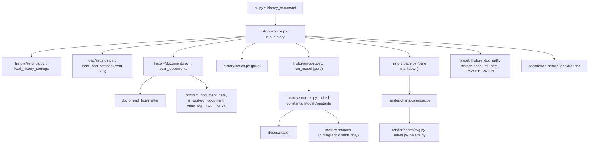
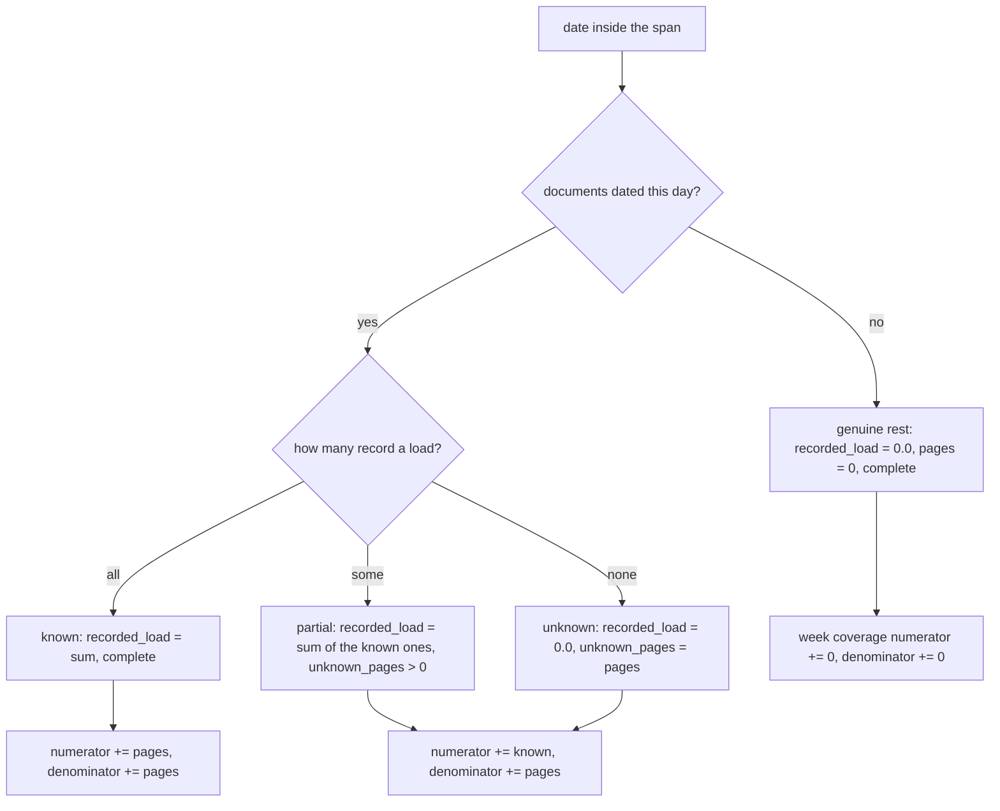

# Technical Design: load-history

## Overview

`load-history` reads the data root's own documents and writes one longitudinal
page: an SVG chart of fitness, fatigue and form over the whole archive on a
calendar axis with each tagged race marked, a weekly table, a coverage statement,
and the archive's criterion-point count. Its input is the load value the
training-load pass already wrote into every scored page's frontmatter, plus that
page's date and, where present, its effort tag. It opens no `.fit` file, makes no
network request, and reads no clock at all.

**Users**: the athlete planning the next block, who currently has no way to ask
"what was my fitness going into that marathon"; and, once, the maintainer
deciding whether `performance-model-fit` is viable, who needs the criterion-point
count this page reports.

**Impact**: adds the first data-root location that is not a per-activity output
(`history/`, with `history/assets/`), which moves `layout.OWNED_PATHS`,
`layout.DECLARED_DIRS`, the in-tree ownership declaration, the published
ownership contract and its version, and the write-confinement guard in one
change. Adds one command (`fitdocs history`), one settings table (`[history]`),
one chart module, and a new top-level package `fitdocs.history`. It changes
nothing about how an activity is scored and touches no recorded load value.

### Goals
- A daily load series over the archive's span, assembled from documents alone,
  in which a missing load and a rest day are never the same thing.
- The Morton, Fitz-Clarke & Banister (1990) eq. (4)/(5) recursion with cited
  constants, the shipped ones labelled as seeds that were never fitted.
- One page: chart with race markers, weekly table, coverage statement,
  criterion-point count.
- A clean seam through which `performance-model-fit` can supply a fitted
  constant set in place of the seeds, with no fitting implemented here.
- Byte-identical output for an unchanged data root, on any day, on any platform.

### Non-Goals
- Fitting any constant (`performance-model-fit`), forecasting form at a future
  date, or any plan / cycle / block document.
- Per-sport or per-channel split curves; back-links from workout pages.
- Any change to load calculation, channel selection, or a recorded load value.
- Interpreting a fitness, fatigue or form value: no zones, no verdicts.
- Auditing the history location the way `fitdocs check` audits `workouts/`.

## Boundary Commitments

### This Spec Owns
- The daily load series read from generated workout documents, its span, and its
  per-day known / unknown split.
- The fitness-fatigue-form model: the recursion, its constant record set, the
  daily-average scale, and the `ModelConstants` value object every caller passes.
- The coverage measure, the suppression rule and its threshold constant.
- The criterion-point count's definition, its exclusion reasons, and both the
  prose and the machine-readable form in which it is reported.
- The history document's format: its location, its `type` value, its
  `history_version`, its frontmatter key set and order, its sections, and the
  chart image beside it.
- The `history/` and `history/assets/` owned prefixes, the ownership declaration
  placed in `history/`, and this location's entry in the published contract and
  the confinement guard.
- The `[history]` settings table and its reader.
- The `fitdocs history` command and its run report.
- The calendar-axis multi-series chart module.

### Out of Boundary
- **`src/fitdocs/contract.py`** — the document contract leaf. `effort-tags` owns
  it in this wave. This spec *imports from* it and edits exactly one thing in it:
  the value of `CONTRACT_VERSION` (see "Shared constant" below). It adds no key,
  no type, no reader and no region there.
- **The effort-tag vocabulary and reader** (`effort-tags`). This spec calls
  `contract.effort_tag` and switches on `EffortKind`; it defines no second
  reader, spells no effort key, and parses no YAML.
- **`src/fitdocs/load/profile.py`, `athlete.toml`, and the benchmark parser and
  serializer** (`athlete-benchmarks` / `performance-benchmarks`). This spec never
  reads or writes the athlete profile.
- **`src/fitdocs/load/settings.py`** — the nine-spec choke point. This spec adds
  no field, no sub-table and no key there. It *calls* `load_load_settings` once
  and reads the published `default_calculator` field.
- **Load calculation** — `load/engine.py`, `load/threshold/`, `load/channels/`,
  the calculator registry, and the load payload's parser. None is imported.
- **Fitting**, in every form: no optimiser, no callback, no registry, no
  goodness-of-fit statistic.
- **The 42/7 Performance Management Chart preset**, whose `CitedConstant` is
  blocked by an unverified book locator (roadmap Direct Implementation Candidate).
- **`fitdocs check` / `fitdocs.audit`** — this spec adds no finding kind and does
  not extend the audit's `workouts/*.md` scan to the new directory.

### Allowed Dependencies
- `fitdocs.docio` — `read_frontmatter`, the one shared document read.
- `fitdocs.contract` — read-only: `document_date`, `is_workout_document`,
  `effort_tag`, `EffortKind`, `EffortTag`, `InvalidEffortTag`, `LOAD_KEYS`,
  `FRONTMATTER_FENCE`, `TYPE_KEY`, `GENERATOR_KEY`, `GENERATOR`,
  `GENERATED_PREFIX`.
- `fitdocs.layout` — the new location helpers land here alongside the existing
  ones; nothing else in the module changes shape.
- `fitdocs.settings` — `load_settings_document`, `SettingsError`.
- `fitdocs.load.settings` — `load_load_settings` and `LoadSettings.default_calculator`,
  read only.
- `fitdocs.citation` — `Citation`, `FitdocsChoice`, `Corroboration`, `Agreement`,
  `Departure`, `CitedConstant`, `VerificationStatus`.
- `fitdocs.metrics.sources` — read only, for the bibliographic fields of
  `BANISTER_1991` and `MORTON_1990`, which this spec's own records must match.
- `fitdocs.render.charts.svg`, `.series`, `.palette` — the generic primitives.
- The Python standard library (`math`, `datetime`, `pathlib`, `dataclasses`,
  `enum`, `typing`). No third-party runtime dependency of any kind.
- **Forbidden**: `fitdocs.ingest`, `fitdocs.model`'s `Activity`,
  `fitdocs.load.engine`, `fitdocs.load.threshold`, `fitdocs.load.channels`,
  `fitdocs.load.render`, `fitdocs.load.profile`, `fitdocs.render.views`,
  `fitdocs.render.charts.hero`, `yaml`, and any clock function
  (`date.today`, `datetime.now`, `time.time`).

### Revalidation Triggers
- **`ModelConstants`' field set or `ConstantProvenance`'s members change** →
  `performance-model-fit` re-checks its seam; the page's constants paragraph and
  its wording table move with it.
- **The criterion-point definition changes** (which kinds count, whether a time
  is required) → `performance-model-fit`'s sufficiency gate re-checks, since its
  requirements begin from this number.
- **`history_version` advances** → any consumer reading the page's frontmatter
  re-checks; the page's key set is versioned by it.
- **`OWNED_PATHS` / `DECLARED_DIRS` change** → `wiki-contract`'s ownership
  document, its conformance test, the declaration goldens, `tests/test_layout.py`'s
  exact tuple pin and the confinement guard all move together, and
  `CONTRACT_VERSION` advances.
- **`effort-tags` changes `EffortKind` or the reader's return shape** → this
  spec's marker and criterion-point code re-checks.
- **The load keys or their frontmatter projection change** (`training-load`) →
  the document scan re-checks.

#### Cross-spec obligations (load-history ↔ wiki-contract)
1. This spec lands the second half of the roadmap's Phase 6 Existing Spec Update
   for `wiki-contract`: Requirement 2 (Published Ownership Contract) and
   Requirement 3 (In-Tree Ownership Declaration) gain an Amendment block
   recording the history location, its declaration, and the document type the
   page carries. `effort-tags` landed the user-owned-keys half; no criterion is
   renumbered by either.
2. `design.md`'s `DocumentContract` block gains an amendment note stating that a
   second document type now exists, that it is declared in `fitdocs.history` and
   not in `fitdocs.contract`, and why (`research.md`, "The page is typed").
   `spec.json` gains an amendments entry.
3. `CONTRACT_VERSION` advances to `"3"` (`effort-tags` sets `"2"`). This is the
   only edit this spec makes inside `src/fitdocs/contract.py`.

#### Cross-spec obligations (load-history ↔ performance-model-fit)
1. **The seam is one value object.** `performance-model-fit` constructs a
   `ModelConstants` with `provenance=ConstantProvenance.FITTED` and a one-line
   `origin`, and calls `run_model` — the same entry point the seeds use. This
   spec ships `FITTED` as a declared member it never produces, so the downstream
   spec adds no enumeration member and the page's constants paragraph already
   has wording for it.
2. **The criterion-point count is the gate's input.** Its definition, its
   breakdown and its exclusion reasons are published here in both prose and
   frontmatter (`criterion_points`). `performance-model-fit`'s requirements
   phase begins from that number.
3. **No fitting hook exists here.** There is no optimiser interface, no callback
   and no registry to extend; the downstream spec supplies a value, not a plugin.
4. **A criterion point is not the same predicate as a derivable effort.**
   `performance-benchmarks` derives from a wider set (LTHR from `hard`; pace
   from a race with only recorded distance and time). A page can therefore yield
   a benchmark entry and not be a criterion point, and vice versa. The count
   published here is deliberately the narrower predicate: a fit needs an observed
   performance, not an anchor.

#### Cross-spec obligations (load-history ↔ effort-tags)
1. The read path is `docio.read_frontmatter(path)` →
   `contract.is_workout_document(fm)` → `contract.effort_tag(fm)`; the page's
   date is `contract.document_date(fm)`. One module in this package
   (`fitdocs/history/documents.py`) performs it, and registers in
   `tests/test_contract_consumers.py::CONTRACT_BINDINGS` with `effort_tag`.
2. `InvalidEffortTag` is reported by page with `describe()` and skipped as a
   marker — never treated as untagged. The page's load still counts.
3. Optional tag fields are `None`, never defaulted. A race with no
   `effort_time_s` is marked on the chart with no result shown, and is excluded
   from the criterion-point count with that stated reason.

#### Shared constant
`src/fitdocs/contract.py`'s `CONTRACT_VERSION` is a single string literal edited
by both `effort-tags` (→ `"2"`) and this spec (→ `"3"`). The roadmap orders the
two specs (`load-history` depends on `effort-tags`), so the edits are sequential.
No component below claims that file; the edit is called out explicitly in
`tasks.md` under "Shared source file" so it cannot be discovered as a conflict.

**Precondition, not assumption.** The literal reads `"1"` in the tree today
(`src/fitdocs/contract.py:233`). The task that makes this edit therefore first
asserts `contract.CONTRACT_VERSION == "2"`; if it still reads `"1"`,
`effort-tags` has not landed, and the task stops and reports rather than
advancing to `"3"` and silently skipping a version.

## Architecture

### Existing Architecture Analysis
- **The input already exists.** `contract.LOAD_KEYS` are written only from a real
  `LoadResult` (`load/docedit.py:264`) and stripped on every non-computed outcome
  (`docedit.py:314`, called at `load/engine.py:406`), so *absent key* is an exact
  marker for missing data. `contract.document_date` reads the page's own local
  date. `docio.read_frontmatter` is the one shared read and refuses symlinks.
- **`layout.py` is per-activity by construction.** `doc_path` is
  `workouts/<stem>.md` unconditionally; `OWNED_PATHS` and `DECLARED_DIRS` are
  read by `declaration.py`, `tests/test_confinement.py`, `tests/test_layout.py`
  and `tests/test_ownership_contract.py`.
- **`declaration_text` is a two-branch `if/else`** whose `else` is the workouts
  branch; a third directory must not fall through to it.
- **The chart layer splits cleanly.** `charts/svg.py` and `charts/series.py` are
  generic and deterministic; `charts/hero.py` is km/min-axis, band-normalised and
  single-series-on-y by construction and is not extended.
- **Per-table settings readers are the established pattern.** `[tiles]`,
  `[inbox]`, `[plugins]` and `[load]` each have their own reader that receives an
  already-parsed mapping and validates only its own table.

### Architecture Pattern & Boundary Map

Selected pattern: **a pure core with one I/O shell**, matching `load/` and
`metrics/`. Exactly one module in the package touches the filesystem for reading
(`documents.py`) and exactly one for writing (`engine.py`); everything between
them is pure functions over frozen dataclasses.



**Architecture Integration**
- Dependency direction: `cli → history.engine → {history.settings, history.documents,
  history.series, history.model, history.page} → {contract, docio, layout,
  citation, render.charts}`. Nothing under `fitdocs.history` is imported by
  `fitdocs.load`, `fitdocs.render.views`, `fitdocs.sync` or `fitdocs.ingest`, and
  a boundary test asserts the package's import closure.
- Domain boundaries: reading documents, assembling the series, running the model,
  rendering the page and placing the output are five separate modules with no
  shared mutable state; the model never sees a `Path` and the reader never sees a
  constant.
- Existing patterns preserved: per-table settings reader; frozen dataclasses;
  `CitedConstant` provenance with a literal guard; `gap_segments` for honest
  polyline breaks; deterministic SVG with no ids or timestamps; the ownership
  contract's owned-prefix shape.
- Steering compliance: stdlib only; `mypy --strict`; absent data is `None`; no
  personal data in the repository — every fixture is a synthetic page tree.

### Technology Stack

| Layer | Choice / Version | Role in Feature | Notes |
|-------|------------------|-----------------|-------|
| CLI | `typer` (already a dependency) | `fitdocs history`, `--out`, `--methodology` | One new command; exit codes reuse the module's existing constants |
| Core | Python 3.11+ stdlib (`math`, `datetime`, `dataclasses`, `enum`) | series, recursion, week aggregation | `math.exp` only; no `statistics`, no numeric library |
| Rendering | Hand-generated SVG on `render/charts/svg.py` | the calendar chart | no runtime JS, no matplotlib |
| Data / Storage | The data root's markdown documents | the only input | read-only; `history/` is the only write target |
| Config | `fitdocs.toml` `[history]` table | constants, coverage threshold, methodology | own reader; `[load]` read but not extended |

## File Structure Plan

### Directory Structure
```
src/fitdocs/
├── history/                       # new top-level package (pure core + I/O shell)
│   ├── __init__.py                # the published surface (__all__), re-exports only
│   ├── settings.py                # the [history] table reader; HistorySettings
│   ├── sources.py                 # Citations, FitdocsChoices, CitedConstants,
│   │                              #   ModelConstants, ConstantProvenance,
│   │                              #   DEPARTURES, BLOCKED_PRESETS
│   ├── model.py                   # run_model: the M90 eq. (4)/(5) recursion (pure)
│   ├── documents.py               # the ONLY filesystem read; PageRecord, SkippedPage
│   ├── series.py                  # DayLoad, DailySeries, WeekRow, Coverage,
│   │                              #   CriterionPoints, methodology selection (pure)
│   ├── page.py                    # the document's vocabulary + markdown render (pure)
│   └── engine.py                  # orchestration, writing, HistoryReport
└── render/charts/
    └── calendar.py                # CalendarChartSpec + render_calendar_chart
```

### Modified Files
- `src/fitdocs/layout.py` — adds `HISTORY_DIR`, `HISTORY_ASSETS_SUBDIR`,
  `HISTORY_DOC_STEM`, `history_doc_path`, `history_asset_rel_path`; extends
  `OWNED_PATHS` with `history/` and `history/assets/` and `DECLARED_DIRS` with
  `history/`.
- `src/fitdocs/declaration.py` — `declaration_text` becomes an explicit
  three-way dispatch; two new claim fragments for the history directory.
- `src/fitdocs/render/charts/palette.py` — three series colours
  (`FITNESS_COLOR`, `FATIGUE_COLOR`, `FORM_COLOR`) and their `SERIES_COLORS`
  entries.
- `src/fitdocs/cli.py` — the `history` command, its options, and its report
  printer.
- `src/fitdocs/contract.py` — **one literal**: `CONTRACT_VERSION` → `"3"`.
- `docs/ownership-contract.md` — the new owned paths, the new declared
  directory, the second document type, and the version line.
- `README.md` — one line in the command summary.
- `tests/test_confinement.py` — `history` registered as a writing entry point.
- `tests/test_layout.py` — the exact `OWNED_PATHS` / `DECLARED_DIRS` pins.
- `tests/test_declaration.py`; `tests/test_declaration_goldens.py` — **edited**:
  its hand-maintained `_GOLDEN_NAMES` mapping gains the history entry, without
  which both the generator and the parameterized test raise `KeyError` rather
  than failing an assertion — and then *run* to regenerate all three goldens,
  one of which (`tests/declaration_golden/history.AGENTS.md`) is new.
- `tests/test_ownership_contract.py` — the conformance lists.
- `tests/render/charts/test_palette.py` — run, not edited: it walks
  `SERIES_COLORS` and reconverts each entry's oklch source, so the three new
  colours are covered the moment they are registered.
- `tests/test_public_api.py` — a `_HISTORY_SURFACE` pin.
- `tests/test_contract_consumers.py` — `fitdocs.history.documents` registered.
- `.kiro/specs/wiki-contract/{requirements.md,design.md,spec.json}` — the
  amendment block (component `WikiContractSpecUpdate`).

### New test modules
`tests/history/{__init__.py,test_settings.py,test_sources.py,test_constant_guard.py,
test_model.py,test_worked_examples.py,test_documents.py,test_series.py,
test_coverage_threshold_measurement.py,test_page.py,test_engine.py,test_boundary.py}`;
`tests/render/charts/test_calendar.py`; `tests/test_history_e2e.py`.

## System Flows

### The history pass, end to end

```mermaid
sequenceDiagram
  participant U as athlete
  participant C as cli.history_command
  participant E as history.engine.run_history
  participant S as history.settings + load.settings
  participant D as history.documents
  participant Y as history.series
  participant M as history.model
  participant P as history.page + charts.calendar
  U->>C: fitdocs history [--out DIR] [--methodology ID]
  C->>E: run_history(data_root, methodology=...)
  E->>S: read fitdocs.toml once; project [history] and [load]
  S-->>E: HistorySettings, default_calculator
  E->>D: scan_documents(data_root)
  D-->>E: PageRecords (sorted), SkippedPages
  E->>Y: select_methodology(pages, requested, configured)
  Y-->>E: chosen id + excluded counts, or a MethodologyProblem
  E->>Y: build_daily_series(included pages)
  Y-->>E: DailySeries (or None -- nothing recorded a load)
  E->>M: run_model(recorded loads, constants)
  M-->>E: ModelSeries (fitness, fatigue, form)
  E->>Y: week_rows(...), coverage_by_year(...), criterion_points(...)
  E->>P: render page markdown + chart SVG
  E->>E: ensure_declarations; write chart, then document (atomic)
  E-->>C: HistoryReport
  C->>U: report; exit 0, or 1 on a write failure, or 2 on a config error
```

Gating conditions, in the order the engine applies them: a malformed `[history]`
table or an unresolvable data root fails before any document is read (exit 2); a
methodology that cannot be resolved unambiguously fails after the scan, with the
counts in hand, and writes nothing (exit 2); an archive in which no page records
a load reports and writes nothing (exit 0); anything else writes the page.

### How a day is classified



The recursion consumes `recorded_load` in every case, because there is nothing
else it could consume; what makes this honest rather than a fabricated zero is
that `unknown_pages` travels alongside every day, is aggregated into every
reported period, drives suppression, and is printed in the weekly table and the
coverage statement. A day is never *described* as a rest day unless `pages == 0`.

## Requirements Traceability

| Requirement | Summary | Components | Interfaces | Flows |
|-------------|---------|------------|------------|-------|
| 1.1 | documents only, no fit/network/clock | DocumentScan, PackageBoundary | `scan_documents` | pass |
| 1.2 | date from the document | DocumentScan | `contract.document_date` | pass |
| 1.3 | load and methodology from frontmatter | DocumentScan | `contract.LOAD_KEYS` | pass |
| 1.4 | absent load is not zero | DocumentScan, SeriesAssembly | `PageRecord.load: float \| None` | day classification |
| 1.5 | same-day pages sum | SeriesAssembly | `build_daily_series` | day classification |
| 1.6 | span first..last contributing, contiguous | SeriesAssembly | `DailySeries` | day classification |
| 1.7 | rest day vs unknown day distinguishable | SeriesAssembly, HistoryPage | `DayLoad.pages`, `.unknown_pages` | day classification |
| 1.8 | absent outside the span | SeriesAssembly | `DailySeries.start/end` | day classification |
| 1.9 | unreadable/undated page skipped and named | DocumentScan, HistoryEngine | `SkippedPage` | pass |
| 1.10 | empty archive: say so, write nothing | HistoryEngine | `run_history` → `HistoryReport` | pass gating |
| 2.1 | M90 eq. (4)/(5), one step per day | FitnessModel | `run_model` | — |
| 2.2 | daily-average scale, named on the page | FitnessModel, HistoryPage | `ModelSeries` | — |
| 2.3 | form = fitness − fatigue | FitnessModel | `ModelSeries.form` | — |
| 2.4 | every constant a citation record | ModelSources, ConstantGuards | `CONSTANT_SOURCES` | — |
| 2.5 | seeds labelled as seeds, on the page | ModelSources, HistoryPage | `ConstantProvenance.SEEDS` | — |
| 2.6 | recursion form recorded as a choice | ModelSources | `RECURSION_FORM_CHOICE` | — |
| 2.7 | configured constants used and named | HistorySettings, HistoryPage | `ModelConstants.origin` | — |
| 2.8 | unverified locator blocks one preset only | ModelSources, ConstantGuards | `BLOCKED_PRESETS` | — |
| 2.9 | reproduces the published worked figures | FitnessModel | `run_model` | — |
| 2.10 | a caller may supply the constant set | ModelSources, FitnessModel | `ModelConstants` | — |
| 2.11 | no interpretation | HistoryPage | page copy pin | — |
| 3.1 | coverage measured per period | SeriesAssembly | `Coverage` | day classification |
| 3.2 | no stand-in for an absent load | SeriesAssembly, ConstantGuards | `DayLoad` | day classification |
| 3.3 | suppress below threshold | SeriesAssembly, CalendarChart | `suppressed_weeks` | — |
| 3.4 | threshold is a measured choice, configurable | ModelSources, HistorySettings | `COVERAGE_THRESHOLD` | — |
| 3.5 | coverage statement contents | SeriesAssembly, HistoryPage | `Coverage` | — |
| 3.6 | an empty period is complete, not zero | SeriesAssembly | `Coverage.fraction` | day classification |
| 3.7 | recursion continues; understatement stated | FitnessModel, HistoryPage | page copy pin | — |
| 3.8 | suppression renders as a break | CalendarChart, HistoryPage | `gap_segments` | — |
| 3.9 | malformed tag reported, load still counted | DocumentScan, HistoryPage | `PageRecord.tag_problem` | pass |
| 3.10 | an unattributable skip is archive-wide only | SeriesAssembly, HistoryPage | `Coverage.pages_skipped: int \| None` | day classification |
| 4.1 | one methodology, named | SeriesAssembly, HistoryPage | `select_methodology` | pass gating |
| 4.2 | explicit beats configured | HistoryEngine, HistorySettings | `run_history(methodology=)` | pass gating |
| 4.3 | unique methodology inferred and stated | SeriesAssembly, HistoryPage | `MethodologyChoice.inferred` | pass gating |
| 4.4 | ambiguous → config error with counts | SeriesAssembly, HistoryCommand | `MethodologyProblem` | pass gating |
| 4.5 | configured id absent from the archive → error | SeriesAssembly, HistoryCommand | `MethodologyProblem` | pass gating |
| 4.6 | excluded pages counted and named | SeriesAssembly, HistoryPage | `Coverage.pages_excluded` | pass |
| 5.1 | one document, one image | HistoryLocation, HistoryEngine | `history_doc_path` | pass |
| 5.2 | three series, calendar axis, readable ticks | CalendarChart | `render_calendar_chart` | — |
| 5.3 | shared absolute scale, zero line | CalendarChart | `CalendarChartSpec` | — |
| 5.4 | race markers with their results | DocumentScan, CalendarChart, HistoryPage | `CalendarMarker` | — |
| 5.5 | resultless race still marked | CalendarChart, HistoryPage | `CalendarMarker.detail is None` | — |
| 5.6 | weekly table columns | SeriesAssembly, HistoryPage | `WeekRow` | — |
| 5.7 | suppressed week shown as such | HistoryPage | `WeekRow.suppressed` | — |
| 5.8 | valid markdown, banner, frontmatter | HistoryPage | `render_history_document` | — |
| 5.9 | doc-relative image link | HistoryLocation, HistoryPage | `history_asset_rel_path` | — |
| 5.10 | no forecast, no plan content | HistoryPage | page copy pin | — |
| 6.1 | criterion-point count | SeriesAssembly, HistoryPage | `criterion_points` | — |
| 6.2 | by kind, earliest and latest | SeriesAssembly | `CriterionPoints` | — |
| 6.3 | exclusions grouped by reason | SeriesAssembly | `CriterionPoints.excluded` | — |
| 6.4 | count in frontmatter | HistoryPage | `criterion_points` key | — |
| 6.5 | no judgement | HistoryPage | page copy pin | — |
| 7.1 | owned location declared in the same change | HistoryLocation | `OWNED_PATHS` | — |
| 7.2 | contract, declaration, confinement | HistoryLocation, HistoryDeclaration, OwnershipDocs, ConfinementRegistration | `DECLARED_DIRS` | — |
| 7.3 | contract version advances | HistoryDeclaration, OwnershipDocs | `CONTRACT_VERSION` | — |
| 7.4 | writes only inside permitted locations | ConfinementRegistration | guard | pass |
| 7.5 | no workout doc, no load, no profile | PackageBoundary, ConfinementRegistration | import closure | pass |
| 7.6 | a foreign file is left alone and reported | HistoryEngine | `is_generated` check | pass |
| 8.1 | the command regenerates the page | HistoryCommand, HistoryEngine | `history_command` | pass |
| 8.2 | data-root precedence and loud failure | HistoryCommand | `_resolved_data_root` | pass |
| 8.3 | own settings table, all defaulted | HistorySettings | `load_history_settings` | pass |
| 8.4 | malformed table → config error | HistorySettings, HistoryCommand | `HistorySettingsError` | pass |
| 8.5 | byte-identical output | PackageBoundary, HistoryEngine | determinism test | pass |
| 8.6 | the run report | HistoryEngine, HistoryCommand | `HistoryReport` | pass |
| 8.7 | not chained onto other passes | HistoryCommand | absence test | — |
| 8.8 | exit codes | HistoryCommand | `_finish` | pass |

## Components and Interfaces

| Component | Domain/Layer | Intent | Req Coverage | Key Dependencies (P0/P1) | Contracts |
|-----------|--------------|--------|--------------|--------------------------|-----------|
| HistoryLocation | Layout | The owned prefixes and path helpers | 7.1, 7.2, 5.1, 5.9 | — | State |
| HistoryDeclaration | Layout | The `history/AGENTS.md` text | 7.2 | HistoryLocation (P0) | Service |
| OwnershipDocs | Docs | Published contract and README | 7.2, 7.3 | HistoryLocation (P0) | State |
| WikiContractSpecUpdate | Spec | The roadmap's Phase 6 update to `wiki-contract` | 7.2, 7.3 | HistoryLocation (P0) | State |
| HistorySettings | Config | The `[history]` table reader | 8.3, 8.4, 2.7, 3.4 | `fitdocs.settings` (P0) | Service, State |
| ModelSources | Model | Citations, choices, seeds, the seam | 2.4-2.8, 2.10, 3.4 | `fitdocs.citation` (P0) | State |
| FitnessModel | Model | The recursion | 2.1-2.3, 2.9, 2.10, 3.7 | ModelSources (P0) | Service |
| DocumentScan | Read | The one filesystem read | 1.1-1.4, 1.9, 3.9, 5.4 | `docio`, `contract` (P0) | Service |
| SeriesAssembly | Core | Series, weeks, coverage, criterion points | 1.4-1.8, 3.1-3.6, 4.1, 4.3-4.6, 5.6, 6.1-6.3 | DocumentScan types (P0) | Service |
| CalendarChart | Render | The SVG | 3.8, 5.2-5.5 | `charts/svg`, `series`, `palette` (P0) | Service |
| HistoryPage | Render | The document's vocabulary and markdown | 2.2, 2.5, 2.7, 2.11, 3.5, 3.7, 5.4-5.10, 6.1-6.5 | SeriesAssembly, CalendarChart (P0) | Service, State |
| HistoryEngine | Pass | Orchestration, writing, the report | 1.9, 1.10, 4.2, 7.4-7.6, 8.1, 8.5, 8.6 | all of the above (P0) | Service, Batch |
| HistoryCommand | CLI | `fitdocs history` | 4.4, 4.5, 8.1, 8.2, 8.4, 8.6-8.8 | HistoryEngine (P0) | Service |
| ConfinementRegistration | Guard | The writing entry point | 7.2, 7.4, 7.5 | HistoryEngine (P0) | — |
| PackageBoundary | Guard | Import closure, no clock, no reference tree | 1.1, 7.5, 8.5 | package (P0) | — |
| SurfacePins | Guard | `__all__` pin and contract-consumer registration | 2.4, 7.5 | package (P0) | — |

### Layout and Ownership

#### HistoryLocation (`src/fitdocs/layout.py`)

| Field | Detail |
|-------|--------|
| Intent | Name the new owned location once, and let every guard read it |
| Requirements | 5.1, 5.9, 7.1, 7.2 |

**Responsibilities & Constraints**
- Adds two prefixes to `OWNED_PATHS` and one directory to `DECLARED_DIRS`; the
  assets subdirectory is excluded from `DECLARED_DIRS` for the same reason
  `workouts/assets/` is (the parent's declaration covers what is beneath it).
- Performs no I/O, exactly like the rest of the module. `history_asset_rel_path`
  returns a POSIX string built by plain string joins.
- Invariant: `HISTORY_DIR` is not a prefix of, and is not prefixed by, any
  existing owned path; `OWNED_PATHS` has no duplicates and every entry ends in
  `/`; `DECLARED_DIRS ⊂ OWNED_PATHS`.

**Contracts**: State [x] / Service [x]

##### State / Service Interface
```python
HISTORY_DIR: Final[str] = "history"
HISTORY_ASSETS_SUBDIR: Final[str] = ASSETS_SUBDIR          # reuses "assets"
HISTORY_DOC_STEM: Final[str] = "training-load-history"
HISTORY_CHART: Final[str] = "fitness"

OWNED_PATHS: Final[tuple[str, ...]] = (
    f"{WORKOUTS_DIR}/", f"{WORKOUTS_DIR}/{ASSETS_SUBDIR}/",
    f"{HISTORY_DIR}/", f"{HISTORY_DIR}/{HISTORY_ASSETS_SUBDIR}/",
    f"{ARCHIVE_DIR}/", f"{CACHE_DIR}/", f"{TOOL_STATE_DIR}/",
)
DECLARED_DIRS: Final[tuple[str, ...]] = (
    f"{WORKOUTS_DIR}/", f"{HISTORY_DIR}/", f"{ARCHIVE_DIR}/",
)

def history_doc_path(data_root: Path) -> Path: ...          # <root>/history/training-load-history.md
def history_asset_path(data_root: Path, chart: str) -> Path: ...
def history_asset_rel_path(chart: str) -> str: ...          # "assets/training-load-history-fitness.svg"
```
- Postconditions: `history_asset_rel_path(c)` resolved against
  `history_doc_path(root).parent` equals `history_asset_path(root, c)`.

**Implementation Notes**
- Integration: `tests/test_layout.py`'s exact tuple pins move in this change, as
  do `tests/test_ownership_contract.py`'s lists and
  `tests/test_confinement.py`'s permitted set (which reads `OWNED_PATHS`
  directly and therefore widens automatically).
- Validation: pin the exact tuples; pin the round trip above; pin that no owned
  prefix is a prefix of another except `history/` of `history/assets/` and
  `workouts/` of `workouts/assets/`.
- Named mutation: drop `history/assets/` from `OWNED_PATHS` — the confinement
  guard reds on the chart write.
- Risks: an existing data root may already contain a user's `history/` directory.
  Handled by HistoryEngine's foreign-file rule (7.6), not here.

#### HistoryDeclaration (`src/fitdocs/declaration.py`)

| Field | Detail |
|-------|--------|
| Intent | The `history/AGENTS.md` text, composed from named fragments |
| Requirements | 7.2 |

**Responsibilities & Constraints**
- `declaration_text` becomes an explicit three-way dispatch keyed on the
  directory, with **no fall-through branch**: an unknown directory raises rather
  than inheriting another directory's prose. This is the defect the current
  `else` invites.
- **The restructure must preserve `effort-tags`' fragment.** By the time this
  lands, the workouts branch carries that spec's `_USER_KEYS` fragment (selected
  after `_REGIONS`, before `_REDERIVABILITY_DOCS`). The three-way dispatch
  selects it for `workouts/` and *not* for `history/`, whose page has no
  frontmatter the athlete owns. Because the goldens are regenerated by the
  generator rather than hand-written, silently dropping the fragment would
  produce a green golden;
  `tests/test_declaration.py::test_workouts_declaration_names_every_user_owned_key`
  is what catches it, and the task runs it.
- Two new fragments: one stating that the directory holds one generated
  longitudinal page and its chart image, both rewritten in full on every
  `fitdocs history` run and carrying no user-owned region; one stating that the
  page is re-derivable from the workout documents alone and that deleting it
  loses nothing.
- **This component also advances `contract.CONTRACT_VERSION` to `"3"`** — the
  single shared-constant edit disclosed under "Shared constant" above.
  `_OWNER_BLOCK` (`declaration.py:297`) formats that constant into *every*
  directory's text, so a bump reds all three goldens; the bump and the
  regeneration are inseparable and belong to one task. No `_Boundary:_` line in
  `tasks.md` claims `src/fitdocs/contract.py`; the edit is named in that
  document's "Shared source file" preamble instead.
- `tests/test_declaration_goldens.py::_GOLDEN_NAMES` is a hand-maintained
  `dict[str, str]` (`:36-41`), not a derivation over `DECLARED_DIRS`: it gains
  the history entry in this same change, or the generator raises `KeyError`.
- No fragment quantifies over documents, and no fragment claims a region the
  page does not have — the page has none.

**Contracts**: Service [x]
```python
def declaration_text(directory: str) -> str: ...   # unchanged signature
```
- Preconditions: `directory` is a member of `layout.DECLARED_DIRS`.
- Postconditions: begins with a line starting `contract.GENERATED_PREFIX`;
  deterministic; identical for identical inputs.

**Implementation Notes**
- Integration: after `_GOLDEN_NAMES` gains its entry, all three goldens are
  produced by running that module's own generator
  (`uv run python -m tests.test_declaration_goldens`), never by hand.
- Validation: the three goldens; a test that a directory outside `DECLARED_DIRS`
  raises; a test that the history text names no region id;
  `test_declaration_text_differs_between_directories`
  (`tests/test_declaration.py:74`) widened from the workouts-vs-archive pair to
  a pairwise-distinct assertion over all three.
- Named mutation: restore the `else` fall-through — the history golden reds with
  workout prose.

#### OwnershipDocs (`docs/ownership-contract.md`, `README.md`)

| Field | Detail |
|-------|--------|
| Intent | Publish the new owned paths, the new declared directory, and the second document type |
| Requirements | 7.2, 7.3 |

**Responsibilities & Constraints**
- The document's Owned Paths list gains two entries and its preamble states what
  changed at this version. Its declared-directory sentence gains the third
  directory. A short new subsection names the second document type
  (`training-history`), says it is published by `fitdocs.history` rather than by
  the document contract leaf, and states that it carries no user-owned region
  and is rewritten in full.
- The document's own version line states the new contract version. The
  **constant** it is held equal to is advanced by the declaration component, not
  here: `declaration._OWNER_BLOCK` embeds `CONTRACT_VERSION`, so the bump and the
  golden regeneration must be one atomic change, and separating them from the
  document's version line would red `test_contract_version_matches_code` in
  between. The two therefore land as one task group (see `tasks.md`, "Group 1 is
  one atomic change").
- Sections that today speak of one document type and one declaration —
  "Referencing `workouts/AGENTS.md` from Your Wiki's Root Instructions" and
  "Document-Format Versions and Migration" — are reviewed and corrected in the
  same pass; the anchor-link test cannot catch a section that is stale but still
  linkable.
- `README.md` gains one line in its command summary.

**Contracts**: State [x]

**Implementation Notes**
- Integration: `tests/test_ownership_contract.py` holds the document's enumerated
  lists equal to the code constants, so the lists and the constants move together
  or the test reds. `tests/test_docs_guarantees.py`'s anchor-link check requires
  every intra-documentation link to resolve to a real heading.
- Named mutation: add `history/` to `OWNED_PATHS` without adding it to the
  document — the conformance test reds.

### Configuration

#### HistorySettings (`src/fitdocs/history/settings.py`)

| Field | Detail |
|-------|--------|
| Intent | The one reader for the `fitdocs.toml` `[history]` table |
| Requirements | 2.7, 3.4, 8.3, 8.4 |

**Responsibilities & Constraints**
- Peer of `load_load_settings`, `tile_settings_from_document`, `load_inbox_settings`,
  `load_plugin_settings`: it receives the already-parsed mapping and validates
  only its own table. It never opens a file.
- Every field is defaulted; an absent file or table yields
  `DEFAULT_HISTORY_SETTINGS`. Unknown keys and sub-tables are ignored.
- `HistorySettingsError` subclasses `fitdocs.settings.SettingsError`, so the
  CLI's existing `except SettingsError` handler maps it to exit 2 with no new
  branch.
- Constant validation: each `tau_*` must be a finite number `> 0`; each `k_*` a
  finite number `>= 0`; `coverage_threshold` a finite number in `[0.0, 1.0]`;
  `methodology` a non-empty string. Booleans are rejected as numbers.
- **This module adds nothing to `fitdocs.load.settings`.**

**Contracts**: Service [x] / State [x]
```python
HISTORY_TABLE: Final[str] = "history"

@dataclass(frozen=True)
class HistorySettings:
    tau_fitness_days: float | None = None      # None -> the seed
    tau_fatigue_days: float | None = None
    k_fitness: float | None = None
    k_fatigue: float | None = None
    coverage_threshold: float | None = None    # None -> COVERAGE_THRESHOLD.value
    methodology: str | None = None             # None -> [load].default_calculator

DEFAULT_HISTORY_SETTINGS: Final[HistorySettings] = HistorySettings()

class HistorySettingsError(SettingsError): ...

def load_history_settings(
    document: Mapping[str, object], settings_file: Path
) -> HistorySettings: ...

def resolve_constants(settings: HistorySettings) -> ModelConstants: ...
```
- Postconditions: `resolve_constants(DEFAULT_HISTORY_SETTINGS) is SEED_CONSTANTS`.
  If **any** of the four model constants is configured, the result's
  `provenance` is `CONFIGURED` and its `origin` names each configured key and
  each key left at its seed; a partially configured set is never labelled
  `SEEDS`.
- Invariants: the reader is pure over `(document, settings_file)`; it raises only
  `HistorySettingsError`.

**Implementation Notes**
- Integration: `HistoryEngine` calls `settings.load_settings_document(data_root)`
  once and passes the mapping to both this reader and `load_load_settings`.
- Validation: absent file, absent table, empty table, each key valid, each key
  invalid (wrong type, `bool`, non-finite, out of range), unknown key ignored,
  unknown sub-table ignored.
- Named mutations: accept `bool` as a number (`tau_fitness_days = true` passes);
  drop the range check on `coverage_threshold` (`1.5` passes); label a partially
  configured set `SEEDS` (the page's provenance line reds).
- Risks: an athlete configuring 42/7 gets an uncited constant set. That is
  correct and stated on the page; see `BLOCKED_PRESETS`.

### Model

#### ModelSources (`src/fitdocs/history/sources.py`)

| Field | Detail |
|-------|--------|
| Intent | Every constant of the model, its provenance, and the seam a fitted set plugs into |
| Requirements | 2.4, 2.5, 2.6, 2.7, 2.8, 2.10, 3.4 |

**Responsibilities & Constraints**
- Declares two `Citation` records at the recursion's own locators — M90
  `Eq. 4-5, p. 1173` and B91 `pp. 413-414`. They are separate records from
  `metrics.sources`' `MORTON_1990` / `BANISTER_1991`, which cite the *training
  impulse* at different pages. Their `authors`, `year` and `work` strings are
  identical to those records', and a test asserts that field by field, so the
  bibliography can never drift into two versions of one book.
- `TAU_FITNESS_SEED_DAYS` (45.0) and `TAU_FATIGUE_SEED_DAYS` (15.0) are governed
  by B91 pp. 413-414 with `verification=PRIMARY_TEXT`, each carrying a
  `Corroboration` on M90 Table 2 with `agreement=DIFFERS` and a note giving the
  fitted values (50/40 and 11/11) — the record itself states that the seeds are
  not what fitting produced. Each `note` states the D5 ruling in words: an
  illustrative starting value, never fitted to anybody.
- `K_FITNESS_SEED` and `K_FATIGUE_SEED` (both 1.0) are governed by a
  `FitdocsChoice`, not by a citation, with a `Departure` recording that M90
  eq. (8) and B91 use `k2 = 2` illustratively and that fitdocs reports
  `form = fitness − fatigue` instead, because fitting `k1`/`k2` is
  `performance-model-fit`'s gated job and an unfitted 2 is no better attested
  than 1.
- `COVERAGE_THRESHOLD` (0.80) is governed by a `FitdocsChoice` whose
  `search_basis` records the fruitless literature search and whose `measurement`
  records the sensitivity figures (2.198% of fitness and 6.449% of fatigue per
  uncomputed daily page at the seed constants) and names the test that
  reproduces them.
- `RECURSION_FORM_CHOICE` records the exact-decay decision against the vendor
  `1/tau` approximation, with the measured 1.20%/1.12% per-step divergence.
- `DAILY_AVERAGE_SCALE_CHOICE` records the reporting rescaling.
- `BLOCKED_PRESETS` declares the Performance Management Chart pair (42 d / 7 d)
  as a preset that is **not shipped**, naming what must be verified first. It is
  a declared absence, not an omission, and a test asserts no shipped
  `CitedConstant` carries 42.0 or 7.0 as a time constant. `performance-benchmarks`
  keeps the same kind of record for the same reason -- `PENDING_CONSTANTS` and
  `BLOCKED_METHODS` in `src/fitdocs/performance/sources.py` -- and both are
  blocked by the **same** roadmap Direct Implementation Candidate (verify the
  Allen & Coggan 2nd-ed. page locators), so one reading task clears two files. A
  shared record type was deliberately *not* introduced: per-package provenance
  shapes are the established precedent (`Divergence` in
  `load/channels/sources.py:104` is not shared either), and a queue item tracks
  promoting one shape into `fitdocs.citation` later.
- The module holds **no bare numeric literal carrying a methodological choice**:
  every such value is inside a `CitedConstant`, and a literal scan enforces it
  across the package.

**Contracts**: State [x]
```python
class ConstantProvenance(StrEnum):
    SEEDS = "seeds"            # produced by this spec
    CONFIGURED = "configured"  # produced by this spec
    FITTED = "fitted"          # declared here; produced only by performance-model-fit

@dataclass(frozen=True)
class ModelConstants:
    tau_fitness_days: float
    tau_fatigue_days: float
    k_fitness: float
    k_fatigue: float
    provenance: ConstantProvenance
    origin: str                # one line, printed verbatim on the page

@dataclass(frozen=True)
class BlockedPreset:
    key: str
    values: str
    blocked_by: str

MORTON_1990_RECURSION: Final[Citation]
BANISTER_1991_TIME_CONSTANTS: Final[Citation]
RECURSION_FORM_CHOICE: Final[FitdocsChoice]
DAILY_AVERAGE_SCALE_CHOICE: Final[FitdocsChoice]
WEIGHTING_CHOICE: Final[FitdocsChoice]
COVERAGE_THRESHOLD_CHOICE: Final[FitdocsChoice]

TAU_FITNESS_SEED_DAYS: Final[CitedConstant[float]]
TAU_FATIGUE_SEED_DAYS: Final[CitedConstant[float]]
K_FITNESS_SEED: Final[CitedConstant[float]]
K_FATIGUE_SEED: Final[CitedConstant[float]]
COVERAGE_THRESHOLD: Final[CitedConstant[float]]

CONSTANT_SOURCES: Final[tuple[CitedConstant[float], ...]]
DEPARTURES: Final[tuple[Departure, ...]]
BLOCKED_PRESETS: Final[tuple[BlockedPreset, ...]]
SEED_CONSTANTS: Final[ModelConstants]     # provenance=SEEDS
```
- Invariants: every `CitedConstant` in the module appears exactly once in
  `CONSTANT_SOURCES`; no two share a `name`; every `Corroboration` whose
  `agreement` is not `AGREES` carries a note; every `Departure.subject` is
  unique; `SEED_CONSTANTS` reads its four values from the four `CitedConstant`s
  and holds no literal of its own.

**Implementation Notes**
- Integration: `HistorySettings.resolve_constants` and `HistoryPage`'s constants
  paragraph are the only consumers.
- **Who measures what.** `COVERAGE_THRESHOLD_CHOICE.measurement` states figures
  only the shipped recursion can produce, so the task that writes the measurement
  test owns the right to correct that string when the measured value differs from
  the transcribed one -- the one edit that task makes outside its own test module.
  `RECURSION_FORM_CHOICE`'s per-step divergence figures are measured by the same
  test, for the same reason: a stated number no test reproduces is exactly the
  drift this layer exists to prevent.
- Validation: a registry walk (`tests/history/test_sources.py`) over
  `CONSTANT_SOURCES`, `DEPARTURES` and `BLOCKED_PRESETS`; an independent literal
  scan (`tests/history/test_constant_guard.py`) parsing **every module that
  exists under the package** as source text -- discovered by walking the package
  directory, never a hardcoded module list, so it neither reds before its
  siblings land nor silently skips a module a later task adds -- with an
  exemption table naming each permitted literal's site and category, plus an
  assertion that no exemption entry is unused. The scan itself is written once,
  by this component's task; a later task that legitimately needs a literal
  appends its own exemption entry and nothing else, because an exemption is a
  claim about that task's own code; a scan asserting the string `docs/reference` appears nowhere
  under the package.
- Named mutations: move `45.0` into `model.py` as a literal (the literal scan
  reds); drop the `DIFFERS` corroboration (the registry walk's "seeds are stated
  as unfitted" assertion reds); add a 42.0 tau constant (the blocked-preset
  assertion reds); make `SEED_CONSTANTS` spell `1.0` instead of reading
  `K_FITNESS_SEED.value` (the literal scan reds).
- Risks: the two bibliographic records could drift from `metrics.sources`'.
  Mitigated by the field-by-field equality test.

#### FitnessModel (`src/fitdocs/history/model.py`)

| Field | Detail |
|-------|--------|
| Intent | The recursion, and nothing else |
| Requirements | 2.1, 2.2, 2.3, 2.9, 2.10, 3.7 |

**Responsibilities & Constraints**
- Pure, stdlib-only (`math.exp`), no I/O, no clock, no `Path`, no document type.
- One step per element of the input sequence, which the caller guarantees is one
  element per calendar day of the span.
- Accumulators start at zero: the archive begins with no accumulated history.
  This understates the first weeks; `HistoryPage` states it.
- Reports `fitness[i] = k1 * g[i] * (1 - exp(-1/tau1))` and the fatigue analogue;
  `form[i] = fitness[i] - fatigue[i]`.
- The recursion runs over every day, including days inside a suppressed period —
  suppression is a *reporting* decision applied afterwards (Req 3.7). This module
  knows nothing about coverage.
- Raises `ValueError` on a non-positive time constant or a negative weighting;
  the settings reader has already rejected those, so this is a second, structural
  guard, not the user-facing check.

**Contracts**: Service [x]
```python
@dataclass(frozen=True)
class ModelSeries:
    fitness: tuple[float, ...]
    fatigue: tuple[float, ...]
    form: tuple[float, ...]

def run_model(
    daily_loads: Sequence[float], constants: ModelConstants
) -> ModelSeries: ...

def unscaled_accumulators(
    daily_loads: Sequence[float], constants: ModelConstants
) -> tuple[tuple[float, ...], tuple[float, ...]]: ...
```
- Preconditions: `tau_* > 0` and finite; `k_* >= 0` and finite; every load finite
  and `>= 0`.
- Postconditions: all three tuples have `len(daily_loads)` elements; with a
  constant load `T` the fitness series converges to `k1 * T`; `run_model`'s
  fitness equals `unscaled_accumulators`' first tuple times
  `k1 * (1 - exp(-1/tau1))`, elementwise and exactly.
- Invariants: pure and deterministic; the same inputs give bit-identical outputs
  on one platform, and cross-platform equality is asserted to a stated tolerance
  because `math.exp` is libm-backed.

**Implementation Notes**
- Integration: `HistoryEngine` calls it once per run.
- Validation: `tests/history/test_worked_examples.py` drives the model with M90's
  own inputs — `T = 100`, `i = 1`, `tau1 = 45`, `tau2 = 15`, `k1 = 1`, `k2 = 2`,
  60 days — and asserts `k1*g(60) ≈ 3351`, `k2*h(60) ≈ 3044`, their difference
  `≈ 307`, and the continuous-training asymptote `≈ 1449` from eq. (11). These
  are the paper's own printed figures, and they are the only published numbers in
  this literature usable as vectors (Banister's figure captions are not — queue
  item `2026-07-27-banister-figure-captions-unusable-as-vectors`).
- Named mutations: use `1/tau` instead of `1 - exp(-1/tau)` (the worked example
  reds at the third significant figure); apply `k1`/`k2` inside the recursion
  instead of at the combination (the day-60 pair reds); seed the accumulators
  with the first day's load twice (off-by-one reds).
- Risks: none identified; the module is ~40 lines and fully pinned.

### Read and Core

#### DocumentScan (`src/fitdocs/history/documents.py`)

| Field | Detail |
|-------|--------|
| Intent | The one filesystem read: documents in, typed records out |
| Requirements | 1.1, 1.2, 1.3, 1.4, 1.9, 3.9, 5.4 |

**Responsibilities & Constraints**
- Scans `workouts/*.md` at the top level, sorted, exactly as the load engine and
  the audit do. It reads nothing under `history/`, nothing under `fit-archive/`,
  and no `.fit` file.
- For each path: `docio.read_frontmatter` → skip when `None`;
  `contract.is_workout_document` → skip when false;
  `contract.document_date` → skip with a reason when `None`;
  the three `contract.LOAD_KEYS` → `load` and `methodology`, both `None` when
  `load_value` is absent, not numeric, not finite, or a `bool`;
  `contract.effort_tag` → `EffortTag`, `InvalidEffortTag` (recorded as
  `tag_problem = describe()`, no marker), or `None`.
- **This module is the package's only importer of `docio` and `contract`**, and
  the only one registered in `tests/test_contract_consumers.py`. It imports no
  YAML parser, spells no frontmatter fence, no `"workout"` literal and no effort
  key, and defines no private duplicate of a contract reader.
- Reads no clock. Emits paths as data-root-relative POSIX strings, so a report or
  a page never leaks an absolute path (and so output is machine-independent).
- Never raises for a bad document: every failure becomes a `SkippedPage`.

**Contracts**: Service [x]
```python
@dataclass(frozen=True)
class PageRecord:
    path: str                    # data-root-relative POSIX
    day: date
    load: float | None
    methodology: str | None      # None whenever load is None
    effort: EffortTag | None
    tag_problem: str | None      # InvalidEffortTag.describe(), else None

@dataclass(frozen=True)
class SkippedPage:
    path: str
    reason: str

@dataclass(frozen=True)
class DocumentScan:
    pages: tuple[PageRecord, ...]      # sorted by (day, path)
    skipped: tuple[SkippedPage, ...]   # sorted by path

def scan_documents(data_root: Path) -> DocumentScan: ...
```
- Postconditions: `load is None` iff `methodology is None`; every `path` is
  relative and POSIX; both tuples are in the stated order regardless of
  filesystem enumeration order.
- Invariants: pure with respect to the filesystem's *content* — the same tree
  always yields the same value.

**Implementation Notes**
- Integration: `HistoryEngine` is its only caller.
- Validation: synthetic page trees under `tmp_path` — a scored page, an unscored
  page, a page with a non-numeric `load_value`, a page with no date, a
  non-workout `.md`, a subdirectory (not descended into), a symlink (refused by
  `docio`), a valid race tag, a valid test tag with a time, a `hard` tag, a
  malformed tag, two pages on one date. **No `.fit` fixture and no real wiki page
  is ever used.**
- Named mutations: accept `bool` as `load_value` (`load_value: true` scores 1.0);
  treat `InvalidEffortTag` as `None` (the malformed page silently gets a marker);
  sort by path only (two same-day pages swap and the golden page reds).
- Risks: a page whose `load_methodology` is present while `load_value` is absent
  (hand-edited). Handled: `methodology` is read only when a usable `load_value`
  was read, so the pair cannot desynchronise.
- Risks: the `workouts/*.md` discovery rule is now stated a **fourth** time --
  `load/engine.py:605-611`, `audit.py`, `performance/engine.py` and this module.
  The duplication is **accepted**: each pass owns its own scan and none imports
  another's, which is the boundary this design and `performance-benchmarks` both
  hold. `performance-benchmarks`' archive-resolution equivalence test (its
  integration test 4b) covers the glob against the load engine's, so the rule has
  one executable cross-check even though four sites spell it.

#### SeriesAssembly (`src/fitdocs/history/series.py`)

| Field | Detail |
|-------|--------|
| Intent | Records → daily series, weeks, coverage, criterion points — all pure |
| Requirements | 1.4-1.8, 3.1-3.6, 4.1, 4.3-4.6, 5.6, 6.1, 6.2, 6.3 |

**Responsibilities & Constraints**
- **Methodology selection**: requested (CLI) beats configured
  (`[history].methodology`, then `[load].default_calculator`) beats a unique
  methodology observed in the archive. More than one observed with nothing
  chosen, or a chosen id observed nowhere, yields a `MethodologyProblem` — never
  a guess.
- **Partition**: a page whose `methodology` equals the chosen id, or whose
  `methodology is None`, is *included*; any other page is *excluded* and counted
  by methodology. An included page with no load contributes to the denominator
  of coverage and to nothing else.
- **Span**: first to last *contributing* page date, where contributing means the
  page records a load under the chosen methodology. Included pages outside that
  span are counted and reported, never silently dropped.
- **Day classification**: as the flow diagram above. `DayLoad.recorded_load` is
  the sum over pages that record a load; `pages` and `pages_with_load` travel
  with it always, so no consumer can read the sum as a complete total.
- **Weeks**: ISO weeks (Monday start) from the week containing the span's start
  to the week containing its end; the first and last may be partial, and carry
  the number of in-span days so a reader is not misled by a short week.
- **Coverage**: `pages_with_load / pages`, defined as `1.0` when `pages == 0`
  (nothing is missing from an empty period). Reported per calendar year and once
  for the whole archive. A period row carries its own excluded counts, which are
  attributable because an excluded `PageRecord` has a date — hence
  `coverage_report` takes the excluded records, not just `MethodologyChoice`'s
  archive-wide totals. A **skipped** document has no date to attribute by (the
  commonest skip reason is that its date is precisely what could not be read), so
  `pages_skipped` is an integer on the archive-wide row and `None` on every
  period row (Req 3.10). `None` here means *not attributable*, and the page
  prints nothing rather than a fabricated zero.
- **Suppression**: a week whose coverage is strictly below the threshold is
  suppressed. Its `WeekRow` carries `suppressed=True` and `None` for the three
  model values, and its days' values are `None` in the chart series, which
  `gap_segments` renders as a break.
- **Criterion points**: a page with a valid tag whose `kind` is `RACE` or `TEST`
  **and** whose `time_s` is not `None`. Everything else with a tag is an
  exclusion with a stated reason: `hard` efforts (no official result is required
  of one), a race or test with no recorded time, and a malformed tag (named
  individually with `describe()`). No judgement of any kind is attached.

**Contracts**: Service [x]
```python
@dataclass(frozen=True)
class DayLoad:
    day: date
    recorded_load: float
    pages: int
    pages_with_load: int
    @property
    def unknown_pages(self) -> int: ...
    @property
    def is_complete(self) -> bool: ...      # pages == pages_with_load

@dataclass(frozen=True)
class DailySeries:
    start: date
    days: tuple[DayLoad, ...]               # contiguous, one per calendar day
    @property
    def end(self) -> date: ...

@dataclass(frozen=True)
class MethodologyChoice:
    methodology: str
    source: Literal["requested", "configured", "inferred"]
    excluded: tuple[tuple[str, int], ...]   # (methodology, page count), sorted

@dataclass(frozen=True)
class MethodologyProblem:
    detail: str                             # names every methodology and its count

@dataclass(frozen=True)
class Coverage:
    label: str                              # "2019" or "all"
    pages: int
    pages_with_load: int
    pages_excluded: tuple[tuple[str, int], ...]
    pages_skipped: int | None               # None on a period row: not attributable
    @property
    def fraction(self) -> float: ...        # 1.0 when pages == 0

@dataclass(frozen=True)
class WeekRow:
    iso_year: int
    iso_week: int
    monday: date
    days_in_span: int
    total_load: float
    sessions: int
    pages: int
    pages_with_load: int
    fitness: float | None
    fatigue: float | None
    form: float | None
    suppressed: bool

@dataclass(frozen=True)
class CriterionPoints:
    count: int
    by_kind: tuple[tuple[EffortKind, int], ...]
    earliest: date | None
    latest: date | None
    excluded: tuple[tuple[str, int], ...]
    malformed: tuple[tuple[str, str], ...]

def select_methodology(
    pages: Sequence[PageRecord], *, requested: str | None, configured: str | None
) -> MethodologyChoice | MethodologyProblem: ...
def build_daily_series(pages: Sequence[PageRecord]) -> DailySeries | None: ...
def suppressed_weeks(series: DailySeries, threshold: float) -> frozenset[tuple[int, int]]: ...
def week_rows(
    series: DailySeries, model: ModelSeries, suppressed: frozenset[tuple[int, int]]
) -> tuple[WeekRow, ...]: ...
def coverage_report(
    series: DailySeries,
    excluded: Sequence[PageRecord],
    choice: MethodologyChoice,
    skipped: int,
) -> tuple[Coverage, ...]: ...
def criterion_points(pages: Sequence[PageRecord]) -> CriterionPoints: ...
```
- Preconditions: `pages` is the scan's included partition, sorted;
  `len(model.fitness) == len(series.days)`.
- Postconditions: `build_daily_series` returns `None` iff no page records a load;
  `series.days` covers every date from `start` to `end` with no gap and no
  duplicate; the sum of every `WeekRow.pages` equals the number of in-span
  included pages.
- Invariants: pure; no clock; no I/O; no floating-point value is ever rounded
  here (rounding is a rendering decision).

**Implementation Notes**
- Integration: `HistoryEngine` composes these in the flow's order.
- Validation: one fixture per rule that violates it and a sibling that satisfies
  it — two pages on one date; a rest day inside the span; a fully unknown day; a
  partially known day; an empty week; a week at exactly the threshold (not
  suppressed) and one just below (suppressed); a partial first week; an ISO week
  spanning a year boundary; a page before the first contributing page; excluded
  pages of two other methodologies; a `hard` tag, a timeless race, a malformed
  tag, a test with a time.
- Named mutations: define empty-period coverage as `0.0` (a rest week is
  suppressed and the whole page reds); use `<=` instead of `<` for suppression
  (the at-threshold fixture reds); count `hard` as a criterion point (the count
  and the exclusion table both red); start the span at the first *included*
  page rather than the first contributing one (the leading-unknown fixture reds);
  key weeks by `(year, week)` from `date.year` instead of `isocalendar()` (the
  year-boundary fixture reds).
- Risks: ISO week arithmetic at year boundaries. Covered by a dedicated fixture.

### Render

#### CalendarChart (`src/fitdocs/render/charts/calendar.py`, `palette.py`)

| Field | Detail |
|-------|--------|
| Intent | A calendar-axis, absolutely-scaled, multi-series SVG with markers |
| Requirements | 3.8, 5.2, 5.3, 5.4, 5.5 |

**Responsibilities & Constraints**
- Built on `charts/svg.py` (`el`, `svg_document`, `fmt_num`, `text`) and
  `charts/series.py` (`gap_segments`). `charts/hero.py` is not imported, not
  extended and not changed.
- **Colour carries provenance.** `palette.py` is not a bag of hex strings:
  `SERIES_COLORS` maps a name to `(hex, oklch_source)` and
  `tests/render/charts/test_palette.py:116` reconverts every entry's oklch source
  through the module's own pipeline and asserts equality within +/-1 per channel.
  The three new colours are therefore chosen as oklch values first, converted,
  and registered in `SERIES_COLORS` with their source -- a hand-picked hex with
  an absent or invented source reds an existing test that this design does not
  otherwise touch.
- One shared y scale across all three series, computed from the finite values
  present, padded to include zero. A zero line is always drawn, because form is
  routinely negative.
- The x axis is calendar time: one tick per January 1 inside the span (plus the
  span's own endpoints), labelled with the year. No locale-dependent formatting
  and no month names, so the output is identical everywhere.
- A `None` value breaks the polyline via `gap_segments`; suppressed spans also
  get a low-opacity backdrop rectangle and one legend entry, so the break reads
  as *suppressed* rather than as *no data*.
- Markers are numbered glyphs on the x axis with their number as the only text;
  the labels themselves live in the markdown beside the chart, which is what
  keeps ~30 markers legible.
- Deterministic: no generated ids, no timestamps, no randomness, fixed attribute
  order, `fmt_num` for every coordinate.

**Contracts**: Service [x]
```python
@dataclass(frozen=True)
class CalendarSeries:
    label: str
    color: str
    values: tuple[float | None, ...]        # one per day; None = suppressed

@dataclass(frozen=True)
class CalendarMarker:
    day_index: int
    number: int                             # 1-based; matches the markdown list

@dataclass(frozen=True)
class CalendarBand:
    start_index: int
    end_index: int                          # inclusive

@dataclass(frozen=True)
class CalendarChartSpec:
    start: date
    days: int
    series: tuple[CalendarSeries, ...]
    markers: tuple[CalendarMarker, ...]
    suppressed: tuple[CalendarBand, ...]
    y_label: str

def render_calendar_chart(spec: CalendarChartSpec) -> str: ...
```
- Preconditions: every `CalendarSeries.values` has `spec.days` elements; every
  index is in range; `days >= 1`.
- Postconditions: a well-formed single `<svg>` element; identical input gives
  identical bytes; no series is scaled differently from another.

**Implementation Notes**
- Integration: `HistoryPage` builds the spec; nothing else imports this module.
- Validation: a golden SVG for a small synthetic span; an assertion that two
  series with different magnitudes keep their ratio (the anti-band-normalisation
  test); an assertion that a `None` run produces two `path` elements and not one;
  an assertion that the y range includes zero; byte-equality across two calls.
- Named mutations: band-normalise each series independently (the ratio test
  reds); join across a `None` (the two-path test reds); drop the zero line (the
  golden reds); format the x labels with `strftime("%b")` (a locale test reds).
- Risks: 3,500 daily points make a large path string. Mitigated by `fmt_num`'s
  compact formatting; the file stays well under a megabyte and the design accepts
  it rather than resampling, because resampling would hide short gaps.

#### HistoryPage (`src/fitdocs/history/page.py`)

| Field | Detail |
|-------|--------|
| Intent | The history document's vocabulary and its markdown, deterministically |
| Requirements | 2.2, 2.5, 2.7, 2.11, 3.5, 3.7, 5.4-5.10, 6.1-6.5 |

**Responsibilities & Constraints**
- **Document vocabulary, declared once here** and re-exported from
  `fitdocs.history`: `HISTORY_TYPE = "training-history"`, `HISTORY_TITLE`,
  `HISTORY_VERSION = 1`, `HISTORY_VERSION_KEY`, and the ordered tuple of
  frontmatter keys. Shared vocabulary — the fence, the `type` and `generator`
  key names, the generator name, the generated banner — is imported from
  `contract` and never re-spelled. A test asserts `HISTORY_TYPE !=
  contract.WORKOUT_TYPE`.
- **Frontmatter is emitted as ordered plain lines, not through a YAML library.**
  Every value is machine-generated and drawn from a closed set: fixed strings,
  integers, ISO dates, and one calculator id. The id is emitted bare when it
  matches `[A-Za-z0-9_.-]+` and double-quoted with `"` and `\` escaped
  otherwise; a control character or newline in an id is a hard failure, never a
  silently broken block. `render/frontmatter.py` (the package's one YAML
  emitter, and workout-docs' file) is not touched and not imported.
- Emitted keys, in order: `title`, `type`, `generator`, `history_version`,
  `methodology`, `methodology_source`, `constants_provenance`,
  `tau_fitness_days`, `tau_fatigue_days`, `k_fitness`, `k_fatigue`,
  `coverage_threshold`, `series_start`, `series_end`, `pages_read`,
  `pages_with_load`, `criterion_points`.
- **Sections**, in order: the generated banner; the title; the chart with its
  numbered race list; the constants-and-scale paragraph; the coverage statement;
  the criterion-performance section; the weekly table; the skipped-and-excluded
  list.
- **The constants paragraph** names the four values, says whether they are seeds,
  the athlete's, or fitted (the `ConstantProvenance` wording table), prints the
  `origin` line verbatim, states the daily-average scale, and states in plain
  words that the seeds were never fitted to anybody.
- **The caveat paragraph** states two facts every time: the accumulators start at
  zero, so the first weeks understate; and values following a suppressed period
  understate by whatever load is missing.
- **The criterion-performance section** is the exact form the roadmap gates
  `performance-model-fit` on:

  > `N` criterion points: `a` race, `b` test — pages carrying a valid effort tag
  > of kind race or test together with an official time. Earliest `YYYY-MM-DD`,
  > latest `YYYY-MM-DD`.
  >
  > Excluded from the count: `M` tagged pages.
  > - `x` tagged `hard` (no official result is required of a hard effort)
  > - `y` tagged race or test with no `effort_time_s`
  > - `z` with a malformed tag (each named with its path and `describe()` text)
  >
  > fitdocs draws no conclusion from this count.

  and `criterion_points: N` in the frontmatter is the machine-readable form.
- Contains no forecast, no zone, no verdict, no recommendation, and no plan,
  cycle or block content. A forbidden-phrase test pins this.
- Pure: takes values in, returns two strings (markdown, SVG). No `Path`, no
  clock, no I/O.

**Contracts**: Service [x] / State [x]
```python
HISTORY_TYPE: Final[str] = "training-history"
HISTORY_TITLE: Final[str] = "Training Load History"
HISTORY_VERSION: Final[int] = 1
HISTORY_VERSION_KEY: Final[str] = "history_version"
HISTORY_FRONTMATTER_KEYS: Final[tuple[str, ...]]

@dataclass(frozen=True)
class RenderedHistory:
    markdown: str
    chart_svg: str
    chart_rel_path: str

def render_history(
    *,
    series: DailySeries,
    model: ModelSeries,
    weeks: Sequence[WeekRow],
    coverage: Sequence[Coverage],
    criterion: CriterionPoints,
    markers: Sequence[tuple[int, PageRecord]],
    choice: MethodologyChoice,
    constants: ModelConstants,
    threshold: float,
    skipped: Sequence[SkippedPage],
    pages_read: int,
) -> RenderedHistory: ...
```
- Postconditions: `markdown` opens with the frontmatter fence and carries the
  banner line outside it; the same inputs give byte-identical output; every
  number is formatted by an explicit rule (loads and model values to one decimal;
  coverage as a percentage to one decimal) so no platform's `repr` leaks in.

**Implementation Notes**
- Integration: `HistoryEngine` writes the two strings; nothing else calls it.
- Validation: a golden markdown document and a golden SVG for a small synthetic
  archive covering every branch (a suppressed week, a rest week, a marked race
  with and without a result, one excluded methodology, one skipped page, one
  malformed tag); a forbidden-phrase test; a frontmatter round trip asserting
  `contract.parse_frontmatter` reads back every key with the expected type; a
  quoting test for an awkward calculator id.
- Named mutations: emit the keys in a different order (the golden reds); print
  the criterion count without the exclusion list (the golden reds); drop the
  "never fitted to anybody" sentence (a copy pin reds); render a suppressed
  week's fitness as `0.0` instead of a dash (the golden reds).
- Risks: a very long weekly table. Accepted and recorded (`research.md`).

### Pass and CLI

#### HistoryEngine (`src/fitdocs/history/engine.py`)

| Field | Detail |
|-------|--------|
| Intent | Orchestration, the two writes, and the run report |
| Requirements | 1.9, 1.10, 4.2, 7.4, 7.5, 7.6, 8.1, 8.5, 8.6 |

**Responsibilities & Constraints**
- The only writer in the package. It writes exactly three things: the ownership
  declarations (via `declaration.ensure_declarations`, which writes only inside
  `DECLARED_DIRS`), the chart image, and the document — the document last and by
  the same atomic temp-file-then-`os.replace` idiom the load pass uses, so a
  crash never leaves a half-written page.
- **What the declaration refresh implies, stated plainly**: `ensure_declarations`
  (`declaration.py:374`) iterates *all* of `DECLARED_DIRS`, so a history run may
  create or rewrite `workouts/AGENTS.md` and `fit-archive/AGENTS.md`, and may
  create those directories, on a data root that has never been synced. That is
  inside the owned set and is not a violation. What the pass must never do is
  write a `workouts/*.md` document or alter one, which is the assertion the
  confinement guard's negative half makes.
- **Foreign-file rule (7.6)**: before writing either output it reads any existing
  file at that path; if the file exists and does not carry
  `contract.GENERATED_PREFIX`, it is left untouched, the outcome is recorded in
  the report, and the run does not fail. `contract.is_generated` is the test.
- Reads `fitdocs.toml` exactly once through `settings.load_settings_document`
  and projects it through both table readers.
- Takes no `today` and calls no clock.
- Never writes `athlete.toml` or `fitdocs.toml`, and never writes or alters a
  `workouts/*.md` document, a `workouts/assets/` file, or a `fit-archive/*.fit`
  source. The narrowed form is deliberate: the blanket claim "nothing under
  `workouts/`" is false of the declaration refresh above.

**Contracts**: Service [x] / Batch [x]
```python
@dataclass(frozen=True)
class HistoryReport:
    document: str | None            # data-root-relative path written, else None
    chart: str | None
    pages_read: int
    pages_contributing: int
    pages_without_load: int
    pages_excluded: tuple[tuple[str, int], ...]
    pages_out_of_span: int
    skipped: tuple[SkippedPage, ...]
    suppressed_weeks: int
    criterion_points: int
    methodology: str | None
    foreign: tuple[str, ...]        # paths left untouched
    failures: tuple[tuple[str, str], ...]
    note: str | None                # e.g. "no page records a load"

def run_history(
    data_root: Path, *, methodology: str | None = None
) -> HistoryReport: ...
```
- Preconditions: `data_root` exists and is a directory (the CLI has resolved it).
- Postconditions: on success `document` and `chart` are both set; on the
  empty-archive path both are `None`, `note` explains, and `failures` is empty;
  a `MethodologyProblem` is raised as a `SettingsError` subclass so the CLI's
  existing handler maps it to exit 2.
- Idempotency: running twice over an unchanged data root writes byte-identical
  files and produces an equal report.

**Implementation Notes**
- Integration: registered as a writing entry point in `tests/test_confinement.py`.
- Validation: a determinism test (run twice, compare bytes); an empty-archive
  test; a foreign-file test; a write-failure test (unwritable directory) that
  asserts a failure entry and no partial file.
- Named mutations: write the document before the chart (a torn-state test reds);
  overwrite a foreign file (the foreign-file test reds); pass `date.today()` into
  the page (the clock-scan test reds).

#### HistoryCommand (`src/fitdocs/cli.py`)

| Field | Detail |
|-------|--------|
| Intent | `fitdocs history` |
| Requirements | 4.4, 4.5, 8.1, 8.2, 8.4, 8.6, 8.7, 8.8 |

**Responsibilities & Constraints**
- One new command named `history` — distinct from `performance-benchmarks`'
  own command, which the sibling spec names `derive-benchmarks`. Neither spec
  adds an option to the other's command.
- Options: `--out` (the shared data-root option object) and `--methodology`.
  It has no `--force` and no `--recompute`: the page is always rebuilt in full.
- Reuses the module's existing helpers and exit constants: `_resolved_data_root`,
  `_config_error`, `_finish`, `_EXIT_CONFIG_ERROR`. A `SettingsError` (including
  `HistorySettingsError` and the methodology problem) maps to exit 2 through the
  existing handler shape with no new branch.
- Prints the report: the document and chart paths, pages read / contributing /
  without load, each excluded methodology with its count, suppressed week count,
  the criterion-point count, each foreign path, and each skipped page with its
  reason.
- `sync`, `regen` and `load` are not changed in any way (8.7), and a test asserts
  no other command's implementation references the history engine.

**Contracts**: Service [x]
```python
@app.command("history")
def history_command(
    out: Path | None = _OUT_OPTION,
    methodology: str | None = _METHODOLOGY_OPTION,
) -> None: ...
```

**Implementation Notes**
- Integration: `fitdocs.cli` is already a registered contract consumer; this
  command adds no document reading of its own, so that registration is unchanged.
- Validation: CLI tests over a synthetic data root for the success path, the
  ambiguous-methodology path (exit 2, message names both ids and counts), the
  malformed-settings path (exit 2), the empty-archive path (exit 0 with the
  note), and the write-failure path (exit 1).
- Named mutations: map the methodology problem to exit 1 (the CLI test reds);
  call `run_history` from `load_command` (the 8.7 absence test reds).

### Guards

#### WikiContractSpecUpdate (`.kiro/specs/wiki-contract/{requirements.md,design.md,spec.json}`)

| Field | Detail |
|-------|--------|
| Intent | Land the second half of the roadmap's Phase 6 Existing Spec Update for `wiki-contract` |
| Requirements | 7.2, 7.3 |

**Responsibilities & Constraints**
- A separate component from `OwnershipDocs` deliberately: that one edits the
  *published* contract a user reads in their data root; this one edits another
  spec's own documents. Different file set, different change class under
  `change-protocol.md`'s validation table, different reviewer.
- Requirements 2 and 3 of `wiki-contract` gain an Amendment block recording the
  new owned location, its in-tree declaration, and the second document type. No
  existing criterion is renumbered — the same shape `effort-tags` used for the
  user-owned-keys half, and neither half edits the other's text.
- `design.md`'s `DocumentContract` block gains an amendment note; `spec.json`
  gains an amendments entry.

**Contracts**: State [x]

**Implementation Notes**
- Validation: `/kiro-spec-status wiki-contract` reports the spec clean with the
  amendments entry present.
- Risks: `effort-tags` amends the same three files for its own half. The roadmap
  orders the two specs, and the two amendment blocks are appended to different
  requirements (6 for effort-tags, 2 and 3 here), so they do not overlap.

#### ConfinementRegistration (`tests/test_confinement.py`)

| Field | Detail |
|-------|--------|
| Intent | The history pass is a registered writing entry point |
| Requirements | 7.2, 7.4, 7.5 |

**Responsibilities & Constraints**
- Appends `history` to `WRITING_ENTRY_POINTS` with a fixture that produces a
  small synthetic data root. `permitted_locations` reads `OWNED_PATHS` directly,
  so the new prefixes widen the permitted set automatically — nothing is
  hardcoded and `PERMITTED_SHARED_FILES` is **not** extended, because this pass
  writes no shared file.
- The negative half matters as much, and must be stated precisely rather than
  broadly: the history run creates, modifies or deletes **no `workouts/*.md`
  document and no file under `workouts/assets/` or `fit-archive/*.fit`**, and
  writes neither `athlete.toml` nor `fitdocs.toml`. The two `AGENTS.md`
  declarations are deliberately excluded from that claim — the declaration
  refresh may legitimately create or rewrite them, and asserting otherwise would
  be a false negative claim of exactly the kind the ownership work exists to
  prevent.

#### PackageBoundary and SurfacePins (`tests/history/test_boundary.py`, `tests/test_public_api.py`, `tests/test_contract_consumers.py`)

| Field | Detail |
|-------|--------|
| Intent | The package's import closure, its published surface, and its one contract consumer |
| Requirements | 1.1, 2.4, 7.5, 8.5 |

**Responsibilities & Constraints**
- **Import closure** (modelled on `tests/load/threshold/test_boundary.py`): every
  module under `src/fitdocs/history/` is parsed and its imports checked against
  the allow-list in "Allowed Dependencies". `fitdocs.ingest`, `fitdocs.load.engine`,
  `fitdocs.load.threshold`, `fitdocs.load.channels`, `fitdocs.load.profile`,
  `fitdocs.render.views`, `fitdocs.render.charts.hero` and `yaml` are forbidden
  by name.
- **Clock scan**: no module under the package -- and, belt and braces,
  `src/fitdocs/render/charts/calendar.py` alongside them -- names `date.today`,
  `datetime.now`, `datetime.utcnow`, `time.time` or `time.monotonic`, in code or
  in a docstring example. The scan takes an explicit path list, not the package
  directory alone, precisely so the calendar module is included.
- **`render/charts/calendar.py` is outside every `src/fitdocs/history/`-scoped
  guard by design.** It is created by this spec but belongs to the render layer:
  it holds only layout constants and a pure renderer, and is covered by that
  layer's existing guards (the palette provenance walk, the chart determinism
  tests). The clock scan's extended path list above is the second belt.
- **Reverse-reachability scan**: no module under `src/fitdocs/load/`, and neither
  `src/fitdocs/render/views.py`, `src/fitdocs/sync.py` nor any module under
  `src/fitdocs/ingest/`, imports `fitdocs.history` -- in either import form,
  including an aliased whole-module import. This is the shape
  `tests/performance/test_reachability.py` (`performance-benchmarks`) uses,
  adopted rather than re-derived. It is what turns the "nothing under
  `fitdocs.history` is imported by ..." claim in "Architecture Integration" into
  a guarded invariant rather than a stated intention; without it every check in
  this component is outward-facing only.
- **Reference-directory scan**: the string `docs/reference` appears nowhere under
  the package, matching the metrics package's rule.
- **Surface pin**: `_HISTORY_SURFACE` in `tests/test_public_api.py` pins
  `fitdocs.history.__all__` exactly, name for name, and asserts each name is the
  same object as its defining module's. `src/fitdocs/history/__init__.py` is
  therefore a file many tasks append to: the task that creates the package
  establishes it with an empty `__all__`, each later task appends only the names
  its own module publishes, and this component pins the final list once. That
  append-only rule is stated in `tasks.md` under "Shared source file", because a
  wholesale rewrite by a late task would silently drop an earlier one's names.
- **Consumer registration**: `fitdocs.history.documents` joins
  `CONVERTED_MODULES` and `CONTRACT_BINDINGS`, binding exactly `LOAD_KEYS`,
  `document_date`, `effort_tag` and `is_workout_document` by identity. That list
  holds `fitdocs.contract` names *only*, because the guard resolves each through
  `getattr(fitdocs.contract, name)` (`tests/test_contract_consumers.py:346-348`);
  `fitdocs.audit` is the precedent (`src/fitdocs/audit.py:65-78`,
  `tests/test_contract_consumers.py:173-179`). The module obtains frontmatter
  through `docio.read_frontmatter` -- a `fitdocs.docio` name, not a contract one,
  and `fitdocs.docio` is itself an already-registered consumer with its own
  bindings -- so `read_frontmatter` is deliberately absent from the binding list.
  The existing structural assertions then apply to it unchanged: no
  YAML import, no bare fence, no bare `"workout"` literal, no private duplicate
  reader.

## Data Models

### Domain Model
- **PageRecord** — one workout document reduced to the four facts this feature
  needs. Aggregate root of the read layer; immutable.
- **DayLoad** — one calendar day: what is known, and how much is not. The
  known/unknown pair is inseparable by construction, which is what makes
  Requirement 3.2 structural rather than a matter of care.
- **DailySeries** — a contiguous run of `DayLoad` over the archive's span. The
  transactional boundary for everything downstream: weeks, coverage and the model
  all derive from this one value.
- **ModelConstants** — the model's entire configuration surface and the seam
  `performance-model-fit` plugs into.
- **ModelSeries** — three equal-length series aligned index-for-index with
  `DailySeries.days`.
- **WeekRow / Coverage / CriterionPoints** — reporting projections. They are
  computed, never stored, and never feed back into the model.

### Logical Data Model
- `DailySeries.days[i].day == start + timedelta(days=i)` for every `i`, and
  `len(model.fitness) == len(series.days)` — the two are aligned by index, which
  is the only relationship between them.
- `PageRecord.load is None ⟺ PageRecord.methodology is None`.
- `Coverage.pages_with_load <= Coverage.pages`; `fraction == 1.0` when
  `pages == 0`.
- `CriterionPoints.count == sum(n for _, n in by_kind)`; `earliest is None ⟺
  count == 0`.
- Temporal: the page carries `history_version` and is rewritten in full; there is
  no incremental state and nothing to migrate between runs.

### Data Contracts & Integration
- **Inbound**: `workouts/*.md` frontmatter — `date`, `type`, `load_value`,
  `load_methodology`, and the effort keys, all read through `fitdocs.contract`.
  This spec asserts nothing about the page body.
- **Outbound**: `history/training-load-history.md` — a versioned, machine-readable
  frontmatter block (the key list above) plus prose. `criterion_points` is the one
  key another spec is promised.
- **Outbound**: `history/assets/training-load-history-fitness.svg`.
- **Configuration**: `fitdocs.toml` `[history]`, additive to a file shared with
  `[tiles]`, `[inbox]`, `[plugins]` and `[load]`; unknown keys ignored both ways.

## Error Handling

### Error Strategy
Three classes, and each has exactly one exit code. Configuration faults fail
before anything is written. Per-document faults never fail the run — they become
report lines, because one hand-edited page must not cost the athlete the whole
view. Write faults fail the run, because the deliverable did not appear.

### Error Categories and Responses
- **Configuration (exit 2)** — unresolvable data root; malformed `[history]`
  table; malformed `[load]` table (raised by its own reader); ambiguous
  methodology; a configured methodology no page records. Each message names the
  file or the offending value and the action that resolves it. Nothing is written.
- **Per-document (exit unchanged)** — unreadable file, symlink, undated page,
  non-workout `.md`, unparsable `load_value`, malformed effort tag. Each becomes
  a `SkippedPage` or a `tag_problem`, is named in the report and (for malformed
  tags) on the page, and the run continues.
- **Empty archive (exit 0)** — no page records a load. Reported with a note;
  nothing is written; an existing page is left untouched and named as unchanged.
- **Foreign file (exit 0)** — a file at an output path that fitdocs did not
  write is left alone and named in the report.
- **Write failure (exit 1)** — the chart or the document could not be written.
  The atomic write means no partial file survives; the report names the path and
  the reason.

### Monitoring
The run report is the whole observability surface, printed by the CLI: what was
written, how many pages were read, contributed, lacked a load, were excluded (by
methodology), fell outside the span, or were skipped (each with its reason), how
many weeks were suppressed, and the criterion-point count. There is no log file
and no telemetry.

## Testing Strategy

### Unit Tests
- `run_model` reproduces M90's published day-60 figures (3,351 / 3,044 / ~307)
  and the eq. (11) asymptote (~1,449) from the paper's own inputs (2.1, 2.9).
- `run_model`'s reported series equals the unscaled accumulators times
  `k * (1 - exp(-1/tau))` exactly, and a constant load converges to `k*T` (2.2).
- `effort_tag` outcomes: a valid race becomes a marker, a `hard` tag is excluded
  from criterion points with its reason, an `InvalidEffortTag` becomes a named
  report line and no marker (3.9, 6.1, 6.3).
- `Coverage.fraction` is 1.0 for an empty period and `pages_with_load / pages`
  otherwise; a week at exactly the threshold is not suppressed (3.3, 3.6).
- `load_history_settings` over: absent file, absent table, each key valid, each
  key invalid (type, `bool`, non-finite, out of range), unknown key (8.3, 8.4).
- `CONSTANT_SOURCES` registry walk plus the independent numeric-literal scan with
  its no-unused-exemption assertion (2.4, 2.8).
- The coverage-threshold measurement test reproduces 2.198% and 6.449% from the
  shipped model, which is the `FitdocsChoice`'s stated measurement (3.4).

### Integration Tests
- `scan_documents` over a synthetic tree containing every skip reason, then
  `build_daily_series` → `run_model` → `week_rows`, asserting a rest day, a fully
  unknown day and a partially known day are three distinguishable outcomes
  (1.4, 1.5, 1.7, 3.1).
- Methodology resolution across all five paths — requested, configured, inferred,
  ambiguous, configured-but-absent — with the excluded counts (4.1-4.6).
- The golden page and golden SVG for a synthetic archive that exercises a
  suppressed week, a rest week, a marked race with and without a result, an
  excluded methodology, a skipped page and a malformed tag (5.x, 3.5, 3.7, 6.x).
- The declaration golden for `history/`, regenerated by the goldens module's own
  generator (7.2).
- The ownership-contract conformance test with the new paths and version (7.2, 7.3).

### E2E / CLI Tests
- `fitdocs history` over a synthetic data root: exit 0, both files present, the
  report naming counts and the criterion-point number (8.1, 8.6).
- Run twice: byte-identical document and SVG, equal report (8.5).
- Run under two different fake system dates: byte-identical output — the
  behavioural half of the clock scan (8.5).
- Ambiguous methodology: exit 2, nothing written, both ids and counts in the
  message (4.4).
- Empty archive: exit 0, nothing written, the note printed (1.10).
- A foreign file at the document path: exit 0, file unchanged, path reported (7.6).
- The confinement guard's parameterized run with `history` registered (7.4, 7.5).

### Performance
- The full pass over a synthetic 2,500-page tree completes in one pass with one
  `read_frontmatter` per document and no second read. Asserted structurally (a
  counting stub around the reader), not by wall-clock timing, so the check is
  stable in CI.

## Migration Strategy

There is nothing to migrate. The feature adds a directory that does not exist in
any current data root, writes one new document, and changes no existing file
except the ownership declarations already under fitdocs' control (whose refresh
mechanism handles a changed text by design) and `docs/ownership-contract.md` in
the repository. A data root that already contains a user-authored `history/`
directory is handled by the foreign-file rule: fitdocs writes its own two paths
and leaves anything it did not write alone. First run on an archive with no load
values writes nothing and says so.
