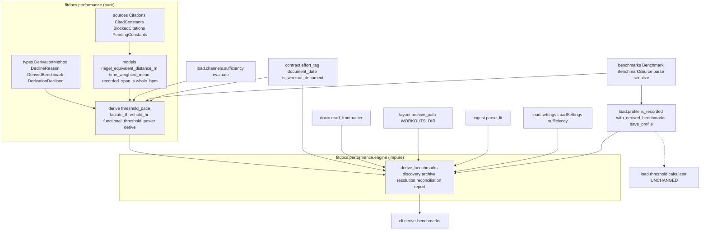
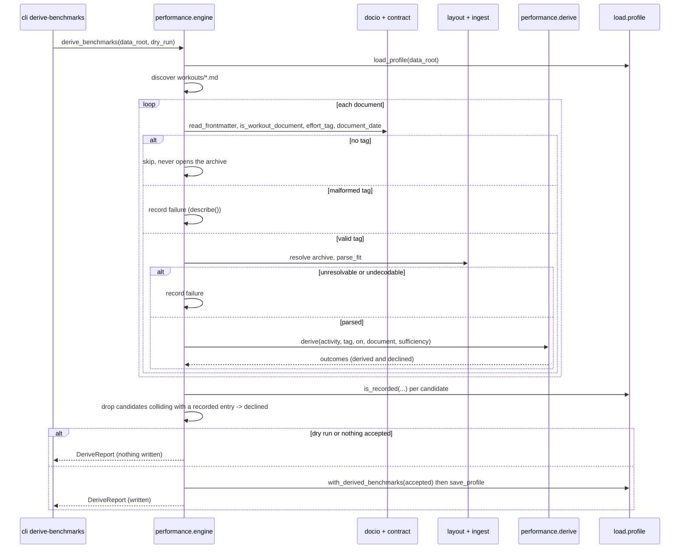
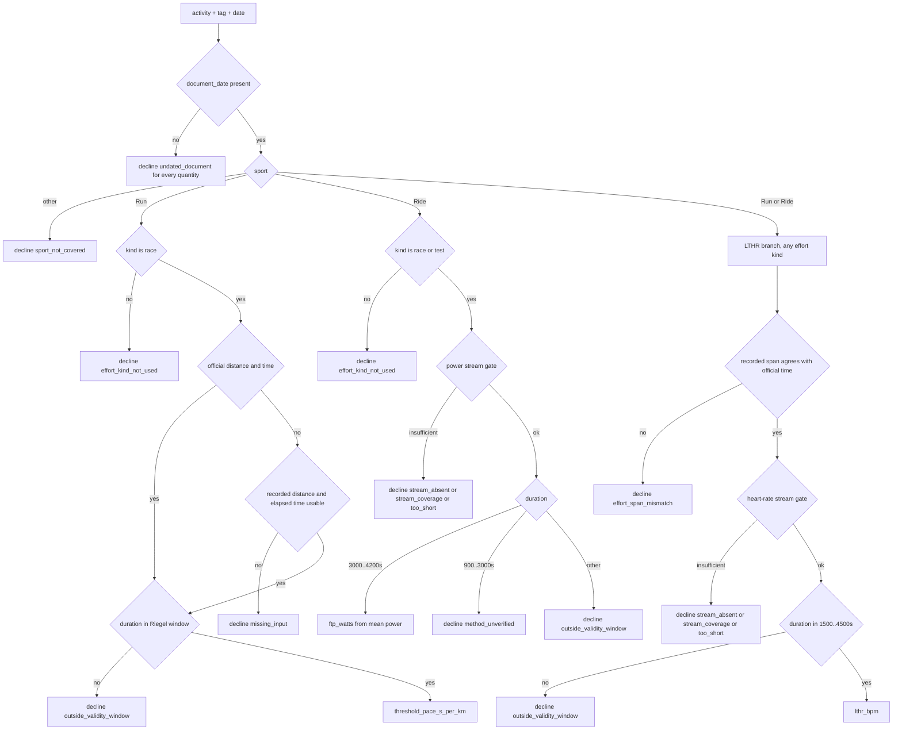

# Technical Design: performance-benchmarks

## Amendment 1 (2026-09-10): the entry shape this spec extends

This design was generated by the Phase 6 spec batch (wave 1) against the
three-field benchmark entry then on `main`. Wave 0 —
`training-load` Amendment 4, queue item
`2026-08-27-prompt-date-strands-historical-documents` — merged at `664960a`
while the batch ran and added a **fourth** recognised entry field,
`applies_from`. This amendment re-points the design at the shape wave 0 left.
Nothing this spec owns changes; only what it extends.

**What changed here**, all of it corrective:

1. `Benchmark` is `kind, discipline, value, measured_on, note, applies_from`.
   `source` is the **fifth** recognised field, appended after `applies_from`.
2. `benchmarks_to_document` emits `value`, `measured_on`, `applies_from`, `note`
   — note that this is *not* the dataclass order — and `source` last. The
   group sort key stays `measured_on` alone.
3. `with_benchmark` already takes `applies_from=`; `source=` is appended after
   it.
4. The merge's inherit-on-absent rule now covers `applies_from` as well as
   `note`. `source`'s absent-→-removed rule is this spec's own and is asymmetric
   to both, deliberately.
5. The deriver never writes `applies_from`; a derived entry is dated by
   `measured_on` and is therefore tier-1 only in the two-tier
   `BenchmarkSet.applicable`. `is_recorded` and the never-overwrite rule read
   `source` alone and are unaffected by dating — but that protection is
   **date-scoped**, and Amendment 1 gives it a case: a derived entry measured
   inside an athlete's declared `applies_from` window wins tier 1 for
   activities in the overlap. Ruled accepted, with the reasoning and the
   "does not decline" consequence in cross-spec obligation 5; the shadowing
   invariant and the traceability line are qualified to match.
6. Task 5.3's upstream edit lands as `athlete-benchmarks` **Amendment 2** —
   Amendment 1 of that spec is wave 0's and is already on `main`.

Details and the obligations they create: *Cross-spec obligations →
performance-benchmarks ↔ athlete-benchmarks / training-load (Amendment 1)*, the
`BenchmarkProvenance` component, and the new revalidation trigger on `source`'s
position.

## Overview

**Purpose**: performance-benchmarks turns the athlete's tagged races, tests and
hard efforts into **dated, provenanced benchmark entries** in `athlete.toml`, so
that the shipped threshold calculator scores nine years of workout pages against
the threshold that was true on each day. It reads only pages `effort-tags` says
are tagged, re-parses each one's archived `.fit` through the same resolution the
training-load pass uses, derives threshold pace (running), lactate-threshold
heart rate (running and cycling) and functional threshold power (cycling)
through cited models, and hands the store ordinary dated entries. No calculator
changes; no channel arithmetic changes; a derived entry is indistinguishable in
use from one the athlete typed, and distinguishable in *origin* by the
provenance record this design adds.

**Users**: the athlete runs one command after tagging pages. `load-history`
and `performance-model-fit` read the derived entries and their provenance.
`athlete-benchmarks` gains the provenance field; `threshold-load` gains
nothing and changes nothing.

**Impact**: one new package (`src/fitdocs/performance/`, four pure modules plus
one pass engine), one new CLI command (`fitdocs derive-benchmarks`), one new
field on a benchmark entry (`source`) threaded through the store's parser,
serializer, merge overlay and write path, one new profile write method, and one
new reference document recording what was read and what was not. No new
settings key, no new owned path, no new dependency, no change to any document.

### Goals
- Derive threshold pace, LTHR and FTP from tagged efforts, each behind an
  explicit validity gate that **refuses** rather than clamps.
- Give every benchmark entry an origin: `source`, closed origin class, machine-
  readable method and document, human-readable inputs, citation key.
- Make the pass idempotent and reconciling: the derived subset of the store is
  a pure function of the current tag set, the archive and the configuration.
- Never touch an entry fitdocs did not derive — not to replace it, not to
  shadow it on its own date.
- Bind every number to a source record, and let one unverified page locator
  block exactly one method rather than the feature.

### Non-Goals
- Estimating inside the calculator (`threshold-load` Req 11.4/11.6 stand),
  aggregating load over time (`load-history`), or fitting constants
  (`performance-model-fit`).
- Detecting efforts, or locating an effort inside a longer recording
  (`effort-detection`, a listed follow-on).
- Max/resting heart rate; critical speed (needs ≥ 2 distances); VDOT (its
  coefficients cannot cite to a page).
- Prompting, rendering, a new settings table, a new owned path, a document type.
- Sports other than running and cycling — declined by name, never silently.

## Boundary Commitments

### This Spec Owns
- The **derivation package** `src/fitdocs/performance/`: its types
  (`DerivationMethod`, `DeclineReason`, `DerivedBenchmark`,
  `DerivationDeclined`), its source records and cited constants
  (`sources.py`), its pure arithmetic (`models.py`), its pure per-quantity
  derivations (`derive.py`), and the pass engine (`engine.py`).
- The **`source` provenance field on a benchmark entry** —
  `BenchmarkSourceKind`, `BenchmarkSource`, `Benchmark.source`, its parsing in
  `parse_benchmarks`, its emission in `benchmarks_to_document`, and the
  replaced-not-inherited rule in `_merge_benchmarks_document`. This is the
  roadmap's Phase 6 Existing Spec Update for `athlete-benchmarks`, landed here.
- The **derived-write path**: `AthleteProfile.is_recorded`,
  `AthleteProfile.with_derived_benchmarks`, and the `source` argument on
  `AthleteProfile.with_benchmark`.
- The **command** `fitdocs derive-benchmarks` (`--out`, `--dry-run`), its
  report rendering, and its registration with the write-confinement guard.
- The **citation records** for Riegel, McGehee, Dumke, Coggan, Drake and
  Borszcz; the `BLOCKED_CITATIONS` and `PENDING_CONSTANTS` sets; and
  `docs/reference/performance-benchmark-sources.md`.
- The **guards**: this package's purity/allowlist guard, the numeric-literal
  guard, the reachability guard (nothing under `load/threshold/` or
  `load/channels/` may import `fitdocs.performance`), and the public-surface
  pin for `fitdocs.performance`.
- The **`athlete-benchmarks` amendment documents**: the new criteria under its
  requirements, the design note, the `spec.json` amendments entry, and the
  boundary line that excluded estimation now pointing here.

### Out of Boundary
- `src/fitdocs/contract.py` and everything in it, including `effort_tag`,
  `USER_KEYS`, `EffortKind`, `EffortTag` and `document_date` — **owned by
  `effort-tags`**. This spec consumes them and registers as a consumer; it adds
  no key, no reader and no validation of its own.
- `src/fitdocs/layout.py`, `OWNED_PATHS`, `DECLARED_DIRS`, the confinement
  *guard's* owned-path semantics, and any render or CLI file for a history page
  — **owned by `load-history`**. This spec claims no path and adds no
  declaration; it only appends one entry point to the existing guard's
  registry.
- The threshold calculator, any channel's arithmetic, channel selection,
  arbitration, and `LoadResult` (`threshold-load`, `load-channels`).
- `src/fitdocs/load/settings.py` — **not edited**. No key is added, removed or
  reinterpreted.
- The benchmark vocabulary itself (`BenchmarkKind`, scoping, integral kinds,
  dated selection, staleness) — `athlete-benchmarks`; unchanged apart from the
  added field.
- The prompt and its dating (`training-load`, wave 0). Derived entries carry
  their own dates and do not depend on that fix.
- The effort-tag vocabulary, its validation and its byte-for-byte carry
  (`effort-tags`).

### Allowed Dependencies

Dependency direction, extended (existing arrows unchanged):

```
model, citation, contract   (pure leaves)
  -> metrics -> load.channels
  -> benchmarks, athlete
  -> performance.types -> performance.sources -> performance.models
  -> performance.derive                              (all four pure)
  -> load.profile
  -> performance.engine                              (impure)
  -> cli
```

- `performance.types` imports `fitdocs` (`Sport`), `fitdocs.benchmarks`
  (`BenchmarkKind`), `fitdocs.load.channels.types` (`InsufficiencyReason`) and
  stdlib only.
- `performance.sources` imports `fitdocs.citation`, `performance.types` (for
  `DerivationMethod`, which `BLOCKED_METHODS` is keyed by) and stdlib only. It
  holds **no arithmetic**.
- `performance.models` imports `fitdocs` (`Samples`), `math` and this package's
  `sources`. Pure functions, no I/O, no clock.
- `performance.derive` imports `fitdocs` (`Activity`, `Modality`, `Sport`),
  `fitdocs.benchmarks`, `fitdocs.contract` (`EffortKind`, `EffortTag`),
  `fitdocs.load.channels.sufficiency` and `...channels.types`, and this
  package's `types`, `sources`, `models`. Pure: no file, no network, no clock.
- `performance.engine` additionally imports `fitdocs.docio`,
  `fitdocs.layout`, `fitdocs.ingest` (via `fitdocs.parse_fit`),
  `fitdocs.load.profile`, `fitdocs.load.settings`, `fitdocs.settings` and
  `pathlib`.
- `cli` imports `performance.engine` and `performance.types` only.
- **Forbidden, structurally asserted**: no module under
  `src/fitdocs/load/channels/` or `src/fitdocs/load/threshold/` imports
  `fitdocs.performance`; `fitdocs.performance` imports nothing from
  `fitdocs.render`, `fitdocs.sync` or `fitdocs.cli`; the four pure modules
  import nothing that reaches the filesystem, the network or the clock.

### Revalidation Triggers
- Changing `BenchmarkSource`'s field set, `BenchmarkSourceKind`'s members, or
  the required-field rule → `athlete-benchmarks`' amended criteria, the
  serializer's key order, the profile round-trip goldens, and
  `performance-model-fit`'s reading of provenance all move together.
- Changing `DerivationMethod`'s members → the entries already in an athlete's
  `athlete.toml` carry the old names; the pass must still read them as derived
  (it does — the store validates shape, not the name) and reconcile them away.
- Changing the replaced-not-inherited rule for `source` in
  `_merge_benchmarks_document` → `athlete-benchmarks`' forward-compatibility
  criteria and its merge tests.
- Changing the **position** of `source` on `Benchmark`, in
  `benchmarks_to_document`'s emitted key order, or in `with_benchmark`'s
  keyword list → `athlete-benchmarks` Amendment 1's four-field shape and the
  tests that actually pin it:
  `tests/test_benchmarks.py::test_round_trip_parse_of_serialize_equals_original_set`,
  `::test_serializer_sorts_mixed_group_by_measured_on_not_applies_from`,
  `::test_serializer_attaches_applies_from_to_correct_sibling_after_sorting`,
  and the profile-store merge tests. `source` is
  appended after `applies_from` and nothing already there moves; a task that
  finds it needs to reorder stops and reports (Amendment 1 below).
- Unblocking `TWENTY_MINUTE_POWER_FACTOR` (the Allen & Coggan locator is
  verified) → `sources.py`, `BLOCKED_METHODS`, the decline tests, the
  reference document, and the roadmap's Direct Implementation Candidate.
- Changing which `[load].sufficiency` keys this pass reads → this design's
  "no new settings" commitment and `load/settings.py`'s consumer list.
- Adding a sport → the discipline routing table, the decline tests, and the
  citation record for whatever model the new sport needs.

### Cross-spec obligations

**performance-benchmarks ↔ athlete-benchmarks / training-load (Amendment 1)**
1. The benchmark entry this spec extends is the **post-Amendment-1** one, not
   the three-field entry on `main` when this design was first written.
   `Benchmark`'s fields, in order: `kind, discipline, value, measured_on, note,
   applies_from`. `source` is appended after `applies_from`; nothing is re-added
   and nothing is reordered.
2. `benchmarks_to_document` emits `value`, `measured_on`, `applies_from` (only
   when present), `note` (only when present). `source` is emitted last. Omitting
   a `None` field is load-bearing for the store's rewrite merge — see that
   function's docstring — and this spec preserves that for `source` in the one
   direction its own rule differs (absent → *removed*, not inherited; below).
3. `AthleteProfile.with_benchmark(kind, *, discipline, value, measured_on,
   note=None, applies_from=None)` — this spec's `source=` keyword goes last.
4. `BenchmarkSet.applicable` is two-tier since Amendment 1: tier 1 is the latest
   entry measured on or before the activity; tier 2, reached only when tier 1 is
   empty, is the earliest-measured entry whose athlete-declared `applies_from`
   reaches the activity. **A derived entry carries no `applies_from`, so it is
   tier-1 only, exactly like a hand-written measurement.** This spec's deriver
   never sets one: a derived entry is dated by `measured_on` = the effort's own
   document date (Cross-spec obligation 4 under *effort-tags*), and
   `applies_from` is an athlete declaration made at a prompt or by hand. An
   athlete may still add one to a derived entry by hand — the store validates
   the field, not who wrote it — and a refresh of that entry preserves it under
   the inherit-on-absent rule.
5. `is_recorded` and the never-overwrite rule (6.1–6.8) read `source` alone and
   are **unaffected by `applies_from`**: an entry's protection from this pass
   turns on its origin, never on its dating. `is_recorded` matches an exact
   `(discipline, kind, measured_on)`, so the protection is **date-scoped** —
   which Amendment 1 makes worth stating outright, because it now has a case:

   > The athlete records an FTP `measured_on = 2026-06-01` with
   > `applies_from = 2026-01-01`, declaring it covers activities back to
   > January. The pass derives an FTP from a race on 2026-03-01. There is no
   > same-date collision, so `is_recorded` is `False` and the pass writes it.
   > Scoring an activity on 2026-04-01, `BenchmarkSet.applicable` finds the
   > derived entry in **tier 1** and never reaches tier 2, so the derived
   > number wins inside the athlete's declared window.

   **This is accepted, not a 6.1/6.2 violation.** `athlete-benchmarks` Req 3.10
   makes tier 1 beat tier 2 unconditionally — "an entry measured on or before
   the activity shall always take precedence over a retroactively applied one"
   — and a measurement dated nearer the activity is the better anchor whoever
   wrote it. Requirement 6's "shadow" is date-scoped throughout (the Goal at
   *Non-Goals → Goals* already says "on its own date"). **The pass therefore
   does not decline on window overlap**, and no `DeclineReason` covers it;
   declining instead would be a behavioural change needing its own criterion,
   not a prose edit here.
6. `_merge_benchmarks_document` has **no scope conditional** and must keep none.
   The `training-load` 7.2 reviewer noted that an athlete-scope-only regression
   in preserve/overlay would pass the store suite because no fixture varies
   scope through the merge. Every overlay branch this spec adds for `source`
   gets an athlete-wide fixture alongside its discipline-scoped one.
7. Sequencing lesson carried forward from `training-load` task 7.1 (seven review
   rounds; its tasks.md § Implementation Notes): on any task that adds a field
   to this entry shape, enumerate layers × scopes × kinds × group shapes before
   the first report.

**performance-benchmarks ↔ effort-tags**
1. The pass reads a page as `docio.read_frontmatter(path)` →
   `contract.is_workout_document(fm)` → `contract.effort_tag(fm)`, and branches
   on `None` / `EffortTag` / `InvalidEffortTag`. It defines no second reader and
   spells no effort key; `fitdocs.performance.engine` registers in
   `tests/test_contract_consumers.py::CONTRACT_BINDINGS` with `effort_tag`
   (plus `document_date` and `is_workout_document` as used).
2. `InvalidEffortTag` is a **failure** for this pass, reported with
   `InvalidEffortTag.describe()` and never read as untagged (Req 1.6).
3. `EffortTag.distance_m` / `time_s` / `event` are `None` when absent; the
   fallback to recorded values is this spec's rule and is named in provenance.
4. The entry's date is `contract.document_date(frontmatter)`, never a tag field,
   never the activity's recorded start, never the clock.
5. `EffortKind` is a `StrEnum`; the routing table below `match`es on it and the
   type checker proves exhaustiveness.

**performance-benchmarks ↔ athlete-benchmarks** (the Existing Spec Update)
1. `athlete-benchmarks`' requirements gain an Amendment block adding criteria
   for the `source` field: its optionality, its closed origin class, its
   required fields for a derived origin, its forward-compatible unknown-key
   rule, its preservation on rewrite, and the rule that fitdocs never modifies
   an entry without derived provenance. No existing criterion is renumbered.
2. `athlete-benchmarks`' out-of-scope line "auto-FTP / eFTP estimation of any
   kind" (`requirements.md:70-71`, `design.md:48`) is amended to read that
   estimation is performed by `performance-benchmarks`, which hands this store
   ordinary dated entries, and that this store still performs none itself.
3. `athlete-benchmarks`' `spec.json` gains an amendments entry naming this
   spec and the date.
4. `Benchmark`'s natural key `(discipline, kind, measured_on)` is unchanged;
   `source` is not part of it.

**performance-benchmarks ↔ threshold-load / load-channels**
1. `threshold-load` Req 11.4 and 11.6 stand untouched. The calculator neither
   imports nor is imported by this feature; a reachability test asserts it.
2. The channels package is imported *by* `performance.derive`, never the
   reverse; `tests/load/channels/test_purity.py` keeps passing unchanged.
3. Decline reasons for stream conditions carry `InsufficiencyReason`'s own
   values so both reports read identically (Req 7.4).

**performance-benchmarks ↔ load-history**
1. Distinct commands: this spec adds `fitdocs derive-benchmarks`;
   `load-history` adds its own, separately named. Neither renames the other's.
2. `load-history` owns `layout.py`, `OWNED_PATHS`, `DECLARED_DIRS` and
   `tests/test_confinement.py`'s owned-path semantics. This spec appends one
   `EntryPoint` to that module's existing `WRITING_ENTRY_POINTS` registry and
   changes nothing else in it; `athlete.toml` is already in
   `PERMITTED_SHARED_FILES`.
3. **A derivable effort is not the same predicate as load-history's criterion
   point.** load-history counts only race/test pages carrying an official time
   (observations a fit can use); this pass derives from a wider set (LTHR from
   `hard`; pace from a race with only recorded distance and time). A page can
   yield a benchmark entry and not be a criterion point, and vice versa; the two
   counts are not expected to agree and neither is wrong.

## Architecture

### Existing Architecture Analysis
- **The store already reserved this seam.** `_merge_benchmarks_document`
  (`src/fitdocs/load/profile.py:536-606`) overlays only the recognised fields
  onto an existing raw entry and preserves the rest, naming "a `source` a
  future feature wrote" as the case it protects. `parse_benchmarks` ignores
  unknown entry keys; `benchmarks_to_document` emits four fields --
  `value`, `measured_on`, `applies_from`, `note` -- since `athlete-benchmarks`
  Amendment 1 landed (`training-load` tasks 7.1/7.2, merged at `664960a`);
  the merge's recognised-field overlay covers the same four. `source` is the
  fifth, added on top of that shape rather than into it (Amendment 1 below).
  `save_profile` re-parses the assembled document before `mkstemp`, so a
  serializer/parser disagreement is a loud pre-write failure.
- **Re-parsing a page's archived source is an established pattern.**
  `load/engine.py:613-641` (`_resolve_archive`) resolves the document's last
  `sources` entry to `fit-archive/<sha>.fit` through
  `contract.source_refs`/`sha_of_ref` and `layout.archive_path`, refusing a
  traversal ref. This design reuses the same rule so the two passes can never
  disagree about which file a document came from.
- **Sufficiency is one shared gate.** `load/channels/sufficiency.evaluate`
  measures time-weighted coverage on the raw arrays, orders its verdicts
  (too short → absent → coverage) and never raises.
- **Citation discipline has a shipped shape.** `fitdocs/citation.py` holds the
  sealed vocabulary; `load/channels/sources.py` holds the per-layer records plus
  `BLOCKED_CITATIONS` and its enforcement test; `tests/metrics/
  test_constant_guard.py` holds the numeric-literal scan with an exemption
  registry. All three are adopted, not re-derived.
- **The CLI is flat.** `sync`, `regen`, `load`, `check`, `plugins`, each with
  `--out`, each ending in `_finish(failed=...)`. A new flat command fits without
  introducing a sub-application.

### Architecture Pattern & Boundary Map

Selected pattern: **pure derivation leaf + thin impure pass**, mirroring
`load/channels/*` (pure) plus `load/engine.py` (impure) — the shape this
codebase already reviews well.



**Key decisions not visible in the diagram**
- `Calc` is reached only through the store: a derived entry is an ordinary
  dated entry. The dotted arrow is *data*, never an import.
- `performance.engine` is the only module in the feature that opens a file.
- The pass never opens a `.fit` for an untagged page: the tag is read from
  frontmatter first, and archive resolution happens after the tag branch.

### Technology Stack

| Layer | Choice / Version | Role in Feature | Notes |
|-------|------------------|-----------------|-------|
| CLI | `typer` (existing) | `fitdocs derive-benchmarks`, `--out`, `--dry-run`; `rich` for the report | No new option types; reuses `_OUT_OPTION` |
| Derivation | Python 3.11+ stdlib (`math`, `dataclasses`, `enum.StrEnum`, `datetime`) | Riegel solve, time-weighted means, rounding | Stdlib only, per steering |
| Ingest | `garmin-fit-sdk` via `fitdocs.parse_fit` (existing) | Re-parse a tagged page's archived source | No new decode flags |
| Storage | `tomllib` + `tomli_w` 1.2.0 (existing) | `source` sub-table on a benchmark entry | Round-trip verified empirically (research.md) |
| Config | `[load].sufficiency` (existing) | Stream coverage and minimum duration | **No new key or table** |

## File Structure Plan

### Directory Structure
```
src/fitdocs/
└── performance/                 # NEW package: derivation of dated benchmarks
    ├── __init__.py              # published surface: the pure names, then the engine entry point
    ├── types.py                 # DerivationMethod, DeclineReason, DerivedBenchmark, DerivationDeclined
    ├── sources.py               # Citations, CitedConstants, BLOCKED_CITATIONS, PENDING_CONSTANTS, BLOCKED_METHODS
    ├── models.py                # pure arithmetic: Riegel solve, time-weighted mean, span, whole-bpm rounding
    ├── derive.py                # pure per-quantity derivations + the discipline routing table
    └── engine.py                # the pass: discovery, archive resolution, reconciliation, DeriveReport

tests/performance/              # NEW, mirrors the package
    ├── __init__.py
    ├── test_types.py            # closed vocabularies; DeclineReason covers every InsufficiencyReason
    ├── test_sources.py          # one governing record per constant; blocked sets; cross-package Coggan agreement
    ├── test_constant_guard.py   # numeric-literal scan with an exemption registry (models.py, derive.py)
    ├── test_models.py           # Riegel worked examples, mean/span edge cases, rounding ties
    ├── test_derive.py           # per-quantity gates, declines, official-vs-recorded fallback
    ├── test_purity.py           # import/namespace/builtin allowlists over the four pure modules
    ├── test_reachability.py     # no channels/threshold module imports fitdocs.performance
    └── test_engine.py           # discovery, tagged-only re-parse, reconciliation, idempotence, dry run

docs/reference/
    └── performance-benchmark-sources.md   # NEW: what was read, what was not, and what unblocks the 0.95 factor
```

### Modified Files
- `src/fitdocs/benchmarks.py` — add `BenchmarkSourceKind`, `BenchmarkSource`,
  `Benchmark.source` (appended after Amendment 1's trailing `applies_from`);
  validate `source` in `parse_benchmarks`; emit it last from
  `benchmarks_to_document`, leaving the `value / measured_on / applies_from /
  note` order and the `measured_on`-only group sort key untouched.
- `src/fitdocs/load/profile.py` — `source` argument on `with_benchmark`, added
  after Amendment 1's `applies_from` keyword; new
  `is_recorded` and `with_derived_benchmarks`; the **two-half** `source` overlay
  rule in `_merge_benchmarks_document` (absent in the fresh entry → the
  inherited record is removed; present → the five recognised keys are overlaid
  onto the inherited raw record, so an unknown inner key survives);
  `_validate_benchmark_source`.
- `src/fitdocs/cli.py` — `derive_benchmarks_command`, `_DRY_RUN_OPTION`,
  `_report_derive`.
- `README.md` — one short section naming the command and what it writes
  (`load-history` adds its own section separately).
- `tests/test_cli_derive.py` — **new**: the command's report rendering, exit
  status and the end-to-end scenarios (the shape `tests/load/test_cli_load.py`
  already uses for the load pass's command).
- `tests/test_confinement.py` — append one `EntryPoint` to
  `WRITING_ENTRY_POINTS` (`tests/test_confinement.py:457`); no other change.
  `src/fitdocs/layout.py`, `OWNED_PATHS` and `DECLARED_DIRS` are not touched.
- `tests/test_contract_consumers.py` — register `fitdocs.performance.engine` in
  `CONVERTED_MODULES` and `CONTRACT_BINDINGS`.
- `tests/test_public_api.py` — pin `fitdocs.performance.__all__`.
- `tests/test_benchmarks.py`, `tests/load/test_profile.py` — the store's new
  field, its validation, its merge behaviour and its round trip.
- `.kiro/specs/athlete-benchmarks/{requirements.md,design.md,spec.json}` — the
  Existing Spec Update.

## System Flows

### The pass



Gating notes: the tag branch is what makes Req 1.3 structural — the archive is
resolved inside the "valid tag" arm only. The collision filter runs **after**
every document is processed, so a decline naming an existing recorded entry is
reported once with the full picture. The write is one call, so a run either
updates the store completely or not at all (Req 1.7, 6.7, 6.8).

### Per-quantity gates



Every leaf is an outcome: a `DerivedBenchmark` or a `DerivationDeclined` with a
reason, an observed value and the requirement that refused it. No leaf returns
nothing, which is what makes Req 7.9 ("every decline, not only the first")
structural rather than remembered.

## Requirements Traceability

| Requirement | Summary | Components | Interfaces | Flows |
|-------------|---------|------------|------------|-------|
| 1.1, 1.10 | One command, derivation nowhere else | DeriveCommand | `fitdocs derive-benchmarks` | The pass |
| 1.2, 1.3 | Tagged pages only; untagged archives never opened | PassEngine | `derive_benchmarks` | The pass |
| 1.4, 1.5 | Same archive resolution; unresolvable is a failure | PassEngine | `_resolve_archive` rule reused | The pass |
| 1.6 | Malformed tag is a failure, never untagged | PassEngine | `InvalidEffortTag.describe()` | The pass |
| 1.7, 1.8, 1.9 | Single write; dry run writes nothing; exit status | PassEngine, DeriveCommand | `DeriveReport`, `_finish` | The pass |
| 2.1–2.4, 2.7 | Threshold pace from a race; official beats recorded; unit and dating | DerivationLeaf, PerformanceModels | `threshold_pace`, `riegel_equivalent_distance_m` | Per-quantity gates |
| 2.5, 2.6 | Validity window and missing inputs refuse | DerivationLeaf, PerformanceSources | `DeclineReason.OUTSIDE_VALIDITY_WINDOW`, `MISSING_INPUT` | Per-quantity gates |
| 2.8 | A running test/hard yields no pace | DerivationLeaf | routing table | Per-quantity gates |
| 2.9 | The 60-minute solve is a recorded fitdocs choice | PerformanceSources | `RIEGEL_SOLVE_TARGET` (`FitdocsChoice`) | — |
| 3.1, 3.2, 3.8, 3.9 | LTHR from the whole-effort time-weighted mean, own discipline, provenance | DerivationLeaf, PerformanceModels | `lactate_threshold_hr`, `time_weighted_mean` | Per-quantity gates |
| 3.3, 3.4, 3.5, 3.6 | Duration window, coverage gate, absent stream, span mismatch | DerivationLeaf, SufficiencyReuse | `sufficiency.evaluate`, `DeclineReason` | Per-quantity gates |
| 3.7 | Whole bpm by a stated rounding rule | PerformanceModels, PerformanceSources | `whole_bpm`, `ROUNDING_HALF_OFFSET` | — |
| 4.1, 4.2, 4.10 | FTP from the definition's own window, whole watts, dating | DerivationLeaf, PerformanceSources | `functional_threshold_power`, `COGGAN_2003` | Per-quantity gates |
| 4.3, 4.4 | The 20-minute factor is blocked; only that method declines | PerformanceSources, DerivationLeaf | `BLOCKED_METHODS`, `PENDING_CONSTANTS` | Per-quantity gates |
| 4.5, 4.6, 4.7 | Power coverage, no power at all, outside every window | DerivationLeaf, SufficiencyReuse | `sufficiency.evaluate` | Per-quantity gates |
| 4.8 | Limits of agreement in every FTP provenance note | PerformanceSources, DerivationLeaf | `BORSZCZ_2018` corroboration | — |
| 4.9 | Running power never yields FTP | DerivationLeaf | routing table | Per-quantity gates |
| 5.1–5.4, 5.6–5.8 | The `source` field: shape, parse, emit, preserve, readable | BenchmarkProvenance | `BenchmarkSource`, `parse_benchmarks`, `benchmarks_to_document` | — |
| 5.5, 5.10 | Malformed provenance is loud; shape validated, method name open | BenchmarkProvenance | `_validate_benchmark_source` | — |
| 5.9 | `with_benchmark` accepts provenance | ProfileDerivedWrite | `with_benchmark(source=...)` | — |
| 6.1, 6.2 | Never modify a non-derived entry, nor shadow one on its own date (obligation 5) | ProfileDerivedWrite, PassEngine | `is_recorded`, `DeclineReason.SUPERSEDED_BY_RECORDED` | The pass |
| 6.3, 6.4, 6.5, 6.6 | Replace only derived; reconcile; idempotent; preserve everything else | ProfileDerivedWrite | `with_derived_benchmarks` | The pass |
| 6.7, 6.8 | Refuse an unreadable write; atomic | ProfileDerivedWrite | `save_profile` (existing) | The pass |
| 7.1–7.3, 7.9 | The report's counts, derivations, declines with reasons | DeriveReport, DeriveCommand | `DeriveReport`, `_report_derive` | The pass |
| 7.4 | Shared vocabulary with the load pass | PerformanceTypes | `DeclineReason.from_insufficiency` | — |
| 7.5, 7.6, 7.7 | Sport not covered, undated page, no cycling power anywhere | DerivationLeaf, DeriveReport | routing table, report summary | Per-quantity gates |
| 7.8 | Decline versus failure, in report and exit status | PassEngine, DeriveCommand | `DeriveReport.failures` | The pass |
| 8.1–8.3, 8.6 | One governing record per constant; choices recorded; no bare literal; corroborators | PerformanceSources, ConstantGuard | `CitedConstant`, `FitdocsChoice`, `Corroboration` | — |
| 8.4, 8.5 | Tracked secondary attestation; an unverified locator blocks its constant | PerformanceSources | `BLOCKED_CITATIONS`, `PENDING_CONSTANTS` | — |
| 8.7 | Citation key in every derived entry's provenance | DerivationLeaf, BenchmarkProvenance | `BenchmarkSource.citation` | — |
| 8.8 | One work described one way across the package | PerformanceSources tests | cross-package agreement test | — |
| 9.1–9.3 | Deterministic, offline, clock-free | PassEngine, PurityGuards | sorted discovery, purity allowlists | The pass |
| 9.4, 9.5, 9.6 | Writes only `athlete.toml`; no documents; data-root precedence | PassEngine, ConfinementRegistration | `WRITING_ENTRY_POINTS` | The pass |
| 9.7, 9.8 | No new settings; windows are constants, not configuration | PassEngine, PerformanceSources | `LoadSettings.sufficiency` | — |
| 10.1, 10.2 | Calculator untouched and unreachable | ReachabilityGuard | import scan | — |
| 10.3 | One tag reader | PassEngine | `CONTRACT_BINDINGS` | — |
| 10.4–10.7 | No max/resting HR, no detection, no prompting, no aggregation or rendering | DerivationLeaf, PurityGuards | vocabulary scope, purity allowlists | — |
| 10.8 | No owned path, no document type | (no change) | `layout.py` untouched | — |
| 10.9 | The store's boundary line names this pass | AthleteBenchmarksAmendment | spec documents | — |

## Components and Interfaces

| Component | Domain/Layer | Intent | Req Coverage | Key Dependencies (P0/P1) | Contracts |
|-----------|--------------|--------|--------------|--------------------------|-----------|
| PerformanceTypes | performance (pure) | Closed vocabularies and outcome values | 5.10, 7.3, 7.4 | benchmarks (P0), channels.types (P0) | State |
| PerformanceSources | performance (pure) | Every constant's governing record and the blocked sets | 8.1–8.8, 2.9, 3.7 | citation (P0) | State |
| PerformanceModels | performance (pure) | The arithmetic: Riegel solve, time-weighted mean, span, rounding | 2.1, 3.2, 3.7, 4.2 | sources (P0), model.Samples (P0) | Service |
| DerivationLeaf | performance (pure) | One outcome per quantity, each behind its gate | 2.x, 3.x, 4.x, 7.5, 10.4, 10.5 | models (P0), sufficiency (P0), contract (P0) | Service |
| PassEngine | performance (impure) | Discovery, archive resolution, reconciliation, report | 1.x, 6.x, 7.x, 9.x | docio/contract (P0), profile (P0), ingest (P0) | Batch |
| BenchmarkProvenance | benchmarks (leaf) | `source` on an entry: shape, parse, emit | 5.1–5.8, 5.10, 8.7 | citation-free; stdlib (P0) | State |
| ProfileDerivedWrite | load.profile | The derived-subset write and the never-overwrite rule | 5.9, 6.1–6.8 | benchmarks (P0) | Service |
| DeriveCommand | cli | The command, its options and its report rendering | 1.1, 1.8, 1.9, 7.1–7.3, 7.8 | engine (P0), config (P0) | API |
| Guards | tests | Purity, reachability, literal scan, public-surface pin | 8.3, 9.2, 9.3, 10.2 | ast (P0) | — |
| ConfinementRegistration | tests | One more writing entry point under the existing guard | 9.4, 9.5 | test_confinement (P1) | — |
| AthleteBenchmarksAmendment | specs | The Existing Spec Update landed here | 10.9, 5.x | — | — |

### performance (pure)

#### PerformanceTypes

| Field | Detail |
|-------|--------|
| Intent | The closed vocabularies and the two outcome values every other component speaks in |
| Requirements | 5.10, 7.3, 7.4 |

**Responsibilities & Constraints**
- Owns `DerivationMethod` (the closed method-name vocabulary the store
  deliberately does not own) and `DeclineReason`.
- `DeclineReason` includes, by identical string value, every
  `InsufficiencyReason` member `sufficiency.evaluate` can return — `TOO_SHORT`,
  `STREAM_ABSENT`, `STREAM_COVERAGE` — so a stream decline reads identically in
  both reports (7.4). `from_insufficiency` is **exhaustively decided** rather
  than total: it maps those three by identical value and raises `ValueError`
  for any other `InsufficiencyReason` member (`NO_BENCHMARK`,
  `BENCHMARKS_INCONSISTENT`, `MODEL_NOT_DEFINED`, `NOT_COMPUTABLE` — verdicts
  the gate never produces and this pass never receives), because inventing a
  decline reason for a verdict that cannot arrive would fabricate an outcome.
  A test iterates every member of `InsufficiencyReason` and asserts each one
  either maps by identical value or raises, so a new member added upstream
  reddens here rather than falling through.
- Holds no arithmetic, no I/O and no citation record.

##### Service Interface
```python
class DerivationMethod(StrEnum):
    RIEGEL_RACE_EQUIVALENCE = "riegel_race_equivalence"
    SUSTAINED_EFFORT_MEAN_HR = "sustained_effort_mean_hr"
    TIME_TRIAL_MEAN_POWER = "time_trial_mean_power"
    TWENTY_MINUTE_POWER_FACTOR = "twenty_minute_power_factor"

class DeclineReason(StrEnum):
    SPORT_NOT_COVERED = "sport_not_covered"
    EFFORT_KIND_NOT_USED = "effort_kind_not_used"
    UNDATED_DOCUMENT = "undated_document"
    MISSING_INPUT = "missing_input"
    OUTSIDE_VALIDITY_WINDOW = "outside_validity_window"
    EFFORT_SPAN_MISMATCH = "effort_span_mismatch"
    METHOD_UNVERIFIED = "method_unverified"
    SUPERSEDED_BY_RECORDED = "superseded_by_recorded"
    STREAM_ABSENT = "stream_absent"        # == InsufficiencyReason.STREAM_ABSENT
    STREAM_COVERAGE = "stream_coverage"    # == InsufficiencyReason.STREAM_COVERAGE
    TOO_SHORT = "too_short"                # == InsufficiencyReason.TOO_SHORT

    @classmethod
    def from_insufficiency(cls, reason: InsufficiencyReason) -> DeclineReason:
        """The three verdicts ``sufficiency.evaluate`` can return, by identical
        value. Any other member raises ``ValueError`` (a programming error)."""

@dataclass(frozen=True)
class DerivedBenchmark:
    kind: BenchmarkKind
    discipline: Sport
    value: float
    measured_on: date
    method: DerivationMethod
    citation_key: str
    inputs: str
    note: str
    document: str          # data-root-relative POSIX path

@dataclass(frozen=True)
class DerivationDeclined:
    kind: BenchmarkKind
    method: DerivationMethod | None
    reason: DeclineReason
    detail: str
    observed: float | None = None
    required: float | None = None

DerivationOutcome = DerivedBenchmark | DerivationDeclined
```
- Preconditions: none; these are values.
- Postconditions: `DerivedBenchmark.value` is finite and positive;
  `discipline` is `Sport.RUN` or `Sport.RIDE`.
- Invariants: `from_insufficiency` returns a member outside the three shared
  ones for no input; every `InsufficiencyReason` member is either mapped or
  rejected, never silently coerced.

#### PerformanceSources

| Field | Detail |
|-------|--------|
| Intent | Every number in the feature bound to exactly one governing record; the two blocked sets |
| Requirements | 8.1–8.8, 2.9, 3.3, 3.6, 3.7, 4.2, 4.8 |

**Responsibilities & Constraints**
- Holds **no arithmetic** (the `citation.py`/`channels.sources` convention).
- Each constant is a `CitedConstant[float]`. The shipped set:

| Constant | Value | Governing record | Verification | Corroborators |
|----------|-------|------------------|--------------|---------------|
| `RIEGEL_EXPONENT` | 1.06 | `RIEGEL_1981` | `SECONDARY_ATTESTATION` (tracked) | `DRAKE_2024` (AGREES) |
| `RIEGEL_MIN_DURATION_S` | 210.0 | `RIEGEL_1981` | `SECONDARY_ATTESTATION` (tracked) | — |
| `RIEGEL_MAX_DURATION_S` | 13800.0 | `RIEGEL_1981` | `SECONDARY_ATTESTATION` (tracked) | — |
| `RIEGEL_SOLVE_TARGET_S` | 3600.0 | `FitdocsChoice` | `FITDOCS_MEASURED` | — |
| `LTHR_MIN_DURATION_S` | 1500.0 | `FitdocsChoice` | `FITDOCS_MEASURED` | `MCGEHEE_2005`, `DUMKE_2006` |
| `LTHR_MAX_DURATION_S` | 4500.0 | `FitdocsChoice` | `FITDOCS_MEASURED` | `MCGEHEE_2005`, `DUMKE_2006` |
| `EFFORT_SPAN_TOLERANCE` | 0.05 | `FitdocsChoice` | `FITDOCS_MEASURED` | — |
| `FTP_DEFINITION_MIN_DURATION_S` | 3000.0 | `COGGAN_2003` | `PRIMARY_TEXT` | `BORSZCZ_2018` |
| `FTP_DEFINITION_MAX_DURATION_S` | 4200.0 | `COGGAN_2003` | `PRIMARY_TEXT` | `BORSZCZ_2018` |
| `FTP_SHORT_PROTOCOL_FLOOR_S` | 900.0 | `FitdocsChoice` | `FITDOCS_MEASURED` | — |
| `ROUNDING_HALF_OFFSET` | 0.5 | `FitdocsChoice` | `FITDOCS_MEASURED` | — |

- `RIEGEL_SOLVE_TARGET_S` is fitdocs' own step (2.9): Riegel's law states an
  equivalence between two distances; solving it for the distance whose
  predicted time is one hour is this project's move, and 3600 s lies inside
  Riegel's own validity window.
- `LTHR_*_DURATION_S` are fitdocs' choices *informed by* the two validated
  protocols (1800 s and 3600 s). No published work states a window, so the
  bounds are recorded as a choice with both papers as corroborators and the
  margins stated in the justification. The "final 20 of 30 minutes" coaching
  protocol is **not** implemented and is recorded as a `Departure`: its
  10-minute discard is unsourced, and both primary papers used the whole-effort
  average.
- `FTP_SHORT_PROTOCOL_FLOOR_S` is a *routing* floor, not Allen & Coggan's
  number: it is the shortest cycling effort for which this feature will name the
  blocked short protocol rather than "outside every window". It carries no
  relation to the unverified 20-minute constant.
- `ROUNDING_HALF_OFFSET` is the one rounding record, and it is a
  `CitedConstant` (value `0.5`) governed by a `FitdocsChoice`, exactly as
  `RIEGEL_SOLVE_TARGET_S` is — so the `0.5` in `math.floor(x + 0.5)` is reached
  through a bound record rather than standing as a bare literal the guard
  cannot classify (8.1, 8.3). The choice records round-half-away-from-zero
  because `round()`'s banker's rule makes an integer value depend on parity
  (9.1), and it governs **both** whole beats per minute (which the store
  requires — `lthr_bpm` is an integral kind) and whole watts (which the store
  does *not* require: `ftp_watts` accepts a float, so rounding it is purely
  fitdocs' choice and is recorded as one) (3.7, 4.10).
- `BLOCKED_CITATIONS: frozenset[str]` names every citation carrying
  `SECONDARY_ATTESTATION` as a tracked, non-silent exception (`riegel_1981`
  today), with a note stating that the JSTOR 1981 text has not been read
  (8.4). A test fails on any `SECONDARY_ATTESTATION` citation not named there.
- `PENDING_CONSTANTS: tuple[PendingConstant, ...]` names a constant that **may
  not be written** because its locator is unverified — today exactly one: the
  Allen & Coggan 0.95 × 20-minute factor, with the work, the suspected
  chapter, and what must be read (8.5). No numeric value appears in the record.
  `load-history` records the same block in its own shape — `BlockedPreset` /
  `BLOCKED_PRESETS` in `src/fitdocs/history/sources.py` — and both are blocked
  by the *same* roadmap Direct Implementation Candidate, so one reading task
  clears two files. A shared record type was deliberately **not** introduced:
  per-package citation shapes are the established precedent (`Divergence` in
  `load/channels/sources.py:104`), and a queue item tracks promoting one shape
  into `fitdocs.citation` later.
- `BLOCKED_METHODS: frozenset[DerivationMethod]` = `{TWENTY_MINUTE_POWER_FACTOR}`
  today. A test asserts every `PendingConstant` has a blocking method and that
  every blocked method declines at runtime.

**Dependencies**
- Outbound: `fitdocs.citation` — the sealed vocabulary (P0).
- External: none.

**Implementation Notes**
- Integration: `docs/reference/performance-benchmark-sources.md` restates the
  table above in prose with what was read and what was not, mirroring
  `docs/reference/banister-trimp-primary-sources.md`.
- Validation: a test asserts this module's Coggan (2003) record agrees with
  `fitdocs.load.channels.sources.COGGAN_TSS` on authors, year and work while
  carrying its own locator (8.8). The test imports both; only the *test* may.
- Risks: unblocking the 0.95 factor later must not silently widen the FTP
  window — the revalidation trigger names every file that moves with it.

#### PerformanceModels

| Field | Detail |
|-------|--------|
| Intent | The feature's arithmetic, as pure functions over stdlib types |
| Requirements | 2.1, 2.5, 3.2, 3.7, 4.2 |

##### Service Interface
```python
def riegel_equivalent_distance_m(*, distance_m: float, time_s: float) -> float | None: ...
def threshold_pace_s_per_km(*, distance_m: float, time_s: float) -> float | None: ...
def time_weighted_mean(samples: Samples, values: Sequence[float | int | None]) -> float | None: ...
def recorded_span_s(samples: Samples) -> float | None: ...
def whole_bpm(value: float) -> int: ...
def whole_watts(value: float) -> int: ...
```
- Preconditions: `distance_m` and `time_s` finite and > 0; callers gate first.
- Postconditions: every function returns `None` rather than raising when its
  inputs cannot support a value (fewer than two samples, a zero span, a
  wholly unrecorded stream) — the absent-data rule.
- Invariants: `time_weighted_mean` accumulates over exactly the same
  consecutive-pair domain as `sufficiency.stream_coverage` (interval credited
  to the *earlier* sample), so a mean can never be computed over a domain the
  coverage verdict did not measure. This is a deliberate difference from
  `fitdocs.metrics.aggregates._mean_non_none`, which is a sample-count mean;
  the two are not interchangeable here and the docstring says why.

**Implementation Notes**
- `threshold_pace_s_per_km` composes the Riegel solve with the unit
  conversions; the conversions (1000 m/km, 3600 s/h) are registered in the
  literal guard's exemption table with the reason "unit conversion, not a
  methodology constant", exactly as `tests/metrics/test_constant_guard.py`
  registers its own.
- Worked example pinned in tests: a 5 000 m race in 1 200 s gives a 60-minute
  distance of `5000 * (3600/1200) ** (1/1.06)`; the test states the expected
  value to a stated tolerance and names the mutation it dies on (exponent
  1.06 → 1.0).

#### DerivationLeaf

| Field | Detail |
|-------|--------|
| Intent | One outcome per quantity for one activity, each behind its own gate |
| Requirements | 2.1–2.9, 3.1–3.9, 4.1–4.10, 7.5, 7.6, 10.4, 10.5 |

**Responsibilities & Constraints**
- Pure: takes the parsed `Activity`, the `EffortTag`, the page's `date`, the
  page's data-root-relative path and a `SufficiencySettings`; returns a tuple of
  outcomes. Opens nothing, consults no clock.
- Owns the discipline routing table:

| Sport | Quantities attempted | Effort kinds used |
|-------|----------------------|-------------------|
| `Sport.RUN` | `threshold_pace_s_per_km`, `lthr_bpm` | pace: `race` only; LTHR: `race`, `test`, `hard` |
| `Sport.RIDE` | `ftp_watts`, `lthr_bpm` | FTP: `race`, `test`; LTHR: `race`, `test`, `hard` |
| every other | none | — (one `SPORT_NOT_COVERED` decline naming the sport) |

- Official beats recorded (2.2–2.4): when the tag carries both
  `distance_m` and `time_s`, those are the Riegel inputs and `inputs` records
  `"official distance … m, official time … s (effort tag)"`; otherwise the
  activity's recorded distance and elapsed time are used and `inputs` records
  `"recorded distance … m, recorded elapsed time … s (activity)"`. A tag
  carrying `time_s` alone does **not** supply a distance (effort-tags allows
  time to stand alone), so the recorded distance is used and the mixed origin
  is named.
- Span agreement (3.6): where the tag carries `time_s`, the recorded span must
  be within `EFFORT_SPAN_TOLERANCE` of it, or LTHR and FTP decline
  `EFFORT_SPAN_MISMATCH` naming both durations. Threshold pace is unaffected —
  it uses the official pair directly and never averages a stream.
- Blocked method (4.3, 4.4): a cycling effort between
  `FTP_SHORT_PROTOCOL_FLOOR_S` and `FTP_DEFINITION_MIN_DURATION_S` declines
  `METHOD_UNVERIFIED` with a detail naming the work, the unverified locator and
  what must be read. Every other derivation in the run is unaffected.
- FTP provenance (4.8) always carries Borszcz et al.'s limits of agreement in
  its note text.

##### Service Interface
```python
def derive(
    activity: Activity,
    tag: EffortTag,
    *,
    on: date | None,
    document: str,
    sufficiency: SufficiencySettings,
) -> tuple[DerivationOutcome, ...]: ...

def threshold_pace(activity, tag, *, on, document) -> DerivationOutcome: ...
def lactate_threshold_hr(activity, tag, *, on, document, sufficiency) -> DerivationOutcome: ...
def functional_threshold_power(activity, tag, *, on, document, sufficiency) -> DerivationOutcome: ...
```
- Preconditions: `tag` is a valid `EffortTag` (the engine has already rejected
  `InvalidEffortTag`).
- Postconditions: exactly one outcome per quantity the routing table attempts,
  and exactly one `SPORT_NOT_COVERED` outcome for an uncovered sport; `on is
  None` yields one `UNDATED_DOCUMENT` outcome per attempted quantity (7.6).
- Invariants: never raises; never returns an empty tuple; every declined
  outcome carries a non-empty `detail`.

### performance (impure)

#### PassEngine

| Field | Detail |
|-------|--------|
| Intent | The pass: discover, resolve, derive, reconcile, report, write once |
| Requirements | 1.1–1.10, 6.1–6.8, 7.1–7.9, 9.1–9.7, 10.3 |

**Contracts**: Batch [x] / Service [x]

##### Batch / Job Contract
- **Trigger**: `fitdocs derive-benchmarks` only (1.10).
- **Input**: every `*.md` under `<data-root>/workouts/`, discovered in sorted
  order (9.1); `<data-root>/athlete.toml`; `<data-root>/fitdocs.toml`'s
  `[load].sufficiency`.
- **Output**: `DeriveReport`, and at most one write to `athlete.toml` (9.4).
- **Idempotency & recovery**: the derived subset of the store is a pure
  function of (tags, archive, sufficiency settings), so a repeated run is a
  no-op at byte level (6.5); a failed write leaves the previous file intact
  (6.7, 6.8, inherited from `save_profile`).

##### Service Interface
```python
@dataclass(frozen=True)
class DeriveEntry:
    document: str
    derived: tuple[DerivedBenchmark, ...]
    declined: tuple[DerivationDeclined, ...]

@dataclass(frozen=True)
class DeriveFailure:
    document: str
    reason: str

@dataclass(frozen=True)
class DeriveReport:
    considered: int
    tagged: int
    entries: tuple[DeriveEntry, ...]
    failures: tuple[DeriveFailure, ...]
    written: bool

    @property
    def derived(self) -> tuple[DerivedBenchmark, ...]: ...
    @property
    def declined(self) -> tuple[DerivationDeclined, ...]: ...

def derive_benchmarks(data_root: Path, *, dry_run: bool = False) -> DeriveReport: ...
```
- Preconditions: `data_root` resolved by the caller through the existing
  precedence (9.6).
- Postconditions: `written` is `True` only when the profile was actually
  replaced; `dry_run=True` guarantees `written is False` and no filesystem
  mutation (1.8).
- Invariants: no `.fit` is opened for a document whose frontmatter carries no
  tag (1.3); no document is written (9.5); no clock is read (9.3).

**Responsibilities & Constraints**
- Reads each page exactly once through `docio.read_frontmatter`, then
  `contract.is_workout_document`, `contract.effort_tag`,
  `contract.document_date` (10.3).
- Resolves the archive by the same rule as `load/engine._resolve_archive`
  (last `sources` ref → `sha_of_ref` → `layout.archive_path`, refusing a
  traversal ref) (1.4). The rule is shared by *behaviour and test*, not by
  import: duplicating a private helper is rejected below.
- Collision filter: for each candidate, `profile.is_recorded(kind,
  discipline=…, measured_on=…)`; a hit becomes a
  `SUPERSEDED_BY_RECORDED` decline naming the existing entry's value and date,
  and the candidate is dropped (6.1, 6.2).
- Reports a summary line per quantity with zero derivations across the whole
  run, naming the dominant decline reason — this is what makes 7.7 ("no
  cycling file carried power") an explicit statement rather than an absence.
- Failure classes (7.8, 1.5, 1.6): unresolvable archive, undecodable `.fit`,
  unreadable document, malformed tag. Everything else is a decline.

**Dependencies**
- Inbound: `cli` (P0).
- Outbound: `performance.derive` (P0); `fitdocs.docio`, `fitdocs.contract`
  (P0); `fitdocs.layout` (P0); `fitdocs.parse_fit` (P0);
  `fitdocs.load.profile` (P0); `fitdocs.load.settings` + `fitdocs.settings`
  (P1).

**Implementation Notes**
- Integration: registered in `tests/test_contract_consumers.py` and
  `tests/test_confinement.py`.
- Validation: a test drives the pass over a data root containing one tagged and
  one untagged page and asserts, by instrumenting the archive directory's
  access, that only the tagged page's archive was opened (1.3).
- Risks: the archive-resolution rule **and** the `workouts/*.md` discovery rule
  are each stated twice (here and in `load/engine.py`; `load-history` states the
  discovery rule again). Importing `load.engine._resolve_archive` would drag the
  load pass's whole import surface into this one and couple two passes through
  a private name. The mitigation is a **shared behavioural test** covering both
  rules: over one fixture data root the two passes are asserted to discover the
  same document set — the same sorted top-level `*.md` glob under `workouts/`
  behind the same `is_workout_document` filter (`load/engine.py:605-611`) — and
  one fixture document is resolved by both passes with the two results asserted
  equal, including for the traversal-ref refusal. Recorded as an accepted
  duplication with a named guard, not as an oversight.

### benchmarks / profile (the athlete-benchmarks amendment)

#### BenchmarkProvenance

| Field | Detail |
|-------|--------|
| Intent | `source` on a benchmark entry: the origin class, the derivation detail, and their validation |
| Requirements | 5.1–5.8, 5.10, 8.7 |

##### State Management
- **State model** (physical, in `athlete.toml`):

```toml
[[benchmarks.run.threshold_pace_s_per_km]]
value = 234.5
measured_on = 2024-04-14
note = "Riegel (1981) race equivalence solved for the 60-minute distance."

[benchmarks.run.threshold_pace_s_per_km.source]
kind = "derived"
method = "riegel_race_equivalence"
document = "workouts/2024-04-14-run-1230.md"
inputs = "official distance 21097.5 m, official time 4512 s (effort tag)"
citation = "riegel_1981"
```

- **Typed model**:
```python
class BenchmarkSourceKind(StrEnum):
    DERIVED = "derived"
    MEASURED = "measured"

@dataclass(frozen=True)
class BenchmarkSource:
    kind: BenchmarkSourceKind
    method: str | None = None
    document: str | None = None
    inputs: str | None = None
    citation: str | None = None

    @property
    def is_derived(self) -> bool: ...

@dataclass(frozen=True)
class Benchmark:
    kind: BenchmarkKind
    discipline: Sport | None
    value: float
    measured_on: date
    note: str | None = None
    applies_from: date | None = None           # athlete-benchmarks Amendment 1
    source: BenchmarkSource | None = None      # NEW -- fifth field, after it
```

- **Who writes `measured`**: only the athlete, by hand, to state that a number
  was measured (a lab or field test) rather than merely typed; fitdocs never
  writes it and reads it only as not-derived. The vocabulary stays closed and an
  unrecognised origin is still rejected loudly, below.
- **Validation** (`_validate_benchmark_source`, mirroring the module's existing
  `_validate_*` voice — a `BenchmarkError` naming the entry path):
  - absent → `None` (5.1); present but not a table → error.
  - `kind` missing, not a string, or outside `BenchmarkSourceKind` → error
    (5.5). A future release adding a kind also bumps the profile schema
    version, which the existing `check_schema_version` refuses first, so a
    closed vocabulary here cannot strand a forward-compatible file.
  - `kind == "derived"` → `method`, `document`, `inputs`, `citation` each a
    non-empty string, else error. `kind == "measured"` → all optional.
  - any other key inside the table → **ignored by the parser** (which returns a
    typed value carrying only the five recognised fields) and carried through
    unchanged by the *merge*, which is the only layer that ever sees the raw
    table. Preservation of an unknown inner key is therefore a merge property,
    never a parse-then-serialize property (5.6, 5.7); the test that proves it
    belongs with the merge, not with the parser.
  - the method *name* is validated as a non-empty string only; the closed
    `DerivationMethod` vocabulary stays with the deriver (5.10).
- **Serialization** (`benchmarks_to_document`): emits `source` **last**, after
  the four fields Amendment 1 leaves -- whose emitted order is `value`,
  `measured_on`, `applies_from`, `note`, which is *not* the dataclass field
  order (`applies_from` trails `note` on the type and precedes it in the file).
  `source` follows both. Its own keys keep the fixed order
  `kind, method, document, inputs, citation`, omitting a `None` field.
  Determinism (9.1) rests on this fixed order.
- **The group sort key stays `measured_on` alone.** Adding a `source` sub-table
  must not make it a tie-breaker, and must not let `applies_from` become one
  either; `tests/test_benchmarks.py::test_serializer_sorts_mixed_group_by_measured_on_not_applies_from`
  pins that for `applies_from` and this spec adds the equivalent mixed-group
  fixture for `source` (9.1).
- **Persistence & consistency**: `save_profile`'s existing pre-write re-parse
  now also proves the `source` round trip, so a serializer that emitted a shape
  the parser rejects fails before `mkstemp`.

**Implementation Notes**
- Risks: `Benchmark` is frozen with positional construction at several sites;
  `source` is added **last with a default**, after Amendment 1's trailing
  `applies_from`, and neither `note` nor `applies_from` moves, so no existing
  call site changes. Re-adding or reordering either is the failure mode this
  amendment exists to prevent.

#### ProfileDerivedWrite

| Field | Detail |
|-------|--------|
| Intent | The one write path for the derived subset, and the never-overwrite rule |
| Requirements | 5.9, 6.1–6.8 |

##### Service Interface
```python
class AthleteProfile:
    def is_recorded(
        self, kind: BenchmarkKind, *, discipline: Sport | None, measured_on: date
    ) -> bool: ...
    def with_benchmark(
        self, kind, *, discipline, value, measured_on,
        note: str | None = None, applies_from: date | None = None,
        source: BenchmarkSource | None = None,   # keyword added LAST
    ) -> AthleteProfile: ...
    def with_derived_benchmarks(
        self, entries: Sequence[Benchmark]
    ) -> AthleteProfile: ...
```
- **`is_recorded`**: `True` when an entry exists at exactly that
  `(discipline, kind, measured_on)` whose `source` is absent or whose
  `source.is_derived` is `False`. Undated queries are not supported.
- **`with_derived_benchmarks`**: keeps every entry whose `source` is not
  derived, appends `entries` (each of which must carry
  `source.kind is DERIVED`), and rebuilds the document through the existing
  `_merge_benchmarks_document`. Raises `ValueError` — nothing stored — when an
  entry lacks derived provenance or collides with a retained non-derived entry;
  both are programming errors the engine's filter has already excluded, and a
  test proves the backstop rather than relying on the filter alone.
- **The `source` overlay rule** in `_merge_benchmarks_document`, in two halves,
  because `source` is the store's first *nested* recognised value and the
  entry-level `combined.update(fresh_entry)` is too blunt for it:
  1. **Absent in the fresh entry → removed, not inherited.** When a freshly
     emitted entry at a given `measured_on` carries no `source`, any `source` on
     the inherited raw entry is deleted before the overlay. **`note` and
     `applies_from` both keep their existing inherit-on-absent rule** —
     `applies_from` acquired it in Amendment 1 (its Req 6.10) for the same
     reason `note` has it, and this spec does not disturb it. Rationale: a note
     is commentary that can outlive a value, and an applies-from date is the
     athlete's own declaration about the quantity, but provenance is a claim
     about *this* value — a value replaced by a different origin must never
     keep the old origin's claim (5.3, 6.1).
  2. **Present in the fresh entry → overlaid key-by-key, not replaced.** The
     five recognised keys are written onto the *inherited raw* `source` table,
     so an unrecognised key a future release wrote inside it survives a refresh
     of the same derived entry (5.6, 5.7). A plain `dict.update` at entry level
     would drop it, which is precisely the forward-compatibility guarantee the
     store already makes one level up.
  Both halves are documented in the function's docstring and pinned by tests.

**Implementation Notes**
- Reconciliation (6.4) needs no delete API for the common case:
  `_merge_benchmarks_document` rebuilds the entry list of every `(scope, kind)`
  group the fresh entry set covers, and the fresh set it is handed is *all*
  entries (retained plus incoming) — so a derived entry dropped from a group
  that still holds something disappears on its own.
  **One case it cannot handle**, and `with_derived_benchmarks` must therefore
  close explicitly: a group whose every entry was derived and is now gone is
  covered by nothing in the fresh set, so the merge leaves the stale raw group
  untouched. The method records which `(scope, kind)` groups held at least one
  derived entry before the call and, after the merge, removes outright any such
  group the rebuilt set no longer covers; a scope table left with no quantity
  groups is removed too, so the file never carries an empty table no caller
  asked for (the rule `save_profile` already applies to an entirely
  benchmark-free profile). A test drives exactly this: one tag, one derived
  entry, the tag removed, the group gone from the file.
- Risks: `save_profile` also re-emits benchmarks independently of
  `with_benchmark`; a test drives `save_profile` directly on a hand-assembled
  profile carrying `source` to prove that path too.

### cli

#### DeriveCommand

| Field | Detail |
|-------|--------|
| Intent | `fitdocs derive-benchmarks`: resolve the root, run the pass, render the report, set the exit status |
| Requirements | 1.1, 1.8, 1.9, 7.1–7.3, 7.8, 9.6 |

##### API Contract
| Command | Options | Behaviour | Exit |
|---------|---------|-----------|------|
| `fitdocs derive-benchmarks` | `--out PATH` (existing `_OUT_OPTION`), `--dry-run` | Runs the pass over the resolved data root and prints the report | `2` on a configuration fault, `1` if `report.failures`, else `0` |

- The command name is deliberately distinct from every existing command and
  from the command `load-history` adds; neither spec may rename the other's.
- `--dry-run` prints the identical report with a leading line stating that
  nothing was written.
- `_report_derive` follows `_report_load`'s shape: a summary line, then the
  derived entries, then the declines grouped by document, then the failures.
  Bracketed reasons and paths are printed literally (the escaping idiom
  `tests/test_cli_drain_report.py` already pins).

### tests (guards)

#### Guards

| Field | Detail |
|-------|--------|
| Intent | Make the boundary and the citation discipline structural rather than reviewed |
| Requirements | 8.3, 9.2, 9.3, 10.2 |

- **Purity** (`tests/performance/test_purity.py`): the layered allowlist shape
  adopted from `tests/load/channels/test_purity.py` — an import-target and
  imported-*name* allowlist, a module-namespace allowlist, a dynamic-import
  call scan, an I/O-and-clock denylist, and a builtin-reference allowlist —
  applied to `types.py`, `sources.py`, `models.py`, `derive.py`. Adopted, not
  re-derived; the module docstring points at the sibling for the history.
- **Reachability** (`tests/performance/test_reachability.py`): an AST scan over
  every module under `src/fitdocs/load/threshold/` and
  `src/fitdocs/load/channels/` asserting none imports `fitdocs.performance`, in
  either import form, including an aliased whole-module import (10.2).
- **Numeric literals** (`tests/performance/test_constant_guard.py`): every
  numeric literal in `models.py` and `derive.py` is either exempt by registered
  reason (unit conversion, `0`/`1` index or identity) or matches a
  `CitedConstant`'s recorded value; the scan is asserted non-vacuous (8.3).
- **Public surface** (`tests/test_public_api.py`): `fitdocs.performance.__all__`
  is pinned exactly, and each name is the same object its defining module
  exposes.
- **Single writer** (`tests/performance/test_single_writer.py`, its own module
  so it shares no file with the purity and reachability guards): an AST scan
  over every module under `src/fitdocs/` — test modules excluded — asserts that
  `fitdocs.performance.engine` is imported by exactly one of them,
  `fitdocs.cli`, so no other command can derive, write or reconcile a derived
  benchmark (1.10).

## Data Models

### Domain Model
- **Aggregate**: the `[benchmarks]` region of `athlete.toml`. Its transactional
  boundary is one `save_profile` call.
- **Entity**: `Benchmark`, natural key `(discipline, kind, measured_on)` —
  unchanged by this feature.
- **Value objects**: `BenchmarkSource`, `DerivedBenchmark`,
  `DerivationDeclined`.
- **Invariants**:
  1. Every entry with `source.kind == derived` was written by this pass and may
     be replaced or removed by it.
  2. Every entry without derived provenance is immutable to this pass.
  3. At most one entry exists per natural key (the parser already enforces it);
     a derived candidate colliding with a non-derived entry is never written,
     so a derived entry can never shadow a recorded one **on its own date**.
     The date qualifier is load-bearing since `athlete-benchmarks` Amendment 1
     and is not a weakening: a derived entry measured *inside* an athlete's
     declared `applies_from` window does take precedence over that declaration
     for activities in the overlap, and that is correct — see cross-spec
     obligation 5.
  4. A derived entry always carries `method`, `document`, `inputs` and
     `citation`.

### Data Contracts & Integration
- **Forward compatibility**: an unknown key inside `source` is ignored on read
  and carried through on write, matching the store's existing entry-level rule.
  An unknown `kind` is rejected, because provenance misread is the failure this
  field exists to prevent, and a future kind arrives with a schema-version bump
  the existing guard refuses first.
- **Backward compatibility**: an `athlete.toml` written before this feature
  parses unchanged — every entry simply has `source is None`, which reads as
  "fitdocs did not derive this" and is therefore never touched.

## Error Handling

### Error Strategy
Three tiers, matching the report's three buckets:

| Tier | Examples | Behaviour | Exit |
|------|----------|-----------|------|
| **Decline** | sport not covered, outside a validity window, no HR stream, coverage below the minimum, span mismatch, blocked method, superseded by a recorded entry | Reported with reason, observed and required; nothing written for that quantity; the run continues and succeeds | 0 |
| **Failure** | unresolvable or undecodable archive, unreadable document, malformed effort tag | Reported per document with the cause; the run continues over other documents; other documents' derivations still write | 1 |
| **Fatal** | unresolvable data root, malformed `athlete.toml`, malformed `[load]` settings, a write the reader would reject | The pass stops before writing; the existing file is untouched — via the existing `_config_error` / `_EXIT_CONFIG_ERROR` path, same as `load` and `check` | 2 |

### Error Categories and Responses
- **User errors**: a malformed tag names the page, each offending key and the
  expectation, via `InvalidEffortTag.describe()` — the same text `check` and
  `sync` print, so one defect reads identically everywhere.
- **Data errors**: an absent stream, a sparse stream and a too-short recording
  are three distinct reasons, in the shared `InsufficiencyReason` wording.
- **Configuration errors**: `LoadSettingsError` and `ProfileError` propagate
  unchanged; this feature adds no new error type to either.

### Monitoring
No new mechanism. The `DeriveReport` is the observability surface; `--dry-run`
is the inspection mode.

## Testing Strategy

### Unit Tests
1. `riegel_equivalent_distance_m` reproduces a hand-computed worked example to a
   stated tolerance and dies on the mutation `RIEGEL_EXPONENT 1.06 → 1.0`
   (2.1, 8.3).
2. `time_weighted_mean` credits a paused interval to the earlier sample exactly
   as `sufficiency.stream_coverage` does, proved by a shared fixture where a
   sample-count mean and the time-weighted mean differ (3.2).
3. `whole_bpm` rounds `169.5 → 170` and `170.5 → 171` — the case `round()`
   would send to `170` — pinning the away-from-zero choice (3.7, 9.1).
4. `threshold_pace` prefers the tag's official pair over the recorded pair and
   records which one it used in `inputs`, proved by a fixture whose two pairs
   give different answers (2.2–2.4).
5. `DeclineReason.from_insufficiency` decides every `InsufficiencyReason`
   member — the three the gate returns map by identical string value, the other
   four raise — proved by iterating the enumeration rather than by listing
   cases (7.4).

### Integration Tests
1. **Store round trip through both write paths**: a profile carrying a derived
   entry, a measured entry, an entry with an unknown key inside `source`, and an
   entry with an unrecognized quantity table survives with everything but the
   derived subset byte-identical — proved twice, through `load_profile` →
   `with_benchmark` → `save_profile` (the single-entry path, which is where the
   unknown-inner-key survival is asserted, because that is the path the overlay
   rule governs) and through `load_profile` → `with_derived_benchmarks` →
   `save_profile` (the subset path) (5.6, 5.7, 6.6).
2. **Never overwrite**: a hand-written entry at the same discipline, quantity
   and date as a candidate is left untouched, the candidate is not written, and
   the decline names the existing entry (6.1, 6.2).
3. **Reconciliation**: run, remove a tag, run again — the entry that tag
   produced is gone, every other entry is unchanged, and a third run is a
   byte-level no-op (6.4, 6.5).
4. **Tagged-only re-parse**: a data root with one tagged and one untagged page;
   the untagged page's archive file is never opened (1.3).
4b. **Discovery and archive-resolution equivalence**: over one fixture data root
   this pass and the load pass discover the same document set — the same sorted
   top-level `*.md` glob under `workouts/` behind the same `is_workout_document`
   filter (`load/engine.py:605-611`) — and one fixture document is resolved by
   this pass and by `load/engine._resolve_archive` with the two results asserted
   equal, including the traversal-ref refusal. This is the named mitigation for
   stating both rules in two passes (1.2, 1.4).
5. **Blocked method**: a 20-minute cycling test declines `METHOD_UNVERIFIED`
   naming the unverified locator, while a 55-minute time trial in the same run
   derives an FTP (4.3, 4.4).
6. **No cycling power anywhere**: a run over a cycling archive with no power
   stream reports explicitly that no FTP was derived and why (4.6, 7.7).

### E2E / CLI Tests
1. `fitdocs derive-benchmarks` over a synthetic data root: report contents,
   `athlete.toml` written once, exit `0` (1.1, 1.7, 7.1).
2. `--dry-run` produces the identical report and mutates nothing (1.8).
3. A malformed tag on one page yields a failure line and exit `1`, while a
   valid tag on another page still writes its benchmark (1.6, 7.8).
4. **Write confinement**: the registered entry point creates, modifies and
   deletes nothing outside `athlete.toml` (9.4, 9.5).
5. **Determinism**: two runs over the same fixture produce byte-identical
   `athlete.toml` under a perturbed discovery order (the sandbox renamed), a
   pinned non-system time zone, and a perturbed `LC_ALL`/`LC_NUMERIC` — the
   three axes 9.1 names alongside "the machine" (9.1).

### Fixture Discrimination
Every new assertion names the mutation it dies on, per
`change-protocol.md` § Fixture Discrimination. Fixtures are **synthetic**
activities and pages built with `tests/fixtures/builder`; the athlete's real
wiki is a manual check only and never enters the repository.

## Open Questions / Risks

1. **The Allen & Coggan locator.** Verifying the 2nd-edition chapter/page is a
   reading task the roadmap lists as a Direct Implementation Candidate. This
   design ships without it and declines the method by name; unblocking is a
   `sources.py` addition plus removing one member from `BLOCKED_METHODS`.
2. **Riegel's 1981 primary text** is JSTOR-only and unread. The citation ships
   as a tracked `SECONDARY_ATTESTATION` in `BLOCKED_CITATIONS`, with Drake et
   al. (2024) as the peer-reviewed corroborator. Reading it later changes a
   status and a note, not a number.
3. **A half marathon derives no LTHR.** At roughly 5 400 s it sits above
   `LTHR_MAX_DURATION_S`; that is the honest consequence of the two validated
   protocols (1 800 s and 3 600 s) and of cardiac drift over longer efforts.
   Recorded here so it is read as a decision, not a bug.
4. **`_mean_non_none` versus `time_weighted_mean`.** The package now holds two
   mean idioms for good reason (sample-count for reported metrics, time-weighted
   for gate-consistent derivation). Both docstrings cross-reference the other.
5. **The archive-resolution rule is stated in two passes.** Mitigated by a
   shared behavioural test rather than a shared private import; see PassEngine's
   Implementation Notes.
