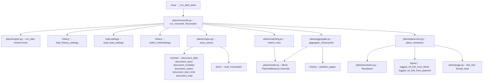
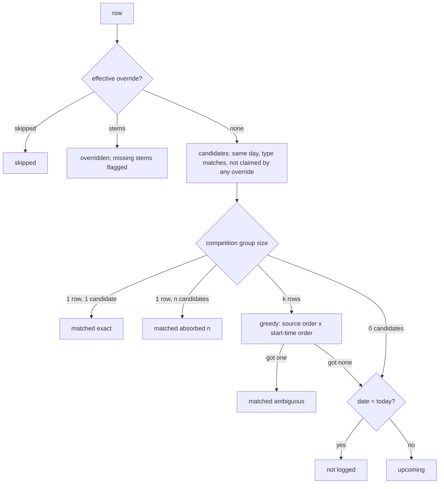

# Technical Design: plan-resolution

## Overview

`plan-resolution` fills the resolution seam `training-blocks` renders as
*unresolved*. A reconciling pass scans the logged workout pages' frontmatter
through the document contract, matches them to a block's planned rows under
four stated rules, applies the plan source's override entries, sums the load
actually logged inside every mesocycle's window under one methodology, lists
the workouts nobody planned, and hands the renderer strings to place. It runs
at the end of `sync` (both paths) and `regen` after the load pass, and as
part of `fitdocs plan`; it is stateless, reads no clock of its own, and
writes nothing but what the plan pass already writes.

**Users**: the athlete reading the block page as a training record; the LLM
curating their wiki, which settles ambiguous days with an override entry and
reads the run report to know which; and, downstream, `build-training-block`,
which teaches the vocabulary this spec fixes.

**Impact**: adds five key constants, five readers and one value type to the
document contract and guards their spellings; widens two published history
helpers to a structural record type; adds two link helpers to the layout
leaf; adds five modules to `fitdocs.plans`; chains one helper at three CLI
sites and into `fitdocs plan`; registers a second writing entry point into
`blocks/`; notes the second writer in the ownership document and the
`blocks/` declaration. Changes no byte of any workout document, history page
or plan source, and no rendered structure of the block or planned pages.

### Goals
- Every planned row resolves to one of five states with, for a match, one of
  three labels -- each with one rule a reviewer can mutate.
- Overrides win, missing stems are loud, nothing is dropped.
- Per-mesocycle sums that are honest about coverage, methodology and absence.
- Byte-identical output for an unchanged (source, corpus, today); no clock
  under `fitdocs.plans`.
- One contract reader per field and no second spelling of a key anywhere a
  guard looks.

### Non-Goals
- Any change to the block or planned pages' structure, frontmatter, types,
  region or versions; any change to the plan-source grammar
  (`training-blocks`).
- A back-link key into logged workout pages -- **not written** (see
  "Decisions"); the roadmap's `workout-docs` update entry closes as "no
  change".
- Scoring a logged workout against its prescription; sub-sport or interval
  detection; forecasting; the skill; chaining after `fitdocs load`,
  `history` or `check`.
- Adopting `contract.document_load` inside `fitdocs.history.documents`
  (queued, out of boundary).

## Boundary Commitments

### This Spec Owns
- The five contract key constants and the five readers plus `LoadReading`,
  their tests, and the literal guard that keeps them the only spellings
  (`contract.py`, `FORBIDDEN_LITERALS`, `CONTRACT_BINDINGS`).
- The `MethodologyRecord` protocol and the widened signatures of
  `select_methodology` / `partition_pages` (behaviour unchanged).
- The two logged-workout link helpers in `layout.py`.
- The corpus record and scan; the row states, confidence labels and match
  rules; override application and its problems; the per-mesocycle sum,
  coverage and unplanned listing; the vocabulary and the placement into
  `Resolution`; the reconciling pass, its report and its entry point; the
  chaining and `fitdocs plan`'s resolver.
- The amendment to `training-blocks` requirements 8.4 and 8.8 recording the
  chaining and the `today` dependence.

### Out of Boundary
- **`src/fitdocs/plans/{model,source,resolution,page,block_page,planned_page,engine,settings}.py`**
  -- consumed as wave 1 defines them. One mechanical edit only: `page.py`'s
  four frontmatter-key spellings become the contract constants (no output
  byte changes; its goldens pin that).
- **`src/fitdocs/history/documents.py`, `engine.py`, `model.py`,
  `page.py`, `settings.py`** -- not changed. `series.py` changes only the
  two signatures and gains the protocol.
- **`src/fitdocs/load/`**, **`ingest/`**, **`sync.py`**, **`audit.py`**,
  **`render/views.py`**, **`render/sections.py`** -- not changed;
  `render/frontmatter.py` changes only its five key spellings.
- **The plan source** -- never written; **workout pages** -- never written.
- **`docs/ownership-contract.md`'s version** -- not advanced; a second writer
  into an already-owned location is a note.

### Allowed Dependencies
- `fitdocs.contract` (readers and key constants) -- **only from
  `plans.corpus`** (the package's third and last contract importer beside
  `page` and `engine`).
- `fitdocs.docio.read_frontmatter` -- only from `plans.corpus`.
- `fitdocs.history` **package root only**: `MethodologyChoice`,
  `MethodologyProblem`, `MethodologyRecord`, `select_methodology`,
  `partition_pages`, `load_history_settings` -- from `plans.reconcile` and
  `plans.aggregate`. Never `fitdocs.history.<submodule>`.
- `fitdocs.load.settings.load_load_settings` -- only from `plans.reconcile`
  (the same reader `history/engine.py:317` uses). Never any other
  `fitdocs.load.<submodule>`.
- `fitdocs.settings` (`load_settings_document`, `SettingsError`),
  `fitdocs.layout`, `fitdocs.model` (`Sport`, `Modality`), the wave-1
  package modules, and the standard library (`dataclasses`, `datetime`,
  `enum`, `math`, `collections.abc`, `pathlib`, `typing`).
- **Forbidden** (as wave 1, plus): `fitdocs.ingest`, `fitdocs.render`,
  `fitdocs.sync`, `fitdocs.audit`, `yaml`, every clock spelling, and any
  `fitdocs.history.<sub>` / `fitdocs.load.<sub>` other than the two named.

### Revalidation Triggers
- **`Resolution` changes shape or placement** → `plans.placement` and its
  goldens.
- **`Block`, `PlannedWorkout`, `Mesocycle`, `Override` change shape**, or
  the override grammar changes → `plans.matching`, `plans.aggregate`.
- **`run_plan`'s signature or resolver hook changes** → `plans.reconcile`,
  `cli._run_plan_pass`.
- **The workout frontmatter's key names or value forms change**
  (`render/frontmatter.py`) → the contract readers and `plans.corpus`.
- **`select_methodology` / `partition_pages` change semantics** → the
  aggregator; the block page and history page must keep agreeing.
- **`OWNED_PATHS` / `blocks/` moves** → the `reconcile` entry point's
  `non_vacuous` and the link helpers.
- **The vocabulary words change** → `build-training-block`'s skill text.

#### Cross-spec obligations (plan-resolution ↔ training-blocks) -- how each seam is consumed
1. **`Resolution` is consumed verbatim** (`plans/resolution.py`: `RowResolution`,
   `MesocycleResolution`, `Resolution`, `UNRESOLVED_ROW`, `unresolved`).
   `plans.placement` builds one per block: every current row id gets a
   `RowResolution` (a one-line `cell`, several `section` lines); every
   mesocycle number gets a `MesocycleResolution` (`before_table` = one
   actual-load line; `after_table` = the unplanned and excluded listings,
   possibly empty); `block_lines` is never empty. No field is added, renamed
   or widened. Cells contain no newline and no `|` (stems and vocabulary
   cannot carry one; the renderer escapes anyway).
2. **Page depths** are consumed through the two helpers this spec adds to
   `layout.py` (`logged_rel_link_from_block`, `logged_rel_link_from_planned`),
   beside wave 1's `planned_rel_link` / `block_rel_link`.
3. **The location and entry point**: this spec registers `EntryPoint(id=
   "reconcile", ...)` writing only under `blocks/`, with its own
   `non_vacuous` (the block page *and* a planned page written); the
   permitted set already holds `blocks/`. The `plan` entry point is
   untouched.
4. **The hook**: `run_reconcile` calls `run_plan(data_root,
   resolve=Reconciler(...))` and nothing else of the engine; discovery,
   validation, foreign rule, writes, stale removal and `PlanReport` are
   reused unchanged.
5. **`Block` is the input**: `Block.current.rows`, `Block.mesocycles`
   (`number`, `starts`, `ends`, `target_load`), `Block.overrides` (in file
   order; index = position), `Block.mesocycle_of`. The source is never
   re-parsed.
6. **Obligations this spec places on `training-blocks` that its design does
   not provide** (stated so the cross-spec reviewer sees them):
   - **8.8 and 8.4 are superseded in part.** Once this spec lands, `fitdocs
     plan` passes a resolver, the pass runs after `sync`/`regen`, and a
     row's state depends on `today`. Task 3.4 lands **Amendment 1** to
     `.kiro/specs/training-blocks/requirements.md` (criteria 8.4 and 8.8
     each gain an *(amended by plan-resolution)* clause; nothing
     renumbered) and re-anchors two of its tests: the `tests/test_cli_plan.py`
     AST pin (see CliChaining) and the `tests/test_plan_e2e.py` two-dates
     test (both fake dates must lie on the same side of every fixture row,
     or the fixture must hold no rows; this spec's own e2e pins the
     crossing case).
   - **`plans/page.py` spells four frontmatter keys** that become guarded
     literals here; task 1.1 routes them through the contract constants and
     extends its `CONTRACT_BINDINGS` entry (an append). Wave 1's boundary
     test pins `page.py`'s import *targets*, not names, so nothing there
     moves.
   - **`tests/plans/test_boundary.py`** is extended, not rewritten: five
     module entries, an exemption map for the two allowed cross-package
     roots, a third contract importer (`corpus`).
   - **`src/fitdocs/plans/__init__.py`** is append-only; this spec appends
     its names and re-pins `_PLANS_SURFACE`.
   - The block-page forbidden-phrase pin (`matched`, `skipped`, `upcoming`,
     `not logged`, `load_value` over the *default* render) keeps holding:
     this spec's words appear only when its resolver is passed.

#### Shared files with a stated rule
- `src/fitdocs/contract.py` -- edited by task 1.1 only (constants, readers,
  `__all__`); `CONTRACT_VERSION` is **not** touched (asserted `"4"` after
  wave 1; if it reads otherwise the task stops and reports).
- `src/fitdocs/cli.py` -- edited by task 3.2 only.
- `src/fitdocs/layout.py` -- task 1.3 only. `src/fitdocs/history/series.py`
  and `history/__init__.py` -- task 1.2 only.
- `src/fitdocs/plans/__init__.py`, `tests/plans/test_boundary.py` (the
  module list and per-module targets) and `tests/test_public_api.py`
  (`_PLANS_SURFACE` and its owners) -- **append-only, one append per task
  that adds a module or publishes a name (2.1, 2.2, 2.3, 2.4, 3.1)**, in the
  same change as the module, because the two tests red on a module or name
  they do not list (see PackageBoundary); 3.3 adds only what no module
  owns. 2.2 and 2.3 are parallel and both append: the controller merges
  the two appends.
- `tests/test_contract_consumers.py` (1.1 then 2.1), `tests/test_confinement.py`
  (3.3), `pyproject.toml` (3.3) -- the partition rule from wave 1 holds:
  append a row, an entry or a block; never reorder or rewrite a peer's.

## Architecture

### Existing Architecture Analysis
- **Every corpus reader goes through `docio.read_frontmatter` and a contract
  reader** (`history/documents.py:178-223` is the template); the scan
  refuses symlinks at the read, degrades to `None`, never raises.
- **The load pass is the chaining pattern** (`cli.py:625-662`): one helper,
  `SettingsError` → exit 2, print, return; call sites fold `.failures` into
  `_finish`.
- **The history engine composes `[history]` and `[load]` for the configured
  methodology** (`history/engine.py:316-326`) and never re-reads a file the
  scan read.
- **The confinement guard's `EntryPoint`** has `prepare`, `run`,
  `non_vacuous(touched)` (`tests/test_confinement.py:568-611`).
- **`training-blocks`' engine calls `resolve(block)` once per valid block,
  after validation and before rendering** and treats a renderer
  `ValueError` as `failed`; `page.check_resolution` validates structure.

### Architecture Pattern & Boundary Map

Selected pattern: **a pure core behind one read edge, wrapped around the
upstream pass.** `corpus` is the only module that touches the filesystem;
`matching`, `aggregate` and `placement` are pure functions over frozen
dataclasses; `reconcile` reads settings, builds the resolver, calls
`run_plan`, and assembles the report.



**Architecture Integration**
- Dependency direction: `cli → plans.reconcile → {plans.engine, plans.corpus,
  plans.matching, plans.aggregate, plans.placement, history (root),
  load.settings, settings, layout}`; `plans.placement → {plans.resolution,
  plans.page, plans.model, plans.matching, plans.aggregate, layout}`;
  `plans.aggregate → {plans.corpus, plans.model, history (root)}`;
  `plans.matching → {plans.corpus, plans.model}`; `plans.corpus →
  {contract, docio, layout, model}`. `plans.engine` never imports any of
  these -- it takes the callable. No cycle: `plans.__init__` re-exports both
  sides.
- Domain boundaries: reading, matching, summing, wording and orchestrating
  are five modules; the matcher never sees a load, the aggregator never sees
  a confidence label, the placement never sees a `Path`.
- Existing patterns preserved: read-through-contract scan; the load pass's
  chaining shape; frozen dataclasses; data-root-relative POSIX paths in
  reports; absent is `None`.
- Steering compliance: stdlib only; `mypy --strict`; synthetic fixtures;
  no clock under the package; every rule owes a named mutation.

### Technology Stack

| Layer | Choice / Version | Role in Feature | Notes |
|-------|------------------|-----------------|-------|
| CLI | `typer` (existing) | `_run_plan_pass` at three sites + `plan` | No new option; `today` resolved beside `_local_tz` |
| Core | Python 3.11+ stdlib | corpus, rules, sums, wording | `StrEnum`, `Protocol`, `TypeVar` |
| Read | `docio` + `contract` readers | frontmatter only | PyYAML reached only through `contract.parse_frontmatter` |
| Output | the wave-1 renderers via `Resolution` | no new emitter | strings only |

## File Structure Plan

### Directory Structure
```
src/fitdocs/
├── contract.py                  # + DATE_KEY, START_TIME_KEY, SPORT_KEY, MODALITY_KEY, INDOOR_KEY,
│                                #   LoadReading, document_sport/modality/indoor/start_time/load
├── layout.py                    # + logged_rel_link_from_block, logged_rel_link_from_planned
├── history/series.py            # + MethodologyRecord (Protocol); select_methodology / partition_pages widened
├── history/__init__.py          # + "MethodologyRecord" (append)
├── render/frontmatter.py        # five data[...] keys routed through the contract constants
├── cli.py                       # + _today, _run_plan_pass, _report_reconcile; chaining; plan passes the resolver
└── plans/
    ├── __init__.py              # appended: this spec's published names
    ├── page.py                  # four key spellings routed through the contract constants (no output change)
    ├── corpus.py                # LoggedWorkout, Corpus, scan_corpus -- the one read
    ├── matching.py              # RowState, Confidence, RowOutcome, ReconcileProblem, MatchResult,
    │                            #   effective_overrides, is_candidate, match_rows -- pure
    ├── aggregate.py             # MesocycleLoad, aggregate_mesocycles -- pure
    ├── placement.py             # the vocabulary; place_resolution; actual_load_sentence -- pure
    └── reconcile.py             # BlockReconciliation, ReconcileReport, reconcile_block, Reconciler, run_reconcile
```

### Modified Files
- `src/fitdocs/contract.py` -- five constants beside `UUID_KEY`; `MANAGED_KEYS`
  and `document_date` use `DATE_KEY`; `LoadReading`; five readers; `__all__`
  gains eleven names. No new import.
- `src/fitdocs/render/frontmatter.py` -- `data["date"]` → `data[DATE_KEY]`
  and the four siblings; the import line grows. Output unchanged.
- `src/fitdocs/plans/page.py` -- `PLANNED_FRONTMATTER_KEYS`' four members and
  any sibling spelling become `DATE_KEY`, `SPORT_KEY`, `MODALITY_KEY`,
  `INDOOR_KEY` (from-imports, so the identity binding sees them). Output
  unchanged.
- `src/fitdocs/history/series.py` -- `MethodologyRecord` protocol; the two
  signatures widened; a `TypeVar`. Docstring names the widening.
- `src/fitdocs/history/__init__.py` -- one appended name.
- `src/fitdocs/layout.py` -- two helpers; docstring's helper list.
- `src/fitdocs/cli.py` -- three helpers; three chaining insertions;
  `plan_command` calls `_run_plan_pass`; module and command docstrings.
- `src/fitdocs/declaration.py` -- `_BLOCKS_CONTENT` gains one clause naming
  the chained runs (quantifier-guard-safe wording); its `CLAIM ANCHOR`
  comment gains `cli._run_plan_pass`. The version does not move.
- `docs/ownership-contract.md` -- the "Two Further Document Types" section
  gains a paragraph (the reconciling pass fills the resolution slots from the
  logged pages; it writes nothing into a workout page or the plan source);
  the Overwrite Semantics `plan` bullet gains the chained runs. Version line
  unchanged.
- `README.md` -- the `fitdocs plan` paragraph gains the reconciliation and
  the chaining; a sentence on the five states and the override entry.
- `pyproject.toml` -- mypy `files` gains `tests/plans/test_corpus.py`,
  `tests/plans/test_matching.py`, `tests/plans/test_aggregate.py`,
  `tests/plans/test_reconcile.py`.
- `tests/test_contract.py` -- reader tests; `test_managed_keys_contains_every_named_key_constant`
  gains the five constants.
- `tests/test_contract_consumers.py` -- `FORBIDDEN_LITERALS` gains the five
  values; `CONVERTED_MODULES` gains `fitdocs.plans.corpus`;
  `CONTRACT_BINDINGS` gains `fitdocs.plans.corpus` and extends
  `fitdocs.render.frontmatter` (+5) and `fitdocs.plans.page` (+4).
- `tests/test_public_api.py` -- `_CONTRACT_SURFACE` (+11), `_HISTORY_SURFACE`
  and owners (+1), `_PLANS_SURFACE` and owners (this spec's names).
- `tests/test_layout.py` -- the form pin gains the two helpers; round trips.
- `tests/plans/test_boundary.py` -- five module entries appended one per
  module task; the exemption map (2.3, 3.1); the third contract importer
  (2.1); the positive control and the threshold-closure assertion (3.3).
- `tests/test_confinement.py` -- the `reconcile` entry point and its negative
  half.
- `tests/test_cli_plan.py` -- the AST pin re-stated; `tests/test_plan_e2e.py`
  -- the two-dates test re-anchored.
- `tests/declaration_golden/blocks.AGENTS.md` -- regenerated by the goldens
  module's generator (only this golden's text changes).
- `.kiro/specs/training-blocks/{requirements.md,spec.json}` -- Amendment 1.

### New test modules
`tests/plans/{test_corpus.py,test_matching.py,test_aggregate.py,test_placement.py,test_reconcile.py}`;
`tests/plans/fixtures/reconcile/*.toml` (synthetic sources, owned by 2.4
alone -- 2.2 and 2.3 are parallel and build their sources as inline text
through `parse_block(text, block_id=...)`, creating no fixture file) and
`tests/plans/golden/reconciled-*.md`; `tests/test_cli_reconcile.py`;
`tests/test_reconcile_e2e.py`. Synthetic workout pages are written by each
test module's own `_page(...)` helper in the shape of
`tests/history/test_engine.py:43-64` (a real fence, real vocabulary),
extended with `sport`, `modality`, `indoor`, `start_time`.

## System Flows

### The reconciling pass, end to end

```mermaid
sequenceDiagram
  participant C as cli._run_plan_pass
  participant R as reconcile.run_reconcile
  participant S as settings readers
  participant E as engine.run_plan
  participant X as Reconciler
  participant K as corpus.scan_corpus
  participant M as matching + aggregate + placement
  C->>R: run_reconcile(data_root, today=today)
  R->>S: load_settings_document; load_history_settings; load_load_settings
  S-->>R: configured methodology or SettingsError (exit 2, nothing written)
  R->>E: run_plan(data_root, resolve=Reconciler)
  loop per valid block, source order
    E->>X: resolve(block)
    alt first call
      X->>K: scan_corpus(data_root)
      K-->>X: Corpus
      X->>X: select_methodology(corpus.workouts, requested=None, configured=...)
    end
    X->>M: reconcile_block(block, corpus, today=, choice=)
    M-->>X: BlockReconciliation
    X->>M: place_resolution(block, reconciliation)
    M-->>X: Resolution
    X-->>E: Resolution
    E->>E: render, merge notes, foreign check, byte compare, write
  end
  E-->>R: PlanReport
  R-->>C: ReconcileReport(plan, blocks, methodology)
  C->>C: _report_plan (suppressed only when chained and nothing to say); _report_reconcile
```

Gating: settings faults fail before anything is read (exit 2). The corpus is
scanned at most once per run and only if a valid block exists -- an athlete
without a plan directory pays nothing. A methodology problem never stops the
run. Every per-block write outcome is the engine's.

### How a row is resolved



## Requirements Traceability

| Requirement | Summary | Components | Interfaces | Flows |
|-------------|---------|------------|------------|-------|
| 1.1 | corpus = top-level workout docs, same recognition | CorpusScan | `scan_corpus` | pass |
| 1.2 | one reader per field; contract is the only spelling | ContractReaders, CorpusScan, ConsumerGuard | readers, `FORBIDDEN_LITERALS` | -- |
| 1.3 | undated → no day, no match, no sum | CorpusScan, Matcher, Aggregator | `LoggedWorkout.day` | row |
| 1.4 | unreadable sport → no match, still counts | CorpusScan, Matcher, Aggregator | `LoggedWorkout.sport` | row |
| 1.5 | no usable load → unscored | ContractReaders, CorpusScan | `document_load` | -- |
| 1.6 | symlink/unreadable/foreign skipped | CorpusScan | `docio.read_frontmatter` | -- |
| 1.7 | flags never read, never exclude | CorpusScan | -- | -- |
| 2.1 | five states, exactly one | Matcher | `RowState` | row |
| 2.2 | matched names stems + one label | Matcher | `RowOutcome` | row |
| 2.3 | overridden / skipped | Matcher | `effective_overrides` | row |
| 2.4 | not logged: date < today | Matcher | `match_rows(today=)` | row |
| 2.5 | upcoming: date >= today | Matcher | same | row |
| 2.6 | today only for that split | Matcher, ReconcilePass | `today` threading | pass |
| 2.7 | no classifier; closed labels | Matcher | `is_candidate`, `Confidence` | row |
| 3.1 | candidate rule | Matcher | `is_candidate` | row |
| 3.2 | cross-day never | Matcher | `is_candidate` | row |
| 3.3 | exact | Matcher | `match_rows` | row |
| 3.4 | absorbed | Matcher | `match_rows` | row |
| 3.5 | ambiguous proposal | Matcher | competition groups | row |
| 3.6 | losers not logged/upcoming; leftovers unplanned | Matcher, Aggregator | `RowOutcome.competitors`, `claimed` | row |
| 3.7 | same-day listing on not-logged/upcoming pages | Matcher, Placement | `RowOutcome.same_day` | -- |
| 3.8 | stem order | Matcher | `LoggedWorkout.order_key` | -- |
| 3.9 | exactly three labels | Matcher | `Confidence` | -- |
| 4.1 | latest override wins | Matcher | `effective_overrides` | row |
| 4.2 | override stems leave other candidates; count as planned | Matcher, Aggregator | `MatchResult.claimed` | row |
| 4.3 | missing stem: not found, reported, never dropped | Matcher, Placement, ReconcilePass, CliChaining | `RowOutcome.missing`, `ReconcileProblem` | pass |
| 4.4 | conflicting claims reported | Matcher | `ReconcileProblem` | -- |
| 4.5 | override date and reason shown | Placement | section grammar | -- |
| 4.6 | never writes source or workout page | ReconcilePass, ConfinementRegistration | guard | pass |
| 5.1 | no persisted match state | ReconcilePass, PackageBoundary | no write path | pass |
| 5.2 | byte-identical; today changes only crossing rows | ReconcilePass, Placement | e2e | pass |
| 5.3 | today never printed | Placement | vocabulary | -- |
| 5.4 | corpus change reflected next run | ReconcilePass | e2e | pass |
| 5.5 | no clock in the reconciler | PackageBoundary, CliChaining | `_today` | pass |
| 6.1 | sum over the window, matched or not | Aggregator | `aggregate_mesocycles` | -- |
| 6.2 | one methodology, history's rule, exclusions stated | ReconcilePass, Aggregator, HistoryRecordProtocol | `select_methodology`, `partition_pages` | pass |
| 6.3 | coverage n of m; lower bound | Aggregator, Placement | `MesocycleLoad` | -- |
| 6.4 | not computed, never zero | Aggregator, Placement | `MesocycleLoad.total` | -- |
| 6.5 | percent of target / at least / no target | Placement | `actual_load_sentence` | -- |
| 6.6 | methodology problem: not computed, reason once, run continues | ReconcilePass, Placement | `ReconcileReport.methodology` | pass |
| 6.7 | unplanned listing | Aggregator, Placement | `MesocycleLoad.unplanned` | -- |
| 6.8 | loads read, never computed | Aggregator, PackageBoundary | no `fitdocs.load` import beyond settings | -- |
| 7.1 | cell grammar | Placement | `RowResolution.cell` | -- |
| 7.2 | section grammar | Placement | `RowResolution.section` | -- |
| 7.3 | mesocycle lines | Placement | `MesocycleResolution` | -- |
| 7.4 | block-level section | Placement | `Resolution.block_lines` | -- |
| 7.5 | relative links, both depths | LoggedLinks, Placement | the two helpers | -- |
| 7.6 | only through the seam | Placement, PackageBoundary | `Resolution` | -- |
| 7.7 | fixed vocabulary | Placement | constants | -- |
| 8.1 | chained after sync (both) and regen, after the load pass | CliChaining | `_run_plan_pass` | pass |
| 8.2 | `fitdocs plan` passes the resolver | CliChaining | `plan_command` | pass |
| 8.3 | not after load/history/check | CliChaining | AST pin | -- |
| 8.4 | never prompts, no `.fit` | ReconcilePass, PackageBoundary | -- | -- |
| 8.5 | quiet when no plan dir | CliChaining | `_run_plan_pass` | pass |
| 8.6 | the report lines | ReconcilePass, CliChaining | `_report_reconcile` | pass |
| 8.7 | exit codes | CliChaining | `ReconcileReport.failed` | pass |
| 8.8 | writes only under blocks/; second entry point | ConfinementRegistration | guard | pass |
| 8.9 | engine behaviour unchanged | ReconcilePass | `run_plan(resolve=)` | pass |

## Components and Interfaces

| Component | Domain/Layer | Intent | Req Coverage | Key Dependencies (P0/P1) | Contracts |
|-----------|--------------|--------|--------------|--------------------------|-----------|
| ContractReaders | Contract | Key constants, five readers, `LoadReading`; both spellers routed | 1.2, 1.5 | `contract` (P0) | State, Service |
| ConsumerGuard | Guard | The literal pin and the bindings | 1.2 | ContractReaders (P0) | -- |
| HistoryRecordProtocol | History | `MethodologyRecord`; widened signatures | 6.2 | `history.series` (P0) | Service |
| LoggedLinks | Layout | Two rel-link helpers | 7.5 | `layout` (P0) | Service |
| CorpusScan | Read | `LoggedWorkout`, `Corpus`, `scan_corpus` | 1.1, 1.3-1.7 | ContractReaders, `docio` (P0) | State, Service |
| Matcher | Core | States, labels, rules, overrides, problems | 2.1-2.7, 3.1-3.9, 4.1-4.4 | CorpusScan, `plans.model` (P0) | State, Service |
| Aggregator | Core | Per-mesocycle sums, coverage, unplanned | 1.3, 1.4, 3.6, 4.2, 6.1-6.4, 6.7, 6.8 | CorpusScan, HistoryRecordProtocol (P0) | State, Service |
| Placement | Core | The vocabulary; `Resolution` from a reconciliation | 3.7, 4.3, 4.5, 5.3, 6.3-6.7, 7.1-7.7 | Matcher, Aggregator, LoggedLinks, `plans.page`, `plans.resolution` (P0) | Service |
| ReconcilePass | Pass | Settings, lazy corpus, methodology, resolver, report | 2.6, 4.3, 4.6, 5.1, 5.2, 5.4, 6.2, 6.6, 8.4, 8.6, 8.9 | all of the above, `plans.engine` (P0) | Service, Batch |
| CliChaining | CLI | `_today`, `_run_plan_pass`, `_report_reconcile`, the four call sites | 4.3, 5.5, 8.1-8.3, 8.5-8.7 | ReconcilePass (P0) | Service |
| ConfinementRegistration | Guard | The `reconcile` entry point | 4.6, 8.8 | ReconcilePass (P0) | -- |
| PackageBoundary, SurfacePins | Guard | Boundary extension, surface pins, mypy | 5.1, 5.5, 6.8, 7.6, 8.4 | package (P0) | -- |
| OwnershipDocs | Docs | Declaration clause, contract note, README | 8.1, 8.8 | `declaration` (P0) | State |
| TrainingBlocksSpecUpdate | Spec | Amendment 1 and the two re-anchored tests | 5.2, 8.1, 8.2 | -- | State |

### Contract and Layout

#### ContractReaders (`src/fitdocs/contract.py`, `src/fitdocs/render/frontmatter.py`, `src/fitdocs/plans/page.py`)

| Field | Detail |
|-------|--------|
| Intent | One reader per matched or summed field, and no second spelling of its key |
| Requirements | 1.2, 1.5 |

**Responsibilities & Constraints**
- Five constants beside `UUID_KEY` / `SOURCES_KEY`: `DATE_KEY`,
  `START_TIME_KEY`, `SPORT_KEY`, `MODALITY_KEY`, `INDOOR_KEY`. `MANAGED_KEYS`
  lists them by constant; `document_date` reads `DATE_KEY`. The set's
  *value* is unchanged (`tests/test_contract.py:186-212` keeps passing
  unedited). Absorbs queue item `2026-07-26-date-key-has-no-constant`.
- Readers degrade, never raise, accept `None` frontmatter, and fabricate
  nothing:
  - `document_sport` / `document_modality`: a non-empty `str` verbatim, else
    `None`. The contract may not import `fitdocs.model`
    (`tests/test_contract.py:974`), so the enum mapping is the caller's.
  - `document_indoor`: `True` → `True`, `False` → `False`, anything else
    (absent, `"true"`, `1`) → `None`.
  - `document_start_time`: a `str` parsed by `datetime.fromisoformat`, or a
    `datetime` as read; returned only when tz-aware (`utcoffset() is not
    None`); a naive value, a bare `date`, a malformed string → `None`.
  - `document_load`: `LoadReading(value, methodology)` under exactly
    `history/documents._read_load`'s rule -- `bool` rejected, `int`/`float`
    converted, `OverflowError` and non-finite → `None`, methodology must be
    a non-empty `str` or the whole reading is `None`.
- `render/frontmatter.py:124-131` writes the five keys through the constants
  (`data[DATE_KEY] = ...`); `plans/page.py` names the four planned keys
  through them. Neither changes an output byte -- the workout goldens and
  the wave-1 planned golden pin that. If a wave-1 *renderer*
  (`block_page.py`, `planned_page.py`) turns out to spell one of the keys
  too, it is **reported as a queue item, not edited**: the renderers are out
  of this spec's boundary and the literal guard does not reach unregistered
  modules by design (reviewer finding, round 1).
- No new import in `contract.py`; `CONTRACT_VERSION` untouched.

**Contracts**: State [x] / Service [x]
```python
DATE_KEY: Final[str] = "date"
START_TIME_KEY: Final[str] = "start_time"
SPORT_KEY: Final[str] = "sport"
MODALITY_KEY: Final[str] = "modality"
INDOOR_KEY: Final[str] = "indoor"

@dataclass(frozen=True)
class LoadReading:
    value: float          # finite, as recorded
    methodology: str      # non-empty

def document_sport(frontmatter: Mapping[str, object] | None) -> str | None: ...
def document_modality(frontmatter: Mapping[str, object] | None) -> str | None: ...
def document_indoor(frontmatter: Mapping[str, object] | None) -> bool | None: ...
def document_start_time(frontmatter: Mapping[str, object] | None) -> datetime | None: ...
def document_load(frontmatter: Mapping[str, object] | None) -> LoadReading | None: ...
```
- Postconditions: `document_load(fm) is None` iff history's `_read_load(fm)
  == (None, None)` (pinned by a table of shapes shared with
  `tests/history/test_documents.py`'s cases); every reader returns `None`
  for `None`.

**Implementation Notes**
- Validation (`tests/test_contract.py`): each reader over absent, wrong
  type, `bool`, empty string, the emitted form and the hand-edited unquoted
  form; `document_start_time` over an aware `str`, an aware `datetime`, a
  naive `str`, a naive `datetime`, a `date`, `"tomorrow"`; `document_load`
  over `True`, `float("inf")`, `10**400`, a value without methodology, a
  methodology without value; `test_managed_keys_contains_every_named_key_constant`
  gains the five.
- Named mutations: accept a naive start time (its pin reds); read `indoor`
  as truthy (`"yes"` → `True` pin reds); return a reading when methodology
  is absent (the `(None, None)` parity pin reds); spell `"sport"` inline in
  `render/frontmatter.py` (the literal guard reds, ConsumerGuard).

#### ConsumerGuard (`tests/test_contract_consumers.py`)

| Field | Detail |
|-------|--------|
| Intent | The five key literals are spelled nowhere a guard looks, and every binder binds the contract's objects |
| Requirements | 1.2 |

**Responsibilities & Constraints**
- `FORBIDDEN_LITERALS` gains `DATE_KEY`, `START_TIME_KEY`, `SPORT_KEY`,
  `MODALITY_KEY`, `INDOOR_KEY` (by constant, never re-spelled). The scan
  runs over every `CONVERTED_MODULES` entry; the two that spelled them are
  routed in the same change (ContractReaders).
- `CONVERTED_MODULES` gains `fitdocs.plans.corpus`; `CONTRACT_BINDINGS`
  gains `"fitdocs.plans.corpus": ("document_date", "document_indoor",
  "document_load", "document_modality", "document_sport",
  "document_start_time", "is_workout_document")`, extends
  `"fitdocs.render.frontmatter"` by the five constants and
  `"fitdocs.plans.page"` by `DATE_KEY`, `SPORT_KEY`, `MODALITY_KEY`,
  `INDOOR_KEY`.
- Scope note (stated, not guarded): `plans/source.py` and `plans/model.py`
  legitimately spell `date`, `sport`, `modality`, `indoor` as *plan-source*
  TOML keys; they are not registered consumers and the frontmatter-key
  guard does not reach them by design. `load/render.py:144,199` spells
  `"sport"` for the load *payload*, likewise unregistered.

**Implementation Notes**
- Named mutations: `frontmatter.get("sport")` inline in `plans/corpus.py`
  (the literal scan reds); a local `def document_sport` copy in `corpus.py`
  (the identity binding reds); drop `fitdocs.plans.corpus` from one registry
  (`test_every_converted_module_declares_its_contract_bindings` reds).

#### HistoryRecordProtocol (`src/fitdocs/history/series.py`, `src/fitdocs/history/__init__.py`)

| Field | Detail |
|-------|--------|
| Intent | Let the two published methodology helpers take any record with a `methodology` |
| Requirements | 6.2 |

**Responsibilities & Constraints**
- `MethodologyRecord` is a `typing.Protocol` with one read-only property
  `methodology: str | None`; `PageRecord` satisfies it structurally.
- `select_methodology(pages: Sequence[MethodologyRecord], ...)` and
  `_observed_counts` widen; `partition_pages(pages: Sequence[_R], choice) ->
  tuple[tuple[_R, ...], tuple[_R, ...]]` with `_R = TypeVar("_R",
  bound=MethodologyRecord)`, so a caller gets its own type back. Bodies
  unchanged.
- `history/__init__.py` appends `"MethodologyRecord"`; `_HISTORY_SURFACE`
  and `_HISTORY_SURFACE_OWNERS` gain it (owner `fitdocs.history.series`).
- `series.py` already imports `typing`; `tests/history/test_boundary.py`'s
  equality pin on import targets does not move. No numeric literal is
  added (`tests/history/test_constant_guard.py`).

**Contracts**: Service [x]
```python
class MethodologyRecord(Protocol):
    @property
    def methodology(self) -> str | None: ...

_R = TypeVar("_R", bound=MethodologyRecord)
def select_methodology(pages: Sequence[MethodologyRecord], *, requested: str | None, configured: str | None) -> MethodologyChoice | MethodologyProblem: ...
def partition_pages(pages: Sequence[_R], choice: MethodologyChoice) -> tuple[tuple[_R, ...], tuple[_R, ...]]: ...
```

**Implementation Notes**
- Validation: `tests/history/test_series.py` unchanged and green; a typed
  test in `tests/plans/test_aggregate.py` passes `LoggedWorkout`s through
  both and mypy accepts it; `partition_pages` returns `LoggedWorkout`
  instances by identity.
- Named mutations: make `partition_pages` return `dataclasses.replace(page)`
  copies (the by-identity pin reds -- a runtime mutation, since an
  annotation change alters nothing at runtime); revert `partition_pages`'
  annotation to `PageRecord` (`uv run mypy` reds on the aggregator's typed
  call once 2.3 exists -- verified there, not here).

#### LoggedLinks (`src/fitdocs/layout.py`)

| Field | Detail |
|-------|--------|
| Intent | The logged-page link from each of the two page depths |
| Requirements | 7.5 |

**Contracts**: Service [x]
```python
def logged_rel_link_from_block(stem: str) -> str: ...    # f"../{WORKOUTS_DIR}/{stem}.md"
def logged_rel_link_from_planned(stem: str) -> str: ...  # f"../../{WORKOUTS_DIR}/{stem}.md"
```
- Postconditions: `os.path.normpath(block_doc_path(root, b).parent /
  logged_rel_link_from_block(s)) == doc_path(root, s)`; the same for
  `planned_doc_path(root, b, r).parent` with the planned link.

**Implementation Notes**
- The form pin (`tests/test_layout.py:734-790`) gains both helpers with the
  tokens `f"../{WORKOUTS_DIR}/` and `f"../../{WORKOUTS_DIR}/`; no `Path(`,
  `PurePath(`, `os.` in either. Named mutations: drop one `..` from the
  planned link (its round trip reds); `str(PurePosixPath("..") /
  WORKOUTS_DIR / f"{stem}.md")` (the form pin reds; identical value).

### Read

#### CorpusScan (`src/fitdocs/plans/corpus.py`)

| Field | Detail |
|-------|--------|
| Intent | Every recognized workout page reduced to what matching and summing need -- the package's one corpus read |
| Requirements | 1.1, 1.3, 1.4, 1.5, 1.6, 1.7 |

**Responsibilities & Constraints**
- Scans `<root>/workouts/*.md`, sorted, through `docio.read_frontmatter`;
  keeps a page iff `is_workout_document`; an absent `workouts/` is an empty
  corpus; no recursion; never raises for a bad page.
- Reads exactly seven things, each through its contract reader; maps
  `sport` / `modality` onto `Sport` / `Modality` by value (`Sport(value)`
  in a `try`; unknown → `None`). Reads no flag, no title, no distance.
- `stem = path.stem`; `path` is data-root-relative POSIX.
- Order: `(day is None, day, start_time is None, start_time, stem)` --
  undated last, then by instant, then stem; this `order_key` is the one
  ordering every consumer uses (3.8).
- `methodology is None` iff `load is None` (inherited from `document_load`).

**Contracts**: State [x] / Service [x]
```python
@dataclass(frozen=True)
class LoggedWorkout:
    stem: str
    path: str                       # "workouts/<stem>.md"
    day: date | None
    sport: Sport | None
    modality: Modality | None
    indoor: bool | None
    start_time: datetime | None     # tz-aware or None
    load: float | None
    methodology: str | None         # None iff load is None  (satisfies history.MethodologyRecord)
    @property
    def order_key(self) -> tuple[bool, date, bool, datetime, str]: ...   # with sentinels for None

@dataclass(frozen=True)
class Corpus:
    workouts: tuple[LoggedWorkout, ...]        # sorted by order_key
    def by_stem(self, stem: str) -> LoggedWorkout | None: ...
    def on_day(self, day: date) -> tuple[LoggedWorkout, ...]: ...
    def within(self, first: date, last: date) -> tuple[LoggedWorkout, ...]: ...   # inclusive; dated only

def scan_corpus(data_root: Path) -> Corpus: ...
```
- Postconditions: `by_stem` is total over `workouts`; `within` never
  returns an undated workout; two scans of an unchanged root are equal.

**Implementation Notes**
- Validation (`tests/plans/test_corpus.py`, typed): a page of every shape
  -- full, undated, unknown sport, no modality, `indoor: true`, no
  start_time, naive start_time, unscored, scored under two methodologies,
  a `type: planned-workout` page (excluded), a symlink (excluded), a
  non-UTF-8 file (excluded), a file in a subdirectory (not scanned);
  ordering with two pages on one day whose stems sort opposite to their
  start times; `within` at both edges; a page with a flag marker in its
  load region still present.
- Named mutations: read the sport inline (ConsumerGuard reds); sort by stem
  only (the opposite-order pin reds); include undated pages in `within`
  (its pin reds); follow symlinks (its pin reds -- reachability control:
  the target file *is* a valid page).

### Core

#### Matcher (`src/fitdocs/plans/matching.py`)

| Field | Detail |
|-------|--------|
| Intent | Every row's state, its stems, its label, and every override problem -- pure |
| Requirements | 2.1-2.7, 3.1-3.9, 4.1-4.4 |

**Responsibilities & Constraints**
- **Effective overrides** (4.1): for each `row_id` named by any
  `Block.overrides` entry, the entry with the greatest `(date, index)`
  wins; index is the position in `Block.overrides`.
- **Claims** (4.2): the union of every effective override's `stems`
  (existing or not) is removed from every candidate set. A stem named by
  two effective overrides → one `ReconcileProblem` per such stem naming
  both entries (4.4); both rows keep it.
- **Missing** (4.3): an effective override's stem with `corpus.by_stem is
  None` → `RowOutcome.missing` and one `ReconcileProblem(entry=
  "override[i] (id r)", message="stem `s` not found among the logged
  workouts")`. The row is still `OVERRIDDEN` (with `stems` possibly empty).
- **Candidates** (3.1, 3.2): `is_candidate(row, logged)` ⟺ `logged.day ==
  row.date` and `logged.sport == row.sport` and (`row.modality is None` or
  `logged.modality == row.modality`) and (`row.indoor is None` or
  (`row.indoor` and `logged.indoor is True`) or (`not row.indoor` and
  `logged.indoor is not True`)). Undated pages and unknown sports never
  satisfy it (1.3, 1.4). Nothing else is consulted (2.7).
- **Competition groups** (3.3-3.6): per date, among rows without an
  effective override, rows whose candidate sets intersect form a group
  (transitive closure). Group of one row: one candidate → `EXACT`; several
  → `ABSORBED` with all of them. Group of k ≥ 2 rows: rows in
  `block.current.rows` order each take the first unassigned candidate in
  their set by `order_key`; a row that takes one is `MATCHED` /
  `AMBIGUOUS` with `competitors` = the other rows' ids; a row that takes
  none is `NOT_LOGGED` / `UPCOMING` with the same `competitors` (3.6);
  unassigned candidates stay unclaimed (unplanned).
- **The split** (2.4, 2.5): a row with no stems and no override is
  `NOT_LOGGED` iff `row.date < today`, else `UPCOMING`. `today` is used
  nowhere else (2.6).
- **Same-day listing** (3.7): for a `NOT_LOGGED` / `UPCOMING` row,
  `same_day` = every logged workout on `row.date` (any type), each with the
  id of the row of this block that claimed it or `None`.
- `stems` are in `order_key` order for matches (3.8) and in the override's
  own order for overridden rows.
- Pure: no `Path`, no clock, no I/O; imports only `plans.corpus`,
  `plans.model`, `fitdocs.model`, stdlib.

**Contracts**: State [x] / Service [x]
```python
class RowState(StrEnum):
    MATCHED = "matched"; OVERRIDDEN = "overridden"; SKIPPED = "skipped"
    NOT_LOGGED = "not logged"; UPCOMING = "upcoming"

class Confidence(StrEnum):
    EXACT = "exact"; ABSORBED = "absorbed"; AMBIGUOUS = "ambiguous"

@dataclass(frozen=True)
class RowOutcome:
    row_id: str
    state: RowState
    stems: tuple[str, ...]                        # fulfilling stems present in the corpus
    confidence: Confidence | None                 # not None iff MATCHED
    missing: tuple[str, ...]                      # OVERRIDDEN only: named stems absent from the corpus
    override_index: int | None                    # OVERRIDDEN / SKIPPED
    override_date: date | None                    # OVERRIDDEN / SKIPPED
    reason: str | None                            # OVERRIDDEN / SKIPPED, when stated
    competitors: tuple[str, ...]                  # ids of the other rows in an ambiguous group
    same_day: tuple[tuple[str, str | None], ...]  # NOT_LOGGED / UPCOMING: (stem, claiming row id or None)

@dataclass(frozen=True)
class ReconcileProblem:
    entry: str                                    # "override[2] (id w1-thu)"
    message: str
    def describe(self) -> str: ...                # f"{entry}: {message}"

@dataclass(frozen=True)
class MatchResult:
    rows: tuple[RowOutcome, ...]                  # block.current.rows order, one per row
    claimed: frozenset[str]                       # every stem some row of this block holds
    problems: tuple[ReconcileProblem, ...]        # missing and conflicting override stems, source order

def effective_overrides(block: Block) -> Mapping[str, tuple[int, Override]]: ...
def is_candidate(row: PlannedWorkout, logged: LoggedWorkout) -> bool: ...
def match_rows(block: Block, corpus: Corpus, *, today: date) -> MatchResult: ...
```
- Invariants: exactly one `RowOutcome` per current row; `confidence is not
  None ⟺ state is MATCHED`; `state is MATCHED ⟹ stems`; `state is
  OVERRIDDEN ⟹ stems or missing`; `state in {SKIPPED, NOT_LOGGED, UPCOMING}
  ⟹ not stems`; a stem appears in at most one `MATCHED` row; `claimed` =
  the union of every row's `stems`.

**Implementation Notes**
- Validation (`tests/plans/test_matching.py`, typed; one headed section per
  rule; synthetic blocks built through `plans.source.parse_block`):
  - base case: one Run row, one Run page same day → `EXACT`; a Ride page
    that day → `NOT_LOGGED` with `same_day` listing the Ride.
  - split session: one Run row, three Run pages same day → `ABSORBED`, all
    three stems in start-time order (stems named so that stem order
    opposes start-time order).
  - competing rows: two Run rows, two Run pages → both `AMBIGUOUS`, first
    row gets the earlier page, `competitors` cross-reference; two rows,
    one page → first `AMBIGUOUS`, second `NOT_LOGGED` with competitors;
    one row, two pages plus a second row of another type → the second row
    does not join the group (`EXACT`/`ABSORBED` unaffected).
  - partial overlap: a `Workout` row and a `Workout (strength)` row with
    one strength page and one bike page → one group, both `AMBIGUOUS`.
  - cross-day: the page dated `row.date + 1` → `NOT_LOGGED`; `- 1` likewise.
  - type: a `Workout (strength)` row against a `Workout (other)` page →
    no; a `Run` row against a `Walk` page → no; `indoor = true` row
    against a page without the key → no, against `indoor: true` → yes;
    `indoor = false` row against a page without the key → yes.
  - overrides: an override replaces an `EXACT` match; the latest of two
    overrides for one row wins (dates equal → the later in the file); a
    stem claimed by an override leaves another row's candidates (that row
    becomes `NOT_LOGGED`); a missing stem → `missing` + one problem naming
    `override[i] (id r)`; two overrides claiming one stem → a conflict
    problem, both rows keep it; `skipped = true` → `SKIPPED` with reason.
  - the split: a row dated `today - 1` → `NOT_LOGGED`; dated `today` →
    `UPCOMING`; dated `today + 1` → `UPCOMING`.
  - undated page and unknown-sport page never candidates.
- Named mutations (each reds exactly its pin): compare `<=` instead of `<`
  for the split (the `today` pin reds); allow `abs(day delta) <= 1` (the
  cross-day pins red); collapse every multi-candidate case to `EXACT`
  with the first (the absorbed pin reds); pair by stem order instead of
  start-time order (the ambiguous first-row pin reds); take the *first*
  override instead of the latest (its pin reds); skip removing override
  stems from other candidates (the leaves-candidates pin reds); drop the
  missing-stem problem (its pin reds); treat an absent `indoor` as `True`
  (its pin reds); ignore modality (the strength/other pin reds).

#### Aggregator (`src/fitdocs/plans/aggregate.py`)

| Field | Detail |
|-------|--------|
| Intent | Per mesocycle: the pages in the window, their partition under the chosen methodology, and the unplanned ones -- pure |
| Requirements | 1.3, 1.4, 3.6, 4.2, 6.1-6.4, 6.7, 6.8 |

**Responsibilities & Constraints**
- Per `Block.mesocycles` entry: `pages = corpus.within(starts, ends)` (dated
  pages only, 1.3; unknown-sport pages included, 1.4).
- With a `MethodologyChoice`: `(included, excluded) = partition_pages(pages,
  choice)`; `scored` = included with `load is not None`; `unscored` = the
  rest of included. Without one: `scored = unscored = excluded = ()`.
- `total = sum(p.load for p in scored)` or `None` when `scored` is empty
  (6.4). `lower_bound = total is not None and bool(unscored)` (6.3).
  `considered = len(scored) + len(unscored)`.
- `unplanned = [p for p in pages if p.stem not in claimed]` in `order_key`
  order (6.7, 4.2, 3.6).
- `percent_of_target = round(100 * total / target)` when both are present,
  else `None` (6.5's number; the wording is Placement's).
- Never computes a load; reads `load` and sums (6.8).

**Contracts**: State [x] / Service [x]
```python
@dataclass(frozen=True)
class MesocycleLoad:
    number: int
    target: float | None
    methodology: str | None                  # the chosen one, or None when none could be chosen
    pages: tuple[LoggedWorkout, ...]         # dated in the window, order_key order
    scored: tuple[LoggedWorkout, ...]
    unscored: tuple[LoggedWorkout, ...]
    excluded: tuple[LoggedWorkout, ...]      # scored under another methodology
    unplanned: tuple[LoggedWorkout, ...]
    @property
    def total(self) -> float | None: ...
    @property
    def lower_bound(self) -> bool: ...
    @property
    def considered(self) -> int: ...
    @property
    def percent_of_target(self) -> int | None: ...

def aggregate_mesocycles(block: Block, corpus: Corpus, *, claimed: frozenset[str],
                         choice: MethodologyChoice | None) -> tuple[MesocycleLoad, ...]: ...
```
- Postconditions: one entry per mesocycle, ascending number; `set(scored) |
  set(unscored) | set(excluded) == set(pages)` when a choice exists;
  `unplanned ⊆ pages`; `total is None` never renders as `0`.

**Implementation Notes**
- Validation (`tests/plans/test_aggregate.py`, typed): a window with three
  scored pages (pairwise-distinct loads) sums exactly; a fourth unscored
  page → `lower_bound`, `considered == 4`, `total` unchanged; a page under
  another methodology → `excluded`, not in `considered`, not in `total`; a
  window with only unscored pages → `total is None`; an empty window; a
  page on `ends` (in) and `ends + 1` (out); a claimed stem absent from
  `unplanned` and an override-claimed stem likewise; `choice=None` →
  everything empty but `pages`, `total is None`; `percent_of_target` for
  `1180/1200 == 98` and `None` without a target; the block's rows never
  affect `pages` (an unmatched page still counts).
- Named mutations: sum over `pages` instead of `scored` (the excluded pin
  reds); `considered = len(scored)` (the coverage pin reds); `total = 0.0`
  when `scored` is empty (the not-computed pin reds); use `<` for `ends`
  (the edge pin reds); include claimed stems in `unplanned` (its pin reds).

#### Placement (`src/fitdocs/plans/placement.py`)

| Field | Detail |
|-------|--------|
| Intent | The words -- every state, label and statement the pages carry -- and the `Resolution` they are placed in |
| Requirements | 3.7, 4.3, 4.5, 5.3, 6.3-6.7, 7.1-7.7 |

**Responsibilities & Constraints**
- The vocabulary is constants here and nowhere else (7.7): the five
  `RowState` values and three `Confidence` values (imported), plus
  `NOT_COMPUTED = "not computed"`, `AT_LEAST = "at least"`, `NO_TARGET =
  "no target"`, `NOT_FOUND = "not found"`, `UNSCORED = "unscored"`,
  `ACTUAL_LOAD = "Actual load:"`, `UNPLANNED = "Unplanned:"`,
  `EXCLUDED = "Excluded from the sum (scored under another methodology):"`.
- Links: block-page fragments use `logged_rel_link_from_block`; planned-page
  fragments use `logged_rel_link_from_planned`; link text is the stem through
  `page.link_text` (7.5). Numbers through `page.format_load`. Times as
  `f"{t:%H:%M}"` of the recorded local wall clock (locale-free). Never the
  pass's `today` (5.3).
- `logged_phrase(w)`: the sport value (`unknown sport` when `None`), with a
  parenthesised, comma-joined modality (only when `sport is Sport.WORKOUT`
  and stated) and `indoor` when `True` -- the same shape as
  `page.sport_phrase`.
- `load_phrase(w, methodology)`: `load 45` when scored under the chosen
  methodology; `load 45 under other (excluded from the sum)` under another;
  `unscored` when `None`.

**Grammar** (the goldens pin every line; `<link>` = `[stem](rel)`):

| Slot | State / case | Text |
|------|--------------|------|
| cell | MATCHED exact | `matched: <link>` |
| cell | MATCHED absorbed | `matched (absorbed 3): <link>, <link>, <link>` |
| cell | MATCHED ambiguous | `matched (ambiguous): <link>` |
| cell | OVERRIDDEN | `overridden: <link>, <link>` + `, \`stem\` (not found)` per missing |
| cell | SKIPPED | `skipped` |
| cell | NOT_LOGGED / UPCOMING | `not logged` / `upcoming` |
| section | MATCHED exact | `Matched (exact): one logged workout on this day is of this type, and no other planned workout competes for it.` then `- <link> -- Run, 07:15, load 45` |
| section | MATCHED absorbed | `Matched (absorbed): 3 logged workouts on this day are of this type, and no other planned workout competes for them; all 3 are taken as this workout.` + bullets |
| section | MATCHED ambiguous | `Matched (ambiguous): 2 planned workouts of this type on this day (\`w2-tue\`, \`w2-tue-b\`) compete for the logged workouts; assigned by start-time order. Settle it with an override entry naming this row and the logged workout stems.` + bullets |
| section | OVERRIDDEN | `Overridden by the plan source (override dated 2026-09-25): <reason>.` (no reason → sentence ends at the parenthesis) + bullets; missing: `- \`stem\` -- not found among the logged workouts` |
| section | SKIPPED | `Skipped by the plan source (override dated 2026-09-25): <reason>.` |
| section | NOT_LOGGED | `Not logged: no logged workout on 2026-09-22 is of this type.` then, when competitors: `2 planned workouts of this type on this day competed for 1 logged workout, assigned to \`w2-tue\` by start-time order.` then, when same_day: `Logged on this day:` + `- <link> -- Ride (taken by \`w2-tue-b\`)` / `- <link> -- Ride` |
| section | UPCOMING | `Upcoming.` + the same competitor and same-day lines |
| before_table | complete, target | `Actual load: 1180 -- 5 of 5 logged workouts scored under threshold; 98% of target.` |
| before_table | complete, no target | `Actual load: 1180 -- 5 of 5 logged workouts scored under threshold; no target.` |
| before_table | lower bound | `Actual load: at least 900 -- 3 of 5 logged workouts scored under threshold, 2 unscored; at least 75% of target.` |
| before_table | with exclusions | `... 5 of 5 logged workouts scored under threshold, 1 excluded (scored under other); ...` |
| before_table | none scored | `Actual load: not computed -- 0 of 4 logged workouts scored under threshold.` |
| before_table | no pages | `Actual load: not computed -- no logged workout in this window.` |
| before_table | no methodology | `Actual load: not computed -- no methodology chosen (see Resolution below).` |
| after_table | unplanned | `Unplanned: 2 logged workouts in this window match no planned workout.` + `- <link> -- 2026-09-23, Run, load 45` |
| after_table | excluded | `Excluded from the sum (scored under another methodology):` + `- <link> -- 2026-09-23, Run, load 45 under other (excluded from the sum)` |
| block_lines | always | `Planned workouts: 12 -- 7 matched (1 ambiguous), 1 overridden, 1 skipped, 2 not logged, 1 upcoming.` |
| block_lines | methodology | `Methodology: threshold (configured).` / `(inferred from the logged workouts).` / `Methodology: none chosen -- <detail>` |
| block_lines | ambiguous rows | `Ambiguous: \`w2-tue\`, \`w2-tue-b\` -- settle them with override entries.` |
| block_lines | problems | `Problems:` + `- override[0] (id w1-thu): stem \`2026-09-24-run-0700\` not found among the logged workouts` |

Singular/plural: `1 logged workout`, `2 logged workouts`; `1 planned
workout`. The `-- Run, 07:15, load 45` bullet omits the time when
`start_time is None`. Percent: `round(100 * total / target)`.

**Contracts**: Service [x]
```python
def actual_load_sentence(m: MesocycleLoad) -> str: ...          # the text after "Actual load: " (reused by the report)
def row_cell(outcome: RowOutcome) -> str: ...
def row_section(block: Block, row: PlannedWorkout, outcome: RowOutcome, corpus: Corpus) -> tuple[str, ...]: ...
def place_resolution(block: Block, reconciliation: BlockReconciliation, corpus: Corpus) -> Resolution: ...
```
- Postconditions: `page.check_resolution(block, place_resolution(...))`
  raises nothing; every row id and every mesocycle number present; no cell
  contains `\n` or `|`; no section line is a fence line; `block_lines` is
  non-empty; **for a fixture in which no override entry and no unplanned or
  excluded logged workout is dated `today`, no string in the `Resolution`
  value** (every `cell`, every `section` line, every `before_table` /
  `after_table` line, every `block_lines` entry) contains
  `today.isoformat()`. The condition is real, not decorative: the grammar
  legitimately prints an override's date and an unplanned or excluded
  workout's date, either of which an athlete may make equal to today with
  no defect (reviewer finding, round 2). The postcondition is over the
  value, not the rendered page: the wave-1 block page prints one row per
  calendar day, so `today`'s date is legitimately on the page whenever it
  falls inside the block (reviewer finding, round 1). The universal
  observable for 5.3 is the e2e same-side byte-identity pin.

**Implementation Notes**
- Validation (`tests/plans/test_placement.py` + `tests/plans/golden/`): one
  golden block page and two golden planned pages rendered through the
  wave-1 renderers from a synthetic block and corpus that exercise every
  grammar row above (exact, absorbed 3, ambiguous pair, overridden with one
  missing stem, skipped with reason, not logged with a same-day Ride taken
  by another row, upcoming; one complete mesocycle with target, one lower
  bound with an exclusion, one not computed, one with unplanned); a second
  block golden under a `MethodologyProblem`; a placement test asserting
  every fragment lands in its slot; the fence-line and newline
  postconditions; the no-`today` postcondition over every string of the
  built `Resolution` value (with `today` inside the block, so the day table
  prints it and only the value can be clean); `actual_load_sentence` over
  each case by exact string; a stem containing `]` passes through
  `link_text`; two calls are byte-equal.
- Named mutations: render an absent total as `0` (the golden reds); drop
  `at least` (the lower-bound pin reds); count `considered` over `pages` in
  `aggregate.py` -- a cross-module mutation of the Aggregator's coverage
  rule seen from the wording side (the exclusion line reds); use the
  block-depth link on the planned page (the planned golden reds); append
  `today.isoformat()` to the upcoming section line (the value-level
  no-today postcondition reds); write `matched` for an overridden row (the
  golden reds).

### Pass and CLI

#### ReconcilePass (`src/fitdocs/plans/reconcile.py`)

| Field | Detail |
|-------|--------|
| Intent | Settings, the lazy corpus and methodology, the resolver, the report |
| Requirements | 2.6, 4.3, 4.6, 5.1, 5.2, 5.4, 6.2, 6.6, 8.4, 8.6, 8.9 |

**Responsibilities & Constraints**
- `run_reconcile(data_root, *, today)`: reads `fitdocs.toml` once
  (`load_settings_document`), projects `[history]` and `[load]` (their
  errors propagate as `SettingsError`s before anything else happens),
  `configured = history.methodology or load.default_calculator`; builds a
  `Reconciler`; calls `run_plan(data_root, resolve=reconciler)`; returns
  `ReconcileReport(plan, blocks, methodology)`.
- `Reconciler.__call__(block)`: on first call scans the corpus and selects
  the methodology (`select_methodology(corpus.workouts, requested=None,
  configured=configured)`); then `reconcile_block(...)`, records it by
  block id, returns `place_resolution(...)`. Never raises for a valid
  block. The corpus is never scanned when `run_plan` finds no valid block.
- `reconcile_block` is pure: `match_rows` → `aggregate_mesocycles(claimed=)`
  → `BlockReconciliation(problems = match.problems)`.
- A `MethodologyProblem` is carried on every `BlockReconciliation.methodology`
  (so each page states it) and once on the report (6.6); it is never
  raised.
- `ReconcileReport.failed = plan.failed or any(b.problems for b in blocks)`.
- No clock, no `Path` write, no prompt; the second read of `fitdocs.toml`
  is `run_plan`'s own (the seam fixes its signature) and is stated here.

**Contracts**: Service [x] / Batch [x]
```python
@dataclass(frozen=True)
class BlockReconciliation:
    block_id: str
    rows: tuple[RowOutcome, ...]
    mesocycles: tuple[MesocycleLoad, ...]
    methodology: MethodologyChoice | MethodologyProblem
    problems: tuple[ReconcileProblem, ...]
    def counts(self) -> Mapping[RowState, int]: ...
    @property
    def ambiguous(self) -> tuple[str, ...]: ...        # row ids, block order
    @property
    def unplanned_count(self) -> int: ...

@dataclass(frozen=True)
class ReconcileReport:
    plan: PlanReport
    blocks: tuple[BlockReconciliation, ...]            # plan.blocks order, valid blocks only
    methodology: MethodologyChoice | MethodologyProblem | None   # None: the resolver was never called
    @property
    def failed(self) -> bool: ...

def reconcile_block(block: Block, corpus: Corpus, *, today: date,
                    methodology: MethodologyChoice | MethodologyProblem) -> BlockReconciliation: ...

class Reconciler:
    def __init__(self, data_root: Path, *, today: date, configured: str | None) -> None: ...
    def __call__(self, block: Block) -> Resolution: ...
    @property
    def blocks(self) -> Mapping[str, BlockReconciliation]: ...
    @property
    def methodology(self) -> MethodologyChoice | MethodologyProblem | None: ...

def run_reconcile(data_root: Path, *, today: date) -> ReconcileReport: ...
```
- Postconditions: two runs over an unchanged root with equal `today` write
  byte-identical pages and the second reports every block `unchanged`; the
  corpus read count is 0 when no valid block exists and 1 otherwise
  (counting stub); nothing under `workouts/` or the source directory
  changes (hash before/after).

**Implementation Notes**
- Validation (`tests/plans/test_reconcile.py`, typed): the rendered pages
  carry the placed text (grep the block page for `matched:`); a page added
  between runs flips a row from `not logged` to `matched` and the block to
  `rendered`; removed → back; an override with a missing stem → `failed`
  and the block still `rendered`; `[history] methodology = "x"` with no
  page under `x` → every mesocycle `not computed`, report methodology is a
  problem, `failed` false; a malformed `[history]` table → `SettingsError`
  before `run_plan` (no page written -- assert the source dir and `blocks/`
  untouched); no plan directory → the resolver never scans (stub count 0);
  two blocks, one invalid → the valid one reconciled, `blocks` has one
  entry; `today` threaded (a row dated `today` renders `upcoming`).
- Named mutations: scan eagerly in `run_reconcile` (the count-0 pin reds);
  raise on a `MethodologyProblem` (the not-computed pin reds); compute
  `failed` from `plan.failed` alone (the missing-stem pin reds); pass
  `today + 1` to the matcher (the `today` pin reds).

#### CliChaining (`src/fitdocs/cli.py`)

| Field | Detail |
|-------|--------|
| Intent | `today`, the one helper, the four call sites, the report |
| Requirements | 4.3, 5.5, 8.1, 8.2, 8.3, 8.5, 8.6, 8.7 |

**Responsibilities & Constraints**
- `_today() -> date` = `date.today()`, placed beside `_local_tz`; the only
  clock read for this feature, in the CLI, never under `fitdocs.plans`.
  **Deliberately `date.today()` and not `datetime.now(_local_tz()).date()`**
  (reviewer finding, round 1, verified on the interpreter): `date.today()`
  reads the clock through the Python-level `time.time` and honours
  `TZ`/`tzset`, which is exactly what the fake-date context manager at
  `tests/test_history_e2e.py:211-245` hooks; `datetime.now()` reads the C
  clock and is invisible to it, so the e2e tests in 3.2 and 3.5 could
  never move `today`. No guard forbids a clock in `cli.py` (wave 1's clock
  scan is package-scoped; the history one is history-scoped).
- `_run_plan_pass(data_root, *, today, chained) -> ReconcileReport`: the
  shape of `_run_load_pass` -- `run_reconcile` inside `except SettingsError
  → _config_error` (exit 2; covers `PlanSettingsError`,
  `HistorySettingsError`, `LoadSettingsError`); then `_report_plan(
  report.plan)`, **suppressed only when `chained` is true and the plan
  report has no block, no unsourced path and no foreign declaration**
  (8.5); then `_report_reconcile(report)`; return. With `chained=False`
  the wave-1 report prints in full, including the absent-directory note,
  so wave 1's `test_cli_plan.py` pin "the default absent directory gives
  success with the note" stays green unedited (reviewer finding, round 1).
- Call sites: after `_run_load_pass` at `sync_command`'s explicit-source
  branch (`cli.py:280`), its drain branch (`:309`) and `regen_command`
  (`:385`), each passing `chained=True`; each `_finish(failed=...)` gains
  `or plan_report.failed` (8.7). `plan_command` calls
  `_run_plan_pass(data_root, today=_today(), chained=False)` and
  `_finish(failed=report.failed)` -- the `except SettingsError` moves into
  the helper. `load_command`, `history_command`, `check_command` untouched
  (8.3).
- `_report_reconcile`: per block `reconciled <block_id>: N planned -- a
  matched (b ambiguous), c overridden, d skipped, e not logged, f upcoming;
  g unplanned`, one indented `mesocycle n: <actual_load_sentence>` per
  mesocycle, `ambiguous: <ids>` when any, one indented `describe()` per
  problem; then once `methodology: threshold (configured)` or `methodology:
  none chosen -- <detail>` when `report.methodology` is not `None`. Detail
  lines `markup=False, highlight=False, soft_wrap=True`.
- **The AST pin re-stated** (`tests/test_cli_plan.py`, the shape of
  `tests/test_cli_history.py:660`): `run_plan` is named nowhere in
  `cli.py` (no import, no `Name`, no `Attribute`); `run_reconcile` is
  imported exactly once at module level from `fitdocs.plans` and loaded as
  a `Name` exactly once, inside `_run_plan_pass`; `_run_plan_pass` is
  loaded exactly four times, inside `sync_command` (twice), `regen_command`
  and `plan_command`, and nowhere else.
- Module docstring: the sync/regen bullets and the exit-code paragraph name
  the reconciling pass; `sync_command` / `regen_command` docstrings gain
  one sentence.

**Contracts**: Service [x]
```python
def _today() -> date: ...                                   # date.today()
def _run_plan_pass(data_root: Path, *, today: date, chained: bool) -> ReconcileReport: ...
def _report_reconcile(report: ReconcileReport) -> None: ...
```

**Implementation Notes**
- Validation (`tests/test_cli_reconcile.py`, `CliRunner`): `sync SOURCE`
  over a root with a plan and a matching ingested page → the block page
  carries `matched:` and the output carries `reconciled`; the drain path
  likewise; `regen` likewise; `sync` over a root with no plan directory →
  output byte-identical to the same run with `_run_plan_pass` monkeypatched
  to a stub that prints nothing and returns a report whose `failed` is
  false (the call site folds `.failed` into `_finish`) (8.5); `plan` over
  the default absent directory still prints the note (wave 1's pin, green
  unedited); a missing override stem → exit 1 with the problem line; a
  malformed `[history]` → exit 2; `load` and `history` over a root with a
  plan → `blocks/` untouched (mtime and bytes) -- with two stated
  preconditions: the fixture ran `plan` first so `blocks/AGENTS.md` exists
  and is current (`history/engine.py:400`'s declaration refresh would
  otherwise create it), and a matching workout page was dropped into
  `workouts/` *after* that run, so the pass, if it ran, would have
  something to rewrite (otherwise its byte comparison writes nothing and
  the named mutation reds only the AST pin); `plan` → exit 0 and the
  block page carries `matched:`; the AST pin; the wave-1 two-dates e2e
  precondition computes "same side" from the local date under each
  (timestamp, `TZ`) pair the test uses, because a `TZ` change alone can
  cross midnight.
- Named mutations: call `_run_plan_pass` from `load_command` (the AST pin
  reds and the `load` untouched pin reds); ignore `chained` and always
  suppress the empty report (the standalone-note pin reds); always print
  `_report_plan` (the quiet pin reds); drop `or plan_report.failed` from
  one `_finish` (the exit-1 pin for that command reds); resolve `today`
  inside `run_reconcile` (wave 1's clock scan reds); define `_today` as
  `datetime.now(_local_tz()).date()` (3.5's crossing-row e2e reds, because
  the fake never moves it).

### Guards and Docs

#### ConfinementRegistration (`tests/test_confinement.py`)

| Field | Detail |
|-------|--------|
| Intent | The reconciling pass is a registered writing entry point |
| Requirements | 4.6, 8.8 |

**Responsibilities & Constraints**
- `EntryPoint(id="reconcile", prepare=_stage_plan_and_logged_page,
  run=_run_reconcile, non_vacuous=_wrote_a_reconciled_block)`. `prepare`
  writes one valid source under `<root>/plans/` with one Run row dated `D`
  and one synthetic generated workout page under `workouts/` dated `D`,
  sport Run, with a load; `run` -- with the guard's `(data_root,
  source_dir)` signature, the second argument ignored -- calls
  `run_reconcile(root, today=D + 7 days)`; `non_vacuous` = the block page
  **and** the planned page are in `touched` (deliberately stronger than
  `plan`'s "a block page").
- A sibling behavioural test reads the block page after the guarded run
  and asserts `matched:` is present (the resolver ran, not only the pass).
- Negative half, phrased as wave 1 phrases the `plan` entry's: the source's
  bytes and the workout page's bytes unchanged; nothing created, modified
  or deleted under `plans/`; no workout document under `workouts/` created,
  modified or deleted -- the declaration file `workouts/AGENTS.md` excluded,
  because the measured `run_plan` refreshes every declared directory's
  declaration (training-blocks PlanEngine states this precisely); no history
  page; neither `athlete.toml` nor `fitdocs.toml`.
- `tests/test_effort_tags_e2e.py:503-515` subset-checks ids and does not
  move.

**Implementation Notes**
- Named mutations: make `non_vacuous` the `plan` predicate (the predicate's
  own pin over a synthetic `touched` sequence reds: block page alone →
  `False`, block page and planned page → `True`, while the `plan` predicate
  answers `True` to both -- a run whose resolver returns `unresolved()`
  would *not* discriminate, because wave 1 writes a planned page for every
  row regardless of the resolver; reviewer finding, round 2); write a
  `.reconcile` marker under `workouts/` from the pass (the guard reds).

#### PackageBoundary and SurfacePins (`tests/plans/test_boundary.py`, `tests/test_public_api.py`, `pyproject.toml`)

| Field | Detail |
|-------|--------|
| Intent | The five modules' imports pinned, the two cross-package roots exempted precisely, the surfaces pinned, the tests typed |
| Requirements | 5.1, 5.5, 6.8, 7.6, 8.4 |

**Responsibilities & Constraints**
- **Three wave-1 pins go red the moment a new module or published name
  appears and are therefore append-only per task, never deferred**
  (reviewer finding, round 1): `tests/plans/test_boundary.py` checks its
  hand-maintained module list against the package directory in both
  directions and pins each module's import targets by equality;
  `tests/test_public_api.py::_PLANS_SURFACE` pins `plans.__all__` exactly
  with an owners map. So **each task that adds a module appends, in the
  same change, that module's boundary entry (allowed targets by equality),
  its names to `plans.__all__`, and the same names with owners to
  `_PLANS_SURFACE`** -- 2.1 (`corpus`; also widens the contract-importer
  pin to three), 2.2 (`matching`), 2.3 (`aggregate`; also introduces the
  exemption map below with its own entry), 2.4 (`placement`), 3.1
  (`reconcile`; appends its exemption entry). Two parallel tasks (2.2 and
  2.3) both append to these two test files and to `__init__.py`; the
  controller merges the appends, and a wholesale rewrite by either is a
  defect. Task 3.3 then adds only what no single module owns: the
  exemption map's positive control, the threshold-closure assertion, the
  final identity check over the whole surface, and the mypy list.
- Module list ends with `fitdocs.plans.corpus`, `.matching`, `.aggregate`,
  `.placement`, `.reconcile`, each with per-module allowed targets by
  equality.
- Forbidden prefixes stay (`fitdocs.ingest`, `fitdocs.load`,
  `fitdocs.history`, `fitdocs.render`, `fitdocs.sync`, `fitdocs.audit`,
  `yaml`); an **exemption map** `{"fitdocs.plans.reconcile":
  {"fitdocs.history", "fitdocs.load.settings"}, "fitdocs.plans.aggregate":
  {"fitdocs.history"}}` admits exactly those (module, target) pairs;
  `fitdocs.history.documents` (or any `fitdocs.history.<sub>`) from any
  module stays forbidden -- a positive control (3.3) asserts a synthetic
  `from fitdocs.history.documents import scan_documents` is caught.
- The "only `page` and `engine` import `fitdocs.contract`" pin becomes
  "only `page`, `engine` and `corpus`" (2.1).
- The clock scan, the reverse-reachability scan and the no-source-write scan
  cover the five new modules automatically (they walk the package); the
  no-write scan's exception list stays `engine.py` alone.
- `tests/load/threshold/test_boundary.py` is **preserved-only**: the
  reconciler imports nothing the threshold allowlist names and the contract
  edit adds no import; a one-line assertion in the plans boundary test
  states that `fitdocs.plans` is absent from the import closure of
  `fitdocs.load.threshold` (computed by walking `ast` imports transitively
  from that package).
- `_PLANS_SURFACE` ends with, appended by the task named: `LoggedWorkout`,
  `Corpus`, `scan_corpus` (2.1); `RowState`, `Confidence`, `RowOutcome`,
  `ReconcileProblem`, `MatchResult`, `match_rows` (2.2); `MesocycleLoad`,
  `aggregate_mesocycles` (2.3); `place_resolution`, `actual_load_sentence`
  (2.4); `BlockReconciliation`, `ReconcileReport`, `reconcile_block`,
  `run_reconcile` (3.1) -- each with its owner. `_CONTRACT_SURFACE` and
  `_HISTORY_SURFACE` as stated above.
- mypy `files`: `tests/plans/test_corpus.py`, `test_matching.py`,
  `test_aggregate.py`, `test_reconcile.py`.

**Implementation Notes**
- Named mutations: import `fitdocs.history.documents` from `corpus.py`
  (the boundary reds); name `datetime.now` in a `reconcile.py` docstring
  (the clock scan reds); publish a name without an owner (the owners pin
  reds).

#### OwnershipDocs (`src/fitdocs/declaration.py`, `docs/ownership-contract.md`, `README.md`)

| Field | Detail |
|-------|--------|
| Intent | The declaration and the published contract say who else writes into `blocks/` and when |
| Requirements | 8.1, 8.8 |

**Responsibilities & Constraints**
- `_BLOCKS_CONTENT` gains one clause: the pages are also rewritten at the end
  of `fitdocs sync` and `fitdocs regen`, when the same pass reconciles the
  plan against the logged workout pages. Wording avoids `each`, `every`,
  `all documents`, `any document` and any word containing `each` / `every`
  (so not "reaches", "teaches"). The `CLAIM ANCHOR` names
  `cli._run_plan_pass`. The goldens generator regenerates
  `tests/declaration_golden/blocks.AGENTS.md`; the other three are
  byte-identical because the version is unchanged (asserted).
- `docs/ownership-contract.md`: in "Two Further Document Types", a paragraph
  that the resolution cells and sections are filled by the reconciling pass
  from the logged workout pages' frontmatter, that it writes nothing into a
  workout page or the plan source, and that a match is re-derived on every
  run; the Overwrite Semantics `plan` bullet gains the chained runs. Version
  line unchanged; `tests/test_ownership_contract.py` and
  `tests/test_docs_guarantees.py` green unedited.
- `README.md`: the `fitdocs plan` paragraph names the five states, the
  ambiguous label and the override entry, and that `sync`/`regen` reconcile
  too.

**Implementation Notes**
- Named mutations: write "each planned workout" into the clause (the
  quantifier guard reds); change the clause without regenerating the golden
  (the goldens test reds).

#### TrainingBlocksSpecUpdate (`.kiro/specs/training-blocks/{requirements.md,spec.json}`, `tests/test_cli_plan.py`, `tests/test_plan_e2e.py`)

| Field | Detail |
|-------|--------|
| Intent | Record, in the upstream spec, what this spec supersedes, and re-anchor its two tests |
| Requirements | 5.2, 8.1, 8.2 |

**Responsibilities & Constraints**
- `requirements.md` gains `## Amendment 1 (2026-09-15): the reconciling pass
  is chained and the pages depend on today, landed by plan-resolution` in
  the shape of wiki-contract's amendments; 8.4 gains the clause *(amended by
  Amendment 1: with the resolver passed, a planned workout's state depends
  on the pass's today only through the not-logged/upcoming split; the pages
  print no date they were judged against)*; 8.8 gains *(amended by
  Amendment 1: the plan pass runs at the end of sync and regen after the
  load pass, and never as part of load, history or check)*. Nothing
  renumbered; `spec.json` gains an amendments entry.
- `tests/test_plan_e2e.py`'s two-dates test: both fake dates after the
  fixture block's last day (or before its first), asserted as a
  precondition; this spec's own e2e pins the crossing case.
- `tests/test_cli_plan.py`'s AST pin as re-stated under CliChaining.

## Data Models

### Domain Model
- **LoggedWorkout** -- one recognized workout page reduced to the seven read
  fields; identity is the stem. Never stored; rebuilt by every scan.
- **RowOutcome** -- one planned row's resolution: a state, its stems, its
  label, and the facts the page states. Exactly one per current row.
- **MesocycleLoad** -- one window's pages and their partition under the
  chosen methodology; `total` is `None` when nothing is scored.
- **BlockReconciliation** -- the per-block aggregate the placement reads
  and the report prints; carries the run's methodology so a page is
  self-contained.
- **ReconcileReport** -- the upstream `PlanReport` plus the reconciliations.

### Logical Data Model
- `MatchResult.claimed` = ⋃ `rows[i].stems`; a stem is in at most one
  `MATCHED` row; it may be in several `OVERRIDDEN` rows only alongside a
  conflict problem.
- `MesocycleLoad.pages` ⊇ `unplanned`; `pages` = `scored` ∪ `unscored` ∪
  `excluded` when a methodology exists; `unplanned` = `pages` ∖ `claimed`.
- `LoggedWorkout.methodology is None ⟺ load is None`.
- Temporal: nothing persists between runs; `today` enters exactly one
  comparison; the pages print no run date.

### Data Contracts & Integration
- **Inbound**: `workouts/*.md` frontmatter (the seven keys, read through the
  contract); `Block` from `run_plan`; `fitdocs.toml` `[history].methodology`,
  `[load].default_calculator`.
- **Outbound**: `Resolution` per valid block into the wave-1 renderers; the
  report to stdout.
- **Published**: the contract's eleven names; `history.MethodologyRecord`;
  the two layout helpers; the plans surface listed above.

## Error Handling

### Error Strategy
Configuration faults (any malformed settings table) fail before a read, exit
2, nothing written -- the same handler as every other command. Source
problems the reconciler discovers (a missing or conflicting override stem)
render *and* fail the run (exit 1), because the athlete's word could not be
honoured and the page must say so. Corpus and methodology conditions
(unscored pages, another methodology, no methodology at all, an undated or
unreadable page) are stated on the page and in the report and never fail
anything. Nothing here prompts, warns silently or raises out of the resolver.

### Error Categories and Responses
- **Configuration (exit 2)**: malformed `[plans]` (raised by `run_plan`),
  `[history]`, `[load]`; unresolvable data root.
- **Per-block, rendered (exit 1)**: a missing override stem; a conflicting
  override claim -- listed under `Problems:` on the block page and as
  indented lines in the report.
- **Per-block, engine-owned (exit 1)**: invalid, blocked, failed -- as wave 1
  reports them; the resolver is not called for an invalid block.
- **Informational (exit unchanged)**: a methodology problem; exclusions;
  lower bounds; not computed; unplanned; ambiguous proposals.

### Monitoring
The run report is the whole observability surface.

## Testing Strategy

### Unit Tests
- The five readers over every value shape, and `document_load`'s parity
  with history's private reader (1.2, 1.5).
- Every match rule with a violating and a satisfying fixture, the override
  precedence and claim removal, the missing and conflicting stems, the
  `today` split at `-1 / 0 / +1` (2.x, 3.x, 4.x).
- The partition, the sum, the lower bound, the not-computed case, the
  window edges, the unplanned set (6.1-6.4, 6.7).
- Every grammar row by exact string (6.5, 7.1-7.4, 7.7).

### Integration Tests
- The block and planned goldens rendered through the wave-1 renderers from a
  synthetic block and corpus exercising every grammar row (7.x).
- `run_reconcile` scenarios: add/remove a page between runs; missing stem
  fails and renders; methodology problem degrades; settings fault before any
  write; no plan directory scans nothing; `today` threaded (5.x, 6.6, 8.9).
- The confinement guard with `reconcile` registered, plus its behavioural
  sibling (8.8).
- The boundary test's exemption map with positive controls; the surface
  pins; the consumer guard with the new literals (1.2, 5.5, 7.6).

### E2E / CLI Tests
- `sync SOURCE`, the inbox drain and `regen` over a root with a plan and a
  matching page: the block page carries the match, the report carries the
  lines, exit 0 (8.1, 8.6).
- `sync` over a root without a plan directory: output byte-identical to the
  pass-stubbed run (8.5).
- `plan` twice: byte-identical, every block `unchanged`; `plan` under two
  fake dates on one side of the rows: byte-identical; under a date that
  crosses one row: exactly that row's table cell on the block page, that
  row's section on its planned page, and the block page's per-state count
  line change, and every other line of both pages is byte-identical -- the
  count line necessarily moves with the row, so "nothing else changes"
  would be unsatisfiable (5.2, 5.3; reviewer finding, round 2).
- A missing override stem via `sync`: exit 1, the block still rendered, the
  problem line printed (4.3, 8.7).
- `load` and `history` leave `blocks/` untouched (8.3).

### Performance
- The corpus is read once per run and not at all without a valid block --
  asserted by a counting stub around `docio.read_frontmatter`, not by wall
  clock.

## Migration Strategy
Nothing to migrate. The first run after this lands rewrites every block page
whose resolution slot was *unresolved*; the byte comparison reports it
`rendered` once and `unchanged` thereafter. No workout page, plan source or
history page changes. The contract version does not move.

## Decisions recorded for the roadmap
- **Back-link key: not written.** The roadmap's `#### Existing Spec Updates`
  entry for `workout-docs` closes as "no change": the fulfilment relation
  lives on the block page and the planned page, re-derived every run, and
  a key on the workout page would need the managed-key class, a pin move
  and a version advance for a fact about the plan.
- **`fitdocs load` does not chain the pass** (the roadmap names three sites);
  the athlete's next `sync` or `fitdocs plan` reconciles the new loads.
- **`history/documents._read_load` stays** as a private duplicate of
  `contract.document_load`; adopting the reader there is queued
  (`.kiro/queue/2026-09-15-history-read-load-duplicates-document-load.md`).
