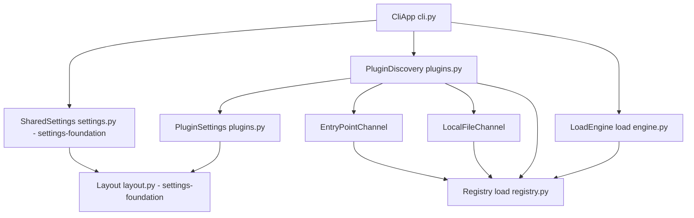
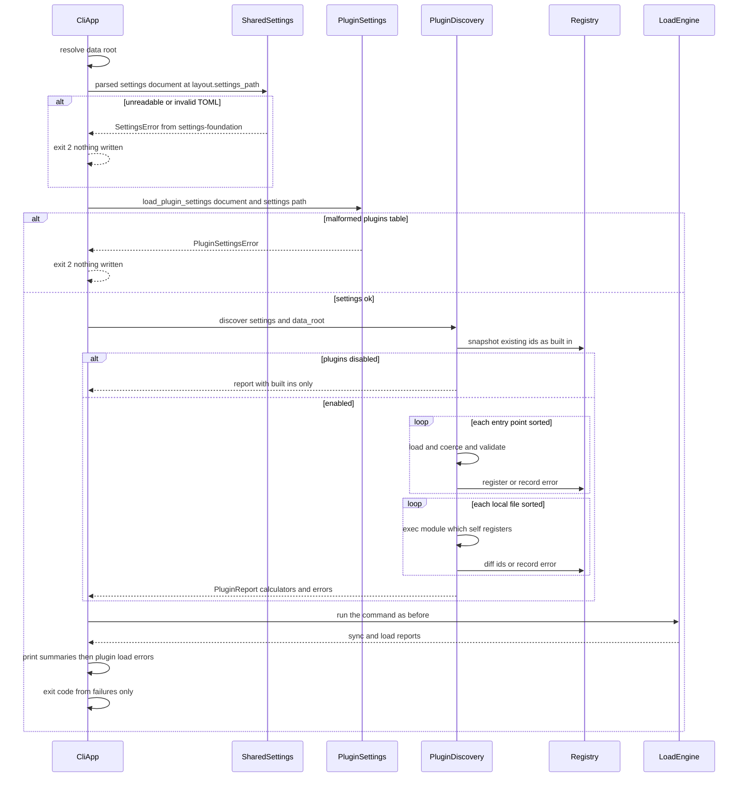
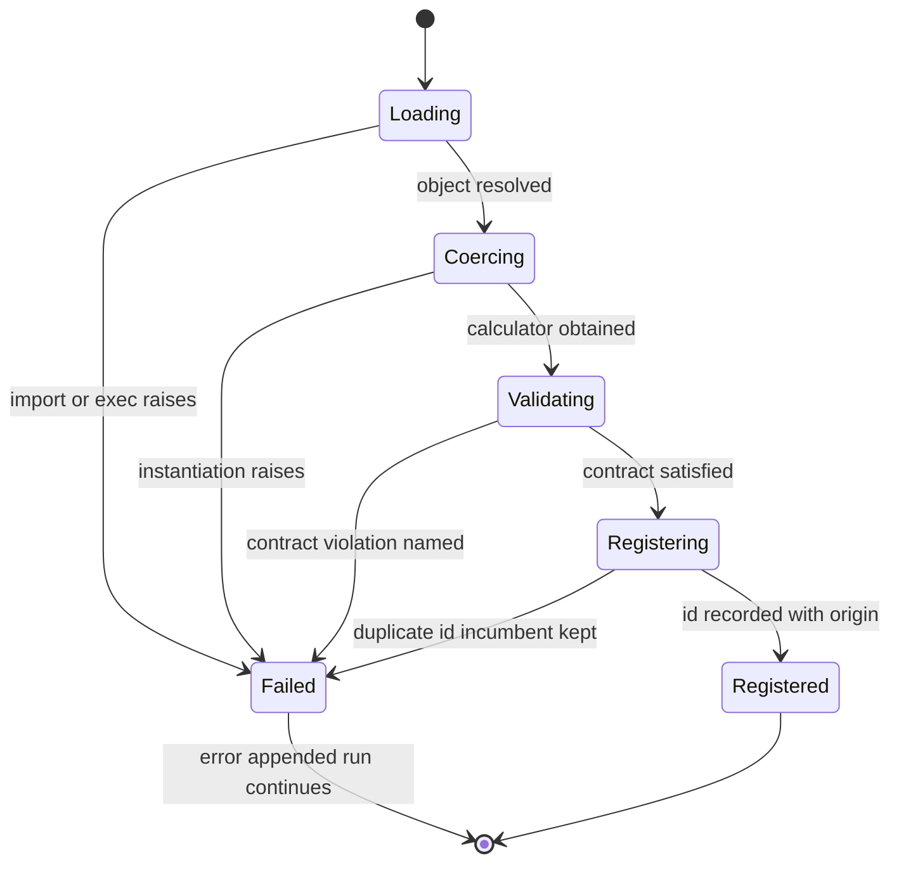

# Technical Design: plugin-api

## Overview

**Purpose**: plugin-api makes the `LoadCalculator` seam reachable from outside
the package, so an athlete can add a training-load methodology by installing a
distribution or dropping a Python file next to their vault configuration —
never by forking fitdocs.

**Users**: athletes who want a methodology fitdocs does not ship; developers
publishing a calculator (`fitdocs-*` on PyPI); users with bespoke, unpublishable
logic; and the pkm/agent integrations that need `fitdocs plugins` to report what
is actually loaded.

**Impact**: Adds one new module (`src/fitdocs/plugins.py`) that discovers,
validates, and registers third-party calculators from two channels — installed
distributions advertising the `fitdocs.load_calculators` entry-point group, and
a user-configured local plugin file or directory. Registration gains a
validation gate inside `registry.register()`, so every calculator (built-in,
packaged, or local) passes the same check. The CLI gains a `plugins` command,
calls discovery once per invocation before any engine work, and prints plugin
load errors through a warning treatment that never touches the exit code. The
calculator contract, the load engine, `sync.py`, and every generated document
are unchanged.

**Sequencing precondition**: the pre-wave **settings-foundation** item lands
first. It provides `layout.SETTINGS_FILE`, `layout.settings_path(data_root)`,
and a `settings.py` that reads and parses `<data-root>/fitdocs.toml` exactly
once per invocation, raising one `SettingsError` for file-level problems
(unreadable file, invalid TOML), with `tiles.py` already redirected onto it.
This spec therefore adds **no** layout constant, **no** settings-path helper,
and **no** change to `tiles.py`; it contributes one typed *per-table* reader for
`[plugins]` over the already-parsed mapping, and every path to the settings file
in this feature goes through `layout.settings_path(data_root)` — `data_root /
SETTINGS_FILE` is never composed anywhere.

### Goals

- Keyless discovery: `pip install fitdocs-mycalc` is the entire installation
  procedure (1.1).
- One registration policy for all channels: validate against the contract,
  reject duplicates in favor of the incumbent, report by name (3.1–3.3).
- Total failure isolation: no plugin failure aborts a run or changes an exit
  code (3.5).
- One inspectable answer to "what does fitdocs see": `fitdocs plugins` (4.1–4.8).
- A typed, documented, versioned public surface plugin authors can build against
  (5.1–5.6) with a worked example (6.1–6.4).
- Zero added runtime dependencies; no network; byte-identical output when no
  plugins are present (7.1–7.5).

### Non-Goals

- No change to `LoadCalculator`, `LoadOutcome`, the engine's selection rules, or
  the athlete profile: this spec adds registrants, not contract semantics.
- No pluggable renderers, templates, charts, or frontmatter; no hook lifecycles
  beyond one calculator object per plugin.
- No sandboxing, permission prompting, signature verification, or any other
  containment of plugin code.
- No plugin index, marketplace, or version-resolution machinery.
- No release/publication mechanics (distribution owns those).

## Boundary Commitments

### This Spec Owns

- **Discovery**: the `fitdocs.load_calculators` entry-point group name, its
  resolution rules, its deterministic ordering, and the local plugin
  file/directory loader.
- **Registration policy**: contract validation and duplicate-id rejection inside
  `registry.register()`, plus the typed errors they raise.
- **Plugin provenance**: the origin/version metadata for every registered
  calculator, and the `PluginReport` (registered calculators + load errors) that
  is discovery's single output.
- **The `[plugins]` table** of `<data-root>/fitdocs.toml` (schema, defaults,
  per-key validation) and its table-level failure treatment
  (`PluginSettingsError`) — read from the mapping settings-foundation's shared
  reader has already parsed, never from a second read of the file.
- **The `fitdocs plugins` command** and the end-of-run plugin-error reporting in
  the existing commands.
- **The published plugin surface**: the `py.typed` marker, the documented public
  import surface, the compatibility policy, the naming convention, and the
  plugin-author guide.

### Out of Boundary

- The `LoadCalculator` contract, `LoadOutcome` variants, `InteractionSession`,
  the athlete profile store, and the load engine's selection/outcome handling
  (training-load owns them; this spec may not change their semantics).
- `sync.py`, `render/`, `docmerge.py`, document content, and golden files — this
  spec must produce byte-identical documents when no plugins are present.
- Per-document reporting structures (`SyncReport`, `LoadReport`) — plugin load
  errors are per-run and are reported by the CLI, not threaded through them.
- `layout.py`, `settings.py`, and `tiles.py` — the settings-file location
  helper, the shared one-time read/parse of `<data-root>/fitdocs.toml`, the
  file-level `SettingsError`, and the tile reader's redirection onto them all
  belong to settings-foundation and land before this spec. No task here edits
  those modules; this spec is a *consumer* of `layout.settings_path()` and the
  parsed settings mapping.
- The `[tiles]` table, its schema, and tile behavior (route-maps); the `[inbox]`
  table (inbox). The document ownership/frontmatter contract (wiki-contract),
  and the packaging/release process, the project-wide compatibility statement in
  `docs/compatibility.md`, and any build-profile pruning of bundled
  methodologies including the conditional export of `WithdrawnCalculator`
  (distribution).
- Which methodologies ship built-in, and the third party's licensing.

### Allowed Dependencies

- `plugins.py` may depend on: the stdlib (`importlib.metadata`,
  `importlib.util`, `dataclasses`, `pathlib`, `sys`), `fitdocs.layout`
  (`settings_path`, for naming the file in errors), `fitdocs.model.Modality`,
  and `fitdocs.load` (registry + contract types). It must not import
  `fitdocs.cli`, `fitdocs.sync`, `fitdocs.render`, or `fitdocs.tiles`. It does
  **not** import `tomllib`: parsing the settings document is
  settings-foundation's job, and `load_plugin_settings` reads the parsed
  mapping.
- `cli.py` may depend on `plugins.py`; nothing else in the package may.
  Dependency direction stays `cli → plugins → load → model`.
- `registry.py` gains no new imports beyond `fitdocs.model.Modality` (already
  imported) — validation is stdlib-only introspection.
- No new third-party runtime dependency, at any layer (7.2).

### Revalidation Triggers

- Any change to `LoadCalculator`'s members or to `LoadOutcome`'s variants —
  every published plugin and the validator's rules depend on them.
- Any change to the entry-point group name, the entry-point value shape, or the
  registration order rule — published plugins and their documentation depend on
  both.
- Any change to the `[plugins]` schema or its defaults, or to the settings-file
  location/parse contract this spec consumes from settings-foundation
  (`layout.settings_path`, the parsed mapping, `SettingsError`).
- Any change to the documented public import surface, or to the compatibility
  policy that governs it (distribution consumes this policy).
- Any change that makes plugin load failures affect exit codes.

## Architecture

### Existing Architecture Analysis

- **The seam is already correct.** `LoadCalculator` (`load/types.py`) declares
  identity, modality coverage, required athlete fields, and `compute()` →
  closed `LoadOutcome`; the engine additionally reads the additive
  `athlete_field_hints` attribute via `getattr`. Nothing about a third-party
  calculator differs from `WithdrawnCalculator`.
- **Registration order is registry order.** `registry._REGISTRY` is a
  module-level `dict[str, LoadCalculator]`; `for_modality()` returns matches in
  insertion order and the engine uses the first non-declining calculator. Built-ins
  are inserted by the `fitdocs.load` import side effect, so anything registered
  later necessarily sorts after them (1.3).
- **Settings pattern exists, and settings-foundation factors it.** The
  established shape is: an optional `<data-root>/fitdocs.toml` table read into a
  frozen dataclass — absent → documented defaults, malformed → a typed error the
  CLI maps to exit 2 before any write. settings-foundation splits that into a
  shared file layer (`layout.settings_path()` + `settings.py`'s single
  read/parse and single `SettingsError`) and per-table typed readers that stay
  with their owning specs. `[tiles]` is already on the shared layer when this
  spec starts; the `[plugins]` reader is a sibling per-table reader with the
  same shape, differing only in its keys and its typed
  `PluginSettingsError`.
- **Warn-and-continue exists.** route-maps established a warning channel that is
  reported and never affects the exit code; plugin load errors adopt the same
  treatment at the run level.
- **Packaging gaps.** `pyproject.toml` declares only the console script; there is
  no entry-point group documentation and no `py.typed`. `[tool.hatch.build.targets.wheel]
  packages = ["src/fitdocs"]` ships every file under the package, so adding the
  marker file is sufficient.

### Architecture Pattern & Boundary Map

Selected pattern: **discovery adapter over an unchanged registry**. `plugins.py`
is the only component that knows plugins exist; `registry.py` gains a validation
gate but keeps its id→calculator responsibility; the engine is untouched.



**Architecture Integration**

- **Domain boundaries**: discovery + provenance (`plugins.py`), registration
  policy (`registry.py`), reporting + command surface (`cli.py`), settings-file
  location and one-time parse (`layout.py` + `settings.py`, owned by
  settings-foundation and only consumed here). No behavior is co-owned: the
  registry never learns about origins, `plugins.py` never selects or runs a
  calculator, and `plugins.py` never opens the settings file — the CLI hands it
  the already-parsed document.
- **Existing patterns preserved**: injected-dependency purity (settings and the
  entry-point source are parameters, as `config.resolve_data_root` takes `env`
  and `TileStore` takes a fetcher), typed settings errors → exit 2, warn-and-
  continue reporting, frozen dataclasses with tuple fields, absent data is
  `None`.
- **New components rationale**: `plugins.py` exists because two discovery
  channels, provenance attribution, and per-plugin isolation are one cohesive
  responsibility that belongs to neither the registry nor the CLI.
- **Steering compliance**: dependency direction `cli → plugins → load → model`;
  `mypy --strict`; stdlib-only; nothing written to the data root by this feature.

### Technology Stack

| Layer | Choice / Version | Role in Feature | Notes |
|-------|------------------|-----------------|-------|
| CLI | `typer` (existing) | `fitdocs plugins` command; end-of-run error block via `rich` tables already used | No new dependency |
| Discovery | stdlib `importlib.metadata` (3.11) | `entry_points(group=...)`, `EntryPoint.load()`, `EntryPoint.dist` for name/version | Verified on 3.11.15 in this checkout; unknown group → empty list |
| Local loading | stdlib `importlib.util` | `spec_from_file_location` + `exec_module` under a namespaced module name | No `sys.path` mutation |
| Configuration | shared `fitdocs.settings` (settings-foundation; stdlib `tomllib` inside it) | `[plugins]` table of the already-parsed user-owned `fitdocs.toml` | Per-table reader only; file located via `layout.settings_path()`, parsed once, file-level failures raise the shared `SettingsError` |
| Typing/packaging | PEP 561 `py.typed` + hatchling (existing) | Ships inline annotations to plugin authors' type checkers | Marker file only; wheel target already includes package files |

## File Structure Plan

### New Files

```
src/fitdocs/
├── plugins.py                     # Plugin settings + discovery + provenance:
│                                  #   PluginSettings, load_plugin_settings,
│                                  #   PluginSettingsError, Origin union,
│                                  #   PluginInfo, PluginLoadError, PluginReport,
│                                  #   discover(), reset(), ENTRY_POINT_GROUP.
│                                  #   The ONLY module that loads third-party code.
└── py.typed                       # PEP 561 marker (empty file).

tests/
├── test_plugins.py                # Settings parsing/defaults/validation; entry-point
│                                  #   discovery with an injected source (ordering,
│                                  #   class/instance/factory resolution, isolation,
│                                  #   duplicate ids, disable switch); local file/dir
│                                  #   loading (sorted, underscore-skipped, missing
│                                  #   path, relative-to-data-root); reset().
├── load/test_registry_validation.py  # validate_calculator rules + register() gate:
│                                  #   each rejection reason, built-ins still register.
├── test_plugins_install.py        # Slow e2e: uv tool install fitdocs --with a fixture
│                                  #   plugin distribution into an isolated tool dir;
│                                  #   `fitdocs plugins` lists it with distribution
│                                  #   name + version; uninstall.
└── fixtures/plugin_pkg/           # Minimal installable fixture distribution
    ├── pyproject.toml             #   declaring [project.entry-points."fitdocs.load_calculators"]
    └── fitdocs_fixture_calc.py    #   with a trivial RUN calculator.

docs/
└── plugins.md                     # Plugin platform guide: install & verify, the
                                   #   packaged worked example (layout + entry point),
                                   #   local plugin files + the arbitrary-code-execution
                                   #   disclosure, naming convention, public API surface,
                                   #   compatibility policy, failure diagnosis.
```

### Modified Files

- `src/fitdocs/load/registry.py` — add `validate_calculator(obj) -> str | None`
  (pure, side-effect free), `InvalidCalculatorError(ValueError)` and
  `DuplicateCalculatorIdError(ValueError)`; `register()` validates before
  inserting; add `unregister(calculator_id) -> None` (no-op when absent) used by
  `plugins.reset()`. Existing messages and `ValueError` behavior preserved.
- `src/fitdocs/load/__init__.py` — re-export the two new error types alongside
  the existing registry names and add them to `__all__`; they are part of the
  documented plugin-author surface. `unregister` stays registry-internal API and
  is deliberately not re-exported.
- `src/fitdocs/cli.py` — new `plugins` command; `_plugin_report(data_root)`
  helper that obtains the parsed settings document from the shared reader
  (file-level `SettingsError` → exit 2, exactly as for any other table), derives
  `[plugins]` settings through `load_plugin_settings` (malformed table → exit 2
  before any write), and runs discovery once, called by `sync`/`regen`/`load`
  after data-root resolution and before the engine; `_report_plugin_errors(report)`
  printed at the end of the run; docstring update for the new command and the
  unchanged exit-code semantics. Landing order in `sync_command` is fixed: see
  "CLI landing order" below.

  *Not modified by this spec*: `src/fitdocs/layout.py` and `src/fitdocs/tiles.py`
  — settings-foundation adds `SETTINGS_FILE`/`settings_path()` and redirects the
  tile reader before this spec starts.
- `pyproject.toml` — no new dependency; documentation comment naming the
  `fitdocs.load_calculators` group is not required, but the `py.typed` marker
  must ship (already covered by the wheel target; asserted by a packaging test).
- `docs/contributing-calculators.md` — cross-link to `docs/plugins.md` for
  distribution/discovery; keep the contract-authoring content it already owns.
- `README.md` — short "Plugins" section: what a plugin is, how to install one,
  `fitdocs plugins`, the local-plugin setting and its execution caveat, pointer
  to `docs/plugins.md`.
- `tests/test_packaging.py` — assert `py.typed` is present in the installed tool
  and that `fitdocs plugins` runs from the installed console script.
- `tests/test_public_api.py` — assert the documented plugin-facing public names
  are importable and identical to their defining objects. This spec's edit is
  scoped to its own enumerated names; it neither asserts nor forbids names other
  specs add to the same file (see "Public-surface ownership" below).
- `tests/conftest.py` — autouse fixture calling `plugins.reset()` so discovery
  state never leaks between tests.

### CLI landing order

`sync_command` is edited by two Phase 3 specs in the same region, and the order
is fixed rather than left to whoever merges first.

**This spec lands first.** Its edit is the smaller of the two: a single
`discover()` call plus `_report_plugin_errors(report)`, inserted after data-root
resolution and before the engine call, leaving the command's signature and its
argument handling untouched. inbox's edit is larger — it makes `SOURCE` optional
and adds a four-step pre-flight ahead of the engine — so it composes cleanly on
top of an already-placed discovery call, while the reverse order would force
inbox's pre-flight to be re-threaded around a later insertion.

The resulting order inside `sync_command` is: resolve data root → shared
settings parse → **plugin discovery (this spec)** → inbox pre-flight and source
selection (inbox) → engine → per-file reports → **plugin-error block (this
spec, printed last)**. The plugin-error block stays after the engine summaries
so a run's tail always shows it, and it never touches the exit code.

inbox records the same assumption from its side (its landing-order note and its
cross-spec obligations table). If inbox lands first for any reason, this spec's
insertion point is unchanged — the agreement exists to avoid a merge conflict,
not because either edit depends on the other's behavior.

### Public-surface ownership

`tests/test_public_api.py` is touched by more than one Phase 3 spec, so the
authority question is settled here: **this spec's enumerated public import
surface is the project's authoritative definition of what is public.**

- Public: the plugin-author names enumerated in the Components section (the
  calculator contract, the outcome variants, the registration entry points, and
  this spec's two new typed errors), plus `fitdocs.model`'s activity types.
- Internal, and explicitly *not* public: `fitdocs.contract` (wiki-contract),
  `fitdocs.inbox` (inbox), `fitdocs.plugins` (this spec — the module is the
  implementation of discovery, not a plugin-author API), `fitdocs.version`,
  `fitdocs.layout`, and `fitdocs.settings` (settings-foundation).
- The bundled `WithdrawnCalculator` is **not** public surface and may be absent
  from a given distribution; distribution owns its conditional export.

This spec's edit to `tests/test_public_api.py` is scoped to its own enumerated
names: it asserts they are importable and identical to their defining objects,
and it neither asserts nor forbids names other specs add to the same file.
distribution's `docs/compatibility.md` carries the project-wide prose statement
and points at this enumeration as the authority.

## System Flows

Discovery runs once per invocation, before any engine call:



Key decisions not visible in the diagram: discovery is cached per process, keyed
on `(data_root, settings)`, so a second call with the same key returns the first
report rather than re-registering (1.2); the
built-in snapshot is taken *after* `fitdocs.load` is imported, which guarantees
built-ins occupy the first registry slots (1.3); and the plugin-error block is
printed after the existing summaries so a run's tail always shows it (3.6).

Per-plugin isolation state machine (identical for both channels):



## Requirements Traceability

| Requirement | Summary | Components | Interfaces | Flows |
|-------------|---------|------------|------------|-------|
| 1.1 | Entry-point discovery, no config | PluginDiscovery | `discover()`, `ENTRY_POINT_GROUP` | Discovery |
| 1.2 | Once per invocation, before processing | PluginDiscovery, CliApp | cached `discover()`; called from `_plugin_report` | Discovery |
| 1.3 | Deterministic order, built-ins first | PluginDiscovery, Registry | sort key `(name, dist, value)`; dict insertion order | Discovery |
| 1.4 | Plugin used like a built-in | Registry (unchanged engine) | `for_modality()` | — |
| 1.5 | `--calculator <plugin id>` | CliApp, Registry | existing `registry.get()` | Discovery |
| 1.6 | Unknown id lists plugin ids | CliApp, Registry | `UnknownCalculatorError` message | Discovery |
| 1.7 | No plugins → unchanged behavior | PluginDiscovery | empty `EntryPoints`, no local path | Discovery |
| 1.8 | Config disable switch | PluginSettings, PluginDiscovery | `PluginSettings.enabled` | Discovery |
| 1.9 | Import only advertising distributions | PluginDiscovery | `entry_points(group=...)` | Discovery |
| 2.1 | Local plugin path loading | LocalFileChannel | `PluginSettings.path` | Discovery |
| 2.2 | Directory: sorted top-level `*.py` | LocalFileChannel | `_local_files()` | Discovery |
| 2.3 | Single file path | LocalFileChannel | `_local_files()` | Discovery |
| 2.4 | Relative resolves against data root | PluginSettings | `resolved_path(data_root)` | Discovery |
| 2.5 | No implicit default location | PluginSettings | `path: str \| None = None` | Discovery |
| 2.6 | Missing/unreadable path → load error | LocalFileChannel | `PluginLoadError` | Isolation |
| 2.7 | Malformed `[plugins]` table → exit 2 pre-write (file-level problems → shared `SettingsError`) | PluginSettings, CliApp | `PluginSettingsError`; shared `SettingsError` (settings-foundation) | Discovery |
| 2.8 | Execution disclosure documented | UserDocs | `docs/plugins.md`, `README.md` | — |
| 3.1 | Contract validation with reason | RegistryValidation | `validate_calculator()` | Isolation |
| 3.2 | Load errors isolated, others continue | PluginDiscovery | per-plugin `try/except Exception` | Isolation |
| 3.3 | Duplicate id: incumbent wins | RegistryValidation | `DuplicateCalculatorIdError` | Isolation |
| 3.4 | Built-ins always register | PluginDiscovery | built-ins registered before discovery | Discovery |
| 3.5 | Never aborts, never changes exit code | CliApp | `_report_plugin_errors` outside `_finish` | Discovery |
| 3.6 | Failures reported by name at run end | CliApp | `PluginReport.errors` | Discovery |
| 3.7 | Runtime error → per-document failure | LoadEngine (unchanged) | existing `except Exception` per doc | — |
| 4.1 | Listing with id/name/version/origin/modalities | PluginsCommand | `PluginInfo` | — |
| 4.2 | Origin classification | PluginDiscovery | `Origin` union | Discovery |
| 4.3 | Version per origin, unknown not fabricated | PluginDiscovery | `PluginInfo.version: str \| None` | Discovery |
| 4.4 | Errors listed with subject + detail | PluginsCommand | `PluginLoadError` | Isolation |
| 4.5 | Clean state reported as such | PluginsCommand | empty `errors` tuple | — |
| 4.6 | Exits 0 even with load errors | PluginsCommand | no `_finish` call | — |
| 4.7 | Unresolvable data root still lists | PluginsCommand | `DataRootError` → degraded listing | — |
| 4.8 | No network, no writes | PluginDiscovery, PluginsCommand | stdlib-only, read-only | — |
| 5.1 | Ships type information | Packaging | `src/fitdocs/py.typed` | — |
| 5.2 | Documented public surface | UserDocs, PublicApi | `docs/plugins.md`, `__all__` | — |
| 5.3 | Everything else is internal, incl. the bundled calculator | UserDocs, PublicApi | `docs/plugins.md` ("not the public surface" statement) | — |
| 5.4 | Compatibility policy stated | UserDocs | `docs/plugins.md` | — |
| 5.5 | Compatible upgrades need no plugin change | PublicApi | stable `__all__` + policy | — |
| 5.6 | Additive-only contract changes | RegistryValidation, PublicApi | validator asserts current members only | — |
| 6.1 | Worked packaged example | UserDocs, fixture package | `docs/plugins.md`, `tests/fixtures/plugin_pkg/` | — |
| 6.2 | Local alternative documented | UserDocs | `docs/plugins.md` | — |
| 6.3 | Naming convention + id uniqueness | UserDocs | `docs/plugins.md` | — |
| 6.4 | Failure diagnosis documented | UserDocs | `docs/plugins.md` | Isolation |
| 7.1 | No network in discovery | PluginDiscovery | stdlib metadata/import only | — |
| 7.2 | No new runtime dependency | Technology Stack | stdlib only | — |
| 7.3 | Byte-identical with no plugins | PluginDiscovery | no-op discovery path | — |
| 7.4 | the withdrawn calculator unchanged | Registry, LoadEngine | untouched registration/selection | — |
| 7.5 | Only calculators are extensible | PluginDiscovery | single entry-point group | — |

## Components and Interfaces

| Component | Domain/Layer | Intent | Req Coverage | Key Dependencies (P0/P1) | Contracts |
|-----------|--------------|--------|--------------|--------------------------|-----------|
| PluginSettings + `load_plugin_settings` | Config (`plugins.py`) | Typed per-table `[plugins]` reader over the parsed settings document, with defaults and loud failure | 1.8, 2.1, 2.4, 2.5, 2.7 | `fitdocs.settings` parsed document (P0, settings-foundation), `layout.settings_path` (P0, for error text) | Service, State |
| PluginDiscovery | Discovery (`plugins.py`) | Resolve both channels once, validate, register, attribute origins, collect errors | 1.1–1.3, 1.7–1.9, 2.1–2.6, 3.2, 3.4, 4.2, 4.3, 7.1, 7.3, 7.5 | `importlib.metadata` (P0), `importlib.util` (P0), Registry (P0) | Service, State |
| RegistryValidation | Contract gate (`load/registry.py`) | Validate any calculator at registration; reject duplicates | 3.1, 3.3, 5.6 | `fitdocs.model.Modality` (P0) | Service |
| PluginsCommand | CLI (`cli.py`) | `fitdocs plugins` listing and diagnostics | 4.1, 4.4–4.8 | PluginDiscovery (P0), `rich` (P1) | Service |
| CliPluginWiring | CLI (`cli.py`) | Run discovery once per command; print errors without affecting exit code | 1.2, 1.5, 1.6, 2.7, 3.5, 3.6 | PluginDiscovery (P0) | Service |
| Packaging + PublicApi | Packaging | Ship `py.typed`; keep the documented import surface stable | 5.1, 5.2, 5.5, 5.6 | hatchling (P0) | State |
| UserDocs | Documentation | Plugin guide: worked example, local plugins, policy, diagnosis | 2.8, 5.2–5.4, 6.1–6.4 | — | — |

### Configuration

#### PluginSettings + `load_plugin_settings` (`src/fitdocs/plugins.py`)

| Field | Detail |
|-------|--------|
| Intent | Map the `[plugins]` table of the already-parsed `<data-root>/fitdocs.toml` document onto a frozen, validated settings object |
| Requirements | 1.8, 2.1, 2.4, 2.5, 2.7 |

**Responsibilities & Constraints**

- **Per-table reader only.** settings-foundation's shared reader has already
  located the file (`layout.settings_path(data_root)`), read it, and parsed it
  once for the whole invocation; file-level problems (unreadable, invalid TOML)
  have already surfaced as the single shared `SettingsError`. This reader
  receives the parsed mapping and never opens, reads, or parses a file itself —
  there is exactly one file-level error voice in the tool, and it is not this
  one.
- Absent file or absent `[plugins]` table → `DEFAULT_PLUGIN_SETTINGS`
  (`enabled=True`, `path=None`); each key defaults independently, exactly as
  `[tiles]` does. (An absent file reaches this reader as an empty document from
  the shared reader.)
- Malformed values raise `PluginSettingsError` naming the file and the offending
  key. `enabled` must be a real `bool` (an explicit `bool` check, because
  `bool` subclasses `int`); `path` must be a non-empty `str`. The file name in
  the message comes from the `settings_file` argument the caller obtained from
  `layout.settings_path(data_root)`; `data_root / SETTINGS_FILE` is never
  composed here or anywhere else in this feature.
- Unknown keys inside `[plugins]` and unknown top-level tables are ignored — the
  document is shared with `[tiles]`, `[inbox]`, and future tables.
- The file is user-owned and read-only to fitdocs: nothing in this feature
  creates it, prompts for it, or writes to it on any path.
- A relative `path` resolves against the data root; an absolute `path` is used
  as given. Existence is *not* checked here — a missing path is a plugin load
  error (2.6), not a configuration error (2.7).

**Dependencies**: Outbound the parsed settings document from `fitdocs.settings`
(P0, settings-foundation) and `fitdocs.layout.settings_path` (P0, used by the
caller to locate the file and by this reader only to name it in errors). No
`tomllib`.

**Contracts**: Service [x] / State [x]

##### Service Interface

```python
@dataclass(frozen=True)
class PluginSettings:
    enabled: bool          # False disables BOTH discovery channels (1.8)
    path: str | None       # local plugin file or directory; None = no local plugins

    def resolved_path(self, data_root: Path) -> Path | None: ...

DEFAULT_PLUGIN_SETTINGS: Final[PluginSettings] = PluginSettings(enabled=True, path=None)

class PluginSettingsError(Exception): ...

def load_plugin_settings(
    document: Mapping[str, Any],   # the parsed fitdocs.toml, from fitdocs.settings
    settings_file: Path,           # layout.settings_path(data_root); error text only
) -> PluginSettings: ...
```

- Preconditions: `document` is the settings mapping the shared reader already
  produced for this invocation (an absent file yields an empty mapping);
  `settings_file` came from `layout.settings_path(data_root)`.
- Postconditions: returns validated settings or raises `PluginSettingsError`;
  no file is opened and the filesystem is unmodified.
- Invariants: absence is never an error; a malformed value is never silently
  defaulted; file-level failures are never reported by this function — they are
  already the shared `SettingsError`.
- The exact spelling of the shared accessor (module-level function vs. document
  object) is settings-foundation's to publish; this reader consumes it as a
  mapping and adapts if the name differs.

##### State Management

- State model: none beyond the returned value object; the reader is pure per
  call.

### Discovery

#### PluginDiscovery (`src/fitdocs/plugins.py`)

| Field | Detail |
|-------|--------|
| Intent | Load, validate, register, and attribute every third-party calculator, isolating each failure |
| Requirements | 1.1–1.3, 1.7–1.9, 2.1–2.6, 3.2, 3.4, 4.2, 4.3, 7.1, 7.3, 7.5 |

**Responsibilities & Constraints**

- **Order** (1.3): import `fitdocs.load` first (built-ins register), snapshot the
  existing ids as `BuiltIn`, then entry points sorted by
  `(entry_point.name, dist name or "", entry_point.value)`, then local files
  sorted by filename. Registry insertion order is the resulting registration
  order, which is what the engine's first-match selection consumes.
- **Entry-point resolution**: `EntryPoint.load()` yields an object; if it is a
  class, instantiate it with no arguments; else if it is not already a valid
  calculator and is callable, call it with no arguments; then validate and
  register. This single rule covers class, factory, and instance values.
- **Local-file resolution**: each file is executed under the module name
  `fitdocs_local_plugins.<stem>` via `spec_from_file_location` /
  `exec_module`; the module calls `fitdocs.load.register()` itself, exactly as
  `docs/contributing-calculators.md` already teaches. Ids that appear in the
  registry across the exec are attributed to that file. `sys.path` is never
  mutated; files whose name starts with `_` are skipped; subdirectories are not
  traversed.
- **Isolation** (3.2): every per-plugin step runs inside its own
  `try/except Exception`; a failure appends a `PluginLoadError` and moves on.
  Registration errors (`InvalidCalculatorError`, `DuplicateCalculatorIdError`)
  are caught the same way. A partially-registering local file keeps whatever it
  registered before raising, and the error is recorded.
- **Idempotence** (1.2): the first `discover()` caches its `PluginReport`
  against the `(data_root, settings)` it ran for; a later call with the same pair
  returns it unchanged and never re-registers. A call with a *different* pair is
  a new invocation: `reset()` runs first, then discovery repeats — this keeps
  in-process CLI tests that drive several temporary data roots correct, while a
  real single-command process still discovers exactly once.
  `reset()` clears the cache and unregisters exactly the ids attributed to
  plugins — never a built-in — and is also used by the suite's autouse fixture.
- **Disable switch** (1.8): when `settings.enabled` is `False`, no entry point is
  loaded and no local file is executed; the report contains built-ins only.
- **No network, no writes** (4.8, 7.1): the module performs no I/O other than
  importing plugin code — the settings file is read once, elsewhere, by the
  shared reader.
- **Injected entry-point source**: `discover()` accepts an `entry_points_fn`
  parameter defaulting to `importlib.metadata.entry_points`, so tests exercise
  ordering, coercion, and isolation without installing distributions (mirrors
  `resolve_data_root(env=...)` and `TileStore`'s injected fetcher).

**Dependencies**: Inbound `cli.py` (P0). Outbound `fitdocs.load.registry`
(P0), `fitdocs.layout` (P1). External `importlib.metadata` (P0),
`importlib.util` (P0).

**Contracts**: Service [x] / State [x]

##### Service Interface

```python
ENTRY_POINT_GROUP: Final[str] = "fitdocs.load_calculators"
LOCAL_MODULE_PREFIX: Final[str] = "fitdocs_local_plugins"

@dataclass(frozen=True)
class BuiltIn:
    """Shipped with fitdocs."""

@dataclass(frozen=True)
class Distribution:
    name: str                  # advertising distribution, e.g. "fitdocs-mycalc"
    entry_point: str           # entry-point name within the group

@dataclass(frozen=True)
class LocalFile:
    path: str                  # the file that registered the calculator

Origin = BuiltIn | Distribution | LocalFile

@dataclass(frozen=True)
class PluginInfo:
    calculator_id: str
    display_name: str
    version: str | None        # None = unknown; never fabricated (4.3)
    origin: Origin
    modalities: tuple[str, ...]  # sorted modality values

@dataclass(frozen=True)
class PluginLoadError:
    # Phase 3 report-type vocabulary: (subject, detail[, remedy]).
    subject: str               # WHAT failed: entry point "dist: name", or the local file path
    detail: str                # WHY, in user-facing words

@dataclass(frozen=True)
class PluginReport:
    calculators: tuple[PluginInfo, ...]   # registration order (built-ins first)
    errors: tuple[PluginLoadError, ...]   # discovery order

def discover(
    data_root: Path | None,
    settings: PluginSettings,
    *,
    entry_points_fn: Callable[..., Iterable[EntryPoint]] = importlib.metadata.entry_points,
) -> PluginReport: ...

def reset() -> None:
    """Test support: drop cached discovery state and unregister plugin ids."""
```

- Preconditions: `settings` already validated; `data_root` may be `None` (the
  degraded `plugins` listing path, 4.7), in which case the local channel is
  skipped and its omission is reported by the caller.
- Postconditions: every valid calculator is registered exactly once; every
  failure appears in `errors` with a subject and a detail; the registry contains
  no partially-validated object; nothing is written to disk.
- Invariants: built-ins always occupy the first registry slots and are never
  unregistered; the report's `calculators` order equals registry order; calling
  `discover()` twice with the same `(data_root, settings)` registers nothing
  twice. `PluginInfo.version` is populated here — the distribution's version, the
  installed fitdocs version for a built-in, `None` for a local file — so the
  listing command only formats it.

##### State Management

- State model: module-level cached `PluginReport | None` plus an
  id→`Origin` map. Both are cleared only by `reset()`.
- Persistence & consistency: none — process-lifetime only, rebuilt every run.
- Concurrency: single-threaded CLI; no locking required.

**Implementation Notes**

- Integration: called from `cli.py` only; `sync.py` and `load/engine.py` are not
  modified, which is what keeps golden output byte-identical (7.3).
- Validation: reject an entry point whose value resolves to a module (a common
  authoring mistake) with a reason naming the expected shape.
- Risks: a local plugin file that mutates global state at import is outside
  fitdocs' control — documented, not defended against (2.8).

#### RegistryValidation (`src/fitdocs/load/registry.py`)

| Field | Detail |
|-------|--------|
| Intent | One gate every calculator passes before it enters the registry |
| Requirements | 3.1, 3.3, 5.6 |

**Responsibilities & Constraints**

- `validate_calculator(obj)` returns `None` when `obj` satisfies the contract,
  or a human-readable reason naming the first violation. Checks, in order:
  `calculator_id` is a non-empty `str`; `display_name` is a non-empty `str`;
  `supported_modalities` is a non-empty iterable whose every element is a
  `Modality`; `required_athlete_fields` is callable; `compute` is callable.
- The validator never *calls* `required_athlete_fields()` or `compute()` —
  registration must have no side effects.
- `register()` raises `InvalidCalculatorError` (validation) or
  `DuplicateCalculatorIdError` (id already present, incumbent retained); both
  subclass `ValueError`, so the existing public behavior and every existing test
  expectation continue to hold.
- `unregister(calculator_id)` removes an id if present and is a no-op otherwise;
  it exists for `plugins.reset()` and is not part of the plugin-author surface.
- Additive-only (5.6): the validator checks exactly today's members. Adding a
  new required member later would break published plugins and is a
  revalidation trigger.

**Contracts**: Service [x]

##### Service Interface

```python
class InvalidCalculatorError(ValueError): ...
class DuplicateCalculatorIdError(ValueError): ...

def validate_calculator(obj: object) -> str | None: ...
def register(calculator: LoadCalculator) -> None: ...      # now validates first
def unregister(calculator_id: str) -> None: ...            # no-op when absent
```

- Preconditions: none — `validate_calculator` accepts any object.
- Postconditions: after a successful `register()`, `get()` returns the exact
  object and `available()` includes it in insertion order.
- Invariants: a rejected calculator never enters `_REGISTRY`; an incumbent
  registration is never replaced.

### CLI

#### PluginsCommand (`src/fitdocs/cli.py`)

| Field | Detail |
|-------|--------|
| Intent | `fitdocs plugins`: show every registered calculator and every load error |
| Requirements | 4.1, 4.4–4.8 |

**Responsibilities & Constraints**

- Resolves the data root by the standard precedence; on `DataRootError` it
  proceeds with `data_root=None`, lists built-ins and distribution-provided
  calculators, prints a line stating that no local plugin configuration was
  consulted, and exits `0` (4.7). This is a deliberate, documented departure
  from the exit-2 treatment other commands give an unresolvable data root: the
  command is a diagnostic and must work outside a configured vault.
- With a data root, a malformed `[plugins]` table still exits `2` (2.7) — a
  broken configuration is not something to list around.
- Prints one `rich` table: id, display name, version (`unknown` when `None`),
  origin (`built-in` / `<dist> <entry point>` / `local: <path>`), modalities.
  A second block lists each load error's subject and detail; when there are none,
  it prints an explicit "no plugin load errors" line (4.5).
- Exits `0` whenever a listing was produced, including with load errors (4.6);
  performs no network access and writes nothing (4.8).

**Contracts**: Service [x]

#### CliPluginWiring (`src/fitdocs/cli.py`) — summary + notes

- `sync`, `regen`, and `load` call one helper after data-root resolution and
  before the engine: it loads `[plugins]` settings (`PluginSettingsError` →
  `_config_error` → exit 2, before anything is written) and runs `discover()`
  once (1.2). Because discovery precedes `apply_load`, a `--calculator` id
  provided by a plugin resolves (1.5) and an unknown id's message lists plugin
  ids too (1.6).
- After the existing summary tables, `_report_plugin_errors(report)` prints each
  failed plugin's subject and detail; `_finish()` is called with the same
  `failed` expression as today, so exit codes are provably unchanged (3.5, 3.6).
- Docstring: the exit-code contract gains an explicit sentence that plugin load
  errors are warnings, never failures.

#### Packaging + PublicApi — summary-only

- `src/fitdocs/py.typed` (empty marker) makes the package's inline annotations
  visible to a plugin author's `mypy`/`pyright` (5.1); hatchling's existing
  wheel target ships it, and `tests/test_packaging.py` asserts it is present in
  a real install.
- The documented public surface for plugin authors is exactly:
  `fitdocs` (`Activity`, `Samples`, `SessionSummary`, `Lap`, `StrengthSet`,
  `DeviceInfo`, `Provenance`, `Sport`, `Modality`, `SCHEMA_VERSION`,
  `fit_datetime`, `AthleteInputs`, `ZoneSpec`, `DerivedMetrics`, `parse_fit`,
  `compute_metrics`, `FitDecodeError`, `NotFitFileError`, `FitIntegrityError`)
  and `fitdocs.load` (`LoadCalculator`, `AthleteField`, `ProfileView`,
  `InteractionSession`, `LoadOutcome`, `LoadResult`, `Computed`, `Unsupported`,
  `MissingInputs`, `NotComputed`, `LoadContext`, `LoadSettings`,
  `LoadSettingsError`, `DEFAULT_LOAD_SETTINGS`, `NonSelectedValue`,
  `QualityFlag`, `supports_activity`, `register`, `get`, `available`,
  `for_modality`, `UnknownCalculatorError`, `InvalidCalculatorError`,
  `DuplicateCalculatorIdError`, `Benchmark`, `BenchmarkKind`, `BenchmarkRef`,
  `BenchmarkAge`, `benchmark_age`, `THRESHOLD_CALCULATOR`, `FlagKey`,
  `FlagSettings`) (5.2). `THRESHOLD_CALCULATOR`
  was added by `threshold-load` task 4.1 (`BuiltInRegistration`/`PublicSurfacePin`).
  `FlagKey` and `FlagSettings` were added by `activity-qa-flags` task 3.3
  (`PublicSurfacePin`); `evaluate_flags` is deliberately not part of this
  surface.
  Everything else
  is internal (5.3); `tests/test_public_api.py` guards the shipped `__all__`
  list (5.5), and `tests/test_docs_guarantees.py`'s
  `test_design_doc_public_surface_list_names_actually_import` /
  `test_every_fitdocs_load_export_appears_in_the_design_doc_surface_list`
  guard this enumeration's `fitdocs.load` half against that shipped list in
  both directions (a listed name that stops existing, and a real export the
  list never picked up); the `fitdocs` root half is guarded forward-only (a
  listed name that stops existing), with no reverse guard on the root
  package's own export list, here or in `docs/plugins.md` (queue:
  `2026-07-27-design-md-enumeration-unguarded`).
  `fitdocs.load` also re-exports its own `registry` submodule for internal
  wiring; it is deliberately excluded from this depend-on list — a plugin
  author reaches the registry only through the module-level functions above
  (`register`, `get`, `available`, `for_modality`), never by importing
  `fitdocs.load.registry` directly, matching `docs/plugins.md`'s own stated
  decision on the same name.
- **RESOLVED 2026-07-27 (plugin-api task 4.4)** — the enumeration above was
  reconciled against the shipped `training-load` contract
  (`src/fitdocs/load/__init__.py`, `src/fitdocs/__init__.py`), closing the
  2026-07-25 cross-spec-review follow-up this note replaces. What changed:
  `NotConfirmed` renamed to `NotComputed` (withdrawn-methodology-era confirmation vocabulary
  with no producer in `src/`, withdrawn Requirement 4); and seven names
  present in the live `fitdocs.load.__all__` but absent from the prior
  enumeration were added — `LoadContext` (the required fifth parameter of
  `LoadCalculator.compute`, carrying the resolved `[load]` settings and the
  document's own date), `LoadSettings`, `LoadSettingsError`,
  `DEFAULT_LOAD_SETTINGS`, `NonSelectedValue`, `QualityFlag`, and
  `supports_activity` (the module-level function the engine actually asks
  through; `LoadCalculator` declares no `supports` Protocol member — commit
  `3121bb6` withdrew that draft member, so the compatibility policy only ever
  needed the module-level function). `ProfileView` also reverted to a pure
  store view — it exposes only stored athlete data and does not carry the
  activity's date, a configured window, or resolved `[load]` settings; that
  per-pass state lives on `LoadContext` instead
  (`src/fitdocs/load/types.py:262-266`, "Stays a store view (Amendment 3, Req
  1.13)"). All three parts of the original follow-up's item 3 — the
  `LoadContext`/`compute` signature change, the withdrawn `supports` member,
  and `ProfileView` staying a store view — are closed. The `fitdocs` root
  list was checked against `fitdocs.__all__` and required no change *as of
  this note's date*; a later queue-driven amendment (see `spec.json`'s
  `phase_note`) expanded its "decode errors" prose gloss to the three named
  errors, so this sentence describes 2026-07-27 only, not the root list's
  current state. The
  compatibility statement (`docs/plugins.md` compatibility policy) was
  already rewritten to unstable-pre-1.0 by `training-load` task 5.2
  (commit `a9a914d`); nothing further is owed here. This spec's requirements,
  tasks and approvals remain unchanged — this was a description correction,
  not a re-spec.

#### UserDocs (`docs/plugins.md`, `README.md`) — summary-only

- `docs/plugins.md` carries: install-and-verify flow; the worked packaged
  example (source layout, the `[project.entry-points."fitdocs.load_calculators"]`
  declaration, install, `fitdocs plugins` verification) (6.1); the local plugin
  file/directory alternative with the loading rules and the plain statement that
  fitdocs executes those files as ordinary code with the user's privileges and
  applies no sandboxing (2.8, 6.2); the `fitdocs-*` distribution naming
  convention and the id-uniqueness rule (6.3); the public import surface and the
  statement that everything else is internal (5.2, 5.3); the compatibility
  policy in terms of released version numbers (5.4); and a diagnosis section
  showing the error output for each rejection reason (6.4).
- Compatibility policy text (5.4): within a `0.x` series the plugin surface may
  change only additively between patch releases and any removal or signature
  change is called out in the changelog and accompanied by a minor bump; from
  `1.0` the surface follows semver, with removals confined to major releases.
  distribution owns the release mechanics that enforce this.

## Data Models

### Settings File (`<data-root>/fitdocs.toml`)

The file itself (its name, its location helper, and its single read/parse) is
settings-foundation's; this spec contributes one table to the document it
returns.

```toml
# User-owned; fitdocs only ever reads this file.
[plugins]
enabled = true        # false disables entry-point AND local discovery (1.8)
path = "plugins"      # optional; file or directory, relative to the data root (2.1, 2.4)
```

| Key | Type | Default | Validation |
|-----|------|---------|-----------|
| `enabled` | bool | `true` | strict `bool` (an int is rejected) |
| `path` | str | absent → no local plugins | non-empty string; existence checked at load time, not here |

### Value Objects

All frozen dataclasses with tuple sequence fields, matching the project's
determinism convention: `PluginSettings`, `BuiltIn` / `Distribution` /
`LocalFile` (the `Origin` union), `PluginInfo`, `PluginLoadError`,
`PluginReport`.

### Local Plugin Module Namespace

Local files are executed under `fitdocs_local_plugins.<file stem>` and inserted
into `sys.modules` under that name, so two vaults' files never collide with a
real installed module. The prefix is reserved for this purpose.

## Error Handling

### Error Strategy

Three tiers, matching the existing CLI taxonomy:

1. **Configuration errors (exit 2, nothing written)**: a malformed `[plugins]`
   table. Raised as `PluginSettingsError` by the per-table reader, mapped by
   `_config_error` exactly like a malformed `[tiles]` table or `athlete.toml`.
   A settings *file* that is unreadable or not valid TOML is not this feature's
   error: settings-foundation's shared reader raises one `SettingsError` for it,
   which the CLI already maps to the same exit-2 treatment before any table
   reader runs.
2. **Plugin load errors (reported, exit code unchanged)**: everything a plugin
   can do wrong — failing to import, resolving to the wrong kind of object,
   violating the contract, claiming a taken id, or being pointed at by a path
   that does not exist. Collected into `PluginReport.errors`, printed at the end
   of the run and by `fitdocs plugins`.
3. **Per-document failures (existing channel, exit 1)**: a registered plugin
   whose `compute()` raises while processing a document — already isolated by
   `apply_load`'s per-document `except Exception` (3.7). No change.

### Error Categories and Responses

| Condition | Class | User-facing response |
|-----------|-------|----------------------|
| Settings file unreadable or not valid TOML | `SettingsError` (settings-foundation) | One shared message naming the file; exit 2 before any table reader runs |
| `[plugins].enabled` not a bool; `path` empty or non-string | `PluginSettingsError` | Message names `fitdocs.toml` and the key; exit 2 before any write |
| Configured local path missing/unreadable | load error | `local: <path>` + "no such file or directory"; run continues (2.6) |
| Entry point import raises | load error | `<dist>: <entry point>` + exception text (3.2) |
| Entry point resolves to a module or a non-instantiable object | load error | reason names the expected shape (class, factory, or instance) |
| Contract violation | `InvalidCalculatorError` → load error | reason names the offending member and what was expected (3.1) |
| Duplicate id | `DuplicateCalculatorIdError` → load error | reason names the id and both origins; incumbent kept (3.3) |
| Local file raises mid-import | load error | file path + exception text; ids registered before the raise stay |
| Registered plugin raises during `compute()` | existing per-doc failure | document reported failed with the reason; exit 1 (3.7) |

### Monitoring

No telemetry. Observability is the CLI surface: every run's tail lists plugin
load errors by subject and detail, and `fitdocs plugins` is the standing
diagnostic (4.4, 6.4).

## Testing Strategy

### Unit Tests

- `validate_calculator` rejects each contract violation with a reason naming the
  member (missing/blank `calculator_id`, non-`str` `display_name`, `supported_modalities`
  as a list of strings, empty modality set, non-callable `required_athlete_fields`
  / `compute`) and accepts `WithdrawnCalculator()` (3.1, 5.6).
- `register()` raises `DuplicateCalculatorIdError` for a taken id and leaves the
  incumbent object identical (`is`) in the registry (3.3).
- `load_plugin_settings`: absent file, absent table, partial table, `enabled`
  given as an int (rejected), empty `path` (rejected), relative vs absolute
  `resolved_path` (1.8, 2.4, 2.5, 2.7).
- Ordering: `discover()` with an injected entry-point source returning
  deliberately unsorted entries registers built-ins first, then entries by
  `(name, dist, value)` (1.3).
- Coercion: entry-point values that are a class, an instance, and a zero-arg
  factory each register; a module value is rejected with a shape reason.

### Integration Tests

- Isolation: a source of five entry points where one raises on import, one
  resolves to a non-calculator, and one duplicates `withdrawn` — the two
  healthy plugins register, three errors are reported by name, `withdrawn`
  still resolves to the built-in instance, and `discover()` returns normally
  (3.2–3.4).
- Local channel: a temp data root with `[plugins] path = "plugins"` containing
  `a.py`, `b.py`, `_helper.py`, and `broken.py` — `a` then `b` register in that
  order, `_helper.py` is skipped, `broken.py` produces one error attributed to
  its path, and ids registered before the raise are kept (2.1–2.3, 2.6).
- Disable switch: `[plugins] enabled = false` with both a populated entry-point
  source and a populated local directory loads nothing (1.8).
- Idempotence: two `discover()` calls in one process with the same
  `(data_root, settings)` return the same report and register nothing twice;
  a call with a different key rediscovers rather than returning the cached
  report (1.2).
- CLI exit codes: a run whose only anomaly is a failed plugin exits `0` and
  prints the failure; a run with a real per-file failure still exits `1`
  (3.5, 3.6).
- `--calculator` naming a plugin id computes with that plugin; an unknown id
  exits `2` with a message listing plugin ids (1.5, 1.6).
- `fitdocs plugins`: lists built-ins alone on a clean install (4.5); lists a
  plugin with its distribution name and version (4.1–4.3); lists errors and
  still exits `0` (4.4, 4.6); with no resolvable data root, lists built-ins,
  states that local configuration was not consulted, and exits `0` (4.7).

### E2E Tests

- `tests/test_plugins_install.py` (slow, mirrors `tests/test_packaging.py`):
  install fitdocs from this checkout into an isolated `UV_TOOL_DIR` together
  with the fixture plugin distribution, run the installed `fitdocs plugins`
  binary, assert the fixture calculator appears with its distribution name and
  version and that `py.typed` is present in the installed package, then
  uninstall (1.1, 4.1–4.3, 5.1, 6.1).

### Regression / Determinism Tests

- With no plugins installed or configured, the golden document suite and
  `tests/test_determinism.py` produce byte-identical output and the withdrawn
  calculator's registration, selection, and results are unchanged (1.7, 7.3, 7.4).
- `tests/test_determinism.py`'s offline guard extends to discovery: loading
  plugins performs no network access (7.1).
- `tests/test_public_api.py` asserts every documented plugin-facing name is
  importable and is the same object its defining module exposes (5.2, 5.5).
- An autouse `plugins.reset()` fixture guarantees discovery state never leaks
  between tests.

## Security Considerations

- **Both channels execute arbitrary code by design.** An entry-point plugin is
  code the user already chose to install (installing it ran its build anyway), so
  discovery adds no new trust boundary there. A local plugin file is executed
  because the user's own configuration names it. fitdocs applies no sandboxing,
  and `docs/plugins.md` says so plainly (2.8).
- **Opt-in, never implicit**: there is no default local plugin location; nothing
  local loads until the user writes a `path` (2.5). `enabled = false` turns both
  channels off (1.8).
- **No traversal concern** on the local path: unlike the tile provider slug
  (which keys a cache directory), this value only selects code the user
  deliberately points at, so an absolute path is legitimate and no slug
  validation applies.
- **Auditability**: `fitdocs plugins` names every loaded calculator's origin, so
  a user can always see whose code is scoring their training.
- **Blast radius**: plugin code runs inside the normal CLI process with the
  user's privileges; it can read and write the data root. This is stated in the
  documentation, and it is the reason discovery is confined to one module that
  the CLI alone calls.

## Performance & Scalability

- With no plugins installed, discovery costs one `importlib.metadata`
  entry-point scan of an absent group plus one small TOML read — no imports, no
  measurable startup change (1.7, 1.9).
- Only distributions advertising the group are imported; unrelated installed
  packages are never touched (1.9).
- Discovery runs once per process per `(data_root, settings)` key and caches its
  report, so the cost is independent of how many documents a run processes (1.2).
