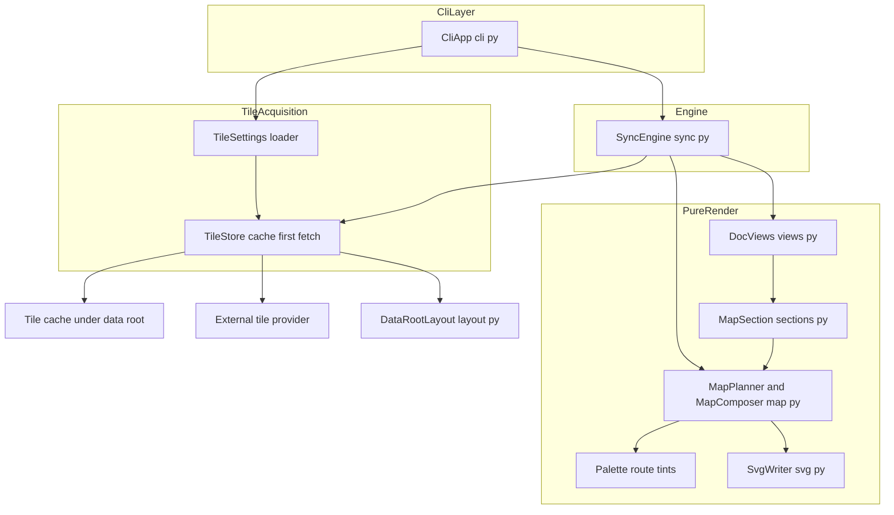
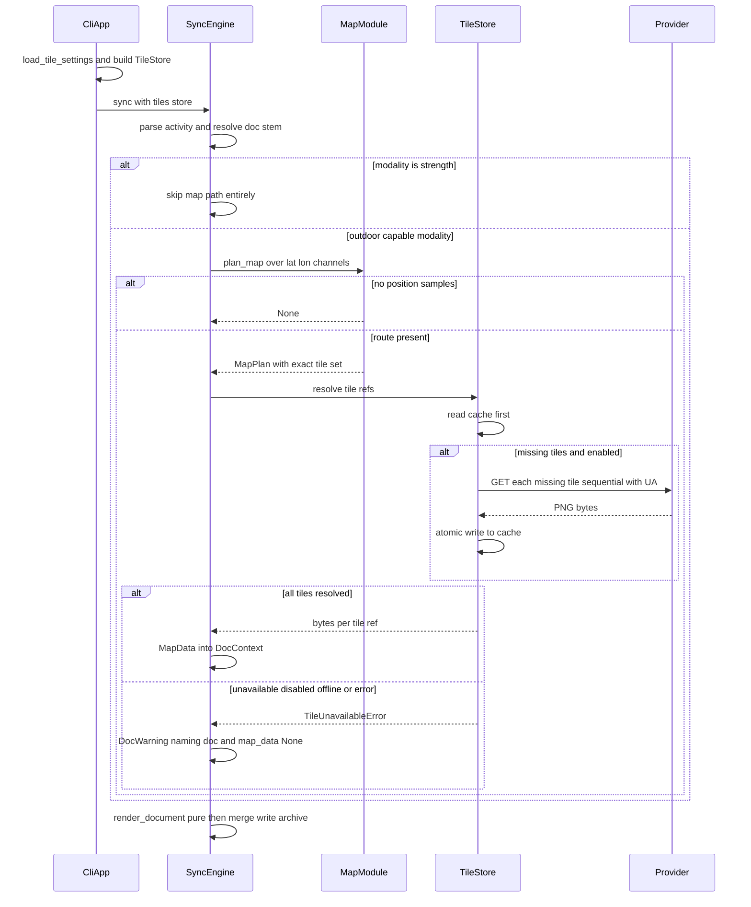

# Technical Design: route-maps

## Overview

**Purpose**: route-maps gives every outdoor workout document a spatial record of the activity: a Map section showing the route drawn over real basemap tiles in the fitdocs.ai visual style (glow polyline, start/finish markers, sport tint), produced as a static SVG asset alongside the existing charts.

**Users**: Athletes whose runs and rides happen outdoors read the map as part of the permanent workout record; PKM users view it in any markdown renderer (Obsidian, GitHub, plain viewers) with no plugins and no network access at view time.

**Impact**: Extends workout-docs without disturbing its architecture. The pure-render contract is preserved: all impurity (tile fetch, cache I/O) lives in one new module orchestrated by the sync engine, which injects prepared map inputs into `DocContext`. Two workout-docs guarantees are narrowed as stated in Requirement 4: "byte-identical rendering" becomes "byte-identical given a warm tile cache" (4.1), and "fully offline" becomes "offline except basemap tile fetch on cache miss" (4.2). A new warnings channel in `SyncReport` carries non-fatal map omissions (4.3, 4.4).

### Goals

- A Map section between Summary and Telemetry in run/ride and generic documents whose samples carry at least one position; clean omission everywhere else.
- fitdocs.ai route treatment: glow polyline, distinct start/finish markers, sport tints, legible attribution, whole-route framing with padding.
- Polite, cache-first tile acquisition under the data root: fetch each tile at most once, identify the tool, never prefetch; warm-cache renders are byte-identical and fully offline.
- Provider configuration and a persistent privacy opt-out with documented location implications; a tile failure warns and omits, never fails a document or a run.

### Non-Goals

- GPX/TCX ingestion (measured: the GPX sidecar re-encodes the identical FIT track).
- Interactive or pannable maps; route-name overlays; privacy zones / home-location masking; aggregate multi-activity maps.
- Any change to the strength document view, the fit-ingest activity model, or existing chart rendering.
- Cache eviction/pruning (cache-forever is provider-policy-compliant; documented, not built).
- Deleting orphaned map assets when a map disappears on re-render (consistent with existing chart-asset behavior; no asset-deletion pass exists).

## Boundary Commitments

### This Spec Owns

- The Map section: its placement, omission rules, image link, and the `assets/<stem>-map.svg` asset.
- All slippy-map geometry: Web-Mercator projection, zoom/extent/padding selection, tile-set planning, and SVG map composition (`render/charts/map.py`).
- Tile acquisition: fetch, politeness (user agent, sequential requests), the tile cache under `<data-root>/.cache/tiles/`, and the `TileSource` seam (`fitdocs/tiles.py`).
- The tool-settings file `<data-root>/fitdocs.toml` and its `[tiles]` table (provider URL template, attribution, cache name, `enabled` opt-out).
- The `SyncReport.warnings` channel (doc-scoped warn-and-continue reporting) and its CLI presentation.
- The `MapData` render contract and the `map_data` field on `DocContext`.
- Route tint / marker color constants in the palette and the 2-channel gap segmenter in `series.py`.
- User documentation of the tile-request location-privacy implication and the opt-out.

### Out of Boundary

- Position ingestion: `Samples.latitude_deg` / `longitude_deg` are consumed as-is (fit-ingest owns them).
- Document layouts, region merging, asset write pipeline, archive semantics (workout-docs owns them; this spec only inserts a section and extends `SyncReport`).
- Training-load behavior (`fitdocs load` never touches tiles).
- The strength view (never renders a Map section; sync never plans tiles for strength activities).
- Editing the historical workout-docs spec documents; the two guarantee amendments are recorded in this spec's Requirement 4 and in the updated `cli.py` / `sync.py` docstrings.
- Provider API keys or key management (a keyed provider works via the URL template, but no key surface is built).

### Allowed Dependencies

- `sync.py` → `fitdocs.tiles` (TileSource resolution) and `fitdocs.render` (plan_map, MapData, existing contracts). CLI → `fitdocs.tiles` (settings load, store construction).
- `fitdocs.tiles` → `fitdocs.layout` (cache paths) and `fitdocs.render.charts.map` **for the `TileRef` value type only** — never composition functions.
- `render/charts/map.py` → `render/charts/{svg,palette,series}` and stdlib (`math`, `base64`) only. The render layer never imports `fitdocs.tiles` (purity).
- Network access (`urllib.request`) is permitted **only** inside `fitdocs.tiles` — the sole network-touching module in the package (4.2).

### Revalidation Triggers

- Changing the section order contract (Map's position among sections) → re-check workout-docs goldens and any downstream doc consumer.
- Changing `DocContext` or `SyncReport` shape → re-check training-load's engine and CLI reporting (it shares the report path).
- Changing the cache layout or `fitdocs.toml` schema → user migration note required; cached tiles or settings would silently detach.
- Changing the default provider or its politeness posture → re-verify the provider's published usage policy before release.

## Architecture

### Existing Architecture Analysis

- `render_document(ctx)` is a **pure function of `DocContext`** — "no I/O, no clock, no randomness" (`render/__init__.py`); the sync engine is the only writer (`sync.py:_write_outputs`, commit order assets → doc → archive). Tile fetch therefore cannot live in the render layer, and map inputs must arrive via `DocContext`.
- Sections are imperative functions returning `(link, Asset)` pairs collected by the views (`views.py`); assets are named by `layout.asset_rel_path(stem, chart)` → `assets/<stem>-<chart>.svg` and embedded as plain markdown image links.
- The SVG writer (`charts/svg.py`) is deterministic by construction (`fmt_num`, ordered attributes, XML escaping) and generic enough to emit `<image>`; its escaper passes base64 (`+ / =`) unharmed.
- `SyncReport` has only written/skipped/failures, and any failure drives exit code 1; Requirement 4.3/4.4 needs a new warn-and-continue channel that leaves the exit code untouched.
- No settings store exists (`config.py` is only the data-root resolver); no network code, user-agent, or cache convention exists anywhere in the package.

### Architecture Pattern & Boundary Map

Hybrid of pure planning/composition and impure acquisition (research Option C): one shared pure module computes both the tile set sync must resolve and the SVG composition, so the two can never disagree.



**Architecture Integration**:

- Selected pattern: impure acquisition + pure composition, sync-orchestrated. Sync calls `plan_map` (pure) to learn the exact tile set, resolves it through `TileStore` (impure), and injects a complete `MapData` — or `None` — into `DocContext`; rendering stays a pure function.
- Dependency direction (violations are errors): `cli → sync → {tiles, render}`; `tiles → {layout, render.charts.map(TileRef only)}`; `render.charts.map → render.charts.{svg, palette, series}`. The render layer never imports `tiles`; `tiles` never performs composition.
- Existing patterns preserved: pure render, single-writer sync, asset naming/link conventions, deterministic SVG writer, frozen-dataclass contracts, loud config failure (exit 2), rich-table CLI reporting.
- New components rationale: `tiles.py` isolates the package's only network/cache I/O behind an injectable seam; `charts/map.py` keeps planning and composition in one module; the warnings channel is the smallest addition that satisfies "warn, never fail" (4.3, 4.4).
- Steering compliance: stdlib-only (zero new dependencies), data-root contract (cache under the data root, never the repo), absent data is `None` (no positions → no plan → no section), `mypy --strict` typing on all new interfaces.

### Technology Stack

| Layer | Choice / Version | Role in Feature | Notes |
|-------|------------------|-----------------|-------|
| HTTP fetch | stdlib `urllib.request` (Py ≥3.11) | Tile GET with mandatory descriptive UA, 10 s timeout | Only inside `fitdocs.tiles`; OSM blocks default UAs — override is load-bearing |
| Settings | stdlib `tomllib` (read-only) | Parse `<data-root>/fitdocs.toml` `[tiles]` | File is user-edited; fitdocs never writes it |
| Geometry | stdlib `math` | Web-Mercator projection, zoom selection | Standard slippy-map formulas, pure |
| Encoding | stdlib `base64` | PNG tiles → `data:image/png;base64,…` URIs | Deterministic for identical bytes |
| Rendering | existing `charts/svg.py` writer | Map SVG document | Gains an `<image>`-bearing caller; writer itself unchanged except docstring |
| Default provider | OSM standard tile layer | Keyless default (5.2) | Policy explicitly permits identified, cached, viewport-only app use; attribution "© OpenStreetMap contributors" |

No new runtime dependencies.

## File Structure Plan

### New Files

```
src/fitdocs/
└── tiles.py                       # Impure tile acquisition: TileSettings +
                                   #   load_tile_settings (fitdocs.toml [tiles]),
                                   #   TileSource protocol, TileStore (cache-first
                                   #   resolve, polite urllib fetch, opt-out gate),
                                   #   TileSettingsError, TileUnavailableError.
                                   #   The ONLY network-touching module.
src/fitdocs/render/charts/
└── map.py                        # Pure map geometry + composition: TileRef,
                                   #   MapPlan, plan_map (projection, zoom/extent/
                                   #   padding, tile enumeration, gap-split route),
                                   #   compose_map (tiles as data URIs, glow
                                   #   polyline, markers, attribution → SVG str).

tests/
├── test_tiles.py                  # TileStore vs fake fetch: cache-first, UA,
│                                  #   no-refetch, opt-out gate, atomic writes,
│                                  #   settings parsing/validation/defaults.
├── render/charts/test_map.py      # plan_map math + compose_map goldens.
└── render/charts/golden/          # Map SVG goldens + synthetic fixture tiles
                                   #   (tiny generated PNGs — license-clean,
                                   #   no provider tiles committed).
```

### Modified Files

- `src/fitdocs/render/__init__.py` — add frozen `MapData` contract; add `map_data: MapData | None = None` field to `DocContext` (defaulted last, existing constructors unaffected); re-export `TileRef`, `MapPlan`, `MapData`, `plan_map` so sync's import surface stays `fitdocs.render`.
- `src/fitdocs/render/views.py` — insert the Map section between Summary and Telemetry in `render_run_ride` and `render_generic`; map asset first in the assets tuple (section order = asset order). Strength view untouched.
- `src/fitdocs/render/sections.py` — new `map_section(ctx) -> tuple[str, Asset] | None`: tint by modality, `compose_map` call, `` link.
- `src/fitdocs/render/charts/palette.py` — route tint group: `ROUTE_BIKE_TINT` `#1f4d8a`, `ROUTE_RUN_TINT` `#b22d4a` (verbatim reference hex, documented as reference-sourced), `ROUTE_NEUTRAL_TINT` (low-chroma slate, oklch provenance), `ROUTE_START_COLOR` / `ROUTE_FINISH_COLOR` (oklch provenance), with a provenance mapping for the palette test.
- `src/fitdocs/render/charts/series.py` — `paired_gap_segments(a, b)`: 2-channel sibling of `gap_segments`; a point exists only where both channels are present.
- `src/fitdocs/render/charts/svg.py` — docstring only: add `image` to the documented portable element subset (SVG2 `href`, no xlink).
- `src/fitdocs/layout.py` — `TILE_CACHE_DIR = ".cache/tiles"` constant + `tile_cache_path(data_root, provider, z, x, y)` helper (plain ints; layout stays a leaf).
- `src/fitdocs/sync.py` — `DocWarning` dataclass; `SyncReport.warnings` tuple; `tiles: TileSource` keyword parameter on `sync()` and `regen()`; map orchestration in `_process_file` (gated on non-strength modality, after stem resolution so warnings name the document); docstring amendment for the narrowed offline guarantee.
- `src/fitdocs/cli.py` — build the `TileStore` from loaded settings (malformed settings → exit 2); pass it to `sync`/`regen`; warnings row + detail in `_report`; network-posture docstring amendment (4.2).
- `README.md` — Route maps section: what is sent to the tile provider (approximate activity location at tile granularity), provider configuration, the `tiles.enabled = false` opt-out, cache location and that it is never pruned (5.5).
- `tests/test_determinism.py` — extend the offline guard: render + compose performs no network; document the `fitdocs.tiles` carve-out.
- `tests/render/test_golden_docs.py` + goldens — run/ride and generic docs with/without positions (Map section present/omitted).
- `tests/test_sync.py` / `tests/test_cli.py` (existing suites) — fake `TileSource` injection; warm-cache byte-identity; warning path; exit-code neutrality.

## System Flows

Per-file map path inside the existing sync pipeline (hash → dedup → parse → identity → render → merge → write → archive):



Flow decisions: the map path runs **after** stem/match resolution so a warning names the affected document (4.3); it runs **before** `render_document` so rendering stays pure. The strength gate in sync and the view dispatch key on the same condition (`Modality.STRENGTH`), keeping "sync fetched tiles" ≡ "a view will render them" (3.5). A `TileUnavailableError` never propagates as a failure — it becomes a warning and the document renders without a Map section (4.3, 4.4).

## Requirements Traceability

| Requirement | Summary | Components | Interfaces | Flows |
|-------------|---------|------------|------------|-------|
| 1.1 | Map section when positions exist | SyncMapOrchestration, MapPlanner, MapSection, DocViews | `plan_map`, `map_section`, `DocContext.map_data` | sync map path |
| 1.2 | Placement after Summary, before Telemetry | DocViews | `render_run_ride`, `render_generic` block order | — |
| 1.3 | Clean omission without positions | MapPlanner (returns `None`), DocViews conditional | `plan_map → None` | sync map path |
| 1.4 | Asset placement/link conventions | MapSection, DataRootLayout, SyncEngine write path | `asset_rel_path(stem, "map")`, `Asset` | — |
| 2.1 | Glow polyline | MapComposer | `compose_map` style constants | — |
| 2.2 | Distinct start/finish markers | MapComposer, RoutePalette | marker constants | — |
| 2.3 | Sport tints | MapSection, RoutePalette | tint-by-modality selection | — |
| 2.4 | Break polyline at position gaps | PairedGapSegments, MapPlanner | `paired_gap_segments` | — |
| 2.5 | Whole-route framing, padding, detail level | MapPlanner | zoom/extent selection in `plan_map` | — |
| 2.6 | Degenerate extent still renders | MapPlanner | fixed-zoom centered fallback | — |
| 2.7 | Legible attribution on image | MapComposer, TileSettings | `compose_map(attribution=…)` | — |
| 3.1 | Fetch missing tile and cache it | TileStore | `TileStore.resolve` write-through | tile resolution |
| 3.2 | Fully cached ⇒ no network | TileStore | cache-first read order | tile resolution |
| 3.3 | Cache under the data root | DataRootLayout, TileStore | `tile_cache_path` | — |
| 3.4 | Descriptive UA, bounded politeness | TileStore | UA constant, sequential fetch | tile resolution |
| 3.5 | No prefetching | SyncMapOrchestration | plan-driven resolve only; strength gate | sync map path |
| 4.1 | Byte-identical given warm cache | MapComposer, SvgWriter, MapData ordering | deterministic composition invariants | — |
| 4.2 | Network only for tiles | TileStore (sole network module), CliTileWiring | allowed-dependency rule + guard test | — |
| 4.3 | Miss ⇒ omit with warning naming doc | SyncMapOrchestration, WarningsChannel, CLI report | `DocWarning`, `SyncReport.warnings` | sync map path |
| 4.4 | Map failure never fails doc/run | WarningsChannel, CliTileWiring | `_finish` unaffected by warnings | — |
| 5.1 | Provider configurable without code | TileSettings loader | `fitdocs.toml` `[tiles]` schema | — |
| 5.2 | Default provider: OSM, permitted terms | TileSettings defaults | `DEFAULT_TILE_SETTINGS` | — |
| 5.3 | Persistent opt-out | TileSettings | `enabled = false` key | — |
| 5.4 | Disabled ⇒ cached-only + standard omission | TileStore fetch gate, WarningsChannel | opt-out branch in `resolve` | tile resolution |
| 5.5 | Privacy disclosure in user docs | UserDocs | README section | — |
| 6.1 | Self-contained image file | MapComposer | base64 data-URI embedding | — |
| 6.2 | Standard image link, plugin-free | MapSection, DocViews | markdown image link | — |

## Components and Interfaces

| Component | Domain/Layer | Intent | Req Coverage | Key Dependencies | Contracts |
|-----------|--------------|--------|--------------|------------------|-----------|
| MapPlanner + MapComposer | render/charts (pure) | Geometry, tile planning, SVG composition | 1.3, 2.1, 2.2, 2.4–2.7, 4.1, 6.1 | svg.py (P0), palette (P1), series (P1) | Service |
| TileSettings + loader | tiles (config) | `[tiles]` schema, defaults, validation | 5.1, 5.2, 5.3 | tomllib (P0) | Service, State |
| TileStore | tiles (impure) | Cache-first resolve, polite fetch, opt-out gate | 3.1–3.4, 4.2, 5.4 | layout (P0), urllib (P0), TileRef (P0) | Service |
| MapData / DocContext extension | render contracts | Carry prepared map inputs into pure render | 1.1, 4.1 | charts/map types (P0) | State |
| MapSection + DocViews insertion | render/views | Section emission, tint selection, omission | 1.1–1.4, 2.3, 6.2 | MapComposer (P0), palette (P0), layout (P1) | Service |
| RoutePalette | render/charts | Route tints + marker colors with provenance | 2.2, 2.3 | — | State |
| PairedGapSegments | render/charts | 2-channel gap-aware segmentation | 2.4 | — | Service |
| SyncMapOrchestration + WarningsChannel | sync engine | Plan → resolve → inject; warn-and-continue | 1.1, 3.5, 4.3, 4.4 | tiles (P0), render (P0) | Service, State |
| CliTileWiring + WarningsReport | cli | Store construction, settings errors, report | 4.2, 4.4, 5.1 | tiles (P0), sync (P0) | Service |
| UserDocs | docs | Privacy disclosure + configuration guide | 5.5 | — | — |

### Map Geometry & Composition (pure)

#### MapPlanner + MapComposer (`src/fitdocs/render/charts/map.py`)

| Field | Detail |
|-------|--------|
| Intent | The single pure home of slippy-map math and map SVG composition — sync and rendering consume the same plan, so they can never disagree on the tile set |
| Requirements | 1.3, 2.1, 2.2, 2.4, 2.5, 2.6, 2.7, 4.1, 6.1 |

**Responsibilities & Constraints**

- Web-Mercator projection (EPSG:3857 slippy scheme, 256 px tiles), integer zoom selection, viewport framing, tile enumeration, gap-split route projection, and deterministic SVG authoring.
- Pure: stdlib (`math`, `base64`) + `charts/{svg,palette,series}` only; no I/O, no clock, no randomness. Never imports `fitdocs.tiles`.
- Determinism (4.1): tiles iterated in `MapPlan.tiles` order (row-major y, then x); coordinates through `fmt_num`; attributes in fixed mapping order; base64 of identical bytes is identical.

**Dependencies**

- Outbound: `charts/svg.py` — element emission (P0); `charts/palette.py` — tints/markers (P1); `charts/series.py` — `paired_gap_segments` (P1).

**Contracts**: Service [x]

##### Service Interface

```python
@dataclass(frozen=True)
class TileRef:
    """One slippy-map tile coordinate."""
    z: int
    x: int
    y: int

@dataclass(frozen=True)
class MapPlan:
    """Everything composition needs, and the exact tile set sync must resolve."""
    zoom: int                     # integer slippy zoom, clamped to [1, 17]
    width: int                    # viewport px (800 — matches hero chart width)
    height: int                   # viewport px (500)
    origin_x: float               # global Web-Mercator pixel coords of the
    origin_y: float               #   viewport top-left at `zoom` (sub-pixel)
    tiles: tuple[TileRef, ...]    # covering set, row-major (y outer, x inner)
    segments: tuple[tuple[tuple[float, float], ...], ...]
                                  # gap-split route in viewport px

def plan_map(
    latitudes: Sequence[float | None],
    longitudes: Sequence[float | None],
) -> MapPlan | None: ...

def compose_map(
    plan: MapPlan,
    tiles: Mapping[TileRef, bytes],
    *,
    tint: str,
    attribution: str,
) -> str: ...
```

- Preconditions: `latitudes`/`longitudes` are same-length channels in decimal degrees with `None` gaps (the fit-ingest shape). `compose_map` requires `tiles` to cover every `plan.tiles` entry (sync guarantees it; a missing key is a programming error and may raise `KeyError`).
- Postconditions: `plan_map` returns `None` iff no index has *both* latitude and longitude present (1.3). Otherwise the plan frames the whole route with ≥ 32 px padding on all sides (2.5) at the largest zoom that fits, clamped to [1, 17]; a negligible extent (single point / sub-pixel bbox) yields a fixed zoom 16 centered on the position (2.6). `compose_map` returns a complete, self-contained SVG document string (6.1).
- Invariants: the fixed 800×500 viewport geometrically bounds the covering set to ≤ 15 tiles at any zoom — the size budget needs no separate tile-count knob (measured ~30–37 KB/tile ⇒ ~0.5–0.75 MB per map SVG, well under GitHub's ~5 MB image-proxy cap). Identical inputs ⇒ byte-identical SVG (4.1).

**Composition spec** (reference visual style, 2.1, 2.2, 2.7):

- Tiles: one `<image>` per tile, `href="data:image/png;base64,…"` (SVG2 `href`, no xlink — the root carries only `xmlns`), placed at `(x·256 − origin_x, y·256 − origin_y)`, drawn first (bottom layer). The root svg's default overflow clipping crops tiles at the viewport edge.
- Route: per gap-split segment, a glow underlay `<polyline>` (stroke = tint, `stroke-width` 10, `stroke-opacity` 0.2) beneath a foreground `<polyline>` (stroke = tint, `stroke-width` 4, `stroke-opacity` 0.95); `fill` none, round caps and joins. A single-point segment renders as a zero-length round-cap stroke (a dot).
- Markers: first recorded position (first point of first segment) and last recorded position (last point of last segment): circles r 5 with 1.5 px white stroke, start filled `ROUTE_START_COLOR`, finish filled `ROUTE_FINISH_COLOR` (2.2).
- Attribution: bottom-right, 10 px sans text over a white `fill-opacity` 0.8 backing rect with 4 px padding (2.7). Text passes through the writer's XML escaping.

**Implementation Notes**

- Integration: `plan_map` is re-exported from `fitdocs.render`; sync never imports `charts.map` directly.
- Validation: golden SVGs from synthetic fixture tiles; projection unit tests against published slippy-map reference values; antimeridian-crossing routes produce a valid (zoomed-out) map — documented limitation, no special handling; tile y-range is clamped to the valid range at each zoom.
- Risks: GitHub's rendering of data-URIs inside repo-hosted SVGs is community-confirmed but not authoritatively documented — validation hook: during implementation, push a sample map SVG to a scratch GitHub repo and confirm it renders via the image proxy. A negative result is a documented GitHub-only limitation (Obsidian/local unaffected), not an architecture change.

### Tile Acquisition (impure)

#### TileSettings + `load_tile_settings` (`src/fitdocs/tiles.py`)

| Field | Detail |
|-------|--------|
| Intent | Typed provider configuration from `<data-root>/fitdocs.toml`, with safe defaults and loud validation |
| Requirements | 5.1, 5.2, 5.3 |

**Responsibilities & Constraints**

- Parse the `[tiles]` table of `<data-root>/fitdocs.toml` (stdlib `tomllib`, read-only — fitdocs never writes this file). Absent file or table ⇒ `DEFAULT_TILE_SETTINGS`; each key defaults independently; unknown keys are ignored.
- Validation (loud, exit 2 via CLI): `url` must contain `{z}`, `{x}`, `{y}` placeholders; `name` must match `[a-z0-9][a-z0-9-]*` (path-safe — rejects cache-path traversal via config); `enabled` must be a boolean; wrong types raise `TileSettingsError`.

**Contracts**: Service [x] / State [x]

##### Service Interface

```python
@dataclass(frozen=True)
class TileSettings:
    enabled: bool        # False = persistent opt-out: no tile requests (5.3)
    name: str            # cache-directory slug, e.g. "osm"
    url_template: str    # https URL with {z}/{x}/{y} placeholders
    attribution: str     # rendered on every map image

DEFAULT_TILE_SETTINGS: Final[TileSettings]  # OSM standard layer (5.2):
    # name "osm", https://tile.openstreetmap.org/{z}/{x}/{y}.png,
    # attribution "© OpenStreetMap contributors", enabled True

class TileSettingsError(Exception): ...     # malformed [tiles] → CLI exit 2

def load_tile_settings(data_root: Path) -> TileSettings: ...
```

**Implementation Notes**

- Integration: default provider is the OSM standard layer — the only keyless provider whose published policy explicitly permits identified, cached, viewport-only, low-volume app use (research §3.1); the reference visual style is carried by the route treatment per revised AC 5.2. OpenTopoMap is the documented alternative (same schema, different `url`/`attribution`/`name`).
- Validation: unit tests for defaults, per-key overrides, each validation failure, unknown-key tolerance.
- Risks: none material — the file is small, user-owned, and read-only to fitdocs.

#### TileStore (`src/fitdocs/tiles.py`)

| Field | Detail |
|-------|--------|
| Intent | Cache-first tile resolution with polite fetch — the package's only network-touching code |
| Requirements | 3.1, 3.2, 3.3, 3.4, 4.2, 5.4 |

**Responsibilities & Constraints**

- `resolve(refs)`: for each ref, read `<data-root>/.cache/tiles/<name>/<z>/<x>/<y>.png` first (3.2, 3.3); on miss with `enabled`, fetch sequentially with the mandatory descriptive UA and write through to the cache atomically (temp + `os.replace`, the `profile.py` pattern) before returning (3.1). On miss with `enabled = False`, or on any fetch failure (offline, HTTP error, timeout), raise `TileUnavailableError` with a human-readable reason (5.4, → 4.3 warning path).
- Politeness (3.4): UA `fitdocs/{version} (+https://github.com/joshua-stauffer/fitdocs)` — OSM actively blocks default library UAs; sequential fetching (≤ 15 tiles/map makes one connection trivially compliant with the ≤ 2 norm); 10 s timeout; one attempt per tile per run, no retries; already-cached tiles are never re-requested. No prefetch API exists — the only entry point takes an explicit ref list (supports 3.5).
- Cached bytes are embedded verbatim (no image validation): a corrupt provider tile is the provider's pixel content, not fitdocs' failure; atomic writes prevent torn cache files.

**Dependencies**

- Outbound: `fitdocs.layout.tile_cache_path` (P0); `urllib.request` (P0, module-internal only). External: configured tile provider over HTTPS (P0 on cold cache, unused on warm).

**Contracts**: Service [x]

##### Service Interface

```python
class TileSource(Protocol):
    """The seam sync depends on; tests inject fakes, the CLI injects TileStore."""
    @property
    def attribution(self) -> str: ...
    def resolve(self, refs: Sequence[TileRef]) -> dict[TileRef, bytes]: ...

class TileUnavailableError(Exception): ...  # reason names the cause
                                            # (disabled / offline / HTTP status)

class TileStore:  # implements TileSource
    def __init__(
        self,
        data_root: Path,
        settings: TileSettings,
        fetch: Callable[[str], bytes] | None = None,  # test seam; default urllib
    ) -> None: ...
```

- Preconditions: `data_root` resolved; refs come from a `MapPlan` (never invented).
- Postconditions: returns a complete `dict` covering every requested ref, or raises `TileUnavailableError`; every fetched tile is durably cached before the call returns; a fully-cached resolve performs zero network calls (3.2).
- Invariants: no code path outside this class touches the network (4.2); the cache is append-only (never rewritten, never pruned).

**Implementation Notes**

- Integration: constructed by the CLI once per command and passed to `sync`/`regen`; the `load` command never constructs one.
- Validation: fake-fetch unit tests (cache-first order, UA header on the real opener, no-refetch, opt-out gate, partial-failure leaves fetched tiles cached); offline-guard test carve-out names this module.
- Risks: provider outages degrade to warnings by design; a future provider policy change is a Revalidation Trigger.

### Render Contracts & Views

#### MapData + DocContext extension (`src/fitdocs/render/__init__.py`)

| Field | Detail |
|-------|--------|
| Intent | Carry prepared, immutable map inputs across the purity boundary |
| Requirements | 1.1, 4.1 |

**Contracts**: State [x]

```python
@dataclass(frozen=True)
class MapData:
    """Prepared map inputs: the plan plus its resolved tiles, ready to compose."""
    plan: MapPlan
    tiles: tuple[tuple[TileRef, bytes], ...]  # aligned with plan.tiles order
    attribution: str

@dataclass(frozen=True)
class DocContext:
    ...                                  # existing fields unchanged
    map_data: MapData | None = None      # None: no positions, tiles unavailable,
                                         #   or strength modality
```

- Invariants: `tiles` is ordered exactly as `plan.tiles` (determinism, 4.1); `bytes` values are immutable. The default keeps every existing `DocContext(...)` call site and test valid.

#### MapSection + DocViews insertion (`sections.py`, `views.py`)

Summary-only: presentation code following the existing `hero_chart` pattern.

- `map_section(ctx: DocContext) -> tuple[str, Asset] | None` (`sections.py`): `None` when `ctx.map_data is None`; otherwise selects the tint (BIKE → `ROUTE_BIKE_TINT`, RUN → `ROUTE_RUN_TINT`, all else → `ROUTE_NEUTRAL_TINT`, 2.3), calls `compose_map`, and returns the markdown link `` (via `asset_rel_path(stem, "map")`, 1.4, 6.2) plus the `Asset`.
- `views.py`: in `render_run_ride` and `render_generic`, immediately after the Summary block: append `_section("Map", link)` and prepend the map asset to the assets tuple (1.1, 1.2). Absent map data → no block, no asset (1.3). `render_strength` untouched.

#### RoutePalette (`palette.py`) — summary-only

Route tint group, separate from the oklch-derived series/zone constants: `ROUTE_BIKE_TINT = "#1f4d8a"` and `ROUTE_RUN_TINT = "#b22d4a"` are **verbatim reference hex** (provenance: `docs/reference/fitdocs-ai-reference.md` §map — documented as reference-sourced, exempt from oklch reconversion); `ROUTE_NEUTRAL_TINT` (low-chroma slate, e.g. `oklch(0.5 0.03 250)`), `ROUTE_START_COLOR` (green, `oklch(0.55 0.15 150)`), and `ROUTE_FINISH_COLOR` (red, `oklch(0.55 0.19 25)`) ship as standard-pipeline conversions with oklch provenance enforced by the existing palette test. A `ROUTE_COLORS` provenance mapping mirrors `SERIES_COLORS`.

#### PairedGapSegments (`series.py`) — summary-only

```python
def paired_gap_segments(
    a: Sequence[float | None],
    b: Sequence[float | None],
) -> tuple[tuple[tuple[float, float], ...], ...]: ...
```

The 2-channel sibling of `gap_segments`: a point `(a[i], b[i])` exists only where **both** are present; a `None` in either channel breaks the segment (2.4). Stated generally over any paired nullable channels; `plan_map` applies it to (lat, lon) before projection, so gaps are never interpolated across.

### Orchestration & Reporting

#### SyncMapOrchestration + WarningsChannel (`src/fitdocs/sync.py`)

| Field | Detail |
|-------|--------|
| Intent | Resolve map inputs impurely, inject them into the pure render, and report non-fatal omissions without failing anything |
| Requirements | 1.1, 3.5, 4.3, 4.4 |

**Responsibilities & Constraints**

- In `_process_file`, after stem/match resolution and before `DocContext` construction, and only when `activity.modality is not Modality.STRENGTH` (the exact set of views that render a Map section — keeps "tiles fetched" ≡ "map rendered", 3.5): call `plan_map`; on a plan, `tiles.resolve(plan.tiles)` → `MapData`; on `TileUnavailableError` → append a `DocWarning` naming the target document and carry `map_data = None` (4.3).
- Warnings are a separate channel: they never enter `failures`, never affect the written/skipped classification, and never change the exit code (4.4). Warm-cache regen output remains byte-identical (4.1) — the map path adds no clock, randomness, or ordering instability.

**Dependencies**

- Outbound: `fitdocs.tiles` (`TileSource`, `TileUnavailableError`) (P0); `fitdocs.render` (`plan_map`, `MapData`) (P0).
- Inbound: CLI (P0).

**Contracts**: Service [x] / State [x]

##### Service Interface

```python
@dataclass(frozen=True)
class DocWarning:
    """A non-fatal, document-scoped condition (map omitted); never a failure."""
    doc: str      # data-root-relative document ref (names the affected doc, 4.3)
    detail: str   # human-readable reason, e.g. the TileUnavailableError message

@dataclass(frozen=True)
class SyncReport:
    written: tuple[str, ...]
    skipped: tuple[str, ...]
    failures: tuple[FileFailure, ...]
    warnings: tuple[DocWarning, ...]        # new channel (4.3, 4.4)

def sync(source_dir: Path, data_root: Path, *, athlete: AthleteInputs | None,
         tz: tzinfo, tiles: TileSource, force: bool = False) -> SyncReport: ...

def regen(data_root: Path, *, athlete: AthleteInputs | None,
          tz: tzinfo, tiles: TileSource) -> SyncReport: ...
```

- Preconditions: `tiles` is always supplied (no hidden default performing network); tests inject fakes.
- Postconditions: every discovered file still lands in exactly one of written/skipped/failures; warnings are additive and doc-scoped.
- Invariants: a document/run never fails *solely* because a map could not be rendered (4.4); `regen` behaves identically (cold cache offline ⇒ warnings + docs without maps, exit 0).

**Implementation Notes**

- Integration: `_process_isolated` gains a `warnings` accumulator mirroring the existing written/skipped/failures pattern.
- Validation: sync integration tests with a fake `TileSource` (success, unavailable, disabled); a second warm-cache run writes byte-identical docs and assets.
- Risks: `sync`/`regen` signature change is package-internal (CLI and tests are the only callers).

#### CliTileWiring + WarningsReport (`src/fitdocs/cli.py`) — summary + notes

- `sync`/`regen` commands: `settings = load_tile_settings(data_root)` (a `TileSettingsError` routes through `_config_error` → exit 2, consistent with `athlete.toml` handling); construct `TileStore(data_root, settings)`; pass as `tiles=`. The `load` command is untouched.
- `_report`: add a "Warnings" count row and a detail listing (doc + reason, `soft_wrap`, markup off) — mirrors the failures listing. `_finish` is **not** given warnings: exit codes stay 0/1/2 exactly as documented (4.4).
- Docstring amendments (4.2): the CLI and sync module docstrings replace "fully offline" with the narrowed guarantee — network access occurs only in `fitdocs.tiles`, only for missing basemap tiles, only during `sync`/`regen` map rendering with `tiles.enabled`.

#### UserDocs (`README.md`) — summary-only

A "Route maps" section (5.5): what leaves the machine (tile requests reveal approximate activity location at basemap-tile granularity to the configured provider), when (only on cache miss during `sync`/`regen`), the persistent opt-out (`tiles.enabled = false` ⇒ cached-tiles-only rendering with standard omission), provider configuration (`fitdocs.toml` `[tiles]` with the OpenTopoMap alternative), attribution, and the cache location/no-pruning policy.

## Data Models

### Settings File (`<data-root>/fitdocs.toml`)

```toml
[tiles]
enabled = true                                            # false = opt-out (5.3)
name = "osm"                                              # cache slug, path-safe
url = "https://tile.openstreetmap.org/{z}/{x}/{y}.png"    # {z}/{x}/{y} required
attribution = "© OpenStreetMap contributors"
```

User-owned, read-only to fitdocs, every key optional (defaults above), unknown keys/tables ignored — future fitdocs settings tables join this file. Lives under the data root beside `athlete.toml`.

### Tile Cache (filesystem)

```
<data-root>/.cache/tiles/<name>/<z>/<x>/<y>.png
```

Keyed by provider `name` so switching providers never mixes skins. Append-only, write-once via temp + `os.replace`, never pruned, never inside a repo or the package (3.3). Not part of the re-derivable document state: deleting it only means re-fetching on the next render.

### Value Objects (all frozen dataclasses)

- `TileRef(z, x, y)` — identity of one tile; equality/hash drive cache lookups and dict keys.
- `MapPlan` — pure derivation from the position channels; contains the *exact* tile set (aggregate root of the map computation).
- `MapData` — `MapPlan` + resolved tile bytes (ordered as the plan) + attribution; the only map input rendering sees.
- `TileSettings` — validated configuration; `DEFAULT_TILE_SETTINGS` is the OSM constant.
- `DocWarning` — doc-scoped non-fatal condition in `SyncReport.warnings`.

Invariants: absent position data is `None` end-to-end (never fabricated coordinates); `MapData.tiles` order ≡ `MapPlan.tiles` order; all types are immutable so `DocContext` stays a value.

## Error Handling

### Error Strategy

Map trouble is *never* fatal (4.3, 4.4): everything downstream of "a map was possible" degrades to a `DocWarning` plus a document without a Map section. Configuration trouble is *always* loud (exit 2), consistent with the existing data-root and athlete-file posture.

### Error Categories and Responses

| Condition | Behavior | Channel | Exit code |
|-----------|----------|---------|-----------|
| No position samples (indoor/strength/pool) | No plan, no section, no asset — expected, silent | — | 0 |
| Tile cache miss, offline / provider error / timeout | `TileUnavailableError` → warning naming the doc; doc renders without Map | `SyncReport.warnings` | 0 |
| Tile requests disabled (`enabled = false`) + missing tiles | Same omission path; reason says requests are disabled | `SyncReport.warnings` | 0 |
| Disabled + all tiles cached | Map renders normally from cache (5.4) | — | 0 |
| Malformed `fitdocs.toml` `[tiles]` (bad type, bad `name`, template missing `{z}/{x}/{y}`) | `TileSettingsError` → instructive stderr message, nothing written | `_config_error` | 2 |
| Unrelated per-file failure (decode, region conflict) | Unchanged existing behavior | `SyncReport.failures` | 1 |
| Corrupt cached tile bytes | Embedded verbatim (provider content, not validated); atomic writes prevent torn files | — | 0 |

### Monitoring

CLI reporting only (no logging framework, matching the codebase): the sync/regen table gains a Warnings count; each warning lists the affected document and reason beneath it, exactly like failures.

## Testing Strategy

### Unit Tests

- `plan_map` projection math against published slippy-map reference values (known lat/lon/zoom → tile x/y and pixel coords); zoom/padding selection (route fits with ≥ 32 px padding; larger extent ⇒ lower zoom); degenerate extent ⇒ zoom 16 centered valid plan (2.5, 2.6); `None`-gap channels ⇒ `plan_map` returns `None` only when no complete pair exists (1.3).
- `paired_gap_segments`: both-present pairing, either-side `None` breaks, all-`None` ⇒ empty (2.4).
- `TileStore` with a fake fetch: cache-first order, no re-fetch of cached tiles, write-through + atomicity, opt-out gate (disabled + miss raises; disabled + cached serves), UA header set on the default opener, failure raises `TileUnavailableError` with the cause (3.1–3.4, 5.4).
- `load_tile_settings`: defaults, per-key override, each validation failure raising `TileSettingsError`, unknown keys ignored (5.1–5.3).
- Palette: route constants present with provenance entries; oklch-derived ones round-trip through the existing conversion test; reference-hex tints documented as exempt (2.3).

### Integration Tests

- Sync end-to-end with a fake `TileSource`: outdoor fixture ⇒ doc contains `## Map` between Summary and Telemetry plus `assets/<stem>-map.svg` (1.1, 1.2, 1.4); indoor/strength fixture ⇒ no section, no asset, no tile resolution attempted (1.3, 3.5).
- Warning path: failing `TileSource` ⇒ document written without Map, `SyncReport.warnings` names it, exit code 0, other sections intact (4.3, 4.4).
- Determinism: two sync/regen runs against a warm fake cache produce byte-identical documents and assets (4.1); offline guard extended — render + compose under a blocked socket succeeds, with the `fitdocs.tiles` carve-out documented (4.2).
- CLI: warnings table row + detail rendering; malformed `fitdocs.toml` exits 2 before any write (5.1).

### Golden Tests

- Map SVG goldens composed from committed **synthetic** fixture tiles (tiny generated PNGs; no provider tiles redistributed): run tint, ride tint, neutral tint, gap-split route, single-point route, attribution block (2.1–2.7, 6.1).
- Document goldens: run/ride and generic docs with and without map data (regenerable via the existing `python -m tests.render.test_golden_docs` flow).

### Validation Hooks (one-time, during implementation)

- Push a sample map SVG (data-URI tiles) to a scratch GitHub repo and confirm markdown embedding renders through the image proxy (6.1/6.2 empirical check; Obsidian needs no check — root width/height/viewBox already emitted).

## Security Considerations

- **Location privacy is the feature's main risk surface**: each tile request reveals approximate activity location (tile granularity) plus the fitdocs UA to the configured provider over HTTPS. Mitigations: cache-first (each area leaks at most once), no prefetch, a persistent opt-out honored before any request, and a README disclosure (5.3, 5.5). No coordinates, credentials, or personal data are ever sent — only standard tile-URL requests.
- Config-driven path safety: provider `name` is validated as a path-safe slug before it forms cache paths (no traversal via `fitdocs.toml`).
- SVG safety: the existing writer XML-escapes all attribute values and text (attribution included); maps embed no scripts and no external references — `data:` URIs keep view-time rendering network-free (6.1).

## Performance & Scalability

- Size budget: fixed 800×500 viewport ⇒ ≤ 15 tiles/map; measured OSM tiles 30–37 KB ⇒ ~0.5–0.75 MB per map SVG (base64 ×1.33), well under GitHub's ~5 MB image-proxy cap. No further bounding needed by construction.
- Network: worst case 15 sequential GETs per *new-area* map on first sync; zero on every warm re-render. Politeness (UA, sequential, cache-forever, no prefetch) exceeds the OSM tile policy's requirements.
- Compute: projection is O(samples), composition O(tiles + samples) string building — negligible next to FIT decode; no impact on indoor/strength throughput (map path skipped entirely).
