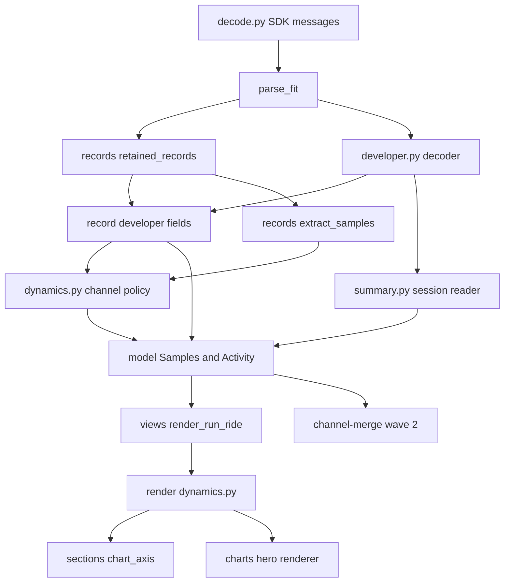
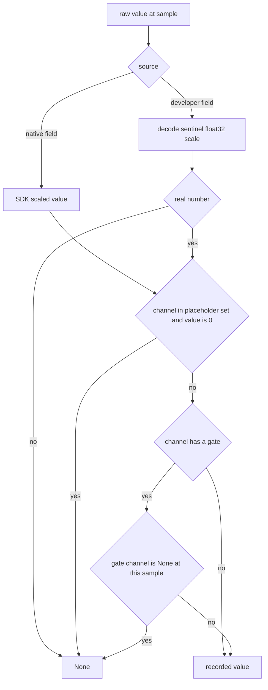

# Design Document

## Overview

**Purpose**: running-dynamics makes the running-form data a runner's devices
record readable and visible. It reads record-level developer fields generically
by their field descriptions, promotes the native running-dynamics fields and
Stryd's seven running-dynamics developer fields to per-sample channels, applies
a stated placeholder-zero policy, and adds a Running Dynamics section with one
chart to run pages.

**Users**: a runner with a Stryd footpod, or with a watch or sensor that records
running dynamics, syncing either the device's own file or a HealthFit copy.
Downstream spec authors (`channel-merge` first) consume the published channel
set.

**Impact**: `Samples` grows from ten channels to twenty-two, all index-aligned
and enumerable. `Activity` gains the record-level developer-field collection.
The session-level developer reader gains sentinel and float32 handling. Run
pages that carry dynamics gain a section and a chart asset. `DOC_VERSION`
advances by one; every page without dynamics renders byte-identically apart
from that version line.

### Goals
- Every described record-level developer field is available on the model,
  decoded (declared scale, base-type sentinel, float32 noise) and attributed
  (developer data index, application id, definition number).
- Twelve running-dynamics channels, five native and seven from Stryd's
  developer fields, sit in the same enumerable channel set as heart rate and
  power.
- No placeholder zero becomes data; a Stryd file is safe as a page's only
  file.
- Run pages summarize and chart running form; pages without it are unchanged.

### Non-Goals
- Composing a Stryd file with a HealthFit copy (`channel-merge`), or deciding
  they are the same run (`activity-identity`).
- Running-power load (RSS, GOVSS), or any new load, zone or threshold metric.
- Cycling dynamics, `fractional_cadence`, `stance_time_percent`, GPS accuracy.
- Rendering developer fields other than the dynamics channels.
- Plausibility flags for dynamics channels (`activity-qa-flags`).

## Boundary Commitments

### This Spec Owns
- The record-level developer-field reader and the shared per-value developer
  decoding rule (sentinel, non-finite, float32, declared scale), used by both
  the record-level and the session-level reader.
- The twelve running-dynamics channels on `Samples`, the published
  `DYNAMICS_CHANNELS` registry, and the `DeveloperChannel` type with
  `Activity.record_developer_fields`.
- The native-field map, the Stryd exact-name table, the placeholder-zero set
  and the gate pairs (`ingest/dynamics.py`), and the heart-rate placeholder
  rule (`ingest/records.py`).
- The Running Dynamics section, its row order, formatting and percentile rule,
  its chart and the chart's asset kind `dynamics` (`render/dynamics.py`).
- The shared chart x-axis helper extracted from `hero_chart_spec`.
- One `DOC_VERSION` advance and the re-pinning of every literal pin of it.
- The Existing Spec Update records: a `fit-ingest` amendment (record-level
  developer fields and running dynamics) and a `workout-docs` amendment
  (the Running Dynamics section and chart), and this spec's part of the
  roadmap bookkeeping for those two lines (AmendmentRecords).
- The developer-field fixture helper `developer_field_run_fit_bytes` and the
  two fixture families (StrydFixtures), with the keyword-only, defaulted
  parameters this spec adds to `tests/fixtures/builder.py`'s `_file_id` and
  `_device_info`.

### Out of Boundary
- Which file a composed page takes each channel from, lag alignment, and
  source attribution per channel (`channel-merge`).
- File identity (`file_id`), matching, base selection, page rename and old
  asset removal (`activity-identity`).
- `DeviceInfo.product_name`, `_product_name` (`ingest/summary.py:372-385`)
  and "Garmin <model>" attribution (`intervals-connector`).
- Connector protocol, ledger, credentials, pull (`connectors`).
- HealthFit's supplemental rows (`render/sections.py:112-115`, `:238-275`)
  and the open queue item `2026-07-25-supplemental-scale-single-writer`: left
  exactly as they are.
- The coverage table (`render/sections.py:117-128`): unchanged. Dynamics
  coverage appears in the section's own table.
- `CONTRACT_VERSION`, `MANAGED_KEYS`, frontmatter keys, the ownership
  contract, `fitdocs.toml` tables.
- `docs/` pages, with one stated exception: `DeveloperChannel` is appended to
  `docs/plugins.md`'s public import surface list (the ``From `fitdocs`:``
  block), because documented means public (`docs/compatibility.md` names
  that list as the authority for the public names) and `activity-identity`
  lists `FileIdentity` there the same way (cross-spec ruling R11). No other
  `docs/` line changes.
- Steering, and the roadmap, with one stated exception: the Phase 8
  `#### Existing Spec Updates` `fit-ingest` and `workout-docs` lines. At the
  merge this spec annotates each "(running-dynamics part landed)", or ticks
  it when every other part it names is already on `main` (cross-spec ruling
  R14; AmendmentRecords). No other roadmap line changes.

### Allowed Dependencies
- `model.py` imports nothing internal and never the SDK (pinned by
  `tests/test_model.py:64,80`); the new model code obeys that.
- `ingest/developer.py` and `ingest/dynamics.py` import only `fitdocs.model`,
  `fitdocs.ingest._fields` and the standard library (`math`, `struct`,
  `types`, `dataclasses`, `collections.abc`). Neither imports the SDK: the
  base-type sentinel table is FIT protocol knowledge written in fitdocs and
  cross-checked against the SDK's table in a test only.
- `ingest/summary.py` may import `ingest/developer.py`; `developer.py` never
  imports `summary.py` or `records.py`.
- `render/dynamics.py` imports `fitdocs.model`, `fitdocs.layout`,
  `fitdocs.render` (contract types), `fitdocs.render.sections`
  (`chart_axis` only) and `fitdocs.render.charts.{hero,palette}`. It never
  imports ingest, metrics, load or `fitdocs.contract`, so
  `tests/test_contract_consumers.py` needs no new registration.
- No new runtime dependency (`tests/test_determinism.py:672-712`,
  `tests/test_packaging.py:503-519` stay green unchanged).

### Revalidation Triggers
- Any change to `DYNAMICS_CHANNELS`, a channel's name or unit, or the rule
  that every `Samples` field other than `time_s` is a per-sample tuple of
  `len(time_s)`: `channel-merge` must re-check.
- Any change to the placeholder or gate rules: `channel-merge` (donated values
  are final), and any future Stryd-aware load.
- A dynamics channel starting to feed a `SessionSummary` or `DerivedMetrics`
  field: `channel-merge`'s recomputation rule must re-check.
- A new chart asset kind or a renamed one: `activity-identity`'s old-asset
  removal must re-check.
- A further `DOC_VERSION` advance by a sibling: the second lander re-pins.
- A change to `developer_field_run_fit_bytes`'s signature or to one of its
  defaults: `channel-merge`'s fixtures, which extend and call it, must
  re-check.

### Cross-spec seams

Assumptions this design makes about each sibling, in the exact shape assumed.
A cross-spec reviewer reconciles these against the siblings' own designs.

- **`channel-merge` (wave 2, depends on this spec)**
  - It enumerates channels generically: either `fitdocs.model.DYNAMICS_CHANNELS`
    (the twelve dynamics names, in display order) or
    `tuple(f.name for f in dataclasses.fields(Samples) if f.name != "time_s")`
    (all twenty-two channels). Both are valid after this spec lands, because
    `Samples.__post_init__` guarantees every channel field is a tuple of
    `len(time_s)`.
  - It constructs a composed `Samples` by keyword. A dynamics channel it does
    not pass defaults to all-`None`; one it passes must have `len(time_s)`
    entries or `Samples` raises `ValueError`.
  - Donated dynamics values are final. The placeholder-zero and gate rules run
    per source file at ingest, before composition; `channel-merge` never
    re-applies or undoes them, and a gate pair may legitimately come from two
    files (a HealthFit base's `stance_time_ms`, a Stryd extra's
    `stance_time_balance_pct` gated on the Stryd file's own stance time).
  - No `SessionSummary` or `DerivedMetrics` field is fed by a dynamics channel.
    The Running Dynamics section and chart are computed from `Samples` at
    render time, so donating a dynamics channel needs no summary
    recomputation. Heart rate is a shared channel (the base wins); its
    placeholder rule is likewise applied per file at ingest.
  - `Activity.record_developer_fields` is index-aligned with its own file's
    `Samples`. Whether a composed activity carries an extra's generic developer
    channels (re-aligned) or none is `channel-merge`'s decision; no page
    renders them.
  - Fixture helper seam, append-only: `channel-merge` builds its
    developer-field fixtures with `developer_field_run_fit_bytes`
    (StrydFixtures, task 1.2) and writes a session developer field, HealthFit's
    `SESSION UUID` included, through the helper's existing `session_fields`
    keyword (no second session-field parameter). It will append keyword-only,
    defaulted `laps`, `session_start`, `session_elapsed_s`,
    `session_distance_m` and `sport` parameters, each only if the merged
    helper lacks it, each defaulting to the helper's current behaviour and
    each with a `tests/fixtures/test_builder.py` pin that the default output
    bytes are unchanged. The helper is shaped for that: it assembles its
    default message list (records, then no lap message, then one running
    session spanning the records, then the activity message) in one place
    and hands the list to a single private Encoder routine, so each appended
    parameter changes one default of that list (the lap messages, one
    session field, or the sport) and nothing else.
  - `render/views.py` is shared (see Shared files below): `channel-merge`
    appends `## Channel Sources` to each view; this spec inserts
    `## Running Dynamics` into the run view only. A rebase keeps both.
- **`activity-identity` (wave 1, parallel)**
  - It adds file-identity fields to the model as append-only, defaulted
    fields on `Activity` (or on a type `Activity` holds), and does not touch
    `Samples`. Both specs append to `Activity`; the second lander keeps both
    and regenerates `tests/golden/{run,ride,strength,minimal}.json`.
  - Both append a name to `fitdocs.__all__`, `_LAZY_EXPORTS`, the
    `TYPE_CHECKING` block of `src/fitdocs/__init__.py`, `_EXPECTED` in
    `tests/test_public_api.py`, and `docs/plugins.md`'s public import surface
    list (``From `fitdocs`:``): `FileIdentity` there, `DeveloperChannel`
    here (cross-spec ruling R11). The second lander keeps both.
  - Both wire `parse_fit` in `src/fitdocs/ingest/__init__.py`: it passes its
    file-identity values, this spec the developer-data ids, the retained
    records and the record developer fields. Each change is an appended
    read and keyword; the second lander keeps both.
  - Its page rename removes a renamed page's old assets. This spec adds the
    asset kind `dynamics`, written at `assets/<stem>-dynamics.svg` by
    `layout.asset_rel_path(stem, "dynamics")`. Removal by the `<stem>-` prefix
    covers it; removal by an enumerated kind list must add `dynamics`.
  - It advances `DOC_VERSION` for source roles. See the version rule below.
  - It may amend `fit-ingest` (identity fields). Amendment and criterion
    numbers are taken at landing time (next free), never assumed.
  - Shared fixture seam, append-only: `tests/fixtures/builder.py`'s
    `_file_id` gains keyword-only, defaulted `manufacturer`, `product` and
    `time_created` parameters beside its positional serial (defaults are
    today's values, so no existing fixture's bytes change). Whichever of the
    two specs' fixture tasks runs first on a branch that lacks them adds
    them; the other finds them on its branch and reuses them (this spec's
    task 1.2, `activity-identity`'s task 1.1). Either spec may append
    parameters, and neither changes a default. This spec also gives
    `_device_info` a keyword-only `manufacturer` parameter defaulting to
    `"garmin"` (StrydFixtures), under the same rule.
- **`intervals-connector` (wave 2)**: owns `_product_name`
  (`ingest/summary.py:372-385`) and attribution. This spec edits
  `ingest/summary.py` only in the developer-field functions (currently
  `:129-301`) and may amend `workout-docs`; numbers are taken at landing time.
  - Its attribution line reads the recording device (`device_info` index 0).
    The Stryd fixture writes that device with manufacturer `stryd`
    (StrydFixtures, cross-spec ruling R12), so once it lands the
    `stryd_run` golden gains no `Data source` line; the
    `run_native_dynamics` golden, whose device keeps the builder's `garmin`
    default, gains its line like every other Garmin-device golden. That
    `garmin` device is a synthetic variant pending the live check's
    HealthFit recording-device item, TBC-9 (ruling R15; Supporting
    References, Native-dynamics fixture).
  - Both specs edit `render/views.py` (its `_head`, this spec's run-view
    insertion) and append to `tests/fixtures/builder.py` without changing a
    default; a rebase keeps both.
- **`connectors` (wave 1)**: no seam. This spec imports nothing from it and
  adds no command, setting or network access.
- **Contract versions**: this spec advances `DOC_VERSION` by exactly one from
  the value on `main` when it lands (`5` at `src/fitdocs/contract.py:174`
  when this design was written), re-pins every literal pin of the old value
  (`tests/metrics/test_sources.py:2270`'s `CONSTANT_REGISTRY_ASOF_DOC_VERSION`
  included; FormatVersion) and regenerates every golden document in the same
  change. Every lander advances by one, none shares a bump (cross-spec
  ruling R1): after the final rebase the implementer checks the value equals
  `main`'s plus one and re-pins if a sibling landed a bump first. It does not
  touch `CONTRACT_VERSION` or `MANAGED_KEYS`.
- **`docs-site` (Phase 9 peer)**: this spec adds no `docs/` page and does not
  edit `docs/index.md`. Its one `docs/` edit is the `DeveloperChannel` name in
  `docs/plugins.md`'s public import surface list (Out of Boundary).
- **Shared files** (append-only; whichever spec lands second keeps both
  sides on rebase):
  - `src/fitdocs/model.py` (`Activity` fields) and
    `tests/golden/{run,ride,strength,minimal}.json`: `activity-identity`.
  - `src/fitdocs/__init__.py`, `tests/test_public_api.py` and
    `docs/plugins.md`'s surface list: `activity-identity`.
  - `src/fitdocs/ingest/__init__.py` (`parse_fit` wiring):
    `activity-identity`.
  - `src/fitdocs/render/views.py`: `channel-merge` (Channel Sources on every
    view; per cross-spec ruling R2, whichever of it and `intervals-connector`
    lands second also wires `_head`'s donor devices) and
    `intervals-connector` (`_head`); `tests/render/test_views.py`:
    `intervals-connector`.
  - `tests/render/test_golden_docs.py` `FIXTURES`: `channel-merge`
    (`composed_run`).
  - `src/fitdocs/ingest/summary.py`: `intervals-connector` (`_product_name`
    only; this spec only the developer-field functions).
  - `tests/fixtures/builder.py`: `_file_id`'s keyword parameters
    (`activity-identity`), `_device_info`'s `manufacturer` parameter (this
    spec; any sibling reuses it), `developer_field_run_fit_bytes`'s appended
    parameters (`channel-merge`), appended builders (`intervals-connector`).
  - `src/fitdocs/contract.py` (`DOC_VERSION` and its docstring), its literal
    pins and every `tests/render/golden_docs/*` `doc_version` line: every
    sibling that advances `DOC_VERSION`.
  - `CHANGELOG.md` `[Unreleased]`: every sibling; entries go under the
    existing category heading (FormatVersion).
  - `.kiro/specs/fit-ingest/` and `.kiro/specs/workout-docs/` amendment
    records, and their two roadmap lines: `activity-identity` and
    `intervals-connector` also amend both, `channel-merge` `workout-docs`
    only.

## Architecture

### Existing Architecture Analysis
- `parse_fit` (`ingest/__init__.py:34-123`) is pure composition over
  extractors. Records drop only when they lack a `timestamp`
  (`ingest/records.py:84-88`); `Samples` is built at `:95-116`.
- Session developer fields are read by
  `extract_developer_fields_with_declared_scale`
  (`ingest/summary.py:146-228`), pairing a description's `key` with
  `session_mesgs[0]["developer_fields"][key]` and applying a declared scale
  via `_developer_value` / `_scale_one` (`:231-301`). It filters no sentinel
  and leaves float32 noise.
- `render_run_ride` (`render/views.py:146-180`) assembles Summary, Map,
  Telemetry, Splits, Training Load, Device & Data Quality. `hero_chart_spec`
  (`render/sections.py:337-400`) owns series selection and the x-axis
  (`:366-378`).
- Charts are hand-built SVG through `render/charts/svg.py`; the hero renderer
  draws one or two prepared series with smoothing, gap splitting and a legend.

### Architecture Pattern & Boundary Map



- **Selected pattern**: extend the existing layered pipeline
  (`model ← ingest ← render`); no new layer.
- **Dependency direction**: `model` → `ingest._fields` → `ingest.developer` →
  `ingest.dynamics` → `ingest.records` / `ingest.summary` → `ingest` (wiring);
  `model` → `render.charts` → `render.sections` → `render.dynamics` →
  `render.views`. Each imports only leftward; `render` never imports `ingest`.
- **New components rationale**: `developer.py` because one decoding rule
  serves two readers; `dynamics.py` because the channel policy (names, zero
  set, gates) is one reviewable table set; `render/dynamics.py` because the
  section is a self-contained presentation like `render/splits.py`.
- **Steering compliance**: absent is `None`; static deterministic SVG; no new
  dependency; typed stdlib dataclasses; `mypy --strict`.

### Technology Stack

| Layer | Choice / Version | Role in Feature | Notes |
|-------|------------------|-----------------|-------|
| Decode | `garmin-fit-sdk` (locked, profile 21.208.0) | Supplies `developer_fields`, `field_description_mesgs`, `developer_data_id_mesgs` | Only `ingest/decode.py` imports it, unchanged |
| Model / ingest | Python 3.11 stdlib `dataclasses`, `struct`, `math`, `types` | Channels, decoding, float32 rounding | No new dependency |
| Render | Hand-built SVG (`render/charts`) | Section table and chart | Reuses the hero renderer |

## File Structure Plan

### Directory Structure
```
src/fitdocs/
├── model.py                  # + DYNAMICS_CHANNELS, 12 Samples channels, Samples.__post_init__,
│                             #   DeveloperChannel, Activity.record_developer_fields
├── ingest/
│   ├── developer.py          # NEW: FieldDescription, sentinel/float32/scale decoding,
│   │                         #   application ids, record-level developer extractor
│   ├── dynamics.py           # NEW: native map, Stryd name table, placeholder set, gates,
│   │                         #   extract_dynamics
│   ├── records.py            # + retained_records, heart-rate placeholder, dynamics wiring
│   ├── summary.py            # session reader delegates per-value decoding to developer.py
│   └── __init__.py           # wiring: developer_data_id_mesgs, record developer fields
├── render/
│   ├── dynamics.py           # NEW: DYNAMICS_DISPLAY, CHART_PRECEDENCE, rows, chart spec,
│   │                         #   dynamics_section
│   ├── sections.py           # + ChartAxis, chart_axis (extracted from hero_chart_spec)
│   ├── views.py              # run pages insert the section after Telemetry
│   └── charts/palette.py     # + two dynamics series colors
├── contract.py               # DOC_VERSION + 1 and its docstring paragraph
└── __init__.py               # + DeveloperChannel export
tests/
├── fixtures/builder.py       # + stryd_run_fit_bytes, run_native_dynamics_fit_bytes,
│                             #   developer_field_run_fit_bytes, DevFieldSpec;
│                             #   keyword params on _file_id and _device_info
├── ingest/test_developer.py  # NEW
├── ingest/test_dynamics.py   # NEW
├── render/test_dynamics.py   # NEW
└── test_running_dynamics_e2e.py  # NEW: sync, check, regen over real data roots
```

### Modified Files
- `src/fitdocs/model.py` — the model additions above; module docstring units
  list gains mm, ms, pct, kN/m, bw.
- `src/fitdocs/ingest/records.py` — `retained_records`; `extract_samples`
  gains a keyword `developer` argument; heart rate 0 → `None`; the docstring's
  "all ten channels" (`:5`) is corrected.
- `src/fitdocs/ingest/summary.py` — `_developer_value` and `_scale_one`
  move verbatim to `developer.py` as `apply_declared_scale`; the session
  reader calls `decode_developer_value`; module docstring updated.
- `src/fitdocs/ingest/__init__.py` — wiring and docstring.
- `src/fitdocs/__init__.py` — `DeveloperChannel` in `TYPE_CHECKING`,
  `_LAZY_EXPORTS` and `__all__`.
- `src/fitdocs/render/sections.py` — `ChartAxis` and `chart_axis`;
  `hero_chart_spec` calls it (byte-identical output).
- `src/fitdocs/render/views.py` — run-only section insertion; docstring order.
- `src/fitdocs/render/charts/palette.py` — `DYNAMICS_PRIMARY_COLOR`,
  `DYNAMICS_SECONDARY_COLOR`, two `SERIES_COLORS` entries; the comment at
  `:48-50` ("all nine") is corrected to the new count.
- `src/fitdocs/contract.py` — `DOC_VERSION` and a docstring paragraph.
- `tests/ingest/test_summary.py` — `_developer_value` import repointed to
  `fitdocs.ingest.developer.apply_declared_scale`; new session-level cases.
- `tests/ingest/test_records.py` — the heart-rate placeholder and the
  recorded-zero cases (power, cadence, speed, distance, altitude,
  temperature).
- `tests/test_public_api.py` — `_EXPECTED` gains `DeveloperChannel`.
- `docs/plugins.md` — `DeveloperChannel` appended to the ``From `fitdocs`:``
  public import surface list, the one stated `docs/` exception (Out of
  Boundary); `tests/test_docs_guarantees.py`'s
  `test_every_name_in_the_plugins_doc_public_surface_list_actually_imports`
  then covers it.
- `tests/fixtures/builder.py` — `_file_id` gains keyword-only, defaulted
  `manufacturer`, `product` and `time_created` (unless `activity-identity`
  already added them on the branch; then they are reused); `_device_info`
  gains a keyword-only `manufacturer` defaulting to `"garmin"`; the new
  builders and `DevFieldSpec` (StrydFixtures). No existing fixture's bytes
  change. `tests/fixtures/test_builder.py` gains their self-tests.
- `tests/render/test_golden_docs.py` — `FIXTURES` (`:102-108`) gains
  `stryd_run` and `run_native_dynamics`.
- `tests/render/golden_docs/*` — two new goldens with their assets; every
  golden's `doc_version` line at the advance.
- `tests/golden/{run,ride,strength,minimal}.json` — regenerated for the model
  shape (new keys only).
- `tests/test_cli_check.py:196,198`, `tests/render/test_frontmatter.py:44,101`,
  `tests/metrics/test_sources.py:2270` — literal `DOC_VERSION` pins moved
  (FormatVersion).
- `CHANGELOG.md` — `[Unreleased]` entries, appended under the existing
  `### Added` / `### Changed` headings, each heading created only if absent
  (FormatVersion).
- `.kiro/specs/fit-ingest/{requirements.md,spec.json}`,
  `.kiro/specs/workout-docs/{requirements.md,spec.json}` — amendment records.
- `.kiro/steering/roadmap.md` — the Phase 8 Existing Spec Updates
  `fit-ingest` and `workout-docs` lines only, annotated or ticked at the
  merge (AmendmentRecords).

## System Flows



- The gate is evaluated after the gate channel's own placeholder rule, so a
  pause's zero stance time nulls the stance-time balance recorded beside it.
- Heart rate follows the same placeholder branch in `records.py`; no other
  existing channel changes.

## Requirements Traceability

| Requirement | Summary | Components | Interfaces | Flows |
|-------------|---------|------------|------------|-------|
| 1.1 | Record developer fields on the model, index-aligned | RecordDeveloperFields, ModelChannels | `extract_record_developer_fields`, `Activity.record_developer_fields` | Ingest |
| 1.2 | Pair by description key, not definition number | DeveloperDecoding, RecordDeveloperFields | `FieldDescription.key` | Ingest |
| 1.3 | Units, index, definition number, application id | RecordDeveloperFields | `DeveloperChannel`, `application_ids` | Ingest |
| 1.4 | Declared scale/offset; scale 0 omits | DeveloperDecoding | `apply_declared_scale` | Value flow |
| 1.5 | Sentinel or non-finite → `None` | DeveloperDecoding | `decode_developer_value` | Value flow |
| 1.6 | Whole-array sentinel; integer arrays otherwise intact | DeveloperDecoding | `decode_developer_value` | Value flow |
| 1.7 | float32 shortest decimal | DeveloperDecoding | `decode_developer_value` | Value flow |
| 1.8 | Repeated (index, definition) decodes against the first | RecordDeveloperFields | key pairing | Ingest |
| 1.9 | Duplicate name: last described wins | RecordDeveloperFields | `extract_record_developer_fields` | Ingest |
| 1.10 | Native slots ignored; never fills native | DeveloperDecoding, DynamicsPolicy | `FieldDescription` (no native slot) | Ingest |
| 1.11 | Unrecorded or all-absent field omitted; empty is not an error | RecordDeveloperFields | `extract_record_developer_fields` | Ingest |
| 1.12 | No undeclared convention | DeveloperDecoding | `decode_developer_value` | Value flow |
| 2.1 | Session values share the rules | SessionDeveloperFields | `extract_developer_fields_with_declared_scale` | Ingest |
| 2.2 | Everything else unchanged, 255 in the UUID included | SessionDeveloperFields | same | Ingest |
| 2.3 | Session identity, humidity and METs rows unchanged | SessionDeveloperFields | `layout.activity_uid`, `_supplemental_rows` | Render |
| 3.1 | Five native channels and units | DynamicsPolicy, ModelChannels | `NATIVE_DYNAMICS_FIELDS` | Ingest |
| 3.2 | Absent native value → `None` | DynamicsPolicy | `extract_dynamics` | Value flow |
| 3.3 | No dynamics → all `None` | ModelChannels, DynamicsPolicy | `Samples.__post_init__` | Ingest |
| 3.4 | Published channel set, enumerable with the others | ModelChannels | `DYNAMICS_CHANNELS`, `dataclasses.fields(Samples)` | Model |
| 4.1 | Seven Stryd names and units | DynamicsPolicy | `DEVELOPER_DYNAMICS_NAMES` | Ingest |
| 4.2 | Values from the decoded field, no conversion | DynamicsPolicy | `extract_dynamics` | Value flow |
| 4.3 | Other names never become channels or fill native | DynamicsPolicy | `DEVELOPER_DYNAMICS_NAMES` | Ingest |
| 4.4 | Any writer | DynamicsPolicy | no writer check | Ingest |
| 5.1 | Heart rate 0 → `None` | SampleExtraction | `records._heart_rate` | Value flow |
| 5.2 | Stride placeholders → `None` | DynamicsPolicy | `PLACEHOLDER_ZERO_CHANNELS` | Value flow |
| 5.3 | Balances gated on their pair | DynamicsPolicy | `GATES` | Value flow |
| 5.4 | Air power gated on form power | DynamicsPolicy | `GATES` | Value flow |
| 5.5 | Other zeros kept | SampleExtraction | unchanged extraction | Value flow |
| 5.6 | Any writer | DynamicsPolicy, SampleExtraction | no writer check | Value flow |
| 6.1 | Heart rate from the stream when the session lacks it | SampleExtraction (+ existing `metrics/aggregates.py`) | `avg_heart_rate_bpm` | E2E |
| 6.2 | One lap row per lap message | existing `render/splits.py` | `lap_splits` | E2E |
| 6.3 | Elapsed and moving from session totals | existing `ingest/summary.py`, `metrics/aggregates.py` | `SessionSummary` | E2E |
| 6.4 | Missing lap values shown absent, never zero (the lap table has heart-rate cells and no cadence column) | existing `render/splits.py` | `cell` | E2E |
| 6.5 | Environmental developer values never rendered | DynamicsSection | `DYNAMICS_DISPLAY` (closed set) | Render |
| 6.6 | Stryd-shaped file alone syncs to a run page | all | `fitdocs sync` | E2E |
| 7.1 | Section placement | RunView | `render_run_ride` | Render |
| 7.2 | Rows: average, P10–P90, coverage, fixed order | DynamicsSection | `dynamics_rows` | Render |
| 7.3 | Over recorded samples only | DynamicsSection | `dynamics_rows` | Render |
| 7.4 | Display units | DynamicsSection | `DYNAMICS_DISPLAY` | Render |
| 7.5 | No side label on balances | DynamicsSection | `DYNAMICS_DISPLAY` labels | Render |
| 7.6 | Omitted when empty | DynamicsSection, RunView | `dynamics_section` → `None` | Render |
| 7.7 | Run modality only | RunView | `render_run_ride` modality check | Render |
| 8.1 | Chart of the first two present by precedence | DynamicsSection | `CHART_PRECEDENCE`, `dynamics_chart_spec` | Render |
| 8.2 | Same x-axis as the telemetry chart | ChartAxis | `chart_axis` | Render |
| 8.3 | Gaps never bridged | existing hero renderer | `gap_segments` | Render |
| 8.4 | Static, linked, deterministic, script-free | DynamicsSection, DynamicsPalette | `render_hero_chart`, `asset_rel_path` | Render |
| 8.5 | No chartable channel → no chart | DynamicsSection | `dynamics_chart_spec` → `None` | Render |
| 9.1 | Pages without dynamics byte-identical but for the version | all render components; golden suite | goldens | Golden |
| 9.2 | `DOC_VERSION` + 1; stale in `check`, current after `regen` | FormatVersion | `contract.DOC_VERSION`, `audit` | E2E |
| 9.3 | `regen` adds the section and preserves user content | FormatVersion, RunView | `fitdocs regen` | E2E |
| 9.4 | No frontmatter key; contract version unchanged | FormatVersion | `MANAGED_KEYS`, `CONTRACT_VERSION` | Golden |
| 9.5 | Release notes | FormatVersion | `CHANGELOG.md` | Review |
| 10.1 | Deterministic model, document and images | all | goldens | Golden |
| 10.2 | No runtime dependency | all | frozen dependency tests | Existing |
| 10.3 | Synthesized fixtures with the measured shapes | StrydFixtures | `stryd_run_fit_bytes`, `run_native_dynamics_fit_bytes`, `developer_field_run_fit_bytes` | Tests |
| 10.4 | Three named mutations each red | Testing Strategy | mutation table | Tests |
| 10.5 | No Stryd web address anywhere | all | review grep | Review |

## Components and Interfaces

| Component | Domain/Layer | Intent | Req Coverage | Key Dependencies (P0/P1) | Contracts |
|-----------|--------------|--------|--------------|--------------------------|-----------|
| ModelChannels | model | Channels, registry, developer channel type | 1.1, 1.3, 3.3, 3.4, 10.1 | none | State |
| DeveloperDecoding | ingest | One per-value decoding rule | 1.2, 1.4-1.7, 1.10, 1.12, 2.1 | ModelChannels (P0) | Service |
| RecordDeveloperFields | ingest | Record-level developer collection | 1.1-1.3, 1.8, 1.9, 1.11 | DeveloperDecoding (P0) | Service |
| SessionDeveloperFields | ingest | Session reader on the shared rule | 2.1-2.3 | DeveloperDecoding (P0) | Service |
| DynamicsPolicy | ingest | Native map, Stryd names, zero set, gates | 1.10, 3.1-3.3, 4.1-4.4, 5.2-5.6 | RecordDeveloperFields (P0) | Service |
| SampleExtraction | ingest | Retention, heart-rate placeholder, wiring | 1.1, 5.1, 5.5, 6.1 | DynamicsPolicy (P0) | Service |
| ChartAxis | render | Shared x-axis rule | 8.2 | ModelChannels (P1) | Service |
| DynamicsSection | render | Section table and chart | 6.5, 7.2-7.6, 8.1, 8.3-8.5 | ChartAxis (P0), hero renderer (P0) | Service |
| RunView | render | Placement, run-only | 7.1, 7.6, 7.7 | DynamicsSection (P0) | Service |
| DynamicsPalette | render.charts | Two series colors | 8.4 | none | State |
| FormatVersion | contract, tests, changelog | Version advance and pins | 9.1-9.5 | all (P0) | State |
| StrydFixtures | tests | Measured shapes, synthesized | 6.x, 10.3 | SDK encoder (P0) | Batch |
| AmendmentRecords | spec docs, roadmap | Existing Spec Update records and their two roadmap lines | boundary | all | none |

### Model

#### ModelChannels

| Field | Detail |
|-------|--------|
| Intent | Publish the twelve dynamics channels, the registry, and record-level developer channels |
| Requirements | 1.1, 1.3, 3.3, 3.4, 10.1 |

**Responsibilities & Constraints**
- Twelve fields appended to `Samples` after `temperature_c`, in
  `DYNAMICS_CHANNELS` order, each `tuple[float | None, ...] = ()`.
- `Samples.__post_init__`: with `n = len(time_s)`, every dynamics field equal
  to `()` while `n > 0` is set to `(None,) * n` (via `object.__setattr__`); a
  dynamics field whose length is neither `0` nor `n` raises `ValueError`
  naming the field. The ten existing fields are not validated (unchanged
  contract).
- `SCHEMA_VERSION` stays `"1.0"`: every addition is defaulted and additive, the
  precedent `developer_fields` set.
- `model.py`'s source text, docstrings included, must contain neither
  `garmin_fit_sdk` nor `from fitdocs`: `tests/test_model.py:80-81` scan it.

**Contracts**: State [x]

```python
DYNAMICS_CHANNELS: Final[tuple[str, ...]] = (
    "stance_time_ms",
    "stance_time_balance_pct",
    "vertical_oscillation_mm",
    "vertical_oscillation_balance_pct",
    "vertical_ratio_pct",
    "step_length_mm",
    "leg_spring_stiffness_kn_m",
    "leg_spring_stiffness_balance_pct",
    "form_power_w",
    "air_power_w",
    "impact_bw",
    "impact_loading_rate_balance_pct",
)

@dataclass(frozen=True)
class DeveloperChannel:
    name: str                          # the description's field_name, verbatim
    units: str | None                  # the description's units, verbatim
    developer_data_index: int | None
    field_definition_number: int | None
    application_id: str | None         # 32 lowercase hex chars of the 16-byte id
    declared_scale: bool               # a scale and/or offset was declared and applied
    values: tuple[object, ...]         # len(samples.time_s); None = not recorded

# Activity, appended after developer_fields_declared_scale:
record_developer_fields: Mapping[str, DeveloperChannel] = field(
    default_factory=lambda: MappingProxyType({})
)
```
- Invariants: every `DeveloperChannel.values` has `len(activity.samples.time_s)`
  entries and at least one non-`None` entry; the mapping is read-only.

### Ingest

#### DeveloperDecoding (`ingest/developer.py`)

| Field | Detail |
|-------|--------|
| Intent | Decode one developer value the way the file declares it |
| Requirements | 1.2, 1.4-1.7, 1.10, 1.12, 2.1 |

**Contracts**: Service [x]

```python
@dataclass(frozen=True)
class FieldDescription:
    key: int                           # position in field_description_mesgs (SDK key)
    name: str
    developer_data_index: int | None
    field_definition_number: int | None
    base_type: int | None              # fit_base_type_id & 0x1F; None when absent
    units: str | None
    scale: int | float | None
    offset: int | float | None

def parse_field_descriptions(
    field_description_mesgs: Sequence[Mapping[str, object]],
) -> tuple[FieldDescription, ...]: ...
def decode_developer_value(value: object, description: FieldDescription) -> object: ...
def apply_declared_scale(value: object, scale: object, offset: object) -> object: ...
def application_ids(
    developer_data_id_mesgs: Sequence[Mapping[str, object]],
) -> Mapping[int, str]: ...
```
- `parse_field_descriptions` keeps file order and skips a description whose
  `field_name` is not a `str` or whose `key` is not an `int`. It never reads
  `native_mesg_num` or `native_field_num` (1.10).
- `decode_developer_value`, in order (returns `None` for not recorded):
  1. Sentinel. For an integer base type (`0x00-0x06`, `0x0A-0x10`, i.e. enum,
     sint/uint 8/16/32/64 and their `z` forms, byte): a scalar equal to the
     type's invalid value is `None`; a list every element of which equals it
     is `None`; any other list is kept element for element (1.6). For
     `0x08`/`0x09` (float32/float64): a non-finite scalar is `None`; a list
     whose elements are all non-finite is `None`, otherwise its non-finite
     elements become `None`. String (`0x07`) and an unknown or absent base
     type: no sentinel check.
  2. float32 (`0x08`) only: each finite value becomes the shortest decimal
     that packs to the same 32-bit pattern — the first `float(f"{x:.{p}g}")`
     for `p` in `1..9` whose `struct.pack("<f", ...)` equals that of `x`.
  3. `apply_declared_scale` (moved verbatim from `summary._developer_value` /
     `_scale_one`; a list becomes a tuple).
- The invalid values are a module constant written from the FIT protocol
  (`0xFF`, `0x7F`, `0xFF`, `0x7FFF`, `0xFFFF`, `0x7FFFFFFF`, `0xFFFFFFFF`,
  `0x00` for the `z` types, `0xFF` for byte, the 64-bit analogues). A test
  asserts each equals `garmin_fit_sdk.fit.BASE_TYPE_DEFINITIONS[code]["invalid"]`.
- `application_ids` maps a `developer_data_index` to the lowercase hex of its
  `application_id` only when that is a 16-entry list of ints in `0..255`.
- A declared `scale == 0` is handled by the callers (the field is omitted
  entirely), exactly as today.

#### RecordDeveloperFields (`ingest/developer.py`)

| Field | Detail |
|-------|--------|
| Intent | Build `Activity.record_developer_fields` from the retained records |
| Requirements | 1.1-1.3, 1.8, 1.9, 1.11 |

```python
def extract_record_developer_fields(
    field_description_mesgs: Sequence[Mapping[str, object]],
    developer_data_id_mesgs: Sequence[Mapping[str, object]],
    retained_records: Sequence[Mapping[str, object]],
) -> Mapping[str, DeveloperChannel]: ...
```
- For each parsed description with `scale != 0`, values are
  `decode_developer_value(record["developer_fields"][key], d)` where the record
  carries that key, else `None`, one per retained record.
- A description whose values are all `None` is omitted (1.11). A description
  shadowed by an earlier one with the same `(developer_data_index,
  field_definition_number)` never has values under its own key, so it is
  omitted without special code (1.8).
- Name collisions: assignment in description order, so the last described
  wins (1.9), matching `summary.py:211-224`.
- Returns an empty read-only mapping when nothing qualifies (1.11).

#### SessionDeveloperFields (`ingest/summary.py`)

| Field | Detail |
|-------|--------|
| Intent | Keep the session reader's contract, on the shared rule |
| Requirements | 2.1-2.3 |

- Public signatures unchanged: `extract_developer_fields` and
  `extract_developer_fields_with_declared_scale`.
- Each recorded value passes through `decode_developer_value`; a `None`
  result omits the key (an invalid sentinel is "not recorded", per
  `fit-ingest` 14.4). Key pairing, scale-0 omission, the declared-scale set
  and last-described-wins resolution are unchanged.
- A 16-entry UINT8 identifier containing `255` is kept intact, so
  `contract.format_session_uuid` and `layout.activity_uid` see the same tuple
  as before (2.2, 2.3).

#### DynamicsPolicy (`ingest/dynamics.py`)

| Field | Detail |
|-------|--------|
| Intent | The one table set that turns record values into dynamics channels |
| Requirements | 1.10, 3.1-3.3, 4.1-4.4, 5.2-5.6 |

```python
NATIVE_DYNAMICS_FIELDS: Final[Mapping[str, str]]    # channel -> FIT record field
DEVELOPER_DYNAMICS_NAMES: Final[Mapping[str, str]]  # exact field_name -> channel
PLACEHOLDER_ZERO_CHANNELS: Final[frozenset[str]]
GATES: Final[Mapping[str, str]]                      # gated channel -> gate channel

def extract_dynamics(
    retained_records: Sequence[Mapping[str, object]],
    developer: Mapping[str, DeveloperChannel],
) -> dict[str, tuple[float | None, ...]]: ...
```

| Channel | Source | Unit | Rule |
|---------|--------|------|------|
| `stance_time_ms` | native `stance_time` | ms | 0 → `None` |
| `stance_time_balance_pct` | native `stance_time_balance` | % | gated on `stance_time_ms` |
| `vertical_oscillation_mm` | native `vertical_oscillation` | mm | 0 → `None` |
| `vertical_oscillation_balance_pct` | `Vertical Oscillation Balance` | % | gated on `vertical_oscillation_mm` |
| `vertical_ratio_pct` | native `vertical_ratio` | % | 0 → `None` |
| `step_length_mm` | native `step_length` | mm | 0 → `None` |
| `leg_spring_stiffness_kn_m` | `Leg Spring Stiffness` | kN/m | 0 → `None` |
| `leg_spring_stiffness_balance_pct` | `Leg Spring Stiffness Balance` | % | gated on `leg_spring_stiffness_kn_m` |
| `form_power_w` | `Form Power` | W | 0 → `None` |
| `air_power_w` | `Air Power` | W | gated on `form_power_w` |
| `impact_bw` | `Impact` | body weights | 0 → `None` |
| `impact_loading_rate_balance_pct` | `Impact Loading Rate Balance` | % | gated on `impact_bw` |

- Table invariants, pinned by a test: the native keys and the developer
  values partition `DYNAMICS_CHANNELS` (5 + 7); `PLACEHOLDER_ZERO_CHANNELS`
  and the `GATES` keys partition it too (7 + 5); every gate channel is in
  `PLACEHOLDER_ZERO_CHANNELS`.
- A native value is read with `fitdocs.ingest._fields.float_or_none`, the
  same strict narrowing `records._float_channel` applies today (`records`
  imports `dynamics`, so `dynamics` never imports `records`). A recognized developer value that
  is not a real number (a tuple, a string, a `bool`) is `None` at that sample.
- Gates are evaluated after placeholders, per sample.
- Recognition reads only `DeveloperChannel.name`; the description's native
  slots, units and developer identity play no part (1.10, 4.2, 4.4).

#### SampleExtraction (`ingest/records.py`, `ingest/__init__.py`)

| Field | Detail |
|-------|--------|
| Intent | Keep one retention rule and wire the channels in |
| Requirements | 1.1, 5.1, 5.5, 6.1 |

```python
def retained_records(
    record_mesgs: Sequence[Mapping[str, object]],
) -> list[Mapping[str, object]]: ...          # records with a timestamp, in order
def extract_samples(
    record_mesgs: list[dict[str, object]],
    start_time: datetime | None,
    *,
    developer: Mapping[str, DeveloperChannel] | None = None,
) -> tuple[Samples, tuple[datetime, ...]]: ...
```
- `extract_samples` filters through `retained_records` (idempotent on an
  already-retained list) and fills the twelve channels from
  `extract_dynamics(retained, developer or {})`.
- Heart rate: an integer `0` becomes `None`; every other existing channel is
  read exactly as today (5.5).
- `parse_fit` reads `developer_data_id_mesgs`, computes `retained_records`
  once, passes it to `extract_record_developer_fields` and, with the result,
  to `extract_samples`, and sets `Activity.record_developer_fields`. This is
  what keeps developer values and sample channels on one index.
- The missing session heart rate needs no new code: `metrics/aggregates.py`
  already falls back to the channel, which no longer holds placeholders
  (6.1).

### Render

#### ChartAxis (`render/sections.py`)

```python
@dataclass(frozen=True)
class ChartAxis:
    unit: str                    # "km" or "min"
    indices: tuple[int, ...]     # sample indices that have an x value, in order
    x: tuple[float, ...]         # aligned with indices

def chart_axis(samples: Samples) -> ChartAxis | None: ...
```
- The body of `hero_chart_spec`'s x-axis block (`:366-378`) moved verbatim:
  distance in km when the distance channel has data, else elapsed minutes;
  samples without an x value dropped; `None` when none remain.
- `hero_chart_spec` calls it; every hero SVG golden stays byte-identical.

#### DynamicsSection (`render/dynamics.py`)

| Field | Detail |
|-------|--------|
| Intent | The section table and its chart |
| Requirements | 6.5, 7.2-7.6, 8.1, 8.3-8.5 |

```python
@dataclass(frozen=True)
class DynamicsDisplay:
    channel: str       # a DYNAMICS_CHANNELS name
    label: str
    unit: str          # display unit
    factor: float      # model unit -> display unit
    decimals: int

@dataclass(frozen=True)
class DynamicsRow:
    display: DynamicsDisplay
    average: float     # display units
    p10: float
    p90: float
    coverage_pct: int

DYNAMICS_DISPLAY: Final[tuple[DynamicsDisplay, ...]]   # one per channel, DYNAMICS_CHANNELS order
CHART_PRECEDENCE: Final[tuple[str, ...]] = (
    "stance_time_ms",
    "leg_spring_stiffness_kn_m",
    "vertical_oscillation_mm",
    "form_power_w",
    "step_length_mm",
    "vertical_ratio_pct",
)

def dynamics_rows(samples: Samples) -> tuple[DynamicsRow, ...]: ...
def dynamics_chart_spec(ctx: DocContext) -> HeroChartSpec | None: ...
def dynamics_section(ctx: DocContext) -> tuple[str, tuple[Asset, ...]] | None: ...
```

| Channel | Label | Display unit | Factor | Decimals |
|---------|-------|--------------|--------|----------|
| `stance_time_ms` | Ground contact time | ms | 1 | 0 |
| `stance_time_balance_pct` | Ground contact time balance | % | 1 | 1 |
| `vertical_oscillation_mm` | Vertical oscillation | cm | 0.1 | 1 |
| `vertical_oscillation_balance_pct` | Vertical oscillation balance | % | 1 | 1 |
| `vertical_ratio_pct` | Vertical ratio | % | 1 | 1 |
| `step_length_mm` | Step length | m | 0.001 | 2 |
| `leg_spring_stiffness_kn_m` | Leg spring stiffness | kN/m | 1 | 1 |
| `leg_spring_stiffness_balance_pct` | Leg spring stiffness balance | % | 1 | 1 |
| `form_power_w` | Form power | w | 1 | 0 |
| `air_power_w` | Air power | w | 1 | 0 |
| `impact_bw` | Impact | bw | 1 | 1 |
| `impact_loading_rate_balance_pct` | Impact loading rate balance | % | 1 | 1 |

- `w` is the page's existing watts notation (`fmt_int(..., "w")`); labels
  carry no side (7.5).
- `dynamics_rows`: for each display entry in order, the present values
  (`is not None`); no row when none are present. `average` is their mean;
  `p10`/`p90` are nearest-rank percentiles over the sorted present values,
  rank computed in integers as `(k * n + 99) // 100`, index `max(rank - 1, 0)`;
  `coverage_pct = round(present / len(time_s) * 100)`, the rounding the
  coverage table uses. Each figure is multiplied by `factor` for display.
- Formatting: `f"{v:.{decimals}f}"`, with a text that reads as zero printed
  unsigned (never `-0.0`). Row: `| <label> | <avg> <unit> | <p10>–<p90> <unit> | <coverage>% |`
  under `| Metric | Average | 10th–90th percentile | Coverage |`.
- `dynamics_chart_spec`: the first two channels of `CHART_PRECEDENCE` with a
  present value; `None` when there are none or `chart_axis` is `None`.
  Series values are in display units; slot 0 takes
  `DYNAMICS_PRIMARY_COLOR`, slot 1 `DYNAMICS_SECONDARY_COLOR`; label and unit
  from `DYNAMICS_DISPLAY`; `backdrop=None`; default width and height.
- `dynamics_section`: `None` when `dynamics_rows` is empty (7.6). Otherwise the
  table, then, when a chart spec exists, ``
  after a blank line, where `rel = asset_rel_path(ctx.doc_stem, "dynamics")`,
  and the asset `Asset(rel, render_hero_chart(spec))`.
- Only `DYNAMICS_DISPLAY` channels are ever rendered;
  `Activity.record_developer_fields` is never read by render (6.5).

#### RunView (`render/views.py`)
- In `render_run_ride`, after the Telemetry block (`:168-172`) and before
  Splits, when `ctx.activity.modality is Modality.RUN`, a non-`None`
  `dynamics_section(ctx)` appends `## Running Dynamics` and its assets after
  the telemetry assets. Ride, strength and generic views never call it (7.7).

#### DynamicsPalette (`render/charts/palette.py`)
- `DYNAMICS_PRIMARY_COLOR = "#008b6d"` from `oklch(0.55 0.14 175)` and
  `DYNAMICS_SECONDARY_COLOR = "#8955b5"` from `oklch(0.55 0.15 307)`, both
  computed with the module's own `_oklch_to_hex`, hues clear of the nine
  existing series hues; `SERIES_COLORS` gains `"dynamics_primary"` and
  `"dynamics_secondary"`, which the existing palette tests then verify.

### Contract and records

#### FormatVersion
- `DOC_VERSION` advances by one from `main` at landing, with a docstring
  paragraph naming the three causes: run pages gain the section; a 0 bpm
  heart-rate sample is not recorded; a session developer sentinel or float32
  value is decoded. Every sibling that advances it does so by one of its own
  (cross-spec ruling R1); after the final rebase the implementer checks the
  value equals `main`'s plus one and, if a sibling landed a bump first,
  re-pins every site below (and re-records
  `_PRE_RUNNING_DYNAMICS_DOC_VERSION` as `main`'s value) before merging.
- Every literal pin of the old value moves in the same change (at design time:
  `tests/test_cli_check.py:196,198`, in whatever form `main` holds it (a
  sibling may already have rewritten it as `f"doc_version: {DOC_VERSION}"`);
  `tests/render/test_frontmatter.py:44,101`;
  `tests/metrics/test_sources.py:2270`; and every golden document's
  `doc_version` line); a grep for the old literal decides, not this list.
- `tests/metrics/test_sources.py:2270`, `CONSTANT_REGISTRY_ASOF_DOC_VERSION:
  Final[int] = 5`, is a literal that moves with the advance, not an as-of
  constant that stays. While `CONSTANT_SOURCES` is clean (no binding carries
  a `previous_value`, as today), `_assert_constant_registry_asof_matches_reality`
  requires it to equal `contract.DOC_VERSION`, and
  `test_constant_trigger_is_quiet_against_the_real_registry` calls that
  check on the real registry. The advance alone therefore reds that test
  until the constant is re-pinned to the new value. This spec moves no cited
  constant, so the registry stays clean and equality stays the rule. The
  grep patterns (`doc_version: <old>`, `DOC_VERSION == <old>`) do not match
  this line, which is why it is named here. `activity-identity`,
  `channel-merge` and `intervals-connector` re-pin it the same way.
- `CHANGELOG.md` `[Unreleased]`: an entry under `### Added` names the
  section; an entry under `### Changed` names the generated document format
  and the action `fitdocs regen`, per the changelog's convention. Each entry
  is appended under the section's existing heading of that category, and the
  heading is created only when the section lacks it
  (`tests/test_changelog.py:516` rejects a category repeated within one
  section; cross-spec ruling R8).

#### AmendmentRecords
- `fit-ingest`: a new `## Amendment N (<date>): record-level developer fields
  and running dynamics, landed by running-dynamics` section, with `N` and every
  criterion number the next free one on `main` at landing. Criteria appended,
  none renumbered: Requirement 3 gains the dynamics channels and the published
  set, the Stryd names, and the placeholder and gate rules; Requirement 12
  gains the clarification that a zero where zero is not a physically possible
  measurement is a placeholder, not the "true zero" of 12.3; Requirement 14
  gains record-level fields with provenance, the shared sentinel and float32
  rules at both levels, the native-slot rule, and the duplicate rules. A
  matching `amendments` entry in `spec.json`.
- `workout-docs`: `## Amendment N (<date>): the Running Dynamics section,
  landed by running-dynamics`, appending criteria to Requirement 6 (placement,
  rows, units, omission, run-only) and Requirement 7 (the chart), plus a
  `spec.json` `amendments` key and entry (none exists today), or an appended
  entry if a sibling has created the key by then.
- Roadmap, the one stated exception to Out of Boundary (cross-spec ruling
  R14): at the merge, after the final rebase onto `main`, when `main`'s state
  is known, the Phase 8 `#### Existing Spec Updates` `fit-ingest` and
  `workout-docs` lines are each ticked if every other part they name is
  already on `main`, and otherwise annotated "(running-dynamics part
  landed)". Each line names several landers (`activity-identity`,
  `intervals-connector`, and on `workout-docs` also `channel-merge`); when
  this spec's part is the last to reach `main`, this spec is the one that
  ticks it. No other roadmap line changes here.

### Tests

#### StrydFixtures (`tests/fixtures/builder.py`)
- `stryd_run_fit_bytes(*, manufacturer: str = "stryd")` and
  `run_native_dynamics_fit_bytes()`; shapes in Supporting References.
  Deterministic constants only, built with the shared private helpers and
  `garmin_fit_sdk.Encoder`, like every other family. `manufacturer` names
  the writer: it is written into both the `file_id` and the `device_info`
  at device index 0, so the `manufacturer="garmin"` variant differs from the
  default in those two messages' manufacturer and nowhere else, and a writer
  check keyed on either message is caught by the any-writer pins (5.6).
- `_file_id` gains keyword-only, defaulted `manufacturer: str = "garmin"`,
  `product: int = 1` and `time_created: int = FIT_TIMESTAMP_BASE` parameters
  beside its positional serial (the shared seam noted under Cross-spec
  seams): added unless `activity-identity` already added them on the branch,
  in which case they are reused, never re-declared.
- `_device_info(serial, product_name, *, manufacturer: str = "garmin")`: the
  hard-coded `"garmin"` (`builder.py:157-168`) becomes a keyword-only,
  defaulted parameter, so no existing fixture's bytes change and the Stryd
  fixture can record a Stryd device (cross-spec ruling R12).
- `developer_field_run_fit_bytes` is the one developer-field encoding helper
  (cross-spec ruling R10), so every synthetic developer-field test shares
  one correct Encoder sequence (every field registered with
  `Encoder.add_developer_field` before the first write, as
  `_encode_run_with_developer_fields` does):

```python
@dataclass(frozen=True)
class DevFieldSpec:
    """One field_description, in file order; its position is its SDK key."""
    name: str
    base_type: int                        # a garmin_fit_sdk BASE_TYPE code
    definition_number: int
    units: str | None = None              # None: not written
    scale: int | float | None = None      # None: undeclared on the wire
    offset: int | float | None = None     # None: undeclared on the wire
    native_mesg_num: int | None = None    # None: not written
    developer_data_index: int = 0
    array: int | None = None              # element count; None: a scalar field

def developer_field_run_fit_bytes(
    *,
    descriptions: Sequence[DevFieldSpec],
    records: Sequence[tuple[Mapping[str, object], Mapping[int, object]]],
    session_fields: Mapping[int, object] | None = None,
    serial: int = _DEV_FIELD_RUN_SERIAL,
    manufacturer: str = "garmin",
    product: int = 1,
    time_created: int = FIT_TIMESTAMP_BASE,
    device_manufacturer: str | None = None,
) -> bytes: ...
```

- `descriptions` are written in the given order after one
  `developer_data_id` per distinct `developer_data_index` (a fixed synthetic
  16-byte application id per index).
- Each `records` entry is one record message: its first mapping holds the
  native record fields in real-world units (`mesg_num` is added; `timestamp`
  defaults to `FIT_TIMESTAMP_BASE + i`); its second maps a description's
  position in `descriptions` to the value that record carries for it. A
  position absent from it is not recorded on that record.
- `session_fields` is supported: it maps a description's position to the
  value the session message carries (the "optionally its session"
  capability; the 16-entry `SESSION UUID` is written this way, with `array`
  set on its spec). `None`, the default, writes no developer field on the
  session. One description may be recorded on records, on the session, or
  both.
- `serial`, `manufacturer`, `product` and `time_created` go to `_file_id`;
  `serial` and the recording device's manufacturer go to `_device_info`
  (device index 0, a fixed synthetic product name). That manufacturer is
  `device_manufacturer` when given; `None`, the default, follows
  `manufacturer`, as `activity-identity`'s `session_fit_bytes` does
  (cross-spec ruling R17), so a caller that sets only `manufacturer` gets a
  file whose `file_id` and recording device agree, and the all-default
  output records `garmin` in both. `_DEV_FIELD_RUN_SERIAL` is a module
  constant no other family uses.
- The default message list, assembled in one place: `file_id`, the
  developer data ids, the descriptions, `device_info`, a running/generic
  `sport`, the records, no lap message, one running session whose start and
  end are the first and last record timestamps and whose elapsed and timer
  totals are their difference, then the `activity` message. The list goes to
  one private Encoder routine that `stryd_run_fit_bytes` also uses, so the
  Stryd fixture's laps and session quirks need no parameter on the public
  helper. `channel-merge`'s appended parameters (`laps`, `session_start`,
  `session_elapsed_s`, `session_distance_m`, `sport`) each change one
  default of that list (the lap messages, one session field, or the sport
  written on the `sport` and session messages) and nothing else (Cross-spec
  seams).

## Data Models

- `Samples`: twenty-two per-sample tuples plus `time_s`; the twelve new ones
  default to all-`None` of `len(time_s)`.
- `Activity.record_developer_fields`: name → `DeveloperChannel`, index-aligned
  with `samples`.
- `Activity.developer_fields` (session) keeps its shape; only sentinel and
  float32 values differ.
- No persisted format changes beyond the page body and `doc_version`.

## Error Handling

- Ingest never raises for developer data it cannot use: a malformed
  description is skipped, a sentinel is `None`, a non-numeric recognized value
  is `None`. A native dynamics value of the wrong type raises `TypeError`, as
  every native channel already does.
- `Samples` raises `ValueError` for a dynamics channel of the wrong length: a
  programming error in a constructor (for example a composition), never a file
  condition.
- Render returns `None` for an empty section or chart; nothing raises.

## Testing Strategy

Every assertion names the production mutation it dies on
(`change-protocol.md` § Fixture Discrimination). The required three
(10.4) are M1-M3.

| Id | Mutation (production code) | Test that must turn red |
|----|---------------------------|-------------------------|
| M1 | Pair a value with the description whose `field_definition_number` equals the SDK key | Stryd fixture: exact values of `form_power_w`, `leg_spring_stiffness_kn_m`, `impact_bw` and the balances (the fixture's definition numbers swap three pairs) |
| M2 | Delete the sentinel check | Stryd fixture: the `65535` form-power sample is `None` (and air power there is gated to `None`); a session uint16 field recorded as `65535` is omitted from the session mapping |
| M3 | Keep a placeholder zero (heart rate, or any stride channel) | Stryd fixture: sample 0 and the pause are `None`; page average heart rate equals the mean of the non-zero samples |
| M4 | Filter integer arrays element by element | Session identifier containing 255 formats to its UUID |
| M5 | Drop the float32 rounding | Leg spring stiffness decodes to the fixture's two-decimal values exactly |
| M6 | Remove a gate | A balance recorded as 0 at a pause is `None`; a balance recorded as 0 mid-run is `0.0` |
| M7 | Map developer `Speed`/`Distance` into `speed_mps`/`distance_m` | Stryd fixture: native speed and distance values unchanged |
| M8 | Drop `Samples.__post_init__` filling | A ten-argument `Samples` has twelve all-`None` channels of `len(time_s)` |
| M9 | Render the section on ride pages | A ride with dynamics channels has no section |
| M10 | Swap `CHART_PRECEDENCE` entries 0 and 1 | Chart legend order on the Stryd golden |
| M11 | Percentile rank off by one | `dynamics_rows` on pairwise-distinct values |
| M12 | Recognize names case-insensitively or by substring | `Form power` and `Stryd Form Power` stay generic |

- **Fixture self-tests (`tests/fixtures/test_builder.py`)**: the raw shapes
  later assertions rely on, decoded before any fitdocs code sees them;
  `developer_field_run_fit_bytes` writes each description at its key and
  definition number, `session_fields` values on the session only when given,
  and `device_manufacturer` on device index 0, following `manufacturer`
  when it is `None`; the Stryd fixture's `device_info` index 0 is `stryd`.
  Their mutations are in the builder (tasks.md 1.2), since the builder is
  the code those pins test.
- **Unit (`tests/ingest/test_developer.py`)**: sentinel table vs the SDK's;
  scalar and array sentinel rules per base type; float32 shortest decimal
  (including a value needing 9 digits); declared scale after rounding;
  `application_ids`; record-level key pairing, provenance, omission,
  shadowed definition, last-described name.
- **Unit (`tests/ingest/test_records.py`)**: heart rate 0 is `None` and 1 is
  kept; a record's recorded 0 power, cadence, speed, distance, altitude and
  temperature are kept; the Stryd fixture's heart-rate placeholders and the
  derived average heart rate.
- **Unit (`tests/ingest/test_dynamics.py`)**: table partitions; each native
  field; each Stryd name and a near-miss name; placeholder and gate
  behavior.
- **Unit (`tests/render/test_dynamics.py`)**: rows, order, formatting,
  negative zero, coverage; chart precedence and axis; omission; run-only.
- **Golden (`tests/render/test_golden_docs.py`)**: `stryd_run` and
  `run_native_dynamics` goldens; every existing golden unchanged through every
  task before the version advance, and changed only on its `doc_version` line
  by it (9.1).
- **E2E (`tests/test_running_dynamics_e2e.py`)**: sync the Stryd fixture alone
  (6.1-6.6, 7.1, 8.4 asset on disk); sync the native-dynamics fixture, age its
  page (section removed, `doc_version` lowered, notes and an effort tag
  written), `fitdocs check` reports it stale, `fitdocs regen` restores the
  section and keeps the notes and keys (9.2, 9.3).

## Migration Strategy

- A pre-existing run page whose source records dynamics (for example a
  HealthFit copy carrying vertical oscillation, stance time and vertical
  ratio) is below the new `DOC_VERSION`; `fitdocs check` reports it stale and
  `fitdocs regen` re-renders it with the section. Every other page is
  re-stamped with the new version and is otherwise identical.
- An already-filled `load` region is region content that regeneration
  preserves; a file with 0 bpm samples keeps its prior load until the athlete
  runs `fitdocs load --recompute`, as with every earlier metric-moving
  advance.

## Supporting References

### Stryd fixture (`stryd_run_fit_bytes`)
- `file_id` manufacturer `stryd`; `device_info` at device index 0 with
  manufacturer `stryd`, through `_device_info`'s keyword-only
  `manufacturer` (cross-spec ruling R12: with the builder's `garmin` default
  a Stryd page would be attributed to Garmin once `intervals-connector`
  lands); one `developer_data_id` (index 0, a fixed synthetic 16-byte
  application id); session sport `running`.
- Field descriptions, written before the records (key = order):

| Key | Name | Definition | Base type | Native message slot |
|-----|------|------------|-----------|---------------------|
| 0 | Air Power | 11 | uint16 | — |
| 1 | Form Power | 2 | uint16 | — |
| 2 | Leg Spring Stiffness | 1 | float32 | — |
| 3 | Impact | 4 | float32 | — |
| 4 | Leg Spring Stiffness Balance | 3 | float32 | — |
| 5 | Impact Loading Rate Balance | 6 | float32 | — |
| 6 | Vertical Oscillation Balance | 5 | float32 | — |
| 7 | Speed | 8 | float32 | 6 |
| 8 | Distance | 9 | float32 | 5 |
| 9 | Stryd Temperature | 10 | sint8 | 13 |
| 10 | Stryd Humidity | 12 | uint8 | — |
| 11 | Run Profile (session) | 0 | string | — |

  Key 0 at definition 11 is the one measured order fact; every other key also
  differs from its definition number, and keys 1-6 swap in pairs under M1.
  Unit strings are fixture choices; nothing reads them for recognition.
- At least 40 records at 1 Hz with position, distance, enhanced speed and
  altitude, power, heart rate, cadence, `step_length`, `vertical_oscillation`,
  `stance_time`, `stance_time_balance` (no `vertical_ratio`, no native
  temperature) and all eleven record developer fields.
- Record 0 and a three-record pause carry 0 in heart rate (four zeros in
  total), power, cadence, speed, every native dynamics field and every
  developer dynamics field; distance holds constant across the pause.
- One running record carries the uint16 sentinel `65535` in Form Power and a
  non-zero Air Power; one running record carries Vertical Oscillation
  Balance `0.0` with a non-zero vertical oscillation; one carries Air Power 0
  with non-zero form power.
- Leg Spring Stiffness values are two-decimal numbers that float32 cannot
  represent exactly; the stride channels vary so the 10th and 90th
  percentiles are distinct from the average.
- Developer Speed and Distance differ from the native values at every running
  record; Stryd Humidity reads 104 on at least one record.
- Four laps without `avg_heart_rate`, `max_heart_rate` or `avg_cadence`;
  session `num_laps` 1; session `timestamp` equal to the fourth lap's
  `start_time`; session elapsed and timer totals recorded; no session
  `avg_heart_rate` or `max_heart_rate`; the session records Run Profile.

### Native-dynamics fixture (`run_native_dynamics_fit_bytes`)
- The HealthFit-copy shape: records with native `vertical_oscillation`,
  `stance_time` and `vertical_ratio` (no balance, no step length, no
  developer record fields), heart rate, speed, distance and position.
- The session carries HealthFit's developer fields
  (`_SESSION_DEV_FIELD_SPECS`), with a `SESSION UUID` that contains the byte
  `255`.
- `file_id` and `device_info` keep the builder's `garmin` defaults, so this
  golden, unlike `stryd_run`, has a Garmin recording device.
- That device choice is a synthetic variant (cross-spec ruling R15). What a
  real HealthFit copy records at `device_info` index 0 — the Garmin device
  it copied, or a `development`/Apple entry of its own — is unconfirmed; it
  is TBC-9 of `intervals-connector`'s maintainer-only live check (its task
  1.1), and no fixture value changes before that check reports. No
  assertion of this spec depends on this fixture's recording device except
  the golden's own bytes. If the check finds a non-Garmin device at index
  0, what changes is this golden once `intervals-connector` lands: under
  the current choice it gains a `Data source: Garmin …` line like every
  other Garmin-device golden, and a fixture matching the finding would
  carry no `Data source` line (its devices-table row changing with the
  device). Whether to align the fixture is decided when
  `intervals-connector`'s task 5.2 reconciles that check (it reports each
  sibling fixture the finding does not match), not by a task of this spec.
