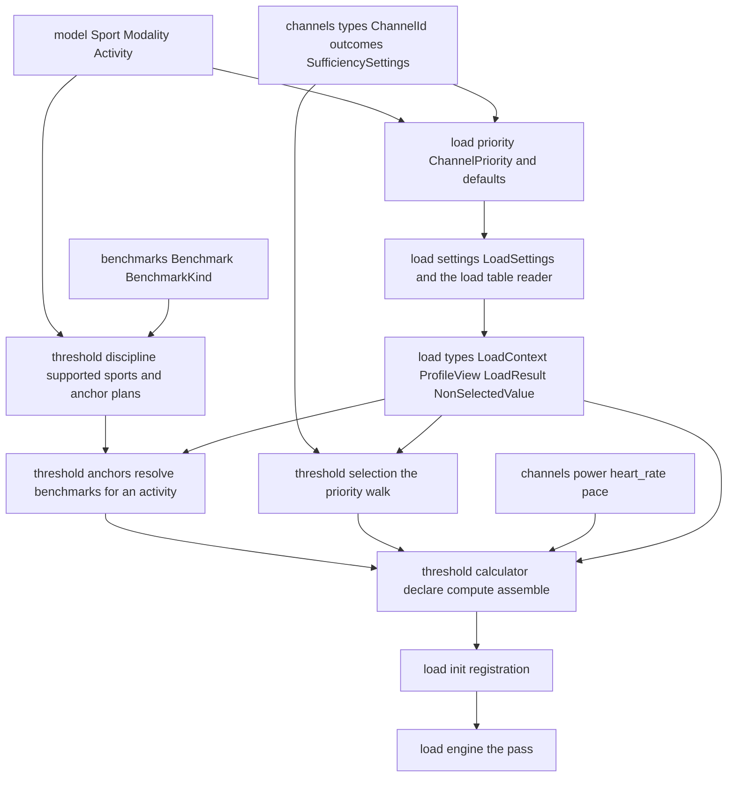
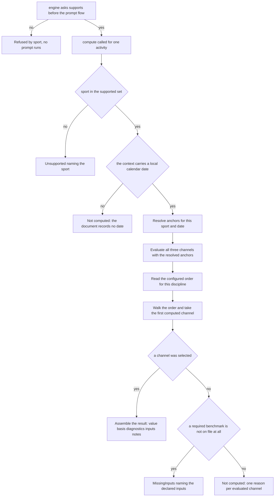
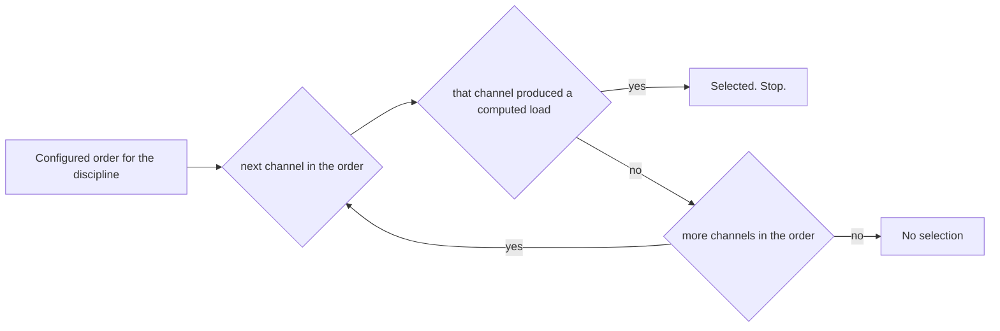

# Technical Design — threshold-load

## Amendment 1 (2026-07-25): the cross-spec review round

This design was amended after the cross-spec review adjudicated five findings
(requirements.md, Amendment 1; all rulings user-approved):

1. **`LoadContext` replaces `ProfileView.load_settings`.** `training-load`
   Amendment 3 adds `LoadContext(activity_date, settings)` to `compute`'s
   parameter list, so this feature adds **no** member to `ProfileView`, which
   reverts to a pure benchmark-store view. The `CalculatorConfigAccess`
   component and its task are withdrawn; the activity date and the resolved
   `[load]` configuration are read from the context. The
   `staleness_window_days` redundancy this design recorded is resolved upstream.
2. **The heart-rate intensity semantic is now shared** (`load-channels`
   Amendment: HR reports `sqrt(impulse_ratio)`), so this feature's single
   `"Intensity"` input label is honest on every channel. Stated explicitly at
   `ResultAssembly` and carried as a revalidation trigger.
3. **Every coverage figure names its basis** (`activity-qa-flags` Req 8's rule,
   extended here): the coverage input reads `"distance 99.8% of recorded time"`.
4. **`NotConfirmed` is renamed `NotComputed`** by `training-load` Amendment 3;
   routing is unchanged and this design now names the new identifier.
5. **The support question is asked before the prompt flow**; this calculator
   answers it as membership of `SUPPORTED_SPORTS`, keeping the `compute` sport
   check as defence in depth. The activity-blind `required_athlete_fields()`
   remains a **known limitation**, deferred by the user and recorded at
   `AthleteFieldDeclaration`. *Repinned 2026-07-26 — see Amendment 2.*

## Amendment 2 (2026-07-26): the support seam is off-Protocol

Amendment 1 recorded that `training-load` Amendment 3 would add
`supports(activity)` to the `LoadCalculator` Protocol. **During implementation
that clause was reversed on measured grounds and the declaration was deleted**
(`3121bb6`). `LoadCalculator` declares no `supports` member and never will:

```
$ uv run python -c "from fitdocs.load.types import LoadCalculator; print(hasattr(LoadCalculator,'supports'))"
False
```

The reason is `typing` semantics, recorded at `src/fitdocs/load/types.py:18-35`.
A Protocol method body is inherited only by *explicit* subclasses, so declaring
`supports` on the Protocol would make it **mandatory for structural conformance
under `mypy --strict`**, and a duck-typed calculator omitting it would register
cleanly and then raise `AttributeError` the first time the engine asked. That is
exactly the plugin-author shape `docs/plugins.md` and the installed plugin
fixture use, and it contradicts `training-load` Req 1.14.

**What this changes for this feature: almost nothing.** The capability survives
intact; only its location moved.

- The seam is the module-level `supports_activity(calculator, activity)` at
  `src/fitdocs/load/types.py:378`. It returns a calculator's own `supports` when
  it defines one — an *optional, off-Protocol* capability found by `getattr`,
  exactly like the existing `athlete_field_hints` seam — and otherwise falls back
  to `supported_modalities` membership.
- `ThresholdCalculator.supports(activity)` is still written exactly as designed
  (`ThresholdCalculator` below, ~line 1005), still answered from
  `SUPPORTED_SPORTS`, still asked before the prompt flow. Req 2.7 is unaffected.
- A calculator defining `supports` may only ever *narrow* its declared
  modalities, never widen them — the registry's modality prefilter runs first.

What was false and is corrected here: any statement that the *contract*, the
*protocol* or the *member* is added by `training-load`, and the hard prerequisite
`tasks.md` and `spec.json` recorded on it. `LoadContext` — the other half of that
prerequisite — did land, so task 3.3's real dependency is satisfied.

This also closes the risk this design already anticipated at "**The
`LoadCalculator` protocol's `supports` member changes or is withdrawn**":
**MATERIALISED**, resolved as above, no redesign required.

## Overview

**Purpose**: This feature delivers the **`threshold` calculator** — fitdocs'
first and only built-in methodology, and the piece that turns
`athlete-benchmarks`' dated thresholds and `load-channels`' three pure
computations into the one number a workout document carries. It decides which
activities are in scope, which discipline's threshold anchors each of their
channels, which channel's value *is* the load, and what happens to the values
that were not chosen. It computes nothing itself.

**Users**: athletes syncing workouts, who get a load number and a visible reason
whenever they do not; `activity-qa-flags`, which will compare the selected
channel against the heart-rate channel this feature guarantees is always
evaluated; and reviewers, for whom every selection is explainable from
configuration alone without reading a value.

**Impact**: the load registry stops being empty. `training-load` ships the
carrier and registers nothing, so until this feature lands every document
honestly reports "unsupported"; after it lands, Run, Ride, Walk and Hike
documents carry a threshold-anchored load and everything else keeps the honest
unsupported state. Two shipped modules gain members — `load/settings.py` a
configuration key and `load/__init__.py` a registration — and one new package
holds the policy. `load/types.py` is **not** touched: `training-load`
Amendment 3 carries the activity date and the resolved `[load]` configuration to
a calculator on a per-activity `LoadContext`, which this calculator consumes.

### Goals

- Exactly one channel's value is the activity's load, chosen by a configured
  per-discipline order with a fallback walk, never by magnitude and never by
  accident.
- Every channel is evaluated on every supported activity, so the diagnostics are
  complete and the planned divergence flag has something to compare.
- Walk and Hike are scorable — the mapping neither upstream spec owned is
  supplied here, explicitly, and every borrowed anchor is reported.
- Absence stays absent: an insufficient channel records its own reason and no
  number, and an activity no channel could score is visibly unscored.
- Fusion is structurally impossible: no code path, no configuration key, and no
  extension point combines two channel values.

### Non-Goals

- Channel arithmetic, sufficiency gates, grade adjustment — `load-channels`.
- The result type, the payload, frontmatter, rendering, the registry and
  *calculator* arbitration — `training-load`.
- The benchmark file, its validation and its staleness verdict —
  `athlete-benchmarks`.
- Quality-condition detection of any kind — `activity-qa-flags`.
- Weekly/CTL/ATL aggregation, auto-FTP or eFTP estimation, a modelled running
  power, a strength-training load.
- Any per-activity fusion, averaging, blending or cross-correction — excluded
  permanently, not deferred.

## Boundary Commitments

### This Spec Owns

- The `threshold` calculator: its identity, its declared modalities, its declared
  athlete inputs, its `supports` answer, and its `compute` implementation.
- **The supported-sport set** and the honest refusal of every other sport,
  including the deliberate refusal of strength training.
- **The modality→discipline anchor map**: which discipline's FTP, LTHR and
  threshold pace anchor each supported sport's channels, including the Walk/Hike
  fallback chain and the deliberate absence of a Walk/Hike power and pace anchor.
- **Benchmark resolution for an activity**: turning `(sport, activity date)` into
  the five already-resolved `Benchmark | None` values the channels take, and
  distinguishing *never on file* from *none applicable on that date*.
- **The channel-priority value type**, its documented per-discipline defaults,
  its `[load.priority]` projection and validation, and its lookup.
- **The selection walk** and the vocabulary of non-selection reasons.
- **Result assembly**: mapping the selected `ChannelLoad` and the other two
  outcomes onto the contract's `LoadResult`, and the formatting of its inputs and
  notes.
- The registration of the built-in in the load package's initializer.

### Out of Boundary

- `fitdocs/load/channels/**` — consumed unchanged; no channel module is edited,
  and no arithmetic, gate or model is restated here.
- `fitdocs/benchmarks.py`, the `[benchmarks]` file format, `BenchmarkSet`
  selection, `benchmark_age` — consumed through `ProfileView`.
- `LoadResult`, `NonSelectedValue`, `QualityFlag`, `LoadOutcome`, `LoadContext`,
  the `LoadCalculator` protocol and the module-level `supports_activity`
  seam (Amendment 2), `render.py`, `docedit.py`, `engine.py`,
  `arbitrate.py`, `contract.py` — `training-load`'s. This feature constructs the
  result, implements the protocol and reads the context; it defines, renders and
  persists none of them.
- `ProfileView` — `athlete-benchmarks`'. This feature **adds no member to it**
  and reads only `benchmark` / `has_benchmark`.
- The prompt flow itself, the profile write path, the binding of the per-activity
  context, and the settings file read — this feature declares fields, answers the
  support question and reads a projected value; it prompts, binds, persists and
  opens nothing.
- Every other `[load]` key: `default_calculator` (training-load),
  `benchmark_staleness_days` (athlete-benchmarks), `[load.sufficiency]`
  (load-channels), `[load.flags]` (activity-qa-flags).

### Allowed Dependencies

- Standard library only for new behavior: `dataclasses`, `datetime.date`,
  `types.MappingProxyType`, `typing`.
- `fitdocs.model` (`Activity`, `Modality`, `Sport`), `fitdocs.metrics`
  (`DerivedMetrics`, passed through), `fitdocs.benchmarks` (`Benchmark`,
  `BenchmarkKind`), `fitdocs.load.channels.*`, `fitdocs.load.types`,
  `fitdocs.load.settings`, `fitdocs.load.registry` (registration only).
- **Dependency direction** (one way; violations are review errors):

  ```
  model / benchmarks / channels.types  →  load.priority
  load.priority                        →  load.settings
  load.types                           →  load.settings         (settings sits
                                                                 ABOVE the contract
                                                                 module)
  load.types  ⇠  load.settings         TYPE_CHECKING only — the LoadContext
                                       annotation, no runtime edge
  load.types                           →  load.threshold.*
  load.settings                        →  load.threshold.calculator (the
                                                                 LoadSettings type)
  channels.power|heart_rate|pace       →  load.threshold.calculator
  ```

  **Corrected 2026-07-25 (cross-spec review round 2).** An earlier revision of
  this design recorded a runtime `settings → types` edge, citing `training-load`
  Amendment 3's claim that `load/settings.py` could sit below `load/types.py`
  because it imported nothing from `fitdocs.load.*`. That claim was false —
  `LoadSettings` aggregates `channels.types.SufficiencySettings`,
  `priority.ChannelPriority` and `qa.types.FlagSettings` — and the resulting
  cycle (`types → settings → qa → qa.flags → types`, for `QualityFlag`) was
  reproduced failing on every entry point. `training-load` cut it with a
  `TYPE_CHECKING`-only import in `load/types.py`, so `settings` sits above
  `types` and the back-reference is an annotation only. That edge remains
  `training-load`'s to hold; **this feature still adds no edge into
  `load/types.py` at all**, so its own scope is unchanged by the correction.

  `load/priority.py` imports nothing from `fitdocs.load` except
  `channels.types`; no module under `load/threshold/` is imported by
  `load/settings.py`, `load/types.py`, `load/registry.py` or any channel module.
  Nothing in this feature imports `fitdocs.cli`, `fitdocs.render`,
  `fitdocs.load.engine`, `fitdocs.load.docedit` or `fitdocs.load.render`.

### Revalidation Triggers

- **`ChannelLoad`, `ChannelInsufficient` or the `InsufficiencyReason` set
  changes** → result assembly and the non-selection reason vocabulary re-check.
- **`LoadResult`, `NonSelectedValue` or `QualityFlag` changes** → result
  assembly re-checks; `activity-qa-flags` re-checks with it.
- **The shared intensity semantic changes** — a channel reporting an intensity
  that no longer satisfies `load == hours × intensity² × 100` (`load-channels`
  1.11) → this feature's single `"Intensity"` input label stops meaning one
  thing, and Req 8.11 fails. Re-check before any such change lands.
- **The coverage basis changes** — the channel layer measuring coverage over
  anything other than recorded time → the basis named in the coverage input
  (Req 8.12) is wrong; this feature and `activity-qa-flags` re-check together.
- **`LoadContext` members change, or `compute`'s parameter list changes** → this
  feature's date source, configuration source and every `compute` postcondition.
- ~~**The `LoadCalculator` protocol's `supports` member changes or is
  withdrawn**~~ → **MATERIALISED and resolved (Amendment 2, 2026-07-26).** The
  member was withdrawn; the capability moved to the module-level
  `supports_activity` seam, which reads an optional off-Protocol `supports` by
  `getattr`. The pre-prompt refusal (Req 2.7) and the
  declared-modality/supported-sport split are unaffected. The live trigger that
  replaces it: **`supports_activity`'s resolution order changes** — if it stopped
  preferring a calculator's own `supports` over modality membership, Req 2.7's
  refusal would silently widen to every `Modality.OTHER` sport.
- **`ProfileView` members change** → this feature's benchmark resolution,
  `plugin-api`'s published surface, and `tests/test_public_api.py`.
- **The `[load]` table's ownership rules change** (a key becomes reserved, or
  unknown sub-tables stop being ignored) → the priority reader and its three
  siblings.
- **The default priority for any discipline changes** → every previously computed
  document's selected channel can change; regeneration is required and the
  recorded divergence note moves with it.
- **The anchor map changes** (a sport gains or loses a chain entry) → every
  affected discipline's computed load changes; `activity-qa-flags` re-checks
  which channel it is comparing against.
- **`registry.for_modality` or the engine's declaration check moves off
  `Modality`** → the declared-modality/supported-sport split collapses and this
  feature's refusal path simplifies.
- **`Modality` gains a walking member, or `MODALITY_MAP` changes** → the declared
  modality set and the sport-authoritative refusal re-check.

### Cross-Spec Coordination (must land with this feature)

| Asset | Owner | Why it moves with this spec |
| --- | --- | --- |
| `LoadContext(activity_date, settings)` on `compute` | `training-load` (Amendment 3) | **Prerequisite, not this feature's to build.** It is the only way the priority and sufficiency settings and the activity date reach a calculator. Until it lands, nothing here can be computed; this feature adds no member to `ProfileView` as a substitute |
| `supports_activity(calculator, activity)` — the module-level seam, **not** a `LoadCalculator` member (Amendment 2) | `training-load` (shipped, `src/fitdocs/load/types.py:378`) | The engine asks it before the prompt flow; this feature supplies the answer (Req 2.7) by defining an optional, off-Protocol `supports` the seam finds by `getattr`. Nothing here adds a protocol member — the Protocol declaration was deleted by `3121bb6` |
| `NotConfirmed` → `NotComputed` | `training-load` (Amendment 3) | This feature is the variant's sole producer; the identifier it names must exist |
| `load/settings.py` — one `LoadSettings`, one reader (`load_load_settings`) | `training-load` | This feature adds `channel_priority` to the existing dataclass and a projection to the existing reader; it creates no second module and no second reader |
| `LoadPackageInit` — the registry is no longer empty of built-ins | `training-load` (Req 13.2 and every test asserting `available() == ()`) | Registering `threshold` is the point of this feature; training-load already records it as a revalidation trigger |
| `tests/test_public_api.py` | `plugin-api` | The published surface gains the calculator export |

## Architecture

### Existing Architecture Analysis

Five shipped or approved facts determine this design.

1. **`LoadCalculator.compute(activity, metrics, profile, session, context)`
   carries a per-activity `LoadContext(activity_date, settings)`**
   (`training-load` Amendment 3). The relocation trigger `athlete-benchmarks`
   recorded has fired: `activity_date` and `staleness_window_days` move off
   `ProfileView`, which becomes a pure benchmark-store view, and the resolved
   `LoadSettings` travels on the context instead of being parked on the profile.
   This feature therefore reads its configuration and its date from `context`
   and adds no contract member of its own.
2. **`Activity` carries both `sport: Sport` and `modality: Modality`, and they
   are different vocabularies.** `MODALITY_MAP` maps only
   running/cycling/swimming; walking, hiking, rowing, unknown and absent sports
   all become `Modality.OTHER`. The registry, `for_modality` and the engine's
   declaration check are `Modality`-based; benchmarks and this feature's support
   decision are `Sport`-based.
3. **The engine calls `compute` exactly once per document** on the arbitrated
   calculator, and folds the outcome with `assert_never`. `Unsupported` becomes
   the honest unsupported document state; `MissingInputs` and `NotComputed`
   become skips carrying, respectively, the field labels and the calculator's own
   reason string. Amendment 3 also inserts the support question (via
   `supports_activity`) **before** the
   prompt flow — previously the order was modality filter → prompt flow →
   `compute`, so a Rowing or Workout document (both `Modality.OTHER`, which this
   calculator must declare to reach Walk and Hike) ran the full interactive
   prompt flow before being refused by sport.
4. **`plugins.py` already reports a registered calculator with no recorded plugin
   origin as a built-in at the installed fitdocs version.** Requirement 1.3 is
   satisfied by registering at all; it needs a test, not code.
5. **`registry.validate_calculator` is pure introspection** — id, display name, a
   non-empty `frozenset[Modality]`, and two callables. A frozen dataclass
   instance satisfies it with no privilege a plugin author lacks.

Patterns preserved: frozen dataclasses with tuple fields; `StrEnum`
vocabularies; closed unions folded exhaustively; pure functions with documented
pre/post conditions; absence as `None` and never `0`; `mypy --strict`.

### Architecture Pattern & Boundary Map



**Architecture Integration**

- **Selected pattern**: a thin policy layer built from three pure leaves and one
  wiring object. `discipline.py` holds tables and no I/O; `selection.py` is a
  pure function over outcomes; `priority.py` is a value type; `calculator.py` is
  the only module that touches a `LoadContext`, a `ProfileView`, an `Activity`
  and a channel at once. Each of the brief's boundary candidates — priority
  configuration,
  the selection walk, result assembly, the modality support decision — is a
  separately testable unit.
- **Domain boundaries**: configuration value (`priority.py`) ≠ configuration
  reading (`settings.py`) ≠ support and anchoring tables (`discipline.py`) ≠
  benchmark resolution (`anchors.py`) ≠ selection (`selection.py`) ≠ assembly
  (`calculator.py`). No two own the same decision.
- **New components rationale**: `priority.py` is a leaf because
  `load/settings.py` must import the value type and the calculator must not be
  importable from settings — the same reason `benchmarks.py` sits above `load/`
  and `SufficiencySettings` sits in `channels/types.py`. `discipline.py` exists
  because the support decision and the anchor map are pure data that must be
  reviewable and testable without an activity. `selection.py` exists because the
  walk is the feature's one genuinely load-bearing algorithm and it must be
  provable in isolation from every channel.
- **No polymorphism anywhere**: there is one selection rule and there will never
  be a second. A strategy seam here would be an extension point for the fusion
  Req 11.7 forbids.
- **Steering compliance**: absent data is `None`/a typed outcome, never `0`; all
  arithmetic deterministic and LLM-free; no file, network or clock access below
  the engine; personal data stays in the data root; `mypy --strict`; the
  dependency direction `cli → render → load/metrics → ingest → model` is
  unchanged.

### Technology Stack

| Layer | Choice / Version | Role in Feature | Notes |
|-------|------------------|-----------------|-------|
| CLI | `typer` (shipped) | Surfaces a malformed `[load.priority]` at exit 2 | Inherited: `LoadSettingsError` subclasses `SettingsError` |
| Backend / Services | Python 3.11+ stdlib (`dataclasses`, `enum`, `datetime.date`, `MappingProxyType`) | Policy, tables, selection, assembly | No new third-party dependency |
| Channel math | `fitdocs.load.channels` (load-channels) | The three computations and their outcomes | Consumed unchanged |
| Benchmarks | `fitdocs.benchmarks` via `ProfileView` (athlete-benchmarks) | Dated, discipline-scoped anchors | Resolved here, not in the channels |
| Config | `fitdocs.load.settings.LoadSettings` | `[load.priority]` projection | Extended, never duplicated |
| Registration | `fitdocs.load.registry` (plugin-api / training-load) | Built-in registration and validation | Same gate a plugin passes |

## File Structure Plan

### Directory Structure

```
src/fitdocs/load/
├── priority.py               # NEW leaf: ChannelId ordering value type,
│                             #   the documented per-discipline defaults, and
│                             #   lookup. Imports only model + channels.types.
├── threshold/
│   ├── __init__.py           # Re-exports the calculator and its constants.
│   │                         #   No registration side effect (the load package
│   │                         #   initializer registers, mirroring how plugins
│   │                         #   are registered from outside their module).
│   ├── discipline.py         # Supported sports, declared modalities, and the
│   │                         #   per-sport AnchorPlan tables. Pure data.
│   ├── anchors.py            # ProfileView + sport + date -> ResolvedAnchors,
│   │                         #   with borrowed / not-on-file / not-applicable
│   │                         #   recorded separately.
│   ├── selection.py          # The priority walk and the non-selected records.
│   └── calculator.py         # ThresholdCalculator: declared fields, compute,
│                             #   result assembly, and the value formatters.
├── settings.py               # MOD: LoadSettings gains channel_priority; the
│                             #   reader gains [load.priority] projection.
│                             # types.py is NOT modified: the activity date and
│                             #   the resolved settings arrive on training-load's
│                             #   LoadContext parameter.
└── __init__.py               # MOD: registers the threshold built-in and
                              #   exports it.
```

### Modified Files

- `src/fitdocs/load/settings.py` — `LoadSettings` gains
  `channel_priority: ChannelPriority`; the existing reader gains projection and
  validation of the `[load.priority]` sub-table, raising the module's existing
  `LoadSettingsError`. **No second reader and no second module**; the
  ignore-unknown-keys behavior is preserved.
- `src/fitdocs/load/types.py`, `src/fitdocs/load/profile.py` and
  `src/fitdocs/load/engine.py` — **not modified by this feature** (Amendment 1).
  The contract member, the concrete profile field and the per-pass binding an
  earlier draft needed for `ProfileView.load_settings` are all superseded by
  `training-load` Amendment 3's `LoadContext`, which the engine binds and this
  calculator only reads.
- `src/fitdocs/load/__init__.py` — imports `THRESHOLD_CALCULATOR` and registers
  it; re-exports it on the public surface.
- `tests/test_public_api.py` — pins the new calculator export.
- Tests (new): `tests/load/test_priority.py`,
  `tests/load/threshold/__init__.py`, `test_discipline.py`, `test_anchors.py`,
  `test_selection.py`, `test_calculator.py`, `test_result_assembly.py`,
  `test_registration.py`, `test_feature_e2e.py`.
- Tests (modified): `tests/load/test_settings.py` (`training-load`'s module for
  the `[load]` reader) — the `[load.priority]`
  projection and its validation matrix.

## System Flows

### One activity, start to finish



Three orderings are fixed and load-bearing. **The support question is asked
before the prompt flow** — by the engine, through `supports_activity` — so an
activity this calculator will refuse by sport never costs the athlete an
interactive question, which is the reason the seam exists. **The sport check
inside `compute` still precedes
everything else** as defence in depth against a caller that skipped `supports`,
so an unsupported activity costs no benchmark lookup and no channel call.
**All three channels are evaluated before the order is consulted**, so the
diagnostics are complete whatever the configuration says and the heart-rate
outcome exists even when power or pace was selected — which is what
`activity-qa-flags` will compare against.

### The selection walk



The walk reads **only** the order and whether each outcome is a computed load.
It never reads a load value, an intensity, a coverage figure or a benchmark date.
That is what makes a selection predictable from configuration alone, and it is
the structural reason no value can influence another (Req 6.5, 11.7).

## Requirements Traceability

| Requirement | Summary | Components | Interfaces | Flows |
|-------------|---------|------------|------------|-------|
| 1.1, 1.2, 1.3 | Registered built-in, same validation gate, reported at the fitdocs version | BuiltInRegistration, ThresholdCalculator | `register`, `calculator_id` | — |
| 1.4, 1.5 | Deterministic; no network, clock or LLM | ThresholdCalculator, ChannelSelection | `compute` | One activity |
| 1.6 | Configuration arrives on the per-activity context, benchmarks through the profile view | ThresholdCalculator, BenchmarkResolution | `LoadContext.settings`, `ProfileView.benchmark` | One activity |
| 1.7 | Never raises for absent or unusable data | ThresholdCalculator | `compute` | One activity |
| 2.1, 2.2, 2.3 | Run/Ride/Walk/Hike supported; strength and the rest refused by name | DisciplineSupport, ThresholdCalculator | `SUPPORTED_SPORTS`, `Unsupported` | One activity |
| 2.4, 2.5 | Declared modalities as a pre-filter; the sport set is authoritative | DisciplineSupport, ThresholdCalculator | `DECLARED_MODALITIES` | One activity |
| 2.6 | Support decided from the sport label alone | DisciplineSupport | `is_supported` | One activity |
| 2.7 | `supports` answered from the sport set, before the prompt flow; `compute` still refuses by sport | ThresholdCalculator, DisciplineSupport | `supports`, `SUPPORTED_SPORTS` | One activity |
| 3.1, 3.2 | The calculator owns the anchor decision; run and ride anchor on themselves | DisciplineSupport | `ANCHOR_PLANS` | — |
| 3.3 | Walk/Hike prefer their own LTHR, else the running one | DisciplineSupport, BenchmarkResolution | `AnchorPlan.lthr`, `resolve` | One activity |
| 3.4 | A borrowed anchor is recorded, naming both disciplines | BenchmarkResolution, ResultAssembly | `ResolvedAnchors.borrowed`, notes | One activity |
| 3.5 | No power or pace anchor for Walk/Hike | DisciplineSupport | `AnchorPlan` empty chains | — |
| 3.6 | Max and resting heart rate are athlete-wide | BenchmarkResolution | `resolve` | — |
| 3.7 | Anchor value, date and discipline reported per computed channel | ResultAssembly | `inputs_used` | — |
| 4.1, 4.2 | Resolve for the activity's own date; hand resolved benchmarks to the channels | BenchmarkResolution, ThresholdCalculator | `resolve`, channel `compute` | One activity |
| 4.3 | No date means no benchmark and a stated reason | ThresholdCalculator | not-computed outcome | One activity |
| 4.4 | On file but not applicable is distinguished | BenchmarkResolution | `not_applicable` | One activity |
| 4.5, 4.6 | No substitution; identical resolution on repeat | BenchmarkResolution | `resolve` | — |
| 5.1, 5.2 | All three channels, independently, always | ThresholdCalculator | `_evaluate_channels` | One activity |
| 5.3 | Resolved sufficiency configuration passed through untouched | ThresholdCalculator | `LoadContext.settings.sufficiency` | One activity |
| 5.4, 5.6, 5.7 | Outcomes carried forward unmodified, reasons preserved | ChannelSelection, ResultAssembly | `NonSelectedValue` | — |
| 5.5 | No combination of channel values under any configuration | ChannelSelection | `select` | Selection walk |
| 6.1, 6.2, 6.3 | Exactly one; walk the order; continue past an uncomputed channel | ChannelSelection | `select` | Selection walk |
| 6.4 | A channel outside the order is never selected | ChannelSelection | `select` | Selection walk |
| 6.5 | Selection ignores magnitude, coverage and intensity | ChannelSelection | `select` | Selection walk |
| 6.6 | The selected channel and the order are recorded | ResultAssembly | `basis`, `inputs_used` | — |
| 6.7 | Nothing selected means not computed, never zero | ThresholdCalculator | not-computed outcome | One activity |
| 7.1, 7.2 | Per-discipline order read from the load table by the single existing reader | PrioritySettingsReader | `load_load_settings` | — |
| 7.3, 7.4 | Documented defaults for all four disciplines; absence is not an error | ChannelPriorityValue | `DEFAULT_CHANNEL_PRIORITY` | — |
| 7.5, 7.6, 7.7 | Unknown discipline, unknown channel, malformed list are configuration errors | PrioritySettingsReader | `LoadSettingsError` | — |
| 7.8 | Validated before any document is written | PrioritySettingsReader | `LoadSettingsError` | — |
| 7.9 | An impossible-but-valid order is accepted and reports insufficiency | PrioritySettingsReader, ChannelSelection | `select` | Selection walk |
| 8.1, 8.2 | The selected load is the value; the channel is the basis | ResultAssembly | `LoadResult` | — |
| 8.3, 8.4, 8.5 | Every other channel recorded once, with a value or with none | ChannelSelection, ResultAssembly | `NonSelectedValue` | — |
| 8.6 | Intensity, anchor, date, duration and coverage among the inputs | ResultAssembly | `inputs_used` | — |
| 8.7 | Qualifying facts recorded as notes | ResultAssembly | `notes` | — |
| 8.8 | No flags of its own, no placeholders | ResultAssembly | `flags = ()` | — |
| 8.9 | Deterministic ordering of every record | ChannelSelection, ResultAssembly | `CANONICAL_CHANNELS` | — |
| 8.10 | The value never derives from a diagnostic | ResultAssembly | `LoadResult.value` | — |
| 8.11 | One `Intensity` label, honest on every channel via the shared intensity semantic | ResultAssembly | `inputs_used` | — |
| 8.12 | The coverage figure names the basis it was measured on | ResultAssembly | `inputs_used` | — |
| 9.1, 9.2, 9.3 | Required benchmarks declared with label, range and help; nothing optional declared | AthleteFieldDeclaration | `required_athlete_fields` | — |
| 9.4, 9.5, 9.6 | Missing-inputs only for never-on-file blockers; not-applicable is distinct; a computed activity is never reported missing | ThresholdCalculator, BenchmarkResolution | `MissingInputs` | One activity |
| 9.7 | Nothing persisted, requested or inferred | ThresholdCalculator | `compute` | — |
| 10.1, 10.2 | A typed outcome carrying no value and one reason per channel | ThresholdCalculator | not-computed outcome | One activity |
| 10.3, 10.4 | Never a value without a selected channel; never a zero or a default | ResultAssembly, ThresholdCalculator | `LoadResult` | — |
| 10.5, 10.6 | Not computed is retryable and stable | ThresholdCalculator | `compute` | One activity |
| 11.1–11.7 | No arithmetic, documents, arbitration, store writes, flags, aggregation, or fusion seam | All components, PublicSurfacePin | package import graph | — |

## Components and Interfaces

| Component | Domain/Layer | Intent | Req Coverage | Key Dependencies (P0/P1) | Contracts |
|-----------|--------------|--------|--------------|--------------------------|-----------|
| ChannelPriorityValue | Leaf (`load/priority.py`) | The per-discipline channel ordering and its documented defaults | 7.3, 7.4, 8.9 | `fitdocs.model` (P0), `channels.types` (P0) | State |
| PrioritySettingsReader | Config (`load/settings.py`) | Projects and validates `[load.priority]` onto the one `LoadSettings` | 7.1, 7.2, 7.5–7.9 | ChannelPriorityValue (P0), `fitdocs.settings` (P0) | State |
| DisciplineSupport | Leaf (`threshold/discipline.py`) | Which sports are scored, and which discipline anchors each quantity | 2.1–2.7, 3.1–3.3, 3.5 | `fitdocs.model` (P0), `fitdocs.benchmarks` (P1) | State |
| BenchmarkResolution | Domain (`threshold/anchors.py`) | Sport + date → the five resolved anchors, with absence classified | 3.3, 3.4, 3.6, 4.1–4.6, 9.5 | DisciplineSupport (P0), `ProfileView` (P0) | Service |
| ChannelSelection | Domain (`threshold/selection.py`) | The priority walk and the non-selected records | 5.4–5.7, 6.1–6.6, 7.9, 8.3–8.5, 8.9 | `channels.types` (P0), `load.types` (P0) | Service |
| AthleteFieldDeclaration | Contract (`threshold/calculator.py`) | The benchmarks the prompt flow collects for this calculator | 9.1, 9.2, 9.3 | `load.types` (P0), `fitdocs.benchmarks` (P0) | State |
| ThresholdCalculator | Calculator (`threshold/calculator.py`) | The contract implementation: answer `supports`, then refuse, resolve, evaluate, select, assemble | 1.1, 1.4–1.7, 2.2–2.5, 2.7, 4.3, 5.1–5.3, 6.7, 9.4–9.7, 10.1–10.6 | all of the above (P0), `channels.*` (P0) | Service |
| ResultAssembly | Calculator (`threshold/calculator.py`) | Mapping a selection onto the contract's result | 3.4, 3.7, 6.6, 8.1–8.12, 10.3, 10.4 | `load.types` (P0) | Service |
| BuiltInRegistration | Packaging (`load/__init__.py`) | Registers the built-in and publishes it | 1.1, 1.2, 1.3 | `load.registry` (P0) | Service |
| PublicSurfacePin | Test contract (`tests/test_public_api.py`) | Pins the surface against accidental drift | 11.1–11.7 | BuiltInRegistration (P0) | State |

### Leaf — `src/fitdocs/load/priority.py`

#### ChannelPriorityValue

| Field | Detail |
|-------|--------|
| Intent | Hold the per-discipline channel ordering as an immutable, defaulted value |
| Requirements | 7.3, 7.4, 8.9 |

**Responsibilities & Constraints**

- Holds the **value**; `load/settings.py` holds the *reading* of it, mirroring
  `SufficiencySettings`. This is what keeps the calculator free of any
  configuration machinery and lets `load/settings.py` import the type without
  importing the calculator.
- Defaults are applied at **read** time, not lookup time: the reader produces a
  mapping complete over every supported discipline, with configured entries
  overriding defaults. A default-constructed `ChannelPriority()` therefore equals
  the value an unconfigured data root produces, so tests and production agree.
- Immutable and comparable: the mapping is wrapped in `MappingProxyType` and the
  orders are tuples, so two equal configurations produce equal values.

**Dependencies**: Outbound — `fitdocs.model.Sport` (P0),
`fitdocs.load.channels.types.ChannelId` (P0). Inbound — `load/settings.py` (P0),
`threshold/calculator.py` (P0).

**Contracts**: State [x]

##### State Management

```python
DEFAULT_CHANNEL_PRIORITY: Final[Mapping[Sport, tuple[ChannelId, ...]]] = MappingProxyType({
    Sport.RUN:  (ChannelId.PACE, ChannelId.POWER, ChannelId.HEART_RATE),
    Sport.RIDE: (ChannelId.POWER, ChannelId.HEART_RATE),
    Sport.WALK: (ChannelId.HEART_RATE,),
    Sport.HIKE: (ChannelId.HEART_RATE,),
})

@dataclass(frozen=True)
class ChannelPriority:
    by_discipline: Mapping[Sport, tuple[ChannelId, ...]] = DEFAULT_CHANNEL_PRIORITY

    def for_discipline(self, sport: Sport) -> tuple[ChannelId, ...]: ...
```

- Preconditions: every key is a supported `Sport`; every order is non-empty and
  free of repeats — guaranteed by the reader, which is the only constructor
  outside tests.
- Postconditions: `for_discipline` returns the order for a supported discipline
  and the empty tuple for any other sport (which the calculator never reaches,
  having refused it already).
- Invariants: no order is mutated after construction; `DEFAULT_CHANNEL_PRIORITY`
  covers exactly the supported set.

**Implementation Notes**

- *Rationale for the defaults* (Req 7.4, recorded as a divergence): running
  defaults to **pace** rather than to the recorded power fitdocs is uniquely able
  to read, because the roadmap records that intervals.icu does not ingest those
  fields natively — a power-first default would make every run's headline number
  unreproducible elsewhere. Cycling defaults to power, the sport's universal
  currency, and falls back to heart rate for the 7-of-9 rides that carry none.
  Walk and Hike list heart rate alone, because they have no power or pace anchor
  at all (3.5).
- *Risks*: changing a default changes every previously computed document's
  selected channel. Recorded as a revalidation trigger; the module docstring says
  so at the constant.

### Config — `src/fitdocs/load/settings.py`

#### PrioritySettingsReader

| Field | Detail |
|-------|--------|
| Intent | Project and validate `[load.priority]` onto the single shared settings value |
| Requirements | 7.1, 7.2, 7.5, 7.6, 7.7, 7.8, 7.9 |

**Responsibilities & Constraints**

- **Extends the one `LoadSettings` dataclass and the one reader.** It creates no
  module, opens no file, and adds no second reader — the discipline three
  sibling specs have already committed to for the same table.
- Keeps the additivity contract: unknown keys and unknown sub-tables inside
  `[load]` remain ignored, so `[load.sufficiency]`, `[load.flags]` and future
  keys land independently.
- Applies the documented defaults during projection, so the produced value is
  complete and self-describing.

**Dependencies**: Outbound — ChannelPriorityValue (P0), `fitdocs.settings`
(P0), `fitdocs.layout.settings_path` (P1). Inbound — `load/engine.py` (P0),
`load/types.py` (P0, as the profile-view member's type).

**Contracts**: State [x]

##### State Management

```python
@dataclass(frozen=True)
class LoadSettings:
    default_calculator: str | None = None                    # training-load
    benchmark_staleness_days: int = DEFAULT_STALENESS_WINDOW_DAYS  # athlete-benchmarks
    sufficiency: SufficiencySettings = field(default_factory=SufficiencySettings)  # load-channels
    channel_priority: ChannelPriority = field(default_factory=ChannelPriority)     # THIS SPEC
```

- `[load.priority]` keys are the lowercased `Sport` values of the supported
  disciplines — `run`, `ride`, `walk`, `hike` — matching the benchmark store's
  own scope-table convention. Values are lists of `ChannelId` values —
  `"power"`, `"heart_rate"`, `"pace"`.
- Postconditions: an absent settings file, absent `[load]`, absent
  `[load.priority]` or absent discipline entry yields the documented default for
  that discipline and is never an error (7.3). A non-table `[load.priority]`, a
  key that is not a recognized sport or is a sport this calculator does not
  support, a value that is not a list, an element that is not a string, an
  unrecognized channel name, a repeated channel, or an empty list each raise
  `LoadSettingsError` naming the file, the key and the offending value
  (7.5–7.7).
- Invariants: the error type already routes to the CLI's exit-2 configuration
  path before any document is written (7.8); a *valid but futile* order — for
  example `ride = ["pace"]` — is accepted, and those activities report the pace
  channel's own model-not-defined reason (7.9).

**Implementation Notes**

- *Integration*: the dataclass above shows every sibling's member for clarity;
  **this feature adds exactly one line to it and one projection helper to the
  reader.** The reader is `training-load`'s `load_load_settings(document,
  settings_file) -> LoadSettings` (owner and signature pinned by that spec, as
  `load-channels` records) — this feature extends it and neither names nor
  relocates it.
- *Validation*: a test asserts that a document carrying `[load.priority]`,
  `[load.sufficiency]`, `[load.flags]` and `default_calculator` together parses
  cleanly, which is the additivity contract's guard from this side.
- *Consumption (Amendment 1)*: the resolved value reaches a calculator on
  `training-load`'s `LoadContext.settings`. This feature therefore contributes a
  key to `LoadSettings` and reads it back off the context; it puts **nothing**
  on `ProfileView`, and the earlier `CalculatorConfigAccess` component that did
  is withdrawn along with its task. The `staleness_window_days` redundancy that
  component recorded is resolved upstream: `athlete-benchmarks` removes both
  `staleness_window_days` and `activity_date` from `ProfileView`, leaving
  `benchmark_staleness_days` on `LoadSettings` as the single source.

### Leaf — `src/fitdocs/load/threshold/discipline.py`

#### DisciplineSupport

| Field | Detail |
|-------|--------|
| Intent | State which sports are scored and which discipline anchors each quantity |
| Requirements | 2.1, 2.2, 2.3, 2.4, 2.5, 2.6, 2.7, 3.1, 3.2, 3.3, 3.5 |

**Responsibilities & Constraints**

- Pure data plus two lookups. No `ProfileView`, no `Activity`, no I/O — so the
  entire support-and-anchoring policy is reviewable and testable as a table.
- **The sport set is authoritative; the modality set is a coarse pre-filter.**
  `Modality.OTHER` holds Walk and Hike *and* Rowing, Workout and every
  unrecognized sport, so declaring it is the only way Walk and Hike reach
  `compute` at all — and the calculator must then refuse the others by sport
  (2.5). `SUPPORTED_SPORTS` is what the calculator's `supports(activity)` answer
  reads, so that refusal now happens *before* the prompt flow (2.7).
- `Modality.STRENGTH` is deliberately **not** declared, so a strength activity
  never reaches `compute` and takes the engine's unsupported path directly — the
  cheapest honest refusal (2.2).
- An anchor chain is ordered: the activity's own discipline first, then any
  fallback. An **empty** chain means "this quantity does not anchor this sport"
  and is the mechanism behind 3.5.

**Dependencies**: Outbound — `fitdocs.model.Sport`, `Modality` (P0),
`fitdocs.benchmarks.BenchmarkKind` (P1). Inbound — `threshold/anchors.py` (P0),
`threshold/calculator.py` (P0).

**Contracts**: State [x]

##### State Management

```python
SUPPORTED_SPORTS: Final[frozenset[Sport]] = frozenset(
    {Sport.RUN, Sport.RIDE, Sport.WALK, Sport.HIKE}
)

DECLARED_MODALITIES: Final[frozenset[Modality]] = frozenset(
    {Modality.RUN, Modality.BIKE, Modality.OTHER}
)

@dataclass(frozen=True)
class AnchorPlan:
    """Ordered discipline chains per quantity. () == no anchor for this sport."""
    ftp: tuple[Sport, ...]
    lthr: tuple[Sport, ...]
    threshold_pace: tuple[Sport, ...]

ANCHOR_PLANS: Final[Mapping[Sport, AnchorPlan]] = MappingProxyType({
    Sport.RUN:  AnchorPlan(ftp=(Sport.RUN,),  lthr=(Sport.RUN,),  threshold_pace=(Sport.RUN,)),
    Sport.RIDE: AnchorPlan(ftp=(Sport.RIDE,), lthr=(Sport.RIDE,), threshold_pace=()),
    Sport.WALK: AnchorPlan(ftp=(),            lthr=(Sport.WALK, Sport.RUN), threshold_pace=()),
    Sport.HIKE: AnchorPlan(ftp=(),            lthr=(Sport.HIKE, Sport.RUN), threshold_pace=()),
})

def is_supported(sport: Sport) -> bool: ...
def anchor_plan(sport: Sport) -> AnchorPlan: ...
```

- Preconditions: `anchor_plan` is called only for a supported sport; otherwise it
  raises `KeyError` as a programming error, because the calculator refuses first.
- Postconditions: `SUPPORTED_SPORTS` and `ANCHOR_PLANS` have identical key sets —
  asserted by a test, so a sport can never be supported without an anchoring
  policy.
- Invariants: no chain contains a repeat; every chain's first element is the
  activity's own sport when the chain is non-empty; the athlete-wide quantities
  (maximum and resting heart rate) appear in no chain because they carry no
  discipline (3.6).

**Implementation Notes**

- *Rationale for the Walk/Hike chains*: the benchmark store never falls back
  across disciplines, so without an explicit chain roadmap decision 4 ("Walk and
  Hike are in, scored via the heart-rate channel") is unrealizable for any
  athlete who has not tested a walking LTHR. The chain prefers the athlete's own
  walk or hike threshold when one is on file and borrows the running one
  otherwise; the borrowing is reported on every result that used it (3.4).
- *Rationale for the empty power and pace chains*: `load-channels` returns
  `MODEL_NOT_DEFINED` for pace on any non-running modality, and anchoring walking
  watts to a running FTP would produce exactly the computable-but-meaningless
  number roadmap decision 1 refused for strength. An absent anchor yields the
  channel's own no-benchmark reason, which is honest.
- *Resolved (Amendment 1)*: a rowing or generic-workout document passes the
  declaration check (because it is `Modality.OTHER`) and, under the shipped
  ordering — modality filter → `collect_missing_fields` → `compute`
  (`engine.py:363-386`) — ran the full interactive prompt flow before being
  refused by sport. `training-load` Amendment 3 asks the support question —
  through the module-level `supports_activity` (Amendment 2) — before the prompt
  flow; this feature answers it from `SUPPORTED_SPORTS` (2.7), which closes the
  leak. The `compute` sport check stays as defence in depth for any caller that
  bypasses the seam.

### Domain — `src/fitdocs/load/threshold/anchors.py`

#### BenchmarkResolution

| Field | Detail |
|-------|--------|
| Intent | Turn a sport and a date into the five anchors the channels take |
| Requirements | 3.3, 3.4, 3.6, 4.1, 4.2, 4.3, 4.4, 4.5, 4.6, 9.5 |

**Responsibilities & Constraints**

- The **only** module that calls `ProfileView.benchmark` / `has_benchmark`. The
  channels receive already-resolved `Benchmark` objects and never see a profile
  (`load-channels` Req 9.4).
- Walks each quantity's chain in order and takes the first *applicable*
  benchmark. It asks the store for one discipline at a time, so the store's
  never-fall-back invariant is untouched — the fallback is this module's, and it
  is recorded.
- Classifies absence into three distinguishable states: **borrowed** (resolved,
  but from another discipline), **not on file** (no benchmark of that kind and
  scope exists anywhere in the chain), and **not applicable** (one exists but
  none is dated on or before the activity). The third is what stops the prompt
  loop from re-asking and what makes the skip reason honest (9.5).
- Pure with respect to the filesystem and the clock: every date comes from the
  caller.

**Dependencies**: Outbound — DisciplineSupport (P0), `ProfileView` (P0),
`fitdocs.benchmarks.BenchmarkKind` (P0). Inbound — `threshold/calculator.py`
(P0).

**Contracts**: Service [x]

##### Service Interface

```python
@dataclass(frozen=True)
class Borrowing:
    kind: BenchmarkKind
    activity_discipline: Sport
    anchor_discipline: Sport

@dataclass(frozen=True)
class ResolvedAnchors:
    ftp: Benchmark | None
    lthr: Benchmark | None
    threshold_pace: Benchmark | None
    max_hr: Benchmark | None
    resting_hr: Benchmark | None
    borrowed: tuple[Borrowing, ...]
    not_on_file: tuple[tuple[BenchmarkKind, Sport | None], ...]
    not_applicable: tuple[tuple[BenchmarkKind, Sport | None], ...]

def resolve(profile: ProfileView, *, sport: Sport, on: date) -> ResolvedAnchors: ...
```

- Preconditions: `sport` is supported; `on` is the activity's own local calendar
  date, obtained from `LoadContext.activity_date` and never from a clock or from
  `Activity.start_time` — the document's date and the load's date must be the
  same date (4.1).
- Postconditions: each quantity holds the first applicable benchmark along its
  chain, or `None` (4.5 — no default, no estimate, no later-measured entry).
  `borrowed` names every quantity resolved from a discipline other than `sport`,
  in a fixed quantity order (3.4). A quantity with an empty chain contributes
  `None` and appears in **neither** `not_on_file` nor `not_applicable` — it was
  never sought (3.5). Maximum and resting heart rate are always sought in the
  athlete-wide scope (3.6). Repeat calls with equal inputs are equal (4.6).
- Invariants: a quantity appears in at most one of `not_on_file` and
  `not_applicable`; `not_on_file` means `has_benchmark` was false for **every**
  discipline in the chain (4.4).

**Implementation Notes**

- *Integration*: the whole-athlete scope is expressed as `discipline=None`,
  matching the store's contract; `Sport | None` in the absence tuples carries the
  same meaning.
- *Validation*: the hardware-boundary case is the headline test — a running FTP
  measured in 2026 and one measured in 2024, with a 2024-dated activity resolving
  the 2024 entry, is the exact scenario `measured_on` exists for.
- *Risks*: none of the channels validate that the benchmark they were handed
  belongs to the activity's discipline — they check only the *kind*. Handing a
  cycling FTP to a run would be silent, so the chain tables are the single point
  of truth and are pinned by their own test.

### Domain — `src/fitdocs/load/threshold/selection.py`

#### ChannelSelection

| Field | Detail |
|-------|--------|
| Intent | Pick one channel by order alone, and record what the others were |
| Requirements | 5.4, 5.5, 5.6, 5.7, 6.1, 6.2, 6.3, 6.4, 6.5, 6.6, 7.9, 8.3, 8.4, 8.5, 8.9 |

**Responsibilities & Constraints**

- Pure functions over a mapping of outcomes and an order. No activity, no
  profile, no benchmark, no configuration reading — so every selection rule is
  provable from a handful of constructed outcomes.
- **Reads no value.** The walk inspects only membership in the order and whether
  an outcome is a `ChannelLoad`. It never reads `load`, `intensity`, `coverage`
  or an anchor date (6.5). This is the structural guarantee behind Req 11.7:
  there is no place in this feature where two channel values are in scope
  together for arithmetic.
- Records every non-selected channel exactly once, in a **canonical** order that
  is independent of the configured priority, so two data roots configured
  differently still produce diffable documents (8.9).

**Dependencies**: Outbound — `channels.types` (P0), `load.types.NonSelectedValue`
(P0). Inbound — `threshold/calculator.py` (P0).

**Contracts**: Service [x]

##### Service Interface

```python
CANONICAL_CHANNELS: Final[tuple[ChannelId, ...]] = (
    ChannelId.POWER, ChannelId.HEART_RATE, ChannelId.PACE,
)

CHANNEL_LABELS: Final[Mapping[ChannelId, str]]   # "Power", "Heart rate", "Pace"

def select(
    outcomes: Mapping[ChannelId, ChannelOutcome], order: Sequence[ChannelId]
) -> ChannelId | None: ...

def non_selected_values(
    outcomes: Mapping[ChannelId, ChannelOutcome],
    *,
    order: Sequence[ChannelId],
    selected: ChannelId | None,
    discipline: Sport,
) -> tuple[NonSelectedValue, ...]: ...
```

- Preconditions: `outcomes` holds exactly one entry per `CANONICAL_CHANNELS`
  member — the calculator always evaluates all three (5.1).
- Postconditions: `select` returns the first id in `order` whose outcome is a
  `ChannelLoad`, else `None` (6.2, 6.3, 6.7); an id absent from `order` is never
  returned even when it computed (6.4). `non_selected_values` returns one entry
  per channel other than `selected`, in `CANONICAL_CHANNELS` order, each with:
  - a computed channel in `order` → its load and the reason
    `"not selected: the configured order for {discipline} prefers {winner}"`
    (8.4);
  - a computed channel **absent** from `order` → its load and the reason
    `"not selected: this channel is not in the configured order for {discipline}"`
    (6.4, 8.4);
  - an insufficient channel → `value=None` and the channel's own `detail`
    verbatim, so the recorded reason is the one the channel reported (5.6, 8.5).
- Invariants: no returned entry ever carries `0.0` in place of an absent value
  (8.5); the function is total over the closed `ChannelOutcome` union and folds
  it with `assert_never` (5.7).

**Implementation Notes**

- *Integration*: `NonSelectedValue.key` is the `ChannelId` value, so the payload
  and any later consumer address channels by the same token the channel layer
  uses; `label` comes from `CHANNEL_LABELS`.
- *Validation*: the ordering test constructs one computed and two insufficient
  outcomes and asserts the record order is power, heart rate, pace regardless of
  whether the configured order was `["pace", "power"]` or `["power"]`.
- *Risks*: the reason strings are user-visible and are pinned by tests; changing
  one changes rendered documents, which is a regeneration, not a silent edit.

### Calculator — `src/fitdocs/load/threshold/calculator.py`

#### AthleteFieldDeclaration

| Field | Detail |
|-------|--------|
| Intent | Declare the benchmarks the shipped prompt flow must collect |
| Requirements | 9.1, 9.2, 9.3 |

**Responsibilities & Constraints**

- Declares the **seven** benchmarks required to score the supported disciplines:
  running and cycling FTP, running and cycling LTHR, running threshold pace, and
  the athlete-wide maximum and resting heart rate.
- Declares **no** walk or hike LTHR (9.2): those are optional refinements of an
  anchor the chain already resolves, and declaring them would prompt for a
  threshold the tool does not need.
- Each field carries a `BenchmarkRef`, so the prompt flow persists it as a dated
  measurement rather than as a flat key, and carries help text naming the
  discipline plainly so declining an irrelevant one is an obvious choice.
- Declaration is static, because `required_athlete_fields()` takes no activity.

**Contracts**: State [x]

##### State Management

| Declared field | Benchmark | Kind | Range |
|----------------|-----------|------|-------|
| Running FTP (W) | `ftp_watts` @ `run` | int | 50–600 |
| Cycling FTP (W) | `ftp_watts` @ `ride` | int | 50–600 |
| Running LTHR (bpm) | `lthr_bpm` @ `run` | int | 80–220 |
| Cycling LTHR (bpm) | `lthr_bpm` @ `ride` | int | 80–220 |
| Running threshold pace (s/km) | `threshold_pace_s_per_km` @ `run` | float | 120–900 |
| Maximum heart rate (bpm) | `max_hr_bpm` @ athlete | int | 100–230 |
| Resting heart rate (bpm) | `resting_hr_bpm` @ athlete | int | 25–100 |

- Invariants: the declared set is exactly the set of quantities reachable through
  a non-empty anchor chain plus the two athlete-wide heart-rate quantities —
  asserted by a test against `ANCHOR_PLANS`, so adding a chain entry without
  declaring its field fails the suite.

**Implementation Notes**

- *Known limitation (cross-spec, deferred by the user in the Amendment 1
  review)*: `required_athlete_fields()` takes no activity, so the declaration is
  **activity-blind**, and the prompt flow asks for every declared field that is
  absent from file. A runner with no bicycle is therefore still asked for a
  cycling FTP on every interactive pass. `supports(activity)` (2.7) fixes only
  the adjacent leak — an activity this calculator refuses outright no longer
  reaches the prompt flow at all — and does nothing for a *supported* activity
  whose declaration over-asks. The engine calls `compute` regardless of a
  decline, so the run is still scored: the cost is a repeated question, not a
  lost number. The fix is contract-level (an activity-aware declaration, or a
  persisted declined marker), belongs to `training-load` /
  `athlete-benchmarks`, and is **not** worked around here.

#### ThresholdCalculator

| Field | Detail |
|-------|--------|
| Intent | The contract implementation: answer `supports`, then refuse, resolve, evaluate, select, assemble |
| Requirements | 1.1, 1.4, 1.5, 1.6, 1.7, 2.2, 2.3, 2.4, 2.5, 2.7, 4.3, 5.1, 5.2, 5.3, 6.7, 9.4, 9.5, 9.6, 9.7, 10.1, 10.2, 10.5, 10.6 |

**Responsibilities & Constraints**

- A frozen dataclass with the three contract attributes and three methods —
  nothing a plugin author could not write (1.2).
- Defines an optional, off-Protocol `supports(activity)` answered from
  `SUPPORTED_SPORTS`, which the engine reaches through `supports_activity`
  (Amendment 2) *before* the prompt flow, so a Rowing or Workout document inside
  the declared catch-all modality is refused without costing the athlete a
  question (2.7).
- Performs the fixed sequence: **sport check → date check → resolve anchors →
  evaluate all three channels → select → assemble or explain**. The sport check
  inside `compute` is retained as defence in depth even though `supports` now
  screens the same condition, so an unsupported activity reaching `compute`
  through any path costs nothing and is still refused by name.
- Passes `context.settings.sufficiency` straight through to each channel and
  applies no gate of its own (5.3), and reads the configured order from
  `context.settings.channel_priority`.
- Never raises: every failure path is one of the contract's four typed outcomes
  (1.7).

**Dependencies**: Outbound — DisciplineSupport, BenchmarkResolution,
ChannelSelection, ChannelPriorityValue, `channels.power/heart_rate/pace`,
`load.types` (all P0). Inbound — BuiltInRegistration (P0).

**Contracts**: Service [x]

##### Service Interface

```python
CALCULATOR_ID: Final[str] = "threshold"
DISPLAY_NAME: Final[str] = "Threshold Load"

@dataclass(frozen=True)
class ThresholdCalculator:
    calculator_id: str = CALCULATOR_ID
    display_name: str = DISPLAY_NAME
    supported_modalities: frozenset[Modality] = DECLARED_MODALITIES

    def required_athlete_fields(self) -> tuple[AthleteField, ...]: ...
    def supports(self, activity: Activity) -> bool:
        """True iff activity.sport is in SUPPORTED_SPORTS (2.7).

        Optional and off-Protocol (Amendment 2): `LoadCalculator` declares no
        `supports` member, and defining one here is additive. The engine reaches
        it through `supports_activity(calculator, activity)`, which prefers this
        answer by `getattr` and otherwise falls back to `supported_modalities`
        membership.

        Asked BEFORE the prompt flow, so an activity inside a declared modality
        but outside the supported sport set never costs the athlete a question.
        It may only *narrow* DECLARED_MODALITIES, never widen them — the
        registry's modality prefilter runs first, and a calculator that filter
        drops can never be reinstated here.
        """

    def compute(
        self,
        activity: Activity,
        metrics: DerivedMetrics,
        profile: ProfileView,
        session: InteractionSession,
        context: LoadContext,
    ) -> LoadOutcome: ...

THRESHOLD_CALCULATOR: Final[ThresholdCalculator] = ThresholdCalculator()
```

- Preconditions: the engine has asked `supports` and run the prompt flow for the
  declared fields; `metrics` is the `DerivedMetrics` computed for `activity`;
  `context` carries this activity's local calendar date and the pass's resolved
  `LoadSettings`.
- Postconditions, in the order they are decided:
  1. `activity.sport not in SUPPORTED_SPORTS` → `Unsupported` naming the sport
     (2.2, 2.3, 2.5, 2.7 — normally unreachable because `supports` already said
     no, and kept as defence in depth).
  2. `context.activity_date is None` → the **not-computed** outcome with a reason
     naming the absent date (4.3).
  3. Otherwise all three channels are evaluated with the resolved anchors and
     `context.settings.sufficiency` (5.1, 5.2, 5.3).
  4. A selection → `Computed` carrying the assembled result (8.1).
  5. No selection, and at least one channel in the configured order reported a
     missing benchmark whose quantity is in `not_on_file` → `MissingInputs`
     carrying the corresponding declared fields, in declaration order (9.4).
  6. No selection otherwise → the **not-computed** outcome whose reason names
     every evaluated channel and its reason, in `CANONICAL_CHANNELS` order
     (10.1, 10.2).
- Invariants: `session` is never used — this calculator asks nothing and confirms
  nothing (9.7); no value is ever emitted that a selected channel did not produce
  (10.3, 10.4); identical inputs yield an identical outcome, reason strings
  included (1.4, 10.6).

**Implementation Notes**

- *The not-computed outcome*: the contract's closed union offers `Computed`,
  `Unsupported`, `MissingInputs` and `NotComputed`. `Unsupported` drives a
  *document state* and would wrongly claim the sport is out of scope;
  `MissingInputs` renders as "missing required inputs" and would misdescribe a
  coverage failure. `NotComputed` is the variant the engine renders as
  *"skipped, with the calculator's own reason"*, which is exactly the required
  behavior — so this feature uses it and **does not widen a closed union it does
  not own**. The variant was named `NotConfirmed` until `training-load`
  Amendment 3 renamed it: that name was withdrawn-methodology-era confirmation vocabulary
  citing the withdrawn Requirement 4, it had no producer left in `src/`, and this
  feature is about to become its sole producer for an unrelated meaning. Engine
  routing is unchanged by the rename.
- *Date source*: `context.activity_date`, never `activity.start_time`. The
  start time is a UTC instant; the document is named from a local calendar date,
  and scoring must agree with the file name (4.1).
- *Risks*: an activity whose sport is supported but whose modality is `OTHER`
  reaches `compute` alongside rowing and generic workouts. `supports` screens
  them out ahead of the prompt flow, and the sport check inside `compute` is the
  second line separating them — which is why it is first in the sequence and why
  it is tested per sport.

#### ResultAssembly

| Field | Detail |
|-------|--------|
| Intent | Map a selection onto the contract's result without inventing anything |
| Requirements | 3.4, 3.7, 6.6, 8.1, 8.2, 8.6, 8.7, 8.8, 8.9, 8.10, 8.11, 8.12, 10.3, 10.4 |

**Responsibilities & Constraints**

- Builds the result in one function so that a later feature (`activity-qa-flags`)
  can supply flags at one call site rather than through a rewrite. No placeholder,
  no unreachable branch, and no empty-flag scaffolding beyond the empty tuple the
  contract already expects (8.8).
- The selected `ChannelLoad.load` becomes `LoadResult.value` **unrounded and
  unadjusted**; presentation rounding belongs to the renderer (5.4, 8.10).
- Formats every value through documented deterministic formatters, so identical
  computations produce byte-identical records (8.9).

**Contracts**: Service [x]

##### Service Interface

```python
def build_result(
    *,
    selected: ChannelLoad,
    outcomes: Mapping[ChannelId, ChannelOutcome],
    order: tuple[ChannelId, ...],
    anchors: ResolvedAnchors,
    discipline: Sport,
) -> LoadResult: ...
```

| Result field | Source |
|--------------|--------|
| `calculator_id` | `"threshold"` |
| `display_name` | `"Threshold Load"` |
| `value` | `selected.load`, verbatim (8.1, 8.10) |
| `basis` | the selected `ChannelId` value — `"power"`, `"heart_rate"` or `"pace"` (8.2) |
| `non_selected` | `non_selected_values(...)` (8.3–8.5) |
| `flags` | `()` (8.8) |
| `inputs_used` | `("Channel", label)`, `("Selection order", "pace > power > heart_rate")`, `("Intensity", "0.912")`, `("Scored duration", "1:03:20")`, `("Coverage", "distance 99.8% of recorded time")`, then the selected channel's own `inputs_used` verbatim — which already carries the anchor value, its discipline and its measurement date (3.7, 6.6, 8.6, 8.11, 8.12) |
| `notes` | one per `Borrowing`, then the selected channel's own `notes`, each prefixed with the channel label (3.4, 8.7) |

- Postconditions: `basis` is non-empty; every `NonSelectedValue.reason` is
  non-empty; `flags` is empty; a borrowed anchor produces a note of the form
  *"Heart-rate channel anchored on the Run lactate threshold heart rate; no Hike
  threshold is on file."* (3.4).
- Invariants: no field of the result is derived from a non-selected value (8.10);
  no number appears anywhere for a channel that produced none (8.5, 10.4).

**Implementation Notes**

- *Formatters*: intensity and ratios to three decimals; coverage as a percentage
  to one decimal followed by the basis it was measured on; durations as
  `H:MM:SS`; loads left to the renderer. Each is a module-level helper with its
  own test, because "deterministic" is only testable if the formatting is fixed.
- *One `Intensity` label, one meaning (8.11)*: the single label is honest across
  channels only because `load-channels` states **one** intensity semantic —
  dimensionless, exactly 1.0 at threshold, and `load == hours × intensity² × 100`
  within `1e-9` relative tolerance on every channel (its 1.11). Its heart-rate
  channel reports `sqrt(impulse_ratio)` for exactly that reason (its 5.11); under
  the earlier definition, the impulse *ratio*, the same label would have carried
  an intensity factor for power and pace and its square for heart rate, agreeing
  only at 1.0. This feature therefore emits the channel's `intensity` verbatim,
  never rescales it, and never qualifies the label per channel. A change to that
  semantic is a recorded revalidation trigger on both sides.
- *Naming the coverage basis (8.12)*: the value reads
  `"distance 99.8% of recorded time"`, not `"distance 99.8%"`. The channel
  layer's coverage is **time-weighted** (`covered_s / total_s` over the scored
  time domain), while the workout document already displays a sample-count
  "Channel coverage" table (`src/fitdocs/render/sections.py:527-545`, `present /
  total` samples). The two differ under non-uniform sampling, both are correct
  for their own question, and they are deliberately not unified — so the figure
  that lands in the load section names its basis rather than inviting the reader
  to reconcile it with the table above it. This is `activity-qa-flags`
  Requirement 8's rule, extended to this feature by the Amendment 1 review.
- *Extension point*: `build_result`'s `flags` argument is deliberately **absent**
  today rather than present-and-always-empty — adding it later is an additive
  signature change, whereas an unused parameter would be the anticipatory dead
  code roadmap decision 7 forbids.

### Packaging — `src/fitdocs/load/__init__.py` and the surface pin

#### BuiltInRegistration / PublicSurfacePin

Summary-only. The load package initializer imports `THRESHOLD_CALCULATOR` and
registers it, so `available()` contains exactly `("threshold",)` on a fresh
interpreter and `plugins.py` — which reports any registered calculator with no
recorded plugin origin as a built-in at the installed fitdocs version — needs no
change (1.1, 1.3). Registration happens in the package initializer rather than in
`threshold/__init__.py` so that importing the calculator module for a test does
not mutate global state. `tests/test_public_api.py` gains the calculator export
(11.1–11.7); it gains no `ProfileView` member, because this feature adds none. **This supersedes `training-load`
Req 13.2's "the registry is empty of built-ins"**, which that spec already
records as a revalidation trigger; the tests asserting `available() == ()` become
tests asserting the one built-in.

## Data Models

### Configuration — `<data-root>/fitdocs.toml`

```toml
[load]
default_calculator = "threshold"        # training-load's key (optional; with one
                                        # registered calculator it is unnecessary)

[load.priority]                         # THIS FEATURE
run  = ["pace", "power", "heart_rate"]
ride = ["power", "heart_rate"]
walk = ["heart_rate"]
hike = ["heart_rate"]
```

| Path | Type | Rule |
|------|------|------|
| `load.priority` | table | absent means every documented default applies |
| `load.priority.<discipline>` | array of strings | `<discipline>` is `run`, `ride`, `walk` or `hike`; any other key is an error naming the supported set |
| `load.priority.<discipline>[]` | string | one of `power`, `heart_rate`, `pace`; unknown, repeated, or a non-string element is an error; an empty array is an error |

### Domain Model

- **ChannelPriority** (value object): discipline → ordered channel ids.
  Immutable; equality is structural; defaults applied at read time.
- **AnchorPlan** (value object): per-sport ordered discipline chains per
  quantity. An empty chain is a first-class statement that the quantity does not
  anchor that sport.
- **ResolvedAnchors** (aggregate): the five `Benchmark | None` values for one
  activity plus the classification of every absence and every borrowing. Derived
  per activity, never stored.
- **Selection** (transient): the chosen `ChannelId` plus the order it came from.
  Never persisted as such — it reaches the document as `basis` plus an
  `inputs_used` entry.

### Data Contracts & Integration

- **Consumed**: `Activity.sport`, `DerivedMetrics` (passed through),
  `LoadContext.{activity_date, settings}`,
  `ProfileView.{benchmark, has_benchmark}`, `ChannelOutcome` from all three
  channels — including each channel's `intensity` on the shared semantic and its
  time-weighted `coverage`.
- **Produced**: one `LoadResult` per scored activity, consumed by
  `training-load`'s renderer and payload; the non-selected entries are the input
  `activity-qa-flags` will compare for divergence.
- **Persisted**: nothing. This feature writes no file.

## Error Handling

### Error Strategy

Three tiers, unchanged from the pattern the load layer already uses.

1. **Insufficiency and absence are return values.** Every condition arising from
   the athlete's data — unsupported sport, undated document, absent benchmark,
   thin coverage, no selectable channel — is one of the contract's four typed
   outcomes. `compute` never raises (1.7).
2. **Configuration problems are loud and early.** A malformed `[load.priority]`
   raises `LoadSettingsError`, which the CLI already maps to exit 2 before any
   document is written (7.5–7.8).
3. **Contract violations are programming errors.** `anchor_plan` for an
   unsupported sport, or an `outcomes` mapping missing a channel, raise — they
   are impossible from correct caller code and must fail in tests rather than
   produce a wrong number.

### Error Categories and Responses

| Condition | Outcome | Surface |
|-----------|---------|---------|
| Strength activity | never reaches `compute` (modality not declared) | Honest unsupported state naming the sport |
| Swim activity | never reaches `compute` (modality not declared) | Honest unsupported state naming the sport |
| Rowing / Workout / unrecognized sport | `supports` answers false before the prompt flow; `Unsupported` naming the sport if `compute` is reached anyway | Honest unsupported state, no prompt run (2.7) |
| Document carries no date | not-computed with a reason naming the absent date | Skipped, document untouched |
| Every channel insufficient, blockers on file | not-computed listing each channel's reason | Skipped, document untouched |
| Every channel insufficient, a required benchmark never on file | `MissingInputs` naming the declared fields | Skipped, "missing required inputs: …" |
| Benchmark on file but none applicable to the date | not-computed with the distinguishing reason | Skipped; **not** re-prompted |
| One channel computed, others insufficient | `Computed` | Load written; the others recorded as diagnostics with no numbers |
| Configured order names an impossible channel | that channel's own insufficiency reason | Ordinary diagnostic, not an error |
| Malformed `[load.priority]` | `LoadSettingsError` | Exit 2, names file, key and value, before any write |
| Unsupported sport passed to `anchor_plan` | `KeyError` | Programming error, fails in tests |

### Monitoring

No new observability surface. Everything a user needs travels on the returned
outcome and into the document; the existing `LoadReport` buckets carry the rest.

## Testing Strategy

### Unit Tests

- **`ChannelPriority` defaults and lookup** — every supported discipline has a
  non-empty default; `for_discipline` returns the configured order where set and
  the default elsewhere; an unsupported sport yields the empty tuple; two equal
  configurations compare equal.
- **`[load.priority]` projection matrix** — absent file, absent `[load]`, absent
  `[load.priority]` and absent discipline each yield the defaults; an unknown
  discipline key, an unsupported-but-real sport key, an unknown channel name, a
  repeated channel, an empty list, a non-list value, a non-string element and a
  scalar `[load.priority]` each raise naming file, key and value; an unknown key
  *inside* `[load]` is still ignored; a document carrying `[load.priority]`,
  `[load.sufficiency]`, `[load.flags]` and `default_calculator` parses cleanly.
- **`ANCHOR_PLANS` / `SUPPORTED_SPORTS` consistency** — identical key sets; Walk
  and Hike have empty power and pace chains and a two-element LTHR chain whose
  head is their own sport; Run and Ride anchor only on themselves.
- **`select`** — first computed channel in the order wins; an earlier
  insufficient channel is skipped; a computed channel outside the order is never
  selected; an all-insufficient mapping returns `None`; the result is unchanged
  when a non-selected channel's load is altered (the magnitude-blindness proof).
- **`non_selected_values`** — one entry per unselected channel, always in
  canonical order regardless of the configured order; a computed-but-not-chosen
  channel carries its number and the priority reason; an out-of-order channel
  carries the distinct reason; an insufficient channel carries `None` and the
  channel's own detail verbatim; no entry ever carries `0.0`.
- **Formatters** — intensity, coverage and duration render identically across
  repeated calls and match their documented shapes; the coverage string names
  its basis (`"… of recorded time"`) and is never a bare percentage (8.12).
- **One intensity label** — a result assembled from a heart-rate selection and
  one assembled from a power selection at the same effort carry the same
  `Intensity` label with values on the same scale, and the recorded value is the
  channel's `intensity` verbatim (8.11); the channel layer owns the invariant
  itself.
- **`supports`** — true for Run, Ride, Walk and Hike; false for Rowing, Workout,
  Swim, Strength and an unrecognized sport; consistent with `SUPPORTED_SPORTS`
  over the whole `Sport` enum and with what `compute` refuses (2.7).

### Integration Tests

- **Anchor resolution across a hardware boundary** — two running FTP entries
  (2024, 2026); a 2024-dated activity resolves the 2024 entry and a 2026-dated
  one resolves the 2026 entry; regeneration resolves identically.
- **Walk borrows the running LTHR** — a data root with a running LTHR and no walk
  LTHR scores a walk through the heart-rate channel and records the borrowing
  note naming both disciplines; adding a walk LTHR flips the anchor to the walk
  entry and drops the note.
- **Walk has no power anchor** — a walk with a full power stream and a running
  FTP on file reports the power channel's no-benchmark reason and is scored from
  heart rate.
- **Fallback in both directions** — a run with 0% GPS and full power falls from
  pace to power; a ride with no power falls from power to heart rate. Both assert
  the selected basis, the non-selected entries and the reason strings.
- **All three channels always evaluated** — a run selected on pace still records
  a heart-rate entry carrying a number, which is the input `activity-qa-flags`
  needs.
- **Undated document** — a document whose frontmatter carries no date is reported
  not computed with the date reason, no benchmark lookup having succeeded.
- **Missing versus not-applicable** — with no cycling benchmarks at all, a ride
  reports missing inputs naming the declared cycling fields; with a cycling FTP
  measured *after* the activity, the same ride reports not computed with the
  distinguishing reason and is **not** reported as missing inputs.
- **Sufficiency configuration reaches the channels** — a `[load.sufficiency]`
  minimum coverage tightened above an activity's actual coverage flips that
  channel from computed to insufficient, proving the configuration path from the
  settings file through the per-activity `LoadContext` to the channel.
- **No prompt for a refused sport** — an interactive pass over a data root
  holding a Rowing document and no benchmarks at all asks no question for that
  document and reports it unsupported, which is the ordering `supports` buys
  (2.7).

### E2E Tests

- **A real load pass over a multi-document data root** — Run, Ride, Walk, Hike,
  Strength and Rowing documents in one pass: four computed with the expected
  bases, strength and rowing carrying the honest unsupported state naming their
  sports, and the pass reporting cleanly.
- **Registration and inventory** — a fresh interpreter has exactly one registered
  calculator, `threshold`; `validate_calculator` accepts it; the plugin inventory
  reports it as a built-in at the installed fitdocs version; and forcing
  `--calculator threshold` behaves identically to the configured default.
- **Determinism** — the same data root scored twice produces byte-identical
  documents, and a repeated pass performs no writes.

### Regression / Boundary

- **Import boundary** — importing `fitdocs.load.priority` pulls in no threshold
  module; no module under `load/threshold/` imports `fitdocs.cli`,
  `fitdocs.render`, `load.engine`, `load.docedit` or `load.render`; no module in
  this feature references a filesystem, network, clock or prompting API.
- **No fusion** — a grep-level test asserts that no module in this feature reads
  two channels' `load` values in one expression, alongside the behavioral proof
  that altering a non-selected load never changes the result.
- The full suite stays green with `ruff` and `mypy --strict` clean; the existing
  golden-file document tests change only where a document now carries a computed
  load, which is the point of the feature.
