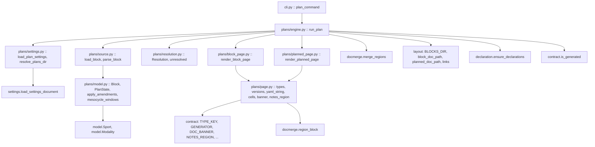
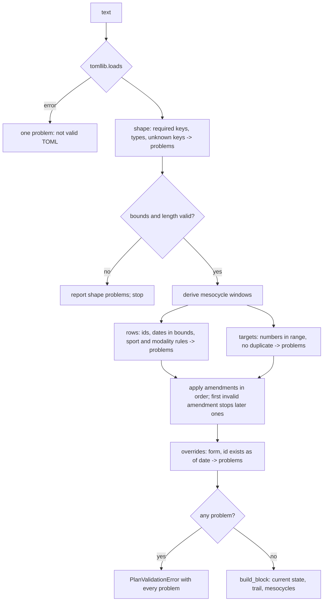

# Technical Design: training-blocks

## Overview

`training-blocks` reads one athlete-authored plan source per training block
from a user-owned directory and renders it into one block page and one
planned-workout page per row inside a new fitdocs-owned directory. The source
states the block's bounds, goal and mesocycle length, an optional target load
and focus per mesocycle, and the planned workouts; changes are appended to it
as dated amendments, and the block page shows the current plan beside the plan
as first written and each supersession. Both page kinds carry a resolution slot
this spec renders as *unresolved*; the next spec fills it.

**Users**: the athlete planning the next block and the LLM curating their
wiki, who today have nowhere in the wiki to state what training *should* do;
and, as consumers of the contract this spec fixes, the `plan-resolution` and
`build-training-block` specs.

**Impact**: adds the first user-authored *content* input fitdocs reads (the
plan source, located by a new `[plans]` settings table), the fourth owned
data-root directory (`blocks/`), the third and fourth document types
(`training-block`, `planned-workout`), the project's first cross-document
links, one command (`fitdocs plan`), and a new top-level package
`fitdocs.plans`. Moves `layout.OWNED_PATHS`, `layout.DECLARED_DIRS`, the
in-tree declaration, the published ownership contract and its version, and
the write-confinement guard in one change, and lands wiki-contract's
Amendment 3. Changes nothing about workout documents, the history page, or any
load value.

### Goals
- A plan-source grammar that is loud about every mistake and never written by
  fitdocs.
- Mesocycles derived from three numbers; amendments applied in order; a
  revision trail that shows what was superseded and by what.
- One block page and one planned page per row, byte-identical for an
  unchanged source, with relative markdown links and no wiki syntax.
- A resolution seam `plan-resolution` fills without touching a renderer.
- The full location ritual: layout, declaration, contract, guard, version.

### Non-Goals
- Matching, load sums, confidence labels, override *application*, chaining
  after `sync`/`drain`/`regen` (`plan-resolution`).
- The packaged skill and the by-name skill locator (`build-training-block`).
- Any judgement about the plan; any structured interval grammar; forecasting;
  per-row targets; macrocycles.
- Auditing `blocks/` from `fitdocs check` (the same non-goal `load-history`
  declared for `history/`; queue item
  `2026-09-10-audit-does-not-scan-history-directory` covers both).
- Writing anything into a workout document, the history page, `athlete.toml`
  or `fitdocs.toml`.

## Boundary Commitments

### This Spec Owns
- The plan-source grammar (fields, vocabulary, amendment and override entry
  forms), its parser, and its validation rules and messages.
- The `Block` model: identity, bounds, goal, mesocycle length, derived
  mesocycles, the plan as first written, the current plan after amendments,
  the revision trail, and the override entries as parsed.
- The two document types, their `type` values, their format versions and
  version keys, their frontmatter key sets and order, and their body
  structure; the block page's `notes` region.
- The `Resolution` seam: its shape, its placement contract, its structural
  invariants, and its *unresolved* default.
- `blocks/` as an owned, declared location; the `blocks/AGENTS.md` text; this
  location's entry in the published contract and the confinement guard; the
  contract-version advance; the user-owned plan-source location's statement
  in the published contract.
- The `[plans]` settings table and its reader.
- The `fitdocs plan` command, the pass it runs, and the run report.

### Out of Boundary
- **`src/fitdocs/contract.py`** -- the document contract leaf. This spec
  imports from it and edits exactly one literal: `CONTRACT_VERSION` (see
  "Shared constant"). It adds no key, no type, no reader, no region there.
- **`src/fitdocs/docmerge.py`** -- the region mechanism. Used as published;
  not changed.
- **`src/fitdocs/render/`** -- `frontmatter.py` (the one YAML emitter),
  `views.py`, `sections.py`, the charts. None is imported; none is changed.
- **`src/fitdocs/history/`, `src/fitdocs/load/`, `src/fitdocs/ingest/`,
  `src/fitdocs/sync.py`, `src/fitdocs/audit.py`** -- not imported, not
  changed. (One history *test* constant moves -- see Modified Files -- because
  it hand-enumerates the declared directories.)
- **Matching logic and its readers** -- no `document_sport`, no
  `document_modality`, no `FORBIDDEN_LITERALS` change, no corpus scan
  (`plan-resolution`).
- **The chaining sites** `cli.py:279-284, 306-309, 385-386` -- untouched;
  `fitdocs plan` is standalone (8.8). `plan-resolution` chains there.
- **Any write to the plan-source directory**, including creating it.

### Allowed Dependencies
- `fitdocs.contract` -- read-only: `CONTRACT_VERSION` (edited, see below),
  `DOC_BANNER`, `FRONTMATTER_FENCE`, `GENERATED_PREFIX`, `GENERATOR`,
  `GENERATOR_KEY`, `TYPE_KEY`, `NOTES_REGION`, `NOTES_PLACEHOLDER`,
  `is_generated`.
- `fitdocs.docmerge` -- `region_block`, `merge_regions`, `RegionError`.
- `fitdocs.model` -- `Sport`, `Modality` (the two enums only; never
  `Activity`).
- `fitdocs.layout` -- the new helpers land there beside the existing ones.
- `fitdocs.declaration` -- `ensure_declarations`, `DECLARATION_FILENAME`.
- `fitdocs.settings` -- `load_settings_document`, `SettingsError`.
- The standard library: `dataclasses`, `datetime`, `enum`, `re`, `math`,
  `os`, `tempfile`, `tomllib`, `pathlib`, `typing`, `collections.abc`.
- **Forbidden**: `fitdocs.ingest`, `fitdocs.load` (all of it),
  `fitdocs.history`, `fitdocs.render` (all of it), `fitdocs.sync`,
  `fitdocs.audit`, `yaml`, and any clock function (`date.today`,
  `datetime.now`, `datetime.utcnow`, `time.time`, `time.monotonic`).

### Revalidation Triggers
- **The plan-source grammar changes** (a key, a vocabulary, an entry form) →
  `build-training-block` re-checks the skill's examples;
  `plan-resolution` re-checks the override form.
- **`Block`, `PlannedWorkout`, `Mesocycle` or `Override` change shape** →
  `plan-resolution` re-checks its matcher and aggregator.
- **The `Resolution` seam changes shape or placement** → `plan-resolution`
  re-checks what it renders where.
- **The planned page's frontmatter keys or either format version change** →
  any reader of the pages (pkm's `wiki-schema.md`, `plan-resolution`)
  re-checks.
- **`OWNED_PATHS` / `DECLARED_DIRS` / the page paths change** →
  `wiki-contract`'s document and conformance test, the declaration goldens,
  the layout pins and the confinement guard move together; `CONTRACT_VERSION`
  advances; `plan-resolution`'s entry point re-checks its `non_vacuous`.
- **`run_plan`'s signature or the resolver hook changes** → `plan-resolution`
  re-checks its chaining call.

#### Cross-spec obligations (training-blocks ↔ wiki-contract)
1. This spec lands the roadmap's Phase 7 Existing Spec Update for
   `wiki-contract` as **Amendment 3**: Requirement 2 gains criteria 2.12 (the
   user-owned plan-source location stated in the shared-and-user-owned
   section, read-only to fitdocs, never created) and 2.13 (the rendered
   location named as fitdocs-owned, holding two further document types
   declared and versioned by this spec); Requirement 3 gains 3.10 (what the
   rendered location's declaration states). No existing criterion is
   renumbered -- the shape Amendments 1 and 2 used.
2. `design.md`'s `DocumentContract` block gains an amendment note naming the
   two new types, their declaration site (`fitdocs.plans.page`) and the reason
   they are not published from the leaf; `spec.json` gains an amendments
   entry.
3. `CONTRACT_VERSION` advances `"3"` → `"4"`. This is the only edit inside
   `src/fitdocs/contract.py`.

#### Cross-spec obligations (training-blocks ↔ plan-resolution) -- the seams, verbatim
1. **The `Resolution` value type** (`src/fitdocs/plans/resolution.py`):
   ```python
   @dataclass(frozen=True)
   class RowResolution:
       cell: str                          # one line of inline markdown; the block table's Resolution column
       section: tuple[str, ...]           # markdown lines under "## Resolution" on the planned page

   @dataclass(frozen=True)
   class MesocycleResolution:
       before_table: tuple[str, ...] = () # lines after the "Target load:" line, before the day table
       after_table: tuple[str, ...] = ()  # lines after the day table

   @dataclass(frozen=True)
   class Resolution:
       rows: Mapping[str, RowResolution]              # keyed by planned-workout id
       mesocycles: Mapping[int, MesocycleResolution]  # keyed by mesocycle number
       block_lines: tuple[str, ...] = ()              # "## Resolution" on the block page, after the mesocycles

   UNRESOLVED_ROW: Final[RowResolution] = RowResolution(
       cell="unresolved",
       section=("Not yet reconciled against logged workouts.",),
   )
   def unresolved() -> Resolution: ...   # Resolution(rows={}, mesocycles={}, block_lines=())
   ```
   A row absent from `rows` renders as `UNRESOLVED_ROW`; a mesocycle absent
   from `mesocycles` renders no extra lines; an empty `block_lines` renders
   no block-level section. `cell` must contain no newline; the renderer
   escapes `|` in it. A key naming an id or number the block lacks is a
   `ValueError` from the renderer, which the engine reports as a per-block
   failure. Links inside any fragment are the caller's to build: **the block
   page lives one level below the data root (`blocks/<id>.md`), a planned
   page two levels below (`blocks/<id>/<row>.md`)**, so a logged workout is
   `../workouts/<stem>.md` from the former and `../../workouts/<stem>.md` from
   the latter. `plan-resolution` adds those two helpers to `layout.py` beside
   this spec's; this spec does not.
2. **The rendered location and its entry point**: `layout.BLOCKS_DIR =
   "blocks"`, `block_doc_path`, `planned_doc_path`; the confinement
   `EntryPoint` id is **`plan`**, `non_vacuous` = "wrote a block page".
   `plan-resolution` registers a second `EntryPoint` (its own id) writing into
   the same location, and chains at the three load-pass sites after the load
   pass.
3. **The hook**: `run_plan(data_root, *, resolve: Callable[[Block],
   Resolution] | None = None) -> PlanReport`. `resolve` is called once per
   *valid* block, after validation and before rendering. `fitdocs plan` in
   this spec passes nothing; after `plan-resolution` it passes that spec's
   resolver. Discovery, validation, the foreign-file rule, the writes, stale
   removal and the report are reused unchanged.
4. **`Block` is the input**: `plan-resolution` reads `Block.current.rows`
   (with `date`, `sport`, `modality: Modality | None`, `indoor: bool |
   None`), `Block.mesocycles` (windows and `target_load`), and
   `Block.overrides` (`date`, `row_id`, `stems`, `skipped`, `reason`) and
   never re-parses the source.
5. **What `plan-resolution` moves in this spec, stated so the implementer
   writes those pins knowing they move.** `plan-resolution` supplies the
   resolver that reads the pass's `today` -- resolved in `cli.py`, never
   under `fitdocs.plans`, so this spec's clock scan (4.4) keeps holding --
   chains the pass after `sync`, `drain` and `regen` following the load
   pass, and makes `fitdocs plan` pass that resolver. Criteria 8.4 and 8.8
   are scoped to admit exactly this, so the chaining itself needs no
   amendment to them. Two of this spec's tests are re-anchored by that spec,
   by exception to the append-only rule: **task 4.3's AST pin** in
   `tests/test_cli_plan.py` (`run_plan` loaded by name exactly once, inside
   `plan_command`) becomes "`run_plan` named nowhere in `cli.py`; that
   spec's pass helper loaded at its four call sites and nowhere else"; and
   **task 4.6's two-dates test** in `tests/test_plan_e2e.py` gains the
   precondition that both fake dates -- each taken as the local date under
   its own (timestamp, `TZ`) pair, because a `TZ` change alone can cross
   midnight -- lie on the same side of every fixture row, since with the
   resolver passed a row's state depends on `today` through the
   not-logged/upcoming split. Nothing else this spec pins moves: the
   block-page forbidden-phrase pin holds over the *default* render, and the
   "default absent directory prints the note" CLI pin stays green because
   that spec prints the plan report in full when `fitdocs plan` runs
   standalone.
6. **The word `indoor` in `sport_phrase`** (PageVocabulary) is deliberately
   the same spelling as the planned page's frontmatter key. `plan-resolution`
   registers that key as `contract.INDOOR_KEY` in the consumer guard's
   forbidden literals, and `plans/page.py` is a registered consumer, so this
   spec emits the display word from one module-level constant,
   `page.INDOOR_WORD = "indoor"` -- the module's only spelling of that word
   outside the planned key tuple; that spec rebinds it through the contract
   constant with one edit to that constant.

#### Shared constant
`src/fitdocs/contract.py`'s `CONTRACT_VERSION` is one string literal, edited
by exactly one task (1.2) from `"3"` to `"4"`. **Precondition, not
assumption**: the task asserts the literal reads `"3"` before editing; any
other value means a peer moved it and the task stops and reports.
`declaration._OWNER_BLOCK` (`declaration.py:287-292`) formats the constant
into every declaration, so the bump and the golden regeneration are one task.

## Architecture

### Existing Architecture Analysis
- **`layout.py` is the pure home of every data-root path** (`:1-34`); its
  history helpers (`:248-278`) are the template; relative links are string
  joins (`:28-33`).
- **`declaration_text` already dispatches explicitly** with no fall-through
  (`declaration.py:379-401`); a fourth branch is an `elif`. Fragments carry a
  `# CLAIM ANCHOR:` comment naming the code that makes them true
  (`:146-147`). `tests/test_declaration.py:196` forbids `each`/`every`/`all
  documents`/`any document` by substring in any line.
- **The document contract leaf declares only the workout type**; the history
  type lives in `history/page.py:75` and the published contract explains why
  (`docs/ownership-contract.md:73-99`). Two more types follow that precedent.
- **The region mechanism is generic** (`docmerge.py:5-12`); `merge_regions`
  is what `sync` uses (`sync.py:186, 1316`).
- **Every per-table settings reader** takes the parsed mapping and a path for
  messages (`history/settings.py:99-101`, `load/settings.py:124-126`);
  `inbox.py:352-363` resolves a configured directory lexically.
- **Every writing engine holds a private atomic write**
  (`history/engine.py:230-249` and four more) and refreshes declarations
  only on a run that reaches its write step (`history/engine.py:400`).
- **The CLI's command shape** is `history_command` (`cli.py:451-478`).

### Architecture Pattern & Boundary Map

Selected pattern: **a pure core with two thin I/O edges** -- one module reads
the source text into a `Block`, one module writes pages, and everything
between is pure functions over frozen dataclasses.



**Architecture Integration**
- Dependency direction: `cli → plans.engine → {plans.settings, plans.source,
  plans.block_page, plans.planned_page} → plans.page → {plans.model,
  plans.resolution} → {fitdocs.contract, fitdocs.docmerge, fitdocs.layout,
  fitdocs.model, fitdocs.declaration, fitdocs.settings}`. `plans.page`
  imports `plans.model` and `plans.resolution` (its shared helpers take a
  `Block`, a `PlannedWorkout` and a `Resolution`); `plans.resolution` and
  `plans.model` import nothing from the package. Nothing under
  `fitdocs.plans` is imported by `fitdocs.load`, `fitdocs.history`,
  `fitdocs.render`, `fitdocs.sync` or `fitdocs.ingest`; a boundary test pins
  the import closure in both directions.
- Domain boundaries: parsing, deriving, rendering and placing are four
  separate concerns in separate modules; the model never sees a `Path`, the
  renderers never see the filesystem, the engine never inspects a source
  field.
- Existing patterns preserved: per-table settings reader; frozen dataclasses;
  the foreign-occupant rule; atomic writes; declaration refresh on the write
  step; the ownership contract's owned-prefix shape; data-root-relative POSIX
  paths in reports.
- Steering compliance: stdlib only; `mypy --strict`; absent is `None`; no
  personal data -- every fixture is a synthetic source under `tests/`.

### Technology Stack

| Layer | Choice / Version | Role in Feature | Notes |
|-------|------------------|-----------------|-------|
| CLI | `typer` (existing) | `fitdocs plan [--out DIR]` | One new command; exit constants reused |
| Source | TOML via `tomllib` (stdlib) | the plan source | Fifth `tomllib` site; no shared helper (task decision) |
| Core | Python 3.11+ stdlib (`dataclasses`, `datetime`, `re`) | model, validation, rendering | no third-party runtime dependency |
| Output | Markdown with hand-emitted frontmatter | both page types | no YAML library; plain ordered lines |
| Config | `fitdocs.toml` `[plans]` | the source directory | own reader; other tables untouched |

## File Structure Plan

### Directory Structure
```
src/fitdocs/
└── plans/                         # new top-level package
    ├── __init__.py                # the published surface (__all__), re-exports only; append-only
    ├── settings.py                # the [plans] table reader; PlanSettings; resolve_plans_dir
    ├── model.py                   # Block, PlanState, PlannedWorkout, MesocycleTarget, Mesocycle,
    │                              #   amendment ops and records, Override, PlanProblem,
    │                              #   IDENTIFIER, mesocycle_windows, apply_amendments, build_block
    ├── source.py                  # parse_block (pure over text) + load_block (the one read);
    │                              #   shape validation; PlanValidationError
    ├── resolution.py              # the seam: RowResolution, MesocycleResolution, Resolution,
    │                              #   UNRESOLVED_ROW, unresolved
    ├── page.py                    # both types' vocabulary; frontmatter emitter (yaml_string);
    │                              #   cell/link-text escaping; weekday tuple; number formatting
    ├── block_page.py              # render_block_page (pure)
    ├── planned_page.py            # render_planned_page (pure)
    └── engine.py                  # discovery, foreign rule, writes, stale removal, report; run_plan
```

### Modified Files
- `src/fitdocs/layout.py` -- adds `BLOCKS_DIR`, `DEFAULT_PLANS_DIR`,
  `PLAN_SOURCE_SUFFIX`, `block_doc_path`, `block_pages_dir`,
  `planned_doc_path`, `planned_rel_link`, `block_rel_link`; extends
  `OWNED_PATHS` with `blocks/` and `DECLARED_DIRS` with `blocks/`; docstring
  lists of directories updated.
- `src/fitdocs/declaration.py` -- a fourth `elif` branch in
  `declaration_text`; three new claim fragments with anchors; the import of
  `BLOCKS_DIR`.
- `src/fitdocs/contract.py` -- **one literal**: `CONTRACT_VERSION` → `"4"`.
- `src/fitdocs/cli.py` -- the `plan` command and `_report_plan`; the module
  docstring's command and exit-code lists.
- `docs/ownership-contract.md` -- version line and "what changed"; `blocks/`
  in Owned Paths; a new section for the two types; the plan-source bullet in
  Shared and User-Owned Files; a read-versus-write sentence in Configured
  Locations (and its stale "no feature names such a location yet" sentence
  corrected); the `fitdocs.toml` bullet's table list; a `plan` bullet in
  Overwrite Semantics; the migration section; the root-instructions section.
- `README.md` -- a `fitdocs plan` paragraph, a `[plans]` key table beside the
  `[inbox]` one, and `blocks/` plus the two types in the Ownership paragraph.
- `pyproject.toml` -- the mypy `files` list gains the four typed test modules
  named under "New test modules"; `src` already covers the package.
- `tests/test_layout.py` -- the exact `OWNED_PATHS` / `DECLARED_DIRS` pins,
  `all_dirs`, the engines-write walk, a `DEFAULT_PLANS_DIR`-is-not-owned pin,
  and the form-pin extension for the two link helpers.
- `tests/test_declaration.py` -- `_OUTSIDE_DECLARED_SET` gains `blocks` and
  `blocks-old/`; the pairwise-distinct test covers four directories
  automatically.
- `tests/test_declaration_goldens.py` -- `_GOLDEN_NAMES` gains the `blocks`
  entry **before** the generator runs; `tests/declaration_golden/blocks.AGENTS.md`
  is new and all four goldens are regenerated (the owner block carries the
  version).
- `tests/test_ownership_contract.py` -- run, and any by-value pin moved.
- `tests/test_confinement.py` -- `plan` registered as a writing entry point.
- `tests/history/test_engine.py` -- **one constant**: `_DECLARATION_PATHS`
  (`:934`), the hand-maintained set of declarations a history run may
  create, excluded from that test's before/after snapshot; a fourth
  declared directory makes a history run create `blocks/AGENTS.md` and the
  snapshot comparison red. Derived from `DECLARED_DIRS` and
  `DECLARATION_FILENAME` so the next declared directory does not repeat
  this. Nothing under `src/fitdocs/history/` changes.
- `tests/test_public_api.py` -- a `_PLANS_SURFACE` pin with owners.
- `tests/test_contract_consumers.py` -- `fitdocs.plans.page` and
  `fitdocs.plans.engine` registered with their bindings.
- `.kiro/specs/wiki-contract/{requirements.md,design.md,spec.json}` --
  Amendment 3 (component `WikiContractSpecUpdate`).
- `.kiro/steering/roadmap.md` -- the Phase 7 `#### Existing Spec Updates`
  `wiki-contract` checkbox ticked (same component).

### New test modules
`tests/plans/{__init__.py,test_model.py,test_source.py,test_settings.py,
test_resolution.py,test_page.py,test_block_page.py,test_planned_page.py,
test_engine.py,test_boundary.py}`; `tests/plans/fixtures/*.toml` (synthetic
sources); `tests/plans/golden/{block.md,planned.md,block-amended.md,...}`;
`tests/test_cli_plan.py`; `tests/test_plan_e2e.py`. Typed under mypy:
`tests/plans/test_model.py`, `tests/plans/test_source.py`,
`tests/plans/test_resolution.py`, `tests/plans/test_boundary.py`.

## System Flows

### The plan pass, end to end

```mermaid
sequenceDiagram
  participant U as athlete
  participant C as cli.plan_command
  participant E as plans.engine.run_plan
  participant S as plans.settings
  participant R as plans.source
  participant X as resolver (default: unresolved)
  participant P as block_page + planned_page
  U->>C: fitdocs plan [--out DIR]
  C->>E: run_plan(data_root)
  E->>S: load_settings_document; load_plan_settings; resolve_plans_dir
  S-->>E: source dir (or PlanSettingsError -> exit 2)
  E->>E: discover <dir>/*.toml, sorted; absent dir -> note or error
  loop per source, sorted
    E->>R: load_block(path, block_id)
    R-->>E: Block, or PlanValidationError (-> outcome invalid)
  end
  E->>E: unsourced scan of blocks/ (report only)
  alt at least one valid block
    E->>E: ensure_declarations(data_root)
  end
  loop per valid block, sorted
    E->>X: resolve(block)
    X-->>E: Resolution
    E->>P: render planned pages, render block page
    E->>E: merge existing notes region (RegionError -> failed)
    E->>E: foreign check on every target path (any -> blocked)
    E->>E: write planned pages (atomic), remove stale generated pages, write block page (atomic)
  end
  E-->>C: PlanReport
  C->>U: per-source outcomes, unsourced paths, note; exit 0/1/2
```

Gating, in order: a malformed `[plans]` table, a source directory resolving to
the root or inside an owned path, or a configured directory that does not
exist fail before anything is read (exit 2). An unconfigured, absent
directory or a directory with no `*.toml` reports a note and writes nothing
(exit 0). Every source is parsed before any write. A block is written only if
valid, not blocked, and its render succeeded; a failure in one block does not
stop the next. Declarations are refreshed once, before the first block write,
only when at least one block is valid.

### How a source becomes a Block



## Requirements Traceability

| Requirement | Summary | Components | Interfaces | Flows |
|-------------|---------|------------|------------|-------|
| 1.1 | one source per block, identity from filename | PlanEngine, SourceParser | `load_block(path, block_id=)` | pass |
| 1.2 | source never written | PlanEngine, ConfinementRegistration | guard, source-bytes pin | pass |
| 1.3 | required top-level fields | SourceParser | grammar table | source |
| 1.4 | optional target and focus, absent is None | SourceParser, PlanModel | `MesocycleTarget` | source |
| 1.5 | rows, any number per day | SourceParser, PlanModel | `PlannedWorkout` | source |
| 1.6 | sport vocabulary = `model.Sport` | SourceParser | `Sport` | source |
| 1.7 | modality only for Workout; indoor optional | SourceParser | `Modality`, `indoor` | source |
| 1.8 | `[plans] path`, default, resolution | PlanSettings | `load_plan_settings`, `resolve_plans_dir` | pass |
| 1.9 | root or owned path → config error | PlanSettings | `PlanSettingsError` | pass gating |
| 1.10 | absent dir: configured → error; default → note | PlanSettings, PlanEngine | `PlanReport.note` | pass gating |
| 2.1 | file, entry, field named | SourceParser | `PlanProblem` | source |
| 2.2 | every independent problem at once | SourceParser, PlanModel | `PlanValidationError.problems` | source |
| 2.3 | bounds, length, empty strings | SourceParser | shape checks | source |
| 2.4 | row date outside bounds | PlanModel | `check_rows` | source |
| 2.5 | sport / modality rules | SourceParser | vocabulary checks | source |
| 2.6 | duplicate id, identifier form, reserved `agents` | SourceParser, PlanModel | `IDENTIFIER`, `RESERVED_BLOCK_IDS` | source |
| 2.7 | title/summary single line | SourceParser | shape checks | source |
| 2.8 | target number range / duplicate | PlanModel | `check_targets` | source |
| 2.9 | amendment reference and field rules | PlanModel | `apply_amendments` | source |
| 2.10 | override form and as-of reference | PlanModel, SourceParser | `check_overrides` | source |
| 2.11 | invalid → nothing rendered, pages untouched | PlanEngine | outcome `invalid` | pass |
| 2.12 | no warnings | SourceParser, PlanEngine | `PlanProblem` only | -- |
| 3.1 | mesocycles derived, last may be short | PlanModel | `mesocycle_windows` | -- |
| 3.2 | row placed by date | PlanModel | `Mesocycle.workouts` | -- |
| 3.3 | amendments dated, ordered, applied | PlanModel | `apply_amendments` | source |
| 3.4 | four change kinds | SourceParser, PlanModel | `UpdateOp`, `AddOp`, `RemoveOp`, `TargetOp` | source |
| 3.5 | non-decreasing amendment dates | PlanModel | `apply_amendments` | source |
| 3.6 | a move keeps identity and re-places | PlanModel, PlannedPage | `RowChanged`, `planned_doc_path` | -- |
| 3.7 | the revision trail | PlanModel, BlockPage | `Amendment`, `Change` | -- |
| 3.8 | overrides parsed and reference-checked only | SourceParser, PlanModel | `Override` | source |
| 3.9 | never edits the source | PlanEngine, PackageBoundary | no write path; guard | pass |
| 4.1 | one block page per valid source | BlockLocation, PlanEngine | `block_doc_path` | pass |
| 4.2 | block frontmatter and banner | PageVocabulary, BlockPage | `BLOCK_FRONTMATTER_KEYS` | -- |
| 4.3 | opening: bounds, goal, length, count | BlockPage | `render_block_page` | -- |
| 4.4 | per-mesocycle section header, focus, target | BlockPage | `Mesocycle` | -- |
| 4.5 | one row per day, rest days, source order | BlockPage | day table | -- |
| 4.6 | row cells: date, sport, title link, summary, resolution | BlockPage, BlockLocation | `planned_rel_link` | -- |
| 4.7 | resolution cell unresolved; no logged info | BlockPage, ResolutionSeam | `UNRESOLVED_ROW` | -- |
| 4.8 | revision record | BlockPage | `Amendment` rendering | -- |
| 4.9 | one `notes` region, carried; damaged → failed | BlockPage, PlanEngine | `region_block`, `merge_regions` | pass |
| 4.10 | relative markdown links, no wiki syntax | BlockLocation, BlockPage | `planned_rel_link` | -- |
| 4.11 | valid markdown; cells single line, escaped | PageVocabulary, BlockPage | `cell()`, `link_text()` | -- |
| 5.1 | one planned page per row, under `blocks/<id>/`, never `workouts/` | BlockLocation, PlanEngine | `planned_doc_path` | pass |
| 5.2 | planned frontmatter | PageVocabulary, PlannedPage | `PLANNED_FRONTMATTER_KEYS` | -- |
| 5.3 | planned body | PlannedPage | `render_planned_page` | -- |
| 5.4 | resolution section unresolved | PlannedPage, ResolutionSeam | `UNRESOLVED_ROW.section` | -- |
| 5.5 | a move keeps the same path | PlanModel, PlanEngine | id-named path | pass |
| 5.6 | removed row's page removed; record says so | PlanEngine, BlockPage | stale removal, `RowRemoved` | pass |
| 5.7 | no region; rewritten in full | PlannedPage, PlanEngine | -- | pass |
| 6.1 | default resolution: unresolved everywhere | ResolutionSeam | `unresolved()` | -- |
| 6.2 | a supplied value renders into the same slots | ResolutionSeam, BlockPage, PlannedPage | `Resolution` | -- |
| 6.3 | unknown id/number or multi-line cell → failure | BlockPage, PlannedPage, PlanEngine | `ValueError` → `failed` | pass |
| 6.4 | the parsed block is exposed | PlanModel, SurfacePins | `Block`, `__all__` | -- |
| 7.1 | owned location declared in the same change | BlockLocation | `OWNED_PATHS` | -- |
| 7.2 | contract, declaration, guard | BlockLocation, BlockDeclaration, OwnershipDocs, ConfinementRegistration | `DECLARED_DIRS` | -- |
| 7.3 | contract states the source location | OwnershipDocs | -- | -- |
| 7.4 | contract states the two types and the region | OwnershipDocs | -- | -- |
| 7.5 | contract version advances | BlockDeclaration, OwnershipDocs | `CONTRACT_VERSION` | -- |
| 7.6 | declaration text | BlockDeclaration | fragments | -- |
| 7.7 | writes only inside owned paths; negative half | ConfinementRegistration, PackageBoundary | guard | pass |
| 7.8 | foreign occupant → blocked | PlanEngine | `_is_foreign_occupant` | pass |
| 7.9 | stale generated removed; foreign left and reported | PlanEngine | stale removal | pass |
| 7.10 | unsourced pages reported, kept | PlanEngine | `PlanReport.unsourced` | pass |
| 8.1 | every source, fixed order | PlanEngine | sorted discovery | pass |
| 8.2 | data-root precedence | PlanCommand | `_resolved_data_root` | pass |
| 8.3 | own table; malformed → config error | PlanSettings, PlanCommand | `PlanSettingsError` | pass gating |
| 8.4 | byte-identical with the default resolution; the package reads no clock | PackageBoundary, PlanEngine | clock scan; e2e two-dates test (re-anchored by `plan-resolution`) | pass |
| 8.5 | unchanged blocks write nothing | PlanEngine | byte comparison | pass |
| 8.6 | the run report | PlanEngine, PlanCommand | `PlanReport`, `_report_plan` | pass |
| 8.7 | planned pages before block page; per-block isolation | PlanEngine | write order | pass |
| 8.8 | not chained by this spec; `plan-resolution` chains after `sync`/`drain`/`regen` | PlanCommand | AST pin (re-anchored by `plan-resolution`) | -- |
| 8.9 | exit codes | PlanCommand | `_finish`, `_config_error` | pass |
| 8.10 | declarations refreshed only with a valid block | PlanEngine | `ensure_declarations` gate | pass |

## Components and Interfaces

| Component | Domain/Layer | Intent | Req Coverage | Key Dependencies (P0/P1) | Contracts |
|-----------|--------------|--------|--------------|--------------------------|-----------|
| BlockLocation | Layout | The owned prefix, the source default, the path and link helpers | 4.1, 4.6, 4.10, 5.1, 7.1, 7.2 | -- | State, Service |
| BlockDeclaration | Layout | The `blocks/AGENTS.md` text; the version bump | 7.2, 7.5, 7.6 | BlockLocation (P0) | Service |
| OwnershipDocs | Docs | The published contract and the README | 7.2-7.5 | BlockLocation (P0) | State |
| WikiContractSpecUpdate | Spec | Amendment 3 | 7.2-7.5 | BlockLocation (P0) | State |
| PlanSettings | Config | `[plans] path` reader and resolution | 1.8, 1.9, 1.10, 8.3 | `fitdocs.settings`, `layout` (P0) | Service, State |
| PlanModel | Core | Types, derivation, amendment application, reference rules | 1.4, 1.5, 2.2, 2.4, 2.6, 2.8-2.10, 3.1-3.8, 6.4 | `model.Sport/Modality` (P0) | State, Service |
| SourceParser | Read | Text → `Block`; shape validation; the one read | 1.1, 1.3-1.7, 2.1-2.3, 2.5-2.7, 2.10, 2.12, 3.4, 3.8 | PlanModel (P0), `tomllib` (P0) | Service |
| ResolutionSeam | Core | The seam and its default | 4.7, 5.4, 6.1, 6.2 | -- | State |
| PageVocabulary | Render | Types, versions, key orders, frontmatter emitter, escaping | 4.2, 4.11, 5.2 | `contract` (P0) | State, Service |
| BlockPage | Render | The block page | 3.7, 4.2-4.11, 5.6, 6.2, 6.3 | PageVocabulary, PlanModel, ResolutionSeam (P0) | Service |
| PlannedPage | Render | The planned page | 3.6, 5.2-5.4, 5.7, 6.2, 6.3 | PageVocabulary, PlanModel, ResolutionSeam (P0) | Service |
| PlanEngine | Pass | Discovery, resolver hook, writes, stale removal, report | 1.1, 1.2, 1.10, 2.11, 3.9, 4.1, 4.9, 5.1, 5.5-5.7, 6.3, 7.8-7.10, 8.1, 8.4-8.7, 8.10 | all of the above (P0), `declaration`, `docmerge` (P0) | Service, Batch |
| PlanCommand | CLI | `fitdocs plan` and its report | 8.2, 8.3, 8.6, 8.8, 8.9 | PlanEngine (P0) | Service |
| ConfinementRegistration | Guard | The `plan` entry point | 1.2, 7.2, 7.7 | PlanEngine (P0) | -- |
| PackageBoundary, SurfacePins | Guard | Import closure both ways, clock scan, `__all__` pin, consumer registration | 3.9, 6.4, 7.7, 8.4 | package (P0) | -- |

### Layout and Ownership

#### BlockLocation (`src/fitdocs/layout.py`)

| Field | Detail |
|-------|--------|
| Intent | Name the rendered location and the source default once; let every guard read them |
| Requirements | 4.1, 4.6, 4.10, 5.1, 7.1, 7.2 |

**Responsibilities & Constraints**
- Adds one prefix to `OWNED_PATHS` (`blocks/`) and one directory to
  `DECLARED_DIRS` (`blocks/`). No fixed subdirectory constant: a block's
  page directory is named by the block, so the parent prefix covers it and no
  new pair joins the allowed-nestings set.
- `DEFAULT_PLANS_DIR = "plans"` is **not** in `OWNED_PATHS`, exactly as
  `DEFAULT_INBOX_DIR` is not (`layout.py:311-318`); a pin says so.
- No I/O. The two link helpers return POSIX strings built by string joins.
- Invariant: `BLOCKS_DIR` is not a prefix of, and is not prefixed by, any
  existing owned path; `DECLARED_DIRS ⊂ OWNED_PATHS`.

**Contracts**: State [x] / Service [x]
```python
BLOCKS_DIR: Final[str] = "blocks"
DEFAULT_PLANS_DIR: Final[str] = "plans"          # not owned; located by [plans] path
PLAN_SOURCE_SUFFIX: Final[str] = ".toml"

OWNED_PATHS: Final[tuple[str, ...]] = (
    f"{WORKOUTS_DIR}/", f"{WORKOUTS_DIR}/{ASSETS_SUBDIR}/",
    f"{HISTORY_DIR}/", f"{HISTORY_DIR}/{HISTORY_ASSETS_SUBDIR}/",
    f"{BLOCKS_DIR}/",
    f"{ARCHIVE_DIR}/", f"{CACHE_DIR}/", f"{TOOL_STATE_DIR}/",
)
DECLARED_DIRS: Final[tuple[str, ...]] = (
    f"{WORKOUTS_DIR}/", f"{HISTORY_DIR}/", f"{BLOCKS_DIR}/", f"{ARCHIVE_DIR}/",
)

def block_doc_path(data_root: Path, block_id: str) -> Path: ...        # <root>/blocks/<id>.md
def block_pages_dir(data_root: Path, block_id: str) -> Path: ...       # <root>/blocks/<id>/
def planned_doc_path(data_root: Path, block_id: str, row_id: str) -> Path: ...  # <root>/blocks/<id>/<row>.md
def planned_rel_link(block_id: str, row_id: str) -> str: ...           # "<id>/<row>.md"  (from the block page)
def block_rel_link(block_id: str) -> str: ...                          # "../<id>.md"     (from a planned page)
```
- Postconditions: `block_doc_path(root, b).parent / planned_rel_link(b, r)
  == planned_doc_path(root, b, r)`; `planned_doc_path(root, b, r).parent /
  block_rel_link(b)` normalises to `block_doc_path(root, b)`.

**Implementation Notes**
- Integration: `tests/test_layout.py:537-545` (exact tuple), `:548`
  (`all_dirs`), `:563-588` (engines-write walk gains both page helpers and
  both round trips), `:670` (`DECLARED_DIRS`), a new "default plans dir is
  not owned" pin modelled on `:639-644`. `tests/test_confinement.py`'s
  permitted set reads `OWNED_PATHS` and widens automatically.
- Named mutations: drop `blocks/` from `OWNED_PATHS` (the tuple pin and the
  engines-write walk red); put `blocks/` in `DECLARED_DIRS` only (the subset
  pin reds); drop the block directory from `planned_rel_link` (the
  round-trip postcondition reds); drop the `..` step from `block_rel_link`
  (its round trip reds). The plain-string-join rule is pinned by extending
  `tests/test_layout.py:734-790`'s form pin to the two link helpers (no
  `Path(`/`PurePath(`/`os.` in either helper's source; the `f"{block_id}/`
  and `"../` tokens present), because on POSIX a `pathlib`/`posixpath`
  rewrite produces the identical string and only a form pin can catch it;
  named mutation: `str(PurePosixPath(block_id) / f"{row_id}.md")`.
- Risks: an existing data root may already hold a user's `blocks/`. Handled
  by PlanEngine's foreign and unsourced rules, not here.

#### BlockDeclaration (`src/fitdocs/declaration.py`, `src/fitdocs/contract.py` one literal)

| Field | Detail |
|-------|--------|
| Intent | The `blocks/AGENTS.md` text; the contract-version advance |
| Requirements | 7.2, 7.5, 7.6 |

**Responsibilities & Constraints**
- `declaration_text` gains a fourth `elif directory == BLOCKS_DIR + "/"`
  branch with heading `Generated Training Blocks` and body
  `(_WRITTEN_AND_OWNED, _BLOCKS_CONTENT, _BLOCKS_NOTES, _BLOCKS_RERUNNABLE)`.
  The existing `else: raise ValueError` stays the only fall-through.
- Three new fragments, each followed by a `# CLAIM ANCHOR:` comment naming
  the code that makes it true, and each written around
  `tests/test_declaration.py:196`'s substring guard (no `each`, `every`,
  `all documents`, `any document` -- and therefore no `reach`, `everything`):
  - `_BLOCKS_CONTENT`: "This directory holds generated training-block pages
    and, in a subdirectory named after its block, the planned-workout pages
    that block links to, rendered from the athlete's plan sources whenever
    `fitdocs plan` runs." Anchor: `layout.block_doc_path`,
    `layout.planned_doc_path`, `plans.engine.run_plan`.
  - `_BLOCKS_NOTES`: "A block page carries one user-owned region, `notes`,
    whose content is carried over verbatim on rerender; a planned-workout
    page carries no user-owned region and is rewritten in full." Anchor:
    `plans.page.notes_region` (the one `region_block` call, made by
    `plans.block_page` alone), `plans.engine` (`merge_regions` on the block
    page only), `plans.planned_page` (never calls `notes_region`).
  - `_BLOCKS_RERUNNABLE`: "The pages are re-derivable from the plan sources
    alone: deleting them costs only a re-run of `fitdocs plan`. The plan
    sources live outside this directory, in the athlete's plan directory,
    and fitdocs never writes there." Anchor: `plans.engine` has no write
    path under the resolved source directory; `plans.settings.resolve_plans_dir`
    refuses an owned location; `tests/test_confinement.py`'s `plan` entry.
- **Advances `contract.CONTRACT_VERSION` to `"4"`** after asserting it reads
  `"3"`. `_OWNER_BLOCK` formats it into every declaration, so all four
  goldens are regenerated by the module's own generator
  (`uv run python -m tests.test_declaration_goldens`) after `_GOLDEN_NAMES`
  gains `f"{BLOCKS_DIR}/": "blocks"` -- without that entry the generator and
  the parameterised test raise `KeyError` (queue item
  `2026-09-10-declared-dir-enumerations-hand-maintained`).
- `_OUTSIDE_DECLARED_SET` (`tests/test_declaration.py:160-164`) gains
  `"blocks"` and `"blocks-old/"` so the no-fall-through claim is pinned for
  the new prefix's near-misses too.

**Contracts**: Service [x]
```python
def declaration_text(directory: str) -> str: ...   # unchanged signature; four members of DECLARED_DIRS
```

**Implementation Notes**
- Validation: four goldens exist and match; the `blocks/` text names the
  `notes` region and no other region id; a directory outside the declared
  set raises; the pairwise-distinct assertion over `DECLARED_DIRS` now spans
  four; the quantifier guard passes over the new text; the refresh path
  rewrites a stale declaration and leaves a foreign one alone.
- Named mutations: route `blocks/` through the `history/` branch (the blocks
  golden comes back with history prose and reds); leave the version at `"3"`
  (all four goldens red); write "every block page" in a fragment (the
  quantifier guard reds).

#### OwnershipDocs (`docs/ownership-contract.md`, `README.md`)

| Field | Detail |
|-------|--------|
| Intent | Publish the owned location, the user-owned source location, and the two document types |
| Requirements | 7.2, 7.3, 7.4, 7.5 |

**Responsibilities & Constraints**
- Version line `4`; the "what changed at this version" preamble names the new
  owned path, the fourth declared directory, the two further document types,
  and -- new in kind -- a user-owned plan-source location fitdocs only reads.
- Owned Paths gains `blocks/` with one sentence (block pages at the top
  level, planned-workout pages in a subdirectory per block).
- A new section after "A Second Document Type: Training History", titled
  "Two Further Document Types: Training Blocks and Planned Workouts": the
  `type` values, the version keys (`block_version`, `planned_version`, plain
  integers, `1` today), that both are published by `fitdocs.plans.page`
  rather than by the document contract and why (the same reason as the
  history type); that the block page carries **one** user-owned region,
  `notes`, preserved by the same mechanism as a workout document's, and that
  the "User-Owned and Tool-Filled Regions" section's list describes workout
  documents and is not widened; that the planned page carries no user-owned
  region and is rewritten in full; that a removed row's page is deleted on
  the next run; that a file without the provenance marking at a page's path
  blocks that block; and that a page with no source is reported and kept.
- Shared and User-Owned Files gains a fourth bullet, the **plan-source
  directory**: user-owned, read-only to fitdocs, never created, written,
  renamed or deleted; located by `[plans] path` in `fitdocs.toml`, default
  `plans/`; must not be the data root or lie inside an owned path (a
  configuration error otherwise); the sources are the athlete's content and
  their revision history.
- Configured Locations gains one sentence distinguishing a configured *read*
  location (`[plans] path`, which grants nothing) from a configured *write*
  location, and its stale "No fitdocs feature names such a location yet"
  sentence is corrected to name the inbox (queue item
  `2026-09-12-ownership-contract-prose-stale-and-unpinned`, partially).
- The `fitdocs.toml` bullet's "`[tiles]` today" is replaced by the live table
  list -- `[tiles]`, `[inbox]`, `[plugins]`, `[load]`, `[history]`, `[plans]`
  -- keeping its read-only statement (absorbs queue item
  `2026-09-10-ownership-contract-fitdocs-toml-tables-stale`).
- Overwrite Semantics gains a `plan` bullet; Document-Format Versions gains
  the two version keys; the root-instructions section names
  `blocks/AGENTS.md`.
- `README.md`: a numbered paragraph for `fitdocs plan` beside the `history`
  one, a `[plans]` key table beside the `[inbox]` one (`path`: default
  `plans`; absolute used as given, relative against the data root; **never
  created**; must be outside the owned paths), and the Ownership paragraph
  extended with `blocks/`, the two types, the `notes` region on a block page,
  and the fourth `AGENTS.md`.

**Contracts**: State [x]

**Implementation Notes**
- Integration: `tests/test_ownership_contract.py:81-91` holds the version
  line and the Owned Paths set equal to the code -- both move with 1.1 and
  1.2; `tests/test_docs_guarantees.py`'s anchor-link check requires every
  intra-document link to resolve. `tests/test_ownership_contract.py:125-128`
  keeps checking the regions section against `PRESERVED_REGIONS`, which is
  why the block page's region is described in the new section and not there.
- Named mutation: add `blocks/` to `OWNED_PATHS` without the document (the
  conformance test reds).

### Configuration

#### PlanSettings (`src/fitdocs/plans/settings.py`)

| Field | Detail |
|-------|--------|
| Intent | The one reader for `fitdocs.toml`'s `[plans]` table, and the source-directory resolution |
| Requirements | 1.8, 1.9, 1.10, 8.3 |

**Responsibilities & Constraints**
- Peer of `load_history_settings`: receives the parsed mapping and the
  settings path (for messages), validates only its own table, ignores unknown
  keys (the file is shared), never opens a file.
- `path` is a non-empty string or absent; `bool` and other types rejected.
  Kept verbatim; `None` means "unconfigured".
- `resolve_plans_dir` is lexical (`os.path.normpath` over the join, no I/O):
  absolute used as given, relative against the data root; raises
  `PlanSettingsError` naming the file, the key and the resolved path when the
  result equals the data root or lies inside any `OWNED_PATHS` prefix.
  Existence is **not** checked here -- that is the engine's, because the
  absent-directory rule depends on whether the key was configured.

**Contracts**: Service [x] / State [x]
```python
PLANS_TABLE: Final[str] = "plans"

@dataclass(frozen=True)
class PlanSettings:
    path: str | None = None        # None -> DEFAULT_PLANS_DIR, unconfigured

DEFAULT_PLAN_SETTINGS: Final[PlanSettings] = PlanSettings()

class PlanSettingsError(SettingsError): ...

def load_plan_settings(document: Mapping[str, object], settings_file: Path) -> PlanSettings: ...
def resolve_plans_dir(data_root: Path, settings: PlanSettings, settings_file: Path) -> Path: ...
```
- Postconditions: `load_plan_settings({}, f) is DEFAULT_PLAN_SETTINGS`;
  `resolve_plans_dir(root, DEFAULT_PLAN_SETTINGS, f) == root / "plans"`.

**Implementation Notes**
- Validation: absent file, absent table, empty table, `path` valid relative,
  valid absolute, non-string, empty, `bool`; unknown key ignored; `path =
  "."`, `"blocks"`, `"blocks/x"`, `"workouts"`, `".fitdocs"`, `"../x/../data"`
  (normalises to the root) each raise naming the key.
- Named mutations: skip the owned-prefix check (`"blocks"` passes); compare
  with `startswith` on the string instead of a path-component test
  (`"blocks-mine"` is wrongly refused -- a pin says `"blocks-mine"` is
  accepted); accept `bool`.

### Core

#### PlanModel (`src/fitdocs/plans/model.py`)

| Field | Detail |
|-------|--------|
| Intent | The typed plan, its derivations, and every reference rule -- pure |
| Requirements | 1.4, 1.5, 2.2, 2.4, 2.6, 2.8, 2.9, 2.10, 3.1-3.8, 6.4 |

**Responsibilities & Constraints**
- Pure; no `Path`, no clock, no I/O, no TOML. Imports `Sport` and `Modality`
  from `fitdocs.model` and `DECLARATION_FILENAME` from `fitdocs.declaration`
  (for the reserved id), and nothing else from the package.
- **Identifiers**: `IDENTIFIER = re.compile(r"[a-z0-9][a-z0-9-]*")`,
  `fullmatch`. `RESERVED_BLOCK_IDS = frozenset({"agents"})` compared
  case-insensitively against a block id (macOS: `blocks/agents.md` *is*
  `blocks/AGENTS.md`); derived from `declaration.DECLARATION_FILENAME`'s
  stem at import, never a second `"agents"` literal.
- **Mesocycles**: `mesocycle_windows(starts, ends, length)` yields
  `(number, first, last)` with `first = starts + (n-1)*length`, `last =
  min(first + length - 1, ends)`; count `= ceil(days / length)`; the last may
  be short. `mesocycle_of(day)` is arithmetic, never a search.
- **Rows and targets**: `check_rows` reports a date outside `[starts, ends]`
  by id; `check_targets` reports a number outside `1..count` and a duplicate
  number.
- **Amendments**: `apply_amendments(original, specs, *, starts, ends, count)`
  applies each `AmendmentSpec` in order to a `PlanState`. Per operation:
  `UpdateOp` -- the id must exist in the current state, `fields` must be
  non-empty and every key in `MUTABLE_FIELDS = ("date", "sport", "modality",
  "indoor", "title", "summary", "prescription")`, and the resulting row must
  satisfy the same rules as an original row (date in bounds; modality only
  with `Workout`); `AddOp` -- the id must never have been used in the block's
  history (current, removed, or original); `RemoveOp` -- the id must exist in
  the current state; `TargetOp` -- the number in range, and at least one of
  `target_load`/`focus` present. A `TargetOp` naming a number for which the
  current state holds no target (no original `[[mesocycle]]` entry and no
  earlier `TargetOp`) is **valid**: `before` is the synthesised
  `MesocycleTarget(number, None, None)` -- rendered `(unset)` -- the
  resulting state gains that target, keeping `targets` ascending, and a
  field the op does not state keeps its current value (`None` when unset).
  Each valid operation yields a `Change` record with before/after; an
  invalid one yields a `PlanProblem`. An
  amendment with any invalid operation stops application: later amendments
  are not applied and one problem says "amendment[k+1..n] not checked".
  Dates must be non-decreasing in file order (a problem names the
  amendment). Returns the state after each amendment, so overrides can be
  checked as of a date.
- **Overrides**: `check_overrides(states, amendments, overrides)` -- an
  override's `row_id` must exist in the state after applying every amendment
  dated `<= override.date` (original rows exist from the start). Nothing
  else about an override is judged here.
- `build_block(...)` assembles `Block` with `current`, the trail and the
  mesocycles (each mesocycle's `workouts` are the current rows in its window,
  ordered by date then by position in `current.rows` -- source order within a
  day, added rows after original ones).

**Contracts**: State [x] / Service [x]
```python
IDENTIFIER: Final[re.Pattern[str]]
RESERVED_BLOCK_IDS: Final[frozenset[str]]
MUTABLE_FIELDS: Final[tuple[str, ...]]

@dataclass(frozen=True)
class PlannedWorkout:
    id: str
    date: date
    sport: Sport
    modality: Modality | None      # None = not stated (allowed only when sport is Sport.WORKOUT)
    indoor: bool | None            # None = not stated
    title: str                     # single line
    summary: str                   # single line
    prescription: str              # may span lines

@dataclass(frozen=True)
class MesocycleTarget:
    number: int
    target_load: float | None      # > 0 and finite when present
    focus: str | None

@dataclass(frozen=True)
class PlanState:
    rows: tuple[PlannedWorkout, ...]        # insertion order; ids unique
    targets: tuple[MesocycleTarget, ...]    # ascending number; numbers unique
    def row(self, row_id: str) -> PlannedWorkout | None: ...
    def target(self, number: int) -> MesocycleTarget | None: ...

@dataclass(frozen=True)
class Mesocycle:
    number: int
    starts: date
    ends: date
    nominal_days: int
    target_load: float | None
    focus: str | None
    workouts: tuple[PlannedWorkout, ...]    # date-ordered; source order within a day
    @property
    def days(self) -> int: ...
    @property
    def is_short(self) -> bool: ...          # days < nominal_days

# operations as the source states them
@dataclass(frozen=True)
class UpdateOp:  row_id: str; fields: Mapping[str, object]   # keys in MUTABLE_FIELDS, values already typed
@dataclass(frozen=True)
class AddOp:     row: PlannedWorkout
@dataclass(frozen=True)
class RemoveOp:  row_id: str
@dataclass(frozen=True)
class TargetOp:  number: int; target_load: float | None; focus: str | None
AmendmentOp = UpdateOp | AddOp | RemoveOp | TargetOp

@dataclass(frozen=True)
class AmendmentSpec:
    date: date
    reason: str
    ops: tuple[AmendmentOp, ...]

# the trail
@dataclass(frozen=True)
class RowChanged:    before: PlannedWorkout; after: PlannedWorkout
@dataclass(frozen=True)
class RowAdded:      row: PlannedWorkout
@dataclass(frozen=True)
class RowRemoved:    row: PlannedWorkout
@dataclass(frozen=True)
class TargetChanged: number: int; before: MesocycleTarget; after: MesocycleTarget
    # before is MesocycleTarget(number, None, None) when the number had no stated target
Change = RowChanged | RowAdded | RowRemoved | TargetChanged

@dataclass(frozen=True)
class Amendment:
    ordinal: int                   # 1-based, file order
    date: date
    reason: str
    changes: tuple[Change, ...]

@dataclass(frozen=True)
class Override:
    date: date
    row_id: str
    stems: tuple[str, ...]         # empty iff skipped
    skipped: bool
    reason: str | None

@dataclass(frozen=True)
class PlanProblem:
    entry: str                     # "workout[2] (id w1-thu)", "amendment[1].update[0]", "mesocycle[1]", "file", ...
    field: str | None
    message: str
    def describe(self) -> str: ... # "workout[2] (id w1-thu) / date: 2026-12-20 is outside 2026-09-21..2026-12-13"

@dataclass(frozen=True)
class Block:
    id: str
    title: str
    starts: date
    ends: date
    goal: str
    mesocycle_days: int
    original: PlanState
    current: PlanState
    amendments: tuple[Amendment, ...]
    overrides: tuple[Override, ...]
    mesocycles: tuple[Mesocycle, ...]
    @property
    def days(self) -> int: ...
    def mesocycle_of(self, day: date) -> int: ...

def mesocycle_windows(starts: date, ends: date, length: int) -> tuple[tuple[int, date, date], ...]: ...
def check_rows(rows: Sequence[PlannedWorkout], *, starts: date, ends: date, entry: str) -> tuple[PlanProblem, ...]: ...
def check_targets(targets: Sequence[MesocycleTarget], *, count: int) -> tuple[PlanProblem, ...]: ...
def apply_amendments(
    original: PlanState, specs: Sequence[AmendmentSpec], *, starts: date, ends: date, count: int
) -> tuple[tuple[PlanState, ...], tuple[Amendment, ...], tuple[PlanProblem, ...]]: ...
def check_overrides(
    states: Sequence[PlanState], amendments: Sequence[Amendment], overrides: Sequence[Override]
) -> tuple[PlanProblem, ...]: ...
def build_block(*, id: str, title: str, starts: date, ends: date, goal: str, mesocycle_days: int,
                original: PlanState, current: PlanState, amendments: Sequence[Amendment],
                overrides: Sequence[Override]) -> Block: ...
```
- Preconditions: `starts <= ends`; `length >= 1`; rows and targets already
  shape-valid (typed values).
- Postconditions: `sum(len(m.workouts) for m in mesocycles) ==
  len(current.rows)`; every window is contiguous with the next; the last
  window ends on `ends`; `states[0] is original` and `states[-1]` is the
  current state when no problem was found; `apply_amendments` with no specs
  returns `(original,)`, `()`, `()`.
- Invariants: pure; deterministic; no `PlannedWorkout` is ever mutated -- an
  update produces a new instance via `dataclasses.replace`.

**Implementation Notes**
- Validation (`tests/plans/test_model.py`, one headed section per rule):
  windows for an exact multiple and for a short last window; a one-day block;
  `length > days` (one short window); `mesocycle_of` at both edges of a
  boundary; a row on `ends` (in) and `ends + 1` (out); a move across a
  boundary changing the mesocycle; each amendment rule with a fixture that
  violates it and a sibling that satisfies it; the stop rule (a later
  amendment referencing a row the failed one would have added yields the
  "not checked" problem, not a spurious unknown-id one); an override dated
  before the amendment that adds its row (problem) and on the same day
  (valid); non-decreasing dates with an equal pair (valid) and a descending
  pair (problem); ids unique across history (remove then add the same id is
  a problem); `agents` / `AGENTS` reserved; `MUTABLE_FIELDS` rejects `id`;
  a `TargetOp` on a mesocycle with no stated target (valid; `before ==
  MesocycleTarget(n, None, None)` and the state gains the target).
- Named mutations: use `<` instead of `<=` for the window's last day (the
  row-on-`ends` fixture reds); compute the count with floor division (the
  short-window fixture reds); let `AddOp` reuse a removed id (the history
  pin reds); check override existence against the *final* state instead of
  the as-of state (the before-add fixture reds); continue applying after an
  invalid amendment (the "not checked" pin reds); order a day's rows by id
  (the source-order fixture, with ids in reverse alphabetical order, reds);
  reject a `TargetOp` on an untargeted mesocycle (its pin reds).

#### SourceParser (`src/fitdocs/plans/source.py`)

| Field | Detail |
|-------|--------|
| Intent | The plan-source grammar: text in, `Block` or every problem out; the one file read |
| Requirements | 1.1, 1.3-1.7, 2.1-2.3, 2.5-2.7, 2.10, 2.12, 3.4, 3.8 |

**Responsibilities & Constraints**
- `parse_block(text, *, block_id)` is pure over text. `load_block(path, *,
  block_id)` reads bytes, decodes UTF-8, and delegates; an `OSError` or
  `UnicodeDecodeError` is one problem (`entry="file"`), a
  `tomllib.TOMLDecodeError` is one problem carrying the decoder's message.
  This is the package's only file read and the fifth `tomllib` site in the
  repository; no shared helper is introduced (brief: a task decision).
- **Shape validation** collects problems across the whole document; the
  three structural faults (not a table at the top level; `starts`/`ends`
  missing or not dates or `ends < starts`; `mesocycle_days` missing or not an
  `int >= 1`) are reported and parsing **stops**, because every later rule
  needs the bounds. `bool` is rejected wherever a number is expected. A date
  must be a bare TOML date (`datetime.date`), never a `datetime` and never a
  quoted string; the message says "write it unquoted, as YYYY-MM-DD". Unknown
  keys at every level are problems naming the key. Strings: `title`,
  `summary`, `reason`, `focus`, `id`, `stems[i]` single line (no `\n`),
  non-empty after stripping; `goal` and `prescription` may span lines;
  `\r\n` normalised to `\n`; any other control character (except `\t`) is a
  problem naming the field.
- **Vocabulary**: `sport` must equal a `Sport` value exactly (`"Run"`, not
  `"run"`; the message lists the seven); `modality` allowed only when `sport
  == Sport.WORKOUT.value` and must equal a `Modality` value; `indoor` a
  `bool`; `target_load` an `int`/`float`, finite, `> 0`, converted to
  `float`.
- **Identifiers**: `block_id` and every `id` must `fullmatch` `IDENTIFIER`;
  `block_id` must not be reserved; duplicate `id`s among original rows are
  problems naming both entries.
- **Entries are named positionally and by id**: `workout[2] (id w1-thu)`,
  `mesocycle[0]`, `amendment[1]`, `amendment[1].update[0] (id w1-thu)`,
  `amendment[1].add[0]`, `override[0] (id w1-thu)`; the file name is the
  engine's to prepend.
- After shape validation, delegates to `PlanModel` (`check_rows`,
  `check_targets`, `apply_amendments`, `check_overrides`), merges the
  problems, and raises `PlanValidationError` if any; otherwise `build_block`.
- Spells no `"---"`, no `"workout"` (uses `Sport.WORKOUT`), imports no YAML.

**Plan-Source Grammar** (the contract `build-training-block` teaches):

| Key | Type | Required | Rule |
|-----|------|----------|------|
| `title` | string | yes | single line, non-empty |
| `starts`, `ends` | date | yes | bare TOML dates; `ends >= starts` |
| `goal` | string | yes | non-empty; may span lines |
| `mesocycle_days` | integer | yes | `>= 1` |
| `[[mesocycle]]` `number` | integer | yes | `1..count`, unique |
| `[[mesocycle]]` `target_load` | number | no | finite, `> 0` |
| `[[mesocycle]]` `focus` | string | no | single line, non-empty |
| `[[workout]]` `id` | string | yes | `[a-z0-9][a-z0-9-]*`, unique in the block's history |
| `[[workout]]` `date` | date | yes | inside `[starts, ends]` |
| `[[workout]]` `sport` | string | yes | one of `Run`, `Ride`, `Swim`, `Walk`, `Hike`, `Rowing`, `Workout` |
| `[[workout]]` `modality` | string | no | only with `sport = "Workout"`; one of `run`, `bike`, `swim`, `strength`, `other` |
| `[[workout]]` `indoor` | boolean | no | |
| `[[workout]]` `title`, `summary` | string | yes | single line, non-empty |
| `[[workout]]` `prescription` | string | yes | non-empty; may span lines |
| `[[amendment]]` `date`, `reason` | date, string | yes | dates non-decreasing in file order |
| `[[amendment.update]]` | table | | `id` + one or more of `date`, `sport`, `modality`, `indoor`, `title`, `summary`, `prescription` |
| `[[amendment.add]]` | table | | a complete `[[workout]]` row |
| `[[amendment.remove]]` | table | | `id` |
| `[[amendment.mesocycle]]` | table | | `number` + one or both of `target_load`, `focus`; the number need not have an original `[[mesocycle]]` entry (an unstated target is superseded as absent) |
| `[[override]]` `date`, `id` | date, string | yes | `id` must exist as of `date` |
| `[[override]]` `stems` | array of strings | one of | non-empty, distinct, single-line entries |
| `[[override]]` `skipped` | boolean | one of | must be `true` when present; exclusive with `stems` |
| `[[override]]` `reason` | string | no | single line |

Any key not in this table, at any level, is a problem.

**Contracts**: Service [x]
```python
class PlanValidationError(Exception):
    problems: tuple[PlanProblem, ...]      # never empty

def parse_block(text: str, *, block_id: str) -> Block: ...   # raises PlanValidationError
def load_block(path: Path, *, block_id: str) -> Block: ...   # raises PlanValidationError; the one read
```
- Postconditions: a returned `Block` satisfies every rule in this table and
  in PlanModel; `PlanValidationError.problems` is in document order (shape
  problems first, then rows, targets, amendments, overrides) and never empty.

**Implementation Notes**
- Validation (`tests/plans/test_source.py` with `tests/plans/fixtures/`):
  the minimal valid source; a full source exercising every optional key and
  carrying exactly the properties both renderer goldens need (a short last
  mesocycle, a rest day, a two-workout day whose ids sort opposite to source
  order, a `Workout (strength, indoor)` row with a three-line prescription,
  a `|` in a summary, a `]` in a title, a multi-line goal, one targeted and
  one untargeted mesocycle, two amendments covering all four change kinds
  including a cross-boundary move and a prescription change) -- the renderer
  tests load this fixture through the parser and add none of their own; one
  fixture per rule in the table that violates it, asserting the problem's
  entry, field and a message fragment; the multi-problem fixture (three
  independent faults → three problems in document order); the structural
  stop (`ends < starts` plus a bad row → one problem, not two); a quoted
  date; a datetime; `bool` for `mesocycle_days`; an unknown key at the top,
  in a workout, in an amendment and in an override; CRLF in a prescription
  normalised; a control character rejected; `load_block` over a missing
  file, a non-UTF-8 file and a non-TOML file.
- Named mutations: accept `"run"` for `sport` (the case fixture reds); allow
  `modality` with `Run` (its fixture reds); ignore unknown keys (the
  unknown-key fixtures red); report only the first problem (the
  three-problem fixture reds); accept a quoted date (its fixture reds).

#### ResolutionSeam (`src/fitdocs/plans/resolution.py`)

| Field | Detail |
|-------|--------|
| Intent | The value the renderers take beside the `Block`, and its unresolved default |
| Requirements | 4.7, 5.4, 6.1, 6.2 |

**Responsibilities & Constraints**
- Exactly the shape in "Cross-spec obligations (training-blocks ↔
  plan-resolution)" above. Holds no rendering logic and no downstream
  vocabulary: `UNRESOLVED_ROW` is the only value it defines the words of.
- `unresolved()` returns a fresh `Resolution` with empty mappings; it is the
  engine's default.
- Frozen dataclasses over `Mapping`; callers pass plain dicts. Not hashable;
  never used as a key.

**Contracts**: State [x] (see the seam block above for the definitions)

**Implementation Notes**
- Validation (`tests/plans/test_resolution.py`): `unresolved().rows == {}`
  and `.mesocycles == {}`; `UNRESOLVED_ROW.cell == "unresolved"`; the
  section is one line; a `Resolution` built by a caller round-trips through
  both renderers into the stated slots (the placement test lives with the
  renderers).
- Named mutation: change `UNRESOLVED_ROW.cell` to `"pending"` (the block
  golden reds).

### Render

#### PageVocabulary (`src/fitdocs/plans/page.py`)

| Field | Detail |
|-------|--------|
| Intent | Both types' vocabulary, the frontmatter emitter, and the escaping helpers -- shared by the two renderers |
| Requirements | 4.2, 4.11, 5.2 |

**Responsibilities & Constraints**
- Declares `BLOCK_TYPE = "training-block"`, `BLOCK_VERSION = 1`,
  `BLOCK_VERSION_KEY = "block_version"`, `BLOCK_FRONTMATTER_KEYS`, and the
  planned equivalents
  `PLANNED_TYPE = "planned-workout"`, `PLANNED_VERSION = 1`,
  `PLANNED_VERSION_KEY = "planned_version"`, `PLANNED_FRONTMATTER_KEYS`.
  Tests assert the two types differ from each other, from
  `contract.WORKOUT_TYPE`, and from `"training-history"` (spelled in the test
  only).
- Shared vocabulary -- the fence, `TYPE_KEY`, `GENERATOR_KEY`, `GENERATOR`,
  `DOC_BANNER`, `NOTES_REGION`, `NOTES_PLACEHOLDER` -- is imported from
  `contract`, never re-spelled. **This module and `engine.py` are the
  package's only importers of `fitdocs.contract`**: the two renderers reach
  the banner through `page.banner()` and the notes region through
  `page.notes_region()` (which composes `docmerge.region_block` over the
  contract's region id and placeholder), so they bind no contract name and
  the consumer-guard registration stays at two modules (the lesson recorded
  in `load-history`'s Implementation Notes, where `page.py` turned out to be
  a second importer). The boundary test pins this.
- **Frontmatter is plain ordered lines, never a YAML library.** One
  `yaml_string(value, *, field)` helper: rejects any character that is
  neither printable nor `\n`/`\t` with `ValueError` naming the field;
  escapes `\`, `"`, `\n` → `\n`, `\t` → `\t`; wraps in double quotes. **Every
  string value is quoted, always** -- there is no bare-token path (the
  bare-token defect class, queue item
  `2026-09-12-history-methodology-id-bare-token-yaml-typed`, cannot recur).
  Integers bare; booleans `true`/`false`; dates `yaml_string(d.isoformat())`
  so `contract.document_date` reads a planned page's `date`. A `None` value
  omits the key.
- **Key orders**:
  - block: `title`, `type`, `generator`, `block_version`, `block`, `starts`,
    `ends`, `goal`, `mesocycle_days`.
  - planned: `title`, `type`, `generator`, `planned_version`, `block`,
    `planned_id`, `mesocycle`, `date`, `sport`, `modality` (when stated),
    `indoor` (when `True`; `False` and `None` omit).
- Helpers: `cell(text)` escapes `|` as `\|`; `link_text(text)` additionally
  escapes `[` and `]`; both raise on a newline (a programming error -- the
  parser already forbade it). `WEEKDAYS = ("Mon", ..., "Sun")` indexed by
  `date.weekday()`. `format_load(value)`: integral → integer text, else one
  decimal. `format_day(d)` → `"Tue 2026-09-22"`.
- **Three helpers both renderers share, so the two parallel renderer tasks
  neither add to this module nor duplicate each other**:
  `check_resolution(block, resolution)` raises `ValueError` naming the
  offender for a row key that is not a current row id, a mesocycle key
  outside `1..len(block.mesocycles)`, or a `cell` containing a newline;
  `is_fence_line(line)` is true exactly for a line equal to
  `contract.FRONTMATTER_FENCE` (so a planned page refuses a fence in a
  resolution section without importing a contract name);
  `sport_phrase(row)` is the sport value alone or followed by a
  parenthesised, comma-joined list of the stated modality and the word
  `indoor` when the flag is true -- `Run`, `Workout (strength)`,
  `Ride (indoor)`, `Workout (strength, indoor)`. The display word `indoor`
  is deliberately the same spelling as the planned page's frontmatter key;
  emit it from one module-level constant, `INDOOR_WORD: Final[str] =
  "indoor"` -- the module's only spelling of that word outside the planned
  key tuple -- because `plan-resolution` registers that key as
  `contract.INDOOR_KEY` among the consumer guard's forbidden literals (this
  module is a registered consumer) and rebinds the word through the
  contract constant with one edit to `INDOOR_WORD`. For the same reason the
  four planned-page keys `date`, `sport`, `modality` and `indoor` are each
  spelled once in this module's key tuples and taken from there by the
  renderers, never re-spelled.

**Contracts**: State [x] / Service [x]
```python
BLOCK_TYPE: Final[str] = "training-block"
BLOCK_VERSION: Final[int] = 1
BLOCK_VERSION_KEY: Final[str] = "block_version"
BLOCK_FRONTMATTER_KEYS: Final[tuple[str, ...]]
PLANNED_TYPE: Final[str] = "planned-workout"
PLANNED_VERSION: Final[int] = 1
PLANNED_VERSION_KEY: Final[str] = "planned_version"
PLANNED_FRONTMATTER_KEYS: Final[tuple[str, ...]]
WEEKDAYS: Final[tuple[str, ...]]
INDOOR_WORD: Final[str] = "indoor"   # the sport_phrase display word; plan-resolution rebinds it to contract.INDOOR_KEY

def yaml_string(value: str, *, field: str) -> str: ...
def frontmatter(pairs: Sequence[tuple[str, str | int | bool | None]]) -> str: ...   # fence, lines, fence
def banner() -> str: ...          # contract.DOC_BANNER
def notes_region() -> str: ...    # region_block(NOTES_REGION, NOTES_PLACEHOLDER)
def check_resolution(block: Block, resolution: Resolution) -> None: ...   # ValueError naming the offender
def is_fence_line(line: str) -> bool: ...
def sport_phrase(row: PlannedWorkout) -> str: ...
def cell(text: str) -> str: ...
def link_text(text: str) -> str: ...
def format_day(day: date) -> str: ...
def format_load(value: float) -> str: ...
```
- Postconditions: `contract.parse_frontmatter(frontmatter(pairs))` returns
  every non-`None` pair with `str` for every string (including the tokens
  `1991`, `true`, `null`, `2024-01-01`, `0x1F`, `1_000`), `int` for every
  int, `bool` for every bool; keys in the given order.

**Implementation Notes**
- Validation (`tests/plans/test_page.py`): the round trip above; the
  multi-line `goal` round trip; a `\r` rejected; `cell("a|b") == "a\\|b"`;
  `link_text("[x]") == "\\[x\\]"`; `format_load(1200.0) == "1200"`,
  `format_load(1234.56) == "1234.6"`; `WEEKDAYS[date(2026, 9, 22).weekday()]
  == "Tue"`; the two key tuples pinned by value; `check_resolution` for an
  unknown id, an unknown number, a multi-line cell and a valid value;
  `is_fence_line` for the fence, the fence with trailing text (false) and
  an ordinary line; `sport_phrase` for all four shapes.
- Named mutations: emit a token bare when it matches `[A-Za-z0-9_.-]+` (the
  `true`/`1991` round trip reds); use `strftime("%a")` for the weekday (a
  locale pin that switches the process locale through
  `locale.setlocale(LC_TIME, ...)` inside a try/finally, skipping when the
  locale is not installed, reds -- an environment variable alone does not
  change `strftime`); leave `|` unescaped (the cell pin reds); skip the
  mesocycle-range check (its pin reds); make `is_fence_line` a prefix match
  (the trailing-text pin reds); drop `indoor` from the phrase (its pin
  reds).

#### BlockPage (`src/fitdocs/plans/block_page.py`)

| Field | Detail |
|-------|--------|
| Intent | The block page, deterministically, from `(Block, Resolution)` |
| Requirements | 3.7, 4.2-4.11, 5.6, 6.2, 6.3 |

**Responsibilities & Constraints**
- Pure: `render_block_page(block, resolution) -> str`. No `Path`, no clock,
  no I/O, no filesystem knowledge beyond `layout.planned_rel_link`. Imports
  neither `fitdocs.contract` nor `fitdocs.docmerge` -- the banner and the
  region come from `page.py`.
- Validates the resolution first through `page.check_resolution` (every
  key of `resolution.rows` a current row id, every key of
  `resolution.mesocycles` in `1..len(block.mesocycles)`, every `cell`
  single-line, else `ValueError` naming the offender).
- **Sections, in order**, joined by blank lines:
  1. frontmatter (PageVocabulary key order; `goal` verbatim with escapes).
  2. `contract.DOC_BANNER` on its own line.
  3. `# {title}`.
  4. `page.notes_region()` -- bare, right after the H1, exactly where a
     workout document places it; the only region on the page. The engine
     replaces the placeholder with the existing page's region body via
     `merge_regions`.
  5. The summary lines: `Starts: YYYY-MM-DD`, `Ends: YYYY-MM-DD (N days)`,
     `Mesocycle length: L days (M mesocycles; the last is K days)` -- the
     parenthetical states the last mesocycle's actual length always, so a
     short one is visible without a second clause.
  6. `### Goal` followed by the goal verbatim.
  7. Per mesocycle: `## Mesocycle n -- YYYY-MM-DD to YYYY-MM-DD (K days)`,
     with ` -- shorter than the stated L` appended when `is_short`; `Focus:
     ...` when stated; `Target load: 1200` or `Target load: none`; then
     `resolution.mesocycles[n].before_table` lines; then the day table:
     `| Day | Sport | Planned | Summary | Resolution |` with one row per
     calendar day in the window -- a rest day `| Tue 2026-09-22 | | _rest_ |
     | |`, a workout `| Mon 2026-09-21 | Run | [Easy run](fall/w1-mon.md) |
     8 km easy | unresolved |` (the sport cell is `page.sport_phrase(row)`),
     several workouts on a day
     as several rows repeating the day cell, in `Mesocycle.workouts` order;
     then `after_table` lines.
  8. `## Resolution` with `resolution.block_lines`, only when non-empty.
  9. `## Revision record`: `### As first written` -- a table `| Id | Date |
     Sport | Title | Summary |` over `block.original.rows` in source order
     (or `No planned workouts as first written.`), then `Mesocycle targets
     as first written: 1: 1200 (aerobic base); 2: none; 3: none` (or the
     sentence `No mesocycle targets as first written.`); then per amendment
     `### Amendment k -- YYYY-MM-DD`, `Reason: ...`, and one bullet per
     change: `- \`id\`: date 2026-09-22 -> 2026-09-23; title "Track" -> "Track
     (short)"` (single-line fields inline, strings double-quoted, an unset
     value as `(unset)`); a multi-line field as `- \`id\`: prescription
     changed` with nested `- was:` / `- now:` blockquotes; `- Added \`id\` --
     YYYY-MM-DD, Run, "Title" -- summary`; `- Removed \`id\` -- YYYY-MM-DD,
     Run, "Title"`; `- Mesocycle 2: target load 1200 -> 1100` / `focus
     (unset) -> "sharpen"` (a mesocycle with no stated target before the
     amendment renders `target load (unset) -> 650`). With no amendments:
     `No amendments.`
- Renders **no** logged-workout information and no word of the downstream
  vocabulary: a forbidden-phrase pin (`matched`, `skipped`, `upcoming`,
  `not logged`, `load_value`) holds over the default render.
- Every table cell passes through `cell()`; every link text through
  `link_text()`; `->` is ASCII.

**Contracts**: Service [x]
```python
def render_block_page(block: Block, resolution: Resolution) -> str: ...
```
- Postconditions: opens with the fence; carries `DOC_BANNER` outside every
  region; exactly one `begin:notes`/`end:notes` pair; byte-identical for
  equal inputs; the day tables together cover every date from `starts` to
  `ends` exactly once (rest rows plus workout rows, counting a multi-workout
  day once).

**Implementation Notes**
- Validation (`tests/plans/test_block_page.py` + `tests/plans/golden/`): a
  golden for a synthetic block with a short last mesocycle, a rest day, a
  two-workout day, a `Workout (strength, indoor)` row, a `|` in a summary, a
  `]` in a title, a multi-line goal, one target and one untargeted
  mesocycle, and two amendments covering all four change kinds including a
  cross-boundary move and a prescription change; a second golden for a block
  with no amendments and no rows (all rest days, `No planned workouts as
  first written.`); the date-coverage postcondition asserted over the golden
  block; a placement test rendering a caller-built `Resolution` and asserting
  each fragment lands in its slot and nowhere else; `ValueError` for an
  unknown row id, an unknown mesocycle number and a multi-line cell; the
  forbidden-phrase pin; byte-equality across two calls.
- Named mutations: sort a day's rows by id (the golden, whose two-workout
  day has ids in reverse order, reds); drop the rest rows (the coverage
  postcondition reds); render the target as `0` when absent (the golden
  reds); place `after_table` before the table (the placement test reds);
  skip the `ValueError` for an unknown id (that test reds).

#### PlannedPage (`src/fitdocs/plans/planned_page.py`)

| Field | Detail |
|-------|--------|
| Intent | One planned-workout page from `(Block, PlannedWorkout, Resolution)` |
| Requirements | 3.6, 5.2, 5.3, 5.4, 5.7, 6.2, 6.3 |

**Responsibilities & Constraints**
- Pure: `render_planned_page(block, row, resolution) -> str`; the mesocycle
  number is `block.mesocycle_of(row.date)`. Imports no `docmerge`: the page
  has no region.
- Validates the resolution through `page.check_resolution`, and rejects a
  `section` line for which `page.is_fence_line` is true.
- **Sections, in order**: frontmatter (planned key order); `DOC_BANNER`;
  `# {title}`; `Planned for Tue 2026-09-22 -- Run -- mesocycle 1 of
  [Fall marathon build](../fall-marathon.md).` (the sport phrase is
  `page.sport_phrase(row)`, the same text the block table shows);
  `_{summary}_`; `## Prescription` with the prescription
  verbatim; `## Resolution` with `resolution.rows.get(row.id,
  UNRESOLVED_ROW).section` lines.
- The link back is `layout.block_rel_link(block.id)`; the title inside it
  passes through `link_text()`.

**Contracts**: Service [x]
```python
def render_planned_page(block: Block, row: PlannedWorkout, resolution: Resolution) -> str: ...
```
- Postconditions: the frontmatter's `date` reads back through
  `contract.document_date` as `row.date`; `mesocycle` is the number whose
  window contains `row.date`; no region marker appears anywhere on the page;
  byte-identical for equal inputs.

**Implementation Notes**
- Validation (`tests/plans/test_planned_page.py` + golden): a golden for a
  `Workout (strength, indoor)` row with a three-line prescription; a `Run`
  row asserting `modality` and `indoor` keys are absent; the `document_date`
  round trip; the mesocycle number for a row moved across a boundary
  (rendered from the amended block); a caller-built section landing under
  `## Resolution`; the no-region postcondition; `ValueError` for an unknown
  id.
- Named mutations: emit `indoor: false` (the `Run` pin reds); take the
  mesocycle number from the original row's date instead of the current one
  (the moved-row test reds); write the prescription through `cell()` (a
  prescription containing `|` reds).

### Pass and CLI

#### PlanEngine (`src/fitdocs/plans/engine.py`)

| Field | Detail |
|-------|--------|
| Intent | Discovery, the resolver hook, the foreign rule, the writes, stale removal, and the report |
| Requirements | 1.1, 1.2, 1.10, 2.11, 3.9, 4.1, 4.9, 5.1, 5.5-5.7, 6.3, 7.8-7.10, 8.1, 8.4-8.7, 8.10 |

**Responsibilities & Constraints**
- The package's only writer. Reads `fitdocs.toml` once through
  `settings.load_settings_document`, projects `[plans]`, resolves the source
  directory. **Existence rule**: directory absent and `settings.path is
  None` → `note`, nothing else happens (exit 0); absent and configured →
  `PlanSettingsError` (exit 2). Present but not a directory → `PlanSettingsError`.
- **Discovery**: top-level `*.toml` files in the source directory (no
  recursion; symlinks refused as foreign sources, reported as `invalid` with
  one problem), sorted by name; `block_id = path.stem`. Reads `athlete.toml`
  or `fitdocs.toml` only if the athlete put them in the source directory,
  which `resolve_plans_dir` already prevents for the root.
- **Every source is parsed before any write.** Each yields a `Block` or a
  `PlanValidationError` → outcome `invalid` with `problems` (the source path
  prepended by the report printer, not baked into `PlanProblem`).
- **Unsourced scan**: `blocks/*.md` other than `AGENTS.md` whose stem has
  no source, and `blocks/<dir>/` whose name has no source, are listed in
  `PlanReport.unsourced` and never touched.
- **Declarations**: `ensure_declarations(data_root)` once, before the first
  block write, only when at least one block is valid; `FOREIGN` outcomes
  land in `PlanReport.declarations_foreign`. It iterates every
  `DECLARED_DIRS` entry, so a plan run may create `workouts/AGENTS.md`,
  `history/AGENTS.md` and `fit-archive/AGENTS.md` -- inside the owned set,
  not a violation, and stated here so the confinement task's negative half
  is phrased precisely.
- **Per valid block, in order**: `resolution = resolve(block)` (default
  `unresolved()`); render every planned page and the block page (a
  `ValueError` from a renderer → `failed` with its message); read the
  existing block page if present and generated, `merge_regions(fresh,
  existing)` (a `RegionError` → `failed`, page untouched); **foreign check**
  over the block page path, the pages directory (must be absent or a real
  directory), and every planned page path with `_is_foreign_occupant`
  (symlink → foreign; unreadable / not UTF-8 / a directory where a file
  belongs → foreign; absent → not foreign; present → `not
  contract.is_generated(text)`) -- one foreign → `blocked` with the paths,
  nothing written or removed; **byte comparison** -- if every target's
  current bytes equal the fresh bytes and no stale page exists → `unchanged`,
  nothing written; else **write**: `mkdir` the pages directory when the
  block has rows, write each planned page whose bytes differ (atomic,
  `.plans-` temp prefix, `os.replace`), remove every generated `*.md` in the
  pages directory that is not a current row's page (a non-generated one is
  left and listed in `foreign` without blocking), then write the block page
  (atomic) last. An `OSError` on any step → `failed` with `(path, reason)`;
  steps after the failure for that block are skipped; the next block
  proceeds.
- Takes no `today`, calls no clock, and has no code path that writes under
  the resolved source directory.
- Paths in the report are data-root-relative POSIX when inside the root,
  absolute POSIX otherwise (a source directory may be outside the root).

**Contracts**: Service [x] / Batch [x]
```python
class BlockStatus(StrEnum):
    RENDERED = "rendered"; UNCHANGED = "unchanged"; INVALID = "invalid"; BLOCKED = "blocked"; FAILED = "failed"

@dataclass(frozen=True)
class BlockOutcome:
    source: str                          # the source file, as a report path
    block_id: str                        # the stem, even when invalid
    status: BlockStatus
    written: tuple[str, ...]             # report paths, in write order
    removed: tuple[str, ...]
    problems: tuple[PlanProblem, ...]    # invalid
    foreign: tuple[str, ...]             # blocked (target paths) or left-alone files in the pages directory
    failures: tuple[tuple[str, str], ...]  # (path or "render", reason)

@dataclass(frozen=True)
class PlanReport:
    source_dir: str
    blocks: tuple[BlockOutcome, ...]     # source order
    unsourced: tuple[str, ...]
    declarations_foreign: tuple[str, ...]
    note: str | None                     # "no plan source directory at ..." / "no plan sources under ..."
    @property
    def failed(self) -> bool: ...        # any INVALID, BLOCKED or FAILED

Resolver = Callable[[Block], Resolution]

def run_plan(data_root: Path, *, resolve: Resolver | None = None) -> PlanReport: ...
```
- Preconditions: `data_root` exists (the CLI resolved it).
- Postconditions: two runs over an unchanged root write byte-identical files
  and the second reports every block `unchanged`; the set of `*.md` files
  under `blocks/<id>/` after a successful run equals the current row ids
  plus any non-generated files that were already there; the bytes of every
  file under the source directory are unchanged by any run.
- Idempotency: guaranteed by the byte comparison and the atomic writes.

**Implementation Notes**
- Validation (`tests/plans/test_engine.py`, synthetic roots under
  `tmp_path`): the rendered/unchanged pair; an invalid source beside a valid
  one (the valid one is rendered, the invalid one's pre-existing pages are
  untouched byte for byte); a foreign block page and a foreign planned page
  (blocked, nothing written, nothing removed); a stale generated planned page
  removed and a foreign `.md` in the directory kept and listed; an unsourced
  page and directory reported and kept; a damaged notes region (`failed`,
  untouched); a notes body carried verbatim across a source change; the
  absent-directory pair (default → note; configured → error); a symlinked
  source file; a read-only pages directory (`failed`, no partial file, the
  next block still rendered); declarations refreshed only when a valid
  block exists (an all-invalid run creates no `AGENTS.md`); the resolver
  hook called once per valid block with the parsed `Block`;
  `blocks/AGENTS.md` never listed as unsourced on a second run; source
  bytes unchanged after every scenario (a hash before and after).
- Named mutations: write the block page before the planned pages (a
  torn-state test that fails the second planned write reds); skip the
  foreign check for planned pages (the foreign-planned fixture reds); remove
  non-generated stale files (the kept-foreign pin reds); refresh
  declarations on the all-invalid run (its pin reds); report `rendered`
  even when every target's bytes are equal (the `unchanged` status pin
  reds); drop the `AGENTS.md` exclusion from the unsourced scan (the
  second-run pin reds).

#### PlanCommand (`src/fitdocs/cli.py`)

| Field | Detail |
|-------|--------|
| Intent | `fitdocs plan` |
| Requirements | 8.2, 8.3, 8.6, 8.8, 8.9 |

**Responsibilities & Constraints**
- One command, `plan`, with `--out` only (no `--force`, no `--dry-run`: the
  pages are always rebuilt and unchanged ones are detected by bytes).
- Shape of `history_command` (`cli.py:451-478`): `_resolved_data_root`,
  `run_plan` inside `except SettingsError` → `_config_error` (exit 2),
  `_report_plan`, `_finish(failed=report.failed)` (exit 1).
- `_report_plan` prints: the source directory; one line per block --
  `rendered  <source> -> <block page> (+n planned, -m removed)`, `unchanged
  <source>`, `invalid   <source>` followed by one indented `describe()` line
  per problem, `blocked   <source>: <path>` per foreign path, `failed
  <source>: <path>: <reason>`; then `No source: <path>` per unsourced entry;
  then `Declaration not placed (foreign): <path>`; then the note. Every
  detail line with `markup=False, highlight=False, soft_wrap=True`.
- `sync`, `regen`, `load`, `history` are unchanged by this spec (8.8); an
  AST pin in the style of `tests/test_cli_history.py:660` asserts `run_plan`
  is loaded by name exactly once, inside `plan_command`. The pin is written
  knowing it moves: `plan-resolution` re-anchors it when it chains the pass
  and makes `plan_command` pass its resolver (Cross-spec obligations
  (training-blocks ↔ plan-resolution), item 5).
- The module docstring's command list and exit-code paragraph gain `plan`.

**Contracts**: Service [x]
```python
@app.command("plan")
def plan_command(out: Path | None = _OUT_OPTION) -> None: ...
```

**Implementation Notes**
- Validation (`tests/test_cli_plan.py`, `CliRunner`): no data root → exit 2
  naming the three ways to give one; success prints every outcome line and
  the counts; an invalid source → exit 1 with each problem line printed
  verbatim; a malformed `[plans]` (`path = true`) → exit 2 and no `blocks/`;
  a configured absent directory → exit 2; the default absent directory →
  exit 0 with the note; a blocked block → exit 1 naming the path; `plan`
  appears in `--help`; the parameter set is exactly `{"out"}`; the AST pin.
- Named mutations: map a `PlanSettingsError` to exit 1 (the config test
  reds); call `run_plan` from `sync_command` (the AST pin reds); return exit
  0 when a block is invalid (the invalid test reds).

### Guards

#### WikiContractSpecUpdate (`.kiro/specs/wiki-contract/{requirements.md,design.md,spec.json}`, `.kiro/steering/roadmap.md` one checkbox)

| Field | Detail |
|-------|--------|
| Intent | Land Amendment 3 |
| Requirements | 7.2, 7.3, 7.4, 7.5 |

**Responsibilities & Constraints**
- `requirements.md` gains `## Amendment 3 (2026-09-15): a user-owned
  plan-source location, the blocks location and two further document types,
  landed by training-blocks` in the shape of Amendments 1 and 2; Requirement
  2 gains 2.12 and 2.13, Requirement 3 gains 3.10, each tagged `_(added by
  Amendment 3)_`; nothing renumbered.
- `design.md`'s `DocumentContract` block gains an amendment note in the shape
  of the `load-history` note (`design.md:421`), and its "owned-path set"
  bullet (`:37`) gains a `blocks/` clause plus a sentence that a configured
  read location grants no write right.
- `spec.json` gains an amendments entry.
- The roadmap's Phase 7 `#### Existing Spec Updates` `wiki-contract`
  checkbox is ticked with "landed by training-blocks as Amendment 3", the
  way `build-training-block`'s 3.3 ticks the `distribution` one.

**Contracts**: State [x]

**Implementation Notes**
- Validation: `/kiro-spec-status wiki-contract` clean with the entry present;
  the roadmap checkbox reads `[x]`.
- Risks: none -- no peer spec in this batch amends `wiki-contract`
  (`plan-resolution` amends it only if its design adds a back-link key, and
  that would be a fourth amendment appended after this one).

#### ConfinementRegistration (`tests/test_confinement.py`)

| Field | Detail |
|-------|--------|
| Intent | The plan pass is a registered writing entry point |
| Requirements | 1.2, 7.2, 7.7 |

**Responsibilities & Constraints**
- Appends `EntryPoint(id="plan", prepare=_stage_plan_source,
  run=_run_plan, non_vacuous=_wrote_a_block_page)`; `prepare` writes one
  small valid source under `<data_root>/plans/` (the default location, so no
  `[plans]` table and no `SETTINGS_LOCATION_KEYS` entry are needed -- the
  guard measures writes, and this pass never writes there). The permitted
  set reads `OWNED_PATHS` and already contains `blocks/`.
- **The negative half, stated precisely**: after the run, the source file's
  bytes are unchanged and no file was created, modified or deleted under
  `plans/`; no `workouts/*.md`, no `history/*.md`, no `athlete.toml`, no
  `fitdocs.toml`. The `AGENTS.md` files in the other declared directories are
  deliberately **excluded** from the claim: the declaration refresh may
  create them (see PlanEngine).
- `tests/test_effort_tags_e2e.py:503-515` subset-checks the ids and does not
  move; `plan` contains neither `effort` nor `tags`.

#### PackageBoundary and SurfacePins (`tests/plans/test_boundary.py`, `tests/test_public_api.py`, `tests/test_contract_consumers.py`, `pyproject.toml`)

| Field | Detail |
|-------|--------|
| Intent | The import closure in both directions, the clock scan, the published surface, the consumer registration, and the typed test modules |
| Requirements | 3.9, 6.4, 7.7, 8.4 |

**Responsibilities & Constraints**
- **Import closure** (the `tests/history/test_boundary.py` shape, adopted):
  a hand-maintained module list checked against the package directory in
  both directions; per-module allowed import targets pinned by equality;
  forbidden targets by name -- `fitdocs.ingest`, `fitdocs.load`,
  `fitdocs.history`, `fitdocs.render`, `fitdocs.sync`, `fitdocs.audit`,
  `yaml` -- matched by equality or dotted descent, including `from X import y`
  alias forms.
- **Clock scan**: the five spellings, code and docstrings, over every module
  under the package.
- **Reverse reachability**: no module under `src/fitdocs/load/`,
  `src/fitdocs/ingest/`, `src/fitdocs/history/`, nor `render/views.py`,
  `sync.py` or `audit.py`, imports `fitdocs.plans` in any form (the
  `tests/history/test_boundary.py:588-705` scanner, with its synthetic
  controls, adapted); relative imports resolved against the enclosing
  package; the bare `fitdocs` namespace excluded from any allowance (the
  peer warning recorded in `load-history`'s Implementation Notes).
- **No source write path**: an AST scan asserting no module under the package
  names `write_text`, `write_bytes`, `open(..., "w")`, `os.replace`,
  `unlink`, `rmdir`, `rename` or `mkdir` **except** `plans/engine.py`, and that
  `plans/engine.py` composes every write path from `layout.block_doc_path`,
  `layout.planned_doc_path`, `layout.block_pages_dir` or
  `declaration.ensure_declarations` -- never from the resolved source
  directory. Positive control: a synthetic module with a stray `write_text`
  is caught.
- **Surface pin**: `_PLANS_SURFACE` in `tests/test_public_api.py` pins
  `fitdocs.plans.__all__` exactly with an owner map and the identity
  assertion, and asserts nothing from it is re-exported from the package
  root. `src/fitdocs/plans/__init__.py` is **append-only** across tasks; the
  final list is pinned once.
- **Consumer registration**: `fitdocs.plans.page` (bindings: exactly the
  contract names it from-imports -- `DOC_BANNER`, `FRONTMATTER_FENCE`,
  `GENERATOR`, `GENERATOR_KEY`, `TYPE_KEY`, `NOTES_REGION`,
  `NOTES_PLACEHOLDER`) and `fitdocs.plans.engine` (`is_generated`) join
  `CONVERTED_MODULES` and `CONTRACT_BINDINGS`; the structural assertions (no
  YAML, no bare fence, no bare `"workout"`, no private duplicate reader)
  then apply. `region_block` and `merge_regions` are imported from
  `fitdocs.docmerge`, not through `contract`'s re-export, so they are not
  bindings. The import-closure pin is what keeps the registration at two:
  a third module importing `fitdocs.contract` reds the boundary test before
  it can slip past the consumer guard unregistered.
- **mypy**: `tests/plans/test_model.py`, `test_source.py`,
  `test_resolution.py`, `test_boundary.py` join `pyproject.toml`'s `files`
  list; `src` already covers the package.

## Data Models

### Domain Model
- **Block** -- the aggregate root: identity, bounds, goal, length, the plan
  as first written (`original`), the current plan (`current`), the trail
  (`amendments`), the overrides, and the derived mesocycles. Immutable;
  rebuilt from text on every run; never stored.
- **PlanState** -- rows and targets at one point in the block's history. The
  trail is a sequence of states; the page renders the first and the last and
  the differences between consecutive ones.
- **PlannedWorkout** -- identity is `id`; everything else may be amended.
- **Mesocycle** -- a derived window with its target and its rows; never
  stored in the source.
- **Amendment / Change** -- the trail's unit; each `Change` carries before and
  after so the renderer never re-derives a diff.
- **Override** -- parsed and reference-checked here; interpreted downstream.
- **Resolution** -- a placement value; the renderer's second input.

### Logical Data Model
- `Block.mesocycles[i].number == i + 1`; windows are contiguous and cover
  `[starts, ends]` exactly; `Block.mesocycle_of(row.date)` is defined for
  every current row.
- `PlanState.rows` ids are unique; across the trail, an id appears in at most
  one `RowAdded` and at most one `RowRemoved`, and never in an add after a
  remove.
- `PlannedWorkout.modality is not None ⟹ sport is Sport.WORKOUT`.
- `MesocycleTarget.target_load` is `None` or finite and `> 0`.
- `Override.skipped ⟺ not stems`.
- Temporal: the pages carry `block_version` / `planned_version` (`1`); they
  are rewritten in full; nothing is migrated between runs. The source has no
  version key in v1; a later grammar change adds one and this spec's parser
  treats its absence as v1.

### Data Contracts & Integration
- **Inbound**: `<plans dir>/<id>.toml` -- the grammar table above.
  `fitdocs.toml` `[plans]` -- `path`.
- **Outbound**: `blocks/<id>.md` (type `training-block`, keys in
  PageVocabulary order); `blocks/<id>/<row>.md` (type `planned-workout`);
  `blocks/AGENTS.md`.
- **Seam**: `Block`, `Resolution`, `run_plan(resolve=)`, the two page depths.

## Error Handling

### Error Strategy
Three classes, one exit code each. Configuration faults fail before anything
is read. Per-block faults never stop the run -- they become outcomes, because
one broken source must not cost the athlete every other block -- but they do
make the run exit 1, because a block the athlete asked for was not rendered.
No warnings exist.

### Error Categories and Responses
- **Configuration (exit 2)** -- unresolvable data root; malformed `[plans]`;
  a source directory resolving to the root or into an owned path; a
  configured source directory that does not exist or is not a directory.
  Nothing is written.
- **Per-block (exit 1)** -- `invalid` (every problem, entry and field
  named); `blocked` (the foreign paths named; nothing of the block written
  or removed); `failed` (a render `ValueError`, a `RegionError`, or an
  `OSError` with the path and reason; no partial file thanks to the atomic
  write; steps after the fault skipped for that block).
- **Informational (exit unchanged)** -- `unchanged`; unsourced pages; a
  non-generated file in a pages directory; a declaration that could not be
  placed.
- **No sources (exit 0)** -- the note.

### Monitoring
The run report is the whole observability surface; there is no log file and
no telemetry.

## Testing Strategy

### Unit Tests
- `mesocycle_windows` for an exact multiple, a short last window, a one-day
  block and `length > days`; `mesocycle_of` at both edges of a boundary (3.1,
  3.2).
- Every amendment rule, the stop rule, non-decreasing dates, ids unique
  across history, the override as-of rule (2.9, 2.10, 3.3-3.7).
- The grammar table, one violating fixture per rule, the multi-problem
  fixture, the structural stop, unknown keys at every level (1.3-1.7,
  2.1-2.8, 2.12).
- `yaml_string` round trips including the six trap tokens and a multi-line
  goal; `cell`/`link_text`; `format_load`; the locale-free weekday (4.2,
  4.11, 5.2).
- `load_plan_settings` and `resolve_plans_dir` over every accepted and
  refused shape (1.8, 1.9, 8.3).

### Integration Tests
- The block golden and the planned golden over the amended synthetic block
  -- SourceParser's "full source" fixture, which is the one block both
  renderers render (its property list is fixed there; the renderer tests
  load it through the parser and add no fixture of their own); the no-rows
  golden; the date-coverage postcondition; the placement test for a
  caller-built `Resolution`; the forbidden-phrase pin (4.x, 5.x, 6.x).
- The engine scenarios listed under PlanEngine, including source bytes
  unchanged after every scenario (1.2, 2.11, 4.9, 5.5-5.7, 7.8-7.10, 8.5,
  8.7, 8.10).
- The declaration golden for `blocks/` and the regeneration of all four (7.2,
  7.6); the ownership-contract conformance test with the new path and
  version (7.2-7.5).

### E2E / CLI Tests
- `fitdocs plan` over a synthetic root with two sources: exit 0, the block
  page and every planned page present at the owned paths, the report lines
  (8.1, 8.6).
- Run twice: byte-identical pages, every block `unchanged` (8.5).
- Run under two different fake system dates and time zones (importing the
  `tests/test_history_e2e.py:211-245` contextmanager -- `tests` is a
  package -- rather than copying it): byte-identical (8.4). Choose the two
  (timestamp, `TZ`) pairs so that both local dates already lie on the same
  side of every fixture row (for instance both after the block's last day)
  and say so in a comment naming `plan-resolution`: with the default
  resolution any two dates prove the same thing, and this choice keeps that
  spec's re-anchoring to an added precondition assertion rather than a
  change of dates (Cross-spec obligations (training-blocks ↔
  plan-resolution), item 5).
- An invalid source beside a valid one: exit 1, the valid block rendered,
  every problem printed (2.11, 8.9).
- A foreign file at a block page path: exit 1, untouched, named (7.8).
- The default-absent and configured-absent directory cases (1.10).
- The confinement guard's parameterised run with `plan` registered (7.7).

### Performance
- One `tomllib` parse per source and one read per existing target path;
  asserted structurally (a counting stub around `load_block` and
  `_read_existing`), not by wall clock.

## Migration Strategy

Nothing to migrate: the feature adds a directory no current data root has,
reads a directory no current data root has, and changes no existing file
except the ownership declarations already under fitdocs' control (whose
refresh handles a changed text by design) and the repository's own
`docs/ownership-contract.md`. A data root that already holds a user's
`blocks/` is handled by the foreign and unsourced rules: fitdocs writes only
the paths its sources name and leaves the rest alone, naming them. The first
run on a root with no plan directory writes nothing and says so.
