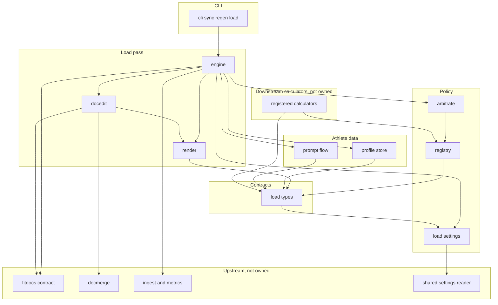
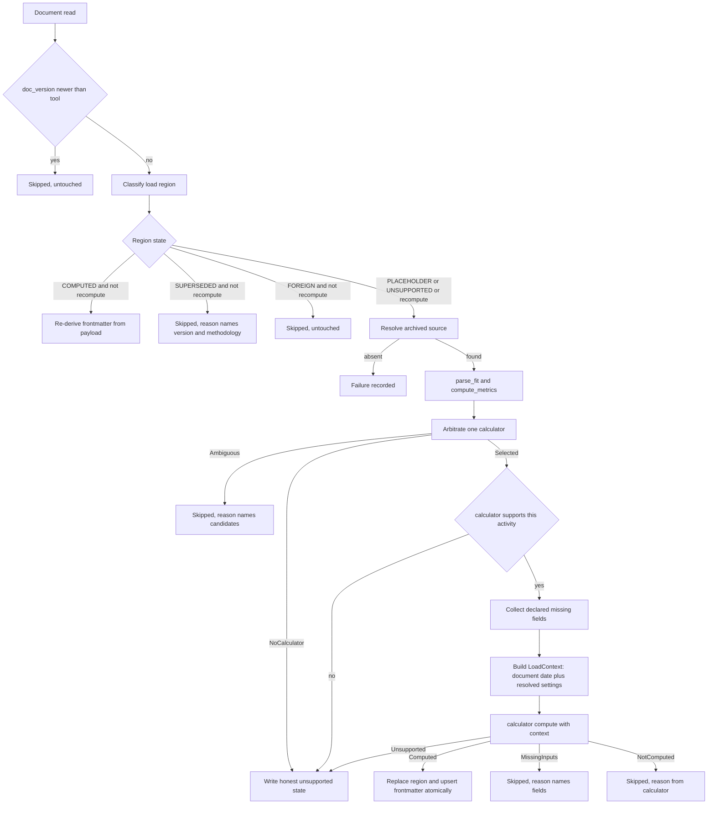
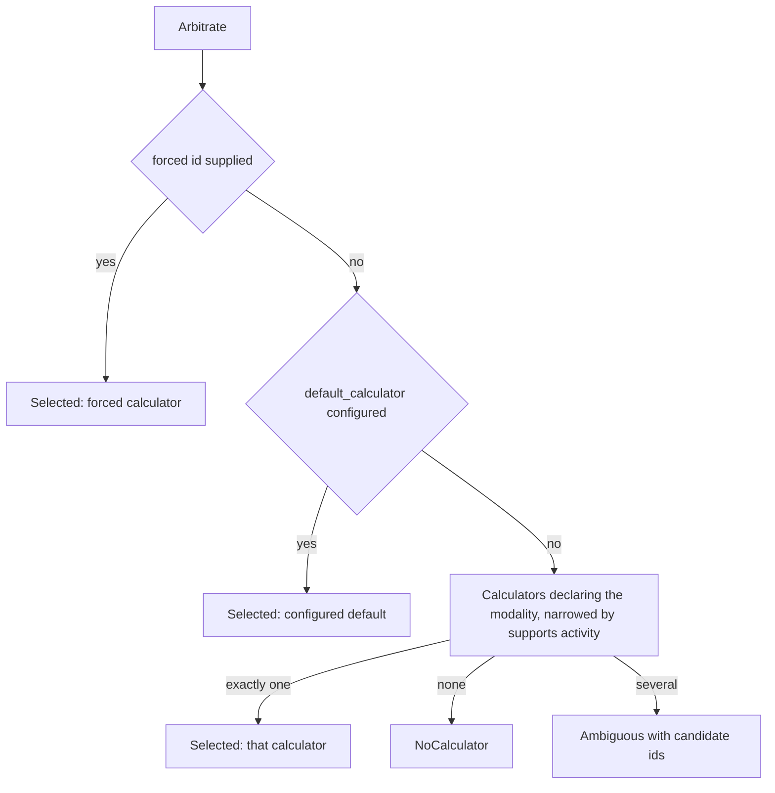
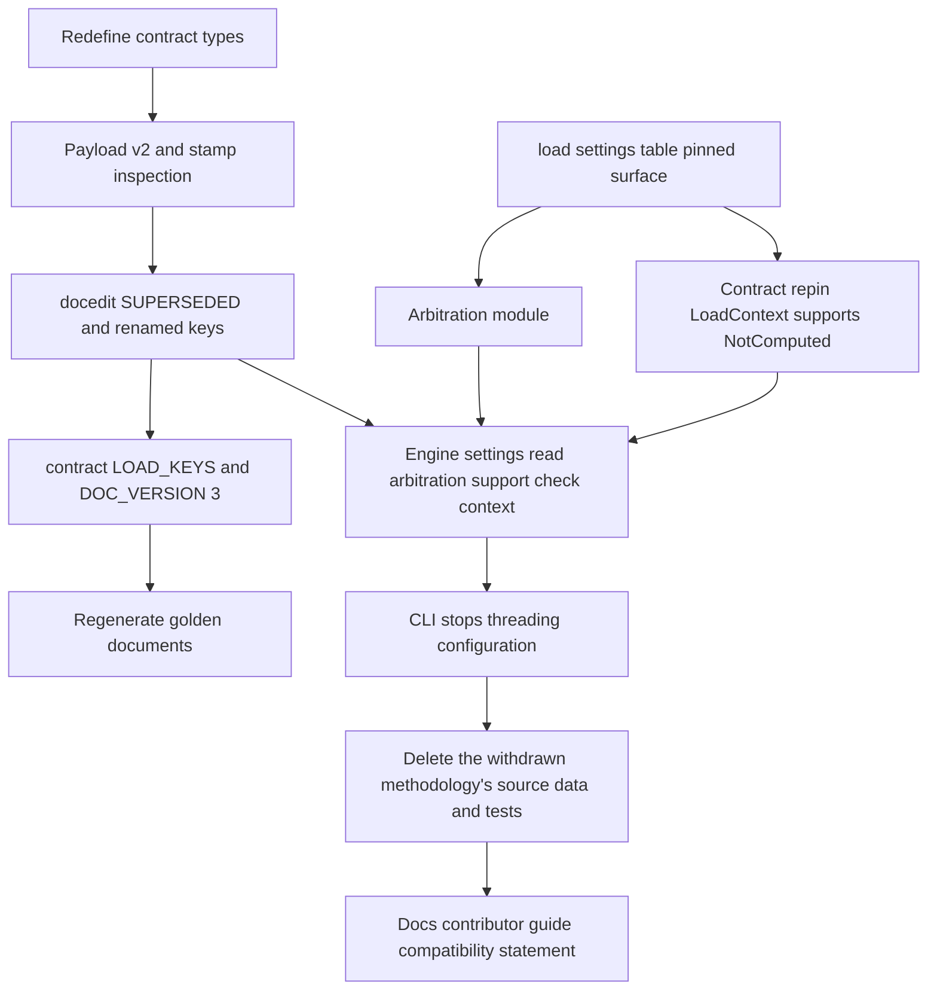

# Technical Design — training-load

## Overview

**Purpose**: training-load delivers the *carrier* for training-load
computation — the contract every methodology implements, the registry that
addresses them, the arbitration that decides which one runs, the athlete
profile that holds their declared inputs, the prompt flow that collects those
inputs once, and the document surgery that records the result. It ships **no
methodology of its own**.

**Users**: athletes syncing workouts (who get a load number in each document
and are asked for athlete data once), and calculator authors (who get one
documented contract to implement against).

**Impact**: this design supersedes the shipped first pass in three ways. (1)
The result contract is **redefined** around one selected value plus explicitly
not-the-load diagnostics, replacing the single-value type shaped around the
withdrawn methodology (Amendment 1). (2) Which calculator runs becomes an
explicit configured setting rather than registration order, and a declining
calculator is never silently substituted (Requirement 10). (3) The withdrawn
methodology is **deleted** from the shipped tool — implementation, lookup
tables, packaging and tests — leaving the registry empty of built-ins until
`threshold-load` lands (Amendment 2, Requirement 13). (4) The carrier's seams
that four downstream specs must extend are **pinned rather than left implicit**
(Amendment 3): `load/settings.py` is this spec's, with one named reader for the
whole `[load]` table and every field defaulted; `apply_load` reads that table
once and owns the resolved settings; `compute()` gains a `LoadContext`
parameter so a calculator reaches its configuration and the activity's date
without per-pass state being parked on `ProfileView`; `NotConfirmed` becomes
`NotComputed`; and the contract gains a support question — an *optional*
`supports` a calculator may define, asked through the module-level
`supports_activity(calculator, activity)` before the prompt flow.

The result-format version and the document-format version both advance, so a
document carrying a result this tool can no longer read is recognized as such,
left byte-identical, and reported — never partially parsed, silently erased, or
misattributed.

### Goals

- One result shape that carries the selected value, its basis, every value the
  methodology computed but did not select with the reason each was not, and any
  quality flags — with the selected value structurally impossible to confuse
  with the rest.
- Arbitration that resolves to exactly one calculator before any computation,
  driven by an explicit setting, never by registration or discovery order.
- Complete, honest removal of the withdrawn methodology: no implementation, no
  bundled data, no unreachable code path, no documentation presenting it as
  available — and documents already carrying a result under it left untouched
  and reported.
- Every surviving requirement satisfied with **zero** registered calculators: a
  load pass over a real data root completes cleanly and reports honestly.
- Recognition of *results* written under a superseded result format, so
  upgrading the tool never rewrites or misreads load the user did not ask to
  change — while a superseded *unsupported* state, which records no result,
  stays refillable so Req 7.7's retroactive fill survives a format bump.

### Non-Goals

- Any load methodology. This spec specifies none and registers none.
- The per-channel load math and its data-sufficiency rules (`load-channels`),
  the channel-priority and fallback policy (`threshold-load`), the dated
  benchmark store and staleness computation (`athlete-benchmarks`), and the
  detection behind quality flags (`activity-qa-flags`). This design defines the
  carrier and the presentation for all four, never the computation.
- Retiring the plugin extension point — it is retained, and `plugin-api`
  continues to own the published surface.
- Weekly/cycle aggregation (Phase 6: `load-history`), overload guardrails,
  auto-updating fitness from race results (Phase 6: `performance-benchmarks`,
  which writes dated, provenanced entries into the same store the prompt flow
  writes), and load from recorded perceived exertion.

## Boundary Commitments

### This Spec Owns

- **The calculator contract** (`load/types.py`): calculator identity, declared
  athlete inputs, the `supports_activity` question, the per-activity
  `LoadContext`, the interaction primitives, the closed outcome union, and the
  redefined result type together with its `NonSelectedValue` and `QualityFlag`
  vocabularies. `ProfileView` is owned here too, and is a *store view only* — no
  per-pass state lives on it (Req 1.13).
- **The registry** (`load/registry.py`): id-addressed storage, validation on
  registration, and modality filtering — behaving correctly when empty.
- **Arbitration** (`load/arbitrate.py`, new): which single calculator runs for
  an activity, and the typed outcomes when that question has no answer.
- **The `[load]` settings module** (`load/settings.py`, new): the **single**
  reader for the whole `[load]` table and every sub-table beneath it, its pinned
  names (`LoadSettings`, `DEFAULT_LOAD_SETTINGS`, `LoadSettingsError`,
  `load_load_settings`), the total-defaulting rule, and the tolerance contract
  that lets four downstream specs add fields and sub-tables additively (Req
  14.1-14.3). The one key it owns *today* is `default_calculator`; every other
  key in the table belongs to a sibling spec and lands as an additive defaulted
  field on the same dataclass.
- **The athlete profile file's full lifecycle** (`load/profile.py`): creation,
  read, validated update, preservation of entries it does not manage, and
  methodology-scoped key namespacing.
- **The generic prompt flow** (`load/prompts.py`) and both interaction
  sessions.
- **The load region's content and its machine payload** (`load/render.py`):
  the payload format and its version, the human markdown, and the honest
  unsupported state.
- **Document surgery** (`load/docedit.py`): region classification — including
  the superseded-format state — region replacement, and the frontmatter load
  keys as a derived, restorable projection of the payload.
- **The load pass** (`load/engine.py`) and its CLI surface (`cli.py`): scan,
  gate, restore, arbitrate, compute, write atomically, report.
- **Contributor documentation** (`docs/contributing-calculators.md`).
- **The removal of the withdrawn methodology** from source, package data,
  packaging, tests and documentation.

### Out of Boundary

- **Any methodology.** No calculator is written, registered, or bundled.
- **Channel math and data sufficiency** — `load-channels`. This design carries
  a value and a reason; it never decides whether data was sufficient.
- **Channel priority and fallback** — `threshold-load`. Arbitration here picks
  a *calculator*, never a channel.
- **The benchmark store and staleness** — `athlete-benchmarks`.
- **Quality-flag detection** — `activity-qa-flags`. This design fixes the flag
  vocabulary and renders flags; it detects nothing.
- **The workout document template, region grammar, frontmatter emission, and
  region preservation** — `workout-docs` / `wiki-contract`. This design
  replaces one region's content and upserts three keys.
- **`.fit` parsing and derived metrics** — `fit-ingest`.
- **The published plugin-author surface and its compatibility statement** —
  `plugin-api`. Retained, not retired; see the coordination table below.
- **The reference writeup and extracted tables documenting the withdrawn
  methodology.** Their retention and its reversal are recorded in the
  Cross-Spec Correction inside the withdrawal component below; this spec
  neither owns nor blocks their removal.

### Allowed Dependencies

Following the steering dependency direction `cli → render → load/metrics →
ingest → model`, this design may depend on:

- `fitdocs` public model/metrics types (`Activity`, `DerivedMetrics`,
  `Modality`, `Sport`, `parse_fit`, `compute_metrics`, `AthleteInputs`).
- `fitdocs.contract` for every interpretation of a document — the region id,
  the managed keys, the placeholder, the frontmatter fence and parse, the
  source-ref resolution, and the document-format version.
- `fitdocs.docmerge` public region grammar; `fitdocs.docio` for the shared
  filesystem read; `fitdocs.layout` for data-root paths;
  `fitdocs.settings.load_settings_document` for the one settings-file read;
  `fitdocs.athlete` for the read-only athlete inputs.
- Runtime libraries already declared: `tomli-w` (profile writes), `typer` +
  `rich` (CLI and prompting), `pyyaml` (read-only frontmatter parse).

**Internal dependency direction (enforced; violations are review errors):**

```
types → registry → arbitrate → profile/prompts → render → docedit → engine → cli
types → channels/*, priority, qa/*  →  settings  →  engine
types ⇠ settings                       TYPE_CHECKING only — annotation, no runtime edge
```

**Correction to Amendment 3 (cross-spec import-direction ruling, 2026-07-25).**
Amendment 3 moved `settings.py` *below* `types.py` so that
`LoadContext.settings: LoadSettings` would resolve, justified by the claim that
`settings.py` "imports nothing from `fitdocs.load.*`". **That claim was false and
is withdrawn.** `LoadSettings` aggregates the sibling specs' typed sub-settings,
and each lives in its own `fitdocs.load.*` module — `SufficiencySettings` in
`load/channels/types.py` (`load-channels`), `ChannelPriority` in
`load/priority.py` (`threshold-load`), `FlagSettings` in `load/qa/types.py`
(`activity-qa-flags`). With `settings` at the bottom a real directed cycle
exists, and a reviewer reproduced it in a throwaway package mirroring the
specified layout:

```
fitdocs.load.types → fitdocs.load.settings → fitdocs.load.qa/__init__
                  → fitdocs.load.qa.flags → fitdocs.load.types (partial) → ImportError
```

It fails on *every* entry point — `import fitdocs.load.types`, `import
fitdocs.load`, `import fitdocs.load.qa` — not on one unlucky import order,
because `src/fitdocs/load/__init__.py:17` imports `registry`, which imports
`types`. `channels/` and `priority.py` escape only because no module in them
imports `fitdocs.load.types` (an invariant `load-channels` already pins with a
boundary test); `qa/flags.py` legitimately needs `QualityFlag` from
`load/types.py`, so `qa/` cannot escape the same way.

**Ruling: cut the one inverted edge with a `TYPE_CHECKING`-only import in
`load/types.py`.**

```python
# src/fitdocs/load/types.py
if TYPE_CHECKING:
    from fitdocs.load.settings import LoadSettings
```

`settings.py` then sits *above* `types.py` again: it may freely import
`channels/types`, `priority` and `qa/types`; every sub-package may freely import
`load.types`; and `load/qa/__init__.py` is an ordinary eager initializer.
`types.py`'s rule returns to its shipped form — **no runtime import from
`fitdocs.load.*`** — with the single annotation-only exception above, which is
also the one sentence `src/fitdocs/load/types.py`'s module docstring (lines 3-9,
"the bottom of the load dependency chain … no imports from other
`fitdocs.load.*` modules") gains in task 3.3. `arbitrate.py` imports `types` and
`registry` only, and performs no I/O.

Verified safe before ruling: `load/types.py:26` already carries `from __future__
import annotations`, so `LoadContext` stays constructible and
`dataclasses.fields(LoadContext)[1].type` is the *string* `"LoadSettings"`
(field `[0]` is `activity_date`, whose `.type` is the string `"date | None"`);
nothing in the suite calls `typing.get_type_hints` (the existing tests compare
`dataclasses.fields(...).type` strings — e.g.
`tests/metrics/test_types.py:194-196`, `test_derived_metrics_field_contract`).

Two alternatives are rejected and must not be re-proposed:

- **A lazy `__getattr__` re-export in `qa/__init__.py`** (what
  `activity-qa-flags` had). The reviewer added one plausible future edge — a
  `load/channels/` module importing `fitdocs.load.types` — and the lazy version
  failed immediately with the identical `ImportError` while the ruling above
  passed. It leaves the fragility load-bearing.
- **Moving every sub-setting into `load/settings.py`.**
  `SufficiencySettings.minimum_for` needs `ChannelId` and `ChannelPriority`
  needs `ChannelId` + `Sport`, so `settings.py` would still import
  `load/channels/types.py`, and the channel modules take
  `settings: SufficiencySettings` and would import back — a new
  `channels ↔ settings` cycle traded for the old one.

**Invariant (Req 14.7): no package initializer beneath `fitdocs.load` may
eagerly import a module that reaches `fitdocs.load.settings`.** That is what
keeps `settings.py`'s aggregation of the sub-settings acyclic as each sibling
spec lands. It is provable only in a *fresh interpreter* — an in-process
re-import is a `sys.modules` cache hit and proves nothing — so the guard extends
`tests/test_public_api.py`'s existing subprocess check
(`test_no_circular_import_in_a_fresh_interpreter`, ~line 353).

**Correction (2026-07-25, design re-validation).** That guard was first written
as "extend the check with `import fitdocs.load.qa` and `import
fitdocs.load.types`". `fitdocs.load.qa` **does not exist in this checkout** — it
is `activity-qa-flags`' package, several specs downstream — so a literal reading
reddens the final quality gate with `ModuleNotFoundError` on the day it is
written, and the obvious workaround (delete the `qa` line) silently discards the
invariant's only real test. The guard therefore **discovers** the sub-packages
instead of naming them: enumerate the immediate sub-packages of `fitdocs.load`
on disk, and in a *separate* fresh interpreter import `fitdocs.load`,
`fitdocs.load.types`, `fitdocs.load.settings` and each discovered sub-package.
Today that set is exactly the three named modules; when `channels/`, `qa/` and
`priority` land, each is covered the moment it appears. This is strictly better
than a static list here: **no sibling spec has to edit this test**, which is the
same coordination cost Req 14.7 exists to eliminate.

The alternative Amendment 3 rejected still stands rejected: parking
configuration on `ProfileView` (`load/types.py`) and having `profile.py` bind
it, which three downstream specs proposed. It inverts this direction — `types`
would depend on `settings` *through a member of a protocol that is meant to be a
store view* — and it is a runtime edge, not an annotation.

### Revalidation Triggers

- **The result shape changes** (a field added, removed, or retyped on
  `LoadResult`, `NonSelectedValue`, or `QualityFlag`) → payload version bump,
  `DOC_VERSION` bump, golden regeneration, and revalidation by `threshold-load`
  and `activity-qa-flags`.
- **A fourth `QualityFlag.verdict` value** → `activity-qa-flags` and the
  section renderer both revalidate; the vocabulary is closed here on purpose.
- **`LOAD_KEYS` or `MANAGED_KEYS` membership changes** → `wiki-contract`
  revalidates; must land atomically or `check` reports unmanaged keys.
- **`LOAD_PAYLOAD_VERSION` changes** → every previously written *computed*
  document becomes superseded, while previously written *unsupported* regions
  refill; `wiki-contract`'s migration-by-regen path revalidates.
- **The classifier stops branching on `PayloadStamp.status`** (or the payload
  stops recording a status) → Req 7.7's cross-format retroactive fill
  revalidates; the distinction between a superseded result and a superseded
  unsupported state is what keeps 7.7 and 11.3 from contradicting each other.
- **The engine's support check moves, or `collect_missing_fields` is
  reached before it** → Reqs 1.14, 3.1, 7.7 and 10.5 revalidate together; the
  ordering is load-bearing, not incidental.
- **The `[load]` table's ownership rules change** (a key becomes reserved, or
  unknown sub-tables stop being ignored) → `threshold-load`,
  `activity-qa-flags` and `athlete-benchmarks` revalidate.
- **`load_load_settings`' name or signature changes, `LoadSettings` gains an
  undefaulted field, or a second reader of `[load]` appears** →
  `athlete-benchmarks`, `load-channels`, `threshold-load` and
  `activity-qa-flags` all revalidate; each extends this exact module (Req
  14.1, 14.2).
- **`LoadContext`'s members change, or `compute()`'s parameter list changes
  again** → the contributor guide, the stub calculators, `tests/test_public_api.py`,
  `threshold-load` (which reads `context.settings` and `context.activity_date`)
  and `activity-qa-flags` (which reads the flag settings through it) revalidate.
- **Per-pass state reappears on `ProfileView`** → Req 1.13 is violated; the
  import direction and `load/qa`'s package root revalidate with it.
- **The `TYPE_CHECKING` guard on `types.py`'s `LoadSettings` import is dropped,
  or a package initializer beneath `fitdocs.load` starts eagerly importing a
  module that reaches `settings.py`** → Req 14.7 is violated, the
  fresh-interpreter import guard in `tests/test_public_api.py` reddens, and
  `load-channels`, `threshold-load` and `activity-qa-flags` revalidate together
  — each contributes a sub-settings type that `settings.py` imports.
- **`supports_activity`'s resolution order changes — it stops preferring a
  calculator's own `supports` over `supported_modalities` membership, the
  engine stops calling it before `collect_missing_fields`, or arbitration
  stops using it to narrow the no-default candidate set** → Reqs 1.6, 1.14, 3.1
  and 10.2 revalidate, and `threshold-load`'s Walk/Hike-through-`Modality.OTHER`
  declaration starts prompting on Rowing and Workout documents again — or, in
  the arbitration case, starts reporting them as an ambiguity no configured
  default can resolve.
- **`NotComputed` is renamed or re-scoped** → `threshold-load` (its sole
  producer), the stub calculators and the public-surface pin revalidate.
- **Arbitration precedence changes** → `threshold-load` revalidates; it assumes
  a configured default settles calculator choice.
- **A built-in calculator is registered again** → this design's "registry is
  empty of built-ins" invariant and every test asserting it revalidate.
- **The `workout-docs` load placeholder constant changes** → region
  classification revalidates (it recognizes the placeholder by importing the
  constant).

### Cross-Spec Coordination (must land in one change)

| Asset | Owner | Why it moves with this spec |
| --- | --- | --- |
| `contract.LOAD_KEYS`, `MANAGED_KEYS` membership | `wiki-contract` | The load pass emits different keys; a mismatch makes every load-touched document report unmanaged keys (Req 7.2, its Req 6.2) |
| `contract.DOC_VERSION` 2 → 3 + regeneration of the 8 golden documents | `wiki-contract` | Req 11.5; the constant's own docstring requires the bump and the regeneration to be one change |
| `docs/plugins.md` compatibility statement | `plugin-api` | Redefining `LoadResult` removes published fields; the requirements' Boundary Context settles this by declaring the surface unstable before 1.0. The same file also needs its `WithdrawnCalculator` mention removed under Req 13.3 |
| `tests/test_plugins.py` built-in anchor (~35 assertions on the withdrawn calculator's registered id) | `plugin-api` | Req 13.2 empties the built-in registry; the anchor becomes a test-registered stub |
| `contract.document_date(frontmatter: Mapping[str, object] \| None) -> date \| None` | `athlete-benchmarks` (spec'd there; `wiki-contract` owns the module) | `LoadContext.activity_date` is read through it, never by an inline `frontmatter.get("date")`. Whichever of the two specs lands first adds the accessor **with that exact signature**; the second consumes it. This design does not redefine it (Amendment 3). **Resolved 2026-07-25 (design re-validation): this spec lands first, so task 4.1 adds it.** `document_date` resolves nowhere in `src/` or `tests/`, and `athlete-benchmarks` is at `tasks-generated` with no task committed, while task 4.1 is two tasks away and cannot build a `LoadContext` without it. Task 4.1's boundary is extended to `DocumentContract` accordingly — the same treatment task 2.4 was given for the same module — so the incursion is declared rather than discovered at review time |

**Conformance the sibling specs now owe this one** (Amendment 3; recorded here
so the reviews are mechanical):

| Spec | Must conform to |
| --- | --- |
| `athlete-benchmarks` | **Already amended to conform, and now *depends on* Amendment 3 landing.** It has dropped its own `load/settings.py` creation and the `load_settings_from_document` name, and adds `benchmark_staleness_days: int = 84` as a defaulted field on **this** spec's `LoadSettings`. It has also dropped `activity_date` and `staleness_window_days` from `ProfileView` — and with them `AthleteProfile.for_activity` and `load_profile`'s window parameter — so it has **no route to the activity date except `LoadContext.activity_date`**: if this amendment does not land, that spec cannot compute staleness at all. It retains `contract.document_date` — but **no longer adds it**: the 2026-07-25 design re-validation assigns the incursion to this spec's task 4.1, since this spec lands first and cannot build a `LoadContext` without it. That spec becomes a pure consumer and must drop the incursion from its own plan |
| `load-channels` | Already conformant on the reader: it extends `LoadSettings` with `[load.sufficiency]` and pins this spec's reader signature (its 2026-07-25 amendment). Correct its test-module name to `tests/load/test_settings.py` |
| `threshold-load` | Read configuration from `context.settings`, not `ProfileView.load_settings`; read the date from `context.activity_date`; implement `supports(activity)` as `activity.sport in SUPPORTED_SPORTS` and keep its `compute` sport check as defence in depth; `NotComputed` is the variant it produces for "no channel could be scored". Correct its test-module name to `tests/load/test_settings.py` |
| `activity-qa-flags` | Read `[load.flags]` from `context.settings`; drop `ProfileView.load_settings` as its inbound. **Corrected 2026-07-25:** Amendment 3 told this spec that "the cycle it dodged does not exist under the `settings → types` direction" — that claim has been falsified experimentally (see the import-direction ruling above); the cycle is real. It is cut instead by the `TYPE_CHECKING`-only import in `load/types.py`, which means `load/qa/__init__.py` becomes an ordinary **eager** initializer and **deletes its lazy `__getattr__` re-export workaround** (also rejected on evidence): `qa/flags.py` imports `fitdocs.load.types` directly, `load/settings.py` imports `qa/types.py`, and `evaluate_flags` is reachable from the package root. That spec is being amended in parallel; this row records the coordination only. Correct its test-module name to `tests/load/test_settings.py` |

**Sequencing against `athlete-benchmarks`' `contract.py` incursion.** Both specs
edit `src/fitdocs/contract.py` and `tests/test_contract.py`: this spec's task 2.4
renames `LOAD_KEYS` and bumps `DOC_VERSION` (atomic with the golden
regeneration), and `athlete-benchmarks` adds `document_date`. **They must not
interleave** — one lands completely, the other rebases onto it. Task 2.4 is the
riskier of the two (it must be a single commit or every load-touched document
reports unmanaged keys), so it goes first where the choice is free; whichever
lands second consumes what the first added and does not redefine it.

**Resolved by the 2026-07-25 design re-validation.** Task 2.4 has landed
(`a782034`), and `document_date` still resolves nowhere in `src/` or `tests/`
while `athlete-benchmarks` sits at `tasks-generated` with no committed task. So
the "whichever lands first" question is settled in fact: **this spec adds
`document_date`, in task 4.1**, whose boundary is extended to `DocumentContract`
for it. The two `contract.py` edits are now sequential within this spec (2.4
then 4.1) rather than a race with a peer, and `athlete-benchmarks` becomes a
pure consumer of both.

## Architecture

### Existing Architecture Analysis

The shipped load layer is well-factored and mostly survives. Its load-bearing
properties are preserved, not rebuilt:

- **The outcome union is already the right shape.** `LoadOutcome = Computed |
  Unsupported | MissingInputs | NotComputed` is closed and folded with
  `assert_never`. Its arity and routing do not change; Amendment 3 renames the
  fourth variant (`NotConfirmed` → `NotComputed`) and nothing else about it.
- **The document is the store of record.** The region carries a single-line
  machine payload; the frontmatter keys are a derived, restorable projection of
  it. Region content survives regeneration verbatim (a `workout-docs`
  guarantee), which is why a regen can restore frontmatter without recomputing
  or prompting.
- **Byte-determinism and no-op repeats.** Compact sorted-key JSON, tuples
  everywhere, and whole-document atomic writes; an unchanged repeated pass
  performs no writes at all.
- **One document interpretation.** Every read of a document's frontmatter,
  type marker, source history and version goes through `fitdocs.contract`.

Three shipped behaviors are **deliberately reversed** by this design:

1. `engine._compute_document` iterates candidate calculators and `continue`s
   past an `Unsupported` outcome. Req 10.5 forbids exactly that substitution;
   the loop is deleted, not guarded.
2. `parse_payload` collapses an unknown payload version into the same
   `FOREIGN` state as user-authored prose. Req 11.2 requires a distinguishable
   state with its own reason.
3. `fitdocs.load` registers a built-in on import. Req 13.2 requires the
   registry to be empty of built-ins.

### Architecture Pattern & Boundary Map



**Architecture Integration**

- **Selected pattern**: a pass over already-generated documents, unchanged from
  the shipped design — the sync engine and renderer are never modified, and the
  document remains the store of record. What changes is *policy*: a new pure
  policy layer (`arbitrate` + `settings`) sits between the registry and the
  engine, so "which calculator runs" is decided once, deterministically, and
  testably without a filesystem.
- **Domain boundaries**: contracts (`types`) know nothing about wiring; policy
  knows nothing about documents; document surgery knows nothing about
  methodologies; the engine is the only module performing document I/O.
- **Preserved patterns**: closed unions folded with `assert_never`; frozen
  dataclasses with tuple sequence fields; per-table settings readers over one
  shared document read; config-errors-abort vs per-document-errors-isolate;
  atomic whole-document writes.
- **New components rationale**: `arbitrate.py` exists because Requirement 10
  has four distinct failure modes worth testing in isolation; `settings.py`
  exists because no load configuration surface exists today and four
  downstream specs need one that grows additively — which is why Amendment 3
  pins its surface rather than leaving the name to whoever lands first.
- **Steering compliance**: absent data is `None`, never a fabricated `0`; no
  calculator-specific prompting code in the CLI; one module per methodology —
  and, now, zero methodologies.

### Technology Stack

| Layer | Choice / Version | Role in Feature | Notes |
|-------|------------------|-----------------|-------|
| CLI | `typer` + `rich` (shipped) | `sync` / `regen` / `load` commands, interactive prompting | `--calculator` help text loses its withdrawn-methodology example |
| Backend / Services | Python 3.11+, stdlib `dataclasses`, `typing.Literal`, `assert_never` | Contracts, policy, engine | `mypy --strict` on `src/` finds every redefinition site |
| Data / Storage | `tomllib` (read) + `tomli-w` (write) | `athlete.toml` profile; `fitdocs.toml` `[load]` read-only | `tomli-w` **stays** a runtime dependency — the profile write path survives the withdrawn methodology's removal |
| Serialization | stdlib `json`; `pyyaml` (read-only) | Payload v2 encode/decode; frontmatter reads | Frontmatter writes stay line-level, never YAML re-emission |
| Infrastructure / Runtime | `hatchling`, `packages = ["src/fitdocs"]` | Wheel contents | No `package-data` stanza exists; deleting `load/withdrawn/` removes the CSVs from the wheel with no build-config change |

## File Structure Plan

### Directory Structure

```
src/fitdocs/load/
├── types.py            # MODIFIED: LoadResult redefined; NonSelectedValue,
│                       #   QualityFlag added (Amendment 1). Amendment 3:
│                       #   LoadContext added, compute() takes it,
│                       #   supports_activity(calculator, activity) added as a
│                       #   module-level function (not a Protocol member --
│                       #   see LoadContracts for the ruling), NotConfirmed ->
│                       #   NotComputed, ProfileView left a pure store view.
│                       #   Imports nothing from fitdocs.load.* at RUNTIME;
│                       #   LoadSettings under TYPE_CHECKING only (Req 14.7).
├── settings.py         # NEW: the ONE [load] reader — LoadSettings (every field
│                       #   defaulted), DEFAULT_LOAD_SETTINGS, LoadSettingsError,
│                       #   load_load_settings. Sits ABOVE types.py: it imports
│                       #   the siblings' sub-settings (channels/types, priority,
│                       #   qa/types), so it is not the bottom of the chain.
├── registry.py         # MODIFIED: docstring only — the "first non-Unsupported
│                       #   in registration order" narrative is now false.
├── arbitrate.py        # NEW: pure calculator selection — Selected |
│                       #   Ambiguous | NoCalculator. No I/O.
├── profile.py          # MODIFIED: docstrings redacted of the withdrawn
│                       #   methodology's identity; behavior unchanged.
├── prompts.py          # MODIFIED: docstrings redacted of the withdrawn
│                       #   methodology's identity; behavior unchanged --
│                       #   until Amendment 4: collect_missing_fields gains
│                       #   keyword-only activity_date and asks the
│                       #   retroactive-application question (3.7-3.9).
├── render.py           # MODIFIED: payload v2, inspect_payload/PayloadStamp,
│                       #   non-selected + flags sections omitted when empty.
├── docedit.py          # MODIFIED: RegionState.SUPERSEDED, RegionClassification,
│                       #   the three renamed managed keys.
├── engine.py           # MODIFIED: superseded branch; arbitration replaces the
│                       #   candidate loop; reads [load] once per pass and owns
│                       #   the resolved LoadSettings; builds a LoadContext per
│                       #   activity; calls supports_activity() before the
│                       #   prompt flow.
├── __init__.py         # MODIFIED: registers nothing; WithdrawnCalculator export
│                       #   removed; new contract types exported (LoadContext,
│                       #   NotComputed replacing NotConfirmed).
└── withdrawn/          # DELETED — package, 5 modules and data/*.csv (Req 13.1)

tests/load/
├── conftest.py         # NEW: stub calculators (computing, declining,
│                       #   scoped-field, hinted) registered/unregistered
│                       #   per test — the tests' subject, replacing the
│                       #   withdrawn methodology.
├── test_settings.py    # NEW: [load] table reader, incl. unknown-subtable
│                       #   tolerance (the additivity contract). CANONICAL NAME
│                       #   (Amendment 3) — see the pin below; the three
│                       #   sibling specs that said test_load_settings.py
│                       #   were corrected to this name 2026-07-25.
├── test_arbitrate.py   # NEW: the four arbitration outcomes and precedence.
└── withdrawn/          # DELETED — 5 modules (Req 13.1)
```

### Modified Files

- `src/fitdocs/cli.py` — **does not read `[load]`** (Amendment 3): the pass
  reads it. The CLI keeps `--calculator` as the sole command-line override,
  keeps mapping `SettingsError`/`LoadSettingsError` to the existing exit-2
  config path (they now propagate out of `apply_load`), and drops the
  withdrawn-methodology example from `--calculator` help.
- `src/fitdocs/contract.py` — **cross-spec (`wiki-contract`)**: `LOAD_KEYS`
  becomes `("load_value", "load_methodology", "load_basis")`; `DOC_VERSION`
  2 → 3 with its docstring rationale. **Amendment 3, cross-spec
  (`athlete-benchmarks`)**:
  `document_date(frontmatter: Mapping[str, object] | None) -> date | None`
  — added by whichever of the two specs lands first, which the 2026-07-25
  design re-validation resolves to **this one, in task 4.1** (with
  `tests/test_contract.py`).
- `src/fitdocs/metrics/stress.py` — one docstring sentence naming the withdrawn
  methodology.
- `tests/render/golden_docs/*.md` (8 files) — regenerated for `doc_version: 3`.
- `tests/test_contract.py` — the two anti-drift assertions pinning `LOAD_KEYS`.
- `tests/load/test_types.py`, `test_render.py`, `test_docedit.py`,
  `test_engine.py`, `test_engine_contract.py`, `test_cli_load.py`,
  `test_feature_e2e.py`, `test_profile.py`, `test_prompts.py`,
  `test_registry.py` — repinned to the new shape and the stub calculators.
- `tests/load/test_packaging.py`, `tests/load/test_install_smoke.py` — the
  `tomli-w` runtime-dependency half is kept; the withdrawn-methodology-CSV half
  is **inverted** into a Req 13.1 guard that no withdrawn-methodology data
  ships in a built wheel.
- `tests/conftest.py`, `tests/test_plugins.py`, `tests/test_plugin_regression.py`,
  `tests/test_cli.py`, `tests/test_sync.py`, `tests/test_confinement.py`,
  `tests/test_docmerge.py`, `tests/test_athlete.py`, `tests/test_public_api.py`,
  `tests/metrics/test_stress.py` — withdrawn-methodology anchors replaced.
- `docs/contributing-calculators.md` — the worked example is rewritten against
  the new result shape with no shipped calculator to point at; the bundled-data
  and licensing-header guidance is generalized. **Amendment 3**: the example
  implements `supports`, takes `context` in `compute`, reads its configuration
  from `context.settings` and the activity's date from `context.activity_date`,
  and returns `NotComputed` where it used to return `NotConfirmed`.
- `docs/plugins.md` — `WithdrawnCalculator` mention removed (13.3); compatibility
  statement declares the surface unstable pre-1.0 (**`plugin-api` coordination**).
- `docs/ownership-contract.md`, `README.md` — the withdrawn methodology
  presented as available (13.3).
- `pyproject.toml` — **no change**; verified: the CSVs ship only by directory
  membership.

**Amendment 4 (2026-09-10)** — the prompt-date change touches, on one branch:

- `src/fitdocs/benchmarks.py` (athlete-benchmarks' leaf, by its Amendment 1):
  `Benchmark.applies_from`, parser/serializer support, two-tier
  `BenchmarkSet.applicable`, negative-age `benchmark_age`;
  `tests/test_benchmarks.py`.
- `src/fitdocs/load/profile.py`: `with_benchmark(applies_from=)` and the
  note-identical merge; `tests/load/test_profile.py`,
  `tests/load/test_profile_benchmarks.py`; docstring-only
  `src/fitdocs/load/types.py`.
- `src/fitdocs/load/prompts.py`: keyword-only `activity_date` and the
  question; `src/fitdocs/load/engine.py`: threads the document date it
  already resolves; `tests/load/test_prompts.py`, `tests/load/test_engine.py`.
- `tests/load/test_prompt_date_e2e.py` — **NEW**: prompt → score for a
  pre-prompt activity through the real sync pipeline, an absent
  `athlete.toml` and the registered threshold calculator.
- `docs/ownership-contract.md`, `README.md`, `docs/contributing-calculators.md`
  (one passage each) and `docs/plugins.md` (one sentence, **`plugin-api`
  coordination**: the published `Benchmark` gained a field).

## System Flows

### Per-document decision flow (the load pass)



Key decisions not visible in the diagram: the version gate runs on **every**
document before any branch, so a version-gated document's load region and
frontmatter keys are as untouched as its body. Arbitration happens **once per
document and resolves to exactly one calculator** — there is no candidate loop,
so an `Unsupported` outcome from the arbitrated calculator goes straight to the
honest unsupported state rather than to another calculator (Req 10.5).

Two branches deserve their reason stated explicitly, because both were
regressions in an earlier draft of this design:

- **The support check precedes field collection.** A forced or configured
  calculator is selected *without* consulting the activity's sport (see
  Arbitration below — only the no-default candidate branch narrows by
  `supports`), so the engine asks the selected calculator whether it *supports
  this activity* **before** collecting its declared athlete inputs. Req 3.1
  conditions prompting on that answer; without this check, a running-only
  configured default would prompt for threshold inputs while syncing a hike, and
  a decline or a non-interactive pass would then bucket that document as
  `MissingInputs` ("missing required inputs") when Req 10.5 and 7.7 require the
  honest unsupported state.
  **Amendment 3 turns this from an attribute read into a contract question**
  (Req 1.14): the engine calls `supports_activity(calculator, activity)`, which
  falls back to the modality test it replaces when the calculator defines no
  `supports` of its own. The reason is
  sport-granularity: a calculator that must declare a broad modality to reach a
  few sports inside it — `threshold-load` declares `Modality.OTHER` to reach Walk
  and Hike, which also holds Rowing, Workout and every unmapped sport — would
  otherwise pass this gate for every one of them and be refused only by
  `compute`, i.e. *after* the whole interactive prompt flow. `supports` is a
  pure, prompt-free, athlete-data-free question, and it remains the only thing
  standing between `Selected` and `compute`. A calculator's own sport check
  inside `compute` is retained as defence in depth (Req 1.3), not deleted.
- **The `SUPERSEDED` branch protects results, not the unsupported state.** A
  superseded payload whose status is `"unsupported"` classifies `UNSUPPORTED`,
  not `SUPERSEDED`, and therefore takes the compute path — see
  LoadSectionRenderer and LoadDocEditor.

### Arbitration precedence



**The no-default branch narrows candidates by the support question, not by
modality alone** (design re-validation, 2026-07-25). Reqs 1.6 and 10.2 are both
written in terms of *the activity's sport*, and Amendment 3 put exactly that
question on the contract (`supports`, Req 1.14), so candidate selection asks it.
Filtering on `supported_modalities` alone was a requirement-fidelity gap with a
concrete failure: `threshold-load` must declare `Modality.OTHER` to reach Walk
and Hike, and that modality also holds Rowing, Workout and every unmapped sport.
With a second calculator declaring `OTHER` and no configured default, a Rowing
document would resolve `Ambiguous` — telling the user to configure a default
that cannot help, because *neither* candidate covers Rowing — where Reqs 7.7 and
10.5 require the honest unsupported state. Narrowing makes all three sub-cases
correct: several declare and several support → `Ambiguous` (10.2); several
declare and exactly one supports → `Selected` (10.2's literal text); several
declare and none supports → `NoCalculator` → the honest unsupported state (1.6,
7.7).

Both `Selected` branches driven by configuration are validated **up front**,
before the document scan: an unregistered id aborts the pass with an
instructive message naming the value, its configuration source, and the
registered ids (Req 10.4), before anything is written. Only the id actually in
play is validated — an explicit `--calculator` makes a stale configured default
irrelevant rather than fatal (Req 10.3).

## Requirements Traceability

| Requirement | Summary | Components | Interfaces | Flows |
|-------------|---------|------------|------------|-------|
| 1.1 | Contract declares id, name, sports, required inputs | LoadContracts | `LoadCalculator`, `AthleteField` | — |
| 1.2 | Result carries value, methodology, basis, inputs, notes | LoadContracts | `LoadResult` | — |
| 1.3 | Unsupported sport declines with no value | LoadContracts, LoadEngine | `Unsupported` | Per-document |
| 1.4 | Missing inputs → typed outcome, no substitution | LoadContracts, PromptFlow | `MissingInputs` | Per-document |
| 1.5 | Registry addressable by id; correct when empty | CalculatorRegistry, LoadPackageInit | `register`, `get`, `available` | — |
| 1.6 | Only calculators declaring the sport are considered | CalculatorRegistry, Arbitration | `for_modality` narrowed by `supports` | Arbitration |
| 1.7 | Contributor documentation | ContributorGuide | — | — |
| 1.8 | Non-selected values with the reason each | LoadContracts, LoadSectionRenderer | `NonSelectedValue` | — |
| 1.9 | Quality flags carried, value unaltered | LoadContracts, LoadSectionRenderer | `QualityFlag` | — |
| 1.10 | Selected value distinguishable from all others | LoadContracts, LoadDocEditor | `LoadResult.value` scalar | — |
| 1.11 | Single-value case fabricates nothing | LoadContracts, LoadSectionRenderer | empty tuples, omitted sections | — |
| 1.12 | Per-activity context carries the document's date and the resolved settings | LoadContracts, LoadEngine | `LoadContext`, `compute(..., context)` | Per-document |
| 1.13 | `ProfileView` stays a store view; no per-pass state on it | LoadContracts | `ProfileView` | — |
| 1.14 | Prompt-free support question, asked before any input is collected | LoadContracts, LoadEngine | `supports_activity` | Per-document |
| 1.15 | The "nothing was computed" outcome is named for that meaning | LoadContracts | `NotComputed` | Per-document |
| 2.1 | Profile lifecycle owned in the data root | AthleteProfileStore | `load_profile`, `save_profile` | — |
| 2.2 | Profile version identifier | AthleteProfileStore | profile schema | — |
| 2.3 | Absent profile is empty, not an error | AthleteProfileStore | `load_profile` | — |
| 2.4 | Malformed profile → instructive config error | AthleteProfileStore, CliIntegration | `ProfileError` | — |
| 2.5 | Unmanaged profile entries preserved on rewrite | AthleteProfileStore | `save_profile` | — |
| 2.6 | Validate against declared range; never persist unprovided | AthleteProfileStore, PromptFlow | `AthleteField` bounds | — |
| 2.7 | Methodology-scoped fields; none ship; exercised by contract | AthleteProfileStore, TestCalculators | dotted keys | — |
| 3.1 | Prompt for absent required inputs, only when the calculator supports the activity | PromptFlow, LoadEngine | `supports` → `collect_missing_fields` | Per-document |
| 3.2 | Present meaning and range; re-ask on invalid | PromptFlow | `RichInteractionSession` | — |
| 3.3 | Persist valid answers immediately, ask once | PromptFlow, AthleteProfileStore | `persist` callback | — |
| 3.4 | Decline → skip affected docs, report, no substitution | PromptFlow, LoadEngine | `MissingInputs` | Per-document |
| 3.5 | Non-interactive → no prompt, uncomputed, clean finish | PromptFlow, CliIntegration | `NonInteractiveSession` | Per-document |
| 3.6 | Per-field confirmation hint seam; none ships | PromptFlow, TestCalculators | `hints` mapping | — |
| 3.7, 3.8, 3.9 | Retroactive-application question (Amendment 4): asked after the value and any hint, only for a benchmark field whose activity predates the pass; yes → `applies_from`, no → none, skip → decline; never for flat, undated or on-or-after activities; both ISO dates named, affirmative default | PromptFlow, LoadEngine | `collect_missing_fields(activity_date=…)`, `session.confirm(default=True)` | Per-document |
| 4 | **WITHDRAWN** (Amendment 2) — withdrawn-methodology zone determination | WithdrawnCalculatorRemoval | — | — |
| 5 | **WITHDRAWN** (Amendment 2) — withdrawn-methodology continuous load; no bundled data | WithdrawnCalculatorRemoval, Packaging | — | — |
| 6 | **WITHDRAWN** (Amendment 2) — withdrawn-methodology interval load | WithdrawnCalculatorRemoval | — | — |
| 7.1 | Section carries the full result, other regions untouched | LoadSectionRenderer, LoadDocEditor | `render_computed`, `replace_load_region` | Per-document |
| 7.2 | Frontmatter = value, methodology, basis only | LoadDocEditor, DocumentContract | `LOAD_KEYS`, `apply_frontmatter_load` | Per-document |
| 7.3 | Section embeds the complete machine-readable result | LoadSectionRenderer | payload v2 | Per-document |
| 7.4 | Restore frontmatter after regen, no recompute or prompt | LoadEngine, LoadDocEditor | restore branch | Per-document |
| 7.5 | Never recompute without explicit request | LoadEngine | `recompute` flag | Per-document |
| 7.6 | Unrecognized content left untouched | LoadDocEditor, LoadEngine | `RegionState.FOREIGN` | Per-document |
| 7.7 | Honest unsupported state; later pass fills it, across a format bump | LoadSectionRenderer, LoadDocEditor, LoadEngine | `render_unsupported`, `PayloadStamp.status` | Per-document |
| 8.1 | Load pass runs after sync writes documents | CliIntegration | `sync` | — |
| 8.2 | Standalone load command | CliIntegration | `fitdocs load` | — |
| 8.3 | Recompute re-runs, re-confirming | LoadEngine | `strip_frontmatter_load` | Per-document |
| 8.4 | `--calculator` uses only that calculator | Arbitration, CliIntegration | forced id | Arbitration |
| 8.5 | Per-document failure isolated, pass continues | LoadEngine | failure bucket | Per-document |
| 8.6 | Summary of computed/restored/skipped/failed | LoadEngine, CliIntegration | `LoadReport` | — |
| 8.7 | Fully offline | LoadEngine | — | — |
| 9.1 | Never fabricate; absent → stated "not computed" | LoadContracts, LoadEngine, PromptFlow | `None`-is-decline | Per-document |
| 9.2 | Sample-derived values from recorded samples only | LoadContracts | `compute` postcondition | — |
| 9.3 | Unresolvable archive → failed, unaltered | LoadEngine | `_resolve_archive` | Per-document |
| 10.1 | Configured default beats registration order | LoadSettings, Arbitration | `default_calculator` | Arbitration |
| 10.2 | No default: sole supporter wins; several → skip | Arbitration, LoadEngine | `supports`-narrowed candidates, `Ambiguous` | Arbitration |
| 10.3 | Explicit request beats the configured default | Arbitration, LoadEngine | precedence | Arbitration |
| 10.4 | Unregistered default → instructive abort, no fallback | Arbitration, LoadEngine | `UnknownCalculatorError` | Arbitration |
| 10.5 | Arbitrated calculator declines → honest unsupported | LoadEngine | loop deleted | Per-document |
| 10.6 | Record which calculator produced the result | LoadDocEditor, LoadSectionRenderer | `load_methodology`, payload | Per-document |
| 11.1 | Payload carries a result-format version | LoadSectionRenderer | `LOAD_PAYLOAD_VERSION` | — |
| 11.2 | Unknown version carrying a **result** → unchanged, skipped with reason | LoadSectionRenderer, LoadDocEditor, LoadEngine | `PayloadStamp`, `SUPERSEDED` | Per-document |
| 11.3 | Superseded not auto-recomputed | LoadEngine | superseded branch | Per-document |
| 11.4 | Explicit recompute → recompute in current format | LoadEngine | `recompute` flag | Per-document |
| 11.5 | Result-format change ⇒ `doc_version` changes | DocumentContract | `DOC_VERSION` 3 | — |
| 12 | **WITHDRAWN** (Amendment 2) — continuity for the withdrawn methodology; its 12.3 intent survives as 1.11 | LoadSectionRenderer | — | — |
| 13.1 | No implementation, tables, constants, or shipped data | WithdrawnCalculatorRemoval, Packaging | wheel guard | — |
| 13.2 | No built-in registered; registry empty on import | LoadPackageInit | `available() == ()` | — |
| 13.3 | No documentation presents the withdrawn methodology as available | WithdrawnCalculatorRemoval, ContributorGuide | docs | — |
| 13.4 | Existing result under the withdrawn methodology untouched, skipped, named | LoadSectionRenderer, LoadEngine | `PayloadStamp` | Per-document |
| 13.5 | Explicit recompute applies ordinary rules | LoadEngine, Arbitration | `recompute` flag | Per-document |
| 13.6 | Every surviving requirement holds with no calculator | LoadEngine, TestCalculators | e2e | Per-document |
| 14.1 | One reader for `[load]` and its sub-tables, with pinned names | LoadSettings | `load_load_settings`, `LoadSettings`, `LoadSettingsError`, `DEFAULT_LOAD_SETTINGS` | — |
| 14.2 | Every settings field defaulted; absent file/table → defaults | LoadSettings | `DEFAULT_LOAD_SETTINGS` | — |
| 14.3 | Unknown keys and sub-tables ignored (additivity) | LoadSettings | tolerant projection | — |
| 14.4 | Read once per pass; the pass owns the resolved settings | LoadEngine, CliIntegration | `apply_load` (no `default_calculator` parameter) | Per-document |
| 14.5 | The resolved settings are what the context binds | LoadEngine, LoadContracts | `LoadContext.settings` | Per-document |
| 14.6 | Malformed `[load]` → instructive config error before any write | LoadSettings, LoadEngine, CliIntegration | `LoadSettingsError` → exit 2 | — |
| 14.7 | `settings` above `types`; the back-edge is `TYPE_CHECKING`-only; no sub-package `__init__` eagerly reaches `settings` | LoadContracts, LoadSettings | `if TYPE_CHECKING: from fitdocs.load.settings import LoadSettings`; fresh-interpreter import guard | — |

## Components and Interfaces

| Component | Domain/Layer | Intent | Req Coverage | Key Dependencies (P0/P1) | Contracts |
|-----------|--------------|--------|--------------|--------------------------|-----------|
| LoadContracts | Contracts | The pluggable seam, the redefined result vocabulary, and the per-pass context | 1.1-1.4, 1.8-1.15, 9.1, 9.2, 14.5, 14.7 | `fitdocs` model types (P0), LoadSettings (type-only, `TYPE_CHECKING`) | Service |
| LoadSettings | Policy | The single `[load]` reader, its pinned surface and its additivity contract | 10.1, 10.2, 14.1, 14.2, 14.3, 14.6, 14.7 | `settings.load_settings_document` (P0), `channels.types`, `priority`, `qa.types` (P0) | State |
| CalculatorRegistry | Policy | Id-addressed storage, validation, modality filter | 1.5, 1.6, 10.4 | LoadContracts (P0) | Service |
| Arbitration | Policy | Resolve exactly one calculator, or say why not | 1.6, 8.4, 10.1-10.4, 13.5 | CalculatorRegistry (P0) | Service |
| AthleteProfileStore | Athlete data | Profile lifecycle and scoped keys | 2.1-2.7 | `tomli-w` (P0) | Service, State |
| PromptFlow | Athlete data | Generic collection of declared missing inputs | 1.4, 3.1-3.6, 9.1 | AthleteProfileStore (P0) | Service |
| LoadSectionRenderer | Document | Region content, payload v2, stamp inspection | 1.8-1.11, 7.1, 7.3, 7.7, 11.1, 11.2, 13.4 | LoadContracts (P0) | Service |
| LoadDocEditor | Document | Region classification and frontmatter projection | 7.1, 7.2, 7.4-7.6, 10.6, 11.2 | `contract`, `docmerge` (P0) | Service |
| LoadEngine | Runtime | The pass: gate, restore, arbitrate, support-check, contextualize, compute, write, report | 1.12, 1.14, 3.1, 7.4-7.7, 8.1-8.7, 9.1, 9.3, 10.4, 10.5, 11.2-11.4, 13.4-13.6, 14.4-14.6 | all of the above (P0) | Batch |
| CliIntegration | CLI | Command surface, session choice, config errors, summary | 2.4, 3.5, 8.1-8.6, 10.4, 14.4, 14.6 | LoadEngine (P0) | Service |
| DocumentContract | Upstream (cross-spec) | Managed load keys and the document-format version | 7.2, 11.5 | — | State |
| LoadPackageInit | Packaging | Public exports; registers nothing | 1.5, 13.2 | — | Service |
| WithdrawnCalculatorRemoval | Removal | Deletion of implementation, data, tests, docs | 13.1, 13.3 | — | — |
| TestCalculators | Tests | Stub calculators standing in for a built-in | 2.7, 3.6, 13.6 | LoadContracts (P0) | — |
| ContributorGuide | Docs | How to implement and register a calculator | 1.7, 13.3 | — | — |

### Contracts

#### LoadContracts (`src/fitdocs/load/types.py`)

| Field | Detail |
|-------|--------|
| Intent | Declare what a methodology is, what it is given, and what a result is, with no knowledge of wiring |
| Requirements | 1.1, 1.2, 1.3, 1.4, 1.8, 1.9, 1.10, 1.11, 1.12, 1.13, 1.14, 1.15, 9.1, 9.2, 14.5, 14.7 |

**Responsibilities & Constraints**

- **Imports nothing from `fitdocs.load.*` at runtime** — the shipped invariant,
  restored by the 2026-07-25 import-direction ruling. The single exception is
  annotation-only: `LoadSettings` is imported under `if TYPE_CHECKING:` for
  `LoadContext.settings` and never at import time (Req 14.7). `settings.py` sits
  *above* this module, not below it; Amendment 3's inversion is withdrawn (see
  Allowed Dependencies).
- All types frozen dataclasses; every sequence field a `tuple`, so identical
  results render byte-identically.
- `LoadOutcome` stays a closed four-variant union folded with `assert_never`.
- **Unchanged by this design**: `AthleteField`, `InteractionSession`,
  `Computed`, `Unsupported`, `MissingInputs`, `LoadOutcome`'s arity.
- **Amendment 3 — `LoadContext`**: a frozen per-activity value carrying
  `activity_date: date | None` and `settings: LoadSettings`. The engine builds
  one per activity and passes it as `compute`'s fifth parameter (1.12). It is
  the *only* route by which a calculator reaches configuration or the activity's
  date; a calculator opens no settings file and reads no clock.
- **Amendment 3 — `ProfileView` stays a store view** (1.13). It keeps
  `get_number` (and whatever `athlete-benchmarks` adds as *stored-data* queries);
  it must **not** grow `activity_date`, `staleness_window_days` or
  `load_settings`. Those are per-pass state and belong on `LoadContext`. This is
  what keeps the protocol's documented meaning ("minimal read-only view of the
  athlete profile") true and the import direction one-way.
- **Amendment 3 — the support question** (1.14): a prompt-free, athlete-
  data-free question about one activity, asked through the module-level
  `supports_activity(calculator, activity)`, which falls back to the modality
  test it replaces (`activity.modality in self.supported_modalities`) when the
  calculator defines no `supports` of its own. It is **not** a `Protocol`
  member: declaring it on `LoadCalculator` would make it mandatory for
  structural conformance, which is the opposite of Req 1.14, and a `Protocol`
  method body is inherited only by explicit subclasses, so a duck-typed
  calculator would never receive the default. See the `LoadContracts` component
  for the full ruling.
  Declaring `supported_modalities` remains mandatory — the registry's
  `for_modality` filter is still the first pass of arbitration's no-default
  branch, which then narrows the survivors by `supports(activity)` (design
  re-validation, 2026-07-25) — and `supports` may only ever *narrow* the
  declaration, never widen it. The narrowing direction is what makes the two
  filters composable: a calculator the modality filter drops can never be
  reinstated by `supports`, so `for_modality` remains a sound cheap prefilter.
- **Why the support question is a module-level function and not a `Protocol`
  member** (ruling, 2026-07-26; recorded so it is not re-proposed). Amendment 3
  specified `LoadCalculator.supports(activity)` with a default supplied as a
  body on the `Protocol`. That is not expressible in Python, and both halves
  fail independently: a `Protocol` method body is inherited **only by explicit
  subclasses**, so a duck-typed calculator never receives the default; and
  declaring the member at all makes it **mandatory** for structural
  conformance, which directly contradicts Req 1.14's "a methodology that
  declares nothing more specific shall answer it by its declared modalities".
  Measured, not theorized: as a `Protocol` member, three of the four stub
  calculators, the installed plugin fixture
  (`tests/fixtures/plugin_pkg/fitdocs_fixture_calc.py`) and every plain-class
  shape in `docs/` answered `hasattr(cls, "supports") == False` and would have
  raised `AttributeError` at the engine's gate. The question is therefore asked
  through the module-level `supports_activity(calculator, activity)` in
  `load/types.py`, which uses a calculator's own `supports` when it defines one
  (`getattr`-detected — the same additive seam as `athlete_field_hints`) and
  falls back to modality membership otherwise. **The semantics Amendment 3
  specified are unchanged**: pure, prompt-free, athlete-data-free, asked before
  field collection, narrowing-only. Only the call shape moved. A calculator
  *defining* its own narrowing still defines `supports` — which is why the
  `threshold-load` instruction in the cross-spec table is correct as written.
- **Amendment 3 — `NotConfirmed` becomes `NotComputed`** (1.15). Its docstring is
  rewritten: it records that nothing was computed and why — a non-interactive
  pass, a declined confirmation, or a methodology that could score no channel. It
  is no longer defined in terms of Requirement 4, which Amendment 2 withdrew.
  `engine.py`'s routing for this variant (a `skipped` entry carrying the reason)
  is already correct and does not change.
- **Req 9.2 lives here as a contract obligation.** `LoadCalculator.compute`'s
  documented postconditions gain one: a value derived from a recorded sample
  stream must be an aggregate over the samples *actually recorded*, and missing
  samples are never treated as zeros. This design states the obligation and
  does not enforce it — enforcing it for a given methodology's math is that
  methodology's own requirement (`load-channels`).

**Dependencies**: Outbound — `fitdocs` public model/metrics types (P0);
`LoadSettings` (P0, for `LoadContext.settings`) as a **type-only** dependency —
imported under `if TYPE_CHECKING:`, never at runtime, which is what keeps this
module at the bottom of the runtime chain while `settings.py` aggregates the
sibling specs' sub-settings above it (Req 14.7).

**Contracts**: Service [x] / API [ ] / Event [ ] / Batch [ ] / State [ ]

##### Service Interface

```python
from __future__ import annotations      # already at load/types.py:26

if TYPE_CHECKING:                       # annotation-only; no runtime edge (Req 14.7)
    from fitdocs.load.settings import LoadSettings

@dataclass(frozen=True)
class LoadContext:
    """Everything about *this pass and this activity* a calculator may need."""
    activity_date: date | None   # the document's own recorded local calendar
                                 #   date; None when it records none
    settings: LoadSettings       # the resolved [load] configuration for the pass

class LoadCalculator(Protocol):
    ...
    # NOTE: `supports` is deliberately NOT a member of this Protocol. Declaring
    # it here would make it *mandatory* for structural conformance -- measured:
    # three of four stub calculators, the installed plugin fixture and every
    # plain-class shape in `docs/` answered `hasattr(cls, "supports") == False`
    # and would have raised AttributeError at the engine's gate -- and a
    # Protocol method body is inherited only by explicit subclasses, so a
    # duck-typed calculator would never receive the "default: modality
    # membership" this block used to promise. See the ruling above (~815-836).
    #
    # The support question is asked through the module-level function
    # `supports_activity(calculator, activity)` in `fitdocs.load.types`, which
    # uses a calculator's own `supports` when it defines one (getattr-detected,
    # the same additive seam as `athlete_field_hints`) and falls back to
    # modality membership otherwise. A calculator MAY narrow its declared
    # modalities this way; it must never widen them.

    def compute(
        self,
        activity: Activity,
        metrics: DerivedMetrics,
        profile: ProfileView,
        session: InteractionSession,
        context: LoadContext,
    ) -> LoadOutcome: ...

@dataclass(frozen=True)
class NotComputed:            # renamed from NotConfirmed (Amendment 3)
    reason: str

LoadOutcome = Computed | Unsupported | MissingInputs | NotComputed

@dataclass(frozen=True)
class NonSelectedValue:
    """One value the methodology did not select as the activity's load."""
    key: str              # methodology-owned identifier, e.g. "hr"
    label: str            # display label, e.g. "HR channel"
    value: float | None   # the computed value; None when none was computed
    reason: str           # why this is not the activity's load; never empty

@dataclass(frozen=True)
class QualityFlag:
    """One quality verdict about the data behind a result."""
    key: str              # what was checked, e.g. "cadence-lock"
    label: str            # display label
    verdict: Literal["detected", "not-detected", "not-assessed"]
    detail: str           # the basis for the verdict; never empty

@dataclass(frozen=True)
class LoadResult:
    calculator_id: str
    display_name: str
    value: float                                   # THE activity's load
    basis: str                                     # what it was derived from
    non_selected: tuple[NonSelectedValue, ...]     # empty when none
    flags: tuple[QualityFlag, ...]                 # empty when none
    inputs_used: tuple[tuple[str, str], ...]
    notes: tuple[str, ...]
```

- **Preconditions**: `basis`, and every `reason` / `detail`, are non-empty;
  `calculator_id` matches the producing calculator's registered id.
- **Postconditions**: `value` is the only field of its kind — no diagnostic
  entry shares its name, type position, or frontmatter projection (1.10). A
  methodology with nothing to diagnose supplies empty tuples and no placeholder
  entries are fabricated (1.11).
- **Invariants**: `flags` never influences `value`; carrying a flag is a record,
  never an adjustment (1.9). A `NonSelectedValue` with `value is None` records
  that no number was produced — never a `0.0` stand-in.

**Implementation Notes**

- *Integration*: `zone`, `zone_label`, `structure` and `points` are removed
  outright. `mypy --strict` locates every reader; after the withdrawn
  methodology's deletion the only `LoadResult` constructor in `src/` is
  `render._result_from_data`.
- *`LoadContext.activity_date` — where it comes from, and its time zone.* The
  engine already parses each document's frontmatter for the version gate; the
  date is read from that mapping through the document contract's single date
  accessor (`contract.document_date`, *specified* by `athlete-benchmarks` and
  *added* here because this spec lands first — see the coordination table; this
  design calls it and does not redefine it). It is
  **the document's own recorded local calendar date**, the same value the file
  name is built from — not a clock read, not a UTC instant, and not a time-zone
  conversion of the activity's start timestamp. The load pass therefore holds no
  time zone of its own and can never disagree with the document. A document with
  no `date` key, a wrong-typed value, or an unparseable string binds `None`, and
  a calculator that needs a date must then decline rather than substitute today
  (Req 9.1).
- *The rename is mechanical and total.* `NotConfirmed` → `NotComputed` touches
  `types.py` (definition, `__all__`, the union, `compute`'s postconditions),
  `engine.py` (the `case` arm — behavior unchanged), `load/__init__.py`,
  `tests/test_public_api.py`, the stub calculators in `tests/load/conftest.py`
  and the contributor guide. Doing it now costs one spec; after `threshold-load`
  lands it costs two.
- *Validation*: the constraints above are contract documentation, enforced by
  the renderer's and engine's tests rather than by runtime assertions —
  consistent with the shipped types module, which validates nothing at
  construction and pushes validation to `registry.validate_calculator`.
- *Risks*: the `verdict` vocabulary is fixed here for a producer that does not
  exist yet; recorded as a revalidation trigger. `NonSelectedValue` serving both
  "computed but not chosen" (1.8) and "could not be computed"
  (`threshold-load`) is deliberate — one type, distinguished by `value is None`.

### Policy

#### LoadSettings (`src/fitdocs/load/settings.py`, new)

| Field | Detail |
|-------|--------|
| Intent | The one reader of the `fitdocs.toml` `[load]` table, tolerantly |
| Requirements | 10.1, 10.2, 14.1, 14.2, 14.3, 14.6, 14.7 |

**Responsibilities & Constraints**

- **This module is `training-load`'s, and its surface is pinned** (Req 14.1;
  Amendment 3). Five specs claimed the file; four of them now extend *this* one.
  The pinned names are `LoadSettings`, `DEFAULT_LOAD_SETTINGS`,
  `LoadSettingsError(SettingsError)` and
  `load_load_settings(document: Mapping[str, object], settings_file: Path) ->
  LoadSettings`. The name follows the dominant shipped convention
  (`plugins.load_plugin_settings(document, settings_file)`,
  `inbox.load_inbox_settings(document, *, data_root)`); the rejected alternative
  `load_settings_from_document` follows the older `tiles` variant and reads one
  character away from `fitdocs.settings.load_settings_document`, which is the
  *file* reader — a collision on the module that has to teach four specs where
  the file read happens.
- **One reader, no second** (14.1): every `[load]` sub-table is projected here.
  A sibling feature adds a field to `LoadSettings` and a projection inside this
  function; it never adds a parallel reader, and nothing else in the tool parses
  `[load]`.
- **Every field is defaulted** (14.2), including `default_calculator: str | None
  = None`. A sibling adding a field must therefore not break any existing
  construction, and `LoadSettings()` with no arguments is always the documented
  default. `DEFAULT_LOAD_SETTINGS` is that value.
- Owns exactly one key today: `default_calculator`. Known future neighbours,
  each owned by its own spec: `benchmark_staleness_days`
  (`athlete-benchmarks`), `[load.sufficiency]` (`load-channels`),
  `[load.priority]` (`threshold-load`), `[load.flags]` (`activity-qa-flags`).
  Three of the four arrive as *typed sub-settings defined in their own
  `fitdocs.load.*` modules*, which this module imports — the fact that decides
  the import direction below.
- **Never opens a file** — it projects the mapping the shared reader already
  produced for this invocation, per the one-file-level-voice rule.
- An absent file or absent `[load]` table yields `DEFAULT_LOAD_SETTINGS`; that
  is the normal case, never an error (14.2).
- **Additivity contract** (14.3): unknown keys *and unknown sub-tables* inside
  `[load]` are ignored, so the four additions above land without touching this
  reader's control flow and an older tool reading a newer file does not fail.

**Dependencies**: Inbound — **LoadEngine (P0)** (Amendment 3: the pass reads the
table, not the CLI); `LoadContracts` (P0, **type-only** — `LoadContext.settings`'s
annotation under `TYPE_CHECKING`, never a runtime import). Outbound —
`fitdocs.settings.load_settings_document` (P0), `fitdocs.layout.settings_path`
(P1), **and the sibling specs' typed sub-settings modules**:
`fitdocs.load.channels.types.SufficiencySettings` (`load-channels`),
`fitdocs.load.priority.ChannelPriority` (`threshold-load`),
`fitdocs.load.qa.types.FlagSettings` (`activity-qa-flags`).

This module therefore **does** import `fitdocs.load.*` and sits **above**
`types.py`, not below it — the 2026-07-25 correction to Amendment 3, whose
"no `fitdocs.load.*` imports" justification was falsified by exactly these three
inbound sub-settings types. It may import any of them freely; the one edge that
must never become a runtime import is `types.py`'s reference back to
`LoadSettings`, and no package initializer beneath `fitdocs.load` may eagerly
import a module that reaches this one (Req 14.7; see Allowed Dependencies).

**Contracts**: Service [ ] / API [ ] / Event [ ] / Batch [ ] / State [x]

##### State Management

```python
@dataclass(frozen=True)
class LoadSettings:
    default_calculator: str | None = None   # every field defaulted (Req 14.2)

DEFAULT_LOAD_SETTINGS: Final[LoadSettings] = LoadSettings()

class LoadSettingsError(SettingsError): ...

def load_load_settings(
    document: Mapping[str, object], settings_file: Path
) -> LoadSettings: ...
```

- **State model**: read-only projection; nothing is written, created, or
  prompted for.
- **Consistency**: raises `LoadSettingsError` for a non-table `load` value or a
  non-string/empty `default_calculator`; the message names the file and the key
  (14.6). The error surfaces out of `apply_load` and the CLI's existing
  `SettingsError` handler exits 2 before any document is written.
- **Extension rule** (14.1, 14.2): a sibling spec adds a defaulted field and its
  projection *in this module*. The four names above and the reader's signature do
  not change when it does; that stability is the whole point of pinning them.
- **Registration is deliberately not checked here** — an unregistered id is an
  arbitration concern raised by the engine (10.4), exactly as `plugins.py`
  declines to check path existence.

**Implementation Notes**

- *Integration*: modeled line-for-line on `plugins.load_plugin_settings`;
  `LoadSettingsError` subclasses `SettingsError`, so the CLI's existing
  `except SettingsError` → exit 2 path needs no new branch. The name
  `load_load_settings` is awkward but matches the shipped
  `load_tile_settings` / `load_plugin_settings` pattern, which is worth more
  than the aesthetics — and Amendment 3 makes it binding on four other specs.
- *Validation*: a test asserting that a document carrying `[load.priority]` and
  `[load.flags]` parses cleanly is the additivity contract's guard; a test
  asserting `LoadSettings() == DEFAULT_LOAD_SETTINGS` is the total-defaulting
  guard, and it reddens the moment a sibling adds an undefaulted field.
- *Canonical test module — `tests/load/test_settings.py`* (pinned by Amendment 3,
  same reasoning as the reader's name). It follows the suite's
  `tests/<package>/test_<module>.py` convention, under which every load-layer
  module already maps to its own test module (`test_profile.py`,
  `test_render.py`, `test_docedit.py`, `test_registry.py`, `test_types.py`).
  Sharing a basename with the root-level `tests/test_settings.py` is not a
  collision: both directories are packages (`__init__.py` present), and
  `tests/load/test_packaging.py` already coexists with `tests/test_packaging.py`
  on exactly this pattern. `load-channels`, `threshold-load` and
  `activity-qa-flags` named it `tests/load/test_load_settings.py` and were
  corrected to this name 2026-07-25; `athlete-benchmarks` already matched. Every sibling
  extends this one module's tests rather than opening a second file.

#### Arbitration (`src/fitdocs/load/arbitrate.py`, new)

| Field | Detail |
|-------|--------|
| Intent | Resolve exactly one calculator for an activity, or state why not |
| Requirements | 1.6, 8.4, 10.1, 10.2, 10.3, 10.4, 13.5 |

**Responsibilities & Constraints**

- Pure: no filesystem, no document knowledge, no `compute` invocation, and
  deterministic. It *does* ask the support question when narrowing candidates
  (below); the contract guarantees that question is prompt-free,
  athlete-data-free and side-effect-free (Req 1.14), so the module stays
  I/O-free and unit-testable without a filesystem. "No calculator invocation"
  meant *no methodology execution*, and still does.
- Precedence is fixed and total: forced id > configured default > sole
  calculator supporting the activity > (none | several).
- **Never consults registration order.** When several calculators support the
  activity and no default is configured, the outcome is `Ambiguous` — not the
  first one.
- A forced id or configured default is returned as `Selected` regardless of the
  activity's modality. Arbitration does **not** filter it by sport, because
  substituting a different calculator for a declining one is exactly what 10.5
  forbids — the user's explicit answer is honored, and the sport question is
  settled downstream.
- **Where the sport question is settled**: in the engine, not here, and in two
  stages. First a **support check** — `supports_activity(calculator, activity)`,
  a pure prompt-free contract question falling back to modality membership
  (Req 1.14) —
  which routes a non-supporting calculator straight to the honest unsupported
  state *before* any athlete input is collected (Req 3.1; see the per-document
  flow). Second, the `Unsupported` outcome from `compute`, which reaches the same
  place for a calculator that answered `True` but declines the specific activity
  (Req 1.3). Arbitration stays pure, and its forced and configured paths stay
  sport-blind; the engine owns both stages for every path.
- **Reconciling 1.6 with 10.5**: 1.6's "consider only calculators that declare
  support **for the activity's sport**" governs *candidate selection* — the
  no-default branch, which filters through `registry.for_modality` **and then
  narrows the survivors by `supports_activity(calculator, activity)`** (design
  re-validation, 2026-07-25; see the precedence diagram for the failure this
  closes). An explicitly configured or explicitly requested calculator is not a
  candidate among several; it is the user's answer to the question 1.6 asks, so
  it is **not** narrowed, and the engine's support check enforces 1.6's
  guarantee for it instead. Both paths reach the same observable outcome; 10.5
  dictates that the outcome is the honest unsupported state rather than a
  fallback.
- **The engine's support check is unconditional and stays that way.** On the
  no-default path the support question is therefore asked twice — once here to
  select, once in the engine to enforce. That is deliberate, not redundancy to
  optimize away: arbitration's use is *candidate selection* (1.6) and the
  engine's is the *single enforcement point* for Reqs 3.1, 7.7 and 10.5, which
  must hold identically for a forced or configured calculator that arbitration
  never narrowed. The engine cannot know which branch produced its `Selected`,
  and must not have to. The question is pure and cheap, so asking it twice costs
  nothing; a calculator whose two answers disagree is violating 1.14.

**Dependencies**: Inbound — LoadEngine (P0). Outbound — CalculatorRegistry
(P0), LoadContracts (P0).

**Contracts**: Service [x] / API [ ] / Event [ ] / Batch [ ] / State [ ]

##### Service Interface

```python
@dataclass(frozen=True)
class Selected:
    calculator: LoadCalculator

@dataclass(frozen=True)
class Ambiguous:
    candidates: tuple[str, ...]   # registered ids that support THIS ACTIVITY,
                                  #   sorted (design re-validation 2026-07-25:
                                  #   was "supporting the modality")

@dataclass(frozen=True)
class NoCalculator:
    modality: Modality            # message context only; the honest unsupported
                                  #   state names the *sport*, and the engine
                                  #   holds the activity to render it

ArbitrationOutcome = Selected | Ambiguous | NoCalculator

def arbitrate(
    activity: Activity,           # was `modality: Modality` — the no-default
    *,                            #   branch needs the activity to ask supports()
    forced_id: str | None,
    default_calculator: str | None,
) -> ArbitrationOutcome: ...

def validate_configured(
    forced_id: str | None, default_calculator: str | None
) -> None: ...
```

- **Preconditions**: `validate_configured` has already run for this pass, so
  `arbitrate` never raises.
- **Postconditions**: exactly one of the three variants; `Ambiguous.candidates`
  is sorted for determinism and has length ≥ 2; `NoCalculator` implies no
  registered calculator both declares the activity's modality **and** answers
  `supports_activity` — so it now also covers "several declared the modality
  and none covers this sport", which previously surfaced as a misleading
  `Ambiguous`.
- **Invariants**: identical registry contents, identical configuration and an
  identical activity always yield the identical outcome. Arbitration reads only
  what `supports` is contractually allowed to read, so the outcome never depends
  on the athlete profile, the filesystem, or the clock.
- **Error envelope**: `validate_configured` resolves only the id actually in
  play — `forced_id` when supplied, otherwise `default_calculator` — and raises
  `UnknownCalculatorError` when it is not registered (10.4). The message names
  the offending value, **where it came from** (the `--calculator` flag, or
  `[load] default_calculator` in the named settings file), and the registered
  ids; the shipped error already carries the value and the id list, so this
  adds the source. No fallback is attempted.

**Implementation Notes**

- *Integration*: replaces `engine._compute_document`'s candidate list and its
  `for` loop including `case Unsupported(): continue` — the loop is deleted, not
  guarded. The `supported` **pre-filter is not deleted**: it shrinks from a list
  comprehension over candidates to a single `supports_activity(calculator,
  activity)` call, and it moves to sit between `Selected` and field collection. Deleting it outright
  was the earlier draft's regression against Req 3.1.
- *Validation*: unit cases for an empty registry, one supporter, several
  supporters, a configured default that does not support the activity, a forced
  id overriding a valid default, and a forced id overriding a *stale* default.
  Note that the "configured default that does not support the activity" case
  asserts `Selected` **here** — the configured and forced paths are
  sport-blind by design; that the document ends up unsupported is the engine's
  test, not arbitration's.
  Three cases added by the 2026-07-25 design re-validation, all on the
  no-default path and none expressible before `supports` existed: two
  calculators declaring the modality where **only one** supports the activity
  resolves `Selected` (not `Ambiguous`); two declaring where **neither**
  supports it resolves `NoCalculator` (not `Ambiguous`); and two declaring where
  **both** support it still resolves `Ambiguous` with both ids sorted. A stub
  declaring a broad modality and answering `supports` `False` for one sport
  inside it is the fixture for all three — the shape `threshold-load` creates by
  declaring `Modality.OTHER` to reach Walk and Hike.
- *Risks*: `Ambiguous` is only reachable once a second calculator is registered,
  so it is exercised by stub calculators until `threshold-load` and a plugin
  coexist in the wild.

#### CalculatorRegistry (`src/fitdocs/load/registry.py`)

| Field | Detail |
|-------|--------|
| Intent | Id-addressed calculator storage with a validation gate |
| Requirements | 1.5, 1.6, 10.4 |

**Responsibilities & Constraints**

- **Behavior is unchanged.** `register` / `unregister` / `get` / `available` /
  `for_modality` / `validate_calculator` keep their signatures and semantics,
  including the pure-introspection validation gate every registration passes.
- Must behave correctly **empty** (1.5): `available() == ()`,
  `for_modality(m) == ()`, and `get(id)` raising with `registered: none`.
- Only the module docstring changes: its "the engine can try applicable
  calculators in registration order and use the first non-`Unsupported`
  outcome" narrative is now false and is replaced by a pointer to arbitration.

**Contracts**: Service [x] / API [ ] / Event [ ] / Batch [ ] / State [ ]

### Athlete Data

#### AthleteProfileStore (`src/fitdocs/load/profile.py`)

| Field | Detail |
|-------|--------|
| Intent | The athlete profile file's lifecycle and scoped-key namespacing |
| Requirements | 2.1, 2.2, 2.3, 2.4, 2.5, 2.6, 2.7 |

**Responsibilities & Constraints**

- **Behavior is unchanged**: `load_profile` / `save_profile` /
  `AthleteProfile.get_number` / `.with_value`, `ProfileError`, the profile
  version key, absent-is-empty, unmanaged-entry preservation, atomic replace.
- Methodology-scoped dotted keys (`"<calculator_id>.<field>"` →
  `[<calculator_id>] <field>`) are retained as the collision-avoidance
  mechanism (2.7). **No scoped field ships**; the mechanism is exercised by a
  stub calculator declaring one, which is what "by contract, not by a bundled
  calculator" means.
- Docstring examples move off the withdrawn methodology's scoped-key example
  onto a neutral illustrative key.

**Dependencies**: Inbound — PromptFlow (P0), LoadEngine (P0). Outbound —
`tomli-w` (P0), `fitdocs.layout` (P1).

**Contracts**: Service [x] / API [ ] / Event [ ] / Batch [ ] / State [x]

#### PromptFlow (`src/fitdocs/load/prompts.py`)

| Field | Detail |
|-------|--------|
| Intent | Collect declared missing athlete inputs, generically |
| Requirements | 1.4, 3.1, 3.2, 3.3, 3.4, 3.5, 3.6, 3.7, 3.8, 3.9, 9.1 |

**Responsibilities & Constraints**

- **Behavior is unchanged** for everything but the one question Amendment 4
  adds: `collect_missing_fields`, both sessions, the `s`/`skip` decline
  keyword, immediate persistence, threading the updated profile forward, and
  `None`-means-declined.
- The per-field confirmation hint seam (3.6) is retained. **No hint ships**; it
  is exercised by a stub calculator, and the engine keeps reading it
  generically through the additive `athlete_field_hints` attribute — the CLI
  and the flow stay methodology-agnostic per steering.
- **The retroactive-application question (Amendment 4; 3.7–3.9).** For a
  *benchmark* field only, once a value is accepted (and, when a hint exists,
  confirmed), and only when the caller-supplied `activity_date` is not `None`
  and is strictly earlier than `on`, the flow asks through the session's
  existing `confirm` primitive — no new `InteractionSession` member — whether
  the answer also applies to earlier activities back to `activity_date`. The
  question text names both dates in ISO form and the default is `True`. `True`
  persists `with_benchmark(..., measured_on=on, applies_from=activity_date)`;
  `False` persists `with_benchmark(..., measured_on=on)`; `None` (skipped or
  non-interactive) is the flow's one rule for `None` — declined, nothing
  persisted, the field reported still-missing. When the condition does not
  hold (flat field, undated activity, activity dated on or after `on`), no
  question is asked and the answer is persisted exactly as before. The flow
  reads no clock and no document: both dates are its caller's arguments.
- Ordering note: the engine visits documents in sorted stem order, and a stem
  begins with the activity's local date, so the first fillable document that
  needs a field is the earliest one in the pass that needs it. The prompt text
  states only what is true regardless of order — *this activity's date* — and
  never claims to be the earliest.

**Dependencies**: Inbound — LoadEngine (P0). Outbound — AthleteProfileStore
(P0), LoadContracts (P0), `rich` (P1).

**Contracts**: Service [x] / API [ ] / Event [ ] / Batch [ ] / State [ ]

##### Service Interface (Amendment 4)

```python
def collect_missing_fields(
    fields: Sequence[AthleteField],
    profile: AthleteProfile,
    session: InteractionSession,
    persist: Callable[[AthleteProfile], None],
    hints: Mapping[str, Callable[[float], str]] = _NO_HINTS,
    *,
    on: date,
    activity_date: date | None,
) -> tuple[AthleteProfile, tuple[AthleteField, ...]]: ...
```

- Preconditions: `on` is the date the pass is running (unchanged);
  `activity_date` is the processed document's own recorded local calendar
  date as the engine already resolves it for `LoadContext` (Amendment 3), or
  `None` for an undated document. Both are keyword-only and required, so no
  caller can forget the second the way the pre-amendment engine could not
  supply it.
- Postconditions: as the bullet above; a flat field is unaffected by
  `activity_date` entirely.

### Document Integration

#### LoadSectionRenderer (`src/fitdocs/load/render.py`)

| Field | Detail |
|-------|--------|
| Intent | Region content, the versioned machine payload, and stamp inspection |
| Requirements | 1.8, 1.9, 1.10, 1.11, 7.1, 7.3, 7.7, 11.1, 11.2, 13.4 |

**Responsibilities & Constraints**

- Pure: no I/O, no timestamps, no randomness. Byte-deterministic: compact JSON,
  `sort_keys=True`, tuples in, identical bytes out.
- `LOAD_PAYLOAD_VERSION` becomes `2`. Payload v2 carries every result field,
  including the diagnostics frontmatter omits (7.3).
- Decoding stays tolerant and strict at once: a wrong-typed or missing required
  field yields `None` (never a partial result); absent `non_selected` / `flags`
  decode as empty tuples so a later additive field does not invalidate v2.
- **Conditional rendering (1.11, 7.1)**: the non-selected block and the flags
  block are omitted *entirely* when their tuples are empty — no headings, no
  empty tables, no placeholder rows. The same rule the shipped renderer already
  applies to `inputs_used` and `notes`.
- A `NonSelectedValue` with `value is None` renders its label and reason with
  **no number** — absent data is never a fabricated `0`.
- Rendered non-selected entries and flags are visibly subordinate to the
  headline value, so a reader cannot mistake a diagnostic for the load (1.10).
- The unsupported state (7.7) is unchanged: names the sport, contains no digits.
- **The unsupported state is versioned but not protected.** `render_unsupported`
  has always emitted a versioned payload (`{v, status: "unsupported", sport}`),
  so a format bump makes previously-written unsupported regions non-current too
  — but they record no result, only that nothing supported the sport at the
  time. `inspect_payload` therefore reports `status`, so the classifier can
  route them back onto the compute path instead of freezing them. Without this,
  Req 7.7's "a later load pass shall compute load for that document once a
  supporting calculator is available" would be false for every document a
  previous version had already passed over.

**Dependencies**: Inbound — LoadDocEditor (P0), LoadEngine (P1). Outbound —
LoadContracts (P0).

**Contracts**: Service [x] / API [ ] / Event [ ] / Batch [ ] / State [ ]

##### Service Interface

```python
LOAD_PAYLOAD_VERSION: Final[int] = 2

@dataclass(frozen=True)
class PayloadStamp:
    """What can be learned from a payload comment without decoding a result."""
    version: int
    status: Literal["computed", "unsupported"] | None  # routing, not data
    calculator_id: str | None   # best-effort, message-only; never used as data

def encode_payload(payload: LoadPayload) -> str: ...
def parse_payload(region_content: str) -> LoadPayload | None: ...
def inspect_payload(region_content: str) -> PayloadStamp | None: ...
def render_computed(result: LoadResult) -> str: ...
def render_unsupported(sport: str) -> str: ...
```

- **Preconditions**: `encode_payload` requires a `result` for a `"computed"`
  payload (unchanged).
- **Postconditions**: `parse_payload` returns `None` for absent, malformed,
  incomplete, *or non-current-version* payloads — unchanged behavior.
  `inspect_payload` returns the marker's version whenever a payload comment line
  exists; `status` and `calculator_id` only when the body happens to decode to a
  mapping carrying a recognized string under the respective key. Every field
  after `version` is independently best-effort — an undecodable body yields
  `PayloadStamp(version=N, status=None, calculator_id=None)`.
- **Invariants**: `inspect_payload` output never constructs a `LoadResult`,
  never feeds restore, and never feeds the frontmatter projection — which is
  what keeps Req 11.2's "shall not parse it partially or infer missing fields"
  intact. `calculator_id` can only ever reach a *message* (Req 13.4's reason
  names the recorded methodology). `status` is the one field that reaches
  *routing*, and it is safe to do so precisely because it carries no result
  data: it distinguishes a superseded record worth protecting from a superseded
  record of *nothing having been computed*.

**Implementation Notes**

- *Integration*: v1 **computed** payloads — which is what every result under
  the withdrawn methodology in the wild is, because the withdrawn methodology
  is deleted in the same change that introduces v2 — become superseded by
  construction. Req 13.4 therefore needs no code path specific to the
  withdrawn methodology and no hardcoded calculator name anywhere in the tool.
  v1 **unsupported** payloads take the refill path instead; see below.
- *Validation*: a recorded v1 payload under the withdrawn methodology is
  retained **as test data only**, proving that `parse_payload` refuses it and
  `inspect_payload` names it. A recorded v1 *unsupported* payload is retained
  alongside it, proving the opposite routing.
- *Risks*: `inspect_payload` assumes v1 bodies carried `status` and
  `calculator_id` keys — both are true of the shipped v1 encoder. The assumption
  is one-way and failure-tolerant: an undecodable body omits the name from the
  message and, with `status is None`, falls back to the **protective**
  `SUPERSEDED` classification rather than to the refill path. Unrecognizable
  content is never overwritten on a guess.
- *Measured*: the maintainer's own data root
  (`~/code/fitdocs-demo/wiki/workouts/`) holds **24 documents carrying a v1
  payload, all of them `"status":"unsupported"` and none computed** — the exact
  population this rule governs. Freezing them would have made Req 7.7
  unobservable for every document that already exists.

#### LoadDocEditor (`src/fitdocs/load/docedit.py`)

| Field | Detail |
|-------|--------|
| Intent | Classify the load region and project the result into frontmatter |
| Requirements | 7.1, 7.2, 7.4, 7.5, 7.6, 10.6, 11.2 |

**Responsibilities & Constraints**

- Byte-locality is preserved: region replacement rewrites only the bytes between
  the `load` markers; frontmatter upsert removes and re-appends only its own
  managed lines inside the existing fence, never re-serializing YAML.
- Everything it knows about a document still comes from `fitdocs.contract` —
  region id, managed keys, placeholder, fence, parse.
- **New state**: `RegionState.SUPERSEDED` for a payload comment whose marker
  version is not current **and whose stamped status is `"computed"`** — a
  recorded result this tool can no longer read. A payload at the current version
  whose *body* is invalid stays `FOREIGN` (corrupted own-format content, never
  silently overwritten).
- **A non-current payload stamped `"unsupported"` classifies `UNSUPPORTED`, not
  `SUPERSEDED`.** It records no result — only that nothing supported the sport
  when it was written — so there is nothing for 11.3 to protect and everything
  for 7.7 to fill. It rejoins the compute path and is re-rendered in the current
  format on the next pass, which is a no-op diff when the sport is still
  unsupported and a real fill once a calculator lands. Its `payload` is **not**
  populated (the old body is never decoded); only the state changes.
- A non-current payload whose status cannot be determined classifies
  `SUPERSEDED` — the protective default.

  Classification, stated once as a table:

  | Marker version | Stamped status | State | Rationale |
  | --- | --- | --- | --- |
  | current | decodes | COMPUTED / UNSUPPORTED | ordinary |
  | current | body invalid | FOREIGN | corrupted own format (7.6) |
  | non-current | `"computed"` | SUPERSEDED | a result to protect (11.2, 11.3, 13.4) |
  | non-current | `"unsupported"` | UNSUPPORTED | no result to protect (7.7) |
  | non-current | undeterminable | SUPERSEDED | protective default |
- **Renamed managed keys**: `load_value`, `load_methodology`, `load_basis`.
  `load_basis` is emitted from `result.basis`, which is always present — so
  unlike the old `load_zone`, the third key is never conditionally omitted.
- **Never emits diagnostics to frontmatter** (7.2): `non_selected` and `flags`
  have no frontmatter projection at all.

**Dependencies**: Inbound — LoadEngine (P0). Outbound — LoadSectionRenderer
(P0), `fitdocs.contract` (P0), `fitdocs.docmerge` (P0).

**Contracts**: Service [x] / API [ ] / Event [ ] / Batch [ ] / State [ ]

##### Service Interface

```python
class RegionState(Enum):
    PLACEHOLDER = auto()
    COMPUTED = auto()
    UNSUPPORTED = auto()
    SUPERSEDED = auto()   # NEW: a payload written under another result format
    FOREIGN = auto()

@dataclass(frozen=True)
class RegionClassification:
    state: RegionState
    payload: LoadPayload | None   # set only for a *current-format* COMPUTED /
                                  #   UNSUPPORTED region
    stamp: PayloadStamp | None    # set for SUPERSEDED, and for an UNSUPPORTED
                                  #   region reached from a non-current payload

def classify_load_region(markdown: str) -> RegionClassification: ...
def replace_load_region(markdown: str, content: str) -> str: ...
def apply_frontmatter_load(markdown: str, result: LoadResult) -> str: ...
def read_frontmatter_load(markdown: str) -> Mapping[str, object]: ...
def strip_frontmatter_load(markdown: str) -> str: ...
```

- **Preconditions**: the document has a reserved `load` region; otherwise
  `LoadDocError`. Damaged markers propagate `RegionError` (unchanged).
- **Postconditions**: `payload` and `stamp` are never both set, and both are
  `None` for `PLACEHOLDER` and `FOREIGN`. `UNSUPPORTED` carries a `payload` when
  it came from a current-format region and a `stamp` when it came from a
  non-current one; the engine treats both identically, so nothing downstream
  branches on which.
- **Invariants**: `extract_regions(replace_load_region(md, c))["load"] == c`;
  `apply_frontmatter_load` is idempotent and preserves every non-managed line.

**Implementation Notes**

- *Integration*: `classify_load_region`'s return type changes from a 2-tuple to
  `RegionClassification` — a small, mechanical update at its two call sites.
- *Risks*: `FRONTMATTER_LOAD_KEYS` is a re-export of `contract.LOAD_KEYS`, so
  the rename lands in one place and both anti-drift tests catch a partial edit.

#### DocumentContract (`src/fitdocs/contract.py`, cross-spec)

| Field | Detail |
|-------|--------|
| Intent | The published managed-key set and the document-format version |
| Requirements | 7.2, 11.5 |

**Responsibilities & Constraints**

- `LOAD_KEYS = ("load_value", "load_methodology", "load_basis")`, remaining a
  subset of `MANAGED_KEYS` so no load-touched document reports an unmanaged key.
- `DOC_VERSION` 2 → 3, because the result format changed (11.5) — which makes
  documents needing regeneration detectable without opening the load region.
- **Owned by `wiki-contract`.** Edited here only because the change is atomic
  with the payload redefinition; the bump carries regeneration of the eight
  golden documents in the same change, per the constant's own docstring.

**Contracts**: Service [ ] / API [ ] / Event [ ] / Batch [ ] / State [x]

### Runtime

#### LoadEngine (`src/fitdocs/load/engine.py`)

| Field | Detail |
|-------|--------|
| Intent | The pass: gate, restore, arbitrate, support-check, contextualize, compute, write atomically, report |
| Requirements | 1.12, 1.14, 3.1, 7.4-7.7, 8.1-8.7, 9.1, 9.3, 10.4, 10.5, 11.2, 11.3, 11.4, 13.4, 13.5, 13.6, 14.4, 14.5, 14.6 |

**Responsibilities & Constraints**

- The only module performing document I/O in the load layer. Fully offline
  (8.7): documents, archived sources, the athlete profile, and its own
  resolved `[load]` configuration only.
- **Unchanged**: the document-version gate before every branch; the restore
  branch; the `FOREIGN` skip; archive resolution through the contract's
  validating `sha_of_ref`; atomic whole-document writes; per-document error
  isolation; the five-bucket `LoadReport`; config-errors-abort semantics.
- **New — superseded branch** (11.2, 11.3, 13.4): a `SUPERSEDED` region without
  `--recompute` leaves the document byte-identical and records a skip whose
  reason names the recorded format version and, when the stamp carries one, the
  methodology. Placed beside the `FOREIGN` branch, before the compute path.
  Because the classifier routes a non-current *unsupported* payload to
  `UNSUPPORTED`, this branch is only ever reached by a recorded result — the
  engine needs no status check of its own.
- **Unchanged — the `UNSUPPORTED` region rejoins the compute path** (7.7),
  whether it was written in the current format or an earlier one. This is what
  makes the honest unsupported state a *retryable* state rather than a terminal
  one, and it is why a format bump must not reclassify it.
- **New — arbitration replaces the candidate loop** (10.5): one `arbitrate(...)`
  call per document, folded with `assert_never`. It is handed **the activity**,
  not the bare modality (design re-validation, 2026-07-25), so its no-default
  branch can narrow candidates by `supports` — the engine already holds the
  parsed activity at this point, so nothing new is resolved for it.
  `NoCalculator` → honest unsupported state; `Ambiguous` → skip with a reason
  naming the candidates and directing the user to configure a default;
  `Selected` → the support check below, then collect fields, build the context,
  `compute`, and apply the outcome.
- **New — the support check sits between `Selected` and field collection**
  (3.1, 7.7, 10.5, 1.14). A forced or configured calculator reaches the engine
  un-narrowed by sport, so the engine asks
  `supports_activity(calculator, activity)` — a pure, prompt-free question
  falling back to the modality membership test — and writes the honest
  unsupported state immediately when it answers `False`.
  **`collect_missing_fields` is never reached for a calculator that does not
  support the activity.** Three requirements depend on this ordering: Req 3.1
  conditions prompting on that answer; Reqs 10.5/7.7 require the honest
  unsupported state — not a `MissingInputs` skip — for a document the arbitrated
  calculator does not cover; and Req 1.14 requires the question to be asked
  before any athlete input is collected. Collecting first would produce a
  spurious prompt on every unsupported sport *and*, on decline or under
  `--no-input`, file the document under "missing required inputs" instead.
  Amendment 3 upgrades this from an attribute read to a contract call so the
  question has *sport* granularity: `threshold-load` declares `Modality.OTHER`
  to reach Walk and Hike, which would otherwise drag Rowing, Workout and every
  unmapped sport through the entire prompt flow before `compute` refused them.
- **New — the pass reads `[load]` once and owns the result** (14.4, 14.6):
  `apply_load` calls `settings.load_settings_document(data_root)` and projects it
  through `load_load_settings`, beside the existing athlete/profile loads and
  before the scan. `apply_load` has **no** `default_calculator` parameter —
  Amendment 3 deletes it; the value is a member of the `LoadSettings` the pass
  already holds, and threading both would read the file twice per invocation and
  give the pass two sources for one setting. `SettingsError` /
  `LoadSettingsError` join the config-error envelope: raised before any document
  is read or written, mapped by the CLI to exit 2.
- **New — a `LoadContext` per activity** (1.12, 14.5): built after the support
  check and before `compute`, carrying the resolved `LoadSettings` (the same
  object for the whole pass) and the document's own recorded local calendar date,
  read from the frontmatter mapping `_process_document` already parsed, through
  `contract.document_date` — never with an inline `frontmatter.get("date")`,
  which would break this module's "every frontmatter read goes through
  `fitdocs.contract`" invariant. The engine reads no clock and holds no time
  zone; an undated or unparseable document binds `None`.
  **This spec adds that accessor** (design re-validation, 2026-07-25): it lands
  before `athlete-benchmarks`, so task 4.1 carries the declared
  `DocumentContract` incursion rather than waiting on a spec that has committed
  no task. See the coordination table for the exact signature, which
  `athlete-benchmarks` then consumes unchanged.
- The check narrows but does not replace the `Unsupported` outcome handling: a
  calculator that *declares* the modality may still decline the specific
  activity (Req 1.3), and that outcome reaches the same honest unsupported
  state.
- **New — up-front configuration validation** (10.4): `validate_configured` runs
  beside the existing athlete/profile loads, before the scan, so an unregistered
  id aborts with exit 2 before anything is written.
- With an empty registry every fillable document takes the `NoCalculator` path
  and the pass completes cleanly with an all-unsupported report (13.6).

**Dependencies**: Inbound — CliIntegration (P0). Outbound — Arbitration (P0),
LoadDocEditor (P0), LoadSectionRenderer (P0), AthleteProfileStore (P0),
PromptFlow (P0), `fitdocs.contract` / `docio` / `layout` (P0), `parse_fit` /
`compute_metrics` (P0).

**Contracts**: Service [ ] / API [ ] / Event [ ] / Batch [x] / State [ ]

##### Batch / Job Contract

```python
def apply_load(
    data_root: Path,
    *,
    session: InteractionSession,
    calculator_id: str | None = None,
    recompute: bool = False,
) -> LoadReport: ...
```

- **Trigger**: after `sync` writes documents (8.1); after `regen`
  non-interactively (7.4); on `fitdocs load` (8.2).
- **Signature note (Amendment 3)**: no `default_calculator` parameter. The pass
  resolves `[load]` itself (14.4) and reads `settings.default_calculator` for
  arbitration; `calculator_id` (the `--calculator` flag) remains the sole
  command-line override and keeps its precedence (10.3). A sibling spec that
  needs another `[load]` value adds a field to `LoadSettings`, never a parameter
  here. `athlete-benchmarks`' `today: date | None = None` parameter is that
  spec's addition and is unaffected by this ruling — it is a clock injection
  point, not a configuration value.
- **Input / validation**: athlete inputs (`AthleteFileError`), profile
  (`ProfileError`), the settings file and its `[load]` table (`SettingsError` /
  `LoadSettingsError`), and the id in play (`UnknownCalculatorError`) — all
  validated up front, all aborting the pass before any write.
- **Output / destination**: in-place document edits plus a `LoadReport` whose
  five tuples are in scan order (8.6).
- **Idempotency & recovery**: a repeated identical pass performs **no writes** —
  restore finds no drift, a computed region is never re-entered without
  `--recompute`, an already-unsupported region *in the current format*
  re-renders byte-identically, and superseded/foreign documents are never
  touched. The one exception is a *non-current-format* unsupported region, which
  costs exactly one write to bring into the current format and is stable from
  the second pass onward. Every write is a
  temp-file-then-`os.replace` swap, so a document is its old bytes or its new
  bytes, never a partial write.

**Implementation Notes**

- *Integration*: `_compute_document`'s candidate list and `for` loop are
  deleted; the `Unsupported` case now writes the honest state instead of
  continuing. The `supported` pre-filter **survives in reduced form** — from a
  comprehension over candidates to a single `supports_activity(calculator,
  activity)` call on the arbitrated calculator — and keeps its position ahead of
  `collect_missing_fields`. `_compute_document` gains the parsed frontmatter
  mapping and the resolved `LoadSettings` as parameters so it can build the
  context; both are already resolved by its caller.
- *Amendment 4*: `_compute_document` passes the `activity_date` it already
  holds for `LoadContext` into `collect_missing_fields(activity_date=...)` as
  well, alongside `on=today`. The pass still has exactly one clock read
  (`today`), and the flow's second date is the document's, never the clock's.
- *Validation*: the four arbitration outcomes; the support check's no-prompt
  guarantee under an interactive session, including a calculator that declares a
  modality but refuses a sport inside it; the context's `activity_date` observed
  by a stub calculator for a dated and an undated document; the superseded skip
  with and without `--recompute`; a non-current unsupported region refilling
  without `--recompute`; a malformed `[load]` aborting before any write; and an
  end-to-end empty-registry pass over a multi-document data root.
- *Risks*: `compute` is still called for an activity the calculator declares but
  cannot score, and must decline rather than raise — 1.3 says a calculator
  declines with a typed outcome, and the contract's postcondition already
  forbids raising there. What is *not* risked any more is calling it, or
  prompting for it, on a modality the calculator never declared.

#### CliIntegration (`src/fitdocs/cli.py`)

| Field | Detail |
|-------|--------|
| Intent | Commands, session choice, configuration errors, and the summary |
| Requirements | 2.4, 3.5, 8.1, 8.2, 8.3, 8.4, 8.5, 8.6, 10.4, 14.4, 14.6 |

**Responsibilities & Constraints**

- **Unchanged**: the three commands and their flags; `_build_session` as the
  single interactivity decision point; exit codes (`1` for per-document
  failures, `2` for configuration errors); the `_report_load` summary; the
  once-per-invocation plugin discovery.
- **Amendment 3 — the CLI does *not* read `[load]`** (14.4). An earlier draft of
  this design had it read the table and thread `default_calculator` into all
  three `apply_load` call sites; that is withdrawn. The pass owns the read and
  the resolved settings, so the three call sites are unchanged from what ships
  today apart from `--calculator`. This keeps one reader (14.1), one read per
  invocation (14.4), and the command surface free of any knowledge of what
  `[load]` contains — which matters because four sibling specs are about to add
  keys to it and none of them should touch `cli.py`.
- **Unchanged, and now load-bearing**: `LoadSettingsError` needs no new handler —
  it subclasses `SettingsError`, which the CLI already maps to exit 2 before
  anything is written (14.6). It now arrives *from* `apply_load` rather than from
  a CLI-level read.
- `--calculator` help text loses its withdrawn-methodology example (13.3).

**Contracts**: Service [x] / API [ ] / Event [ ] / Batch [ ] / State [ ]

### Packaging, Removal, Tests and Docs

#### LoadPackageInit (`src/fitdocs/load/__init__.py`)

| Field | Detail |
|-------|--------|
| Intent | The load layer's public exports; registers nothing |
| Requirements | 1.5, 13.2 |

**Implementation Notes**

- The `register(WithdrawnCalculator())` call and the `WithdrawnCalculator`
  import and export are removed. **Importing `fitdocs.load` has no
  registration side effect**; `available()` is `()` on a fresh interpreter
  (13.2).
- `NonSelectedValue` and `QualityFlag` join the exported names; the module
  docstring's paragraph naming the withdrawn methodology as the first shipped
  methodology is replaced by the carrier framing.
- **Amendment 3**: `LoadContext` joins the exported names (a calculator author
  annotates it), `NotConfirmed` is replaced by `NotComputed` in both the import
  and `__all__`, and `LoadSettings` / `DEFAULT_LOAD_SETTINGS` /
  `LoadSettingsError` are exported too — a calculator reads `context.settings`,
  so the type is part of the plugin-author surface. `tests/test_public_api.py` is
  repinned to match (a pin, not a freeze — roadmap, ratified 2026-07-25).

#### WithdrawnCalculatorRemoval (deletions and documentation)

| Field | Detail |
|-------|--------|
| Intent | Remove the methodology completely and honestly |
| Requirements | 13.1, 13.3 |

**Implementation Notes**

- **Deleted**: `src/fitdocs/load/withdrawn/` (5 modules plus `data/*.csv`) and
  `tests/load/withdrawn/` (5 modules).
- **Packaging**: no `pyproject.toml` change is needed — the CSVs ship only by
  virtue of sitting inside `packages = ["src/fitdocs"]`. Req 13.1 is guarded by
  **inverting** the existing wheel-inclusion test: a built wheel must contain no
  `withdrawn` path and no `.csv` under `fitdocs/load/`. The `tomli-w`
  runtime-dependency assertion in the same module is retained — the profile
  write path outlives the withdrawn methodology.
- **Documentation** (13.3): `README.md`, `docs/ownership-contract.md`,
  `docs/plugins.md`, `docs/contributing-calculators.md`. Prose docstrings in
  `load/profile.py`, `load/prompts.py`, `metrics/stress.py` and the `cli.py`
  help string are redacted of the withdrawn methodology's identity in the same
  pass.
- **Removed, not retained**: the reference writeup and its extracted tables
  documenting the withdrawn methodology.

  **Cross-Spec Correction (retention reversal, `encumbered-content-purge`,
  2026-07-31).** This component originally ruled that the writeup and tables
  were retained. That ruling cited steering's characterization of them as
  research references outside shipped data. Steering no longer characterizes
  them that way. The writeup and tables were retained as a research record of
  the withdrawal, on the reading that a private repository and a published
  one carry the same content either way. Publishing this repository makes
  that reading false: once the repository is published, retaining the
  material and publishing it are the same act. The retention was therefore
  reversed on 2026-07-30, because publishing this repository would publish
  them. The original retention was a decision taken under those earlier
  circumstances, not an error corrected here. The methodology's author is not
  named here or in that record. This correction is declared by the
  `encumbered-content-purge` spec as a cross-boundary correction against this
  already-implemented spec. It reopens neither this spec's requirements,
  design nor tasks. None of this spec's approvals move.

#### TestCalculators (`tests/load/conftest.py`, new)

| Field | Detail |
|-------|--------|
| Intent | Give the suite a calculator subject now that none ships |
| Requirements | 2.7, 3.6, 13.6 |

**Implementation Notes**

- Minimal stub calculators registered and unregistered around each test: one
  that computes a result covering the full shape (non-selected values including
  a `value is None` entry, all three flag verdicts), one that declines every
  modality, one declaring a methodology-scoped `AthleteField` (2.7), and one
  declaring an `athlete_field_hints` entry (3.6).
- They are constructed only from the **published** contract — no privilege a
  plugin author lacks — which is also the check `threshold-load`'s brief asks
  for.
- `tests/test_plugins.py`'s built-in anchor becomes a directly-registered stub
  (still reported with `BuiltIn()` origin, since `plugins.py` attributes origin
  by discovery channel), preserving that coverage without a shipped built-in.

#### ContributorGuide (`docs/contributing-calculators.md`)

| Field | Detail |
|-------|--------|
| Intent | How to implement and register a calculator |
| Requirements | 1.7, 13.3 |

**Implementation Notes**

- The worked example is rewritten against the redefined result — including when
  to emit a `NonSelectedValue`, the three flag verdicts and what "not-assessed"
  means, and the rule that the selected value is the only load.
- Sections that pointed at the shipped withdrawn calculator as the reference
  implementation become self-contained; the bundled-data and licensing-header
  guidance is generalized (no methodology bundles data today) and keeps its
  point: data shipped in a calculator package must be redistributable.

## Data Models

### Load Payload v2 (embedded in the `load` region)

One line, first in the region: `<!-- fitdocs-load:v2 {compact sorted JSON} -->`.

**Computed status**

| Field | Type | Notes |
|-------|------|-------|
| `v` | int | `2` |
| `status` | `"computed"` | |
| `calculator_id` | string | required; the origin record for 10.6 |
| `display_name` | string | required |
| `value` | number | required; the activity's load |
| `basis` | string | required, non-empty |
| `non_selected` | array of objects | `{key, label, value: number\|null, reason}`; `[]` when none |
| `flags` | array of objects | `{key, label, verdict, detail}`; `[]` when none |
| `inputs_used` | array of `[label, value]` | |
| `notes` | array of string | |

**Unsupported status**: `{v, status: "unsupported", sport}` — unchanged.

**Consistency & integrity**

- The payload is the store of record; frontmatter is a derived, restorable
  projection of it, never the reverse.
- Decoding is all-or-nothing: any required field absent or wrongly typed yields
  `None` and the region classifies `FOREIGN`. `non_selected` and `flags` absent
  decode as empty tuples (forward tolerance for an additive v2 field).
- A `null` `non_selected[].value` is meaningful — no value was computed — and is
  never coerced to `0`.
- Every array preserves the producer's order; nothing is sorted at the value
  level, so re-encoding an unchanged result is byte-identical.

### Frontmatter load keys (owned; `contract.LOAD_KEYS`)

| Key | Source | Notes |
|-----|--------|-------|
| `load_value` | `LoadResult.value` | numeric scalar, one decimal, trailing `.0` dropped |
| `load_methodology` | `LoadResult.calculator_id` | the origin record (10.6) |
| `load_basis` | `LoadResult.basis` | always present; defensively quoted |

Diagnostics are deliberately absent (7.2). They live in the payload, which is
what makes the omission safe: restore re-derives frontmatter from the payload,
so nothing is lost by not projecting them.

### Athlete Profile (`<data-root>/athlete.toml`) — unchanged

Versioned TOML; top-level keys for shared athlete inputs; one table per
calculator id for methodology-scoped fields addressed by dotted key. Unmanaged
entries — including the zone/threshold keys `workout-docs` reads — are preserved
across rewrite. **No methodology-scoped field ships** (2.7).

## Error Handling

### Error Strategy

The shipped two-tier split is preserved and extended by exactly one error type.

**Configuration errors abort the pass (exit 2, before any write)**:
`AthleteFileError`, `ProfileError`, `UnknownCalculatorError`, and now
`SettingsError` / `LoadSettingsError`. Every one is raised **inside
`apply_load`** (Amendment 3: the settings read moved there, 14.4) and before the
document scan begins, so the CLI's existing handler exits 2 with nothing written
(14.6).

**Per-document problems are isolated** into the report and never abort the pass
(8.5): an unresolvable or unparseable archive, damaged region markers, a missing
`load` region, or any unexpected exception becomes a `failures` entry with the
document left byte-identical (9.3).

### Error Categories and Responses

States that are neither a config error nor a failure — the document is intact
and the outcome is honest:

| Condition | Bucket | Reason names | Req |
|-----------|--------|--------------|-----|
| `doc_version` newer than the tool | skipped | the recorded version | wiki-contract 5.5 |
| Superseded **result** format | skipped | the format version, and the methodology when the stamp carries one | 11.2, 11.3, 13.4 |
| Superseded **unsupported** state | *not a skip* — rejoins the compute path | — | 7.7 |
| Unrecognized region content | skipped | that `--recompute` would overwrite it | 7.6 |
| Several supporters, no default | skipped | the candidate ids and the setting to configure | 10.2 |
| Required inputs missing | skipped | the field labels | 1.4, 3.4 |
| Declined or non-interactive | skipped | the calculator's reason | 3.5, 9.1 |
| No calculator supports the sport | unsupported | the sport | 1.6, 7.7, 10.5 |

**User-facing message requirements**: the ambiguity reason must name every
candidate id *and* the configuration key to set, or the user cannot act on it.
The unregistered-id abort must name the value, its source (`--calculator` or
`[load] default_calculator` in the named settings file), and the registered ids.

### Monitoring

No telemetry; the `LoadReport` summary printed per run is the observability
surface (8.6). "Skipped" is never a completion signal — a skipped document is
re-attempted on the next pass, which is what lets 7.7 fill retroactively once a
calculator lands.

## Testing Strategy

### Unit Tests

- **`LoadResult` shape (1.10, 1.11)**: the single-value case carries empty
  `non_selected` and `flags` tuples, and `render_computed` emits neither block —
  no headings, no empty tables.
- **Payload v2 round-trip (7.3, 11.1)**: encode → parse → equal result for a
  full result including a `value is None` non-selected entry and all three flag
  verdicts; re-encoding is byte-identical.
- **Superseded recognition (11.2, 13.4)**: a recorded v1 payload under the
  withdrawn methodology classifies `SUPERSEDED`, `parse_payload` refuses it,
  and `inspect_payload` reports version 1, `status == "computed"` and the
  methodology name; a v1 payload with a corrupted body still classifies
  `SUPERSEDED` with `status is None` and `calculator_id is None` — the
  protective default.
- **Superseded unsupported state stays refillable (7.7)**: a recorded v1
  *unsupported* payload — the shape all 24 documents in the maintainer's data
  root carry — classifies `UNSUPPORTED`, not `SUPERSEDED`, and its `payload` is
  `None` while its `stamp` reports version 1 and `status == "unsupported"`. This
  is the unit-level guard for the integration case below.
- **Arbitration (1.6, 8.4, 10.1-10.4)**: empty registry → `NoCalculator`; one
  supporter → `Selected`; two supporters and no default → `Ambiguous` with both
  ids sorted; configured default wins over both supporters; forced id wins over
  the configured default and over a stale unregistered default; an unregistered
  id in play raises naming value, source, and registered ids. **Candidate
  narrowing (1.6, 10.2)**: with two calculators declaring the modality, exactly
  one supporting the activity → `Selected`; neither supporting it →
  `NoCalculator`; both supporting it → `Ambiguous`.
- **`[load]` settings (10.1, 14.1-14.3, 14.6)**: absent file, absent table, valid
  key, non-string key (raises, naming file and key), a document carrying
  `[load.priority]` and `[load.flags]` parsing cleanly — the additivity contract
  — and `LoadSettings() == DEFAULT_LOAD_SETTINGS`, the total-defaulting guard
  that reddens when a sibling adds an undefaulted field.
- **Contract shape (1.12-1.15)**: `LoadContext` is frozen and carries exactly
  `activity_date` and `settings`; `ProfileView` has no `activity_date`,
  `staleness_window_days` or `load_settings` member; the default `supports`
  agrees with the modality test for every modality; `NotComputed` is the union's
  fourth variant and `NotConfirmed` resolves nowhere in the package.
- **Frontmatter projection (7.2, 10.6)**: `load_value` / `load_methodology` /
  `load_basis` upserted idempotently; diagnostics never appear; every
  non-managed line preserved byte-for-byte.

### Integration Tests

- **Declining arbitrated calculator (10.5)**: with a configured default that
  does not support the activity's sport *and* a second registered calculator
  that does, the document receives the honest unsupported state and the second
  calculator is never invoked.
- **An unsupported activity never prompts (1.14, 3.1, 7.7, 10.5)**: with a
  configured default supporting running only, a **fully interactive** session,
  and a profile missing every field that calculator requires, a pass over a
  cycling document writes the honest unsupported state, issues **zero** prompts
  (asserted on the session, not merely on stdout), and reports the document under
  `unsupported` — not under `skipped` with "missing required inputs". The same
  pass over a running document in the same data root does prompt, proving the
  check is activity-scoped rather than a blanket suppression. A second stub
  declaring a broad modality but answering `supports` `False` for one sport
  inside it proves the question has sport granularity — the case
  `threshold-load`'s `Modality.OTHER` declaration creates.
- **The context reaches the calculator (1.12, 14.5)**: a stub records the
  `LoadContext` it was handed; `context.settings` is the projection of the data
  root's `[load]` table (not `DEFAULT_LOAD_SETTINGS` when the file configures
  one), and `context.activity_date` is the dated document's own recorded date and
  `None` for a document whose frontmatter carries no parseable `date`. No clock
  is read by the pass.
- **`[load]` is read once, by the pass (14.4, 14.6)**: a malformed `[load]`
  table makes `apply_load` raise before any document is read or written, and the
  CLI exits 2; `cli.py` contains no `[load]` read of its own.
- **Superseded unsupported state refills (7.7)**: a data root whose documents
  carry v1 *unsupported* payloads, passed over with a stub calculator that
  supports their sport and **without** `--recompute`, computes all of them. The
  same data root with nothing registered re-renders them into the current format
  as a no-op-equivalent honest state and reports them `unsupported`. This is the
  regression guard for the maintainer's existing 24 documents.
- **Superseded document lifecycle (11.3, 11.4, 13.5)**: a v1-payload document is
  skipped and byte-identical after a normal pass; the same document under
  `--recompute` is recomputed into a v2 payload — or receives the honest
  unsupported state when nothing supports it.
- **Restore after regen (7.4)**: regenerate a computed document, then a
  non-interactive pass re-derives `load_value` / `load_methodology` /
  `load_basis` from the preserved payload with no prompt and no recomputation.
- **Prompt flow with a scoped field and a hint (2.7, 3.3, 3.6)**: a stub
  calculator declaring `"<id>.<field>"` is asked once, the answer lands under the
  calculator's own table, the hint is echoed and confirmed, and a second document
  does not re-ask.
- **Unregistered configured default (10.4)**: the pass aborts with exit 2, the
  message names the configured value, its source and the registered ids, and
  **no document is modified**.

### E2E / CLI Tests

- **Empty registry over a real data root (13.2, 13.6)**: `fitdocs load` across
  several workout documents with nothing registered — every document gets the
  honest unsupported state, the summary reports them, exit code is 0, and a
  second identical run performs no writes.
- **Sync then load (8.1, 8.6)**: `fitdocs sync` writes documents and runs the
  pass; the printed summary lines match the report's buckets.
- **`--calculator` precedence (8.4, 10.3)**: a stub calculator named on the
  command line is used even with a different configured default.
- **Ambiguity is actionable (10.2)**: with two registered supporters and no
  default, the run exits 0, the document is unchanged, and the printed reason
  names both ids and the setting to configure.
- **Prompt → score for a pre-prompt activity (Amendment 4; 3.3, 3.7–3.9,
  9.1; athlete-benchmarks 3.10, 6.2, 6.10)** — `tests/load/test_prompt_date_e2e.py`:
  real sync, absent `athlete.toml`, the registered threshold calculator, a
  scripted session and an injected pass date after the documents. Yes to
  every retroactive question scores the older activity and writes each entry
  with `measured_on` at the pass date and `applies_from` at the document's
  date; no leaves it uncomputed and the entries undated; two same-sport
  documents are asked once, both compute, and a second pass prompts nothing
  and moves no byte. Every scenario asserts `report.failures == ()` first.

### Removal Guards

- **No withdrawn-methodology data ships (13.1)**: a built wheel contains no
  `withdrawn` path and no `.csv` under `fitdocs/load/`; no module under
  `src/fitdocs/` imports or names a withdrawn-methodology symbol.
- **Registry empty of built-ins (13.2)**: a fresh interpreter importing
  `fitdocs.load` reports `available() == ()`.
- **Docs (13.3)**: no shipped documentation presents the withdrawn methodology
  as an available methodology. `docs/reference/` carries no exemption; the
  reference writeup and tables that once lived there are removed, not
  retained, per the retention reversal above.
- **Public surface (Amendment 1)**: `tests/test_public_api.py` gains
  `NonSelectedValue` and `QualityFlag`; its inclusion-by-identity check keeps
  passing across the redefinition.
- **Public surface (Amendment 3)**: the same pin gains `LoadContext`,
  `LoadSettings`, `DEFAULT_LOAD_SETTINGS` and `LoadSettingsError`, and trades
  `NotConfirmed` for `NotComputed`. It is repinned, not frozen — the roadmap's
  ratified position for a pre-1.0 plugin-author surface.

### Quality Gates

- `uv run pytest` green; `uv run ruff check .`; `uv run mypy src/` clean under
  `--strict` — the last is the mechanical proof that every reader of the removed
  `LoadResult` fields was updated.
- The eight golden documents regenerate to `doc_version: 3` with no other diff.
- `fitdocs check` reports **no unmanaged keys** on a document that has had a load
  pass — the atomicity guard for the `contract.py` coordination.

## Migration Strategy



**Phases.** The contract chain (A→E) and the policy chain (B2→F) are independent
and can proceed in parallel; both converge on the engine (G). **Amendment 3 adds
one edge between them**: the contract repin (K — `LoadContext`, `supports`,
`NotComputed`) needs `LoadSettings` to exist, because `LoadContext.settings` is
typed by it, so K follows B2. Steps A→E were already committed when Amendment 3
was written, so in practice this edge only orders the remaining work. The
withdrawn methodology's deletion (I) is sequenced **last among code changes**
for one reason: it removes the only working calculator, so the stub
calculators in `tests/load/conftest.py` must exist and be proven before the
suite loses its subject. Steps C, D and E
must land in a **single commit** — a document written under the new keys against
`DOC_VERSION 2` reports unmanaged keys.

**User-visible migration.** No generated document currently carries a load
frontmatter *key*, so there is no frontmatter migration. There **is** a region
migration, and it was measured rather than assumed: the maintainer's data root
holds 24 documents carrying a v1 payload, every one of them
`"status":"unsupported"` and none computed. Those take the refill path — first
pass rewrites each region into the current format (one write per document,
stable thereafter), and once `threshold-load` registers, an ordinary pass
computes them with no `--recompute` and no user action. Freezing them as
superseded would have made Req 7.7 unobservable for the entire existing corpus.

A user who *did* compute results under the withdrawn methodology keeps them:
those documents are recognized as superseded, left byte-identical, and
reported skipped with the
methodology named — and `--recompute` moves them to the current format under
ordinary arbitration rules. The two populations are distinguished by the
payload's stamped `status`, never by the calculator name.

**Rollback triggers.** Golden regeneration producing a diff beyond
`doc_version`; `fitdocs check` reporting unmanaged keys after a load pass; any
`mypy --strict` error surviving the contract redefinition.
