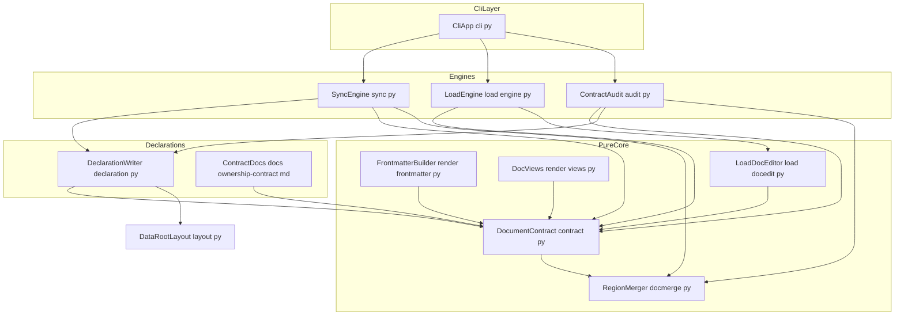
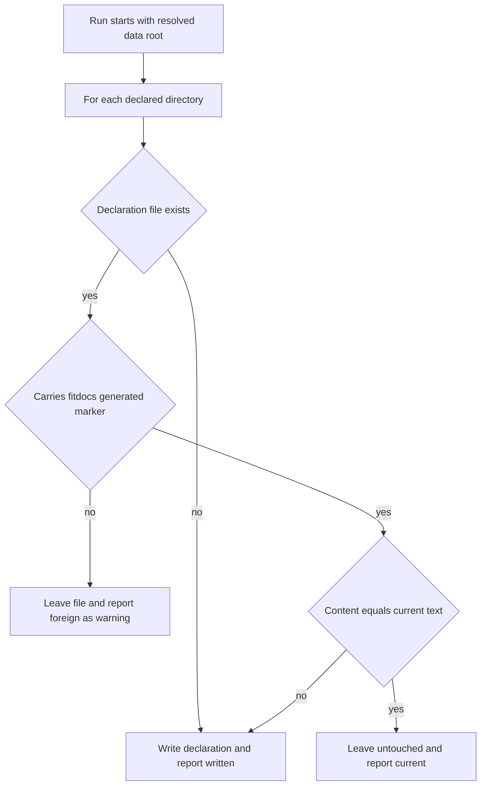
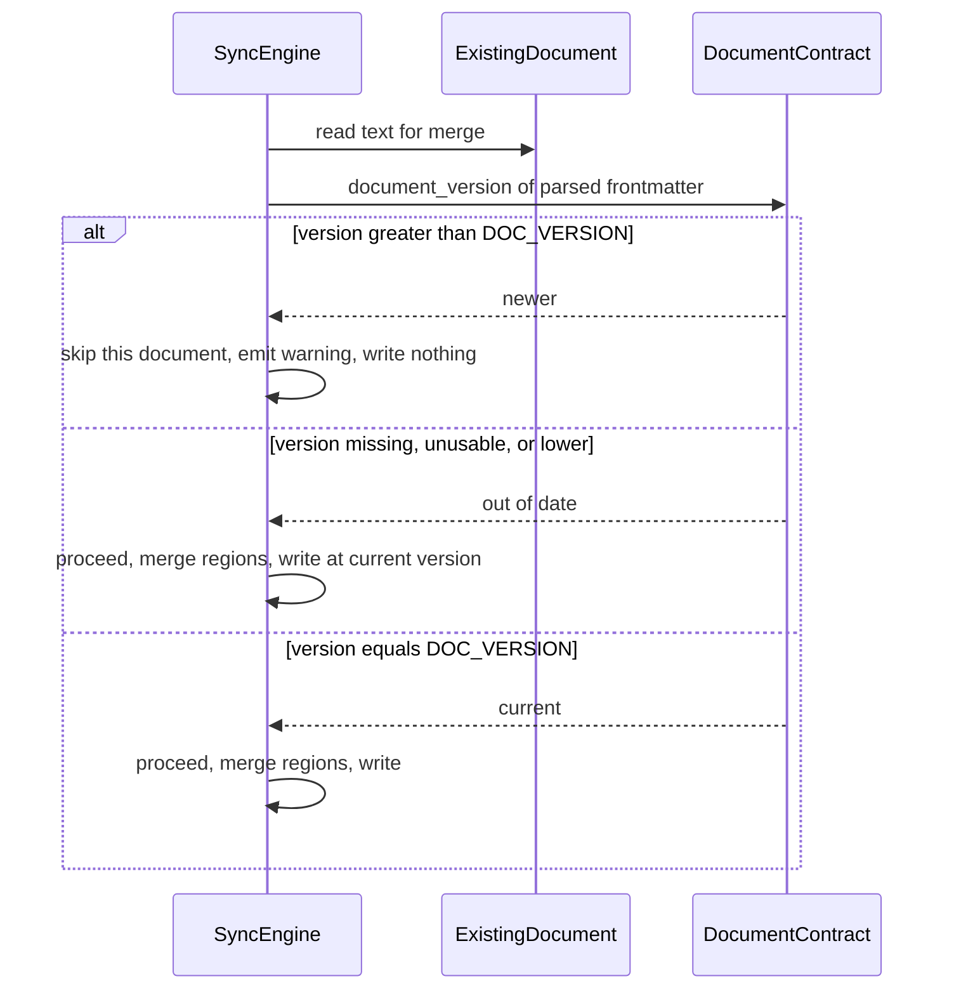
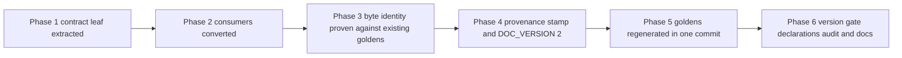

# Technical Design: wiki-contract

## Overview

**Purpose**: wiki-contract makes fitdocs safe to install into a markdown wiki it does not control. It replaces an implicit, code-resident ownership arrangement with one authoritative in-code definition of the document contract plus three declaration surfaces — a published contract document, an `AGENTS.md` ownership declaration inside every directory fitdocs owns, and a provenance stamp on every generated document — and adds the missing half of the `doc_version` story: drift detection, regenerate-as-migration, and a refusal to downgrade.

**Users**: Wiki maintainers (human) read the published contract and the in-tree declarations before trusting fitdocs with their vault; LLM agents maintaining the wiki read the nearest `AGENTS.md` before editing anything under `workouts/` or `fit-archive/`; every fitdocs user benefits from consistent document interpretation and from being warned instead of silently losing frontmatter keys.

**Impact**: No change to the region merge algorithm, the marker grammar, the section structure, the archive semantics, or the write pipeline. Policy constants move out of `docmerge.py` into a new pure leaf; three duplicated frontmatter parsers, two duplicated session-UUID formatters, and two divergent source-history resolvers collapse into that leaf. Generated documents gain exactly two constant lines (`generator: fitdocs` in frontmatter, one HTML-comment banner after it), which is a document-format change and therefore bumps `DOC_VERSION` 1 → 2. One workout-docs guarantee is narrowed as stated in Requirement 3.8: "a sync run that discovers no new files leaves the data root unchanged" becomes "…leaves the data root unchanged once the ownership declarations are current".

### Goals

- One pure contract leaf that every command reads a document through, so sync, regen, load and inspection can never disagree about what a document is.
- A versioned ownership contract published in `docs/`, restated inside each owned directory as `AGENTS.md`, and stamped onto each generated document — all three generated from the same constants.
- `doc_version` drift detected and reported, regeneration named as the migration, and a document written by a newer fitdocs left strictly alone.
- The frontmatter-key guarantee stated and enforced: the block is tool-owned, and a regeneration that would drop unmanaged keys warns instead of losing them silently.
- A read-only `fitdocs check` that answers "does this tree match the installed fitdocs?" without writing anything.

### Non-Goals

- Any change to `docmerge`'s grammar, `extract_regions`, `merge_regions`, or `RegionError` semantics — they are published verbatim, not modified.
- Preserving frontmatter keys fitdocs does not manage; user-configurable region sets, templates, or renderers.
- Enforcement beyond declaration: no filesystem permissions, no git hooks, no `.gitattributes` emission (guidance only).
- Tool version or generation timestamp in documents (would break byte-identical regeneration).
- In-place transformation of old documents — migration is regeneration from `fit-archive/`.
- Changing `sync`'s write strategy to per-file atomic replacement (recorded in `research.md`; no requirement behind it).
- Inbox/ingestion configuration, plugin discovery, packaging/release (sibling specs).

## Boundary Commitments

### This Spec Owns

- The **document contract** as a single definition: the frontmatter schema (managed key set, key order ownership, `DOC_VERSION`), document identity (`type`, `generator`, `uuid`, `sources`, session-UUID formatting, archive-ref resolution), and the region **ownership policy** (which ids exist, who owns each, the preserved set, placeholder texts).
- The **provenance stamp**: the `generator` frontmatter key and the generated-by banner line, their placement, and their invariance.
- The **ownership declaration**: `AGENTS.md` content, the directories that receive it, the write-when-different rule, and the never-overwrite-a-foreign-file rule.
- The **published ownership contract** `docs/ownership-contract.md` and its version identifier, plus the README pointer and the version-control (`linguist-generated`) guidance.
- The **owned-path set** — `workouts/`, `workouts/assets/`, `fit-archive/`, `.cache/`, and `.fitdocs/` (tool-owned state under the data root, e.g. inbox's quarantine record) — and the **configured-location clause**: a location the user's settings name as a place fitdocs writes (inbox's intake directory and its optional `processed/` destination) is granted create/write rights by that configuration; such locations are named in `fitdocs.toml`, not fixed by the contract. Fitdocs writes nowhere outside the owned set plus the configured locations (2.1, 2.10, 7.5). _(Amendment 2, 2026-09-11)_ `history/` and `history/assets/` are also fitdocs-owned; naming and writing them is `load-history`'s, not this spec's.
- **Document-format versioning behavior**: the drift classification (out of date / current / newer), the downgrade refusal in `sync` and `regen`, and migration-by-regeneration as the stated path.
- The **unmanaged-frontmatter-key warning** raised when a rewrite would drop keys.
- The **`fitdocs check` command**, its findings model, its presentation, and its exit-code mapping onto the existing 0/1/2 contract.
- _(added by Amendment, 2026-09-11)_ The **frontmatter-key-ownership contract's extension to a user-owned key class**: publishing the class as disjoint from the managed set, its byte-for-byte carry-forward and rebuild placement, and its exclusion from the unmanaged-key warning and finding (6.5-6.8). The vocabulary, validation, and typed reader of any particular user-owned key class (the effort tag) remain `effort-tags`' own.

### Out of Boundary

- The region merge mechanism (`docmerge.extract_regions`, `merge_regions`, `RegionError`, the marker regex) — declared as-is; only the two policy constants leave the module.
- Document structure, section order, chart assets, splits, strength tables (workout-docs owns them).
- The content of the `load` region and the semantics of the three load frontmatter keys (training-load owns them; this spec only lists them as managed and moves their parsing helper).
- The archive, dedup, identity derivation from `.fit` developer fields, and the sync write/commit order (workout-docs owns them).
- Tile settings, the tile cache, and the warnings channel's own definition (route-maps owns them; this spec adds new warning *instances*, not a new channel).
- How `.fit` files arrive and how failures are quarantined (inbox); extension discovery (plugin-api); packaging and release (distribution). Specifically: `drain()`, the `[inbox]` settings and the resolution of the locations they name, and the disposition policy are inbox's to build — this spec states only the ownership, declaration-refresh, and completion-discriminator rules they must satisfy, and implements none of them.
- The user's own root-level agent instructions file, `.gitattributes`, or any other path outside the fitdocs-owned directories.

### Allowed Dependencies

- `contract` → `docmerge` (marker helpers only) and `yaml` (read-only `safe_load`). It imports **nothing** from `render`, `sync`, `load`, `cli`, `layout`, or `model`.
- `declaration` → `contract` + `layout` (owned-directory constants and paths). Performs file I/O; the text builder inside it is pure.
- `audit` → `contract`, `declaration`, `layout`, `docmerge`. Read-only: opens files, writes none, decodes no `.fit`, touches no network.
- `render/{frontmatter,sections,views}` → `contract` (schema, region policy, placeholders, banner). Render stays a pure function of `DocContext`.
- `sync` → `contract`, `declaration`, plus its existing dependencies. `load/{engine,docedit}` → `contract`.
- `cli` → `audit` (new), plus its existing dependencies.
- Direction, violations are errors: `docmerge → contract → {render, declaration, audit, sync, load} → cli`; `layout → {declaration, audit}`. Nothing imports `cli`; `contract` imports no fitdocs module except `docmerge`.

### Revalidation Triggers

- Changing `DOC_VERSION`, the managed key set, or the frontmatter key order → every golden document and the published contract must be regenerated; downstream consumers of the frontmatter (pkm queries, dataview-style tooling) must re-check.
- Changing the region ownership policy (ids, owners, preserved set) → training-load's region classification and the emitted declarations both change; re-check `load/docedit`.
- Changing `CONTRACT_VERSION` or the declaration text → every data root's `AGENTS.md` is rewritten on the next sync; the published contract must state what changed.
- Changing the owned-path set in `layout` → the declaration targets, the contract document, and Requirement 7.5's enforcement test all change.
- Changing the exit-code mapping of `check` → any automation gating on it must be re-checked (distribution spec publishes it).

#### Cross-spec integration obligations (wiki-contract ↔ inbox)

inbox lands after this spec and adds a third engine entry point, `drain()`, a configured intake directory with an optional `processed/` subdirectory, and `<data-root>/.fitdocs/quarantine.toml`. Four obligations are recorded here so both specs are revalidated together when either moves:

1. **Owned paths and configured locations.** `.fitdocs/` is in `OWNED_PATHS` from this spec onward, so inbox's quarantine record needs no widening. The intake directory and its `processed/` destination are *configured* locations, not owned paths: the published contract's configured-location clause (2.10) covers them, and inbox must not add them to `OWNED_PATHS`. If inbox introduces a further tool-written location that is neither under `.fitdocs/` nor named in the settings file, the owned-path set and the contract document change together and `CONTRACT_VERSION` bumps.
2. **Guard-test shape.** The Requirement 7.5 guard (task 1.3, re-asserted in 7.2) is parameterized by *entry point* and by *permitted locations* (`OWNED_PATHS` ∪ the contract-named shared files fitdocs legitimately writes ∪ the locations resolved from the settings under test), so that writing into a legitimately configured intake or processed directory does not fail it and so that inbox can register `drain()` as a fourth case (after `sync`, `regen`, and `load`) without rewriting the guard.
3. **Declaration refresh and skip semantics.** Every writing entry point refreshes declarations (see DeclarationWriter) and must honor the version gate's unarchived-skip outcome (see SyncEngine). inbox owns applying both to `drain()` and to its disposition policy.
4. **Shared document read and symlink scan (AMENDMENT, 2026-07-22, task 7.2).** A writing entry point must read a workout document's frontmatter through `docio.read_frontmatter` — the shared read behind every *writing* path (`sync` and the load engine; `audit` deliberately keeps its own `_read_document` because a finding must name the unreadable *cause*, and reuses only docio's symlink strings) — rather than a local `open`/`read_text`, and must run the once-per-run symlink scan (`_scan_symlinked_documents`, sitting beside `refresh_declarations`) rather than a per-file symlink check. Both were structural changes this spec's implementation made that the original design did not record: a per-file check cannot see a property of the data root, and a local read is exactly the kind of second copy `docio.py` exists to prevent. inbox's `drain()` must satisfy both when it lands.

#### Cross-spec integration obligations (wiki-contract ↔ athlete-benchmarks)

One **pure frontmatter reader** is added to the module this spec owns, specified by athlete-benchmarks and landed by training-load (see item 4):

```python
def document_date(frontmatter: Mapping[str, object] | None) -> date | None: ...
```

Recorded here so both specs are revalidated together when either moves:

1. **Scope of the incursion.** The accessor is additive only: it adds **no frontmatter key**, changes **no existing reader**, and does not alter `MANAGED_KEYS` membership or the key order. It returns the document's local calendar date for either the quoted `YYYY-MM-DD` string the renderer emits or a bare YAML date a hand-edit produces, and `None` for an absent key, a wrong-typed value, or an unparseable string — it never raises and never guesses.
2. **Why it belongs here rather than in the caller.** The renderer writes the document date as a *quoted string*, so reading it back is a parse, not a lookup; and `engine.py` holds the invariant that every frontmatter read goes through `fitdocs.contract`. A local `date.fromisoformat` at the call site would be exactly the second copy that invariant exists to prevent.
3. **Test module.** It extends `tests/test_contract.py` — this spec's own test module — with one added case for `document_date`. No existing case changes.
4. **Ownership and sequencing (revised 2026-07-25, second cross-spec round).** athlete-benchmarks **specifies** the accessor; **`training-load` task 4.1 lands** it, with its boundary extended to this module. The first round assigned the landing to athlete-benchmarks task 5.1; training-load's design re-validation reassigned it, because task 4.1 cannot build its per-pass `LoadContext` without the accessor while athlete-benchmarks had committed no task. athlete-benchmarks task 5.1 is now a consumer that creates the reader only as a fallback, to this exact signature, if task 4.1 has not landed first — so exactly one `document_date` is ever written. The sequencing question against `training-load` task 2.4 (the `LOAD_KEYS` rename plus the `DOC_VERSION` 2 → 3 bump, which touches the same module and the same test module) is **already settled by ordering**: task 2.4 landed as the single atomic commit `a782034`, so the accessor rebases onto it rather than interleaving with it. Nothing blocks on that coordination.
5. **Revalidation.** Any later change to this module's reader set, to `MANAGED_KEYS`, or to the on-disk form of the frontmatter `date` key → re-check `document_date` and athlete-benchmarks' engine date resolution.

## Architecture

### Existing Architecture Analysis

- `docmerge.py` is a pure mechanism module over `re`, fully generic in region id; its two policy constants (`PRESERVED_REGIONS`, `LOAD_NOT_COMPUTED`) are referenced by none of its own functions, and `PRESERVED_REGIONS` is imported nowhere in `src/`. Region ids appear as bare literals at four call sites.
- Three frontmatter parsers exist: `sync.py:679` and `load/engine.py:426` are byte-identical `splitlines()` implementations; `load/docedit.py:248` is a line-index variant over `split("\n")` required for lossless line-level upsert. Two byte-identical session-UUID formatters exist (`layout.py:167`, `render/frontmatter.py:57`). Two divergent source-history resolvers exist (`sync._sha_of_ref` + `archive_path` validate the ref; `engine._resolve_archive` joins it raw).
- `render_document(ctx)` is a pure function of `DocContext`; `sync` is the only writer, committing assets → document → archive-last (archive presence is the processed marker). `load/engine` writes atomically via `mkstemp` + `os.replace`.
- `SyncReport` already carries `warnings: tuple[DocWarning, ...]` — additive, never entering `failures`, never changing the exit code — and the CLI already renders a warnings row plus per-document detail. Exit codes are fixed at `0` success / `1` failures / `2` config error.
- `build_frontmatter` constructs its mapping from scratch and emits one `yaml.safe_dump`; regeneration therefore rewrites the whole block. `sync` has no `doc_version` awareness at all.
- Golden coverage: eight documents under `tests/render/golden_docs/`, byte-identity and portability tests, plus inline frontmatter byte-string assertions in `tests/render/test_frontmatter.py` and `tests/test_sync.py`.

### Architecture Pattern & Boundary Map

Policy-leaf pattern: one pure module holds the contract *data*; mechanism modules stay untouched; three thin surfaces (render stamp, emitted declaration, published document) and one read-only pass all derive from that single definition.



**Architecture Integration**:

- Selected pattern: **policy leaf + mechanism leaf**. `contract.py` owns *what the contract says*; `docmerge.py` keeps owning *how regions are spliced*. Every declaration surface is generated from `contract.py`'s constants so the emitted `AGENTS.md`, the provenance banner, and the published document cannot drift from behavior.
- Domain boundaries: parsing/identity/policy (contract) · region splicing (docmerge) · document assembly (render) · orchestration and writing (sync/load engines) · declaration placement (declaration) · read-only reporting (audit) · presentation (cli).
- Existing patterns preserved: pure render, single-writer sync, archive-last commit order, frozen dataclass contracts, loud config failure (exit 2), rich-table reporting, additive warnings channel, deterministic byte-identical output.
- New components rationale: `contract.py` is the single source of truth Requirement 1 demands; `declaration.py` isolates the only new file-placement behavior behind a testable seam usable by both `sync` and `audit`; `audit.py` gives Requirement 8's read-only pass a home without entangling it with the writing engines.
- Steering compliance: no new runtime dependency (stdlib + already-present `pyyaml`); `mypy --strict` on all new interfaces; absent data stays `None` (an unusable `doc_version` is `None`, never a fabricated `0`); nothing written outside the data root.

### Technology Stack

| Layer | Choice / Version | Role in Feature | Notes |
|-------|------------------|-----------------|-------|
| CLI | `typer` (existing) | `fitdocs check` command, options mirroring `regen` | `--out` only; no new option kinds |
| Reporting | `rich` (existing) | Findings table for `check`, warnings rows for sync/regen | Reuses `_print_detail` presentation |
| Frontmatter read | stdlib-adjacent `pyyaml` `safe_load` (existing) | The single parse implementation in `contract` | No new dump path; emission stays in `render/frontmatter` |
| Region grammar | `re` via existing `docmerge` | Unchanged | Contract re-exports marker helpers, defines no new grammar |
| Declaration format | plain markdown (`AGENTS.md`) | In-tree ownership declaration | Cross-tool convention; nested per-directory resolution |

No new runtime dependencies.

## File Structure Plan

### New Files

```
src/fitdocs/
├── contract.py            # Pure policy leaf: DOC_VERSION, CONTRACT_VERSION,
│                          #   WORKOUT_TYPE/GENERATOR + key names, MANAGED_KEYS,
│                          #   LOAD_KEYS, region ownership policy (USER_REGIONS,
│                          #   TOOL_REGIONS, PRESERVED_REGIONS, region ids,
│                          #   placeholders, LOAD_NOT_COMPUTED), the generated
│                          #   banner, and the pure readers: parse_frontmatter,
│                          #   frontmatter_close_index, is_workout_document,
│                          #   is_generated, document_uuid, document_version,
│                          #   source_refs, sha_of_ref, unmanaged_keys,
│                          #   format_session_uuid.
├── declaration.py         # AGENTS.md text builder (pure) + placement:
│                          #   declaration_text, declaration_path,
│                          #   ensure_declarations (write-when-different,
│                          #   never over a foreign file),
│                          #   inspect_declarations (read-only),
│                          #   DeclarationState, DeclarationOutcome.
├── audit.py               # Read-only contract audit: Finding, FindingKind,
│                          #   AuditReport, audit(data_root). No writes, no .fit
│                          #   decode, no network.
└── docio.py               # AMENDMENT (2026-07-22, task 7.2): the shared
                           #   filesystem read behind the *writing* paths --
                           #   read_frontmatter(path), plus the symlink-refusal
                           #   detail/remedy strings every caller's
                           #   finding/warning reuses. Not in the original
                           #   design: task 7.2 found sync and the load engine
                           #   each carrying its own local copy of this read,
                           #   functionally identical to each other and *both*
                           #   lacking the symlink refusal that
                           #   audit._read_document already had -- so a
                           #   symlinked workouts/*.md was refused by `check`
                           #   and followed by every writer. Collapsing the two
                           #   into this one function closed that gap. See
                           #   amendments in `spec.json`.

docs/
└── ownership-contract.md  # The published, versioned ownership contract.

tests/
├── test_contract.py       # Parsing, identity, version, managed/unmanaged keys,
│                          #   region policy, leaf-import purity.
├── test_declaration.py    # Text determinism, write-when-different, foreign-file
│                          #   refusal, invisibility to document scans.
├── test_audit.py          # Each finding kind, clean tree, path/remedy content.
└── test_ownership_contract.py  # Published doc lists exactly the region ids,
                           #   owned paths, and managed keys the module exposes.
```

### Modified Files

- `src/fitdocs/docmerge.py` — remove `PRESERVED_REGIONS` and `LOAD_NOT_COMPUTED` (they move to `contract`); docstring amended to describe the module as pure mechanism and to point at `contract` for policy. Functions and the regex are untouched.
- `src/fitdocs/contract.py` consumers:
  - `src/fitdocs/render/frontmatter.py` — import `DOC_VERSION`, `format_session_uuid`, and the key-name constants from `contract`; delete the local session-UUID copy; insert `generator: fitdocs` into the fixed key order (immediately after `type`, before `doc_version`).
  - `src/fitdocs/render/views.py` — import region ids and placeholder texts from `contract`; emit the generated-by banner between the frontmatter block and the H1 in `_assemble`, outside every region.
  - `src/fitdocs/render/sections.py` — import `LOAD_NOT_COMPUTED` and the `load`/`notes` region ids from `contract` instead of literals and `docmerge`.
  - `src/fitdocs/layout.py` — `_format_session_uuid` delegates to `contract.format_session_uuid`; add `DECLARED_DIRS` (the top-level directories that receive an `AGENTS.md`) and `OWNED_PATHS` = `("workouts/", "workouts/assets/", "fit-archive/", ".cache/", ".fitdocs/")` — every path the contract names as fitdocs-owned, for the contract document and the Requirement 7.5 test. `.fitdocs/` is the tool-owned state directory under the data root (inbox's quarantine record lands there); it receives no `AGENTS.md` and is not the `.fitdocs/data-root` pointer file, which lives in the *source* tree outside the data root and stays read-only to fitdocs.
  - `src/fitdocs/sync.py` — replace `_parse_frontmatter`, `_read_frontmatter`, `_sources`, `_sha_of_ref`, `_WORKOUT_TYPE`, `_FRONTMATTER_FENCE` with `contract` calls; call `ensure_declarations` once per run and turn a foreign declaration into a `DocWarning`; before rewriting a matched document, read its `doc_version` and skip-with-warning when it is newer; emit an unmanaged-key `DocWarning` when a rewrite would drop keys.
  - `src/fitdocs/load/engine.py` — replace `_parse_frontmatter`, `_WORKOUT_TYPE`, `_FRONTMATTER_FENCE`, `_discover_workout_docs`'s predicate and `_resolve_archive`'s ref handling with `contract` calls (converging on the ref-validating form).
  - `src/fitdocs/load/docedit.py` — use `contract.frontmatter_close_index`, `contract.LOAD_REGION`, and `contract.LOAD_KEYS` in place of `_FENCE`, `_frontmatter_close_index`, `_LOAD_REGION_ID`, and `FRONTMATTER_LOAD_KEYS` (the latter re-exported for compatibility with its tests).
  - `src/fitdocs/cli.py` — new `check` command; `_report_audit` presentation; docstring amendment for the new command and its exit codes.
- `README.md` — an Ownership section: what fitdocs owns, what the user owns, a link to the published ownership contract **by project documentation URL** (the README is rendered into the distribution metadata, where a repo-relative `docs/` path does not resolve), and the `linguist-generated` guidance for wikis under version control.
- `tests/render/golden_docs/*.md` (8 files) — regenerated for the `generator` key and the banner.
- `tests/render/test_frontmatter.py`, `tests/test_sync.py` — inline frontmatter byte-string assertions updated for the two new lines.
- `tests/test_docmerge.py`, `tests/load/test_docedit.py`, `tests/render/test_views.py`, `tests/render/test_sections.py` — import moved constants from `contract`.
- `tests/test_public_api.py` — the contract module's exported surface.
- `tests/test_determinism.py` — byte-identity across the refactor and with the stamp present.

## System Flows

### Ownership declaration placement (per sync/regen run)



Key decisions: the directory is created only when the run will write into it anyway, so `check` never creates directories; a foreign file is a warning, never a failure (3.6); the content comparison is what preserves the "no new files, no changes" invariant (3.8).

### Document-format version gate on rewrite



Flow decisions: the gate runs **before** any write and after the document match, so the source file is left unarchived and the run retries idempotently next time (5.5). Out-of-date documents are upgraded silently by the rewrite — reporting them is `check`'s job (5.3), since a command that fixes the drift has nothing to warn about.

**The skipped label is not a completion signal (5.8, 5.9).** The version-gate outcome writes nothing, archives nothing, and counts the file as *skipped* in the report — but `skipped` is a presentation bucket shared with "already processed", not a statement that the source is done. Because the retry depends entirely on the source remaining available and unarchived, this outcome must **not** be treated as a completed file by any disposition, archival, cleanup, or move policy: relocating such a source out of its intake location would orphan it and permanently defeat the retry the gate exists to preserve.

The correct discriminator for every downstream consumer is **archive presence** — the source's content is in `fit-archive/` — never the `skipped` label. This is already the invariant the sync engine's archive-last commit order establishes (archive presence *is* the processed marker); the version gate makes the distinction load-bearing rather than incidental. Recorded as a **cross-spec obligation on inbox**: its "move" disposition relocates written-or-skipped files, so it must gate on archive presence for the file it is about to move rather than on the report bucket, and must leave a version-gated source in place. See "Cross-spec integration obligations" above.

### Unmanaged-key detection on rewrite

The existing document's frontmatter is already parsed for the version gate; `unmanaged_keys` subtracts `MANAGED_KEYS` from its key set. A non-empty result becomes a `DocWarning` naming the document and the sorted key names (6.3). First-time renders have no existing document and therefore never warn.

## Requirements Traceability

| Requirement | Summary | Components | Interfaces | Flows |
|-------------|---------|------------|------------|-------|
| 1.1, 1.2, 1.3 | One frontmatter/identity/source interpretation everywhere | DocumentContract, SyncEngine, LoadEngine, ContractAudit | `parse_frontmatter`, `is_workout_document`, `source_refs`, `sha_of_ref` | — |
| 1.4 | One region ownership policy | DocumentContract, DocViews, SharedSections, LoadDocEditor | `USER_REGIONS`, `TOOL_REGIONS`, `PRESERVED_REGIONS`, region ids | — |
| 1.5, 1.6 | Output differs only by stamp and version; still byte-identical | FrontmatterBuilder, DocViews | `build_frontmatter`, `_assemble` | — |
| 2.1–2.9 | Published, versioned ownership contract + VCS guidance | ContractDocs, DataRootLayout, DocumentContract | `docs/ownership-contract.md`, `OWNED_PATHS`, `CONTRACT_VERSION` | — |
| 2.10 | Configured locations fitdocs may create are contract-covered | ContractDocs, DataRootLayout | configured-location clause, `OWNED_PATHS` | — |
| 3.1–3.4, 3.7 | Declaration content, placement, portability, invisibility | DeclarationWriter, DocumentContract | `declaration_text`, `declaration_path`, `DECLARED_DIRS` | Declaration placement |
| 3.5, 3.6, 3.8 | Write-when-different, foreign-file refusal, no-op runs | DeclarationWriter, SyncEngine | `ensure_declarations`, `DeclarationState`, `DocWarning` | Declaration placement |
| 4.1, 4.5 | Machine-readable generator marker, invariant | DocumentContract, FrontmatterBuilder | `GENERATOR`, `GENERATOR_KEY` | — |
| 4.2, 4.3, 4.4 | Human-readable banner, hidden when rendered, outside regions | DocumentContract, DocViews | `DOC_BANNER`, `_assemble` | — |
| 5.1, 5.2 | Version recorded and bumped | DocumentContract, FrontmatterBuilder | `DOC_VERSION` | — |
| 5.3, 5.7 | Out-of-date and unusable versions reported | ContractAudit, DocumentContract | `document_version`, `FindingKind.OUTDATED_VERSION` | Version gate |
| 5.4, 5.6 | Regeneration upgrades and is the migration path | SyncEngine, RegionMerger | `regen`, `merge_regions` | Version gate |
| 5.5 | Newer documents left unchanged and reported | SyncEngine, DocumentContract | `document_version`, `DocWarning` | Version gate |
| 5.8, 5.9 | Gated source stays unarchived; archive presence, not `skipped`, marks completion | SyncEngine | archive-last commit order, `SyncReport` | Version gate |
| 6.1, 6.2 | Frontmatter tool-owned; managed set published | DocumentContract, FrontmatterBuilder, ContractDocs | `MANAGED_KEYS`, `LOAD_KEYS` | — |
| 6.3 | Dropped unmanaged keys warned | SyncEngine, DocumentContract | `unmanaged_keys`, `DocWarning` | Unmanaged-key detection |
| 6.4 | Config/profile unknown keys preserved and stated | ContractDocs | `docs/ownership-contract.md` | — |
| 7.1, 7.2, 7.3 | Verbatim region carry-over incl. under force; damage aborts | RegionMerger, SyncEngine | `merge_regions`, `RegionError` | — |
| 7.4, 7.5 | No discarding operation; writes confined to owned paths and configured locations | ContractDocs, DataRootLayout, SyncEngine | `OWNED_PATHS` + configured locations | — |
| 7.6 | Every writing entry point observes the same confinement | DataRootLayout, SyncEngine | entry-point-parameterized guard test | — |
| 8.1, 8.8 | Read-only, offline, no `.fit` decode | ContractAudit | `audit` | — |
| 8.2–8.6 | Findings for versions, damage, keys, declarations, with remedies | ContractAudit, DeclarationWriter, DocumentContract | `Finding`, `FindingKind`, `inspect_declarations` | — |
| 8.7 | Exit-code mapping | CliApp | `check` command, `_report_audit` | — |

## Components and Interfaces

| Component | Domain/Layer | Intent | Req Coverage | Key Dependencies (P0/P1) | Contracts |
|-----------|--------------|--------|--------------|--------------------------|-----------|
| DocumentContract | core (leaf) | The single definition of schema, identity, and region policy | 1.1–1.4, 4.1, 5.1, 5.7, 6.1, 6.2 | docmerge (P0), pyyaml (P0) | Service, State |
| DeclarationWriter | core | `AGENTS.md` text and placement | 3.1–3.8 | DocumentContract (P0), DataRootLayout (P0) | Service |
| ContractAudit | core | Read-only conformance pass | 5.3, 5.7, 8.1–8.6, 8.8 | DocumentContract (P0), DeclarationWriter (P0), docmerge (P1) | Service, Batch |
| FrontmatterBuilder | render | Emits the schema incl. the generator key | 1.5, 4.1, 4.5, 5.1, 6.1 | DocumentContract (P0) | Service |
| DocViews | render | Emits the banner and the regions from policy | 1.4, 1.5, 4.2–4.4 | DocumentContract (P0) | Service |
| LoadDocEditor | load | Uses the shared fence/region/key definitions | 1.1, 1.4, 6.2 | DocumentContract (P0) | Service |
| SyncEngine | engine | Version gate, key warning, declaration refresh | 1.1–1.3, 3.5, 3.6, 3.8, 5.4–5.6, 5.8, 5.9, 6.3, 7.1–7.3, 7.5, 7.6 | DocumentContract (P0), DeclarationWriter (P0), RegionMerger (P0) | Service, Batch |
| CliApp | cli | `check` command and findings presentation | 8.1, 8.6, 8.7 | ContractAudit (P0), rich (P1) | Service |
| ContractDocs | docs | The published contract and README pointer | 2.1–2.10, 6.4, 7.4 | DocumentContract (P0), DataRootLayout (P0) | — |

### Core (leaf)

#### DocumentContract (`src/fitdocs/contract.py`)

| Field | Detail |
|-------|--------|
| Intent | The authoritative, pure definition of what a fitdocs document is |
| Requirements | 1.1, 1.2, 1.3, 1.4, 4.1, 5.1, 5.7, 6.1, 6.2 |

**Responsibilities & Constraints**

- Owns the frontmatter schema vocabulary, the document identity readers, the region ownership policy, and the format/contract version numbers.
- Pure: no file I/O, no clock, no randomness, no network. Imports only `docmerge`, `yaml`, `uuid`, and typing.
- Never raises on malformed input: every reader degrades to `None` or an empty tuple, so callers keep their "skip unreadable documents" behavior unchanged (1.2).
- Does not define region grammar or merge behavior; it re-exports `docmerge`'s marker helpers so consumers need one import, and adds no new syntax.

**Dependencies**

- Inbound: FrontmatterBuilder, DocViews, SharedSections, LoadDocEditor, LoadEngine, SyncEngine, DeclarationWriter, ContractAudit, DataRootLayout — contract vocabulary (P0).
- Outbound: `fitdocs.docmerge` — `begin_marker` / `end_marker` / `region_block` re-export (P1).
- External: `pyyaml` `safe_load` — frontmatter parse (P0).

**Contracts**: Service [x] / State [x]

##### Service Interface

```python
# --- versions ---------------------------------------------------------------
DOC_VERSION: Final[int] = 2            # end state; the constant is *moved* at 1
                                       # during the refactor phases and raised to 2
                                       # only when the provenance stamp lands, so
                                       # the byte-neutrality checkpoint can hold
CONTRACT_VERSION: Final[str] = "1"     # the published ownership contract's version

# --- document identity vocabulary -------------------------------------------
WORKOUT_TYPE: Final[str] = "workout"
GENERATOR: Final[str] = "fitdocs"
FRONTMATTER_FENCE: Final[str] = "---"
TYPE_KEY: Final[str] = "type"
GENERATOR_KEY: Final[str] = "generator"
DOC_VERSION_KEY: Final[str] = "doc_version"
UUID_KEY: Final[str] = "uuid"
SOURCES_KEY: Final[str] = "sources"

LOAD_KEYS: Final[tuple[str, ...]] = ("load_points", "load_methodology", "load_zone")
MANAGED_KEYS: Final[frozenset[str]]    # every key fitdocs writes, incl. LOAD_KEYS

# --- provenance -------------------------------------------------------------
GENERATED_PREFIX: Final[str] = "<!-- fitdocs:generated"
DOC_BANNER: Final[str]                 # one line, constant, HTML comment

def generated_banner(note: str) -> str
def is_generated(text: str) -> bool

# --- region ownership policy ------------------------------------------------
NOTES_REGION: Final[str] = "notes"
WORKOUT_REGION: Final[str] = "workout"
LOAD_REGION: Final[str] = "load"
USER_REGIONS: Final[tuple[str, ...]] = (NOTES_REGION, WORKOUT_REGION)
TOOL_REGIONS: Final[tuple[str, ...]] = (LOAD_REGION,)
PRESERVED_REGIONS: Final[tuple[str, ...]] = USER_REGIONS + TOOL_REGIONS
NOTES_PLACEHOLDER: Final[str]
WORKOUT_PLACEHOLDER: Final[str]
LOAD_NOT_COMPUTED: Final[str] = "_Training load not computed._"

# --- pure readers -----------------------------------------------------------
def parse_frontmatter(text: str) -> dict[str, object] | None
def frontmatter_close_index(lines: list[str]) -> int | None
def is_workout_document(frontmatter: Mapping[str, object] | None) -> bool
def document_uuid(frontmatter: Mapping[str, object]) -> str | None
def document_version(frontmatter: Mapping[str, object]) -> int | None
def source_refs(frontmatter: Mapping[str, object]) -> tuple[str, ...]
def sha_of_ref(ref: str) -> str | None
def unmanaged_keys(frontmatter: Mapping[str, object]) -> tuple[str, ...]
def format_session_uuid(value: object) -> str | None
```

- Preconditions: none — every reader accepts arbitrary input.
- Postconditions: `parse_frontmatter` returns a mapping only for a document whose **first line** (stripped) is the fence and whose block parses to a mapping — matching the baseline parsers described above, which key on `lines[0].strip()`; a leading blank line means no frontmatter, and treating it otherwise would be a behavior change the byte-neutral refactor phases forbid; `document_version` returns an `int` only for an integer value (a `bool` is rejected), else `None`; `unmanaged_keys` returns sorted, deduplicated string keys not in `MANAGED_KEYS`; `sha_of_ref` returns a non-empty sha only for a well-formed `fit-archive/<sha>.fit` ref.
- Invariants: `PRESERVED_REGIONS == ("notes", "workout", "load")` in that order (unchanged from today); `LOAD_KEYS ⊂ MANAGED_KEYS`; `DOC_BANNER` starts with `GENERATED_PREFIX` and contains no value that varies per run or per release (4.5).

**Amendment (2026-09-11), landed by `effort-tags`:** the published surface gains a second frontmatter-key class, `USER_KEYS` (currently the four `EFFORT_KEYS`), held disjoint from `MANAGED_KEYS`, and a `user_owned_lines` reader that extracts the carried lines from a frontmatter block's line list. The `unmanaged_keys` postcondition above changes accordingly: it now returns sorted, deduplicated string keys not in `MANAGED_KEYS | USER_KEYS`, so a user-owned key is no longer reported by the unmanaged-key warning (6.3) or the unmanaged-key finding (8.4) -- see this spec's Requirement 6, criteria 6.5-6.8, added by the same amendment. The vocabulary, validation, and typed reader of any particular user-owned key class -- the effort tag's four keys, their kinds and value rules -- are `effort-tags`' own and are not restated here.

**Amendment (2026-09-11), landed by `load-history`:** the data root gains a second document type, the training-load history page, written to a new owned location (`history/`, `history/assets/`) this module does not name and does not write into. The type constant, the page's frontmatter schema, and its own format version (`history_version`) are declared in `fitdocs.history.page`, not here -- unlike the workout document, this second type is never routed through `is_workout_document`, `MANAGED_KEYS`, `DOC_VERSION`, or any other reader this module defines, and no reader here is extended to recognise it. The reason a second type exists outside this leaf rather than as a new value published from it: `src/fitdocs/contract.py` is the repository's most heavily pinned leaf, edited earlier in the same Phase 6 batch by `effort-tags` (`CONTRACT_VERSION` `"1"` to `"2"`) and now by `load-history` (`"2"` to `"3"`); two specs each adding vocabulary to that leaf within one batch is the conflict the boundary rules exist to prevent, so the type constant lives in `fitdocs.history.page` instead (`.kiro/specs/load-history/research.md`, "Decision: The page is typed, and its type constant lives in this package"). This spec's Requirement 2 criterion 2.11 records only that the location is fitdocs-owned and that a second document type exists there -- not what that type's schema is; Requirement 3 criterion 3.9 records what the location's own in-tree declaration states about that document, without restating its type or schema.

**Implementation Notes**

- Integration: `frontmatter_close_index` keeps `docedit`'s lossless `split("\n")` contract — it takes the already-split line list and returns an index, so `docedit` changes an import, not an algorithm.
- Validation: a purity test asserts the module imports nothing from `fitdocs.render`, `fitdocs.sync`, `fitdocs.load`, `fitdocs.cli`, `fitdocs.layout`, or `fitdocs.model`; a policy test asserts the region tuple order and that `MANAGED_KEYS` equals the union of the keys `build_frontmatter` can emit plus `LOAD_KEYS`.
- Risks: `MANAGED_KEYS` drifting from `build_frontmatter` — mitigated by the equality test above, which fails the moment a key is added to either side.

#### DeclarationWriter (`src/fitdocs/declaration.py`)

| Field | Detail |
|-------|--------|
| Intent | Compose and place the in-tree `AGENTS.md` ownership declaration |
| Requirements | 3.1–3.8 |

**Responsibilities & Constraints**

- Builds each directory's declaration text purely from `contract` constants and `layout` paths, so the declaration can never state a policy the code does not implement.
- **Every engine entry point that writes into the owned tree refreshes the declarations** before it processes files — not `sync` and `regen` specifically, but the rule. `sync()` and `regen()` are the two callers this spec implements; inbox's `drain()` is a known future caller and, once it exists, is expected to become the primary ingestion path, so the refresh call site must be a shared step rather than a copy inside each command. `load` is not a caller: it never creates the tree. Recorded as a cross-spec obligation on inbox (see "Cross-spec integration obligations"); `drain()` is out of this spec's scope and is not implemented here.
- **Documentation pointers in emitted text use the project-URL form.** The declaration is written into a user's tree, where a repo-relative path such as `docs/ownership-contract.md` resolves to nothing; the same applies to any text shipped in a distribution artifact, since the sdist allowlist excludes `docs/`. The declaration therefore points at the published contract by the documentation URL declared in `[project.urls]`, and the README's ownership section does the same. In-repo cross-references between repo files may keep relative paths.
- Writes only inside `DECLARED_DIRS`; never at the data root, never in `.cache/`, never over a file that lacks `GENERATED_PREFIX`.
- Writes only when the target is absent or its content differs — the rule that keeps a no-op run byte-neutral (3.8).
- Text is plain markdown with no frontmatter, so every `workouts/*.md` scan already skips it (3.7); a regression test pins that.

**Dependencies**

- Inbound: SyncEngine (refresh), ContractAudit (inspect) (P0).
- Outbound: DocumentContract — policy text and the generated marker (P0); DataRootLayout — `DECLARED_DIRS`, directory paths (P0).

**Contracts**: Service [x]

##### Service Interface

```python
DECLARATION_FILENAME: Final[str] = "AGENTS.md"

class DeclarationState(StrEnum):   # project convention for new enums
    CURRENT = "current"      # present, fitdocs-generated, content matches
    WRITTEN = "written"      # created or refreshed by this call
    MISSING = "missing"      # absent (inspect only)
    STALE   = "stale"        # present, fitdocs-generated, content differs (inspect only)
    FOREIGN = "foreign"      # present, not fitdocs-generated -> never overwritten

@dataclass(frozen=True)
class DeclarationOutcome:
    directory: str           # data-root-relative POSIX directory name
    path: str                # data-root-relative POSIX path of the declaration
    state: DeclarationState

def declaration_text(directory: str) -> str
def declaration_path(data_root: Path, directory: str) -> Path
def ensure_declarations(data_root: Path) -> tuple[DeclarationOutcome, ...]
def inspect_declarations(data_root: Path) -> tuple[DeclarationOutcome, ...]
```

- Preconditions: `directory` is one of `layout.DECLARED_DIRS`; `data_root` is a resolved, existing directory.
- Postconditions: `ensure_declarations` creates the parent directory only when it will write; after a successful call every declared directory holds either a current fitdocs declaration or an untouched foreign file; `inspect_declarations` mutates nothing.
- Invariants: `declaration_text` is deterministic and depends only on `contract` constants and the directory name; every produced text begins with a `GENERATED_PREFIX` line.

**Implementation Notes**

- Integration: `sync` and `regen` call `ensure_declarations` once per run after the data root is resolved and before per-file processing; `load` does not (it never creates the tree). `FOREIGN` outcomes become `DocWarning`s on the sync report. The call is placed as a single shared refresh step so a later entry point — inbox's `drain()` — reuses it instead of duplicating the logic.
- Validation: content-equality determinism; the foreign-file path leaves bytes and mtime untouched; sync/regen/load/check all ignore the declaration in document scans; the emitted text contains no repo-relative documentation path (it references the project documentation URL).
- Risks: a user's editor adding a trailing newline would make the file perpetually "stale" and rewritten each run — mitigated by comparing exact text and documenting the file as tool-owned, and by the write being idempotent thereafter.

#### ContractAudit (`src/fitdocs/audit.py`)

| Field | Detail |
|-------|--------|
| Intent | Report, without writing, where the owned tree diverges from the installed contract |
| Requirements | 5.3, 5.7, 8.1–8.6, 8.8 |

**Responsibilities & Constraints**

- Scans `workouts/*.md` in sorted order for deterministic output; skips anything that is not a fitdocs workout document (including the declarations).
- Produces four document-level finding kinds and three declaration-level ones; each finding names the affected subject (a data-root-relative path), what is wrong, and the action that fixes it (8.6).
- Follows the project-wide report-value convention shared with the sibling specs: fields are named `(subject, detail[, remedy])`, and new enums are `StrEnum` so a finding kind renders and serializes as its own name without a `.value` dance. `Finding.subject` is always a path here — its type annotation and docstring say so — but the field name matches the convention so the four specs' report tables read alike. `DocWarning(doc, detail)` is route-maps' shipped type and is **not** renamed.
- Never opens a `.fit` file, never performs network access, never writes (8.1, 8.8).
- Missing or unusable `doc_version` classifies as out of date, never as newer (5.7).

**Dependencies**

- Inbound: CliApp (P0).
- Outbound: DocumentContract — parse/identity/version/keys (P0); DeclarationWriter — `inspect_declarations` (P0); RegionMerger — `extract_regions` for damage detection (P1); DataRootLayout — directory paths (P1).

**Contracts**: Service [x] / Batch [x]

##### Service Interface

```python
class FindingKind(StrEnum):        # project convention for new enums
    OUTDATED_VERSION = "outdated_version"    # doc_version below DOC_VERSION, absent, or unusable
    NEWER_VERSION = "newer_version"          # doc_version above DOC_VERSION
    DAMAGED_REGIONS = "damaged_regions"      # extract_regions raised RegionError
    UNMANAGED_KEYS = "unmanaged_keys"        # frontmatter carries keys fitdocs does not manage
    DECLARATION_MISSING = "declaration_missing"
    DECLARATION_STALE = "declaration_stale"
    DECLARATION_FOREIGN = "declaration_foreign"

@dataclass(frozen=True)
class Finding:
    kind: FindingKind
    subject: str   # the thing the finding is about: a data-root-relative POSIX path
    detail: str    # what was observed
    remedy: str    # the action that resolves it

@dataclass(frozen=True)
class AuditReport:
    findings: tuple[Finding, ...]
    documents: int          # workout documents inspected

def audit(data_root: Path) -> AuditReport
```

- Preconditions: `data_root` is resolved by the existing CLI resolver (a `DataRootError` propagates to exit 2).
- Postconditions: no filesystem mutation; findings sorted by `subject` then `kind`; `documents` counts only recognized fitdocs workout documents.
- Invariants: a document can yield more than one finding; a clean tree yields `findings == ()`.

**Batch Contract**

- Trigger: `fitdocs check [--out PATH]`.
- Input/validation: the resolved data root; a missing `workouts/` directory yields zero documents, not an error.
- Output: `AuditReport` rendered as a rich table plus a per-finding detail listing.
- Idempotency & recovery: read-only and repeatable; a per-document read error is reported as a finding, never an exception that aborts the pass.

**Implementation Notes**

- Integration: the CLI maps `findings == ()` → exit 0, any findings → exit 1, `DataRootError` → exit 2, matching the existing contract (8.7).
- Validation: fixture data roots exercising each finding kind plus a clean tree; a guard asserting the pass writes nothing (directory snapshot before/after, including mtimes).
- Risks: scanning a large wiki — bounded by reading only the leading frontmatter block plus region markers of `workouts/*.md`; no `.fit` decode is the main cost saver.

### Render

#### FrontmatterBuilder (`src/fitdocs/render/frontmatter.py`) and DocViews (`src/fitdocs/render/views.py`)

| Field | Detail |
|-------|--------|
| Intent | Emit the provenance stamp and take region policy from the contract |
| Requirements | 1.4, 1.5, 4.1–4.5, 5.1, 6.1 |

**Responsibilities & Constraints**

- `build_frontmatter` inserts `generator: fitdocs` immediately after `type` and before `doc_version`, keeping the fixed insertion order and the single `yaml.safe_dump` emission path; every other key, guard, and rounding rule is unchanged.
- `_assemble` places `DOC_BANNER` on its own line between the frontmatter block and the H1, separated from the body by a blank line, so it sits outside every region and is refreshed by every regeneration (4.4).
- The banner is an HTML comment: invisible in rendered markdown, plainly visible in source (4.3).
- Region ids and placeholder texts come from `contract`; no literal region id remains in the render layer (1.4).
- Both remain pure functions of `DocContext`.

**Implementation Notes**

- Integration: the two added lines are the entire document-format delta; `DOC_VERSION` moves to 2 in the same change so drift detection has a real signal.
- Validation: all eight golden documents regenerated in one commit; a test asserts the banner is outside every extracted region and that `extract_regions` round-trips unchanged; a determinism test asserts two renders are byte-identical.
- Risks: golden churn hiding a refactor regression — mitigated by sequencing (see Migration Strategy): the consolidation lands first and must be byte-neutral.

### Engines

#### SyncEngine (`src/fitdocs/sync.py`)

| Field | Detail |
|-------|--------|
| Intent | Apply the contract when rewriting documents and keep declarations current |
| Requirements | 1.1–1.3, 3.5, 3.6, 3.8, 5.4–5.6, 5.8, 5.9, 6.3, 7.1–7.3, 7.5, 7.6 |

**Responsibilities & Constraints**

- Reads documents exclusively through `contract`; its local parser, fence constant, type constant, and `sources` reader are deleted.
- Calls `ensure_declarations` once per `sync`/`regen` run; `FOREIGN` outcomes become `DocWarning`s (3.6).
- Before rewriting a matched document: parse its frontmatter once, then (a) if `document_version` is greater than `DOC_VERSION`, write nothing for that source, record a `DocWarning`, and count the file as skipped (5.5); (b) otherwise compute `unmanaged_keys` and, when non-empty, record a `DocWarning` naming the document and the keys (6.3).
- The version-gate skip leaves the source **unarchived**, which is what makes the next run retry it (5.8). The `skipped` count is therefore not a completion signal: archive presence is the authoritative processed marker, and every downstream policy that acts on "finished" files must discriminate on that, not on the report bucket (5.9). This constrains inbox's disposition policy — recorded as a cross-spec obligation, not implemented here.
- Merge, commit order, archive-last semantics, `--force`, and `RegionError` handling are unchanged (7.1–7.3).

**Implementation Notes**

- Integration: the version gate sits after document matching and before `_write_outputs`, so a skipped source stays unarchived and the next run retries it idempotently.
- Validation: fixtures for newer/equal/older/absent/unusable versions; a test asserting that a version-gated source produces **no** `fit-archive/` entry and that a second run over the same source repeats the gate rather than treating it as done (5.8, 5.9); a `--force` sync preserving hand-edited `notes`; an unmanaged-key warning that leaves exit code 0; a run over an already-declared tree leaving every path's bytes and mtimes untouched (3.8, 7.5).
- Risks: double-parsing the existing document — avoided by parsing once and passing the mapping to both checks.

#### LoadEngine and LoadDocEditor (`src/fitdocs/load/{engine,docedit}.py`)

| Field | Detail |
|-------|--------|
| Intent | Read documents through the same contract as sync |
| Requirements | 1.1, 1.3, 1.4, 6.2 |

**Responsibilities & Constraints**

- `engine` drops its duplicate parser, type constant, and fence constant; its `_resolve_archive` converges on the ref-validating resolution (`sha_of_ref` + `archive_path`), which accepts every well-formed ref it accepted before and rejects malformed ones instead of joining them onto the data root.
- `docedit` takes the fence helper, the `load` region id, and the managed load-key tuple from `contract`, keeping `FRONTMATTER_LOAD_KEYS` as a re-export so its existing tests and public surface are unaffected. Its line-level upsert algorithm and `RegionState` classification are unchanged.
- **AMENDMENT (2026-07-22, task 7.2, Reqs 5.5, 5.8):** `LoadEngine` enforces its own copy of the document-format version gate. Task 7.2 found that `sync`/`regen` correctly refuse to rewrite a document recording a newer `doc_version`, but the CLI's load pass ran immediately afterward over every workout document regardless, rewriting a version-gated document's `load` region and its three frontmatter keys anyway — so Req 5.5's "left unchanged" guarantee held only for half of the document end-to-end. `apply_load`'s `_process_document` now reads `contract.document_version` before any restore/foreign/compute branch and, when it is strictly newer than `contract.DOC_VERSION`, leaves the document completely untouched and reports it skipped, mirroring the sync engine's own gate. Not in the original design, which described only `sync`/`regen` as gated; recorded because a writing entry point that reads a document must apply the same drift check the others do, not merely read it through the same contract.

**Implementation Notes**

- Integration: `LOAD_NOT_COMPUTED` now lives in `contract`; `docedit` and `render/sections` both import it from there, and `docmerge` no longer exports it.
- Validation: the whole existing load suite must pass unchanged; a targeted test asserts a hand-edited malformed `sources` entry is skipped rather than resolved to a stray path; a CLI-level test (not merely an `apply_load` unit test) proves a `doc_version: 999` document survives `fitdocs regen` byte-identical, since the defect this amendment records was invisible to tests that called `apply_load` directly.
- Risks: behavior drift in the resolver convergence — bounded by a test comparing both old behaviors on well-formed refs.

### CLI

#### CliApp (`src/fitdocs/cli.py`)

| Field | Detail |
|-------|--------|
| Intent | Expose `fitdocs check` and present findings |
| Requirements | 8.1, 8.6, 8.7 |

**Responsibilities & Constraints**

- `fitdocs check [--out PATH]` resolves the data root through the existing resolver, calls `audit`, prints a summary table plus per-finding detail (subject, detail, remedy) using the existing `_print_detail` presentation, and exits 0 / 1 / 2.
- Contains no contract logic; it is presentation and exit-code mapping only.
- The module docstring's command list and exit-code contract are amended.
- **Data-root posture rule** (project-wide, stated here because `check` is the first new command to exercise it): *a command that describes a tree requires a data root; a command that describes the installed tool does not.* `check` reports on a data root's contents, so an unresolvable data root is a configuration error — instructive stderr, exit 2, nothing scanned (8.7). By the same rule plugin-api's `plugins` describes the installed tool, degrades rather than failing, and exits 0, and distribution's `skill` needs no data root at all. The project-wide statement of this rule lives in distribution's `docs/compatibility.md`; this design states it for `check` and does not restate it for the sibling commands.

**Implementation Notes**

- Integration: `check` never constructs a tile store, never loads the athlete profile, and never runs the load pass.
- Validation: CLI tests for a clean tree (exit 0, "no findings" line), a tree with each finding kind (exit 1, path and remedy in output), and an unresolvable data root (exit 2, nothing scanned).

### Documentation

#### ContractDocs (`docs/ownership-contract.md`, `README.md`)

| Field | Detail |
|-------|--------|
| Intent | The published, versioned ownership contract and its README pointer |
| Requirements | 2.1–2.10, 6.4, 7.4 |

**Responsibilities & Constraints**

- Sections: contract version; owned paths (`workouts/`, `workouts/assets/`, `fit-archive/`, `.cache/`, `.fitdocs/`) and the statement that fitdocs writes nowhere else; the **configured-location clause** (2.10) — locations the user's settings name as places fitdocs writes, today the inbox intake directory and its optional `processed/` destination, are created and written by fitdocs because that configuration grants the right; they are named in `fitdocs.toml` rather than fixed by this contract, and configuring one widens nothing else; user-owned regions (`notes`, `workout`) and how to edit them; the tool-filled `load` region; what regeneration replaces and preserves; frontmatter ownership with the full managed key list and the "hand-authored content belongs in the notes region" rule; shared and user-owned files (`athlete.toml` written key-wise with unknown keys preserved, `fitdocs.toml` read-only to fitdocs, `.fitdocs/data-root` read-only); overwrite semantics of `sync`, `sync --force`, `regen`, and `load`, and the explicit statement that no operation discards user-owned region content; commit ordering and re-derivability (documents are rebuilt from `fit-archive/` + `athlete.toml`); document-format versions and regenerate-as-migration including the newer-version refusal; the `linguist-generated` guidance with the statement that fitdocs does not write `.gitattributes`; and how to reference `workouts/AGENTS.md` from a root instructions file the wiki owns.
- Every enumerated list in the document (owned paths, region ids, managed keys) must match the contract module exactly; a test enforces this.

**Implementation Notes**

- The document is the one place a repo-relative path is fine (it *is* the doc). Everything the tool emits into a user's tree or ships in an artifact — the `AGENTS.md` declaration and the README's ownership pointer — links to it by the project documentation URL from `[project.urls]`, because the sdist allowlist excludes `docs/` and a wiki has no `docs/` at all.
- Validation: `tests/test_ownership_contract.py` parses the document's enumerated lists and asserts set equality with `layout.OWNED_PATHS`, `contract.PRESERVED_REGIONS`, and `contract.MANAGED_KEYS`, and asserts the stated contract version equals `contract.CONTRACT_VERSION`. The owned-path assertion is set equality against the module, so `.fitdocs/` cannot be stated in one place and forgotten in the other; the configured-location clause is prose and is reviewed at each contract-version bump.
- Risks: prose drifting from behavior — bounded by the equality test for the enumerable parts; the narrative parts are reviewed at each contract-version bump.

## Data Models

### Domain Model

- **Document identity** is a value derived from frontmatter: `(type, generator, uuid, sources)`. `uuid` matches first, `sources` second — precedence unchanged from workout-docs Req 3.6.
- **Document format version** is an integer with three states relative to `DOC_VERSION`: *current*, *out of date* (lower, absent, or unusable), *newer* (strictly greater). Only *newer* blocks a rewrite.
- **Region ownership** partitions the preserved set: `USER_REGIONS` (`notes`, `workout`) are authored by the user; `TOOL_REGIONS` (`load`) is filled by fitdocs' load pass. Both are carried over verbatim by `merge_regions`; the distinction is what the declarations state, not how the merge behaves.
- **Frontmatter key ownership** partitions the block: `MANAGED_KEYS` are written by fitdocs and rewritten wholesale; everything else is unmanaged and not preserved.
- **Declaration state** is a per-directory value: current, written, missing, stale, or foreign.
- **Processing completion** is not a report label. A source is complete when its content is present in `fit-archive/`; the `written`/`skipped`/`failed` buckets are presentation. `skipped` covers both "already processed" (archived) and "version-gated" (not archived), so only archive presence discriminates (5.9).

### Logical Data Model

Frontmatter schema for `doc_version: 2`, in emission order — added key in bold:

| Key | Type | Presence | Owner |
|-----|------|----------|-------|
| `title` | str | always | render |
| `type` | str (`workout`) | always | render |
| **`generator`** | **str (`fitdocs`)** | **always** | **contract** |
| `doc_version` | int (`2`) | always | contract |
| `uuid` | str | when a session UUID is recorded | contract |
| `date`, `start_time` | str | when a start time is recorded | render |
| `sport`, `modality` | str | always | render |
| `indoor` | bool | when indoor | render |
| `distance_km`, `moving_time`, `avg_hr_bpm`, `avg_power_w`, `elevation_gain_m`, `calories_kcal` | number/str | when present | render |
| `sources` | list[str] | when non-empty | contract |
| `load_points`, `load_methodology`, `load_zone` | number/str | after a load pass | training-load |

`MANAGED_KEYS` is exactly this set. Any other key present in an existing document is unmanaged.

### Data Contracts & Integration

- **Provenance banner**: a single HTML-comment line beginning `<!-- fitdocs:generated`, containing a fixed human sentence and a pointer to the in-tree declaration. It does not match `docmerge`'s marker regex (whose `kind` group accepts only `begin`/`end`), so it can never be mistaken for a region marker.
- **Declaration file**: plain markdown, no frontmatter, first line is a `GENERATED_PREFIX` comment. Absence of `type: workout` is what keeps it invisible to every document scan.
- **Warnings**: new `DocWarning(doc, detail)` instances only — no change to the channel's shape or to exit codes.

## Error Handling

### Error Strategy

Every new condition is non-fatal by design; the feature adds no new exception type. Existing exception classes and their handling are untouched.

### Error Categories and Responses

| Condition | Classification | Response |
|-----------|----------------|----------|
| Foreign file occupying a declaration path (3.6) | warning | leave the file, `DocWarning`, run continues, exit 0 |
| Existing document at a newer `doc_version` (5.5, 5.8, 5.9) | warning | write nothing for that source, `DocWarning`, count as skipped, leave the source unarchived, exit 0 — the skipped bucket is not a completion signal; archive presence is |
| Rewrite would drop unmanaged frontmatter keys (6.3) | warning | proceed with the rewrite, `DocWarning` naming the keys, exit 0 |
| Damaged region markers on rewrite (7.2) | per-document error | unchanged: `RegionError`, document untouched, exit 1 |
| Unreadable document during audit (8.1) | finding | reported as a finding with its path, pass continues |
| Unresolvable data root for `check` (8.7) | config error | unchanged: instructive stderr, exit 2 |

### Monitoring

No logging framework is introduced. All new signals surface through the existing rich-table reports: the sync/regen warnings row and detail listing, and the new `check` findings table.

## Testing Strategy

### Unit Tests

- `contract`: fenced/unfenced/unterminated/non-mapping frontmatter → mapping or `None`; `document_version` on int, string, float, `bool`, absent, and negative values; `unmanaged_keys` sorted/deduplicated and empty for a fully managed document; `sha_of_ref` on well-formed, foreign, and traversal-shaped refs; `format_session_uuid` parity with the two implementations it replaces; region policy tuple order and `LOAD_KEYS ⊆ MANAGED_KEYS`.
- `contract` purity: the module imports nothing from `render`, `sync`, `load`, `cli`, `layout`, or `model`.
- `declaration`: `declaration_text` deterministic across calls and distinct per directory; every text starts with `GENERATED_PREFIX`; `ensure_declarations` writes when absent, leaves current files untouched (byte and mtime), refreshes stale ones, and never overwrites a foreign file.
- `audit`: each `FindingKind` produced by a purpose-built fixture tree; a clean tree yields no findings; every finding carries a data-root-relative `subject` path and a non-empty `remedy`; the pass writes nothing.
- `frontmatter`: `generator` present, in position, and constant; `DOC_VERSION == 2`; key omission rules unchanged.

### Integration Tests

- Consolidation is byte-neutral: at the end of the refactor phases — before the provenance stamp exists — sync/regen output is byte-identical to the unmodified committed goldens (no feature flag; the guarantee comes from sequencing).
- Version gate through `sync` and `regen`: a document at version 3 is left byte-identical, warned, and counted as skipped, and its source stays unarchived; a document at version 1 is upgraded to 2 with its `notes` region carried over verbatim.
- Unmanaged-key warning through `regen`: a hand-added `tags:` key produces a warning naming the document and the key, the run exits 0, and the key is gone from the rewritten document.
- Declaration lifecycle through `sync`: first run creates both declarations; a second run with no new files changes nothing under the data root; a foreign `workouts/AGENTS.md` is preserved and warned.
- Declaration invisibility: after declarations exist, `sync`, `regen`, `load`, and `check` all report the same document counts as before.
- `load` pass after a `regen`: the three load keys are restored exactly as today, and no unmanaged-key warning is produced for them.

### E2E / CLI Tests

- `fitdocs check` on a clean tree → exit 0 with a no-findings line; on a tree with a v1 document, a damaged document, a `tags:` key, and a missing declaration → exit 1 with all four paths and remedies present; with an unresolvable data root → exit 2.
- Full round trip: sync a fixture `.fit` into an empty data root, hand-edit the `notes` region, run `sync --force` and `regen`, and assert the edit survives both, the banner and `generator` key are present, and no path outside the permitted set — `OWNED_PATHS` plus any location the settings under test configure fitdocs to write into — was created or modified. The guard is parameterized over entry points (`sync`, `regen` here; `drain()` registers later) so 7.6 holds as entry points are added.
- Regeneration-as-migration: delete every document, run `regen` from `fit-archive/` alone, and assert each document returns at `doc_version: 2`.
- Portability: golden documents still render as valid markdown and the banner is absent from rendered output while present in source.
- The published contract's enumerated lists equal `layout.OWNED_PATHS`, `contract.PRESERVED_REGIONS`, and `contract.MANAGED_KEYS`, and its stated version equals `contract.CONTRACT_VERSION`.

## Migration Strategy

The document-format change and the consolidation refactor must not land as one indistinguishable diff.



- **Rollback trigger**: any golden diff during Phases 1–3 is a refactor bug, not expected churn — revert rather than regenerate.
- **Validation checkpoint**: Phase 3 runs the full suite with the *unmodified* golden files. Only Phase 5 regenerates them, and its diff must contain exactly the two added lines per document.
- **User-facing migration**: existing data roots hold `doc_version: 1` documents. `fitdocs check` reports them as out of date; `fitdocs regen` upgrades every one of them from the archive, preserving `notes`, `workout`, and `load` regions. No in-place transformation is written, and no user action is required beyond running `regen`.
