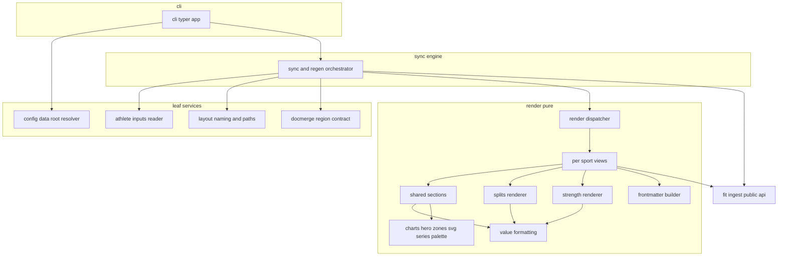
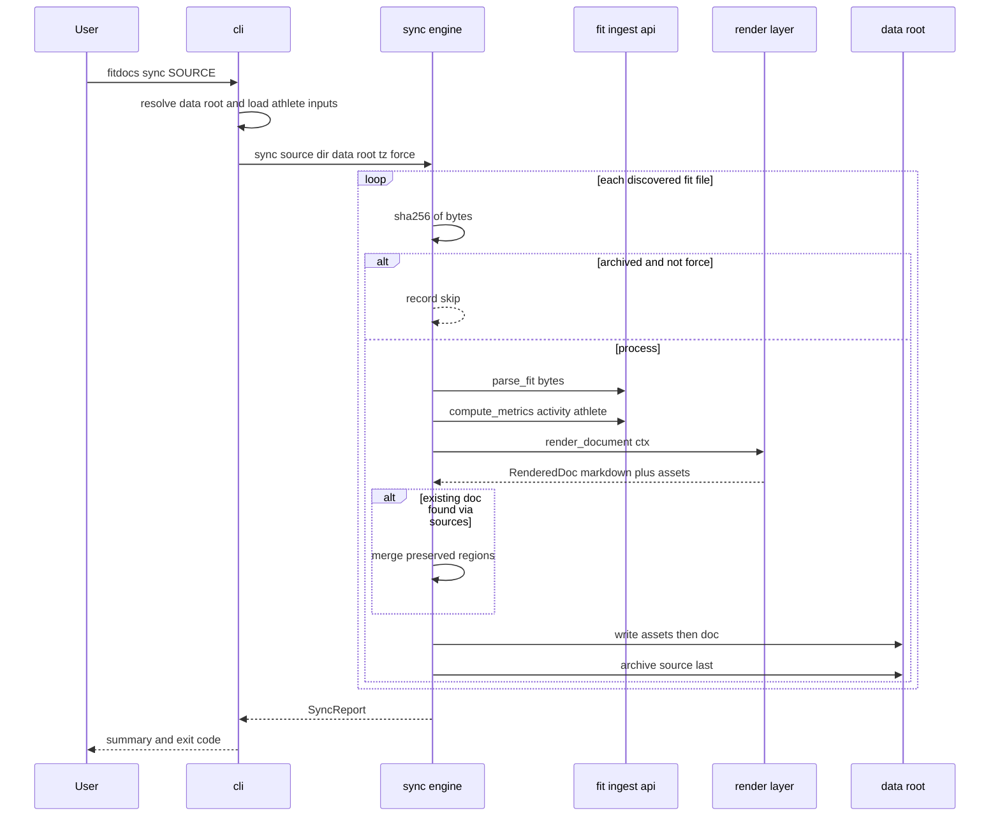

# Technical Design — workout-docs

## Overview

**Purpose**: workout-docs delivers fitdocs's visible value: the installable
`fitdocs` CLI that turns each `.fit` file in a directory into one strong,
readable markdown workout document with static SVG charts, written into a
user-configured data root. It renders per-sport views over the fit-ingest
activity model, archives every source file by content hash, and produces
documents that are first-class PKM pages yet readable in any markdown viewer.

**Users**: Athletes run `fitdocs sync` after exporting `.fit` files; they read
and annotate the generated documents in their PKM (Obsidian-style) or any
markdown renderer. The training-load spec consumes the document's reserved
load section as a downstream integration surface.

**Impact**: Extends the fit-ingest package skeleton with the CLI entry point,
config, sync engine, and render layer; modifies `pyproject.toml` (console
script + render/CLI dependencies). Establishes the data-root layout and the
document format contract (frontmatter schema, region markers) that
training-load builds on.

### Goals
- One command from `.fit` directory to finished documents; per-file failures
  never abort the batch (Req 1).
- Loud, contract-driven output location; date-prefixed kebab-case naming;
  relative asset links (Req 2).
- sha256-keyed archival as the dedup and provenance backbone (Req 3).
- Byte-deterministic rendering; idempotent re-runs; regeneration that never
  destroys user-authored or tool-filled regions (Req 4, 10, 11).
- Per-sport views at reference fidelity: run/ride hero + telemetry + splits +
  devices; strength summary + sets + manual workout section; generic fallback
  (Req 6, 9, 12); hero chart per the documented §3 spec (Req 7).
- Honest absence everywhere: no fabricated zeros, no default zones (Req 8, 13).

### Non-Goals
- No `.fit` parsing or metric computation (fit-ingest; consumed as library).
- No load calculation, no filling of the load section, no athlete profile
  creation/persistence/prompting (training-load).
- No route maps, no cycle/block rollups, no structured strength templates,
  no GPX/TCX, no automated `.fit` acquisition, no wikilink generation (v1 has
  nothing to link to; frontmatter is the PKM integration surface).

## Boundary Commitments

### This Spec Owns
- The `fitdocs` executable: `sync` and `regen` commands, flags, reporting,
  exit codes, packaging (console entry point, `uv tool install` flow —
  explicitly deferred to this spec by fit-ingest). `src/fitdocs/cli.py` is
  the declared extension point for training-load's additive pass wiring
  (its new `load` command, `--no-prompt` on `sync`, and the load pass after
  `sync`/`regen`) — an anticipated extension, not a boundary violation.
- Data-root resolution (`--out` > `FITDOCS_DATA` > `.fitdocs/data-root`) and
  the data-root layout: `workouts/`, `workouts/assets/`, `fit-archive/`.
- Document naming (`YYYY-MM-DD-<sport>-<slug>.md`) and collision policy.
- Source archival semantics: sha256-keyed copies, archive-presence-as-
  processed-marker, write ordering.
- The document format contract: frontmatter schema (`type: workout`,
  `doc_version`, `sources`), section structure per modality, and the region
  marker grammar (`notes`, `workout`, `load`) — including the load
  placeholder contract that training-load fills.
- SVG chart generation (hero chart, HR-zone strip) and its plain-series
  interface; the documented color palette constants.
- The read-only athlete-inputs file contract (`athlete.toml` keys this layer
  consumes); training-load owns the file's lifecycle and may extend it.
- Split re-slicing (1 km) and per-split display aggregates — presentation
  derivation over `Samples`, not contract metrics.

### Out of Boundary
- The activity model, decode error taxonomy, and all metric formulas
  (fit-ingest is authoritative; this spec never reads FIT messages).
- Methodology load values and the content that replaces the load region
  (training-load); athlete prompting and profile writes of any kind.
- Zone *definitions* — this layer only passes user-supplied dividers from
  `athlete.toml` into fit-ingest types; it never invents boundaries.
- Modifying, moving, or deleting anything in the user's source directory.

### Allowed Dependencies
- In-package: `fitdocs.model`, `fitdocs.ingest` (`parse_fit`, error types),
  `fitdocs.metrics` (`compute_metrics`, `AthleteInputs`, `ZoneSpec`,
  `DerivedMetrics`) — the fit-ingest public API only. This includes the
  additive fit-ingest amendment exposing session-scoped developer fields as
  a generic optional name→value mapping (real-data verified: HealthFit
  writes `SESSION UUID`, `SESSION INDOOR`, `SESSION WEATHER HUMIDITY`,
  `WORKOUT RPE ESTIMATED`, `AVG METs`).
- Runtime: `typer` (>=0.12), `rich` (>=13), `pyyaml` (>=6.0) — steering-
  pinned. Stdlib: `tomllib`, `hashlib`, `pathlib`, `datetime`, `re`.
  **No matplotlib**; no template engine; no network access ever.
- Internal direction (violations are review errors):
  `cli → sync → render → fit-ingest API`; `config`, `athlete`, `layout`,
  `docmerge` are leaves imported by `cli`/`sync` (and `render` may import
  `docmerge` marker/placeholder constants and `layout` asset naming only);
  `render/charts/*` imports nothing from fitdocs outside `render.charts`.
  Render performs no file I/O — `sync` owns all writes.

### Revalidation Triggers
Downstream (training-load) must re-check integration if:
- The region marker grammar or region ids (`notes`, `workout`, `load`)
  change, or the load section's heading/marker arrangement changes.
- The frontmatter schema changes (`sources` form, `doc_version` bump,
  key renames).
- The data-root layout (`workouts/`, `fit-archive/`) or naming scheme moves.
- The `athlete.toml` read contract (key names, divider semantics) changes.
- The not-computed placeholder line (`LOAD_NOT_COMPUTED` in
  `fitdocs.docmerge`) changes — training-load's PLACEHOLDER classification
  must revalidate.
- The CLI surface training-load extends (`src/fitdocs/cli.py` command
  names, flag semantics, exit-code meanings, or the post-`sync`/`regen`
  hook point) changes.

This spec must be revalidated if fit-ingest changes any of its declared
triggers (model field renames/retypes, `SCHEMA_VERSION` bump, `parse_fit` /
`compute_metrics` signatures or error taxonomy, `None`-convention or units,
`ZoneSpec` band semantics) — or if the session developer-fields amendment
changes shape (this design reads `SESSION UUID` and the recognized
supplemental keys from it).

## Architecture

### Architecture Pattern & Boundary Map

Layered pipeline continuation per steering: the CLI is a thin shell over a
sync engine that owns all I/O; rendering is pure (strings and SVG text out);
charts take plain series + style params (brief's reusable-seam requirement).



**Key decisions**
- One per-file pipeline (`hash → dedup → parse → identity → render → merge →
  write → archive`) shared by `sync` and `regen`; the commands differ only in
  file discovery (source dir vs. archive) and skip policy.
- Two-level identity (real-data driven): byte identity (sha256) dedups exact
  re-syncs; activity identity (`SESSION UUID` developer field when present,
  else sha256) converges re-exports of the same activity onto one document
  updated in place instead of duplicated (Req 3.6).
- Archive presence is the processed-marker and is written **last** per file,
  making a crash mid-file self-healing (reprocessing is idempotent).
- Region preservation is one generic mechanism (docmerge) used for user
  content (`notes`, `workout`) and the tool-filled `load` region alike.
- Rendering receives an explicit `tzinfo`; the CLI passes the system local
  zone, tests pin a fixed zone — determinism with user-correct dates.

### Technology Stack

| Layer | Choice / Version | Role in Feature | Notes |
|-------|------------------|-----------------|-------|
| CLI | `typer` >=0.12 + `rich` >=13 | Commands, flags, summary reporting | steering-pinned |
| Frontmatter | `pyyaml` >=6.0 (`safe_dump`, fixed options) | YAML emission | steering-pinned; goldens guard style drift |
| Athlete inputs | stdlib `tomllib` | Read-only `athlete.toml` | read-only by construction |
| Charts | Hand-generated SVG (stdlib string building) | Hero chart, zone strip | steering: no matplotlib |
| Parsing/metrics | fit-ingest public API (in-package) | `Activity`, `DerivedMetrics` | contract at `SCHEMA_VERSION` "1.0" |
| Tooling | `uv`, `ruff`, `mypy --strict`, `pytest` | Build/lint/type/test | per `tech.md` |

## File Structure Plan

### Directory Structure
```
src/fitdocs/
├── cli.py                      # NEW: typer app: sync/regen commands, flags, rich reporting, exit codes
├── config.py                   # NEW: data-root resolution (flag > env > pointer file), DataRootError
├── athlete.py                  # NEW: read-only athlete.toml → AthleteInputs | None; AthleteFileError
├── layout.py                   # NEW: data-root layout constants, doc naming + collision policy, archive/asset paths
├── docmerge.py                 # NEW: region marker grammar, extract/merge, RegionError
├── sync.py                     # NEW: sync/regen engine: discovery, hashing, dedup, archival, orchestration, all file writes
└── render/
    ├── __init__.py             # NEW: DocContext, Asset, RenderedDoc, render_document dispatcher (total over modality)
    ├── format.py               # NEW: display formatting (pace, durations, distances) + absence handling (None → omit/absence marker)
    ├── frontmatter.py          # NEW: frontmatter schema construction + deterministic YAML emission
    ├── views.py                # NEW: per-modality document assembly (run/ride, strength, generic): section order, H1, notes region
    ├── sections.py             # NEW: shared sections: hero key stats, telemetry chips, devices/data quality, load placeholder
    ├── splits.py               # NEW: device-lap table + 1 km re-slice computation and rendering
    ├── strength.py             # NEW: set grouping (exercise groups, rest attribution) + sets table rendering
    └── charts/
        ├── __init__.py         # NEW: public chart API re-exports
        ├── palette.py          # NEW: sRGB hex constants documented against reference oklch values; zone ramp
        ├── series.py           # NEW: boxcar smoothing, band normalization, gap segmentation, x-axis preparation
        ├── svg.py              # NEW: deterministic SVG element builder (fixed precision, stable attribute order)
        ├── hero.py             # NEW: hero chart from plain series + style params
        └── zones.py            # NEW: HR-zone strip from zone bands + style params

tests/
├── test_config.py              # NEW: resolution precedence, loud failure, no cwd fallback
├── test_athlete.py             # NEW: absent/partial/malformed athlete.toml
├── test_layout.py              # NEW: naming, undated fallback, collision disambiguation
├── test_docmerge.py            # NEW: extract/merge, damaged markers, unknown regions
├── test_sync.py                # NEW: e2e sync/regen/force over temp data roots (fit-ingest fixture builder)
├── render/test_format.py       # NEW: formatting + absence rules
├── render/test_frontmatter.py  # NEW: schema, key omission, determinism
├── render/test_views.py        # NEW: section order per modality, notes/load regions present
├── render/test_splits.py       # NEW: re-slice math vs hand-computed slices, lap table, variant omission
├── render/test_strength.py     # NEW: grouping, rest attribution, blank vs zero cells
├── render/charts/test_series.py# NEW: smoothing, normalization (incl. flat-series pin), gap segmentation
├── render/charts/test_charts.py# NEW: hero/zone-strip SVG golden files + determinism
└── golden/                     # NEW: committed markdown/SVG snapshots for fixture activities
```

### Modified Files
- `pyproject.toml` — add `[project.scripts] fitdocs = "fitdocs.cli:app"`;
  add runtime deps `typer`, `rich`, `pyyaml` (fit-ingest owns the file's
  creation; this spec extends it).
- `tests/fixtures/builder.py` — extend the fit-ingest fixture builder
  (additive) with the real-shaped variants of task 1.6 (fit-ingest owns
  the builder; this spec only adds variants).

## System Flows



Flow decisions: decode failures (`FitDecodeError`) and region conflicts
(`RegionError`) are caught per file, recorded as failures, and never abort
the batch (Req 1.3); the archive copy is the final write so its presence
guarantees the document exists (Req 3.1, 4.2); document lookup resolves
activity identity (`uuid`, then `sources`) so re-exports update in place
(Req 3.6); `regen` runs the same loop discovering from documents' current
sources plus unreferenced archives, with force semantics implied (Req 4.3,
4.4).

## Requirements Traceability

| Requirement | Summary | Components | Interfaces |
|-------------|---------|------------|------------|
| 1.1–1.6 | Discovery, per-file isolation, summary, exit codes, source immutability | SyncEngine, CliApp | `sync`, `SyncReport`, `FileFailure` |
| 2.1–2.3 | Data-root precedence, loud failure, no fallback | DataRootResolver, CliApp | `resolve_data_root`, `DataRootError` |
| 2.4–2.8 | Naming, undated fallback, collisions, relative assets, dir creation | DataRootLayout, SyncEngine | `doc_stem`, `doc_path`, `asset_rel_path` |
| 3.1–3.6 | sha256 archive, dedup, provenance, archive immutability, re-export convergence | SyncEngine, FrontmatterBuilder, DataRootLayout | `archive_path`, `activity_uid`, frontmatter `uuid`/`sources` |
| 4.1–4.4 | Determinism, no-op re-runs, force regen, archive-only regen | SyncEngine, SvgBuilder, FrontmatterBuilder, RegionMerger | `regen`, fixed-precision emission |
| 5.1–5.6 | Frontmatter schema, key omission, portable markdown, image links, session identity | FrontmatterBuilder, DocViews, DataRootLayout | `build_frontmatter`, `activity_uid` |
| 6.1–6.7 | Run/ride sections, hero stats, splits, devices/quality, supplemental values | DocViews, SharedSections, SplitsRenderer | `render_run_ride`, `hero_stats`, `devices_section` |
| 7.1–7.6 | Hero chart, series fallback, x-axis, §3 fidelity, gaps, omission | HeroChart, ChartSeriesPrep, SvgBuilder, ChartPalette, SharedSections | `render_hero_chart`, series selection in `sections.py` |
| 8.1–8.4 | Zone strip from real zones, omission, read-only inputs, threshold metrics | ZoneStrip, AthleteInputsReader, SharedSections | `load_athlete_inputs`, `render_zone_strip` |
| 9.1–9.6 | Strength summary, sets table, unresolved names, blanks vs zeros, workout region | DocViews, StrengthRenderer, SharedSections | `render_strength`, `group_sets` |
| 10.1–10.5 | Markers, verbatim carry-over, conflict-on-damage, region set | RegionMerger, DocViews | `extract_regions`, `merge_regions`, `RegionError` |
| 11.1–11.4 | Load placeholder contract, not-computed state, isolation, no load math | SharedSections, RegionMerger | `load_section`, region id `load` |
| 12.1–12.2 | Generic fallback view, total dispatch | RenderDispatcher, DocViews | `render_document` |
| 13.1–13.3 | Absence honesty, dependent-section omission, true zeros | ValueFormatting, all renderers | `fmt` helpers |
| 14.1–14.4 | Packaging, help/version, Python 3.11+, offline | Packaging, CliApp | console script `fitdocs` |

## Components and Interfaces

| Component | Domain/Layer | Intent | Req Coverage | Key Dependencies | Contracts |
|-----------|--------------|--------|--------------|------------------|-----------|
| CliApp | cli | Commands, flags, reporting, exit codes | 1.3–1.5, 2.1, 14.1–14.4 | SyncEngine (P0), DataRootResolver (P0), typer/rich (P0) | Service |
| DataRootResolver | config | Output-location contract | 2.1–2.3 | stdlib (P0) | Service |
| AthleteInputsReader | config | Optional read-only athlete inputs | 8.3 (feeds 8.1, 8.4) | tomllib (P0), fit-ingest types (P0) | Service |
| DataRootLayout | config | Layout constants, identity, naming, paths | 2.4–2.8, 3.1, 3.6, 5.6 | fit-ingest model (P1) | Service |
| SyncEngine | sync | Discovery, dedup, archival, orchestration, writes | 1, 3, 4 | fit-ingest API (P0), RenderDispatcher (P0), RegionMerger (P0), Layout (P0) | Service, Batch |
| RegionMerger | sync support | Marker grammar, extract/merge, conflicts | 10, 11.3 | stdlib re (P0) | Service |
| RenderDispatcher | render | Total modality dispatch; render contracts | 12.1, 12.2, 6.1, 9.1 | DocViews (P0) | Service, State |
| DocViews | render | Per-modality assembly, section order, regions | 5.3–5.5, 6.1, 9.1, 9.5, 10.5, 12.1 | Sections/Splits/Strength/Frontmatter (P0) | Service |
| SharedSections | render | Hero stats, chips, devices/quality, load placeholder | 6.2, 6.6, 6.7, 8.4, 11.1, 11.2 | ValueFormatting (P0), Charts (P0), docmerge `LOAD_NOT_COMPUTED` (P1) | Service |
| SplitsRenderer | render | Lap table + 1 km re-slice | 6.3–6.5 | ValueFormatting (P0), fit-ingest model (P0) | Service |
| StrengthRenderer | render | Set grouping + sets table | 9.2–9.4, 9.6 | ValueFormatting (P0), fit-ingest model (P0) | Service |
| FrontmatterBuilder | render | Frontmatter schema + YAML emission | 5.1, 5.2, 3.4 | pyyaml (P0) | Service, State |
| ValueFormatting | render | Display formats + absence rules | 13.1–13.3 | stdlib (P0) | Service |
| ChartSeriesPrep | charts | Smoothing, normalization, gaps, x-axis | 7.4, 7.5 | stdlib (P0) | Service |
| SvgBuilder | charts | Deterministic SVG primitives | 4.1, 7.1 | stdlib (P0) | Service |
| HeroChart | charts | Hero chart from plain series | 7.1–7.6 | SeriesPrep (P0), SvgBuilder (P0), Palette (P0) | Service |
| ZoneStrip | charts | HR-zone stacked strip | 8.1, 8.2 | SvgBuilder (P0), Palette (P0) | Service |
| ChartPalette | charts | Documented color constants | 7.4 | — | State |
| Packaging | build | Console script + deps | 14.1, 14.3 | pyproject.toml (P0) | State |

### cli / config layer

#### CliApp (`src/fitdocs/cli.py`)

| Field | Detail |
|-------|--------|
| Intent | Thin typer shell: parse flags, resolve config, run engine, report |
| Requirements | 1.3, 1.4, 1.5, 2.1, 14.1, 14.2, 14.4 |

**Responsibilities & Constraints**
- Commands: `fitdocs sync SOURCE [--out PATH] [--force]` and
  `fitdocs regen [--out PATH]`; `--version` / `--help` via typer.
- Resolves data root and athlete inputs, threads the system local `tzinfo`
  into the engine; contains no rendering or file-pipeline logic.
- Reporting: rich table of written/skipped/failed with per-failure reasons.
- Exit codes: `0` success (including all-skipped), `1` one or more per-file
  failures, `2` configuration errors (`DataRootError`, `AthleteFileError`,
  missing source directory).
- No network access anywhere in the process (14.4).

##### Service Interface
```python
app: typer.Typer  # console entry point object

def sync_command(source: Path, out: Path | None = None, force: bool = False) -> None
def regen_command(out: Path | None = None) -> None
```

#### DataRootResolver (`src/fitdocs/config.py`)

| Field | Detail |
|-------|--------|
| Intent | Implement the data-root contract with loud failure |
| Requirements | 2.1, 2.2, 2.3 |

##### Service Interface
```python
DATA_ROOT_ENV: Final[str] = "FITDOCS_DATA"
POINTER_RELPATH: Final[str] = ".fitdocs/data-root"

class DataRootError(Exception): ...

def resolve_data_root(
    explicit: Path | None,
    *,
    env: Mapping[str, str],
    start_dir: Path,
) -> Path
```
- Precedence: `explicit` > `env[DATA_ROOT_ENV]` > pointer file found in
  `start_dir` or its ancestors (first line = data-root path, relative paths
  resolved against the pointer file's directory).
- Postconditions: returned path exists and is a directory; otherwise raises
  `DataRootError` whose message names the failing source and lists all three
  configuration options (2.2). The resolver never creates the data root
  itself (loud against typos); subdirectories are created later by the
  engine (2.8). No cwd fallback exists (2.3).
- Injected `env`/`start_dir` keep the function pure and unit-testable.

#### AthleteInputsReader (`src/fitdocs/athlete.py`)

| Field | Detail |
|-------|--------|
| Intent | Optional, strictly read-only athlete inputs for zone/threshold renders |
| Requirements | 8.3 |

##### Service Interface
```python
ATHLETE_FILE: Final[str] = "athlete.toml"

class AthleteFileError(Exception): ...

def load_athlete_inputs(data_root: Path) -> AthleteInputs | None
```
- Read contract (keys consumed; unknown keys ignored for forward
  compatibility with training-load): `ftp_watts: float`,
  `resting_hr_bpm: int`, `max_hr_bpm: int`, and tables of ascending dividers
  `hr_zones: list[float]` (bpm), `power_zones: list[float]` (W),
  `pace_zones: list[float]` (s/km) — mapped onto fit-ingest `AthleteInputs`
  / `ZoneSpec`.
- Absent file → `None` (not an error). Malformed TOML, wrong types, or
  non-ascending dividers → `AthleteFileError` (loud; silently dropping zones
  would change output invisibly). Never writes, never prompts (8.3).

#### DataRootLayout (`src/fitdocs/layout.py`)

| Field | Detail |
|-------|--------|
| Intent | Single home for data-root paths, activity identity, and document naming |
| Requirements | 2.4–2.8, 3.1, 3.6, 5.6 |

##### Service Interface
```python
WORKOUTS_DIR: Final[str] = "workouts"
ASSETS_SUBDIR: Final[str] = "assets"          # under workouts/
ARCHIVE_DIR: Final[str] = "fit-archive"

def sport_slug(activity: Activity) -> str
def activity_uid(activity: Activity, sha256: str) -> str      # SESSION UUID (canonical form) when present, else sha256
def doc_stem(activity: Activity, uid: str, tz: tzinfo, taken: Callable[[str], bool]) -> str
def doc_path(data_root: Path, stem: str) -> Path              # workouts/<stem>.md
def asset_rel_path(stem: str, chart: str) -> str              # assets/<stem>-<chart>.svg (POSIX, doc-relative)
def archive_path(data_root: Path, sha256: str) -> Path        # fit-archive/<sha256>.fit
def source_ref(sha256: str) -> str                            # data-root-relative POSIX string for frontmatter
```
- Identity: `activity_uid` returns the session `SESSION UUID` developer
  field formatted as a canonical UUID string when present and well-formed
  (16-byte value), else the source sha256 — the stable activity identity
  for frontmatter, re-export convergence, and naming fallbacks (3.6, 5.6).
- Naming: `sport_slug` = `"strength"` when modality is strength, else the
  normalized sport label lowercased. With a start time:
  `{local %Y-%m-%d}-{slug}-{local %H%M}` (e.g. `2026-07-12-run-0730`);
  without one: `undated-{slug}-{uid[:12]}` — no fabricated date (2.5).
- Collision policy (2.6): if `taken(stem)` reports an existing document for
  a *different* activity, append `-{uid[:8]}`; deterministic because it
  depends only on recorded identity.

### sync layer

#### SyncEngine (`src/fitdocs/sync.py`)

| Field | Detail |
|-------|--------|
| Intent | The only writer: discovery, dedup, per-file pipeline, archival |
| Requirements | 1.1–1.6, 2.8, 3.1–3.5, 4.1–4.4 |

**Responsibilities & Constraints**
- Discovery: `sync` walks the source directory recursively for `*.fit`
  (case-insensitive), sorted for deterministic processing order; `regen`
  covers every archived source via the document-first rule below (1.1,
  4.4). Sources are opened read-only; nothing in the source directory is
  ever written, moved, or deleted (1.6).
- Per-file pipeline: read bytes → sha256 → skip when
  `archive_path(sha)` exists and not forcing (3.2, 3.3) → `parse_fit` →
  `compute_metrics(activity, athlete)` → resolve `activity_uid` → locate the
  existing document by scanning `workouts/*.md` frontmatter, matching
  `uuid` first, then `sources` containing `source_ref(sha)` → render → if a
  document was found, `merge_regions` (4.3, 10.2) and reuse its path
  (renames, timezone changes, and re-exports never duplicate; a matching
  uid with new bytes is an in-place update per 3.6, appending the new
  archive ref to `sources` so the last entry is always current) →
  write assets, write doc, **archive last** (3.1; presence = committed).
- Archived files are written once and never rewritten (3.5); `--force` and
  `regen` re-render documents, not archives.
- `regen` discovery: for every document, re-render from its last `sources`
  entry; archived files referenced by no document (user deleted the doc)
  render fresh — docs are derived artifacts (4.4).
- Failure isolation: `FitDecodeError` subclasses, `RegionError`, and
  unexpected per-file exceptions become `FileFailure` entries; the loop
  continues (1.3).
- Creates `workouts/`, `workouts/assets/`, `fit-archive/` on demand (2.8).

##### Batch / Service Interface
```python
@dataclass(frozen=True)
class FileFailure:
    source: str          # path or archive ref
    reason: str

@dataclass(frozen=True)
class SyncReport:
    written: tuple[str, ...]
    skipped: tuple[str, ...]
    failures: tuple[FileFailure, ...]

def sync(source_dir: Path, data_root: Path, *, athlete: AthleteInputs | None,
         tz: tzinfo, force: bool = False) -> SyncReport
def regen(data_root: Path, *, athlete: AthleteInputs | None, tz: tzinfo) -> SyncReport
```
- Idempotency: a second `sync` over the same inputs performs no writes
  (4.2); `regen` output is byte-identical given identical archive, athlete
  file, and tz (4.1).

#### RegionMerger (`src/fitdocs/docmerge.py`)

| Field | Detail |
|-------|--------|
| Intent | The region marker contract and safe merge algorithm |
| Requirements | 10.1–10.4, 11.3 |

##### Service Interface
```python
PRESERVED_REGIONS: Final[tuple[str, ...]] = ("notes", "workout", "load")
LOAD_NOT_COMPUTED: Final[str] = "_Training load not computed._"   # load region's not-computed line

class RegionError(Exception): ...   # damaged/unknown markers → per-doc conflict

def begin_marker(region_id: str) -> str    # "<!-- fitdocs:begin:<id> -->"
def end_marker(region_id: str) -> str      # "<!-- fitdocs:end:<id> -->"
def region_block(region_id: str, content: str) -> str
def extract_regions(markdown: str) -> dict[str, str]
def merge_regions(fresh: str, existing: str) -> str
```
- Grammar: markers on their own lines; regions never nest; at most one
  region per id per document.
- `extract_regions` raises `RegionError` on unbalanced, duplicated, or
  out-of-order markers (10.3). `merge_regions` replaces each fresh region's
  inner content with the existing document's content for the same id,
  verbatim — user regions and the training-load-filled `load` region alike
  (10.2, 11.3); it raises `RegionError` if the existing document contains a
  region id the fresh render lacks (silent content loss is forbidden).
  Everything outside regions comes from the fresh render (10.4).
- `LOAD_NOT_COMPUTED` is the exact inner content of a freshly rendered
  `load` region (rendered by `SharedSections.load_section`). It lives here —
  the leaf module owning the region contract — so training-load classifies
  placeholder regions by importing `fitdocs.docmerge`, never the render
  layer (11.1, 11.2).

### render layer

#### RenderDispatcher (`src/fitdocs/render/__init__.py`)

| Field | Detail |
|-------|--------|
| Intent | Render contracts + total dispatch by modality |
| Requirements | 6.1, 9.1, 12.1, 12.2 |

##### Service Interface (types)
```python
@dataclass(frozen=True)
class Asset:
    rel_path: str        # POSIX, relative to the document's directory
    content: str         # SVG text

@dataclass(frozen=True)
class RenderedDoc:
    markdown: str        # full document: frontmatter + body incl. all markers
    assets: tuple[Asset, ...]

@dataclass(frozen=True)
class DocContext:
    activity: Activity
    metrics: DerivedMetrics
    athlete: AthleteInputs | None
    doc_stem: str                    # drives asset filenames
    source_refs: tuple[str, ...]     # append-ordered archive refs; last = current render source
    tz: tzinfo

def render_document(ctx: DocContext) -> RenderedDoc
```
- Dispatch: modality run/bike → run-ride view; strength → strength view;
  everything else (swim, other, unknown-degraded sports) → generic view —
  total, never raises on sport (12.2). Pure function of `ctx` (4.1): no
  I/O, no clock, no randomness.

#### DocViews (`src/fitdocs/render/views.py`)

| Field | Detail |
|-------|--------|
| Intent | Per-modality document assembly: H1, section order, regions |
| Requirements | 5.3, 5.4, 5.5, 6.1, 9.1, 9.5, 10.5, 12.1 |

**Responsibilities & Constraints**
- Run/ride body order (6.1): H1 title → notes region → `## Summary` (hero
  stats) → `## Telemetry` (chips line, hero chart image, zone strip image)
  → `## Splits` → `## Training Load` (load region) → `## Device & Data
  Quality`.
- Strength body order (9.1): H1 → notes region → `## Summary` →
  `## Telemetry` (HR-over-time chart, when plottable series exist —
  real strength files carry HR-only records) → `## Workout` (workout
  region, instructive placeholder when fresh, 9.5) → `## Recorded Sets`
  (only when sets exist — never an empty scaffold, 9.6) →
  `## Training Load` → `## Device & Data Quality`.
- Generic body order (12.1): H1 → notes region → `## Summary` →
  `## Telemetry` (when plottable series exist) → `## Training Load` →
  `## Device & Data Quality`.
- Every view emits the notes region (10.5) and the load region; section
  headings live *outside* regions so training-load replaces only inner
  content (11.3).
- PKM affordances are limited to frontmatter and HTML-comment markers —
  both invisible or harmless in vanilla renderers (5.3, 5.4); charts are
  embedded as `` relative image links (5.5,
  2.7).

#### SharedSections (`src/fitdocs/render/sections.py`)

| Field | Detail |
|-------|--------|
| Intent | Hero stats, telemetry chips, devices/data quality, load placeholder |
| Requirements | 6.2, 6.6, 6.7, 8.4, 11.1, 11.2 |

##### Service Interface
```python
def hero_stats(ctx: DocContext) -> str          # markdown table, reference stat order
def telemetry_chips(ctx: DocContext) -> str     # per-series averages + TRIMP/TSS when available
def devices_section(ctx: DocContext) -> str     # devices table + channel coverage + decode errors
def load_section() -> str                       # heading content: load region rendering docmerge.LOAD_NOT_COMPUTED
def notes_region(placeholder: str) -> str
```
- Hero stats (6.2): rows in reference order — Distance; Moving (elapsed
  sub); Pace `m:ss /km` for runs / Speed `km/h` for rides (best/max sub);
  Climb (`min→max m` sub); Avg HR (max sub); rides add Power with
  `NP · IF · TSS` sub when those metrics are available (8.4). Rows whose
  value is `None` are omitted entirely (13.1).
- Chips: one line of `label value unit avg` chips for HR/power/cadence/
  speed; appends TRIMP and TSS chips when computable (8.4).
- Supplemental values (6.7): a recognized-keys table maps session developer
  fields to summary rows — `SESSION WEATHER HUMIDITY` → Humidity,
  `AVG METs` → Avg METs; unknown developer fields are ignored silently.
  Each entry carries a **fallback unit scale**, applied only when fit-ingest
  reports no DECLARED scale for that key (`fit-ingest Req 14.2, as amended by
  Amendment 2`): fit-ingest now decodes a developer field per its own
  `field_description`'s declared scale/offset when one exists, and reports
  which resolved keys it decoded that way via
  `Activity.developer_fields_declared_scale` (a `frozenset[str]`). HealthFit,
  the only writer in the current corpus, declares no scale on these two
  fields while encoding them as UINT16 hundredths, so this fallback factor
  still applies to every file this design has seen — but a writer that DOES
  declare a scale is decoded by fit-ingest already, and this fallback must
  not be re-applied on top of that (a regression pinned by
  `tests/render/test_sections.py::test_declared_scale_developer_field_is_not_double_scaled`
  in the fit-ingest tree — the render module reads the same repo). Promoting
  a key to a labelled row is where this design commits to knowing what the
  key means when fit-ingest does not decode it, so this is also where the
  fallback unit lives. A value that is not a real number is omitted rather
  than printed unscaled (13.1).
  `WORKOUT RPE ESTIMATED` is deliberately **not** recognized — it decodes as a
  0/1 UINT8 flag ("RPE was estimated"), not an RPE on any scale.
- Devices/quality (6.6): device table (display name prefers `product_name`
  — real files decode manufacturer as the literal `development` — with
  manufacturer shown when informative; battery low/critical flagged);
  channel-coverage table (percent non-None per channel, rows only for
  channels with any data, 13.2); decode errors from
  `provenance.decode_errors` as a bulleted list (or "none").
- Load placeholder (11.1, 11.2): region `load` containing exactly
  `docmerge.LOAD_NOT_COMPUTED` (`_Training load not computed._`) — no
  numbers, no zeros; training-load matches this constant to classify
  placeholder regions.

#### SplitsRenderer (`src/fitdocs/render/splits.py`)

| Field | Detail |
|-------|--------|
| Intent | Device-lap table + 1 km re-slice over the sample stream |
| Requirements | 6.3, 6.4, 6.5 |

##### Service Interface
```python
@dataclass(frozen=True)
class Split:
    label: str
    distance_m: float | None
    time_s: float | None
    avg_hr_bpm: float | None
    max_hr_bpm: float | None
    avg_power_w: float | None
    avg_cadence_rpm: float | None
    avg_speed_mps: float | None

def lap_splits(activity: Activity) -> tuple[Split, ...]
def km_splits(activity: Activity) -> tuple[Split, ...]
def splits_section(activity: Activity, modality: Modality) -> str
```
- Lap rows come from recorded `Lap` summary fields only. Km slices cut the
  sample stream at each 1000 m of cumulative distance; per-slice aggregates
  are simple means/maxima over non-None samples in the window (presentation
  derivation — boundary note in research.md).
- Sport-aware columns: runs show Pace, rides show Speed and Avg Power.
  Fastest/slowest split labeled `(fastest)` / `(slowest)` on the pace/speed
  cell (6.4); a final summary row totals distance/time and shows the
  activity-level pace/speed.
- Variant omission (6.5): no laps → lap table omitted; no distance channel →
  km table omitted; both absent → whole section omitted.

#### StrengthRenderer (`src/fitdocs/render/strength.py`)

| Field | Detail |
|-------|--------|
| Intent | Group recorded sets into per-exercise tables |
| Requirements | 9.2, 9.3, 9.4, 9.6 |

##### Service Interface
```python
@dataclass(frozen=True)
class ExerciseGroup:
    name: str | None                 # None → rendered as "Unknown exercise"
    rows: tuple[SetRow, ...]

@dataclass(frozen=True)
class SetRow:
    number: int
    reps: int | None
    weight_kg: float | None
    rest_s: float | None

def group_sets(sets: tuple[StrengthSet, ...]) -> tuple[ExerciseGroup, ...]
def sets_section(sets: tuple[StrengthSet, ...]) -> str
```
- Grouping: consecutive active sets sharing a resolved `exercise_name` form
  a group; a rest set's duration attributes to the `rest` column of the
  preceding active set. Unresolved names group under `Unknown exercise`
  (9.3) — never guessed.
- Cells: unrecorded fields blank (`–`); recorded zeros rendered as values
  (`0 kg` for bodyweight) (9.4, 13.3). Table columns per reference §4:
  `set | reps | load | rest`.
- No sets → the sets section is omitted entirely (never an empty scaffold);
  the document still renders with its summary, telemetry, and user-editable
  sections (9.6).

#### FrontmatterBuilder (`src/fitdocs/render/frontmatter.py`)

| Field | Detail |
|-------|--------|
| Intent | The frontmatter schema and deterministic YAML emission |
| Requirements | 5.1, 5.2, 5.6, 3.4 |

##### State / Service Interface
```python
DOC_VERSION: Final[int] = 1

def build_frontmatter(ctx: DocContext) -> str   # "---\n...\n---\n"
```
- Schema (fixed key order; `None`-valued keys omitted, 5.2):
  `title` (`"<Sport> <YYYY-MM-DD> <HH:MM>"`, degrading to date-only or
  uid-suffixed when parts are absent), `type: workout`, `doc_version: 1`,
  `uuid` (canonical session UUID when recorded, 5.6), `date` (local),
  `start_time` (ISO-8601 with offset), `sport`, `modality`, `indoor: true`
  (only when indoor), `distance_km`, `moving_time` (`h:mm:ss`),
  `avg_hr_bpm`, `avg_power_w`, `elevation_gain_m`, `calories_kcal`,
  `sources` (rendered verbatim from `ctx.source_refs`: data-root-relative
  archive paths, append-ordered, last = current render source, 3.4, 3.6 —
  the sync engine owns assembling the history from the existing document's
  frontmatter plus the newly archived ref).
- Emission: one `yaml.safe_dump(..., sort_keys=False, allow_unicode=True,
  default_flow_style=False)` call — the only pyyaml touchpoint; goldens
  guard style drift.

#### ValueFormatting (`src/fitdocs/render/format.py`)

| Field | Detail |
|-------|--------|
| Intent | One home for display formats and absence rules |
| Requirements | 13.1, 13.2, 13.3 |

##### Service Interface
```python
ABSENT: Final[str] = "–"   # en dash, used inside tables only

def fmt_duration(seconds: float | None) -> str | None     # h:mm:ss / m:ss
def fmt_pace(s_per_km: float | None) -> str | None        # m:ss /km
def fmt_speed_kmh(mps: float | None) -> str | None
def fmt_distance_km(m: float | None) -> str | None
def fmt_int(value: float | None, unit: str) -> str | None
def cell(value: str | None) -> str                        # None → ABSENT
```
- Convention: formatters return `None` for `None` inputs; block-level
  callers omit the element, table-cell callers render `ABSENT` (13.1).
  Zero inputs format as zeros — never mapped to absence (13.3).

### charts layer

Chart modules take plain series and style parameters only (brief's reuse
seam) — no `Activity`, no fit-ingest imports. `sections.py` prepares series
from the model.

#### ChartSeriesPrep (`src/fitdocs/render/charts/series.py`)

| Field | Detail |
|-------|--------|
| Intent | Reference §3 math: smoothing, band normalization, gap handling |
| Requirements | 7.4, 7.5 |

##### Service Interface
```python
def boxcar_smooth(values: Sequence[float | None], k: int = 5) -> tuple[float | None, ...]
def normalize_band(values: Sequence[float | None], lo: float, hi: float) -> tuple[float | None, ...]
def gap_segments(x: Sequence[float], y: Sequence[float | None]) -> tuple[tuple[tuple[float, float], ...], ...]
```
- `boxcar_smooth`: null-skipping symmetric window of `2k+1` (default k=5);
  `None` positions stay `None` (7.5). `normalize_band`: min/max of non-None
  values mapped into `[lo, hi]`; flat series pin to the band midpoint (0.67
  for the main band). `gap_segments` splits polylines at `None` runs so
  gaps render as gaps, never interpolated (7.5).

#### SvgBuilder (`src/fitdocs/render/charts/svg.py`)

| Field | Detail |
|-------|--------|
| Intent | Deterministic minimal SVG emission |
| Requirements | 4.1, 7.1 |

##### Service Interface
```python
def fmt_num(value: float) -> str            # fixed 2-decimal, no trailing noise
def el(tag: str, attrs: Mapping[str, str], children: Sequence[str] = ()) -> str
def svg_document(width: int, height: int, children: Sequence[str]) -> str
```
- Deterministic by construction: fixed float precision, attribute order as
  given (callers pass ordered mappings), no timestamps/ids. Output subset:
  `svg, g, path, polyline, rect, line, text` with presentation attributes
  only — the portable-renderer subset (no scripts, no external refs).

#### HeroChart (`src/fitdocs/render/charts/hero.py`)

| Field | Detail |
|-------|--------|
| Intent | The power-vs-HR hero graph as static SVG |
| Requirements | 7.1–7.6 |

##### Service Interface
```python
@dataclass(frozen=True)
class HeroSeries:
    label: str                     # e.g. "HR"
    unit: str                      # e.g. "bpm"
    color: str                     # hex from palette
    values: tuple[float | None, ...]

@dataclass(frozen=True)
class HeroChartSpec:
    x: tuple[float, ...]           # km or minutes, non-decreasing
    x_unit: str                    # "km" | "min"
    series: tuple[HeroSeries, ...] # 1–2 active series
    backdrop: tuple[float | None, ...] | None   # altitude
    width: int = 800
    height: int = 260

def render_hero_chart(spec: HeroChartSpec) -> str
```
- Fidelity per §3 (7.4): each series independently normalized into
  `[0.42, 0.92]`; backdrop area into `[0, 0.32]` with fill `#888` opacity
  0.18; smoothing k=5 applied before normalization; line width 1.8, no
  dots; x ticks at 0.1 km precision (or whole minutes); y ticks only when
  exactly one series is active (3 ticks at band bottom/mid/top mapped back
  to metric units). Static adaptations: an in-SVG legend (color swatch +
  label) replaces hover identification; no cursor, no tooltips.
- Series selection lives in `sections.py` (7.2): default HR + power; when
  either is absent fall back in order pace (runs) / speed (rides), cadence
  — at most two series. Real-data notes: running files carry native power
  (HR + power is the common case); the real cycling file has no power
  (falls back to HR + speed); strength telemetry is a single HR series over
  elapsed minutes. X-axis (7.3): cumulative distance km when the distance
  channel has data, else elapsed minutes; samples lacking an x-value are
  dropped from chart series (real values only).
- Gap tolerance is a real-data requirement, not an edge case: observed HR
  coverage as low as 62% — sparse series render as segmented lines via
  `gap_segments`, never interpolated (7.5).
- Omission (7.6): `sections.py` skips the chart (and its image link) when
  no plottable series exists.

#### ZoneStrip (`src/fitdocs/render/charts/zones.py`)

| Field | Detail |
|-------|--------|
| Intent | HR time-in-zone stacked strip from the athlete's real zones |
| Requirements | 8.1, 8.2 |

##### Service Interface
```python
@dataclass(frozen=True)
class ZoneBand:
    label: str        # "Z1".."Zn"
    seconds: float
    color: str

def render_zone_strip(bands: Sequence[ZoneBand], width: int = 800, height: int = 46) -> str
```
- Input is `metrics.hr_time_in_zone_s` (computed by fit-ingest from
  athlete-supplied dividers) — this module never sees zone boundaries and
  contains no defaults (8.2). Bands render proportionally with label +
  `h:mm` + percent; zero-time bands render as labels without width.
- `sections.py` includes the strip only when `hr_time_in_zone_s` is not
  `None` (8.1, 8.2).

#### ChartPalette (`src/fitdocs/render/charts/palette.py`)

| Field | Detail |
|-------|--------|
| Intent | The documented palette as portable constants |
| Requirements | 7.4 |

- Series colors: sRGB hex constants converted once (dev-time) from the
  reference oklch values, each documented with its oklch source in an
  adjacent comment: HR `oklch(0.6 0.18 14)`, Power `oklch(0.62 0.17 60)`,
  run Pace `oklch(0.55 0.16 240)`, bike Speed `oklch(0.55 0.16 200)`,
  Cadence `oklch(0.6 0.17 60)`, Altitude `oklch(0.55 0.14 150)`.
- Zone ramp: five-step cool→hot sequential ramp (Z1 blue → Z5 red), hex
  constants documented in the module; additional zones extend the ramp
  deterministically.

## Data Models

### Data-Root Layout (owned contract)
```
<data-root>/
├── athlete.toml                      # optional; read-only here (training-load owns lifecycle)
├── workouts/
│   ├── 2026-07-12-run-0730.md        # one doc per activity
│   └── assets/
│       ├── 2026-07-12-run-0730-hero.svg
│       └── 2026-07-12-run-0730-zones.svg
└── fit-archive/
    └── <sha256>.fit                  # immutable archived sources; presence = processed
```

### Document Format Contract
- **Frontmatter** (see FrontmatterBuilder): `type: workout` + `doc_version:
  1` identify fitdocs documents; `uuid` carries the recorded session
  identity when present; `sources` carries the data-root-relative archive
  paths (last = current) — together the reverse index sync/regen use.
  Bumping `DOC_VERSION` is a revalidation trigger.
- **Region grammar**: `<!-- fitdocs:begin:<id> -->` / `<!-- fitdocs:end:<id>
  -->` on their own lines; ids `notes` (all docs), `workout` (strength),
  `load` (all docs); non-nesting, unique per doc. `notes`/`workout` are
  user-authored; `load` is machine-filled by training-load; all three are
  preserved verbatim across regeneration.
- **Invariants**: valid YAML frontmatter block first; exactly one H1; all
  asset links relative (`assets/...`); markdown renders plugin-free.

No other persistence exists: state = the user's files (steering).

## Error Handling

### Error Strategy
- **Configuration errors** (exit 2, nothing written): unresolvable or
  non-existent data root (`DataRootError` — message lists flag, env var,
  pointer file); malformed `athlete.toml` (`AthleteFileError`); missing
  source directory. Loud and instructive per steering.
- **Per-file failures** (collected, batch continues, exit 1):
  `NotFitFileError` / `FitIntegrityError` / `FitDecodeError` from parsing;
  `RegionError` conflicts (message names the document and explains marker
  restoration); unexpected exceptions (reason includes the exception).
  Reported in the end-of-run summary with file names and reasons (1.3, 1.4).
- **Missing data inside a valid activity**: never an error — rendering
  omits honestly (Req 13); message-level decode errors surface in the
  document's data-quality section, not as failures.
- No logging framework, retries, or monitoring: a local CLI reports to the
  console and exits (steering: no server, no background jobs).

## Testing Strategy

### Unit Tests
1. **Data-root resolution**: precedence flag > env > pointer (incl. ancestor
   walk, relative pointer targets); unresolvable and non-existent roots
   raise `DataRootError`; no cwd fallback (2.1–2.3).
2. **Naming, identity, and layout**: timed/undated stems, sport slugs
   (strength vs sport label), collision suffix determinism; `activity_uid`
   from a 16-byte session UUID developer field vs sha256 fallback
   (2.4–2.6, 3.6, 5.6).
3. **Region merge**: extract/merge round-trip; verbatim carry-over incl.
   `load` content; damaged/unbalanced/extra-region markers raise
   `RegionError`; generated regions fully replaced (10.1–10.4, 11.3).
4. **Formatting and absence**: pace/duration/speed formats; `None` → omit
   or `–`; zeros preserved (13.1–13.3).
5. **Splits math**: hand-computed 1 km slices over a synthetic sample
   stream; lap table from recorded fields; fastest/slowest marking; variant
   omission without laps/distance (6.3–6.5).
6. **Strength grouping**: consecutive-set grouping, rest attribution,
   unresolved-name group, blank vs `0 kg` cells; no sets → sets section
   omitted entirely, never scaffolded (9.2–9.4, 9.6).
7. **Chart math**: boxcar smoothing with `None` holes; band normalization
   incl. flat-series midpoint pin; gap segmentation produces separate
   polylines (7.4, 7.5).
8. **Athlete inputs**: absent file → `None`; partial keys map correctly;
   malformed/descending dividers → `AthleteFileError` (8.3).

### Integration Tests
1. **Sync end-to-end** (fit-ingest synthetic fixtures over temp dirs,
   shaped after the real corpus): run with power + sparse HR (~60%
   coverage), run without GPS/altitude, ride without power, strength with
   HR-only records and **no set messages**, minimal `.fit` → one doc +
   assets each; correct view per modality (strength gets telemetry + no
   sets table; ride hero falls back to HR + speed; no-GPS run omits climb
   and uses time x-axis); archive populated; summary counts and exit
   codes; corrupt file fails without aborting the batch (1.1–1.6, 6.5,
   7.2, 7.3, 9.6, 12.1, 13.2).
2. **Dedup, re-export, and idempotency**: second sync run → all skipped,
   data root byte-identical; renamed duplicate file → no second doc;
   re-export fixture (same session UUID, different bytes) → same document
   updated in place with regions preserved and `sources` appended (3.2,
   3.3, 3.6, 4.2).
3. **Regen and preservation**: edit notes/workout/load regions → `regen`
   preserves all three verbatim while refreshing generated content; regen
   works with the source directory deleted; user-renamed doc found via
   `sources` (4.3, 4.4, 10.2).
4. **Conflict path**: delete an end marker → that doc untouched, failure
   reported, others regenerate (10.3).
5. **Athlete-input flip**: with `athlete.toml` → zone strip asset + IF/TSS/
   TRIMP chips present; without → absent, no defaults anywhere (8.1, 8.2,
   8.4).

### Golden / E2E Tests
1. Committed markdown + SVG snapshots per fixture activity (run outdoor,
   ride with power, strength with sets, minimal) rendered with a pinned tz
   and athlete inputs — full document parity guard (4.1, 5.x, 6.x, 7.x,
   9.x).
2. Determinism: render twice → byte-identical; sync twice → unchanged tree
   (4.1, 4.2).
3. Manual render validation task: open goldens in Obsidian and GitHub to
   verify chart/marker portability (5.3) — human-verified checklist, not
   automated.

### Quality Gates
`uv run pytest`, `ruff check`, `mypy --strict src/` green; `uv tool install
--from . fitdocs` smoke test (`fitdocs --version`, `--help`) covers 14.1,
14.2 from a clean checkout.
